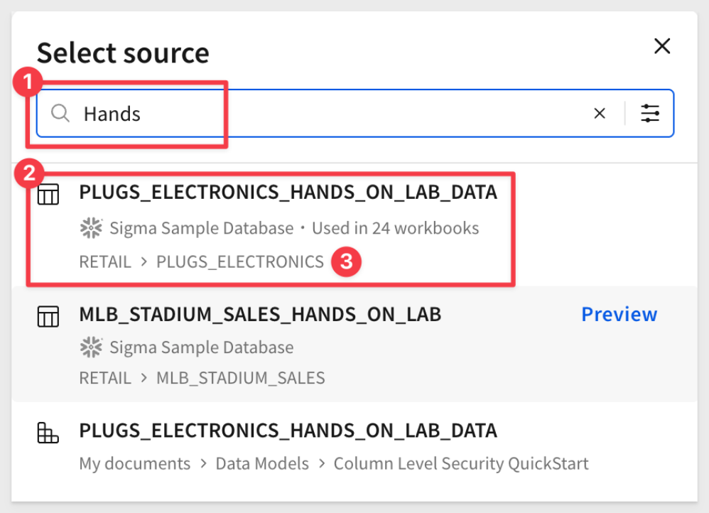
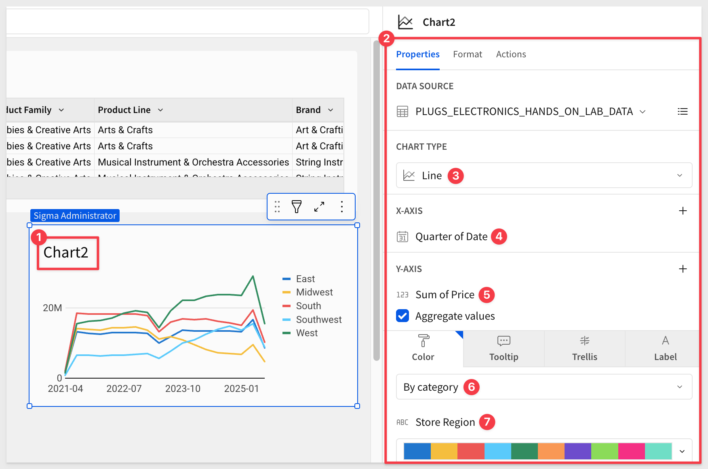
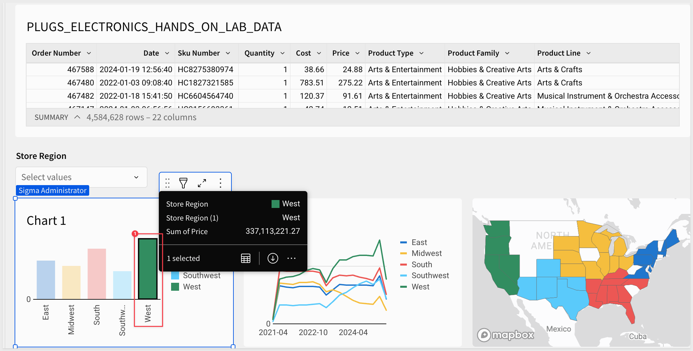
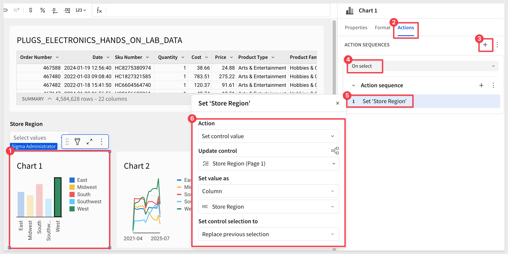
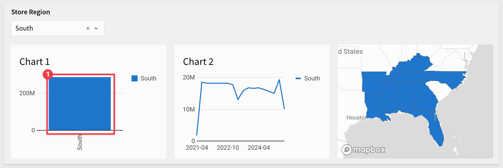
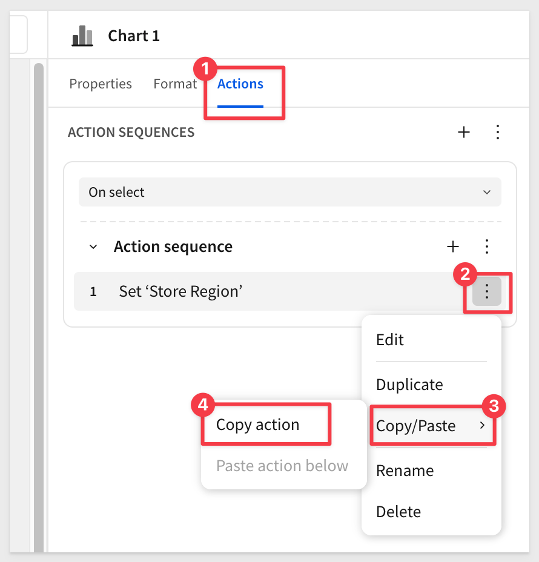
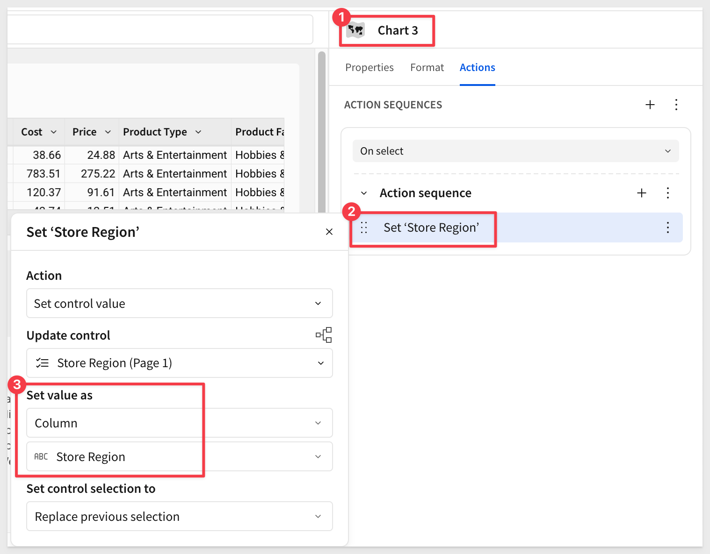
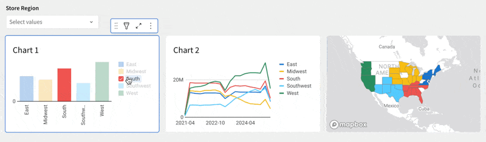
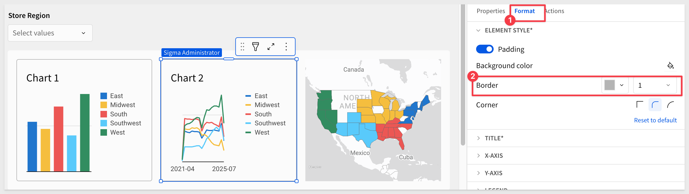
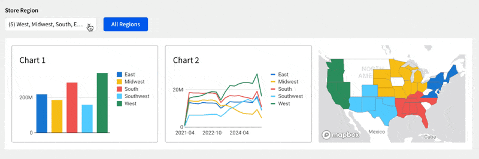

author: pballai
id: data_apps_cross_chart_actions
summary: data_apps_cross_chart_actions
categories: aiapps
environments: web
status: published
feedback link: https://github.com/sigmacomputing/sigmaquickstarts/issues
tags: default
lastUpdated: 2025-08-25

# Cross Chart Actions

## Overview 
Duration: 5 

Cross Chart Actions allow you to click or select data in one visualization and instantly filter other elements on the page. 

This makes dashboards more interactive, supports intuitive drill-downs, and enables business users to explore relationships in the data—without needing to build separate filters.

While this QuickStart focuses on charts, the same techniques can also be applied to other elements.

<aside class="positive">
<strong>IMPORTANT:</strong>  Some screens in Sigma may appear slightly different from those shown in QuickStarts. This is because Sigma continuously adds and enhances functionality. Rest assured, Sigma’s intuitive interface ensures that any differences will not prevent you from successfully completing any QuickStart.
</aside>

For more information on Sigma's product release strategy, see [Sigma product releases](https://help.sigmacomputing.com/docs/sigma-product-releases)

If something doesn’t work as expected, here's how to [contact Sigma support](https://help.sigmacomputing.com/docs/sigma-support)

### Target Audience
The typical audience for this QuickStart includes users of Excel, common Business Intelligence or Reporting tools, and semi-technical users who want to try out or learn Sigma.

### Prerequisites

<ul>
  <li>Any modern browser is acceptable.</li>
  <li>Access to your Sigma environment.</li>
  <li>Some familiarity with Sigma is assumed. Not all steps will be shown, as the basics are assumed to be understood.</li>
 </ul>

<aside class="positive">
<strong>IMPORTANT:</strong>  Sigma recommends using non-production resources when completing QuickStarts.
</aside>

<button>[Sigma Free Trial](https://www.sigmacomputing.com/free-trial/)</button>

<aside class="negative">
<strong>IMPORTANT:</strong>  Some features may carry a "Beta" tag. Beta features are subject to quick, iterative changes. As a result, the latest product version may differ from the contents of this document.
</aside>
 

## Build the Workbook
Duration: 5

Log in to Sigma and create a new `Workbook`.

Rename the workbook `Cross_Chart_Actions_QuickStart`.

Add a new `Table` using the `Sigma Sample Database` and choose `RETAIL` > `PLUGS ELECTRONICS` > `PLUGS_ELECTRONICS_HANDS_ON_LAB_DATA`:

Add a new list control from `Element bar` > `Controls` :

Configure the `Value source` to the table and the `Source column` to `Store Region`:

Configure the `Target` of the control to be the `PLUGS_ELECTRONICS_HANDS_ON_LAB_DATA` table > `Store Region` column:

### Add some charts
Let’s add three simple charts of different types so we can see how this works later.

For `Chart 1`, create a `Child` element from the table, selecting `Chart`, and configure it as shown below.

<aside class="negative"> <strong>NOTE:</strong>  Duplicate the `Store Region` column so that it can be used in both the `X-AXIS` and `By category` configurations. </aside> 

Make a duplicate of `Chart 1` and configure it as shown:

Make a duplicate of `Chart 2` and configure it as shown:

 <aside class="negative"> <strong>NOTE:</strong>  We disabled the legend in the map display using the `Format` menu option for `LEGEND`. </aside>

### Initial test
If we select one `Store Region` using the page control, the table and all three charts automatically update:

That’s good—but if we click on a region within any of the charts, the other charts and the table don’t respond:

This is where Sigma actions come to the rescue.

<!-- END OF SECTION-->

## Configuring Actions
Duration: 5

Actions in Sigma are easy to use yet flexible enough to support advanced functionality. In this demonstration, we’ll use just a small fraction of that power to make page elements respond to each other. This creates an intuitive, interactive UI where users can instantly see how one change affects other information.

### Our first action
Click on `Chart 1` to select it.

From the `Element panel` > `Actions` menu, configure a single action as shown:

Now, when the user clicks a `Store Region` in `Chart 1`, the other charts automatically update:

Clicking the `x` in the `Store Region` control clears the selection:

That workflow is good, but we can make it even clearer for users.

### Copy actions
We need to apply the same action from `Chart 1` to the other charts. Instead of recreating it manually, use the `Copy action` feature:

Then select `Chart 2` and choose `Paste action within`:

Repeat the `copy/paste` for the map.

As actions get more complex, it’s a good idea to verify they’re configured correctly—both in terms of behavior and target elements:

<aside class="positive"> <strong>TIP:</strong>  When reusing actions across multiple charts, copy/paste is faster and reduces the chance of mistakes compared to recreating them manually. This is especially helpful as dashboards grow more complex, ensuring consistency and saving time. </aside>

Now, clicking on any `Store Region` in any chart applies the selection across all charts:

 <aside class="negative"> <strong>NOTE:</strong>  You can also deselect using <kbd>Cmd</kbd>+click to reset the chart. </aside>

Click `Publish`.

<!-- END OF SECTION-->

## Underlying Data
Duration: 5

All charts can display the data driving them with a single click:

This allows users to drill down to the lowest level of granularity whenever they need.

Returning to the chart view is also a single click:

<aside class="positive"> <strong>IMPORTANT:</strong>  Business users don’t need to request raw data separately—Sigma makes it easy to self-serve underlying details directly from the visualization. </aside>

Next, let’s clean up the interface so users know what to do at first glance.

<!-- END OF SECTION-->

## Cleanup
Duration: 5

Since we’re focused on charts, let’s rename the page `Charts` and move the `PLUGS_ELECTRONICS_HANDS_ON_LAB_DATA` table to a new page named `Data`.

Drag the three charts to select them together, then click the `Create` container icon:

Sigma provides extensive formatting features. For example, you may want to keep a light border around the charts:

### Clear filters button
The `Store Region` control can be reset to show all regions by either clicking the `x` (one click) or selecting all regions manually (two clicks). However, this may not be immediately obvious to first-time users.

To make it clearer, add a `Button` from the `Element` bar > `UI` group.

Configure the button’s action to set the `Store Region` control to `All`:

This button also resets the charts if the user has clicked into one of the chart bars:

 <aside class="positive"> <strong>BEST PRACTICE:</strong>  Always consider how users will interpret the UI the first time they see it. By making the interface clear and obvious, you reduce “friction,” drive adoption, and minimize support calls. </aside>

For more information, see [Intro to actions](https://help.sigmacomputing.com/docs/intro-to-actions)

<!-- END OF SECTION-->

## What we've covered
Duration: 5

In this QuickStart, we explored how to use Cross Chart Actions in Sigma to make dashboards more interactive and intuitive. We built a workbook with multiple charts, configured actions so charts respond to each other, and added cleanup elements like containers and a clear filters button to improve usability.

With these techniques, business users can drill into relationships in their data naturally—without relying on separate filters or complex setup.

**Additional Resource Links**

[Blog](https://www.sigmacomputing.com/blog/) 
[Community](https://community.sigmacomputing.com/) 
[Help Center](https://help.sigmacomputing.com/hc/en-us) 
[QuickStarts](https://quickstarts.sigmacomputing.com/) 

Be sure to check out all the latest developments at [Sigma's First Friday Feature page!](https://quickstarts.sigmacomputing.com/firstfridayfeatures/)
 

&emsp;
&emsp;

<!-- END OF WHAT WE COVERED -->
<!-- END OF QUICKSTART -->
