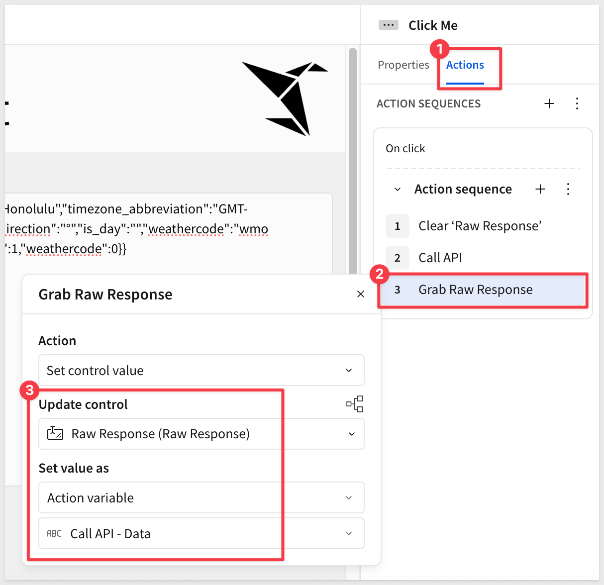
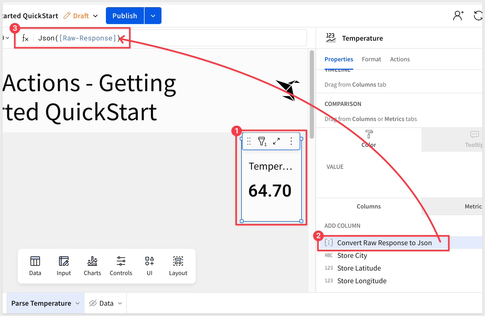
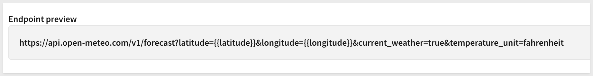
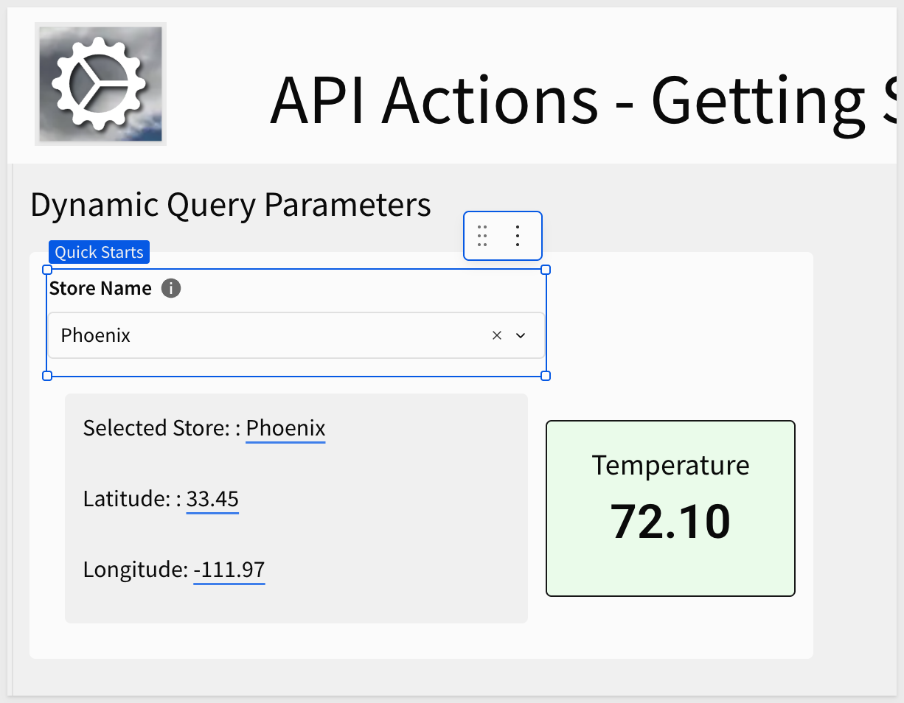

author: pballai
id: dataapps_api_actions_getting_started
summary: dataapps_api_actions_getting_started
categories: aiapps
environments: web
status: hidden
feedback link: https://github.com/sigmacomputing/sigmaquickstarts/issues
tags:
lastUpdated: 2025-11-11

# API Actions - Getting Started

## Overview 
Duration: 5 

This QuickStart introduces Sigma API Actions by connecting to the Open-Meteo Weather API, a free weather data service that requires no authentication.

<aside class="positive">
<strong>IMPORTANT:</strong><br> This feature is undergoing beta testing and may not be available in your Sigma instance. If you are interested in testing it, contact your Sigma account team and request access to API Actions.
</aside>

You'll use a preconfigured Sigma template to select a city from a dropdown list and fetch current weather details in real-time.

Along the way you'll learn how to:
- configure API connectors with both static and dynamic parameters
- bind dropdown controls to drive Action inputs
- parse and map JSON responses for analysis and visualization

<aside class="positive">
<strong>IMPORTANT:</strong><br> Some screens in Sigma may appear slightly different from those shown in QuickStarts. This is because Sigma continuously adds and enhances functionality. Rest assured, Sigma’s intuitive interface ensures that any differences will not prevent you from successfully completing any QuickStart.
</aside>

For more information on Sigma's product release strategy, see [Sigma product releases](https://help.sigmacomputing.com/docs/sigma-product-releases)

If something doesn’t work as expected, here's how to [contact Sigma support](https://help.sigmacomputing.com/docs/sigma-support)

### Target Audience
The typical audience for this QuickStart includes users of Excel, common Business Intelligence or Reporting tools, and semi-technical users who want to try out or learn Sigma.

### Prerequisites

<ul>
  <li>Any modern browser is acceptable.</li>
  <li>Access to your Sigma environment.</li>
  <li>Some familiarity with Sigma is assumed. Not all steps will be shown, as the basics are assumed to be understood.</li>
 </ul>

<aside class="positive">
<strong>IMPORTANT:</strong><br> Sigma recommends using non-production resources when completing QuickStarts.
</aside>

<button>[Sigma Free Trial](https://www.sigmacomputing.com/free-trial/)</button>

<aside class="negative">
<strong>IMPORTANT:</strong><br> Some features may carry a "Beta" tag. Beta features are subject to quick, iterative changes. As a result, the latest product version may differ from the contents of this document.
</aside>
 


## Initial Setup
Duration: 5

### Open-Meteo Weather API Account
While there are services that require credentials, we want to demonstrate using one that requires credentials, as that is a simple first example.

We will use the [Open-Meteo API](https://open-meteo.com/) in this QuickStart.

<aside class="negative">
<strong>About Open-Meteo:</strong><br> Open-Meteo is an open-source weather API and offers free access for non-commercial use. No API key is required when this QuickStart was published.
</aside>

<aside class="positive">
<strong>NOTE:</strong><br> While this QuickStart uses an API that requires no authentication, Sigma fully supports API credentials for services that require authentication (Bearer token, API keys, OAuth, basic auth, etc.). For more information, see <a href="https://help.sigmacomputing.com/docs/configure-api-credentials-and-connectors-in-sigma#grant-access-to-api-credentials-and-connectors">Configure API credentials and connectors in Sigma</a>.
</aside>

### API Connectors
API Connectors in Sigma define the endpoint that will be called by our Sigma workbook actions. Given that, it makes sense to first configure the endpoint we want to call and then we can configure an action to request data from it.

Log into Sigma as an administrator and navigate to `Administration` > `API connectors` and click `Create connector`.

We will configure a simple example to request weather data with the location and temperature format hard-coded.

**Name:** The name of the connector as it appears to users in a workbook.<br>
Use this name:
```code
Current Temp - Hard Coded
```

**Description:** [optional] A custom description that helps users identify the connector and verify its contents.

**Base URL:** Select an HTTP method and the URL for the request.<br>
Use this URL:
```code
https://api.open-meteo.com/v1/forecast?latitude=20.7702&longitude=-156.2682&timezone=auto&temperature_unit=fahrenheit
```

**Headers:** [optional] Set a header for the request.
None required.

**Params:** [optional] Set query and path parameters for the request. To set path parameters, you must include /:param in the Base URL. You can then select whether to populate the path param with Static or Dynamic values.<br>
None required.

**Body:** [optional] Enter a request body.<br>
None required.

Farther down we can see a preview of the endpoint and credentials settings (No authentication is required for this API):


**Credentials:** [optional] Select a credential from your configured API credentials in Sigma.<br>
None required.

For more information, see [Add a new API credential to Sigma](https://help.sigmacomputing.com/docs/configure-api-credentials-and-connectors-in-sigma#grant-access-to-api-credentials-and-connectors)

Since no authentication is required, we can just copy and paste the preview URL into another tool like [Postman](https://quickstarts.sigmacomputing.com/guide/sigma_api_with_postman/index.html?index=..%2F..index#0) to see if we get the expected response.

For example, a quick test in Postman to check the response:


Click `Save`.

### Sigma template - PENDING!
To make this process easier, we have created a [template](https://help.sigmacomputing.com/docs/create-and-edit-workbook-templates) that is preconfigured.

Return to the Sigma homepage and click `Templates`. Click to select the `API Actions Getting Started QuickStart` template:

<!--  -->

This creates a new (unsaved) workbook we can use and the first thing we want to do is save it as `API Actions Getting Started QuickStart`

<!--  -->


<!-- END OF SECTION-->

## GET a Response
Duration: 5

With the Sigma `API Actions Getting Started QuickStart` workbook we can just click on the `Click me` button to see the raw response from Open-Metro:


Selecting the button, we can see how the `Call API` action is configured to call our `Current Temp - Hard Coded` API connector:


The action above this one clears the `Raw Response` text area control out first and the control after it, places the response data into the text area control:




<!-- END OF SECTION-->

## Parse a Response
Duration: 5

Now that we see how to get data, we need to format the data so that we can reliably read values from it.

Since the data is raw, we can easily convert it to JSON using a formula. Let's use a KPI chart to show the current temperature from the raw response.

On the `Parse Temperature` page we have the same `Click Me` button and a pre-configured KPI chart. The button actions are the same as before.

If we look at the KPI properties panel, we see that it is bound to the `Cities` table on the `Data` page.

Before this will work, we need to convert the raw response to JSON by adding a column to the KPI using the [Json](https://help.sigmacomputing.com/docs/json) conversion function:
```code
Json([Raw-Response])
```



Once converted, we can parse the temperature from the JSON
```code
Number([Raw-Response].current_weather.temperature)
```


Clicking the button displays the current temperature for our hard-coded location.


<!-- END OF SECTION-->


## Dynamic Query Parameters
Duration: 5

In the last section we used the City table. This table on the `Data` page populates a dropdown control, allowing users to select which city's current temperature to retrieve. 

Return to `Administration` > `API Connectors` and add a new one.

**Name:** Current Temp - City Select

**Base URL:** Select an HTTP method and the URL for the request.<br>
Use this URL:
```code
https://api.open-meteo.com/v1/forecast?latitude={{latitude}}&longitude={{longitude}}&current_weather=true&temperature_unit=fahrenheit
```

<aside class="positive">
<strong>IMPORTANT:</strong><br> In the URL we have parameterized latitude and longitude so that they can be dynamically populated at runtime, when a user selects a city.
</aside>

**Params:** Add four query parameters:
```code
KEY                 TYPE          VALUE
latitude            Dynamic
longitude           Dynamic
current_weather     Static        true
temperature_unit    Static        fahrenheit
```


Also check the endpont preview (at the bottom of the page) carefully. Small mistakes will cause API call failures:




### Testing
Return to the `API Actions - Getting Started QuickStart` workbook and the `City Temp` page. 

The three text controls are showing `Multiple values`. We left if this way to make it clear that the data coming from the `Data` page > `Cities` table which currently showing all rows.

The `Store Name` input select control above these values is not yet set to a single store. Therefore, `Multiple values`. We don't need to correct that, we just wanted it to be clear where the data is coming from.

The temperature KPI is also parsing the data from the previous request, which still has response data on the `Raw Response` page. 

Select a store location to see it work:



With the `Store Name` control selected, we can see the `Call API` action is configured to send latitude and logitude from columns in the `Cities` table:


Really simple and crazy powerful too!

### Data types
Anyone who has worked with APIs will know that data type match matters. No different here; we needed to convert the `Latitude` and `Longitude` columns in the `Cities` table from number to [Text](https://help.sigmacomputing.com/docs/text) using a built-in Sigma function.


If we did not do this, Open-Meteo's API would send an error in the response and often API errors are not all that helpful. 


<!-- END OF SECTION-->

## What we've covered
Duration: 5

In this QuickStart, we explored the fundamentals of Sigma API Actions by building a simple weather data application. You learned how to:

- Configure API connectors with both static and dynamic parameters
- Create actions that call external APIs from Sigma workbooks
- Parse JSON responses using Sigma's built-in functions
- Build interactive experiences using controls to drive API inputs
- Handle data type conversions for API compatibility

These techniques form the foundation for integrating any REST API into your Sigma workbooks, enabling you to combine cloud data warehouse analytics with real-time external data sources. 

**Additional Resource Links**

[Blog](https://www.sigmacomputing.com/blog/)<br>
[Community](https://community.sigmacomputing.com/)<br>
[Help Center](https://help.sigmacomputing.com/hc/en-us)<br>
[QuickStarts](https://quickstarts.sigmacomputing.com/)<br>

Be sure to check out all the latest developments at [Sigma's First Friday Feature page!](https://quickstarts.sigmacomputing.com/firstfridayfeatures/)
<br>

[](https://twitter.com/sigmacomputing)&emsp;
[](https://www.linkedin.com/company/sigmacomputing)&emsp;
[](https://www.facebook.com/sigmacomputing)


<!-- END OF WHAT WE COVERED -->
<!-- END OF QUICKSTART -->
