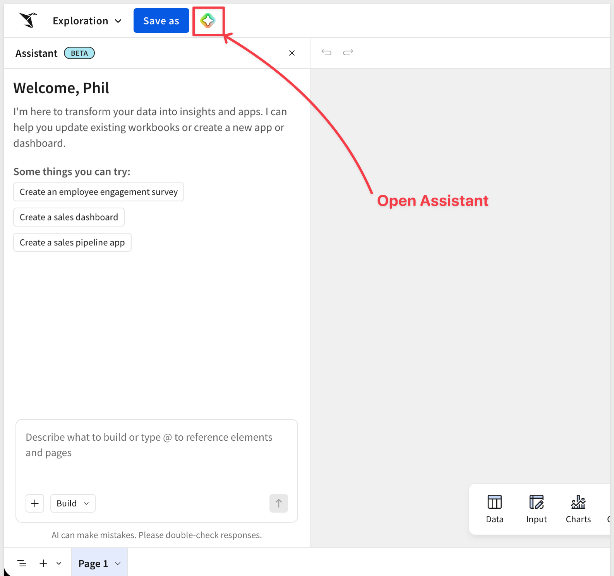
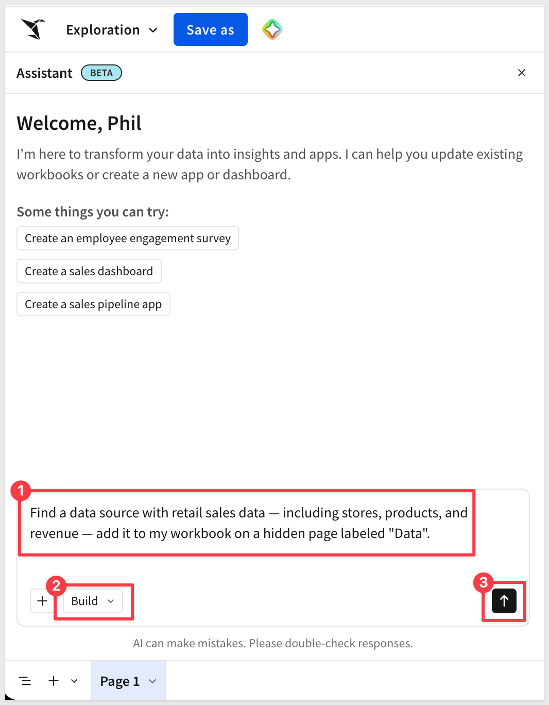
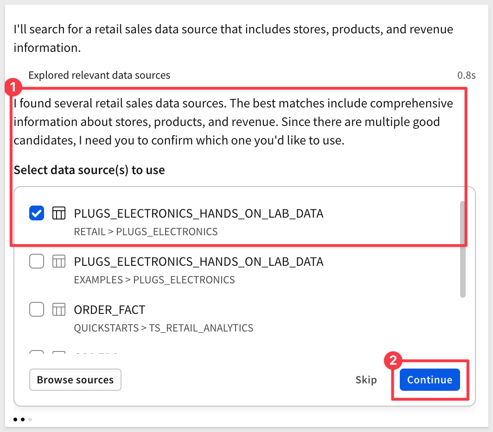
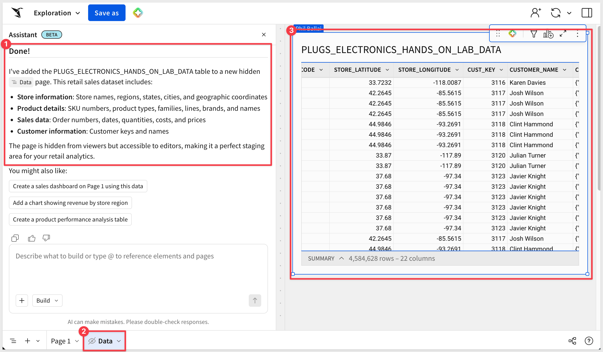
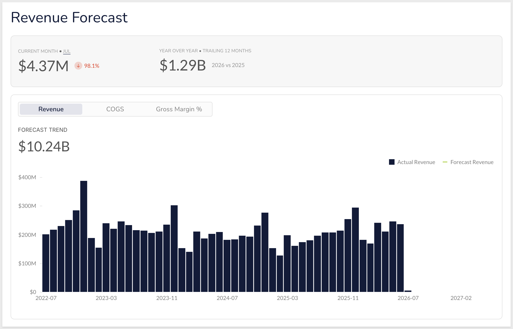
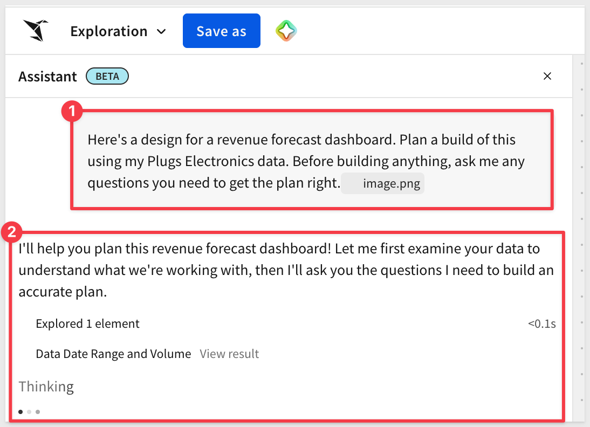
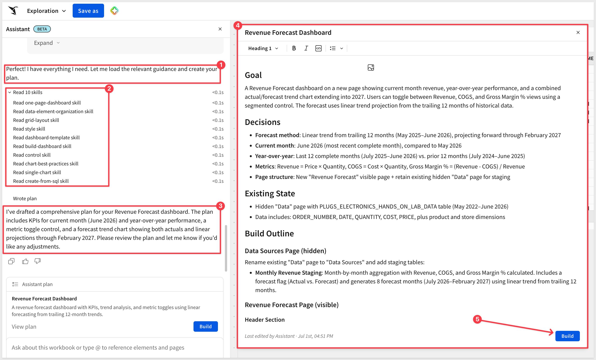

author: pballai
id: aiapps_build_with_assistant
summary: aiapps_build_with_assistant
categories: aiapps
environments: web
status: Published
feedback link: https://github.com/sigmacomputing/sigmaquickstarts/issues
tags: default
lastUpdated: 2026-12-31

# Build Dashboards and Apps with Sigma Assistant

## Overview
Duration: 5

Describe what you want in plain language and watch Sigma build it — a sales dashboard, a survey app, a formatted input table — all live on your data and ready to publish, not a throwaway mockup.

The [Fundamentals 01](https://quickstarts.sigmacomputing.com/guide/fundamentals_1_getting_around_v3/index.html) QuickStart introduces Assistant for analysis — asking a question and opening the answer in a workbook. Here we go further: using Assistant's `Plan` and `Build` modes to design and construct dashboards and AI apps from scratch, then refine them conversationally.

Along the way you'll learn how to:
- Use Assistant's `Plan` and `Build` modes, and switch between them
- Start from a governed data model and let semantic search find the right source
- Plan a build from a design image, and have Assistant question the plan before building
- Build a revenue forecast — actuals, a projection, KPIs, and COGS/margin views
- Refine the result conversationally, adding controls and adjusting the forecast

<aside class="negative">
<strong>PREMIUM FEATURE:</strong><br> When editing a workbook, Assistant is only available to customers who meet certain conditions. For more information, contact your Account Executive.
</aside>

<aside class="positive">
<strong>ABOUT THE SAMPLE DATABASE:</strong><br> This QuickStart uses the sample data Sigma provides to all customers free of charge — sales data from our fictitious company Plugs Electronics. Administrators may disable this in `Administration` > `General Settings` > `Features`. If the sample data is not visible in your instance, check with your administrator.
</aside>

<aside class="positive">
<strong>IMPORTANT:</strong><br> Some screens in Sigma may appear slightly different from those shown in QuickStarts. Sigma continuously adds and enhances functionality, but these differences won't prevent you from completing the steps.
</aside>

For more information on Sigma's product release strategy, see [Sigma product releases](https://help.sigmacomputing.com/docs/sigma-product-releases)

If something isn't working as expected, here's how to [contact Sigma support](https://help.sigmacomputing.com/docs/sigma-support)

### Target Audience
Builders — analysts and developers who create workbooks, dashboards, and apps — and anyone who wants to move from an idea to a working Sigma asset quickly. Some familiarity with Sigma is assumed; if you're brand new, start with [Fundamentals 01](https://quickstarts.sigmacomputing.com/guide/fundamentals_1_getting_around_v3/index.html)

### Prerequisites

<ul>
  <li>A computer with a current browser.</li>
  <li>Access to a Sigma environment where Assistant is enabled for building. See the premium feature note above.</li>
  <li>An AI provider configured by your administrator. See <a href="https://help.sigmacomputing.com/docs/configure-ai-features-for-your-organization#set-up-an-ai-provider">Set up an AI provider</a>.</li>
  <li>The <strong>Use Assistant</strong> and <strong>Create, edit, and publish workbooks</strong> permissions on your account type.</li>
 </ul>

<aside class="positive">
<strong>IMPORTANT:</strong><br> Sigma recommends using non-production resources when completing QuickStarts.
</aside>

<button>[Sigma Free Trial](https://www.sigmacomputing.com/free-trial/)</button>


<!-- END OF OVERVIEW -->

## How Assistant builds
Duration: 4

When you're editing a workbook draft, Assistant works in two modes beyond the analysis you saw in Fundamentals 01:

- **Plan mode** — Assistant gathers context, clarifies your goals, and proposes a structured approach: recommended pages, elements, layout, and the data sources needed. Nothing is built until you approve. You can refine the plan in the prompt bar or open the plan editor with `View plan`.
- **Build mode** — Assistant creates and modifies workbook content: tables, charts, KPIs, controls, filters, tabbed containers, modals, input tables, and the actions that make an app interactive.

Assistant opens in `Build` mode by default. Use the mode picker in the prompt bar to switch, and Assistant will sometimes suggest a switch itself — for example, offering `Plan` mode when a request is ambiguous. Your conversation context carries across both modes.

### Two starting points

Where you begin depends on what you already have:

- **Adjusting an existing dashboard** — select the page or element you want to change, open Assistant from the element toolbar, and describe the change. Assistant edits in place, so you can refine what's already built without starting over.
- **Building something new** — start in `Plan` mode. Iterate on a detailed plan before anything is built, then switch to `Build`. Planning first isn't just tidy — it's cheaper. Every build request spends AI credits; agreeing on scope and structure up front means Assistant builds the right thing once, instead of building, discarding, and rebuilding.

The rest of this QuickStart walks both paths — planning and building something new, and editing something that already exists.

### Where to find Assistant

While editing a workbook draft, open Assistant from any of these entry points, which can vary based on your Sigma configuration:

- The empty-state prompt on a new, blank page
- The `Assistant panel` icon in the workbook header
- The `⌘ + K` (macOS) or `Ctrl + K` (Windows) keyboard shortcut
- The `Ask or edit with prompt` icon on a selected element's toolbar



### Attach context to a prompt

Assistant produces better results when you point it at the right information. In the prompt bar, use `Add` or type `@` to attach:

- **A data source** — a table, data model, semantic view, or existing element for Assistant to build from or analyze
- **A workbook object** — a page or element for Assistant to answer questions about, build on, or modify
- **An image** — a visual reference Assistant can add to the workbook or rebuild natively in Sigma

<aside class="positive">
<strong>GOVERNANCE:</strong><br> Assistant inherits your permissions. It can only use data you're permitted to access and can only perform tasks you're permitted to perform. If your account type can't create input tables, for example, Assistant won't build a workflow that depends on one.
</aside>


<!-- END OF SECTION-->

## Start from a data model
Duration: 6

Best practice dictates building on a data model rather than a raw warehouse table. Assistant can read from tables, data models, and semantic views, but the quality of what it builds depends on the source you give it. A data model pre-defines business-friendly column names, descriptions, and metrics, so Assistant interprets your prompts accurately instead of guessing at raw column names. Authoring the model is a separate step your data team does up front — if you're new to it, see [Fundamentals 10: Data Modeling](https://quickstarts.sigmacomputing.com/guide/fundamentals_10_data_modeling/index.html)

Here's the part that saves you time: you don't have to go hunting for the right source. Assistant's semantic search finds it from a plain description of the data you need. `Open a new workbook`, `open Assistant`, and — instead of naming a table — describe what you're after.

We will use `Build` mode so that Assistant can also add the table to our workbook.

```copy-code
Find a data source with retail sales data — including stores, products, and revenue — add it to my workbook on a hidden page labeled "Data".
```



Assistant searches the data you're permitted to access, matches your description to the `PLUGS_ELECTRONICS_HANDS_ON_LAB_DATA` table in `Sigma Sample Database` > `RETAIL`, and prompts for us to select the correct one — no schema knowledge required. 



Choose the `RETAIL` > `PLUGS_ELECTRONICS` table and click `Continue`.

Assistant lets us know when it is done with that task:



<aside class="positive">
<strong>NOTE:</strong><br> In production, point Assistant at a governed data model for the best results. This QuickStart uses the Plugs Electronics sample table so anyone can follow along — the workflow is identical either way.
</aside>

<aside class="positive">
<strong>TIP:</strong><br> Assistant can also shape data in the workbook for you — joining, unioning, transposing, and adding calculated columns. If you find yourself preparing the same data repeatedly, promote it into a reusable data model so every future build starts from the same trusted definitions.
</aside>

<aside class="positive">
<strong>WHY IT MATTERS:</strong><br> A well-labeled model is the difference between Assistant guessing what <code>QTY_NET</code> means and knowing it's "Net Units Sold." A few minutes of modeling up front makes every prompt that follows more accurate — and gives everyone who builds on it the same trusted definitions.
</aside>


<!-- END OF SECTION-->

## Plan, then build the revenue forecast
Duration: 10

Now the payoff — building a real dashboard. We'll build a revenue forecast: actual revenue over time, a projection for the months ahead, and the KPIs and metric views an executive would expect. Rather than firing a single prompt and hoping, we'll plan first, let Assistant ask us questions, then build. Planning up front is also where you save the most AI credits.

### Attach a design

You don't have to describe a layout from scratch — hand Assistant a picture of what you want. Attach a reference image of the dashboard with `Add` > `Attach image` (you can also right-click the image and select `Copy Image` and paste it in), switch the mode picker to `Plan`, and prompt:

```copy-code
Here's a design for a revenue forecast dashboard. Plan a build of this using my Plugs Electronics data. Before building anything, ask me any questions you need to get the plan right.
```



<aside class="positive">
<strong>NOTE:</strong><br> You can attach up to eight images per prompt (JPEG, PNG, GIF, or WebP, up to 3.75 MB each). Reference images are used only for context; an image you ask Assistant to add to the page is saved as part of the workbook.
</aside>

### Review and question the plan

In `Plan` mode, Assistant proposes a structure — pages, KPIs, the actual-versus-forecast chart, and the Revenue, COGS, and Gross Margin views — without building anything yet. 

Because you asked it to, it pauses and asks clarifying questions before committing. In our run, it asked about the forecast method, how to calculate each metric, what the KPI comparisons mean, and where to build:

```code
Key questions
1. Forecast methodology — the design extends the forecast into 2027. How should I generate it?
   - Simple moving average (3- or 6-month)?
   - Linear trend from historical data?
   - A specific growth-rate assumption (e.g., 5% month over month)?
   - Or a simple statistical forecast method?
2. Revenue & COGS calculation — should I use:
   - Revenue = PRICE × QUANTITY?
   - COGS = COST × QUANTITY?
   - Gross Margin % = (Revenue - COGS) / Revenue?
3. Current-month KPI — what does the "98.1%" represent (vs. prior month, or same month last year?), and should "current month" track today's date or stay fixed?
4. Year over year — compare the last complete 12 months against the prior 12 months?
5. Dashboard placement — build on a new "Revenue Forecast" page, or replace Page 1?
```



<aside class="positive">
<strong>WHY IT MATTERS:</strong><br> Letting Assistant ask questions before it builds is how you keep AI on the rails — and how you keep costs down. You settle scope and structure while it's cheap (a conversation), so Assistant spends its credits building the right thing once instead of building something you have to unwind and rebuild.
</aside>

Answer in plain language to settle every open point:

```copy-code
Use a linear trend from the trailing 12 months for the forecast. Yes: Revenue = Price × Quantity, COGS = Cost × Quantity, Gross Margin % = (Revenue − COGS) / Revenue. For the current-month KPI, use the most recent complete month and show the change versus the prior month. For year over year, compare the last complete 12 months to the prior 12. Build this on a new page called Revenue Forecast.
```

Before it writes anything, Assistant loads a set of pre-configured **Skills** that Sigma provides — best-practice playbooks for one-page dashboard layout, grid layout, styling, chart selection, controls, and more. These skills are why Assistant follows Sigma's design conventions instead of improvising.

<aside class="positive">
<strong>PRE-CONFIGURED SKILLS:</strong><br> Skills are reusable instructions that guide how Assistant works. Sigma ships a set of built-in skills for building dashboards — encoding layout, styling, and charting best practices — so the output reflects how an expert would build in Sigma, not a generic AI guess.
</aside>

Assistant then writes a structured plan you can read and edit: a `Goal`, the key `Decisions` it locked in (forecast method, current-month and year-over-year definitions, metric formulas, page structure), the `Existing State` it detected in your workbook, and a `Build Outline` of the pages and elements it will create — including a hidden staging page where it aggregates monthly revenue and generates the forecast rows.



We could keep iterating in the prompt bar, or click `Build` to kick off the dashboard creation.

### Build it

When the plan looks right, click `Build` or prompt Assistant to start:

```copy-code
The plan looks good — build it.
```

Assistant executes the plan end to end. First it builds a hidden staging page that aggregates monthly revenue and generates the forecast rows. Then it lays out the visible `Revenue Forecast` page:

- Two KPIs — current-month revenue and trailing-12-month year over year
- A segmented control to switch between Revenue, COGS, and Gross Margin %
- The actual-versus-forecast trend chart

The result is a working forecast on live data, with every element fully editable.

<!--  -->

<aside class="positive">
<strong>YOU STAY IN CONTROL:</strong><br> Assistant builds real, editable Sigma elements — not a black box. Open anything it created to see the formulas and logic behind it, and validate the output before you share it.
</aside>


<!-- END OF SECTION-->

## Refine it
Duration: 6

A forecast is never one-and-done — assumptions change, and stakeholders always want one more cut. This is where Assistant works as a copilot on what you've already built. Select an element, open `Ask or edit with prompt` from its toolbar, and describe the change.

Adjust the forecast horizon on the chart:

```copy-code
Extend the forecast to twelve months.
```

Add a scenario control so viewers can flex the assumptions:

```copy-code
Add a control to switch between an optimistic and a downturn scenario, and adjust the forecast line based on the selection.
```

Because you attach the element as context, Assistant scopes each change to it — you stay in control of the canvas while it handles the mechanical steps. Undo, refine, or take over manually at any point.

<!--  -->

<aside class="positive">
<strong>WHY IT MATTERS:</strong><br> Conversational editing removes the "how do I do that again?" friction from building. You describe the outcome instead of hunting through menus — and because it's the same governed workbook, every refinement is versioned and ready to reshare.
</aside>


<!-- END OF SECTION-->

## More than a prototype
Duration: 3

Any AI tool can generate a good-looking mockup. What matters is what happens after the demo — and this is where building in Sigma is different.

Prototyping is useful, but it's a far cry from a production application. Sigma is the governed runtime around AI: audit logs, permissions, cost controls, collaboration, and version management all come with the platform — regardless of which AI provider you've configured. What Assistant builds lands inside that runtime from the first prompt, so it's ready to publish and share, not something you have to re-platform later.

There's a second difference from a typical off-the-shelf SaaS tool. Off-the-shelf applications cover roughly 80% of what most teams need. The other 20% — the approval routing that matches your vendor hierarchy, the exception view that maps to your close process, the aging buckets that reflect your actual payment terms — is where companies differ from each other. Sigma builds the foundation and leaves that 20% open, so what you build reflects how your team actually works rather than how a software vendor assumed it would.


<!-- END OF SECTION-->

## What we've covered
Duration: 3

You used Sigma Assistant to build a revenue forecast end to end — starting from a governed data model, planning the dashboard from a design image, having Assistant question the plan before building, and refining the result conversationally.

The reusable pattern isn't any one prompt — it's the workflow. Start from a governed data model so Assistant reasons over trusted definitions. Plan before you build — let Assistant ask questions and settle the structure while it's cheap, then spend credits building the right thing once. Then refine conversationally while you stay in control of the result. The same workflow applies whether you're building a forecast, a sales dashboard, or a full data entry app.

What makes this more than a party trick is where it all lands. Everything Assistant builds lives inside Sigma's governed runtime — permissions, audit logs, cost controls, versioning, and collaboration — on live data, ready to publish. And because Sigma leaves the last 20% open, what you build reflects how your team actually works. That's the difference between a prototype and an application your business can run on.

**Additional Resource Links**

[Use AI to build dashboards and apps](https://help.sigmacomputing.com/docs/use-ai-to-build-dashboards-and-apps)<br>
[Get started with AI in Sigma](https://help.sigmacomputing.com/docs/getting-started-with-ai)<br>
[Blog](https://www.sigmacomputing.com/blog/)<br>
[Community](https://community.sigmacomputing.com/)<br>
[Help Center](https://help.sigmacomputing.com/hc/en-us)<br>
[QuickStarts](https://quickstarts.sigmacomputing.com/)<br>

Be sure to check out all the latest developments at [Sigma's First Friday Feature page!](https://quickstarts.sigmacomputing.com/firstfridayfeatures/)
<br>

[](https://twitter.com/sigmacomputing)&emsp;
[](https://www.linkedin.com/company/sigmacomputing)&emsp;
[](https://www.facebook.com/sigmacomputing)


<!-- END OF WHAT WE COVERED -->
<!-- END OF QUICKSTART -->
