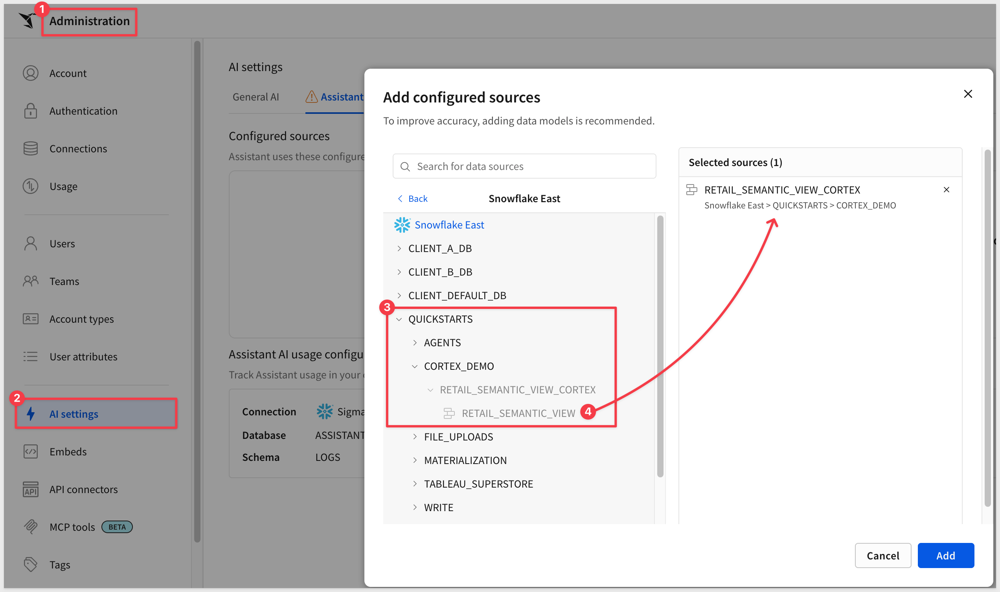
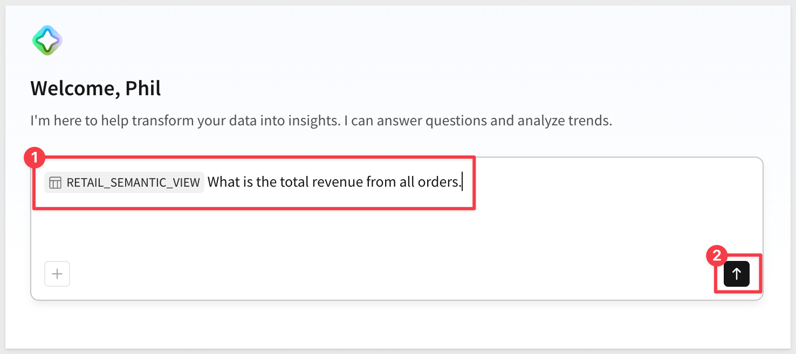
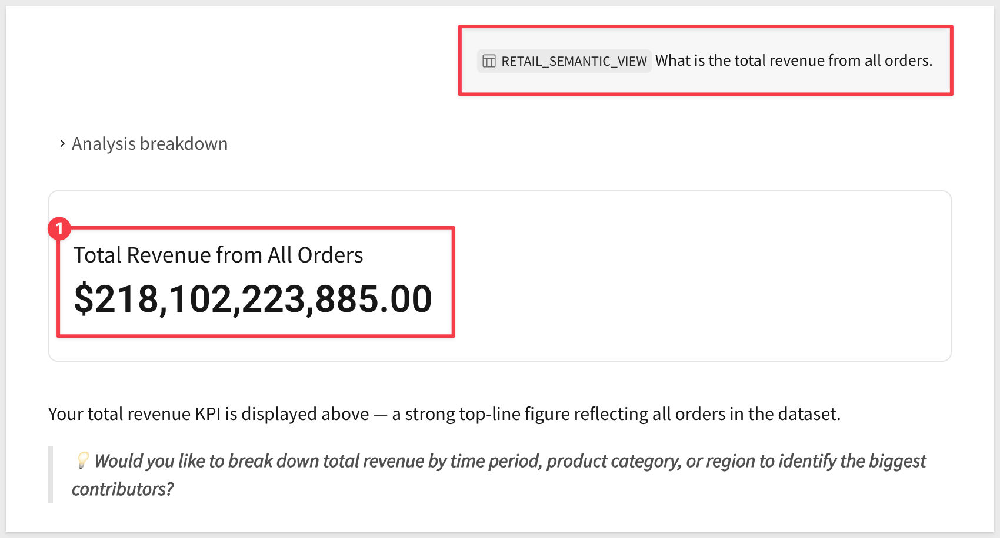
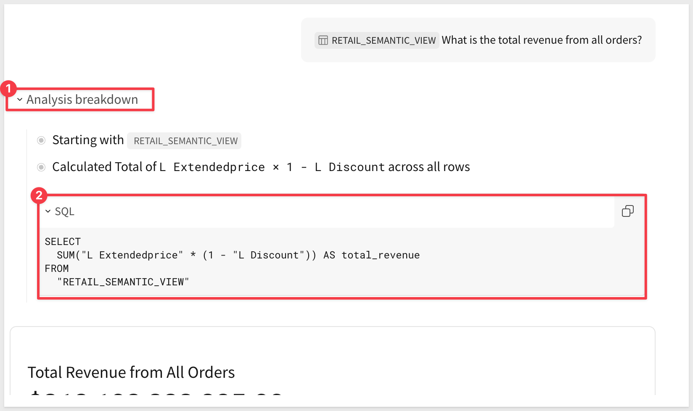
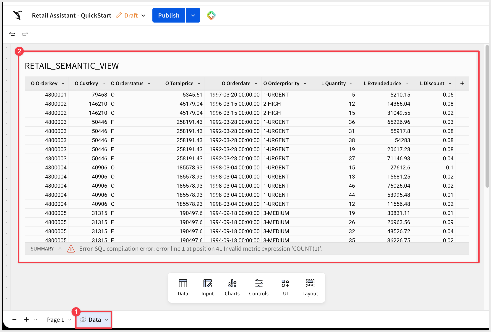
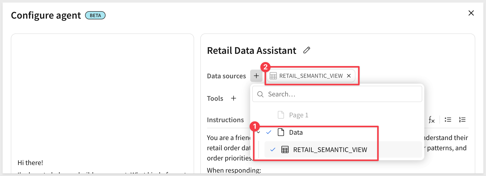
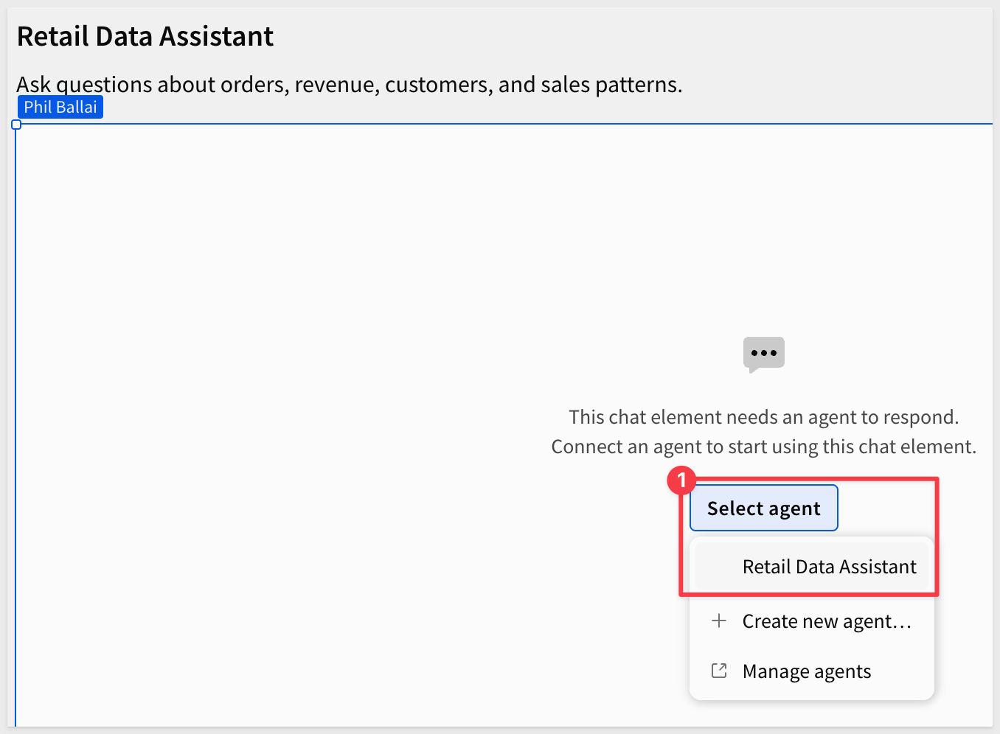
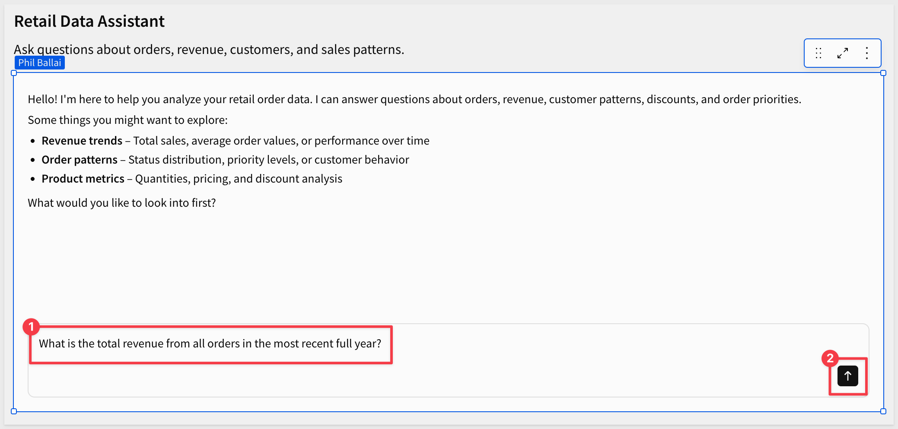
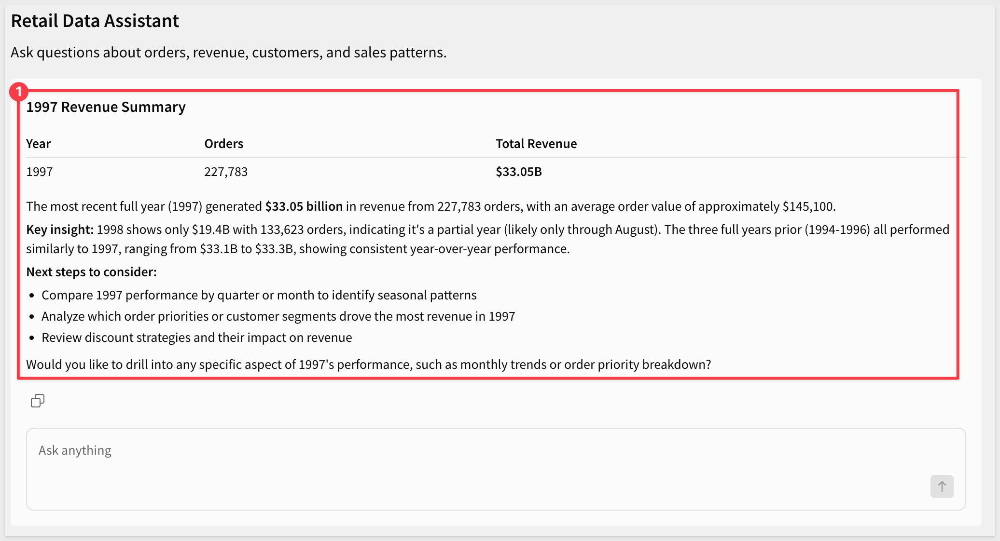

author: pballai
id: aiapps_chat_element
summary: Build a conversational AI app in Sigma using a chat element, a Sigma agent, and a Snowflake Cortex Agent — with optional write-back actions to an input table.
categories: aiapps
environments: web
status: Published
feedback link: https://github.com/sigmacomputing/sigmaquickstarts/issues
tags: default
lastUpdated: 2026-06-23

# Build Conversational AI Apps with Chat Elements and Snowflake Cortex

## Overview
Duration: 5

This QuickStart demonstrates how to build conversational AI applications using Sigma's chat element and Sigma agents, powered by Snowflake Cortex for advanced analytics.

You'll learn how to create an intelligent retail data assistant that can answer natural language questions, perform complex analysis, and take actions based on user interactions.

**A key aspect of AI applications is controlling data access.** Semantic views act as a governance layer, ensuring your AI agents only access approved, curated data—not your entire data warehouse.

But access control is only part of the picture. Sigma is the governed runtime around AI: audit logs, permissions, cost controls, collaboration, and version management all come with the platform — regardless of which AI provider you've configured.

<aside class="positive">
<strong>MONITORING AI USAGE:</strong><br> AI calls have real cost, and Sigma includes a built-in dashboard that lets administrators track token usage by agent, by user, and by product surface — making it easy to spot heavy users or runaway costs before they become a problem. 
</aside>

For more information, see [AI usage dashboard](https://help.sigmacomputing.com/docs/ai-usage)

### Use Case: Retail Data Assistant
In this QuickStart, we'll build an agent that helps users analyze retail order data from Snowflake's TPCH_SF1 sample dataset. The agent will:
- Answer questions about orders, customers, and revenue
- Call a Snowflake Cortex Agent for accurate, semantic-view-grounded analytical queries
- Optionally log insights to an input table

<aside class="positive">
<strong>IMPORTANT:</strong><br> Some screens in Sigma may appear slightly different from those shown in QuickStarts. This is because Sigma continuously adds and enhances functionality. Rest assured, Sigma’s intuitive interface ensures that any differences will not prevent you from successfully completing any QuickStart.
</aside>

For more information on Sigma's product release strategy, see [Sigma product releases](https://help.sigmacomputing.com/docs/sigma-product-releases)

If something doesn’t work as expected, here's how to [contact Sigma support](https://help.sigmacomputing.com/docs/sigma-support)

### Target Audience
This QuickStart is designed for:
- Sigma workbook creators who want to add conversational AI interfaces
- Data analysts building AI-powered applications
- Technical users interested in Snowflake Cortex integration

### Prerequisites

<ul>
  <li>Any modern browser is acceptable.</li>
  <li>Access to a Sigma environment with an AI provider configured. If you don't have one set up yet, the <a href="https://quickstarts.sigmacomputing.com/guide/fundamentals_1_getting_around_v3/index.html#4">Fundamentals 1: Overview</a> QuickStart walks through it.</li>
  <li>Admin access to a Snowflake account where you can create databases, schemas, and grant role privileges.</li>
  <li>Some familiarity with Sigma is assumed. Not all basic steps will be shown.</li>
</ul>

<aside class="positive">
<strong>IMPORTANT:</strong><br> Sigma recommends using non-production resources when completing QuickStarts.
</aside>

<button>[Sigma Free Trial](https://www.sigmacomputing.com/free-trial/)</button> <button>[Snowflake Free Trial](https://signup.snowflake.com/)</button>

<aside class="negative">
<strong>IMPORTANT:</strong><br> Some features may carry a "Beta" tag. Beta features are subject to quick, iterative changes. As a result, the latest product version may differ from the contents of this document.
</aside>


<!-- END OF SECTION-->

## Understanding Sigma agents and chat elements
Duration: 5

Before we start building, it's important to understand the relationship between **Sigma agents** and **chat elements**.

### What is a Sigma agent?
A Sigma agent is the "brain" of your conversational AI application. It:
- Processes user questions and decides what to do
- Follows the instructions you give it
- Reasons over the data sources you've added to it (workbook tables, data models)
- Calls tools when needed — actions in the workbook, warehouse agents in your data platform, warehouse search services, or MCP servers

Think of the agent as the orchestrator that decides how to answer each question.

### What is a chat element?
A chat element is the user interface component that displays on a workbook page. It:
- Provides a conversational interface for users
- Connects to a single Sigma agent
- Displays responses (text, tables, and visualizations)
- Surfaces approval prompts when the agent wants to run an action

Think of the chat element as the visible UI, while the Sigma agent is the invisible brain behind it.

### Key distinction
The chat element and the Sigma agent are two separate things, not interchangeable:
- One Sigma agent can power multiple chat elements
- The chat element is just the UI; the Sigma agent is the logic

### Architecture overview

In this QuickStart, the complete flow works like this:

1. **User** types a question in the chat element
2. **Chat element** sends the question to the Sigma agent
3. **Sigma agent** decides which tool to use based on its instructions
4. **Snowflake Cortex Agent** (added as a warehouse tool) runs the analytical query against the semantic view
5. **Results** flow back through the chain to the chat element, where any configured action tool may run
6. **Chat element** displays the response to the user

<aside class="positive">
<strong>KEY TERMINOLOGY:</strong><br>
<ul>
<li><strong>Cortex Analyst</strong> — Snowflake tool that turns natural language into SQL using a semantic view</li>
<li><strong>Cortex Agent</strong> — Snowflake orchestrator that uses Cortex Analyst and other Snowflake tools</li>
<li><strong>Sigma agent</strong> — Workbook-scoped agent in Sigma. You configure it with instructions and guidelines, a curated set of data sources, and the tools it's allowed to use. It takes user questions in chat and can call a Cortex Agent to handle the deep analytical work</li>
<li><strong>Chat element</strong> — UI in the Sigma workbook that connects to a Sigma agent</li>
</ul>
</aside>


<!-- END OF SECTION-->

## Snowflake Cortex Setup
Duration: 15

To enable advanced analytical capabilities, we'll configure Snowflake Cortex. This section keeps the setup minimal—just what's needed to get Cortex working.

### Create a Semantic View

A semantic view consists of two components:

1. **SQL View (Data Layer)** - The actual data source that Cortex will query
2. **Semantic View Object (Metadata Layer)** - Business definitions and AI-generated descriptions that help Cortex understand the data

We'll create both using Snowflake's UI-based workflow.

<aside class="positive">
<strong>WHY SEMANTIC VIEWS MATTER:</strong><br>
Semantic views provide several critical benefits.

<strong>Data Governance & Security:</strong>
<ul>
<li><strong>Restrict AI access</strong> — The semantic view acts as a controlled gateway, exposing only approved data to AI agents</li>
<li><strong>Prevent broad access</strong> — AI queries only what's in the semantic view, not your entire data warehouse</li>
<li><strong>Audit trail</strong> — Track what data AI agents can access in one centralized definition</li>
</ul>

<strong>Improved AI Accuracy:</strong>
<ul>
<li><strong>Business-friendly definitions</strong> — Map technical column names (O_TOTALPRICE) to business terms (Revenue)</li>
<li><strong>Semantic relationships</strong> — Define how tables relate, helping AI generate correct JOINs</li>
<li><strong>Consistent logic</strong> — Standardize metrics calculations across all AI queries</li>
</ul>

<strong>Performance & Optimization:</strong>
<ul>
<li><strong>Optimized queries</strong> — Pre-join frequently queried tables for faster AI responses</li>
<li><strong>Reduced query complexity</strong> — AI works with simplified, curated data structures</li>
</ul>

Semantic views are one layer of the governed runtime Sigma provides around AI. Audit logs, permissions, cost controls, collaboration, and version management come from the Sigma platform itself — the semantic view is the part that controls what data the agent can reach inside Snowflake.
</aside>

### Step 1: Create the SQL View (Data Layer)

In Snowflake, navigate to `Projects` and create a new SQL worksheet.

Run the following SQL to create the **base data view**:

```copy-code
USE ROLE ACCOUNTADMIN;
USE WAREHOUSE COMPUTE_WH;

CREATE DATABASE IF NOT EXISTS QUICKSTARTS;
CREATE SCHEMA IF NOT EXISTS QUICKSTARTS.CORTEX_DEMO;

CREATE OR REPLACE VIEW QUICKSTARTS.CORTEX_DEMO.RETAIL_DATA_VIEW AS
SELECT
    o.O_ORDERKEY,
    o.O_CUSTKEY,
    o.O_ORDERSTATUS,
    o.O_TOTALPRICE,
    o.O_ORDERDATE,
    o.O_ORDERPRIORITY,
    l.L_QUANTITY,
    l.L_EXTENDEDPRICE,
    l.L_DISCOUNT
FROM SNOWFLAKE_SAMPLE_DATA.TPCH_SF1.ORDERS o
JOIN SNOWFLAKE_SAMPLE_DATA.TPCH_SF1.LINEITEM l
    ON o.O_ORDERKEY = l.L_ORDERKEY;
```


<aside class="positive">
<strong>NOTE:</strong><br> This SQL view joins the ORDERS and LINEITEM tables, creating a pre-joined dataset. This is the <strong>data layer</strong> that Cortex will query. However, Cortex doesn't yet know what these columns mean in business terms—that's what the semantic model (next step) provides.
</aside>

### Step 2: Create Semantic View in Cortex Analyst

Now we'll create a Semantic View using the Snowflake UI. This will add business context and metadata to our SQL view.

In Snowflake, navigate to `AI & ML` > `AI Studio` > `Cortex Analyst` and click `Try`.


On the `Semantic views` tab, select the `QUICKSTARTS.CORTEX_DEMO` database and then click `Create with Autopilot`. This opens the `Semantic View Autopilot` wizard.


**Wizard step 1: Provide context (Optional)**

The wizard can seed the semantic view, but we'll skip this for the QuickStart — click `Skip`.

<!--  -->

**Wizard step 2: Name your semantic view**

First, change the permission to `ACCOUNTADMIN` using the drop select list in the upper right corner. 

Set the name to:
```copy-code
RETAIL_SEMANTIC_VIEW
```


Click `Next`.

**Wizard step 3: Select tables**

Navigate to `QUICKSTARTS` > `CORTEX_DEMO` and check the box next to `RETAIL_DATA_VIEW` (under "1 View").


Click `Next`.

**Wizard step 4: Select columns**

Select all columns:

- O_CUSTKEY
- O_ORDERSTATUS
- O_TOTALPRICE
- O_ORDERDATE
- O_ORDERPRIORITY
- L_QUANTITY
- L_EXTENDEDPRICE
- L_DISCOUNT
- O_ORDERKEY

Keep both checkboxes selected:
- **Add sample values to the semantic view** (helps Cortex give better answers)
- **Add descriptions to the semantic view** (AI will generate descriptions)


Click `Create`.

While Snowflake works, you'll see a warning: **This process may take up to 10 minutes. Please don't close the window.**

Once the processing is done, we can use the `Playground` and ask Cortex to explain it:
```copy-code
Explain the dataset
```


If all is configured correctly, Cortex will respond with a brief explanation:


You've now created the complete semantic view. The semantic view references your SQL view (<code>RETAIL_DATA_VIEW</code>) as its base table, and Cortex can now understand your data structure with business-friendly terms.

<aside class="negative">
<strong>HEADS UP:</strong><br> If you browse to <code>RETAIL_SEMANTIC_VIEW</code> in Sigma's connection browser, you may see a warning like <em>"Invalid metric expression 'COUNT(1)'"</em>. This is cosmetic — Snowflake semantic views don't allow ad-hoc aggregations, so Sigma's row-count check fails. The semantic view is still fully usable via the Cortex Agent (which we set up next), and the chat element flow won't be affected.
</aside>

### Step 3: Create Cortex Agent

Now we'll create a Cortex Agent — the Snowflake component that uses the semantic view to answer analytical questions.

<aside class="positive">
<strong>IMPORTANT:</strong><br> The Cortex Agent runs entirely in Snowflake. It has its own instructions and uses the semantic view as its tool. Later, the Sigma agent will call this Cortex Agent as a warehouse tool — passing it questions and receiving back the analytical results.
</aside>

Navigate to `AI & ML` > `Agents` (in the left sidebar under AI & ML).

Click the blue button to `Create agent`:


For `Database and schema` we will restrict Cortex to only `QUICKSTARTS.CORTEX_DEMO`.

Set the `Agent object name` to:
```copy-code
RETAIL_ASSISTANT
```

We can override the `Display name` to be more specific if we want. Use:
```copy-code
QuickStart Cortex Demo Retail Assistant
```


Click `Create agent`.

Open the `Tools` tab. 

Snowflake organizes Cortex Agent tools into a few categories: `Web search`, `Query structured data`, `Search documents and unstructured data`, and `Custom tools`. We only need the structured-data path for this QuickStart.

Under `Query structured data`, click `+ Add semantic view`:


Configure the tool:
- **Semantic view:** Browse and select `QUICKSTARTS.CORTEX_DEMO.RETAIL_SEMANTIC_VIEW`
- **View:** `RETAIL_SEMANTIC_VIEW`

**Tool name:** 
```copy-code
retail_data_analysis
```

**Description:** 
```copy-code
Use this tool for all questions about orders, customers, revenue, and sales patterns
```


Click `Add`.

On the `Orchestration` tab, enter these instructions:

```copy-code
You are a helpful retail data analyst.

Always use the retail_data_analysis tool for any questions about:
- Orders, order status, order dates
- Customers and customer behavior
- Revenue, sales, prices
- Product quantities and trends

Provide clear, concise answers. When showing data, include relevant context.
```


Click `Save` to save the agent, but we have a few more permission steps to complete.

### Step 4: Grant Permissions

Grant access to your Sigma service role so Sigma can use the Cortex Agent and access the underlying data.

<aside class="positive">
<strong>FINDING YOUR SIGMA ROLE:</strong><br> The placeholder <code>SIGMA_SERVICE_ROLE</code> used below is just an example — the actual role name depends on how your Snowflake connection in Sigma was configured. 

To find it, log into Sigma as an administrator, navigate to <code>Administration</code> > <code>Connections</code>, open your Snowflake connection, and look at the role configured there. Use that role name everywhere this QuickStart shows <code>SIGMA_SERVICE_ROLE</code>.
</aside>

<aside class="negative">
<strong>IMPORTANT:</strong><br> Several grants are needed for Sigma's role to use the Cortex Agent end-to-end: <br>
(1) the <code>SNOWFLAKE.CORTEX_USER</code> database role<br>
(2) USAGE on the database and schema<br>
(3) SELECT on the semantic view (Step 4a)<br>
(4) USAGE on the Cortex Agent itself (Step 4b)<br>
(5) Share access on the semantic view from Cortex Analyst (Step 4c). <br>

Missing any of these will cause "doesn't exist or isn't authorized" errors.
</aside>

#### Step 4a: Grant SQL View Access (Using SQL)

The underlying SQL view must be accessible to your Sigma role. Run this in a Snowflake SQL worksheet:

```copy-code
USE ROLE ACCOUNTADMIN;

-- Grant Cortex database role
GRANT DATABASE ROLE SNOWFLAKE.CORTEX_USER TO ROLE SIGMA_SERVICE_ROLE;

-- Grant database usage
GRANT USAGE ON DATABASE QUICKSTARTS TO ROLE SIGMA_SERVICE_ROLE;

-- Grant schema usage
GRANT USAGE ON SCHEMA QUICKSTARTS.CORTEX_DEMO TO ROLE SIGMA_SERVICE_ROLE;

-- Grant SELECT on semantic view
GRANT SELECT ON VIEW QUICKSTARTS.CORTEX_DEMO.RETAIL_SEMANTIC_VIEW TO ROLE SIGMA_SERVICE_ROLE;
```

Replace `SIGMA_SERVICE_ROLE` with the actual role used in your Sigma connection (see the note at the top of Step 4 for how to find it).

#### Step 4b: Grant Cortex Agent Access (Using UI)

Now grant access to the Cortex Agent itself. Return to the `RETAIL_ASSISTANT` agent and click `Edit`.

1. Click the `Access` tab
2. Click `Add role`
3. Type in your Sigma role (e.g., `SIGMA_SERVICE_ROLE` — or whatever name your connection uses) and select `USAGE`

<aside class="positive">
<strong>NOTE:</strong><br> If you see a warning message after adding the role, related to missing access, click "Grant all".

This will grant "Full access to all tools and data sources" the RETAIL_ASSISTANT wants to use.
</aside>


4. Click `Save` or confirm the addition

#### Step 4c: Grant Semantic View Access (Using UI)

1. Navigate to `AI & ML` > `AI Studio` > `Cortex Analyst`
2. Select the `QUICKSTARTS.CORTEX_DEMO` database
3. Click on `RETAIL_SEMANTIC_VIEW` Semantic view
4. Click the `Share` or `Access` button
5. Type in your Sigma role (e.g., `SIGMA_SERVICE_ROLE`), as the role is not always listed in the dropdown
6. Click `Save`


Your Cortex setup is complete! You've created:
- SQL View (data layer) - `RETAIL_DATA_VIEW`
- Semantic View with AI-generated descriptions - `RETAIL_SEMANTIC_VIEW`
- Cortex Agent with orchestration instructions - `RETAIL_ASSISTANT`
- Proper role permissions for Sigma integration


<!-- END OF SECTION-->

## Configure Sigma for Cortex Integration
Duration: 10

Now that Cortex is configured in Snowflake, we need to enable it in Sigma.

### Enable Cortex in Sigma Admin

Log into Sigma as an `Administrator`.

Navigate to `Administration` > `AI settings`.

#### Configure AI Provider

Under `AI provider` section:

1. Select `Data warehouse hosted model (recommended)`
2. `Connection`: Choose your Snowflake connection (e.g., `Snowflake`)
3. Click `Save`


### Add the semantic view as a Sigma Assistant source

Sigma Assistant needs explicit authorization for any data source it queries — even when Snowflake already permits access through a Cortex Agent. Adding the semantic view here is Sigma's governance layer at work: the administrator decides exactly which sources Assistant can reach, independent of whatever the underlying warehouse role allows.

Navigate to `Administration` > `AI` > `Assistant`.

Click `Add source`, drill into your Snowflake connection > `QUICKSTARTS` > `CORTEX_DEMO`, and select `RETAIL_SEMANTIC_VIEW`. Click `Add`.



<aside class="positive">
<strong>WHY THE SEMANTIC VIEW (NOT THE SQL VIEW):</strong><br> Sigma Assistant works best with <code>RETAIL_SEMANTIC_VIEW</code> rather than the underlying SQL view <code>RETAIL_DATA_VIEW</code>. The semantic view carries the business definitions, AI-generated descriptions, and relationships Cortex Analyst added — exactly what Assistant needs to interpret natural-language questions accurately.
</aside>

Your Sigma environment is now ready to use Snowflake Cortex. The `RETAIL_ASSISTANT` Cortex Agent is discoverable in Sigma's data catalog after connection sync, and the semantic view is authorized for Sigma Assistant. In the next sections we'll build a Sigma agent in a workbook that calls this Cortex Agent as a warehouse tool.

<aside class="negative">
<strong>TROUBLESHOOTING:</strong><br> If the <code>RETAIL_ASSISTANT</code> Cortex Agent doesn't show up in Sigma's data catalog or you can't select it later when building a Sigma agent:
<br><br>
<strong>1. Sync the connection:</strong> <a href="https://help.sigmacomputing.com/docs/troubleshoot-your-connection#syncing-your-data-and-connection-indexing" target="_blank">Sync your Snowflake connection</a> to fetch the latest configuration details, including the database and schema that contain the Cortex Agent. Then refresh the page.
<br><br>
<strong>2. Verify permissions in Snowflake:</strong>
<pre><code>SHOW GRANTS ON AGENT QUICKSTARTS.CORTEX_DEMO.RETAIL_ASSISTANT;</code></pre>
Your Sigma connection's role should appear with USAGE privilege.
<br><br>
<strong>3. Check the connection role matches:</strong> In <strong>Administration</strong> > <strong>Connections</strong>, verify the role used by your Snowflake connection matches the role that has USAGE on the Cortex Agent.
</aside>


<!-- END OF SECTION-->

## Test Cortex Agent with Sigma Assistant
Duration: 5

Before building a full workbook, let's verify the Cortex Agent is working correctly by asking it a simple question through Sigma Assistant.

### Access Sigma Assistant

From your Sigma home page, open `Sigma Assistant`. In the data source selector, choose `RETAIL_SEMANTIC_VIEW` (the semantic view you authorized for Sigma Assistant in the previous section).

<aside class="positive">
<strong>NOTE:</strong><br> If you don't see <code>RETAIL_SEMANTIC_VIEW</code> as an option, refer to the troubleshooting steps in the previous section to sync your connection.
</aside>


### Ask a Test Question

In the Sigma Assistant text box, type:

```copy-code
What is the total revenue from all orders?
```



Press `Enter` to send.

### Review the Response

The agent will:
1. Process your natural-language question
2. Route through Cortex Analyst to query the semantic view
3. Return a response with the calculated total

Sigma Assistant should return a specific revenue total along with context (the metric it used, currency, etc.) drawn from the semantic view's Facts:



### View the Generated SQL

Sigma shows the SQL Cortex Analyst generated to answer your question. Click the SQL indicator below the response to expand it.



Reviewing the SQL helps you verify Cortex translated the question correctly and lets you copy the query into Snowflake to validate the result.

<aside class="positive">
<strong>KEY INSIGHT:</strong><br> This is the value of pairing a semantic view with Cortex Analyst. Cortex turned a plain-language question into a SQL query against the right table, aggregated the revenue Fact, and returned both the answer and the SQL that produced it — without you ever writing SQL by hand.
</aside>

<aside class="positive">
<strong>SUCCESS!</strong><br> If you got a revenue total back, the Cortex Agent is working end-to-end. Now we're ready to wrap a workbook and chat element around it for a richer interactive experience.
</aside>


<!-- END OF SECTION-->

## Create Workbook
Duration: 5

Now that we've verified the Cortex Agent works through Sigma Assistant, let's wrap it in a workbook with a chat element for a richer interactive experience.

### Create New Workbook

In Sigma, click the `Create New` button and select `Workbook`.

<aside class="positive">
<strong>NOTE:</strong><br> This workbook will serve as the container for our chat element. Users will interact with the chat element in this published workbook.
</aside>

### Save and name the Workbook

In the top left click `Save as` and name the workbook :
```copy-code
Retail Assistant - QuickStart
```

### Add the data on a Data page

To give the workbook a place to inspect the source data alongside the chat element, add `RETAIL_DATA_VIEW` to a dedicated Data page. This keeps the source table out of the way of the main page where the chat element will live.

- Click `+` next to the existing page tab and add a new page. Set the page type to `Data` and name the page `Data`.
- On the new `Data` page, add a `Table` from the `Data` group on the element bar. Select your Snowflake connection.

- Navigate to `QUICKSTARTS` > `CORTEX_DEMO` and add `RETAIL_DATA_VIEW`.
- Hide the `Data` page:



Switch back to the main page — that's where the chat element will live.

### Add Title (Optional)

From the element bar at the bottom, you can add a `Text` element from the `UI` group, with a title like:

```copy-code
Retail Data Assistant
Ask questions about orders, revenue, customers, and sales patterns.
```

This helps users understand what the chat element can do.


<!-- END OF SECTION-->

## Create the Sigma agent
Duration: 15

Before adding the chat element, we need to create a Sigma agent that will power it.

### Open Agents Panel

In the workbook, look at the right side panel. You'll see tabs: `Settings`, `Format`, `Actions`, and `Agents`.

Click on the `Agents` tab.


You'll see "No agents have been created yet."

### Create New Agent

Click the `+` button to create a new agent.

<aside class="positive">
<strong>NOTE:</strong><br> Agents are created at the workbook level and can be reused across multiple chat elements. This allows you to create multiple specialized agents for different use cases.
</aside>

The agent configuration panel opens with several options including `Data sources`, `Tools`, and `Instructions`.

Double-click on the `Agent 1` name and change it to:
```copy-code
Retail Data Assistant
```

### Configure Instructions

In the instructions editor, copy/paste the following to guide the agent's behavior:

```copy-code
You are a friendly retail data analyst assistant. Your role is to help users understand their retail order data by answering questions about orders, revenue, customer patterns, and order priorities.

When responding:
- Be concise and actionable
- Provide specific numbers and trends
- Highlight key insights that could drive business decisions

For analytical questions about orders, customers, revenue, or sales patterns, use the RETAIL_ASSISTANT Cortex Agent — it has direct access to the semantic view in Snowflake.

Always maintain a helpful, professional tone.
```

<aside class="positive">
<strong>TIP:</strong><br> The Instructions tab provides a rich text editor with formatting options. You can use bold, italics, bullets, and other formatting to make instructions clear for the agent, but also easier for editing later.
</aside>


### Add Data Sources

Click on the `+` next to `Data sources` and select the `RETAIL_ASSISTANT` warehouse agent:



The `RETAIL_ASSISTANT` Cortex Agent is available because you configured it in Sigma's AI settings earlier.

<aside class="positive">
<strong>NOTE:</strong><br> The Cortex Agent accesses data through the Snowflake semantic view (RETAIL_SEMANTIC_VIEW), which provides governed, curated access to the ORDERS and LINEITEM tables. This ensures the AI only queries approved data with proper business context.
</aside>

<aside class="positive">
<strong>ADDITIONAL OPTION:</strong><br> The Data tab can also be configured to add workbook tables as data sources. This allows the agent to query both warehouse data (via Cortex) and workbook data. For this QuickStart, we're keeping it simple by using only the Cortex Agent.
</aside>

<aside class="negative">
<strong>TROUBLESHOOTING:</strong><br> If the agent doesn't respond to queries, verify:
<ul>
<li>AI settings are configured in Sigma Admin (Data warehouse hosted model)</li>
<li>RETAIL_ASSISTANT is selectable as a warehouse agent in the data catalog</li>
<li>Your connection has been synced (see <a href="https://help.sigmacomputing.com/docs/troubleshoot-your-connection#syncing-your-data-and-connection-indexing">connection sync docs</a>)</li>
</ul>
</aside>

### Save the Agent

Click `Save` to save your Sigma agent configuration.

The `Retail Data Assistant` agent now appears in the Agents panel and is ready to use!


<!-- END OF SECTION-->

## Add the chat element to the workbook
Duration: 5

Now that we've created the agent, let's add a chat element to the workbook and connect it to our agent.

### Add the chat element to the canvas

From the element bar at the bottom of your workbook, click `UI` > `Chat`.

A chat element appears on your canvas.

### Select the agent

Click on the chat element to select it.

In the left panel (or configuration area), you'll see an option to select which agent powers this chat element.

Select: `Retail Data Assistant` (the agent we just created)

<aside class="positive">
<strong>NOTE:</strong><br> You can add multiple chat elements to a workbook, each powered by different agents. This allows you to create specialized assistants for different tasks on different pages.
</aside>



The chat element is now connected to your agent and ready to use!

### Test the chat element

Let's test the chat element in the workbook to verify it's working correctly.

Click `Publish` in the top right corner to publish the workbook.

In the published view, use the chat element to ask:

```copy-code
What is the total revenue from all orders in the most recent full year?
```



You should see:
1. **"Thinking"** status appears as the agent processes the query
2. The agent routes to the RETAIL_ASSISTANT Cortex Agent
3. Cortex analyzes the semantic view and generates appropriate SQL
4. A detailed response with:
   - Identification of the most recent complete year (yes, the dates are old!)
   - Total revenue figure
   - Additional context



If you received a comprehensive response with revenue data, your chat element is properly connected to the Cortex Agent and can query the semantic view successfully!


<!-- END OF SECTION-->

## Add Action Workflow - Log Insights (Optional)
Duration: 15

Let's add the ability for the agent to write insights to an input table. This demonstrates how agents can take actions, not just answer questions.

<aside class="positive">
<strong>NOTE:</strong><br> This section is optional. You can skip it if you want to keep the QuickStart focused on basic chat functionality.
</aside>

### Create Admin Page with Input Table

<aside class="negative">
<strong>WRITE ACCESS REQUIRED:</strong><br> Make sure write access is enabled on your Snowflake connection. The optional input-table action workflow later in this QuickStart writes rows back to Snowflake and won't work without it. 
</aside>

For setup details, see [Set up write access](https://help.sigmacomputing.com/docs/set-up-write-access)

From the element bar, click `Input` > `Empty`.

Select your Snowflake connection.

Configure the input table columns:

1. **Insight** (Text) - The insight to log from Cortex
2. **CustomerID** (Number) - The customerID we are asking about
3. **Last updated at** (Sigma provided column) - When the insight was logged

Rename the table to:
```copy-code
Customer Insights
```

Delete the pre-populated rows so the table is empty.


### Set Input Table Permissions

Click on the `Customer Insights` input table.

Set the permission to: `Only editable in published version`

Click `Publish`.

<aside class="positive">
<strong>NOTE:</strong><br> This permission setting allows the agent to insert rows when the workbook is published, while preventing edits in draft mode.
</aside>


### Configure Agent Actions

Click any blank area of the workbook to deselect any elements. 

In the right panel, click the `Agents` tab.

Use the `3-dot` menu to edit the `Retail Data Assistant` agent.

In the `Configure agent` modal, click on the `+` next to `Tools` and select `Action`:


### Create Insert Row Action

Configure the action:

**Step type:** Run an action<br>
**Action:** Insert row<br>
**Into:** Customer Insights<br>
**With values:**<br>
- **Insight** > **Agent input** > **Insight** (the agent will generate this)<br>
- **CustomerID** > **Agent input** > **Customer_id** (the agent will provide the customer number)


<aside class="positive">
<strong>KEY CONCEPT:</strong><br> "Agent input" tells the agent it must provide these values dynamically based on the conversation. The input names help the agent understand what each value represents.
</aside>

<aside class="negative">
<strong>IMPORTANT:</strong><br> Actions allow agents to modify data. Always define workflows in the instructions that require user confirmation before executing write operations.
</aside>

### Update Agent Instructions

<aside class="positive">
<strong>PROMPT ENGINEERING:</strong><br> Instructions are an important part of agent configuration. This is where you define workflows, personality, and when to use actions. The instructions should include:
<ul>
<li>Clear workflows with step-by-step guidance</li>
<li>Example interactions showing expected behavior</li>
<li>When and how to use available actions/tools</li>
</ul>
Focus your time here rather than tinkering with tool names and descriptions.
</aside>

Click on the `Instructions` tab and replace the entire instruction content with (the formatting will not matter but adjust for readability if preferred):
```copy-code
You are a friendly retail data analyst assistant helping users analyze TPCH retail order data.

## Insight Logging Workflow

When users ask you to analyze a specific customer (e.g., "analyze customer 3451"), follow this workflow:

1. Analyze the customer's data using the RETAIL_ASSISTANT Cortex Agent
2. Provide the analysis to the user
3. Offer to log the insight by saying: "Would you like me to save this insight to the Customer Insights table?"
4. If the user says yes, confirm what you'll write:
   - "I'll log: [brief insight summary]"
   - "Customer ID: [number]"
   - "Should I proceed?"
5. Only after user confirms, use the "Insert row into Customer Insights" tool

## Example Interaction

User: "Analyze customer 3451"
You: [Provide analysis] "This customer has spent $28.8M over 6.5 years. Would you like me to save this insight?"
User: "Yes please"
You: "I'll log: 'High-value customer: $28.8M over 6.5 years, $182K avg order' with Customer ID: 3451. Proceed?"
User: "Yes"
You: [Use insert tool with insight_description and customer_id]

Always be concise and actionable. Ask for explicit confirmation before writing data.
```

Click `Save` and `Publish`

### Test the action workflow

Switch the workbook to published view.

**Step 1 — Ask for an analysis.** Return to the chat element and ask:
```copy-code
Analyze customer 3451
```

The agent will:
- Query the RETAIL_ASSISTANT Cortex Agent
- Provide analysis (revenue, order patterns, etc.)
- Offer to save the insight: "Would you like me to save this insight to the Customer Insights table?"


**Step 2 — Confirm you want to save** (good manners never hurt!):
```copy-code
Yes please
```

The agent will:
- Summarize what it will write
- Show the customer ID
- Ask for final confirmation: "Should I proceed?"

**Step 3 — Final confirmation:**
```copy-code
Yes
```

The agent executes the "Insert row into 'Customer Insights'" action, providing:
- `insight_description`: The generated insight text
- `customer_id`: 3451

You'll see a new row with:
- **Insight**: The description the agent generated
- **CustomerID**: 3451
- **Last updated at**: Current timestamp

You can still click `Cancel` to back out of the insert, or `Save` to commit it. We didn't instruct the agent to commit automatically:


<aside class="positive">
<strong>WHAT'S POSSIBLE:</strong><br> Your agent can now take actions based on conversations, not just answer questions. Think about the possibilities: logging customer insights, flagging records for review, updating forecasts, triggering notifications, or routing approvals—all through natural conversation. Any action available in Sigma can become part of a conversational workflow.
</aside>


<!-- END OF SECTION-->

## What We've Covered
Duration: 5

In this QuickStart, you learned how to:

### Core concepts
- **Understand the architecture** — the Sigma agent is the brain, the chat element is the UI
- **Configure Snowflake Cortex** — set up the data view, semantic view, and Cortex Agent
- **Integrate with Sigma** — configure the AI provider and authorize the semantic view
- **Build a chat element** — add a conversational interface to a workbook, powered by a Sigma agent

### Advanced capabilities
- **Call a warehouse agent** — the Sigma agent uses the Cortex Agent for analytical work, grounded in the semantic view
- **Take actions** — the Sigma agent can write to an input table when the user approves
- **Maintain context** — follow-up questions build on the conversation history naturally

### Key takeaways

**Sigma agents orchestrate, partner tools execute:**
- The Sigma agent decides which tool to use based on its instructions
- Cortex Agents (and other warehouse agents) do the deep data work
- Together, they keep the conversational entry point in Sigma and the heavy analytics in the data platform

**Semantic views make Cortex accurate:**
- Business definitions map technical columns to terms the agent understands
- Pre-defined Facts let Cortex aggregate correctly without ad-hoc SQL
- The result: reliable answers grounded in governed data

**Chat elements bring conversational AI to the workbook:**
- A familiar chat interface for business users
- No SQL or data modeling required by the reader
- Natural-language questions, structured responses, optional approval flows for writes

### Next steps

Explore more AI capabilities in Sigma:
- [Build Sigma agents](https://help.sigmacomputing.com/docs/build-agents)
- [Use warehouse agents with Sigma](https://help.sigmacomputing.com/docs/use-warehouse-agents-sigma)
- [Custom Functions documentation](https://help.sigmacomputing.com/docs/custom-functions)
- [Model Context Protocol (MCP)](https://help.sigmacomputing.com/docs/model-context-protocol-mcp)
- [Action Sequences guide](https://help.sigmacomputing.com/docs/action-sequences)

For another use case that pairs a Sigma agent with unstructured text data, see [Unlocking Insights from Unstructured Text with a Sigma Agent](https://quickstarts.sigmacomputing.com/guide/aiapps_gong_call_analysis/index.html)

Learn more about Snowflake Cortex:
- [Cortex Analyst best practices](https://docs.snowflake.com/en/user-guide/snowflake-cortex/cortex-analyst)
- [Semantic model documentation](https://docs.snowflake.com/en/user-guide/semantic-model)

**Additional Resource Links**

[Blog](https://www.sigmacomputing.com/blog/)<br>
[Community](https://community.sigmacomputing.com/)<br>
[Help Center](https://help.sigmacomputing.com/hc/en-us)<br>
[QuickStarts](https://quickstarts.sigmacomputing.com/)<br>

Be sure to check out all the latest developments at [Sigma's First Friday Feature page!](https://quickstarts.sigmacomputing.com/firstfridayfeatures/)
<br>

[](https://twitter.com/sigmacomputing)&emsp;
[](https://www.linkedin.com/company/sigmacomputing)&emsp;
[](https://www.facebook.com/sigmacomputing)


<!-- END OF WHAT WE COVERED -->
<!-- END OF QUICKSTART -->
