author: pballai
id: aiapps_chat_element
summary: aiapps_chat_element
categories: aiapps
environments: web
status: Hidden
feedback link: https://github.com/sigmacomputing/sigmaquickstarts/issues
tags: 
lastUpdated: 2026-06-11

# Build Conversational AI Apps with Chat Elements and Snowflake Cortex

## Overview
Duration: 5

<aside class="negative">
<strong>PRIVATE BETA:</strong><br> This QuickStart is for Private Beta customers evaluating Sigma's Chat Element and Custom Agents.

**Important notes:**
- Functionality may not match the current state of Sigma as customer feedback is incorporated
- UI differences are expected and should not be reported as bugs to Sigma support
- Direct all questions to your Sigma account team
</aside>

This QuickStart demonstrates how to build conversational AI applications using Sigma's Chat Element and Custom Agents, powered by Snowflake Cortex for advanced analytics.

You'll learn how to create an intelligent retail data assistant that can answer natural language questions, perform complex analysis, and take actions based on user interactions.

**A key aspect of AI applications is controlling data access.** Semantic views act as a governance layer, ensuring your AI agents only access approved, curated data—not your entire data warehouse. 

### Use Case: Retail Data Assistant
In this QuickStart, we'll build an agent that helps users analyze retail order data from Snowflake's TPCH_SF1 sample dataset. The agent will:
- Answer questions about orders, customers, and revenue
- Automatically choose between native Text2SQL (fast) and Cortex (accurate)
- Optionally log insights to an input table

<aside class="positive">
<strong>IMPORTANT:</strong><br> Some screens in Sigma may appear slightly different from those shown in QuickStarts. This is because Sigma continuously adds and enhances functionality. Rest assured, Sigma’s intuitive interface ensures that any differences will not prevent you from successfully completing any QuickStart.
</aside>

For more information on Sigma's product release strategy, see [Sigma product releases](https://help.sigmacomputing.com/docs/sigma-product-releases)

If something doesn’t work as expected, here's how to [contact Sigma support](https://help.sigmacomputing.com/docs/sigma-support)

### Target Audience
This QuickStart is designed for:
- Sigma workbook creators who want to add conversational AI interfaces
- Data analysts building AI-powered applications
- Technical users interested in Snowflake Cortex integration

### Prerequisites

<ul>
  <li>Any modern browser is acceptable.</li>
  <li>Admin access to a Sigma environment.</li>
  <li>Some familiarity with Sigma is assumed. Not all steps will be shown, as the basics are assumed to be understood.</li>
  <li>Admin access to a Salesforce environment.</li>
 </ul>

<aside class="positive">
<strong>IMPORTANT:</strong><br> Sigma recommends using non-production resources when completing QuickStarts.
</aside>

<button>[Sigma Free Trial](https://www.sigmacomputing.com/free-trial/)</button> <button>[Snowflake Free Trial](https://signup.snowflake.com/)</button>

<aside class="negative">
<strong>IMPORTANT:</strong><br> Some features may carry a "Beta" tag. Beta features are subject to quick, iterative changes. As a result, the latest product version may differ from the contents of this document.
</aside>
 


## Understanding Custom Agents and Chat Elements
Duration: 5

Before we start building, it's important to understand the relationship between **Custom Agents** and **Chat Elements**.

### What is a Custom Agent?
A Custom Agent is the "brain" of your conversational AI application. It:
- Orchestrates multiple tools (Text2SQL, Cortex Analyst, MCP integrations, etc.)
- Processes user requests and decides which tools to use
- Contains instructions that guide its behavior
- Has access to specific data sources and integrations

Think of the agent as the intelligent orchestrator that decides how to answer questions.

### What is a Chat Element?
A Chat Element is the user interface component that displays on your workbook canvas. It:
- Provides a conversational interface for users
- Is powered by a Custom Agent
- Displays responses (text and visualizations)
- Handles user input

Think of the Chat Element as the visible UI, while the Custom Agent is the invisible brain behind it.

### Key Distinction
**Chat Element ≠ Custom Agent**

These are two separate concepts:
- One Custom Agent can power multiple Chat Elements
- Chat Element is just the UI; Custom Agent is the logic

### Architecture Overview

The complete flow works like this:

1. **User** types a question in the Chat Element
2. **Chat Element** sends the question to the Sigma Custom Agent
3. **Sigma Custom Agent** routes to appropriate integration
4. **Snowflake Cortex Agent** (if selected) uses its tools
5. **Results** flow back through the chain to the Chat Element and Actions (if configured)
6. **Chat Element** displays the response to the user

<aside class="positive">
<strong>TERMINOLOGY:</strong><br>
<ul>
<li><strong>Cortex Analyst</strong> = Tool that generates SQL (not an agent)</li>
<li><strong>Cortex Agent</strong> = Snowflake orchestrator that uses Cortex Analyst</li>
<li><strong>Sigma Custom Agent</strong> = Sigma orchestrator that integrates with Cortex Agent</li>
<li><strong>Chat Element</strong> = UI powered by Sigma Custom Agent</li>
</ul>
</aside>


<!-- END OF SECTION-->

## Snowflake Cortex Setup
Duration: 15

To enable advanced analytical capabilities, we'll configure Snowflake Cortex. This section keeps the setup minimal—just what's needed to get Cortex working.

### Create a Semantic View

A semantic view consists of two components:

1. **SQL View (Data Layer)** - The actual data source that Cortex will query
2. **Semantic View Object (Metadata Layer)** - Business definitions and AI-generated descriptions that help Cortex understand the data

We'll create both using Snowflake's UI-based workflow.

**Why Semantic Views Matter:**

Semantic views provide several critical benefits:

**Data Governance & Security:**
- **Restrict AI access** - The semantic view acts as a controlled gateway, exposing only approved data to AI agents
- **Prevent broad access** - AI queries only what's in the semantic view, not your entire data warehouse
- **Audit trail** - Track what data AI agents can access in one centralized definition

**Improved AI Accuracy:**
- **Business-friendly definitions** - Map technical column names (O_TOTALPRICE) to business terms (Revenue)
- **Semantic relationships** - Define how tables relate, helping AI generate correct JOINs
- **Consistent logic** - Standardize metrics calculations across all AI queries

**Performance & Optimization:**
- **Optimized queries** - Pre-join frequently queried tables for faster AI responses
- **Reduced query complexity** - AI works with simplified, curated data structures

### Step 1: Create the SQL View (Data Layer)

In Snowflake, navigate to `Projects` and create a new SQL worksheet.

Run the following SQL to create the **base data view**:

```copy-code
USE ROLE ACCOUNTADMIN;
USE WAREHOUSE COMPUTE_WH;

CREATE DATABASE IF NOT EXISTS QUICKSTARTS;
CREATE SCHEMA IF NOT EXISTS QUICKSTARTS.CORTEX_DEMO;

CREATE OR REPLACE VIEW QUICKSTARTS.CORTEX_DEMO.RETAIL_SEMANTIC_VIEW AS
SELECT
    o.O_ORDERKEY,
    o.O_CUSTKEY,
    o.O_ORDERSTATUS,
    o.O_TOTALPRICE,
    o.O_ORDERDATE,
    o.O_ORDERPRIORITY,
    l.L_QUANTITY,
    l.L_EXTENDEDPRICE,
    l.L_DISCOUNT
FROM SNOWFLAKE_SAMPLE_DATA.TPCH_SF1.ORDERS o
JOIN SNOWFLAKE_SAMPLE_DATA.TPCH_SF1.LINEITEM l
    ON o.O_ORDERKEY = l.L_ORDERKEY;
```

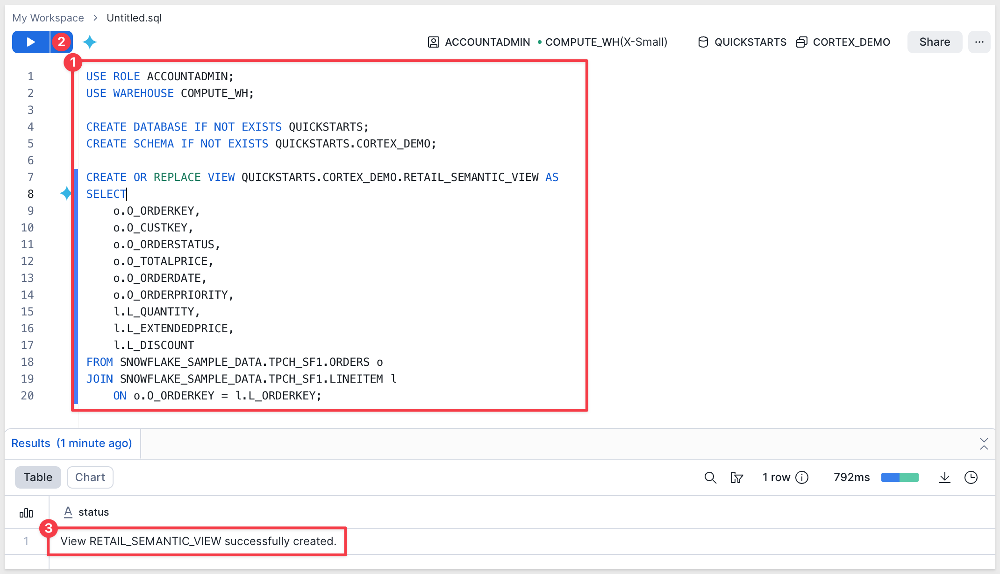

<aside class="positive">
<strong>NOTE:</strong><br> This SQL view joins the ORDERS and LINEITEM tables, creating a pre-joined dataset. This is the <strong>data layer</strong> that Cortex will query. However, Cortex doesn't yet know what these columns mean in business terms—that's what the semantic model (next step) provides.
</aside>

### Step 2: Create Semantic View in Cortex Analyst

Now we'll create a Semantic View using the Snowflake UI. This will add business context and metadata to our SQL view.

In Snowflake, navigate to `AI & ML` > `AI Studio` > `Cortex Analyst` and click `Try`.

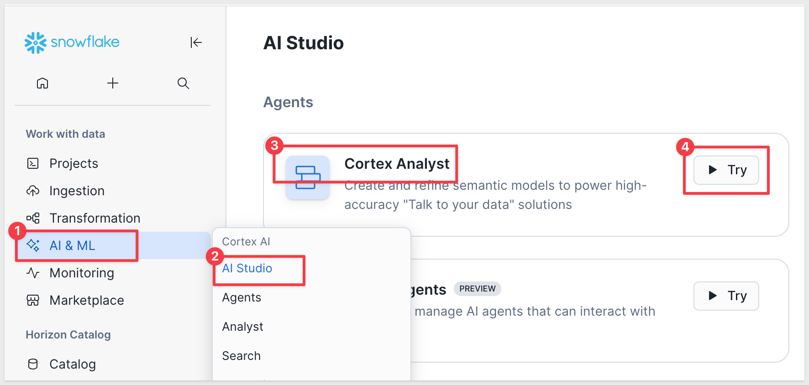

On the `Semantic views` tab, click `Create semantic view`.

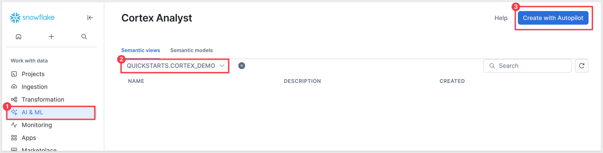

**Step 1:**<br> 
On the `Getting started` tab:<br>
**Name:** `RETAIL_SEMANTIC_VIEW_CORTEX`<br>
**Description:** `Retail order data semantic view for Cortex Analyst`<br>

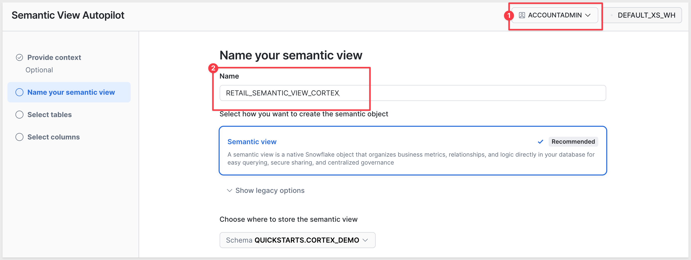

Click **Next**.

**Step 2:**<br>
Provide context (Optional)

Click **Skip** to skip this optional step.

**Step 3:**<br>
Select tables

Navigate to `QUICKSTARTS` > `CORTEX_DEMO` and check the box next to `RETAIL_SEMANTIC_VIEW` (under "1 View").

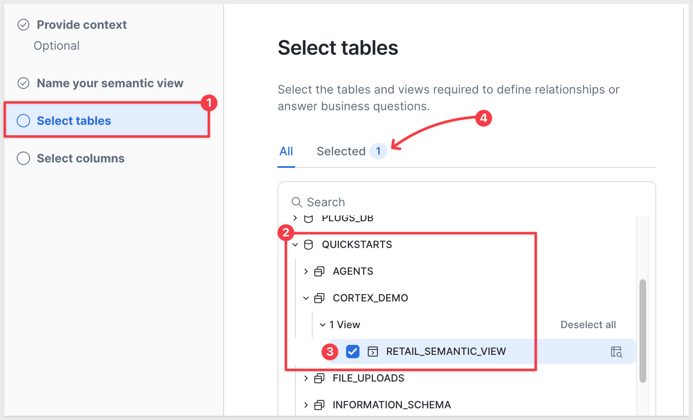

Click **Next**.

**Step 4:**<br>
Select all columns:

- O_CUSTKEY
- O_ORDERSTATUS
- O_TOTALPRICE
- O_ORDERDATE
- O_ORDERPRIORITY
- L_QUANTITY
- L_EXTENDEDPRICE
- L_DISCOUNT
- O_ORDERKEY

Keep both checkboxes selected:
- **Add sample values to the semantic view** (helps Cortex give better answers)
- **Add descriptions to the semantic view** (AI will generate descriptions)

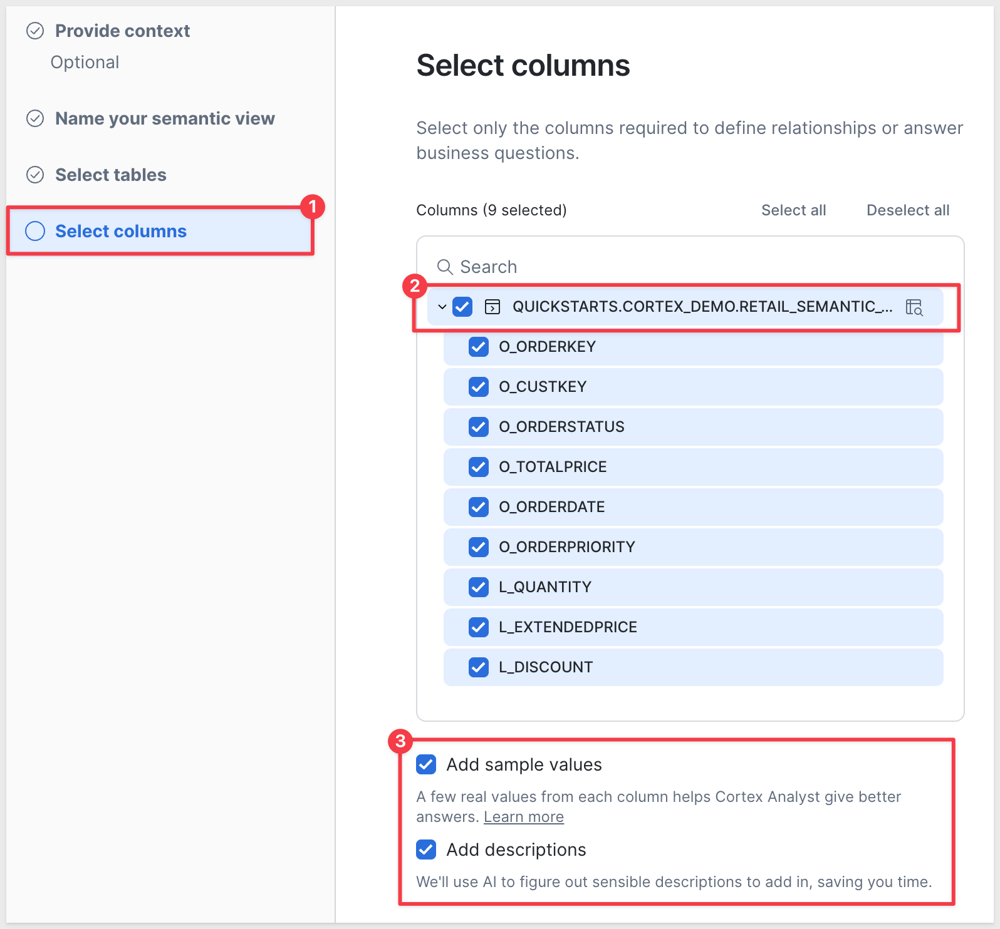

Click `Create and Save`.

You should now see `RETAIL_SEMANTIC_VIEW_CORTEX` listed under Semantic views, along with a warning about processing time:

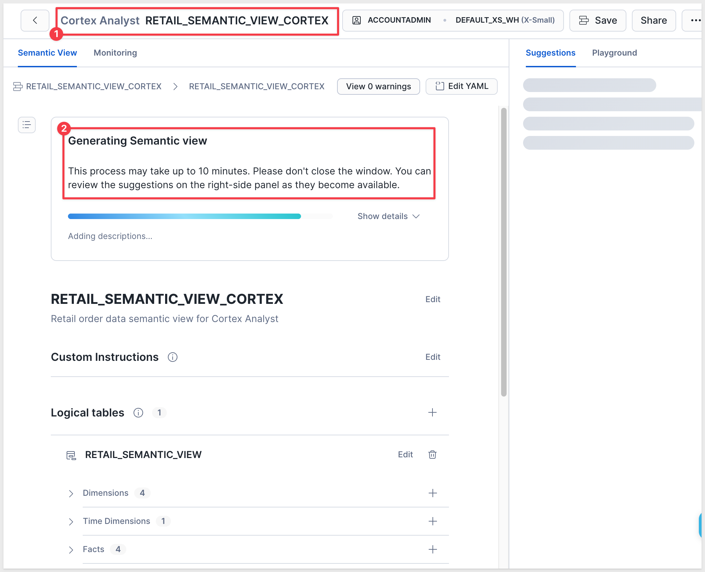

Once the processing is done, we can use the `Playgound` and ask Cortex to `Explain the dataset` to verify it is working:

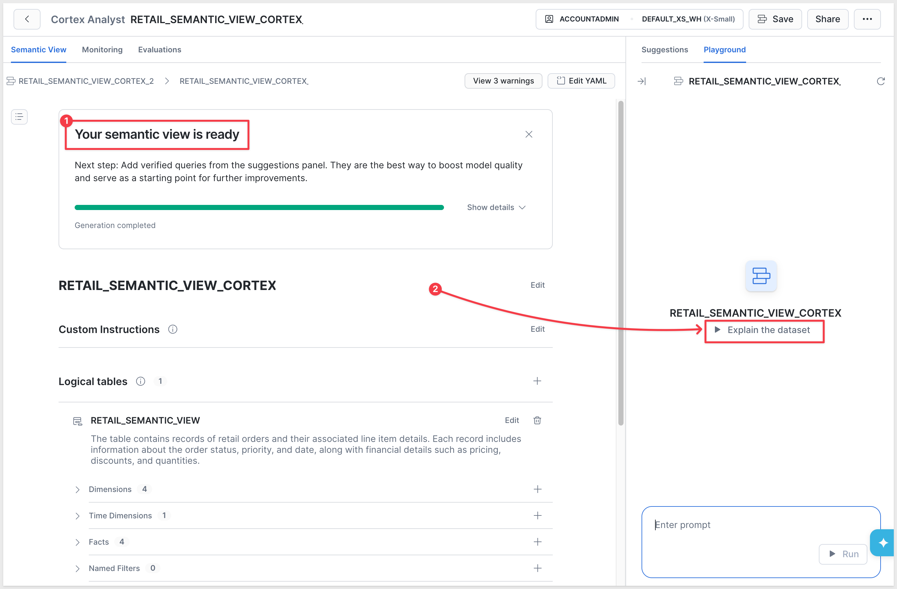

If all is configured correctly, Cortex will respond with with a brief explanation:

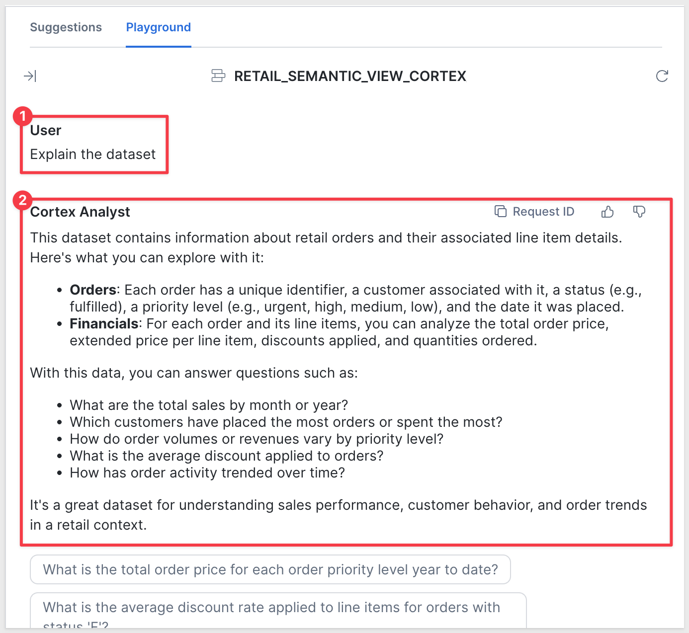

You've now created the complete semantic view. The semantic view references your SQL view (<code>RETAIL_SEMANTIC_VIEW</code>) as its base table, and Cortex can now understand your data structure with business-friendly terms.

### Step 3: Create Cortex Agent

Now we'll create a Cortex Agent—the actual **orchestrator** that uses the semantic view we just created.

<aside class="positive">
<strong>IMPORTANT:</strong><br> The <strong>Cortex Agent</strong> IS an agent (orchestrator with instructions). It will use the semantic view as a tool to answer questions. Later, Sigma's Custom Agent will integrate with this Cortex Agent.
</aside>

Navigate to `AI & ML` > `Agents` (in the left sidebar under AI & ML).

Click the blue button to `Create agent`:

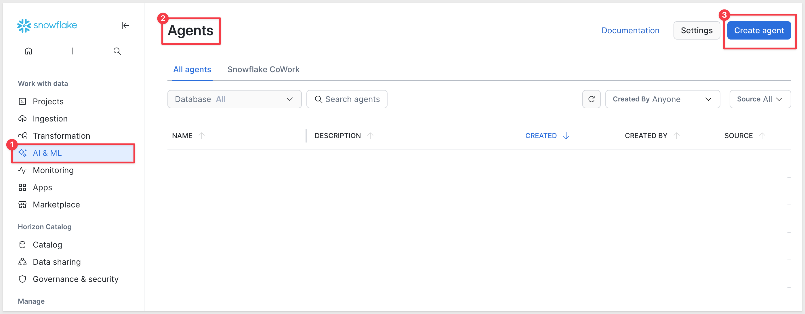

For `Database and schema` we will restrict Cortex to only `QUICKSTARTS.CORTEX_DEMO`:

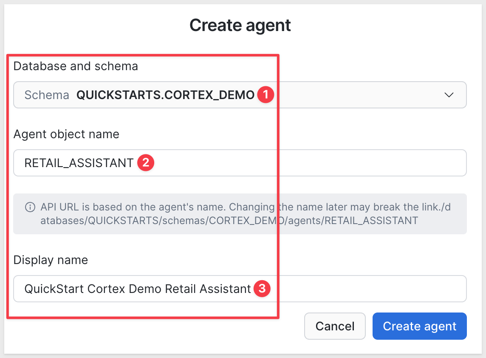

Set the `Agent object name` to `RETAIL_ASSISTANT`.

We can override the `Display name` to be more specific if we want. Use `QuickStart Cortex Demo Retail Assistant`.

Click `Create agent`:

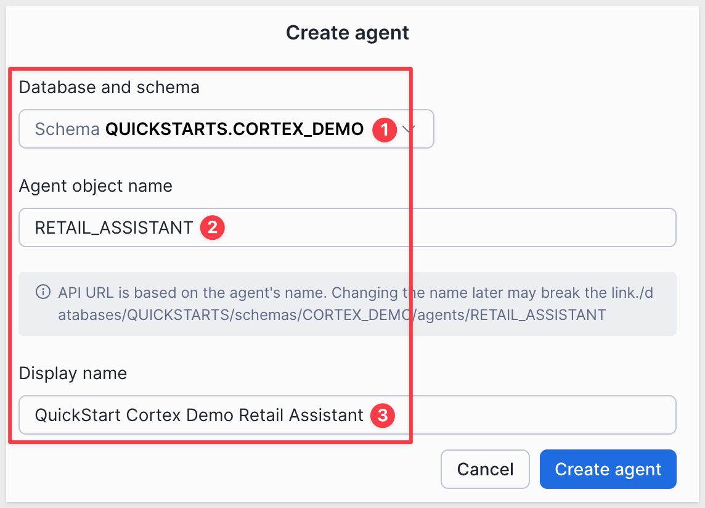

On the `Tools` tab, click `+ Add` to add `Cortex Analyst`:

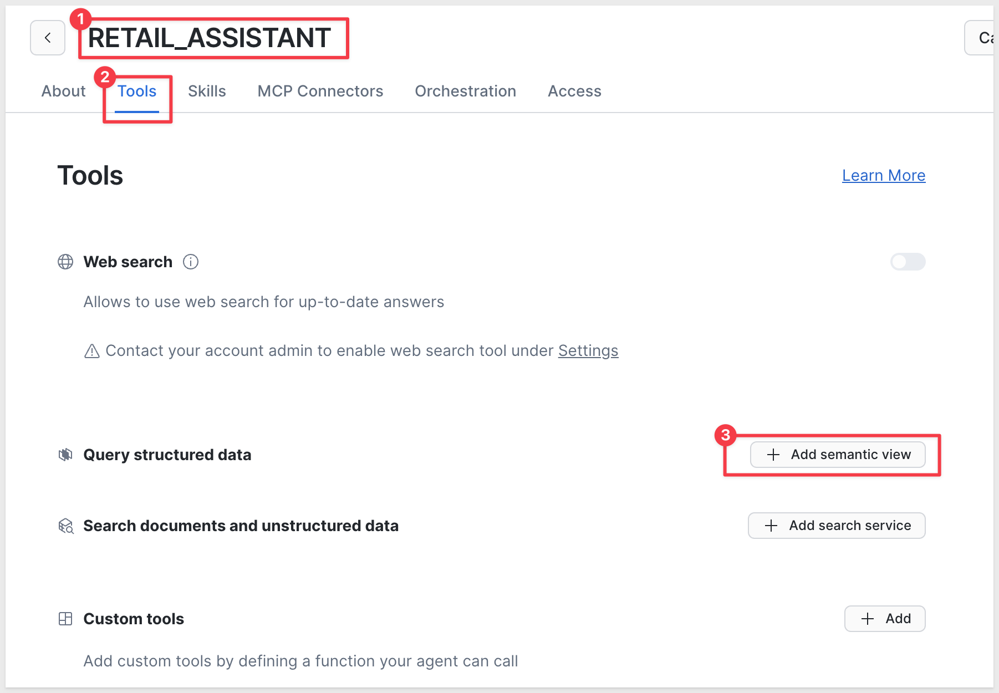

Configure the tool:
- **Semantic view:** Browse and select `QUICKSTARTS.CORTEX_DEMO.RETAIL_SEMANTIC_VIEW_CORTEX`
- **View:** `RETAIL_SEMANTIC_VIEW_CORTEX`
- **Tool name:** `retail_data_analysis`
- **Description:** `Use this tool for all questions about orders, customers, revenue, and sales patterns`

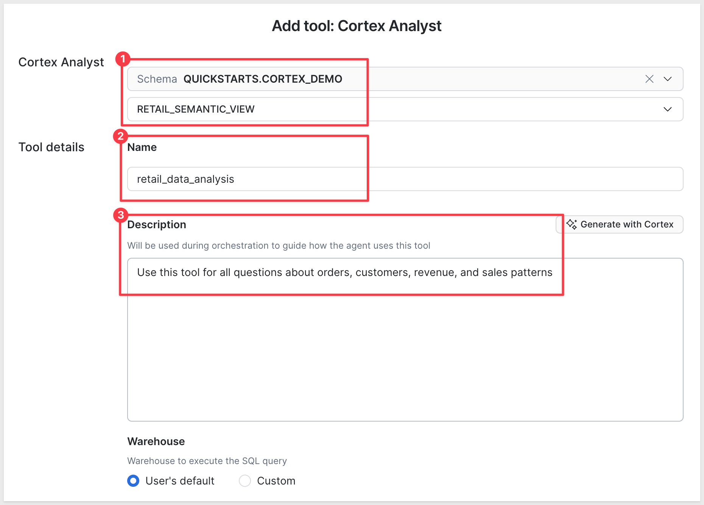

Click `Add`.

On the `Orchestration` tab, enter these instructions:

```copy-code
You are a helpful retail data analyst.

Always use the retail_data_analysis tool for any questions about:
- Orders, order status, order dates
- Customers and customer behavior
- Revenue, sales, prices
- Product quantities and trends

Provide clear, concise answers. When showing data, include relevant context.
```

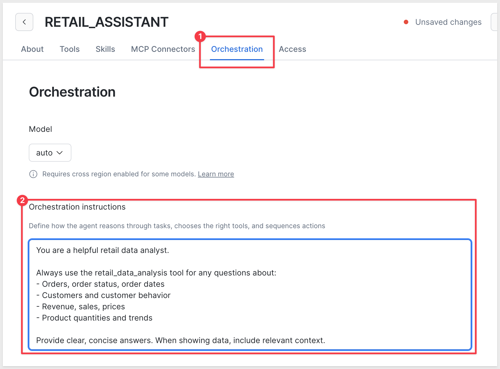

Click `Save` to save the agent, but we have a few more permission steps to complete.

### Step 4: Grant Permissions

Grant access to your Sigma service role so Sigma can use the Cortex Agent and access the underlying data.

<aside class="negative">
<strong>IMPORTANT:</strong><br> Three separate grants are required: (1) SELECT on the SQL view, (2) USAGE on the Cortex Agent, and (3) access to the Semantic View. Missing any of these will cause "table doesn't exist or isn't authorized" errors.
</aside>

#### Step 4a: Grant SQL View Access (Using SQL)

The underlying SQL view must be accessible to your Sigma role. Run this in a Snowflake SQL worksheet:

```copy-code
USE ROLE ACCOUNTADMIN;

-- Grant access to the underlying SQL view (data layer)
GRANT SELECT ON VIEW QUICKSTARTS.CORTEX_DEMO.RETAIL_SEMANTIC_VIEW TO ROLE SIGMA_SERVICE_ROLE;

-- Also grant USAGE on the schema
GRANT USAGE ON SCHEMA QUICKSTARTS.CORTEX_DEMO TO ROLE SIGMA_SERVICE_ROLE;
GRANT USAGE ON DATABASE QUICKSTARTS TO ROLE SIGMA_SERVICE_ROLE;
```

Replace `SIGMA_SERVICE_ROLE` with the actual role used in your Sigma connection.

#### Step 4b: Grant Cortex Agent Access (Using UI)

Now grant access to the Cortex Agent itself:

1. Click the `Access` tab
2. Click `Add role`
3. Enter your Sigma role (e.g., `SIGMA_SERVICE_ACCOUNT_ROLE` or whatever role name you configured) and select `USAGE`

<aside class="positive">
<strong>NOTE:</strong><br> If you see a warning message after adding the role, related to missing access, click "Grant all".

This will grant "Full access to all tools and data sources" the RETAIL_ASSISTANT wants to use.
</aside>

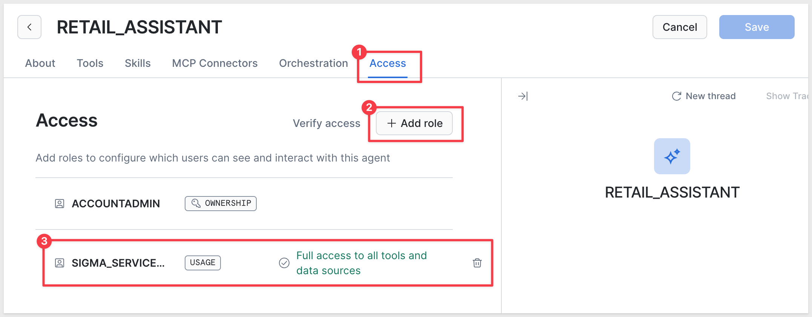

4. Click `Save` or confirm the addition

#### Step 4c: Grant Semantic View Access (Using UI)

1. Navigate to `AI & ML` > `Cortex Analyst`
2. Click on `RETAIL_SEMANTIC_VIEW_CORTEX` Semantic view
3. Click the `Share` or `Access` button
4. Search for and grant access to your Sigma role (e.g., `SIGMA_SERVICE_ROLE`)

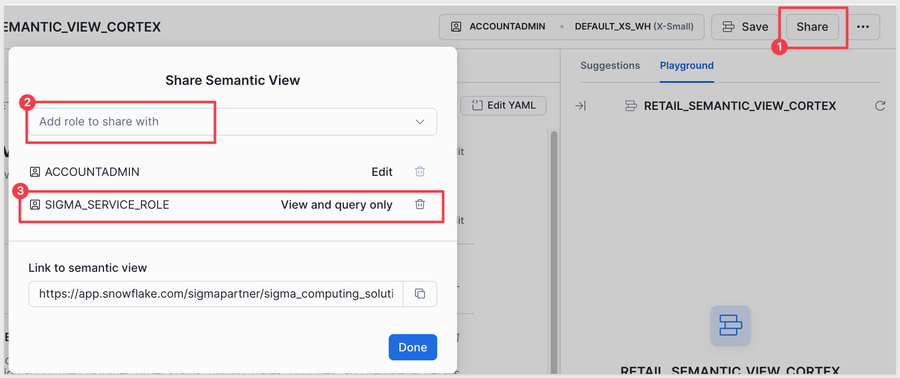

Your Cortex setup is complete! You've created:
- SQL View (data layer) - `RETAIL_SEMANTIC_VIEW`
- Semantic View with AI-generated descriptions - `RETAIL_SEMANTIC_VIEW_CORTEX`
- Cortex Agent with orchestration instructions - `RETAIL_ASSISTANT`
- Proper role permissions for Sigma integration


<!-- END OF SECTION-->

## Configure Sigma for Cortex Integration
Duration: 10

Now that Cortex is configured in Snowflake, we need to enable it in Sigma.

### Enable Cortex in Sigma Admin

Log into Sigma as an `Administrator`.

Navigate to `Administration` > `AI settings`.

#### Configure AI Provider

Under `AI provider` section:

1. Select `Data warehouse hosted model (recommended)`
2. `Connection`: Choose your Snowflake connection (e.g., `Snowflake`)
3. Click `Save`

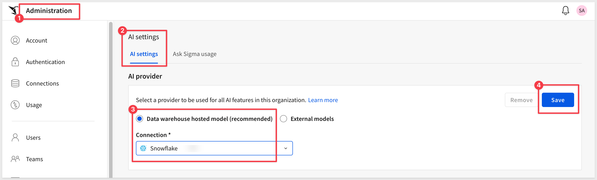

<aside class="positive">
<strong>AUTOMATIC DISCOVERY:</strong><br> Once you save the AI provider configuration, Sigma will automatically discover all Cortex Agents that your connection has access to. The <code>RETAIL_ASSISTANT</code> agent will appear in the <strong>Sigma Assistant</strong> dropdown at the top right of your home page and will be available for use in Chat Elements.
</aside>

<aside class="negative">
<strong>TROUBLESHOOTING:</strong><br> If the <code>RETAIL_ASSISTANT</code> agent doesn't appear in the Sigma Assistant dropdown:
<br><br>
<strong>1. Sync the connection:</strong> <a href="https://help.sigmacomputing.com/docs/troubleshoot-your-connection#syncing-your-data-and-connection-indexing" target="_blank">Sync your Snowflake connection</a> to fetch the latest configuration details, then refresh the page.
<br><br>
<strong>2. Verify permissions in Snowflake:</strong>
<pre><code>SHOW GRANTS ON CORTEX AGENT QUICKSTARTS.CORTEX_DEMO.RETAIL_ASSISTANT;</code></pre>
Your Sigma connection's role should appear with USAGE privilege.
<br><br>
<strong>3. Check the connection role matches:</strong> In <strong>Administration</strong> > <strong>Connections</strong>, verify the role used by your Snowflake connection matches the role that has USAGE on the Cortex Agent.
</aside>

Your Sigma environment is now ready to use Snowflake Cortex! The `RETAIL_ASSISTANT` agent is available organization-wide for both Sigma Assistant and Chat Elements.


<!-- END OF SECTION-->

## Test Cortex Agent with Sigma Assistant
Duration: 5

Before building a full workbook, let's verify that the Cortex Agent is working correctly by asking it a simple question using Sigma Assistant.

### Access Sigma Assistant

From your Sigma home page, look at the top right area where you'll see `Sigma Assistant` with a dropdown showing `RETAIL_ASSISTANT`.

<aside class="positive">
<strong>NOTE:</strong><br> If you don't see RETAIL_ASSISTANT in the dropdown, refer to the troubleshooting steps in the previous section to sync your connection.
</aside>

### Ask a Test Question

Click in the Sigma Assistant text box and type a simple question:

```
What is the total revenue from all orders in the most recent full year?
```

Press `Enter` or click the send button.

### Review the Response

The RETAIL_ASSISTANT agent will:
1. Process your question
2. Query the semantic view using Cortex Analyst
3. Return a response with analysis and context
4. Generate a visualization showing the data

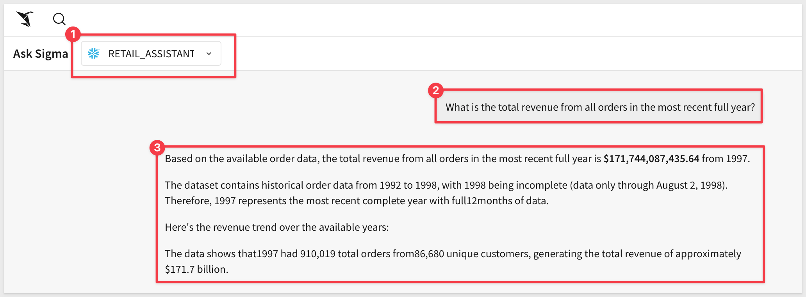

You should see a detailed response that:
- Identifies 1997 as the most recent complete year (1998 is incomplete)
- Provides the total revenue: `$171.7 billion`
- Shows 910,019 total orders from 86,680 unique customers
- Includes a chart showing "Total Revenue by Year"

### View the Generated SQL

Notice the **Source: Custom SQL** indicator below the response. This shows that Cortex Analyst generated custom SQL to answer your question.

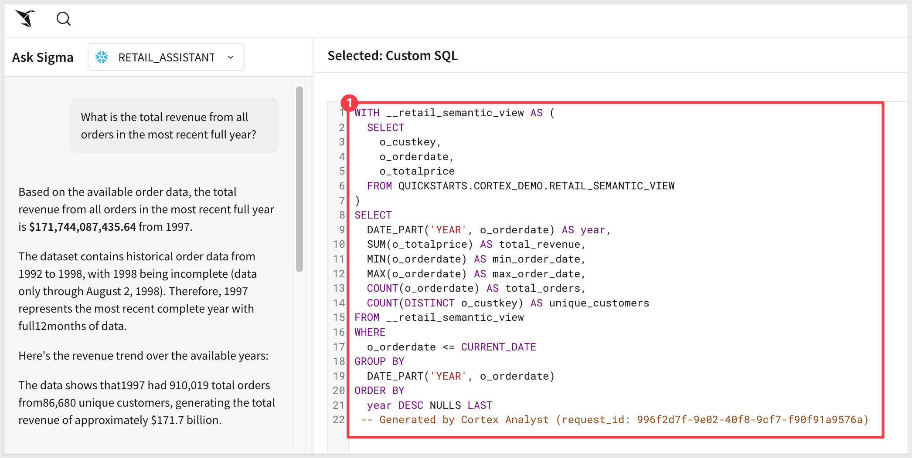

Click on **Custom SQL** to view the actual SQL query that Cortex generated. You can:<br>
- Review the SQL to understand how Cortex interpreted your question<br>
- Copy the SQL and run it in Snowflake to validate the results<br>
- Learn how semantic models are translated into SQL queries<br>

<aside class="positive">
<strong>KEY INSIGHT:</strong><br> This demonstrates the power of Cortex Analyst - it understood "most recent full year", determined that 1997 was the last complete year in the dataset, and generated appropriate SQL with date filtering and aggregations. This is more than simple keyword matching - it's true semantic understanding!
</aside>

### Validate the Response

The important thing is that the RETAIL_ASSISTANT:

- Understood the natural language question correctly<br>
- Identified the most recent complete year (1997)<br>
- Provided specific revenue numbers and context<br>
- Generated a visualization to support the answer<br>
- Created accurate SQL (viewable via "Custom SQL")<br>

<aside class="positive">
<strong>SUCCESS!</strong><br> If your RETAIL_ASSISTANT provided a detailed response with analysis, numbers, and a chart, your Cortex Agent is working correctly! The semantic view is properly configured and Cortex Analyst is generating accurate SQL queries from natural language. Now we're ready to build a workbook with a Chat Element for a richer interactive experience.
</aside>


<!-- END OF SECTION-->

## Create Workbook
Duration: 5

Now that we've verified the Cortex Agent works with Sigma Assistant, let's create a workbook where we can add a Chat Element for end users.

### Create New Workbook

In Sigma, click the `Create New` button and select `Workbook`.

<aside class="positive">
<strong>NOTE:</strong><br> This workbook will serve as the container for our Chat Element. Users will interact with the Chat Element in this published workbook.
</aside>

### Save and name the Workbook

In the top left click `Save as` and name the workbook `Retail Assistant - QuickStart`.

### Add Title (Optional)

From the element bar at the bottom, you can add a `Text` element with a title like:

```copy-code
Retail Data Assistant
Ask questions about orders, revenue, customers, and sales patterns.
```

This helps users understand what the Chat Element can do.

<!-- 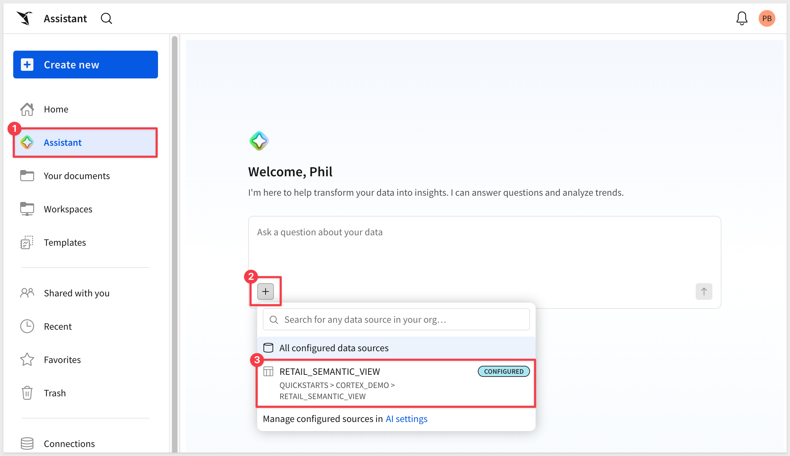 -->

Now we're ready to add the Chat Element!


<!-- END OF SECTION-->

## Create Custom Agent
Duration: 15

Before adding the Chat Element, we need to create a Custom Agent that will power it.

### Open Agents Panel

In the workbook, look at the right side panel. You'll see tabs: `Settings`, `Format`, `Actions`, and `Agents`.

Click on the `Agents` tab.

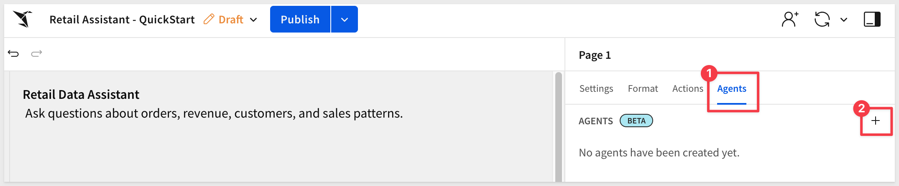

You'll see "No agents have been created yet."

### Create New Agent

Click the `+` button to create a new agent.

<aside class="positive">
<strong>NOTE:</strong><br> Agents are created at the workbook level and can be reused across multiple Chat Elements. This allows you to create multiple specialized agents for different use cases.
</aside>

The agent configuration panel opens with several tabs: `About`, `Instructions`, `Data`, and `Actions`.

### Configure About Tab

Click on the `About` tab and enter:

**Name:** `Retail Data Assistant`

**Description:** `Analyzes TPCH retail order data using natural language queries. Can answer questions about orders, customers, revenue, and sales patterns.`

<aside class="positive">
<strong>NOTE:</strong><br> The description is displayed to users who select this agent, helping them understand what it can do.
</aside>

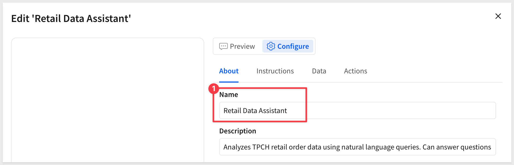

### Configure Instructions

Click on the `Instructions` tab.

In the instructions editor, copy/paste the following to guide the agent's behavior:

```copy-code
You are a friendly retail data analyst assistant. Your role is to help users understand their retail order data by answering questions about orders, revenue, customer patterns, and order priorities.

When responding:
- Be concise and actionable
- Provide specific numbers and trends
- Use the Analyze Data Models tool for questions about the workbook data
- Highlight key insights that could drive business decisions

For complex analytical questions requiring joins or aggregations across multiple tables, use the RETAIL_ASSISTANT Cortex Agent that was configured in Sigma's AI settings.

Always maintain a helpful, professional tone.
```

<aside class="positive">
<strong>TIP:</strong><br> The Instructions tab provides a rich text editor with formatting options. You can use bold, italics, bullets, and other formatting to make instructions clear for the agent, but also easier for editing later.
</aside>

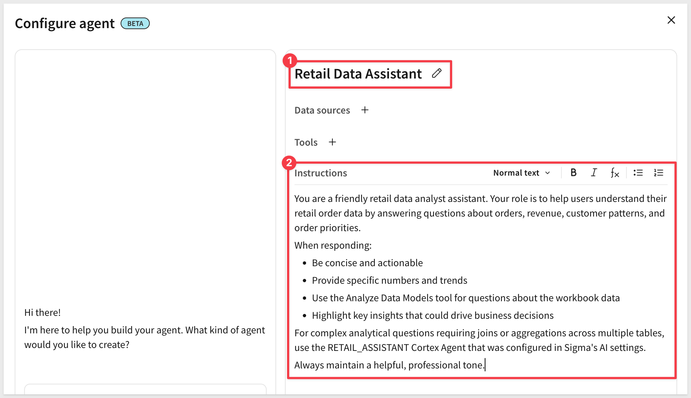

### Add Data Sources

Click on the `Data` tab and select the `RETAIL_ASSISTANT` warehouse agent:

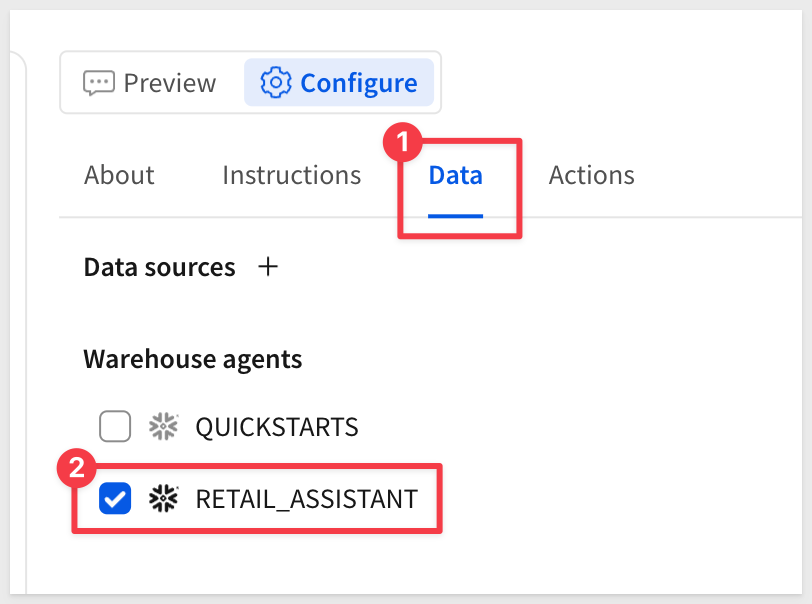

The `RETAIL_ASSISTANT` Cortex Agent is automatically available because you configured it in Sigma's AI settings earlier.

The agent has direct access to the retail order data in Snowflake through the semantic view we created. You don't need to add any additional data sources here.

<aside class="positive">
<strong>NOTE:</strong><br> The Cortex Agent accesses data through the Snowflake semantic view (RETAIL_SEMANTIC_VIEW_CORTEX), which provides governed, curated access to the ORDERS and LINEITEM tables. This ensures the AI only queries approved data with proper business context.
</aside>

<aside class="positive">
<strong>ADDITIONAL OPTION:</strong><br> The Data tab can also be configured to add workbook tables as data sources. This allows the agent to query both warehouse data (via Cortex) and workbook data. For this QuickStart, we're keeping it simple by using only the Cortex Agent.
</aside>

<aside class="negative">
<strong>TROUBLESHOOTING:</strong><br> If the agent doesn't respond to queries, verify:
<ul>
<li>AI settings are configured in Sigma Admin (Data warehouse hosted model)</li>
<li>RETAIL_ASSISTANT appears in Sigma Assistant dropdown</li>
<li>Your connection has been synced (see <a href="https://help.sigmacomputing.com/docs/troubleshoot-your-connection#syncing-your-data-and-connection-indexing">connection sync docs</a>)</li>
</ul>
</aside>

### Save the Agent

Click `Save` to save your Custom Agent configuration.

The `Retail Data Assistant` agent now appears in the Agents panel and is ready to use!


<!-- END OF SECTION-->

## Add Chat Element to Workbook
Duration: 5

Now that we've created the agent, let's add a Chat Element to the workbook and connect it to our agent.

### Add Chat Element to Canvas

From the element bar at the bottom of your workbook, click `UI` > `Chat`.

A Chat Element appears on your canvas.

### Select the Agent

Click on the Chat Element to select it.

In the left panel (or configuration area), you'll see an option to select which agent powers this Chat Element.

Select: `Retail Data Assistant` (the agent we just created)

<aside class="positive">
<strong>NOTE:</strong><br> You can add multiple Chat Elements to a workbook, each powered by different agents. This allows you to create specialized assistants for different tasks on different pages.
</aside>

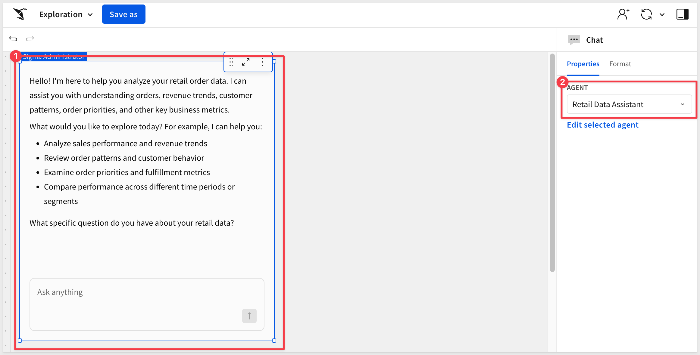

The Chat Element is now connected to your agent and ready to use!

### Test the Chat Element

Let's test the Chat Element in the workbook to verify it's working correctly.

Click `Publish` in the top right corner to publish the workbook.

In the published view, use the Chat Element to ask:

```copy-code
What is the total revenue from all orders in the most recent full year?
```

You should see:
1. **"Thinking"** status appears as the agent processes the query
2. The agent routes to the RETAIL_ASSISTANT Cortex Agent
3. Cortex analyzes the semantic view and generates appropriate SQL
4. A detailed response with:
   - Identification of the most recent complete year (1997)
   - Total revenue figure (~$171.7 billion)
   - Additional context (number of orders, customers, etc.)

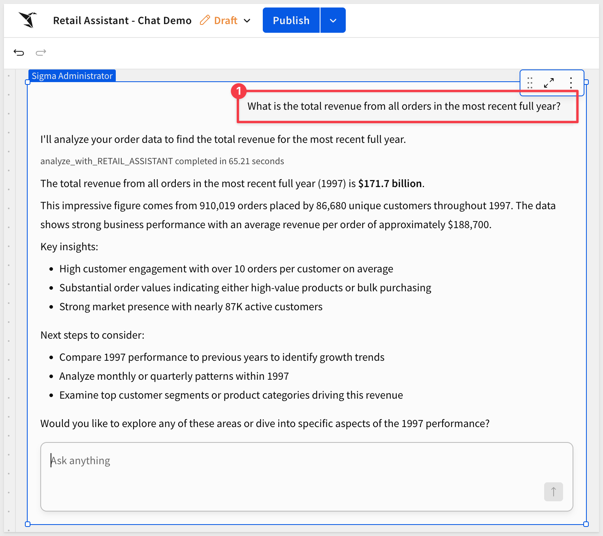

If you received a comprehensive response with revenue data, your Chat Element is properly connected to the Cortex Agent and can query the semantic view successfully!


<!-- END OF SECTION-->

## Add Action Workflow - Log Insights (Optional)
Duration: 15

Let's add the ability for the agent to write insights to an input table. This demonstrates how agents can take actions, not just answer questions.

<aside class="positive">
<strong>NOTE:</strong><br> This section is optional. You can skip it if you want to keep the QuickStart focused on basic chat functionality.
</aside>

### Create Admin Page with Input Table

From the element bar, click `Input` > `Empty`.

Select your Snowflake connection.

Configure the input table columns:

1. **Insight** (Text) - The insight to log from Cortex
2. **CustomerID** (Number) - The customerID we are asking about
3. **Last updated at** (Sigma provided column) - When the insight was logged

Rename the table to: `Customer Insights`

Delete the pre-populated rows so the table is empty.

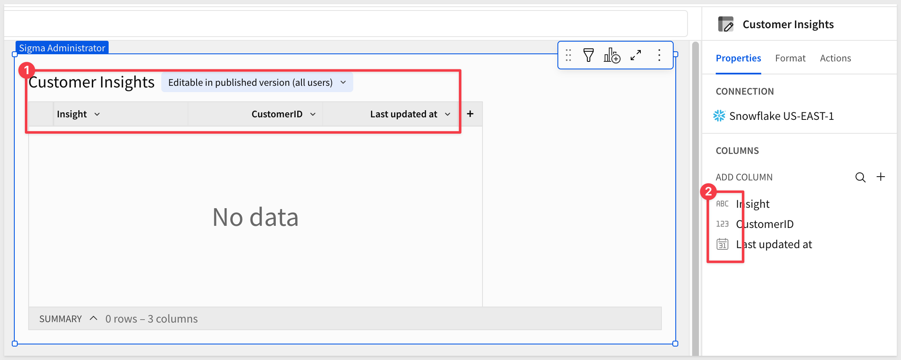

### Set Input Table Permissions

Click on the `Customer Insights` input table.

Set the permission to: `Only editable in published version`

Click `Publish`.

<aside class="positive">
<strong>NOTE:</strong><br> This permission setting allows the agent to insert rows when the workbook is published, while preventing edits in draft mode.
</aside>

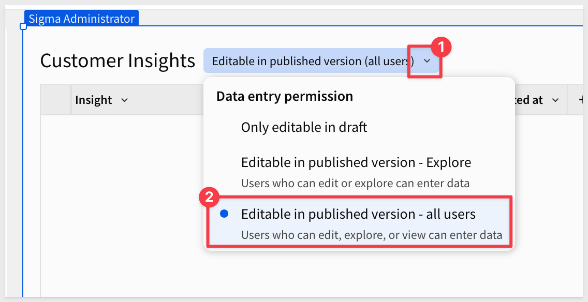

### Configure Agent Actions

Click any blank area of the workbook to deselect any elements. 

In the right panel, click the `Agents` tab.

Use the `3-dot` menu to edit the `Retail Data Assistant` agent.

In the `Edit Retail Data Assistant` modal, click on the `Actions` tab and then the `+` to add a new `Tool`:

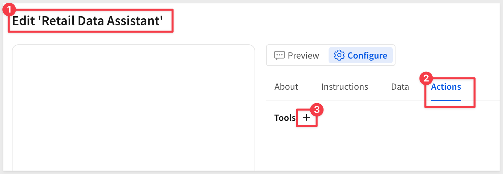

### Create Insert Row Action

Name the new tool `Insert into Customer Insights` and click the `+` to add a `Step`:

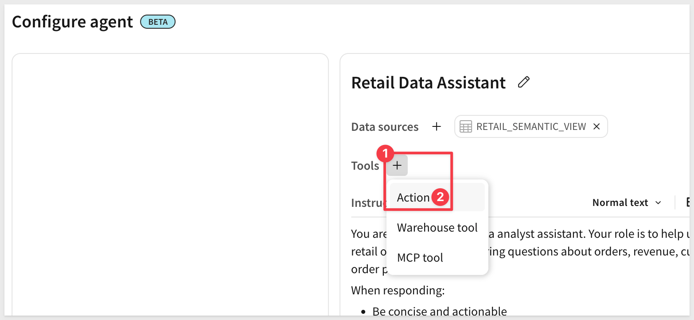


Configure the action:

**Step type:** Run an action<br>
**Action:** Insert row<br>
**Into:** Customer Insights<br>
**With values:**<br>
- **Insight** > **Tool input** > **insight_description** (the agent will generate this)<br>
- **CustomerID** > **Tool input** > **customer_id** (the agent will provide the customer number)

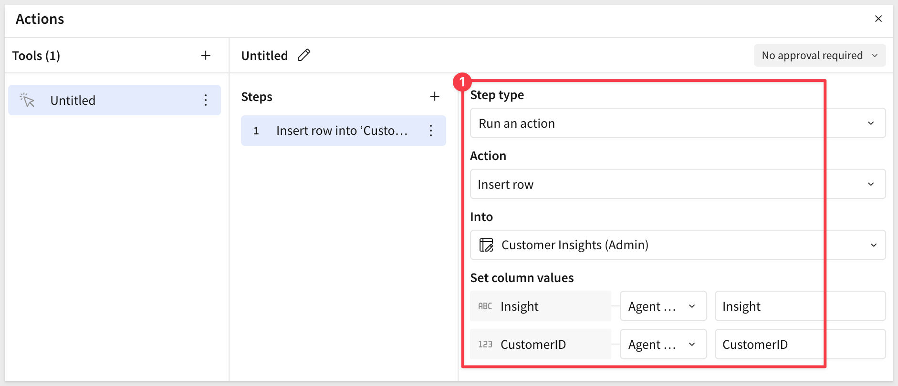

<aside class="positive">
<strong>KEY CONCEPT:</strong><br> "Tool input" tells the agent it must provide these values dynamically based on the conversation. The input names help the agent understand what each value represents.
</aside>

<aside class="negative">
<strong>IMPORTANT:</strong><br> Actions allow agents to modify data. Always define workflows in the instructions that require user confirmation before executing write operations.
</aside>

### Update Agent Instructions

<aside class="positive">
<strong>PROMPT ENGINEERING:</strong><br> Instructions are the most important part of agent configuration. This is where you define workflows, personality, and when to use actions. The instructions should include:
<ul>
<li>Clear workflows with step-by-step guidance</li>
<li>Example interactions showing expected behavior</li>
<li>When and how to use available actions/tools</li>
</ul>
Focus your time here rather than tinkering with tool names and descriptions.
</aside>

Click on the `Instructions` tab and replace the entire instruction content with (the formatting will not matter but adjust for readability if preferred):
```copy-code
You are a friendly retail data analyst assistant helping users analyze TPCH retail order data.

## Insight Logging Workflow

When users ask you to analyze a specific customer (e.g., "analyze customer 3451"), follow this workflow:

1. Analyze the customer's data using the RETAIL_ASSISTANT Cortex Agent
2. Provide the analysis to the user
3. Offer to log the insight by saying: "Would you like me to save this insight to the Customer Insights table?"
4. If the user says yes, confirm what you'll write:
   - "I'll log: [brief insight summary]"
   - "Customer ID: [number]"
   - "Should I proceed?"
5. Only after user confirms, use the "Insert row into Customer Insights" tool

## Example Interaction

User: "Analyze customer 3451"
You: [Provide analysis] "This customer has spent $28.8M over 6.5 years. Would you like me to save this insight?"
User: "Yes please"
You: "I'll log: 'High-value customer: $28.8M over 6.5 years, $182K avg order' with Customer ID: 3451. Proceed?"
User: "Yes"
You: [Use insert tool with insight_description and customer_id]

Always be concise and actionable. Ask for explicit confirmation before writing data.
```

Click `Save` and `Publish`

### Test the Action Workflow

Switch the workbook to published view.

**Step 1 - Request analysis:**
```copy-code
Analyze customer 3451
```

The agent will:
- Query the RETAIL_ASSISTANT Cortex Agent
- Provide analysis (revenue, order patterns, etc.)
- Offer to save the insight: "Would you like me to save this insight to the Customer Insights table?"

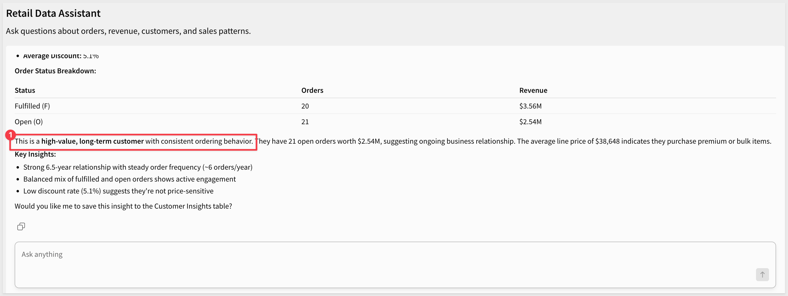

**Step 2 - Confirm you want to save (good manners never hurt!):**
```copy-code
Yes please
```

The agent will:
- Summarize what it will write
- Show the customer ID
- Ask for final confirmation: "Should I proceed?"

**Step 3 - Final confirmation:**
```copy-code
Yes
```

The agent executes the "Insert row into 'Customer Insights'" action, providing:
- `insight_description`: The generated insight text
- `customer_id`: 3451

You should see a new row with:
- **Insight**: The description the agent generated
- **CustomerID**: 3451
- **Last updated at**: Current timestamp

However, we still can elect to `Cancel` the insert operation if we want, or click `Save`:

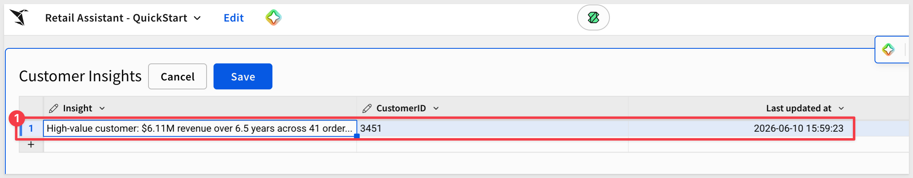

<aside class="positive">
<strong>WHAT'S POSSIBLE:</strong><br> Your agent can now take actions based on conversations, not just answer questions. Think about the possibilities: logging customer insights, flagging records for review, updating forecasts, triggering notifications, or routing approvals—all through natural conversation. Any action available in Sigma can become part of a conversational workflow.
</aside>


<!-- END OF SECTION-->

## What We've Covered
Duration: 5

In this QuickStart, you learned how to:

### Core Concepts
- **Understand the architecture** - Custom Agents are the brain, Chat Elements are the UI
- **Configure Snowflake Cortex** - Set up semantic view, analyst, and agent with minimal configuration
- **Integrate with Sigma** - Connect Cortex to Sigma's AI settings at the org level
- **Build Chat Elements** - Add conversational interface powered by Custom Agents

### Advanced Capabilities
- **Combine tools** - Native Text2SQL for simple queries, Cortex for complex analysis
- **Intelligent routing** - Agent decides which tool to use based on question complexity
- **Take actions** - Enable agents to write to input tables with approval workflows
- **Maintain context** - Ask follow-up questions in natural conversation flow

### Key Takeaways

**Custom Agents are powerful orchestrators:**
- They don't just answer questions—they decide how to answer them
- Multiple tools can be combined (Text2SQL, Cortex, MCP, stored procedures)
- Instructions guide behavior and tool selection

**Cortex integration provides accuracy:**
- 96-97% accuracy for complex analytical queries
- Handles joins, aggregations, and time-series analysis
- Requires semantic view setup but delivers reliable results

**Chat Elements enable conversational AI:**
- Familiar chat interface for business users
- No need to learn SQL or understand data models
- Natural language queries with visual results

### Next Steps

Explore more AI capabilities in Sigma:
- [Custom Functions documentation](https://help.sigmacomputing.com/docs/custom-functions)
- [Model Context Protocol (MCP)](https://help.sigmacomputing.com/docs/model-context-protocol-mcp)
- [Action Sequences guide](https://help.sigmacomputing.com/docs/action-sequences)

Learn more about Snowflake Cortex:
- [Cortex Analyst best practices](https://docs.snowflake.com/en/user-guide/snowflake-cortex/cortex-analyst)
- [Semantic model documentation](https://docs.snowflake.com/en/user-guide/semantic-model)

**Additional Resource Links**

[Blog](https://www.sigmacomputing.com/blog/)<br>
[Community](https://community.sigmacomputing.com/)<br>
[Help Center](https://help.sigmacomputing.com/hc/en-us)<br>
[QuickStarts](https://quickstarts.sigmacomputing.com/)<br>

Be sure to check out all the latest developments at [Sigma's First Friday Feature page!](https://quickstarts.sigmacomputing.com/firstfridayfeatures/)
<br>

[](https://twitter.com/sigmacomputing)&emsp;
[](https://www.linkedin.com/company/sigmacomputing)&emsp;
[](https://www.facebook.com/sigmacomputing)


<!-- END OF WHAT WE COVERED -->
<!-- END OF QUICKSTART -->
