author: pballai
id: aiapps_file_uploads_multimodal_ai
summary: aiapps_file_uploads_multimodal_ai
categories: aiapps
environments: web
status: Hidden
feedback link: https://github.com/sigmacomputing/sigmaquickstarts/issues
tags: 
lastUpdated: 2026-02-05

# Multi-Modal File Analysis with AI

## Overview
Duration: 5

Sigma's file uploads feature allows users to attach files to row-level data, preview them, and pass file references through input tables and forms. By configuring external storage integration with Snowflake, you can extend this capability to perform advanced AI-powered processing on uploaded files.

In this QuickStart, you'll learn how to build a multi-modal AI application that can:

- **Analyze images** using AI vision capabilities
- **Transcribe and analyze audio/video** files
- **Extract structured information** from documents (PDFs, invoices, receipts)
- **Ask questions across multiple files** simultaneously using natural language

This approach enables unstructured data analysis directly within Sigma, combining file attachments with Snowflake's AI functions for intelligent document processing, content classification, and information extraction.

<aside class="positive">
<strong>IMPORTANT:</strong><br> Some screens in Sigma may appear slightly different from those shown in QuickStarts. This is because Sigma continuously adds and enhances functionality. Rest assured, Sigma's intuitive interface ensures that any differences will not prevent you from successfully completing any QuickStart.
</aside>

For more information on Sigma's product release strategy, see [Sigma product releases](https://help.sigmacomputing.com/docs/sigma-product-releases)

If something doesn't work as expected, here's how to [contact Sigma support](https://help.sigmacomputing.com/docs/sigma-support)

### Target Audience
This QuickStart is designed for data analysts, developers, and technical users who want to build AI-powered applications that process unstructured data like images, documents, and audio files.

### Prerequisites

<ul>
  <li>A computer with a modern web browser (any browser will work).</li>
  <li>Access to your Sigma environment with file upload capabilities enabled.</li>
  <li>Administrative access to a Snowflake environment.</li>
  <li>Snowflake Cortex AI enabled in your Snowflake account.</li>
  <li>AWS S3 bucket for external file storage.</li>
  <li>Familiarity with Snowflake SQL and Sigma workbook development.</li>
</ul>

<aside class="positive">
<strong>IMPORTANT:</strong><br> Sigma recommends using non-production resources when completing QuickStarts.
</aside>

<aside class="negative">
<strong>NOTE:</strong><br> Snowflake Cortex is not enabled by default in most accounts and is not available in all regions. To use Cortex, you must request enablement through Snowflake Support. See <a href="https://docs.snowflake.com/en/user-guide/snowflake-cortex/cortex-analyst">Region availability</a> for supported regions.
</aside>

<button>[Sigma Free Trial](https://www.sigmacomputing.com/free-trial/)</button> <button>[Snowflake Free Trial](https://signup.snowflake.com/)</button> <button>[AWS Free Trial](https://aws.amazon.com/free/?trk=0737953a-5bcb-42c3-bdbe-bdfc3cc79c51&sc_channel=ps&trk=0737953a-5bcb-42c3-bdbe-bdfc3cc79c51&sc_channel=ps&ef_id=EAIaIQobChMIs4Oh4dKzkgMVGzcIBR3fJy0zEAAYASAAEgIiG_D_BwE:G:s&s_kwcid=AL!4422!3!651751058802!e!!g!!aws%20free%20trial!19852662149!145019244177&gad_campaignid=19852662149&gbraid=0AAAAADjHtp_-YsRlD16DM0CSKK2h5hWGD&gclid=EAIaIQobChMIs4Oh4dKzkgMVGzcIBR3fJy0zEAAYASAAEgIiG_D_BwE)
</button> 


## Configure AWS S3 Storage
Duration: 15

Before configuring Sigma's storage integration, you need to set up the AWS infrastructure that will store your uploaded files. This involves creating an S3 bucket, IAM policies, and roles with proper permissions.

### Create S3 Bucket

Log into your AWS Console and navigate to S3.

Click `Create bucket` and configure:
- **Bucket name**: Choose a unique name (e.g., `file-uploads-quickstart`)
- **AWS Region**: Select your preferred region
- **Block Public Access settings**: Keep all public access blocked (recommended)
- Leave other settings as default

Scroll all the way down the page and click `Create bucket`.

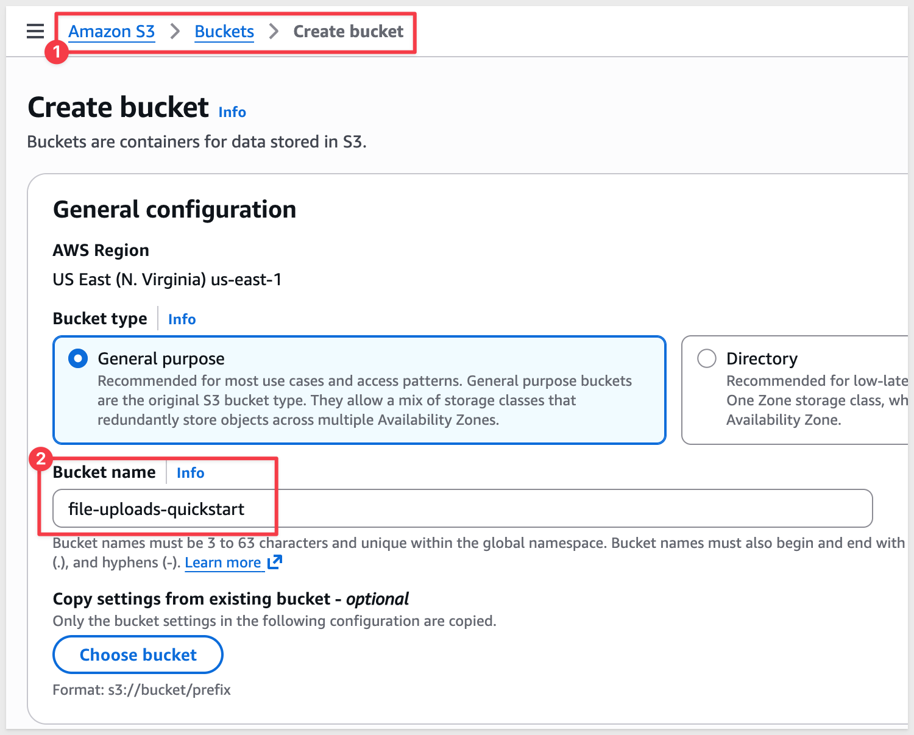

### Create IAM Policy
Navigate to `IAM` > `Policies` and click `Create policy`:

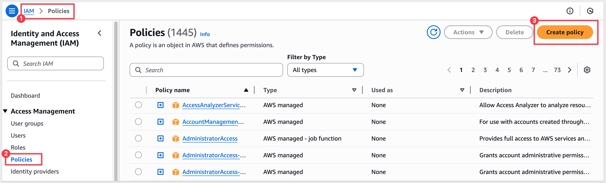

Switch to the `JSON` tab and replace the existing code with the following policy document:

```code
{
  "Version": "2012-10-17",
  "Statement": [
    {
      "Effect": "Allow",
      "Action": [
        "s3:GetBucketLocation",
        "s3:ListBucket"
      ],
      "Resource": "arn:aws:s3:::file-uploads-quickstart"
    },
    {
      "Effect": "Allow",
      "Action": [
        "s3:PutObject",
        "s3:GetObject",
        "s3:PutObjectTagging"
      ],
      "Resource": "arn:aws:s3:::file-uploads-quickstart/*"
    }
  ]
}
```

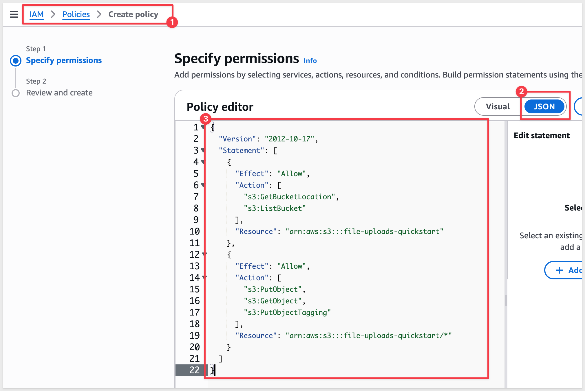

<aside class="negative">
<strong>IMPORTANT:</strong><br> Replace <code>file-uploads-quickstart</code> with your actual bucket name. If you want to restrict uploads to a specific folder, use <code>arn:aws:s3:::file-uploads-quickstart/prefix/*</code> for the object operations.
</aside>

Click `Next`, then:
- **Policy name**: `sigma-file-uploads-quickstart-policy`
- **Description**: `Allows Sigma to upload and manage files in S3`

Click `Create policy`.

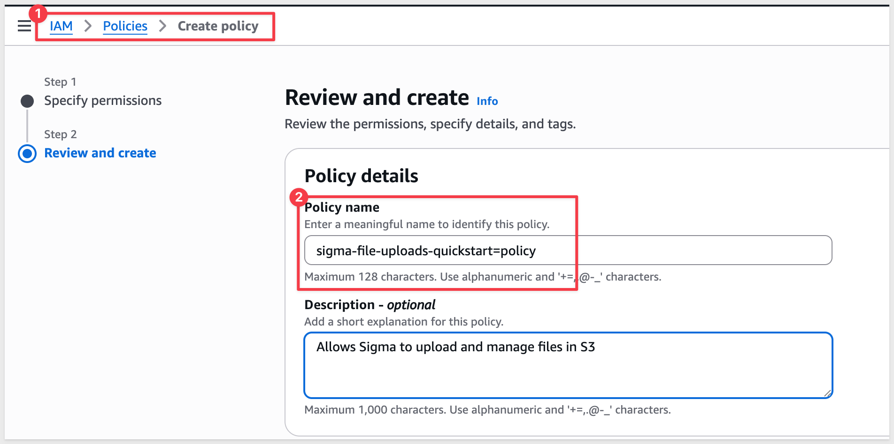

### Create IAM Role
Navigate to IAM > Roles and click `Create role`.

Configure the role:
1. **Trusted entity type**: Select `AWS account`
2. **An AWS account**: Select `This account` and enter your AWS account ID
3. **Require external ID**: Check this box and enter a temporary value: `0000`

<aside class="positive">
<strong>NOTE:</strong><br> You'll update the trust policy with Sigma's actual external ID in a later step. The temporary value allows you to create the role initially.
</aside>

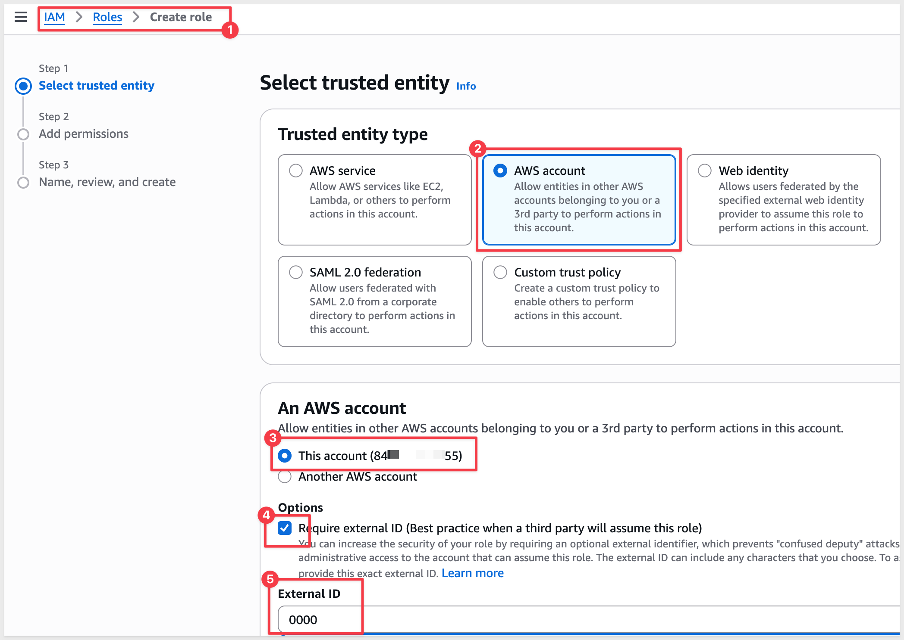

Click `Next`.

On the permissions page:
- Search for and select `sigma-file-uploads-quickstart-policy` (the policy you just created)

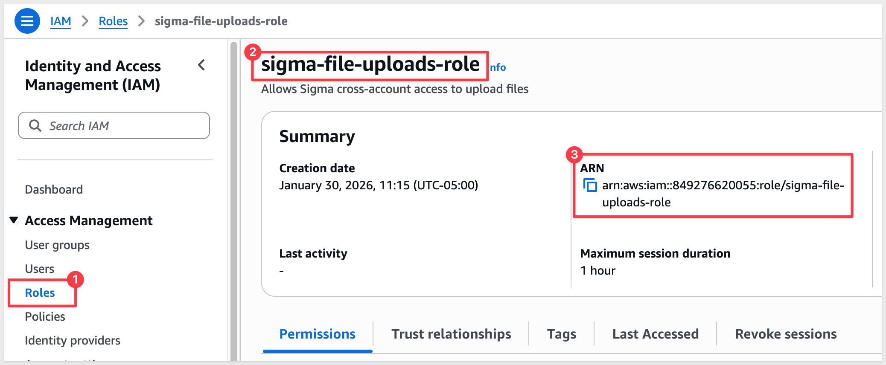

Click `Next`, then:
- **Role name**: `sigma-file-uploads-role`
- **Description**: `Allows Sigma cross-account access to upload files`

Click `Create role`.

After creating the role, search for it by name (`sigma-file-uploads-role`), click on it and copy the **Role ARN** - you'll need this when configuring Sigma.

The ARN format is: `arn:aws:iam::123456789012:role/sigma-file-uploads-role`


### Configure S3 Bucket CORS
Return to S3 and click to select your file uploads bucket.

Click the `Permissions` tab, then scroll to `Cross-origin resource sharing (CORS)`.

Click `Edit` and enter the following CORS configuration:

```code
[
  {
    "AllowedHeaders": ["*"],
    "AllowedMethods": ["GET", "PUT", "POST"],
    "AllowedOrigins": ["https://app.sigmacomputing.com"],
    "ExposeHeaders": []
  }
]
```

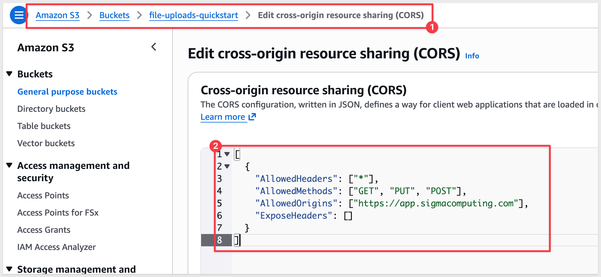

<aside class="positive">
<strong>NOTE:</strong><br> If you use a custom Sigma domain, add it to the <code>AllowedOrigins</code> array. For example: <code>["https://app.sigmacomputing.com", "https://custom.sigmacomputing.com"]</code>
</aside>

Click `Save changes`.


<!-- END OF SECTION-->

## Configure External Storage Integration in Sigma
Duration: 10

Now that your AWS infrastructure is ready, you'll configure Sigma to use your S3 bucket for file storage.

### Add Storage Integration in Sigma

Log into Sigma as Administrator and navigate to `Administration` > `Account` > `Storage Integration` and click `Add`:

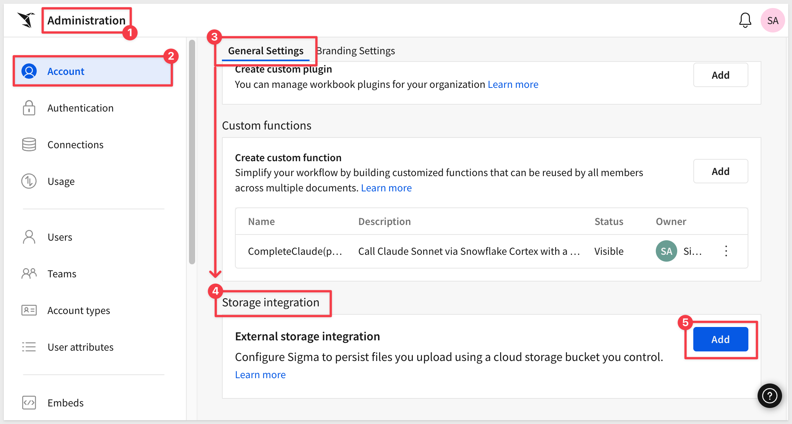

Configure the external storage integration:

- **Provider**: Select `AWS S3`
- **AWS customer IAM role ARN**: Enter the Role ARN from your IAM role (e.g., `arn:aws:iam::123456789012:role/sigma-file-uploads-role`)
- **Bucket name**: Enter your S3 bucket name (e.g., `file-uploads-quickstart`)
- **Prefix**: (Optional) Enter a folder path if you want to isolate Sigma uploads (e.g., `sigma-uploads/`)

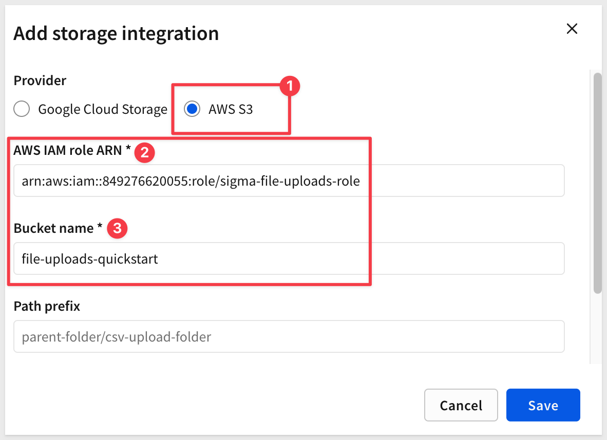

After entering these details, Sigma will display three values:
- **AWS IAM user ARN**: Sigma's IAM user identity (copy this)
- **AWS external role ARN**: Sigma's external ID for cross-account access (copy this)
- **AWS customer IAM role ARN**: Your role ARN echoed back (already have this)

<aside class="negative">
<strong>IMPORTANT:</strong><br> Copy the first two values (AWS IAM user ARN and AWS external role ARN) displayed by Sigma - you'll need them in the next step to update your IAM role's trust policy. The third value is just your role ARN being displayed back to you.
</aside>

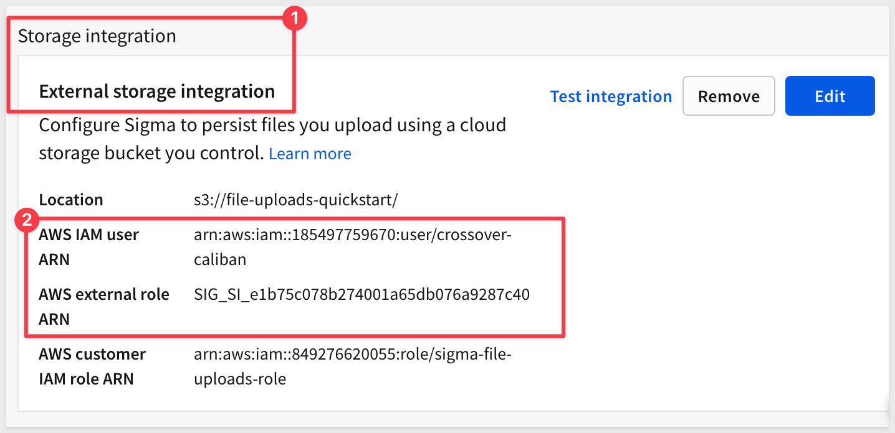

### Update IAM Role Trust Policy

Return to AWS Console and navigate to IAM > Roles.

Select your `sigma-file-uploads-role`.

Click the `Trust relationships` tab, then click `Edit trust policy`:

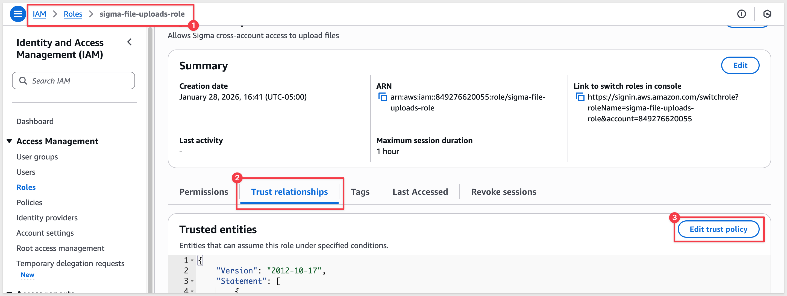

Replace the entire trust policy document with:

```code
{
  "Version": "2012-10-17",
  "Statement": [
    {
      "Effect": "Allow",
      "Principal": {
        "AWS": "arn:aws:iam::123456789012:user/sigma-upload-user"
      },
      "Action": "sts:AssumeRole",
      "Condition": {
        "StringEquals": {
          "sts:ExternalId": "abc123def456ghi789"
        }
      }
    }
  ]
}
```

<aside class="negative">
<strong>IMPORTANT:</strong><br> Replace the values in the <code>Principal.AWS</code> field with the <strong>AWS IAM user ARN</strong> from Sigma, and the <code>sts:ExternalId</code> value with the <strong>AWS external role ARN</strong> from Sigma.
</aside>

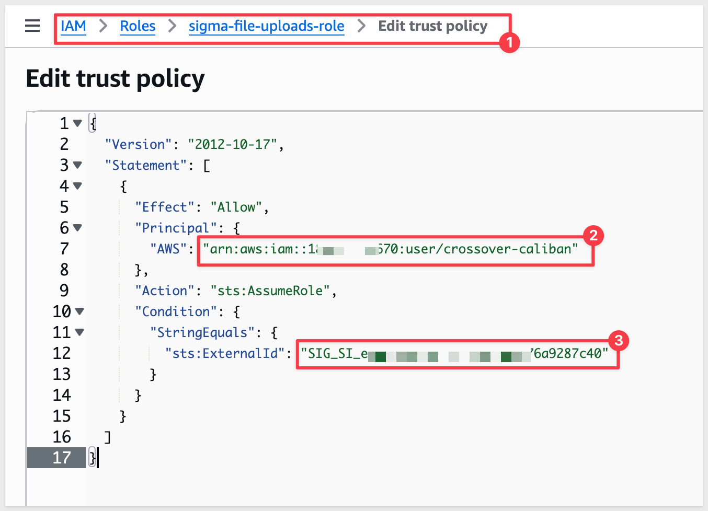

Click `Update policy`.

### Verify Configuration
Return to Sigma and click `Test connection` on the Storage Integration page:

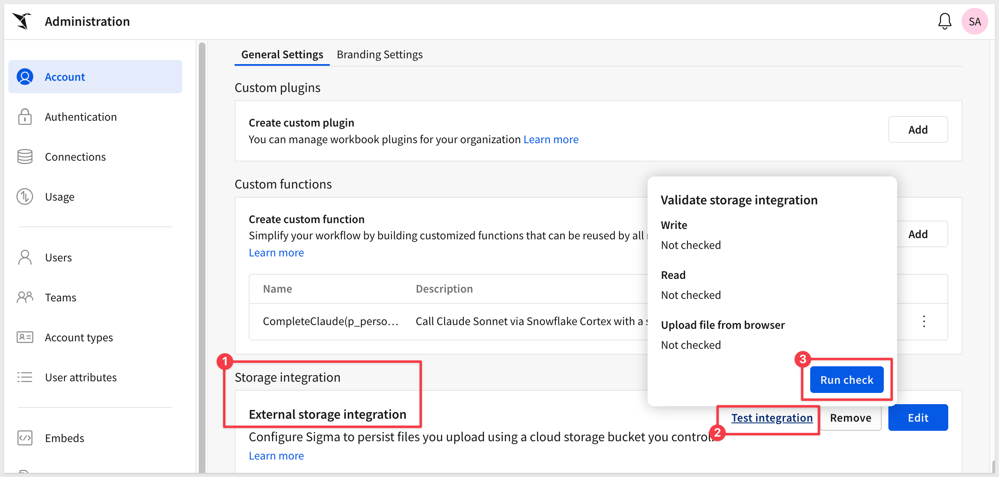

If configured correctly, you'll see a success message confirming Sigma can access your S3 bucket:

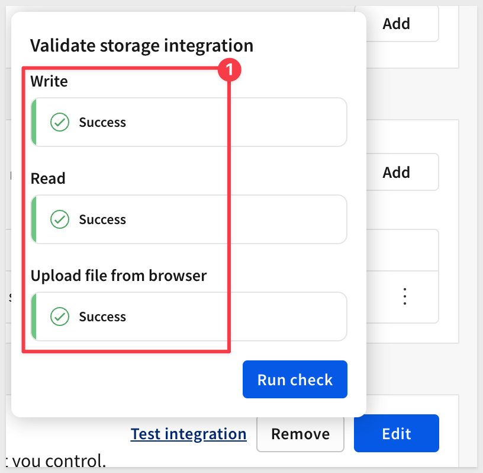

Sigma will now persist all uploaded files to your S3 bucket, making them accessible for downstream processing in Snowflake.

For additional details, see [Configure storage integration for file upload columns](https://help.sigmacomputing.com/docs/configure-storage-integration-for-file-upload-columns)


<!-- END OF SECTION-->

## Configure Snowflake Cortex AI
Duration: 5

Before setting up storage integration, you need to ensure Snowflake Cortex AI is properly configured with a vision-capable model.

### Enable Cross-Region Inference

Multi-modal AI models (like Claude) that can analyze images may not be available in all Snowflake regions by default. Enable cross-region inference to access these models.

In Snowflake, run as ACCOUNTADMIN:

```code
USE ROLE ACCOUNTADMIN;
ALTER ACCOUNT SET CORTEX_ENABLED_CROSS_REGION = 'AWS_US';
```

<aside class="positive">
<strong>NOTE:</strong><br> You can use <code>AWS_EU</code> or <code>ANY_REGION</code> instead of <code>AWS_US</code> based on your preference. See <a href="https://docs.snowflake.com/en/user-guide/snowflake-cortex/cross-region-inference">Snowflake's cross-region inference documentation</a> for details.
</aside>

### Test Which Models Are Available

Different Snowflake regions have different models available. Test which models work in your region:

```code
-- Test Claude models (vision-capable, best for multi-modal)
SELECT SNOWFLAKE.CORTEX.COMPLETE('claude-sonnet-4-5', 'Say hello') AS response;

-- Test Reka (vision-capable)
SELECT SNOWFLAKE.CORTEX.COMPLETE('reka-flash', 'Say hello') AS response;

-- Test text-only models (these will NOT work for image processing)
SELECT SNOWFLAKE.CORTEX.COMPLETE('mistral-7b', 'Say hello') AS response;
SELECT SNOWFLAKE.CORTEX.COMPLETE('mixtral-8x7b', 'Say hello') AS response;
SELECT SNOWFLAKE.CORTEX.COMPLETE('llama3-70b', 'Say hello') AS response;
```

Run each query to see which models are available in your region.

**Choose a vision-capable model** that works:
- `claude-sonnet-4-5` (recommended for best quality)
- `reka-flash` (alternative vision model)

You'll use this model name in the application's `LLM` control later.

<aside class="negative">
<strong>IMPORTANT:</strong><br> Text-only models like <code>mistral-7b</code>, <code>mixtral-8x7b</code>, and <code>llama3-70b</code> will NOT work for image processing. You must use a multi-modal vision model like Claude or Reka for this QuickStart.
</aside>


<!-- END OF SECTION-->

## Create Snowflake Storage Integration
Duration: 10

To make files uploaded via Sigma accessible for AI processing in Snowflake, you need to create a database, schema, storage integration, and external stage.

### Create or Use Database and Schema
First, create a database and schema to store your file upload stage, or use existing ones if you prefer.

In Snowflake, run the following SQL:

```code
USE ROLE ACCOUNTADMIN;
CREATE DATABASE IF NOT EXISTS QUICKSTARTS;
USE DATABASE QUICKSTARTS;

CREATE SCHEMA IF NOT EXISTS FILE_UPLOADS;
USE SCHEMA FILE_UPLOADS;
```

<aside class="positive">
<strong>NOTE:</strong><br> You can use an existing database and schema if you prefer. Just make sure to use the same database and schema names consistently in the following steps.
</aside>

### Create Storage Integration

Run the following SQL to create a storage integration mapped to your AWS S3 bucket:

```code
CREATE OR REPLACE STORAGE INTEGRATION my_file_uploads_storage_integration
  TYPE = EXTERNAL_STAGE
  STORAGE_PROVIDER = 'S3'
  ENABLED = TRUE
  STORAGE_AWS_ROLE_ARN = 'arn:aws:iam::YOUR_AWS_ACCOUNT_ID:role/sigma-file-uploads-role'
  STORAGE_ALLOWED_LOCATIONS = ('s3://file-uploads-quickstart/');
```

<aside class="negative">
<strong>IMPORTANT:</strong><br> Replace the entire <code>STORAGE_AWS_ROLE_ARN</code> value with your actual IAM role ARN from AWS:
<ul>
<li>Go to AWS Console > IAM > Roles > sigma-file-uploads-role</li>
<li>Copy the full ARN (e.g., <code>arn:aws:iam::849276620055:role/sigma-file-uploads-role</code>)</li>
<li>Replace <code>YOUR_AWS_ACCOUNT_ID</code> with your actual 12-digit AWS account ID</li>
<li>Replace <code>file-uploads-quickstart</code> with your actual S3 bucket name</li>
</ul>
</aside>

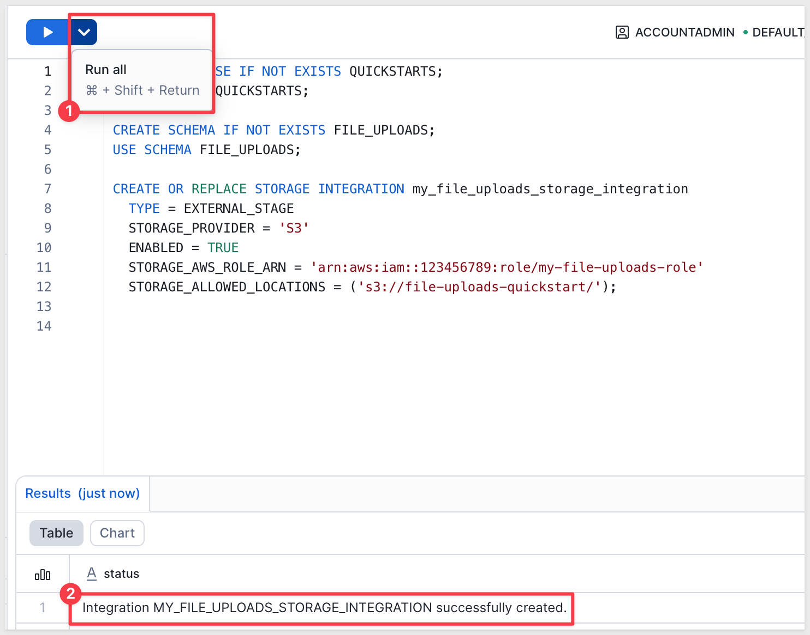

### Update IAM Trust Policy for Snowflake

Now you need to update your AWS IAM role to trust both Sigma AND Snowflake.

First, get Snowflake's IAM credentials:

```code
DESC STORAGE INTEGRATION my_file_uploads_storage_integration;
```

From the output, copy these two values:
- **STORAGE_AWS_IAM_USER_ARN** (e.g., `arn:aws:iam::644982758253:user/yq810000-s`)
- **STORAGE_AWS_EXTERNAL_ID** (e.g., `AJB44127_SFCRole=2_PRSQLGRBPzzYcOuK1pSOUmr5beI=`)

In AWS Console, navigate to IAM > Roles > `sigma-file-uploads-role` > Trust relationships > Edit trust policy.

Replace the trust policy with the following, adding BOTH Sigma and Snowflake credentials:

```code
{
  "Version": "2012-10-17",
  "Statement": [
    {
      "Effect": "Allow",
      "Principal": {
        "AWS": [
          "PASTE_SIGMA_AWS_IAM_USER_ARN_HERE",
          "PASTE_SNOWFLAKE_STORAGE_AWS_IAM_USER_ARN_HERE"
        ]
      },
      "Action": "sts:AssumeRole",
      "Condition": {
        "StringEquals": {
          "sts:ExternalId": [
            "PASTE_SIGMA_AWS_EXTERNAL_ROLE_ARN_HERE",
            "PASTE_SNOWFLAKE_STORAGE_AWS_EXTERNAL_ID_HERE"
          ]
        }
      }
    }
  ]
}
```

<aside class="negative">
<strong>IMPORTANT:</strong><br> Replace all four placeholder values:
<ul>
<li><strong>Sigma values</strong>: From Sigma > Administration > Account > Storage Integration (AWS IAM user ARN and AWS external role ARN)</li>
<li><strong>Snowflake values</strong>: From the DESC STORAGE INTEGRATION command above (STORAGE_AWS_IAM_USER_ARN and STORAGE_AWS_EXTERNAL_ID)</li>
</ul>
</aside>

Click `Update policy` in AWS.

Grant usage on the storage integration to the role that Sigma uses to connect to Snowflake:

```code
GRANT USAGE ON INTEGRATION my_file_uploads_storage_integration TO ROLE sigma_user;
```

<aside class="negative">
<strong>IMPORTANT:</strong><br> Replace <code>sigma_user</code> with the actual Snowflake role that your Sigma connection uses. You can find this in Sigma under <strong>Administration</strong> > <strong>Connections</strong> > select your Snowflake connection > view the <strong>Role</strong> field.
</aside>

### Create External Stage

Create an external stage in Snowflake that maps to your storage integration:

```code
CREATE OR REPLACE STAGE QUICKSTARTS.FILE_UPLOADS.FILE_UPLOADS
  STORAGE_INTEGRATION = my_file_uploads_storage_integration
  URL = 's3://file-uploads-quickstart/';
```

<aside class="negative">
<strong>IMPORTANT:</strong><br> Replace <code>file-uploads-quickstart</code> with your actual S3 bucket name (the same one you used in the storage integration). If you used a different database or schema name, update <code>QUICKSTARTS.FILE_UPLOADS</code> accordingly.
</aside>

<aside class="positive">
<strong>NOTE:</strong><br> Snowflake converts unquoted identifiers to uppercase, so this stage will be created as <code>FILE_UPLOADS</code> (all uppercase). The stage full path is: <code>QUICKSTARTS.FILE_UPLOADS.FILE_UPLOADS</code>
</aside>

Enable directory listing on the stage:

```code
ALTER STAGE QUICKSTARTS.FILE_UPLOADS.FILE_UPLOADS SET DIRECTORY = (ENABLE = TRUE);
```

Grant permissions to your Sigma user role:

```code
-- Grant access to database and schema
GRANT USAGE ON DATABASE QUICKSTARTS TO ROLE sigma_user;
GRANT USAGE ON SCHEMA QUICKSTARTS.FILE_UPLOADS TO ROLE sigma_user;

-- Grant access to the stage
GRANT USAGE, READ, WRITE ON STAGE QUICKSTARTS.FILE_UPLOADS.FILE_UPLOADS TO ROLE sigma_user;

-- Grant access to Snowflake Cortex AI functions
GRANT DATABASE ROLE SNOWFLAKE.CORTEX_USER TO ROLE sigma_user;

-- Grant access to Sigma's input table schema
-- Note: Database and schema names may vary based on your Sigma configuration
-- Check Administration > Connections > [Your Connection] > Write access settings
GRANT INSERT, UPDATE, DELETE ON FUTURE TABLES IN SCHEMA SIGMA_INTERNAL.INPUT_TABLES_WRITE TO ROLE sigma_user;
```

<aside class="negative">
<strong>IMPORTANT:</strong><br> Replace <code>sigma_user</code> with the same Snowflake role from the previous step (the role your Sigma connection uses). The <code>CORTEX_USER</code> database role is required to use Snowflake's AI functions.
</aside>

<aside class="negative">
<strong>IMPORTANT - Input Table Schema:</strong><br> The database and schema names for input tables (<code>SIGMA_INTERNAL.INPUT_TABLES_WRITE</code> in this example) may be different in your Sigma environment. To find the correct names:
<ol>
<li>Go to <strong>Administration</strong> > <strong>Connections</strong> in Sigma</li>
<li>Select your Snowflake connection</li>
<li>Look in the <strong>Write access</strong> section for the database and schema names</li>
<li>Update the GRANT statements above with your actual names</li>
</ol>
If you see an error like "Insufficient privileges to operate on schema 'INPUT_TABLES_WRITE'" when using input tables, this is the grant you're missing.
</aside>

<aside class="positive">
<strong>TIP:</strong><br> Verify your stage configuration by running <code>LIST @QUICKSTARTS.FILE_UPLOADS.FILE_UPLOADS;</code> in Snowflake after uploading a test file through Sigma.
</aside>


<!-- END OF SECTION-->

## Build the AI App in Sigma
Duration: 20

Now you'll build the application interface that allows users to upload files and interact with AI processing.

### Create Initial Workbook Structure
Create a new workbook in Sigma.

Rename the default page to `Main`.

From the element bar at the bottom of the page, click `Controls` and select `File upload`.

Configure the file upload control:
- Change `Control ID` in the properties panel to `Load-file`
- Deselect `Allow multiple files`
- Click the `Format` tab and disable `Show label`

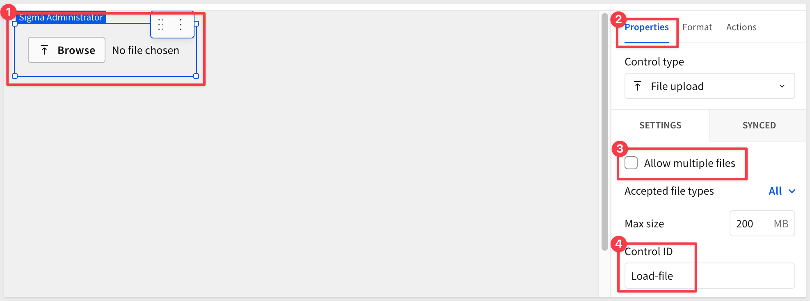

### Add Input Table for Files
Add a new workbook page and rename it `Admin`.

From the element bar, click `Input` > `Empty` and select your Snowflake connection.

<aside class="negative">
<strong>IMPORTANT:</strong><br> Your Snowflake connection must have write access enabled to use input tables. See <a href="https://help.sigmacomputing.com/docs/connect-to-snowflake#configure-write-access">Configure write access</a> for setup instructions.
</aside>

Configure the input table columns:
1. Double-click the existing `Text` column header and rename it to `Name`
2. Click the `+` next to this column and add columns with these names and types:
   - `FileID` (Text)
   - `Type` (Text)
   - `AI Summary` (Text)
   - `AI Detailed Description` (Text)
 
3. Click the `+` next to the last column and select `File` as the column type (leave the column name as `File`)
4. Drag the `File` column to the first position (before all other columns)

Your column order should be: File, Name, FileID, Type, AI Summary, AI Detailed Description

Rename the table to `My files` by double-clicking the table name.

Delete the pre-populated rows:
- Highlight rows 1-3, right-click and select `Delete 3 rows`:

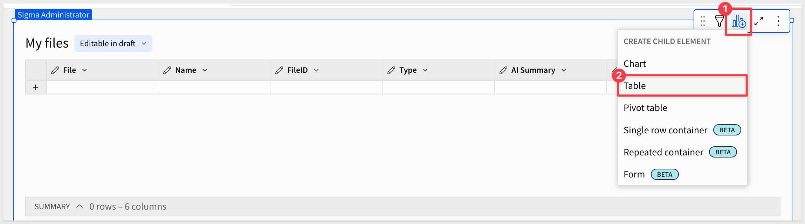

<aside class="positive">
<strong>NOTE:</strong><br> Keep the table in "Editable in draft" mode during development so you can test the file upload actions without having to publish the workbook. You can change it to "Editable in published version (all users)" later when you're ready to deploy.
</aside>

### Add Row ID Column
Add a Row ID column to uniquely identify each row in the `My files` table.

Click the `+` next to the last column, choose the Sigma provided `Row ID` column type.

Rename the column to `RowID`

<aside class="positive">
<strong>NOTE:</strong><br> The FileID column will be populated automatically when files are uploaded via the action sequence you'll configure in a later section. It stores the actual filename in S3 (with Sigma's prefix and UUID).
</aside>

### Create Child Table on Main Page
Now create a child table that will be displayed to users on the Main page.

In the upper right corner of the `My files` table, click `Create Child Element` > `Table`.


Click the 3-dot menu on this **new child table** and select `Move to` > `Main`.

Rename the child table to `Your files with insight`.

This child table will display all the same data as the parent table on the `Admin` page, but users will interact with it on the `Main` page.

### Create Admin Page Controls

Now add the control variables that will be used in formulas throughout the application.

Navigate to the `Admin` page.

Add two text input controls and configure them:

From the element bar, click `Controls` > `Text input`.

Configure the first control:
- Change `Control ID` to `Llm`
- Enter value: `claude-sonnet-4-5`

Add one more text input control to the Admin page:

1. **Add another text input control**
   - Change `Control ID` to `Stage`
   - Enter value: `@QUICKSTARTS.FILE_UPLOADS.FILE_UPLOADS`

<aside class="negative">
<strong>IMPORTANT:</strong><br> If you used different database, schema, or stage names when creating your Snowflake stage, update the Stage value to match your actual stage path. Remember that Snowflake converts unquoted identifiers to uppercase.
</aside>

<aside class="positive">
<strong>NOTE:</strong><br> The Llm and Stage controls hold configuration values used in your AI processing formulas throughout the application.
</aside>

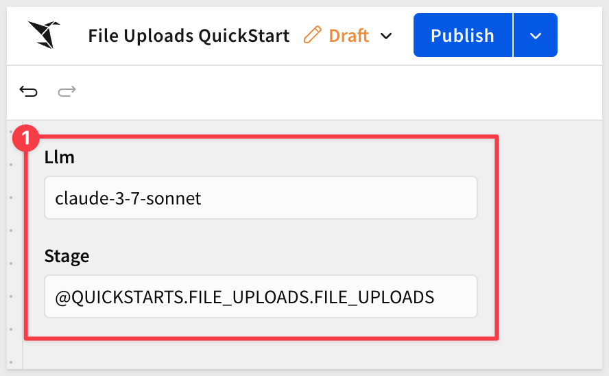

### Add Delete Button Column
On the `Main` page, in the `Your files with insight` child table, click the `+` next to the last column to add a new column.

Configure the delete column:
1. Rename the column to `Delete` by double-clicking the column header
2. In the formula bar, enter:
```code
"https://cdn-icons-png.flaticon.com/128/6861/6861362.png"
```
3. Transform the column type to `set image`:

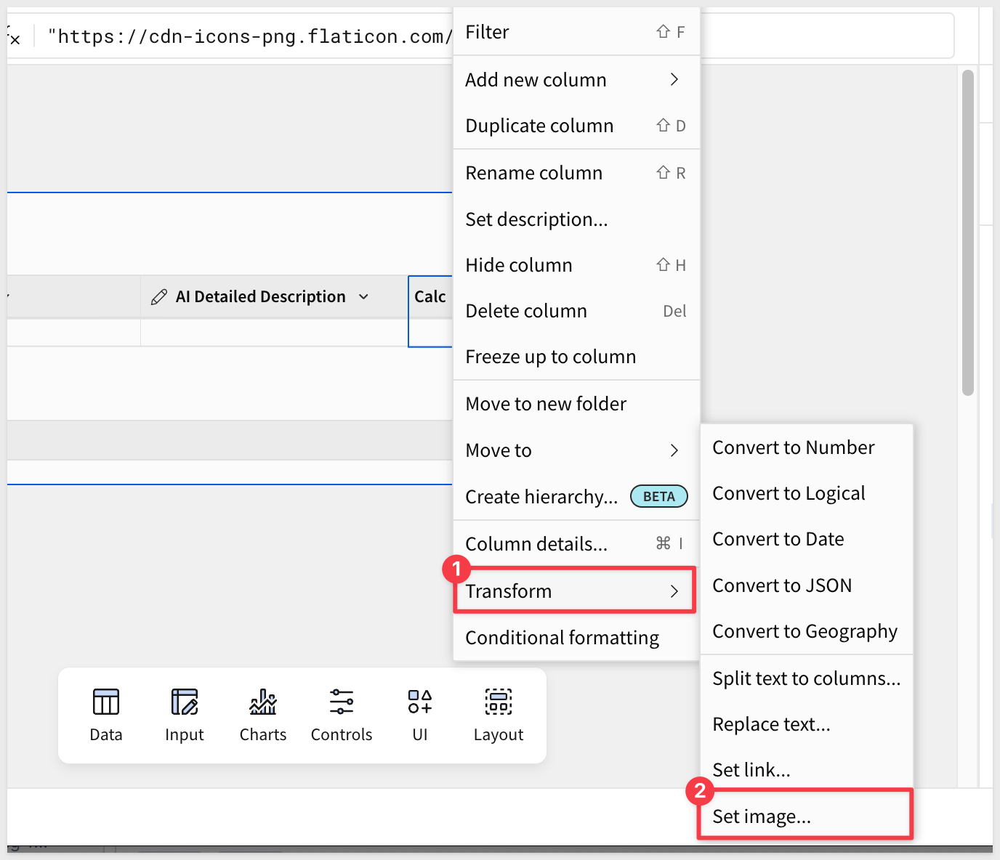

Set the image size to `25 x 48` and enable `Preserve aspect ratio`:

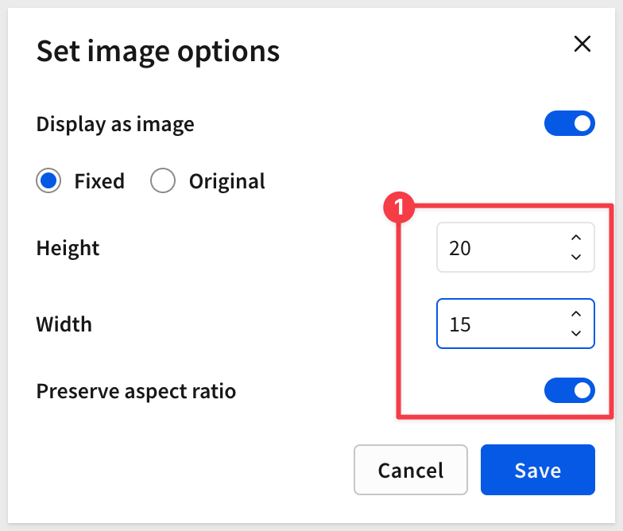

We can test that the trash icon appears by hitting `Enter` on the `Admin` > `My files` input table.

4. With the `Delete` column selected. click the **Actions** tab in the properties panel
5. Click `Add action` and select `Delete row(s)`
6. Configure the action:
   - **In**: `Your files with insight (Main)`
   - **Delete row(s) by**: `Single row`
   - **Column**: Select `RowID`
   - **ID**: Select `RowID`

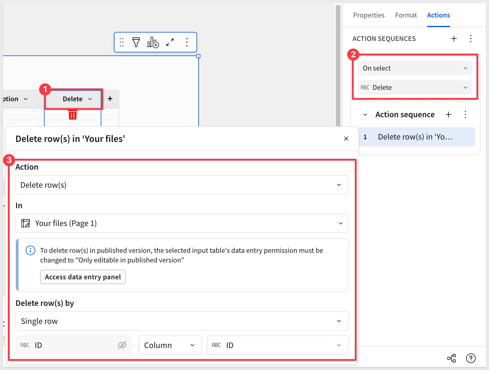

Add one more action to `Refresh` the `Your files with insight (Main)` table after the row is deleted.

The trash icon will now act as a clickable delete button for each row.

Hide the `RowID` column.

<aside class="positive">
<strong>TIP:</strong><br> You can use any image URL for the delete icon. The formula creates a calculated column that displays the image in every row.
</aside>

<aside class="negative">
<strong>IMPORTANT:</strong><br> The delete button removes the row from the Sigma input table, but does <strong>not</strong> delete the actual file from S3. Files remain in your S3 bucket even after being removed from the table. To clean up unused files in S3, you can manually delete them from the AWS Console or configure S3 lifecycle policies to automatically remove old files.
</aside>

### Add Calculated Columns for Preview and Results

**1. Add Preview Column**

In the `Your files with insight` table click the `+` button after the `File` column and select `Add a new column`.

Rename the column to `Preview`.

Enter this formula:
```code
If(IsNull([FileID]), "https://cdn.pixabay.com/photo/2017/03/08/21/19/file-2127825_640.png", SplitPart([Type], "/", 1) = "image", CallText("get_presigned_url", [Stage], [FileID]), SplitPart([Type], "/", 2) = "plain", "https://cdn.pixabay.com/photo/2017/03/08/21/19/file-2127825_640.png", SplitPart([Type], ".", -1) = "document", "https://cdn.pixabay.com/photo/2017/03/08/21/19/file-2127825_640.png", SplitPart([Type], "/", 2) = "pdf", "https://static.vecteezy.com/system/resources/thumbnails/023/234/824/small/pdf-icon-red-and-white-color-for-free-png.png", SplitPart([Type], ".", -1) = "presentation", "https://cdn-icons-png.flaticon.com/512/9034/9034417.png", SplitPart([Type], "/", 1) = "audio", "https://image.similarpng.com/file/similarpng/original-picture/2021/07/Sound-wave-pattern.-Equalizer-graf-design.png", SplitPart([Type], "/", 1) = "video", "https://image.similarpng.com/file/similarpng/original-picture/2021/07/Sound-wave-pattern.-Equalizer-graf-design.png", "https://cdn.pixabay.com/photo/2017/03/08/21/19/file-2127825_640.png")
```

<aside class="positive">
<strong>NOTE:</strong><br> This formula references the <code>[Stage]</code> control you created earlier. The <code>IsNull([FileID])</code> check at the beginning prevents errors when the table is empty by returning a default placeholder image.
</aside>

Transform the column to `set image`.

<aside class="positive">
<strong>NOTE:</strong><br> This formula generates presigned URLs for images (so they can be displayed directly) and uses placeholder icons for other file types.
</aside>

**2. Add AI Results Column**

Click the `+` button after the `Type` column and select `Add a new column` > `Calculation`.

Rename the column to `AI Results`.

Enter this formula:
```code
[AI Detailed Description]
```

<aside class="positive">
<strong>NOTE:</strong><br> For now, this column simply displays the detailed description. If you want to add the ability to switch between detailed description and summary, you would add a segment control on the Main page and update this formula to: <code>Switch([SegmentSelection], "AI Summary", [AI Summary], [AI Detailed Description])</code>
</aside>

### Add Visual Separation
From the element bar, click `UI` > `Divider`.

Drag this divider between your file uploader and table.

Select all three objects (file uploader, divider, and table) by dragging a selection box around them.

Click `Create container` to group them together.

Your workbook should now show a clean file upload interface with a table to display results.

Click `Save as` and name the workbook `File Uploads QuickStart`:


<!-- END OF SECTION-->

## Configure AI Processing Actions
Duration: 20

Next we will configure actions that automatically process files when they're uploaded, using different AI functions based on file type.

<aside class="positive">
<strong>NOTE:</strong><br> The Admin page controls (Llm, Stage) that you created earlier will be used in the action sequences you're about to configure.
</aside>

### Create Processing Modal
Click `+` in the lower left corner and select `Add modal`:

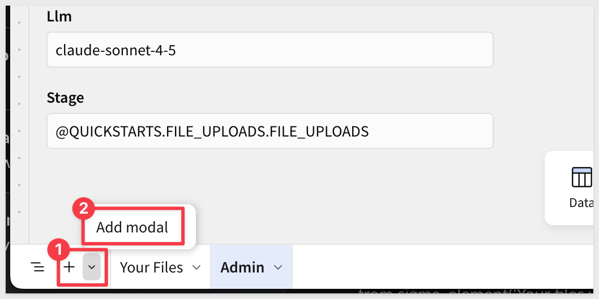

Click the `Format` tab in the properties panel:
- In the `Footer` section, deselect both button options

Minimize the modal height:

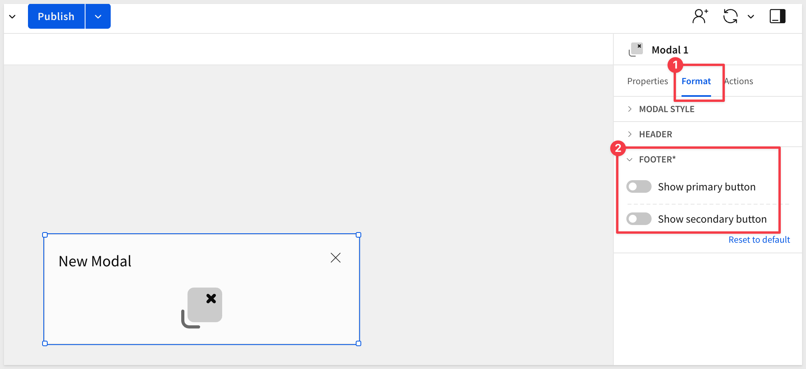

Change the header text to `Please wait...` 

Select `UI` from the bottom toolbar and click `Image` object.

Any image will do, but we used an animated gif:

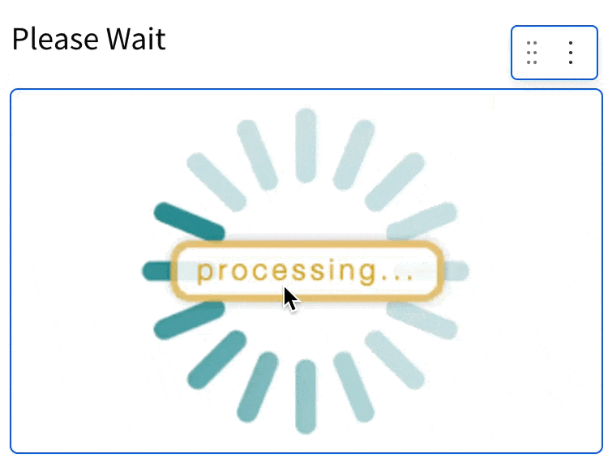

### Add Action Sequence 1: Process Images
Return to the `Main` page and select the `Load file` upload control (with the `Browse` button).

Click `Actions` in the right-hand properties panel.

Click the 3-dot menu next to `Action sequence` and select `Add condition`.

In the box under `Custom formula`, enter:
```code
SplitPart(Text(Json(Text([Load-file])).type), "/", 1) = "image"
```

This condition checks if the uploaded file is an image.

Now add the 5-step action sequence by clicking the `+` button repeatedly:

**Action 1**: Select `Open modal` and choose the `Modal Wait` modal you created.

**Action 2**: Select `Insert row`
- **Into**: `My files (Admin)`
- Configure the column mappings for all columns:
  - **File**: Control → `Load file (Main)`
  - **Name**: Formula → `Text(Json(Text([Load-file])).name)`
  - **FileID**: Formula → `Text(Json(Text([Load-file])).id)`
  - **Type**: Formula → `Text(Json(Text([Load-file])).type)`
  - **AI Summary**: Formula → `Text(CallVariant("ai_complete", [Llm], "give a brief 2-3 sentence summary of the following: ", CallText("to_file", [Stage], Text(Json(Text([Load-file])).id))))`
  - **AI Detailed Description**: Formula → `Text(CallVariant("ai_complete", [Llm], "give a detailed description of the following: ", CallText("to_file", [Stage], Text(Json(Text([Load-file])).id))))`

<aside class="positive">
<strong>NOTE:</strong><br> Both AI calls (Summary and Detailed Description) run when the file is uploaded. The AI Summary provides a quick 2-3 sentence overview, while the AI Detailed Description provides comprehensive analysis. Processing can take time depending on file size and complexity.
</aside>

**Action 3**: Select `Clear control`
- **Apply to**: `Specific control`
- **Control**: `Load file (Main)`

**Action 4**: Select `Refresh element`
- **Element**: `Your files with insight (Main)`

**Action 5**: Select `Close modal`

### Add Action Sequence 2: Process Audio/Video (Optional)
<aside class="positive">
<strong>OPTIONAL:</strong><br> This section is optional. You can test the application with just image processing. Add audio/video and document processing later if needed for your use case.
</aside>

Click the 3-dot menu next to the first action sequence you just created and select `Duplicate`.

Change the condition formula to:
```code
In(SplitPart(Text(Json(Text([Load-file])).type), "/", 1), "audio", "video")
```

In **Action 2** (Insert row), update the AI formulas to use transcription:
- **AI Summary**: Formula → `Text(CallVariant("ai_complete", [Llm], Concat("give a brief 2-3 sentence summary of the following: ", CallText("to_varchar", CallText("ai_transcribe", CallText("to_file", [Stage], Text(Json(Text([Load-file])).id)))))))`
- **AI Detailed Description**: Formula → `Text(CallVariant("ai_complete", [Llm], Concat("give a detailed description of the following: ", CallText("to_varchar", CallText("ai_transcribe", CallText("to_file", [Stage], Text(Json(Text([Load-file])).id)))))))`

This uses AI_TRANSCRIBE to convert audio/video to text before analyzing.

Leave all other column mappings and actions in the sequence unchanged.

### Add Action Sequence 3: Process Documents (Optional)

<aside class="positive">
<strong>OPTIONAL:</strong><br> This section is also optional. The core application works with just image processing configured above.
</aside>

Click the 3-dot menu next to the action sequence and select `Duplicate` again.

Change the condition formula to:
```code
Not(In(SplitPart(Text(Json(Text([Load-file])).type), "/", 1), "image", "audio", "video"))
```

This catches all other file types (PDFs, Office docs, etc.).

In **Action 2** (Insert row), update the AI formulas to use document parsing:
- **AI Summary**: Formula → `Text(CallVariant("ai_complete", [Llm], Concat("give a brief 2-3 sentence summary of the following: ", CallText("get", CallText("ai_parse_document", CallText("to_file", [Stage], Text(Json(Text([Load-file])).id))), "content"))))`
- **AI Detailed Description**: Formula → `Text(CallVariant("ai_complete", [Llm], Concat("give a detailed description of the following: ", CallText("get", CallText("ai_parse_document", CallText("to_file", [Stage], Text(Json(Text([Load-file])).id))), "content"))))`

This uses AI_PARSE_DOCUMENT to extract text from documents before analyzing.

Leave all other column mappings and actions in the sequence unchanged.

<aside class="positive">
<strong>TIP:</strong><br> You can rename action sequences by double-clicking their names. Use descriptive names like "Process Image Files", "Process Audio/Video Files", and "Process Document Files" to make them easier to manage.
</aside>


<!-- END OF SECTION-->

## Add Multi-Modal Inquiry Feature
Duration: 10

Now you'll add the ability to ask questions across all uploaded files simultaneously.

### Create Inquiry Interface

From the element bar, click `Controls` > `Text input`.

Change `Control ID` to `CollectiveInquiry`.

Drag it to the right side of your existing container.

From the element bar, click `UI` > `Button`.

Change the button `Text` to `Clear`.

Drag it to the right of the `CollectiveInquiry` text input.

Select both new objects (text input and button) and click `Create container`:

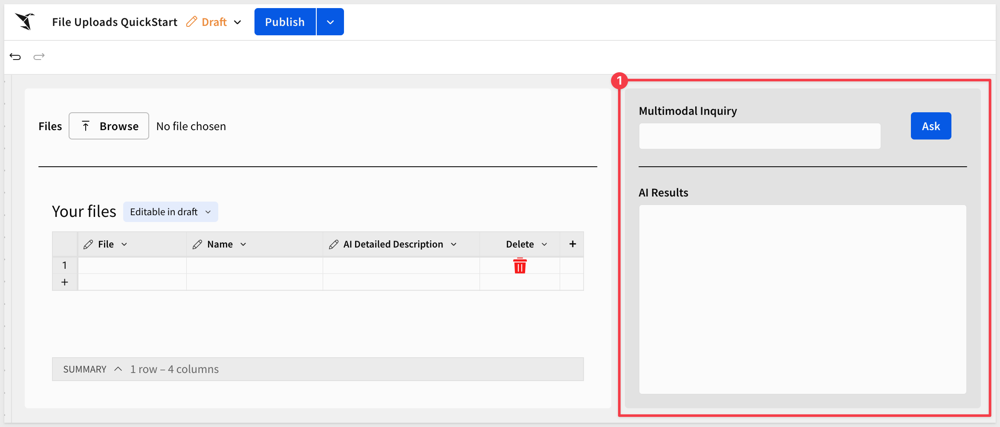

### Create Multi-Modal Custom SQL

Now you'll create a SQL table that allows users to ask questions across ALL uploaded files simultaneously. This is the "multi-modal inquiry" feature.

**How it works:**
1. **Aggregates all file data**: Uses `listagg()` to combine all file names and AI descriptions into a single text string
2. **Checks for user question**: Uses the `{{CollectiveInquiry}}` control parameter - if the user typed a question, it proceeds; if empty, shows "Ask optional question above"
3. **Passes to AI**: Sends the user's question + all aggregated file data to `ai_complete()` for analysis
4. **Returns comprehensive answer**: AI analyzes all files together and answers the question based on the combined context

Click `Data` from the element bar, then select `Table` > `SQL`.

Select your Snowflake connection.

Click `SQL` and paste in the following:

```code
with mycte as
(select
listagg( concat('File name: ', "Name", ', Detail Description: ', "AI Detailed Description", ' ; \n' )) all_results
from sigma_element('Your files with insight'))
select iff({{CollectiveInquiry}} is not null,
ai_complete({{LLM}}, concat('Answer the following inquiry', {{CollectiveInquiry}}, ' from the following: ', all_results)), 'Ask optional question above') multimodal_results from mycte
```

<aside class="positive">
<strong>SQL Breakdown:</strong><br>
• <code>sigma_element('Your files with insight')</code> - References your child table containing all uploaded files<br>
• <code>listagg(concat(...))</code> - Concatenates all rows into one long string with file names and descriptions<br>
• <code>{{CollectiveInquiry}}</code> - Parameter from the text input control (the user's question)<br>
• <code>{{LLM}}</code> - Parameter from the Llm control (which AI model to use)<br>
• <code>ai_complete()</code> - Snowflake Cortex function that sends the prompt to the AI and returns the answer
</aside>

<aside class="negative">
<strong>IMPORTANT:</strong><br> If your input table has a different name than 'Your files with insight', update the <code>sigma_element()</code> reference in the SQL to match your table name.
</aside>

Click `Run` to execute the query.

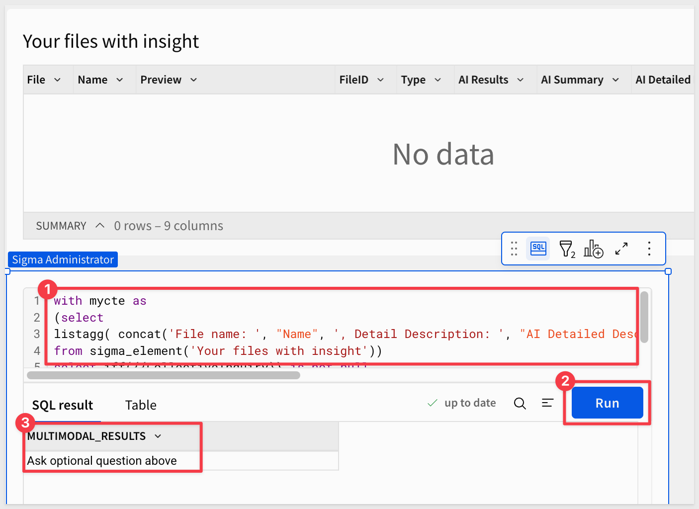

In the element panel, click the `Format` tab and turn off both the `Title` and `Show summary bar`.

Change the table to `Presentation mode`.

Drag the table to position it next to the `Your files` table:

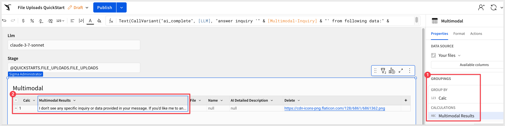

### Configure Clear Button Action
Select the `Clear` button.

Click `Actions` in the properties panel.

Click the `+` button to add an action:

**Action**: Select `Clear control` and choose `CollectiveInquiry`.


<!-- END OF SECTION-->

## Test the Application
Duration: 10

Now you're ready to test your multi-modal file processing application.

### Test Basic File Upload

To make the example really simple, we created two screenshots, one of Sigma's homepage and another of the QuickStarts homepage. We will upload them both and then ask the AI to compare them, just to see what happens.

Upload any test image by clicking the `Browse` button in the `Load file` control.

The application will:
1. Show the "Processing..." modal while the files are uploaded and the AI evaluates the content
2. Automatically generate an AI Detailed Description and AI Summary
3. Display the file and descriptions in the `Your files with insight` table

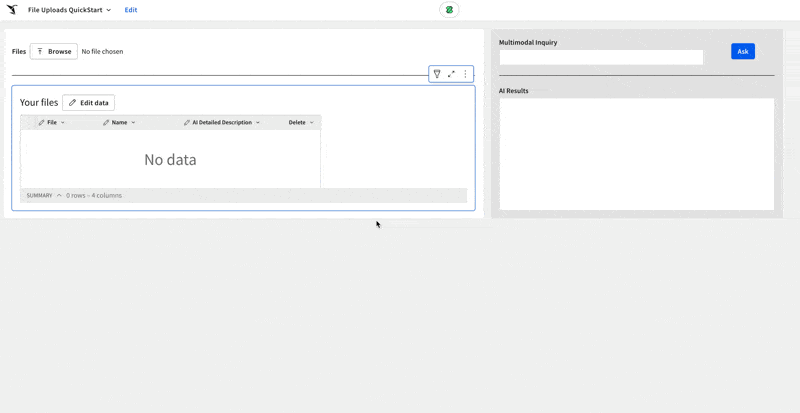

### Test Multi-Modal Inquiry
After uploading multiple files:

1. Type a question in the `CollectiveInquiry` field and press `Enter`.

Examples questions:
   - "What is the common theme in my files?"
   - "Compare and contrast my files"
   - "Summarize the key information across all documents"

2. The multimodal results table will automatically update with the AI-generated response

The AI will analyze all uploaded files collectively and provide an integrated answer based on their combined content. Use the `Clear` button to reset the inquiry field when needed:

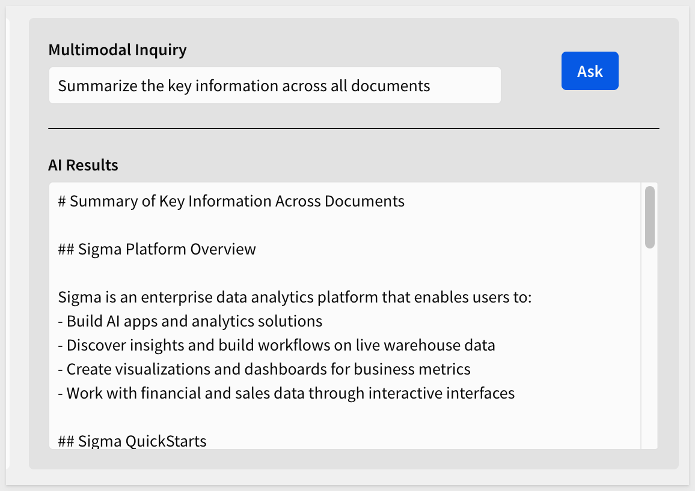

### Expected Results
You should now have a working multi-modal AI application that:
- Processes images (and documents, and audio/video files if you configured those) automatically
- Generates intelligent descriptions of file content
- Answers natural language questions across multiple files
- Provides a clean, user-friendly interface for unstructured data analysis
- Ready for final clean-up and other usability enhancements to suit


<!-- END OF SECTION-->

## Troubleshooting
Duration: 5

This section covers common issues you may encounter and how to resolve them.

### Error: "Edits can only be made in draft mode"

**Symptom**: When uploading a file, you see: `Error in Insert row into 'My files' - Edits can only be made in draft mode`

**Solution**: Click the `Edit` button in the top-right of the workbook to enter draft/edit mode. Input table actions only work in draft mode during development. Once you publish the workbook with the table set to "Editable in published version", end users will be able to insert rows.

### Error: "Warehouse error: query failed" during file upload

**Symptom**: Files upload to S3 but the Insert row action fails with a vague warehouse error.

**Root Cause**: Usually an AWS permissions or Snowflake grants issue.

**Solution**: Check these in order:

**1. Verify Snowflake can access the stage**

```code
USE ROLE your_sigma_role;
LIST @QUICKSTARTS.FILE_UPLOADS.FILE_UPLOADS;
```

If this fails with an AWS assume role error, the IAM trust policy is incorrect.

**2. Check IAM trust policy includes both Sigma AND Snowflake**

In AWS Console > IAM > Roles > sigma-file-uploads-role > Trust relationships, verify BOTH:
- Sigma's IAM user ARN and External ID (from Sigma Admin page)
- Snowflake's IAM user ARN and External ID (from `DESC STORAGE INTEGRATION`)

The trust policy should have arrays with both values:

```code
"AWS": [
  "arn:aws:iam::XXXX:user/sigma-user",
  "arn:aws:iam::XXXX:user/snowflake-user"
],
"sts:ExternalId": [
  "sigma-external-id",
  "snowflake-external-id"
]
```

**3. Verify Cortex permissions**

```code
SHOW GRANTS TO ROLE your_sigma_role;
```

Look for `DATABASE ROLE SNOWFLAKE.CORTEX_USER`. If missing:

```code
USE ROLE ACCOUNTADMIN;
GRANT DATABASE ROLE SNOWFLAKE.CORTEX_USER TO ROLE your_sigma_role;
```

**4. Verify stage permissions**

```code
SHOW GRANTS TO ROLE your_sigma_role;
```

Look for `USAGE, READ, WRITE ON STAGE`. If missing:

```code
USE ROLE ACCOUNTADMIN;
GRANT USAGE, READ, WRITE ON STAGE QUICKSTARTS.FILE_UPLOADS.FILE_UPLOADS TO ROLE your_sigma_role;
```

**5. Test the AI function directly in Snowflake**

```code
USE ROLE your_sigma_role;
SELECT SNOWFLAKE.CORTEX.AI_COMPLETE(
  'claude-3-7-sonnet',
  'Say hello'
) AS result;
```

If this fails, check cross-region inference is enabled:

```code
USE ROLE ACCOUNTADMIN;
ALTER ACCOUNT SET CORTEX_ENABLED_CROSS_REGION = 'AWS_US';
```

### Error: "Error assuming AWS_ROLE: User is not authorized to perform sts:AssumeRole"

**Symptom**: Snowflake cannot access the S3 stage.

**Solution**: The AWS IAM role trust policy doesn't trust Snowflake's IAM user. Follow the "Update IAM Trust Policy for Snowflake" section to add Snowflake's credentials to the trust policy.

### Files upload to S3 but don't appear in the table

**Symptom**: You can see files in the S3 bucket, but the Insert row action doesn't add them to the Sigma table.

**Solution**:
1. Make sure you're in Edit mode (not published/view mode)
2. Check the browser console for JavaScript errors
3. Verify all column mappings in the Insert row action (Action 2) are configured correctly
4. Simplify the AI Detailed Description formula to a static value to isolate if the issue is with the AI processing

### Admin page controls (Llm, Stage) are empty

**Symptom**: The Llm or Stage controls on the Admin page don't have values.

**Solution**: Navigate to the Admin page and manually enter:
- **Llm**: `claude-sonnet-4-5` (or your preferred vision-capable model)
- **Stage**: `@QUICKSTARTS.FILE_UPLOADS.FILE_UPLOADS` (or your actual stage path)

Save the workbook after setting these values.


<!-- END OF SECTION-->

## Managing S3 Storage
Duration: 5

### Understanding File Deletion Behavior

The Action column's delete button removes rows from the Sigma input table, but **does not delete the actual files from S3**.

<aside class="positive">
<strong>NOTE:</strong><br> It is possible to configure the delete button to also remove files from S3 using Snowflake stored procedures with External Access Integrations and the boto3 Python package. However, this requires additional AWS credential configuration and is beyond the scope of this QuickStart. For most use cases, the options below provide simpler file management approaches.
</aside>

### Managing S3 Files

You have several options for managing files in your S3 bucket:

**Option 1: Manual Cleanup**
- Periodically review and delete old files through the AWS S3 Console
- Simple and gives you full control over what gets deleted

**Option 2: S3 Lifecycle Policies** (Recommended)
- Configure automatic deletion of files older than a certain age
- Example: Delete files older than 90 days automatically
- Set up in AWS S3 Console under `Management` > `Lifecycle rules`

**Option 3: Monitor and Alert**
- Set up AWS CloudWatch alerts for bucket size
- Manually clean up when storage costs exceed thresholds

<aside class="positive">
<strong>TIP:</strong><br> Most organizations use S3 lifecycle policies to automatically remove old files after 30, 60, or 90 days. This approach is simple, cost-effective, and doesn't require additional Snowflake configuration.
</aside>

### Example: S3 Lifecycle Policy

To automatically delete files older than 90 days:

1. In AWS S3 Console, select your bucket
2. Navigate to `Management` > `Lifecycle rules`
3. Click `Create lifecycle rule`
4. Configure:
   - **Rule name**: `Delete old uploads`
   - **Prefix**: (leave empty to apply to all files, or specify your Sigma prefix)
   - **Lifecycle rule actions**: Select `Expire current versions of objects`
   - **Days after object creation**: `90`
5. Click `Create rule`

Files will now be automatically deleted 90 days after upload, keeping your storage costs manageable.


<!-- END OF SECTION-->

## What we've covered
Duration: 5

In this QuickStart, you learned how to extend Sigma's file uploads feature with AI-powered processing capabilities:

- **Configured external storage integration** to persist files in your cloud storage
- **Created Snowflake storage integration and stage** to access uploaded files
- **Built action sequences** for automatic AI processing based on file type
- **Developed a multi-modal AI application** that handles images, documents, and audio/video
- **Implemented conditional processing** based on file type
- **Enabled multi-modal inquiry** to ask questions across multiple files using custom SQL

### Advanced Use Cases

The techniques in this QuickStart enable many business applications:

**Intelligent Document Processing**
- Extract structured data from invoices and receipts
- Classify documents by type and content
- Automate form data extraction

**Visual Content Analysis**
- Analyze product images for quality control
- Classify visual content for organization
- Generate metadata for image libraries

**Audio/Video Intelligence**
- Transcribe meeting recordings and generate summaries
- Analyze customer service calls
- Extract action items from video conferences

### Next Steps

Explore additional AI capabilities:
- **Structured Extraction**: Use AI_EXTRACT to pull specific fields from documents (vendor name, date, amount, etc.)
- **Classification**: Add automatic content classification using AI_COMPLETE
- **Translation**: Implement multi-language support using AI_TRANSLATE
- **Batch Processing**: Process multiple files in bulk with input tables

For more information, see:
- [Snowflake Cortex AI Functions](https://docs.snowflake.com/en/user-guide/snowflake-cortex/llm-functions)

**Additional Resource Links**

[Blog](https://www.sigmacomputing.com/blog/)<br>
[Community](https://community.sigmacomputing.com/)<br>
[Help Center](https://help.sigmacomputing.com/hc/en-us)<br>
[QuickStarts](https://quickstarts.sigmacomputing.com/)<br>

Be sure to check out all the latest developments at [Sigma's First Friday Feature page!](https://quickstarts.sigmacomputing.com/firstfridayfeatures/)
<br>

[](https://twitter.com/sigmacomputing)&emsp;
[](https://www.linkedin.com/company/sigmacomputing)&emsp;
[](https://www.facebook.com/sigmacomputing)


<!-- END OF WHAT WE COVERED -->
<!-- END OF QUICKSTART -->
