author: pballai
id: aiapps_forms
summary: aiapps_forms
categories: aiapps
environments: web
status: Published
feedback link: https://github.com/sigmacomputing/sigmaquickstarts/issues
tags: Default
lastUpdated: 2026-04-02

# Building Forms for Data Capture and Analysis

## Overview
Duration: 5

Forms are one of those features that seem simple on the surface but unlock a lot. They give you a clean, structured way to collect data from users — and because Sigma forms are bound directly to input tables, everything submitted goes straight to the warehouse. No exports. No copies. No manual reconciliation.

In this QuickStart, we'll build a customer return request form for Plugs Electronics, our fictitious electronics retailer. Customer service reps will use it to log return requests. Managers will see the results instantly — without touching the form itself.

Here's what we'll build:

- An input table to store return request data
- Column-level data validation tied to live warehouse data
- A form with multiple field types: dropdowns, radio buttons, date pickers, checkboxes, and free text
- A returns analysis view that updates as submissions come in

By the end, you'll have a working pattern you can adapt to any data entry workflow — expense reporting, incident logging, inventory requests, or anything else that involves structured input and downstream analysis.

<aside class="positive">
<strong>IMPORTANT:</strong><br> Some screens in Sigma may appear slightly different from those shown in QuickStarts. This is because Sigma continuously adds and enhances functionality. Rest assured, Sigma's intuitive interface ensures that any differences will not prevent you from successfully completing any QuickStart.
</aside>

For more information on Sigma's product release strategy, see [Sigma product releases](https://help.sigmacomputing.com/docs/sigma-product-releases)

If something is not working as you expect, here's how to [contact Sigma support](https://help.sigmacomputing.com/docs/sigma-support)

### Target Audience
Sigma builders who want to create structured data entry workflows that connect directly to the warehouse — without building a separate application or copying data out of Sigma.

### Prerequisites

<ul>
  <li>A computer with a current browser. Chrome is recommended.</li>
  <li>Access to your Sigma environment. A trial is fine.</li>
  <li>Some familiarity with Sigma workbooks is assumed. If you're new to Sigma, complete the <a href="https://quickstarts.sigmacomputing.com/guide/fundamentals_1_getting_around_v3/index.html?index=..%2F..index#0">Getting Started</a> QuickStart first — otherwise feel free to skip it.</li>
</ul>

<aside class="positive">
<strong>IMPORTANT:</strong><br> Sigma recommends using non-production resources when completing QuickStarts.
</aside>

<button>[Sigma Free Trial](https://www.sigmacomputing.com/free-trial/)</button>

<aside class="negative">
<strong>IMPORTANT:</strong><br> Some features may carry a "Beta" tag. Beta features are subject to quick, iterative changes. As a result, the latest product version may differ from the contents of this document.
</aside>


<!-- END OF SECTION-->

## Create the Input Table
Duration: 5

Log into Sigma as `Administrator` and create a `New workbook`.

From the `Element bar`, click `Input` and drag an `Empty` input table onto the page:

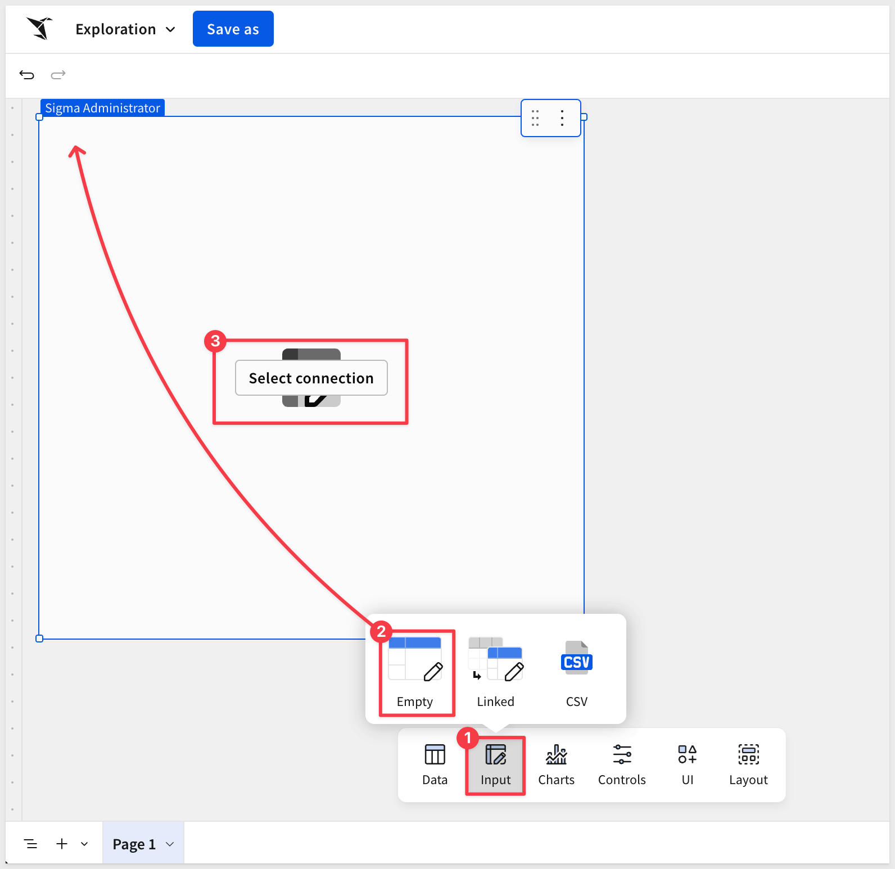

Click `Select connection`, choose `Sigma Sample Database`, and click `Create`:

Rename the input table to `Return Requests`.

Click `Save as` and save the workbook as `Customer Return Management QuickStart`.

### Add columns

The input table starts with a single column. We need to add seven more — one for each field in the return request form.

Rename the first column to `Order Number`.

With `Order Number` selected, press `Shift D` seven times to add seven more columns, then rename them:

```copy-code
Product Category
```

```copy-code
Return Reason
```

```copy-code
Item Condition
```

```copy-code
Notes
```

```copy-code
Warranty Claim
```

```copy-code
Date of Purchase
```

```copy-code
Submitted By
```

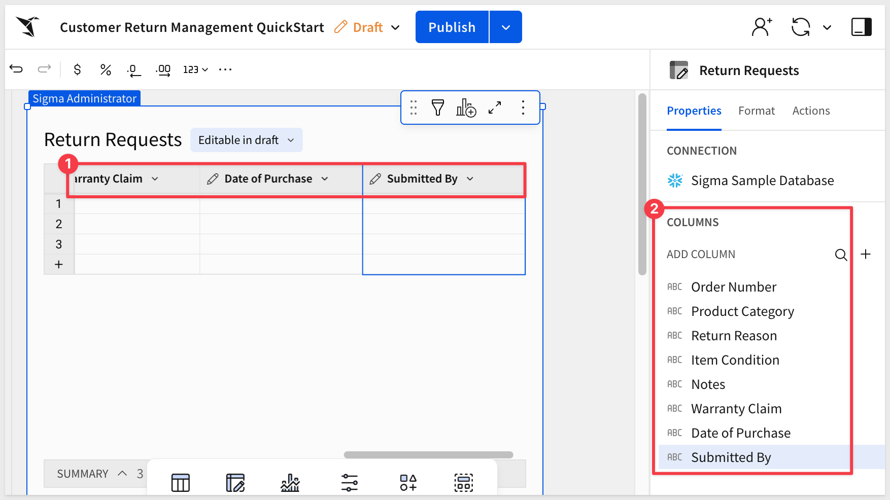

<aside class="negative">
<strong>NOTE:</strong><br> `Shift D` is a quick way to duplicate the selected column — no menu navigation required. Most keyboard shortcuts appear inline next to their menu items, or you can view the full list:

You can rename columns in each column's header or in the element panel > column list. Whichever you prefer is fine.
</aside>

[Keyboard shortcuts: Mac OS](https://help.sigmacomputing.com/docs/keyboard-shortcuts-mac-os)<br>
[Keyboard shortcuts: Microsoft Windows](https://help.sigmacomputing.com/docs/keyboard-shortcuts-microsoft-windows)

Delete any blank input table rows that may have been created.

In the next section, we'll configure each one — setting the data type, applying validation rules, and connecting a few columns to live warehouse data.


<!-- END OF SECTION-->

## Column Configuration and Validation
Duration: 10

With all eight columns in place, we need to configure their data types and add validation where it matters. 

Good validation here means fewer errors in the warehouse — and a better experience for whoever fills out the form.

### Set column types

Three columns need their type changed from the default `Text`:

Click the `Warranty Claim` column header, open the column menu, select `Change column type`, and set the type to `Checkbox`:

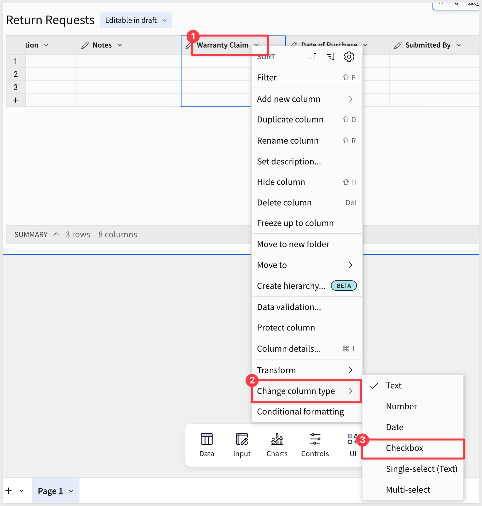

Do the same process for `Date of Purchase` column header, but set the type to `Date`.

The remaining columns stay as `Text`.

### Validate Return Reason

`Return Reason` should be a fixed list — we don't want reps typing freeform values that make analysis harder later.

Select the `Return Reason` column header menu and change the column type to `Single-select`.

Choose `Manual list` and add these values, then click `Save`:

```copy-code
Defective Product
```

```copy-code
Wrong Item Received
```

```copy-code
Changed Mind
```

```copy-code
Damaged in Shipping
```

```copy-code
Not as Described
```

```copy-code
Other
```

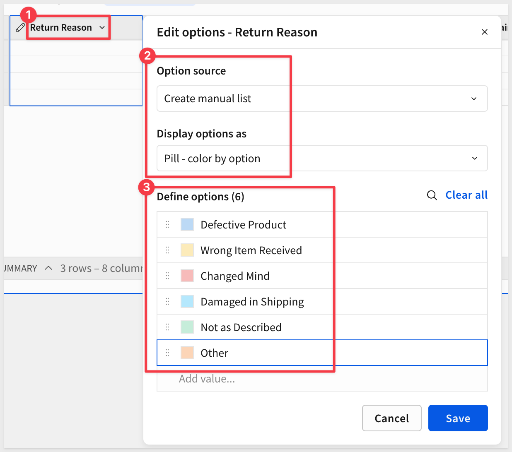

### Validate Item Condition

Repeat the same process for `Item Condition`. Use a `Manual list` with these values:

```copy-code
Unopened
```

```copy-code
Opened – Like New
```

```copy-code
Opened – Used
```

```copy-code
Damaged
```

<!-- 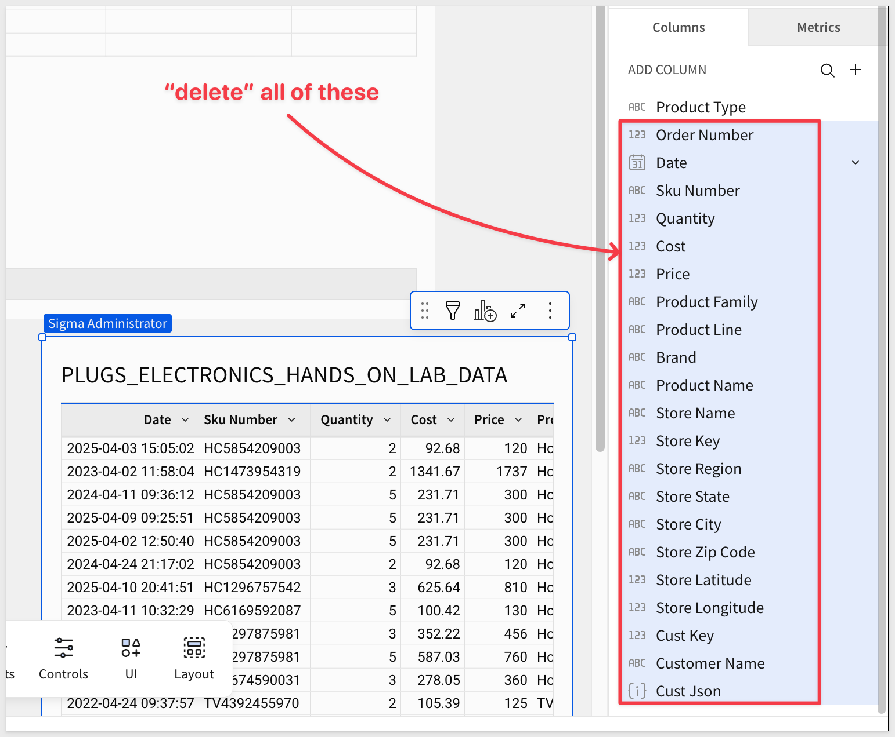 -->

### Validate Product Category from warehouse data

For `Product Category`, we want to pull values directly from the Sigma Sample Database rather than maintaining a static list. This keeps the options in sync with actual product data.

From the `Element bar`, drag a new `Table` onto the page and click `Select source`.

It is easier to just search for `Hands` and select to `PLUGS_ELECTRONICS_HANDS_ON_LAB_DATA` from the `RETAIL` schema:

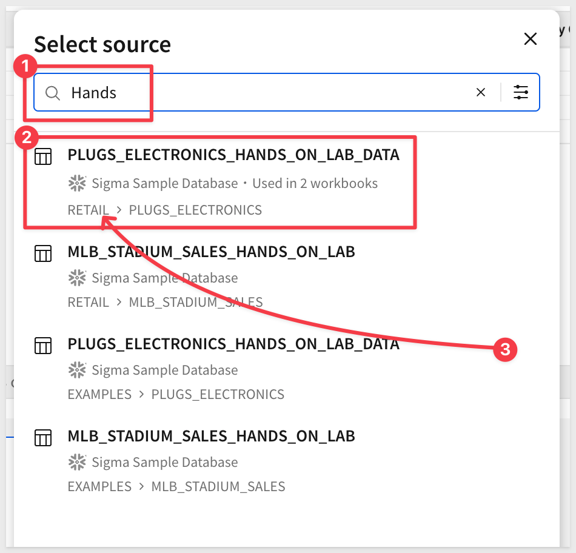

In the `Element panel`, delete all columns except `Product Type`:


Rename the table to `Product Categories`.

Group by `Product Type` to collapse duplicates:

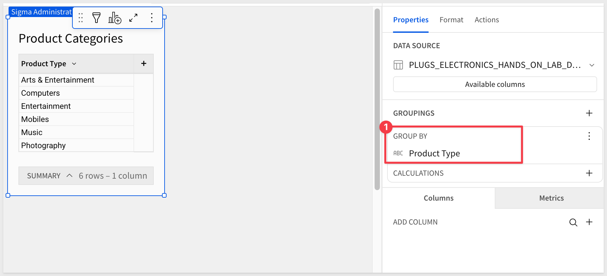

`Move` this table to a new page and rename the page to `Data`:

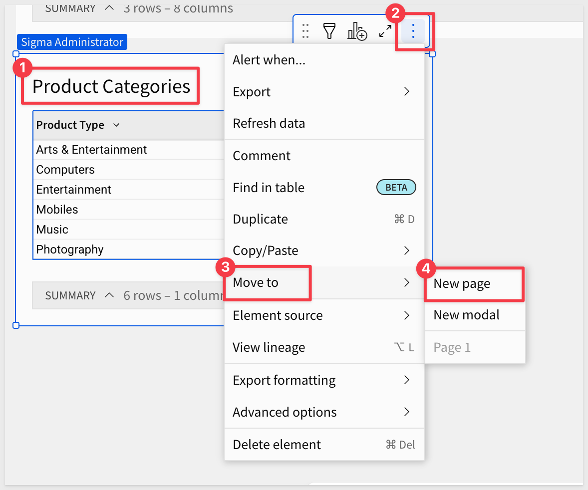

Set the `Data` page to be `Hidden`:

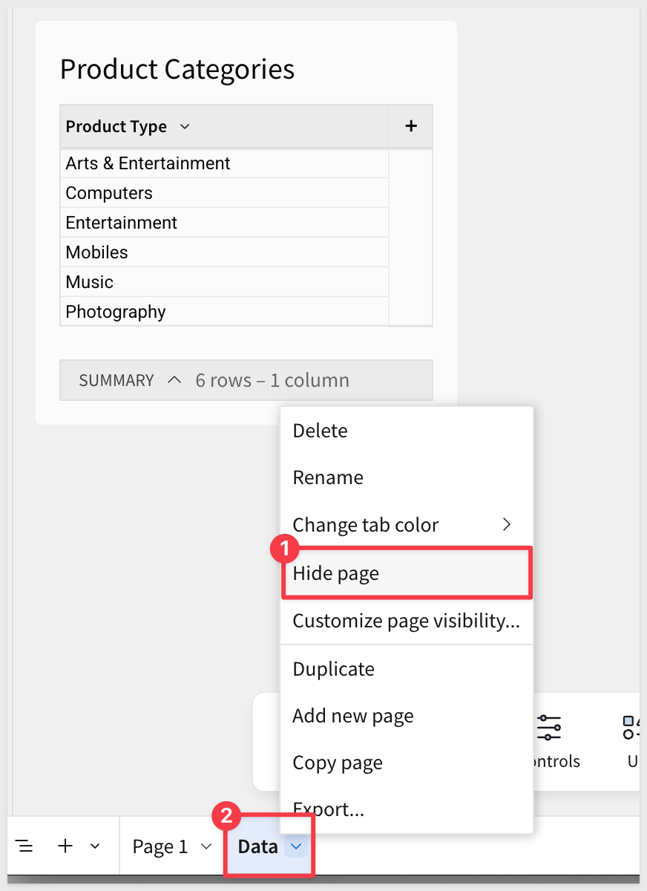

<aside class="negative">
<strong>NOTE:</strong><br> Hiding the Data page keeps the workbook clean for users. The data is still live and available to drive validation — it just isn't visible on the main pages to typical users who lack the permission to see it.
</aside>

Back on `Page 1`, change the `Product Category` column to `Single-select`. 

Select `From data source` and set the `Option source` to the `Product Categories` table on the `Data` page, using the `Product Type` column:

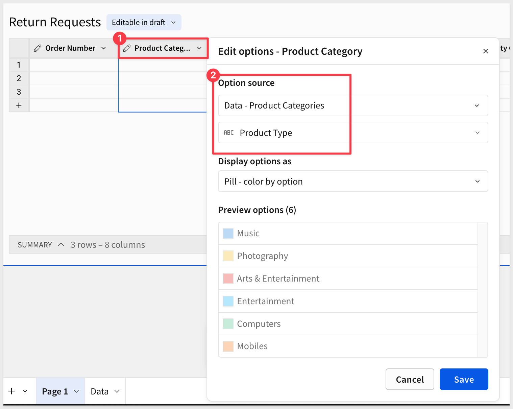

For more information on data validation in input tables, see [Apply data validation to input table columns](https://help.sigmacomputing.com/docs/apply-data-validation-to-input-table-columns).

All columns are now configured. The form we create in the next section will automatically inherit these types and validation rules.


<!-- END OF SECTION-->

## Create the Form
Duration: 5

With the input table configured, creating the form takes just a few clicks.

On the `Return Requests` input table, click the `Create child element` icon and select `Form`:

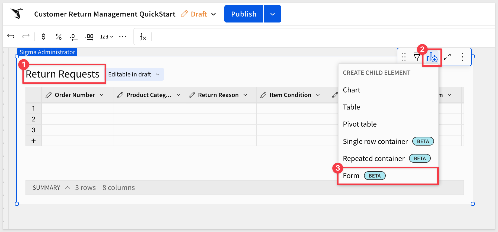

Sigma automatically creates a form bound to the `Return Requests` input table. Every column is mapped to a form field — including the types and validation rules we just set.

Notice that Sigma also created two actions on the `Submit` button automatically: one to insert a row into the input table and one to clear the form after submission. You don't need to configure these manually:

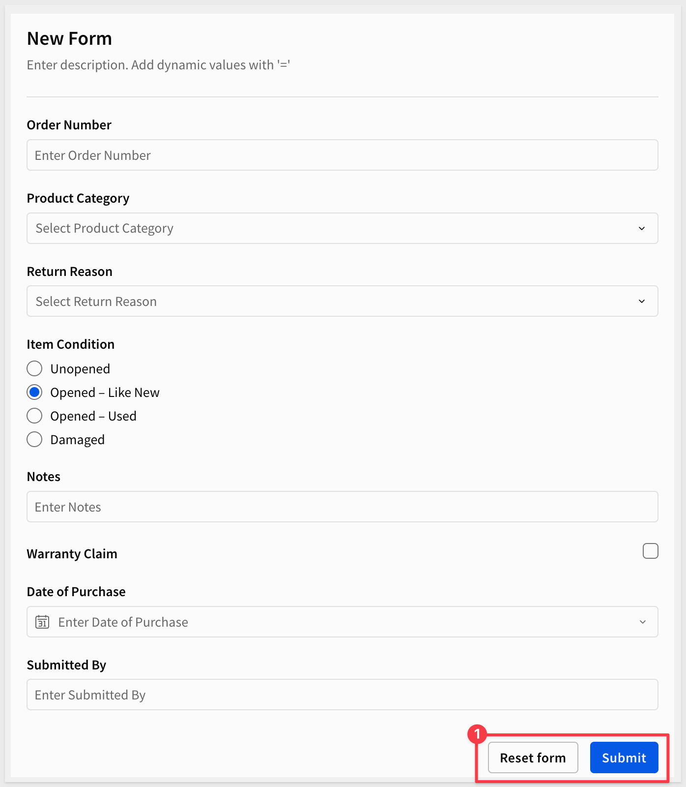

For more information on form actions, see [Create actions that modify forms](https://help.sigmacomputing.com/docs/create-actions-that-modify-forms).

### Organize the workbook pages

Let's configure this so the form is on its own page, cleanly separated from the input table.

Right-click the form element and select `Move to` > `New page`. Rename the new page `Return Form`.

Rename `Page 1` to `Return Requests`.

The workbook now has three pages: `Return Form` (the form), `Return Requests` (the input table) and `Data` (hidden, with the product category reference table).

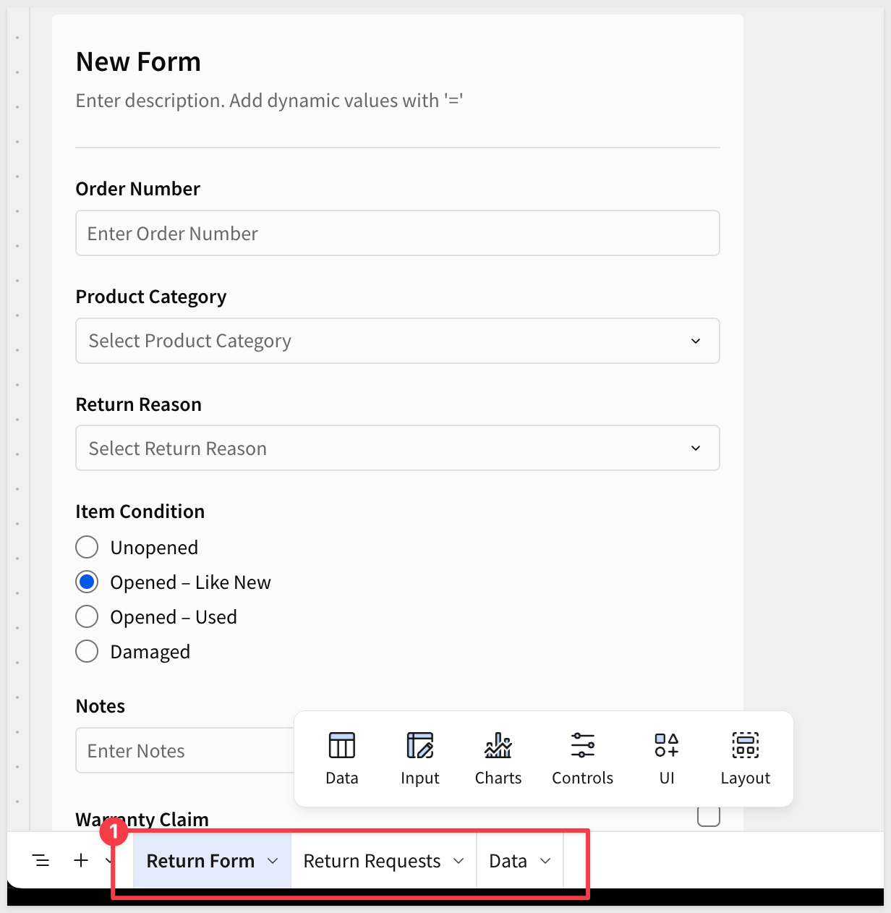


<!-- END OF SECTION-->

## Customize the Form
Duration: 5

The auto-generated form works, but a few adjustments make it more useful in practice — clearer labels, logical field order, required fields, and better input controls for the people filling it out.

### Rename the form title

Click the form title and change it from `New Form` to `Customer Return Request`.

### Reorder fields

The default field order follows the column order in the input table. Let's put them in a sequence that makes sense for a customer service rep working through a return.

In the `Element panel`, drag the fields into this order:

1. `Order Number`
2. `Date of Purchase`
3. `Product Category`
4. `Return Reason`
5. `Item Condition`
6. `Warranty Claim`
7. `Notes`
8. `Submitted By`

By reordering the column list, the form automatically adjusts for us:

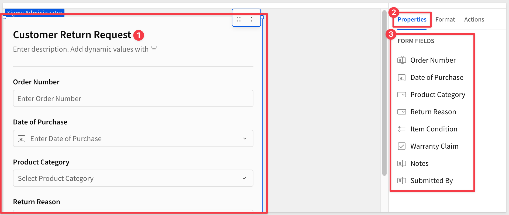

### Mark required fields

Some fields are essential — without them, the return can't be processed. Select each of the following fields and enable the `Required input` toggle in the `Element panel`:

- `Order Number`
- `Product Category`
- `Return Reason`
- `Item Condition`

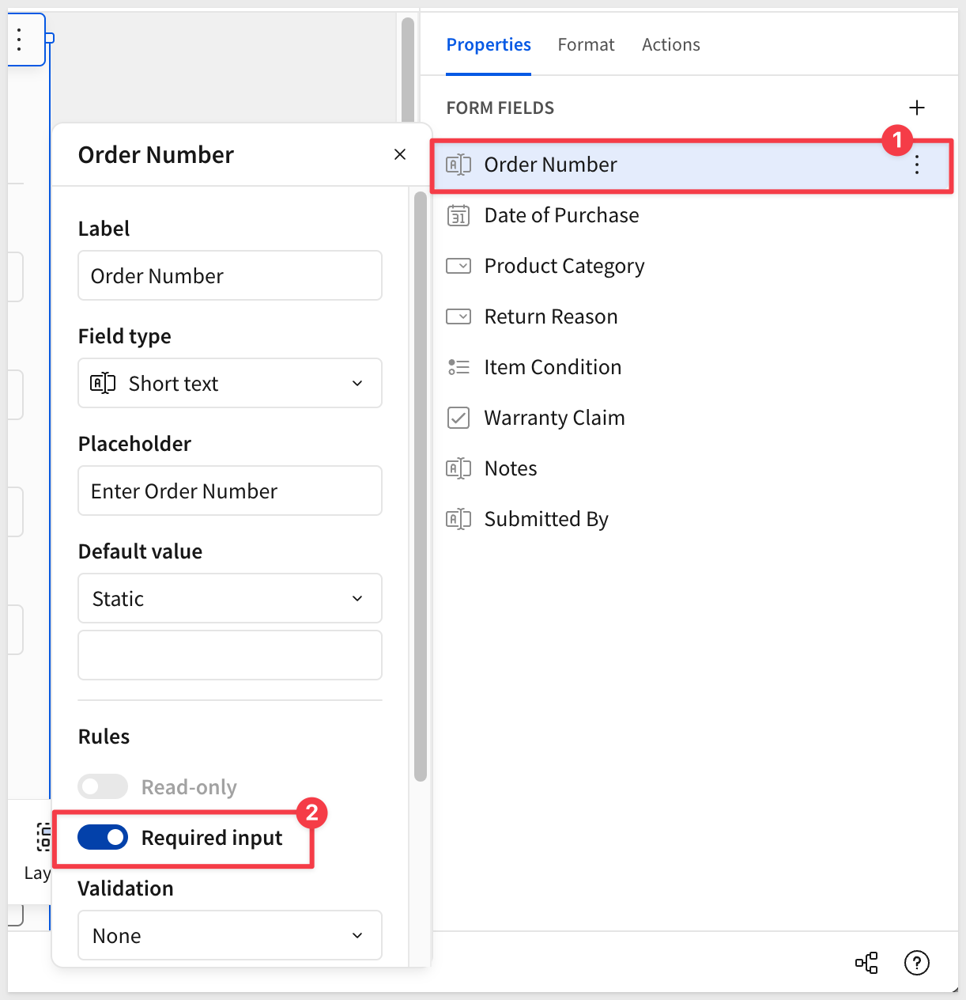

### Adjust field input types

Single-select columns default to a dropdown in the form. For short lists like `Return Reason`, radio buttons are faster to use — the options are visible at a glance without opening a menu.

Click the `Return Reason` field. In the `Element panel`, change the `Field type` to `Radio group`:

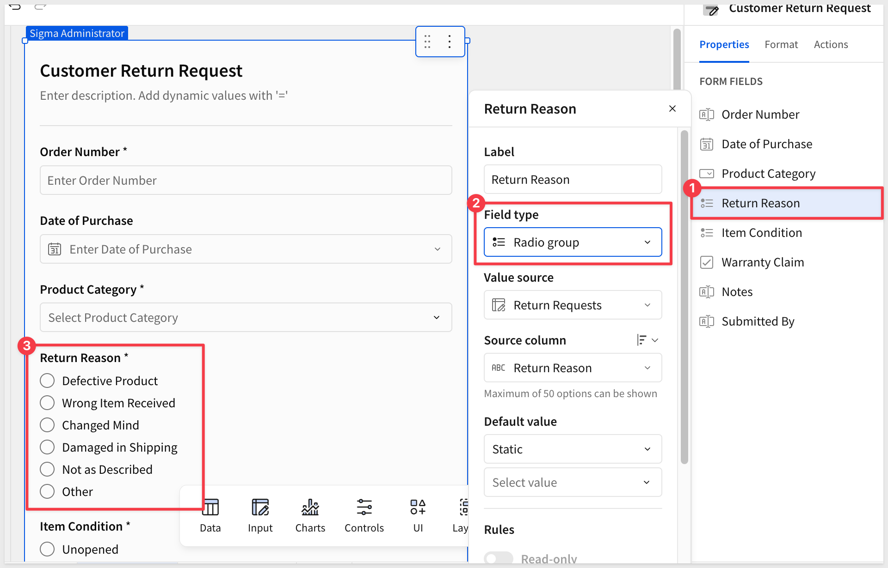

### Add placeholder text

Let's add a short hint inside the `Order Number` field to help reps know what format to enter.

Click the field and add placeholder text under `Placeholder`:
```copy-code
e.g., ORD-00123456...
```
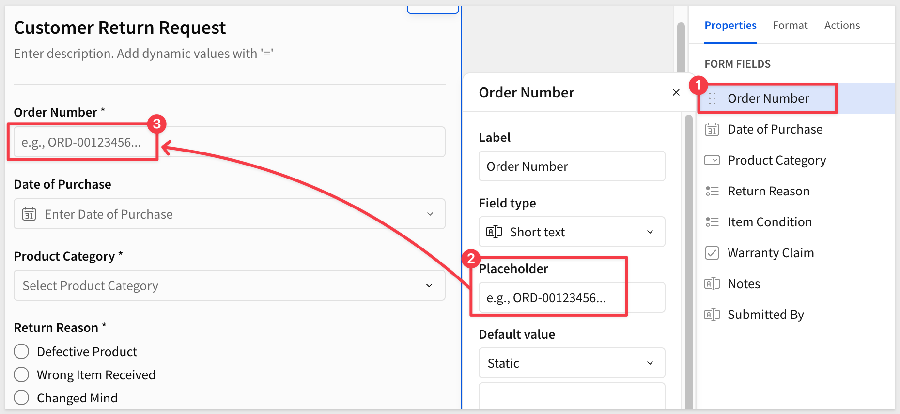


<!-- END OF SECTION-->

## Test and Submit
Duration: 5

Before publishing the workbook, let's confirm the form works end-to-end — submission writes to the input table and the form clears cleanly afterward.

### Check draft mode

Input tables can be configured to allow edits in `Draft` mode, which lets us test without publishing first.

Confirm the `Return Requests` input table is set to allow `Draft` edits by clicking the input table settings icon and checking the `Governance` options:

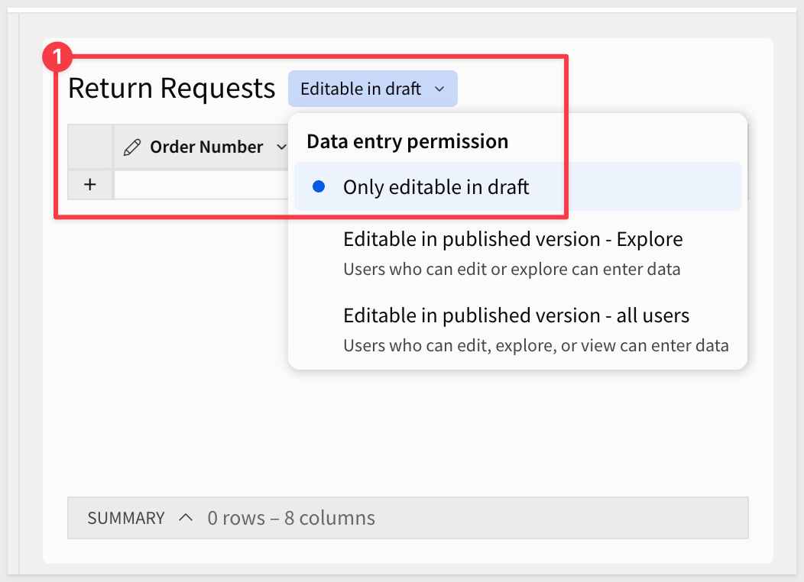

For more information, see [Configure data governance options in input tables](https://help.sigmacomputing.com/docs/configure-data-governance-options-in-input-tables).

### Submit a test entry

Navigate to the `Return Form` page and fill in the form using this sample data:

Order Number:
```copy-code
ORD-00123456
```

**Date of Purchase:** select any recent date

**Product Category:** Mobiles

**Return Reason:** Defective Product

**Item Condition:** Opened - Used


**Warranty Claim:** checked

Notes:
```copy-code
Customer reports device stopped charging after two weeks.
```
**Submitted By:** your name

Click `Submit`.

The form clears immediately — that's the auto-created `Clear form` action firing after the insert.

### Confirm the row

Navigate to the `Return Requests` page. The submitted row should be visible in the input table:

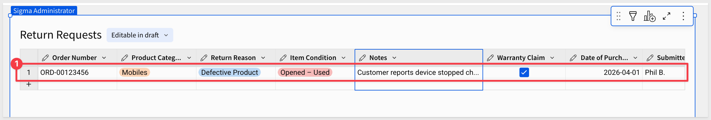

### Test validation

To confirm required fields are enforced, `Submit` an empty form. The form will block submission and highlight the missing required fields:

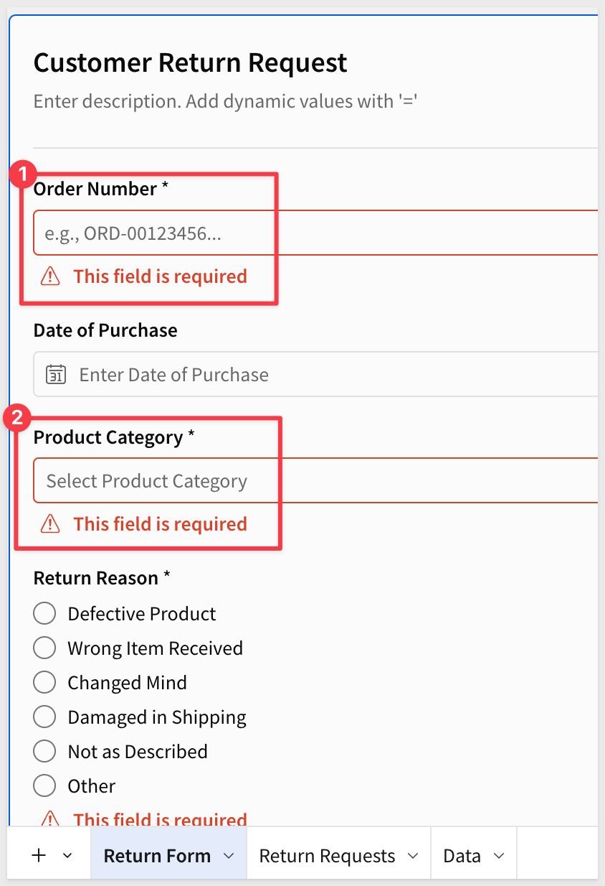

The form is working. In the next section, we'll build out the analysis view that surfaces patterns across all submitted returns.


<!-- END OF SECTION-->

## Returns Analysis
Duration: 5

The form handles data capture. Now let's build the view that turns those submissions into something useful for a manager reviewing return trends.

### Load sample data

With only one or two submitted rows, the analysis views will be sparse. If you want to see what the page looks like with realistic volume, download this sample dataset and import it into the `Return Requests` input table first.

<button>[Download Sample Return Requests CSV](https://sigma-quickstarts-main.s3.us-west-1.amazonaws.com/csv/sample_return_requests.csv)</button>

On the `Return Requests` page, open the input table menu and select `Upload CSV`:

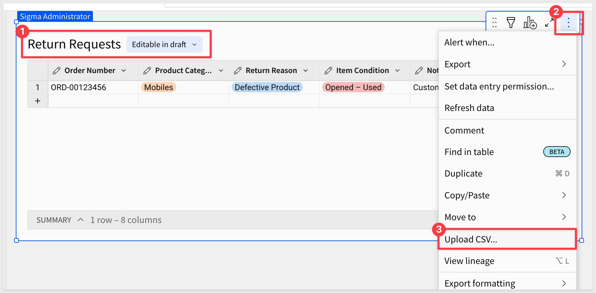

Select the downloaded file and confirm the column mapping:

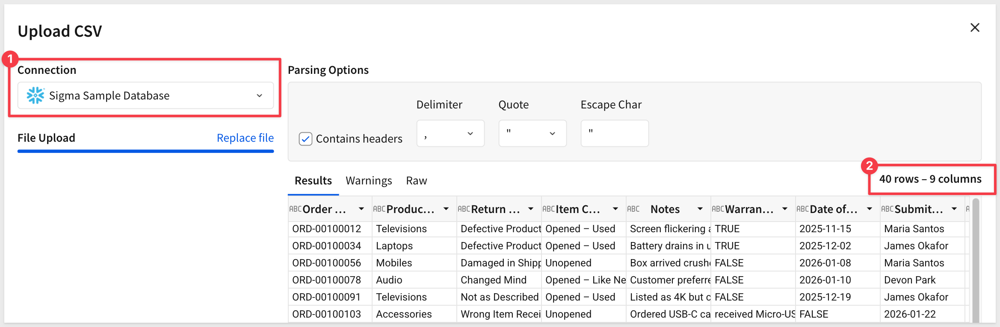

Once imported, the input table will have 40 rows across multiple product categories and return reasons — enough to make the analysis views meaningful:

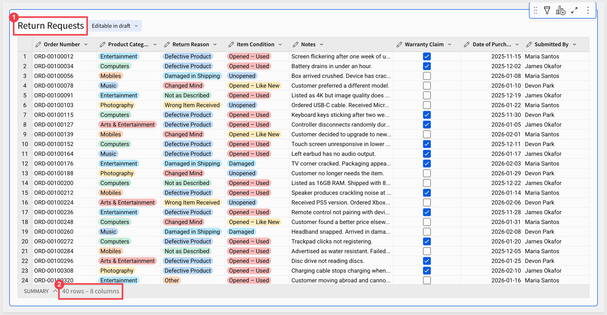

### Add an analysis page

Add a new page to the workbook and rename it `Returns Analysis`.

### Returns by reason

On the `Return Requests` page, from the `Element bar`, add a `Child table` from the `Return Requests` input table.

Move the new child table to the `Returns Analysis` page.

In the `Element panel`, drag `Return Reason` to `GROUPINGS`. 

Add a row count by clicking `+` next to `CALCULATIONS` and selecting `Row count`. Rename that column `Returns`:

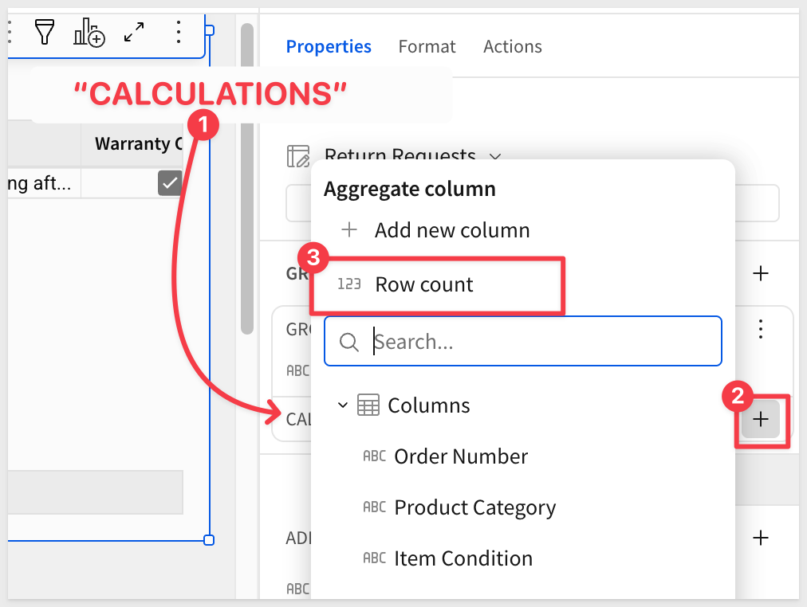

Rename the table `Returns by reason`.

This gives managers an instant summary of why returns are coming in — without touching the form or the raw input table:

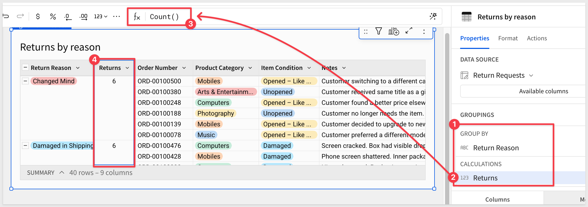

### Returns by product category

On the `Return Requests` page, create another `Child table` from the `Return Requests` input table and move it to the `Returns Analysis` page.

In the `Element panel`, drag `Product Category` to `GROUPINGS`. Add `Row count` and rename it `Returns`. Sort descending by `Returns`.

Rename the table `Returns by product category`.

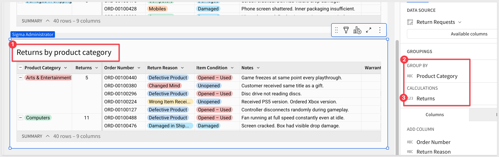

### Warranty claims

Create one more `Child table` from the `Return Requests` input table and move it to the `Returns Analysis` page.

Rename the table `Warranty claims`.

Drag `Product Category` to `GROUPINGS`. Add `Row count` and rename it `Claims`:

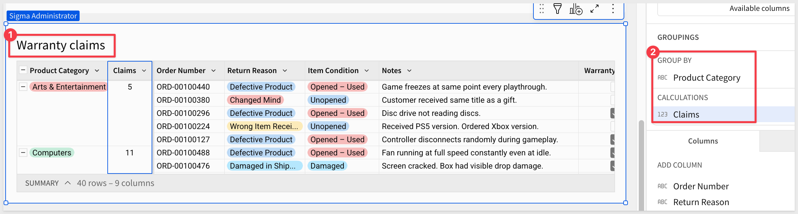

Add a filter on `Warranty Claim` where the value is `true`. 

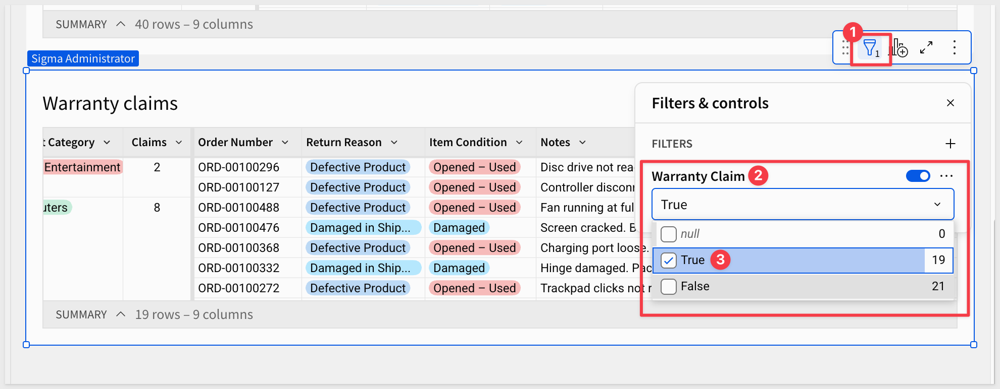

This view tells the team which product categories are generating the most warranty-related returns — a useful signal for product quality discussions.

### Visualize return reasons

Select the `Returns by Reason` table and click `Create child element` > `Chart`.

In the `Element panel`, set the chart type to `Bar`. Drag `Return Reason` to the X axis and `Returns` to the Y axis. 

Sort the `Y-AXIS` on `Sum of Returns` descending:

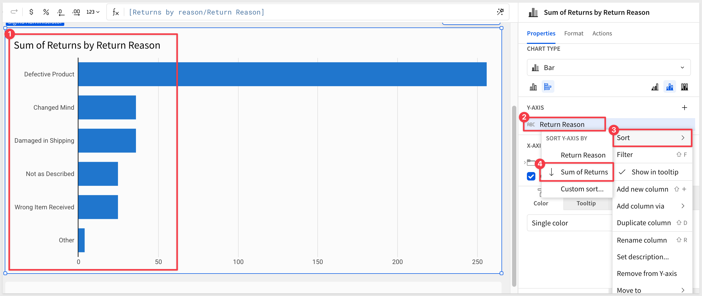

As new submissions come in through the form, every table and chart on this page updates automatically — no refresh, no export, no manual step:

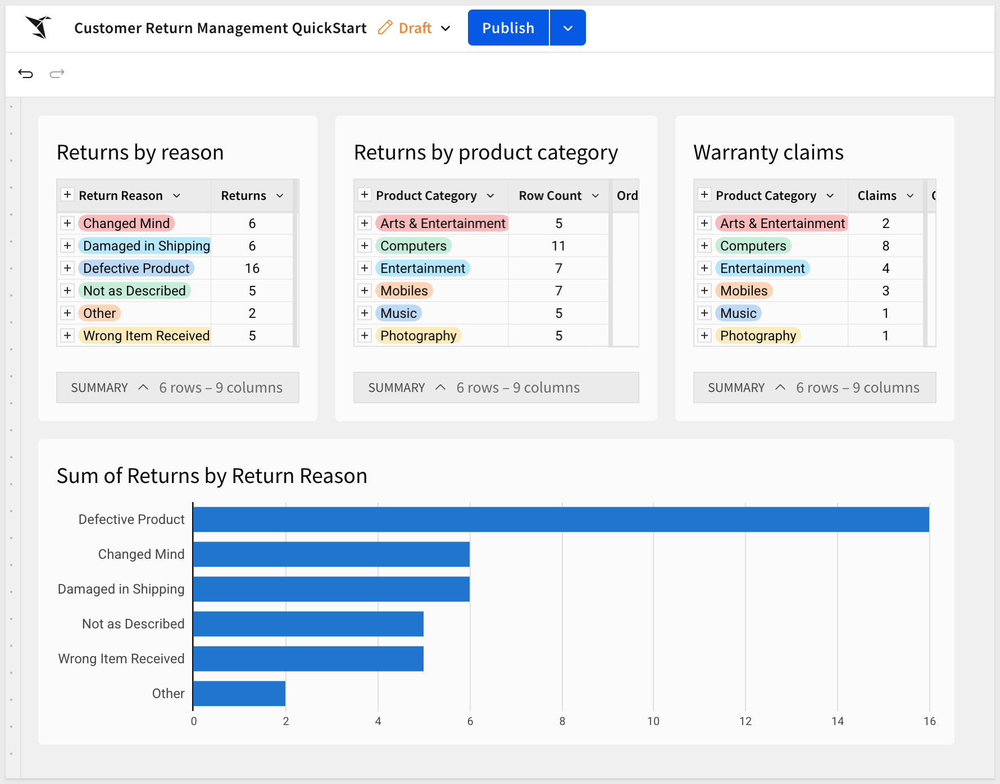


<!-- END OF SECTION-->

## What we've covered
Duration: 5

You built a complete data entry workflow — from an empty workbook to a published form that writes directly to the warehouse, enforces data quality, and feeds live analysis.

The pattern you used here isn't specific to return requests. The same approach applies to expense reporting, incident logging, audit checklists, inventory requests, or any other workflow that involves structured input and downstream reporting. The form changes; the architecture doesn't.

A few techniques worth carrying forward:

- **Column types and validation drive the form.** Configure the input table well and the form inherits it automatically. Single-select columns with manual or warehouse-backed lists keep data clean at the source — before it ever reaches the warehouse.
- **Child tables preserve lineage.** Each analysis table was created directly from the input table, not duplicated from another child. This keeps data lineage clear and prevents unintended filters or calculations from carrying over silently.
- **Hidden pages keep workbooks clean.** Reference data that supports validation doesn't need to be visible to users. Move it to a hidden page and it stays live and functional without cluttering the experience.
- **Analysis updates automatically.** There's no separate reporting step. As submissions come in, every grouped table and chart on the Returns Analysis page reflects the current data — no export, no refresh, no reconciliation.

**Additional Resource Links**

[Blog](https://www.sigmacomputing.com/blog/)<br>
[Community](https://community.sigmacomputing.com/)<br>
[Help Center](https://help.sigmacomputing.com/hc/en-us)<br>
[QuickStarts](https://quickstarts.sigmacomputing.com/)<br>

Be sure to check out all the latest developments at [Sigma's First Friday Feature page!](https://quickstarts.sigmacomputing.com/firstfridayfeatures/)
<br>

[](https://twitter.com/sigmacomputing)&emsp;
[](https://www.linkedin.com/company/sigmacomputing)&emsp;
[](https://www.facebook.com/sigmacomputing)


<!-- END OF WHAT WE COVERED -->
<!-- END OF QUICKSTART -->
