author: pballai
id: aiapps_github_mcp_tool
summary: Connect a Sigma agent to GitHub's hosted MCP server and use a chat element to ask natural-language questions about a live GitHub repository's issues, pull requests, and files.
categories: aiapps
environments: web
status: Hidden
feedback link: https://github.com/sigmacomputing/sigmaquickstarts/issues
tags:
lastUpdated: 2026-08-20

# Connect a Sigma Agent to GitHub with MCP Tools

## Overview
Duration: 5

Give a Sigma agent the ability to answer live questions about a GitHub repository — open issues, recent pull requests, file contents — without writing a single line of custom connector code.

Sigma agents already reason over your workbook data and data models. MCP tools extend that reach outward, letting an agent call any MCP-compliant server through the same tool-calling loop it already uses internally. In this QuickStart, you'll connect the GitHub MCP server to Sigma, attach it to an agent, and build a chat element that answers natural-language questions about a live GitHub repository — using the `sigmacomputing/sigmaquickstarts` repo (the source for the QuickStarts you're reading right now) as the example.

Along the way you'll learn how to:
- Create a scoped GitHub personal access token for read-only access
- Add an MCP server as a Sigma MCP tool, with authentication tested and working
- Attach the MCP tool to a Sigma agent and give it instructions on when to use it
- Build a chat element that lets users ask an agent about a live GitHub repository

<aside class="positive">
<strong>WHY IT MATTERS:</strong><br> MCP tools let Sigma agents reach into the systems your team already uses — ticketing, CRM, source control, custom internal APIs — without Sigma building a bespoke connector for each one. Open MCP support keeps Sigma compatible with the broader agent ecosystem instead of locking you into a single AI stack.
</aside>

For more information, see [Configure MCP tools](https://help.sigmacomputing.com/docs/configure-mcp-tools)

<aside class="positive">
<strong>IMPORTANT:</strong><br> Some screens in Sigma may appear slightly different from those shown in QuickStarts. This is because Sigma continuously adds and enhances functionality. Rest assured, Sigma's intuitive interface ensures that any differences will not prevent you from successfully completing any QuickStart.
</aside>

For more information on Sigma's product release strategy, see [Sigma product releases](https://help.sigmacomputing.com/docs/sigma-product-releases)

If something doesn't work as expected, here's how to [contact Sigma support](https://help.sigmacomputing.com/docs/sigma-support)

### Target Audience
This QuickStart is designed for:
- Workbook creators and admins who want a Sigma agent to reach beyond the data warehouse
- Teams already using chat elements who want to extend an agent's toolset
- Anyone evaluating how Sigma's agents fit into a broader MCP-based tool ecosystem

### Prerequisites

<ul>
  <li>Any modern browser is acceptable.</li>
  <li>Access to a Sigma environment with an AI provider configured, and an existing chat element connected to a Sigma agent. If you haven't built one yet, start with <a href="https://quickstarts.sigmacomputing.com/guide/aiapps_chat_element/index.html">Build Conversational AI Apps with Chat Elements and Snowflake Cortex</a> — this QuickStart assumes that foundation and focuses specifically on adding an MCP tool.</li>
  <li>A GitHub account, and the ability to create a personal access token. No GitHub Copilot subscription is required.</li>
  <li>Admin access in Sigma to add MCP tools and API connectors under <code>Administration</code>.</li>
  <li>Some familiarity with Sigma is assumed. Not all basic steps will be shown.</li>
</ul>

<aside class="positive">
<strong>IMPORTANT:</strong><br> Sigma recommends using non-production resources when completing QuickStarts.
</aside>

<button>[Sigma Free Trial](https://www.sigmacomputing.com/free-trial/)</button>

<aside class="negative">
<strong>IMPORTANT:</strong><br> Some features may carry a "Beta" tag. Beta features are subject to quick, iterative changes. As a result, the latest product version may differ from the contents of this document.
</aside>


<!-- END OF SECTION-->

## Create a GitHub Personal Access Token
Duration: 5

The GitHub MCP server authenticates with a personal access token, so start by creating one. Since `sigmacomputing/sigmaquickstarts` is a public repository, you can scope the token to public repositories only — no need to grant it access to anything private or writable.

**1.** In GitHub, go to `Settings` > `Developer settings` > `Personal access tokens` > `Fine-grained tokens`, then click `Generate new token`:

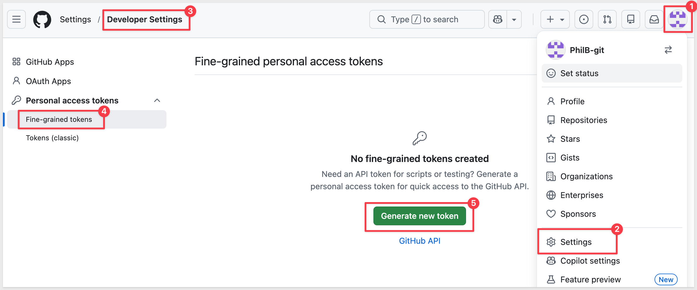

**2.** Give it a name like `Sigma MCP Tool - Read Only` and set an expiration:

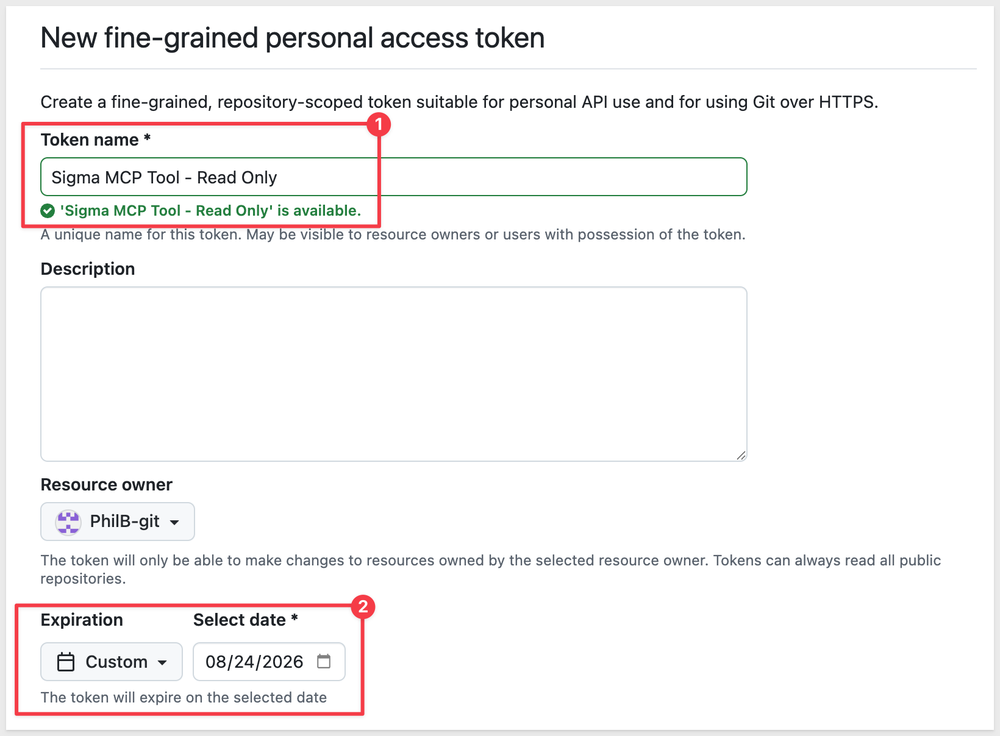

**3.** Under `Repository access`, choose `Public repositories`. This grants read-only access to `sigmacomputing/sigmaquickstarts` (and every other public repo) — no repository picker or permissions matrix is needed for this option.

**4.** Leave `Permissions` > `Account` untouched — no account-level permissions are needed for this token.

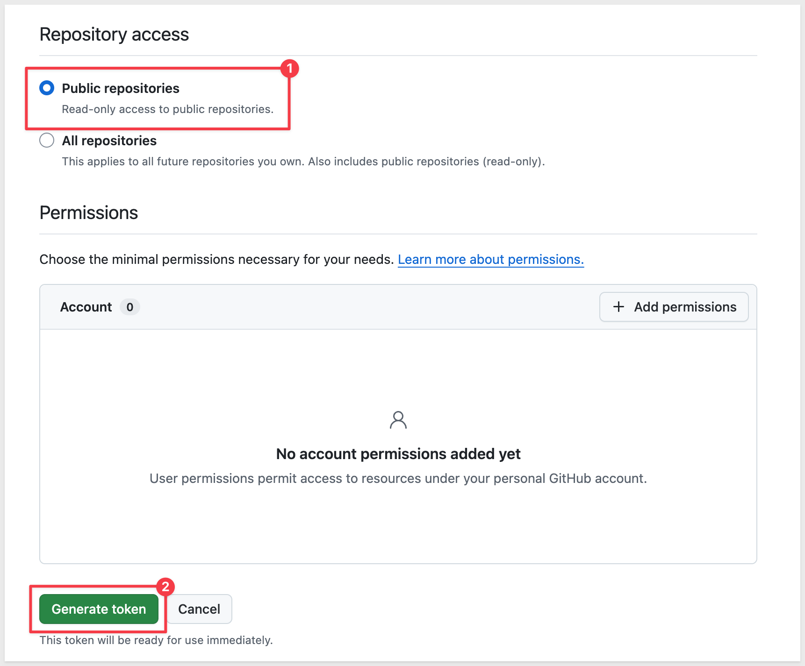

**5.** Click `Generate token` and copy it immediately — GitHub only shows it once:

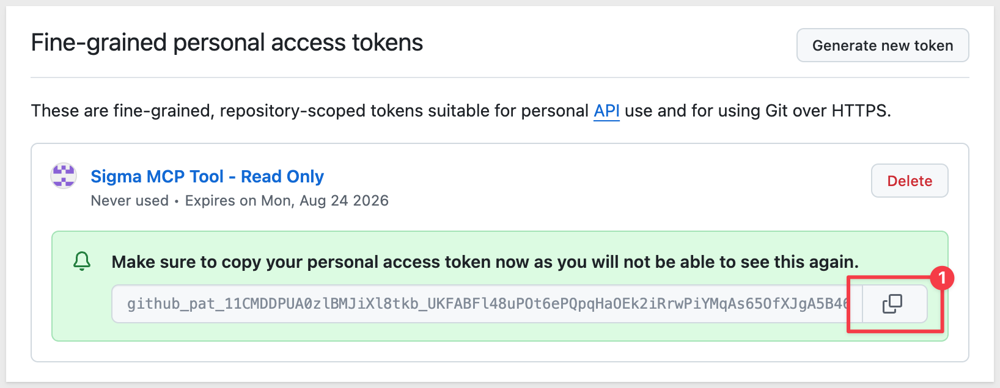

<aside class="positive">
<strong>NOTE:</strong><br> This QuickStart uses a personal access token for a simple, self-contained setup, scoped only to public repositories. If you later choose `All repositories` to give an agent access to private organization repos, GitHub may require you to separately authorize the token for that organization's SAML SSO — from the token list, click the token's `Configure SSO` menu and authorize it. For production use, GitHub's OAuth flow is also supported when adding the MCP tool in Sigma and avoids this extra step.
</aside>

<aside class="negative">
<strong>IMPORTANT:</strong><br> Treat this token like a password. Store it somewhere safe until the next step, and never paste it into a workbook, chat message, or public repository.
</aside>


<!-- END OF SECTION-->

## Add the GitHub MCP Server as a Sigma MCP Tool
Duration: 8

GitHub hosts its own remote MCP server, so there's nothing to install or run yourself — Sigma just needs the URL and a credential. The credential has to exist before you create the MCP tool, since the tool form can only select from credentials that are already there.

### Add the GitHub PAT as an API credential
**1.** Go to `Administration` > `API connectors` and add a new credential:

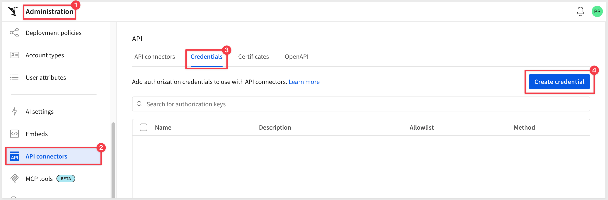

**2.** Under `Name`:

```copy-code
GitHub PAT
```

**3.** Under `Description` (optional), enter something like:

```copy-code
Read-only PAT for the GitHub MCP server
```

**4.** Under `Authorized domains`, scope the credential to the GitHub MCP server only, instead of leaving the default wildcard:

```copy-code
api.githubcopilot.com
```

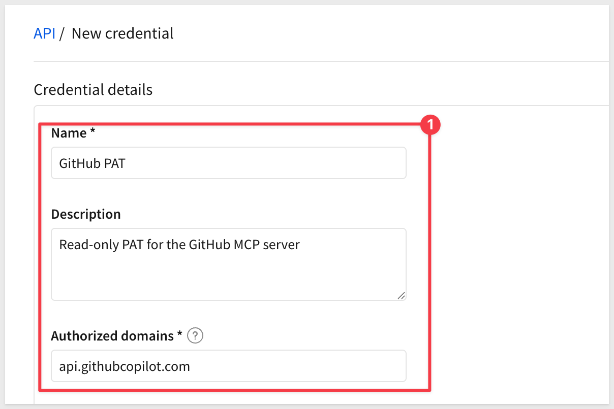

**5.** Under `Authentication method`, confirm `Bearer token` is selected.

**6.** Leave `Use secret manager` off, then under `Token`, paste the personal access token you generated:

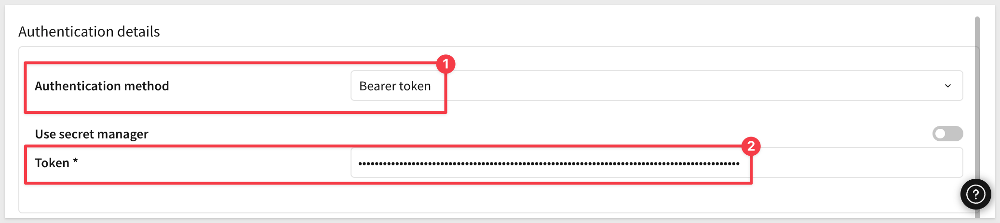

**7.** Click `Save`.

### Create the MCP tool
**1.** Go to `Administration` > `MCP tools` and click `Add MCP tool`.

**2.** Under `Name`:

```copy-code
GitHub
```

**3.** Under `Description`, enter something specific — the name and description are what the agent uses to decide when this tool is relevant. For example:

```copy-code
Read-only access to GitHub issues, pull requests, commits, and file contents. Use this for questions about a specific GitHub repository, such as open issues, recent pull requests, or file contents.
```

**4.** Under `MCP server URL`, enter:

```copy-code
https://api.githubcopilot.com/mcp/
```

**5.** (Optional) Under `Instructions`, add any additional guidance for the agent, such as:

```copy-code
Default to the sigmacomputing/sigmaquickstarts repository unless the user specifies a different owner and repo. For questions about which QuickStarts cover a topic, read site/app/data/qs-catalog.json first — it lists every Published QuickStart's title, category, and summary in one file.
```

**6.** Under `Credentials` > `Authentication credential`, select the `GitHub PAT` credential you created above:

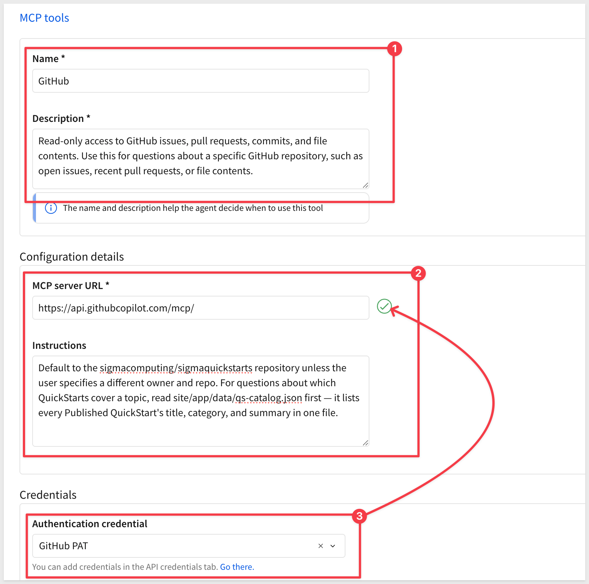

**7.** Click `Save`.

**8.** Reopen the new MCP tool and click `Test` to confirm Sigma can reach the server and authenticate successfully:

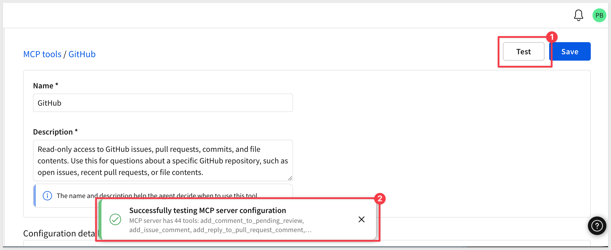

**9.** Optionally, grant `Can use` access to the users or teams who should have this tool available:

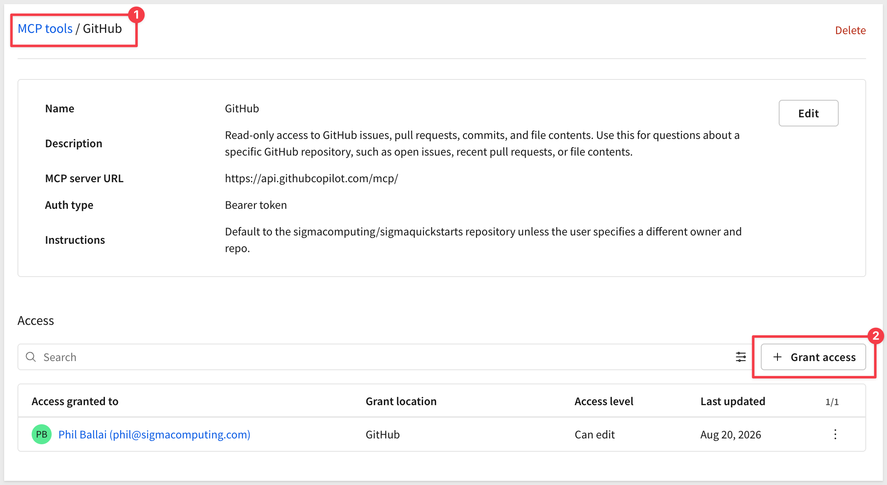


<!-- END OF SECTION-->

## Attach the MCP Tool to a Sigma Agent
Duration: 5

Adding an MCP tool to Sigma doesn't automatically put it in front of any agent — you attach it explicitly, the same way you'd add a warehouse agent or an action.

**1.** Create a new workbook, add a `Chat` element and open the new agent option:

<video src="assets/new-wb.mp4"></video>

**2.** In the agent's configuration, add a tool and select the `GitHub` MCP tool you created:

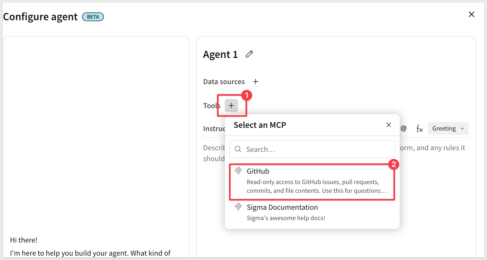

**3.** Update the agent's instructions so it knows this capability exists, for example:

```copy-code
You have access to a GitHub tool for the sigmacomputing/sigmaquickstarts repository. Use it to answer questions about issues, pull requests, and file contents, and cite what you find.
```

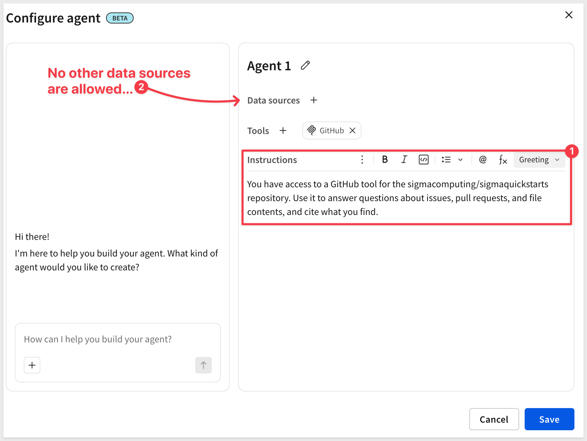

**4.** Save the agent.

**5.** Save the workbook as:

```copy-code
MCP GitHub QuickStart
```


<!-- END OF SECTION-->

## Ask Your Agent About a Live GitHub Repository
Duration: 8

With the tool attached, the chat element connected to this agent can now answer questions that reach outside of Sigma entirely:

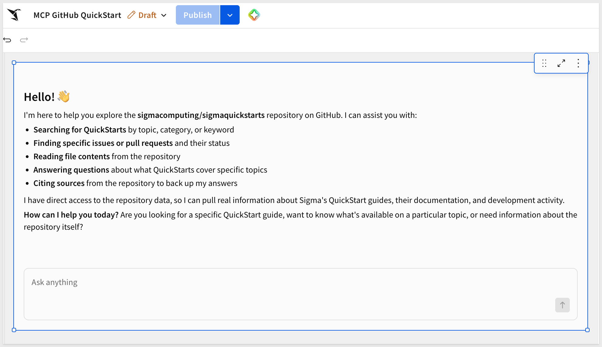

Try a prompt like:

```copy-code
Which QuickStarts in this repo mention MCP tools or chat elements?
```

The agent calls the GitHub MCP tool behind the scenes, retrieves live results, and responds in the chat element — no polling, no manual export, no custom integration code.

The agent doesn't need to search every QuickStart's full text — the `Instructions` you added when creating the MCP tool point it straight to `site/app/data/qs-catalog.json`, a single file listing every Published QuickStart's title, category, and summary. That's why the summary written for each QuickStart matters: a good one-line description means the agent finds the right answer in one read, instead of opening dozens of files to piece it together.

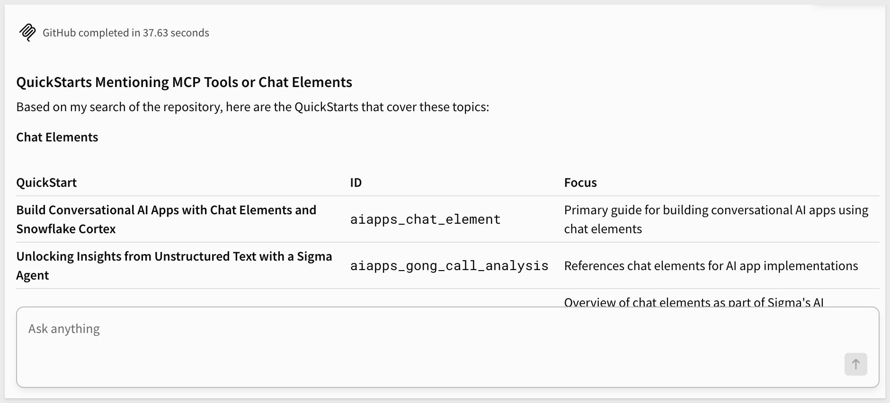

The GitHub tool isn't limited to that one lookup — you can also ask about repository activity more broadly, such as:

```copy-code
Summarize the five most recent merged pull requests that created net-new QuickStarts.
```

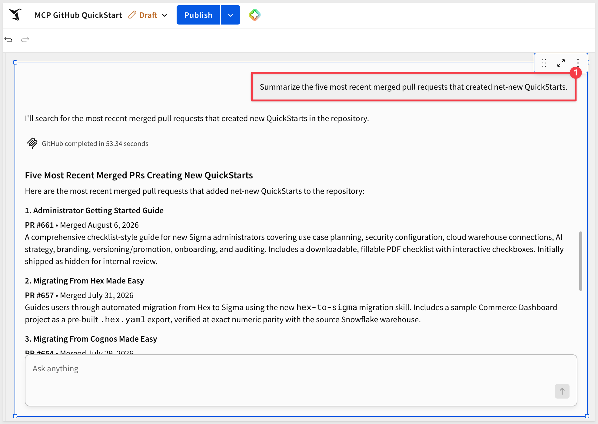

<aside class="positive">
<strong>WHY IT MATTERS:</strong><br> This pattern isn't specific to GitHub. The same three inputs — a server URL, a credential, and a clear description — work for any MCP-compliant service. A ticketing system, a CRM, or an internal API can be added to a Sigma agent the same way, giving it reach beyond the warehouse while access stays scoped and governed through Sigma's existing admin controls.
</aside>


<!-- END OF SECTION-->

## What we've covered
Duration: 5

We connected a hosted, read-only GitHub MCP server to a Sigma agent as an MCP tool, then used a chat element to ask natural-language questions about a live public repository — without writing a custom connector.

The pattern generalizes well beyond GitHub. Any MCP-compliant service can be added to a Sigma agent with the same three pieces: a server URL, a tested credential, and a description precise enough for the agent to know when to reach for it. That's what makes MCP tools useful for real operational work — an agent that already understands your data can also check a ticket status, look up a CRM record, or query an internal API, all while access stays scoped through Sigma's admin controls rather than scattered across ad hoc integrations.

**Additional Resource Links**

[Blog](https://www.sigmacomputing.com/blog/)<br>
[Community](https://community.sigmacomputing.com/)<br>
[Help Center](https://help.sigmacomputing.com/hc/en-us)<br>
[QuickStarts](https://quickstarts.sigmacomputing.com/)<br>

Be sure to check out all the latest developments at [Sigma's First Friday Feature page!](https://quickstarts.sigmacomputing.com/firstfridayfeatures/)
<br>

[](https://twitter.com/sigmacomputing)&emsp;
[](https://www.linkedin.com/company/sigmacomputing)&emsp;
[](https://www.facebook.com/sigmacomputing)


<!-- END OF WHAT WE COVERED -->
<!-- END OF QUICKSTART -->
