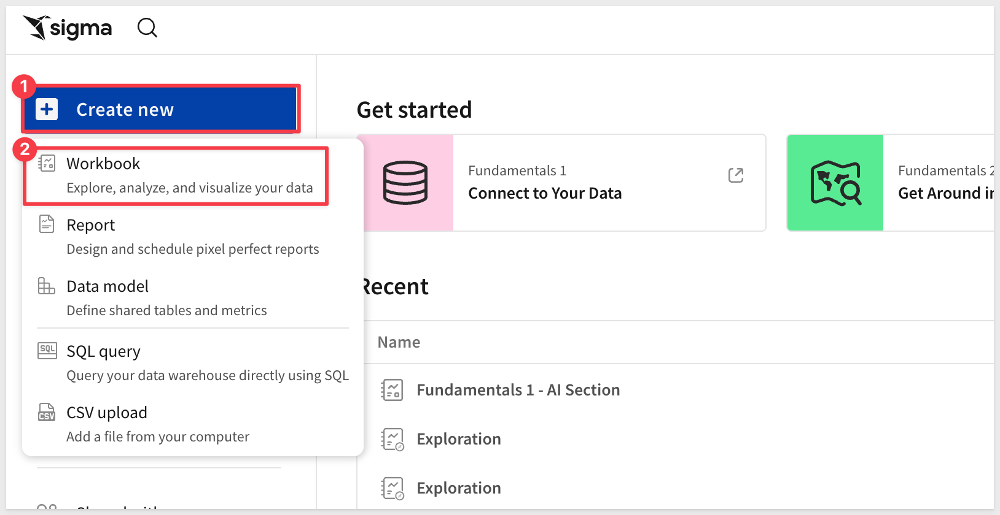
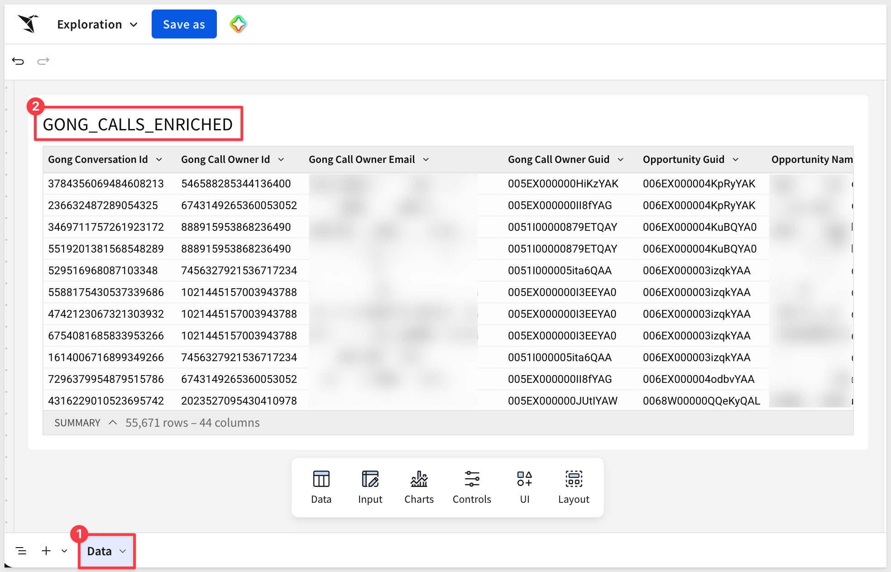
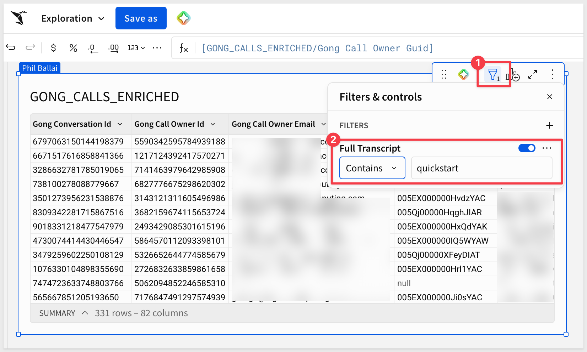
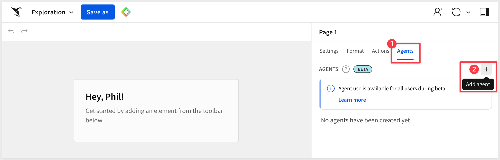
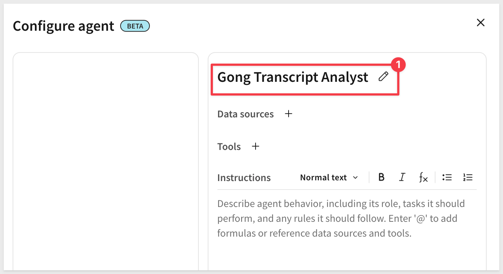
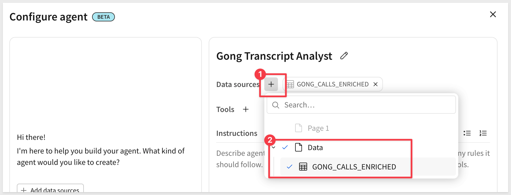
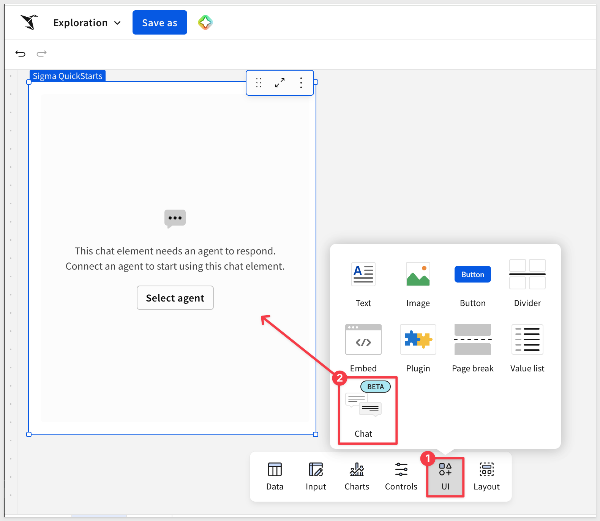
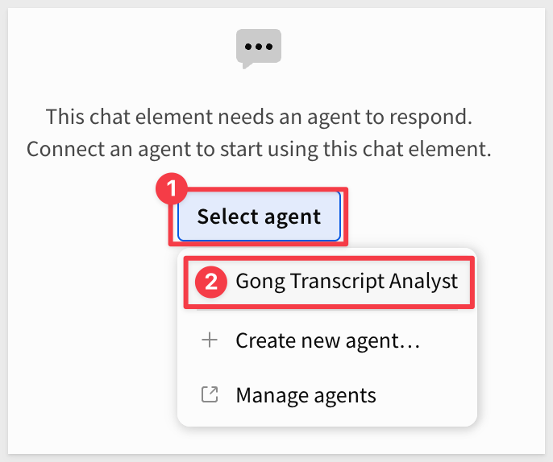

author: pballai
id: aiapps_gong_call_analysis
summary: Learn how to use a Sigma agent to extract actionable insights from unstructured Gong call transcript data stored in Snowflake.
categories: aiapps
environments: web
status: Published
feedback link: https://github.com/sigmacomputing/sigmaquickstarts/issues
tags: default
lastUpdated: 2026-06-26

# Unlocking Insights from Unstructured Text with a Sigma Agent

## Overview
Duration: 5

Many organizations store rich conversational data — call transcripts, support tickets, interview notes — as a single blob of text in a database column. That data holds valuable signal: customer sentiment, recurring topics, product feedback. But extracting it traditionally requires custom NLP pipelines, manual review, or complex string parsing.

This QuickStart shows a simpler path. With a Sigma agent and a chat element added to a workbook, you can ask plain-language questions directly against unstructured transcript data in Snowflake and get meaningful, contextual answers in seconds — no formulas, no code, no data transformation required.

The use case: Sigma's own team uses Gong to record customer calls. Those transcripts flow from Gong into Snowflake via a dbt pipeline, where each row contains a full call transcript in a single column.

The (somewhat selfish, I'll admit) goal is to understand how customers are responding to Sigma QuickStarts — which ones come up, and whether customers feel positively or negatively about them.

Along the way you'll see how to:
- Extract specific details from a column of unstructured transcript text
- Identify which product or content item was referenced in each call
- Assess customer sentiment specifically around those mentions
- Drill into individual responses — both positive and negative — for qualitative context

<aside class="negative">
<strong>IMPORTANT:</strong><br> The data shown in this QuickStart is a subset of actual Gong call data, filtered down to a timeframe of interest. All customer-identifying information visible in screenshots has been masked. No customer data is exposed or referenced in this QuickStart.
</aside>

<aside class="positive">
<strong>IMPORTANT:</strong><br> Some screens in Sigma may appear slightly different from those shown in QuickStarts. This is because Sigma continuously adds and enhances functionality. Rest assured, Sigma's intuitive interface ensures that any differences will not prevent you from successfully completing any QuickStart.
</aside>

For more information on Sigma's product release strategy, see [Sigma product releases](https://help.sigmacomputing.com/docs/sigma-product-releases)

If something doesn't work as expected, here's how to [contact Sigma support](https://help.sigmacomputing.com/docs/sigma-support)

### Target Audience
This QuickStart is for Sigma builders, sales operations teams, and anyone working with unstructured text data who wants to extract insights without writing complex queries or building custom NLP solutions.

### Prerequisites

<ul>
  <li>Access to a Sigma environment with an AI provider configured. If you don't have one set up yet, the <a href="https://quickstarts.sigmacomputing.com/guide/fundamentals_1_getting_around_v3/index.html#4">Fundamentals 1: Overview</a> QuickStart walks through it.</li>
  <li>A workbook with a table of unstructured text. The example uses Gong call transcripts in Snowflake, but any text column will work.</li>
</ul>

<aside class="negative">
<strong>IMPORTANT:</strong><br> Some features may carry a "Beta" tag. Beta features are subject to quick, iterative changes. As a result, the latest product version may differ from the contents of this document.
</aside>


<!-- END OF SECTION-->

## The Workbook
Duration: 5

The workbook setup for this use case is intentionally minimal. There are only **three components** needed to start extracting insights from transcript data!


### 1: The Data Table

The data source is a Snowflake table called `GONG_TRANSCRIPTS_ENRICHED`, surfaced in Sigma as a workbook data element. This table is populated via a dbt pipeline that pulls transcript data from Gong. We selected a portion of the entire table based on a timeframe of interest.

For more information on setting up dbt with Sigma, see [Manage dbt Integration](https://help.sigmacomputing.com/docs/manage-dbt-integration).

Even the smaller subset of the table has **144,396 rows** and 15 columns — one row per call, but we're only concerned with `Full Transcript`, which holds the complete text of each call as a single unstructured string.

The diverse call types in this data range from brief touchpoints to extensive workshops.

These transcripts average around **5,850** words, with a maximum reaching **58,554** words — substantial enough that manual review at scale is not practical without significant time and resources.

<aside class="positive">
<strong>NOTE:</strong><br> An agent only works against the data sources you've added to it. In this case, that's just `GONG_TRANSCRIPTS_ENRICHED` — so the transcript text is what matters.
</aside>

### 2: The Column Filter

This is a standard Sigma workbook filter — no formulas or custom logic required. It narrows the dataset to only the rows relevant to the question at hand.

To focus the analysis on calls where QuickStarts were actually mentioned, a simple column filter is applied to the `Full Transcript` column: `Contains` > `quickstart`.

This isn't technically required, but it's a simple way to "cull" the data for the agent so it doesn't search rows that don't contain the search term — in this case, `quickstart`. Searching rows that don't even contain the term isn't useful here, and it adds time and cost.

In our case, the table was reduced from **144,396** rows to only **279** — saving the agent a lot of effort evaluating transcripts that don't mention QuickStarts.

<aside class="positive">
<strong>MONITORING AI USAGE:</strong><br> AI calls have real cost, and Sigma includes a built-in dashboard that lets administrators track token usage by agent, by user, and by product surface — making it easy to spot heavy users or runaway costs before they become a problem.
</aside>

For more information, see [AI usage dashboard](https://help.sigmacomputing.com/docs/ai-usage)

### 3: The Sigma agent and chat element

The agent is the part of Sigma that does the actual work — reading the transcripts and answering your questions. The chat element is the UI on the workbook page that lets you talk to that agent. Here's how to build both.

**1: Create a new workbook**

From the Sigma homepage, click `Create new` > `Workbook`:



**2: Add the data table on a Data page**

The agent will need a data source to reason over. Before configuring the agent, add `GONG_TRANSCRIPTS_ENRICHED` to the workbook on a dedicated `Data` page — this keeps the source table out of the way so the main page stays clean for the chat element.

- Click `+` next to the existing page tab to add a new page. Rename the new page `Data`.
- On the new `Data` page, add a `Table` from the `Data` group on the element bar. Select your warehouse connection.
- Navigate to `GONG_TRANSCRIPTS_ENRICHED` (or your own text table) and add it:



**3: Apply the column filter**

In our use case we want to focus on calls that mention the keyword `quickstarts`.

While not technically required to make this work, it is a simple demonstration of how easy it is in Sigma to add functionality that users will appreciate.

On the `Data` page, with the `GONG_TRANSCRIPTS_ENRICHED` table selected, add a column filter to the `Full Transcript` column: `Contains` > `quickstart`. Only rows where a QuickStart is mentioned remain — which trims what the agent has to read, saving time and cost.



Switch back to the main page — that's where the chat element will live.

**4: Add the agent**

In the workbook, open the right-panel `Agents` tab and click `+` to add a new agent:



Click the rename icon next to the placeholder name and give the agent a descriptive name — we used:
```copy-code
Gong Transcript Analyst
```



**5: Add the data source**

Under `Data sources`, click `+` and select `GONG_TRANSCRIPTS_ENRICHED`. With only one table in the workbook this step is quick, but in a workbook with several tables this is how you control exactly what the agent can see — anything you don't add stays out of scope.



**6: Write the instructions**

In `Instructions`, paste the prompt that tells the agent how to behave. The more specific the instructions, the fewer follow-up questions you'll need to ask — and each follow-up has a real cost, since the agent re-reads what it needs each time.

The instructions used in this QuickStart are:
```copy-code
INSTRUCTIONS:
You are analyzing Gong call transcripts between Sigma employees and customers.

Each row in the dataset represents a single call. The Full Transcript column contains the complete conversation as unstructured text.

Focus your analysis on mentions of Sigma QuickStarts — identifying which QuickStart was referenced, the context around that mention, and the customer's apparent sentiment (positive, negative, or neutral).

When surfacing quotes or excerpts, extract only the relevant passage from the transcript. Keep responses structured and specific.

Do not reference or repeat any customer names or other identifying information in your responses.
```

The configured agent looks like this:


Click `Save` to save the agent.

**7: Add the chat element**

From the element bar at the bottom of the page, click `UI` > `Chat`. A chat element appears on the canvas:



**8: Connect the chat element to the agent**

On the chat element, click `Select agent` and choose the `Gong Transcript Analyst` agent:



Click `Save as` and name the workbook:
```copy-code
Sigma Agent QuickStart
```

**That's the entire setup.** The chat element is now pointed at your agent and ready for plain-language questions about the data — including questions that require reading and interpreting full transcript text. The next section shows what's possible once you start asking.


<!-- END OF SECTION-->

## Analyzing Transcripts
Duration: 10

The following examples walk through a natural progression of questions — from identifying what was mentioned, to understanding how customers felt about it, to examining the specifics.

With the workbook open and the filter applied, the chat element is ready to answer questions about the transcript data.

<!--  -->

### Which QuickStart was referenced?

The first question is a straightforward extraction: given a column of full call transcripts, which specific QuickStart was each customer talking about?
```copy-code
What QuickStarts were discussed in the Gong data?
```

The agent reads through each transcript and returns a structured breakdown identifying the QuickStart referenced in each call. This would otherwise require manually reading hundreds of transcripts — a task that simply doesn't get done at scale.

The information returned is really useful to help understand both what is resonating with customers and what the Sigma team is recommending.


It's worth pausing here to consider the response a bit more. Things look fine so far, but what we want to know next is the customer's sentiment around the QuickStart content. We don't expect the Sigma side of the conversation to be negative, so we should ask specifically about the customer.

### What is the customer's sentiment?

With the referenced QuickStarts identified, the next question is whether customers felt positively or negatively about them.

```copy-code
We know that the sentiment for Sigma will be positive. What is the customer's sentiment when quickstarts are mentioned?  
```

<aside class="negative">
<strong>NOTE:</strong><br> It's important (and will save you time) to construct prompts carefully so the agent doesn't do things you don't want.
</aside>

The agent analyzes the context around each QuickStart mention and returns a sentiment breakdown across the dataset. The response surfaces not just a label (positive/negative/neutral) but the reasoning behind each classification — drawn directly from the transcript text.

### Drilling into the negatives

A sentiment count is only useful if you can understand what's behind it. With a single follow-up question, you can pull the specific language a dissatisfied customer used:

```copy-code
What did the negative responses say specifically?
```

The agent returns the relevant excerpts from the transcript text, giving direct visibility into what the customer said. No pivot table, no regex, no manual search — just the answer.

### Reviewing the positives

The same approach works for positive sentiment. Seeing what customers say when they're happy with a QuickStart is just as valuable as knowing what's not working, so we asked:

```copy-code
Show me the positive sentiment and comments.
```

The agent surfaces the positive mentions with supporting context from the transcripts, making it easy to identify patterns in what resonates with customers.

<aside class="positive">
<strong>NOTE:</strong><br> Context is maintained across questions in a session. Each follow-up question builds on what was asked before, so you can progressively narrow your analysis without re-explaining the dataset.
</aside>

From these responses (no, we did not share them all...) we can see what is working and where we might want to focus our attention and improve content.

### Brainstorming for improvements

A Sigma agent can also help you think about improvements — using the insights it just surfaced to suggest concrete next steps. For example:
```copy-code
Suggest some things we might do to improve QuickStarts utilization.
```

In our case, it made many suggestions for our team to consider:


### Beyond Gong: Other Teams, Same Pattern

The workflow here — filter a text column, configure a Sigma agent, ask plain-language questions — isn't specific to sales calls or QuickStarts. Any team sitting on a column of unstructured text can apply the same approach. A few examples:

- **Marketing:** Analyze customer interview transcripts or NPS verbatims to identify which messaging themes resonate, which fall flat, and what language customers actually use when describing your product.
- **Customer Success:** Scan account check-in call transcripts for early churn signals — customers expressing frustration, flagging unresolved issues, or deprioritizing the product — before those signals surface in usage data.
- **Product:** Extract feature requests and bug reports from support ticket text to identify patterns across hundreds of tickets without manually reading each one.
- **Revenue Operations:** Review win/loss call recordings for recurring objections, competitive mentions, or pricing friction — and track how those patterns shift over time.
- **HR / People Operations:** Analyze exit interview notes or engagement survey open-text responses to surface recurring themes without manually coding qualitative feedback.
- **Finance:** Query earnings call transcripts or analyst notes to extract sentiment around specific topics — guidance language, risk factors, or competitive positioning.

The only thing needed is a workbook, a filter, and a well-constructed agent prompt — and Sigma of course!


<!-- END OF SECTION-->

## What We've Covered
Duration: 2

The core pattern demonstrated here — a filtered data table, a Sigma agent, and a chat element — is deceptively simple for what it enables. Unstructured text data has historically been expensive to analyze: it requires NLP expertise, custom pipelines, or hours of manual review. Sigma changes that equation by letting anyone ask plain-language questions directly against the data they already have in Snowflake.

The Gong transcript use case is one instance of a broadly reusable pattern. The same approach applies to support ticket analysis, interview notes, survey responses, or any dataset where the signal lives in a text column rather than a structured field.

And remember: the agent runs inside Sigma's governed runtime. Audit logs, permissions, cost controls, collaboration, and version management apply to it the same as any other Sigma element — the AI capability lands on top of the operational maturity your team already relies on.

If you want to take this further — wiring a Sigma agent to a Snowflake Cortex Agent and giving the agent action tools that can write results back to a workbook — see [Build Conversational AI Apps with Chat Elements and Snowflake Cortex](https://quickstarts.sigmacomputing.com/guide/aiapps_chat_element/index.html)

**Additional Resource Links**

[Blog](https://www.sigmacomputing.com/blog/)<br>
[Community](https://community.sigmacomputing.com/)<br>
[Help Center](https://help.sigmacomputing.com/hc/en-us)<br>
[QuickStarts](https://quickstarts.sigmacomputing.com/)<br>

Be sure to check out all the latest developments at [Sigma's First Friday Feature page!](https://quickstarts.sigmacomputing.com/firstfridayfeatures/)
<br>

[](https://twitter.com/sigmacomputing)&emsp;
[](https://www.linkedin.com/company/sigmacomputing)&emsp;
[](https://www.facebook.com/sigmacomputing)


<!-- END OF WHAT WE COVERED -->
<!-- END OF QUICKSTART -->
