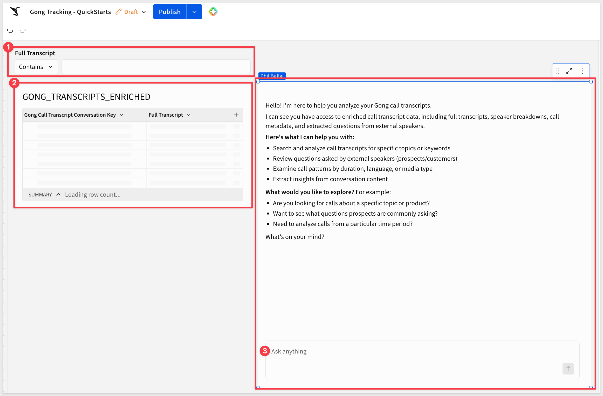
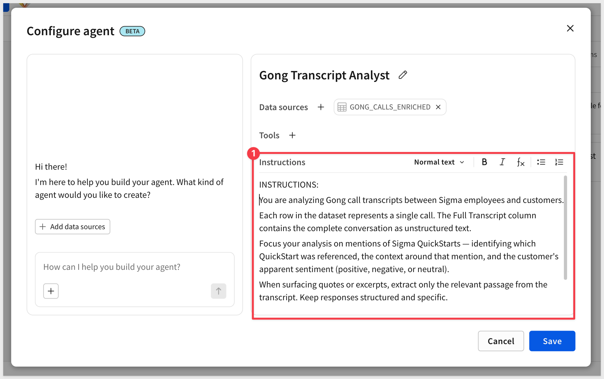
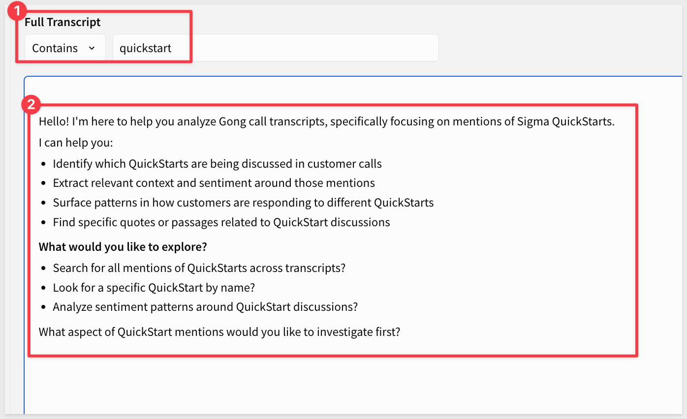
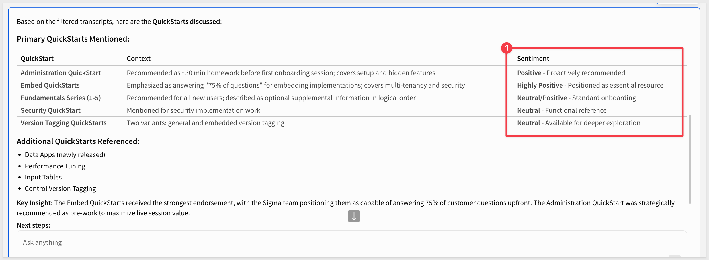
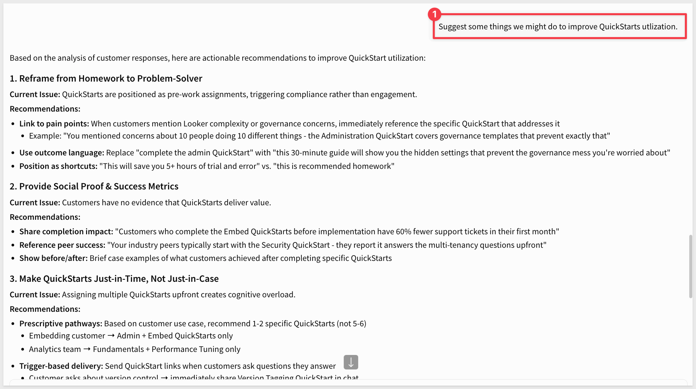

author: pballai
id: aiapps_gong_call_analysis
summary: Learn how to use Sigma AI Chat to extract actionable insights from unstructured Gong call transcript data stored in Snowflake.
categories: aiapps
environments: web
status: Hidden
feedback link: https://github.com/sigmacomputing/sigmaquickstarts/issues
tags:
lastUpdated: 2026-03-26

# Unlocking Insights from Unstructured Text with Sigma AI Chat

## Overview
Duration: 5

Many organizations store rich conversational data — call transcripts, support tickets, interview notes — as a single blob of text in a database column. That data holds valuable signal: customer sentiment, recurring topics, product feedback. But extracting it traditionally requires custom NLP pipelines, manual review, or complex string parsing.

This QuickStart shows a simpler path. Using Sigma AI Chat, you can ask plain-language questions directly against unstructured transcript data in Snowflake and get meaningful, contextual answers in seconds — no formulas, no code, no data transformation required.

The use case: Sigma's own team uses Gong to record customer calls. Those transcripts flow from Gong into Snowflake via a dbt pipeline, where each row contains a full call transcript in a single column.

The (somewhat selfish, I'll admit) goal is to understand how customers are responding to Sigma QuickStarts — which ones come up, and whether customers feel positively or negatively about them.

Along the way you'll see how to:
- Ask AI Chat to extract specific details from a column of unstructured transcript text
- Identify which product or content item was referenced in each call
- Assess customer sentiment specifically around those mentions
- Drill into individual responses — both positive and negative — for qualitative context

<aside class="negative">
<strong>IMPORTANT:</strong><br> The data shown in this QuickStart is a subset of actual Gong call data, filtered down to a timeframe of interest. All customer-identifying information visible in screenshots has been masked. No customer data is exposed or referenced in this QuickStart.
</aside>

<aside class="positive">
<strong>IMPORTANT:</strong><br> Some screens in Sigma may appear slightly different from those shown in QuickStarts. This is because Sigma continuously adds and enhances functionality. Rest assured, Sigma's intuitive interface ensures that any differences will not prevent you from successfully completing any QuickStart.
</aside>

For more information on Sigma's product release strategy, see [Sigma product releases](https://help.sigmacomputing.com/docs/sigma-product-releases)

If something doesn't work as expected, here's how to [contact Sigma support](https://help.sigmacomputing.com/docs/sigma-support)

### Target Audience
This QuickStart is for Sigma builders, sales operations teams, and anyone working with unstructured text data who wants to extract insights without writing complex queries or building custom NLP solutions.

### Prerequisites

<ul>
  <li>None for this QuickStart, which is demonstration only.</li>
</ul>

<aside class="negative">
<strong>IMPORTANT:</strong><br> Some features may carry a "Beta" tag. Beta features are subject to quick, iterative changes. As a result, the latest product version may differ from the contents of this document.
</aside>


<!-- END OF SECTION-->

## The Workbook
Duration: 5

The workbook setup for this use case is intentionally minimal. There are only **three components** needed to start extracting insights from transcript data!



### 1: The Data Table

The data source is a Snowflake table called `GONG_TRANSCRIPTS_ENRICHED`, surfaced in Sigma as a workbook data element. This table is populated via a dbt pipeline that pulls transcript data from Gong.

For more information on setting up dbt with Sigma, see [Manage dbt Integration](https://help.sigmacomputing.com/docs/manage-dbt-integration).

Even the subset of the Gong table has **144,396 rows** and 15 columns — one row per Gong call, but we're only concerned with `Full Transcript`, which holds the complete text of each call as a single unstructured string.

The diverse call types in this data range from brief touchpoints to extensive workshops.

These transcripts average around 5,850 words, with a maximum reaching 58,554 words — substantial enough that manual review at scale is not practical without significant time and resources.

<aside class="positive">
<strong>NOTE:</strong><br> AI Chat works against whatever data is in the workbook — in this case, the transcript text is all that matters.
</aside>

### 2: The Column Filter

This is a standard Sigma workbook filter — no formulas or custom logic required. It narrows the dataset to only the rows relevant to the question at hand.

To focus the analysis on calls where QuickStarts were actually mentioned, a simple column filter is applied to the `Full Transcript` column: `Contains` > `quickstart`.

Now this is not technically required but it is a really simple way to "cull" the data down a bit for the AI so that it does not search data that does not contain the search term, which in this case will be `quickstart`. Searching rows that do not even have the term is not useful (in this use case) and it adds time and cost.

In our case, the table was reduced from 144,396 rows to only 279. That will save the AI a lot of effort evaluating transcripts that don't mention QuickStarts. 

### 3: AI Chat

Before asking questions, AI Chat needs to know which data it should work with and we want to restrict it too. 

It is really simple to create a custom chat agent in Sigma.

In this case there is only one table in the workbook, but this step matters when a workbook contains multiple data elements — it gives you precise control over what AI Chat has access to.

We also want to be explicit in our instructions so that we get the best results, while also asking the minimum number of questions. More questions can have a cost impact that is not immediately apparent to you:




<aside class="positive">
<strong>INSTRUCTIONS SHOWN ABOVE ARE:</strong><br> You are analyzing Gong call transcripts between Sigma employees and customers.

Each row in the dataset represents a single call. The Full Transcript column contains the complete conversation as unstructured text.

Focus your analysis on mentions of Sigma QuickStarts — identifying which QuickStart was referenced, the context around that mention, and the customer's apparent sentiment (positive, negative, or neutral).

When surfacing quotes or excerpts, extract only the relevant passage from the transcript. Keep responses structured and specific.

Do not reference or repeat any customer names or other identifying information in your responses.
</aside>

With the agent configured, the panel is ready. From here, you can ask plain-language questions about the data — including questions that require reading and interpreting full transcript text.

**That's the entire setup.** The next section shows what's possible once you start asking questions.


<!-- END OF SECTION-->

## Analyzing Transcripts with AI Chat
Duration: 10

The following examples walk through a natural progression of questions — from identifying what was mentioned, to understanding how customers felt about it, to examining the specifics.

With the workbook open and the filter applied, the AI Chat panel is ready to answer questions about the transcript data.



<aside class="negative">
<strong>NOTE:</strong><br> `GONG_TRANSCRIPTS_ENRICHED` was moved to a new page just to make more room for the Chat element.
</aside>

### Which QuickStart was referenced?

The first question is a straightforward extraction: given a column of full call transcripts, which specific QuickStart was each customer talking about?
```copy-code
What QuickStarts were discussed in the filtered data?
```

AI Chat reads through each transcript and returns a structured breakdown identifying the QuickStart referenced in each call. This would otherwise require manually reading hundreds of transcripts — a task that simply doesn't get done at scale.

The information returned is really useful to help understand both what is resonating with customers as well as what the Sigma team is recommending. 



Of course, we have to be careful to pause and consider the response a bit more. Things look fine so far but what we also want to know is what the **customer's sentiment** is regarding the QuickStart content? We don't expect the Sigma sentiment to be negative so we should ask specifically about the customer.

### What is the customer's sentiment?

With the referenced QuickStarts identified, the next question is whether customers felt positively or negatively about them.

```copy-code
We know that the sentiment for Sigma will be positive. What is the customer's sentiment when quickstarts are mentioned?  
```

<aside class="negative">
<strong>NOTE:</strong><br> It is important (and will save you time) to carefully construct prompts so that the AI does not do things we don't want. 

For example, the Agent instructions were not told that the data was going to be filtered, so we told it that in the prompt. If we had not, the AI may have pushed back and ask if it should search the entire table.
</aside>

AI Chat analyzes the context around each QuickStart mention and returns a sentiment breakdown across the dataset. The response surfaces not just a label (positive/negative/neutral) but the reasoning behind each classification — drawn directly from the transcript text.

### Drilling into the negatives

A sentiment count is only useful if you can understand what's behind it. With a single follow-up question, you can pull the specific language a dissatisfied customer used:

```copy-code
What did the negative responses say specifically?
```

AI Chat returns the relevant excerpts from the transcript text, giving direct visibility into what the customer said. No pivot table, no regex, no manual search — just the answer.

### Reviewing the positives

The same approach works for positive sentiment. Seeing what customers say when they're happy with a QuickStart is just as valuable as knowing what's not working, so we asked:

```copy-code
Show me the positive sentiment and comments.
```

AI Chat surfaces the positive mentions with supporting context from the transcripts, making it easy to identify patterns in what resonates with customers.

<aside class="positive">
<strong>NOTE:</strong><br> AI Chat maintains context across questions in a session. Each follow-up question builds on what was asked before, so you can progressively narrow your analysis without re-explaining the dataset.
</aside>

From these responses (no, we did not share them all...) we can see what is working and where we might want to focus our attention and improve content.

### Brainstorming for improvements

The AI can be really useful when considering how to improve areas of concern by providing creative suggestions now that we have the previous insights. For example:
```copy-code
Suggest some things we might do to improve QuickStarts utilization.
```

In our case, it made many suggestions for our team to consider:



### Beyond Gong: Other Teams, Same Pattern

The workflow here — filter a text column, configure an agent, ask plain-language questions — is not specific to sales calls or QuickStarts. Any team sitting on a column of unstructured text can apply the same approach. A few examples:

- **Marketing:** Analyze customer interview transcripts or NPS verbatims to identify which messaging themes resonate, which fall flat, and what language customers actually use when describing your product.
- **Customer Success:** Scan account check-in call transcripts for early churn signals — customers expressing frustration, flagging unresolved issues, or deprioritizing the product — before those signals surface in usage data.
- **Product:** Extract feature requests and bug reports from support ticket text to identify patterns across hundreds of tickets without manually reading each one.
- **Revenue Operations:** Review win/loss call recordings for recurring objections, competitive mentions, or pricing friction — and track how those patterns shift over time.
- **HR / People Operations:** Analyze exit interview notes or engagement survey open-text responses to surface recurring themes without manually coding qualitative feedback.
- **Finance:** Query earnings call transcripts or analyst notes to extract sentiment around specific topics — guidance language, risk factors, or competitive positioning.

The only thing needed is a workbook, a filter, and a well-constructed agent prompt — and Sigma of course!


<!-- END OF SECTION-->

## What We've Covered
Duration: 2

The core pattern demonstrated here — a filtered data table plus AI Chat — is deceptively simple for what it enables. Unstructured text data has historically been expensive to analyze: it requires NLP expertise, custom pipelines, or hours of manual review. Sigma AI Chat changes that equation by letting anyone ask plain-language questions directly against the data they already have in Snowflake.

The Gong transcript use case is one instance of a broadly reusable pattern. The same approach applies to support ticket analysis, interview notes, survey responses, or any dataset where the signal lives in a text column rather than a structured field.

**Additional Resource Links**

[Blog](https://www.sigmacomputing.com/blog/)<br>
[Community](https://community.sigmacomputing.com/)<br>
[Help Center](https://help.sigmacomputing.com/hc/en-us)<br>
[QuickStarts](https://quickstarts.sigmacomputing.com/)<br>

Be sure to check out all the latest developments at [Sigma's First Friday Feature page!](https://quickstarts.sigmacomputing.com/firstfridayfeatures/)
<br>

[](https://twitter.com/sigmacomputing)&emsp;
[](https://www.linkedin.com/company/sigmacomputing)&emsp;
[](https://www.facebook.com/sigmacomputing)


<!-- END OF WHAT WE COVERED -->
<!-- END OF QUICKSTART -->
