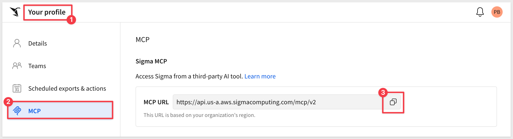
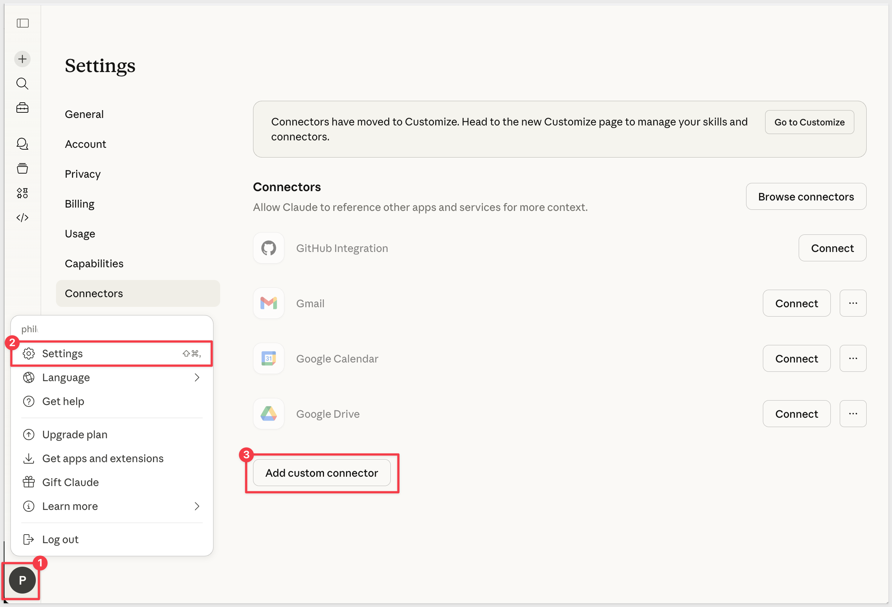
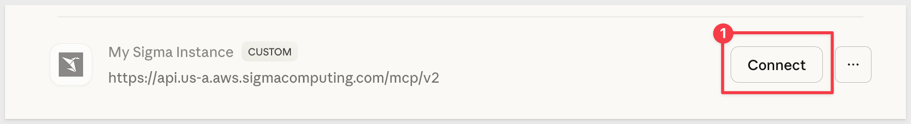
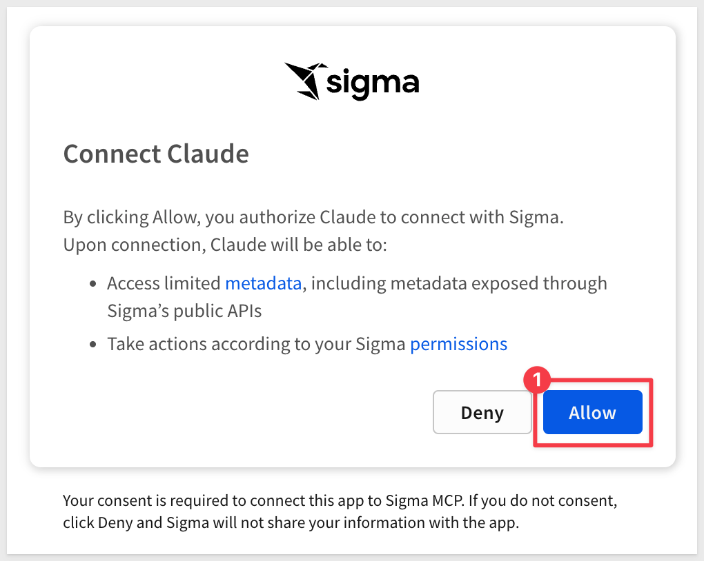

author: pballai
id: aiapps_natural_language_with_claude
summary: aiapps_natural_language_with_claude
categories: AI Apps
environments: web
status: Draft
feedback link: https://github.com/sigmacomputing/sigmaquickstarts/issues
tags: default
lastUpdated: 2026-04-14

# Analyze Sigma Data with Claude AI

## Overview
Duration: 5

This QuickStart shows how to connect Claude AI to your Sigma organization using the Sigma MCP (Model Context Protocol) server. Once connected, you can ask Claude natural language questions to find Sigma content, explore data structures, and query your data — all without writing SQL or leaving your AI interface.

This is not a demo of Sigma's built-in AI features. It is a guide for using Claude as an external analyst that can read and query your Sigma data on your behalf.

### What You'll Learn
- How to connect Claude to Sigma using the MCP server
- How to find relevant workbooks and data sources by asking natural language questions
- How to explore table structure and column definitions through Claude
- How to query live Sigma data and receive answers in plain language
- How to configure a Claude Project with Sigma-specific context to improve response quality over time

### Target Audience
Analysts and data practitioners who use both Claude and Sigma and want to reduce the friction between asking questions and getting data answers. No SQL knowledge is required for the querying examples in this QuickStart, though understanding your own Sigma data environment will help.

### Prerequisites

<ul>
  <li>Access to <a href="https://claude.ai">claude.ai</a> (Free, Pro, or Team plan)</li>
  <li>Access to your Sigma environment</li>
  <li>An AI provider configured for your Sigma organization — see <a href="https://help.sigmacomputing.com/docs/configure-ai-features-for-your-organization">Configure AI features for your organization</a></li>
  <li>A Sigma account type with <strong>View connections</strong>, <strong>View data models</strong>, and/or <strong>View workbooks</strong> permissions as appropriate for the data you want to access</li>
</ul>

<aside class="positive">
<strong>IMPORTANT:</strong><br> Some screens in Sigma may appear slightly different from those shown in QuickStarts. Sigma continuously adds and enhances functionality. Rest assured, Sigma's intuitive interface ensures that any differences will not prevent you from successfully completing any QuickStart.
</aside>

For more information on Sigma's product release strategy, see [Sigma product releases](https://help.sigmacomputing.com/docs/sigma-product-releases)

If something doesn't work as expected, here's how to [contact Sigma support](https://help.sigmacomputing.com/docs/sigma-support)

<button>[Sigma Free Trial](https://www.sigmacomputing.com/free-trial/)</button>


<!-- END OF SECTION-->

## Connect Claude to Sigma
Duration: 10

The Sigma MCP server is a remote connector that gives Claude the ability to search, explore, and query your Sigma organization. It authenticates using OAuth, inheriting your existing Sigma account permissions — no additional credentials or API keys are required.

### Step 1: Find your Sigma MCP URL

In Sigma, click your user icon (typically your initials) in the top-right corner, then select `Profile`.

Select `MCP` from the left menu.

Under the `Sigma MCP` section, copy the `MCP URL`.

<!--  -->

<aside class="positive">
<strong>NOTE:</strong><br> This URL is unique to your Sigma organization. Keep it handy — you'll paste it into Claude in the next step.
</aside>

### Step 2: Add the Sigma connector in Claude

In [claude.ai](https://claude.ai), open the menu and navigate to `Customize` > `Connectors`.

Click `Add custom connector`.

Fill in the required fields:

- Name: `Sigma`
- Connector URL: paste the MCP URL copied from Sigma

Click `Add`, then select `Connect`.

When prompted, log in to your Sigma organization to complete OAuth authentication.

<!--  -->

Once connected, the Sigma connector will appear in your connectors list with an active status. Claude can now search, explore, and query Sigma on your behalf.

<aside class="positive">
<strong>NOTE:</strong><br> If you are an Owner or Primary Owner in a Claude Team or Enterprise account, you can add the Sigma connector for your entire organization rather than individual users. See the <a href="https://support.claude.ai">Claude documentation</a> for more information.
</aside>

For more information on the Sigma MCP server, see [Use the Sigma MCP Server](https://help.sigmacomputing.com/docs/use-sigma-mcp-server).


<!-- END OF SECTION-->

## The Analyst Scenario
Duration: 5

To make this QuickStart concrete, we'll use a realistic scenario throughout the following sections.

**The situation:** You've recently joined the revenue operations team at a company that uses Sigma for sales analytics. The company's primary transaction data lives in Snowflake and is connected to Sigma. Your team works with sales, customer, and product data — but you're still getting oriented and don't yet know exactly which workbooks, tables, or metrics your colleagues rely on day-to-day.

**The goal:** Use Claude and the Sigma MCP connector to get oriented quickly — find the right content, understand the data structure, and answer a few first questions — without scheduling time with a senior analyst or waiting for a data request to be fulfilled.

**The data:** The examples in this QuickStart reference `PLUGS_ELECTRONICS`, a sample retail dataset available in Sigma. If your organization uses different data, the approach is identical — just substitute your own table and workbook names in the prompts.

The following three sections walk through the three core capabilities the Sigma MCP connector provides: finding content, understanding data, and getting answers.


<!-- END OF SECTION-->

## Finding Relevant Content
Duration: 10

The first thing most analysts need to do is figure out what already exists. Rather than manually browsing folders in Sigma, you can ask Claude to search your organization for content related to a topic.

### Searching by topic

Start a new conversation in Claude and try the following prompt:

```copy-code
Does Sigma have any workbooks or data related to sales performance or revenue?
```

Claude will use the Sigma connector to search your organization and return a list of matching workbooks, data models, or tables. The results will include document names, owners, and relevant context.

<!--  -->

### Narrowing the search

If the results are broad, you can narrow by data source, owner, or time period:

```copy-code
Find Sigma workbooks related to electronics sales created by the revenue operations team.
```

or:

```copy-code
Is there a Sigma document that tracks monthly recurring revenue or MRR?
```

Claude will refine its search and return more targeted results. You can follow up with additional clarifying questions in the same conversation — Claude retains the context of what it has already found.

<aside class="positive">
<strong>PRO TIP:</strong><br> The more specific your prompt, the more targeted the results. Including a data source name, a team name, or a known metric name significantly improves accuracy.
</aside>

### What this capability replaces

Without the Sigma MCP connector, the equivalent process would be: manually browsing Sigma's folder structure, using Sigma's search bar, or asking a colleague. The connector does not replace Sigma's UI — it gives Claude the ability to do the searching on your behalf and synthesize results into a response that fits your question.


<!-- END OF SECTION-->

## Understanding the Data
Duration: 10

Once you've identified a relevant data source or table, the next step is understanding what it contains before you start asking questions. The Sigma MCP connector can describe table structure, column names, data types, and available attributes.

### Exploring a table's structure

```copy-code
What columns are available in the PLUGS_ELECTRONICS sales table in Sigma?
```

Claude will return the column names, data types, and any available descriptions. This is especially useful when working with an unfamiliar schema — you can understand what's available before forming a more specific question.

<!--  -->

### Asking about specific attributes

You can ask follow-up questions about specific columns or concepts:

```copy-code
Does the sales table include customer location data? What geographical columns are available?
```

or:

```copy-code
What is the primary key of the PLUGS_ELECTRONICS sales table?
```

### Checking for a specific metric

If you've heard a metric name used by your team and want to verify it exists and understand how it's defined:

```copy-code
Is there a revenue or total sales column in the PLUGS_ELECTRONICS data? What does it represent?
```

Claude will describe what it finds, including column names and types that match your question.

**WHY IT MATTERS:**
Knowing what data is available before asking an analytical question improves the quality of Claude's responses. It also builds your own familiarity with the schema — the kind of understanding that usually requires either documentation or a senior colleague.


<!-- END OF SECTION-->

## Getting Answers
Duration: 15

With relevant data sources identified and their structure understood, you can ask Claude direct business questions. The Sigma MCP connector will query your data and return results in plain language.

### A first question

```copy-code
Use Sigma to find the top 10 product categories by total revenue in the PLUGS_ELECTRONICS data.
```

Claude will locate the relevant table, identify the appropriate columns, generate a query, and return the results — along with an explanation of what it found and how.

<!--  -->

### Follow-up analysis

Claude retains conversation context, so you can ask follow-up questions without restating everything:

```copy-code
Now break that down by month. Which categories grew the most between Q1 and Q2?
```

or:

```copy-code
Which of those top 10 categories had the highest return rate?
```

Each follow-up refines or extends the prior analysis.

### Comparing segments

```copy-code
Use Sigma to compare average order value between online and in-store sales channels.
```

or:

```copy-code
Which customer segment generates the most revenue? Show me the top 5.
```

### A note on query limitations

The Sigma MCP connector does not support all SQL query patterns. Avoid prompts that would require:

- Custom window frames
- Ordered window aggregates
- Dynamic intervals

If Claude encounters an unsupported query pattern, it will let you know and suggest an alternative approach.

<aside class="negative">
<strong>NOTE:</strong><br> Results reflect data accessible to your Sigma account. If you do not have permission to access a specific connection, table, or document, the connector will not be able to query it.
</aside>


<!-- END OF SECTION-->

## Your Sigma Skill Template
Duration: 10

The prompts in the previous sections work well for exploration — but over time you'll want Claude to already know the basics about your Sigma environment so you don't have to explain it every time.

Claude Projects let you store custom instructions that are included in every conversation automatically. Adding a Sigma-specific instruction block to your Project turns Claude from a general-purpose assistant into one that already understands your organization's data landscape.

### What to include

A useful Sigma instruction block covers four things:

1. **Your data sources** — which connections, data models, or workbooks are authoritative for which topics
2. **Key metric definitions** — how your team defines revenue, retention, conversion, etc.
3. **Naming conventions** — table names, schema structure, or column naming patterns your org follows
4. **Output preferences** — whether you prefer tables, bullet summaries, or prose for different types of questions

### Template

The following template is a starting point. Copy it into your Claude Project instructions and fill in the placeholders with your organization's specifics.

```copy-code
## Sigma Context

**Organization:** [Your company name]

**Primary data connection:** [Connection name in Sigma, e.g., "SNOWFLAKE_PROD"]

**Authoritative data sources:**
- Sales and revenue: [Table or data model name]
- Customer data: [Table or data model name]
- Product catalog: [Table or data model name]
- [Add additional topics as needed]

**Key metric definitions:**
- Revenue: [Your definition, e.g., "Sum of ORDER_AMOUNT where STATUS = 'completed'"]
- Active customer: [Your definition]
- [Add additional metrics as needed]

**Naming conventions:**
- Date columns are formatted as: [e.g., YYYY-MM-DD, Unix timestamp, etc.]
- Customer identifiers use the column: [e.g., CUSTOMER_ID]
- [Add any other naming conventions your team follows]

**Output preferences:**
- For summary questions: return a short paragraph with key numbers called out
- For comparison questions: use a table
- For trend questions: describe the direction and magnitude, then offer to show a breakdown
```

### How to add it to a Claude Project

1. In [claude.ai](https://claude.ai), select `Projects` from the left sidebar
2. Create a new Project or open an existing one
3. Select `Project instructions`
4. Paste the completed template into the instructions field
5. Save

Every new conversation started within that Project will include these instructions, giving Claude immediate context about your Sigma environment without requiring you to re-explain it each time.

<!--  -->

<aside class="positive">
<strong>PRO TIP:</strong><br> Keep your Sigma connector active within the same Project. With both the instructions and the connector enabled, Claude will use your org-specific context to interpret questions and the connector to retrieve live data — giving you significantly better results than either alone.
</aside>


<!-- END OF SECTION-->

## What We've Covered
Duration: 5

This QuickStart demonstrated how to connect Claude AI to Sigma using the Sigma MCP server and use that connection to do real analytical work — finding content, understanding data structure, and getting answers from live data through natural language.

The pattern here is straightforward: Claude handles the interface and the reasoning; Sigma handles the data. The MCP connector is the bridge between them. What makes this useful in practice is not any single prompt — it's the cumulative effect of being able to ask questions freely, follow up, and iterate without switching tools or writing queries.

The Skill template in the final section is what makes this durable. A well-configured Project instruction turns a general-purpose AI into one that already understands your organization — which tables are authoritative, how your team defines key metrics, and how you prefer to see results. That context compounds over time as you refine it.

The techniques covered here apply to any Sigma environment, not just the PLUGS_ELECTRONICS sample data used in the examples. The prompts are reusable; the only thing that changes is the data source names.

### Additional Resources

- [Use the Sigma MCP Server](https://help.sigmacomputing.com/docs/use-sigma-mcp-server)
- [Configure AI features for your organization](https://help.sigmacomputing.com/docs/configure-ai-features-for-your-organization)
- [Claude Projects documentation](https://support.claude.ai)


<!-- END OF SECTION-->
