author: pballai
id: aiapps_natural_language_with_claude
summary: aiapps_natural_language_with_claude
categories: aiapps
environments: web
status: Published
feedback link: https://github.com/sigmacomputing/sigmaquickstarts/issues
tags: Default
lastUpdated: 2026-06-14

# Natural Language Analytics with Claude and Sigma

## Overview
Duration: 5

This QuickStart shows how to connect Claude AI to your Sigma organization using the Sigma MCP (Model Context Protocol) server and use that connection to do real analytical work — finding content, understanding data structure, and getting answers from live data through natural language.

This is not a demo of Sigma's built-in AI features. It is a guide for using Claude as an external analyst that can read and query your Sigma data on your behalf.

Along the way you'll learn how to:
- Connect Claude to Sigma using the Sigma MCP server
- Configure a Claude Project with org-specific context to improve response quality
- Search your Sigma organization for relevant workbooks and data sources
- Explore table structure and column definitions through Claude
- Query live Sigma data and receive answers in plain language

<aside class="positive">
<strong>IMPORTANT:</strong><br> Some screens in Sigma may appear slightly different from those shown in QuickStarts. This is because Sigma continuously adds and enhances functionality. Rest assured, Sigma's intuitive interface ensures that any differences will not prevent you from successfully completing any QuickStart.
</aside>

For more information on Sigma's product release strategy, see [Sigma product releases](https://help.sigmacomputing.com/docs/sigma-product-releases)

If something doesn't work as expected, here's how to [contact Sigma support](https://help.sigmacomputing.com/docs/sigma-support)

### Target Audience
Analysts and data practitioners who use both Claude and Sigma and want to reduce the friction between asking questions and getting data answers. No SQL knowledge is required for the querying examples in this QuickStart.

### Prerequisites

<ul>
  <li>A <a href="https://claude.ai">claude.ai</a> account (Free, Pro, or Team)</li>
  <li>Access to your Sigma environment</li>
  <li>An AI provider configured for your Sigma organization — see <a href="https://help.sigmacomputing.com/docs/configure-ai-features-for-your-organization">Configure AI features for your organization</a></li>
  <li>A Sigma account type with the <strong>View connections</strong>, <strong>View data models</strong>, and/or <strong>View workbooks</strong> permissions appropriate for the data you want to access</li>
</ul>

<aside class="positive">
<strong>IMPORTANT:</strong><br> Sigma recommends using non-production resources when completing QuickStarts.
</aside>

<button>[Sigma Free Trial](https://www.sigmacomputing.com/free-trial/)</button>

<aside class="negative">
<strong>IMPORTANT:</strong><br> Some features may carry a "Beta" tag. Beta features are subject to quick, iterative changes. As a result, the latest product version may differ from the contents of this document.
</aside>


<!-- END OF SECTION-->

## Connect Claude to Sigma
Duration: 10

The Sigma MCP server is a connector that gives Claude the ability to search, explore, and query your Sigma organization. It authenticates using OAuth and inherits your existing Sigma account permissions — no additional credentials or API keys are required.

The three core capabilities it unlocks are:

<ul>
  <li><strong>Discover:</strong> Search for documents, data models, workbooks, and tables across your Sigma organization.</li>
  <li><strong>Describe:</strong> Inspect the structure of any table or data model — column names, types, and definitions.</li>
  <li><strong>Query:</strong> Run natural language queries against any data source you have access to, without writing SQL.</li>
</ul>

<aside class="positive">
<strong>WHY IT MATTERS:</strong><br> The MCP server doesn't bypass Sigma's permission model — it respects your account type and document-level access. Administrators retain full control over what data is reachable, making this a governed extension of Sigma into AI workflows rather than a workaround.
</aside>

### Setup

The Sigma MCP Server is available to all Sigma customers today via Claude's MCP registry. This provides a pre-configured MCP server that connects Claude to Sigma without manual setup.

To connect it to Claude:

1. In Claude, click `Customize` from the left sidebar:


Under `Customize` click `Connectors`, `+` and `Browse connectors`:

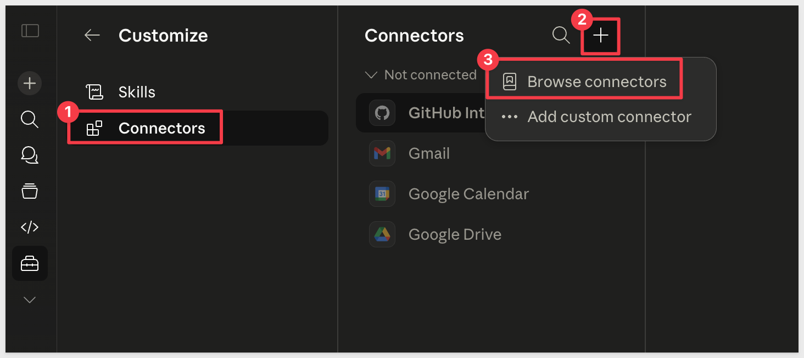

2. Search for `Sigma` and click `+`:


3. When prompted, add your Sigma instance name and click `Continue`:


Provide your Sigma credentials and login.

4. When prompted by Claude, click `Allow`:


If successful, we can `Approve` the operations Sigma will permit via Claude:


Once connected, Claude can interact with your Sigma environment using plain language. By default, nothing is authorized.

For testing we selected `Always allow` at the top level:

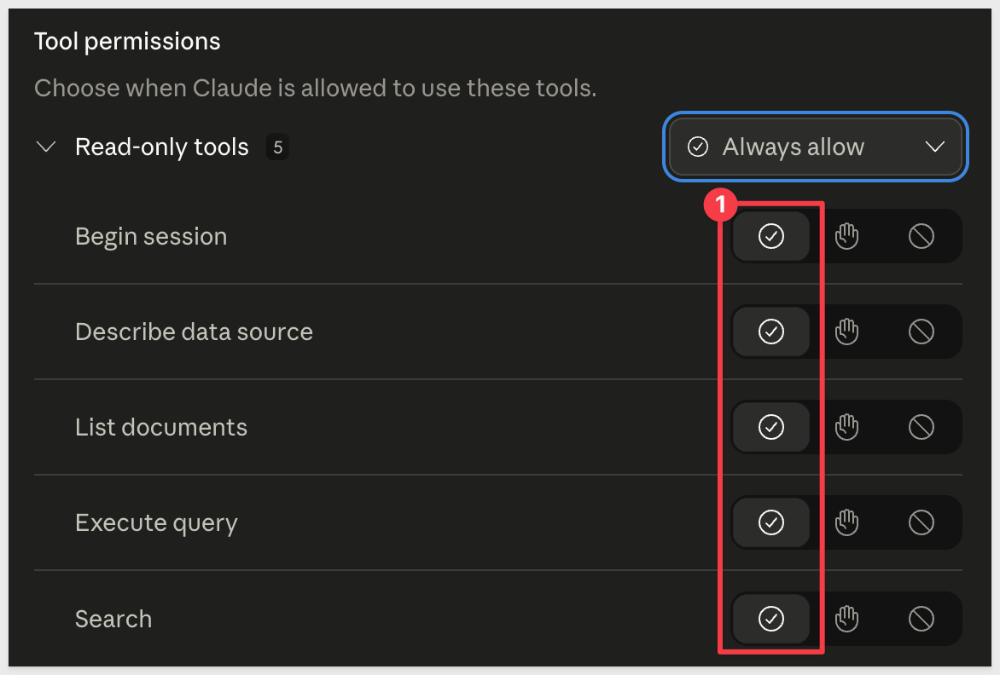

<aside class="negative">
<strong>NOTE:</strong><br> You will need appropriate Sigma permissions to use the MCP server — at minimum, <code>View connections</code> on your account type and <code>Can view</code> or <code>Can use</code> access on the specific documents or connections you want to query.
</aside>

For full setup details, see [Use the Sigma MCP Server](https://help.sigmacomputing.com/docs/use-sigma-mcp-server)


<!-- END OF SECTION-->

## Configure a Claude Project
Duration: 10

With the connector active, the next step is creating a Claude Project and adding Sigma-specific instructions to it. This is what transforms Claude from a general-purpose assistant into one that already understands your organization's data landscape before you ask your first question.

Claude Projects let you store custom instructions that are automatically included in every conversation. Without this context, Claude has to infer your data environment from each prompt. With it, Claude already knows which connections are authoritative, how your team defines key metrics, and how you prefer to receive results.

### Create a Project and add the connector

In [claude.ai](https://claude.ai), select `Projects` from the left sidebar and create a new Project. Name it something meaningful, such as `My Sigma Project`:

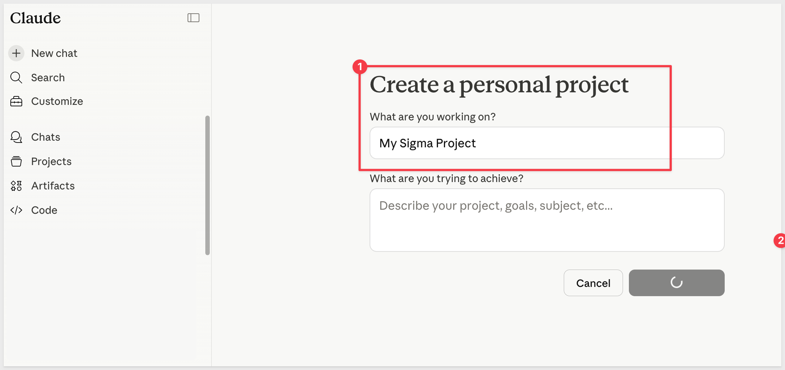

### Add Sigma context to the Project instructions

Select `Project instructions`, click `+` to add new and paste the following template, filling in the placeholders with your organization's specifics.

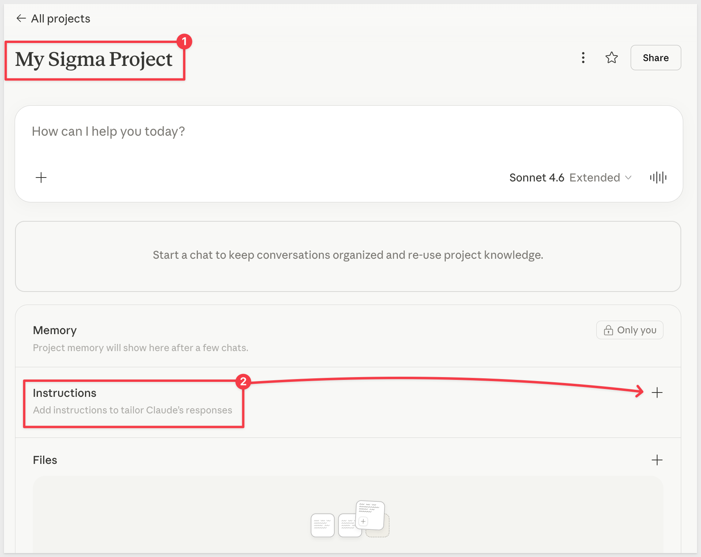

```copy-code
## Sigma Context

**Organization:** [Your company name]

**Primary data connection:** [Connection name in Sigma, e.g., "SNOWFLAKE_PROD"]

**Authoritative data sources:**
- Sales and revenue: [Table or data model name]
- Customer data: [Table or data model name]
- Product catalog: [Table or data model name]
- [Add additional topics as needed]

**Key metric definitions:**
- Revenue: [Your definition, e.g., "Sum of ORDER_AMOUNT where STATUS = 'completed'"]
- Active customer: [Your definition]
- [Add additional metrics as needed]

**Naming conventions:**
- Date columns are formatted as: [e.g., YYYY-MM-DD, Unix timestamp, etc.]
- Customer identifiers use the column: [e.g., CUSTOMER_ID]
- [Add any other naming conventions your team follows]

**Output preferences:**
- For summary questions: return a short paragraph with key numbers called out
- For comparison questions: use a table
- For trend questions: describe the direction and magnitude, then offer a breakdown
```

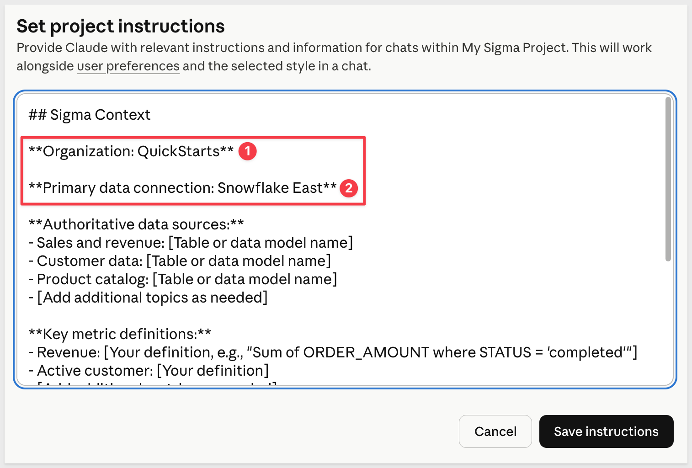

Save the instructions. Every new conversation started within this Project will include this context automatically.

<aside class="positive">
<strong>PRO TIP:</strong><br> Start with the template and refine it over time. After a few conversations, you'll notice patterns in what Claude gets wrong or asks you to clarify — those are signals to add more specifics to the instructions.
</aside>

**WHY IT MATTERS:**
A Claude Project with instructions is a human-in-the-loop pattern — you provide context once, then ask questions directly. That same foundation (scoped instructions + live data access via MCP) is also what powers more automated workflows, where Claude acts on data without waiting for a prompt. The boundary between "analyst assistant" and "autonomous agent" is less about the technology than about who initiates the work. Understanding this pattern now makes that next step easier to reason about.


<!-- END OF SECTION-->

## The Analyst Scenario
Duration: 5

To make this QuickStart concrete, we'll use a realistic scenario throughout the following sections.

**The situation:** You've recently joined the revenue operations team at a company that uses Sigma for sales analytics. The company's transaction data lives in Snowflake and is connected to Sigma. Your team works with sales, customer, and product data — but you're still getting oriented and don't yet know exactly which workbooks, tables, or metrics your colleagues rely on day-to-day.

**The goal:** Use Claude and the Sigma MCP connector to get oriented quickly — find the right content, understand the data structure, and answer a few first questions — without scheduling time with a senior analyst or waiting on a data request.

**The data:** The examples in this QuickStart reference `PLUGS_ELECTRONICS`, the sample retail dataset Sigma provides to all customers. If your organization uses different data, the approach is identical — substitute your own table and workbook names in the prompts.

Before Claude can query your data through the MCP connector, the data source must be enabled in Sigma's AI settings. This is a one-time setup that a Sigma administrator performs.

### Enable PLUGS_ELECTRONICS as a data source

In Sigma, navigate to `Administration` > `AI settings` and select the `Assistant` tab.

Click `Add source`:

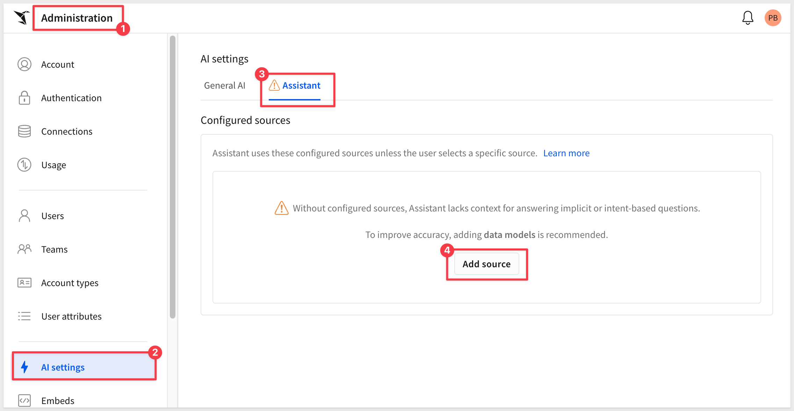

Under the list of locations on the left, search for `PLUGS`. Sigma will search across all configured connections and return matching tables and schemas.

Select the `PLUGS_ELECTRONICS_HANDS_ON_LAB_DATA` table from the `RETAIL` schema to make it available:

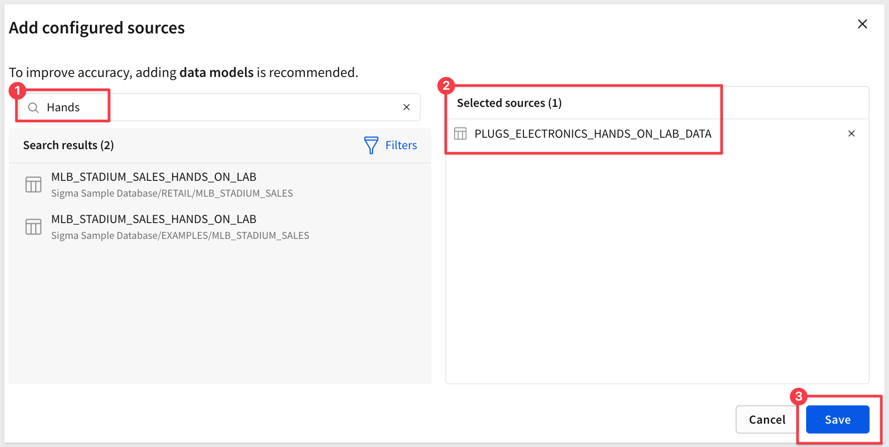

<aside class="negative">
<strong>NOTE:</strong><br> Only data sources that have been synced here are available for the MCP connector to query. If Claude reports that it cannot find or access a table, check that the table has been added and synced in AI settings.
</aside>


<!-- END OF SECTION-->

## Finding Relevant Content
Duration: 10

The first thing most analysts need to do is figure out what already exists. Rather than manually browsing folders in Sigma, you can ask Claude to search your organization for content related to a topic.

### Confirm access to the sample data

Start a new chat **within your Sigma Analytics Project** and confirm that your connection to the `PLUGS_ELECTRONICS` sample data is accessible:

```copy-code
In Sigma, do I have access to a connection or data source called PLUGS_ELECTRONICS?
```

Claude will search your Sigma organization and confirm whether the connection is reachable via MCP. Even with Project instructions already configured, this is a useful first step — it verifies that the connector is working and that your account actually has access to the data you've referenced in your instructions:

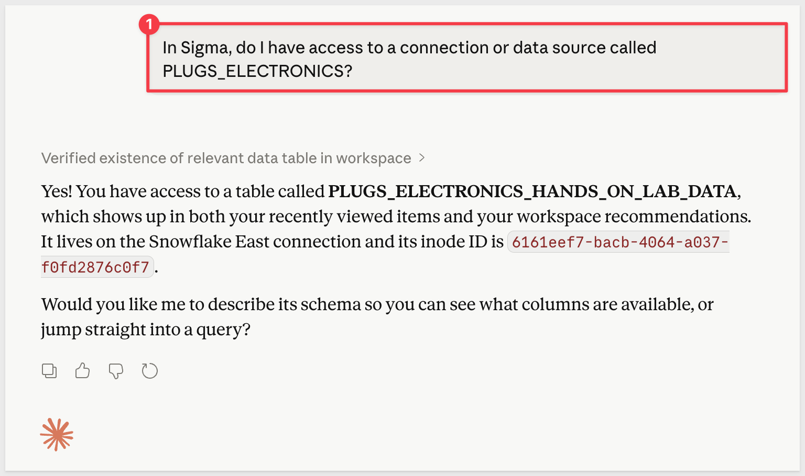

<aside class="positive">
<strong>PRO TIP:</strong><br> Always confirm access to a specific data source before jumping into analytical questions. In organizations with many connections, workbooks, and data models, an unfocused prompt can return a large and unhelpful set of results. Naming the connection or data source upfront keeps Claude focused.
</aside>

### Search within the connection

Once you've confirmed access, search for relevant content within that specific connection:

```copy-code
What workbooks or data models in Sigma are based on the PLUGS_ELECTRONICS connection?
```

Claude will return a focused list of documents, tables, and models that use that connection — giving you a clear picture of what's available to work with:

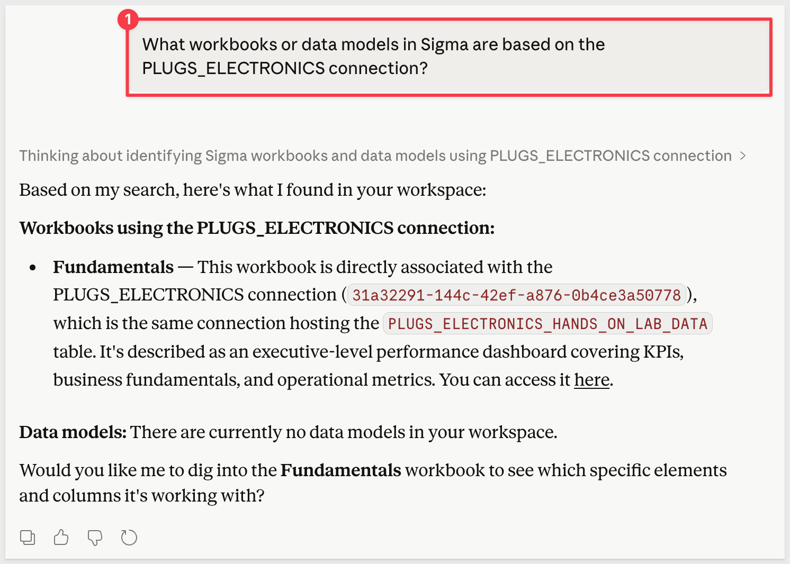

### Narrow by topic

From there, narrow by the specific topic you care about:

```copy-code
Within the PLUGS_ELECTRONICS data in Sigma, what is available related to sales transactions or order history?
```

Claude will refine its search and return more targeted results. You can follow up with additional clarifying questions in the same conversation — Claude retains the context of what it has already found:

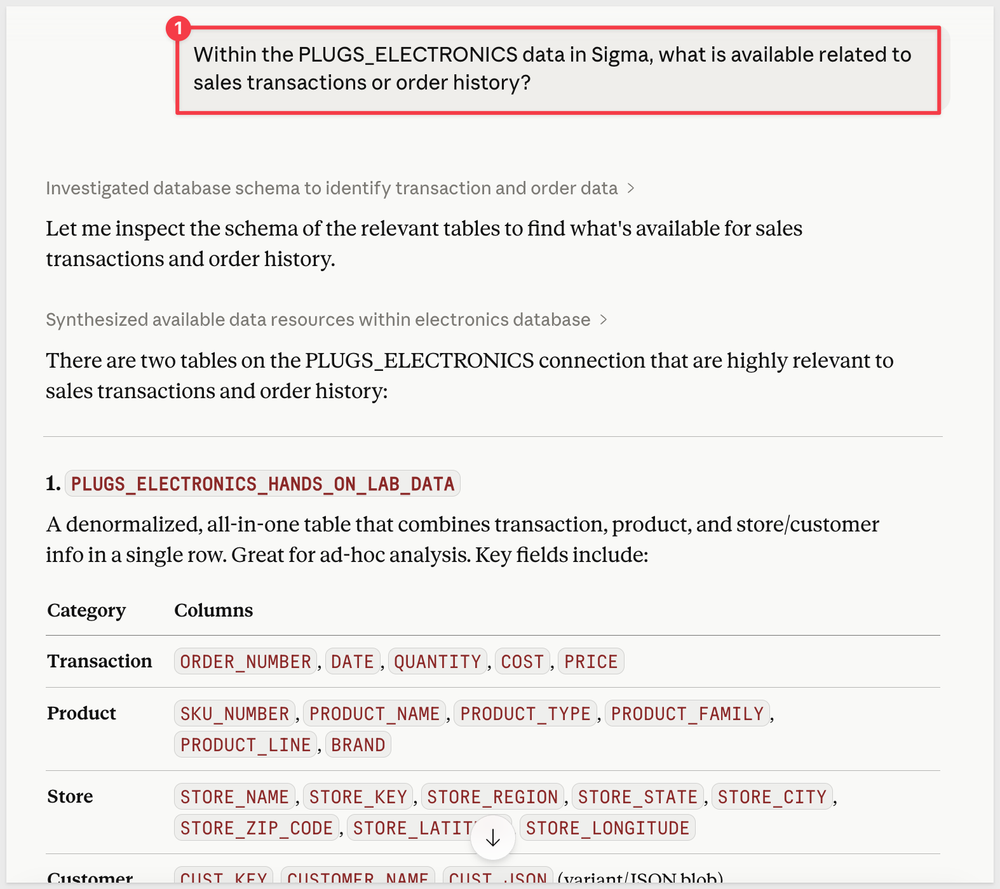

### What this replaces

Without the Sigma MCP connector, the equivalent process would be manually browsing Sigma's folder structure, using Sigma's search bar, or asking a colleague. The connector gives Claude the ability to do the searching on your behalf and synthesize results into a response that fits your question.


<!-- END OF SECTION-->

## Understanding the Data
Duration: 10

Once you've identified a relevant data source, the next step is understanding what it contains before asking analytical questions. Claude can describe table structure, column names, data types, and available attributes.

### Explore a table's structure

```copy-code
What columns and data types are available in the PLUGS_ELECTRONICS sales table in Sigma?
```

Claude will return the column names, data types, and any available descriptions. This is especially useful when working with an unfamiliar schema — you can understand what's available before forming a more specific question.

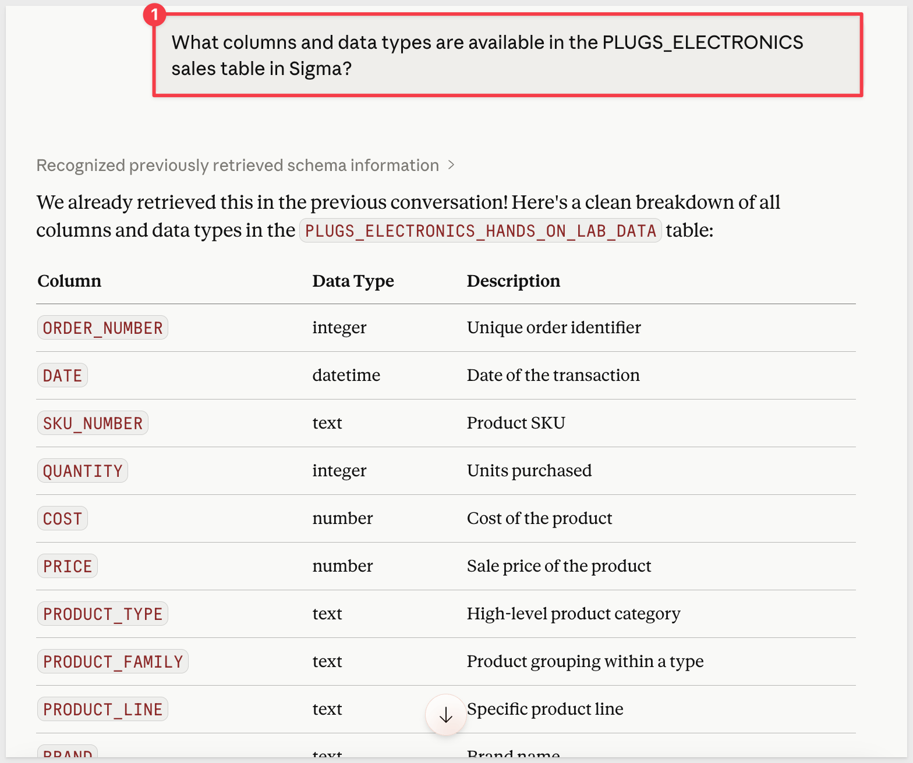

### Ask about specific attributes

You can ask follow-up questions about specific columns or concepts:

```copy-code
Does Sigma provide a method to easily extract the JSON column into columns?
```

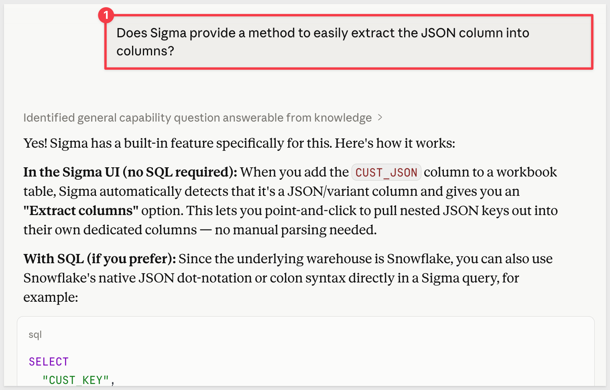

### Check for a specific metric

If you've heard a metric name used by your team and want to verify it exists:

```copy-code
Is there a revenue or total sales column in the PLUGS_ELECTRONICS data? What does it represent?
```

Claude will describe what it finds, including column names and types that match your question:

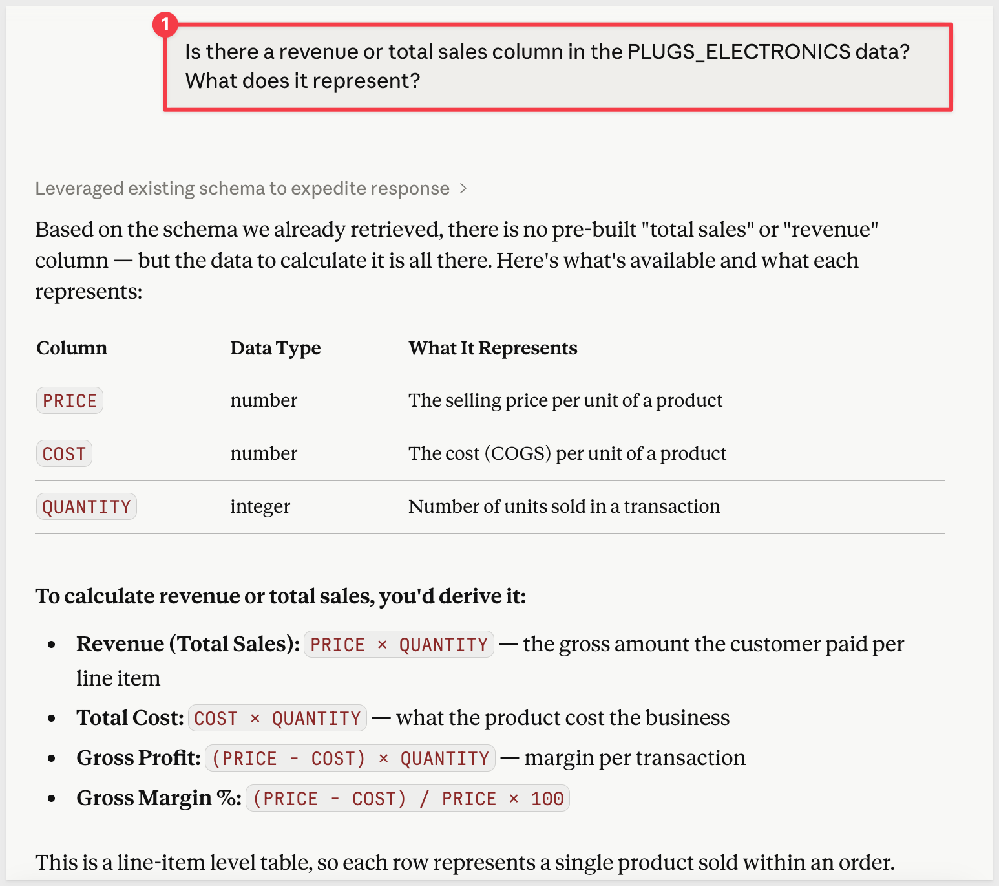

**WHY IT MATTERS:**
Knowing what data is available before asking an analytical question improves the quality of Claude's responses. It also builds your own familiarity with the schema — the kind of understanding that usually requires documentation or a senior colleague.


<!-- END OF SECTION-->

## Getting Answers
Duration: 15

With relevant data sources identified and their structure understood, you can ask Claude direct business questions. The Sigma MCP connector will query your data and return results in plain language.

### A first question

```copy-code
Use Sigma to find the top 10 product categories by total revenue in the PLUGS_ELECTRONICS data.
```

Claude will locate the relevant table, identify the appropriate columns, generate a query, and return the results — along with an explanation of what it found and how:

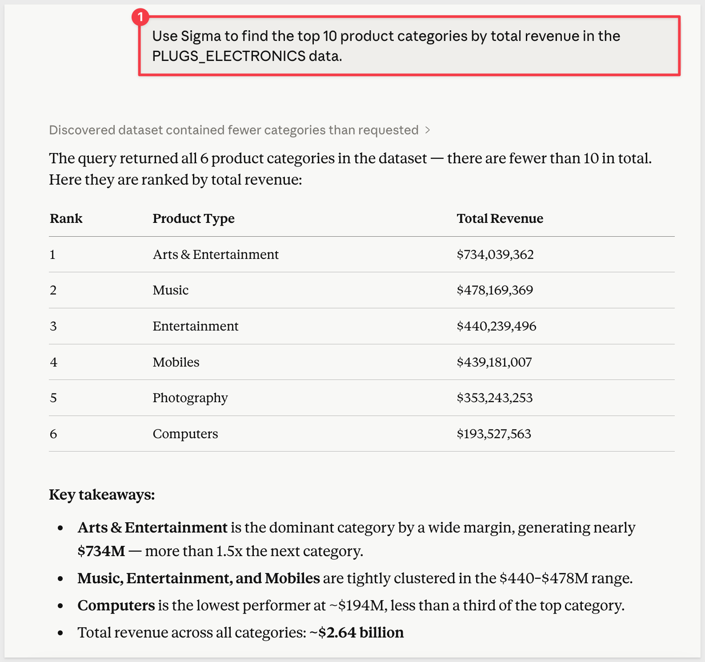

### Follow-up analysis

Claude retains conversation context, so you can ask follow-up questions without restating everything:

```copy-code
Now break that down by month. Which categories grew the most between Q1 and Q2?
```

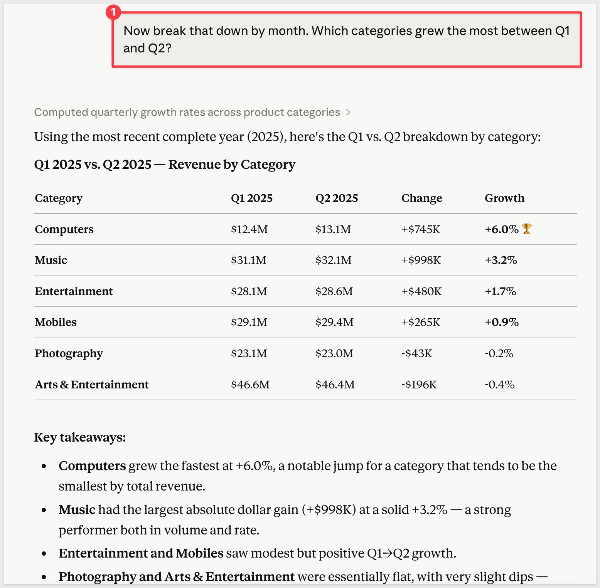

Each follow-up refines or extends the prior analysis.

### Comparing segments

```copy-code
Use Sigma to compare average order value between online and in-store sales channels.
```

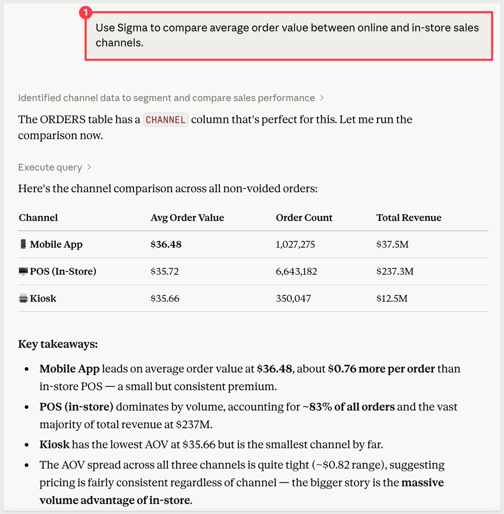

The value here is in the workflow. Instead of switching between Claude and Sigma to answer a data question, you stay in one place. Claude handles the discovery and query work, and you get answers grounded in your actual, live Sigma data — not a training dataset or a cached snapshot.

<aside class="positive">
<strong>IMPORTANT:</strong><br> Results reflect data accessible to your Sigma account. If you do not have permission to access a specific connection, table, or document, the connector will not be able to query it.
</aside>


<!-- END OF SECTION-->

## What we've covered
Duration: 5

This QuickStart demonstrated how to connect Claude AI to Sigma using the Sigma MCP server and use that connection to do real analytical work — finding content, understanding data structure, and getting answers from live data through natural language.

The setup involves three things done once: connecting the MCP connector, configuring a Claude Project with org-specific context, and enabling the relevant data sources in Sigma's AI settings. After that, the workflow is entirely conversational — you ask questions, Claude queries Sigma, and you get answers without switching tools or writing SQL.

The Project instructions are what make this durable over time. A well-configured Project turns Claude from a general-purpose assistant into one that already understands your organization — which tables are authoritative, how your team defines key metrics, and how you prefer to see results. That context compounds as you refine it.

The techniques covered here apply to any Sigma environment, not just the `PLUGS_ELECTRONICS` sample data used in the examples. The prompts are reusable; the only thing that changes is the data source names.

**Additional Resource Links**

[Use the Sigma MCP Server](https://help.sigmacomputing.com/docs/use-sigma-mcp-server)<br>
[Configure AI features for your organization](https://help.sigmacomputing.com/docs/configure-ai-features-for-your-organization)<br>
[Blog](https://www.sigmacomputing.com/blog/)<br>
[Community](https://community.sigmacomputing.com/)<br>
[Help Center](https://help.sigmacomputing.com/hc/en-us)<br>
[QuickStarts](https://quickstarts.sigmacomputing.com/)<br>

Be sure to check out all the latest developments at [Sigma's First Friday Feature page!](https://quickstarts.sigmacomputing.com/firstfridayfeatures/)
<br>

[](https://twitter.com/sigmacomputing)&emsp;
[](https://www.linkedin.com/company/sigmacomputing)&emsp;
[](https://www.facebook.com/sigmacomputing)


<!-- END OF WHAT WE COVERED -->
<!-- END OF QUICKSTART -->
