author: pballai
id: aiapps_scheduled_actions
summary: Learn how to automate a nightly inventory monitoring workflow using Sigma's Scheduled Actions feature, including formula-based conditions, input table writes, and email notifications.
categories: aiapps
environments: web
status: Published
feedback link: https://github.com/sigmacomputing/sigmaquickstarts/issues
tags: default
lastUpdated: 2026-03-27

# Automate Inventory Alerts with Scheduled Actions

## Overview
Duration: 5

Sigma's Scheduled Actions let you automate sequences of operations on a workbook — refreshing data, updating controls, writing to input tables, and sending notifications — all triggered on a time-based schedule.

In this QuickStart, you'll build a nightly inventory monitoring workflow using Sigma's Plugs Electronics sample dataset. 

Two scheduled sequences run each night: one unconditionally writes an audit log entry recording the current stock status, and another sends an email alert to the operations team only when products have fallen below the minimum stock threshold.

Along the way you'll learn how to:
- Build a workbook with a calculated inventory status view
- Create an input table to serve as a persistent audit log
- Configure a nightly Scheduled Action sequence with a time-based trigger
- Use formula-based conditions to control which sequences fire based on live workbook data
- Send an email notification with a workbook link pre-filtered to show only low-stock SKUs

<aside class="positive">
<strong>IMPORTANT:</strong><br> Some screens in Sigma may appear slightly different from those shown in QuickStarts. This is because Sigma continuously adds and enhances functionality. Rest assured, Sigma's intuitive interface ensures that any differences will not prevent you from successfully completing any QuickStart.
</aside>

For more information on Sigma's product release strategy, see [Sigma product releases](https://help.sigmacomputing.com/docs/sigma-product-releases).

If something doesn't work as expected, here's how to [contact Sigma support](https://help.sigmacomputing.com/docs/sigma-support).

### Target Audience
This QuickStart is intended for Sigma builders and administrators who want to automate recurring workbook-based workflows. Familiarity with building workbooks in Sigma is assumed.

### Prerequisites

<ul>
  <li>Any modern browser is acceptable.</li>
  <li>Access to your Sigma environment with Creator or Admin permissions.</li>
  <li>An email address to use as the notification recipient during testing.</li>
  <li>Some familiarity with Sigma workbooks is assumed. Not all steps will be shown in detail.</li>
</ul>

<aside class="positive">
<strong>IMPORTANT:</strong><br> Sigma recommends using non-production resources when completing QuickStarts.
</aside>

<button>[Sigma Free Trial](https://www.sigmacomputing.com/free-trial/)</button>

<aside class="negative">
<strong>IMPORTANT:</strong><br> Some features may carry a "Beta" tag. Beta features are subject to quick, iterative changes. As a result, the latest product version may differ from the contents of this document.
</aside>


## Build the Inventory Workbook
Duration: 10

In this section, you'll create a workbook using the `F_INVENTORY_ADJUSTED` table from the Plugs Electronics sample dataset and build an inventory summary that flags any products below a minimum stock threshold.

<aside class="positive">
<strong>Note:</strong><br> The Sigma sample database can be disabled by your administrator but is available by default.
</aside>

### Create the Workbook

From the Sigma home page, click `Create New` > `Workbook`.

Using the `Element bar`, add a new `Table` from the `Data` group.

In the data source picker, navigate to `Sigma Sample Database` > `RETAIL` > `PLUGS_ELECTRONICS` and select `F_INVENTORY_ADJUSTED`.

<aside class="negative">
<strong>IMPORTANT:</strong><br> Make sure to select the table from the `PLUGS_ELECTRONICS` schema under `RETAIL`.
</aside>

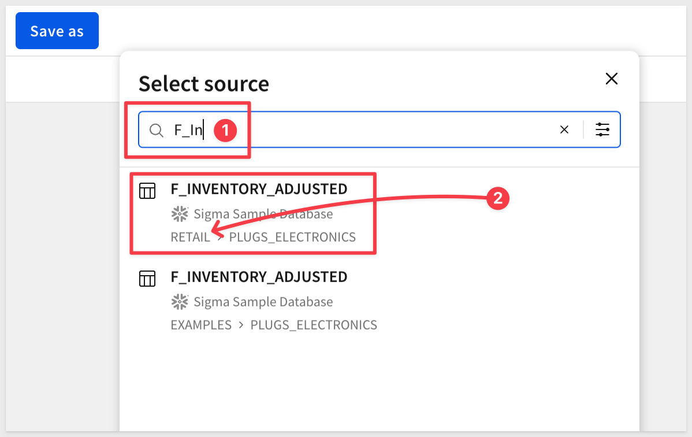

Click the table to load it.

Double-click the page tab at the bottom and rename it `Inventory Dashboard`.

Save the workbook as `Scheduled Actions QuickStart` in your preferred workspace.

### Build the Inventory Summary

Using the `Element panel`, drag the `Sku Number` column up to `Group by` so that each row represents a unique product SKU:

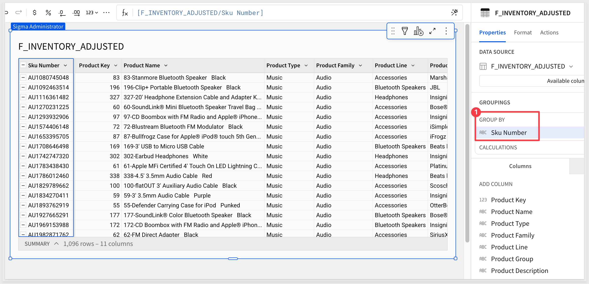

Using the `+` in the `CALCULATIONS` panel, add the following columns:

**Column 1: Stock Level**
```copy-code
Sum([Quantity On Hand])
```
Rename this column `Stock Level`.

**Column 2: Status**
```copy-code
If([Stock Level] <= 1, "Low Stock", "OK")
```
Rename this column `Status`.

<aside class="positive">
<strong>Note:</strong><br> The <code>F_INVENTORY_ADJUSTED</code> sample dataset contains Stock Level values of 1, 2, or 3 units per SKU. A threshold of <code><= 1</code> flags only single-unit SKUs as low stock, which creates a useful alert scenario for this QuickStart. In a real-world implementation, set this threshold to match your actual reorder point.
</aside>

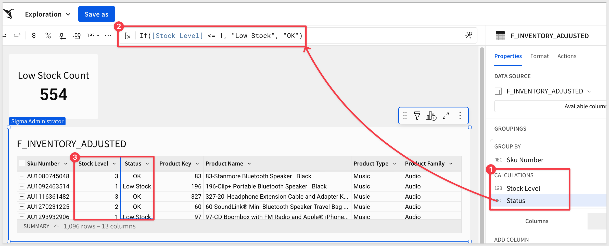

### Add a Low-Stock Count KPI

We want a KPI element to display the total count of low-stock SKUs. The Scheduled Action will reference this value in its conditional logic.

With the inventory table selected, click `Child Element` > `Chart`:

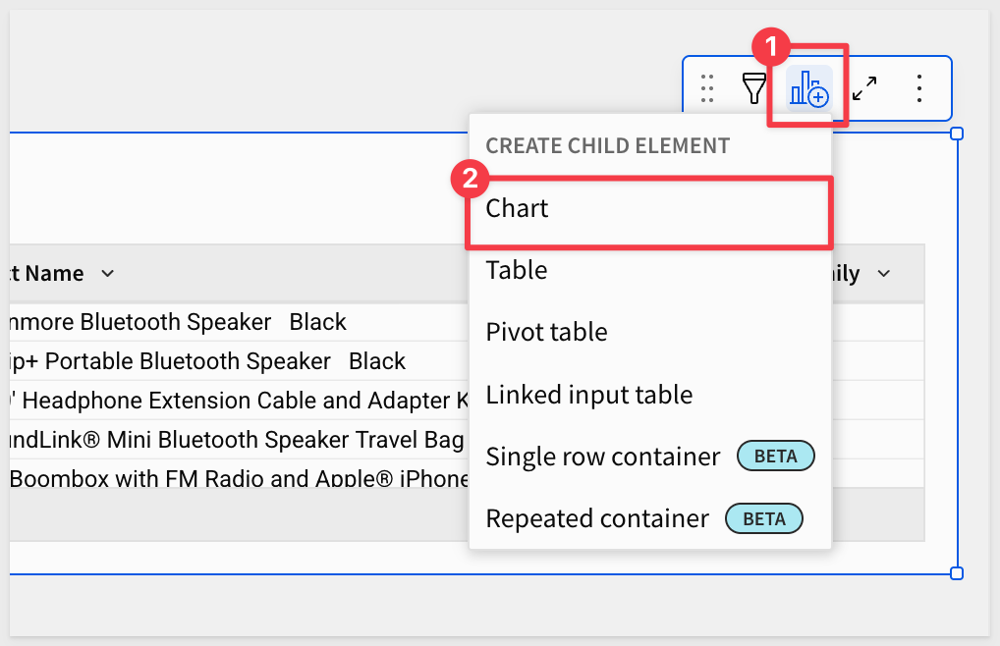

Change the `CHART TYPE` to `KPI` and in the `VALUE` group click the `+` to `Add a new column` and use this formula:
```copy-code
CountIf([Status] = "Low Stock")
```

Rename the KPI element `Low Stock Count`.

<aside class="positive">
<strong>Note:</strong><br> With the sample data and a threshold of <code><= 1</code>, the KPI should display approximately 554 — the number of SKUs with only 1 unit on hand. This is the value the Scheduled Action will evaluate to determine whether to send an alert.
</aside>

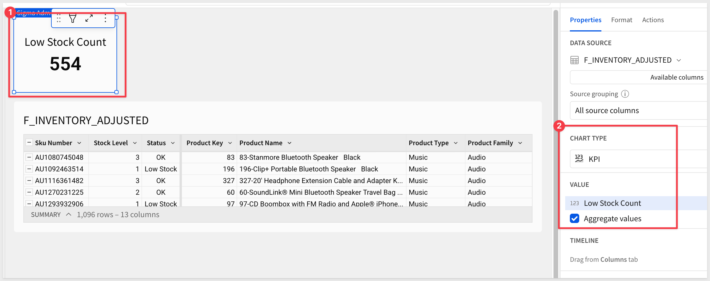

### Add a Status Filter Control

Adding a filter control to the dashboard allows the alert email to open the workbook pre-filtered to show only low-stock items. The Scheduled Action passes the filter value automatically through the notification link.

Click the `Status` column header in the inventory table and select `Filter`. This adds a Status filter in the `Filters & controls` panel.

<!-- screenshot: Status column menu with Filter highlighted -->

In the `Filters & controls` panel, click the `...` menu on the Status filter and select `Convert to page control`.

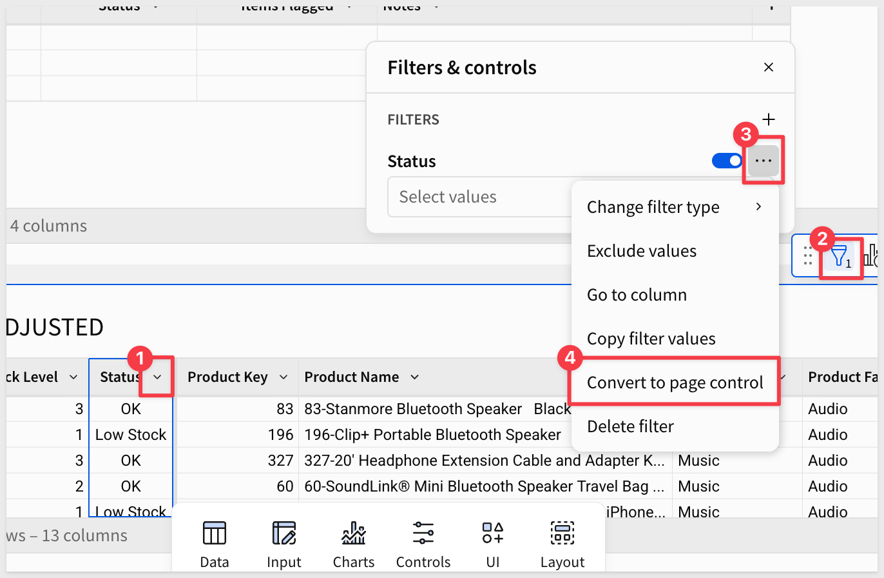

Set the `Control ID` to `Status-Filter`:

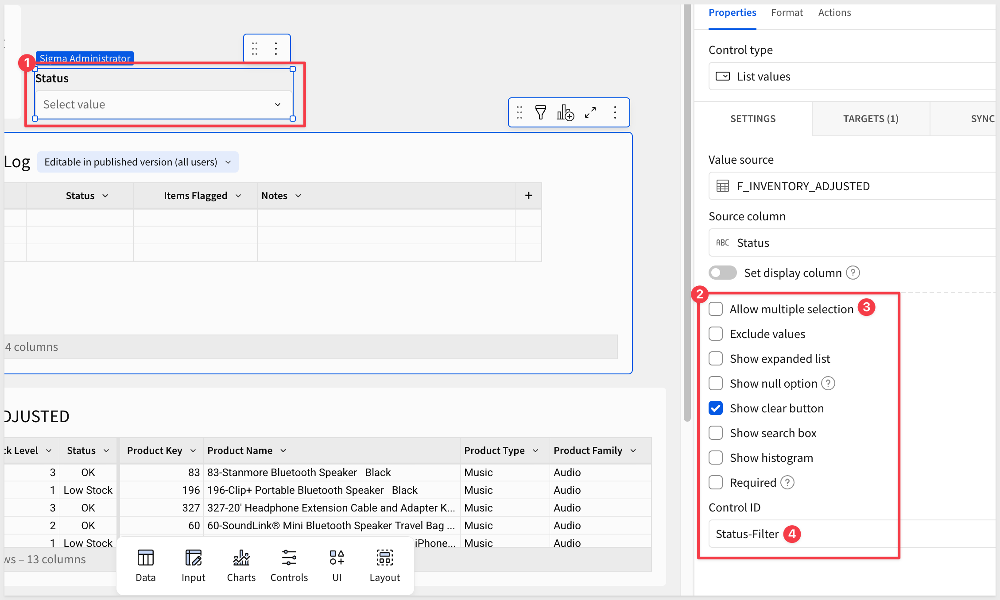

<aside class="positive">
<strong>Note:</strong><br> When the alert email is sent, the notification will pass <code>Low Stock</code> as the control value. The recipient's workbook link will open directly to a view filtered to low-stock SKUs only.
</aside>

Click `Save` to save your changes.


<!-- END OF SECTION-->

## Add the Audit Log Input Table
Duration: 5

The `Scheduled Action` will append a row to an input table every time it runs — regardless of whether low-stock items were found. This creates a complete audit trail of every nightly execution.

### Add a New Workbook Page

Click the `+` button next to the `Inventory Dashboard` tab to add a new page.

Rename the new page `Audit Log`.

### Create the Input Table

On the `Audit Log` page, use the `Element bar` to add a new `Empty` input table from the `Input` group.

Set the connection to `Sigma Sample Database` and click `Create`.

Rename the first column to `Status`.

Add the following columns to the input table, moving the `Run Date` column to the first position:

| Column Name | Type |
|---|---|
| `Run Date` | Date |
| `Items Flagged` | Number |
| `Notes` | Text |

Rename the input table element `Inventory Check Log`.

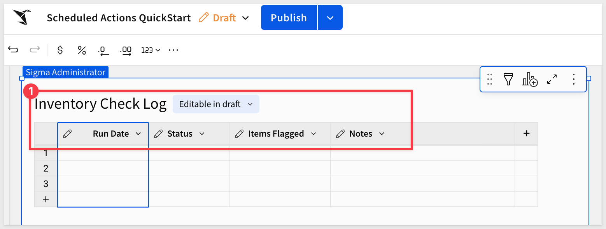

<aside class="positive">
<strong>Note:</strong><br> Input tables in Sigma allow data to be written back directly from within the platform — including from Scheduled Actions. For more information, see <a href="https://help.sigmacomputing.com/docs/intro-to-input-tables">Intro to input tables</a>.
</aside>


<!-- END OF SECTION-->

## Create the Scheduled Action
Duration: 15

With the workbook and input table in place, we are ready to configure the `Scheduled Actions`. We'll create two sequences on the same nightly schedule — one that always writes an audit log entry, and one that sends an email alert only when low-stock items are detected.

<aside class="positive">
<strong>Where things get interesting:</strong><br> Each Scheduled Action sequence has an optional <strong>Condition</strong> field — a custom formula that controls whether the sequence fires at all. Leave it blank and the sequence always runs. Add a formula and it only runs when that formula evaluates to true.

This means you can stack multiple sequences on the same schedule, each with its own condition and its own set of actions. One sequence writes an audit log unconditionally. Another sends an alert only when stock is critical. A third could call an external API only on month-end. The sequences are independent but coordinated — enabling sophisticated, data-driven workflows entirely within Sigma, with no external orchestration required.
</aside>

### Open Scheduled Actions

With the workbook open in draft mode, click the `Actions` tab in the right-hand panel.

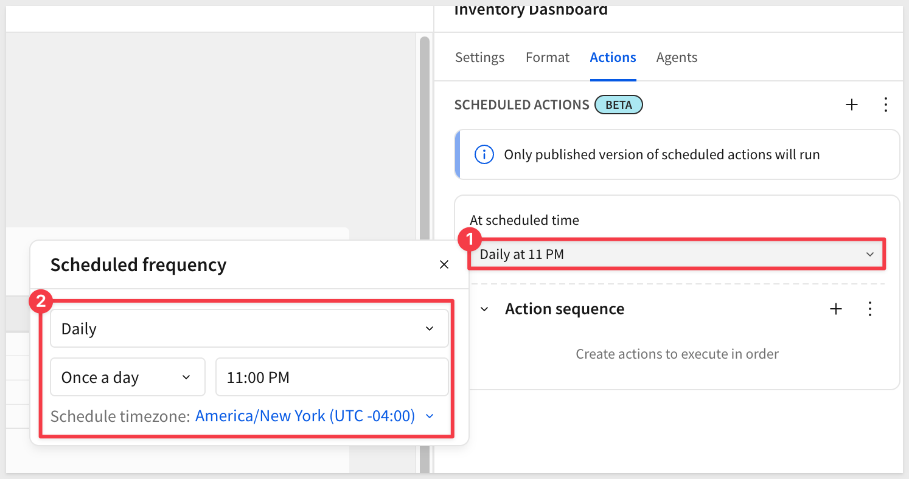

### Sequence 1: Audit Log (Always Runs)

This sequence runs every night without a condition, writing a status record to the `Inventory Check Log` regardless of whether low-stock items are found.

Under **SCHEDULED ACTIONS**, click `+` to create the first sequence.

In the **At scheduled time** dropdown, select `Daily at 11 PM` and choose the appropriate time zone.

Under **Action sequence**, click `+` and select `Insert row`.

Configure the following:

- Into: `Inventory Check Log`

- Map with values:
  - Run Date / Formula:
```copy-code
Today()
```
  - Status / Formula:
```copy-code
If([Low Stock Count/Stock Level] > 0, "Low Stock Alert", "All Clear")
```
  - Items Flagged / Formula:
```copy-code
[Low Stock Count/Stock Level]
```
  - Notes / Formula:
```copy-code
If([Low Stock Count/Stock Level] > 0, "Nightly check detected products below threshold.", "Nightly check completed. All stock levels within acceptable range.")
```

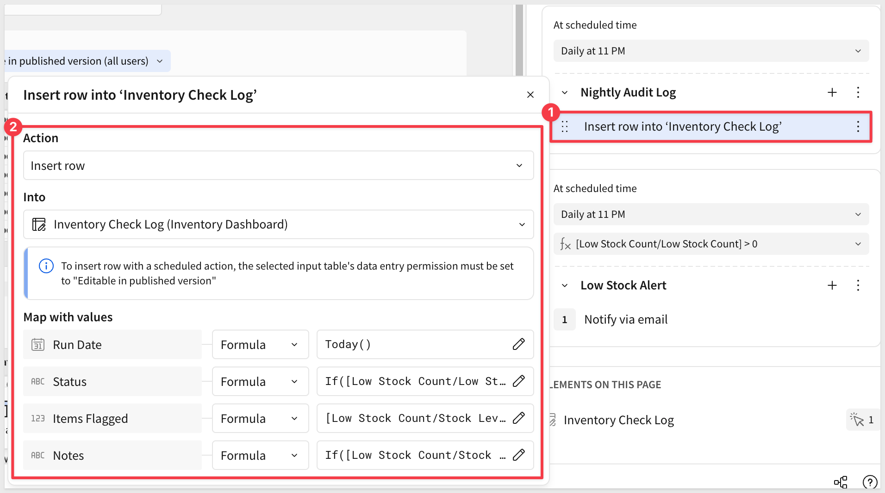

### Sequence 2: Low Stock Alert (Conditional)

This sequence runs on the same nightly schedule but only fires when the `Low Stock Count` is greater than zero.

Under **SCHEDULED ACTIONS**, click `+` to create a second sequence.

Set the **At scheduled time** dropdown to the same schedule — `Daily at 11 PM` with the same time zone.

Add a `Condition`:

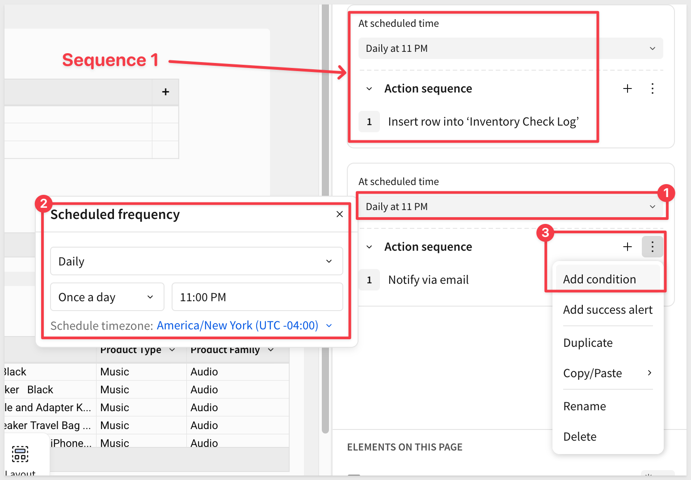

Use the `Custom formula`:
```copy-code
[Low Stock Count/Stock Level] > 0
```

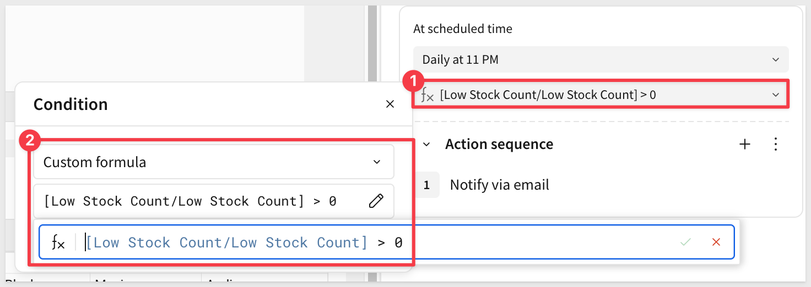

### Add the Email Notification Step

Under **Action sequence**, click `+` and select `Notify and export`.

Set **Destination** to `Email` and configure the following:

- Recipient: Use your own email address for testing
- Subject: `Inventory Alert: Low Stock Detected`
- Message: `Product(s) have fallen below the minimum stock threshold. Review the Inventory Dashboard for details.`
- Scroll down and enable `Link to workbook`

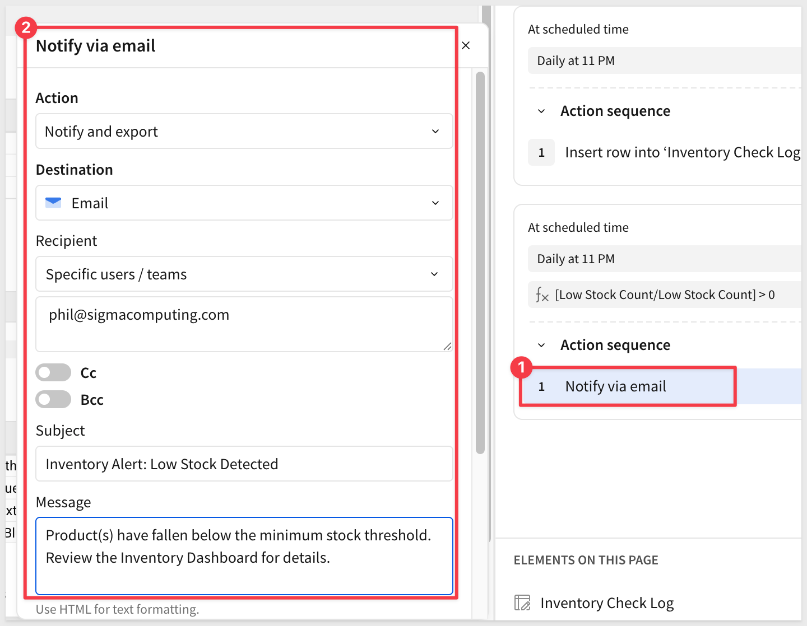

Scroll down to **Pass control values**, click `+` and configure:

- Control: `Status Filter`
- Value: `Low Stock`

This ensures the workbook link opens the `Inventory Dashboard` pre-filtered to show only low-stock SKUs.

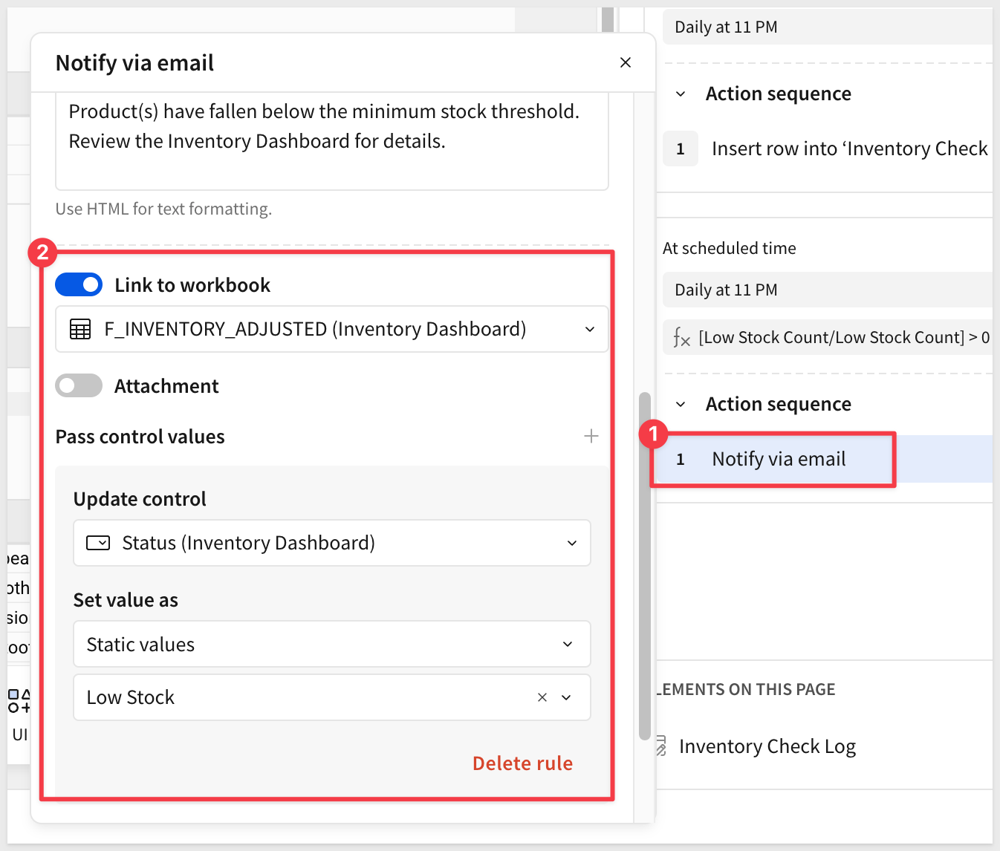

### Name the Sequences

Before publishing, give each sequence a descriptive name so they're easy to identify in the panel and in run history.

Click the `...` menu on the first sequence (the audit log) and select `Rename`. Enter `Nightly Audit Log`.

Click the `...` menu on the second sequence (the email alert) and select `Rename`. Enter `Low Stock Alert`.

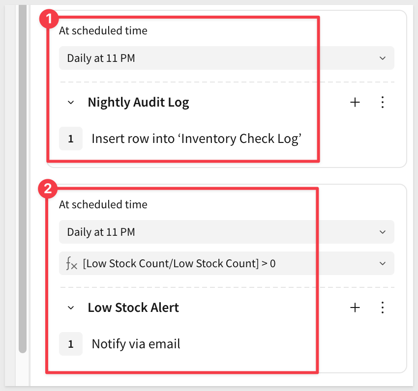

### Publish to Activate

<aside class="negative">
<strong>IMPORTANT:</strong><br> Only the published version of a workbook's scheduled actions will run. Before publishing, ensure the input table is set to allow changes in published mode.
</aside>

Click `Publish` in the top toolbar. Both sequences are now active and will run nightly.

After publishing, the sequences ran for several days to confirm alerts were triggering as expected:

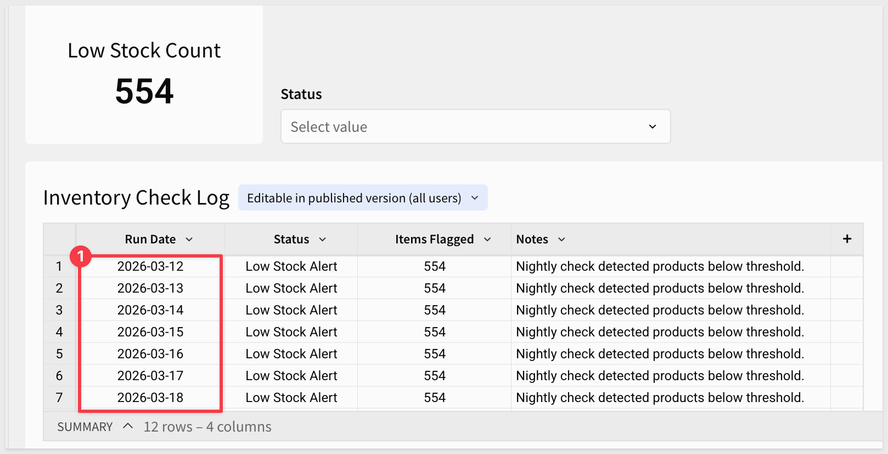

Alert emails were confirmed in the recipient inbox:

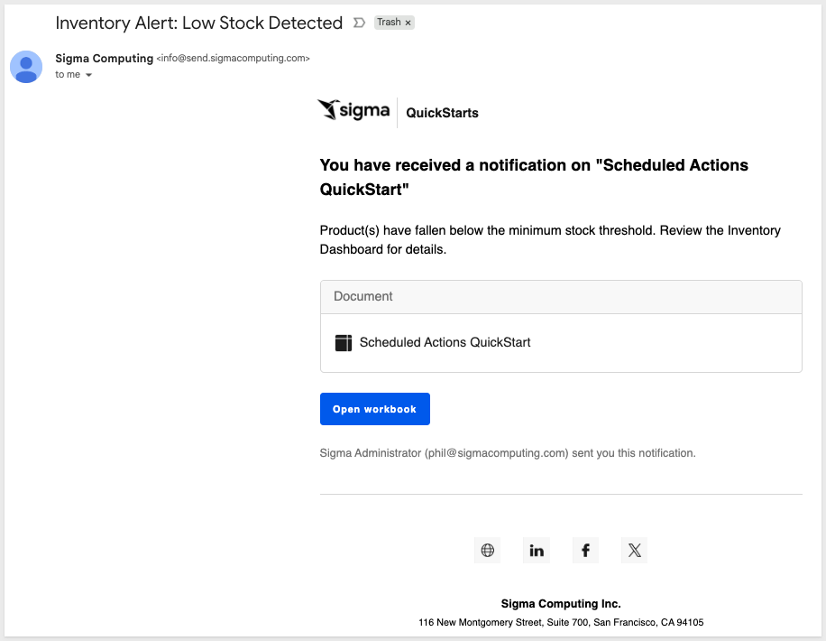

<aside class="positive">
<strong>Note:</strong><br> After publishing, you can monitor run history and status for all scheduled actions from your user profile under <strong>Scheduled exports and actions</strong> > <strong>Scheduled actions</strong>.
</aside>

For example:

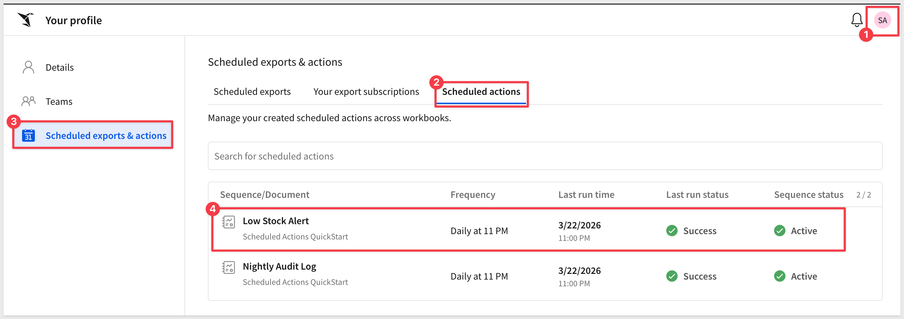


<!-- END OF SECTION-->


## What we've covered
Duration: 1

In this QuickStart, you built a fully automated nightly inventory monitoring workflow using Sigma's Scheduled Actions — without writing a single line of pipeline code or relying on any external orchestration tool.

The workflow demonstrates a pattern that applies broadly across business functions: recurring processes that need to run reliably, log what happened, and notify the right people only when action is required. In an inventory context, that means operations teams are alerted to stock issues before they become fulfillment problems, and every run is recorded — whether it triggered an alert or not — so there's always an auditable history to reference.

Beyond the specific use case, the techniques covered here are reusable building blocks:

- **Input tables as audit logs** — a lightweight way to capture operational history directly inside Sigma, no external database required
- **Formula-based sequence conditions** — a flexible mechanism to control when automation fires, based on live data rather than fixed schedules alone
- **Pass control values** — a simple but powerful feature that makes notification links context-aware, so recipients land exactly where the data matters most

**Additional Resource Links**

[Blog](https://www.sigmacomputing.com/blog/)<br>
[Community](https://community.sigmacomputing.com/)<br>
[Help Center](https://help.sigmacomputing.com/hc/en-us)<br>
[QuickStarts](https://quickstarts.sigmacomputing.com/)<br>

Be sure to check out all the latest developments at [Sigma's First Friday Feature page!](https://quickstarts.sigmacomputing.com/firstfridayfeatures/)
<br>

[](https://twitter.com/sigmacomputing)&emsp;
[](https://www.linkedin.com/company/sigmacomputing)&emsp;
[](https://www.facebook.com/sigmacomputing)


<!-- END OF WHAT WE COVERED -->
<!-- END OF QUICKSTART -->
