author: pballai
id: aiapps_scheduling_sigma_insights_to_slack
summary: aiapps_scheduling_sigma_insights_to_slack
categories: aiapps
environments: web
status: Published
feedback link: https://github.com/sigmacomputing/sigmaquickstarts/issues
tags: Default
lastUpdated: 2026-06-22

# Scheduling Sigma Insights to Slack

## Overview
Duration: 5

This QuickStart shows how to connect Claude to Sigma using the Sigma MCP server and to Slack using the claude.ai Slack connector, then use both to query live Sigma data, format the results as a daily digest, and deliver it to a Slack channel or DM on a recurring schedule — automatically, with fresh data each time.

The workflow has two phases: 
- browser-based design phase where you query Sigma, refine the format, and confirm Slack delivery works 

- a Claude Code scheduling step that hands the workflow off to run automatically each morning.

Along the way you'll learn how to:
- Connect Claude to Sigma using the Sigma MCP server
- Query live Sigma data and format the results as a Slack message
- Test Slack delivery from the claude.ai browser
- Schedule the full workflow as a recurring routine using Claude Code

<aside class="positive">
<strong>IMPORTANT:</strong><br> Some screens in Sigma may appear slightly different from those shown in QuickStarts. This is because Sigma continuously adds and enhances functionality. Rest assured, Sigma's intuitive interface ensures that any differences will not prevent you from successfully completing any QuickStart.
</aside>

For more information on Sigma's product release strategy, see [Sigma product releases](https://help.sigmacomputing.com/docs/sigma-product-releases)

If something doesn't work as expected, here's how to [contact Sigma support](https://help.sigmacomputing.com/docs/sigma-support)

### Target Audience
Analysts and data practitioners who use Sigma for data analysis and want to automate recurring data workflows. The design phase is entirely browser-based; scheduling requires Claude Code in a terminal.

### Prerequisites

<ul>
  <li>A <a href="https://claude.ai">claude.ai</a> account on a Pro, Max, Team, or Enterprise plan</li>
  <li><a href="https://claude.ai/code">Claude Code</a> installed and up to date (required for scheduling)</li>
  <li>The Slack integration connected in claude.ai — navigate to <code>Settings</code> > <code>Integrations</code> and connect Slack with <code>Send message</code> set to <code>Always allow</code></li>
  <li>Access to your Sigma environment</li>
  <li>An AI provider configured for your Sigma organization — see <a href="https://help.sigmacomputing.com/docs/configure-ai-features-for-your-organization">Configure AI features for your organization</a></li>
</ul>

<aside class="positive">
<strong>IMPORTANT:</strong><br> Sigma recommends using non-production resources when completing QuickStarts.
</aside>

<aside class="negative">
<strong>IMPORTANT:</strong><br> Some features may carry a "Beta" tag. Beta features are subject to quick, iterative changes. As a result, the latest product version may differ from the contents of this document.
</aside>


<!-- END OF SECTION-->

## Connect to Sigma
Duration: 10

The Sigma MCP server is a remote connector that gives Claude the ability to search, explore, and query your Sigma organization. It authenticates using OAuth and inherits your existing Sigma account permissions — no additional credentials or API keys are required.

<aside class="positive">
<strong>WHY IT MATTERS:</strong><br> The MCP server doesn't bypass Sigma's permission model — it respects your account type and document-level access. Administrators retain full control over what data is reachable, making this a governed extension of Sigma into AI workflows rather than a workaround.
</aside>

### Setup
The Sigma MCP Server is available to all Sigma customers today via Claude's MCP registry. This provides a pre-configured MCP server that connects Claude to Sigma without manual setup.

To connect it to Claude:

1. In Claude, click `Customize` from the left sidebar:

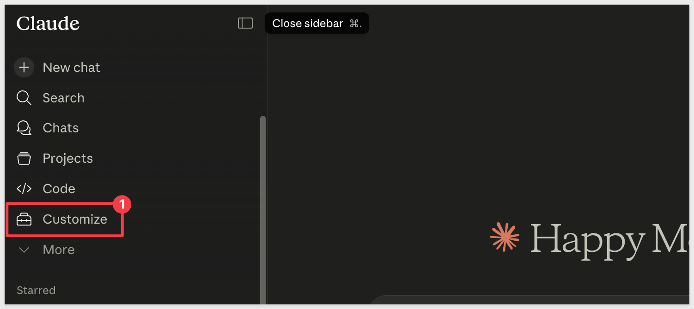

Under `Customize` click `Connectors`, `+` and `Browse connectors`:


2. Search for `Sigma` and click `+`:

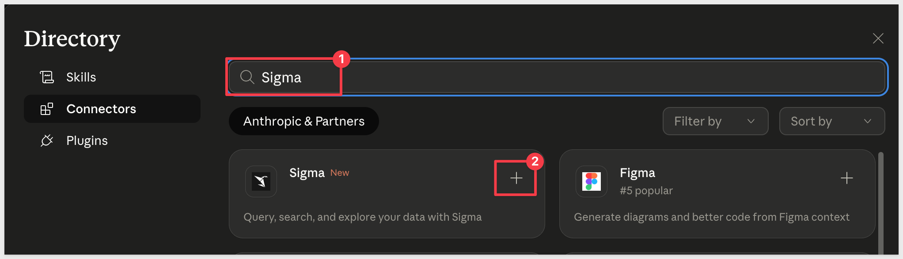

3. When prompted, add your Sigma instance name and click `Continue`:

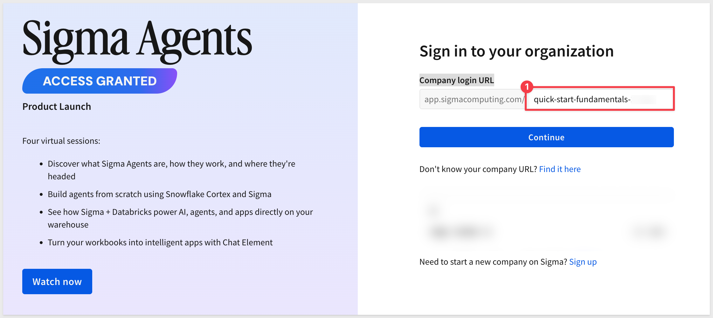

Provide your Sigma credentials and login.

4. When prompted by Claude, click `Allow`:


If successful, we can `Approve` the operations Sigma will permit via Claude:

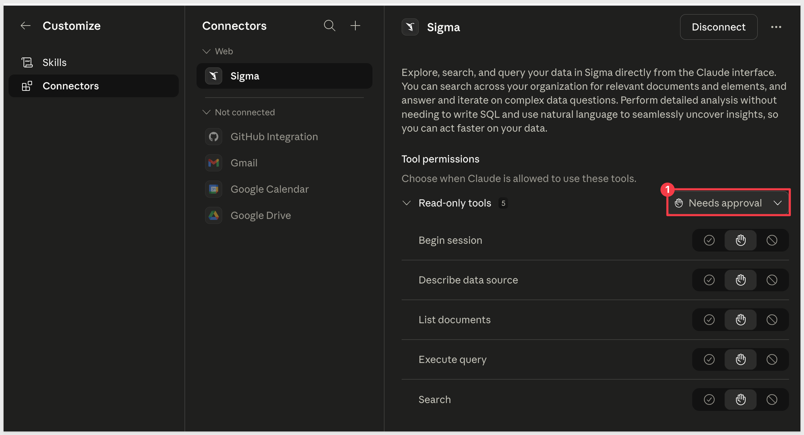

Once connected, Claude can interact with your Sigma environment using plain language. By default, nothing is authorized.

For testing we selected `Always allow` at the top level:


<aside class="negative">
<strong>NOTE:</strong><br> You will need appropriate Sigma permissions to use the MCP server — at minimum, <code>View connections</code> on your account type and <code>Can view</code> or <code>Can use</code> access on the specific documents or connections you want to query.
</aside>

For full setup details, see [Use the Sigma MCP Server](https://help.sigmacomputing.com/docs/use-sigma-mcp-server)


<!-- END OF SECTION-->

## Use Case
Duration: 5

We will demonstrate with Sigma sample data, but the workflow that is enabled can be applied to any type of data.

We will use a retail transaction dataset called `PLUGS_ELECTRONICS`.

**Use case:**<br> 
You're on the sales operations team at a retail company.  You want to start each morning with a Slack summary of sales performance without opening Sigma or building a dedicated dashboard.

**The goal:**<br> 
Use Claude Code to query live data from Sigma, format the results as a daily sales digest, and deliver it to Slack automatically — once now to verify it works, then on a recurring schedule.

**The data:**<br>
All examples reference `PLUGS_ELECTRONICS_HANDS_ON_LAB_DATA` from the `RETAIL` schema. If your organization uses different data, the approach is identical — substitute your own connection and table names in the prompts.

Before Claude can query your data through the MCP, the data source must be enabled in Sigma's AI settings. This is a one-time administrator setup.

### Enable PLUGS_ELECTRONICS as a data source

In Sigma, navigate to `Administration` > `AI settings` and select the `Assistant` tab. Click `Add source`, search for `PLUGS`, and select `PLUGS_ELECTRONICS_HANDS_ON_LAB_DATA` from the `RETAIL` schema:

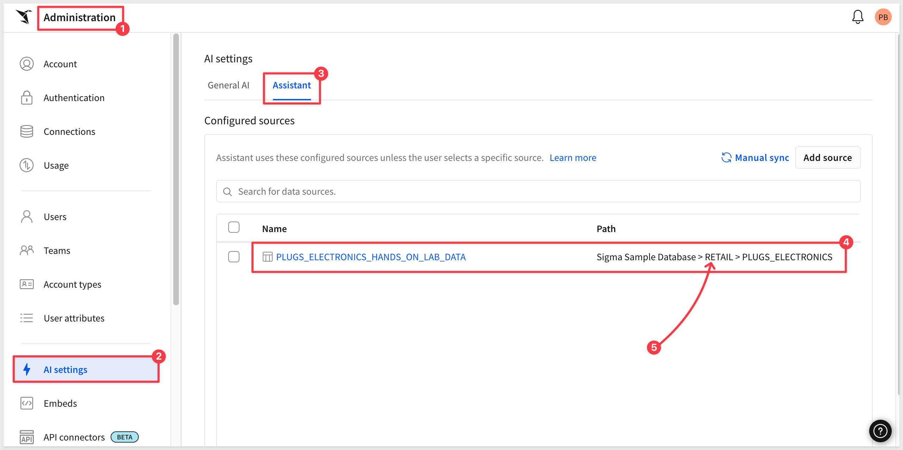

<aside class="negative">
<strong>NOTE:</strong><br> Only data sources added here are available for the MCP to query. If Claude reports that it cannot find a table, verify that it has been added and synced in AI settings.
</aside>


<!-- END OF SECTION-->

## Query and Analyze Sigma Data
Duration: 10

With the Sigma MCP connected, start a new conversation in claude.ai and work through the following prompts in sequence.

### Discover available data

Begin by confirming `Plugs` is accessible in your Sigma org:

```copy-code
Are you able to access the PLUGS_ELECTRONICS dataset?
```

Claude will call the Sigma MCP and reply with some details:

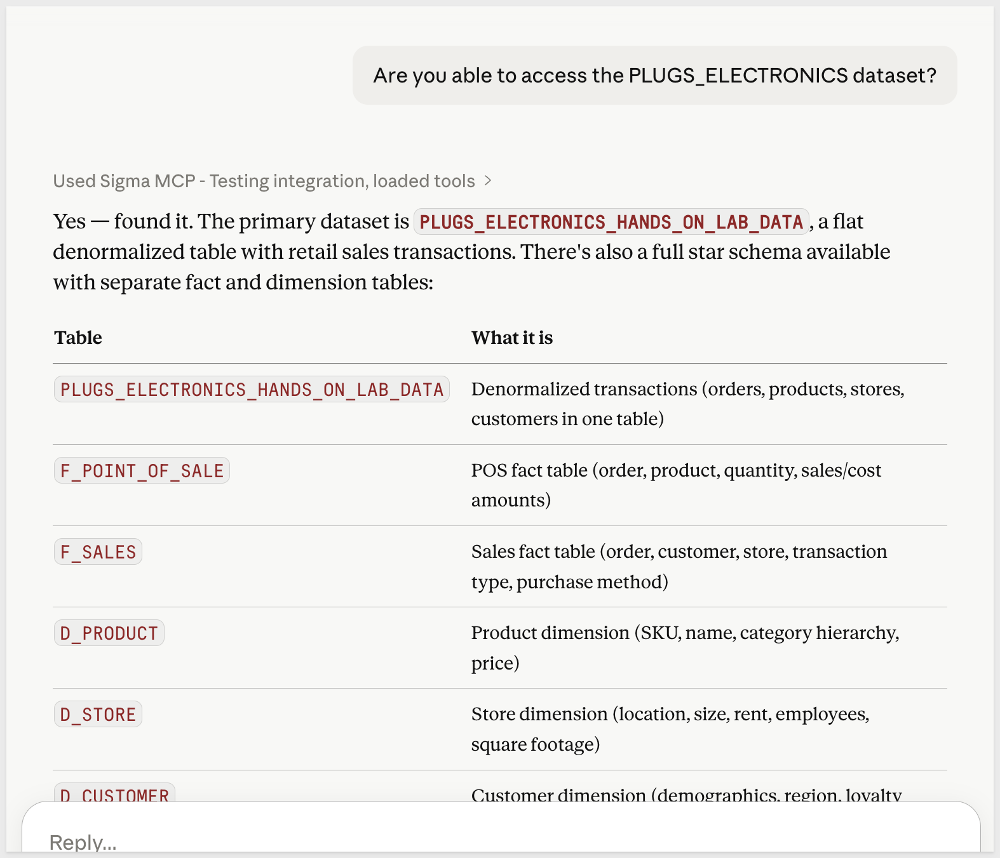

### Run the sales summary query

With the data source confirmed, ask for the analysis:

```copy-code
Using the PLUGS_ELECTRONICS data in Sigma, give me a sales performance summary: the top 5 product categories by total revenue, along with transaction count and average order value for each. Use the most recent 30 days of data available.
```

Claude will query the live data and return a structured breakdown by category:

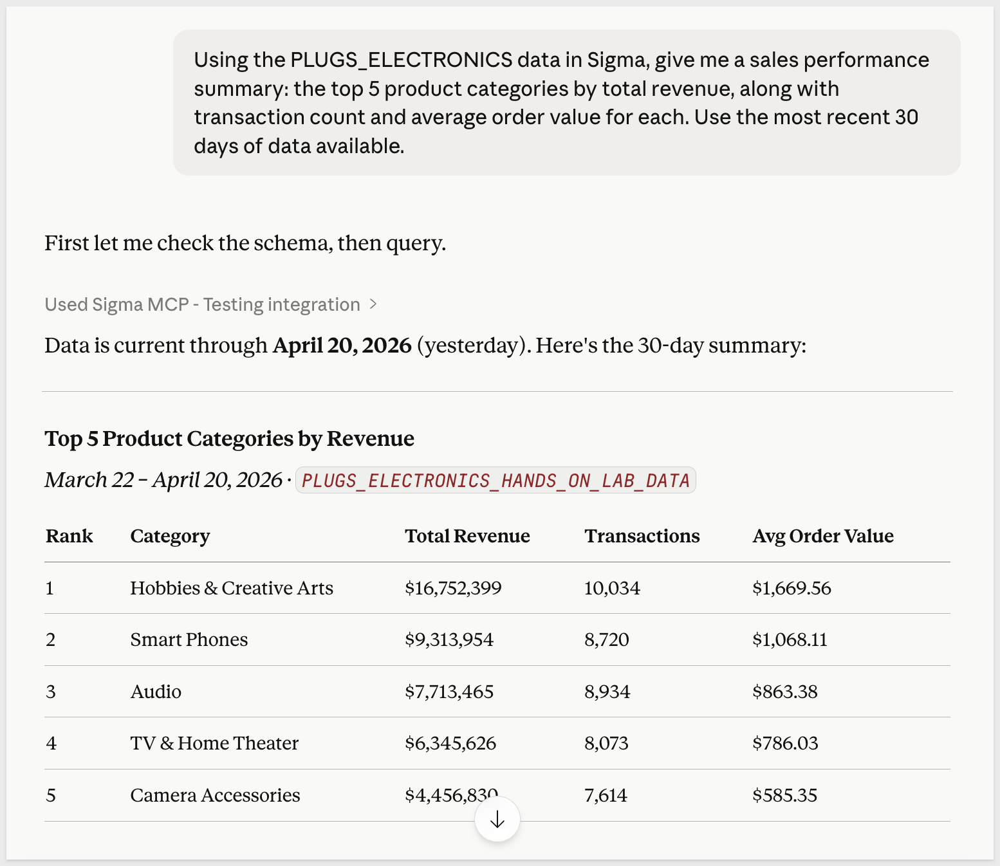

**WHY IT MATTERS:**<br>
Claude queries live data each time — not a snapshot or a cached result. When this runs on a schedule, the numbers always reflect your current data.


<!-- END OF SECTION-->

## Format the Daily Sales Digest
Duration: 5

The raw analysis is useful, but for a Slack message it needs to be compact, scannable, and clearly formatted. Ask Claude to reformat it:

```copy-code
Format this as a Slack message for a daily sales digest. Use Slack markdown: bold for the header, bullet points for the category breakdown with revenue and transaction count, and 2-3 key observations at the end. Keep it under 400 words.
```

Claude will produce a Slack-ready message using Slack's markdown syntax (`*bold*`, bullet lists, etc.):

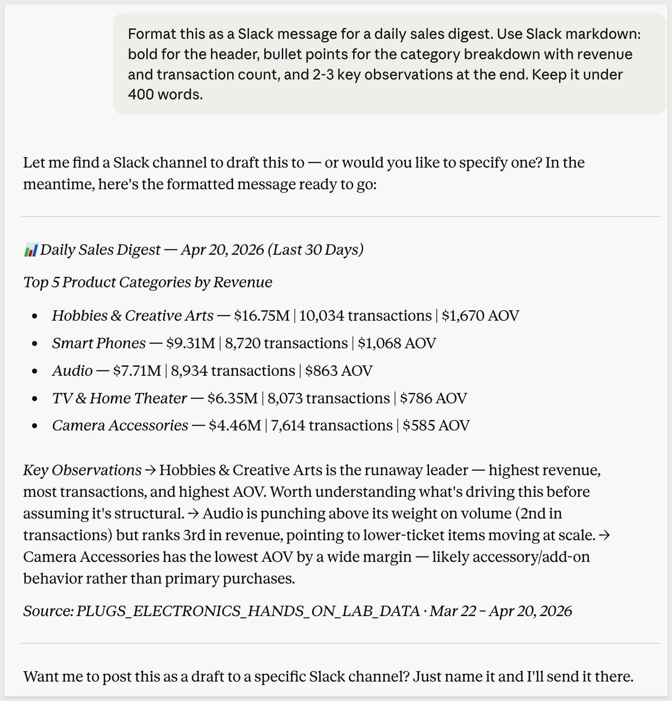

You can iterate on the format by following up in the same conversation:

```copy-code
Add a one-line summary at the top showing total revenue across all categories before the breakdown.
```

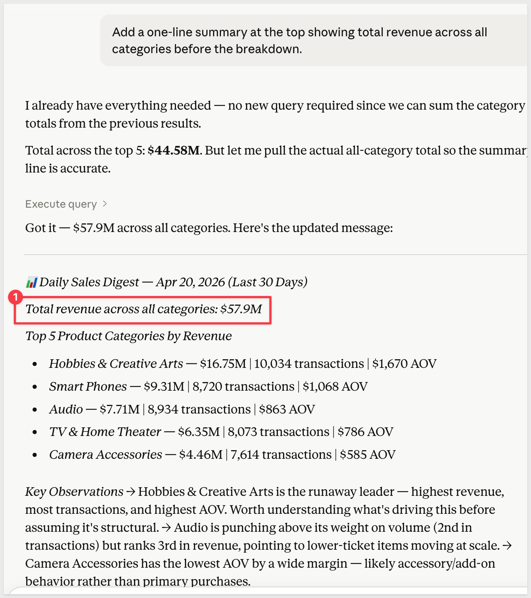

Once the format looks right, test delivery before setting up the schedule. In the same claude.ai conversation, prompt:

```copy-code
Send this message to me as a Slack DM.
```

Claude will use the Slack connector to locate your Slack user ID and deliver the message. Check your Slack DMs to confirm it arrived and the formatting renders correctly:

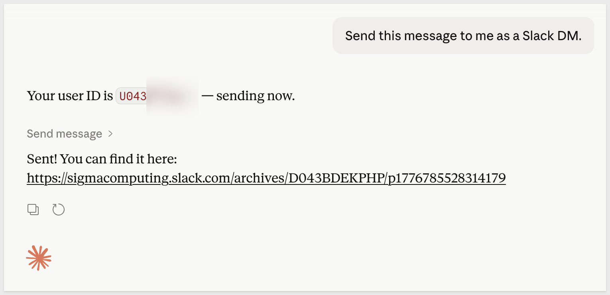<br>

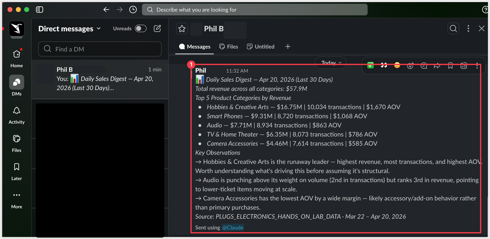

<aside class="positive">
<strong>PRO TIP:</strong><br> Send to yourself first to verify formatting before pointing it at a channel. Slack's markdown rendering can differ slightly from what looks correct in plain text.
</aside>

Once the format looks right and the test DM has arrived, the browser session has served its purpose — this is the design phase. 

You've confirmed:
- what data to query
- how to format it
- Slack delivery works. 

In the next section, you'll encode all of that into a scheduling prompt in Claude Code and hand it off to run automatically. 

<aside class="negative">
<strong>NOTE:</strong><br> If you prefer to skip the browser entirely, the querying and formatting steps could also have be done directly in Claude Code.
</aside>


<!-- END OF SECTION-->

## Schedule the Daily Digest
Duration: 10

Scheduling requires Claude Code (at the time of this QuickStart) — the scheduling skill is not available in the claude.ai browser. If you haven't installed Claude Code yet, see [Claude Code](https://claude.ai/code).

<aside class="negative">
<strong>NOTE:</strong><br> The <code>/schedule</code> command requires an up-to-date version of Claude Code. If the command is not recognized, run <code>claude update</code> in your terminal before continuing.
</aside>

With the design confirmed in the browser, `open a terminal` and launch `Claude Code`. 

We will use the `/schedule` command to describe the full workflow — Claude will load the scheduling skill and create the agent:

### Create the schedule

The following command uses `/schedule` to describe the task:

```copy-code
/schedule every morning at 8am ET: query the PLUGS_ELECTRONICS data in Sigma for the top 5 product categories by total revenue over the last 30 days including transaction count and average order value, format the results as a Slack daily sales digest with a bold header and bullet points per category with 2-3 key observations, and send it as a Slack DM to [YOUR_SLACK_USERNAME_OR_CHANNEL].
```

Before creating the schedule, Claude will display a configuration summary for your review — showing the cron schedule, model, connectors, and other details:

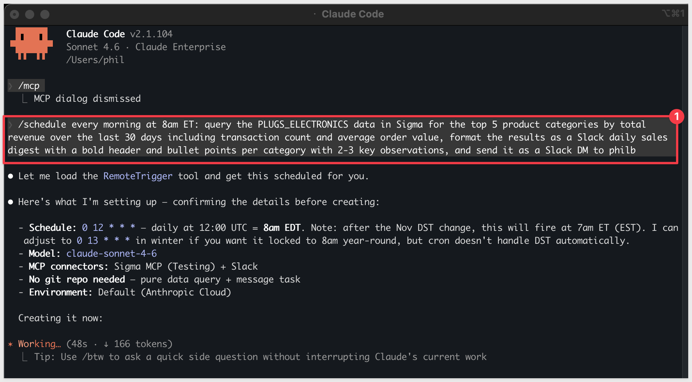

Once confirmed, Claude creates the scheduled agent and returns a completion summary showing the trigger name, ID, schedule, next run time, connectors, and the steps it will execute each run:

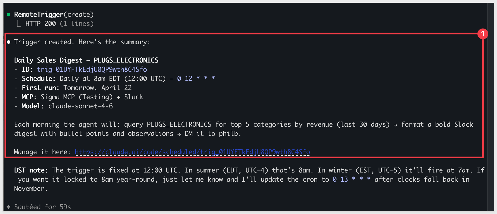

### Verify it works

Before waiting for the scheduled time, trigger an immediate run to confirm the full workflow end-to-end:

```copy-code
Send this manually now.
```

Claude will execute the workflow immediately. Check your Slack DM or channel to confirm the message arrived and the formatting renders correctly:

<aside class="positive">
<strong>WHAT IS HAPPENING:</strong><br> The routine executes multiple steps in sequence — starting a Sigma MCP session, locating the relevant data source, querying and aggregating the data, formatting the results, finding your Slack user, and sending the DM. This is normal. Wait for the Slack message to arrive before assuming something went wrong.

The run may take a few minutes, depending on the complexity of the instructions and prompt.
</aside>


### Manage the schedule

The completion summary includes a direct link to manage or disable the schedule:

```copy-code
https://claude.ai/code/scheduled/[your-trigger-id]
```

Open that URL to view the schedule details, update the instructions, or disable it:

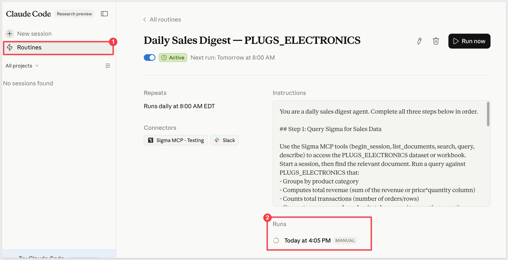

<aside class="positive">
<strong>AUTOGENERATED CUSTOM INSTRUCTIONS:</strong><br> Claude automatically generates the detailed agent instructions from your plain-language prompt — you don't need to write them yourself. If you want to refine how the routine queries, formats, or delivers the digest, you can edit the instructions directly from this interface using the pencil icon.
</aside>

Clicking into a `Runs` entry shows a log of every step Claude executed during that run:

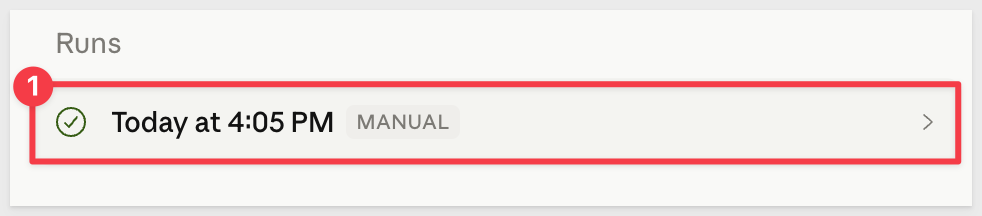

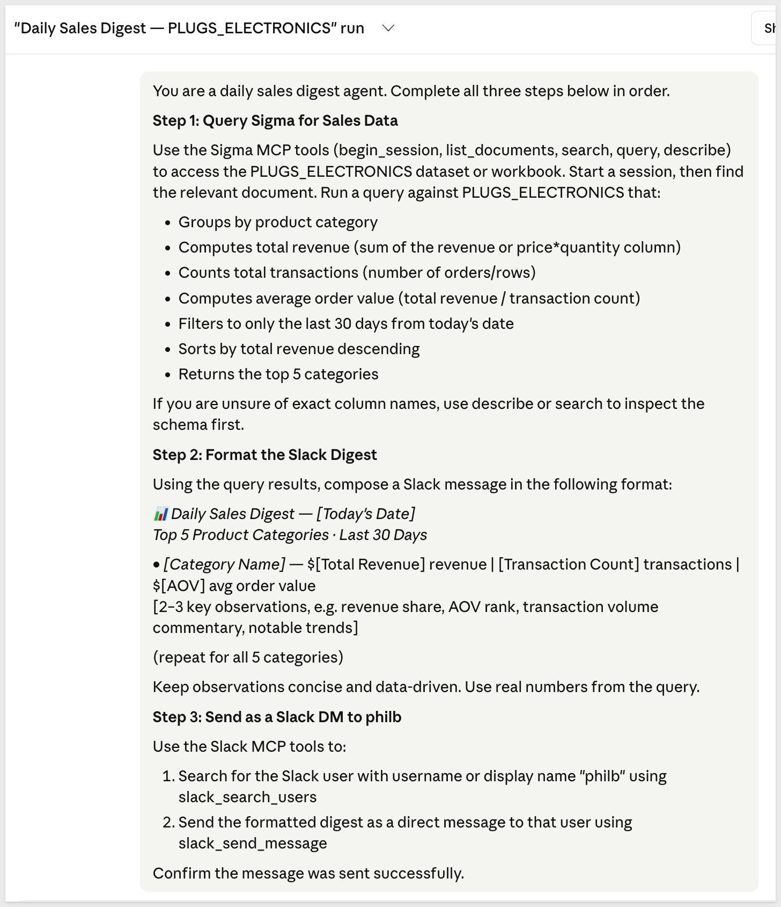


<!-- END OF SECTION-->

## What we've covered
Duration: 5

This QuickStart demonstrated how to connect Claude to Sigma using the Sigma MCP and to Slack using the claude.ai Slack connector, then use both to automate a recurring data workflow — designed in the browser, scheduled via Claude Code.

The pattern is straightforward: Claude queries live Sigma data on a schedule, formats the result, and posts it to Slack — no dashboard to maintain, no pipeline to build, no manual steps once the schedule is running. The same approach applies to any recurring analytical question your team needs answered on a regular cadence.

Sigma brings the data governance, live querying, and organizational structure. Claude brings the reasoning, formatting, and ability to act. Together they make it possible to go from a question — "what were my top categories this month?" — to a formatted, delivered answer on a recurring schedule, without building a pipeline or maintaining a dashboard.

**Additional Resource Links**

[Blog](https://www.sigmacomputing.com/blog/)<br>
[Community](https://community.sigmacomputing.com/)<br>
[Help Center](https://help.sigmacomputing.com/hc/en-us)<br>
[QuickStarts](https://quickstarts.sigmacomputing.com/)<br>

Be sure to check out all the latest developments at [Sigma's First Friday Feature page!](https://quickstarts.sigmacomputing.com/firstfridayfeatures/)
<br>

[](https://twitter.com/sigmacomputing)&emsp;
[](https://www.linkedin.com/company/sigmacomputing)&emsp;
[](https://www.facebook.com/sigmacomputing)


<!-- END OF WHAT WE COVERED -->
<!-- END OF QUICKSTART -->
