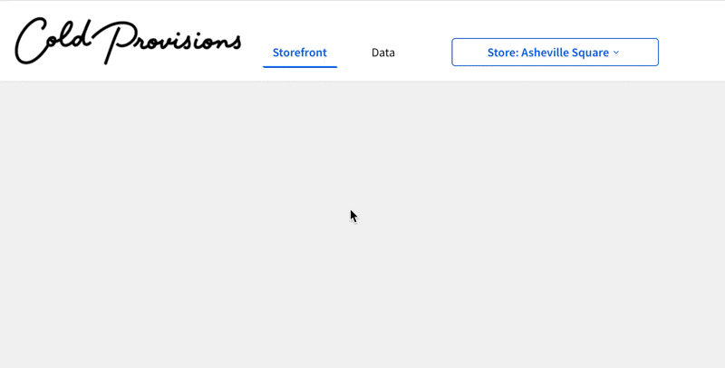

author: pballai
id: aiapps_storefront_repeaters
summary: aiapps_storefront_repeaters
categories: aiapps
environments: web
status: Published
feedback link: https://github.com/sigmacomputing/sigmaquickstarts/issues
tags: Default
lastUpdated: 2026-03-19

# Build an Interactive Storefront with Repeaters and Actions

## Overview
Duration: 5

Meet Alex, a store manager at a busy retail location that sells ice cream. She's on the floor serving customers most of the day, checking inventory on her phone between interactions. **Her rule: if it can't be done on her phone in a few minutes, it won't get done.**

This QuickStart shows you how to build the storefront interface Alex uses to manage her store — complete with live inventory data, product filtering, and an operational notification center.

**Why this interface works for Alex:**
- No training required — looks like an app she already knows
- Fast — every interaction loads in seconds
- Role-aware — storefront and manager views in a single workbook

**Build time: about 30 minutes.**

**What you'll build:**

A data-driven storefront interface that allows users to:
- View live inventory and sales data filtered by store and date
- Browse products with images and live stock levels
- Filter products by category or name
- Monitor operational alerts with urgency filtering
- Switch between storefront and manager dashboard views

**Along the way you'll learn how to:**
- Build a lightweight data model with joined dimension tables and a calculated column
- Use the Repeated container element to generate card layouts from data rows
- Configure popover controls and date range controls in a shared page header
- Wire control targets across multiple tables
- Build a notification center with a boolean filter
- Use a segmented control and tab container with actions for role-based navigation


<aside class="positive">
<strong>IMPORTANT:</strong><br> Some screens in Sigma may appear slightly different from those shown in QuickStarts. This is because Sigma continuously adds and enhances functionality. Rest assured, Sigma’s intuitive interface ensures that any differences will not prevent you from successfully completing any QuickStart.
</aside>

For more information on Sigma's product release strategy, see [Sigma product releases](https://help.sigmacomputing.com/docs/sigma-product-releases)

If something doesn’t work as expected, here's how to [contact Sigma support](https://help.sigmacomputing.com/docs/sigma-support)

### Target Audience
This QuickStart is ideal for:
- Sigma users building operational interfaces for frontline staff (store managers, field technicians, warehouse operators)
- Developers and analysts who need to create repeating, data-driven UI elements efficiently
- Teams building operational applications where speed and simplicity are critical

### Prerequisites

<ul>
  <li>Access to Sigma with Build or higher permissions</li>
  <li>Intermediate familiarity with Sigma workbooks, elements, and controls</li>
  <li>Understanding of basic data relationships (optional but helpful)</li>
</ul>

<aside class="positive">
<strong>IMPORTANT:</strong><br> Sigma recommends using non-production resources when completing QuickStarts.
</aside>

<button>[Sigma Free Trial](https://www.sigmacomputing.com/free-trial/)</button>

<aside class="negative">
<strong>IMPORTANT:</strong><br> Some features may carry a "Beta" tag. Beta features are subject to quick, iterative changes. As a result, the latest product version may differ from the contents of this document.
</aside>
 

<!-- END OF OVERVIEW -->

## Data Setup and Relationships
Duration: 5

Before building the storefront interface, we need a lightweight data model. Rather than wiring up joins directly inside the workbook, we'll create a Sigma data model with two tables and configure relationships to `PRODUCTS` and `STORES`. This keeps the workbook clean and makes related columns available on demand wherever we need them.

### Create a New Data Model

From your Sigma home page:

1. Click `Create new` and select `Data model`.
2. Using the `Element bar` add a new `Table` from the `Data` group.
3. Search for `INVENTORY_LEDGER_DAILY`.
4. Click to select the table from `EXAMPLES > COLD_PROVISIONS`:


### About the Daily Ledger Table

`INVENTORY_LEDGER_DAILY` is the fact table at the center of this data model. Each row represents one product at one store on one date, recording daily inventory activity: units sold, delivered, wasted, adjusted, and closing stock. We'll manually join it to `PRODUCTS` and `STORES` as dimension tables, making their columns available throughout the workbook:


### Join Products and Stores to the Ledger

With `INVENTORY_LEDGER_DAILY` on the canvas, add relationships to the two dimension tables.

**Join to PRODUCTS:**

1. Click on the `INVENTORY_LEDGER_DAILY` element to select it.
2. Click the `3-dot` menu to opens the tables menu.
3. Select `Element source` > `Join`


4. Search for `PRODUCT`, taking care to select the table from `EXAMPLES > COLD_PROVISIONS`:


5. Click `Select`, leaving all columns selected.

4. Set the join key: `Product Id` (INVENTORY_LEDGER_DAILY) = `Product Id` (PRODUCTS).
5. Leave the join type as `Left outer join`.
6. Click the `+` to add another table.


**Join to STORES:**

1. Search for `STORES`, taking care to select the table from `EXAMPLES > COLD_PROVISIONS`:
2. Select `STORES` from `COLD_PROVISIONS`.


3. Set the join key: `Store Id` (INVENTORY_LEDGER_DAILY) = `Store Id` (STORES).
4. Leave the join type as `Left out join` and click `Preview output`:


5. Sigma shows the [Lineage](https://help.sigmacomputing.com/docs/workbook-data-lineage) for the data model visually:


6. Click `Done`.

With both joins in place, columns like `Store Name` and `Store Image Url` (from `STORES`) and `Product Name`, `Product Line`, and `Product Image Url` (from `PRODUCTS`) will be accessible throughout the workbook.

<aside class="positive">
<strong>TIP:</strong><br> While we did select every column now, that is not required. Joined columns are available on demand when you build individual workbook elements—add only what each element needs.

For more information, see [Get started with data modeling](https://help.sigmacomputing.com/docs/get-started-with-data-modeling)

There is also a QuickStart, [Fundamentals 10: Data Modeling](https://quickstarts.sigmacomputing.com/guide/fundamentals_10_data_modeling/index.html?index=..%2F..index#7)

Developers may what to review [Data Models as Code](https://quickstarts.sigmacomputing.com/guide/developers_data_models_as_code/index.html?index=..%2F..index#0)
</aside>

### Add the Notifications Table

`NOTIFICATIONS` feeds the notification center panel on the right side of the storefront. It's independent of the ledger and gets added as a separate element.

1. Using the `Element bar` add another `Table` to the workbook page.
2. Search for `NOTIFICATIONS`, taking care to select the table from `EXAMPLES > COLD_PROVISIONS`.
3. Click `Select`.

### Add the Is Urgent Calculated Column

The `NOTIFICATIONS` table has a `Priority` column with text values like `critical`, `high`, `medium`, and `low`. Controls like a switch or toggle require a boolean target, so we'll add a calculated column that converts `critical` priority to `true`.

1. With the `NOTIFICATIONS` table selected in the data model, click the `+` button at the top right of the column list to add a new column.
2. Name the column `Is Urgent`.
3. Enter the following formula:
```copy-code
[Priority] = "critical"
```

Sigma evaluates this as a boolean — rows where `Priority` equals `critical` return `true`; all others return `false`.


### Rename the Data Model

1. Rename the data model `COLD_PROVISIONS_DATA_MODEL`.
2. Click `Publish`.


3. Return to the Sigma home page. The data model is now ready to use as the data source for the storefront workbook.

In the next section, we'll create a new workbook and connect it to this data model.


<!-- END OF SECTION-->

## Building the Header and Navigation
Duration: 3

With the data model published, we can now create the workbook. The header establishes the visual identity of the storefront—logo on the left, navigation labels across the top, and controls on the right. We'll build the logo and navigation in this section, then add the controls in the next.

### Create a New Workbook

1. From the Sigma home page, click `Create new` and select `Workbook`.
2. Click `Save as` and name the workbook `Cold Provisions QuickStart`.
3. Rename the default page to `Data` by double-clicking the page tab.

This page will hold the source table elements from the data model, making them available to any page in the workbook.

4. From the `Element bar`, add a `Table` element and search for `COLD_PROVISIONS_DATA_MODEL`. Select `INVENTORY_LEDGER_DAILY + 2`.
5. Add a second `Table` element and select `NOTIFICATIONS` from the same data model:


<aside class="positive">
<strong>WHY USE A DATA MODEL?</strong><br> It may feel like we just configured these tables in the data model and are now adding them again here—but there's an important distinction. The data model is where the joins to <code>PRODUCTS</code> and <code>STORES</code> live. By sourcing these tables through the data model, every page in this workbook automatically inherits those relationships.

If we had added the raw warehouse tables directly, we would need to re-configure the joins everywhere they're needed. The data model does that work once, and the workbook just uses the result. 

If the data model is updated, changes flow automatically to workbooks.

It also ensures centralized governance—any changes to the source data structure are managed in one place, and all workbooks built on the model stay consistent automatically.
</aside>

6. Add a new page by clicking the `+` next to the page tabs and rename it `Storefront`.

### Enable Page Headers

Sigma supports a common header, which is useful when we want to reuse it across multiple pages.

1. Click the `Workbook settings` button:


2. Check the box to enable `Page header`:


<aside class="negative">
<strong>NOTE:</strong><br> We can use the same page header on all pages or have different headers on each page. 

For more information, see [Add custom page headers to a workbook](https://help.sigmacomputing.com/docs/add-custom-page-headers-to-a-workbook)
</aside>

### Add the Logo

The Cold Provisions logo is an image element placed in the top-left of the header.

1. From the `Element bar`, drag an `Image` element from the `UI` group onto the canvas at the top left.
2. In the right panel, set the image source to `URL`.
3. Use the following URL:
```copy-code
https://sigma-quickstarts-main.s3.us-west-1.amazonaws.com/shared_images/cold-provisions-logo.png
```
3. Adjust the image width so the logo sits comfortably in the header without dominating the layout:


The logo background is white but the headers is not quite that so we can adjust it to match:


### Add Navigation Text Elements

The navigation labels (Storefront, Finance, R&D) are text elements styled to look like a nav bar. For this QuickStart we're only building the Storefront page, so these are cosmetic—the tab switching behavior comes in a later section.

1. From the `Element bar`, drag a `Navigation` element from the `Layout` group onto the canvas to the right of the logo.

`Storefront` and `Data` pages are shown automatically. We could `Hide` the `Data` page tab, which would remove it from the control but let's just leave it since we won't have other pages in this demonstration:


<aside class="positive">
<strong>NOTE:</strong><br> In a full multi-page workbook, each nav label could also have an action to navigate to its corresponding page and other automations. For now, the labels serve as visual anchors that orient the user.
</aside>

For more information, see [Use the navigation element to guide user exploration](https://help.sigmacomputing.com/docs/use-the-navigation-element-to-guide-user-exploration)


<!-- END OF SECTION-->

## Setting Up Controls for Filtering
Duration: 5

The storefront needs to show the right data for the right store on the right day. Two controls in the page header handle this: a store selector and a date picker. Both will be placed in the shared page header so they're available across all pages in the workbook.

### Store Selection Control

The store selector uses a popover—a floating panel anchored to a trigger button in the header. This keeps the header clean while still giving Alex a full list of stores to choose from on demand.

**Add the popover to the header:**

1. On the `Storefront` page, add a `Popover` element from the `Element bar` > `Layout` group.

Sigma automatically creates a new page called `Popover 1` to hold the popover's contents.

2. Rename the `Popover 1` page to `Store Selector`.

**Add and configure the list control on the popover page:**

5. Navigate to the `Store Selector` page.
6. From the `Element bar`, add a `List` control from the `Controls` group.
7. In the right panel, configure the following:
   - Value source: `INVENTORY_LEDGER_DAILY + 2` (from the `Data` page)
   - Source column: `Store Name`
   - Enable `Set display column` and set it to `Store Name`
   - Allow multiple selection: `unchecked`
   - Show expanded list: `checked`
   - Show clear button: `checked`
   - Show search box: `checked`
   - Control ID: `Store-Id`
8. Sort the list `Ascending by alphanumeric`


Now that we have the list we need a way to enforce a selection. Normally, a data model would have a `Stores` table but since we only have that data joined to the `INVENTORY_LEDGER_DAILY` table, we can use the flexibility of Sigma to get what we need, without the need for custom SQL (although we could do that too).

9. On the `Data` page, create a `Child table` from `INVENTORY_LEDGER_DAILY + 2`:


10. Delete all the columns except `Store Name` and `Store ID` from the child table. 

11. Groups the child table by both remaining columns and rename the table `Store List with IDs`

This gives us the one store and id for each location:


Now we need to set the `Target` for the list control on the `Store Selector` page:


Lastly, we need to set the store select `Navigation` control to use a formula so that when the user selects a store from the list, the table is automatically filtered. 

With the navigation control selected, set the `Text` value in the `Element panel` to `Store: ` and then press the `=` key to bring up the formula editor. 

Use this formula:
```copy-code
[Store List with IDs/Store Name]
```


When a different store is selected, the control automtically filters the table on the `Store Selector` page and the navigation element shows the selected store name:



For more information, see [Use popovers to simplify a workbook interface](https://help.sigmacomputing.com/docs/use-popovers-to-simplify-a-workbook-interface)

### Date Control

The date control filters the storefront to a single day's inventory data. Defaulting to today means Alex always opens to live data without any manual selection.

1. From the `Element bar`, add a `Date range` control from the `Controls` group.
2. Set the default to `Current` > `Day`.
3. Set the `Control ID` to `Local-Date`.


### Set Control Targets

Controls don't filter anything until they have targets — the specific table columns they act on. Let's wire both controls to `INVENTORY_LEDGER_DAILY + 2` now so filtering works as soon as we build the repeater in the next section.

**Store control target:**

1. Select the `Store Name (Stores)` list control on the `Store Selector` page.
2. Click the `Targets` tab in the right panel.
3. Click `+` to add a filter target.
4. Select `INVENTORY_LEDGER_DAILY + 2` and set the column to `Store Id`.


**Date control target:**

5. Select the `Local Date` date range control in the header.
6. Click the `Targets` tab in the right panel.
7. Click `+` to add a filter target.
8. Select `INVENTORY_LEDGER_DAILY + 2` and set the column to `Local Date`.


<aside class="positive">
<strong>NOTE:</strong><br> We'll add <code>NOTIFICATIONS</code> as a target for both controls when we build the notification center. For now, targeting <code>INVENTORY_LEDGER_DAILY + 2</code> is enough to make the product repeater respond correctly.
</aside>

9. Select the `Albuquerque Square` store and click `Publish`. 

<aside class="positive">
<strong>TIP:</strong><br> Setting sensible defaults (like today's date and a specific store) means the storefront shows meaningful data the moment it loads—no configuration required from the user.
</aside>


<!-- END OF SECTION-->

## Building the Product Storefront with Repeaters
Duration: 10

This is the core of the storefront. The `Repeated container` element generates one product card per row in the filtered dataset—define the layout once and Sigma does the rest.

With the store and date controls already filtering `INVENTORY_LEDGER_DAILY + 2`, the repeated container will immediately show the right products for the selected store and day.

<aside class="positive">
<strong>HOW REPEATED CONTAINERS WORK:</strong><br> The Repeated container element generates UI components from data rows. Define the card layout once with bound columns, and Sigma automatically creates one card per row in your filtered dataset. Build 50 product cards in the time it takes to build one.
</aside>

For more information, see [Use repeated containers to generate layouts from data](https://help.sigmacomputing.com/docs/use-repeated-containers-to-generate-layouts-from-data)

### Create the Repeated Container

1. On the `Storefront` page, from the `Element bar` add a `Repeated container` element from the `Layout` group.
2. When prompted for a data source, select `INVENTORY_LEDGER_DAILY + 2` from the `Data` page.

Sigma renders a default card for each row in the filtered dataset. The canvas shows a single card template—everything built inside this template will repeat for every product.

Expand the container to show two columns:


### Structure the Card Layout

Each product card uses a container to control spacing and separate the image area from the text details below it.

1. Inside the repeated container template, add a `Container` element from the `Layout` group:


The container is automatically repeated to each area of the repeater.

2. In the right panel under `Format`, set the padding and gap values to give the card content comfortable spacing:


3. Set the `Background color` to `#FFFFFF`create the card surface.

### Add Product Images

Product images are rendered as the **background image** of a dedicated container inside the card — not as a separate image element. This approach gives full control over sizing and cropping.

1. Inside the card container, add another `Container` element from the `Layout` group. This will hold the product image.
2. Rename the container to `Main Image`.
3. Configure the image element as:


### Add Product Details

Each card displays the product line and product name as text elements, styled for scannability.

1. Below the image, add a `Text` element for the product line.
2. Bind it to `Product Line` (from the `PRODUCTS` relationship).


3. Format the text to use a lighter color — this acts as a category label above the product name.


4. Add a second `Text` element for the product name.
5. This time use a `Formula`:
```copy-code
Upper([INVENTORY_LEDGER_DAILY + 2 repeated container/Product Name])
```


### Create the Value List

Each card shows two inventory metrics — units sold and units available — using a `Value list` element. This element is purpose-built for displaying labeled key-value pairs in a clean row format.

1. Inside the card container, add a `Value list` element from the `UI` group.
2. In the right panel, click `+` to add the first field and configure it:
   - Value source type: `Source column`
   - Value: `Sold Units`
   - Label: `Sold:`


3. Click `+` again to add the second field and configure it:
   - Value source type: `Source column`
   - Value: `Closing Units`
   - Label: `Available`

4. Adjust the properties of the field list element to suit:


With all card elements in place, the repeated container renders a full grid of product cards filtered to the selected store and date.


<!-- END OF SECTION-->

## Adding Product Filtering
Duration: 3

With the product cards rendering, we'll add two controls that let Alex narrow down what she's looking at: a category dropdown to filter by item type, and a text search to find specific products by name.

### Item Type Filter

The item type filter is a list control that lets Alex switch between product categories — Ice Cream Pints, Scoops, Frozen Yogurt, and so on. It filters the repeated container directly.

1. On the `Storefront` page, add a `List values` control from the `Controls` group in the `Element bar`.
2. In the right panel, configure the following:
   - Value source: `INVENTORY_LEDGER_DAILY + 2` (from the `Data` page)
   - Source column: `Product Line` 
3. Click the `Targets` tab and add `INVENTORY_LEDGER_DAILY + 2` as a filter target, mapping to the same `Product Line` column.


### Product Search Control

The product search lets Alex type a few letters to quickly find a specific product. It uses regex matching so partial strings work — typing "mango" surfaces all mango products.

1. Add a `Text input` control from the `Controls` group.
2. In the right panel, set the Control ID to `Product-Search`.


4. Click the `Targets` tab and add `INVENTORY_LEDGER_DAILY + 2` as a filter target.
5. Set the target column to `Product Name`.
6. Set the match type to `Contains`.

<aside class="positive">
<strong>TIP:</strong><br> Test your filters as you build them. Type in the search box to confirm the repeated container updates correctly.

It might also be a good idea to add a button that resets the filters to make that easy for the user.
</aside>


<!-- END OF SECTION-->

## Creating the Notification Center
Duration: 5

The notification center sits in a panel to the right of the product grid and gives Alex a live feed of operational alerts — low stock warnings, delivery arrivals, waste events, and more. It's built with a `Repeated container` sourced from the `NOTIFICATIONS` table.

### Add the Notification Panel Container

1. On the `Storefront` page, add a `Container` element from the `Layout` group and position it to the right of the product repeated container.
2. Inside it, add a `Text` element and type `Notifications` — this is the panel header.
3. Add a `Switch` control from the `Controls` group inside the same container, to the right of the header text.
4. In the right panel, configure the following:
   - Label: `Urgent Only`
   - Control ID: `Urgent-Only`

### Build Notification Cards with a Repeated Container

3. Inside the notification container, add a `Repeated container` element from the `Layout` group.
4. When prompted for a data source, select `NOTIFICATIONS` from the `Data` page.
5. In the `Format` tab, add a border to the card template to visually separate each notification.


### Add Notification Content

Each notification card displays a category icon, title, category label, and date. Build these inside the repeated container template:

1. Add an `Image` element for the notification icon. Set a static URL as:
```copy-code
https://cdn-icons-png.flaticon.com/128/1827/1827370.png
```


2. Add a `Text` element and bind it to the `Title` column from `NOTIFICATIONS`. 
3. Add a `Text` element and bind it to the `Body` column from `NOTIFICATIONS`. 
4. Add a `Text` element and bind it to `Notification Date` from `NOTIFICATIONS` using a formula:
```copy-code
DateFormat([NOTIFICATIONS repeated container/Notification Date],"%m-%d-%Y")
```
5. Adjust the text formatting to suit:


### Add a Details Button

5. Add a `Button` element from the `UI` group to the right side of the card.
6. Set the button label to `Details`.
7. We could use this button to navigate to a notification detail view or open a modal or even use Sigma's [Report Builder]() to present a order form so that Alex could place an restocking order directly.

For more information, see [Reports overview](https://help.sigmacomputing.com/docs/reports-overview)

There is also this QuickStart: [Fundamentals 11: Pixel Perfect Reporting](https://quickstarts.sigmacomputing.com/guide/fundamentals_11_pixel_perfect_reporting/index.html?index=..%2F..index#0)


### Wire Controls to Notifications

Back in Section 4 we promised to add `NOTIFICATIONS` as a target for the store and date controls. Now that the notification repeated container exists, let's complete that:

1. Select the `Store Name (Stores)` list control on the `Store Selector` page.
2. Click `Targets` and add `NOTIFICATIONS`, mapping to `Store Id`.


3. Select the `Local Date` date range control in the header.
4. Click `Targets` and add `NOTIFICATIONS`, mapping to `Notification Date`.


**Urgent Only switch target:**

5. Select the `Urgent Only` switch control in the notification panel.
6. Click `Targets` and add `NOTIFICATIONS`, mapping to `Is Urgent`.


When the switch is on, the notification list filters to only critical-priority items — rows where `Is Urgent` is `true`.


<!-- END OF SECTION-->

## Implementing Multi-View Navigation
Duration: 4

The storefront and manager views show different content to different users — but they share the same data source and controls. We'll use a `Tabbed container` to hold both views and a `Segmented` control to switch between them.

<aside class="positive">
<strong>THE PATTERN:</strong><br> Tab containers let you create multiple views in a single workbook page. 

Segmented controls with actions provide user-controlled navigation between tabs—same data source, different presentations for different roles.
</aside>

### Add a Tabbed Container

1. On the `Storefront` page, add a `Tabbed container` element from the `Layout` group.
2. Sigma creates a container with two default tabs. Rename them `Storefront` and `Manager`. The names are required so that we an navigate to them using a segmented control later.
3. Move the product repeated container and any related elements into the `Storefront` tab. Leave the notifications section outside of the tab container so that that it is always shown, regardless of the users role.

<aside class="positive">
<strong>NOTE:</strong><br> It is easier if you shrink all the elements (at the container level if possible) first and then drag/drop them into the desired tab. Then resize to suit
</aside>

4. In the `Format` tab of the tabbed container, disable `Show tab bar` — navigation will be handled by the segmented control instead.


### Add the Segmented Control

5. Add a `Segmented` control from the `Controls` group and place it above or alongside the notifications panel.
6. In the right panel, configure the following:
   - Value source: `Manual list`
   - Values: `Storefront`, `Manager`
   - Control ID: `View-Selector`


### Configure View Switching Actions

7. With the segmented control selected, click the `Actions` tab in the right panel.
8. In the first action sequence, open the `3-dot` menu and select `Add condition`.
Add an action for when the value equals `Storefront`:


9. Configure the action to:
   - Action type: `Select container tab`
   - Target: `Tabbed container 1 (Storefront)`
   - Tab: `Storefront`


9. The the `+` to the right of `ACTION SEQUENECES` and add a second action for when the value equals `Manager`, adding a condition and action as before but targeting `Manager` instead.
   


### Manager View Placeholder

The `Manager` tab is intentionally empty for this QuickStart. In a full implementation it would contain summary KPIs, trend charts, and regional performance metrics — all built using the same techniques covered here.

For example, the managers tab might look something like this, taking advantage of a more complete set of data:


<aside class="negative">
<strong>NOTE:</strong><br> The COLD_PROVISIONS database in the Sigma Sample connection actually contains a comprehensive set of tables should you want to explore and experiment more.
</aside>


<!-- END OF SECTION-->

## What We've Covered
Duration: 2

In about 30 minutes, you built a fully functional storefront interface — a data model with joined dimension tables and a calculated column, repeating product cards with live inventory data, popover-triggered store and date controls, a notification center with urgency filtering, and role-based multi-view navigation — all without writing a single line of application code.

What makes this pattern powerful isn't any one feature in isolation. It's the combination: the data model centralizes your joins and business logic once, the Repeated container turns a data table into a polished card grid in minutes, and controls with wired targets let a single filter cascade across multiple elements simultaneously. Together, they let you build what would otherwise require a dedicated front-end developer — in a fraction of the time.

This same pattern applies wherever you need a focused, role-based operational interface. Field technicians checking equipment status. Sales reps reviewing their pipeline. Warehouse managers monitoring stock levels. The layout changes, the data changes, but the approach stays the same: a data model for the relationships, repeated containers for the cards, and controls to drive the filtering.

Sigma is increasingly where operational work happens — not just where data gets reported. The techniques in this QuickStart are the building blocks for that.

**Additional Resource Links**

[Blog](https://www.sigmacomputing.com/blog/)<br>
[Community](https://community.sigmacomputing.com/)<br>
[Help Center](https://help.sigmacomputing.com/hc/en-us)<br>
[QuickStarts](https://quickstarts.sigmacomputing.com/)<br>

Be sure to check out all the latest developments at [Sigma's First Friday Feature page!](https://quickstarts.sigmacomputing.com/firstfridayfeatures/)
<br>

**Additional Resource Links**

[Blog](https://www.sigmacomputing.com/blog/)<br>
[Community](https://community.sigmacomputing.com/)<br>
[Help Center](https://help.sigmacomputing.com/hc/en-us)<br>
[QuickStarts](https://quickstarts.sigmacomputing.com/)<br>

Be sure to check out all the latest developments at [Sigma's First Friday Feature page!](https://quickstarts.sigmacomputing.com/firstfridayfeatures/)
<br>

[](https://twitter.com/sigmacomputing)&emsp;
[](https://www.linkedin.com/company/sigmacomputing)&emsp;
[](https://www.facebook.com/sigmacomputing)


<!-- END OF WHAT WE COVERED -->
<!-- END OF QUICKSTART -->
