author: pballai
id: aiapps_web_search_agent
summary: Connect a Sigma agent to Tavily's web search API as a custom API connector, then attach it as a callable action so the agent can pull in live results and cite sources alongside governed data.
categories: aiapps
environments: web
status: Published
feedback link: https://github.com/sigmacomputing/sigmaquickstarts/issues
tags: default
lastUpdated: 2026-09-09

# Build Web Search for a Sigma Agent

## Overview
Duration: 5

A Sigma agent that only knows your warehouse can't answer "what's the latest news on this account" — it needs a way to reach outside your data. This QuickStart connects a Sigma agent to Tavily, a search API built for AI agents, so it can pull in live results and cite its sources alongside the data it already reasons over.

### The example

Tavily returns a synthesized written answer alongside a set of individual results, rather than a raw list of links to parse — which makes it a good fit for an agent that needs to read a source and respond in the same turn. You'll wire it up in two parts: first as a Sigma API connector, then as an action a Sigma agent can call mid-conversation.

Along the way you'll learn how to:
- Create a credential and a custom API connector in Sigma that calls Tavily's search endpoint
- Shape the connector's request and response so the agent receives a written answer and structured, citable sources
- Add the connector to a Sigma agent as a callable action, with instructions precise enough that the model knows when to reach for it
- Test that the agent uses web search only for questions that call for live information, not for questions your data can already answer

<aside class="positive">
<strong>WHY IT MATTERS:</strong><br> Most business questions can't be answered with warehouse data alone — a competitor's product launch, an account's recent earnings call, a regulation that just changed. Wiring a Sigma agent to a live web search source lets it reason over that context without leaving the same governed access model you already use for the rest of your data.
</aside>

<aside class="positive">
<strong>IMPORTANT:</strong><br> Some screens in Sigma may appear slightly different from those shown in QuickStarts. This is because Sigma continuously adds and enhances functionality. Rest assured, Sigma's intuitive interface ensures that any differences will not prevent you from successfully completing any QuickStart.
</aside>

For more information on Sigma's product release strategy, see [Sigma product releases](https://help.sigmacomputing.com/docs/sigma-product-releases)

If something doesn't work as expected, here's how to [contact Sigma support](https://help.sigmacomputing.com/docs/sigma-support)

### Target Audience
This QuickStart is designed for:
- Sigma agent builders who want to extend an agent's knowledge beyond the warehouse
- Teams already using Sigma agents who need current, real-world context alongside their data
- Anyone evaluating how Sigma agents combine governed data with live, external information

### Prerequisites

<ul>
  <li>Any modern browser is acceptable.</li>
  <li>Access to a Sigma environment with an AI provider configured, and an existing Sigma agent (via a chat element) to attach this tool to. If you haven't built one yet, see <a href="https://help.sigmacomputing.com/docs/build-agents">Build agents</a>.</li>
  <li>A Tavily account and API key. Tavily's free tier is sufficient for this QuickStart — sign up at <a href="https://tavily.com">tavily.com</a>.</li>
  <li>Admin access in Sigma to add API connectors and credentials under <code>Administration</code>.</li>
  <li>Some familiarity with Sigma is assumed. Not all basic steps will be shown.</li>
 </ul>

<aside class="negative">
<strong>NOTE:</strong><br> Tavily's signup flow leads with a plan-selection screen that pushes a paid tier and asks for a credit card. Scroll down and look for the small `Continue on Free` link in the bottom-right corner to stay on the free plan — no card required:
</aside>

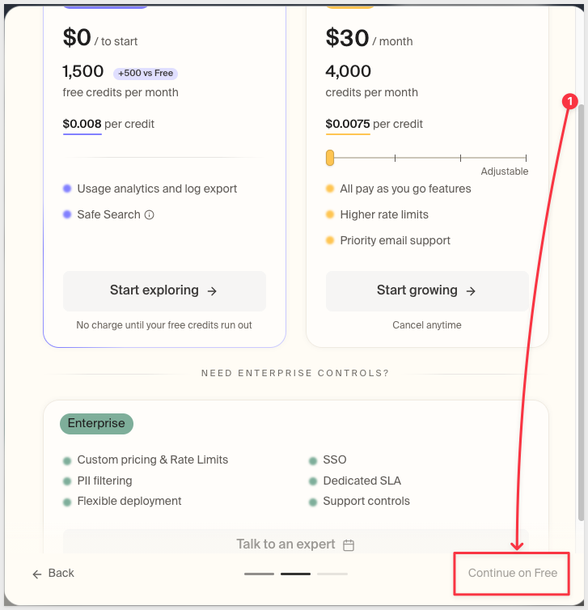

Once you're through, copy your API key from the `Connect Tavily` screen — you'll paste it into Sigma in the next section:

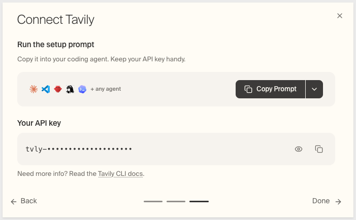

<button>[Sigma Free Trial](https://www.sigmacomputing.com/free-trial/)</button>     <button>[Tavily Free Trial](https://tavily.com/)</button>

<aside class="negative">
<strong>IMPORTANT:</strong><br> Some features may carry a "Beta" tag. Beta features are subject to quick, iterative changes. As a result, the latest product version may differ from the contents of this document.
</aside>


<!-- END OF SECTION-->

## Connect Sigma to Tavily as an API Connector
Duration: 15

Tavily is a plain REST API, so there's no MCP server or custom code to stand up — Sigma just needs a credential and a mapping between the request it sends and the response it gets back. 

The credential has to exist first, since the connector form can only select from credentials that are already there.

### Create the credential in Sigma

**1.** Go to `Administration` > `API connectors` > `Credentials`.

Click `Create credential`:

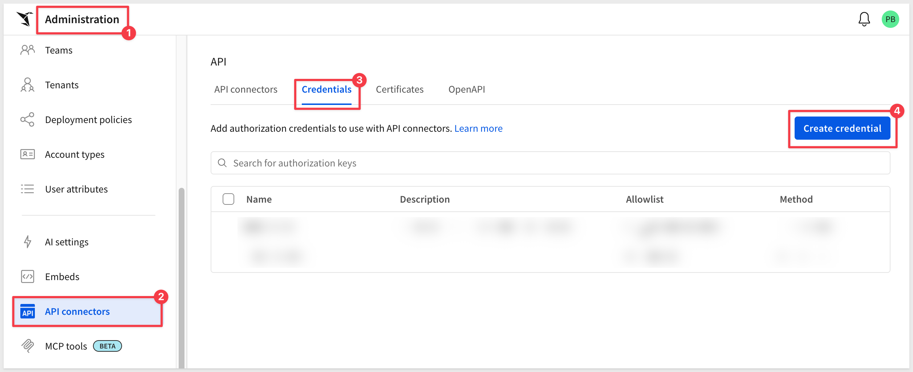

**2.** Under Name:

```copy-code
Tavily API Key
```

**3.** Under Authorized domains:

```copy-code
api.tavily.com
```

Scoping the credential to this domain keeps the key from ever being sent to any endpoint other than Tavily's.

**4.** Under Authentication method, select `Bearer token`. Tavily doesn't issue a separate bearer token — your API key doubles as one; Sigma sends it as `Authorization: Bearer <your key>`.

**5.** Under Token, paste your Tavily API key:

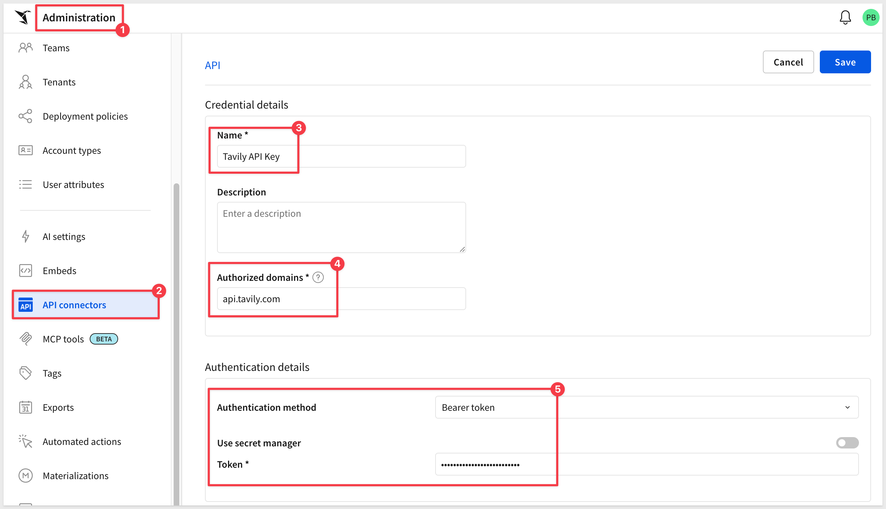

**6.** Click `Save`.

### Create the connector

**1.** Switch to the `API connectors` tab and click `Create connector`.

**2.** Under Name:

```copy-code
Tavily Web Search
```

**3.** Under Credentials, select `Tavily API Key`.

**4.** Under Certificate, leave `No client certificate` selected — Tavily doesn't require one.

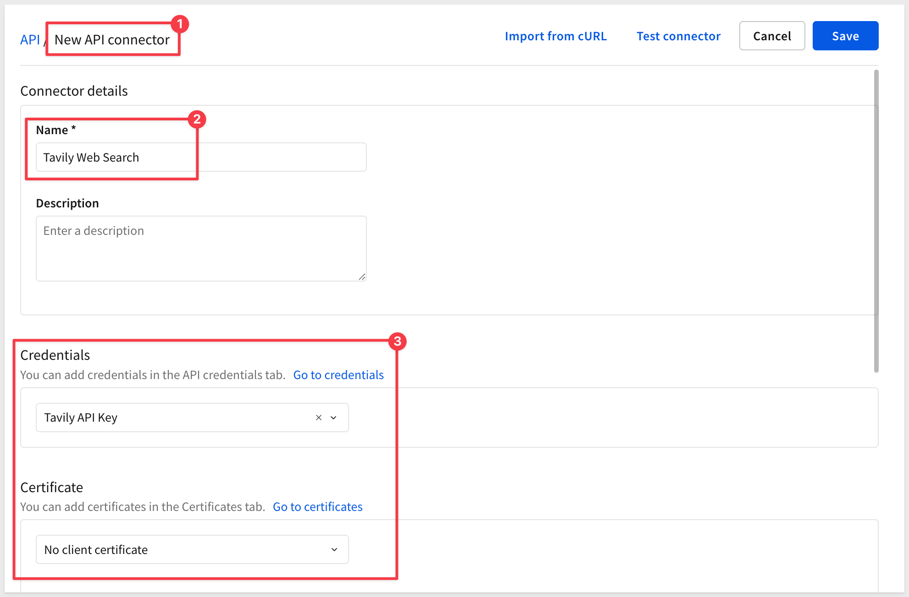

**5.** Scroll further down ensure `Custom connector` is selected.

**6.** Under Base URL, set the method dropdown to `POST` (it defaults to `GET`) — the search query travels in the request body, and only `POST` sends one — then enter:

```copy-code
https://api.tavily.com/search
```

#### Request headers

**7.** Click `+ Add` and add one header:
- Key: `content-type`
- Mode: `Static`
- Value: `application/json`

`Static` is correct here because this value never changes between calls — it just tells Tavily to expect a JSON body.

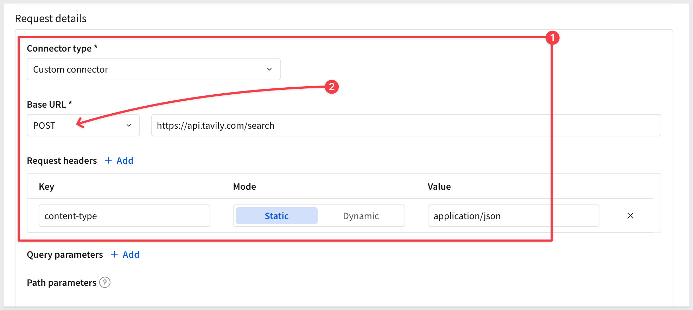

#### Request body

**8.** Select `raw`, then paste:

```copy-code
{
   "query": {{query}},
   "search_depth": "basic",
   "topic": "news",
   "time_range": "week",
   "include_answer": "advanced",
   "max_results": 5
 }
```

**9.** Below the body, find `{{query}}` in the detected values list and set Type to `Text`. This tells Sigma to wrap the value in quotes automatically at send time — never type the quotes yourself.

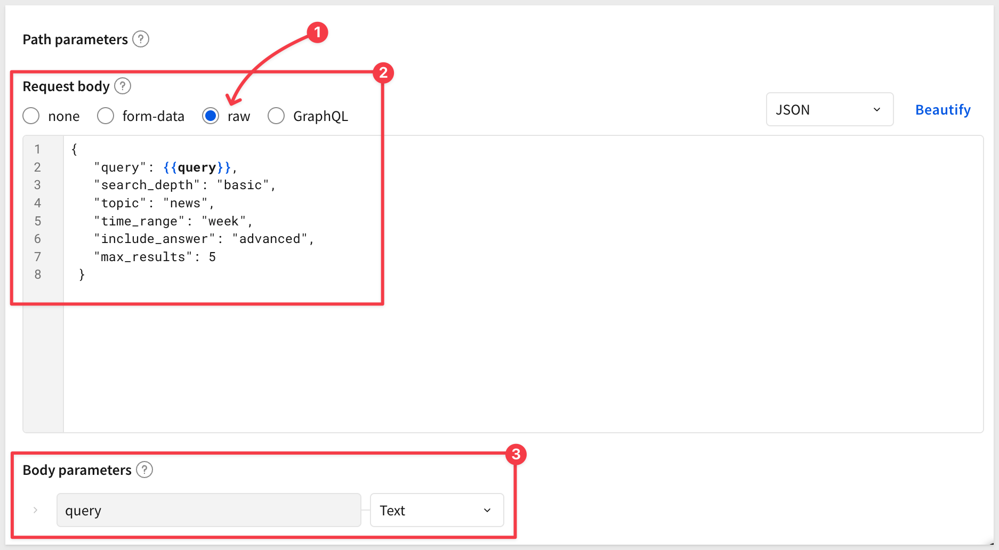

<aside class="positive">
<strong>NOTE:</strong><br> This body searches the `news` topic over the last `week` and caps results at 5 — reasonable defaults for an account-news lookup. If your use case calls for a broader search, change `topic` to `general`, widen `time_range` to `month`, or raise `max_results`. See Tavily's API reference for the full set of parameters.
</aside>

#### Response output (scroll down more...)

**10.** Click `+ Add` and create the first variable:
- Variable name: `answer`
- Accessor: `[response].answer`
- Shape: `Text`

**11.** Click `+ Add` again and create the second variable:
- Variable name: `sources`
- Accessor: `[response].results`
- Shape: `Array` > `Object`

**12.** Inside `sources`, click `+ Add key` five times and add:
- `title` — `Text`
- `url` — `Text`
- `content` — `Text`
- `sources` — `Text`
- `published_date` — `Text`

`answer` is the synthesized paragraph the agent reads and responds with. `sources` gives it the individual articles it can name, link to, quote, and date if asked to cite them.

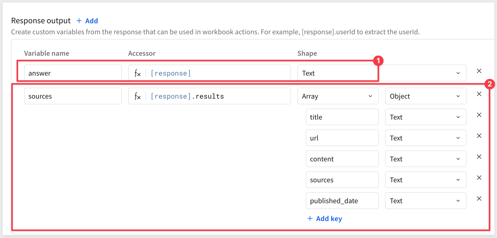

#### Advanced configuration

Sigma pre-fills this section with sensible defaults for a new connector — only Maximum retries needs to change.

**13.** Set:
- Request timeout (seconds): `30` — Tavily typically replies in 1-3 seconds; this leaves margin.
- Maximum retries: `2` — defaults to `0`; raise it so a temporary failure doesn't kill the whole call.
- Retryable status codes: `429, 502, 503, 504` — temporary failures worth retrying.
- Maximum redirects: `0` — this endpoint never redirects.
- Maximum requests per minute: `60` — keeps the connector inside Tavily's free-tier quota during testing.

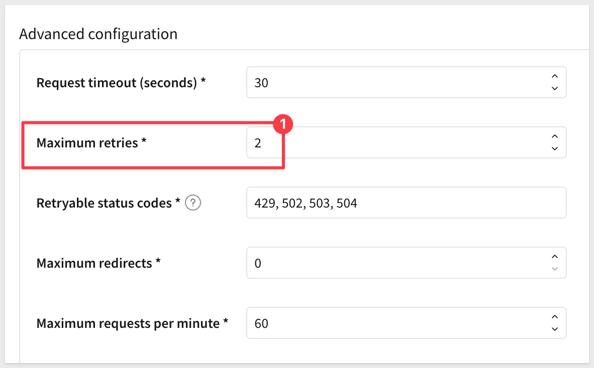

**14.** Click `Save` — the connector has to be saved before it can be tested.

### Test the connector

Click on `Tavily Web Search` to reopen the connector and click the `Edit` button.

**1.** Click `Test connector`.

**2.** Enter a query, for example:

```copy-code
snowflake earnings
```

**3.** Run it and confirm the status code is `200` and `answer` holds a written paragraph, not `null`:

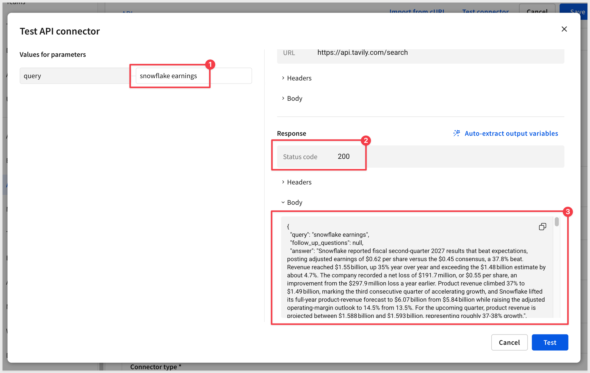

**4.** Click `Save`.

The connector is live.


<!-- END OF SECTION-->

## Give Your Agent a Web Search Tool
Duration: 8

With the connector tested, wire it into an agent as an action it can call mid-conversation.

### Add the action

**1.** Create a new workbook, add a `Chat` element from the `UI` group on the `Element bar`:

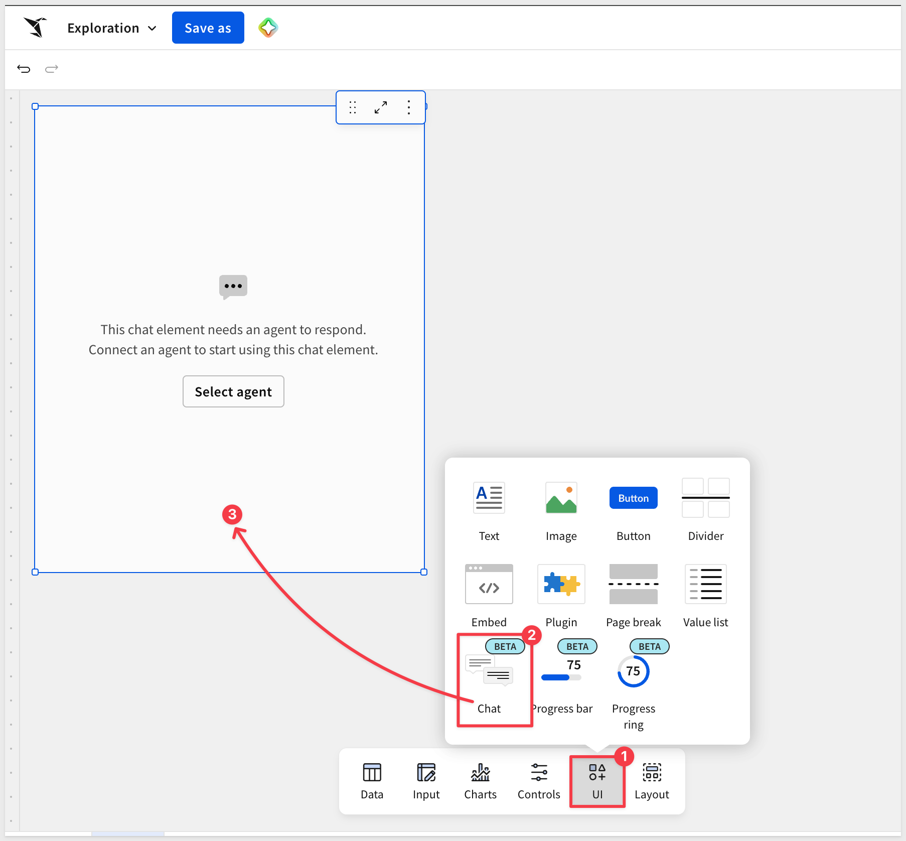

Click the `Select agent` button and select `+ Create new agent`.

**2.** In the agent's configuration, under `Tools`, click `+` and select `Actions`.

**3.** In the `Actions` panel, click the pencil icon next to `Untitled` and rename it:

```copy-code
Get Account News
```

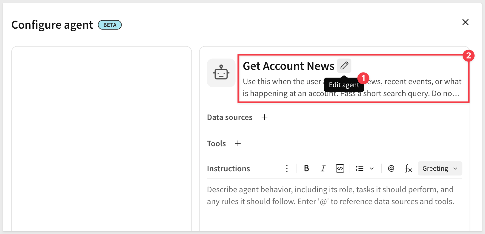

<aside class="positive">
<strong>IMPORTANT:</strong><br> A clear, distinct action name goes a long way toward the model calling this at the right time.
<br><br>
For added precision, the agent's own `Instructions` field can spell out exactly when to use it — something like "You have access to a web search tool for account news (`Get Account News`); use it when asked about news or current events, not for questions about our own data." 
<br><br>
This example doesn't add that instruction, but it's worth considering if, say, you want to tell the agent how to format its response.
</aside>

### Configure the step

Still in the same `Configure agent` panel, add a step that defines what actually happens when the agent calls this action.

**1.** Click `+` next to `Tools` to add one.

**2.** Under Step type, select `Run an action`.

**3.** Under Action, select `Call API`.

**4.** Below that, select the connector:

```copy-code
Tavily Web Search
```

**5.** Under Send as, set the `query` parameter's type to `Agent input`.

**6.** Rename the step:

```copy-code
Call Tavily API
```

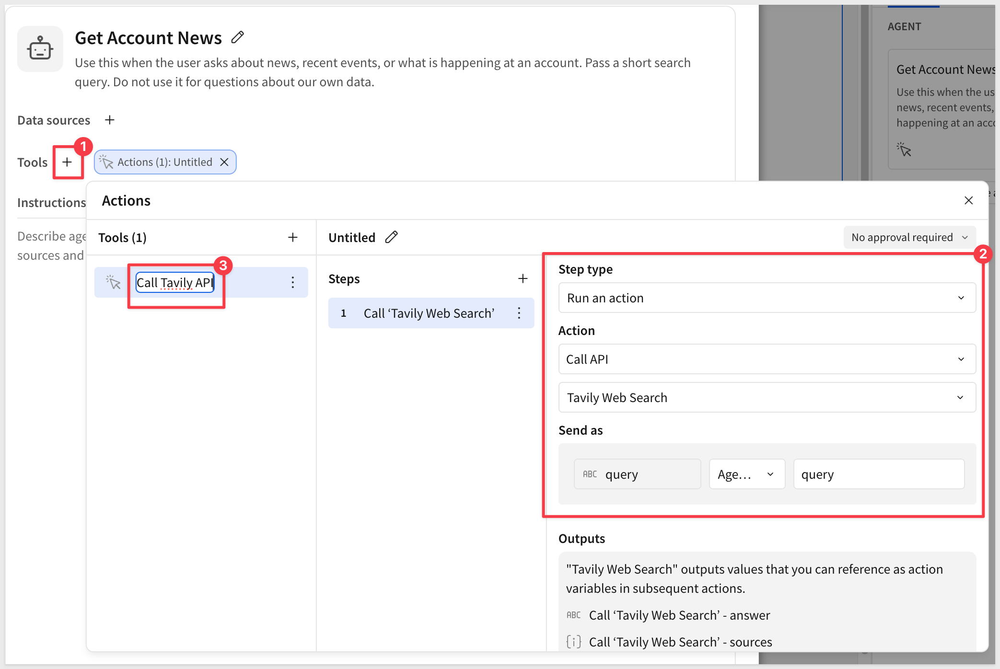

<aside class="negative">
<strong>NOTE:</strong><br> `Agent input` lets the model write the search text itself, which is exactly what you want for a search query. A URL, an email recipient, or a table name should never be mapped this way — only content the model is meant to generate belongs as `Agent input`. Everything else should be a static value or a formula.
</aside>

**7.** Click `Save` to save the action.

**8.** Save the workbook itself as:

```copy-code
Web Search Agent QuickStart
```


<!-- END OF SECTION-->

## Test the Agent's Web Search
Duration: 8

Confirm both sides of the behavior: that the tool fires when a question calls for it, and stays quiet when it doesn't.

### Confirm it fires for live questions

**1.** Ask the agent:

```copy-code
What's the latest news on Snowflake?
```

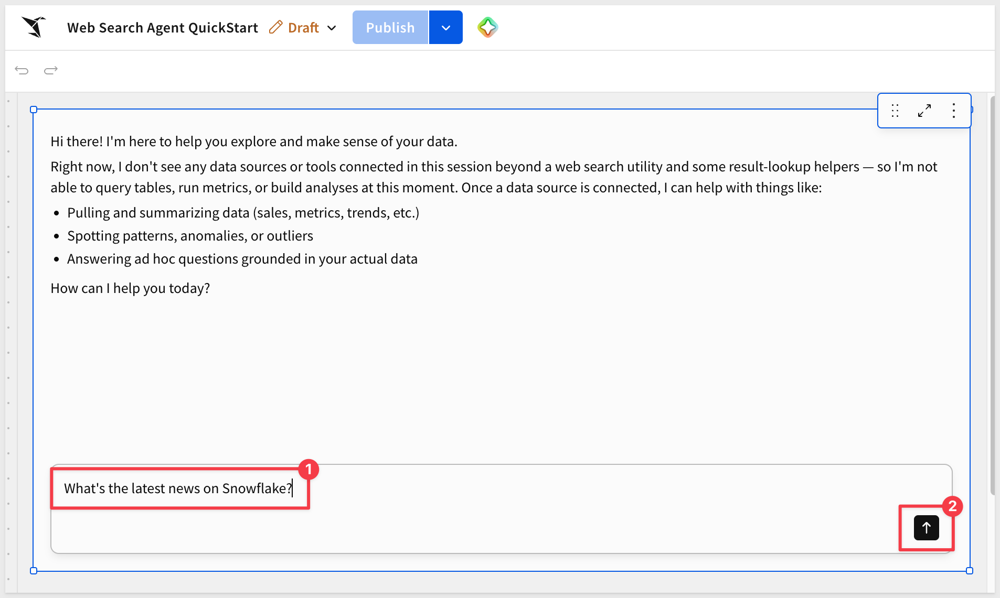

**2.** Confirm the tool fires in the tool-call trace, the response reflects the synthesized `answer`, and the agent can name a source from `sources` if asked to cite one:

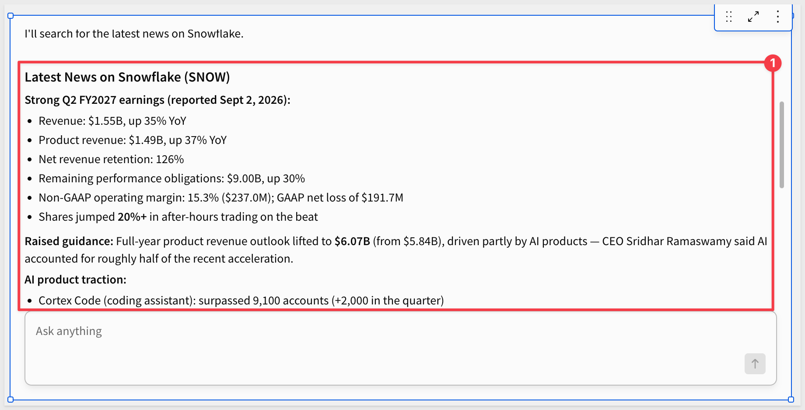

### Confirm the boundary

**1.** Ask the agent a question about your own data, for example:

```copy-code
What's our largest open opportunity?
```

**2.** Confirm the tool does not fire:

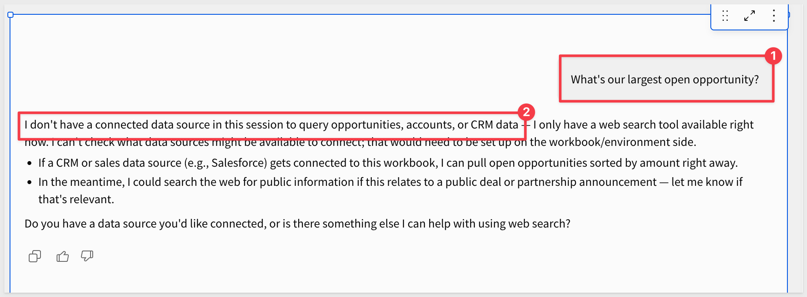

If it does fire, tighten the agent's `Instructions` field (see Add the action) until the boundary holds.


<!-- END OF SECTION-->

## What we've covered
Duration: 5

We connected Sigma to Tavily's search API as a custom connector, then gave a Sigma agent a callable action that uses it — so the agent can pull in live, current information and cite its sources alongside the data it already reasons over.

The pattern generalizes past Tavily: any REST API that accepts a JSON body and returns JSON back can become a Sigma agent action the same way, as long as the instructions are precise enough that the model knows when — and when not — to reach for it.

Extending an agent's reach this way doesn't loosen control over it. The credential stays scoped to one domain, the connector is admin-managed with its own access grants, and every call runs through the same governance as the rest of your data — Sigma stays a governed runtime for AI, not just a place agents run.

**Additional Resource Links**

[Blog](https://www.sigmacomputing.com/blog/)<br>
[Community](https://community.sigmacomputing.com/)<br>
[Help Center](https://help.sigmacomputing.com/hc/en-us)<br>
[QuickStarts](https://quickstarts.sigmacomputing.com/)<br>

Be sure to check out all the latest developments at [Sigma's First Friday Feature page!](https://quickstarts.sigmacomputing.com/firstfridayfeatures/)
<br>

[](https://twitter.com/sigmacomputing)&emsp;
[](https://www.linkedin.com/company/sigmacomputing)&emsp;
[](https://www.facebook.com/sigmacomputing)


<!-- END OF WHAT WE COVERED -->
<!-- END OF QUICKSTART -->
