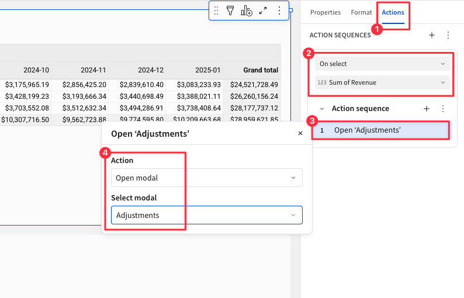

author: pballai
id: dataapps_adjustments_change_log
summary: dataapps_adjustments_change_log
categories: dataapps
environments: web
status: hidden
feedback link: https://github.com/sigmacomputing/sigmaquickstarts/issues
tags:
lastUpdated: 2025-01-08

# Adjustments - Change Log

## Overview 
Duration: 5 

This QuickStart is designed to show how Sigma simplifies the process of creating an intuitive interface for managing data. Users can input, edit, and review changes in real-time, with the adjustments automatically recorded in a centralized log. The change log serves as a historical record, providing transparency and accountability for all modifications.

<aside class="positive">
<strong>PLEASE READ:</strong><br> Sigma data apps are rapidly evolving, with new features being added regularly. If your Sigma instance does not have the specific feature shown (or if the UI has changed), please contact Sigma support for assistance in accessing the feature.
</aside>

[How to contact Sigma support](https://help.sigmacomputing.com/docs/sigma-support)

### Key Features:
- Change Logging: Automatically capture each adjustment with details like user, timestamp, and updated values.
- Display the most recent adjusted value alongside the original value; never change the original data.
- Sigma Input Tables: Facilitate real-time data entry and updates directly in the Sigma UI.
- No knowledge of the cloud data warehouse is required, although all data will be stored there.
- Error handling

### Use Cases: 
This approach is ideal for scenarios where tracking manual adjustments is critical, such as:

- Inventory corrections
- Financial forecast updates
- Quality control audits
- Get creative!

By the end of this QuickStart, users will have a fully functional data app capable of handling live adjustments and maintaining a transparent change history, built entirely in Sigma.

### Target Audience
Developers interested in using Sigma to build interactive data applications.

### Prerequisites

<ul>
  <li>A computer with a current browser. It does not matter which browser you want to use.</li>
  <li>Access to your Sigma environment.</li>
  <li>Some familiarity with Sigma is assumed. Not all steps will be shown as the basics are assumed to be understood.</li>
 </ul>

<aside class="postive">
<strong>IMPORTANT:</strong><br> Sigma recommends that you use non-production resources when doing QuickStarts.
</aside>

<button>[Sigma Free Trial](https://www.sigmacomputing.com/free-trial/)</button>

<aside class="positive">
<strong>IMPORTANT:</strong><br> Some screens in Sigma may appear slightly different from those shown in QuickStarts. This is because Sigma is continuously adding and enhancing functionality. Rest assured, Sigma’s intuitive interface ensures that any differences will not prevent you from successfully completing any QuickStart.
</aside>

For more information on Sigma's product release strategy, see [Sigma product releases.](https://help.sigmacomputing.com/docs/sigma-product-releases)


## Sample Data
Duration: 5

Log into Sigma as `Administrator` and create a new workbook. 

Add a new `Data` > `Table` to the page and set the source to `Sigma Sample Database` > `RETAIL` > `PLUGS_ELECTRONICS` > `PLUGS_ELECTRONICS_HANDS_ON_LAB_DATA`:


Add a new column, rename it to `Revenue` and set the formula to:
```code
[Price] * [Quantity]
```

Add another new column, rename it to `Month` and set the formula to:
```code
DateTrunc("month", [Date])
```

Let's cull the data down for this demonstration. We don't need 4.5 million rows to build our data app, although Sigma handles it fine anyway. There is no reason to use more data than is required and efficiency matters. 

Filter the table down to just `Mobiles`:

Also filter the table to the `Last 2 quarters`:


Rename this page to `Data`.

Save the workbook as `QuickStart - Adjustments Change Log`.


<!-- END OF SECTION-->

## Pivot Table
Duration: 5

Add another workbook page and rename it to `Home`.

On the `Home` page, add a new `Data` > `Pivot Table`. Set the source to the `Data` > `PLUGS_ELECTRONICS_HANDS_ON_LAB_DATA` table.

Group the table as shown in the screenshot below:


Rename the pivot table to `Revenue Planning`.

### Create a Key Column
In order to uniquely identify which cell a user has clicked, we will add a column renamed to `Key`, and set its formula to:
```code
MD5([Product Type] & [Product Line] & Text([Month]))
```

Remove the `Count` aggregation from `Key`.

Drag the `Key` column to the `VALUES` grouping and the result will be that for each `Sum of Revenue` value, there is a corresponding unique key.

<aside class="positive">
<strong>IMPORTANT:</strong><br> We know the key will be unique as it is created using an MD5 hashing function or Product Type, Line and Month. 
</aside>


Leave the `Key` in the `VALUES` grouping but set it to `Hidden`. We want to be able to reference it, but we don't need to actually see it here.


<!-- END OF SECTION-->

## Input Table
Duration: 5

Add a `Input` > `Empty` input table under the `Revenue Planning` table.

Set the source connection to the `Sigma Sample Database`.

Add and name the following columns:
```code
Name                Type
Product_Line        Text
Original_Value      Number
Method              Text
Adjusted_Value      Number
Delta               Add as a Caculation column
Key                 Text
```

Set the formula for `Delta` to:
```code
[Adjusted_Value] - [Original_Value]
```


Also add the Sigma supplied columns for `Last updated at`and `Last updated by`:


If you happend to create some blank rows, it is simple to delete them:


Rename the input table to `Adjustment Log`.


<!-- END OF SECTION-->

## Actions
Duration: 5

With the basic framework in place, we can configure some actions and create a modal (page) to allow users to input adjustments and save them.

On the `Home` page, select the `Revenue Planning` table and open the `Actions` menu.

We need to change the value in the `When selecting cells in column` to be `Sum of revenue`, since that is the column in the `Revenue Planning` table that we want users to click. 

Once that change is made, click the `+` to add another action.

<aside class="negative">
<strong>NOTE:</strong><br> Adding actions and action sequences is really simple and gets repetitive so we may not show every step. We will show the configurations when they are not obvious. 
</aside>



Add an new action to the existing `Action sequence` and set the action to `Open modal` and select the `New modal`:


This creates a new modal for us (hidden workbook page). 

<aside class="positive">
<strong>IMPORTANT:</strong><br> Modals are hidden and only shown when called for by another action. Apart from that, they behave like any other Sigma page, apart from styling restrictions that make sense for pop-up style page sizing.
</aside>

Rename the modal page to `Adjustments` and change it's title to `Adjustments` too.

### Adding Controls to the Modal
To support the required passing of user selected values, we will use a few Sigma controls on the modal. 

Once the controls are in place, we will return to creating some actions to control the passing of values to them.

<aside class="positive">
<strong>IMPORTANT:</strong><br> Using Actions and Controls together unlocks limitless possibilities to create feature rich data applications extremely quickly. 
</aside>

On the `Adjustments` modal, add the following controls and text elements.

<aside class="positive">
<strong>IMPORTANT:</strong><br> Pay close attention to the type of control required, the "Data format" and also the "Control ID" values. It is a good practice to use a common naming convention for control id's. In the demonstration, we will prepend the control id with a "a_" to indicate the control is on the "Adjustment" page.
</aside>

### Control Elements

#### Selected value - a_current
Add a `Controls` > `Number` input control and set the `Control ID` to `a_current.` Also set the `Data format` to `Currency.`


#### Desired Adjustment - a_adjustment
Add a `Controls` > `Number` input control and set the `Control ID` to `a_adjustment`. Also set the Data format to `Number`.


#### Product Line - a_line
You can also duplicate existing controls and edit them as required for the product line (a_line), but make sure the `Control type` is set as required when duplicating from different control types.

<br>


#### Product Type - a_date
Add a `Controls` > `Date` control and set the `Control ID` to `a_date`. 

#### Product Type - a_key
Add a `Controls` > `Text input` control and set the `Control ID` to `a_key`. 

#### Method
Add a `Controls` > `Segmented` control and set the `Control ID` to `Method`. Set the `Value source` to `Create manual list` with these values:
```code
Absolute
Percent
Relative
```


#### Calculated Adjustment
Add a `UI` > `Text` element and set its formula to:
```code
Coalesce(
    Switch(
        [Method],
        "Percent", [a_current] * (1 + [a_adjustment] / 100),
        "Absolute", [a_adjustment],
        "Relative", [a_current] + [a_adjustment]
    ),
    0
)
```

The value normally would resolve to `Null` but using [Coalesce](https://help.sigmacomputing.com/docs/coalesce) will convert that to zero. 

Now that we have all the elements on the modal, we can take a moment to clean up the appearance, rearranging, placing elements into containers and styling to suit:

Place the elements that are considered part of a `Selected values` grouping together in a container and rename the container `Selected values`.


Do the same for the elements that are part of a grouping that the user would use to create an adjustment, also renaming the second container to `Adjustment value`. 

After placing some items in containers, adding some `text` elements and light styling, the modal looks like this:


<!-- END OF SECTION-->

## Actions to Set Controls
Duration: 5

Return the the `Home` page and select the `Revenue Planning` table and open its action menu.

Make sure that the existing `Open modal` action is set to open the `Adjustments` modal:


At this point if we click on any value in the `Revenue Planning` pivot table, the modal will appear. 

However, we need to still configure other actions to pass the required values, based on the cell the user selects.

Add another action and set it to pass the value the user has selected from the `Sum of Revenue` column to the `A Current` control:


Now if we click a cell, the value is passed to the modal as expected:


We simply need to add more `Set control value` actions for each element on the modal we want to pass data to.

### Product Line


### Month (Date)


### Key


### Give it a test
Clicking a value in the `Revenue Planning` workbook, entering a value in `A Adjustment` and clicking `Absolute` should produce a calculated adjustment:


Now we need to configure some actions on the modals footer buttons (Secondary and Primary) to exit or save the adjustment.

<aside class="negative">
<strong>NOTE:</strong><br> We could hide the footer buttons and place our own buttons on the page too. Doing it this way to save a few steps is all.
</aside>


<!-- END OF SECTION-->

## Button Actions
Duration: 5

On the `Adjustments` modal page, uncheck the `Show close icon` and configure the text to appear on each footer button:


### Secondary button (Exit)

Moving to the `Actions` menu now.

On the `On click - secondary` action, add three actions, two to clear the modals containers and one to navigate back `Home`:

<br>


<aside class="negative">
<strong>NOTE:</strong><br> Clearing all the control values in a container is big time saver!
</aside>

### Primary button (Save Adjustment)
We need to handle this button a bit different to account for things that ***might*** happen. 

For example, if the user does not enter a value for `A Adjustment` but clicks `Save`, what should happen?

To handle this Sigma provides [Action Sequences](https://help.sigmacomputing.com/docs/configure-actions-in-sequences) and [Action conditions](https://help.sigmacomputing.com/docs/make-an-action-conditional)

First, we will handle the case where `A Adjustment` is left empty.

Still on the modal, open its `Actions` menu.

Click as shown in the screenshot below and select `Add condition`:


Select `Custom formula` and use this formula:
```code
IsNull([a_adjustment])
```


This will check if `A Adjustment` is empty and if so, process the next action in the sequence.

There are few things we could do here to provide feedback to the user. For example, we may want to display another modal with a warning like this:


<aside class="negative">
<strong>NOTE:</strong><br> Build a warning modal the same was as done with the "Adjustments" modal. Just configure the warning to be whatever you decide and include actions to close and return to the "Adjustments" modal after it is shown to the user. 
</aside>

### Add second action sequence
With that out of the way, lets setup recording the adjustment into our `Adjustment Log` input table.

`Create` (or duplicate the existing) action sequence (as shown in the screenshot below) and set its condition to execute if there is a value in 
```code
IsNotNull([a_adjustment])
```

Add an `Insert a row` action and configure it as shown:


<aside class="negative">
<strong>NOTE:</strong><br> Make sure to not use the action that has the IsNull condition on it!
</aside>

We need to make one change from the defaults for the `Adjusted_Value` control. For that, we need to pass the value of the final calculation but since that is not in a control for us to just "grab", we have to set a formula instead. 

We can just reuse the same formula as the modal already uses to do the adjustment calculation:
```code
Switch([Method], "Percent", [a_current] * (1 + [a_adjustment] / 100), "Absolute", [a_adjustment], "Relative", [a_current] + [a_adjustment])
```

<aside class="negative">
<strong>NOTE:</strong><br> The calculations in the formula above are somewhat unimportant in this demonstration. We just picked something simple to make it understandable. Sigma can handle complex calculations in this same workflow. 
</aside>

Add another action to `Navigate` back to `Home`. 

Click `Publish`.

Give it a test; does it work? Notice anything in the workflow?

In data apps, testing can and will expose problems and areas where users might get in trouble too. 

For example, in testing the first time, it worked fine but on the second pass we noticed that the value for `A Adjustment` was held over from the first test. 

This is easy enough to correct. Lets keep it simple for demonstration.

On the `Save Adjustment` action, we just need to add two actions to clear the values from each container on the `Adjustments` modal. That will solve it!


### Input table governance
Sigma allows you to preserve data integrity and enhance security in input tables through data validation, column protection, and customizable data entry permissions. 

During our configuration and testing work our input table was set to `Only editable in draft mode`. This is fine for building and testing. However, if we want to test in `Published` mode, we need to first set the input table to `Editable in view/explore mode` and also click `Publish`. 

It is fine to switch between modes when we are building. We just want to make sure the functionality is understood.


For more information, see [Data governance options in input tables.](https://help.sigmacomputing.com/docs/configure-data-governance-options-in-input-tables)


<!-- END OF SECTION-->

## Adjustments in Pivot Table
Duration: 5
Now that we have everything working, we want to do one last thing; show the most recent adjusted amount next to the current amount in the pivot table. 

Before we start this, delete all the test adjustments you may have made from the `Adjustment Log`.

We need to determine the most recent adjustment for each `Product Line` and `Month`, so we will use the data in the `Adjustment Log` to accomplish this, without changing the table itself.

Create a child table from the `Adjustment Log`:


Rename the new table to Most `Most Recent Adjustments`.

Group the table by the `Key` column.

Drag `Last updated at` to the `CALCULATIONS` grouping and set its aggregation to `MAX`:


Rename the column to `Most Recent Adjustment`.

Add another new column and rename it to `IsLatest` and set its formula to:
```code
If([Last updated at] = [Most Recent Adjustment], True)
```

Filter `IsLatest` to only show `True` values.

Lets do some test adjustments so that we have some data. Make sure to adjust the same cell a few times so we are sure only the most recent one appears. For example, we did six adjustments on two cells, in two `Product Lines`. The `Most Recent Adjustments` table only shows the two most recent adjustments as expected:


With that configured, we now want the latest adjustment to appear in the `Revenue Planning` table, in the correct cell.

In the `Revenue Planning` table, add a new column, rename it to the `Latest Adjustment` and set the formula to:
```code
Coalesce(Lookup([Most Recent Adjustments/Adjusted_Value], [Key], [Most Recent Adjustments/Key]), [Sum of Revenue])
```

Drag the new column to the `CALCULATIONS` grouping and set its `Aggregation` to `Remove Aggregation`:


Now when there is a matching record in the `Most Recent Adjustments` table, the value is shown in `Revenue Planning` in the `Lastest Adjustment` column. When there is no match, the current value is shown instead. 

Here is a demo of a using the data app to make some adjustments from scratch (using the `Published version`):


<aside class="positive">
<strong>IMPORTANT:</strong><br> Input table data is stored automatically in your cloud data warehouse. Remember, we built all of this without doing any configuration directly in the warehouse itself, but your data is where you want it stored, not with Sigma.
</aside>

By now we hope you see just how easy and powerful the combination of Sigma and data apps can be. 


<!-- END OF SECTION-->

## What we've covered
Duration: 5

In this QuickStart, we built out a process that allows users to make real-time adjustments to revenue with all work being done in Sigma.  

**Additional Resource Links**

[Blog](https://www.sigmacomputing.com/blog/)<br>
[Community](https://community.sigmacomputing.com/)<br>
[Help Center](https://help.sigmacomputing.com/hc/en-us)<br>
[QuickStarts](https://quickstarts.sigmacomputing.com/)<br>

Be sure to check out all the latest developments at [Sigma's First Friday Feature page!](https://quickstarts.sigmacomputing.com/firstfridayfeatures/)
<br>

[](https://twitter.com/sigmacomputing)&emsp;
[](https://www.linkedin.com/company/sigmacomputing)&emsp;
[](https://www.facebook.com/sigmacomputing)


<!-- END OF WHAT WE COVERED -->
<!-- END OF QUICKSTART -->
