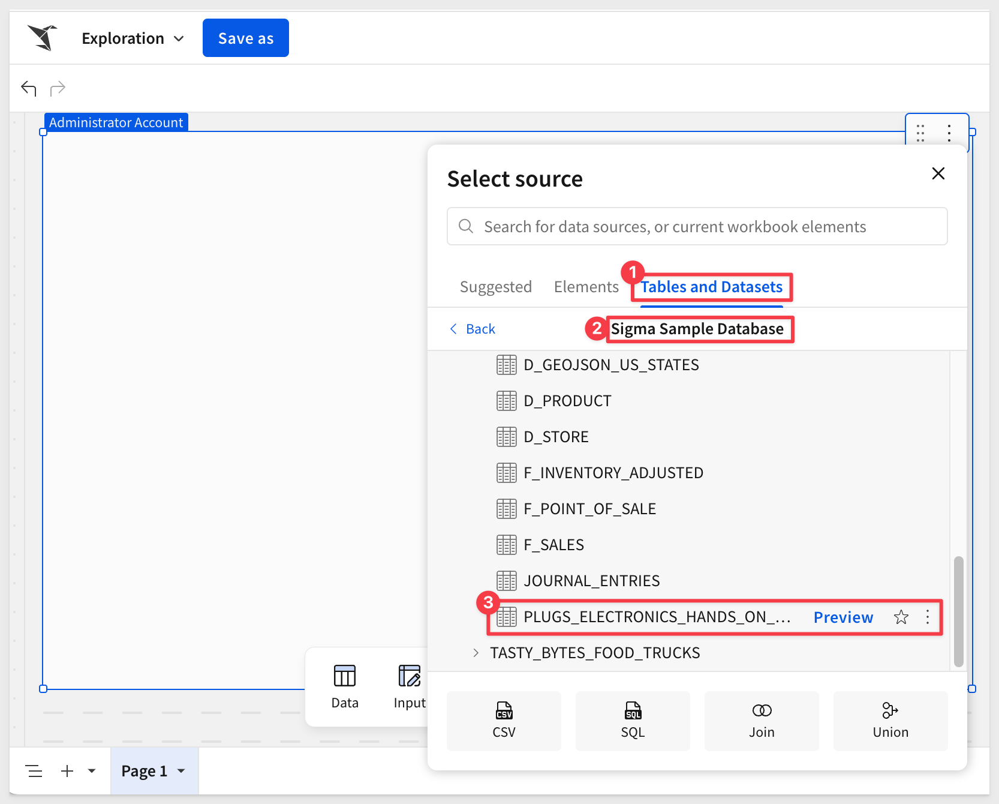
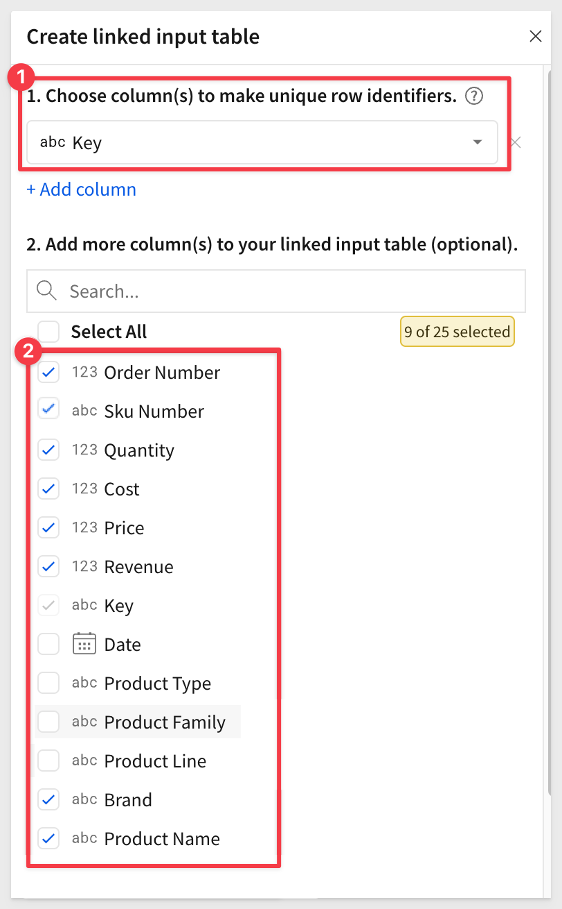
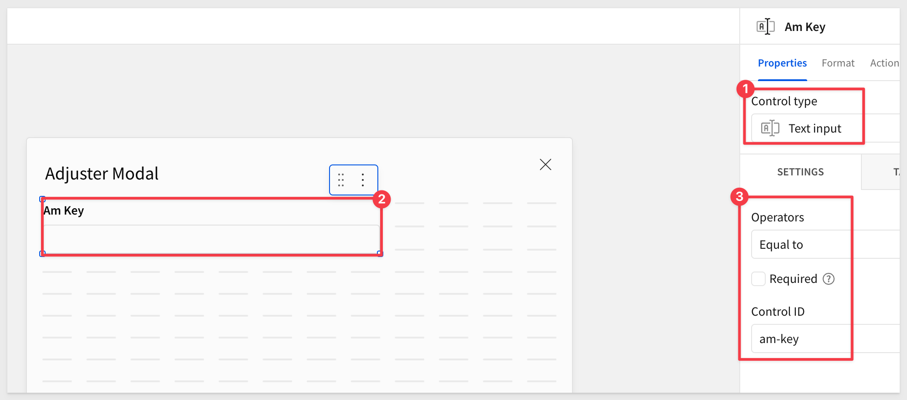
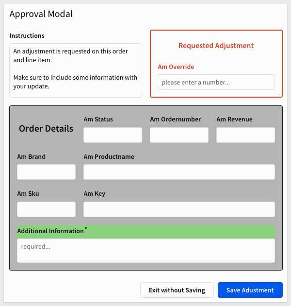
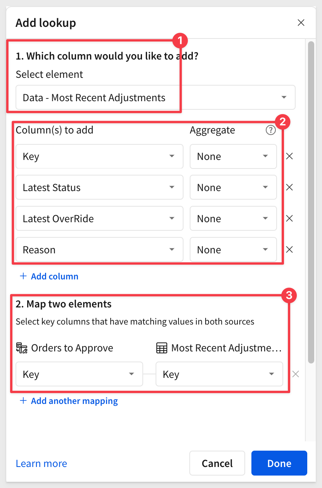
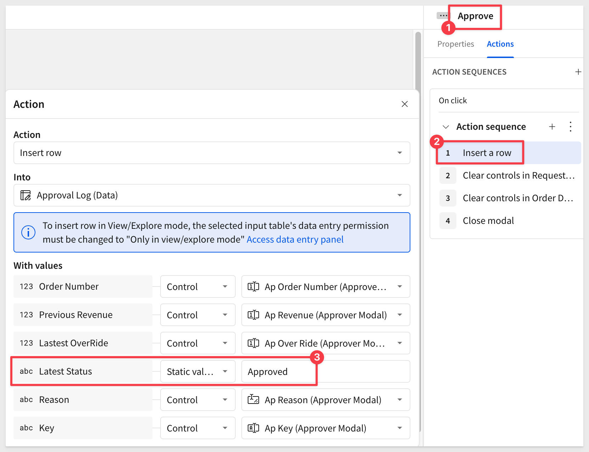

author: pballai
id: dataapps_approvals_flow
summary: dataapps_approvals_flow
categories: dataapps
environments: web
status: Hidden
feedback link: https://github.com/sigmacomputing/sigmaquickstarts/issues
tags:
lastUpdated: 2025-01-16

# Approvals

## Overview 
Duration: 5 

This workflow demonstrates how to streamline retail revenue adjustments by enabling collaboration between Adjusters and Approvers. 

The example highlights a common use case: providing a price reduction on a line item to address a customer satisfaction issue. 

Adjusters can propose changes to the revenue column, while Approvers review, reject or adjust them before finally approving an adjustment. 

This interactive example showcases Sigma's ability to build workflows that are both flexible and intuitive, allowing users to efficiently manage and track revenue adjustments in real time.

### Target Audience
Developers interested in using Sigma to build interactive data applications.

### Prerequisites

<ul>
  <li>A computer with a current browser. It does not matter which browser you want to use.</li>
  <li>Access to your Sigma environment.</li>
  <li>Some familiarity with Sigma is assumed. Not all steps will be shown as the basics are assumed to be understood.</li>
 </ul>

<aside class="postive">
<strong>IMPORTANT:</strong><br> Sigma recommends that you use non-production resources when doing QuickStarts.
</aside>

<button>[Sigma Free Trial](https://www.sigmacomputing.com/free-trial/)</button>
<aside class="positive">

<strong>IMPORTANT:</strong><br> Some screens in Sigma may appear slightly different from those shown in QuickStarts. This is because Sigma is continuously adding and enhancing functionality. Rest assured, Sigma’s intuitive interface ensures that any differences will not prevent you from successfully completing any QuickStart.
</aside>

For more information on Sigma's product release strategy, see [Sigma product releases.](https://help.sigmacomputing.com/docs/sigma-product-releases)
 


## Sample Data
Duration: 5

Log into Sigma as `Administrator` and create a new workbook. 

Add a new `Data` > `Table` to the page and set the source to `Sigma Sample Database` > `RETAIL` > `PLUGS_ELECTRONICS` > `PLUGS_ELECTRONICS_HANDS_ON_LAB_DATA`:



Add a new column, rename it to `Revenue` and set the formula to:
```code
[Price] * [Quantity]
```
Let's cull the data down for this demonstration. We don't need 4.5 million rows to build our data app, although Sigma handles it fine anyway. There is no reason to use more data than is required and efficency matters. 

Filter the table down to just `Order Number` and set the range to `131-133`:


Lets just assume these are the orders in the cloud data warehouse ("warehouse") that require review, modification and approval. 

<aside class="negative">
<strong>NOTE:</strong><br> The methods demonstrated can be applied to any set of data really. For example, if the data is project management oriented, these methods will translate easily to that dataset, or any other too.
</aside>

Since it is possible that each order can have multiple items (`SKUs`). We need to add a column to ensure that we can easily identify any row uniquely. 

Add a new column, rename it to `Key` and set the formula to:
```code
MD5(Text([Order Number]) & [Sku Number] & Text([Cust Key]))
```

The [MD5](https://help.sigmacomputing.com/docs/md5) function is a nice way to create unique identifiers, in this case by combining the `Order Number`, `SKU` and `Cust Key`. For the purposes of this QuickStart, that should be sufficient.


Create a `Linked Input Table` from the `PLUGS_ELECTRONICS_HANDS_ON_LAB_DATA` table.


Select the `Key` column as the unique row identifier.

To make things cleaner, lets select the columns that are not really needed for this demonstration and leave only the ones shown in the screenshot below. 



Rename the input table to `Orders to Approve`.

Rename this page to `Data`.

Add a new workbook page and rename it to `Approvals`. 

Move the new input table to the `Approvals`

Save the workbook as `QuickStart - Approval Flow`.


<aside class="negative">
<strong>NOTE:</strong><br> You may notice some column formatting and reordering in the screenshots. We will not specifically cover this, as it is assumed that you are familiar with how to make these adjustments. Additionally, it is not essential for the functionality of this workflow.
</aside>


<!-- END OF SECTION-->

## Approvals Input Table
Duration: 5

With our sample data in place, we want to give the user a way to target a specific order number.

Hide the `Key` column. We will be able to reference it, but no need for users to see it.

Using the `Order Number` column, create a filter and `Change filter type` to `List`:


Then change it to a `Page control`:


We can adjust the `Order Number` control as shown to clean things up to our preferences:


<aside class="positive">
<strong>IMPORTANT:</strong><br> Pay close attention to the "Control ID" value. It is a good practice to use a common naming convention for control id's. In the demonstration, we will prepend the control id to indicate which page the control is on. In the example above, the "a_" indicates the control is on the "Approvals" page.
</aside>


<!-- END OF SECTION-->

## Adjuster Modal
Duration: 5

We want the data app to open a modal window when the user clicks on a single cell in a specific row. 

Lets make it really obvious for the user and add a new `Calculation` column to `Orders to Approve` and rename it to `Edit`. Set the formula to:
```code
"EDIT"
```

Make it even more clear to the user with conditional formatting:


### Our first action
With the `Orders to Approve` table selected, open the `Actions` menu. 

Configure the action as shown, to open a `New modal`:


<aside class="positive">
<strong>IMPORTANT:</strong><br> Modals are hidden and only shown when called for by another action. Apart from that, they behave like any other Sigma page, apart from styling restrictions that make sense for pop-up style page sizing.
</aside>

Rename the `Modal 1` to `Adjuster Modal` and change its tile to `Adjuster Modal` too.


Now it a cell is clicked in the `EDIT` column, the modal will appear.

This is all very slick, but lets get back to what we need to do here; allow an authorized person to apply an `OverRide` (ie: order discount for example) to a specific order (perhaps as a customer service issue) and submit it for final approval. 

To accomplish this, we will need to pass a few other values from the selected row to the `Adjuster Modal` where the user will then modify as desired. 

### Adding Controls to the Modal
To support the required passing of user selected values, we will use a few Sigma controls on the modal.

Once the controls are in place, we will return to creating some actions to control the passing of values from `Orders to Approve` to the `Adjuster Modal`.

<aside class="positive">
<strong>IMPORTANT:</strong><br> Using actions and controls together unlocks limitless possibilites to create feature rich data applications extremely quickly.
</aside>

We will start by adding a `Controls` > `Text input` control to the modal and setting its `Control ID` to `am-Key`:



This will hold the key value that allows us to identify the exact row we are targeting. 

Since this process will be somewhat repetitive, lets make this first one work first before we add the rest.

<aside class="negative">
<strong>NOTE:</strong><br> We dont really need to show the "Key" value on the modal. This is done for demonstration and learning only.

We are also going to use input controls on the modals for all values, just to make this simple to demonstrate. There are many other controls available to experiment with, based on your use case needs.
</aside>

Back on the `Approvals` page > `Orders to Approve` table > `Actions`, we add another action to `Set control value` as shown:


<aside class="positive">
<strong>IMPORTANT:</strong><br> A mistake we have made more than once is to not pay attention to the data type of the column we are passing in the action. When this mistake is made, Sigma will not allow you to pick the intended column in the list of available in the actions menu when using "Set control value". Instead it will show the column in the list, but greyed out. Watch out for this one!

Also make sure you are passing the correct value to the correct control. This is why Control ID naming is something to carefully consider. Use that to make it easy, obvious and make debugging later faster too.
</aside>

### Test it out
Click any cell in the `Edit` column on the `Orders to Approve` table and make sure the `Key` value is passed as expected:


If all is good, lets move on. 

### Add remaining controls
Now that we have done it once, adding the rest of the controls and corresponding actions is very similar. Remember to select the correct control for the data type and also set the `Control ID` for each using our design pattern.

Here are the controls required:

#### Current Status - am_Status
Add a `Controls` > `Text input` control and set the `Control ID` to `am_status.`

#### Current Status - am_Order_Number
Add a `Controls` > `Number input` control and set the `Control ID` to `am_Order_Number.`

#### Current Revenue - am_Revenue
Add a `Controls` > `Number input` control and set the `Control ID` to `am_Revenue.` Also set the `Data format` to `Currency.`

#### Current Status - am_Brand
Add a `Controls` > `Text input` control and set the `Control ID` to `am_Brand.`

#### Current Status - am_Product_Name
Add a `Controls` > `Text input` control and set the `Control ID` to `am_Product_Name.`

#### Current Status - am_SKU
Add a `Controls` > `Text input` control and set the `Control ID` to `am_SKU.`

#### Current Status - am_Reason
Add a `Controls` > `Text area` control and set the `Control ID` to `am_Reason.`

<aside class="negative">
<strong>NOTE:</strong><br> Make sure the last one was set to "Text area" so we can capture additional information from users.
</aside>

#### OverRide Revenue - am_Over_Ride
Add a `Controls` > `Number input` control and set the `Control ID` to `am_Over_Ride.` Also set the `Data format` to `Currency.`

The `OverRide` values represents whatever value the user decides is an appropriate adjustment. When we store this value, **we will not alter the source data value for revenue in any way.** 

Instead, we will store it in a log table, and later we will also show it in a reporting table along with the orginal value for `Revenue` for easy comparison.

At this point we have all our controls and need to map actions to populate them with values. We have not worried about UI appearance; that is easy and we will do that later. 


### Map actions to new controls
Return to the `Approvals` page and add the corresponding actions for each of these controls.

We could use the `+` to add another action but we can save a few clicks by duplicating the existing one, `Set Am Key` and then just adjust the configuration of the duplicate:


Since we don't have a `Status` column yet, we can set the action to send a `Static` value of `New request`:


The rest of the actions follow the same pattern, adjusting for the `Update control` value and `Set value as` value:


We don't need actions (yet) for this set of actions ("sequence") for `Am Over Ride` and `Am Reason` as this sequence will later represent the user making the initial adjustment request.

Retest the workflow to see the expected value pass:


### Style the modal
We can organized the controls a bit and added a `UI` > `Text` to each "block" of controls, just to make it clear what they are. When we are done, the modal should look like this:



We also want to place the two groups of controls into their own [Containers](https://help.sigmacomputing.com/docs/organize-workbook-layouts-with-containers). This will allow us to taget everything in a container by its name. A big time saver.

Just click-hold and drag around the controls and select the container icon as shown below:


The container's name can be set as shown, by clicking on the name (numbered item 2 below):


Repeat to create a second container for the `Order Details` controls:


Here is the text for `Instructions`:
```code
An adjustment is requested on this order and line item.  

Make sure to include some information with your update.
```


<!-- END OF SECTION-->

## Approval Log
Duration: 5

Before we create actions to save an "adjustment", we need to create a place for them to be stored.

We will use another Sigma input table for this. 

<aside class="positive">
<strong>IMPORTANT:</strong><br> One of the wonderful things about input tables is that we can create and configure them only using the Sigma UI. Data is automatically stored in your (not Sigmas) warehouse, based on the connection selected when the input table is created. This is ensures the data is controlled by you and not a third party.
</aside>

On the `Approvals` page, create a new `Input` > `Empty` input table below the existing table. 

Set the connection to the `Sigma sample database`.

We will need to add and configure a few columns. These columns will be populated by data sent by the `Approvals Modal` when the user saves an override.

Add and configure the following columns:
```code
Column Name:      Type:
Order Number      Number
Previous Revenue  Number
Latest OverRide   Number
Latest Status     Text
Reason            Text
Key               Text
```

The `Key` column can be hidden after done testing operations.

Also add the Sigma supplied columns for `Last updated at`and `Last updated by`:


If any rows got created accidentally, just select them and delete them.

Rename the new input table to `Approval Log`:


### Most recent records
Now that our `Approval Log` is capturing all the changes, we can use that to provide more functionality to user. 

To make this useful, we need to implement a method to list the most recent status for each unique item in any order. Remember, each order can include multiple items, and we need to be able to adjust the revenue at the line-item level.

Move the `Approval Log` to the `Data` page.

Once it is on the `Data` page, use it to create a `Child table`. We do this because:

- 1: We want to leave the `Approval Log` table "unedited", so that we can leverage it anytime to drive any future analytic needs.

- 2: We need to filter the data in a child (see point 1) to list only the most recent override for each unique item. 

It can be handy to name child elements that are not shown to the user in a way to easily identify them. This is just a preference, and not required. 

Rename the child table to `Most Recent Adjustments`.

Group the table on `Key` and drag `Last Updated at` to `CALCULATIONS`, changing the aggregation to `MAX`:


Add an new column and rename it to `IsLatest`. Set the formula to:
```code
If([Last updated at] = [Max of Last updated at], True)
```

Set a filter on `IsLatest` to only show the most recent record:


We have some more work to do related to this and we will come back to it later. 


<!-- END OF SECTION-->

## Override Actions
Duration: 5

Now that we have a place to store them, lets create the actions required to insert rows into the new `Approval Log`.

Return to the `Adjuster Modal` and open its format menu.

We will uncheck the `Show close icon` since we will provide our own save button.

In the `Footer` we will set the `Primary button` text to `Save`.

Set the `Secondary button` text to `Exit without Saving`:


<aside class="positive">
<strong>IMPORTANT:</strong><br> We could hide the footer buttons and place our own buttons on the page too. Doing it this way to save a few steps is all.
</aside>

### Approval modal actions
With the `Adjuster Modal` selected, open the `Actions` menu. When using the footer buttons there are existing `Action Sequences` there for us to just configure. 

Since we will not be using the `On close` sequence, we can just delete that:


### Secondary button
Lets configure the actions for the `Secondary` button first.

We don't want any values entered by the previous user to be retained, and just to be safe, we will clear all values as well when the user clicks `Exit without Saving` button. 

This is easy to do with actions, since we have our controls in containers.

To clear both containers, use two actions. Here is the second one configured and targeting the `Order Details` container. 


The first action is the same; it just targets the `Requested Adjustment` container.

The last action is simply to close the modal, which will return the user to the calling workbook page:


Give that workflow a quick test to make sure it works as expected.


### Primary button
Now lets configure the actions for when the user does make change. 

Using `On click - primary` configure an `Insert a row` action as shown below:


<aside class="positive">
<strong>IMPORTANT:</strong><br> The "Latest Status" value we are passing is a "Static value" of "Adjusted" as the order had no status before.
</aside>

Also configure the actions to clear the containers and close the modal after the insert action:


Click `Publish`, go the the `Published version` of the workbook and give it a test.

Sigma notifies us that something is wrong:


Set the workbook back to `Edit` mode. 

This error is the result of us trying to test against the `Published` version when our `Approval Log` input table we are trying to write to is set to `Editable in draft`.


### Input table governance
Sigma allows you to preserve data integrity and enhance security in input tables through data validation, column protection, and customizable data entry permissions. 

During our configuration and testing work our input table was set to `Only editable in draft mode`. This is fine for building and testing. However, if we want to test in `Published` mode, we need to first set the input table to `Editable in view/explore mode` and also click `Publish`. 

It is fine to switch between modes when we are building. We just want to make sure the functionality is understood.

With the workbook still in `Edit` mode, retest the workflow again. It should work as expected now.

The `Approval Log` was moved back to the `Approvals` page for this video only:


<!-- END OF SECTION-->

## Personas
Our use case calls for two user personas. We will use `Adjuster` to represent the person interating with a customer, making adjustments and dealing with rejections after the fact. 

The second persona will be the person who has the final say on any adjustment request. We will call them the `Approver`.

<aside class="positive">
<strong>IMPORTANT:</strong><br> We are hard-coding two personas so that we don't have to deal with the extra steps having to logout/login as differnt users or even simply using Sigma's "User Impersonation" feature. The data app can easily be converted to use a user's team or user attribute so that personal control is automated and controlled centrally.
</aside>

On the `Approvals` page, add a new `List control` and configure it as shown:


Delete all test rows from the `Approval Log` table on the `Data` page.

Back on the `Approvals` page, add some columns to the `Orders to Approve` table via `Lookup`:


Configure for these columns, matching on the `Key` column in the two elements:



While testing it can be useful to hide some columns in the `Orders to Approve` table, which should look something like this after addin the lookup:


Lets pause for a moment to add the `Adjuster` modal so that we have all the UI elements we need to make this data app work.


<!-- END OF SECTION-->

## Approver Modal
Duration: 5

Now that we have personas, we can start to expand the functionality to make the data app respond to actions, based on the selected persona.

In the `Actions` panel on the `Orders to Approve` table, we have our existing action sequence that reacts when the user clicks the `EDIT` cell. 

We will make this sequence conditional, so that it will only run when the condition is met. In this case, the condition will be that the `Latest Status` cell in the selected row is blank.

First, add the condition:


Configure it as shown:


Since there are no rows with any status, the `Adjuster Modal` should still appear when `EDIT` is clicked. That is expected.

Now we can create the `Approver Modal`. This is very much a repeat of how we created the `Adjuster Modal`, tweaked for rejections and so forth.

In fact, we can just duplicate the `Adjuster Modal` to save some time:


Rename the copy to `Approver Modal` and change its title to match.


Next we will update the `Instructions` to:
```code
An adjustment is requested on this order and line item.  

Rm Override shows the latest requested adjustment.

Rm Revenue shows the original order value.
```

Then add two `UI` > `Buttons` to the page, labeling one `Reject` and the other to `Approve`.

Enable showing of the `Show close icon`.

Disable the standard two footer buttons:


The actual arrangement and styling you decide on is up to you. Spend time if you prefer, but it will work as expected without it too. 

When we duplicated the `Adjuster Modal` the controls came over too but their `Control IDs` will just have `2` appended to each if their names; not ideal. 

Adjust each controls ID to follow our arbitrary pattern rule mentioned earlier. For example, for the `Over Ride` control we set the ID to `ap_Over_Ride`, the `ap_` indicating the control is on the `Approval Modal` modal. 


Make sure to update every control on the page to the pattern.

<aside class="negative">
<strong>NOTE:</strong><br> We used controls on each modal as a design-time preference. Doing it this way adds some extra work and could lead to unintended results if control IDs are not configured correctly. Sigma is very flexible, and this could be implemented in other ways as well. However, we felt this approach helped clarify some important concepts.
</aside>

Lastly, rename the two containers to `Requested Adjustment Approver` and `Order Details Approver` so that we can reference them by name easily.

### Reject button actions
We want the reject button to insert a row in the `Approval Log` table.

For the `Latest Status` column we will use a `Static value` of `Rejected`.

Also add two more actions to clear the two containers on the `Approver Modal` and one to `Close modal`.


### Approve button actions
Repeat the same process for the `Approve` button, changing the static value for `Latest Status` to `Approved`.



<aside class="negative">
<strong>NOTE:</strong><br> If the columns do not automatically appear after selecting the "In" value of "Approval Log (Data)", click the link to add them all. 
</aside>

Drag the `Open a modal` action to the last position.

### Add reject condition
Back on the `Orders to Approve` table, double-click the first action sequence text to change its name. Name it `New Orders`.

Then `Duplicate` it, and rename the new duplicate to `Adjusted`:


Change the condition on the `Adjusted` sequence to only trigger when the `Latest Status` column is `Adjusted` for the selected row:


Adjust the `Open a modal` to target the `Approver Modal` for each `Set contol value` action. For example:


<aside class="positive">
<strong>IMPORTANT:</strong><br> Make sure to adjust the "Update control" target for all the other actions.
</aside>

Drag the `Open a modal` action to the last position.

A quick test with an order that has been `Adjusted` already should then be routed to the `Approver Modal` with all contols showing the correct values:


<aside class="negative">
<strong>NOTE:</strong><br> If you get unexpected results, go back and check each action to be sure it is targeting the control on the Approver Modal and that the value passed is correct as well.
</aside>

### Reject handling
We added a way for the appover to reject records, but we also need a way for the adjuster to resubmit rejects for approval again too. This is just a repeat of what we just did.

From the `Orders to Approve` table, `Actions`, we want to duplicate the `New Orders` sequence (since this one opens the adjuster modal).

Rename the new duplicate to `Rejected`. 

In the `Condition`, revise the `Text contains` to check to `Rejected`, using `Lastest Status`.

In the `Set Am Status` action, revise the `Static value` to send `Resumbmission`.

Now when the adjusted clicks on a `Rejected` row, they use the same `Adjuster Modal` to work as before, with only a few minor differences.


<!-- END OF SECTION-->

## Enable Persona Switching
Duration: 5

On the `Orders to Approve` table, add a new `Calculation` column to the `Orders to Approve` table, setting the formula to:
```code
Switch([a_persona], "Adjuster", [Latest Status (Most Recent Adjustments)] = "Rejected" or IsNull([Latest Status (Most Recent Adjustments)]), "Approver", [Latest Status (Most Recent Adjustments)] = "Adjusted" or [Latest Status (Most Recent Adjustments)] = "Approved", False)
```

Rename it to `Persona Access`.

Create another `Calculation` column, renamed to `Persona` with this formula:
```code
If(Lookup([Latest Status (Most Recent Adjustments)], [Key], [Latest Status (Most Recent Adjustments)]) = "Adjusted", "Adjuster", "Approver")
```

Now set a `Filter` on the `Persona Access` column to only show the `True` rows.


When `Adjuster` is selected, all rows are shown (assuming there are none from any testing cycle). When `Approver` is selected, no rows should appear:


After shortening a few column names and hiding others, we are ready for some testing:


Click `Publish`. 

### Testing
Pick an order and take it through an entire cycle from request, rejection and approval. After working through all the details, it is pretty easy to troubleshoot is something unexpected happens.

Here is what is expected:


Now that the data app is working, we can easily use the power of Sigma to build analytics on top of the data as every record is present for us on the `Data` page:


<!-- END OF SECTION-->

## What we've covered
Duration: 5

In this QuickStart, we build a fully functioning Approval data app using Sigma only. Data is automatically stored in the cloud data warehouse of your choice and under your control only. This is the power of Sigma!

**Additional Resource Links**

[Blog](https://www.sigmacomputing.com/blog/)<br>
[Community](https://community.sigmacomputing.com/)<br>
[Help Center](https://help.sigmacomputing.com/hc/en-us)<br>
[QuickStarts](https://quickstarts.sigmacomputing.com/)<br>

Be sure to check out all the latest developments at [Sigma's First Friday Feature page!](https://quickstarts.sigmacomputing.com/firstfridayfeatures/)
<br>

[](https://twitter.com/sigmacomputing)&emsp;
[](https://www.linkedin.com/company/sigmacomputing)&emsp;
[](https://www.facebook.com/sigmacomputing)


<!-- END OF WHAT WE COVERED -->
<!-- END OF QUICKSTART -->
