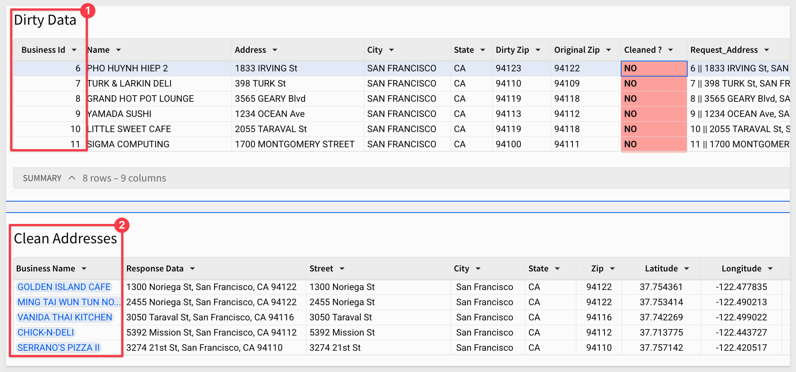

author: pballai
id: dataapps_calling_external_api_procedure
summary: dataapps_calling_external_api_procedure
categories: dataapps
environments: web
status: hidden
feedback link: https://github.com/sigmacomputing/sigmaquickstarts/issues
tags:
lastUpdated: 2024-02-01

# Integrate 3rd Party REST API via Stored Procedure

## Overview 
Duration: 5 

This QuickStart demonstrates how to use Sigma to clean and validate business addresses using Snowflake stored procedures and the Geocodio API. 

There are many address correction services available today. For this QuickStart, we will use [The Geocodio API](https://www.geocod.io) because it provides a free-tier, and provides straightforward and easy-to-use geocoding, reverse geocoding, and data matching for US and Canadian addresses.

### What we will cover:<br>
✅ Loading an intentionally "dirty" business address dataset into Snowflake<br>
✅ Using Sigma to display and interact with the dataset<br>
✅ Calling a Snowflake stored procedure from Sigma actions to clean a single row<br>
✅ Storing cleaned address data in a table<br>
✅ Displaying successfully cleaned addresses in Sigma<br>

### Some other assumptions
Our use case has some assumptions we want to mention (probably more than are listed too):

**1:** The "dirty" data is the result of some upstream ETL process and we have no control of its format; only access to the final table.

**2:** The Snowflake procedure will handle formatting the correct API request. 

**3:** The API response will be stored "as is" in a log table.

**4:** Sigma will handle formatting the API response into usable columns.

### Target Audience
Developers interested in using Sigma to build interactive data applications.

### Prerequisites

<ul>
  <li>A computer with a current browser. It does not matter which browser you want to use.</li>
  <li>Access to your Sigma environment.</li>
  <li>Some familiarity with Sigma is assumed. Not all steps will be shown as the basics are assumed to be understood.</li>
  <li>Access to a 3rd party REST API</li>
 </ul>

<aside class="postive">
<strong>IMPORTANT:</strong><br> Sigma recommends that you use non-production resources when doing QuickStarts.
</aside>

<button>[Sigma Free Trial](https://www.sigmacomputing.com/free-trial/)</button>
<aside class="positive">

<strong>IMPORTANT:</strong><br> Some screens in Sigma may appear slightly different from those shown in QuickStarts. This is because Sigma is continuously adding and enhancing functionality. Rest assured, Sigma’s intuitive interface ensures that any differences will not prevent you from successfully completing any QuickStart.
</aside>

For more information on Sigma's product release strategy, see [Sigma product releases.](https://help.sigmacomputing.com/docs/sigma-product-releases)
 


## Snowflake
Duration: 5

We need to create a few things in Snowflake to enable Snowflake to call an external API and store the response in a table. 

Before we start, it is important to understand that we will simplify this for demonstration. Snowflake has a few options to access external APIs in a more secure manner. 

For that level of detail, please see [External Functions.](https://docs.snowflake.com/en/sql-reference/external-functions)

Log into your Snowflake instance as `ACCOUNTADMIN` and create a new SQL worksheet.

### Load the "Dirty" Dataset in Snowflake, by running this script:
```code
-- Step 1: Create a database and schema for logging requests and responses
CREATE DATABASE IF NOT EXISTS SIGMA_QUICKSTARTS;
USE DATABASE SIGMA_QUICKSTARTS;
CREATE SCHEMA IF NOT EXISTS GEOCODIO_API;

// Create the "Dirty" address data
-- Step 1: Create a table for the dirty business addresses
CREATE OR REPLACE TABLE SIGMA_QUICKSTARTS.GEOCODIO_API.DIRTY_BUSINESS_ADDRESSES (
    BUSINESS_ID INT PRIMARY KEY,
    NAME STRING,
    ADDRESS STRING,
    CITY STRING,
    STATE STRING,
    DIRTY_ZIP STRING,
    ORIGINAL_ZIP STRING
);

INSERT INTO SIGMA_QUICKSTARTS.GEOCODIO_API.DIRTY_BUSINESS_ADDRESSES 
(BUSINESS_ID, NAME, ADDRESS, CITY, STATE, DIRTY_ZIP, ORIGINAL_ZIP)
VALUES
    (1, 'SERRANO''S PIZZA II', '3274 21st St', 'SAN FRANCISCO', 'CA', '94111', '94110'),
    (2, 'CHICK-N-DELI', '5392 MISSION St', 'SAN FRANCISCO', 'CA', '94113', '94112'),
    (3, 'VANIDA THAI KITCHEN', '3050 TARAVAL St', 'SAN FRANCISCO', 'CA', '94117', '94116'),
    (4, 'MING TAI WUN TUN NOODLE, INC.', '2455 NORIEGA St', 'SAN FRANCISCO', 'CA', '94123', '94122'),
    (5, 'GOLDEN ISLAND CAFE', '1300 NORIEGA St', 'SAN FRANCISCO', 'CA', '94123', '94122'),
    (6, 'PHO HUYNH HIEP 2', '1833 IRVING St', 'SAN FRANCISCO', 'CA', '94123', '94122'),
    (7, 'TURK & LARKIN DELI', '398 TURK St', 'SAN FRANCISCO', 'CA', '94110', '94109'),
    (8, 'GRAND HOT POT LOUNGE', '3565 GEARY Blvd', 'SAN FRANCISCO', 'CA', '94119', '94118'),
    (9, 'YAMADA SUSHI', '1234 OCEAN Ave', 'SAN FRANCISCO', 'CA', '94113', '94112'),
    (10, 'LITTLE SWEET CAFE', '2055 TARAVAL St', 'SAN FRANCISCO', 'CA', '94119', '94118'),
    (11, 'SIGMA COMPUTING', '1700 MONTGOMERY STREET', 'SAN FRANCISCO', 'CA', '94100', '94111');

-- Verify data insertion
SELECT * FROM SIGMA_QUICKSTARTS.GEOCODIO_API.DIRTY_BUSINESS_ADDRESSES;
```

Click the `Run All` option as shown below. The expected result is 11 rows of data inserted:


### Create a table, UDF and access rules to call the external API, by running this script:
We will be using a Snowflake User Defined Function (UDF) to call the Geocodio API. For more information on Snowflake UDFs see [Introduction to SQL UDFs.](https://docs.snowflake.com/en/developer-guide/udf/sql/udf-sql-introduction)

**IMPORTANT:**<br>
In order for this script to work, you must obtain a [API key from Geocodio.](https://dash.geocod.io/apikey/create) 

This is a simple process that takes only a few minutes. 

Once you have the API key, replace the text on line 42 (search for **"YOUR_API_KEY_HERE"**) of the script with your key.

Run the following script in a Snowflake SQL worksheet:
```code
-- Step 1: Set correct database
USE DATABASE SIGMA_QUICKSTARTS;
USE SCHEMA GEOCODIO_API;

-- Step 2: Create a table to store request and response pairs
CREATE OR REPLACE TABLE SIGMA_QUICKSTARTS.GEOCODIO_API.REQUEST_RESPONSE_LOG (
    id NUMBER AUTOINCREMENT PRIMARY KEY,
    request_timestamp TIMESTAMP DEFAULT CURRENT_TIMESTAMP,
    request_data STRING,   -- Original request address
    response_data STRING,  -- API response (formatted address)
    latitude FLOAT,        -- Latitude of the geocoded address
    longitude FLOAT,       -- Longitude of the geocoded address
    error_message STRING,  -- Error message if any
    business_id NUMBER    -- Business id from Dirty Data table
);

-- Grant access to the Geocodio API endpoint
CREATE OR REPLACE NETWORK RULE GEOCODIO_API_NETWORK_RULE
    MODE = EGRESS
    TYPE = HOST_PORT
    VALUE_LIST = ('api.geocod.io');

-- Create an integration using the network rule
CREATE OR REPLACE EXTERNAL ACCESS INTEGRATION GEOCODIO_EXTERNAL_ACCESS_INTEGRATION
    ALLOWED_NETWORK_RULES = (GEOCODIO_API_NETWORK_RULE)
    ENABLED = true;

-- Step 4: Create a UDF to Validate a Single Address
CREATE OR REPLACE FUNCTION GET_GEOCODE_ADDRESS(ADDRESS TEXT)
RETURNS STRING
LANGUAGE PYTHON
RUNTIME_VERSION = 3.8
HANDLER = 'get_geocode_address_handler'
EXTERNAL_ACCESS_INTEGRATIONS = (GEOCODIO_EXTERNAL_ACCESS_INTEGRATION)
PACKAGES = ('requests', 'simplejson')
AS
$$
import requests
import simplejson as json

def get_geocode_address_handler(ADDRESS):
    api_key = "YOUR_API_KEY_HERE"
    base_url = "https://api.geocod.io/v1.7/geocode"
    url = f"{base_url}?q={ADDRESS}&api_key={api_key}&format=json"
    session = requests.Session()
    response = session.get(url)
    if response.status_code != 200:
        raise Exception(f"Geocodio API error: {response.status_code} - {response.text}")
    return response.text
$$;

-- Test the UDF
SELECT GET_GEOCODE_ADDRESS('1700 Montgomery Street, San Francisco, CA, 94100');
```

The trailing `SELECT` statement tests the UDF by sending a hardcoded address (Sigma's west coast office) to make sure we get a response.

Looking at the response, we can see that we sent a ZIP code of 94100, but it was corrected to 94111 in the response, confirming that it is working:


We are not storing the data from the response just yet, but the table was created (REQUEST_RESPONSE_LOG table), and there are columns to store some additional information as well:


Before moving off this script, comment out the last line that tests the UDF. We don't want the UDF to run this test every time we call it:


`Run All` again to update the UDF.

### Create a PROCEDURE, by running this script:
```code
-- Step 1: Set correct database
USE DATABASE SIGMA_QUICKSTARTS;
USE SCHEMA GEOCODIO_API;

-- STEP 2: Create a stored procedure to call the UDF, parse the data and store the details in a log table
CREATE OR REPLACE PROCEDURE SIGMA_QUICKSTARTS.GEOCODIO_API.GEOCODIO_API_REQUEST_V2(INPUT TEXT)
RETURNS STRING
LANGUAGE JAVASCRIPT
EXECUTE AS OWNER
AS
$$
    var logQuery = `
        INSERT INTO SIGMA_QUICKSTARTS.GEOCODIO_API.REQUEST_RESPONSE_LOG
        (BUSINESS_ID, REQUEST_DATA, RESPONSE_DATA, LATITUDE, LONGITUDE, ERROR_MESSAGE, REQUEST_TIMESTAMP)
        VALUES (?, ?, ?, ?, ?, ?, CURRENT_TIMESTAMP)
    `;

    try {
        // 🔹 Extract Business ID and Address using '||' delimiter
        var parts = INPUT.split(" || ");
        var businessId = parts.length > 1 ? parts[0].trim() : null;
        var address = parts.length > 1 ? parts[1].trim() : INPUT; // Use full input if no delimiter found

        // 🔹 Ensure Business ID is numeric (prevent house number confusion)
        if (businessId && isNaN(businessId)) {
            throw new Error(`Invalid Business ID extracted: ${businessId}`);
        }

        // 🔹 Call the UDF with the extracted address (excluding Business ID)
        var udfQuery = `SELECT GET_GEOCODE_ADDRESS('${address}')`;
        var udfStatement = snowflake.createStatement({ sqlText: udfQuery });
        var udfResult = udfStatement.execute();
        udfResult.next();
        var rawResponseData = udfResult.getColumnValue(1);

        // 🔹 Initialize variables for geocoding data
        var formattedAddress = null;
        var lat = null;
        var lng = null;

        // 🔹 Parse the Geocodio response
        try {
            var responseJson = JSON.parse(rawResponseData);
            if (responseJson.results && responseJson.results.length > 0) {
                var firstResult = responseJson.results[0];
                formattedAddress = firstResult.formatted_address || "No address found";
                lat = firstResult.location?.lat || null;
                lng = firstResult.location?.lng || null;
            } else {
                formattedAddress = "No address found";
            }
        } catch (jsonError) {
            throw new Error(`Failed to parse JSON response: ${jsonError.message}`);
        }

        // 🔹 Log request, response, and geocoding data **with Business ID**
        var logStatement = snowflake.createStatement({
            sqlText: logQuery,
            binds: [businessId, address, formattedAddress, lat, lng, null]
        });
        logStatement.execute();

        return formattedAddress || "No address found";

    } catch (err) {
        var errorLogStatement = snowflake.createStatement({
            sqlText: logQuery,
            binds: [null, INPUT, null, null, null, err.message]
        });
        errorLogStatement.execute();

        throw new Error(`Error: ${err.message}`);
    }
$$;

-- Step 3: Test the procedure
CALL SIGMA_QUICKSTARTS.GEOCODIO_API.GEOCODIO_API_REQUEST_V2('1700 Montgomery Street, San Francisco, CA, 94100');

-- Step 4: Check the Log
SELECT * FROM SIGMA_QUICKSTARTS.GEOCODIO_API.REQUEST_RESPONSE_LOG; 
```

The trailing `SELECT` statement should return one row of data from the `REQUEST_RESPONSE_LOG` table:


<aside class="positive">
<strong>IMPORTANT:</strong><br> We also enriched the data by calling an API endpoint that also returns geo-coordinates for this address. This is a simple demonstration of how any data can be made even more useful using this workflow. With a Sigma data app, we will be able to trigger and visualize the results easily.
</aside>

Before moving off this script, comment out the lines that tests and check the log. We don't want the UDF to run these every time we run it:


`Run All` again to update the procedure.

At this point we have everything we need in Snowflake and can move over to Sigma:


<!-- END OF SECTION-->


## Sigma Workbook
Duration: 5

Log into Sigma as `Administrator` and create a new workbook.

We assume that a connection to the Snowflake instance where all the objects we created already exists in Sigma. 

Creating a connection to Snowflake in Sigma is simple, but if you have not done that, see [Connect to Snowflake](https://help.sigmacomputing.com/docs/connect-to-snowflake). We will require "write" access so that we can use Sigma input tables.

Create a new `Workbook` and add a `Data` > `Table` from the `Element bar`:


Click `Select source` and navigate to select the `DIRTY_BUSINESS_ADDRESSES` table that is in the database `SIGMA_QUICKSTARTS` and schema `GEOCODIO_API`.

The table should look like this:


Rename the table to `Dirty Data`.

In the `GEOCODIO_API` database is not visible in the connection yet click to `sync` it as shown:


<aside class="negative">
<strong>NOTE:</strong><br> We have two zip code columns so we can show what the real value is supposed to be. The "Dirty Zip" is intentionally incorrect. "Original Zip" is the correct value.
</aside>

When we "clean" an address, we would expect the revision to match the `Original Zip` value.

Add another table to the page, this time selecting `REQUEST_RESPONSE_LOG` from the same database/schema as before:


Rename the second table to `Clean Addresses`.

Add a new column to the `Dirty Data` table, rename it to `Cleaned ?` and set the formula to:
```code
If(IsNotNull(Lookup([Clean Addresses/Business Id], [Business Id], [Clean Addresses/Business Id])), "YES", "NO")
```

Add some conditional formatting on the `Cleaned ?` column to show which rows need attention.

The rules are the same, except one tests for `NO` and the other for `YES`:


Now, when the row is "cleaned", the cell will turn green with the text changing dynamically to `YES` by the formula applied to the `Cleaned ?` column.

### Prepare data for API request
The Geocodio API endpoint we are using is expecting a single comma-separated string. 

The `Dirty Data` that was provided to us has each part of the address in individual columns, so we need to combine them, before sending the API request. This is simple to do.

Add a new column to the `Dirty Data` table, rename it to `Request_Address` and set the formula to:
```code
Text([Business Id]) & " || " & [Address] & ", " & [City] & ", " & [State] & ", " & [Dirty Zip]
```

The combined rows look like this now:


We will reference this column when we call the Snowflake procedure.

<aside class="negative">
<strong>NOTE:</strong><br> We prepended the address string with the Business_Id. This is not required by the API, but we will make use of it later.
</aside>

Save the workbook as `3rd Party API QuickStart`


<!-- END OF SECTION-->


## Actions
Duration: 5

Select the `Dirty Data` table, open the `Actions` menu in the `Element panel` and click the `+` to add add a new action sequence:


Configure an action as:


Add another action to refresh the `Clean Addresses` table:


Add one more action to refresh the `Dirty Data` table:


Click the `NO` in the first row of the `Dirty Data` table. The action will fire and the `Clean Addresses` table will update with the API's response:


### Add business name
You may have noticed that we are getting the `Business Id` but not the business name in the `Clean Addresses` table.

We can fix that by fetching it via lookup, but since we already have one lookup in the opposite direction (created earlier) we have to find another way. 

<aside class="positive">
<strong>IMPORTANT:</strong><br> Fortunately, the way Sigma optimizes how it interacts with the cloud data warehouse, we can make a copy of an existing table and do the lookup against that, without incurring any additional costs from the warehouse. 
</aside>

For a deeper dive on how Sigma is optimized for the modern cloud data warehouse, see [Sigma's Query Engine](https://quickstarts.sigmacomputing.com/guide/developers_sigma_calculations/index.html?index=..%2F..index#0)

Add another new table to the page by adding a new table, again using the `DIRTY_BUSINESS_ADDRESSES` as the source. Rename the table to `DIRTY_BUSINESS_ADDRESSES 2`.

Now we can add a lookup to the `Clean Addresses` table:


Configure the lookup as:


Now we have the correct `Name` for the the first row (after sorting on `Request Timestamp`)


<!-- END OF SECTION-->

## Final Cleanup
Duration: 5

Since we already proved out the use case, the following is really just for completeness.

The `Response Data` column in the `Clean Addresses` table is storing the address in one string, separated by comma. We could go back and update the procedure to parse the data before writing it to table. Instead, lets use Sigma to break it up into three columns.

Add columns for `Street`, `City`, `State` and `Zip`. Here are the formulas for each, using the [SplitPart function.](https://help.sigmacomputing.com/docs/splitpart)

**Street:**
```code
SplitPart([Response Data], ",", 1)
```

**City:**
```code
SplitPart([Response Data], ",", 2)
```

**State:**
```code
SplitPart(Trim(SplitPart([Response Data], ",", 3)), " ", 1)
```

**Zip:**
```code
SplitPart(Trim(SplitPart([Response Data], ",", 3)), " ", 2)
```

After filtering out that original test record (that had null for `Business Id`) and hiding some more columns. We do this by setting the filter to `Exclude` nulls.

This leaves us with:


Also notice that the `Zip` matches the `Original Zip` column, so we know that it has been cleaned by the API.

We also may want to filter the `Dirty Data` table so that it only displays rows that have a `Cleaned ?` value of `NO`. In this way, users could "work the table down" until all records are gone, meaning all addresses have been cleaned.

After cleaning out the `REQUEST_RESPONSE_LOG` table in Snowflake, we "worked down" a few rows to make sure it was working as expected:




<!-- END OF SECTION-->

## Possible Enhancements
This could use some more work to enhance further; for example, here are some ideas to consider:

**1:** Add the option to clean addresses in bulk.

**2:** Display a modal on selection to allow the user to review the cleaned address and accept/reject/edit it.

**3:** Allow users to make manual corrections using an input table.

**4:** Error handling.

**5:** Take advantage of the geo-coordinates from the API to map the addresses. So easy in Sigma:


<!-- END OF SECTION-->

## What we've covered
Duration: 5

In this QuickStart, we demonstrated how to use Sigma to clean and validate business addresses using Snowflake stored procedures and the Geocodio API.

**Additional Resource Links**

[Blog](https://www.sigmacomputing.com/blog/)<br>
[Community](https://community.sigmacomputing.com/)<br>
[Help Center](https://help.sigmacomputing.com/hc/en-us)<br>
[QuickStarts](https://quickstarts.sigmacomputing.com/)<br>

Be sure to check out all the latest developments at [Sigma's First Friday Feature page!](https://quickstarts.sigmacomputing.com/firstfridayfeatures/)
<br>

[](https://twitter.com/sigmacomputing)&emsp;
[](https://www.linkedin.com/company/sigmacomputing)&emsp;
[](https://www.facebook.com/sigmacomputing)


<!-- END OF WHAT WE COVERED -->
<!-- END OF QUICKSTART -->
