7author: pballai
id: dataapps_pivot_spreading
summary: dataapps_pivot_spreading
categories: dataapps
environments: web
status: Published
feedback link: https://github.com/sigmacomputing/sigmaquickstarts/issues
tags: Default
lastUpdated: 2025-01-06

# Pivot Spreading

## Overview 
Duration: 5 

Pivot table spreading refers to the ability to adjust aggregate values in a pivot table and redistribute those changes dynamically across the underlying dataset. This enables users to make targeted adjustments directly in the pivot table interface and have those changes reflected in the source data.

<aside class="positive">
<strong>PLEASE READ:</strong><br> Sigma data apps are rapidly evolving, with new features being added regularly. If your Sigma instance does not have the specific feature shown (or if the UI has changed), please contact Sigma support for assistance in accessing the feature.
</aside>

[How to contact Sigma support](https://help.sigmacomputing.com/docs/sigma-support)

### Use Cases in Business Applications
Pivot table spreading has versatile applications across industries, such as:

- **Financial Planning & Budgeting:**<br>
Adjusting department budgets or quarterly forecasts while redistributing the impact across expense categories or time periods.

- **Sales & Revenue Management:**<br>
Revising monthly sales targets for a region and allocating changes to individual products or sales teams.

- **Inventory Management:**<br>
Correcting total inventory counts for a warehouse and spreading adjustments across SKUs or suppliers.

- **Marketing Campaign Allocation:**<br>
Adjusting the total budget for a campaign and redistributing funds across channels or geographic regions.

- **Resource Allocation:**<br>
Balancing labor hours, machine usage, or other resources within operational constraints.

### Potential Advantages
- **Granular Control:**<br>
Enables detailed adjustments while preserving the integrity of aggregated data.

- **Actionable Analytics:**<br>
Transforms static reports into interactive tools for operational decision-making.

- **Time Savings:**<br>
Eliminates manual recalculations by automating data redistribution.

- **Transparency:**<br>
Logs and tracks changes for auditing or collaboration.

### Challenges to Consider
As will all technology implementations, there are a few considerations, some of which are listed below:

- **Complex Data Models:**<br>
Spreading requires a clear definition of the relationships between aggregate values and underlying rows.

- **Performance:**<br>
Redistributing adjustments across large datasets in real-time can be computationally intensive.

- **User Training:**<br>
Business users may need guidance to understand the methods and implications of their adjustments.

### In this QuickStart
Here is a short summary of the workflow that we will create in this QuickStart.

**1: User Interaction:**   
A user selects a cell in a pivot table representing a specific aggregate (e.g., total revenue for a product line in January 2020).
    
The user selects a specific value to adjust, using one of three methods:
- Adjust: Increment or decrement the total by a specific value.
- Change: Replace the total with a new value.
- Scale: Apply a percentage increase or decrease.

**2: Data Redistribution:**
- The system identifies the underlying rows contributing to the selected cell's total.

- The adjustment is distributed proportionally or uniformly across those rows, based on the spreading method.

**3: Stored Procedure Execution:**
A Snowflake stored procedure applies the adjustments to the relevant rows in a staging table, ensuring consistency.

**4: Real-time Updates:**
The changes are reflected in the pivot table, along with the previous values, allowing users to see the impact of their adjustments immediately.

**4: Logging of Adjustments:**
As each user records an adjustment, a record of that transaction is written to a log table. 

### Target Audience
Developers interested in using Sigma to build interactive data applications.

### Prerequisites

<ul>
  <li>A computer with a current browser. It does not matter which browser you want to use.</li>
  <li>Access to your Sigma environment.</li>
  <li>Administrative access to a Snowflake account.</li>
  <li>Some familiarity with Sigma is assumed. Not all steps will be shown as the basics are assumed to be understood.</li>
 </ul>

<aside class="postive">
<strong>IMPORTANT:</strong><br> Sigma recommends that you use non-production resources when doing QuickStarts.
</aside>

<button>[Sigma Free Trial](https://www.sigmacomputing.com/free-trial/)</button>

<button>[Snowflake Free Trial](https://trial.snowflake.com](https://trial.snowflake.com))</button>

<aside class="positive">
<strong>IMPORTANT:</strong><br> Some screens in Sigma may appear slightly different from those shown in QuickStarts. This is because Sigma is continuously adding and enhancing functionality. Rest assured, Sigma’s intuitive interface ensures that any differences will not prevent you from successfully completing any QuickStart.
</aside>

For more information on Sigma's product release strategy, see [Sigma product releases.](https://help.sigmacomputing.com/docs/sigma-product-releases)
   


## Workbook and Data Page
Duration: 5

In most QuickStarts we are able to use sample data provided to all Sigma customers directly. 

However, in this demonstration, it is important that the data we use to drive our work (henceforth known as the `BASE_DATA`) exists in the Snowflake account you are working in. This ensures that we can execute table operations using a stored procedure, which we will discuss later.

We have provided this data in **AWS S3** so that loading it into Snowflake is straightforward.

### Loading Base_Table in Snowflake
Log into Snowflake as `ACCOUNTADMIN` and run the following script. There are inline comments so to explain the operations.
```code
-- Creates the database `SIGMA_QUICKSTARTS` if it does not already exist.
CREATE DATABASE IF NOT EXISTS SIGMA_QUICKSTARTS;

-- Creates the schema `PIVOT_SPREADING` under the `SIGMA_QUICKSTARTS` database if it does not already exist.
CREATE SCHEMA IF NOT EXISTS SIGMA_QUICKSTARTS.PIVOT_SPREADING;

CREATE OR REPLACE TABLE base_table (
    "brand" STRING,              -- Brand of the product.
    "product_family" STRING,     -- Family of the product.
    "product_type" STRING,       -- Type of product (e.g., category).
    "product_line" STRING,       -- Specific product line.
    "product_name" STRING,       -- Name of the product.
    "order_number" STRING,       -- Unique identifier for each order.
    "sku_number" STRING,         -- Identifier for the product or item in the transaction.
    "quantity" INT,              -- Quantity sold or ordered.
    "price" FLOAT,               -- Price of the product.
    "revenue" FLOAT,             -- Revenue generated for the transaction.
    "date" DATE,                  -- Date of the transaction (specific day).
    "row_count" INT
);

-- Creates the table `BASE_TABLE` within the `PIVOT_SPREADING` schema if it does not already exist.
COPY INTO BASE_TABLE
FROM 's3://sigma-quickstarts-main/csv/Base_Table.csv'
FILE_FORMAT = (TYPE = 'CSV' FIELD_OPTIONALLY_ENCLOSED_BY = '"' SKIP_HEADER = 1);

-- Creates the table `SPREAD_UPDATE` within the `PIVOT_SPREADING` schema if it does not already exist.
-- This table will store data such as order information, hierarchical keys, and revenue for adjustments.
CREATE OR REPLACE TABLE SIGMA_QUICKSTARTS.PIVOT_SPREADING.SPREAD_UPDATE (
    "order_number" STRING,
    "date" DATE,
    "sku_number" STRING,
    "revenue" FLOAT,
    "l1_key" STRING,
    "l2_key" STRING,
    "l3_key" STRING
);

-- Populate SPREAD_UPDATE table with deduplicated data
INSERT INTO SIGMA_QUICKSTARTS.PIVOT_SPREADING.SPREAD_UPDATE (
    "order_number",
    "date",
    "sku_number",
    "l1_key",
    "l2_key",
    "l3_key",
    "revenue"
)
SELECT
    "order_number",
    "date",
    "sku_number",
    MD5("product_type" || TO_CHAR("date", 'YYYY-MM-DD HH24:MI:SS')) AS "l1_key",
    MD5("product_type" || "product_family" || TO_CHAR("date", 'YYYY-MM-DD HH24:MI:SS')) AS "l2_key",
    MD5("product_type" || "product_family" || "product_line" || TO_CHAR("date", 'YYYY-MM-DD HH24:MI:SS')) AS "l3_key",
    "revenue"
FROM
    SIGMA_QUICKSTARTS.PIVOT_SPREADING.base_table;

-- Creates the table `SQL_LOG` within the `PIVOT_SPREADING` schema if it does not already exist. 
-- This table will hold a record of changes and can aid troubleshooting.
create or replace TABLE SIGMA_QUICKSTARTS.PIVOT_SPREADING.SQL_LOG (
	UUID VARCHAR(16777216),
	SQL_TEXT VARCHAR(16777216),
	SQL_TS TIMESTAMP_NTZ(9),
	LOG_DATA VARCHAR
);

-- Retrieves and displays all rows from the `SPREAD_UPDATE` table for verification.
Select * From BASE_TABLE;
```

Upon successful completion, three new tables are created. The `Base_Table` and `Spread_Update` have data, but SQL_LOG is empty.

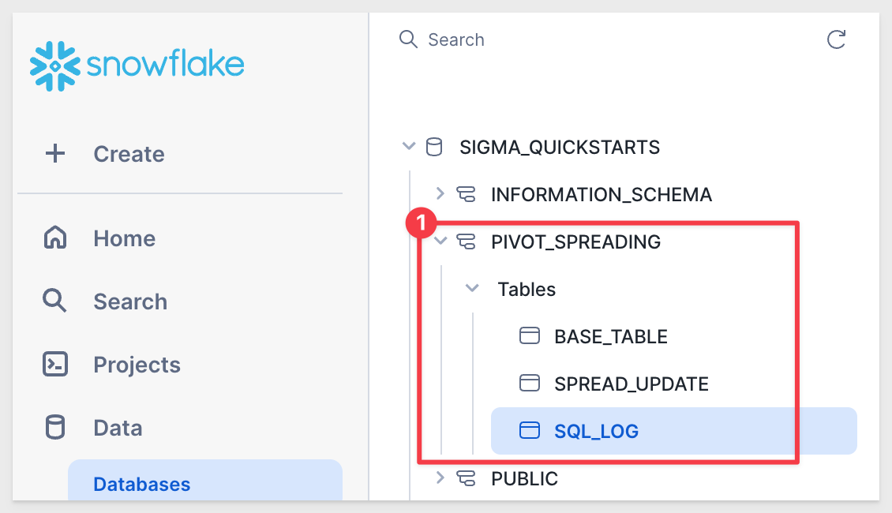

### Base_Table in Sigma
In Sigma, create a new workbook and add a new table to a page, using the `Base_Table` from the `SIGMA_QUICKSTARTS` database and  the `PIVOT_SPREADING` schema. 

<aside class="negative">
<strong>NOTE:</strong><br> We assume that a connection to your Snowflake instance has already been setup in Sigma.
</aside>

Rename the page to `Data`:

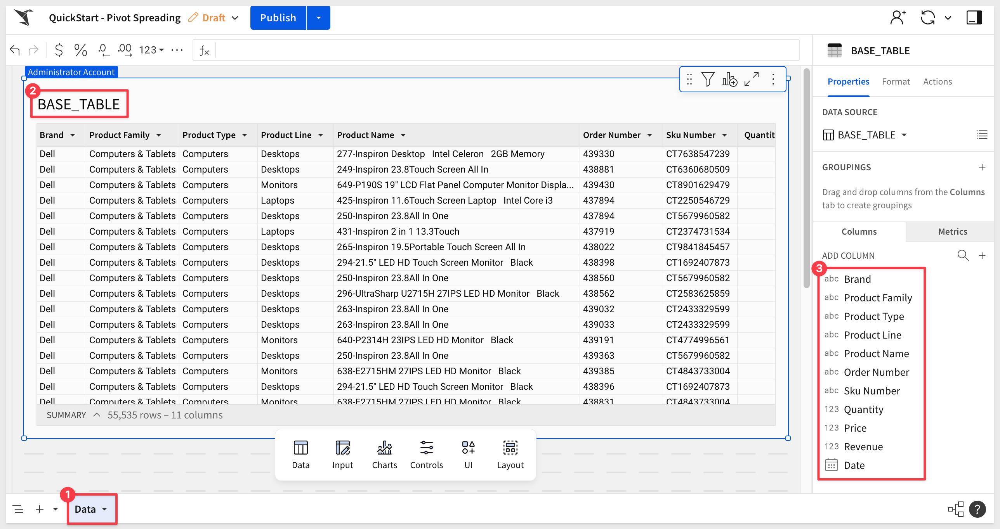

Group the table as shown in the screenshot below:

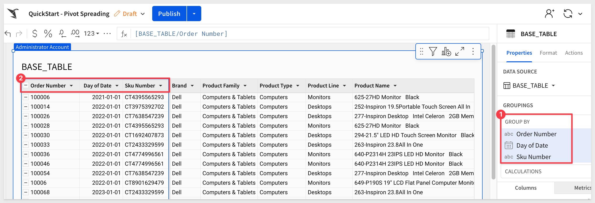

Set the `Price` and `Revenue` columns to currency

Add a new column and set it's formula to:
```code
DateTrunc("year", [Date])
```

Rename the column to `Year`.

Add a new column and set it's formula to:
```code
RowNumber()
```


Add three more columns after the `RowNumber` column, rename and apply the following formuala to each one:
```code
Column Name:    Formula:
l1_key	        MD5([Product Type] & Text([Year]))
l2_key	        MD5([Product Type] & [Product Family] & Text([Year]))
l3_key	        MD5([Product Type] & [Product Family] & [Product Line] & Text([Year]))
```

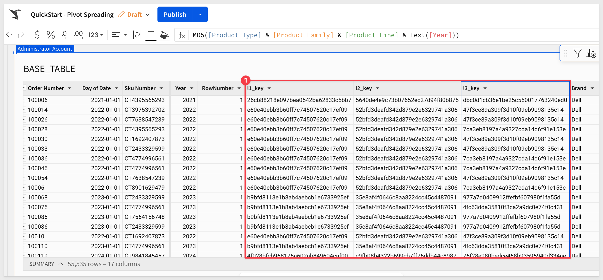

These three columns each is a hashed representation of a combination of product attributes and the year. Hashing (MD5) ensures that the keys are compact, unique, and suitable for efficient lookups.

These keys represent different levels of granularity in the data:

- l1_key: Represents the highest level, combining Product Type and Year.
- l2_key: Adds Product Family to provide more specificity within the same Product Type and Year.
- l3_key: Adds Product Line for the most detailed level, capturing Product Type, Product Family, Product Line, and Year.

This allows the stored procedure to apply changes only to rows associated with the selected grouping.

We will use these later in a store procedure to determine how we make spreading adjustments. 

Click `Publish`.


<!-- END OF SECTION-->

## Create Pivot Table
Duration: 5

Add a new page and rename it to `Pivot`. 

Add a new pivot table to the page and set it's source to the `BASE_TABLE` table on the `Data` page.

Configure the pivot as shown in the screenshot below:

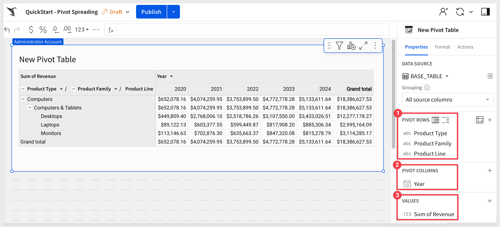

Rename the pivot table to `Revenue Planning`.

Our pivot is done for the moment. We need to prepare additional data in Snowflake to support spreading operations.


<!-- END OF SECTION-->

## Spread Update Table
Duration: 5

In order to make this work, we will use another table that we have arbitrarily named `Spread_Update`. You may have noticed this table was created when we ran the Snowflake script to load the `BASE_TABLE` data from S3. 

### Add to Sigma page
Add it to the `Pivot` page under the `Revenue Planning` table:

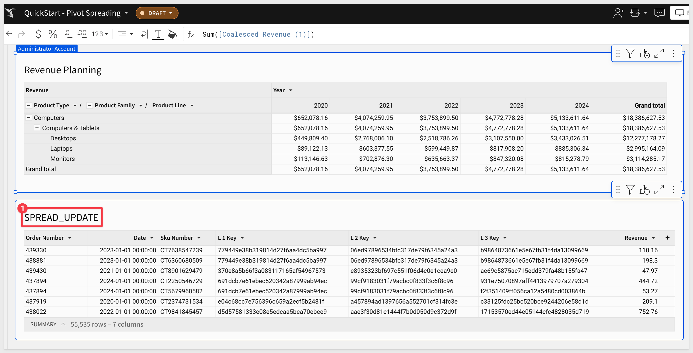

With this table added to the workbook, we can now reference it's columns in the `Revenue Planning` table.

### Add more columns to Revenue Planning

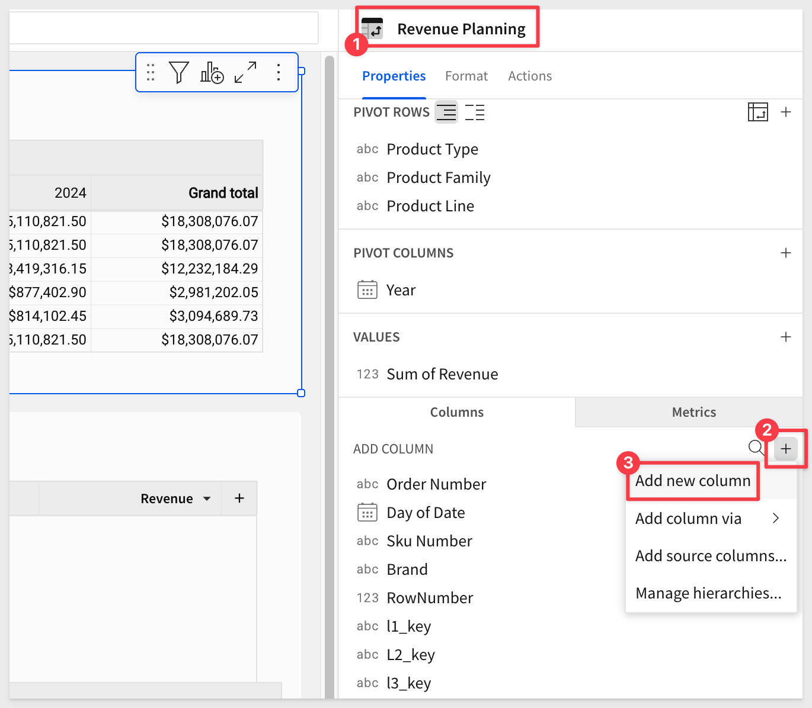

Add a new column set the formula to:
```code
Lookup([SPREAD_UPDATE/Revenue], [Order Number], [SPREAD_UPDATE/Order Number], [Date], [SPREAD_UPDATE/Date], [Sku Number], [SPREAD_UPDATE/Sku Number])
```

This formula performs a lookup operation, retrieving the value of `SPREAD_UPDATE > Revenue` from the `SPREAD_UPDATE` table based on a match between the specified columns in the current table and the corresponding columns in the `SPREAD_UPDATE` table.

Add another new column and rename it to `Coalesced Revenue`. Set the formula to:
```code
Coalesce([Revenue (SPREAD_UPDATE)], [Revenue])
```

This formula will display the `SPREAD_UPDATE` value where it exists, and fallback to the base `Revenue` value otherwise. Since we don't yet have any data in `SPREAD_UPDATE`, the existing `Revenue` value will be used.

Drag the `Coalesced Revenue` column to the `VALUES` grouping and rename it back to `Coalesced Revenue`.

The page now looks like this, including a little bit of text and currency format adjustments:

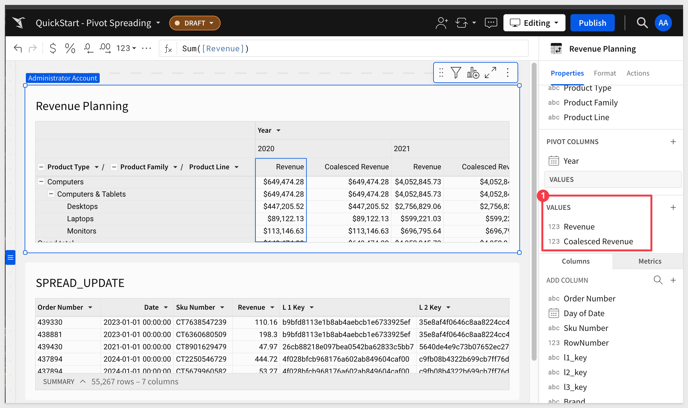

Click `Publish`.

### About Spread_Update
The `Spread_Update` table plays a central role in the pivot table spreading functionality, as it is the target for all updates made by the soon to be created stored procedure. It's primary role is to:

Act as a Data Adjustment Target:
- This table holds the rows that will be updated during the spread process.
- Adjustments made in the pivot table are applied to this table, modifying the relevant rows based on the selected `KEY` and `LEVEL` values passed.

Act as an Intermediate Layer:
- It acts as a bridge between the source data (BASE_TABLE) and the final output.
- Rows from the `BASE_TABLE` are merged into the `SPREAD_UPDATE` table if they don’t already exist, ensuring that all necessary data is available for spreading.

Efficiency:
- By focusing updates on a single table, the stored procedure ensures that adjustments are localized outside of the orginal source data.

The SPREAD_UPDATE table includes the following columns (based on the stored procedure):

<table>
    <thead>
        <tr>
            <th>Column</th>
            <th>Description</th>
        </tr>
    </thead>
    <tbody>
        <tr>
            <td>date</td>
            <td>The date associated with the transaction or data row.</td>
        </tr>
                <tr>
            <td>l_1_key</td>
            <td>Hierarchical key representing the highest level of aggregation.</td>
        </tr>
               <tr>
            <td>l_2_key</td>
            <td>Hierarchical key for a more specific grouping.</td>
        </tr>
               <tr>
            <td>l_3_key</td>
            <td>Hierarchical key for the most granular level.</td>
        </tr>
                <tr>
            <td>order_number</td>
            <td>Unique identifier for each order.</td>
        </tr>
            <tr>
            <td>revenue</td>
            <td>The revenue value for the specific row, which will be adjusted.</td>
                </tr>
        <tr>
            <td>sku_number</td>
            <td>Identifier for the product or item in the transaction.</td>
                </tr>
    </tbody>
</table>


<!-- END OF SECTION-->

## Controls
Duration: 5

We want to add some actions in Sigma to allow users to perform adjustments. However, we need to configure a page (modal window) that will both display the selected values and allow a user to configure their desired adjustment. 

In Sigma, click on the `Revenue Planning` pivot table and select `Actions` from the menu. Choose the `Coalesced Revenue` column, `Open model` and `New modal`:

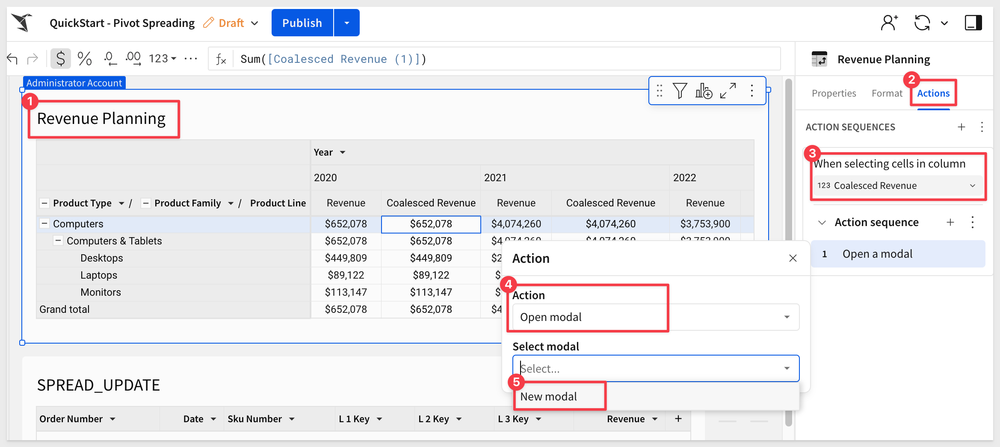

This creates a new `hidden` page called `Modal 1`. The page is hidden as we only want it to show up when a user clicks something that requests it.

Rename the page to `Adjustments` and the title from `New Modal` to `Adjustments`.

For the purposes of this demonstration, this modal will allow the user to adjust the selected `Coalesced Revenue` from the pivot table, choosing from three different methods. It will also display information about which selections have been made.

<aside class="positive">
<strong>IMPORTANT:</strong><br> Im production, it may not be desirable to show the additional details we will configure for display. We do so now for clarity only.
</aside>

### Adding the Controls

### Selected values display
We will use a Sigma input controls to capture user selected values and to refer to these values when we call the stored procedure.

<aside class="positive">
<strong>IMPORTANT:</strong><br> Pay close attention to the type of control required, the "Data format" and also the "Control ID" values. It is a good practice to use a common naming convention for control id's. In the demonstration, we will prepend the control id with a "p_" to indicate the control is on the Pivot page.
</aside>

Add the following controls to the `Adjustments` modal:

#### 1: Current revenue value selected (p_current):
Add `Number input` control and set the `Control ID` to `p_current`. Also set the `Data format` to `Currency`.

#### 2: Level selected (p_level):
Add `number input` control and set the `Control ID` to `p_level`. Also set the `Data format` to `Automatic`.

#### 3: Key corresponding to the level selected (p_key):
Add `text input` control and set the `Control ID` to `p_key`. Also set the `Operator` to `Equal to`.

#### 4: Selected product type (p_type):
Add `text input` control and set the `Control ID` to `p_type`. Also set the `Operator` to `Equal to`.

#### 5: Selected product family (p_family):
Add `text input` control and set the `Control ID` to `p_family`. Also set the `Operator` to `Equal to`.

#### 6: Selected product line (p_line):
Add `text input` control and set the `Control ID` to `p_line`. Also set the `Operator` to `Equal to`.

#### 7: Selected year (p_year):
Add `Date input` control and set the `Control ID` to `p_year`.

To save some actions later, place all these controls in a container. Simply left-click/hold and drag a mouse window around them and click the container icon.

While not required, we applied a little styling to the container and renamed it to `Selected_Values`. We also added a `UI` > `Text` label to it:

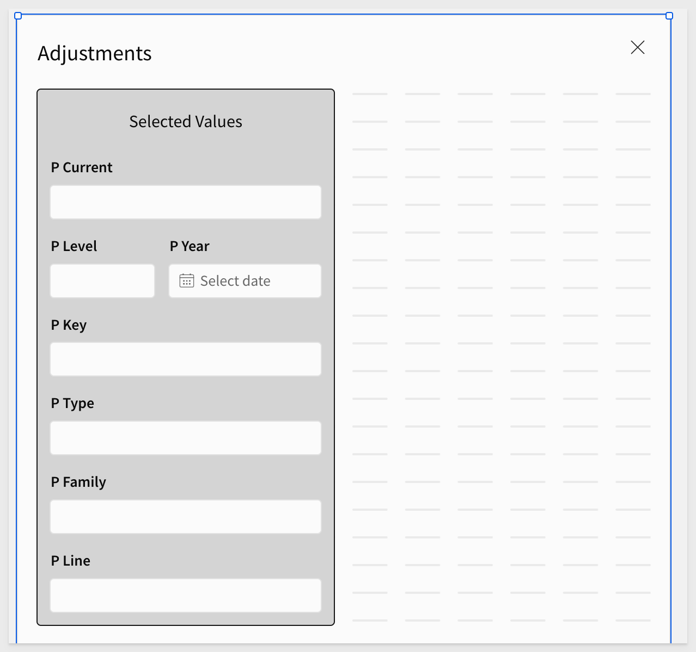

<aside class="negative">
<strong>NOTE:</strong><br> We won't spend any time on styling, as Sigma is highly flexible, allowing users to design an interface that works best for their organization.
</aside>

### Adjustment values selection
Now lets add a few more controls (outside the `Selected Values` container) to allow the user to enter a value for the adjustment and select a method from three options. 

#### 1: Adjustment value desired (p_adjustment):
Add `Number input` control and set the `Control ID` to `p_adjustment`. Also set the `Data format` to `Number`.

#### 2: Adjustment method desired (Method):
Add `Segmented` control and set the `Control ID` to `Method`. Configure the `Create manual list` as shown in the screenshot below:

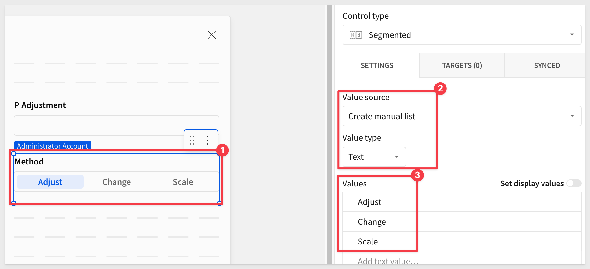

#### 3: Value of the adjustment:
Add `UI` > `Text` element and set its formula to:
```code
If(IsNull([Method]) OR IsNull([p_current]) OR IsNull([p_adjustment]), 
   0, 
   Switch([Method], 
          "Adjust", [p_current] + [p_adjustment], 
          "Change", [p_adjustment], 
          "Scale", [p_current] * (1 + [p_adjustment] / 100),
          0))
```

This formula dynamically calculates a new value based on the selected adjustment method:

- Adjust: Adds or subtracts P Adjustment directly from P Current.
- Scale: Adjusts by percentage the value supplied in P Adjustment.
- Change: Replaces the value with the value for P Adjustment.
- If the required values are not set, it will return zero.

After some fiddling with the UI, and placing the adjustment items in a container called `Desired Adjustment`, the section now looks like this:

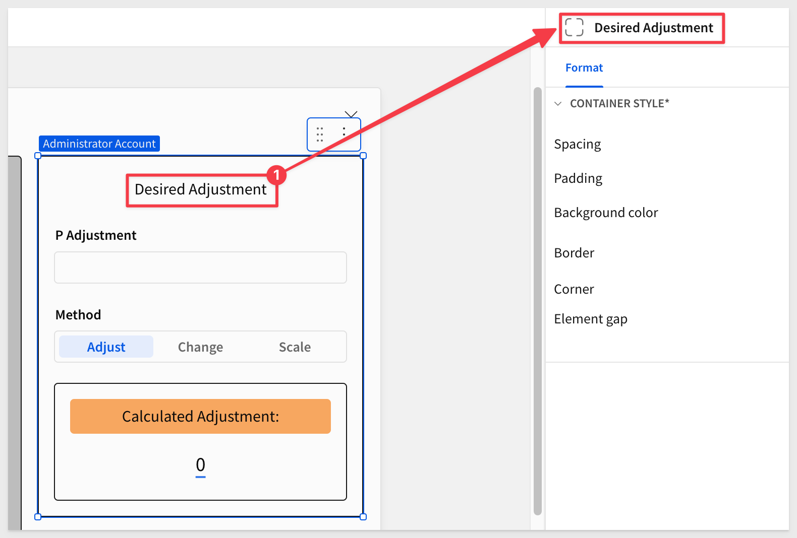


<!-- END OF SECTION-->

## Actions
Duration: 5

With our modal configured we can now setup actions to leverage the controls on that page. 

Return to the `Pivot` page, select the `Revenue Planning` pivot table and click on it's `Actions`.

We have one action configured so far that opens the modal when a user clicks on a `Coalesced Revenue` cell. You can test that now to see it work. 

We can now add more actions to clear the modal's controls and pass values to it, based on the user click.

### Clear the containers (2) of previous values
For our second action, click the `+` and configure a `Clear control` action, targeting a `Container` and the `Selected_Values` container. 

Repeat the process (this time using the lower `+` icon) and create the same action for the `Desired Adjustments` container:

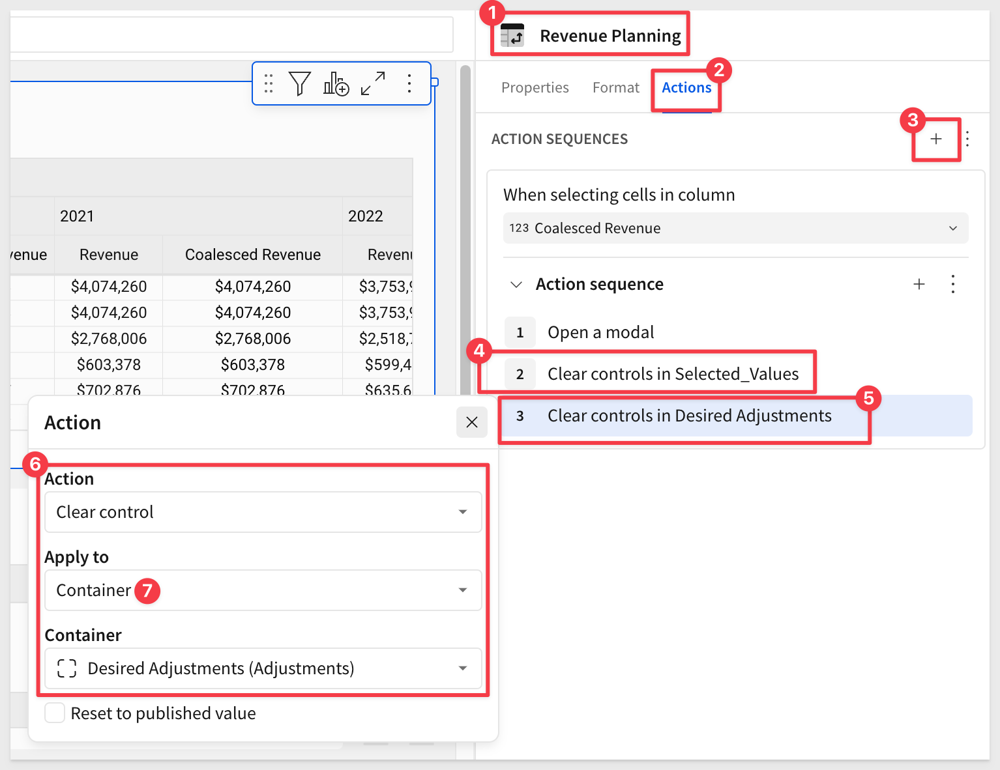

### Set actions for three product levels
Configure three `Set control value` actions for product `type`, `family` and `line`:

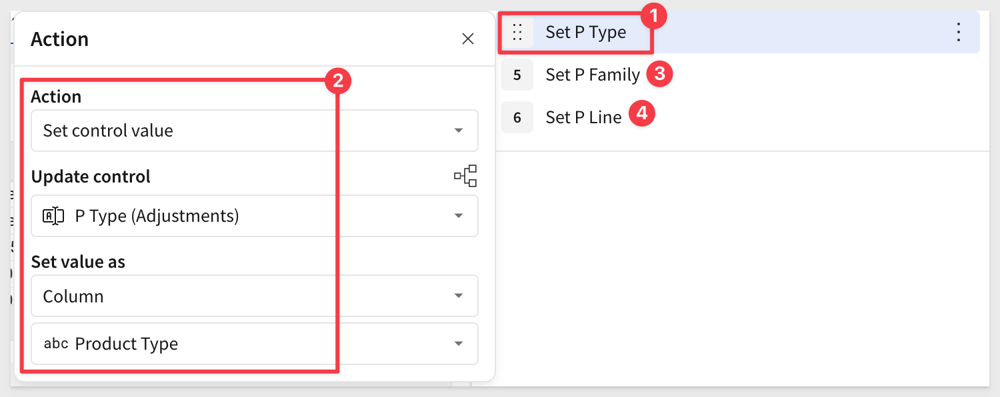

### Configure action for selected level
In this next `Set control value` action, we will use a formula to determine the value of the product level selected:

Here is the formula to be used, as shown in the screenshot below:
```code
If(IsNotNull([p_line]), 3, IsNotNull([p_family]), 2, IsNotNull([p_type]), 1)
```

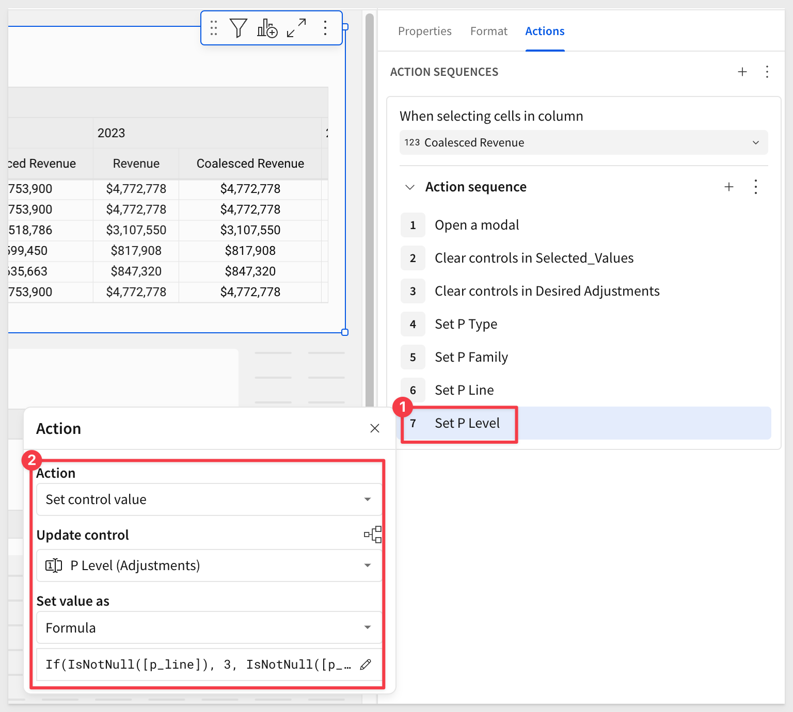

### Set selected year
You know what to do now...

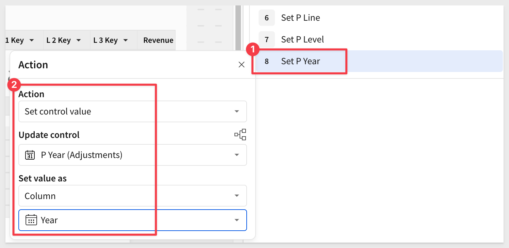

### Set the key value selected
Configure another `Set control value` action to update the `P Key` control, using this formula:
```code
Switch([p_level], 3, MD5([p_type] & [p_family] & [p_line] & Text([p_year])), 2, MD5([p_type] & [p_family] & Text([p_year])), 1, MD5([p_type] & Text([p_year])))
```

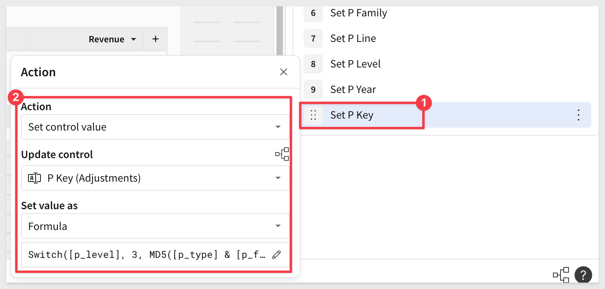

### Set the current value selected
Configure another `Set control value` action to update the `P Current` control, using this formula:
```code
Lookup(Sum([Revenue Planning/Coalesced Revenue (1)]), [p_key], Switch([p_level], 3, [Revenue Planning/l3_key], 2, [Revenue Planning/l2_key], 1, [Revenue Planning/l1_key]))
```

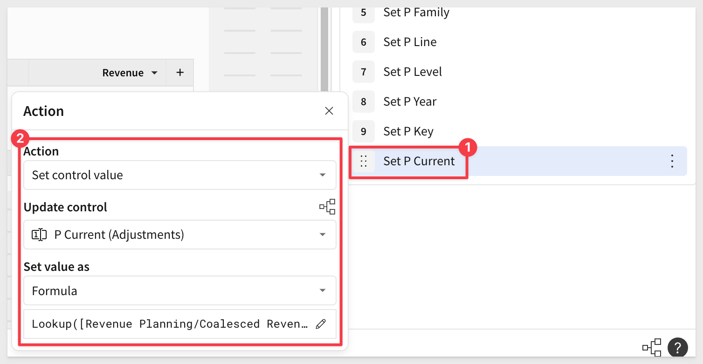

Now drag the `Open a modal` action to the last position:

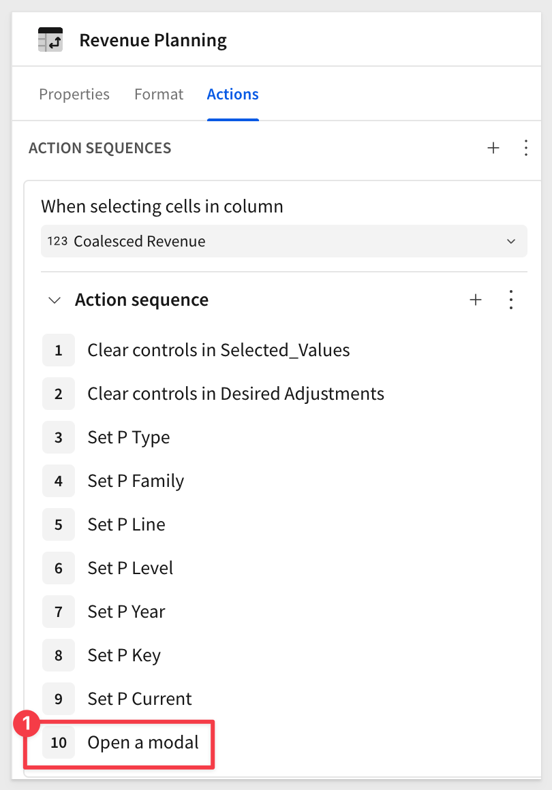

Click `Publish`.

### Give it a quick test
Click on any `Coalesed Revenue` value, noting the product details, value and year. These values should appear in the modal as expected. For example, if the value selected below is clicked:

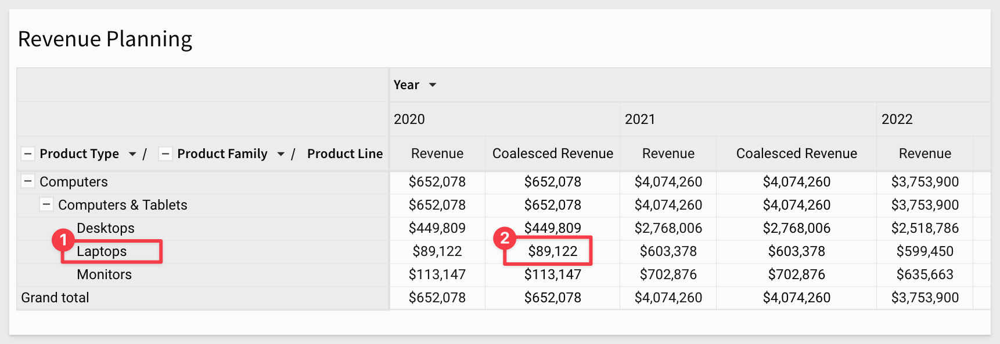

We can see those values appear in the modal as expected. We also can enter a value in `P Adjustment` and click the `Change` method to see the desired value appear too: 

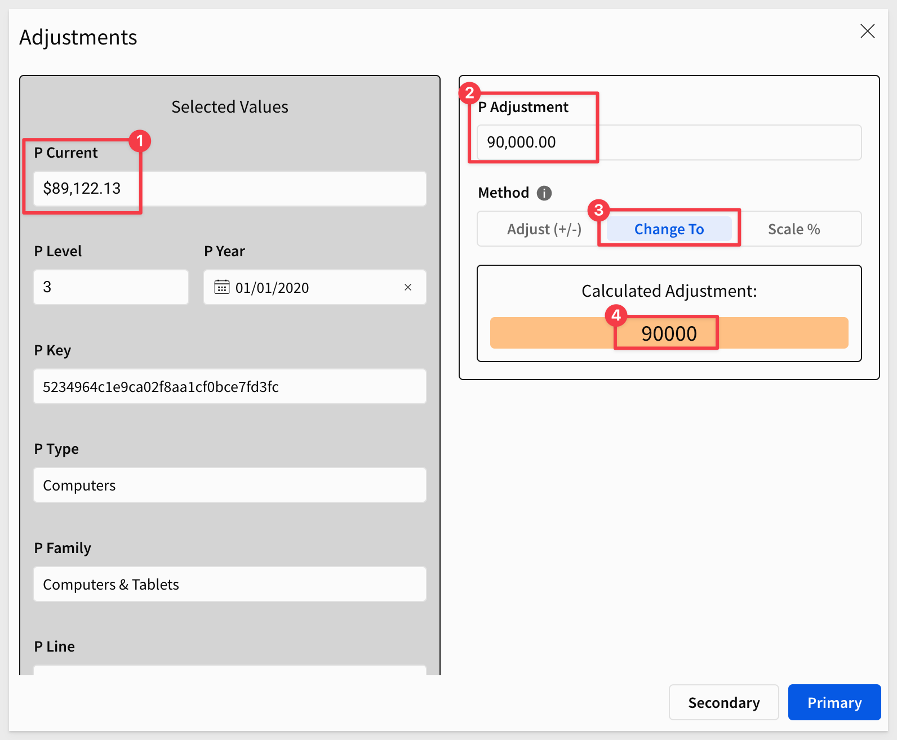

Now we will wire up the stored procedure to take some of this information and update our `Revenue Planning` and `Spread_Update` table. 


<!-- END OF SECTION-->

## Stored Procedure (procedure)
Duration: 5

Sigma users will click a button to execute a stored procedure, named `SPREAD`, that is designed to handle pivot table spreading by adjusting values in a designated Snowflake table called `SPREAD_UPDATE`, based on user input. 

The procedure interacts with the `BASE_TABLE` to prepare data, applies adjustments (e.g., scaling, direct changes, or percentage changes), and ensures data integrity while not altering the source data. 

It also logs SQL operations for troubleshooting purposes.

<aside class="negative">
<strong>NOTE:</strong><br> The log table has also been created earlier by our Snowflake script. We will display the log data in Sigma later.
</aside>

This procedure can dynamically handle adjustments at different hierarchical levels (e.g., l1, l2, l3 keys) and updates only the rows relevant to the selected pivot table cell.

### Summary of operation

Here are the basic steps taken by the procedure:

- **Prepare the data:**<br>
Syncs the SPREAD_UPDATE table with rows from the BASE_TABLE for the selected key.

- **Calculate adjusted (coalesced) revenue:**<br>
Retrieve the coalesced revenue value for the selected key and level.

- **Adjust the values:**<br>
Apply the user-specified adjustment method to update the SPREAD_UPDATE table.

- **Log the operations:**<br> 
Track all SQL executions for troubleshooting and transparency.


### Spreading calculations used:
The spreading method selected by the user in Sigma (`Adjust`, `Change` or `Scale`) determines the type of adjustment.

For those interested, here are the formula applied for each method:
            
**Adjust:**<br>
Adds or subtracts a fixed amount, distributed proportionally across rows
```code
set revenue = revenue + {ADJUSTMENT} * revenue / {sum_revenue}
```

**Change:**<br>
Sets a new total value, redistributing it proportionally across rows.
```code
set revenue = {ADJUSTMENT} * revenue / {sum_revenue}
```

**Scale:**<br>
Adjusts revenue by a percentage.
```code
set revenue = revenue + {ADJUSTMENT}/100 * revenue
```

Updates are applied to rows in SPREAD_UPDATE matching the KEY at the specified LEVEL.

### Creating the procedure in Snowflake
Run the following code in Snowflake to both create the stored procedure in our database/schema.

```code
CREATE OR REPLACE PROCEDURE SIGMA_QUICKSTARTS.PIVOT_SPREADING.SPREAD(
    "LEVEL" FLOAT,
    "KEY" VARCHAR(16777216),
    "ADJUSTMENT" FLOAT,
    "METHOD" VARCHAR(16777216)
)
RETURNS VARCHAR(16777216)
LANGUAGE JAVASCRIPT
EXECUTE AS OWNER
AS '
    var SPREAD_TABLE = "SIGMA_QUICKSTARTS.PIVOT_SPREADING.SPREAD_UPDATE";
    var BASE_TABLE = "SIGMA_QUICKSTARTS.PIVOT_SPREADING.BASE_TABLE";
    var LOG_TABLE = "SIGMA_QUICKSTARTS.PIVOT_SPREADING.SQL_LOG";
    var UUID = generateUUID();

    // Helper function to generate a UUID
    function generateUUID() {
        var sql = "SELECT UUID_STRING()";
        var statement = snowflake.createStatement({ sqlText: sql });
        var resultSet = statement.execute();
        resultSet.next();
        return resultSet.getColumnValue(1);
    }

    // Helper function to log and execute SQL statements
    function executeSQL(sql, binds = []) {
        try {
            var log_data = JSON.stringify({ LEVEL, KEY, ADJUSTMENT, METHOD });
            var log_sql = "INSERT INTO " + LOG_TABLE + " (UUID, SQL_TEXT, SQL_TS, LOG_DATA) VALUES (?, ?, CURRENT_TIMESTAMP, ?)";
            var log_statement = snowflake.createStatement({ 
                sqlText: log_sql,
                binds: [UUID, sql, log_data]
            });
            log_statement.execute();
        } catch (err) {
            throw new Error("Logging Error: " + err.message + "\\nSQL text: " + sql);
        }

        try {
            var statement = snowflake.createStatement({ sqlText: sql, binds: binds });
            return statement.execute();
        } catch (err) {
            throw new Error("Error executing the procedure: " + err.message + "\\nSQL text: " + sql);
        }
    }

    // Prepare the SPREAD table, ensuring it has all the rows to be spread
    var sql_prepare = `
MERGE INTO ${SPREAD_TABLE} AS spread_update
USING (
    SELECT 
        "order_number", 
        "date", 
        "sku_number", 
        MD5("product_type" || "product_family" || "product_line" || TO_CHAR("date", ''YYYY-MM-DD HH24:MI:SS'')) AS "l1_key", 
        MD5("product_type" || "product_family" || TO_CHAR("date", ''YYYY-MM-DD HH24:MI:SS'')) AS "l2_key", 
        MD5("product_type" || "product_family" || "product_line" || TO_CHAR("date", ''YYYY-MM-DD HH24:MI:SS'')) AS "l3_key",
        "revenue"
    FROM ${BASE_TABLE}
    WHERE MD5("product_type" || "product_family" || "product_line" || TO_CHAR("date", ''YYYY-MM-DD HH24:MI:SS'')) = ''${KEY}''
) AS base
ON 
    spread_update."order_number" = base."order_number" AND 
    spread_update."date" = base."date" AND 
    spread_update."sku_number" = base."sku_number"
WHEN MATCHED THEN 
    UPDATE SET 
        spread_update."revenue" = base."revenue"
WHEN NOT MATCHED THEN 
    INSERT ("order_number", "date", "sku_number", "l1_key", "l2_key", "l3_key", "revenue")
    VALUES (base."order_number", base."date", base."sku_number", base."l1_key", base."l2_key", base."l3_key", base."revenue");
`;
    executeSQL(sql_prepare);

    // Get sum(revenue) for the key being spread
    var sql_sum = `SELECT SUM("revenue") FROM ${SPREAD_TABLE} WHERE "l${LEVEL}_key" = ''${KEY}''`;
    var result = executeSQL(sql_sum);
    var sum_revenue = null;

    if (result.next()) {
        sum_revenue = result.getColumnValue(1);
    } else {
        throw new Error("No rows found for the provided key.");
    }

    // Perform the actual spread by updating revenue for the matching rows
    var sql_spread = `UPDATE ${SPREAD_TABLE} SET `;

    if (METHOD === "Adjust") {
        sql_spread += `"revenue" = "revenue" + (${ADJUSTMENT} * "revenue" / ${sum_revenue})`;
    } else if (METHOD === "Scale") {
        sql_spread += `"revenue" = "revenue" + (${ADJUSTMENT} / 100 * "revenue")`;
    } else if (METHOD === "Change") {
        sql_spread += `"revenue" = (${ADJUSTMENT} * "revenue" / ${sum_revenue})`;
    }
    
    sql_spread += ` WHERE "l${LEVEL}_key" = ''${KEY}''`;
    executeSQL(sql_spread);
';
```

Execute the procedure and confirm a success response from Snowflake. 


<!-- END OF SECTION-->

## Calling the Procedure from Sigma
Duration: 5

We will use the existing `Primary` button on the `Adjustments` modal page (for convienence).

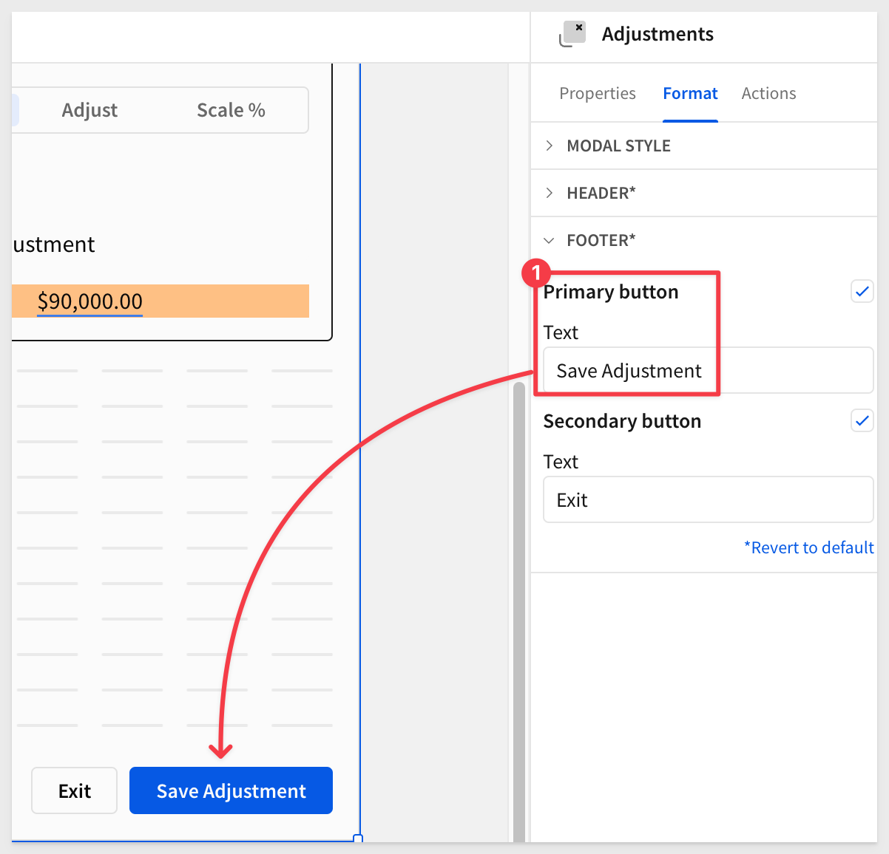

The `Secondary` button will be used to clear and exit the modal:

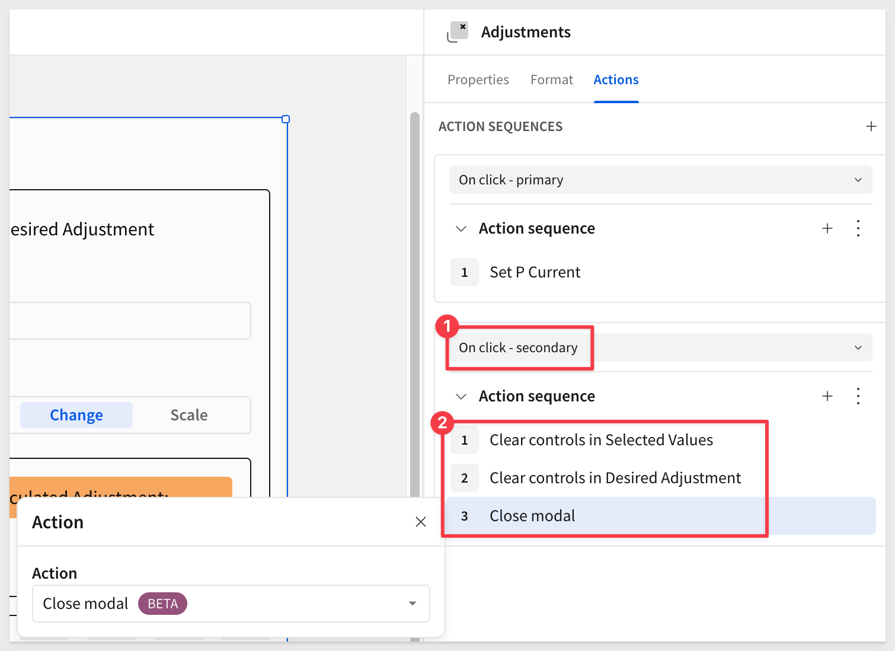

From the `Actions` menu of the `Primary` button, configure the action to call the stored procedure:

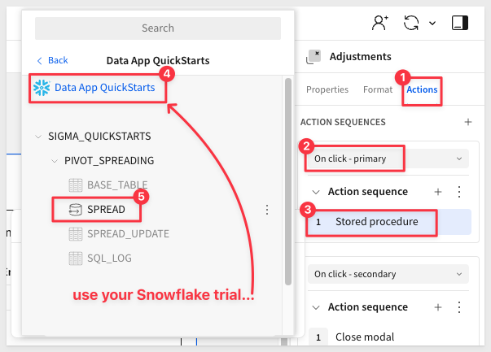

<aside class="positive">
<strong>IMPORTANT:</strong><br> If the procedure does not appear on the list in Sigma, resync the connection as shown in the screenshot below:
</aside>

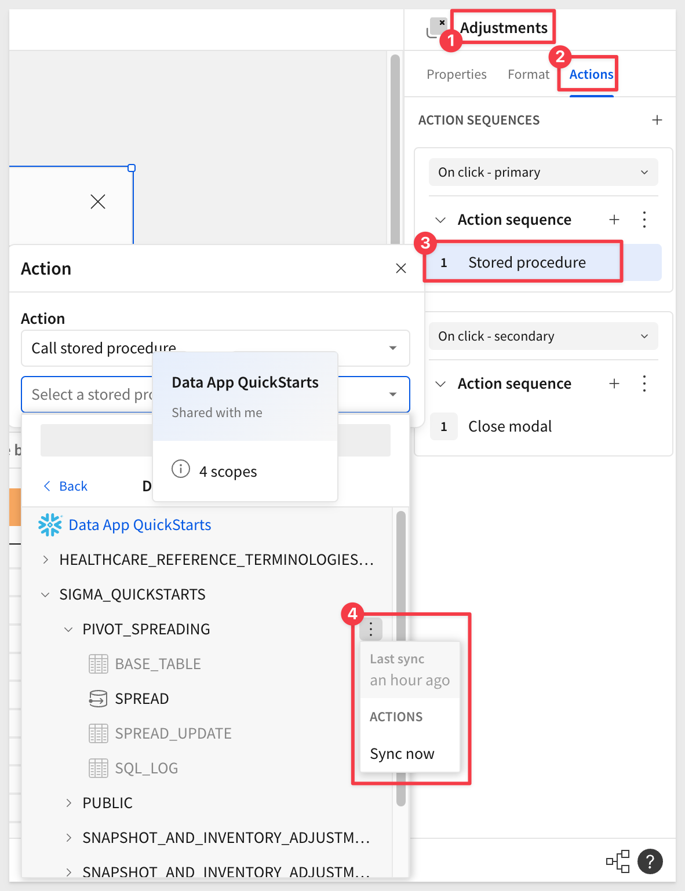

Once Sigma evaluate the selected procedure, we are prompted to choose how required variables should be passed:

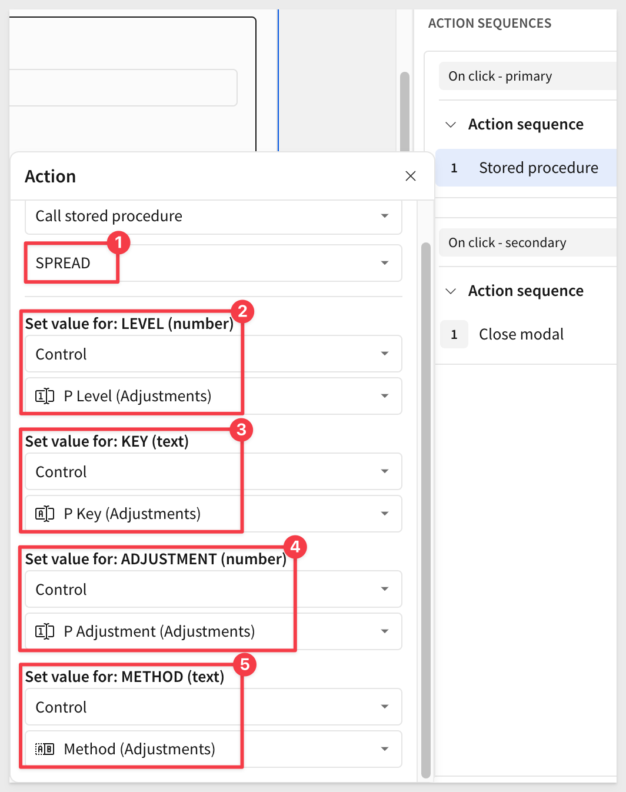

Add another action to refresh the `Revenue Planning` pivot with the new data.

Add another action to clear the `Selected Adjustments` and `Desired Adjustment` containers, just so we are always sure that the current values are removed prior to using the modal.

Add one more action to `Navigate in this workbook` to the `Pivot` pages, `Top of page`.

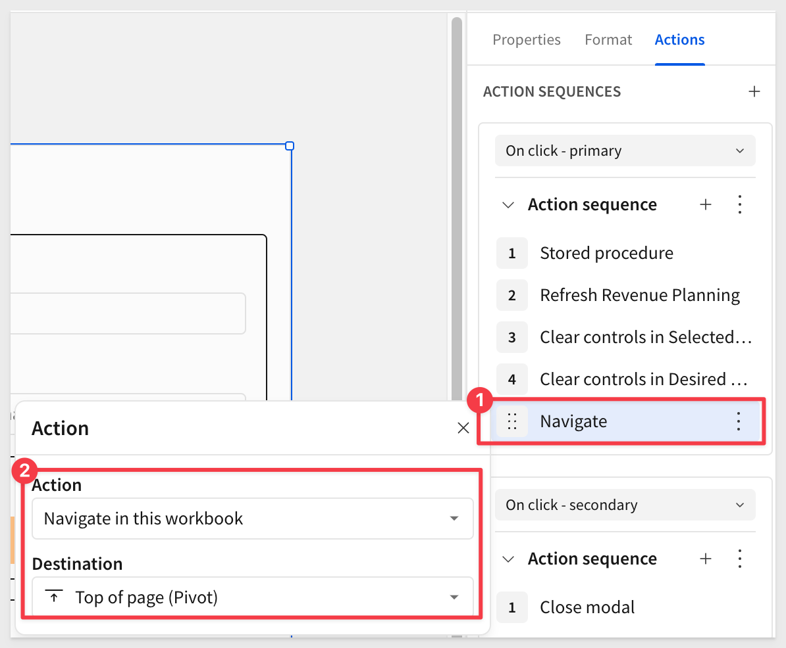

Click `Publish` and switch to the published version:

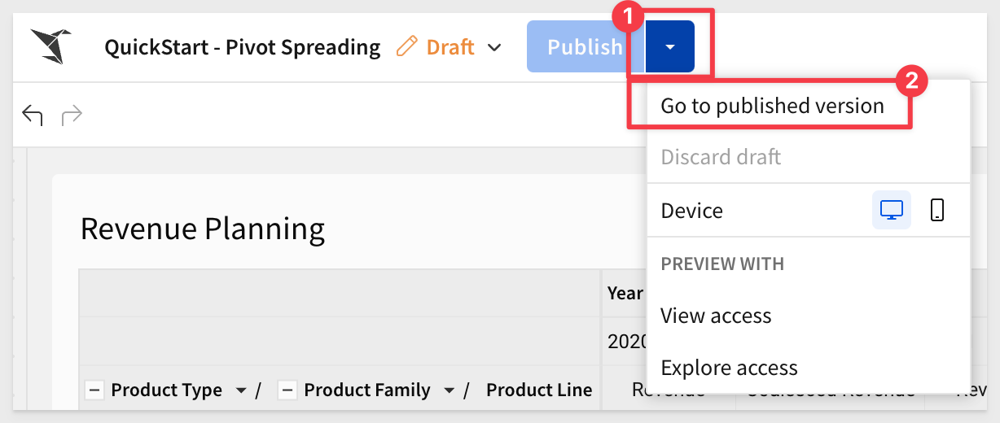

### Give it a test
Clicking on a value in a `Coalesced Revenue` column:

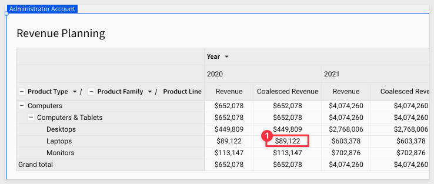

We set `P Adjustment` to `90000` and clicked `Change`. 

Since we are directly changing values, the `Calculated Adjustment` is also `90000`.

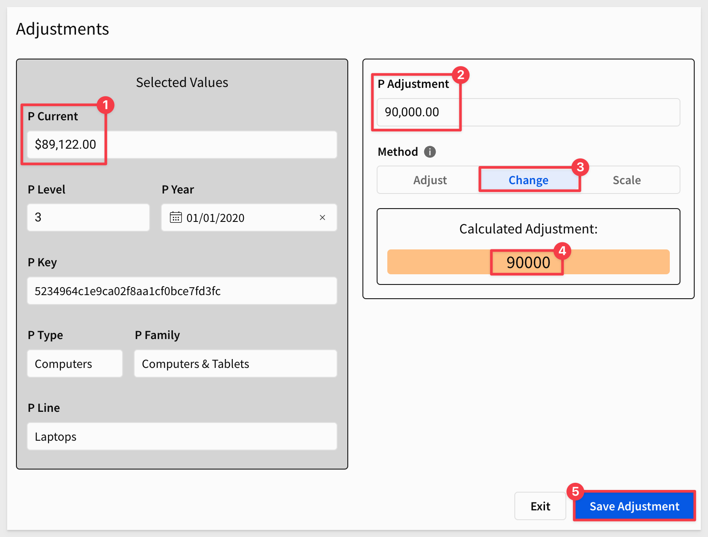

After saving, we are returned to the `Pivot` page and can see the value we selected for `Coalesced Revenue` has been updated to `90000`.

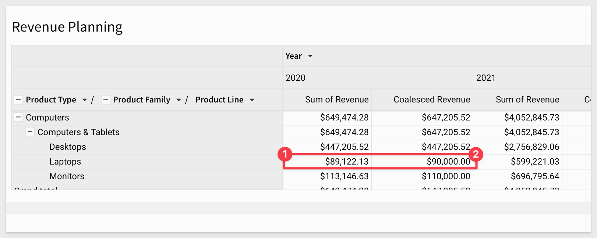

Notice that the original value for `Sum of Revenue` in `2020` has not changed as we did not want to alter the source data.

Feel free to try more adjustments using the `Adjust` or `Scale` methods. They will work as expected and the actual calculations that were called out earlier can easily be adjusted to suit different business requirements.


<!-- END OF SECTION-->

## Logging
Duration: 5
To assist in debugging and to also have a detailed audit of the adjustments, we have included a log table of all the adjustments.

Add a new page to the workbook and rename it to `Log`.

Add a new table and connect it to the `SQL_LOG` table:

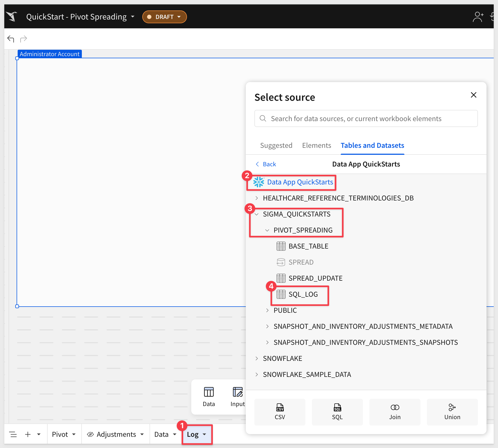

For clarity, we cleared the `SQL_LOG` table and did one adjustment so we could show the expected results from each adjustment saved. 

`SQL Text` contains the actual query that was built and executed by the procedure:

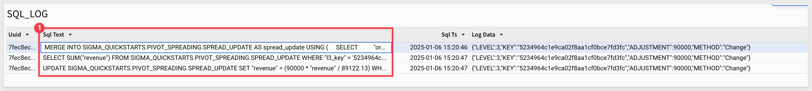

This can be really useful in debugging and tracking. Of course, there are other options like using Sigma's [Audit Logging](https://help.sigmacomputing.com/docs/enable-audit-logging) or Snowflake's [Query History](https://docs.snowflake.com/en/sql-reference/functions/query_history) reporting as well. 


<!-- END OF SECTION-->

## What we've covered
Duration: 5

In this QuickStart, we built a data application to enable end users to make adjustments in a pivot table, without altering the underlying data. 

This functionality allows businesses to transition from static reporting to dynamic, interactive workflows.

**Additional Resource Links**

[Blog](https://www.sigmacomputing.com/blog/)<br>
[Community](https://community.sigmacomputing.com/)<br>
[Help Center](https://help.sigmacomputing.com/hc/en-us)<br>
[QuickStarts](https://quickstarts.sigmacomputing.com/)<br>

Be sure to check out all the latest developments at [Sigma's First Friday Feature page!](https://quickstarts.sigmacomputing.com/firstfridayfeatures/)
<br>

[](https://twitter.com/sigmacomputing)&emsp;
[](https://www.linkedin.com/company/sigmacomputing)&emsp;
[](https://www.facebook.com/sigmacomputing)


<!-- END OF WHAT WE COVERED -->
<!-- END OF QUICKSTART -->
