author: pballai
id: dataapps_reconciliation
summary: dataapps_reconciliation
categories: dataapps
environments: web
status: hidden
feedback link: https://github.com/sigmacomputing/sigmaquickstarts/issues
tags: 
lastUpdated: 2024-12-19

# Reconciliation

## Overview
Duration: 5 

The ability to take snapshots and run stored procedures directly from a Sigma data app empowers teams to automate workflows, enhance data accuracy, and streamline decision-making processes.

Using a Sigma data app, such as in this "Reconciliations" QuickStart, users can capture snapshots of live data stored in a cloud data warehouse (CDW), such as Snowflake, preserving frozen records of data at specific points in time for reliable retrieval and analysis.

Snapshots are invaluable for tracking changes in data over time, a crucial requirement for teams managing dynamic datasets. They ensure data accuracy and consistency by allowing comparisons between live data and historical snapshots.

The flexibility to execute stored procedures from the Sigma UI further enhances these workflows, enabling teams to integrate complex data operations seamlessly into their applications, reducing manual effort, and driving greater efficiency.

<aside class="positive">
<strong>IMPORTANT:</strong><br> Some screens in Sigma may appear slightly different from those shown in QuickStarts. This is because Sigma is continuously adding and enhancing functionality. Rest assured, Sigma’s intuitive interface ensures that any differences will not prevent you from successfully completing any QuickStart.
</aside>
 
### Common Use Cases
The ability to take snapshots and run stored procedures directly from a Sigma data app offers unparalleled flexibility for teams working in diverse domains. These capabilities enable teams to automate workflows, track progress over time, and maintain data accuracy across various scenarios.

This functionality is essential for teams in (and many others):

<ul>
      <li><strong>Inventory Management:</strong> Tracking current stock levels, adjusting inventory counts, and freezing historical data for audit and analysis.</li>
      <li><strong>Reconciliation:</strong> Finance, accounting, and sales teams can validate data and resolve discrepancies efficiently.</li>
      <li><strong>Finance:</strong> Generating accurate financial reports and managing budgets with point-in-time records.</li>
      <li><strong>Billing:</strong> Recording account adjustments for transparency and audit purposes.</li>
      <li><strong>Accounting/Accounts Payable:</strong> Managing ledger data and ensuring consistency across reporting cycles.</li>
      <li><strong>Data Migration:</strong> Preserving data integrity during complex migration projects.</li>
</ul>

### Specific Use Cases

<ul>
      <li><strong>Track Progress Over Time:</strong> Snapshots allow users to monitor how data evolves, such as inventory levels, sales pipeline stages, or financial metrics. Managers can identify patterns, such as which inventory items are frequently adjusted or which sales strategies drive the most progress.</li>
      <li><strong>Performance Comparison:</strong> Snapshots act as benchmarks to evaluate performance. For example, comparing inventory counts across months reveals trends that inform purchasing decisions or operational efficiency.</li>
      <li><strong>Audit and Accountability:</strong> Snapshots provide an immutable record of data changes. This is critical for audits, reconciling financial discrepancies, or validating adjustments in inventory or sales figures.</li>
      <li><strong>Data Accuracy and Anomaly Detection:</strong> By comparing snapshots, teams can detect inconsistencies, such as unexpected changes in stock levels or repeated discrepancies in financial reports.</li>
      <li><strong>Training and Strategy Adjustment:</strong> Historical snapshots can be used to train new team members or refine processes, providing real-world examples of how data evolves over time.</li>
</ul>

### Role of Stored Procedures

The inclusion of stored procedures significantly enhances the power and extensibility of this functionality by allowing:

<ul>
      <li><strong>Automated Data Workflows:</strong> Trigger complex operations like inventory updates, data cleansing, or calculations directly from the Sigma UI.</li>
      <li><strong>Custom Logic Execution:</strong> Apply specific business rules or calculations, such as dynamically updating inventory counts or reconciling ledger data.</li>
      <li><strong>Seamless Integration with Warehouse Operations:</strong> Execute warehouse-native logic directly, ensuring optimal performance and maintaining data integrity.</li>
</ul>

### Demonstration
In this QuickStart, we demonstrate how to build a data application that displays the current in-stock quantity for items in inventory, sourced from Snowflake sample data.

This application allows teams to update the "In-Stock Quantity" for an item to reflect actual counts during an inventory review. Users can then snapshot the updated data, preserving both the original and revised values for historical tracking and future analysis. These snapshots provide a point-in-time view, enabling the team to evaluate how inventory adjustments impact overall operations and strategy.

This process offers several key benefits:

<ul>
      <li><strong>Improved inventory accuracy:</strong> Snapshots allow managers to identify discrepancies between recorded and actual stock levels, ensuring accurate records.</li>
      <li><strong>Operational transparency:</strong> Historical snapshots serve as a shared reference point, fostering trust and alignment among inventory teams and stakeholders.</li>
      <li><strong>Strategic planning:</strong> Accurate inventory records empower decision-makers to optimize purchasing and stock levels, minimizing waste and shortages.</li>
</ul>

This QuickStart focuses on inventory management, but the same methodology can be applied to other use cases where consistent and reliable data tracking is critical, such as billing adjustments, account reconciliations, or validating data integrity during migration projects.

### Target Audience
Sigma builders interested in keveraging the advanced capabilities to create fully functionion Data Apps. 

### Prerequisites

<ul>
  <li>A computer with a current browser. It does not matter which browser you want to use.</li>
  <li>Access to a Sigma environment.</li>  
  <li>Access to a Snowflake environment with the Snowflake sample dataset</li>
  <li>Some familiarity with Sigma is assumed. Not all steps will be shown as the basics are assumed to be understood.</li>
 </ul>

<aside class="postive">
<strong>IMPORTANT:</strong><br> Sigma recommends that you use non-production resources when doing QuickStarts.
</aside>

<button>[Sigma Free Trial](https://www.sigmacomputing.com/free-trial/)</button> <button>[Snowflake Free Trial](https://signup.snowflake.com/)</button>


## Connect to Snowflake
Duration: 5
In order to access the Snowflake sample dataset and also have a place to write input table data to and run stored procedures, we need to add and configure a connection in Sigma.

### Create Write Database in Snowflake
Since we will be using Sigma input tables, we need to create a place in Snowflake to store that data.

In the Snowflake console, run the following script:
```code
USE ROLE ACCOUNTADMIN;

-- Create Sigma Writeback DB
CREATE DATABASE IF NOT EXISTS SIGMA_QUICKSTARTS;

-- Create schemas for write-back and snapshots
CREATE SCHEMA IF NOT EXISTS SIGMA_QUICKSTARTS.SNAPSHOT_AND_INVENTORY_ADJUSTMENTS_WB;
CREATE SCHEMA IF NOT EXISTS SIGMA_QUICKSTARTS.SNAPSHOT_AND_INVENTORY_ADJUSTMENTS_SNAPSHOTS;

-- Grant access for ACCOUNTADMIN role (used by Sigma connection)
GRANT USAGE ON WAREHOUSE COMPUTE_WH TO ROLE ACCOUNTADMIN;
GRANT USAGE ON DATABASE SIGMA_QUICKSTARTS TO ROLE ACCOUNTADMIN;

-- Permissions for Sigma Input Tables
GRANT USAGE ON SCHEMA SIGMA_QUICKSTARTS.SNAPSHOT_AND_INVENTORY_ADJUSTMENTS_WB TO ROLE ACCOUNTADMIN;
GRANT CREATE TABLE, CREATE VIEW, CREATE STAGE ON SCHEMA SIGMA_QUICKSTARTS.SNAPSHOT_AND_INVENTORY_ADJUSTMENTS_WB TO ROLE ACCOUNTADMIN;

-- Permissions for Snapshots
GRANT USAGE ON SCHEMA SIGMA_QUICKSTARTS.SNAPSHOT_AND_INVENTORY_ADJUSTMENTS_SNAPSHOTS TO ROLE ACCOUNTADMIN;
GRANT CREATE TABLE, CREATE VIEW, CREATE STAGE ON SCHEMA SIGMA_QUICKSTARTS.SNAPSHOT_AND_INVENTORY_ADJUSTMENTS_SNAPSHOTS TO ROLE ACCOUNTADMIN;
```

Make sure the command runs to success:

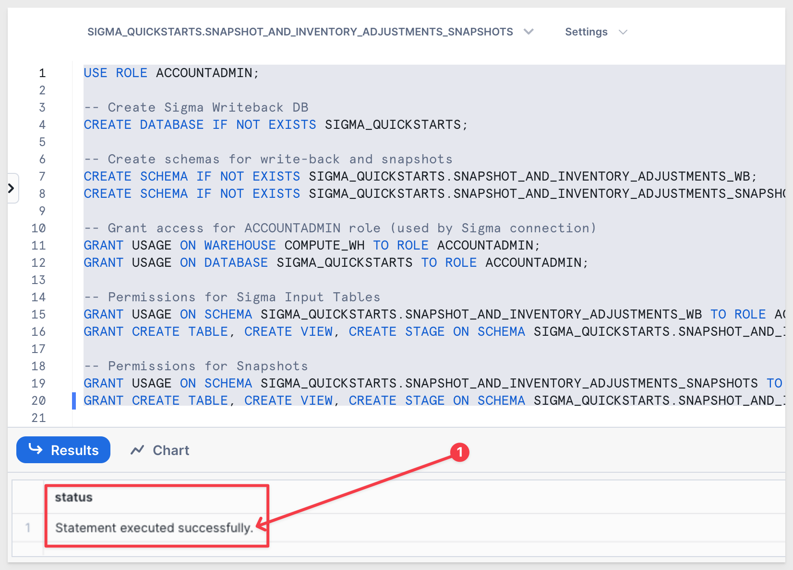

We can see our new database and two schema in Snowflake:

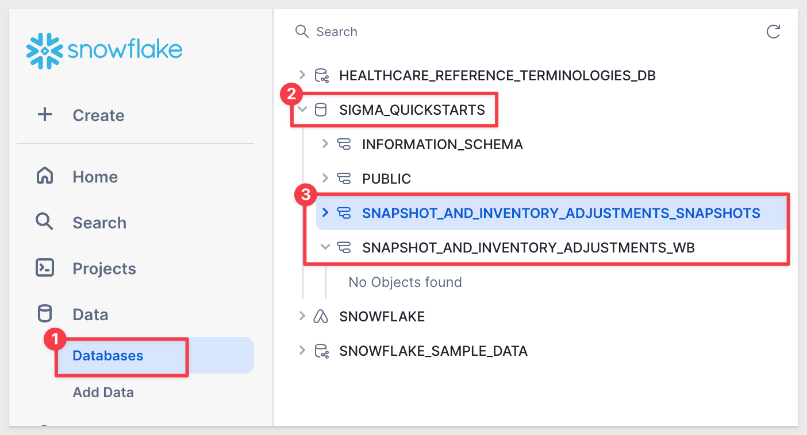

### Add Snowflake connection in Sigma
In Sigma, navigate to `Connections` and click `Create Connection` (Administrative rights in Sigma is required):

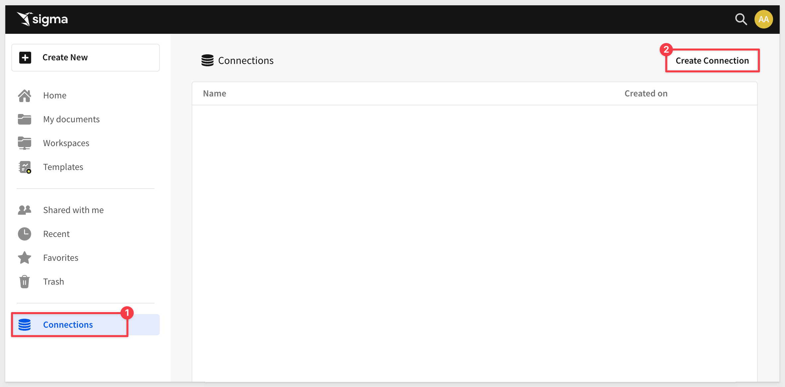

Select `Snowflake` and give it a name.

Configure the account details for your instance and also the `Write Access` section:

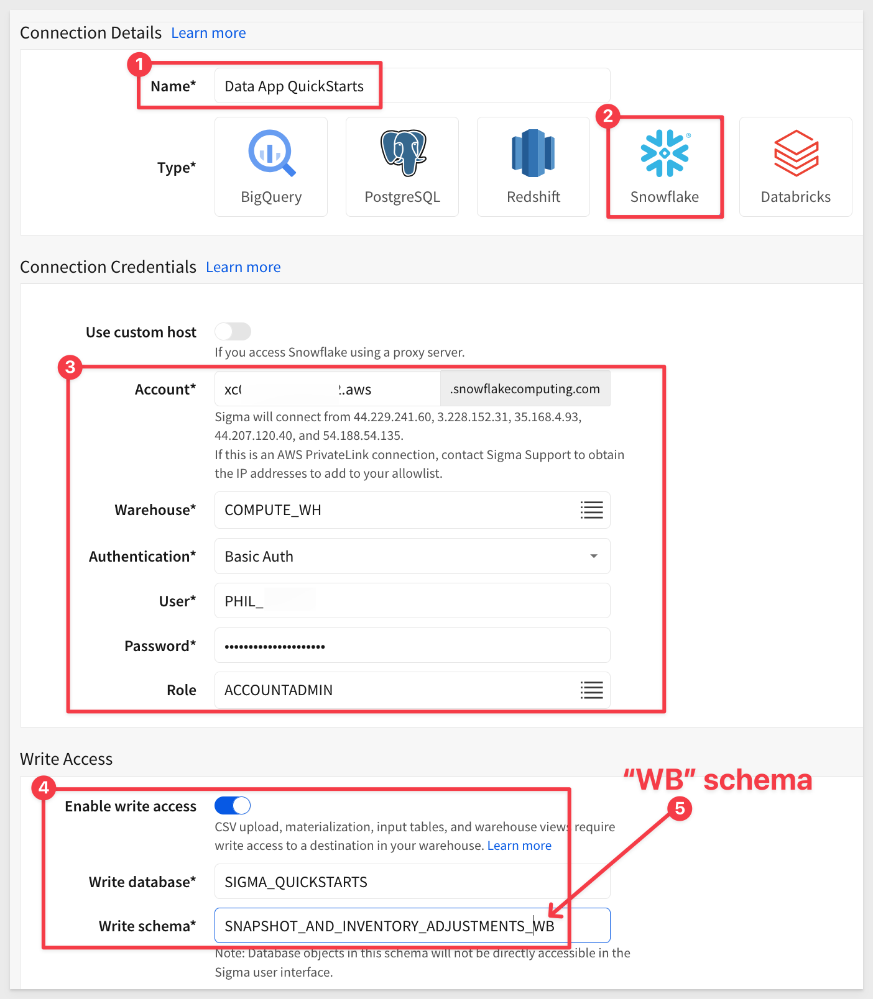

Click `Browse Connection` and verify the sample data is available and the `SIGMA_QUICKSTARTS` database is also present:

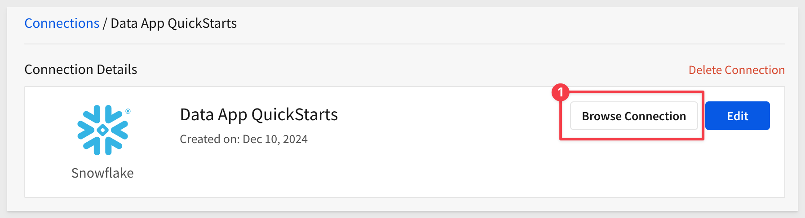

The won't be any data in the `SIGMA_QUICKSTARTS` database yet. We will be using the `SNOWFLAKE_SAMPLE_DATA` > `TPCH_SF1` > `PARTSUPP` table. The column we are interested in for our stock level use case is called `PsAvailqty`:

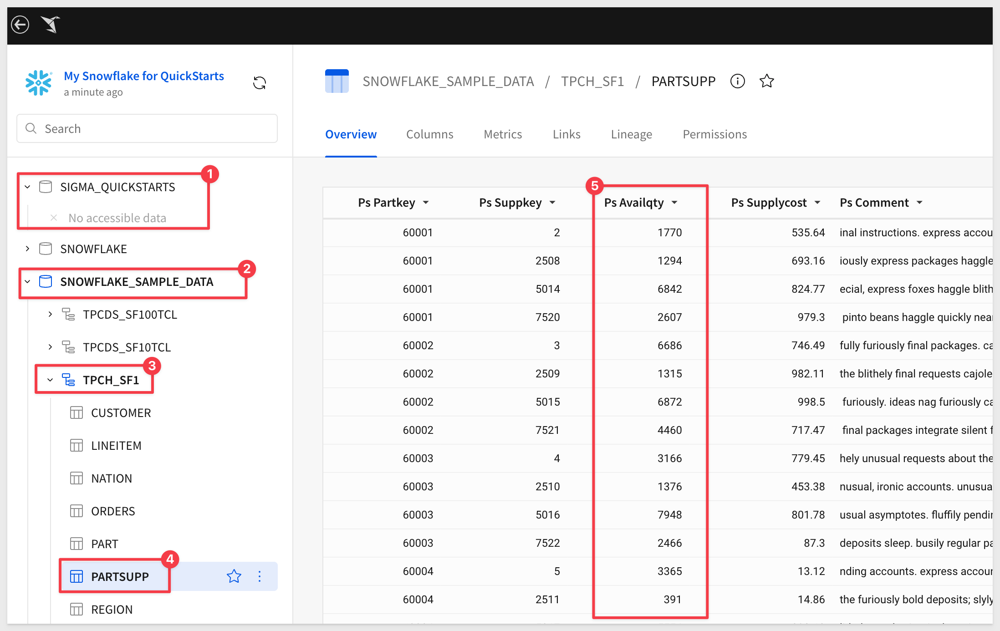


<!-- END OF SECTION-->


## Demonstration Use Case
Duration: 5

For demonstration we will use an `Inventory Actuals` use case to build a data application that empowers teams to track and update inventory data. 

Using Snowflake sample data, users can view the current in-stock quantities for items, make adjustments to reflect actual counts, and preserve the updated records for future analysis.

The workflow includes:

<ul>
      <li><strong>Viewing Inventory Data:</strong> Displaying the current in-stock quantities sourced from Snowflake.</li>      
      <li><strong>Updating Inventory Actuals:</strong> Allowing users to input revised quantities during inventory reviews.</li>
      <li><strong>Snapshotting Adjustments:</strong> Capturing both the original and revised data as a snapshot, saved into a dedicated table in Snowflake. This snapshot provides a point-in-time record for auditing, reporting, and operational insights.</li>
      <li><strong>Displaying Combined Snapshots: </strong> Unioning all snapshots into a single view, allowing users to analyze the historical progression of inventory adjustments seamlessly.</li>
</ul>

This use case highlights the power of Sigma’s seamless integration with Snowflake, demonstrating how snapshots and stored procedures can be leveraged to streamline workflows and maintain data accuracy. By freezing historical records, teams gain transparency and a reliable foundation for decision-making, ensuring efficient and effective inventory management.

The first step is to build a table that has the column of interest to our data application. 

If the Snowflake instance you are using does not contain the sample data, it can be manually loaded. For more information, see [Using the Sample Database.(https://docs.snowflake.com/en/user-guide/sample-data-using)

Create a new workbook in Sigma, rename the `Page 1` page to `Inventory Master`. Save the workbook as `Inventory Actuals` in a location of your choice. 

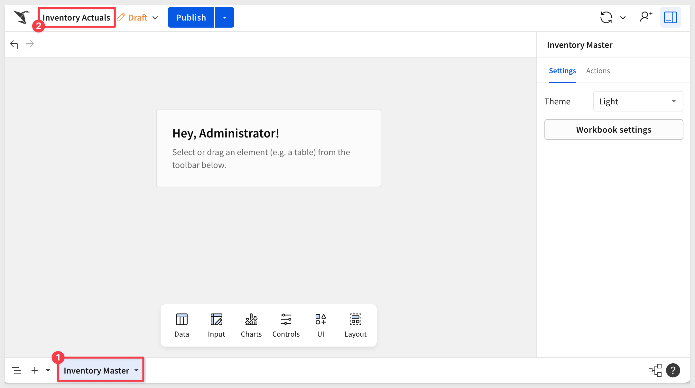

<aside class="negative">
<strong>NOTE:</strong><br> It is a good idea to `Add to favorites` so that it shows in the `Favorites` group on the homepage. 
</aside>

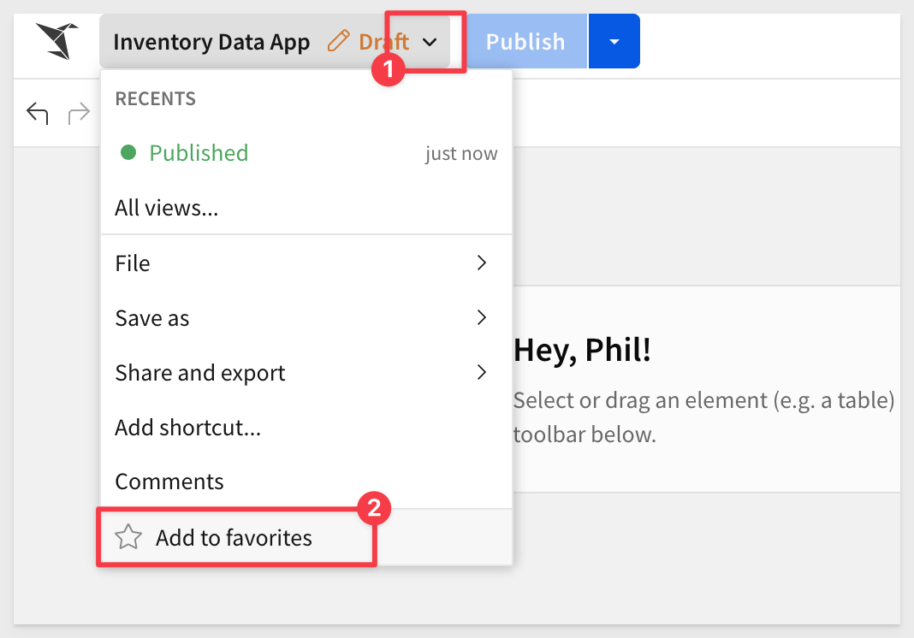

### Add PARTSUPP table
From the `Add element bar`, drag a table element onto the page and click `Select source`:

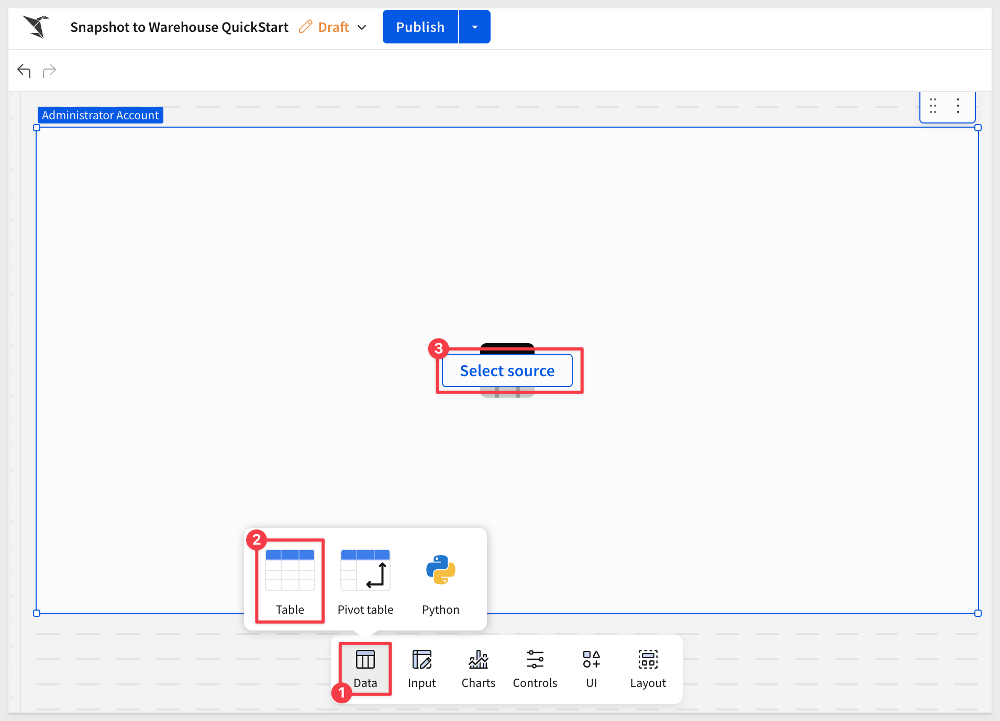

Start typing `PARTSUPP` into the search bar and select the `PARTSUPP` table as shown. Be sure to choose this specific one, as there are several with different sizes.

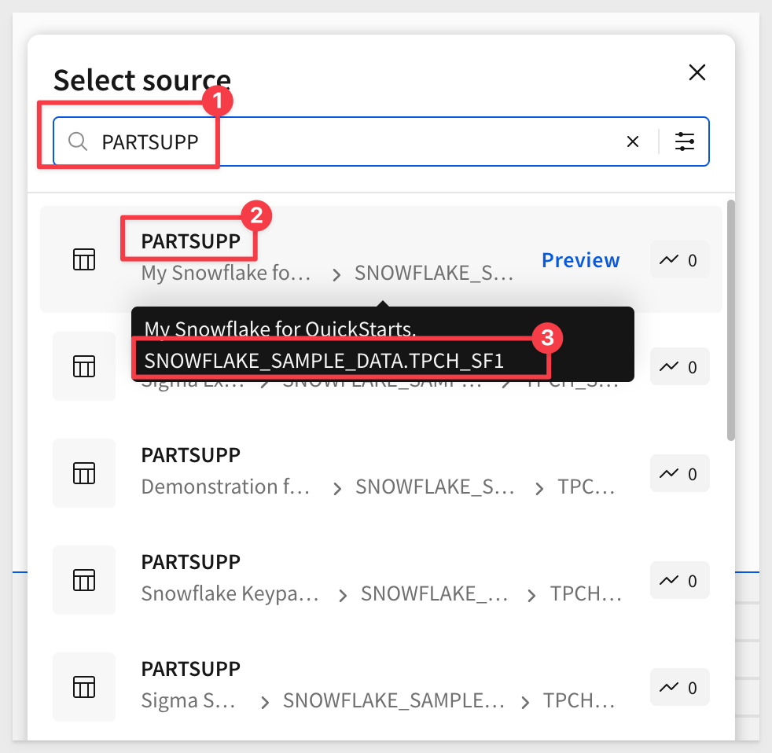

Lets enrich the data for the user by joining the `PART` table to this, including all columns:

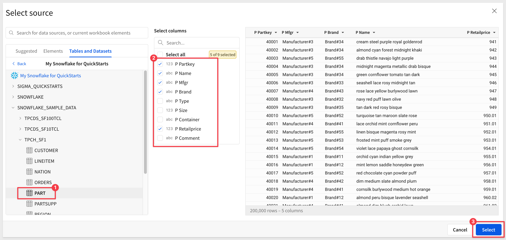

Sigma will configure the join for us. Review it for accuracy and click `Preview output`:

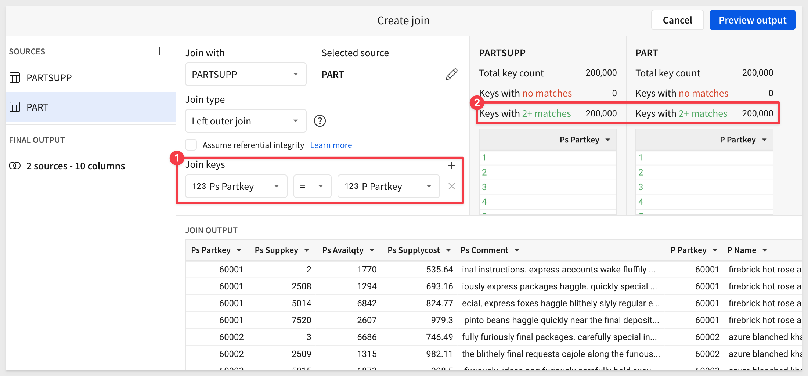

We are presented with a graphical lineage and can make last minute changes. Click `Done`:

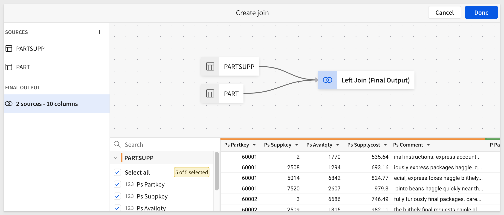

After hiding some columns and grouping on three others, our table looks like this (renamed to `Reported Inventory`):

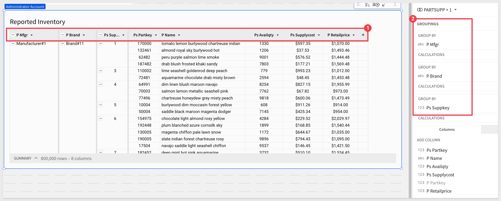

Click `Publish`.

### Add Filter Control
Add a `List value` control to the page and configure it to use the `P Name` column as it's source. Be sure to enable the `Allow multiple selections` option:

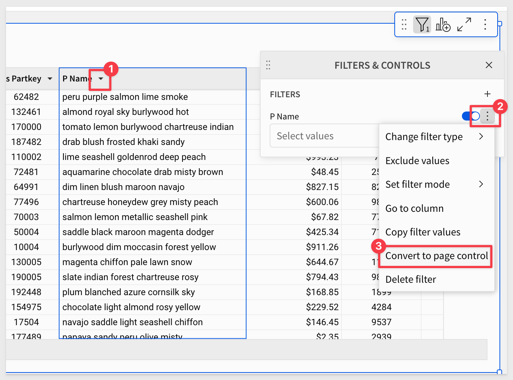

Rename the control to `Select Product Name`.

Verify the new control filters the `Reported Inventory` table.

Make note of the fact that some products come from different suppliers and carry different costs too.

For example, the product named `aquamarine frosted tomato medium navy` is available from four different suppliers, each with a different brand and  each having different costs and retail prices:

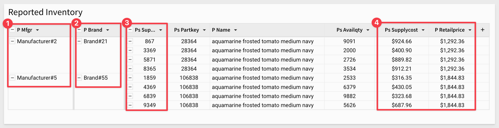


<!-- END OF SECTION-->

## Configuring Actions
Duration: 5

Here is where we start to go beyond the typical capabilites of a anaytics product to add rich interactivity.

### Add select column
We want the users to be able to select one row of data from the table to edit.

Add a new column, rename it to `Select` and set it's formula to `"EDIT"`.

We can make the column standout a bit more using a conditional formula:

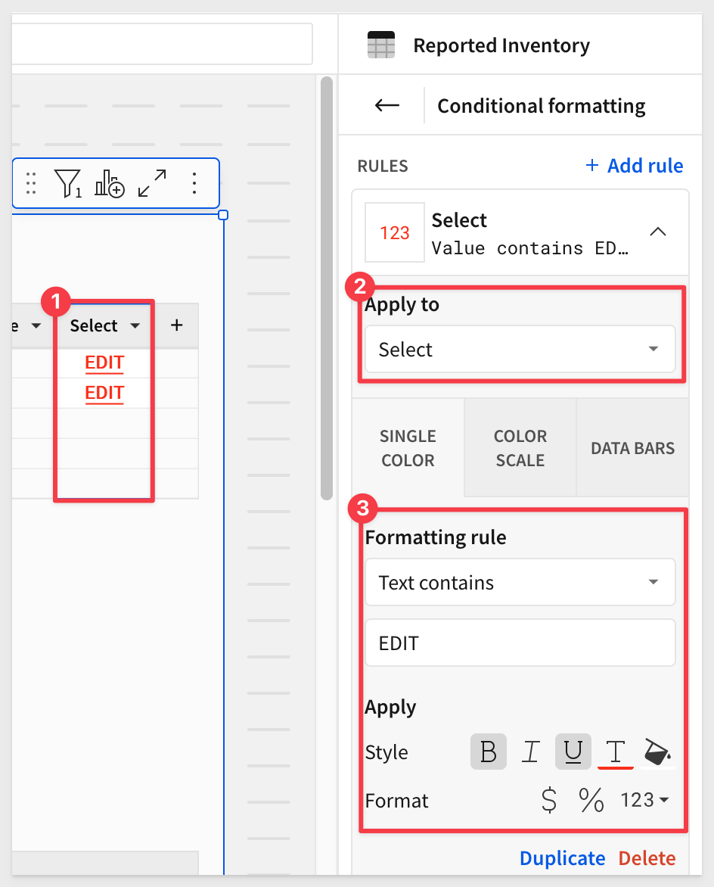

### Adding actions
With the table selected, click `Actions` in the `Editor panel` and configure the first action as shown:

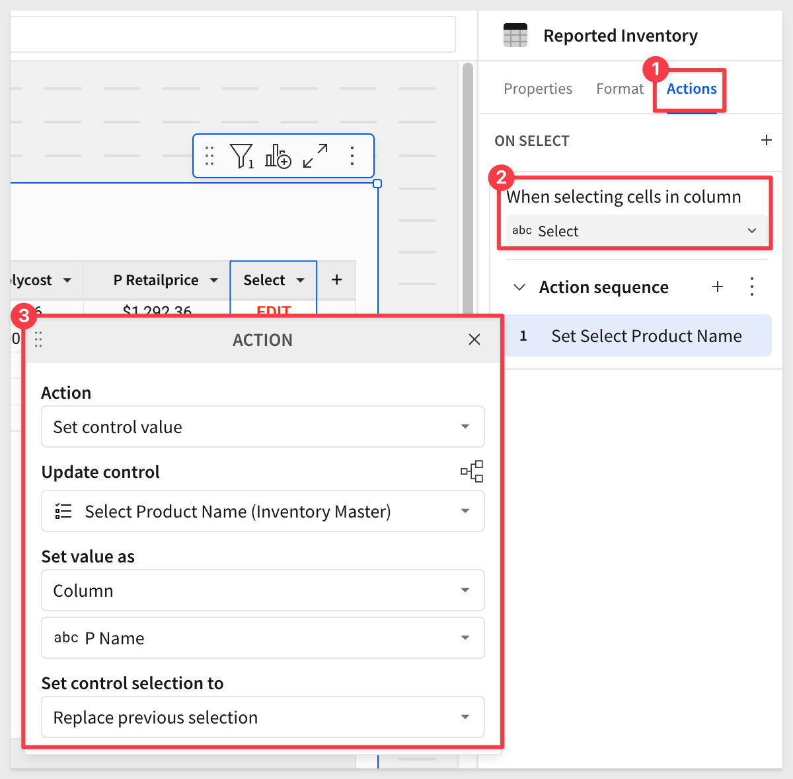

Click the `+` next to `Action sequence` to add another action. Select `Open modal` and `New modal`:

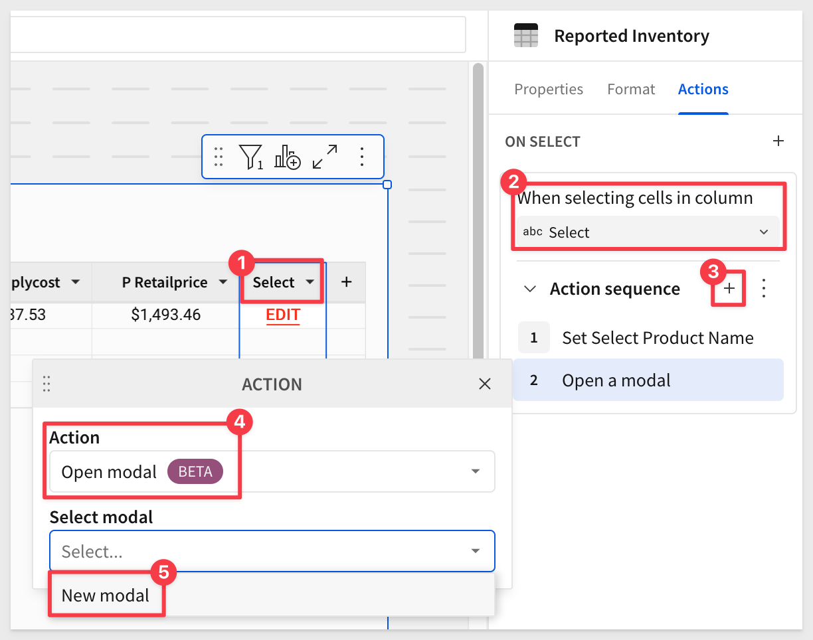

This will create a new `Page` with the corresponding label. Since this is the first modal we have created this way, the page is named `Modal `:

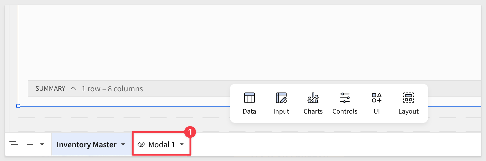

<aside class="negative">
<strong>NOTE:</strong><br> Modal pages created this way are "hidden" by default. This prevents users without edit permissions from seeing the raw page, but the modal content will appear on an action that calls for it.
</aside>

When we click on `Edit` in a single row, we can see the new modal (which is still empty) and also note that the underlying page control has been set to the customer name of the row selected.

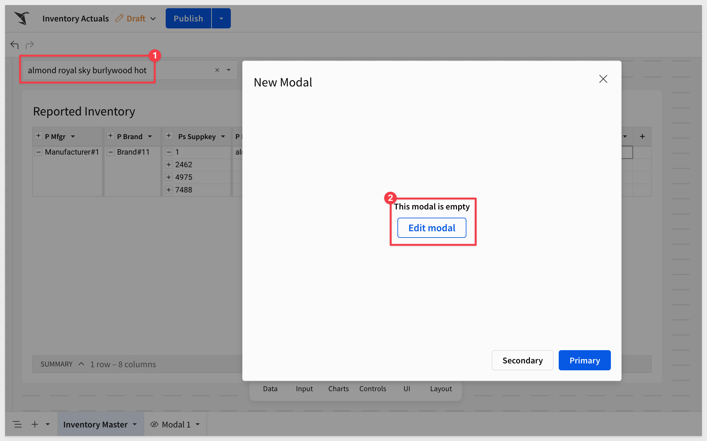

## Modal configuration
Duration: 5 

While it may not be immediately obvious, we’ve already made a few design and workflow decisions. This is a common part of building any application (not just data apps). Often, it’s only after you start designing that the implications of small decisions become clear.

It’s always crucial to ensure the workflow and functionality of an application are intuitive for the end user. The goal is to help them understand the interface and complete their work as efficiently as possible.

<aside class="positive">
<strong>IMPORTANT:</strong><br> This is just one of many ways to design a data app workflow, as Sigma is highly flexible. Involving a few power users during the design stage is an excellent way to ensure the workflow aligns with their needs and expectations. This approach not only validates your design but also fosters a sense of ownership among users, encouraging adoption and ongoing support. 
</aside>

In our use case, we aim to enable users to report an accurate inventory count as soon as they have that information.

Once the values are updated in the input table, we will take a snapshot of its content, freezing the data into another Snowflake table for future analysis. This approach preserves the integrity of the original inventory data while providing flexibility for managers to make adjustments.

Before we proceed with snapshotting, let’s set up the input table in Sigma to ensure it’s ready for use.

Click the `Edit modal` button. We are taken to the `Modal 1` page, where we can work with all the functionality Sigma has to offer. 

Two buttons are provided for us in the modals "footer". The buttons have preset actions available (but not configured to do anything yet) so that you can configure them to do whatever is needed. These can also be hidden if they are not required (in the `format` options section).

There is also an action to control when the modal is closed (using the `X` button on the modal). This can be used in many ways. For example, we may want to take the user to another workbook page upon close of the modal:

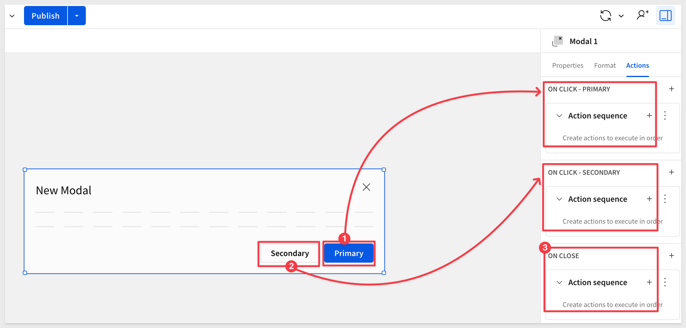

Rename the modal's title to `Stock Adjustments`:

Feel free to adjust the modals' styling using the `Format` option in the `Editor panel`.

Using the `Element bar`, drag a `Linked Input Table` to the modal cavas.

Click the `Select source` button. The source we choose will act as the "starting point" for the stock adjustments.

Sigma will suggest we use `Reported Inventory`; select that. 

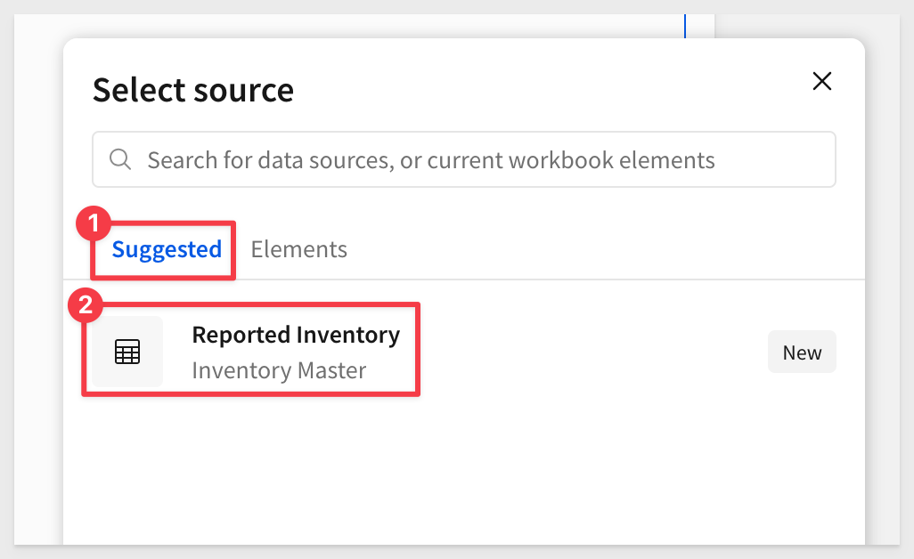

Since the same part can come from different suppliers, we need to make sure we present all those items so that the correct inventory quality can be adjusted. 

To do this, we simply add multiple columns to be user as unique identifiers. 

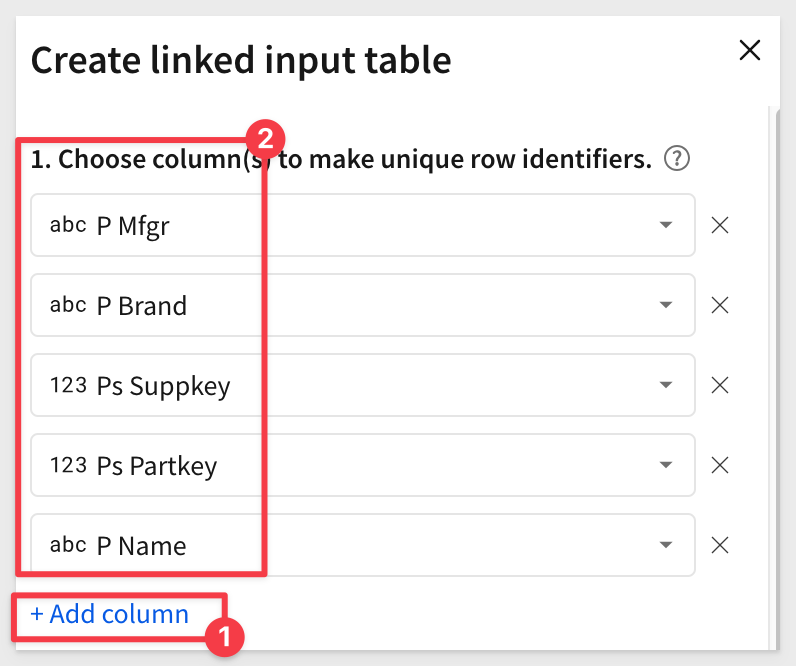

Also add the column `Ps AvailQty` from the `2. Add more column(s) to your linked input table (optional).` section. We want to display the current inventory count for the select item(s) to the editor.

Click `Create input table`.

<aside class="negative">
<strong>NOTE:</strong><br> None of the source data columns are editable by the users. We will add another column that is editable so they can make adjustments and we can do additional analysis against later. 
</aside>

To keep this demonstration "Quick", we will add one column called "Adjusted_Qty". This will be the only place a manager can make edits, but will demonstrate the workflow simply. 

Add an additional column and rename it to `Adjusted_Qty`. Be sure to change it's "type" to `number`:

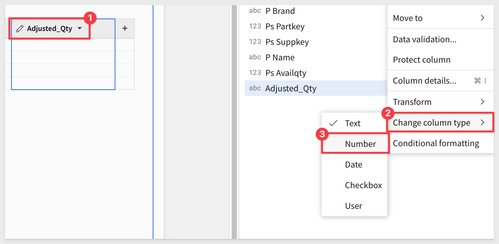

<aside class="negative">
<strong>NOTE:</strong><br> It is possible to control column level data entry permissions for input tables.
</aside>

Rename the input table to `Please provide adjusted stock quantities`.

Before we can do a quick test, we need to set the input table to allow others to edit it:

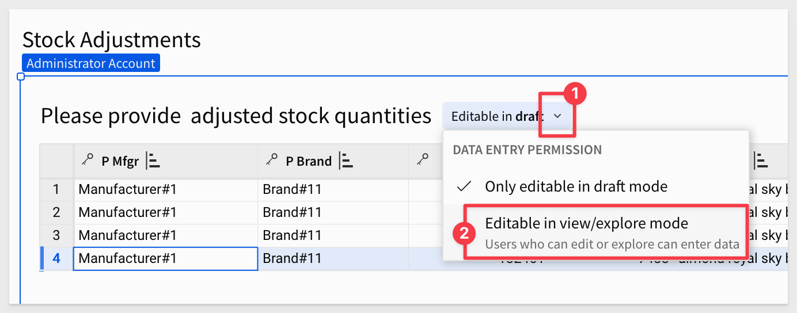

Click `Publish`.

Set the workbook into published version:

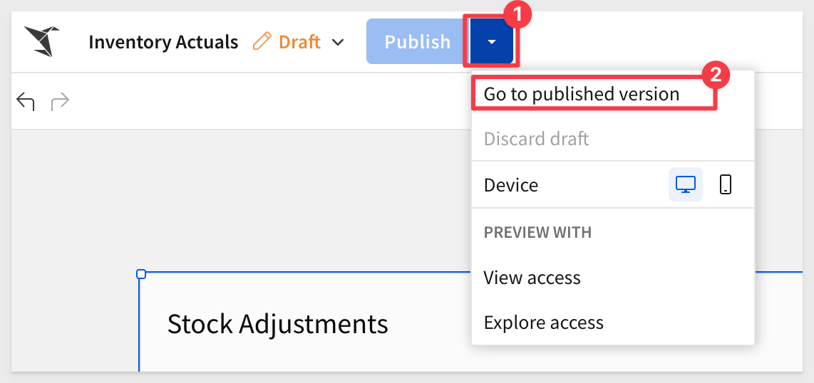

Searching again for the product `aquamarine frosted tomato medium navy`, we can click the `EDIT` link in the first row.

Our modal now looks like this, and we can update the row(s) we are interested in by clicking the `Edit Data` button:

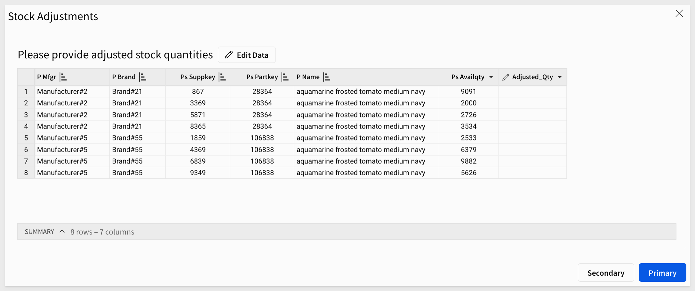

As a validation test, update one row's `Adjusted_Qty` value, hit `enter` and click `Save`:

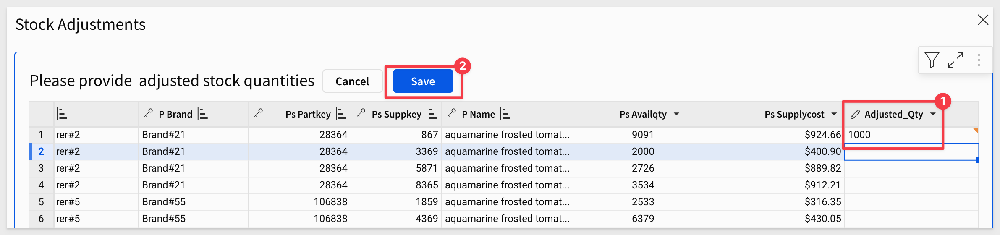

`Close` the modal. 

### Add tracking columns
Input tables come with two column that indicate who and when the last edit was made, each time a row is edited. Lets add them.

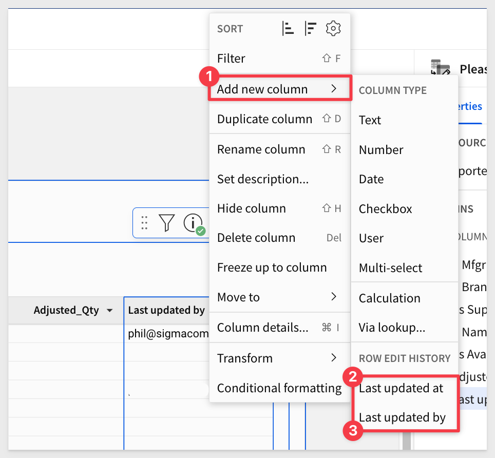

Lets also set an action `ON CLOSE` so that when the modal is closed, the control filter is reset on `Inventory Master`. Little touches like this mean alot to users and save click-time too:

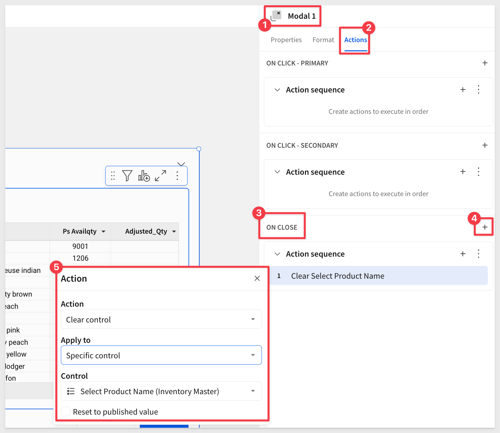

Next we will setup snapshotting, but first lets check in Snowflake to see where the input table stored this data.


<!-- END OF SECTION-->

## Warehouse view
Duration: 5

By design, input table data is not made directly available in Sigma via the warehouse connection. This is by design. This allows Sigma to apply sophisticated operations when working with input table data that has significant benefits to the user. Performance, multi-user access and reliability when editing data are just a few of the things driving this design decision. It would not be unreasonable to characterize an input table as a `Data API` than a conventional table. 

That said, we still need an easy way to leverage input table data for use as a "typical" table would be in the warehouse and in Sigma's UI. 

To simplify this Sigma provides support for [Warehouse Views](https://help.sigmacomputing.com/docs/create-and-manage-workbook-warehouse-views).

<aside class="positive">
<strong>IMPORTANT:</strong><br> Warehouse views are virtual tables saved to your data platform. You can create warehouse views from tables, pivot tables, input tables, and visualizations, then query them using Sigma or any other application in your data ecosystem. This simplifies queries and allows you to retrieve relevant and up-to-date subsets of data directly from your database.
</aside>

We can now use the results returned from the warehouse view when we create snapshots to capture "point-in-time" changes to stock levels, perform additional calculations and enrich the data with other information too.

Sigma has made creating a warehouse view simple; no SQL skills are required. It is done directly in Sigma's UI.

We will need to be in `edit` mode in Sigma and return to the modal page. The `Inventory Master` tables should not be filtered as we want all the rows included in our view. 

Using the input table's menu, click to create the warehouse view:

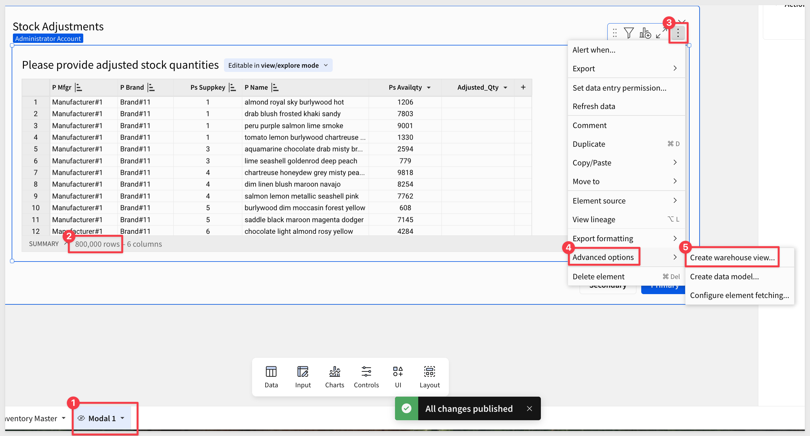

Make the name `SNAPSHOT_AND_INVENTORY_ADJUSTMENTS_VIEW` anc click `Create`:

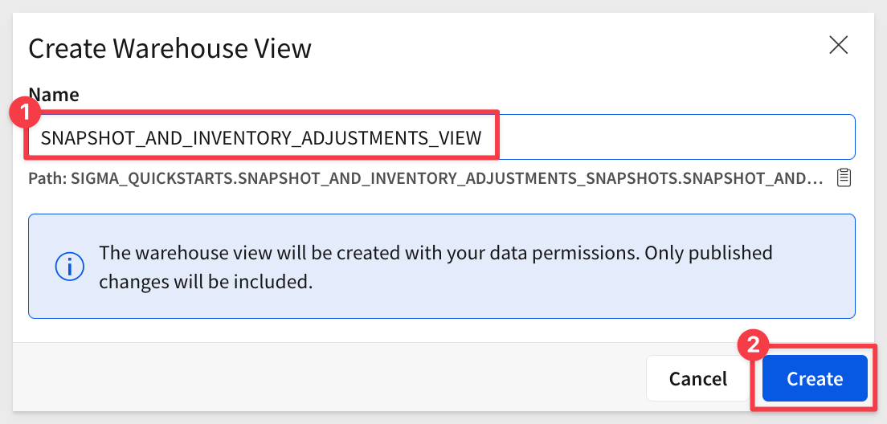

Sigma will start the process, and when finished we will see this information here:

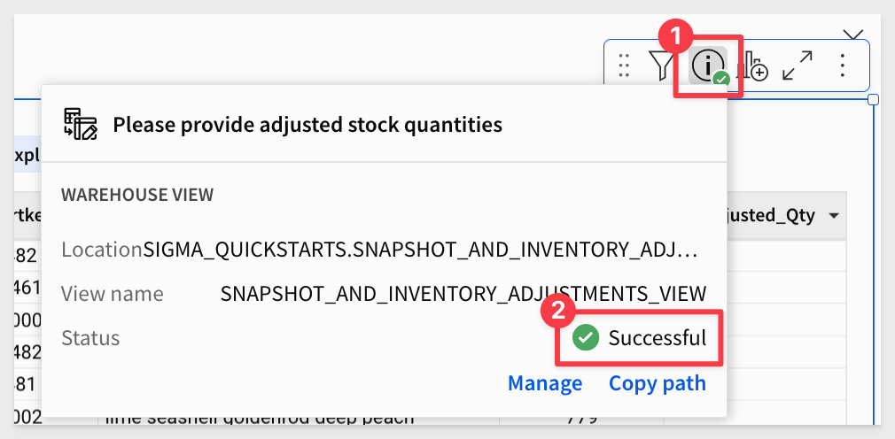

We can copy the path of the view for later use. Our path is:
```code
SIGMA_QUICKSTARTS.SNAPSHOT_AND_INVENTORY_ADJUSTMENTS_SNAPSHOTS.SNAPSHOT_AND_INVENTORY_ADJUSTMENTS_VIEW
```

There is also a page in Sigma to show the status of all warehouse views:

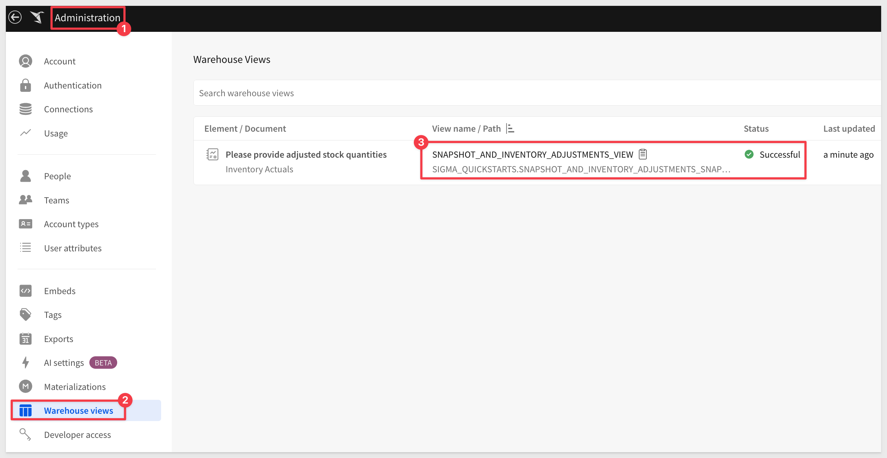

### Use case design decision time
It took a long minute to realize that several users might be using the input table to adjust inventory levels and we need to account for that. They ***might*** be doing it in real-time and collide but they input table itself can help with that. 

The more likely senario is that they entering data whenever and we want to snapshot those changes by user and date/time on demand. 

<aside class="positive">
<strong>IMPORTANT:</strong><br> Design decision: Users decide when they are ready to take a snapshot of thier work.
</aside>

To account for that, we **DO NOT** want to try to update any data in the input table in Snowflake directly. This is always a bad idea and may have unexpected results. Instead we will create a metadata table that will store information on who made what changes, and when, plus some other related details. This removes the need to try and interact with the input table data directly in Snowflake. 


<!-- END OF SECTION-->

## Metadata table
Duration: 5

The Metadata Table acts as an index for managing and tracking the snapshots created by the Snapshot Procedure. It provides a centralized summary of all snapshots, ensuring clear visibility and efficient historical tracking of inventory adjustments.

- Records metadata for each snapshot to enable version control and quick identification of snapshots.
- Facilitates incremental snapshots by maintaining a reference to previously captured rows, ensuring no duplicates are included in subsequent snapshots.

### How It Works

**1: Snapshot Registration:**<br>
Each time the Snapshot Procedure runs, it writes a summary of the snapshot into the SNAPSHOT_METADATA table.

**2: Duplicate Prevention:**<br>
Before creating a new snapshot, the procedure compares the input table data to the metadata table. 

Rows already captured in previous snapshots are excluded, ensuring only newly adjusted rows are added to the current snapshot.

**3: Historical Reference:**<br>
The metadata table serves as a historical record of all snapshots, enabling easy auditing and validation of inventory adjustments.

**4: Outcome:**<br>
Maintains an efficient and reliable record of snapshots for tracking inventory changes.

Supports incremental updates by storing unique identifiers (e.g., SUPPLIER_KEY, PART_NAME) to avoid duplicate entries.

This table plays a crucial role in enabling incremental snapshots, ensuring that each snapshot reflects only new edits while preserving historical accuracy.

Run the following command in Snowflake to create the schema, table and permissions:
```code
-- Create the Snapshot Metadata schema, table and permissions
-- This table will store information about each snapshot, enabling the filtering logic.
USE DATABASE SIGMA_QUICKSTARTS;
CREATE SCHEMA IF NOT EXISTS SIGMA_QUICKSTARTS.SNAPSHOT_AND_INVENTORY_ADJUSTMENTS_METADATA;
CREATE TABLE IF NOT EXISTS SIGMA_QUICKSTARTS.SNAPSHOT_AND_INVENTORY_ADJUSTMENTS_METADATA.SNAPSHOT_METADATA (
    snapshot_id STRING PRIMARY KEY,
    snapshot_time TIMESTAMP,
    snapshot_name STRING
);
GRANT CREATE TABLE, CREATE VIEW, CREATE STAGE ON SCHEMA SIGMA_QUICKSTARTS.SNAPSHOT_AND_INVENTORY_ADJUSTMENTS_METADATA TO ROLE ACCOUNTADMIN;
```

<table>
    <thead>
        <tr>
            <th colspan="3"><strong>SNAPSHOT_METADATA Table Schema</strong></th>
        </tr>
        <tr>
            <th>Column Name</th>
            <th>Type</th>
            <th>Description</th>
        </tr>
    </thead>
    <tbody>
        <tr>
            <td>SNAPSHOT_ID</td>
            <td>VARCHAR</td>
            <td>Unique identifier for each snapshot.</td>
        </tr>
        <tr>
            <td>SNAPSHOT_TIME</td>
            <td>TIMESTAMP</td>
            <td>Timestamp indicating when the snapshot was created.</td>
        </tr>
        <tr>
            <td>SNAPSHOT_NAME</td>
            <td>VARCHAR</td>
            <td>Name of the snapshot table (includes a timestamp).</td>
        </tr>
        <tr>
            <td>SUPPLIER_KEY</td>
            <td>VARCHAR</td>
            <td>Supplier identifier associated with the row.</td>
        </tr>
        <tr>
            <td>PART_NAME</td>
            <td>VARCHAR</td>
            <td>Name of the part being adjusted.</td>
        </tr>
        <tr>
            <td>BRAND</td>
            <td>VARCHAR</td>
            <td>Brand of the inventory item.</td>
        </tr>
        <tr>
            <td>MANUFACTURER</td>
            <td>VARCHAR</td>
            <td>Manufacturer of the inventory item.</td>
        </tr>
    </tbody>
</table>


<!-- END OF SECTION-->

## Creating the stored procedure
Duration: 5

Now that we have our view and metadata setup, we can leverage them directly in a Snowflake stored procedure. 

The Snapshot Procedure automates the creation of inventory adjustment snapshots in Snowflake based on user edits captured through Sigma input tables. Each snapshot reflects the current state of adjusted quantities for specific inventory items and ensures a historical record for tracking changes.

#### How it works

**1: Dynamic Snapshot Creation:**<br>
The procedure generates a unique table name for each snapshot using a timestamp (YYYYMMDD_HH24MISS format) to ensure table uniqueness.

**2: Data Collection:**<br>
Rows with updated quantities (ADJUSTED_QTY) are extracted from the Sigma input table via a dedicated view. Key columns included in the snapshot are:

<table>
    <thead>
        <tr>
            <th colspan="3"><strong>Snapshot Table Schema</strong></th>
        </tr>
        <tr>
            <th>Column Name</th>
            <th>Type</th>
            <th>Description</th>
        </tr>
    </thead>
    <tbody>
        <tr>
            <td>MANUFACTURER</td>
            <td>VARCHAR</td>
            <td>Manufacturer of the inventory item.</td>
        </tr>
        <tr>
            <td>BRAND</td>
            <td>VARCHAR</td>
            <td>Brand of the inventory item.</td>
        </tr>
        <tr>
            <td>SUPPLIER_KEY</td>
            <td>NUMBER</td>
            <td>Supplier identifier associated with the row.</td>
        </tr>
        <tr>
            <td>PART_NAME</td>
            <td>VARCHAR</td>
            <td>Name of the part being adjusted.</td>
        </tr>
        <tr>
            <td>ORIGINAL_QTY</td>
            <td>NUMBER</td>
            <td>Original quantity before adjustment.</td>
        </tr>
        <tr>
            <td>ADJUSTED_QTY</td>
            <td>NUMBER</td>
            <td>Adjusted quantity entered by the user.</td>
        </tr>
        <tr>
            <td>DIFFERENCE</td>
            <td>NUMBER</td>
            <td>Difference between the adjusted and original quantity.</td>
        </tr>
        <tr>
            <td>PERCENT_CHANGE</td>
            <td>NUMBER</td>
            <td>Percentage change between the adjusted and original quantity.</td>
        </tr>
        <tr>
            <td>LAST_UPDATED_AT</td>
            <td>TIMESTAMP</td>
            <td>Timestamp indicating when the adjustment was made.</td>
        </tr>
        <tr>
            <td>LAST_UPDATED_BY</td>
            <td>VARCHAR</td>
            <td>User who made the adjustment.</td>
        </tr>
    </tbody>
</table>

**3: Metadata Tracking:**<br>
The procedure writes a summary of the snapshot into a metadata table (SNAPSHOT_METADATA), table details described previously. 

**4: Incremental Snapshots:**<br>
Each execution of the procedure appends new rows reflecting the latest user edits. Previously captured rows are excluded by comparing the current dataset against the metadata.

**5: Result**<br>
Snapshots are stored as distinct tables, preserving a historical record of inventory adjustments. The metadata table acts as an index, enabling easy navigation and management of snapshots.

Run the following script in Snowflake to create our stored procedure:
```code
USE ROLE ACCOUNTADMIN;

CREATE OR REPLACE PROCEDURE SIGMA_QUICKSTARTS.SNAPSHOT_AND_INVENTORY_ADJUSTMENTS_METADATA.SNAPSHOT()
RETURNS VARCHAR(16777216)
LANGUAGE SQL
EXECUTE AS OWNER
AS '
DECLARE
    snapshot_datetime STRING;
    table_name STRING;
    sql_query STRING;
    snapshot_id STRING;
BEGIN
    -- Generate the current date and time in "YYYYMMDD_HH24MISS" format
    snapshot_datetime := TO_CHAR(CURRENT_TIMESTAMP(), ''YYYYMMDD_HH24MISS'');

    -- Generate a unique snapshot table name
    table_name := ''Inventory_Adjustment_'' || snapshot_datetime;

    -- Generate a unique snapshot ID
    snapshot_id := UUID_STRING();

    -- Construct the dynamic SQL query for creating the snapshot table
    sql_query := ''CREATE TABLE SIGMA_QUICKSTARTS.SNAPSHOT_AND_INVENTORY_ADJUSTMENTS_SNAPSHOTS."'' || table_name || ''" AS
        SELECT
            vw.P_MFGR AS Manufacturer,
            vw.P_BRAND AS Brand,
            vw.PS_SUPPKEY AS Supplier_Key,
            vw.P_NAME AS Part_Name,
            vw.PS_AVAILQTY AS Original_Qty,
            vw.ADJUSTED_QTY AS Adjusted_Qty,
            COALESCE(vw.ADJUSTED_QTY - vw.PS_AVAILQTY, 0) AS Difference,
            CASE 
                WHEN vw.PS_AVAILQTY > 0 THEN 
                    ((COALESCE(vw.ADJUSTED_QTY, vw.PS_AVAILQTY) - vw.PS_AVAILQTY) / vw.PS_AVAILQTY) * 100
                ELSE NULL
            END AS Percent_Change,
            vw.LAST_UPDATED_AT AS Last_Updated_At,
            vw.LAST_UPDATED_BY AS Last_Updated_By
        FROM
            SIGMA_QUICKSTARTS.SNAPSHOT_AND_INVENTORY_ADJUSTMENTS_WB.SNAPSHOT_AND_INVENTORY_ADJUSTMENTS_VIEW vw
        LEFT JOIN
            SIGMA_QUICKSTARTS.SNAPSHOT_AND_INVENTORY_ADJUSTMENTS_METADATA.SNAPSHOT_METADATA md
        ON
            vw.P_MFGR = md.MANUFACTURER AND
            vw.P_BRAND = md.BRAND AND
            vw.PS_SUPPKEY = md.SUPPLIER_KEY AND
            vw.P_NAME = md.PART_NAME
        WHERE
            vw.ADJUSTED_QTY IS NOT NULL AND
            md.SNAPSHOT_ID IS NULL''; -- Exclude rows already captured in metadata

    -- Execute the dynamic SQL query to create the snapshot table
    EXECUTE IMMEDIATE sql_query;

    -- Insert metadata about the snapshot into the metadata table
    EXECUTE IMMEDIATE ''INSERT INTO SIGMA_QUICKSTARTS.SNAPSHOT_AND_INVENTORY_ADJUSTMENTS_METADATA.SNAPSHOT_METADATA 
                       (snapshot_id, snapshot_time, snapshot_name, supplier_key, part_name, brand, manufacturer)
                       SELECT 
                           '''''' || snapshot_id || '''''' AS snapshot_id,
                           CURRENT_TIMESTAMP() AS snapshot_time,
                           '''''' || table_name || '''''' AS snapshot_name,
                           vw.PS_SUPPKEY,
                           vw.P_NAME,
                           vw.P_BRAND,
                           vw.P_MFGR
                       FROM
                           SIGMA_QUICKSTARTS.SNAPSHOT_AND_INVENTORY_ADJUSTMENTS_WB.SNAPSHOT_AND_INVENTORY_ADJUSTMENTS_VIEW vw
                       LEFT JOIN
                           SIGMA_QUICKSTARTS.SNAPSHOT_AND_INVENTORY_ADJUSTMENTS_METADATA.SNAPSHOT_METADATA md
                       ON
                           vw.P_MFGR = md.MANUFACTURER AND
                           vw.P_BRAND = md.BRAND AND
                           vw.PS_SUPPKEY = md.SUPPLIER_KEY AND
                           vw.P_NAME = md.PART_NAME
                       WHERE
                           vw.ADJUSTED_QTY IS NOT NULL AND
                           md.SNAPSHOT_ID IS NULL''; -- Exclude rows already captured in metadata

    -- Return a confirmation message with the snapshot table name
    RETURN ''Snapshot table created successfully: '' || table_name;
END;
';
```

This procedure enables versioned tracking of inventory changes and ensures data integrity by avoiding duplicates while maintaining a clear audit trail.

### Manual test of script
Before we configure Sigma to run the script on demand, we should make sure it works. Earlier, we did edit one row of data, settings it's `Adjusted_Qty` to `1000`, so we have something to validate against. 

Execute the following script in the Snowflake console:
```code
CALL SIGMA_QUICKSTARTS_SNAPSHOTS.STORED_PROCEDURES.SNAPSHOT_INVENTORY_ADJUSTMENTS();
```

The expected response is:

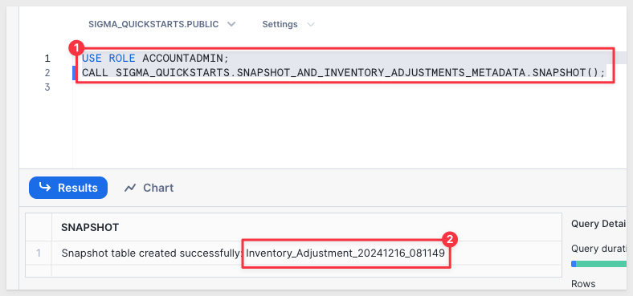

In the snapshot table we can see our one row that was edited:

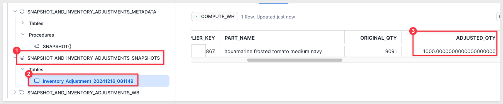


<!-- END OF SECTION-->

## Snapshotting
Duration: 5

There are many ways to design an interface for snapshotting; lets explore just one. We will make some assumptions but when we are done, the basics will be clear and you can alter the design any way that suits your requirements.

### How to call it with Sigma
Sigma supports stored procedures thru actions, and we will use an action to call our snapshot script that is stored in Snowflake.

For those may not already know, A stored procedure is a reusable block of SQL code stored in the database that performs specific tasks. It simplifies workflows by allowing complex operations, such as data manipulations and calculations, to be executed as a single command.

<aside class="positive">
<strong>IMPORTANT:</strong><br> The ability to perform these complex operations directly within the database opens up endless possibilities. Teams can leverage powerful tools like Snowflake Cortex for advanced analytics or integrate Python scripts for custom logic, all while maintaining efficiency and scalability.
</aside>

Our stored procedure will create a snapshot of inventory adjustments by leveraging the Warehouse View (WV) to ensure consistent and user-friendly column names. It ensures that only the relevant rows (matching current edits in the input table) are included in the snapshot. 

We already created our stored procedure in the last section. 

The stored procedure is located here:

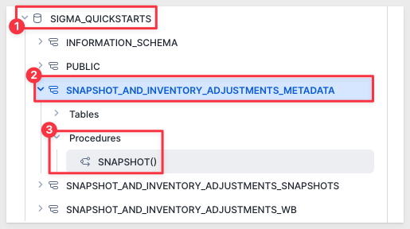

### Update Modal in Sigma
After our manual test, we know that the snapshotting works. Return to Sigma and update the actions on `Modal 1` to allow users to trigger it.

First, open `Mondal 1's` format panel and uncheck the option for `Show close icon`. This removes the `X` icon from the upper right corner of the modal. 

Next we want to change configure our footer buttons for text and action. 

#### Primary button
Set the text for the `Primary button` to `Take a Snapshot`. 

Change the `Secondary button` to `Return to Inventory Master` while we are on this screen anyway:

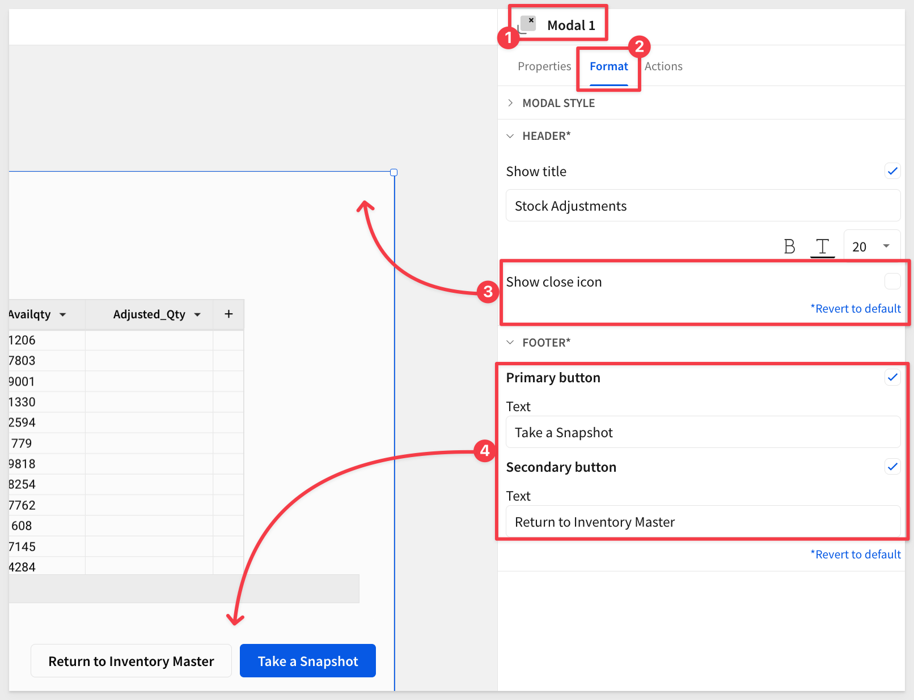

Next, configure an action to trigger our stored procedure in Snowflake:

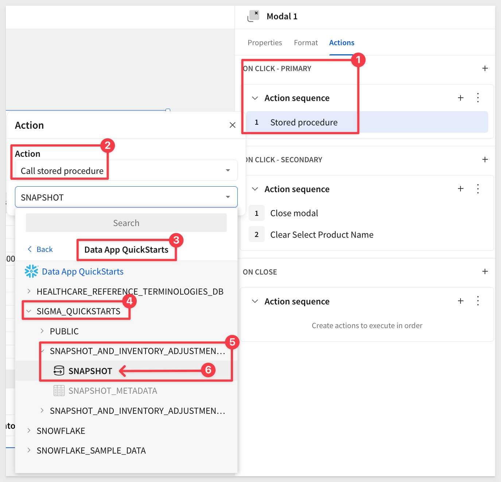

#### Secondary button
Configure an action for the button to return the user to `Inventor Master` and clear the control so that the table is not filtered when the user is landed there:

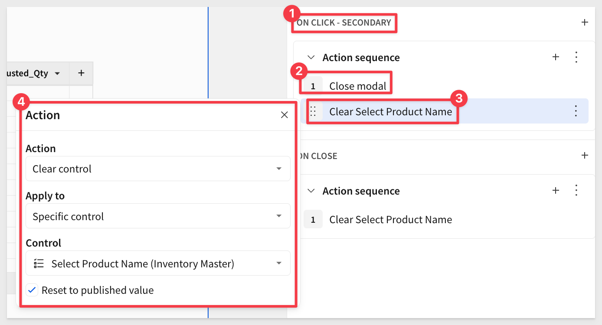

`Publish` the workbook and return to the `published version`.


<!-- END OF SECTION-->

## Validation testing
Duration: 5

<aside class="positive">
<strong>IMPORTANT:</strong><br> Be aware that there may be a small amount of lag time (depending on the Snowflake warehouse configuration) between when a users clicks "Save" on an input table and the data being available in Snowflake. If we run our stored procedure before the data has landed, the latest edits will not appear in the the metadata table or snapshot. For the purposes of this QuickStart, we did not include logic to check the the data has landed, but wanted to mention this potential situation so that developers can include scipting to handle it.
</aside>

Lets perform to editing "runs" in Sigma, each time saving the edits and taking a snapshot. The expected outcome will be two additional snapshot tables. 

### Reset the text environment
While not required, it may be helpful to know how to quickly reset the data so that the test results are more easily seen. Here is how to do that:

**1:** Clear the one cell that was edited (to have the "1000" value). Do this directly in the Sigma UI. Just click on the cell that has the value, press the delete key and then enter. Save the input table data. It will not matter that Sigma will record this action in Snowflake, we are only concerned with rows that have values for `Ajusted_Qty`, so this edit will be ignored when we snapshot.

**2:** Truncate the metadata table to remove all rows.
```code
TRUNCATE TABLE SIGMA_QUICKSTARTS.SNAPSHOT_AND_INVENTORY_ADJUSTMENTS_METADATA.SNAPSHOT_METADATA;
```

**3:** Drop all previous snapshots.
We like to list them out before just deleting table. Run this script to do that:
```code
-- List out the snapshot tables. Copy paste and run the output
SELECT 'DROP TABLE SNAPSHOT_AND_INVENTORY_ADJUSTMENTS_SNAPSHOTS."' || TABLE_NAME || '";'
FROM INFORMATION_SCHEMA.TABLES
WHERE TABLE_SCHEMA = 'SNAPSHOT_AND_INVENTORY_ADJUSTMENTS_SNAPSHOTS';
```

Right-click the box shown below and select `Copy`:

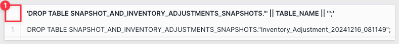

Paste in the script and run the row(s) to delete the snapshots:

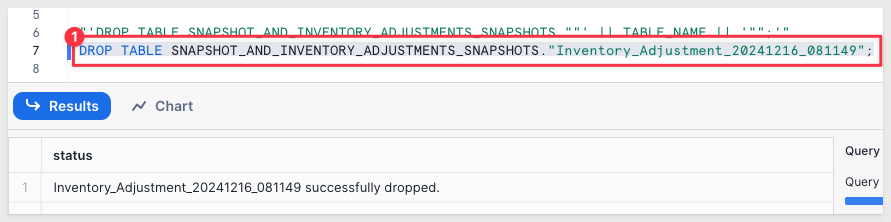

### Testing

In Sigma, select a product to edit, change a few values, `save` the changes (pause for a few second to make sure the data landed) and then click `Take a Snapshot`:

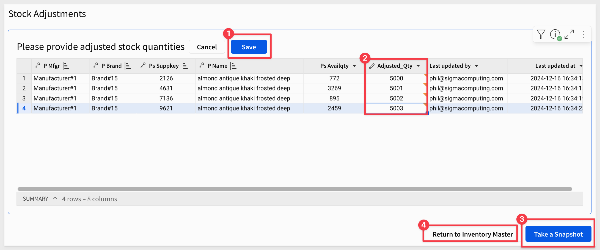

After the `Take a Snapshot` button returns to active, click `Return to Inventory Master`.

Repeat the editing, selecting a different product to edit:

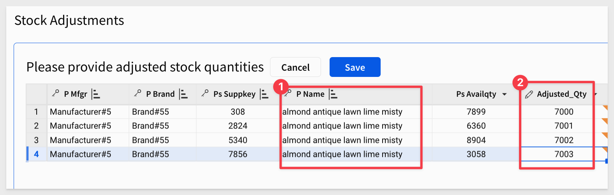

<aside class="negative">
<strong>NOTE:</strong><br> Using different values for the adjusted quantities is a good way to ensure the code is performing as expected. 
</aside>

Return to Snowflake and check that there are two snapshots and they have only the rows from run one and two:

**Run one snapshot table:**

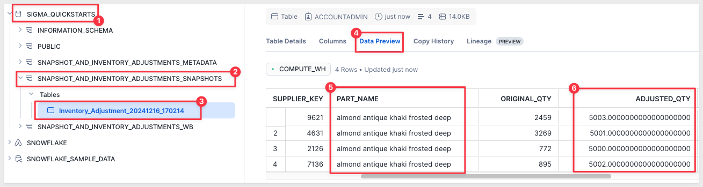

**Run two snapshot table:**

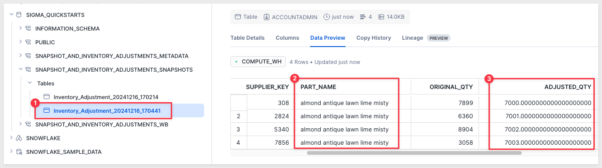

Now that we have verified that the data app is working, we can do something with all this new data.


<!-- END OF SECTION-->


## Viewing Snapshots
Duration: 5

Over time we will collect many snapshots and we may want to look at then individually or in one table so that we can explore the data futher. 

Lets just assume that we want to look at all of them as one big table and leave the analytics part to the assumption that is understood. 

We will not immediately know that all the table names, and using the connection browser to join them would required on-going maintence too.  

Instead, lets follow a the path we have already taken in this QuickStart and leverage Snowflake stored procedures and a view to create single table that unions (combines) every available snapshot. Users will be able to click a button to refresh the union to account for newly created snapshots.

### How it will work

**1 Use a Snowflake view:**<br>
A single view that combines (unions) all snapshot tables. This ensures Sigma always reads from a single, consistent source.

**2: Use a stored procedure:**<br>
A Snowflake stored procedure that dynamically unions all snapshot tables and updates the view with the latest snapshots.

**3: Sigma workflow:**<br>
Users interact with a Sigma button to trigger the stored procedure.

The view refreshes to include newly created snapshot tables.

<aside class="positive">
<strong>IMPORTANT:</strong><br> Unioning tables can be done is Sigma or in the warehouse and a few other ways as well. We are showing one example for completeness only.
</aside>

### Snowflake configuration
Since the number of snapshot tables grows over time, the stored procedure needs to regenerate the` CREATE OR REPLACE VIEW` command to dynamically `Union All` snapshots.

Below is the stored procedure that needs to be run in Snowflake:
```code
USE ROLE ACCOUNTADMIN;

CREATE OR REPLACE PROCEDURE SIGMA_QUICKSTARTS.SNAPSHOT_AND_INVENTORY_ADJUSTMENTS_SNAPSHOTS.UPDATE_ALL_SNAPSHOTS_VIEW()
RETURNS VARCHAR(16777216)
LANGUAGE SQL
EXECUTE AS OWNER
AS $$
DECLARE
    snapshot_list STRING;
    union_query STRING;
BEGIN
    -- Generate a list of all snapshot tables dynamically
    snapshot_list := (
        SELECT LISTAGG(
            'SELECT * FROM SIGMA_QUICKSTARTS.SNAPSHOT_AND_INVENTORY_ADJUSTMENTS_SNAPSHOTS."' || TABLE_NAME || '"',
            ' UNION ALL '
        )
        FROM INFORMATION_SCHEMA.TABLES
        WHERE TABLE_SCHEMA = 'SNAPSHOT_AND_INVENTORY_ADJUSTMENTS_SNAPSHOTS'
          AND TABLE_NAME LIKE 'Inventory_Adjustment_%'
    );

    -- Check if snapshot_list is empty or NULL
    IF (snapshot_list IS NULL OR LENGTH(snapshot_list) = 0) THEN
        RETURN 'No snapshot tables found to union.';
    END IF;

    -- Construct and execute the dynamic SQL to update the view
    union_query := 'CREATE OR REPLACE VIEW SIGMA_QUICKSTARTS.SNAPSHOT_AND_INVENTORY_ADJUSTMENTS_SNAPSHOTS.ALL_SNAPSHOTS_VIEW AS ' || snapshot_list;

    EXECUTE IMMEDIATE union_query;

    RETURN 'ALL_SNAPSHOTS_VIEW updated successfully with latest snapshot tables.';
END;
$$;
```

With our stored procedure and view created, we can return to Sigma.

### Back in Sigma
In Sigma, create a new page called `Snapshots`. 

Add a new `Button`, set the label to `Refresh Snapshot List`. Set it's action to call the stored procedure `UPDATE_ALL_SNAPSHOTS_VIEW`:

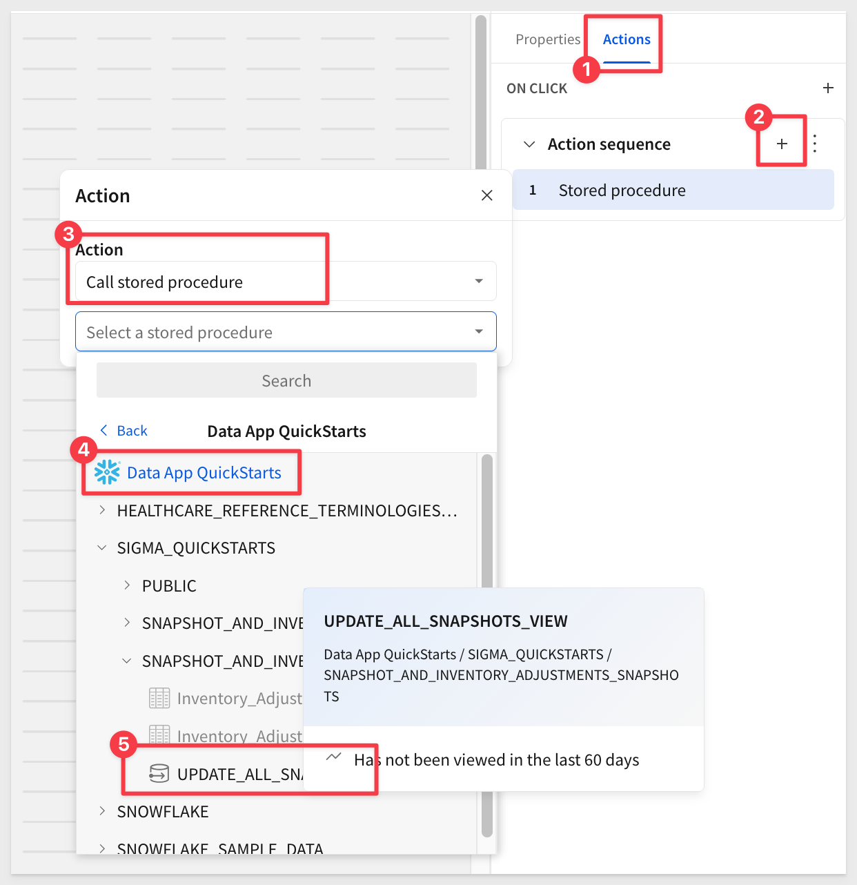

Click the new button to run the stored procedure. 

Next, add a new `Data` > `Table` element to the page, selecting the `Data Apps for QuickStarts` connection and `SQL` as the source. 

Paste this SQL query into the editor:
```code
SELECT *
FROM SIGMA_QUICKSTARTS.SNAPSHOT_AND_INVENTORY_ADJUSTMENTS_SNAPSHOTS.ALL_SNAPSHOTS_VIEW
```

Click `Run`.

We can now see all the snapshots unioned together into one table. 

Also notice that we can see two columns that were created programmatically by our snapshotting stored procedure earlier.

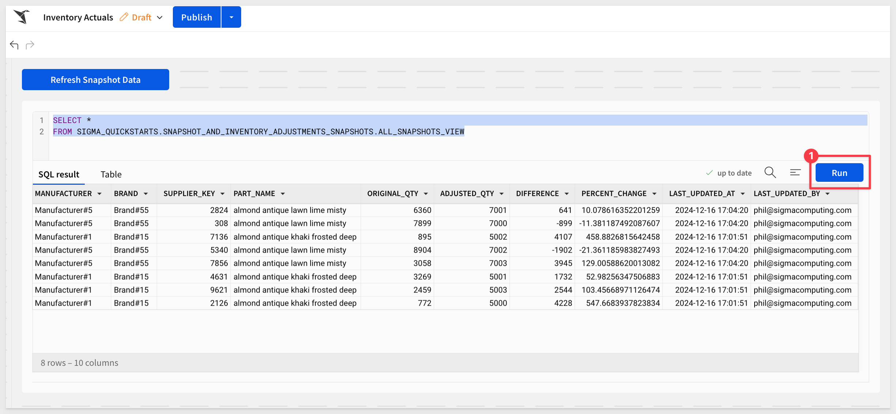

<aside class="positive">
<strong>IMPORTANT:</strong><br> The ability to manipulate warehouse data using stored procedures and leverage that in Sigma opens up a vast number of possibilites. 
</aside>

As a last step (and we leave the details up to you to configure as "extra credit"), create another table that uses the `Custom SQL` table as its source. Then we can join the `PARTSUPP` table to it so we can bring in the `Ps Supplycost` column and use that to calcuate the `Dollars Lost` amount, The percent change and dollars lost numbers are crazy large; we did not worry about using reasonable values when we were editing inventory numbers earlier:


We could do so much more to visualize the new data but the point is proven; data apps in Sigma are powerful. For example:

<ul>
      <li><strong>Snapshot List View:</strong> Display snapshots as a list ordered by date, with metadata like the number of rows updated and any associated notes. Add filters to narrow down data for review.</li>
      <li><strong>Snapshot Comparison:</strong> Enable users to compare two snapshots side by side to identify differences in inventory levels, financial figures, or pipeline stages.</li>
      <li><strong>Trend Visualization:</strong> Include visualizations (e.g., bar or line charts) to show trends over time, such as inventory adjustments or sales progress.</li>
      <li><strong>Detailed Audit Logs:</strong> Allow users to drill into specific snapshots to see details like who made updates, what columns changed, and how they differ from previous records.</li>
</ul>

Lets take a minute and review some takeaways from this exercise as we covered so much ground and there are some things we can take into future projects. 


<!-- END OF SECTION-->

## Takeaways
Duration: 5

Here are a few observations from creating this QuickStart that you may not have encountered, but are worth mentioning.

**1: Understand the Design Upfront:**<br>
Before diving into implementation, take time to map out the overall process, including key components like input tables, snapshots, metadata tracking, and downstream views. A clear understanding of how each part interacts reduces surprises and rework during development.

**2: Snapshot Schema Design:**<br>
Organize your Snowflake objects into schemas that clearly reflect their purpose. For example:
        
<ul>
      <li><strong>Metadata Tables:</strong> Place tracking and logging tables (e.g., SNAPSHOT_METADATA) in a dedicated schema such as METADATA or SNAPSHOT_AND_INVENTORY_ADJUSTMENTS_METADATA.</li>
      <li><strong>Snapshot Tables:</strong> Use a dedicated schema for dynamically created snapshot tables (e.g., SNAPSHOT_AND_INVENTORY_ADJUSTMENTS_SNAPSHOTS), keeping them isolated to avoid clutter.</li>
      <li><strong>Working Tables and Views:</strong> Place base tables and views consumed for operational workflows in a separate schema (e.g., SNAPSHOT_AND_INVENTORY_ADJUSTMENTS_WB for workbook-related tables).</li>
</ul>

**3: Metadata as a Source of Truth:**<br>
Incorporating a metadata table was instrumental for tracking snapshots and ensuring unique records were captured in each run. This approach provides a single source of truth for what has been snapshot, when, and by whom.

**4: Iterative Development:**<br>
Implementing a complex workflow like dynamic snapshotting requires an iterative approach. Start with a minimal viable procedure, validate each component (e.g., table creation, unions, metadata insertion), and only then refine for additional features.

**5: Latency Considerations:**<br>
Data updates in the input table **may** take time to persist in Snowflake. Recognizing and accounting for this delay (e.g., introducing checks in code) can ensures accurate snapshots and prevents confusion during testing and subsequent operation.

**6: View as a Reusable Layer:**<br>
Instead of dynamically querying tables from Sigma, creating a view in Snowflake (ALL_SNAPSHOTS_VIEW) simplifies user access to unioned data. This decouples the complexity of managing snapshot tables from the Sigma user experience.

**7: Testing and Resetting the Environment:**<br>
A structured test approach, including a “reset for testing” workflow, allowed for clean, predictable results. Regularly cleaning up snapshot tables and metadata ensures accurate validation during iterative development.

Perhaps you encounted some of your own too. We hope that covering these has been useful and will accellerate your future projects. 


<!-- END OF SECTION-->

## What we've covered
Duration: 5

Your trimmed-down version is clear, concise, and effectively captures the key points. Here's a minor tweak for flow and readability:

In this QuickStart, we demonstrated how Sigma's intuitive interface simplifies building data applications by combining user interactivity with powerful backend automation.

By leveraging Sigma's front-end flexibility and Snowflake's backend power, this QuickStart bridges the gap between analytics and operational workflows, providing a solid foundation for creating interactive and impactful data apps.
**Additional Resource Links**

[Blog](https://www.sigmacomputing.com/blog/)<br>
[Community](https://community.sigmacomputing.com/)<br>
[Help Center](https://help.sigmacomputing.com/hc/en-us)<br>
[QuickStarts](https://quickstarts.sigmacomputing.com/)<br>

Be sure to check out all the latest developments at [Sigma's First Friday Feature page!](https://quickstarts.sigmacomputing.com/firstfridayfeatures/)
<br>

[](https://twitter.com/sigmacomputing)&emsp;
[](https://www.linkedin.com/company/sigmacomputing)&emsp;
[](https://www.facebook.com/sigmacomputing)


<!-- END OF WHAT WE COVERED -->
<!-- END OF QUICKSTART -->
