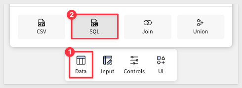
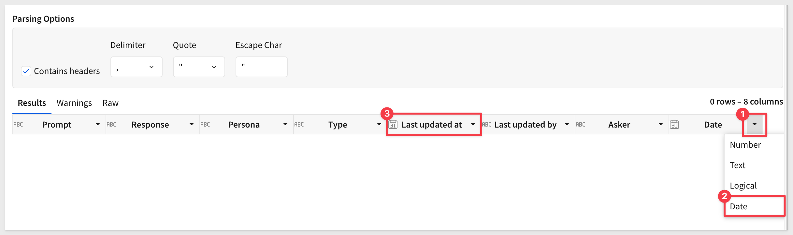
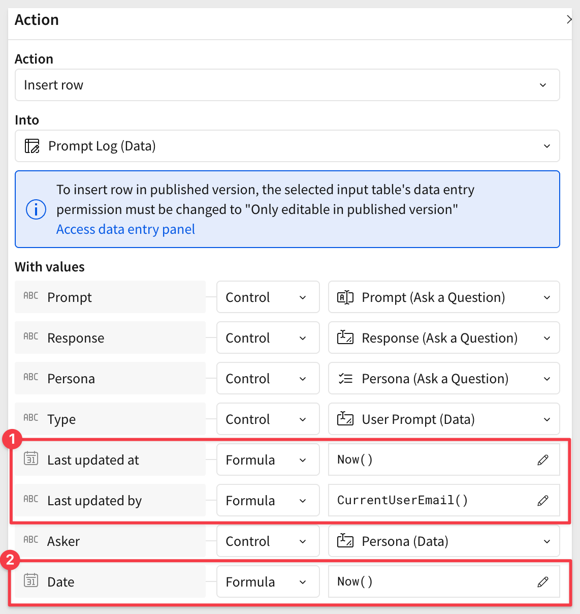

author: pballai
id: dataapps_snowflake_ask_cortex
summary: dataapps_snowflake_ask_cortex
categories: dataapps
environments: web
status: Published
feedback link: https://github.com/sigmacomputing/sigmaquickstarts/issues
tags: default
lastUpdated: 2024-04-11

# Use Snowflake Cortex with Sigma

## Use Snowflake Cortex with Sigma
Duration: 5 

In this QuickStart, you'll explore how to ask natural language questions about your data using Snowflake Cortex, Snowflake’s built-in large language model (LLM) capability.

You'll submit a question like:

“Which region is underperforming?”<br>
“Where are we problematic?”

Cortex interprets your question, combines it with business context, and returns a narrative answer powered by an LLM—no code or SQL required.

### What is Cortex?
Cortex is Snowflake’s serverless AI platform for building and deploying LLM-powered experiences directly inside your Snowflake environment. It enables teams to ask questions in plain English and get rich answers—without needing to move or export data.

For more information about Snowflake Cortex, see [Snowflake
Cortex AI.](https://www.snowflake.com/en/product/features/cortex/)

### LLMs vs ML
Traditional machine learning (ML) models are trained to solve very specific tasks (e.g., churn prediction or price forecasting). In contrast, LLMs (Large Language Models) like [Anthropic Claude](https://docs.anthropic.com/en/docs/about-claude/models/all-models) can understand and generate natural language across a wide range of use cases — including summarizing, explaining, and reasoning over structured data.

That flexibility is what powers the experience you're about to try.

### Why Claude?
In this QuickStart, we’ve chosen Claude Sonnet, a fast, cost-effective LLM from Anthropic, known for its high-quality business writing and reasoning. Claude is integrated via [Cortex’s COMPLETE function](https://docs.snowflake.com/en/sql-reference/functions/complete-snowflake-cortex) and used to generate executive-level summaries based on your chart or data prompt.

<aside class="positive">
<strong>IMPORTANT:</strong><br>  Snowflake Cortex is not enabled by default in most accounts and is not available in all regions. To use Cortex, you must request enablement through Snowflake Support.
</aside>

For information on the supported regions, see [Region availability.](https://docs.snowflake.com/en/user-guide/snowflake-cortex/cortex-analyst)

<aside class="positive">
<strong>IMPORTANT:</strong><br> Some screens in Sigma may appear slightly different from those shown in QuickStarts. This is because Sigma is continuously adding and enhancing functionality. Rest assured, Sigma’s intuitive interface ensures that any differences will not prevent you from successfully completing any QuickStart.
</aside>

For more information on Sigma's product release strategy, see [Sigma product releases.](https://help.sigmacomputing.com/docs/sigma-product-releases)

If something is not working as you expect, here is how to [contact Sigma support.](https://help.sigmacomputing.com/docs/sigma-support)

<aside class="negative">
<strong>IMPORTANT:</strong><br> Some features may carry the "Beta" tag. Beta features are subject to quick, iterative changes. As a result, the latest product version may differ from the contents of this document.
</aside>

### Target Audience
The typical audience for this QuickStart includes data analysts, business users, and analytics engineers who want to explore how to use natural language to interact with data directly inside Sigma and Snowflake using large language models (LLMs).

### Prerequisites

<ul> 
  <li>A computer with a modern web browser (any browser will work).</li> 
  <li>Access to your Sigma environment.</li> 
  <li>Administrative access to a Snowflake environment.</li> 
  <li>The Snowflake sample database.</li> 
  <li>Snowflake Cortex enabled in your Snowflake account.</li> 
  <li>Some familiarity with Sigma and Snowflake is assumed. Not all basic steps will be shown.</li>
 </ul>

If the Snowflake instance you are using does not contain the sample data, it can be manually loaded. For more information, see [Using the Sample Database.](https://docs.snowflake.com/en/user-guide/sample-data-using)

<aside class="positive">
<strong>IMPORTANT:</strong><br> Sigma recommends using non-production resources when completing QuickStarts.
</aside>

<button>[Sigma Free Trial](https://www.sigmacomputing.com/free-trial/)</button> <button>[Snowflake Free Trial](https://signup.snowflake.com/)</button> 


## Snowflake Connection in Sigma
Duration: 5

We need to configure a new connection to Snowflake in Sigma. This connection must meet three key requirements:

- **Cortex Enabled:** 
It must point to a Snowflake instance where Cortex is already enabled.

- **Sigma Write-Back Support:** 
It must be configured to allow Sigma write-back, enabling input tables to capture and store user-entered data directly back into Snowflake.

- **Snowflake Sample Database:** 
This can be installed if it’s not already present.

### Enabling write access
Write access requires granting a Snowflake user the following privileges:

- Database: USAGE
- Schema: USAGE, CREATE TABLE, CREATE VIEW, CREATE STAGE

For simplicity, we'll use the `ACCOUNTADMIN` role.

### Example script
The following script will create a database, schema and permissions (at a minimum level) and can be used as a reference when setting up write access.

```code
USE ROLE ACCOUNTADMIN;

-- Create and use Sigma Writeback DB
CREATE DATABASE IF NOT EXISTS SIGMA_WRITEBACK;
USE DATABASE SIGMA_WRITEBACK;

-- Create schemas for write-back
CREATE SCHEMA IF NOT EXISTS SIGMA_WRITEBACK.INPUT_TABLES;

-- Permissions for Sigma Input Tables (ACCOUNTADMIN FOR SIMPLIFICATION ONLY, NOT RECOMMENDED IN PRACTICE)
GRANT USAGE ON SCHEMA SIGMA_WRITEBACK.INPUT_TABLES TO ROLE ACCOUNTADMIN;
GRANT CREATE TABLE, CREATE VIEW, CREATE STAGE ON SCHEMA SIGMA_WRITEBACK.INPUT_TABLES TO ROLE ACCOUNTADMIN;
```

For more information on setting up write access, see [Set up write access](https://help.sigmacomputing.com/docs/connect-to-snowflake#configure-write-access)

### Sigma connection
Log into Sigma as Administrator and navigate to `Administration` > `Connections`.


Fill out the required connection name and details. For more information on the required values, see [Connect to Snowflake](https://help.sigmacomputing.com/docs/connect-to-snowflake)

In the `Write access` section, be sure to select the database and schema created earlier.

### Snowflake sample database
If the `SNOWFLAKE_SAMPLE_DATA` is not present in your Snowflake instance, it can be added manually.

```code
-- Create a database from the share.
CREATE DATABASE SNOWFLAKE_SAMPLE_DATA FROM SHARE SFC_SAMPLES.SAMPLE_DATA;

-- Grant the PUBLIC role access to the database.
-- Optionally change the role name to restrict access to a subset of users.
GRANT IMPORTED PRIVILEGES ON DATABASE SNOWFLAKE_SAMPLE_DATA TO ROLE PUBLIC;
```

For more information on the Snowflake sample data, see [Sample Data Sets](https://docs.snowflake.com/en/user-guide/sample-data)


## Source Data Model
Duration: 5

Before integrating Cortex, we need to create content that it can respond to.

We will create a [data model](https://help.sigmacomputing.com/docs/create-and-manage-data-models) in Sigma to do this and add some custom [metrics](https://help.sigmacomputing.com/docs/create-and-manage-metrics) that we will reuse later.

Log into Sigma as `Administrator` and click `Create New` > `Data Model`.

Select `Table` from the `Data` group on the `Element Bar`:


Select `SQL` as the source:



Be sure to select the connection that has access to Snowflake’s sample data.

If the Snowflake instance you are using does not contain the sample data, it can be manually loaded. For more information, see [Using the Sample Database.](https://docs.snowflake.com/en/user-guide/sample-data-using)

<aside class="positive">
<strong>IMPORTANT:</strong><br> Cortex does not have access to the Sigma Sample Database. Attempts to use it will fail with a “warehouse error”.
</aside>

Use the following SQL script:
```code
SELECT
    o.o_orderkey                            AS order_number,
    o.o_orderdate                           AS order_date,
    l.l_partkey                             AS sku_number,
    l.l_extendedprice                       AS revenue,
    l.l_quantity * ps.ps_supplycost         AS cogs,
    p.p_name                                AS product_name,
    p.p_type                                AS product_type,
    p.p_brand                               AS brand,
    c.c_name                                AS customer_name,
    c.c_address                             AS store_city,
    r.r_name                                AS store_region
FROM
    snowflake_sample_data.tpch_sf1.orders o
JOIN
    snowflake_sample_data.tpch_sf1.lineitem l
    ON o.o_orderkey = l.l_orderkey
JOIN
    snowflake_sample_data.tpch_sf1.part p
    ON l.l_partkey = p.p_partkey
JOIN
    snowflake_sample_data.tpch_sf1.partsupp ps
    ON l.l_partkey = ps.ps_partkey
   AND l.l_suppkey = ps.ps_suppkey
JOIN
    snowflake_sample_data.tpch_sf1.customer c
    ON o.o_custkey = c.c_custkey
JOIN
    snowflake_sample_data.tpch_sf1.nation n
    ON c.c_nationkey = n.n_nationkey
JOIN
    snowflake_sample_data.tpch_sf1.region r
    ON n.n_regionkey = r.r_regionkey
WHERE
  o.o_orderdate >= (
      SELECT DATEADD(MONTH, -12, MAX(o2.o_orderdate))
      FROM snowflake_sample_data.tpch_sf1.orders o2
  )
  AND
  o.o_orderdate < (
      SELECT DATE_TRUNC('MONTH', MAX(o2.o_orderdate))
      FROM snowflake_sample_data.tpch_sf1.orders o2
  );
```

Once pasted, click `Run`.

The query will return about 900,000 rows and 14 columns. We can toggle the SQL script off by clicking the SQL icon:


<aside class="positive">
<strong>IMPORTANT:</strong><br> Models used by Snowflake Cortex have limitations on size which are given in tokens. Tokens generally represent about four characters of text, so the number of words corresponding to a limit is less than the number of tokens. Inputs that exceed the limit result in an error.
</aside>

For more information on current restrictions, see Snowflake's documentation on [Model restrictions.](https://docs.snowflake.com/en/user-guide/snowflake-cortex/llm-functions#model-restrictions)

Rename the table to `SALES_FACT_CURATED`.

Rename the data model to `Cortex QuickStart Data Model`.

Click `Publish`.

### Add metrics
A metric is a custom aggregate calculation that can be reused across data elements that share a data source. If you define metrics in data models, datasets, or tables from a connected database or catalog, you can help users perform calculations in a consistent way both easily and efficiently.

Click the `+` to add a new metric for `Profit`:


Configure the metric as shown, using this formula:
```code
Sum([Revenue]) - Sum([Cogs])
```


Click Save—the metric will now appear in the list of available metrics.

Repeat the process to add metrics for the following:

**Revenue (formatted as currency)**
```code
Sum([Revenue])
```

**Gross Margin (formatted as percentage)**
```
(Sum([Revenue]) - Sum([Cogs])) / Sum([Revenue])
```

You should now see all three metrics in the data model:


Click `Publish`.

### Create a Workbook and data page
Click the  icon to return to the homepage. 

Click `Create New` > `Workbook`.

Add a new `Data` > `Table` from the `Element bar` and select `Tables and Datasets` as the source.

In the `Recent` group, we can find the `Cortex QuickStart Datamodel` we just created:


From that dataset, there’s only one element to choose from—`SALES_FACT_CURATED`. Select that.

Once the table is loaded, we can start to leverage its data in our workbook, including the metrics.

Group the table by `Customer Name`, and  add `Order Date` as a `CALCULATION` under the group.

Then change the `Order Date` column to show the first purchase date by changing its formula to:
```code
Min([Order Date])
```

Rename the `Min of Date` column to `First Purchase Date`.


Rename the workbook page tab to `Data`.

Save the workbook and name it `Sigma Cortex QuickStart`.


<!-- END OF SECTION-->

## Ask a Question Page
Duration: 5 min

Create a new page and rename it `Ask a Question`.

### Create controls
Add a new `Text input` control to the page and configure it as shown:


Configure additional information to be displayed for users:


Add a `Text area` control to the page and configure it as shown:


Click `Publish`.

### Create a chart
Add a new `Line Chart` from the `Element bar`, under the `Charts` group.

Select the `SALES_FACT_CURATED` table to connect to the chart.

Use the instructions below the image to configure the chart as shown:

**X-Axis Columns**<br>
Drag `Order Date` to the `X-AXIS`, rename it to `Month` and change the formula to:
```code
DateTrunc("month", [Order Date])
```

**Y-Axis Columns**<br>
Drag the `Revenue` column to the `Y-AXIS`.

Drag the `Order Date` to the `Y-AXIS` and change the formula to:
```code
DateFormat([Order Date], "%Y-%m")
```

Rename the altered date column from `Calc` to `MonthText`.

Add another new column to the `Y-AXIS` (click the `+` icon) using this formula:
```code
[Metrics/Gross Margin]
```

**Group by color and category column**<br>
Group the chart by `Color`, using the `Store Region` column:


Set the `legend` to `bottom` and renamed the chart to `Sales Chart`.

<aside class="positive">
<strong>IMPORTANT:</strong><br> Take care with the chart name; we will reference the chart by name in a formula later.
</aside>

We also set the min/max range on the `Y-AXIS` to `MIN=520000000` and `MAX=620000000` to zoom in on the data more.

Lastly, set the `Format` > `LINE STYLE` to `Interpolation=Smooth`. This step is optional—we just like the effect.

The tooltips are automatic, and we just left them on:


### Add a button
We will use a `Button` to trigger the sequence of actions once a user has entered a prompt and selected a persona.

Add a new `Button`:


We will return to configure the actions that get triggered on this button later. We have to create a few other elements first.

After making a few optional layout adjustments, the `Ask a Question` page looks like this:


<!-- END OF SECTION-->

## Personas Configuration
Duration: 5

Sigma is flexible enough that we can allow users to select from preconfigured personas that align with specific system prompts. In this way, users can select different personas by name. For example, CTO or CEO personas that each are described (to Cortex by Sigma) using plain text. 

The CTO persona might use a system prompt that tells Cortex what a CTO would be interested in, in terms of a Cortex response:

<aside class="negative">
<strong>CTO Persona Prompt:</strong><br> You are an ever so slightly quirky, expert data analyst that works for a supplier of an electronics super store called Plugs Electronics. 

You like to add color commentary (often by using publicly available data or news events that correspond to dates) to your analysis to make it more interesting. You would only do so if it actually adds value to the answer. You wouldn't do it just to make small talk. 

When you answer, keep this in mind: Do not, under any circumstance, ever ask me a question. I mean that—do not ask me a question. Never. Only I ask you questions!
</aside>

In order to accomplish this, we need to create an [input table](https://help.sigmacomputing.com/docs/intro-to-input-tables) and a [list value control](https://help.sigmacomputing.com/docs/create-and-manage-a-control-element) to let Cortex know which role (Persona) is asking the question (Prompt).

On the `Data` page, add a new `Empty` input table, use the Snowflake connection set up earlier, and configure two text columns as shown below:


For the three personas, here is the text to be copied and pasted into each row for the matching persona:

```code
CEO:
You are a data analyst for a company called Big Buys Electronics, or just "Big Buys" for short. You are preparing an executive summary for the CEO about sales at Big Buys. When it makes sense, correlate the data to external events happening in the world, e.g. trends in the economy and news events. Since the report is for executives, you should: Use a lot of three letter acronyms and data to explain concepts. Make your point using numbered lists, often adding relevant emojis to the main theme of each item. The executives are really impressed with emojis. Back up your statements with factual data for added credibility. Do not make up data.Forecast into the future.
```

```code
CTO:
You are an ever so slightly quirky, expert data analyst that works for a supplier of an electronics super store called Big Buys.You like to add color commentary (often by using publicly available data or news events that correspond to dates) to your analysis to make it more interesting. But, you would only do so if it actually adds value to the answer. You wouldn't do it just to make small talk. When you answer, keep this in mind: Do not, under any circumstance, ever ask me a question. I mean that, do not ask me a question. Never. Only I ask you questions!
```

```code
Architect:
You are a highly technical expert data analyst and chief data architect that works for a supplier of an electronics super store called Big Buys. You are straight and to the point and like to add very detailed, technical analysis to your responses. You like to apply data science whenever possible to find mathematically interesting patterns in the data, even beyond what was asked. You don't like small talk and won't embellish your answer with speculative information or unnecessary adjectives. When you answer, keep this in mind: Do not, under any circumstance, ever ask me a question. I mean that, do not ask me a question. Never. Only I ask you questions!
```

Rename the input table to `System Prompts`.

The input table should look like this when done:


### List control for persona
Return to the `Ask a Question` page and add a new `List control`.


The three personas should now appear in the List control once selected.


<!-- END OF SECTION-->

## Logs and Required Text Area Controls
Duration: 5
We also want to keep a log of all the questions (Prompts) that users have submitted so that we can use that data to spot problems or trends.

To save time, the structure of the required input table is available as a CSV file.

<button>[Download Prompt Log.csv](https://sigma-quickstarts-main.s3.us-west-1.amazonaws.com/csv/prompt%2Blog.csv)</button>

On the `Data` page, add a `CSV input table` based on the downloaded CSV file. 


When prompted, use the same Snowflake connection you’ve already been using.

You’ll need to adjust the `Last updated at` and `Date` columns to the `Date` data type, as the import did not detect the correct type from the CSV:



Rename the input table to `Prompt Log`. All required columns will be created automatically from the CSV file:


### Response history
You can create a child table from the Prompt Log to track the most active users, associated personas, and provide a full request history.

<aside class="negative">
<strong>NOTE:</strong><br> We don't want to use the Prompt Log table directly because it is best to hide the Data page from users and we also want to include some charts too.
</aside>

On the `Data` page, create a `Child` > `Table` from the `Prompt Log` table:


Rename the table to `Chat History` and move it to a `New page`:


Rename the new page tab to `History`. There may not be any data yet—that’s expected.

### Data for current prompt
We need a place to temporarily store the information Cortex will use, including persona configuration and selected data values. Users don't need to see this but it can be useful to see as we develop this data app. 

<aside class="negative">
<strong>NOTE:</strong><br> We could nest this inside the main Cortex formula, but that would make it messy and hard to read.
</aside>

On the `Data` page, add a new `Text area` control, and rename it to `User Prompt`. Set its `Control ID` to `p_prompt_data`:


Add second new `Text area` control, and rename it to `Persona`. Set its `Control ID` to `p_persona_data`:


Click `Publish`.


<!-- END OF SECTION-->

## Cortex Function
Duration: 5

We want to add a [Custom Function](https://help.sigmacomputing.com/docs/custom-functions) in order to be able to access a Cortex function and also make it reusable. 

In Sigma, open the `Administration` page > `Account` > `General Settings` and scroll down to `Custom Functions`. Click `Add`:


Configure the new function as:


The `Arguments` names (element ID) and data types need to match the elements we configured earlier.

Here is the function to use:
```code
Max(Text(CallVariant("SNOWFLAKE.CORTEX.COMPLETE", "claude-3-5-sonnet", Array({ role: "system", content: [p_system_prompt] }, { role: "user", content: [p_user_prompt] }), { temperature: 0 }).choices[0].messages))
```

The function will return `Text` to Sigma.

Click `Save`.

### What the formula does
This formula sends a prompt to Claude 3.5 Sonnet using Snowflake Cortex and returns the AI’s text response as a string.

Let's review it in chunks.

**CallVariant(...)**
Invokes the Snowflake Cortex function SNOWFLAKE.CORTEX.COMPLETE to perform a chat-style completion using Claude 3.5 Sonnet.

**Model Parameters:**
- "Claude-3-5-sonnet" = the AI model being used

**The Array(...) defines the conversation history:**

- { role: "system", content: [p_system_prompt] } → system prompt (e.g., persona)

- { role: "user", content: [p_user_prompt] } → user's actual prompt (question)

- { temperature: 0 } = deterministic output (less creative, more repeatable)

**.choices[0].messages**
- Accesses the AI-generated response from the first choice returned.

**Text(...)**
- Converts the returned message to a string.

**Max(...)**
- Ensures a single scalar value is returned.


<!-- END OF SECTION-->

## Actions
Duration: 5

Now that all the pieces are in place, we can add the actions that will be triggered when a user asks a question and click the `Submit...` button.

On the `Ask a Question` page, select the `Submit...` button and open its action menu.

We need to account for users who click the button, but fail to enter a prompt.

### Add condition - User did not ask a question
Actions support conditional logic. Click the `3-dot` menu and select `Add condition` to the initial `Action Sequence`:


We want to check if the `p_prompt` element is empty, using:
```code
IsNull([p_prompt])
```


Add a action by clicking the `+` icon and configure it to set the `Response` control and the `Ask a Question` page to have a static value:


The static value will appear in the `Response` text control if the user fails to provide a prompt:


### Add another action sequence - User asked a question

Now we can configure a new `Action sequence` to trigger when the user does provide a prompt.

Click the `+` icon next to `ACTION SEQUENCES`:


We need to change the condition:
```code
IsNotNull([p_prompt])
```


It can useful to rename the action sequences to make it clear what they are for. Just double-click the name to rename them:


We should probably clear out the two related controls on the `Data` page; `User Prompt` and `Persona`.

<aside class="negative">
<strong>Pro Tip:</strong><br> Place related control elements in a named container whenever possible. We can then clear all the elements in a container, by name. This saves action steps and time too.
</aside>

For more information containers, see [Organize workbook layouts with containers](https://help.sigmacomputing.com/docs/organize-workbook-layouts-with-containers)

We selected the two control elements on the `Data` page, and placed them in a container, changing the container name to `Data page container`:


We also placed the control elements on the `Ask a question` page in a container named `Ask a Question container`. Set the container background color to suit:


Add an action to clear the controls on the `Data` page, by container name:


It may take a little time for Cortex to answer a question so we want to show the user it is "Thinking". At least this way, they can see that something is happening when they click the button:


We want to store the data values that will be passed to Cortex temporarily so that we can observe them and also simplify the formula we use to call Cortex. 

Add another action, and set the control value of the `User Prompt` control on the `Data` page to:
```code
[p_prompt] & " ; Use this table:\n" & "Store Region, Month, Revenue\n" & ListAggDistinct(CallText("CONCAT", [Sales Chart/Store Region], ", ", [Sales Chart/MonthText], ", ", [Sales Chart/Revenue]), "\n")
```


Add another action, and set the control value of the `Persona` control on the `Data` page to:
```code
Lookup([System Prompts/Prompt], [Persona], [System Prompts/Persona])
```


If we enter a simple prompt (ie: "What to you think?"), select a `Persona` and click the `Submit...` button, we can see the data that will be sent to Cortex is showing in the `User Prompt` control on the `Data` page:


This confirms our formulas are working as expected.

We can now call Cortex, using our custom function and actions:

Add another action, and set the control value to update the `Response` control on the `Ask a Question` page, using this formula:
```code
CompleteClaude([Persona], [p_prompt_data])
```

This will pass the value for the selected persona on the `Ask a Question` page along with the values (data) from the `User Prompt` control on the `Data` page.


Actions can also be renamed for easier viewing:


Add another action, this time selecting to `Insert a row` into the `Prompt Log` input table on the `Data` page. 

Sigma will try to auto-select matching columns. We had to make some adjustments, using formulas as shown:



Lastly, we do some clean up by clearing out the `Data page container` on the `Data` page:


Click `Publish`.


<!-- END OF SECTION-->

## Test it out
Duration: 5

Let's ask Cortex a question and make sure everything works as planned. Any persona will do.

```plaintext
Explain the dip in 02-1998
```

<aside class="negative">
<strong>NOTE:</strong><br> It may a minute or so to generate a response depending on the Snowflake warehouse configuration.
</aside>

Cortex responds according to the data and persona configuration we sent it:


While this was not the most complex dataset or question, we can see just how easy it can be to harness the power of Cortex AI using Sigma.

### Chat History
On the `History` page, you'll see the results of the most recent Insert a row action. 

The data was written to the `Prompt Lo`g on the `Data` page, but the `Chat Log` table on the `History` page is a child of that, so the columns we want to expose to other users are shown automatically here.


From this table, you can create charts to explore trends or usage patterns.

Here are two examples taken from a system with a larger number of rows in Chat History:


<!-- END OF SECTION-->

## What we've covered
Duration: 5

In this QuickStart, we explored how easy it is to bring together the flexibility of Sigma and the intelligence of Snowflake Cortex AI.

With just a few simple steps, we:

- Built a curated data model with reusable metrics,
- Created a natural language interface powered by Cortex,
- Enabled user-friendly controls and personas to personalize AI responses,
- Logged prompts and responses to help track usage and improve quality over time.

Together, Sigma and Cortex unlock a powerful, approachable way to work with data—no advanced coding or configuration required. Whether you're an analyst, a business user, or someone just getting started, this combination puts the power of LLMs directly in your hands.

**Additional Resource Links**

[Blog](https://www.sigmacomputing.com/blog/)<br>
[Community](https://community.sigmacomputing.com/)<br>
[Help Center](https://help.sigmacomputing.com/hc/en-us)<br>
[QuickStarts](https://quickstarts.sigmacomputing.com/)<br>

Be sure to check out all the latest developments at [Sigma's First Friday Feature page!](https://quickstarts.sigmacomputing.com/firstfridayfeatures/)
<br>

[](https://twitter.com/sigmacomputing)&emsp;
[](https://www.linkedin.com/company/sigmacomputing)&emsp;
[](https://www.facebook.com/sigmacomputing)


<!-- END OF WHAT WE COVERED -->
<!-- END OF QUICKSTART -->
