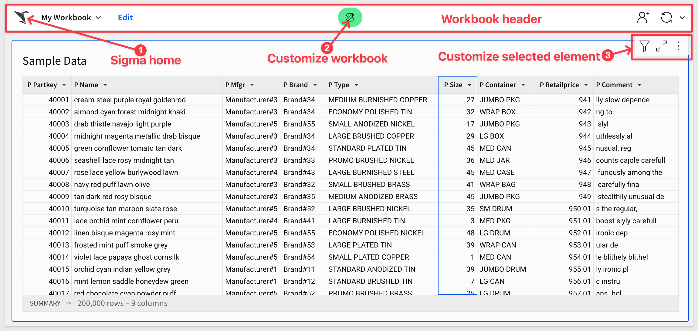
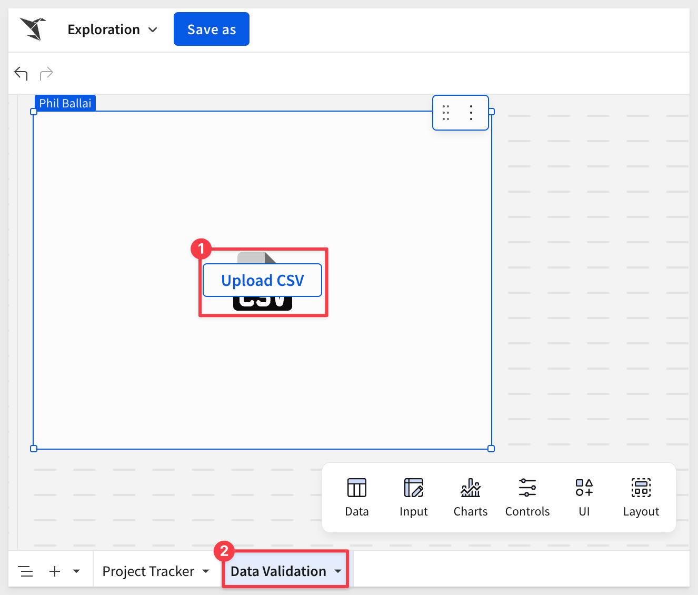
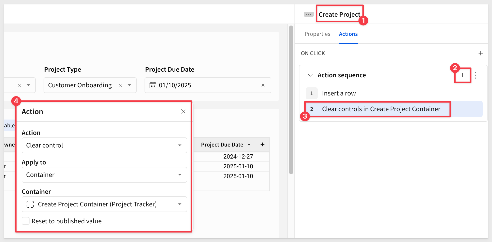
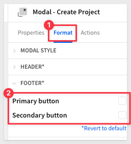
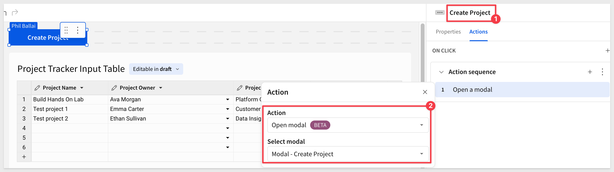
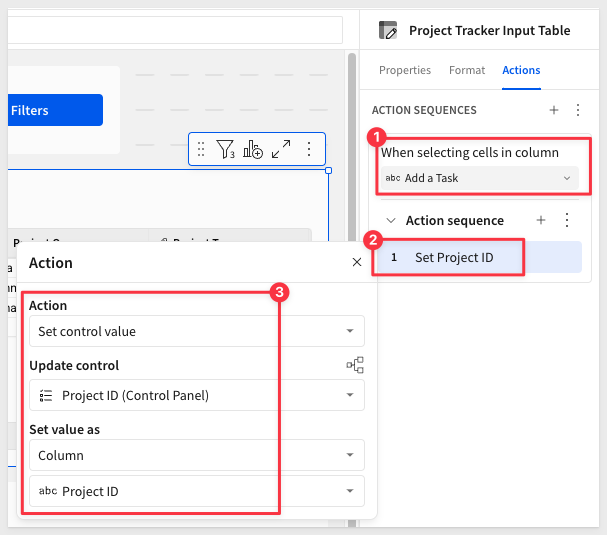
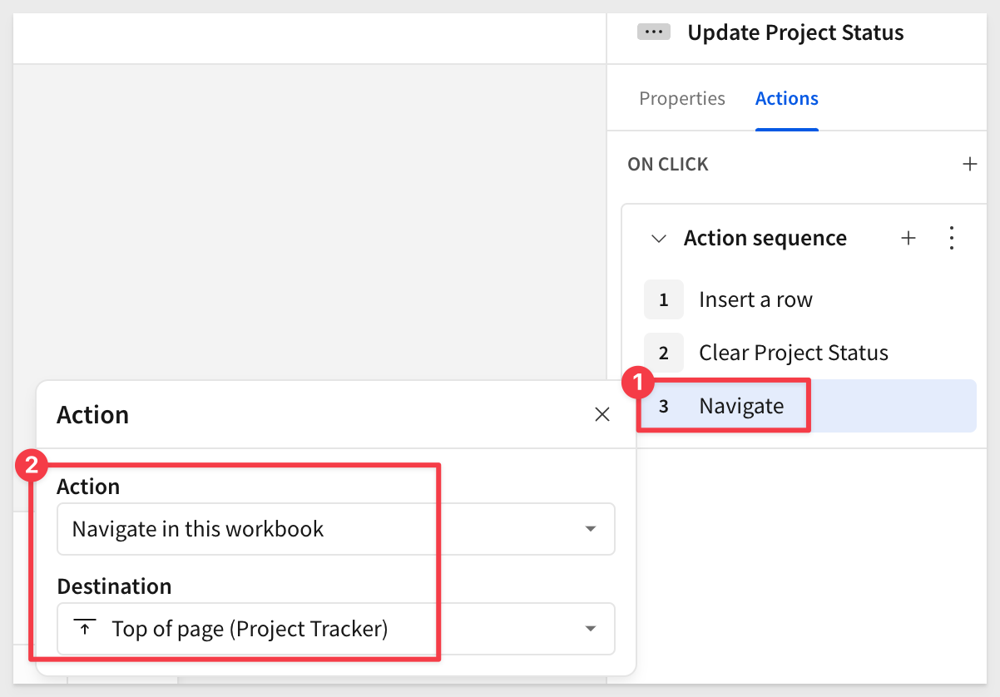
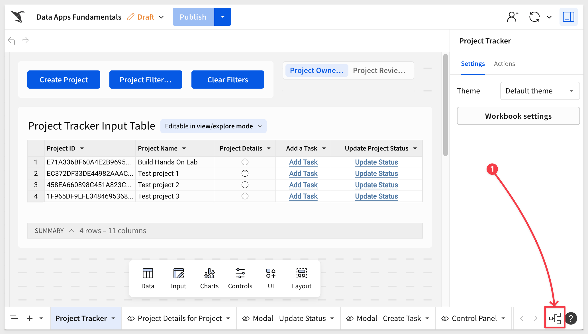

author: pballai
id: dataaps_fundamentals
summary: dataaps_fundamentals
categories: dataapps
environments: web
status: published
feedback link: https://github.com/sigmacomputing/sigmaquickstarts/issues
tags: default
lastUpdated: 2024-10-24

# Data Apps Fundamentals

## Overview 
Duration: 5 

To be written by PB

<aside class="negative">
<strong>NOTE:</strong><br> Keep naming structures the same as in this document, especially around control IDs. This will make your build far easier as the sections progress.
</aside>

### What we will build
After completing this QuickStart we will have built a fully functional data app based on a project management use case. The finished will look something like this (depending on your styling choices!):


<aside class="positive">
<strong>IMPORTANT:</strong><br> Some screens in Sigma may appear slightly different from those shown in QuickStarts. This is because Sigma is continuously adding and enhancing functionality. Rest assured, Sigma’s intuitive interface ensures that any differences will not prevent you from successfully completing any QuickStart.
</aside>
 
### Target Audience
Developers evaluating Sigma embedding and the security options.

### Prerequisites

<ul>
  <li>A computer with a current browser. It does not matter which browser you want to use.</li>
  <li>Access to your Sigma environment.</li>
  <li>Some familiarity with Sigma is assumed. Not all steps will be shown as the basics are assumed to be understood.</li>
 </ul>

<aside class="postive">
<strong>IMPORTANT:</strong><br> Sigma recommends that you use non-production resources when doing QuickStarts.
</aside>

<button>[Sigma Free Trial](https://www.sigmacomputing.com/free-trial/)</button>
 


## Terminology
Duration: 5

The following is a guideline for the different parts of the Sigma interface so that we are oriented to the terms that will be used throughout this QuickStart. Not every item is called out, but the most used ones are.

### Workbook page - published version


### Workbook menu - published version


### Workbook page - edit mode


For more information, see [Getting around in Sigma](https://help.sigmacomputing.com/docs/get-around-in-sigma)


<!-- END OF SECTION-->

## Introduction to Input Tables
Duration: 5

Input tables are dynamic workbook elements that support structured data entry. They allow you to integrate new data points into your analysis and augment existing data from your data platform to facilitate rapid prototyping, advanced modeling, forecasting, what-if analysis, and more—without overwriting source data.

Use input tables as sources for tables, pivot tables, and visualizations, or incorporate the data using lookups and joins. And when you create warehouse views for input tables, you can reuse the manually entered data across your broader data ecosystem.

### Create Project Tracker Input Table

#### Step 1: Open a blank workbook in Sigma:
Log into Sigma and select the `+ Create New` > `Workbook` from the homepage:


<aside class="positive">
<strong>IMPORTANT:</strong><br> You may see the "BETA" pills attached to some features. Sigma Computing is continuously evolving the Sigma service, adding new features and capabilities and improving what our customers can do with the product. Releases happen continuously, both for bug fixes and for new functionality.
</aside>

For more information on Sigma's release strategy, see [Sigma product releases](https://help.sigmacomputing.com/docs/sigma-product-releases)

There is also a QuickStart each month that covers all the release activity for the previous months. For more information, see [First Friday Features](https://quickstarts.sigmacomputing.com/firstfridayfeatures/)

#### Step 2: Add empty input table:
Create an empty input table on Sigma Sample Database by clicking on `Input` in the element bar and dragging an `Empty` input table onto the page.


Click the `Select connection` button and choose the `Sigma Sample Database`. Click `Create`.

Change the title of the new input table (by double-clicking its current title) to `Project Tracker Input Table`:


#### Step 3: Add new columns:

First, rename the existing `Text` column to `Project Name`.

Next create two additional `text` fields and one `date` field:


Rename the new columns to `Project Owner`, `Project Type`, and `Project Due Date` respectively:


#### Step 5: Rename the page 
Rename the workbook page to `Project Tracker` and add a new page, by clicking the `+` icon in the footer. Rename it to `Data Validation`:


#### Step 6: Validation input tables
In this step we will create three additional input tables, reloading them with data from csv files. 

<aside class="negative">
<strong>NOTE:</strong><br> Add these to the "Data Validation" workbook page.
</aside>

Click the button below to download the files (in zip format). Extract them to a known location to make the easy to find.

<button>[Download the CSV files](https://sigma-quickstarts-main.s3.us-west-1.amazonaws.com/input_tables/dataapps_qs_fundamentals.zip)</button>

The download will contain three csv files once extracted:


Now that we have the files, we can add three `CSV` input tables using the element bar as we previously did.

The only different thing is this workflow is we need to `Upload CSV` using the csv input table button:



`Browse` to where the csv files downloaded are stored and select the first one. 

After selecting the first csv file, Sigma allows you to adjust the `Parsing Options` and review the parsed data. This ensures the data makes it to the input table as expected. If everything looks correct, click `Save`.


Once all three input tables are added, rename them to match the content:


#### Step 7: 
On the `Project Tracker` page, open the menu for the `Project Owner` column on the `Project Tracker Input Table` and select `Data validation`:


For `Value source`, select the `Data Validation` page and then `Employees`. Click `Save`. 

Now when the `Project Owner` column is restricted to the list of `Employees` from that input table:


Repeat this step for the `Project Type` column, using the `Project Type` input Table as the source of validation value:

#### Step 8: 
Add the following row of data and delete any extra rows from the `Project Tracker Input Table`.

<aside class="negative">
<strong>NOTE:</strong><br> Set the "Project Due Date" value to a date that is in the future.
</aside>


#### Step 9: 
Click the `Save as` button and name workbook as `Data Apps Fundamentals`.

#### Step 10: 
Using the element bar, add a `Text Input` control above the input table: 


Rename it `Project Name`.

With the `Project Name` control selected, change the `Control ID` to `cp-ProjectName` in the properties panel:


<aside class="positive">
<strong>IMPORTANT:</strong><br> Setting and following a control naming convention at the beginning of your application build will help you maintain order as your application grows. In this case, we use “cp-ControlName” to indicate that the process this control is used for is “Create Project” i.e. cp. 
</aside>

#### Step 11: 
Add a `List Values` control element titled `Project Owner`. 

In the properties panel under `Value Source`, select `Data Validation` > `Employee` and set the `Source column` to `Name`. 

Ensure that only the `Show Clear Button` and `Show Search Box` are selected. 

Rename the `Control ID` to `cp_ProjectOwner`:


<aside class="positive">
<strong>IMPORTANT:</strong><br> When using a control to insert a row into a table, you cannot have “Allow Multiple Selection” on. This creates an array of values, rather than a single value. 
</aside>

#### Step 12: 
Repeat step 11 for `Project Type`. 

In the properties panel under `Value Source`, select `Data Validation` > `Project Type` and the `Project Type` column. 

Rename the `Control ID` to `cp_ProjectType`.

#### Step 13: 
Add a `Date` control titled `Project Due Date` with a `Control ID` of `cp_ProjectDueDate`.

The page should look like this now:


#### Step 14: 
Add a button from the element bar to the page and set its name to `Create Project`:


#### Step 15: 
On the `Actions` panel of the `Create Project` button, add a new action and select `Insert Row`. 

Ensure the values align for each control to the `Project Tracker Input Table`:


What this action does is add a new row to the input table, containing whatever values are set in the four controls on our page. 

If you click the button with no values provided, an empty row is added to the input table. Right click that empty row and select `Delete 1 row` if needed. 

Click `Publish`.

#### Step 16: 
Once the action has been set up we may wanty to adjust the size of each control and the `Create Project` button. 

Now lets some projects. It does not really matter what your decide to use for the control, it is test data anyway.

Click the `Create Project` button to test if everything was set up correctly:


<aside class="negative">
<strong>NOTE:</strong><br> The control values were not cleared after we created the new project. We will handle that in a bit.
</aside>

#### Step 17: 
Select each control (shift+click) and the `Create Project` button. 

At the top right, choose the `Create container` option from the selected elements menu:


<aside class="positive">
<strong>PRO TIP:</strong><br> You can also use hot keys! "Command+G" will put all selected items into a container.
</aside>

For more information on hot-keys in Sigma, see the documentation:

[Windows](https://help.sigmacomputing.com/docs/keyboard-shortcuts-microsoft-windows)

[Mac](https://help.sigmacomputing.com/docs/keyboard-shortcuts-mac-os)

#### Step 18: 
Rename the container `Create Project Container`


<aside class="positive">
<strong>IMPORTANT:</strong><br> Naming containers as you create them will make life much easier as the data application grows. 
</aside>

#### Step 19: 
Click on your `Create Project” button`, and go to `Actions`. 

Create a second action set to `Clear control` applied to `Container` with our newly created `Create Project Container`. This will set the action to automatically target all four control elements:



#### Step 20: 
Add an additional row of data to test the clear action on each control element within the container. 

The updated `Project Tracker` Input Table should look as follows, with a new row of data and the controls cleared once the `Create Project` button is clicked:


<!-- END OF SECTION-->

## Project Creation Modal
Duration: 5

### Step 1: Add a modal
Click on the `Create Project` container, and then click the  icon at the top right of the container. 

Select the `Move to` > `New Modal` option. 


### Step 2: 
Name the modal `Modal - Create Project`. 

By now, we assume you are familiar with where elements are accessed and configured in Sigma, so we may not show all steps.

Rename the title from `New Modal` to `Create a New Project`. 

Deselect both `Primary` and `Secondary` button options under `Footer` in the selected element panel. 

Move the various elements around and resize everthiong to suit. Trim any unnecessary space:



### Step 3:
Create a new button for `Clear Form`. 

In the actions panel, set the action to clear the `Create Project Container.` This is a good best practice for improving user experience.


### Step 4: 
Add an action to the `Create Project` button to `Close Modal`:


Actions can be added in series to create dynamic behavors. For more information see [Configure an action sequence](https://help.sigmacomputing.com/docs/configure-actions-in-sequences)

### Step 5: 
Return to the `Project Tracker` page and add a button titled `Create Project`. 

Add an action to `Open a Moda`l for the `Modal - Create Project`:



### Step 6: 
Click the `Create Project` button to test the action. `Modal - Create Project` should opens. Check that add a record, clear and create project works to add a new row in the `Project Tracker`.

<aside class="negative">
<strong>NOTE:</strong><br> Delete any empty rows that may have been accidentally created during configuration steps.
</aside>

**Congratulations**
You have now successfully built a form to do controlled data entry into the Project Table!

Considering how easy that was AND data is being written automatically to the cloud data warehouse, that is pretty slick. Lets go further still.

### Step 7: Create page controls
On the `Project Tracker Input Table` page, crate filters for the `Project Name`, `Project Owner`, and `Project Type` one at a time. 


Convert to each filter to a page control by selecting the vertical ellipsis:


Rename each of the `control IDs` to have `filter-` prepended as:


<aside class="negative">
<strong>NOTE:</strong><br> Leave the “allow multiple selections” option clicked. These controls will not be used to “Insert Rows”, they will just be used for filtering.
</aside>

Click `Publish`.

### Step 8: Container it
Select the filters and place them into a container titled `Filters Container`, 

Move this container to a modal titled `Modal - Filters`. 

Add a `Filters` title and this time keep the footer buttons naming the primary `Close Modal` and the secondary `Clear Filters`.


### Step 9: 
On the actions tab of `Modal - Filters` configure the `Close Modal` button to `Close a Modal`.

The secondary configure `Clear Filters` to `Clear control` on the `Filters` Container:


### Step 10: 
Back on the `Project Tracker` page, add another button for `Project Filters` with an action to `Open Modal` on `Modal - Filters`. 

Add an additional button named `Clear Filters`.

Select all three buttons and place those into a container titled `Buttons Container`. 

Set the action on the `Clear Filters` button to clear the `Filters Container (Modal - Filters)`.

Test that the new buttons work as expected. 

<aside class="negative">
<strong>NOTE:</strong><br> Putting the filters into an overlay saves real estate on the application. Adding dynamic text to the button helps give users insight into if any filters are applied.
</aside>

Our Data App is beginning to take form by mixing and matching Sigma building blocks.

### Step 11: 
Customize the title for the `Project Filters` button by adding a `(` followed by the `=` sign, which will open a pop up for use to use a custom formula:

Use the following formula:
```code
Sum(If(ArrayLength([filter-Project-Name]) > 0, 1, 0) + 
If(ArrayLength([filter-Project-Type]) > 0, 1, 0) + 
If(ArrayLength([filter-Project-Owner]) > 0, 1, 0))
```

Once the formula is good, click the green checkmark:


Add one more `)` to make the value surrounded by `()`.

Click the `Project Filters` button and set a few filters. 

This results in a count when filters are selected:


<!-- END OF SECTION-->

## Create the Control Panel
Duration: 5

### Step 1: Add page
Add a new page named `Control Panel`. 

This will be the central hub and spine for the Data App which ensures governance over the circular flow of data.

### Step 2: 
On the `Project Tracker` page, add three new columns using any of the drop downs for `Last Updated At`, `Last Updated By`, and `ID`. 


Rename `ID` to `Project ID`:


<aside class="positive">
<strong>IMPORTANT:</strong><br> “Project ID” will become a key column on which the rest of this app is built.
</aside>

### Step 3: 
Create a `child table` from the `Project Tracker Input Table` and rename the child `Project Tracker Stable Table`:


### Step 4: 
Move the `Project Tracker Stable Table` to the `Control Panel` page.


### Step 5: 
On the `Control Panel` page, from the `Project Tracker Stable Table` filter `Project ID` and convert it to a page control. 

Rename the Control ID to `master-ProjectID`:


<aside class="positive">
<strong>IMPORTANT:</strong><br> Be sure to deselect "Allow Multiple Selection".
</aside>

### Step 6: 
Add another page control filter, this time for `Project Name`.

Rename the Control ID to `master-Project-Name`.

<aside class="positive">
<strong>IMPORTANT:</strong><br> Be sure to deselect "Allow Multiple Selection".
</aside>

### Step 7: 
The Control Panel page should look as follows at this stage: 


<aside class="negative">
<strong>NOTE:</strong><br> We will start to use this page extensively in the next sections. The two controls we’ve just created will be used in most of our action sequences, and the table we’ve created will be used as a source for most of our page elements.
</aside>


<!-- END OF SECTION-->

## Create the Task Table
Duration: 5

### Step 1: 
On the `Project Tracker` page, add a new `Empty` input table, connect it to the `Sigma Sample Database` and rename it to `Task Tracking Input Table`. 

Add two `Text` columns, `Task Name`, `Task Owner` and a `Due Date` column as `Date` data type:


### Step 2: 
Add an additional text column for `Project ID`:


This column will be tied to the `Project Tracker Input Table` to link tasks to projects. 

### Step 3: 
Add a `text input` control, `List values` control, and `Date` control above the `Task Tracking Input Table`. 

Rename these to `Task Name`, `Task Owner`, and `Task Due Date`. 

Set each `Control Id` as:

<table>
    <thead>
    </thead>
    <tbody>
        <tr>
            <td>Task Name</td>
            <td>ct-Task-Name</td>
        </tr>
        <tr>
            <td>Task Owner</td>
            <td>ct-Task-Owner</td>
        </tr>
         <tr>
            <td>Task Due Date</td>
            <td>ct-Task-Due- Date</td>
        </tr>
    </tbody>
</table>

<aside class="negative">
<strong>NOTE:</strong><br> We are using “ct-” for “Create Task”
</aside>

### Step 4: 
Ensure the `Task Owner` column is sourced to the `Data Validation - Employee` table with the correct items deselected as shown:


### Step 5: 
Create a container titled “Create Task Container” with the three controls.


### Step 6: 
Move this container to a `New modal` and rename the modal page to `Modal - Create Task`. 

Rename the model to `Create Task`

Using the existing primary and secondary buttons, change the names to `Clear Form` and `Create Task`.

Configure the actions for these buttons as follows:

**Create Task (primary button):**
Add an `Insert Row`and make sure you’re inserting into the `Task Tracking Table`:

Add two more actions after the `Insert Row` action to clear the controls in the container and then close the modal:


<aside class="positive">
<strong>IMPORTANT:</strong><br> Pay attention to number 4 on the screenshot above. We want to set the Project ID to use the value for Project ID from the Control Panel page!
</aside>

**Clear Form (secondary button):**
Add a `Clear control` for the `Container` with the action set as:


<aside class="negative">
<strong>NOTE:</strong><br> The control for project ID will be set in a future step.
</aside> 


We will use the modals `X` to close the modal.

### Step 7: 
On the `Project Tracker Input Table`, select the dropdown and add a calculation. 


The formula for this calculation will be "Add Task" (with quotation marks included) in the formula bar. 

Rename this column to `Add a Task`:


### Step 8: 
Click to select the `Project Tracker Input Table` and add an action.1

Configure the action to `When selecting cells in column` for the column `Add a Task`.

Configure the rest of the action to:



### Step 9: 
Add conditional formatting to the `Add a Task` column to make it appear as a hyperlink:


### Step 10: 
Test this action by selecting an `Add Task` cell from `Create New Task`and check the `Control Panel` page 
for the `Project ID` control element. The value that was clicked will appear in the filter as:


### Step 11: 
We also want to set the `Project Name` when the user clicks `Add Task`. 

Add another action under the `Set Project ID` and configure it as follows:


### Step 12: 
Add a third action for `Opening a Modal`, and select `Modal - Create Task`:


### Step 13: 
When the modal appears, we want the project name to appear in the title so the user is oriented.

On the `Modal - Create Task` page, revise the title to include the project name. 

Select the text `Create Task` and append it with `for ` followed by `=`, which opens the formula bar.

Type `[master_ProjectName]` and click the green checkmark:


<aside class="negative">
<strong>NOTE:</strong><br> It may appear as "Create Task for N/A" at first. This will change once the user actually goes to "Add a Task".
</aside>

### Step 14: 
Lets test this by clicking `Add Task` from any row and entering some test data. When done, click `Create Task`:


The new task should appear in the `Task Tracking Input Table`:


Try this multiple times to add new tasks to the task tracking table.

### Step 15: 
On the `Project Tracking` page, add a new `Column via lookup` to the `Task Tracking Input Table`.

This time we used the selected element panel, `COLUMNS` menu to add a new column to demonstrate another way to do it:


We need to let Sigma know which column(s) we want to bring in and how to "match" the two input tables (ie: join them). We could also pre-aggregate the columns as we bring them in, but in this case, that is not wanted:


<aside class="negative">
<strong>NOTE:</strong><br> Sigma lookups are similiar (but easier) than VLOOKUP in Excel or INDEX-MATCH in Google Sheets.
</aside>

### Step 16: 
Rename the new lookup column to `Project Name` and move it to the first column:


<aside class="negative">
<strong>NOTE:</strong><br> Columns created thru a lookup appear as "pills" to make them obvious.
</aside>

For more information on lookups in Sigma, see [Add columns through Lookup](https://help.sigmacomputing.com/docs/add-columns-through-lookup)

### Step 17: 
Move the the `Task Tracking Input Table` to the `Control Panel` page and hide the `Project ID` column. Now that we have the `Project Name` we don't need to show that information to the user. 

Add an additional task record for the same project and sort by `Project Name`. 

<aside class="positive">
<strong>IMPORTANT:</strong><br> This demonstrates the "multiple tasks to one project" relationship. This is a very important concept in building data apps in Sigma. 
</aside>


<!-- END OF SECTION-->

## Add Status Tracking
Duration: 5

### Step 1: 
On the `Project Tracker` page, create a new blank input table and rename it to `Status Update Input Table`. Connect to the `Sigma Sample Database` again.

Create the following columns:
<table>
    <thead>
    </thead>
    <tbody>
        <tr>
            <td>Project ID</td>
            <td>type = text</td>
        </tr>
        <tr>
            <td>Project Status</td>
            <td>type = text</td>
        </tr>
         <tr>
            <td>Status Owner</td>
            <td>type = text</td>
        </tr>
        <tr>
            <td>Status Date</td>
            <td>type = date</td>
        </tr>
    </tbody>
</table>

Add the `Last updated at`, `Last updated by`, and `row ID` columns using the menu options.

Rename the  `row ID` column name to `Status ID`. 

Delete any blank rows:


### Step 2: 
Add a new modal and change the title to `Update Project Status`. 

Add a `List control` and rename it to `Project Status`. 

Set its `Value source` to `Data Validation` and `Source column` to `Status`.

Uncheck `Display columns` as shown below.

Set the `Control ID` value `ups_Project-Status:


Rename the modal page to `Modal - Update Status`.

### Step 3: 
Change the `Label` > `Lable position` under `Format` to put the `Project Status` title on the left:


### Step 4: 
Disable the `Primary` and `Secondary` buttons from the input tables `Format` options.

Add a `button and rename it to `Update Project Status`:


### Step 5: 
On the `Project Tracker` page and the `Project Tracker Input Table`, add a new column via `Calculation` after the `Create New Task` field and rename it to `Update Project Status` with a formula of “Update Status”.

Lets use conditional formatting to set the new columns apperance to the same as the `Add a Task` column. 

This is made easy by adding the `Update Project Status` column to the `Apply to` list and changing the `Formatting rule` to `Is not null` as shown in the screenshot below:


### Step 6: 
On the actions panel for `Project Tracker Input Table`, click the `+` to add a new action which will be `Update Project Status`. 

Add an action to set control value of `Project ID` from the `Control Panel`. 

Set the value as `Column` > `Project ID`:


### Step 7: 
Repeat adding an `Set Control Value` action for `Project Name` and the `Open Modal` action for` Modal - Update Status`:


### Step 8: 
In the header of the `Modal - Update Status` page, add in the following text: `Project Name:`  followed by an `=` sign and set the formula to [master_ProjectName]:


### Step 9: 
Set the action `Insert Row` on the `Update Project Status` button. 

Ensure this is inserting a row into the `Status Update Table` with `Project ID` which if you recall is located on the `Control Panel` page.  

Notice that two columns are mapped to two formulas; `CurrentUserFullName()` and `Now()` and that the mapping for `Project ID` and `Project Status` are different in the screenshot below:


### Step 10: 
As we have done before, add an action for `Clearing Project Status` but this time (and while testing) we will set the third action to `Navigate` to the `Control Panel` page > `Status Update Input Table`. 



Saving clicks is always appreciated!

### Step 11: 

<aside class="negative">
<strong>NOTE:</strong><br> When we were building this, we noticed that a few rows were accidentially (on the "Control Panel" > "Status Update Input Table") created, so before we tested, we just manually deleted them so we could have a clean test.
</aside>

Back on the `Project Tracker` page, select `Update Status` for any project and test out the functionality of `Modal - Update Status`. 

After setting a status and clicking the `Update Project Stauts` button we are returned to the `Control Panel` where we can see the row added with the new status:


### Step 12: 
On the `Control Panel` page > `Project Status Input Table`, add a new field `via lookup` on the Status Update Table` adding `Project Status` based on `Project ID`. 

<aside class="negative">
<strong>NOTE:</strong><br> Projects having no current status set will make the lookup show less than 100% mapping and that is fine.
</aside>


Rename the new column `Project Status` and move to the column to just after `Update Project Status` column:


### Step 13: 
Now update a project with a second status and see the “multiple values” result under `Project Status`. 


This happens when a lookup is `one to many` instead of `one to one` and requires a different approach to enable proper data app functionality. 

### Step 14: 
Create a `Child` table off the `Control Panel` > `Status Update Table`.

Rename this table to `Status Update - Latest Status Table`.

Set the `Status Date` to `Truncate date` > `Second`:


### Step 15: 
Add a new column to the table, set the calculation to be:
```code
lookup(max([Second of Status Date]), [Project ID], [Project ID]
```


<aside class="negative">
<strong>NOTE:</strong><br> This formula is doing a recursive lookup to this table - it is getting the latest "Status Update Date" for each project. This operates similar to a window function in SQL.
</aside>

For more information about functions in Sigma, see [Function index](https://help.sigmacomputing.com/docs/function-index)

### Step 16: 
Add a new column of `Latest Update` with calculation:
```code 
[Max of Second of Status Date] = [Second of Status Date] 
```

This will result in a `true` or `false`:


### Step 17: 
`Filter` this `Latest Update` column to only show the `True` status updates.

The `Status Update Input Table` operates as the **transaction log**, while the `Latest Status Table` provides just the latest value:

<br>


Having both tables for this and other potential analytics can be powerful. 

<aside class="positive">
<strong>IMPORTANT:</strong><br> This is one way to solve the problem and there are others too. Sigma is very flexible and can support a variety of solutions and workflows. 
</aside>

### Step 18: 
Update the `lookup` on the `Project Tracker Input Table` to now look at the `Latest Status Table` adding `Project Status` based off `Project ID`:

<br>


Now our table shows the most recent `Project Status`:


### Step 19: 
Select the `Status Update - Latest Status Table` and `Status Update Input Table` and place them in a container named `Status Tracking` container:


<!-- END OF SECTION-->

## Project Details Modal
Duration: 5

### Step 1: 
On the `Project Tracker Input Table`, create a new `Caculation` column and rename it to `Project Details`.

Set the column's formula to “ⓘ”.

This will be used to pop up a modal with project details. 


### Step 2: 
Create a new `Modal` page and rename it to `Modal - Project Details`. 

Change the modal's title to `Project Details for Project:` and the add the `=` sign.

Using the formula bar, set it to reference `[master-Project-Name]` and click the green checkmark:


### Step 3: 
Add a `UI` > `Text` control with `Project Owner` and type `=[Pr` into the formula bar. This will return all the matching items. Select `Project Tracker Stable Table`:

The list will then show all the columns from the selected table. Now we can choose the column we want, `Project Owner`:


Click the green check mark to accept the entry of `[Project Tracker Stable Table/Project Owner]`.

Repeat the process by adding two more line beneath the first one for:
```code
[Project Tracker Stable Table/Project Status]
[Project Tracker Stable Table/Project Due Date]
```

We now have:


### Step 4: 
Create another `Child` table of the `Status Update Input Table` on the `Control Panel` page. Then move it to the modal titled `Modal - Project Details`. 

Rename the title of the table to `Details`:

<aside class="negative">
<strong>NOTE:</strong><br> We used the "Status Update Input Table" on the "Control Panel" as that table has all the status rows listed. We want the "Details" modal table to show every status change made for the project. This way, we can derive how long the project stayed in each status. 
</aside>

Hide all columns except those shown below:


### Step 5:
On the `Control Panel` page, select the `Project ID` control and select `TARGETS` in the selected element panel. 

`Add filter target` to update the `Project ID` on the `Details` table on the `Project Details for Project` modal:


### Step 6: 
On `Format` > `Table components`, **uncheck** the `Show summary bar` option and modify the title to include the project name as we have done previously. 


### Step 8: 
We also want to include all the related tasks for the selected project.

Repeat the steps for used for the `Details` table to add a `Tasks` table.

On the `Control Panel` page, create a `Child table` on the `Task Tracking Input Table` and move it to the` Modal - Project Details`. 

Remove the `summary bar` and add change the table's name to `Tasks`.

Set the `Master Project Name` control on the `Control Panel` to target te the `Tasks` table and the column `Project Name`:


<aside class="negative">
<strong>NOTE:</strong><br> Don't forget to turn off the "Tasks" table's summary bar!
</aside>

### Step 9: 
It may be useful to be able to add tasks for this modal as well.

One the `Project Details for Project modal`, add a button titled `Add New Task` that uses an action to open the modal for `Modal - Create Task`.


CLick the `Add another task` and test the workflow, to add another task to the list:


That was super quick and easy to extend the workflow now that our "base" data app pages and modals are setup!

### Step 10: Adding a Visualization
Going one step further, lets add a `Charts` > `Bar chart` to the `Project Details for Project` modal.


<aside class="negative">
<strong>NOTE:</strong><br> Made sure user "James" had two tasks in the screenshot.
</aside>

We now have:


We can apply some styling by we will touch on that in the last section. Syling in Sigma is really easy so it is best to make sure the functionality all works first, and then make it look pleasing to the eye. 

<aside class="positive">
<strong>IMPORTANT:</strong><br> Styling is really important and will help with end user adoption and comfort too.
</aside>


<!-- END OF SECTION-->

## Approval Workflow
Duration: 5

### Step 1: 
On the `Project Tracker` page, add a `Controls` > `Segmented Control`

Configure the `Values` as `Project Owner View` and `Project Reviewer View`. 

Remove the label (title) as we have done the previous steps. The page will look like this:


### Step 2: 
Add a new `Calculation` column to the `Project Tracker Input Table` called `Reviewer Approval`.

Set the formula to `Click to Review` and add it to the existing conditional formatting we have done before:


### Step 3: 
Select the segmented control and add an action.

Add a `Condition`:


And select the `Project Owner View:


Configure the action to:


Repeat this process for the `Project Reviewer View`, this time setting the `What to modify` to `Show columns`:


### Step 4: 
On the `Data Validation` page, create a child table off `Status Type` and call it `Status Type Stable Table`.

Move this table to the `Control Panel`. 

### Step 5: 
One the `Control Panel` page, add a filter for `Status Category` and convert it to a page control. 

Set the page control to only `Show Clear Button` and `Show Search Button`. Update the `Control ID` to use the pattern we established earlier. Configure the `Value source` and `Source column` too:


Set the `TARGETS` to 


### Step 6: 
Return to the `Project Tracker` page and select the `Project Tracker Input Table`. 

In `actions`, add an action in the third position, it the sequence shown below. Configure to match:


### Step 7: 
On the `Modal - Update Status` control titled `Project Status`. 

Switch the `Value Source` to the `Status Type` and the column switch to `Status` on the selected element panel:


### Step 8: 
Go back to the `Project Tracker` page and select the`Project Tracker Input Table`.

Click a cell with `Update Status` to test that only 4 options appear on the modal's list control:


### Step 9: 
On the `Project Tracker` page, click the `Project Reviewer View` button in the segmented control. 

Now select the `Project Tracker Input Table` > `Actions` and duplicate the `Update Project Status` action.

Scroll to the bottom of the actions list to see the duplicate action.

Change the target to `Reviewer Approval`. 

Change `Set Status Category` to be `Reviewer` too:


<aside class="negative">
<strong>NOTE:</strong><br> Note: If the "Reviewer approval" column target is grayed out (or not present in the list), check the segmented control to ensure the "Project reviewer view" button is selected.
</aside>

### Step 10:
Select `Click to Review` in any cell and confirm again that the `Modal - Update Status` only shows the values that cooresponding to the category `Project Reviewer View`.


Test the view comparing `Project Owner` and `Project Reviewer Views` to test conditional actions and how these scenarios direct access, inputs, and functionality. 

### Step 11: 
Hide all pages except the `Project Tracker` page and click `Publish`. 

Switch to the `Published version` and test the entire data app:


The data app should look like this now:


### Step 12: Data Lineage
Sigma 
Review the data lineage view to review and confirm all connections and lookups. 

Click the green  button, and then click the `edit` link.

Open the workbook's lineage:



When workbooks become large, working with the lingeage is a great way to find what you are after, jump right to the desired element and even see the SQL use to create the data for an element too. 

Here is a quick demo:


To learn more about workbook data lineage in Sigma see [View workbook data lineage](https://help.sigmacomputing.com/docs/workbook-data-lineage)


<!-- END OF SECTION-->

## Template Formatting
Duration: 5

### Step 1: 
With the bulk of the data app functionality complete, visual design and accessibility is the next step. 

Sigma provide many "out-of-the-box" themes; experiment with them and adjust from there are desired too.

This enables a range of functionality including the ability to toggle between light and dark modes, preset swapping, custom colors that affect elements throughout the workbook (big time saver), fonts, layouts, and additional design settings: 


### Step 2: Containers - Containers - Containers
It is a good practice to package elements in containers in a manner that will be easy for users to access and understand. 

We have also demonstrated the other cool benefit of using containers; they can be targeted by an action!

### Step 3: 
With Sigma, your data apps can support whatever branding may be required. 

You can ustomize to match your own branding and style considerations while maintaining accessibility and visual design best practices. 

Images and icons can be added for additional personalization:


Here are some example of styled data apps in Sigma:


<!-- END OF SECTION-->

## What we've covered
Duration: 5

In this QuickStart, we built a fully functional project tracking application using Sigma and sample data. Hopefully, this was a smooth and eye-opening process that showed just how easy building data apps can be with Sigma. Additional resources are provided below.

**Additional Resource Links**

[Blog](https://www.sigmacomputing.com/blog/)<br>
[Community](https://community.sigmacomputing.com/)<br>
[Help Center](https://help.sigmacomputing.com/hc/en-us)<br>
[QuickStarts](https://quickstarts.sigmacomputing.com/)<br>

Be sure to check out all the latest developments at [Sigma's First Friday Feature page!](https://quickstarts.sigmacomputing.com/firstfridayfeatures/)
<br>

[](https://twitter.com/sigmacomputing)&emsp;
[](https://www.linkedin.com/company/sigmacomputing)&emsp;
[](https://www.facebook.com/sigmacomputing)


<!-- END OF WHAT WE COVERED -->
<!-- END OF QUICKSTART -->
