author: pballai
id: dataapps_api_actions_getting_started
summary: dataapps_api_actions_getting_started
categories: developers
environments: web
status: Publish
feedback link: https://github.com/sigmacomputing/sigmaquickstarts/issues
tags: Default
lastUpdated: 2026-02-23

# API Actions - Getting Started

## Overview 
Duration: 5 

This QuickStart introduces Sigma API Actions by connecting to the Open-Meteo Weather API, a free weather data service that requires no authentication.

You'll build a workbook from scratch that allows users to select a city from a list and fetch current weather details in real-time.

Along the way you'll learn how to:
- configure API connectors with both static and dynamic parameters
- bind list controls to drive Action inputs
- parse and map JSON responses for analysis and visualization

<aside class="positive">
<strong>IMPORTANT:</strong><br> Some screens in Sigma may appear slightly different from those shown in QuickStarts. This is because Sigma continuously adds and enhances functionality. Rest assured, Sigma’s intuitive interface ensures that any differences will not prevent you from successfully completing any QuickStart.
</aside>

For more information on Sigma's product release strategy, see [Sigma product releases](https://help.sigmacomputing.com/docs/sigma-product-releases)

If something doesn’t work as expected, here's how to [contact Sigma support](https://help.sigmacomputing.com/docs/sigma-support)

### Target Audience
The typical audience for this QuickStart includes users of Excel, common Business Intelligence or Reporting tools, and semi-technical users who want to try out or learn Sigma.

### Prerequisites

<ul>
  <li>Any modern browser is acceptable.</li>
  <li>Access to your Sigma environment.</li>
  <li>Some familiarity with Sigma is assumed. Not all steps will be shown, as the basics are assumed to be understood.</li>
 </ul>

<aside class="positive">
<strong>IMPORTANT:</strong><br> Sigma recommends using non-production resources when completing QuickStarts.
</aside>

<button>[Sigma Free Trial](https://www.sigmacomputing.com/free-trial/)</button>

<aside class="negative">
<strong>IMPORTANT:</strong><br> Some features may carry a "Beta" tag. Beta features are subject to quick, iterative changes. As a result, the latest product version may differ from the contents of this document.
</aside>
 


## Initial Setup
Duration: 5

### Open-Meteo Weather API Account
While there are services that require credentials, we want to demonstrate using one that doesn't require credentials, as that is a simple first example.

We will use the [Open-Meteo API](https://open-meteo.com/) in this QuickStart.

<aside class="negative">
<strong>About Open-Meteo:</strong><br> Open-Meteo is an open-source weather API and offers free access for non-commercial use. No API key is required when this QuickStart was published.
</aside>

<aside class="positive">
<strong>NOTE:</strong><br> While this QuickStart uses an API that requires no authentication, Sigma fully supports API credentials for services that require authentication (Bearer token, API keys, OAuth, basic auth, etc.). For more information, see <a href="https://help.sigmacomputing.com/docs/configure-api-credentials-and-connectors-in-sigma#grant-access-to-api-credentials-and-connectors">Configure API credentials and connectors in Sigma</a>.
</aside>

### API Connectors
API Connectors in Sigma define the endpoint that will be called by our Sigma workbook actions. Given that, it makes sense to first configure the endpoint we want to call and then we can configure an action to request data from it.

Log into Sigma as an administrator and navigate to `Administration` > `API connectors` and click `Create connector`.

We will configure a simple example to request weather data with the location and temperature format hard-coded.

**Name:** The name of the connector as it appears to users in a workbook.<br>
Use this name:
```copy-code
Current Temp - Hard Coded
```

**Description:** [optional] A custom description that helps users identify the connector and verify its contents.

**Base URL:** Select an HTTP method and the URL for the request.<br>
Use this URL:
```copy-code
https://api.open-meteo.com/v1/forecast?latitude=20.7702&longitude=-156.2682&timezone=auto&temperature_unit=fahrenheit
```

**Headers:** [optional] Set a header for the request.
None required.

**Params:** [optional] Set query and path parameters for the request. To set path parameters, you must include /:param in the Base URL. You can then select whether to populate the path param with Static or Dynamic values.<br>
None required.

**Body:** [optional] Enter a request body.<br>
None required.

Farther down we can see a preview of the endpoint and credentials settings (No authentication is required for this API):

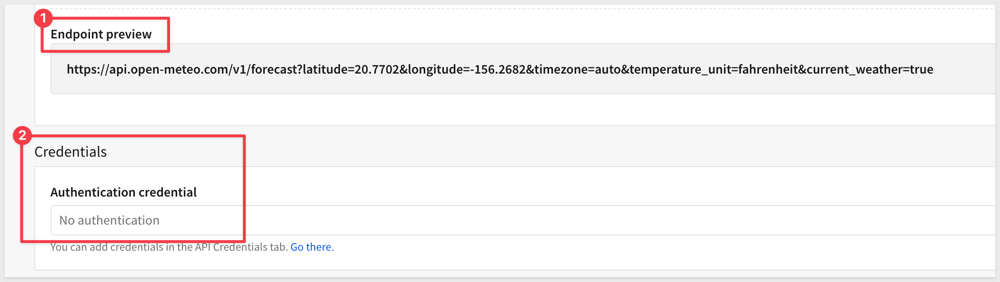

**Credentials:** [optional] Select a credential from your configured API credentials in Sigma.<br>
None required.

For more information, see [Add a new API credential to Sigma](https://help.sigmacomputing.com/docs/configure-api-credentials-and-connectors-in-sigma#grant-access-to-api-credentials-and-connectors)

### Testing the connection
Since no authentication is required, we can just click `Test connector`:

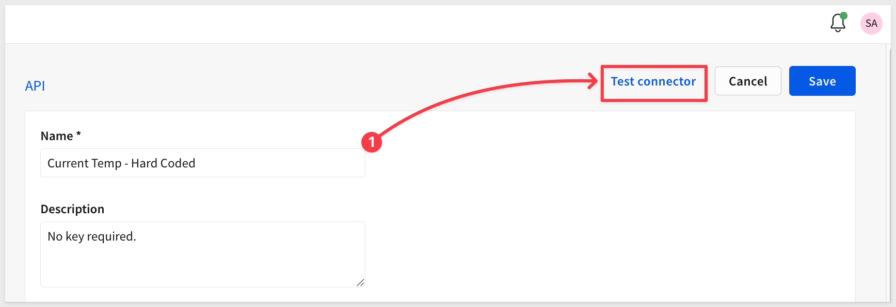

We have the option to do a `Dry run` which just pings the endpoint but in this case, we want to get a response so we leave that option off.

If the connector is configured correctly we expect a `200` response with the data in the body:

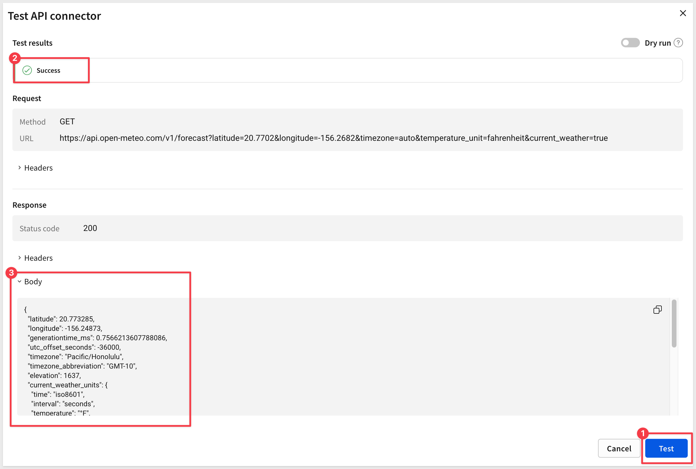

If you prefer to use a 3rd party tool like Postman, that is also fine:

Copy and paste the preview URL into [Postman](https://quickstarts.sigmacomputing.com/guide/sigma_api_with_postman/index.html?index=..%2F..index#0) to see if we get the expected response.

For example, a quick test in Postman to check the response:

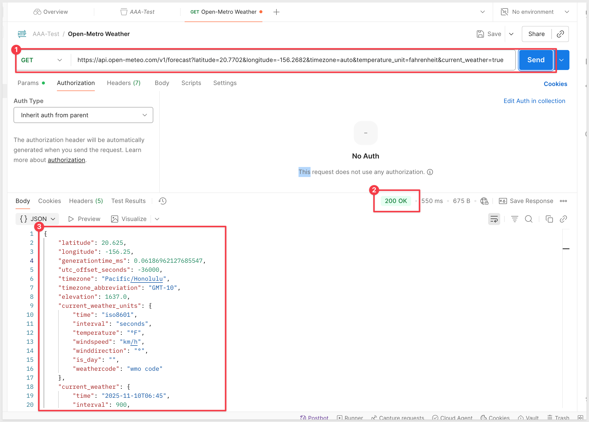

`Save` the working API connector.


<!-- END OF SECTION-->

## Workbook Configuration
Duration: 5

Now that we have an API connector configured, let's create a workbook to use it.

### Create a New Workbook

Log into Sigma and click the `Create New` button in the top left corner.

Select `Workbook`.

### Add City Data

We'll create a table of cities with coordinates that users can select from to fetch weather data.

Using the `Element bar`, add a new `Table` from the `Data` group. Select `SQL` as the source. 

Select the `Sigma Sample Database` for the connection to use:

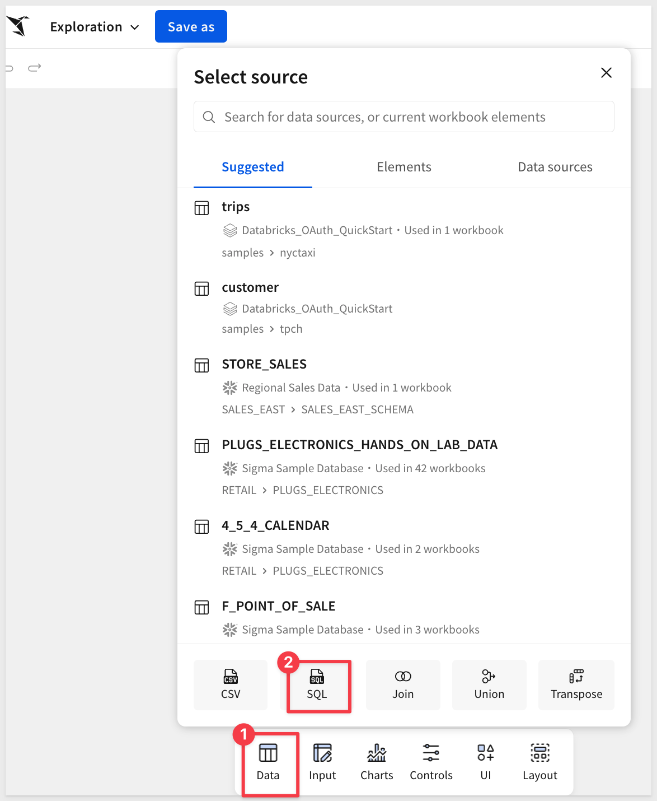

Paste the following SQL:

```code
SELECT
    STORE_CITY AS cityname,
    ANY_VALUE(STORE_LATITUDE) AS lat,
    ANY_VALUE(STORE_LONGITUDE) AS lon
FROM RETAIL.PLUGS_ELECTRONICS.PLUGS_ELECTRONICS_HANDS_ON_LAB_DATA
GROUP BY STORE_CITY
ORDER BY STORE_CITY;
```

Click `Run` to execute the query:

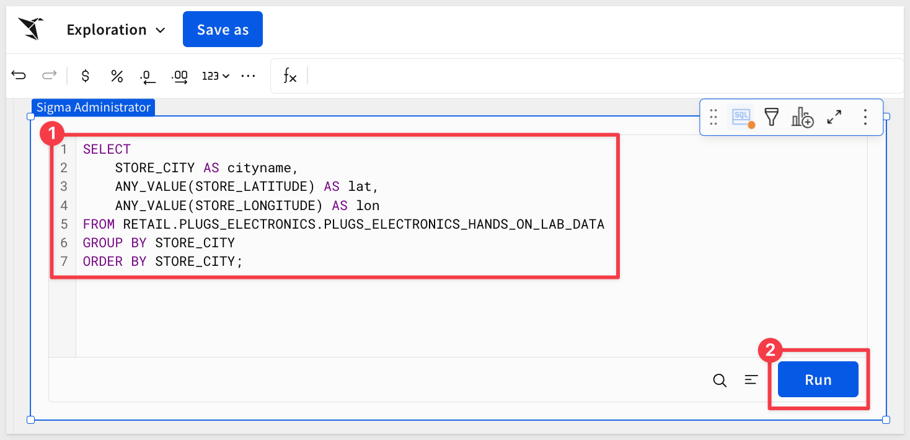

The element will return data. Click `SQL` icon to hide the SQL query:

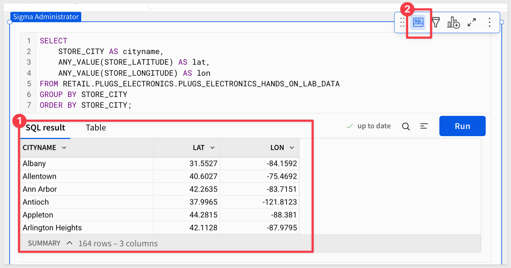

Rename this element to `Cities`.

Rename the current workbook page to `Data`.

### Add a Text Area Control

Create a new workbook page and rename it `Raw-Response`.

Add a new `Text area` control from the `Controls` group on the `Element bar`.

This control will be used to display the raw API response when we call the weather API.

Rename this control to `Raw Response` and set its `Control ID` to `raw-response`.

### Add a Button

Add a `Button` element to the page from the `UI` group.

Change the button text to `Call API`.

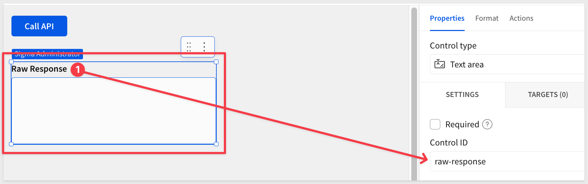

Now we can configure the button's actions:

Select the `Call API` button and click `+` adjacent to `Action sequence` in the element properties panel.

### Action 1: Clear 'Raw Response'

This action clears any previous API response from the text area.

**Action type:** `Set control value`<br>
**Control:** `Raw Response`<br>
**Value:** Leave blank (this clears the control)

Actions are saved as you add them.

### Action 2: Call 'Current Temp - Hard Coded'

This action calls the API connector we configured earlier.

Add another action.

**Action type:** `Call API`<br>
**API Connector:** `Current Temp - Hard Coded`

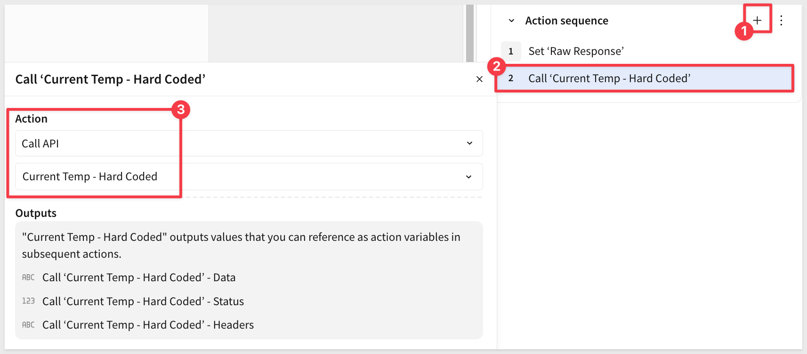

Notice the `Outputs` section shows three action variables that can be referenced in subsequent actions:
- `Call 'Current Temp - Hard Coded' - Data` (the API response body)
- `Call 'Current Temp - Hard Coded' - Status` (the HTTP status code)
- `Call 'Current Temp - Hard Coded' - Headers` (the response headers)

### Action 3: Set 'Raw Response'

This action displays the API response in the text area control.

Click `Add action` to create the third action.

**Action type:** `Set control value`<br>
**Control:** `Raw Response`<br>
**Value:** Click the reference icon and select `Call 'Current Temp - Hard Coded' - Data`

Your action sequence should now look like this:

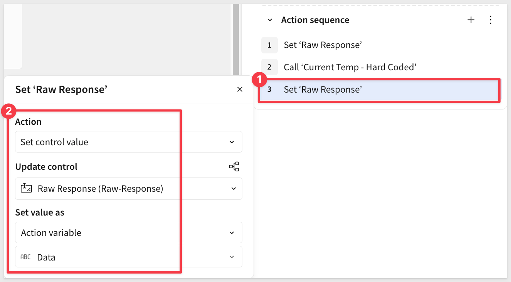

### Test the API Call

Click the `Call API` button to see the raw response from Open-Meteo:

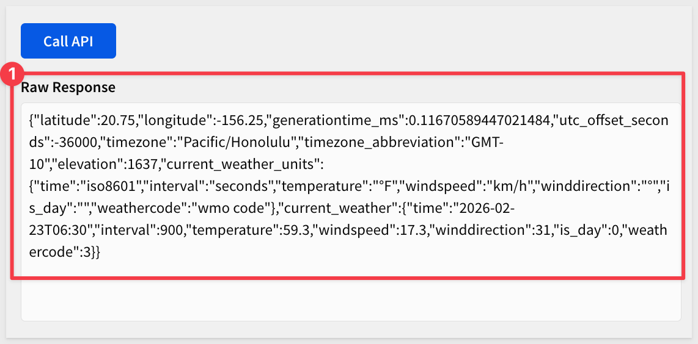


<!-- END OF SECTION-->

## Parse a Response
Duration: 5

Now that we see how to get data, we need to format the data so that we can reliably read values from it.

Since the data is raw, we can easily convert it to JSON using a formula. Let's use a KPI chart to show the current temperature from the raw response.

Add a new `KPI` chart from the `Charts` group.

Set its source to use the `Cities` table on the `Data` page.

Before this will work, we need to convert the raw response to JSON by adding a new column to the KPI using the [Json](https://help.sigmacomputing.com/docs/json) conversion function:

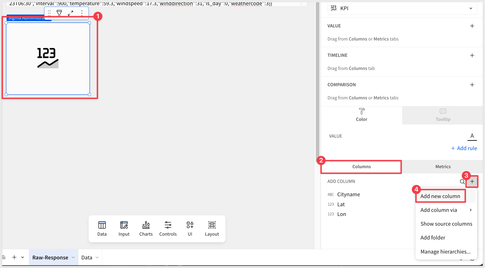

Set the formula to:
```copy-code
Json([Raw-Response])
```

Rename the new column to `Convert Raw Response to Json`.

Once converted, we can parse the temperature from the JSON by adding another new column and setting its formula to:
```copy-code
Number([Raw-Response].current_weather.temperature)
```

Rename this new column to `Temperature` and move it to the KPI charts `VALUE` group.

Clicking the button displays the current temperature for our hard-coded location.

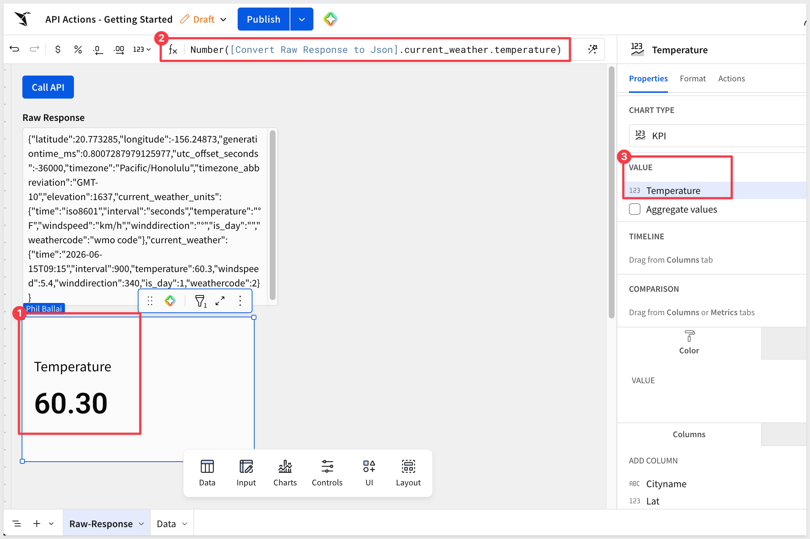


<!-- END OF SECTION-->


## Dynamic Query Parameters
Duration: 5

Now we want to allow the user to get the temperature from any city that is in the `Cities` table, via a list select control.

Return to `Administration` > `API Connectors` and add a new one.

**Name:** Current Temp - City Select

**Base URL:** Select an HTTP method and the URL for the request.<br>
Use this URL:
```copy-code
https://api.open-meteo.com/v1/forecast?latitude={{latitude}}&longitude={{longitude}}&current_weather=true&temperature_unit=fahrenheit
```

<aside class="positive">
<strong>IMPORTANT:</strong><br> In the URL we have parameterized latitude and longitude so that they can be dynamically populated at runtime, when a user selects a city.
</aside>

**Params:** Add four query parameters:
```copy-code
KEY                 TYPE          VALUE
latitude            Dynamic
longitude           Dynamic
current_weather     Static        true
temperature_unit    Static        fahrenheit
```

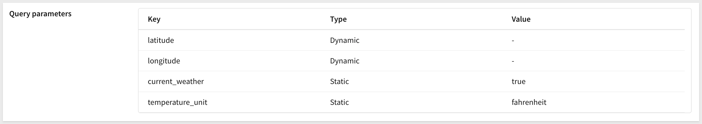

Also check the endpont preview (at the bottom of the page) carefully. Small mistakes will cause API call failures:

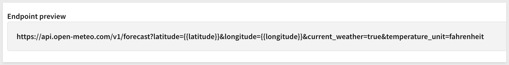


### Add list select control
Return to your workbook and the `Raw-Response` page. 

Add a new `List select` control to the page and configure it to get the `Cityname` from the `Cities` page:

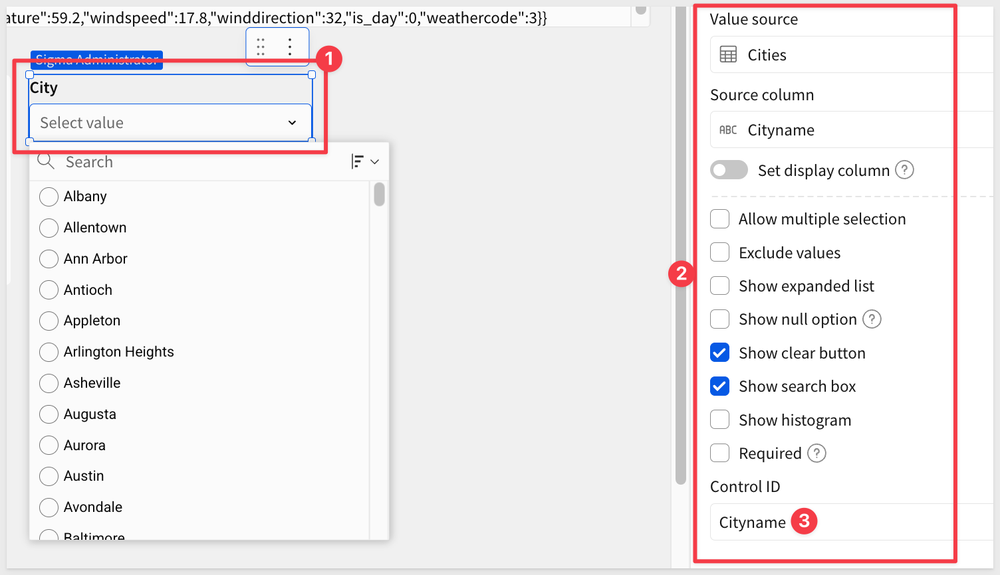

Set the list control to target the `Cityname` column of the `Cities` table:

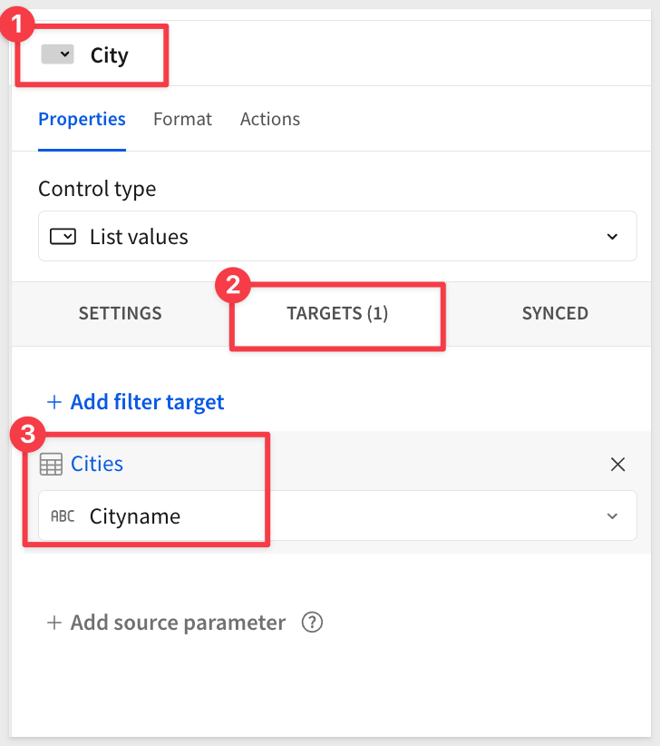

Add three `Text` controls to the page from the `UI` group.

For each text control, press the `=` key to enter formula mode and set the formulas as follows:

**Text control 1:**
```copy-code
[Cities/Cityname]
```

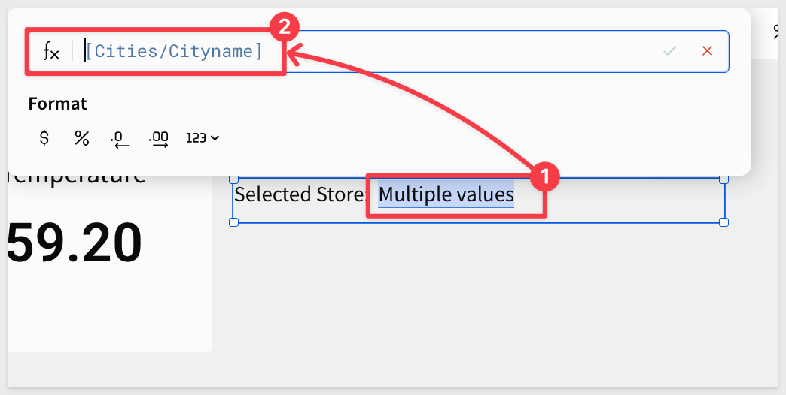

**Text control 2:**
```copy-code
[Cities/Lat]
```

**Text control 3:**
```copy-code
[Cities/Lon]
```

The text controls will show `Multiple values` until a city is selected from the list control:

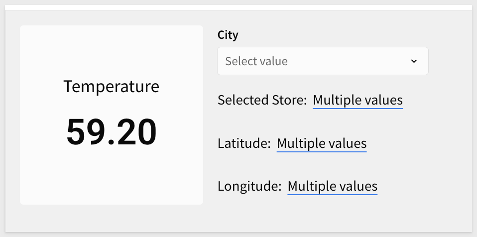

Before we configure actions, let's organize the page layout.

Move the list select control to the right of the `Call API` button.

Select the three text controls showing cityname, latitude, and longitude, and place them in a container:

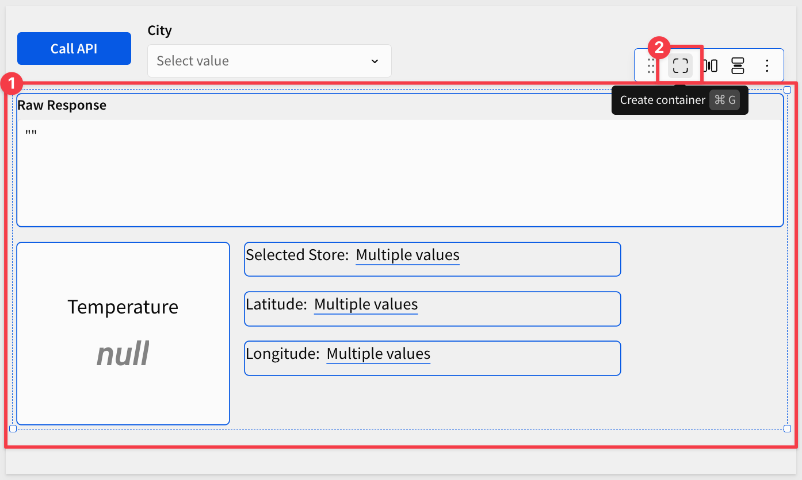

This allows us to target all the elements in the container at once from an action, saving time.

### Add Actions to the list control

Now we'll configure the list control to call the new API connector when a city is selected.

Select the list control and click `+` adjacent to `Action sequence` in the element properties panel.

#### Action 1: Clear controls in 'Container 1'

This action clears the text controls showing the selected city, latitude, and longitude.

**Action type:** `Clear control value`<br>
**Control:** Select the container holding the three text controls

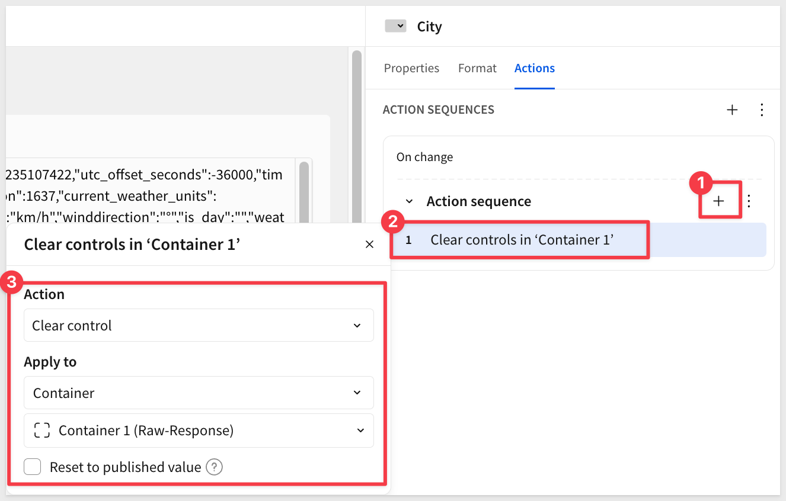

#### Action 2: Clear 'Raw Response'

This action clears the previous API response.

Add another action.

**Action type:** `Clear control`<br>
**Control:** `Raw Response`<br>

#### Action 3: Call 'Current Weather - City Select'

This action calls the new API connector with dynamic latitude and longitude parameters.

Add another action.

**Action type:** `Call API`<br>
**API Connector:** `Current Weather - City Select`

In the `Map with` section, map the API parameters to columns from the Cities table. We need to convert the latitude and longitude values to text format using the TEXT() function.

**latitude:** Click the mapping dropdown, select `Formula`, and enter:
```code
TEXT([Cities/Lat])
```

**longitude:** Click the mapping dropdown, select `Formula`, and enter:
```code
TEXT([Cities/Lon])
```

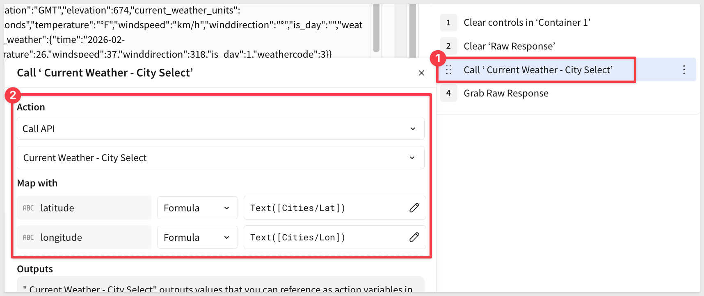

#### Action 4: Grab Raw Response

This action displays the new API response in the text area control.

Add another action.

**Action type:** `Set control value`<br>
**Control:** `Raw Response`<br>
**Set value as:** `Action variable` > `Data`

Your complete action sequence should now have four actions configured.

### Test the Dynamic API Call

Select a city from the list control to see it work:

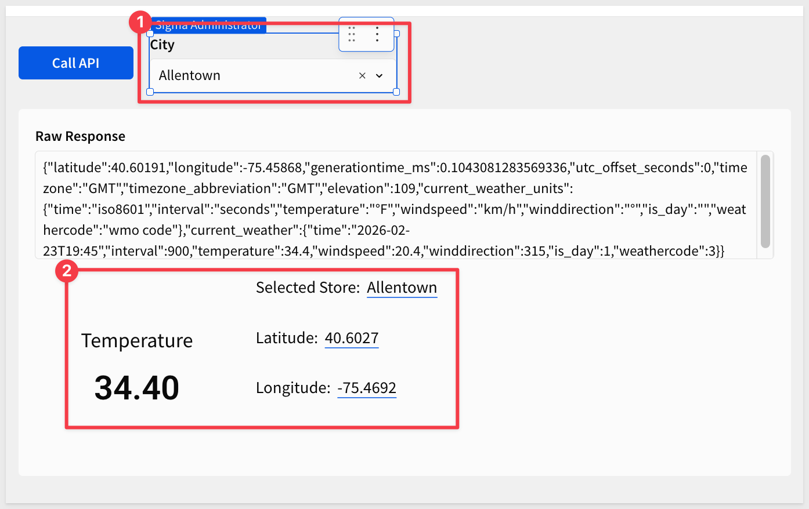

Really simple and crazy powerful too!

<aside class="positive">
<strong>NOTE:</strong><br> When working with APIs, data type matching is critical. In this example, we used the TEXT() function to convert numeric latitude and longitude values to strings because the Open-Meteo API expects text parameters. If data types don't match what the API expects, you'll receive error responses.
</aside>


<!-- END OF SECTION-->

## What we've covered
Duration: 5

In this QuickStart, we explored the fundamentals of Sigma API Actions by building a simple weather data application. You learned how to:

- Configure API connectors with both static and dynamic parameters
- Create actions that call external APIs from Sigma workbooks
- Parse JSON responses using Sigma's built-in functions
- Build interactive experiences using controls to drive API inputs
- Handle data type conversions for API compatibility

These techniques form the foundation for integrating any REST API into your Sigma workbooks, enabling you to combine cloud data warehouse analytics with real-time external data sources. 

**Additional Resource Links**

[Blog](https://www.sigmacomputing.com/blog/)<br>
[Community](https://community.sigmacomputing.com/)<br>
[Help Center](https://help.sigmacomputing.com/hc/en-us)<br>
[QuickStarts](https://quickstarts.sigmacomputing.com/)<br>

Be sure to check out all the latest developments at [Sigma's First Friday Feature page!](https://quickstarts.sigmacomputing.com/firstfridayfeatures/)
<br>

[](https://twitter.com/sigmacomputing)&emsp;
[](https://www.linkedin.com/company/sigmacomputing)&emsp;
[](https://www.facebook.com/sigmacomputing)


<!-- END OF WHAT WE COVERED -->
<!-- END OF QUICKSTART -->
