author: pballai
id: developers_api_actions_jira
summary: developers_api_actions_jira
categories: Developers
environments: web
status: Published
feedback link: https://github.com/sigmacomputing/sigmaquickstarts/issues
tags: Default
lastUpdated: 2026-02-27

# Integrate JIRA using API Actions

## Overview
Duration: 5

This QuickStart demonstrates integrating JIRA's REST API with Sigma using Basic Authentication and API Actions. You'll connect to JIRA Cloud, query issues using JQL (JIRA Query Language), and optionally update issue statuses directly from Sigma workbooks.

Unlike simple no-authentication examples, this QuickStart shows enterprise-grade patterns using authenticated API requests with dynamic parameters.

**What you'll build:**

A Sigma workbook that:
- Queries JIRA issues using JQL filters
- Displays issue details (summary, status, priority, assignee)
- Allows users to filter issues by project, type, and status
- Optionally updates issue statuses via API write-back

**Along the way you'll learn how to:**
- Configure JIRA API tokens for Basic Authentication
- Create API credentials in Sigma with Basic Auth
- Build API connectors with dynamic JQL parameters
- Parse JSON responses using Python elements on Snowflake
- Create interactive workflows with API Actions


<aside class="positive">
<strong>IMPORTANT:</strong><br> Some screens in Sigma may appear slightly different from those shown in QuickStarts. This is because Sigma continuously adds and enhances functionality. Rest assured, Sigma's intuitive interface ensures that any differences will not prevent you from successfully completing any QuickStart.
</aside>

For more information on Sigma's product release strategy, see [Sigma product releases](https://help.sigmacomputing.com/docs/sigma-product-releases)

If something doesn't work as expected, here's how to [contact Sigma support](https://help.sigmacomputing.com/docs/sigma-support)

### Target Audience
This QuickStart is ideal for:
- Sigma developers integrating external APIs with authenticated endpoints
- Technical users managing JIRA projects who want to create custom dashboards
- Teams building operational workflows that span Sigma and JIRA

### Prerequisites

<ul>
  <li>A Sigma account with workbook creation and API Action permissions</li>
  <li>A JIRA Cloud account (free trial available at <a href="https://www.atlassian.com/try/cloud/signup" target="_blank">Atlassian</a>)</li>
  <li>Intermediate familiarity with Sigma workbooks, controls, and elements</li>
  <li>Access to Snowflake for Python element execution (included with Sigma Sample Database)</li>
  <li>Basic understanding of REST APIs and JSON (helpful but not required)</li>
 </ul>

<aside class="positive">
<strong>IMPORTANT:</strong><br> Sigma recommends using non-production resources when completing QuickStarts.
</aside>

<button>[Sigma Free Trial](https://www.sigmacomputing.com/free-trial/)</button>

<aside class="negative">
<strong>IMPORTANT:</strong><br> Some features may carry a "Beta" tag. Beta features are subject to quick, iterative changes. As a result, the latest product version may differ from the contents of this document.
</aside>


## Create API Token in JIRA
Duration: 5

Assuming you have already created a JIRA trial account, perform the following steps:

1. Browse to: [JIRA API Tokens creation page](https://id.atlassian.com/manage-profile/security/api-tokens)
2. Click `Create API token`:

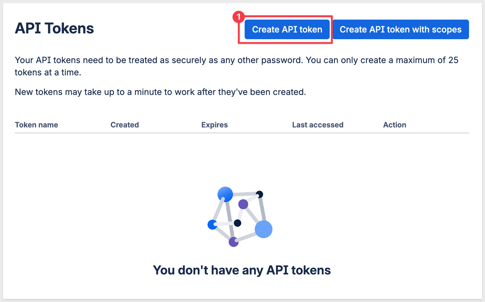

3. Name it: `QuickStarts Token` and give it a date in the future that allows enough time to complete testing:

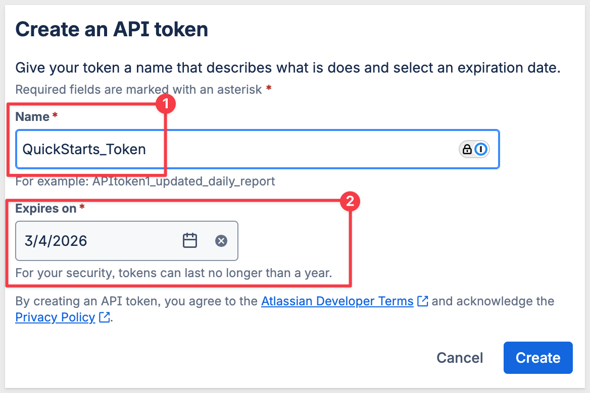

4. Click `Create`
5. Copy the token immediately - you won't see it again! (place it in a safe location):

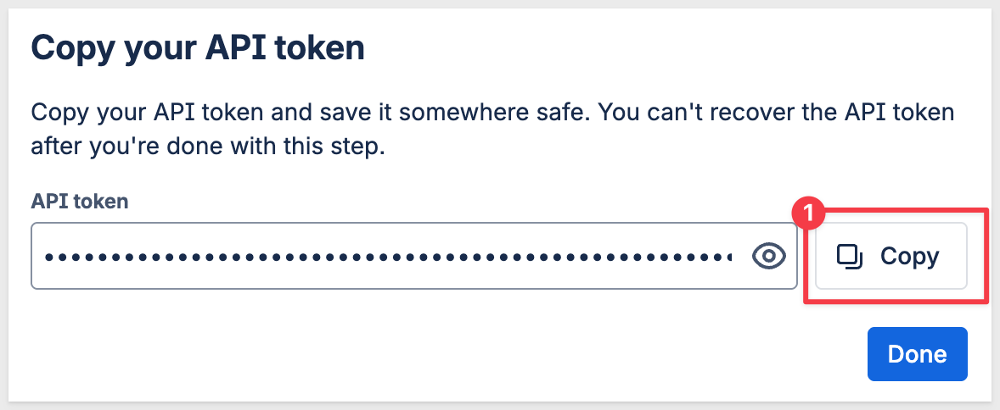

6. Click `Done`.


<!-- END OF SECTION-->

## Understanding JIRA Authentication
Duration: 3

JIRA Cloud uses **Basic Authentication** with API tokens. This is simpler than OAuth 2.0 and works well for server-to-server integrations like Sigma.

**How Basic Auth works:**
- Your email address serves as the username
- The API token you created serves as the password
- Sigma encodes these credentials and includes them in the `Authorization` header of each API request

**Why this approach:**
- No OAuth redirect flows or token refresh logic required
- API tokens can be scoped and revoked independently from your JIRA password
- Suitable for automated integrations where user interaction isn't needed

<aside class="positive">
<strong>SECURITY NOTE:</strong><br> API tokens should be treated like passwords. Store them securely in Sigma's credential management system—never hardcode them in formulas or expose them in workbook elements.
</aside>

Sigma API Actions support many common authentication methods including (at the time of this QuickStart):
- Bearer token
- Basic Auth
- OAuth (client credendtials)
- OAuth (authorization code)
- OAuth (password credentials)

For more information, see [Add a new API credential to Sigma](https://help.sigmacomputing.com/docs/configure-api-credentials-and-connectors-in-sigma#add-a-new-api-credential-to-sigma)


<!-- END OF SECTION-->

## Configure Sigma API Credentials
Duration: 5

Now we'll create a credential in Sigma that securely stores your JIRA authentication details.

1. In Sigma, navigate to `Administration` > `API connectors` > `Credentials`

2. Click `Create Credential`:

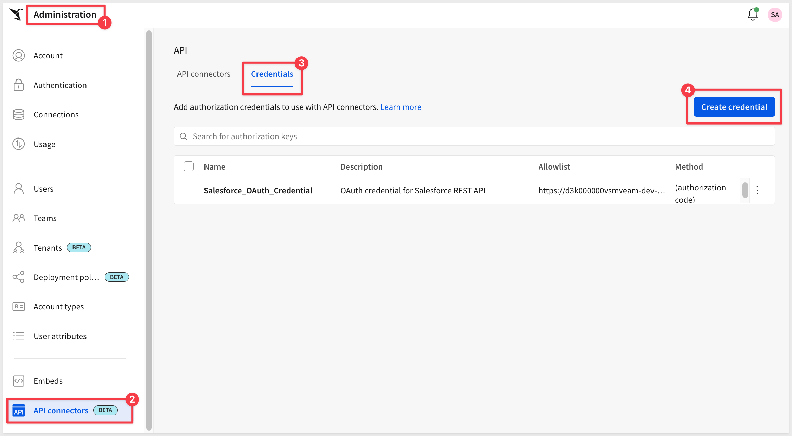

3. Configure the credential:
   - **Name:** `JIRA API Token`
   - **Description:** `Basic Auth for JIRA Cloud API`
   - **Authorized domains:** Your specific JIRA domain (e.g., **yourcompany**.atlassian.net)
   - **Authentication method:** `Basic auth`
   - **Username:** Your JIRA email address (e.g., `yourname@domain.com`)
   - **Password:** Paste the API token you created in the previous section (the API token serves as the password for Basic auth)

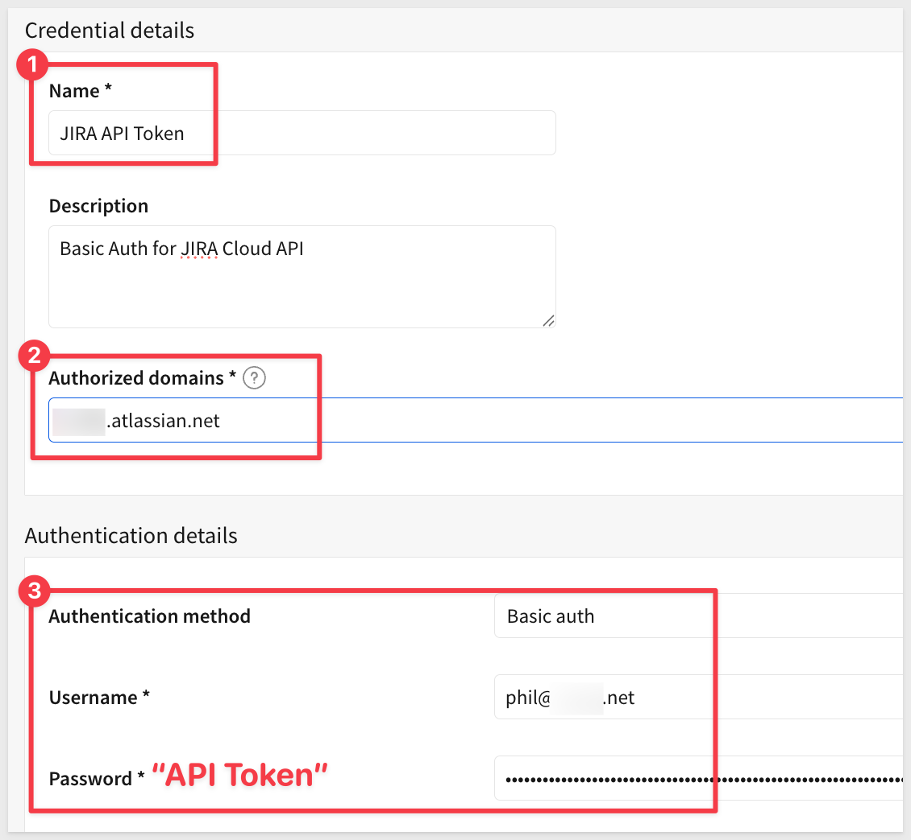

4. Click `Save`.

The credential is now available for use in API connectors throughout your Sigma organization.

<aside class="positive">
<strong>TIP:</strong><br> Credentials created at the account level can be shared across multiple workbooks and API connectors. This makes updating credentials easier—change it once, and all connectors using it are updated.
</aside>


<!-- END OF SECTION-->

## Define the JIRA API Connector
Duration: 10

API connectors define the endpoints we'll call from Sigma. First, let's create a connector that searches for JIRA issues using JQL.

### Create the Connector

1. Still on the `Administration` > `API Connectors` page, select the `API connectors` tab.

2. Click `Create connector`

3. Configure the connector details:
   - **Name:** `JIRA - Search Issues`
   - **Description:** `Query JIRA issues using JQL`
   - **Credential:** Select `JIRA API Token` (the credential we created)

4. In the `Request details` section, configure:
   - **Connector type:** `Custom connector`
   - **Base URL:** Set the method to `GET` and enter `https://YOUR-DOMAIN.atlassian.net/rest/api/3/search/jql` (replace `YOUR-DOMAIN` with your actual JIRA domain)

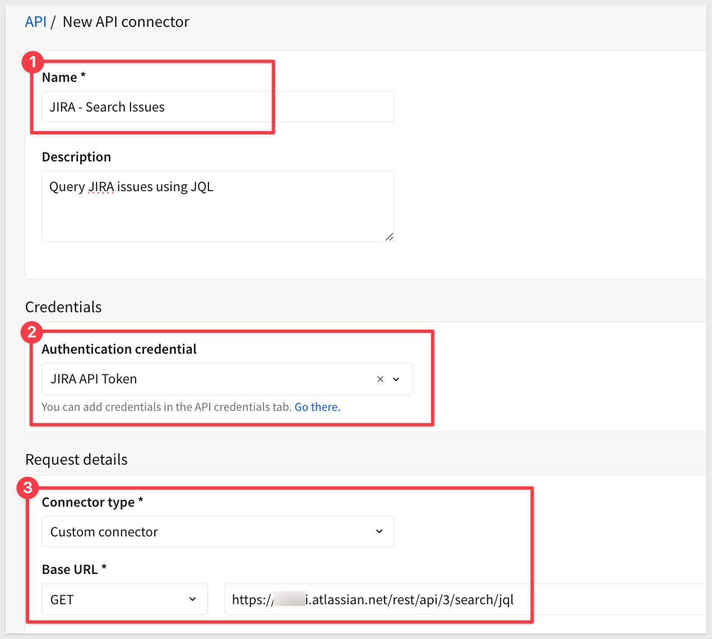

### Add Query Parameters

5. In the `Query parameters` section, click `Add parameter`:
   - **Key:** `jql`
   - **Mode:** `Static`
   - **Value:** `project = SCRUM ORDER BY created DESC`
   
This default JQL query retrieves all issues from the SCRUM project, ordered by creation date.

6. Add a second query parameter for the fields we want to retrieve:
   - **Key:** `fields`
   - **Mode:** `Static`
   - **Value:** `key,summary,status,priority,assignee,created,issuetype`

This tells JIRA which fields to return in the response. Without this parameter, the API returns minimal data (only IDs).

7. Optionally add a third query parameter to limit results:
   - **Key:** `maxResults`
   - **Mode:** `Static`
   - **Value:** `50`

This limits the number of results returned (JIRA's default is 50, maximum is 100).

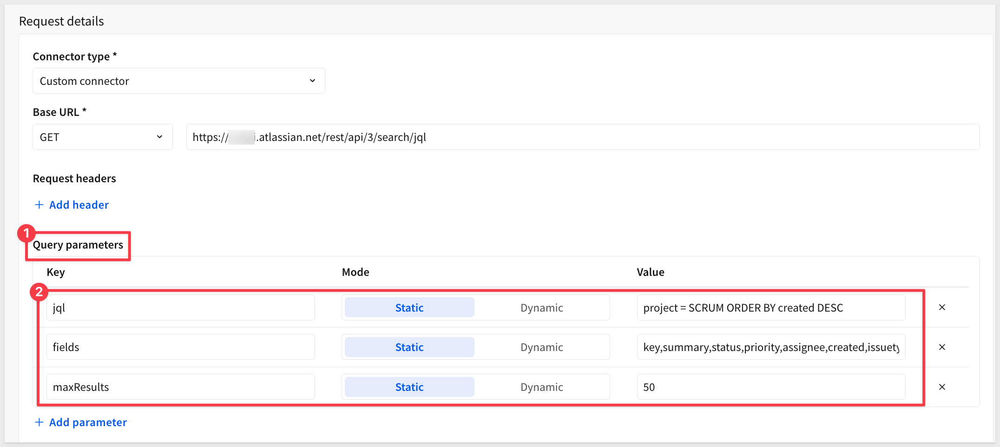

8. Click `Test connector` to verify the connector works.

You should see a successful response with JIRA issue data in JSON format, now including all the fields (key, summary, status, etc.):

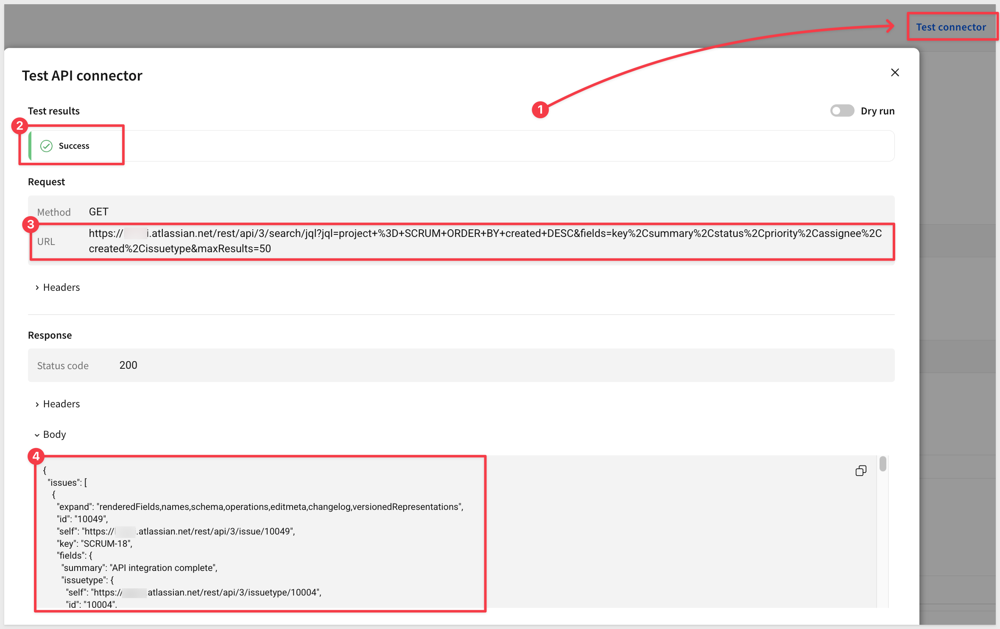

9. Click `Save` to save the API connector

<aside class="positive">
<strong>ABOUT JQL:</strong><br> JIRA Query Language (JQL) is JIRA's search syntax. Common examples:<br>
- <code>project = SCRUM AND status = "In Progress"</code><br>
- <code>assignee = currentUser() AND priority = High</code><br>
- <code>created >= -7d ORDER BY created DESC</code> (issues from last 7 days)<br>
For more information, see <a href="https://support.atlassian.com/jira-service-management-cloud/docs/use-advanced-search-with-jira-query-language-jql/" target="_blank">Atlassian's JQL documentation</a>
</aside>


<!-- END OF SECTION-->

## Create Sample Data in JIRA
Duration: 5

Before we build the Sigma workbook, let's create some sample issues in JIRA to work with. A JIRA trial starts with empty projects, so we need to add test data.

### Navigate to Your Project

1. Go to your JIRA board: `https://YOUR-DOMAIN.atlassian.net/jira/software/projects/SCRUM/boards/1`

2. You should see a Scrum board with columns: `To Do, In Progress, In Review, Done`.

JIRA may have created a couple of default tasks (Task 1, Task 2) to get you started. You can keep these or delete them to make the UI cleaner.

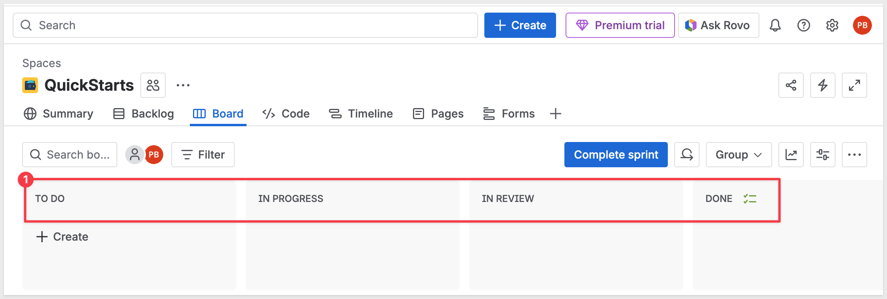

### Create Issues

3. Click the `+ Create` button at the top of the page:

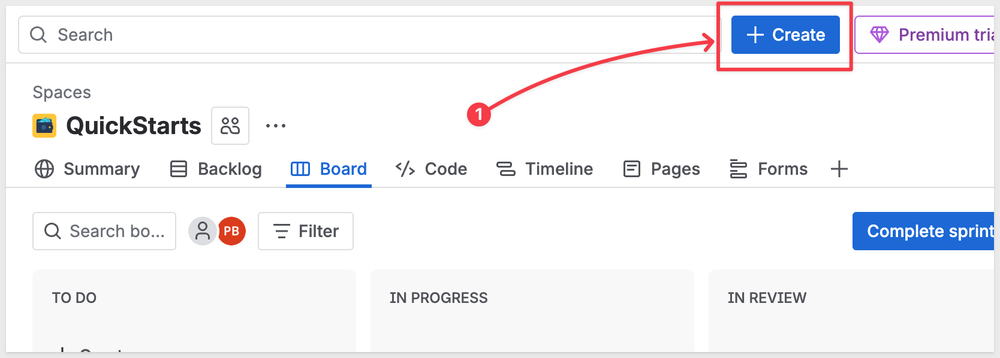

4. Select `Task` for `Work type`.

5. For the `Summary` field, use `Set up development environment`

6. Click `Create`.

A popup will appear that allows us to assign the new task to our default scrum and sprint. Click the `Add to SCRUM Sprint 0` link:

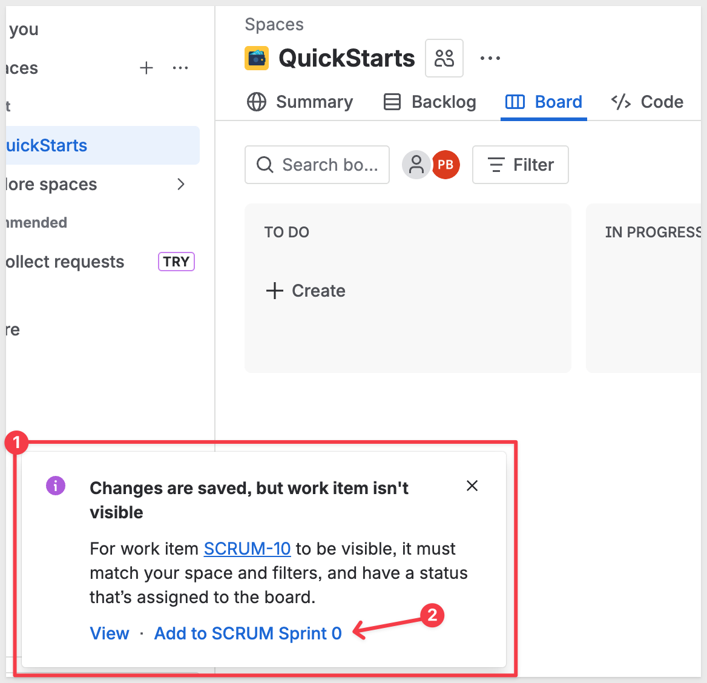

The issue will appear in the TO DO column:

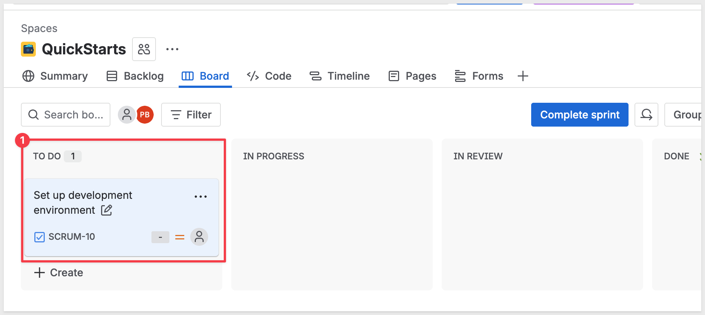

<aside class="positive">
<strong>TIP:</strong><br> We can also create issues from the board's `+ Create` button instead of using the top navigation `Create` button, which automatically adds them to the current sprint and sets the correct status.
</aside>

7. Create additional issues with variety using different work types (Task, Story, Epic). Here's a suggested set organized by status:

**TO DO:**
- `Search results not loading` (Task)
- `Export data to CSV` (Story)

**IN PROGRESS:**
- `Configure CI/CD pipeline` (Task)
- `User login with SSO` (Story)

**IN REVIEW:**
- `Dashboard performance improvements` (Story)
- `Timeout on large datasets` (Task)

**DONE:**
- `Update documentation` (Task)
- `API integration complete` (Story)

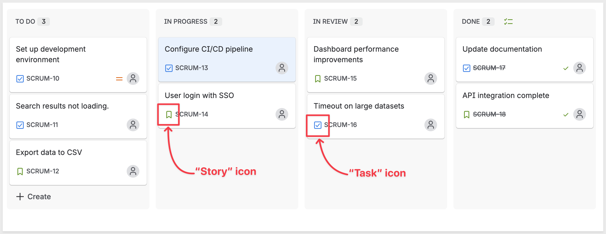

<aside class="positive">
<strong>NOTE:</strong><br> Creating a mix of types, statuses, and priorities makes the QuickStart demo more realistic and lets you test the filtering controls effectively.
</aside>

The following optional sections are provided to orient readers less familiar with JIRA and are not required.

### Set Different Statuses (optional)

8. To change an issue's status, drag and drop it between columns on the board:
   - Drag some issues to `In Progress`
   - Drag some to `In Review`
   - Drag some to `Done`

### Add Details (Optional)

9. For more realistic data, click on individual issues and add:
   - **Priority:** High, Medium, or Low
   - **Assignee:** Assign some to yourself, leave others unassigned
   - **Labels:** Add tags like "backend", "frontend", "urgent"
   - **Due dates:** Add dates to a few issues

### Verify Your Data (Optional)

10. Once you've created several issues, test the JQL query in JIRA:
   - Click the search icon in the top navigation
   - Click on `Filters` tab at the bottom:

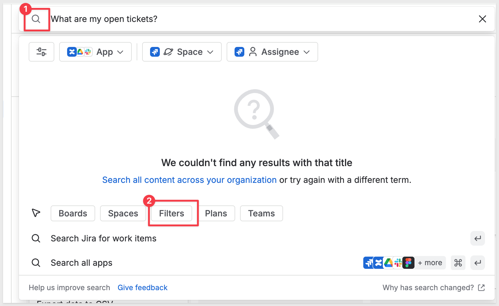

   - Click `Create filter`:

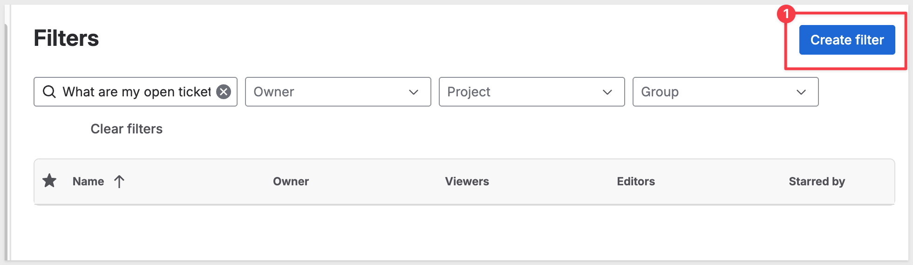

   - In the search bar, enter: `project = SCRUM ORDER BY created DESC`
   - You should see all your issues listed

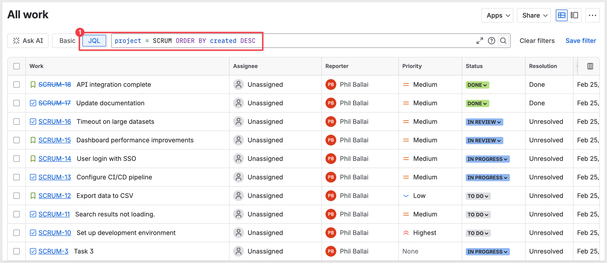

Alternatively, you can verify by simply viewing your board - all the issues you created should be visible in their respective columns.

Now you're ready to query this data from Sigma!


<!-- END OF SECTION-->

## Understanding the Python Parsing Code
Duration: 3

Before building the workbook, let's understand how we'll parse JIRA's JSON responses using Python. We're covering this now so you understand the overall data flow before implementing it in the next section. This preview will make the workbook setup clearer and help you understand why each element is needed.

**Why Python elements:**

JIRA's API returns nested JSON with arrays of issues, each containing multiple fields. Python elements (which run on Snowflake) let us transform this JSON into tabular data that Sigma can display and analyze.

**How the workflow works:**

1. **Button action calls API** → stores JSON response in a text area control
2. **Python element reads from text area** → using `sigma.get_control_value()`
3. **Python parses and flattens JSON** → extracts fields from nested structure
4. **Python outputs DataFrame** → using `sigma.output()` to make it available to child elements
5. **Child table element displays data** → shows the parsed issues in table format

**What the Python code does:**

```code
import pandas as pd
import json

# Read the API response from the text area control
raw = sigma.get_control_value("raw-response")

# Parse the JSON response
response_data = json.loads(raw)

# Extract issues array
issues = response_data.get('issues', [])

# Flatten nested JSON into tabular format
flattened_issues = []

for issue in issues:
    flattened_issues.append({
        'Issue Key': issue['key'],
        'Summary': issue['fields']['summary'],
        'Status': issue['fields']['status']['name'],
        'Priority': issue['fields']['priority']['name'] if issue['fields'].get('priority') else 'None',
        'Assignee': issue['fields']['assignee']['displayName'] if issue['fields'].get('assignee') else 'Unassigned',
        'Created': issue['fields']['created'],
        'Work Type': issue['fields']['issuetype']['name']
    })

# Convert to DataFrame
df = pd.DataFrame(flattened_issues)

# Output the DataFrame so child elements can use it
sigma.output("jira_issues", df)
```

This code extracts key fields from each nested issue object and creates a DataFrame with one row per issue.

<aside class="positive">
<strong>NOTE:</strong><br> The Python element runs on your data warehouse (in this QuickStart, we're using Snowflake with Snowpark, but other warehouses are supported).<br>

The <code>sigma.get_control_value()</code> function reads the API response stored in the text area control, and <code>sigma.output()</code> makes the parsed DataFrame available to child table elements.
</aside>

For more information, see [Write and run Python code in Sigma](https://help.sigmacomputing.com/docs/write-and-run-python-code)


<!-- END OF SECTION-->

## Build the Workbook
Duration: 10

Now let's create a workbook that calls the JIRA API and displays the results.

### Create a New Workbook

1. In Sigma, click `Create New` > `Workbook`

2. Click `Save as` and name the workbook `JIRA Issues QuickStart` in your preferred location

3. Rename the first page from `Page 1` to `Issues`

### Add a Text Area for Raw Response

4. From the `Element bar`, add a `Text area` control from the `Controls` group

5. Configure the text area:
   - **Control ID:** `raw-response`
   - **Placeholder** (found in the `Format` > `ELEMENT STYLE` tab): `API response will appear here`

This control will display the raw JSON response for debugging purposes.

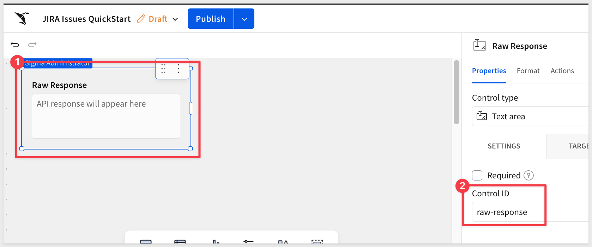

### Add a Button to Trigger the API Call

6. Add a `Button` element from the `UI` group

7. Change the button text to `Load JIRA Issues`

### Configure Button Actions

8. Click on the button and select `Action sequence` from the `Element properties` panel

We'll create a sequence of three actions for now:

#### Action 1: Clear the Raw Response

- **Action type:** `Set control value`
- **Control:** `Raw API Response`
- **Value:** Leave blank (this clears the control)

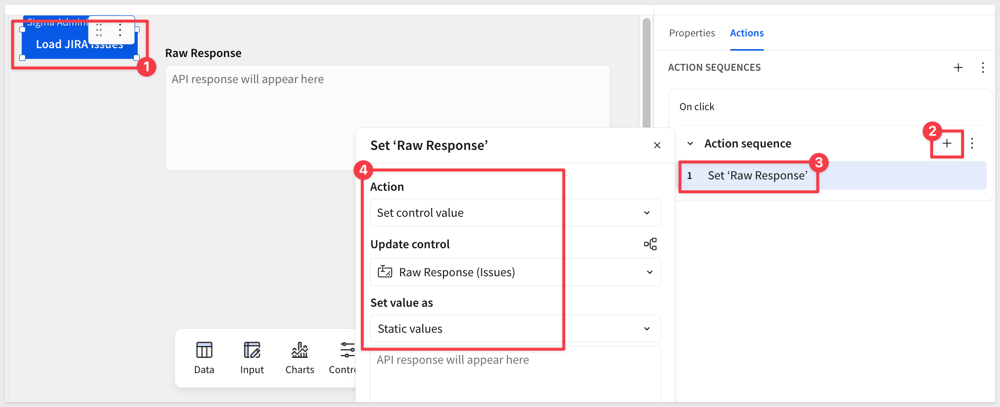

#### Action 2: Call the JIRA API

- **Action type:** `Call API`
- **API Connector:** `JIRA - Search Issues`
- **Endpoint:** `Search with JQL`

The `Outputs` section shows the action variables:
- `Call 'JIRA - Search Issues' - Data` (the response body)
- `Call 'JIRA - Search Issues' - Status` (HTTP status code)
- `Call 'JIRA - Search Issues' - Headers` (response headers)

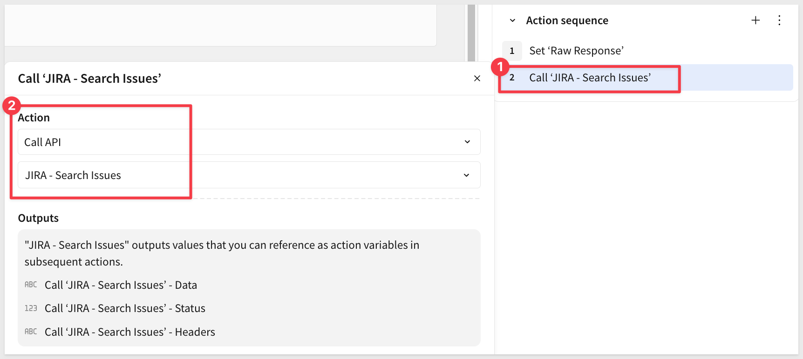

#### Action 3: Display the Raw Response

- **Action type:** `Set control value`
- **Control:** `Raw API Response`
- **Set value as:** `Action variable`
- **Select:** `Call 'JIRA - Search Issues' - Data`

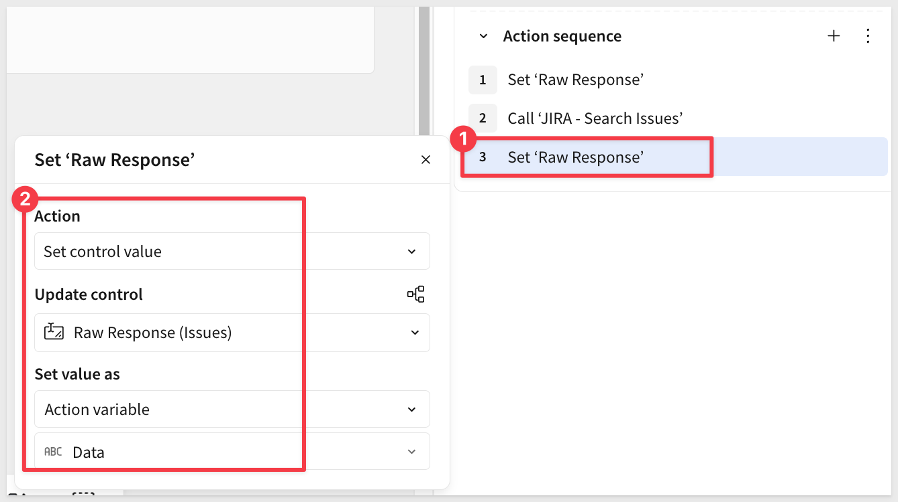

### Test the API Call

9. Click the `Load JIRA Issues` button

You should see the raw JSON response appear in the text area control, showing your JIRA issues.

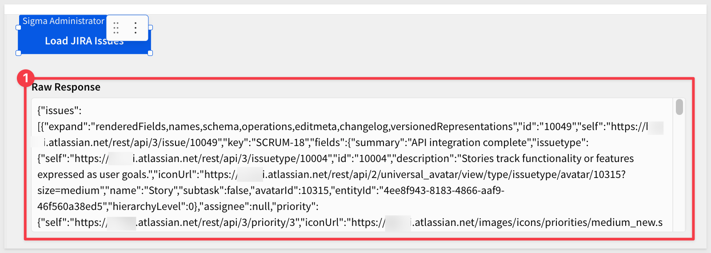

<aside class="positive">
<strong>DEBUGGING FAILURES:</strong><br> If the API call fails, check:<br>
- Your JIRA domain in the API connector base URL<br>
- The credential username matches your JIRA email<br>
- The API token is correct and not expired<br>
- Your JQL syntax is valid<br>
- Test the API connector again from the Sigma Administration UI
</aside>


<!-- END OF SECTION-->

## Parse the JIRA Response
Duration: 10

Now we'll use a Python element to transform the JSON response into a table.

### Add a Python Element

1. From the `Element bar`, add a `Python` element from the `Data` group

2. Select the Snowflake connection that has Python enabled.

For more information, see [Write and run Python code in Sigma](https://help.sigmacomputing.com/docs/write-and-run-python-code)

### Write the Python Code

3. In the Python editor, replace all the sample code in the element with:

```copy-code
import pandas as pd
import json

# Read the API response from the text area control
raw = sigma.get_control_value("raw-response")

# Handle empty response - create empty DataFrame with proper schema
if not raw:
    df = pd.DataFrame({
        "Issue Key": pd.Series(dtype="str"),
        "Summary": pd.Series(dtype="str"),
        "Status": pd.Series(dtype="str"),
        "Priority": pd.Series(dtype="str"),
        "Assignee": pd.Series(dtype="str"),
        "Created": pd.Series(dtype="str"),
        "Work Type": pd.Series(dtype="str")
    })
else:
    # Parse the JSON response
    response_data = json.loads(raw)

    # Extract issues array
    issues = response_data.get('issues', [])

    # Flatten nested JSON into tabular format
    flattened_issues = []

    for issue in issues:
        flattened_issues.append({
            'Issue Key': issue['key'],
            'Summary': issue['fields']['summary'],
            'Status': issue['fields']['status']['name'],
            'Priority': issue['fields']['priority']['name'] if issue['fields'].get('priority') else 'None',
            'Assignee': issue['fields']['assignee']['displayName'] if issue['fields'].get('assignee') else 'Unassigned',
            'Created': issue['fields']['created'],
            'Work Type': issue['fields']['issuetype']['name']
        })

    # Convert to DataFrame
    df = pd.DataFrame(flattened_issues)

# Output the DataFrame as 'jira_issues' for child elements
sigma.output("jira_issues", df)
```

4. Click `Run` to execute the Python code

You should see an `output` option appear:

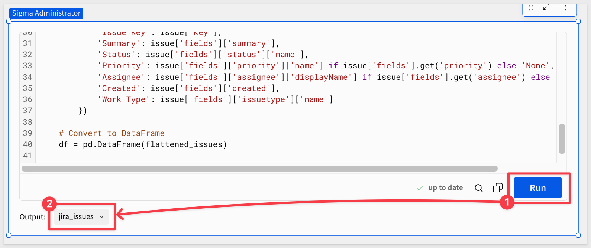

### Add Child Table Element

5. Select the `jira_issues` control and click `Table` from the menu:

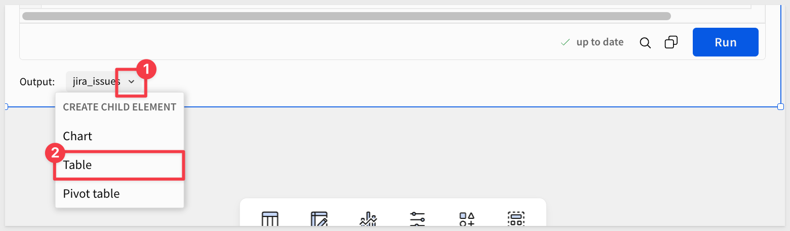

A table will appear showing all the parsed JIRA issues with properly formatted columns. We moved the elements around in the screenshot below...

6. Rename the table to `JIRA Issues Table`

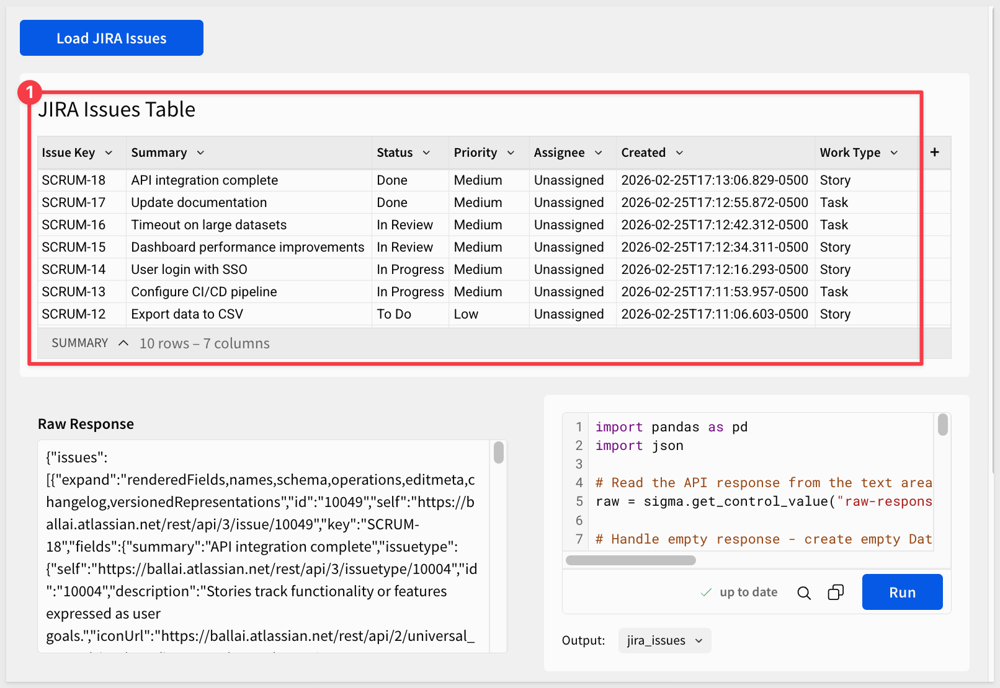

### Update Button to Refresh Python Element

7. Now that the Python element exists, go back to the `Load JIRA Issues` button and add a fourth action:

Click on the button and select `Edit actions`

#### Action 4: Run the Python Element

- **Action type:** `Run Python element`
- **Element:** `Code (Issues)` (your Python element)

This triggers the Python element to re-execute and parse the updated API response.

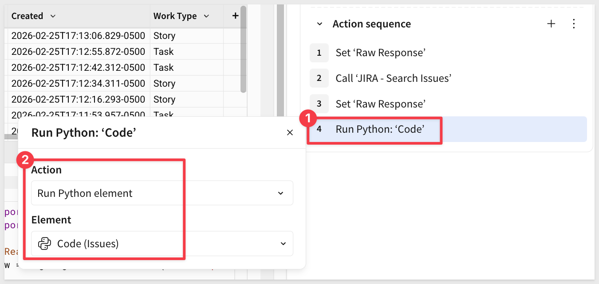

### Test the Complete Workflow

9. Click the `Load JIRA Issues` button

You should now see:
- The raw JSON response in the text area clear and reload
- The Python element will run
- The parsed table update with all your JIRA issues

The complete workflow now refreshes both the raw response and the parsed table automatically!


<!-- END OF SECTION-->

## Add Dynamic JQL Filtering
Duration: 5

Let's add a control that lets users filter issues by status.

### Add a Status Filter Control

1. Add a `List values` control from the `Controls` group

2. Configure it:
   - **Control ID:** `status-filter`
   - **Allow multiple selection:** Disabled (unchecked)

<aside class="positive">
<strong>MULTIPLE SELECTION:</strong><br> The "Allow multiple selection" option must be disabled. When enabled, the control returns an array of values which won't work with the single-value formula we're using.
</aside>

   - Toggle on `Set display values`
   - **Options:** Add these values exactly as shown. For each option, enter the Display value first, then the Value:
     - Display: `All` → Value: `All`
     - Display: `To Do` → Value: `"To Do"`
     - Display: `In Progress` → Value: `"In Progress"`
     - Display: `In Review` → Value: `"In Review"`
     - Display: `Done` → Value: `"Done"`

This separates what users see (clean text without quotes) from what gets used in formulas (values with quotes for JQL).

<aside class="negative">
<strong>IMPORTANT - QUOTE CHARACTERS:</strong><br> The control <strong>values</strong> must include literal double quote characters (<code>"</code>) because they're passed directly into the JQL query. For example, the value field should be: <code>"To Do"</code> (including both quote marks). T><br>
</aside>

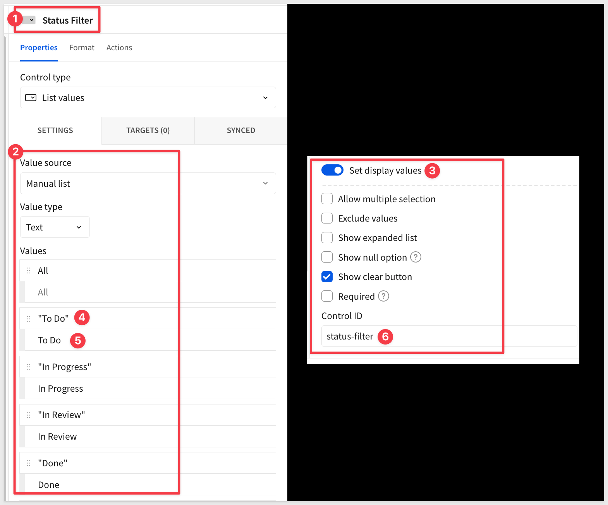

### Create a Second API Connector for Filtered Queries

Following the pattern from the Salesforce QuickStart, we'll create a second API connector specifically for filtered queries. This keeps the button working unchanged.

4. Navigate to `Administration` > `API Connectors`

5. Find the `JIRA - Search Issues` connector and click the three-dot menu

6. Select `Duplicate`:

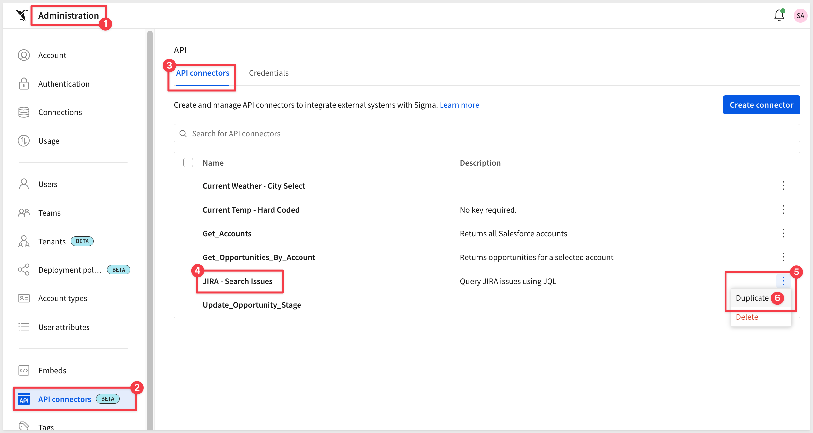

7. Open the copied connector and rename it `JIRA - Search Issues by Status`

8. Set the `Authentication credential` to `JIRA API Token`.

9. In the `Query parameters` section, find the `jql` parameter

10. Change **Mode** from `Static` to `Dynamic`

Dynamic parameters don't have default values:

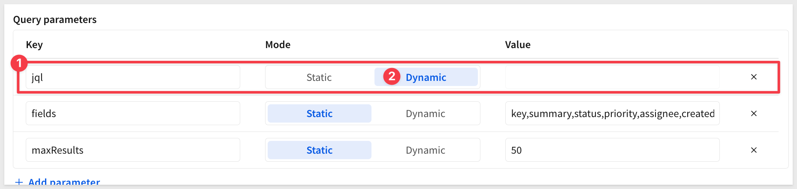

11. Click `Save`

Now we have two connectors:
- **JIRA - Search Issues** (Static, used by the button) - returns all issues
- **JIRA - Search Issues by Status** (Dynamic, used by the filter) - returns filtered issues

<aside class="positive">
<strong>WHY TWO CONNECTORS:</strong><br> Having separate connectors keeps things simple - the button continues to work unchanged with the Static connector, while the filter uses the Dynamic connector with custom formulas.
</aside>

### Add Action to the Status Filter Control

Now we'll configure the status filter control to automatically refresh the data when a user selects a different status.

12. Go back to your workbook

13. Click on the `Status Filter` control

14. In the `Element properties` panel, go to the `Actions` tab

We'll create a sequence similar to the button, but using the new dynamic connector:

#### Action 1: Clear the Raw Response

- **Action type:** `Set control value`
- **Control:** `Raw Response`
- **Value:** Leave blank or remove anything held over from testing

#### Action 2: Call the JIRA API with Dynamic JQL

- **Action type:** `Call API`
- **API Connector:** `JIRA - Search Issues by Status`

In the parameter mapping section:
- **Map with values:** `jql`
- **Formula:**

```copy-code
If([status-filter] = "All", "project = SCRUM ORDER BY created DESC", "project = SCRUM AND status = " & [status-filter] & " ORDER BY created DESC")
```

This formula:
- If "All" is selected, returns: `project = SCRUM ORDER BY created DESC`
- Otherwise, returns: `project = SCRUM AND status = "In Progress" ORDER BY created DESC`

The quotes are already part of the control value, so they're automatically included in the JQL query.

<aside class="positive">
<strong>WORKAROUND FOR QUOTES:</strong><br> We include the quotes as part of the list control values themselves (e.g., the value is literally <code>"To Do"</code> with quotes). This ensures the JQL query is properly formatted for JIRA without needing quote escaping in the formula.
</aside>

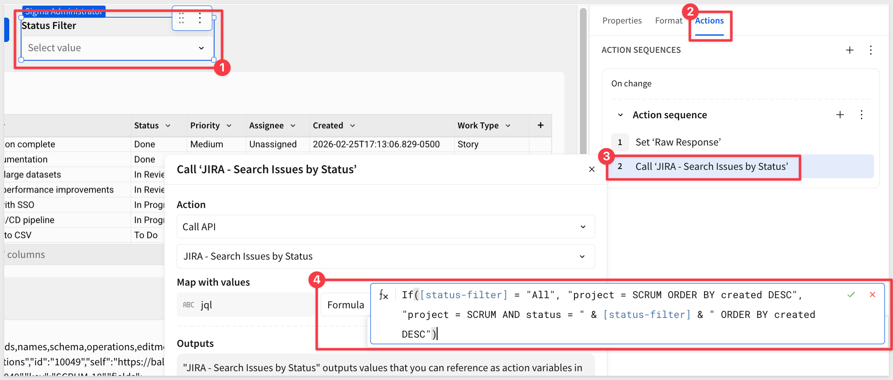

#### Action 3: Set the Raw Response

- **Action type:** `Set control value`
- **Control:** `Raw Response`
- **Set value as:** `Action variable`
- **Select:** `Call 'JIRA - Search Issues by Status' - Data`

#### Action 4: Run the Python Element

- **Action type:** `Run Python element`
- **Element:** `Code (Issues)` (your Python element)

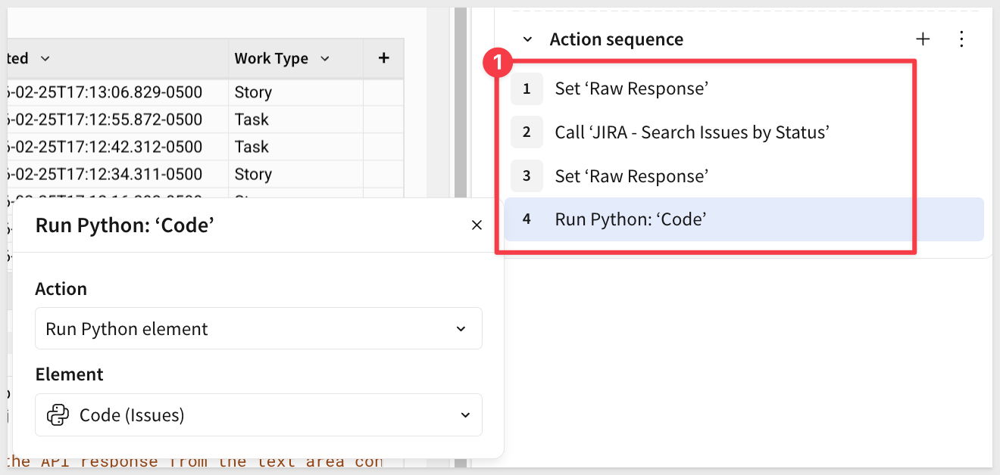

### Test the Filter

Try selecting different statuses from the `Status Filter` control.

The the Python will run, raw-response will update and the table will update to show only issues matching the selected status - no need to click the button.

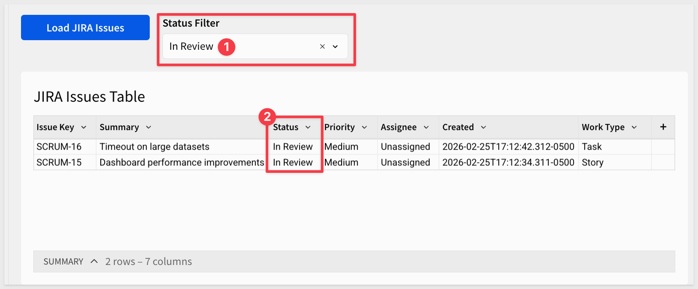

<aside class="positive">
<strong>EXTENDING THIS PATTERN:</strong><br> You can add more filter controls (work type, priority, assignee) by expanding the formula with additional <code>If()</code> conditions and JQL clauses. For complex multi-filter scenarios, consider using Sigma's <a href="https://help.sigmacomputing.com/docs/build-if-else-control-flow-in-an-action-sequence">If/Else Action conditions</a> to create separate action sequences for different filter combinations.
</aside>


<!-- END OF SECTION-->

## Update Issue Status (Write-Back)
Duration: 10

Want to update JIRA issues directly from Sigma? Let's add a write-back workflow using JIRA's transitions API.

<aside class="negative">
<strong>IMPORTANT - JIRA TRANSITIONS:</strong><br> JIRA status updates are workflow-driven. You cannot directly set a status—you must trigger a <strong>transition</strong> (a workflow action that moves an issue from one status to another). Each transition has a unique ID that varies by project and workflow configuration.<br>

Understanding the REST API we want to integrate Sigma with can be more challenging than making Sigma work with it, once its understood. 
</aside>

### Find Available Transitions

Before creating the transition connector, we need to discover the transition IDs for your workflow. Let's create a connector in Sigma to find them.

1. Navigate to `Administration` > `API Connectors`

2. Click `Create connector`

3. Configure the connector:
   - **Name:** `JIRA - Get Transitions`
   - **Description:** `Get available transitions for an issue`
   - **Credential:** `JIRA API Token`

4. Configure the request details:
   - **Connector type:** `Custom connector`
   - **Base URL:** Set method to `GET` and enter `https://YOUR-DOMAIN.atlassian.net/rest/api/3/issue/:issueKey/transitions`

Replace `YOUR-DOMAIN` with your actual JIRA domain. The `/:issueKey` syntax tells Sigma this is a path parameter.

5. Scroll down to the `Path parameters` section and configure:
   - **Key:** `issueKey` (matches the parameter name in the base URL)
   - **Mode:** `Static`
   - **Value:** Enter one of your test issue keys (e.g., `SCRUM-1`)

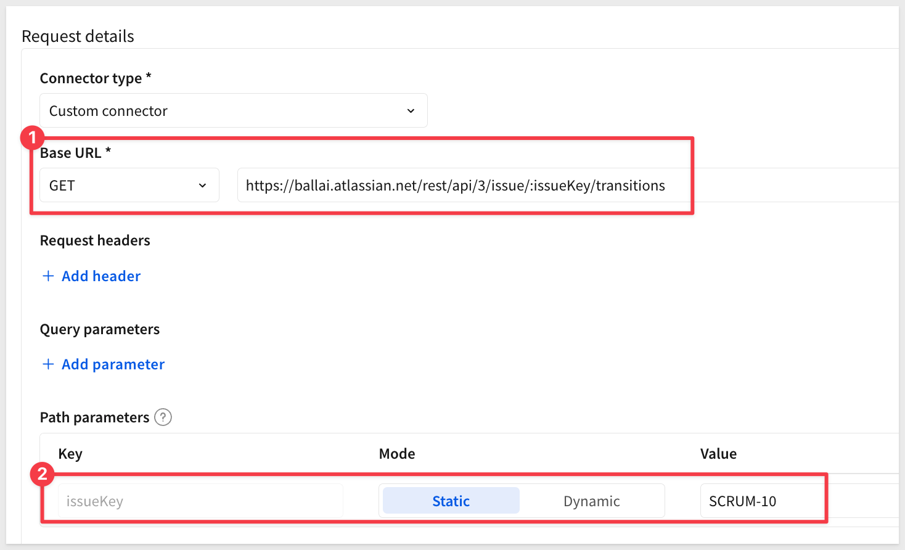

<aside class="negative">
<strong>NOTE:</strong><br> To get a valid "Value", look at JIRA. For example, "SCRUM-10" is a valid value in the JIRA trial used for this QuickStart.
</aside>

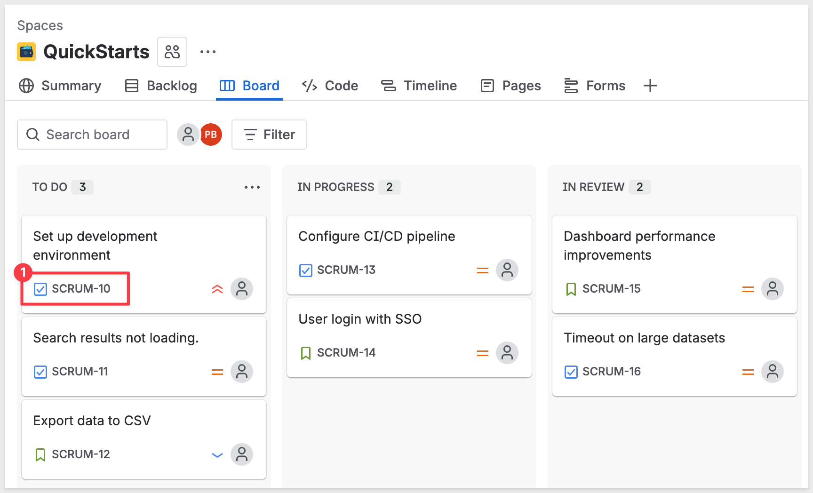

The `/:issueKey` in the base URL will be replaced with this value when the connector is called.

6. Click `Test connector`

The response shows available transitions for that issue:

```code
{
  "transitions": [
    {
      "id": "11",
      "name": "To Do",
      "to": { "id": "10000", "name": "To Do" }
    },
    {
      "id": "21",
      "name": "In Progress",
      "to": { "id": "10001", "name": "In Progress" }
    },
    {
      "id": "31",
      "name": "In Review",
      "to": { "id": "10002", "name": "In Review" }
    },
    {
      "id": "41",
      "name": "Done",
      "to": { "id": "10003", "name": "Done" }
    }
  ]
}
```

7. **Note the transition IDs** from the response:
   - "11" = To Do
   - "21" = In Progress
   - "31" = In Review
   - "41" = Done

These are the IDs you'll use in the next connector. **Yours will likely be different.**

<aside class="positive">
<strong>WHY THIS MATTERS:</strong><br> Transition IDs are specific to your JIRA project's workflow configuration. They're not universal—a "Done" transition might be ID "41" in one project and "51" in another. Always discover them using this API call before building write-back workflows.
</aside>

8. You can save or discard this connector—it was just for discovery

### Create a Dynamic Transition Connector

3. Navigate to `Administration` > `API Connectors`.

4. Create a new API connector:
   - **Name:** `JIRA - Transition Issue`
   - **Description:** `Transition JIRA issue to a new status`
   - **Credential:** `JIRA API Token`

5. Configure the connector details:
   - **Connector type:** `Custom connector`
   - **Base URL:**
     - **Important:** Change the method dropdown from `GET` to `POST`
     - Enter: `https://YOUR-DOMAIN.atlassian.net/rest/api/3/issue/:issueKey/transitions`

Replace `YOUR-DOMAIN` with your actual JIRA domain. The `/:issueKey` syntax tells Sigma this is a path parameter.

<aside class="negative">
<strong>IMPORTANT:</strong><br> Make sure the method is set to <strong>POST</strong>, not GET. The transitions API requires POST to make changes to JIRA issues.
</aside>

6. In the `Path parameters` section, configure:
   - **Key:** `issueKey` (matches the parameter name in the base URL)
   - **Mode:** `Dynamic`

The `/:issueKey` in the base URL will be dynamically replaced with values from your workbook, so set it to be `Dynamic` under `Path parameters`.

7. Scroll down to the `Request body` section:
   - Select the `raw` radio button (not "none" or "form-data")
   - In the text area that appears, enter this JSON template:

```copy-code
{
  "transition": {
    "id": {{transitionId}}
  }
}
```

The `{{transitionId}}` is a placeholder that will be replaced by the parameter value.

8. Scroll down to the `Body parameters` section. Sigma automatically detects the `transitionId` parameter from your JSON template. Configure it:
   - **Key:** `transitionId` (automatically added)
   - **Type:** `Number` (transition IDs are numeric)

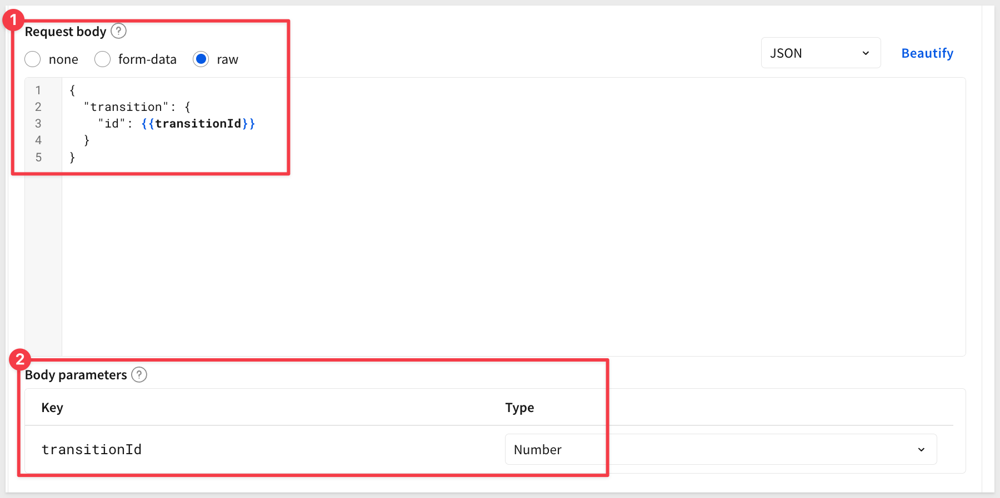

9. Test the connector:
   - **issueKey:** Enter a test issue key (e.g., `SCRUM-10`)
   - **transitionId:** Enter a valid transition ID from step 7 (e.g., `21` for "In Progress")

10. Click `Test connector` to verify it works:

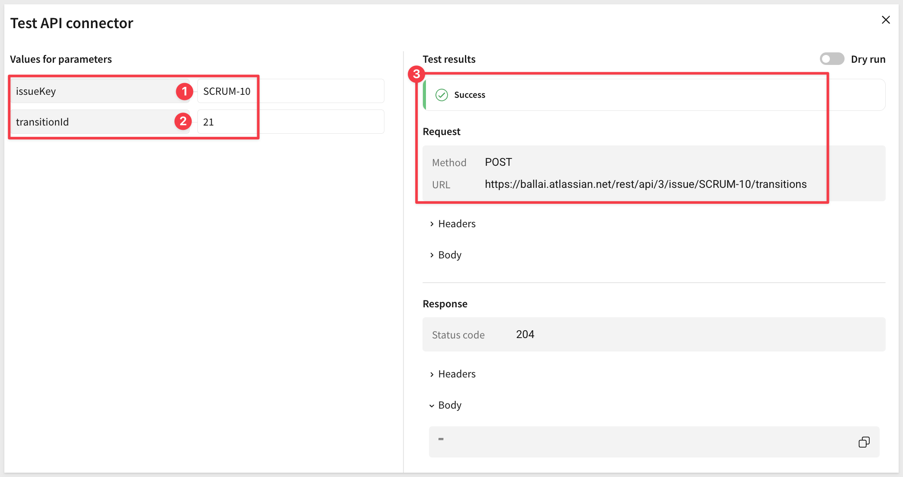

You can also check to make sure JIRA shows the change (moved SCRUM-10 from TO DO to IN-PROGRESS)

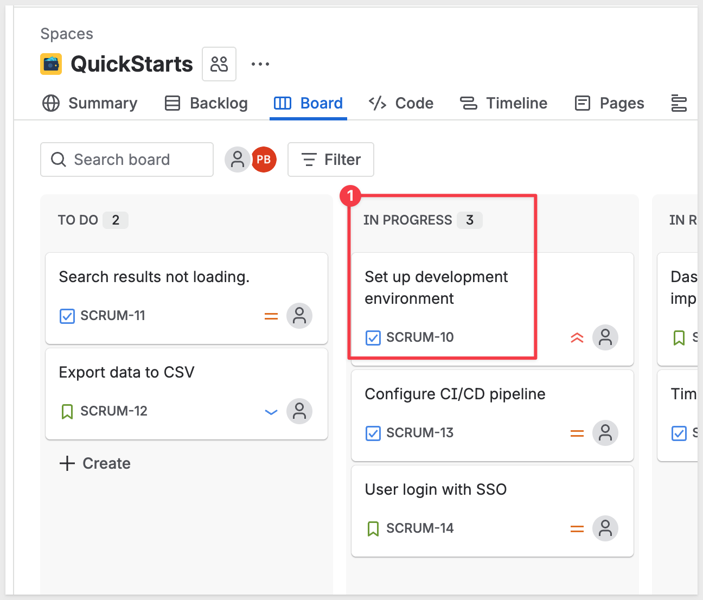

### Add Status Update Modal to Workbook

Now let's create an interactive modal that allows users to update issue statuses.

#### Create the Modal and Controls

11. In your workbook, add a `UI` > `Modal` element

12. Rename the modal to `Update Status Modal`

13. Add a `Text input` control:
   - **Control ID:** `modal-issue-key`

This control will display which issue is being updated.

14. Add a `List values` control.

Toggle on `Set display values`.

   - **Control ID:** `modal-new-status`
   - **Allow multiple selection:** Disabled
   - **List Values:** Add the same values with display names as before:
     - Value: `11` → Display: `To Do`
     - Value: `21` → Display: `In Progress`
     - Value: `31` → Display: `In Review`
     - Value: `41` → Display: `Done`

<aside class="positive">
<strong>NOTE:</strong><br> We're using transition IDs directly as values (11, 21, 31, 41) instead of status names. This eliminates the need for If() formula mappings later.

**BE SURE TO USE YOUR TRANSITION VALUES WHICH WILL LIKELY BE DIFFERENT FROM THOSE SHOWN ABOVE!**
</aside>

We will use the `Primary` button to initiate actions when clicked but first we need to configure actions on the table.

#### Add Action to Status Column

15. Back on the `JIRA Issues Table`, click on the `Status` column header

16. In the `Element properties` panel, go to the `Actions` tab

17. Add an action with trigger `On click` > `Status`.

#### Action 1: Set Issue Key

- **Action type:** `Set control value`
- **Control:** `modal-issue-key`
- **Set value as:** `Column value`
- **Select column:** `Issue Key`

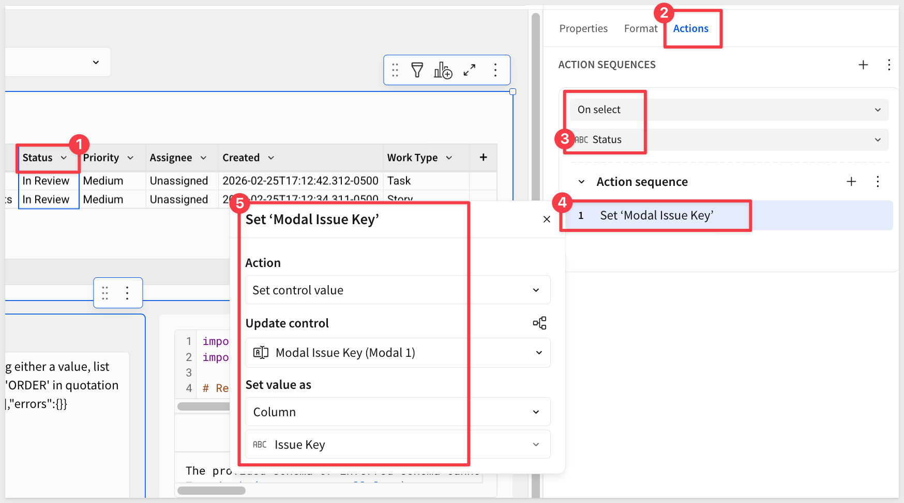

#### Action 2: Open Modal

- **Action type:** `Open modal`
- **Select modal:** `Modal 1`

Now when users click a `Status` cell, the modal opens with the `Modal Issue Key` pre-filled:

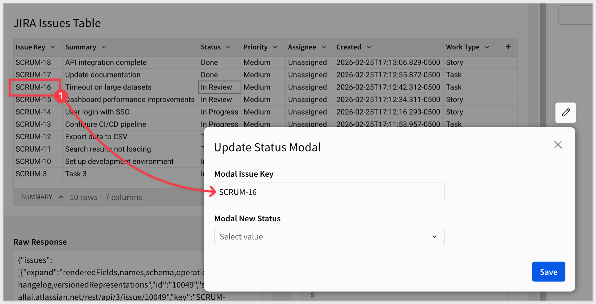

#### Configure Save Button Actions

18. Back on `Modal 1`, add the following action sequence to the `On click - primary` action sequence.

#### Action 1: Call Transition API

- **Action type:** `Call API`
- **API Connector:** `JIRA - Transition Issue`
- **Map with values:**
  - **issueKey:**
    - Select `Control` from the dropdown
    - Choose `modal-issue-key`
  - **transitionId:**
    - Select `Formula` from the dropdown (not Control, since we need to convert to Number)
    - Enter the formula: 
```copy-code
Number([modal-new-status])
```

<aside class="positive">
<strong>WHY FORMULA:</strong><br> The list control returns Text values, but the <code>transitionId</code> parameter expects a Number. The <code>Number()</code> function converts the text value (e.g., "21") to a numeric value (21).
</aside>

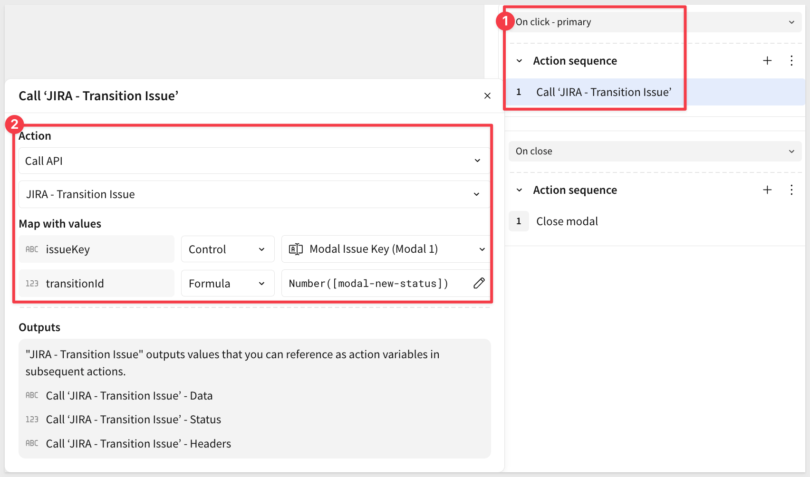

#### Action 2: Reload JIRA Data

- **Action type:** `Call API`
- **API Connector:** `JIRA - Search Issues` (use the Static connector to fetch all issues)

This re-fetches all issues from JIRA after the transition, ensuring you see the updated status regardless of what filter is currently selected:

<!-- 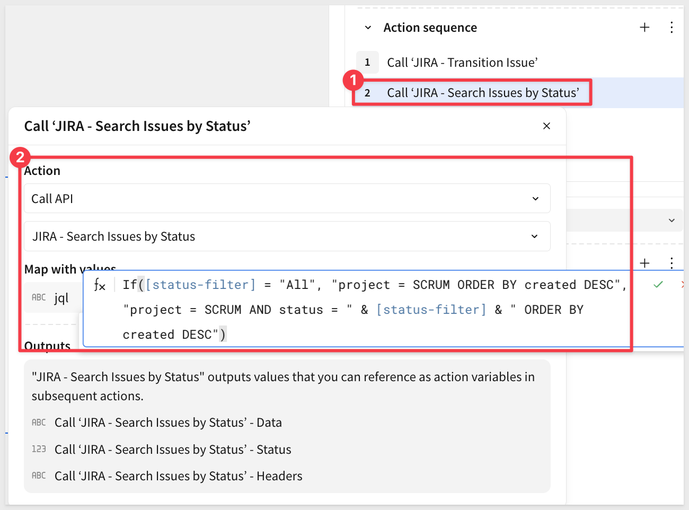 -->

#### Action 3: Set Raw Response

- **Action type:** `Set control value`
- **Control:** `raw-response`
- **Set value as:** `Action variable`
- **Select:** `Call 'JIRA - Search Issues' - Data`

#### Action 4: Run Python Element

- **Action type:** `Run Python element`
- **Element:** `Code (Issues)`

This parses the fresh data and updates the table.

#### Action 5: Clear Status Selection

- **Action type:** `Clear control`
- **Apply to:** `Specific control`
- **Control:** `Modal New Status (Modal 1)`

This resets the dropdown so the next time the modal opens, no status is pre-selected.

#### Action 6: Close Modal

- **Action type:** `Close modal`

Click `Save` to save the complete action sequence.

#### Test the Workflow

Let's move the `Set up development environment` task that we moved into `IN PROGRESS` manually a few steps back to `TO DO`:

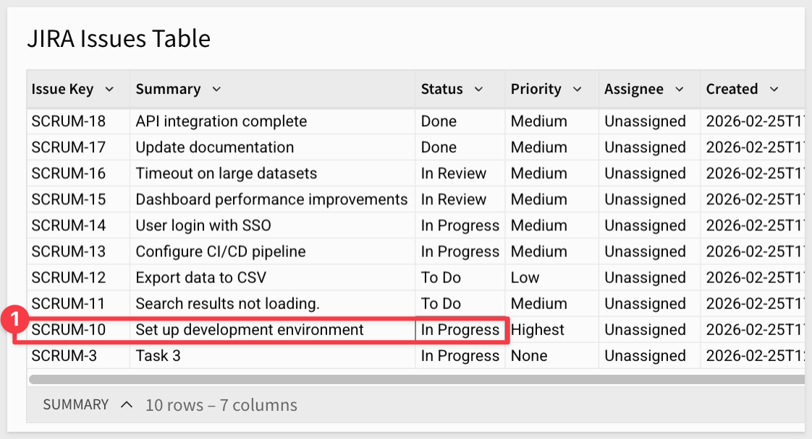

20. Click on the `Status` cell for the issue

21. The modal should open with the Issue Key displayed

22. Select a new status from the dropdown (e.g., "To Do")

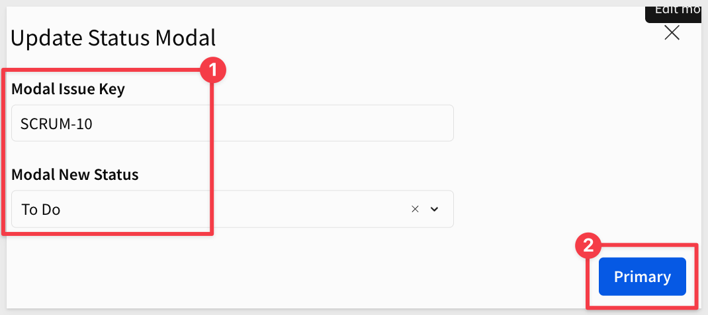

23. Click `Save`.

The API call will execute, the modal will close, and the table should refresh to show the updated status:

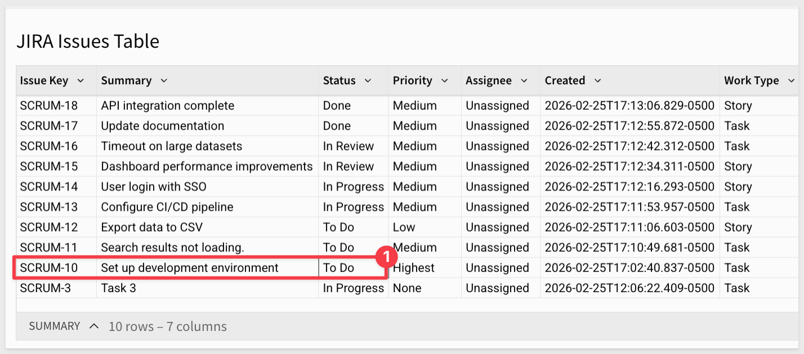

Now users can transition issue statuses directly from Sigma, and the table will automatically refresh to show the changes!

<aside class="negative">
<strong>WORKFLOW CONSTRAINTS:</strong><br> Transitions are workflow-aware. You can only transition issues to statuses allowed by your JIRA workflow configuration. If a transition isn't available for an issue's current status, the API will return an error. Consider adding conditional logic to show/hide buttons based on the current status. For more information, see <a href="https://developer.atlassian.com/cloud/jira/platform/rest/v3/api-group-issues/#api-rest-api-3-issue-issueidorkey-transitions-post" target="_blank">JIRA transitions documentation</a>.
</aside>


<!-- END OF SECTION-->

## What we've covered
Duration: 5

In about an hour, you built a complete bidirectional JIRA integration—querying issues with dynamic filters, parsing nested JSON responses, and updating issue statuses through an interactive modal—all without writing backend code or managing servers. 

Sigma API Actions turned what would typically require dedicated API infrastructure, authentication handling, and custom middleware into a straightforward workflow: configure credentials, define connectors, build actions.

This same pattern works for any REST API using Basic Authentication (ServiceNow, Zendesk, GitHub, GitLab, Confluence, Bitbucket). Create credentials, define endpoints, call APIs, parse responses, display results. 

The value isn't just speed—it's accessibility. Business analysts and data teams can now build operational integrations that previously required engineering resources, turning Sigma into a true operational analytics platform where data doesn't just flow in for reporting, but flows back out to drive action.

**Additional Resource Links**

[Blog](https://www.sigmacomputing.com/blog/)<br>
[Community](https://community.sigmacomputing.com/)<br>
[Help Center](https://help.sigmacomputing.com/hc/en-us)<br>
[QuickStarts](https://quickstarts.sigmacomputing.com/)<br>

Be sure to check out all the latest developments at [Sigma's First Friday Feature page!](https://quickstarts.sigmacomputing.com/firstfridayfeatures/)
<br>

[](https://twitter.com/sigmacomputing)&emsp;
[](https://www.linkedin.com/company/sigmacomputing)&emsp;
[](https://www.facebook.com/sigmacomputing)


<!-- END OF WHAT WE COVERED -->
<!-- END OF QUICKSTART -->
