author: pballai
id: developers_api_actions_salesforce
summary: developers_api_actions_salesforce
categories: developers
environments: web
status: Published
feedback link: https://github.com/sigmacomputing/sigmaquickstarts/issues
tags: Default
lastUpdated: 2026-02-23

# Integrate Salesforce using API Actions

## Overview 
Duration: 5 

This QuickStart walks you through using Sigma API Actions to connect to Salesforce’s REST API, retrieve live Salesforce data, and surface it directly inside a Sigma workbook. Unlike the [API Actions - Getting Started](https://quickstarts.sigmacomputing.com/guide/dataapps_api_actions_getting_started/index.html?index=..%2F..index#0) QuickStart, this workflow uses authenticated requests, dynamic parameters, and a more realistic enterprise-grade API pattern.

You’ll use a preconfigured Sigma template that lets you select a Salesforce object (such as Account, Contact, or Opportunity), execute a SOQL query, and view the returned results in real time.

Along the way you'll learn how to:
- configure Salesforce API connectors using OAuth or token-based credentials
- pass dynamic query parameters from workbook controls
- call Salesforce’s REST API using Sigma workbook actions

We will use a Salesforce developer's account for this demonstration.

<aside class="positive">
<strong>IMPORTANT:</strong><br> Some screens in Sigma may appear slightly different from those shown in QuickStarts. This is because Sigma continuously adds and enhances functionality. Rest assured, Sigma’s intuitive interface ensures that any differences will not prevent you from successfully completing any QuickStart.
</aside>

For more information on Sigma's product release strategy, see [Sigma product releases](https://help.sigmacomputing.com/docs/sigma-product-releases)

If something doesn’t work as expected, here's how to [contact Sigma support](https://help.sigmacomputing.com/docs/sigma-support)

### Target Audience
The typical audience for this QuickStart includes users of Excel, common Business Intelligence or Reporting tools, and semi-technical users who want to try out or learn Sigma.

### Prerequisites

<ul>
  <li>Any modern browser is acceptable.</li>
  <li>Access to your Sigma environment.</li>
  <li>Some familiarity with Sigma is assumed. Not all steps will be shown, as the basics are assumed to be understood.</li>
  <li>Admin access to a Salesforce environment.</li>
 </ul>

<aside class="positive">
<strong>IMPORTANT:</strong><br> Sigma recommends using non-production resources when completing QuickStarts.
</aside>

<button>[Free Sigma Trial](https://www.sigmacomputing.com/free-trial/)</button>   <button>[SalesForce Developers Account](https://developer.salesforce.com/signup)</button>

<aside class="negative">
<strong>IMPORTANT:</strong><br> Some features may carry a "Beta" tag. Beta features are subject to quick, iterative changes. As a result, the latest product version may differ from the contents of this document.
</aside>
 


## Initial Setup
Duration: 5

### Salesforce Authentication Overview
Before calling Salesforce APIs from Sigma, you must configure a secure OAuth 2.0 connection. Salesforce requires an access token for every request, and these tokens expire on a schedule determined by your Salesforce org. API Actions can store and refresh tokens automatically, but the initial setup requires a one-time authorization.

This QuickStart uses Sigam and a connected app in Salesforce configured for OAuth 2.0.

<aside class="negative"> <strong>SECURITY WARNING:</strong><br> Do not expose client IDs, client secrets, refresh tokens, or access tokens in public dashboards or shared workbooks. These credentials allow access to your Salesforce org and must be treated as sensitive. </aside>

### Step 1: Create (or Verify) a Salesforce Connected App
In Salesforce, navigate to `Setup` > `Apps` > `App Manager`:

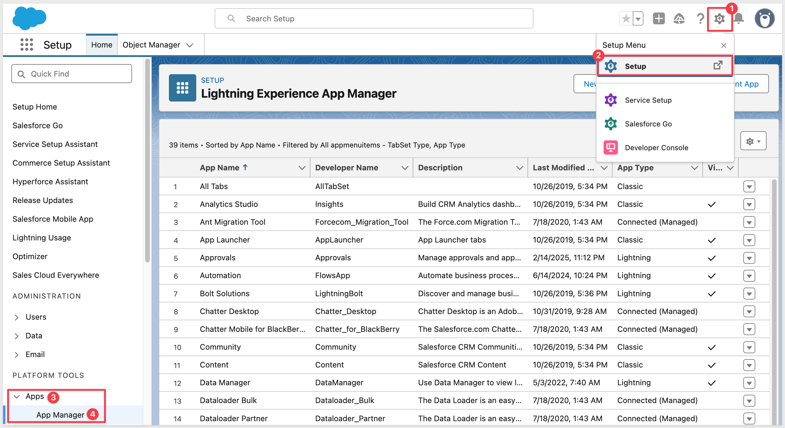

Click `New External Client App`

Provide a name such as `Sigma_API_Actions_QuickStart`, `Contact Email` and `Distribution State` as `Local`.

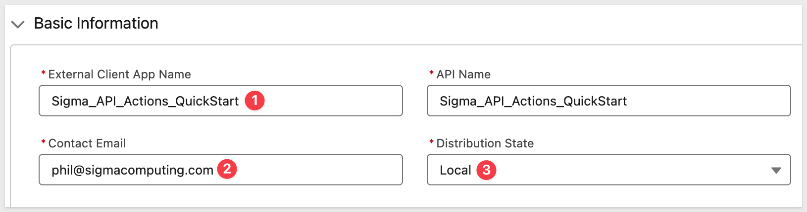

Scroll down the page to `API (Enable OAuth Settings`

Check the box to `Enable OAuth`.

Set the `Callback URL` to Sigma's API connector OAuth callback. The URL varies by cloud provider:

| Cloud | Callback URL |
|-------|-------------|
| AWS | `https://aws-api.sigmacomputing.com/api/v2/api_connector/oauth_callback` |
| Azure | `https://azure-api.sigmacomputing.com/api/v2/api_connector/oauth_callback` |
| GCP | `https://api.sigmacomputing.com/api/v2/api_connector/oauth_callback` |

<aside class="positive">
<strong>IMPORTANT:</strong><br> You can confirm the exact callback URL for your org by navigating to <strong>Administration</strong> > <strong>API connectors</strong> > <strong>Create credential</strong> and selecting <strong>OAuth (authorization code)</strong>. Sigma displays the read-only Callback URL at the top of the Authentication details section.
</aside>

### Scopes
For this QuickStart, we only need the minimal scopes that allow:
- Running SOQL queries
- Reading/writing standard Salesforce objects
- Refreshing tokens without user interaction

<aside class="negative">
<strong>NOTE:</strong><br> You do NOT want anything that grants full org admin access, UI access, Pardot, Data Cloud, or Lightning application scopes. Avoid “full” unless absolutely required.
</aside>

Add the following OAuth scopes:
- Manage user data via APIs (api)
This is the core scope that allows CRUD + querying via REST and SOAP.

- Perform requests at any time (refresh_token, offline_access)
This allows Sigma to refresh the access token automatically.

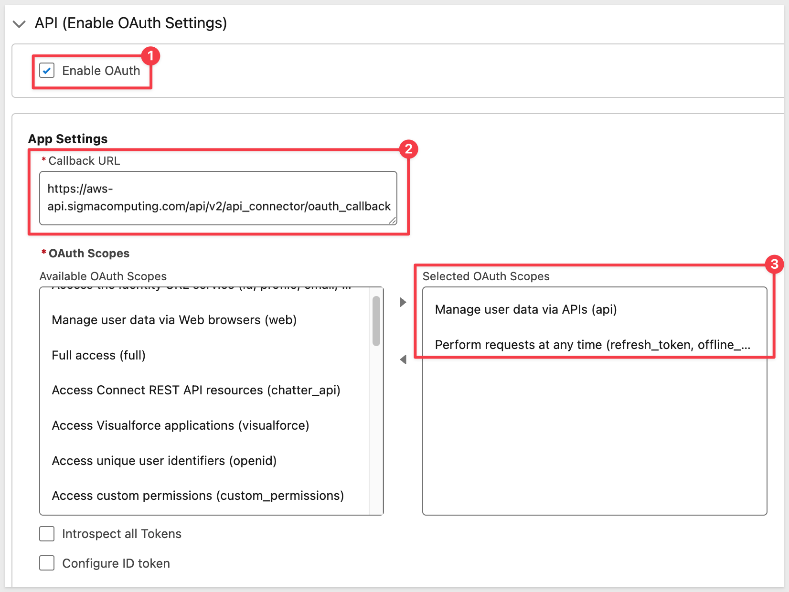

Click `Create`.

Once created, we can access and copy the `Client ID` and `Client Secret` values off to a text file for now. You’ll need these in Sigma when performing the initial authorization.

These can be found on the connected app `Settings` tab, under `OAuth Settings` > `Consumer Key and Secret` button:

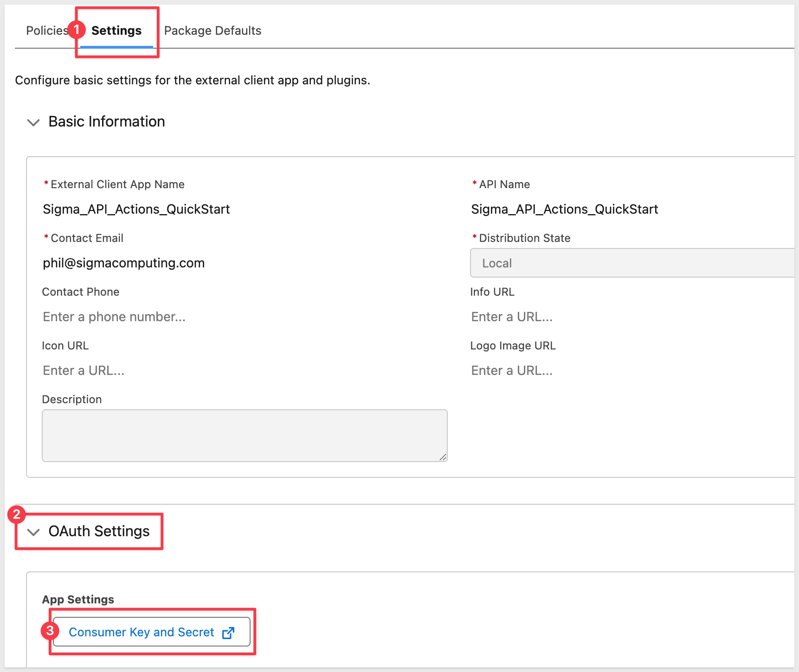

If for some reason you need to locate the `Sigma_API_Actions_QuickStart` Client App again, if can be found here:

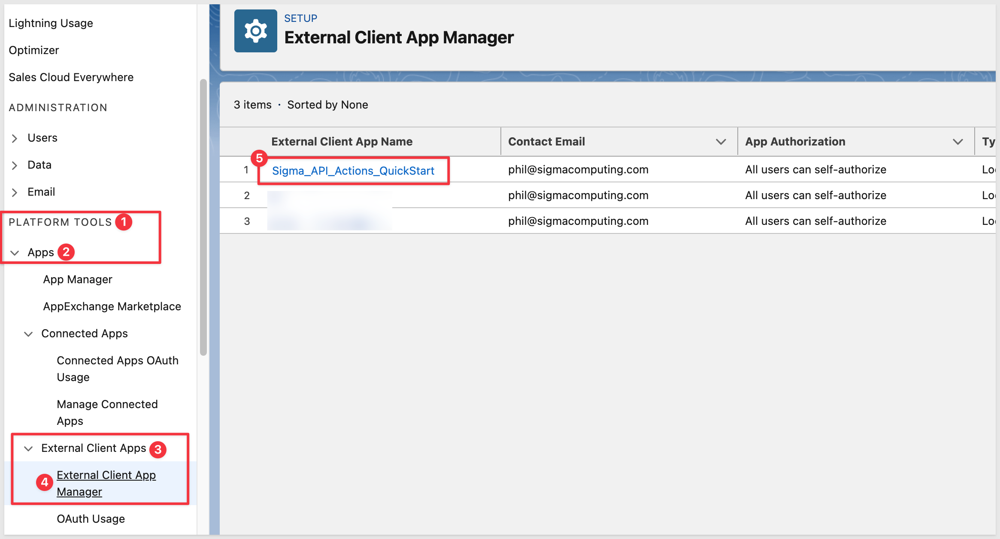


<!-- END OF SECTION-->

## Sigma API Credentials
Duration: 5

With the Salesforce Connected App in place, we can now configure the matching credential in Sigma.

In Sigma, navigate to `Administration` > `API connectors` and select the `Credentials` tab.

Click `Create credential`.

Fill in the `Credential details` section:

| Field | Value |
|-------|-------|
| Name | `Salesforce_OAuth_Credential` |
| Description | Optional — e.g., `OAuth credential for Salesforce REST API` |
| Authorized domains | Your Salesforce instance domain (e.g., `https://your-org.my.salesforce.com`) |

Under `Authentication details`, set `Authentication method` to `OAuth (authorization code)`.

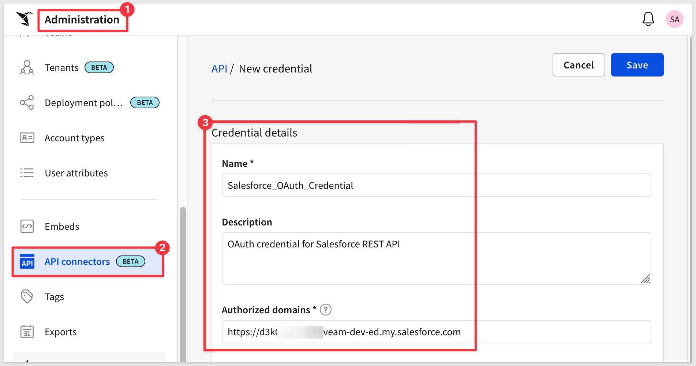

Sigma automatically provides a read-only `Callback URL`. This is the value you entered in the Salesforce Connected App in the previous section.

Fill in the remaining fields using the values from your Salesforce Connected App:

| Field | Value |
|-------|-------|
| Client ID | Consumer Key from Salesforce |
| Client secret | Consumer Secret from Salesforce |
| Authorization URL | `https://<your-instance>.my.salesforce.com/services/oauth2/authorize` |
| Access token URL | `https://<your-instance>.my.salesforce.com/services/oauth2/token` |
| Send client credentials as | `Basic auth header` |
| Scopes | *(leave empty — scopes are already defined in the Salesforce Connected App)* |

<aside class="positive">
<strong>IMPORTANT:</strong><br> Replace <code>&lt;your-instance&gt;</code> with your Salesforce My Domain — the subdomain from your org's URL. This is <strong>not</strong> the setup URL (which ends in <code>.salesforce-setup.com</code>). Use the API domain, which ends in <code>.my.salesforce.com</code>.
</aside>

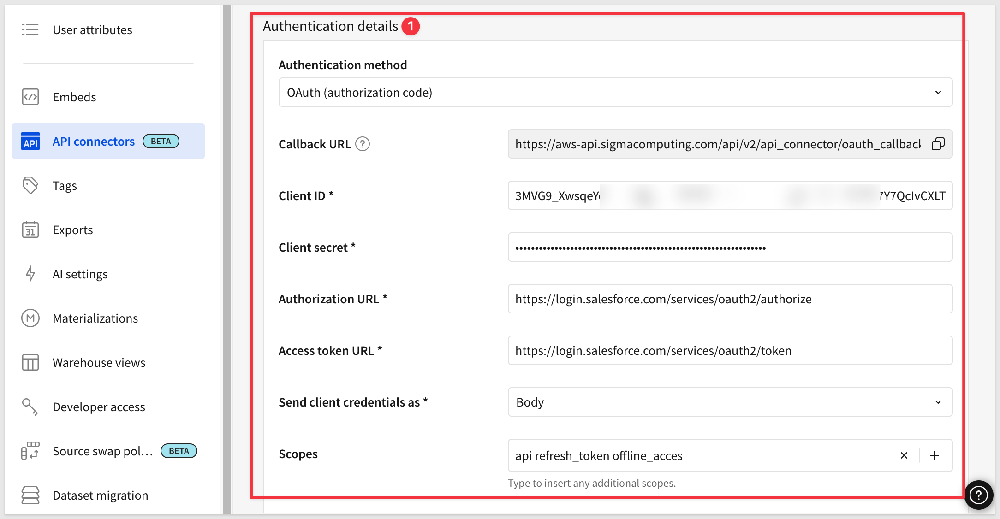

Click `Save`.

The credential is saved but not yet authorized:

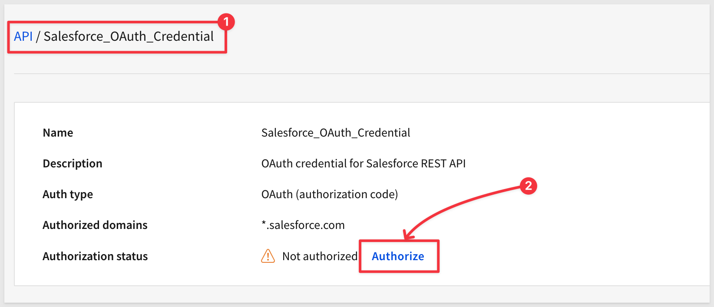

Click the `Salesforce_OAuth_Credential` name to open it.

Click the `Authorize` link.

A Salesforce login window opens in your browser. 

`Log in` and `approve` the access request. 

Once complete, Sigma stores the refresh token and handles all future token renewals automatically — no manual re-authorization required.

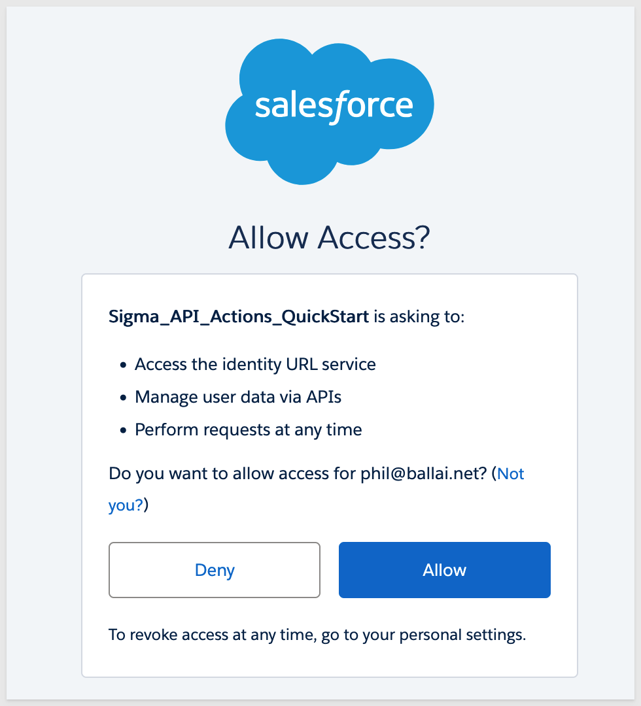


<!-- END OF SECTION-->

## Sigma API Connectors
Duration: 5

With the credential authorized, we can now define the Salesforce API requests that Sigma is allowed to call. Each connector in Sigma represents one API request — we need two: one to fetch accounts and one to fetch opportunities for a selected account.

<aside class="negative">
<strong>NOTE:</strong><br> This QuickStart uses Salesforce API version <strong>v65.0</strong> (Winter '26). To confirm the latest version available on your org, visit <code>https://&lt;your-instance&gt;.my.salesforce.com/services/data/</code> in your browser and use the highest version listed.
</aside>

### Connector 1: Get Accounts

In Sigma, navigate to `Administration` > `API connectors` and click `Create connector`:

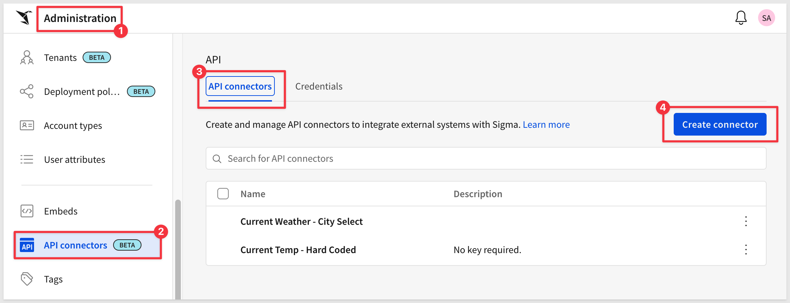

Fill in the form as follows:

| Field | Value |
|-------|-------|
| Name | `Get_Accounts` |
| Description | Optional — e.g., `Returns all Salesforce accounts` |
| Authentication credential | `Salesforce_OAuth_Credential` |
| Base URL (GET)| `https://*your-instance*.my.salesforce.com/services/data/v65.0/query` |

<aside class="positive">
<strong>IMPORTANT:</strong><br> Replace *your-instance* with your Salesforce domain — the same subdomain used for the OAuth URLs in the previous section.
</aside>

<!-- 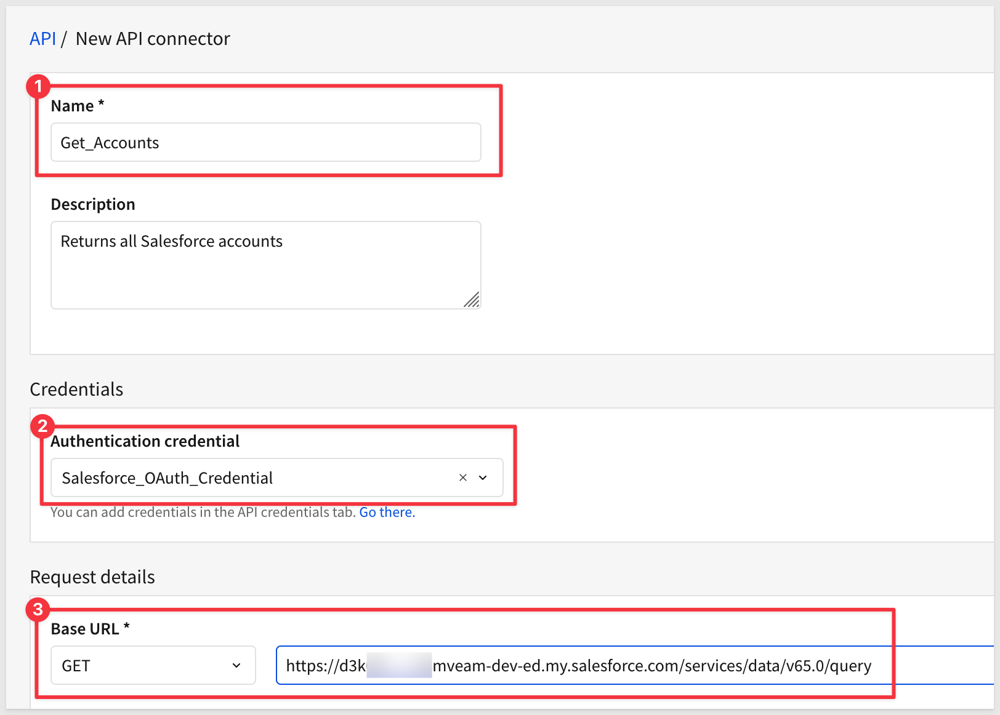 -->

<aside class="positive">
<strong>What is SOQL?</strong><br> SOQL (Salesforce Object Query Language) is Salesforce's query language, similar to SQL but designed specifically for Salesforce objects like Accounts, Opportunities, and Contacts. Key differences from SQL:
<ul>
<li>You query <strong>objects</strong> instead of tables: <code>SELECT Id, Name FROM Account</code></li>
<li>No JOIN — relationships are traversed using dot notation: <code>SELECT Name, Account.Name FROM Contact</code></li>
<li>Filtering, sorting, and limiting work the same as SQL: <code>WHERE</code>, <code>ORDER BY</code>, <code>LIMIT</code></li>
</ul>
In this QuickStart, SOQL queries are passed as a URL parameter to Salesforce's REST API <code>/query</code> endpoint.
</aside>

Under `Query parameters`, click `Add parameter` and set the following:

- **Key:** `q`
- **Mode:** `Static`
- **Value:**
```copy-code
SELECT Id, Name, BillingCity, BillingState, Phone, Type, Industry FROM Account ORDER BY Name LIMIT 50
```

<aside class="negative">
<strong>NOTE:</strong><br> This query returns up to 50 accounts. Adjust the <code>LIMIT</code> value to match your org's data volume, or remove it to return all records.
</aside>

Before saving, click `Test connector` to verify the connector reaches Salesforce and returns data:

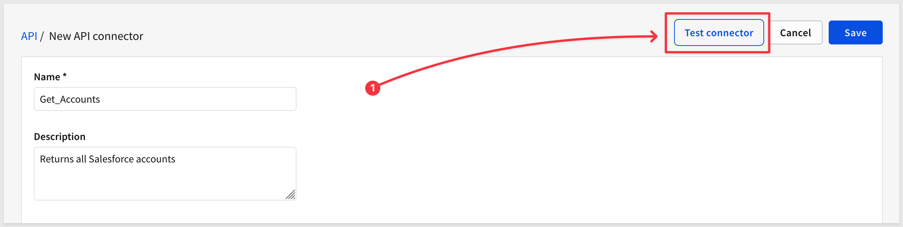

A `Test API connector` panel opens showing the full request URL and response. A `Success` result with status code `200` confirms the connector is working correctly:

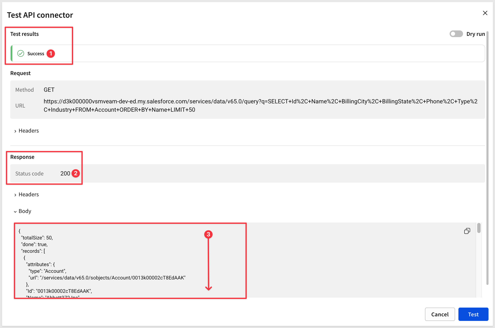

<aside class="negative">
<strong>NOTE:</strong><br> Make sure "Dry run" is off so that we can observe the response data. When on, only the request is validated with no response data.
</aside>

The response body shows the Salesforce JSON structure — a `records` array containing the account data. This is the structure Sigma will parse when the action fires from the workbook.

Click `Cancel` to close the test panel, then click `Save`.

<!-- 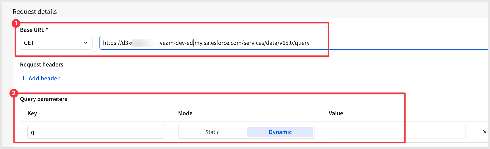 -->

### Connector 2: Get Opportunities by Account

Click `Create connector` again to define the second request.

| Field | Value |
|-------|-------|
| Name | `Get_Opportunities_By_Account` |
| Description | Optional — e.g., `Returns opportunities for a selected account` |
| Authentication credential | `Salesforce_OAuth_Credential` |
| Base URL (GET) | `https://<your-instance>.my.salesforce.com/services/data/v65.0/query` |

Under `Query parameters`, click `Add parameter` and set the following:

- **Key:** `q`
- **Mode:** `Dynamic`
- **Value:** *(leave empty — the SOQL will be constructed and passed at runtime from the workbook)*

<aside class="positive">
<strong>IMPORTANT:</strong><br> Setting the <code>q</code> parameter to <strong>Dynamic</strong> means the workbook action will supply the full SOQL query at runtime, including the AccountId of the row the user clicked. The Value field is left empty here and populated by the action.
</aside>


Click `Save`.

<!-- 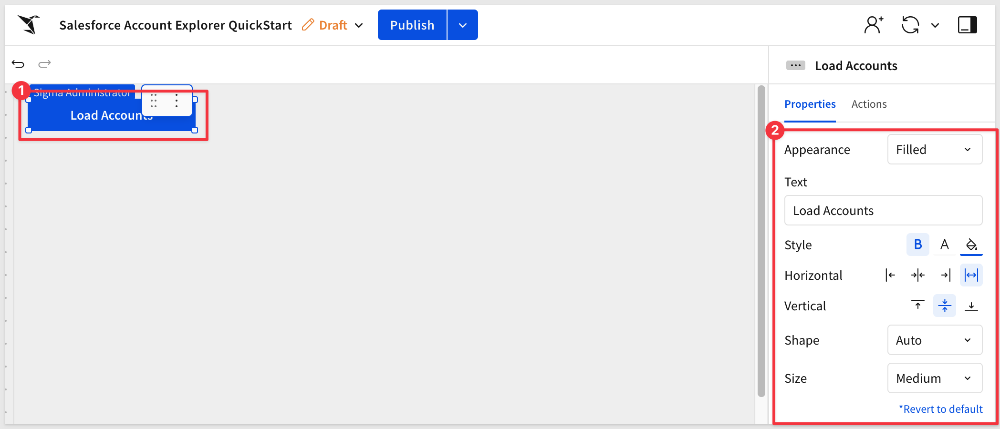 -->

Both connectors are now configured and ready to be called from a Sigma workbook.


<!-- END OF SECTION-->

## Enable Python on the Snowflake Connection
Duration: 5

Sigma's API Actions return raw JSON responses. To parse a bulk response (like a list of Salesforce accounts) into an interactive table, we use a Sigma **Python element**. Python elements in Sigma run on Snowflake compute and require a dedicated warehouse.

### Part 1: Snowflake Setup

Log in to Snowflake as `ACCOUNTADMIN` and run the following:

```copy-code
USE ROLE ACCOUNTADMIN;

-- CREATE DEDICATED PYTHON WAREHOUSE
CREATE WAREHOUSE IF NOT EXISTS PYTHON_WH
  WAREHOUSE_TYPE = STANDARD
  WAREHOUSE_SIZE = XSMALL
  AUTO_SUSPEND = 60
  AUTO_RESUME = TRUE
  COMMENT = 'Dedicated warehouse for Sigma Python queries';

-- START THE WAREHOUSE IMMEDIATELY
ALTER WAREHOUSE PYTHON_WH RESUME;

-- GRANT ACCESS TO SIGMA SERVICE ROLE
GRANT USAGE ON WAREHOUSE PYTHON_WH TO ROLE SIGMA_SERVICE_ROLE;
GRANT CREATE PROCEDURE ON SCHEMA QUICKSTARTS.INPUT_TABLES_WRITE TO ROLE SIGMA_SERVICE_ROLE;
```

<aside class="negative">
<strong>NOTE:</strong><br> <code>AUTO_SUSPEND</code> is set to 60 seconds to minimize credit consumption. The warehouse only runs when a Python element is actively executing.
</aside>

### Part 2: Enable Python in Sigma

In Sigma, navigate to `Administration` > `Connections` and edit your Snowflake connection.

Scroll to the `Python` section and configure:

| Field | Value |
|-------|-------|
| Enable Python queries | Toggle ON |
| Warehouse | `PYTHON_WH` |
| Packages | *(leave empty)* |
| External access rule | *(leave empty)* |

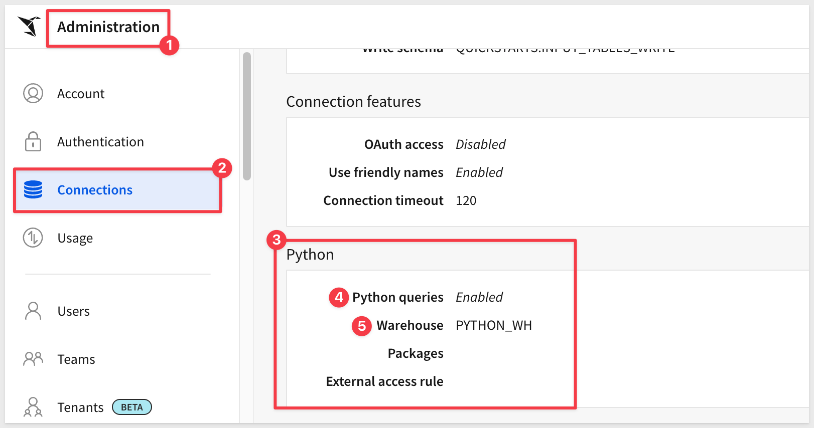

Click `Save`.

### Part 3: Initialize the Python Procedure

Sigma creates the required stored procedure the first time a Python element executes. To trigger this, (from the Sigma home page), click `Create new` > `Workbook`.

Click `Save as` and name the workbook `Salesforce Account Explorer QuickStart`.

Add a `Python element` from the `Data` group on the `Element bar`.

Enter the following, and click `Run`:

```copy-code
import pandas as pd
sigma.output("test", pd.DataFrame({"status": ["initialized"]}))
```


Once the element executes successfully, return to Snowflake and run the following to grant access to the procedure:

```copy-code
USE ROLE ACCOUNTADMIN;

GRANT USAGE ON PROCEDURE QUICKSTARTS.INPUT_TABLES_WRITE.RUN_PYTHON_CODE(VARCHAR, VARCHAR) TO ROLE SIGMA_SERVICE_ROLE;
```

Python is now ready to use in Sigma workbooks.


<!-- END OF SECTION-->

## Build the Workbook
Duration: 10

With the API connectors configured, we can continue to build the workbook to surface Salesforce data. 

The first part of the architecture uses four elements working together to get the current account list into a list control.
- A button that calls the Salesforce API
- A text area that holds the raw JSON response
- Python element that parses that response into a table
- A list control that gets the account names from the table

Rename the current page from `Page 1` to `Controls`.

Rename the existing Python element to `Code-Accounts`:

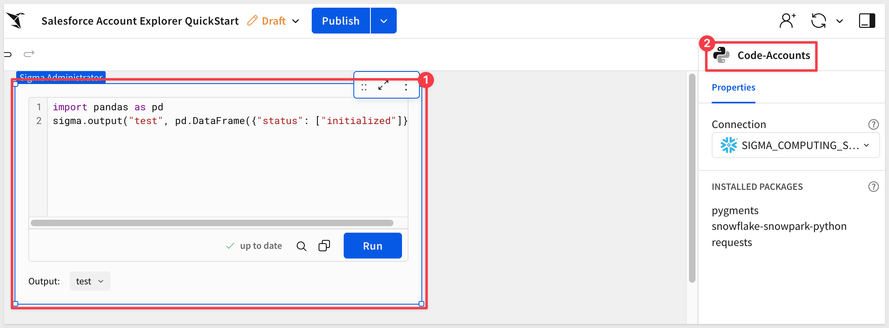

### Add the Response Control
The Salesforce API returns a raw JSON payload. We store it in a text area control so a Python element can read and parse it.

Using the `Element bar`, add a `Text area` element from the `Controls` group.

In the right panel, set the control label to `raw-response-accounts`:

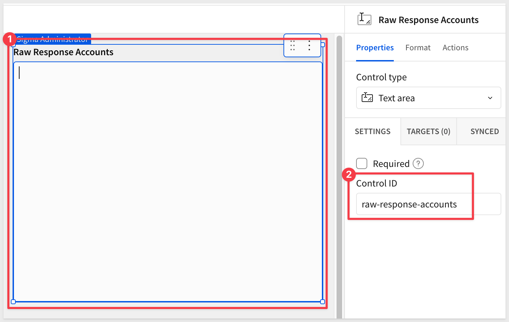

<aside class="positive">
<strong>IMPORTANT:</strong><br> The control ID is critical as that is what is referenced by the Python element code later.
</aside>

### Add the Refresh Account List Button

Add a `Button` from the `UI` group to the page.

Label the button `Refresh Account List`.

**Add the first action — Call the API:**

With the button selected, open the `Actions` panel on the right and click `+` to add an action sequence.

Click `+` inside the sequence and select `Call API`. Configure it as follows:

| Field | Value |
|-------|-------|
| Connector | `Get_Accounts` |

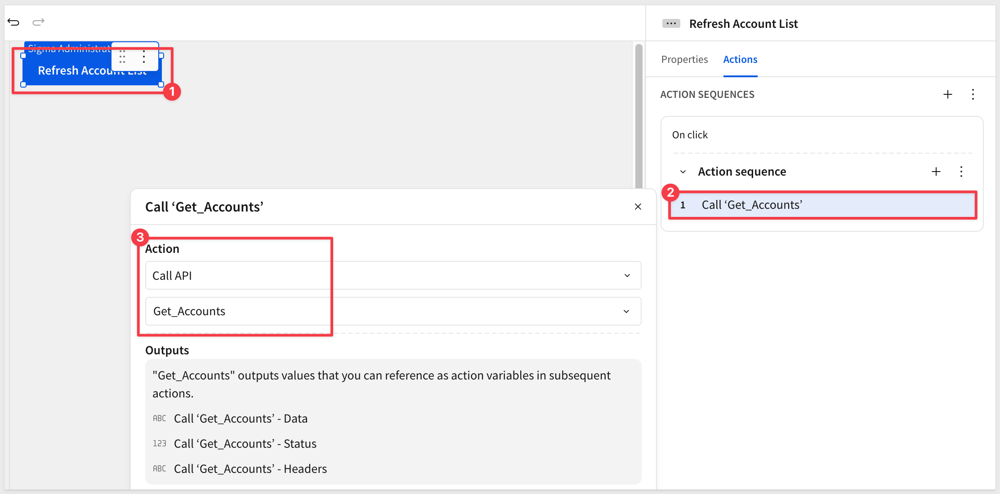

**Add the second action to store the response:**

Click `+` again inside the same sequence and select `Set control value`. Configure it as follows:

| Field | Value |
|-------|-------|
| Action | `Set control value` |
| Update control | `raw-response-accounts (Controls)` |
| Set value as | `Action variable` |
| Variable | `Data` |

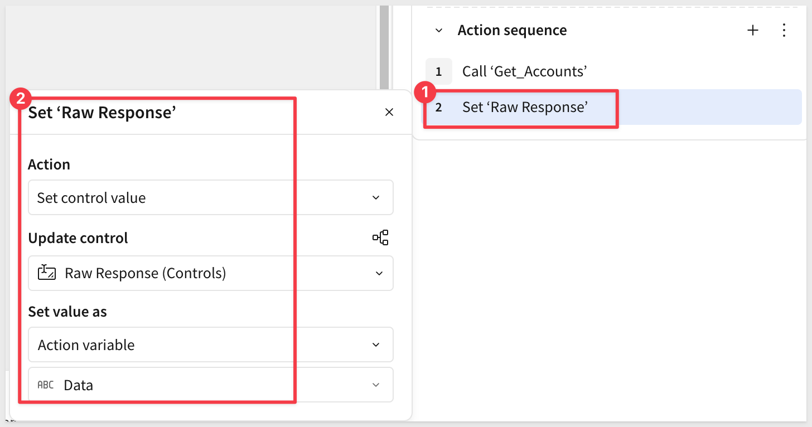

<aside class="positive">
<strong>IMPORTANT:</strong><br> Both actions must be in the same sequence so they execute in order. The <code>Call API</code> action runs first and produces a <code>Data</code> action variable containing the raw JSON response. The <code>Set control value</code> action then writes that variable into the <code>raw-response-accounts</code> text area.
</aside>

Click `Save`.

### Revise the Python Element

Back on the `Controls` page, enter the following code:

```copy-code
import json
import pandas as pd

raw = sigma.get_control_value("raw-response-accounts")
if not raw:
    df = pd.DataFrame({
        "Id": pd.Series(dtype="str"),
        "Name": pd.Series(dtype="str"),
        "BillingCity": pd.Series(dtype="str"),
        "BillingState": pd.Series(dtype="str"),
        "Phone": pd.Series(dtype="str"),
        "Type": pd.Series(dtype="str"),
        "Industry": pd.Series(dtype="str")
    })
else:
    data = json.loads(raw)
    df = pd.DataFrame(data["records"])
    df.drop(columns=["attributes"], inplace=True)
sigma.output("accounts", df)
```

Click `Run`. Once execution completes, you will see `Output: accounts` appear at the bottom of the element.

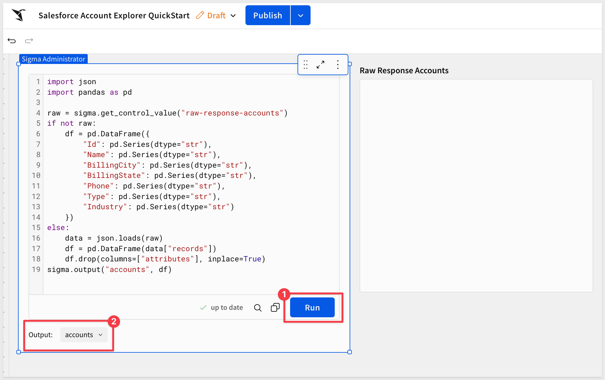

<aside class="positive">
<strong>What this code does:</strong><br>
<ul>
<li>Reads the raw JSON string from the <code>raw-response-accounts</code> text area control</li>
<li>Returns an empty typed DataFrame if the control has no data yet</li>
<li>Parses the Salesforce response and extracts the <code>records</code> array</li>
<li>Drops the <code>attributes</code> metadata field that Salesforce includes on every record</li>
<li>Outputs a named DataFrame called <code>accounts</code> that child elements can reference</li>
</ul>
</aside>

### Add the Accounts Table

With the Python element selected, click `Add child element` and select `Table`.

Sigma automatically uses the `accounts` output as the data source. The table renders with the columns from the SOQL query: `Id`, `Name`, `BillingCity`, `BillingState`, `Phone`, `Type`, and `Industry`.

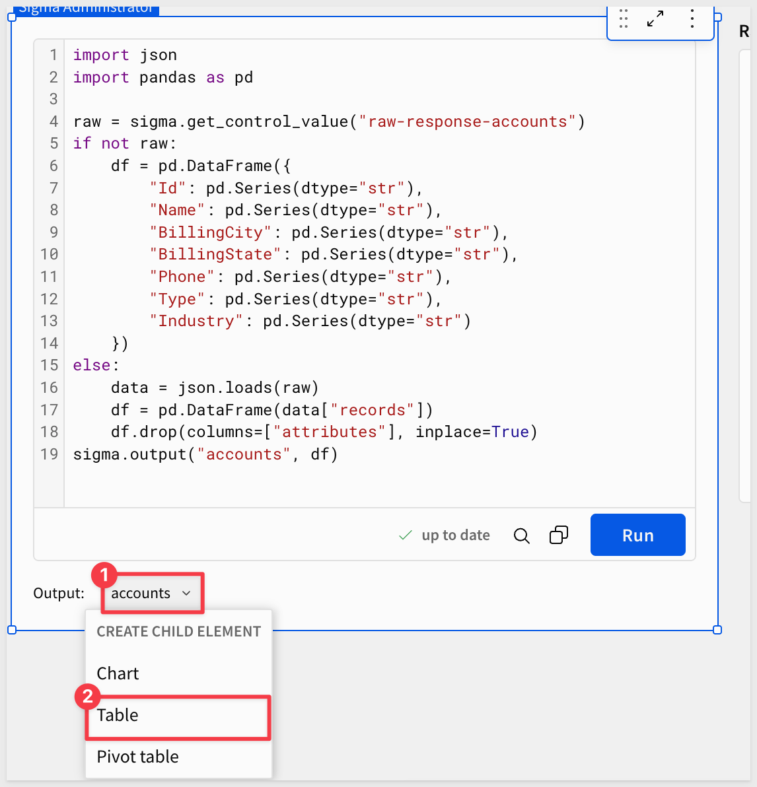

Rename the table `Accounts`.

Click the `Refresh Account List` button. Everything is on the same page, so you can immediately see the `Accounts` table populate with live data from Salesforce.

<aside class="positive">
<strong>IMPORTANT:</strong><br> Clicking <strong>Refresh Account List</strong> at any time re-fetches live data from Salesforce. Records added, deleted, or changed in Salesforce will be reflected immediately — no page reload required.
</aside>

<!-- 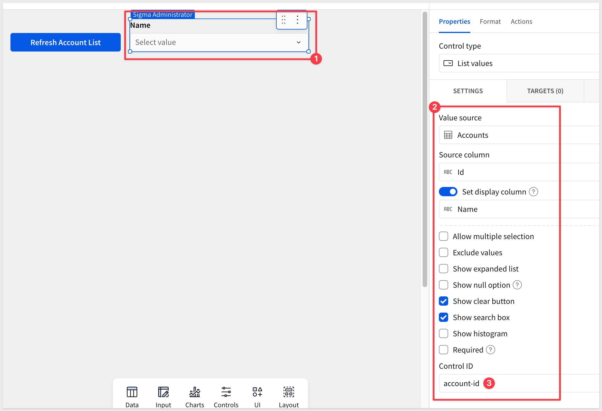 -->

### Reorganize the Workbook

With the accounts flow validated, create a clean user-facing page and move the button there.

**Create a Salesforce page:**

Click the `+` icon next to the page tab to add a new page. Name it `Salesforce`.

<aside class="negative">
<strong>Note:</strong><br> Page order does not matter, but most prefer user-facing pages listed first. The <code>Controls</code> page would normally be hidden from users in a published workbook.
</aside>

Move the `Refresh Account List` button to the `Salesforce` page by selecting it, clicking the three-dot menu, and choosing `Move to page` > `Salesforce`.

**Add an account selector:**

On the `Salesforce` page, click `Add element` and select `Controls` > `List values`.

In the right panel configure the following:

| Field | Value |
|-------|-------|
| Value source | `Controls / Accounts` *(the Python output from the Controls page)* |
| Source column | `Id` |
| Set display column | Toggle ON, select `Name` |
| Control ID | `account-id` |


<aside class="positive">
<strong>IMPORTANT:</strong><br> Setting the source column to <code>Id</code> with the display column set to <code>Name</code> means users see account names in the list, but the value passed to actions is the Salesforce Account ID. This is required for the SOQL query in the next section.
</aside>

The `Salesforce` page now has the `Refresh Account List` button and account name selector. The `Controls` page holds all the plumbing — text area, Python element, and accounts table.

<!-- 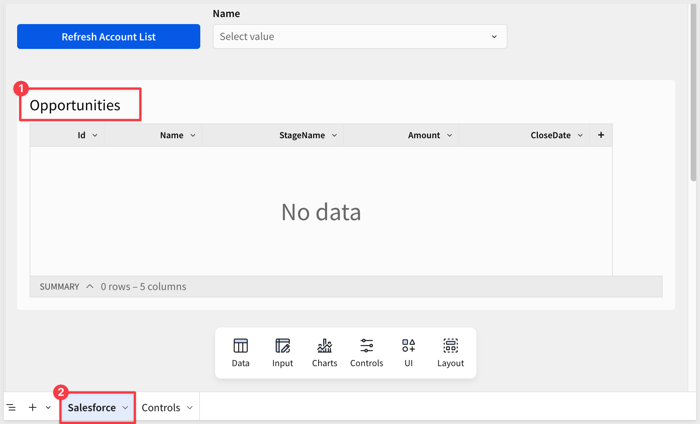 -->


<!-- END OF SECTION-->

## Account Detail and Opportunities
Duration: 10

With the accounts list in place, we can now wire up the `account-id` selector to call the Salesforce opportunities endpoint and display results for the selected account. The pattern mirrors the accounts flow: an action writes the raw API response to a text area control, and a Python element parses it into a table.

### Add the Opportunities Plumbing

Navigate to the `Controls` page.

Click `Add element` and select `Controls` > `Text area`. Label it `Raw Opp Response`.

Set the `Control ID` to `raw-response-opportunities`.

Add another `Python` from the `Data` group and change the name to `Code-Opportunities`.

Replace the sample code with:

```copy-code
import json
import pandas as pd

raw = sigma.get_control_value("raw-response-opportunities")
if not raw:
    sigma.output("opportunities", pd.DataFrame(columns=["Id", "Name", "StageName", "Amount", "CloseDate"]))
else:
    data = json.loads(raw)
    records = data.get("records", [])
    if records:
        df = pd.DataFrame(records)
        df.drop(columns=["attributes"], inplace=True)
    else:
        df = pd.DataFrame()
    sigma.output("opportunities", df)
```

<aside class="positive">
<strong>NOTE:</strong><br> The <code>if not raw</code> guard handles the initial state before any account has been selected — outputting an empty DataFrame with defined columns so Sigma can infer the schema. The <code>data.get("records", [])</code> pattern handles accounts that have no opportunities.
</aside>

Click `Run`. Once execution completes, `Output: opportunities` appears at the bottom of the element.

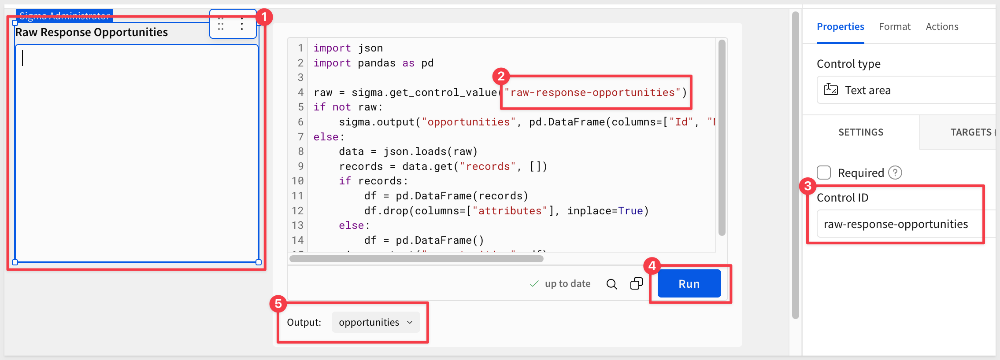

### Add the Opportunities Table

With the `Code-Opportunities` element selected, click `Add child element` and select `Table`.

Rename the table `Opportunities`.

Move the `Opportunities` table to the `Salesforce` page by selecting it, clicking the three-dot menu, and choosing `Move to` > `Salesforce`.


### Add a Loading Modal

Because the Python element takes a moment to execute, we can show the user a visual indicator that the workflow is running.

Add a new `Modal` to the workbook:

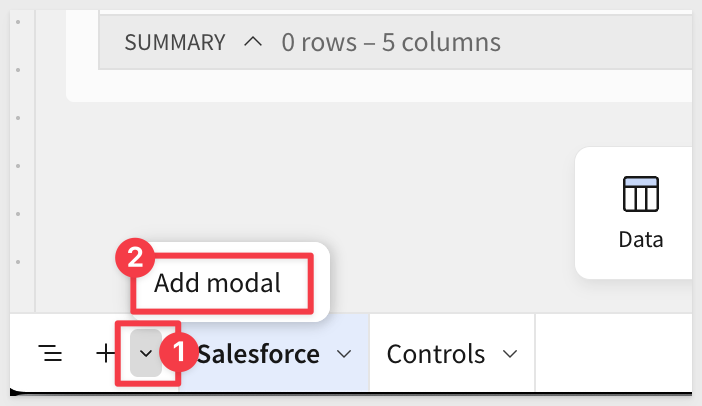

Name the modal `Loading` (or any name you prefer — you will reference it in the action sequence).

Move the `Code-Opportunities` Python element from the `Controls` page into the modal by selecting it, clicking the three-dot menu, and choosing `Move to` > `Modal 1` (or whatever you named your modal).

<aside class="positive">
<strong>NOTE:</strong><br> Moving the Python element into the modal allows users to see the execution status ("up to date" or progress indicator) while the workflow runs. The modal displays during execution and closes automatically when complete.
</aside>

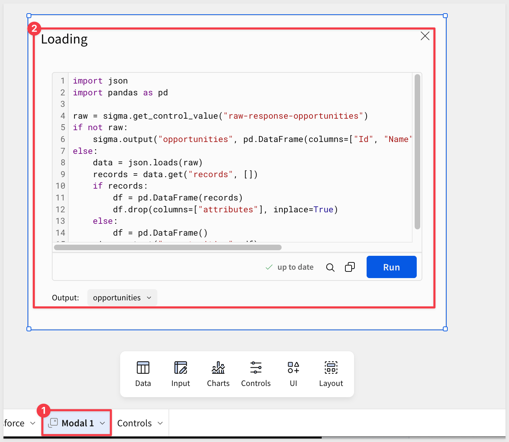

### Wire Up the Account Selector

Click the account list control to select it. Open the `Actions` panel and click `+` to add an action sequence.

Add a condition to the sequence so the API is only called when an account is actually selected:

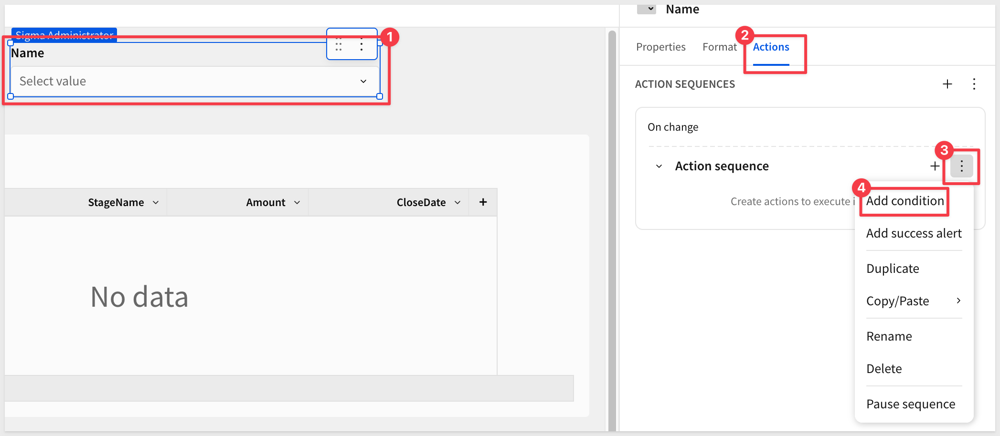

Change the condition to use a `Formula` and set the formula to:
```copy-code
Not(IsNull([account-id]))
```

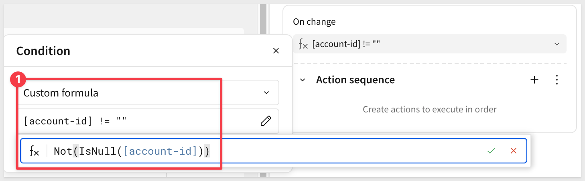

**Build the action sequence with 5 steps:**

| Step | Action | Configuration |
|------|--------|---------------|
| 1 | `Open modal` | Select your `Loading` modal (Modal 1) |
| 2 | `Call API` | Connector: `Get_Opportunities_By_Account` |
| 3 | `Set control value` | Control: `Raw-Response-Opportunities` / Value: Action variable `Data` |
| 4 | `Run Python element` | Element: `Code-Opportunities (Modal 1)` |
| 5 | `Close modal` | *(no configuration required)* |

For step 2 (the `Call API` action), set the dynamic `q` parameter type to `Formula` and enter:

```copy-code
"SELECT Id, Name, StageName, Amount, CloseDate FROM Opportunity WHERE AccountId = '" & [account-id] & "'"
```

<aside class="positive">
<strong>NOTE:</strong><br> Sigma's formula editor uses <code>&</code> for string concatenation. The <code>[account-id]</code> reference inserts the currently selected Salesforce Account ID into the SOQL at runtime.
</aside>

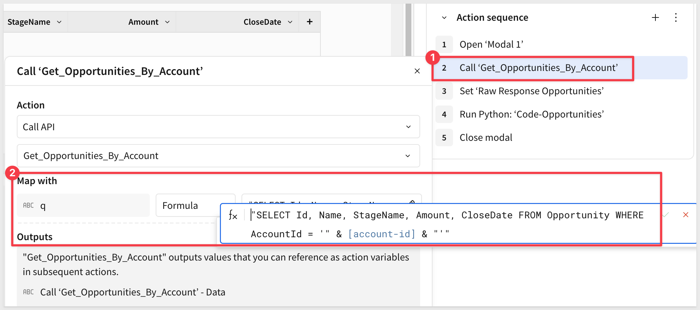

<aside class="positive">
<strong>IMPORTANT:</strong><br> Action sequences execute steps in order, with each step completing before the next begins. This means <code>Run Python element</code> blocks until the script finishes before <code>Close modal</code> fires — so the modal stays visible exactly as long as needed and closes automatically when the table is ready.
</aside>

Click `Publish`.

### Test the Flow

Click `Refresh Account List` to populate the accounts list.

Select any account from the `Name` list. Sigma fires the action sequence, calls `Get_Opportunities_By_Account` with that account's Salesforce ID, stores the response, re-runs the Python element, and the `Opportunities` table updates with live data.

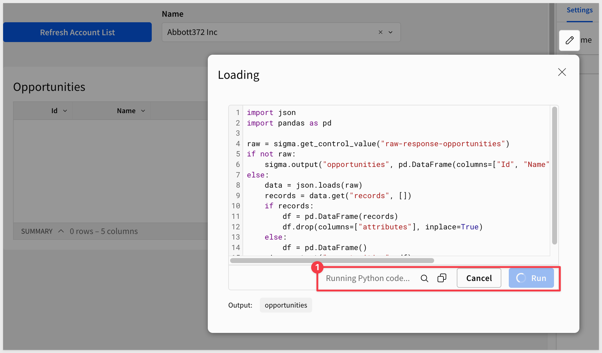

<aside class="positive">
<strong>NOTE:</strong><br> There is a brief delay when selecting an account while the Python element executes on Snowflake. If the <code>PYTHON_WH</code> warehouse was suspended between interactions, it will resume automatically — this cold-start adds a few extra seconds on the first selection.
</aside>

Of course you need to select an account that has an opportunity. Developers accounts use standard data so we used `Abbot372 Inc`:

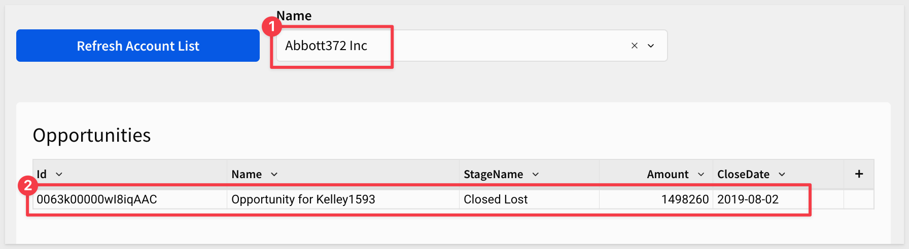

We can confirm the returned opportunity matches in Salesforce as a validation step:

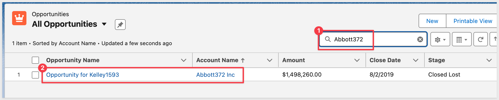

`Adkins907 Inc` has two opportunities:

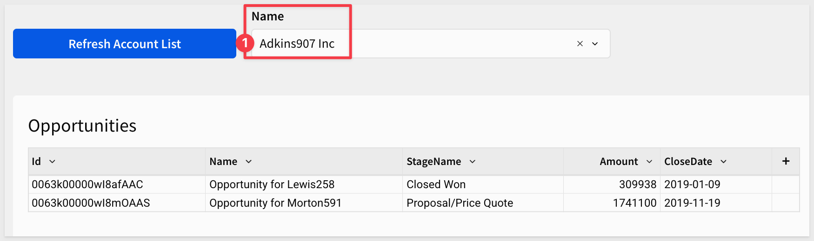


<!-- END OF SECTION-->

## Update Opportunity Stage
Duration: 10

With read-only access validated, we can now add a write-back workflow that allows users to update an opportunity's stage directly from Sigma — demonstrating the full bidirectional integration between Sigma and Salesforce.

### Create the Update Stage API Connector

In Sigma, navigate to `Administration` > `API connectors` and click `Create connector`.

Configure the connector:

| Field | Value |
|-------|-------|
| Name | `Update_Opportunity_Stage` |
| Authentication credential | `Salesforce_OAuth_Credential` |
| Base URL | `PATCH https://<your-instance>.my.salesforce.com/services/data/v65.0/sobjects/Opportunity/:Id` |

<aside class="positive">
<strong>IMPORTANT:</strong><br> Replace <code>&lt;your-instance&gt;</code> with your Salesforce domain — the same subdomain used for the OAuth URLs in the previous section. The <code>:Id</code> syntax tells Sigma this is a path parameter. Sigma will automatically create an <code>Id</code> entry in the <strong>Path parameters</strong> section below.
</aside>

Verify that under `Path parameters`, Sigma auto-created:

- **Key:** `Id`
- **Mode:** `Dynamic`

Under `Request body`, select `raw` and set the content type to `JSON` and enter:

```copy-code
{"StageName": {{StageName}}}
```

Under `Body parameters`, configure `StageName` as:

- **Key:** `StageName`
- **Type:** `JSON`

<aside class="positive">
<strong>NOTE:</strong><br> The <code>{{StageName}}</code> placeholder in the JSON body will be replaced at runtime with the value passed from the workbook action. Salesforce's PATCH endpoint returns <code>204 No Content</code> on success — no response body to parse.
</aside>

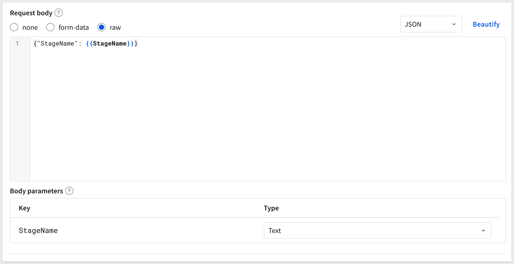

Click `Save`.

### Add the Edit Column and Stage Update Modal

We need a way to set a new value for the stage of a selected opportunity. There are many ways to design a UI to support this, but we will use a simple one: adding an "Edit" column to the `Opportunities` table and setting an action against it.

When a row is selected for edit, a modal will appear and allow the user to set a different stage for the opportunity from a pick list, then return to the `Salesforce` page to show the new value. We can then validate in Salesforce that the change made its way back there too.

**Add a hidden control to store the selected opportunity ID:**

Navigate to the `Controls` page and add a `Text input` element.

Set the Control ID to `selected-opportunity-id`.

This control will store the ID of the opportunity the user clicks to edit, making it available to the API action inside the modal.

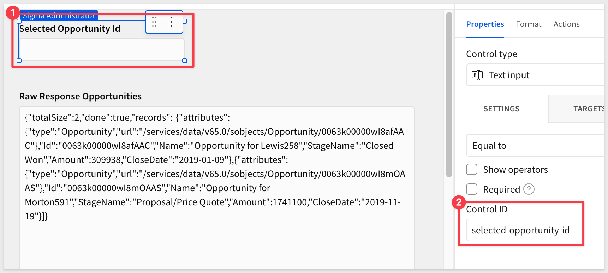

**Create the Edit Stage Modal:**

Add a new `Modal` to the workbook and set its title to:
```copy-code
Select a new stage for this opportunity
```

Add a `List values` control to the modal and configure it:

| Field | Value |
|-------|-------|
| Label | `Stage` |
| Control ID | `new-stage` |
| Values | Static list |

Add the following stage values manually:
- Needs Analysis
- Value Proposition
- Proposal/Price Quote
- Closed Won
- Closed Lost

<!-- 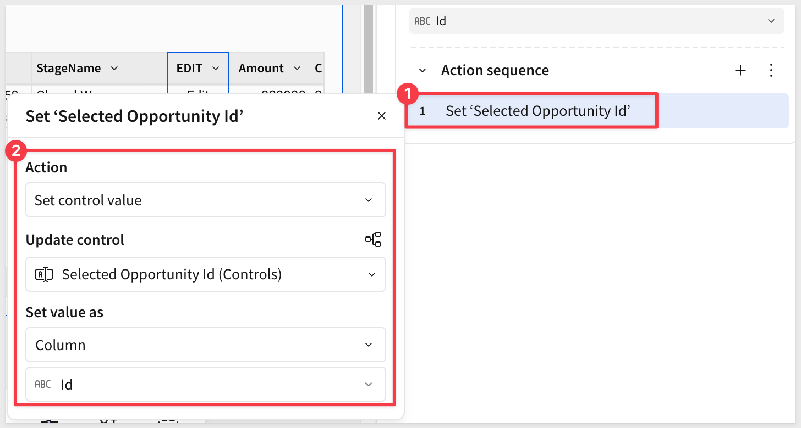 -->

Add a `Button` to the modal and label it `Update Stage`.

<aside class="negative">
<strong>NOTE:</strong><br> Use the Primary or Secondary buttons if you prefer. Either way will work.
</aside>

With the button selected, add an action sequence with 5 steps:

| Step | Action | Configuration |
|------|--------|---------------|
| 1 | `Call API` | Connector: `Update_Opportunity_Stage` (PATCH) |
| 2 | `Call API` | Connector: `Get_Opportunities_By_Account` (GET to refresh) |
| 3 | `Set control value` | Control: `Raw-Response-Opportunities` / Set value as: `Action variable` / Variable: `Data` |
| 4 | `Run Python element` | Element: `Code-Opportunities (Modal 1)` |
| 5 | `Close modal` | *(no configuration required)* |

For step 1, configure the dynamic parameters:

- **`Id` parameter:** Map to the `selected-opportunity-id` control (on the Controls page)
- **`StageName` parameter:** Map to the `new-stage` control (in the modal)

For step 2, configure the dynamic `q` parameter using a formula:

```copy-code
"SELECT Id, Name, StageName, Amount, CloseDate FROM Opportunity WHERE AccountId = '" & [account-id] & "'"
```

<aside class="positive">
<strong>IMPORTANT:</strong><br> Steps 2-4 re-fetch the opportunities from Salesforce after the PATCH completes, ensuring the table displays the updated stage value. Step 2 calls the same GET endpoint used when selecting an account, step 3 stores the fresh response, and step 4 re-runs the Python element to parse and refresh the table.
</aside>

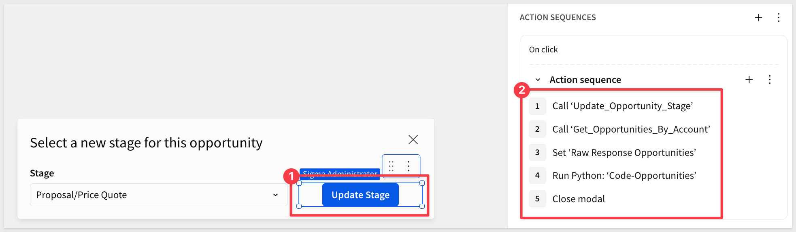

**Add the Edit Column to the Opportunities Table:**

Navigate to the `Salesforce` page and click the `Opportunities` table to select it.

In the table toolbar, click the `+` icon to add a new column. Rename the column `Edit`.

Enter the value `"Edit"` in the formula bar.

With the `Edit` column selected, open the `Actions` panel and click `+` to add a row-level action sequence.

Set the trigger to `On select` targeting the `Edit` column.

Add 2 steps to the action sequence:

| Step | Action | Configuration |
|------|--------|---------------|
| 1 | `Set control value` | Control: `selected-opportunity-id` / Set value as: `Column value` / Column: `Id` |
| 2 | `Open modal` | Modal: `Edit Stage` |

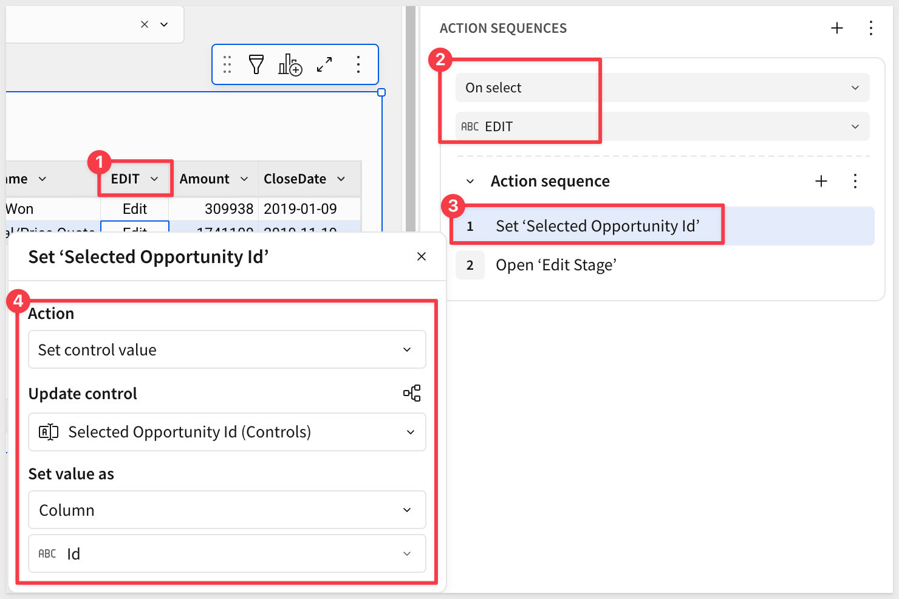

<aside class="positive">
<strong>IMPORTANT:</strong><br> Step 1 captures the clicked row's <code>Id</code> value and stores it in the hidden control. Step 2 opens the modal. The modal's <code>Update Stage</code> button will reference the hidden control to identify which opportunity to update.
</aside>

### Test the Write-Back Flow

Click `Refresh Account List` and select `Adkins907 Inc` from the account list.

<aside class="negative">
<strong>NOTE:</strong><br> Refreshing the account list ensures that the Salesforce OAuth token has not timed out.
</aside>

The Opportunities table shows two opportunities. Focus on `Opportunity for Morton591`, currently at `Proposal/Price Quote` stage.

Click the `Edit` cell for `Opportunity for Morton591`.

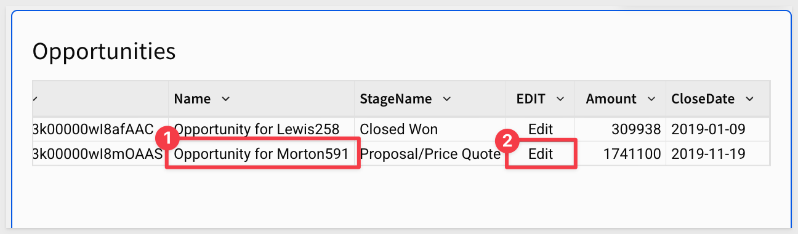

The `Edit Stage` modal opens. From the `Stage` control, select `Closed Won`.

Click the `Update Stage` button.

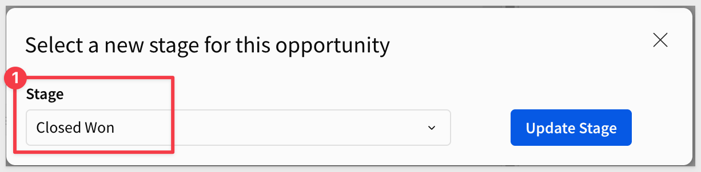

Sigma fires the PATCH request to Salesforce, re-fetches the updated opportunities, re-runs the Python element, closes the modal, and refreshes the table. The `StageName` column for that opportunity now shows `Closed Won`.

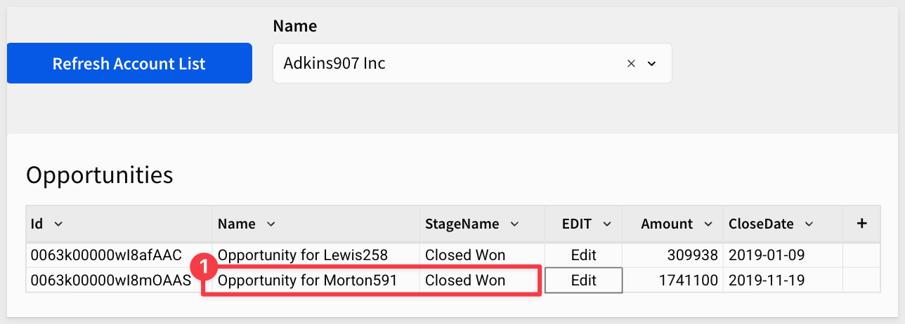

You can verify the update in Salesforce by navigating to the opportunity record — the Stage field will reflect the change made from Sigma.

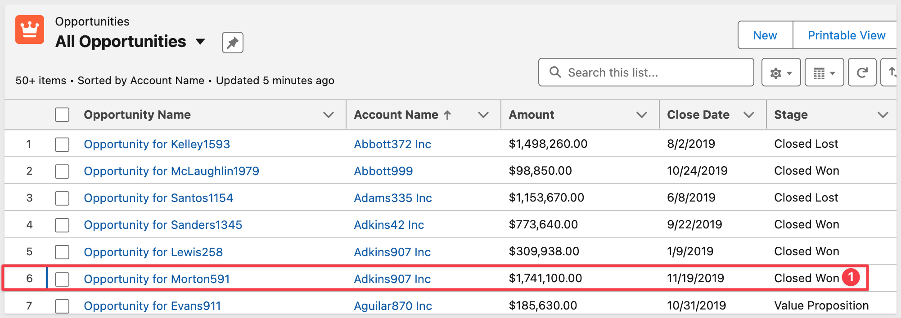

<aside class="negative">
<strong>IMPORTANT:</strong><br> This workflow demonstrates a direct write to the Salesforce system of record. In production environments, consider adding validation rules, confirmation modals, or audit logging to ensure data integrity and user accountability.
</aside>


<!-- END OF SECTION-->

## What we've covered
Duration: 5

In this QuickStart, we connected Sigma directly to a live Salesforce org using OAuth 2.0 and Sigma API Actions — with no ETL pipeline, no warehouse load, and no manual token management.

We covered:

- **Salesforce Connected App setup** — creating an OAuth 2.0 Connected App, setting the correct callback URL, and granting minimal API scopes
- **Sigma API credentials** — configuring an OAuth (authorization code) credential in Sigma so tokens are stored and refreshed automatically
- **Sigma API connectors** — defining three connectors: one GET with a static SOQL query to return all accounts, one GET with a dynamic parameter to fetch opportunities for a selected account, and one PATCH to update opportunity stage values
- **Python on Snowflake** — creating a dedicated warehouse, enabling Python in the Sigma connection settings, and initializing the stored procedure Sigma uses to execute Python elements
- **Workbook construction** — adding a Refresh Account List button, an account selector list, and wiring `Run Python element` actions to drive live data through text area controls and Python elements into interactive tables
- **Write-back workflow** — implementing a PATCH-based update flow that allows users to change opportunity stage values directly from Sigma, with automatic table refresh to reflect the changes

The result is a bidirectional Salesforce integration: a full account list loaded on demand, a live opportunities view that updates whenever a different account is selected, and the ability to update opportunity stages directly in Sigma with changes persisting back to Salesforce — all powered by Salesforce's REST API from directly within Sigma.

**Additional Resource Links**

[Blog](https://www.sigmacomputing.com/blog/)<br>
[Community](https://community.sigmacomputing.com/)<br>
[Help Center](https://help.sigmacomputing.com/hc/en-us)<br>
[QuickStarts](https://quickstarts.sigmacomputing.com/)<br>

Be sure to check out all the latest developments at [Sigma's First Friday Feature page!](https://quickstarts.sigmacomputing.com/firstfridayfeatures/)
<br>

[](https://twitter.com/sigmacomputing)&emsp;
[](https://www.linkedin.com/company/sigmacomputing)&emsp;
[](https://www.facebook.com/sigmacomputing)


<!-- END OF WHAT WE COVERED -->
<!-- END OF QUICKSTART -->
