author: pballai
id: developers_api_actions_servicenow
summary: developers_api_actions_servicenow
categories: developers
environments: web
status: Published
feedback link: https://github.com/sigmacomputing/sigmaquickstarts/issues
tags: Default
lastUpdated: 2026-03-04

# Integrate ServiceNow using API Actions

## Overview
Duration: 5

This QuickStart demonstrates integrating ServiceNow's REST API with Sigma using Basic Authentication and API Actions—showing you how to build a complete bidirectional integration for incident management without ETL pipelines.

**What you'll build:**

A Sigma workbook that:
- Queries ServiceNow incidents using the Table API
- Displays incident details (number, description, state, priority, urgency)
- Allows users to filter incidents by state (New, In Progress, Resolved, etc.)
- Updates incident states directly in ServiceNow via API write-back

**Along the way you'll learn how to:**
- Configure ServiceNow API credentials for Basic Authentication
- Create API credentials in Sigma with Basic Auth
- Build API connectors with dynamic query parameters
- Parse nested JSON responses using Python elements on Snowflake
- Create interactive modals for data updates
- Implement write-back workflows with PATCH requests
- Orchestrate multi-step action sequences

<aside class="positive">
<strong>IMPORTANT:</strong><br> Some screens in Sigma may appear slightly different from those shown in QuickStarts. This is because Sigma continuously adds and enhances functionality. Rest assured, Sigma's intuitive interface ensures that any differences will not prevent you from successfully completing any QuickStart.
</aside>

For more information on Sigma's product release strategy, see [Sigma product releases](https://help.sigmacomputing.com/docs/sigma-product-releases)

If something doesn't work as expected, here's how to [contact Sigma support](https://help.sigmacomputing.com/docs/sigma-support)

### Target Audience

This QuickStart is designed for Sigma developers integrating external APIs, technical ServiceNow users building custom dashboards, and IT service management teams working across Sigma and ServiceNow workflows.

### Prerequisites

<ul>
  <li>A Sigma account with workbook creation permissions</li>
  <li>A ServiceNow Personal Developer Instance (PDI) - We'll show you how to get one</li>
  <li>Access to a Snowflake connection in Sigma with Python enabled</li>
  <li>Intermediate familiarity with Sigma workbooks, elements, and controls</li>
  <li>Basic understanding of REST APIs and JSON (helpful but not required)</li>
</ul>

<aside class="positive">
<strong>IMPORTANT:</strong><br> Sigma recommends using non-production resources when completing QuickStarts.
</aside>

<button>[Sigma Free Trial](https://www.sigmacomputing.com/free-trial/)</button>

<aside class="negative">
<strong>IMPORTANT:</strong><br> Some features may carry a "Beta" tag. Beta features are subject to quick, iterative changes. As a result, the latest product version may differ from the contents of this document.
</aside>


<!-- END OF OVERVIEW -->

## Verify ServiceNow Developer Instance
Duration: 10

Before building the integration, you need a ServiceNow developer instance with sample incident data. ServiceNow provides free Personal Developer Instances (PDIs) for learning and testing. 

We will demonstrate using the sample data provided in ServiceNow developer accounts.

### Request a ServiceNow Developer Instance

If you don't already have a ServiceNow developer account:

**Step 1: Navigate to the ServiceNow Developer Portal**

[Servicenow Developers Portal](https://signon.servicenow.com/x_snc_sso_auth.do?pageId=login)

Click `Sign up` (or `Log in` if you already have an account).

**Step 2: Create an Account**

Complete the registration form with your details. You'll receive a confirmation email.

**Step 3: Request a Personal Developer Instance**

Once logged in:
1. Click `Request Instance` (green button in the top right)
2. Select `Zurich` (Latest release)
3. Click `Request`

The instance takes ~5-10 minutes to provision. You'll see a confirmation page with your instance details.

<aside class="positive">
<strong>NOTE:</strong><br> Developer instances hibernate after inactivity. You can wake them up from the Developer Portal.
</aside>

### Access Your Instance

**Step 4: View Instance Details**

Once your instance is ready, you'll see:
- **Instance URL**: `https://devXXXXXX.service-now.com/` (where XXXXXX is your unique instance number)
- **Username**: `admin`
- **Password**: Click the eye icon to reveal
- **Status**: Online

<aside class="positive">
<strong>IMPORTANT:</strong><br> Save the instance URL and password to a text file; we will use them later. The username is always "admin".
</aside>

**Step 5: Open Your Instance**

Click on the `Instance URL` to open your ServiceNow instance in a new tab:

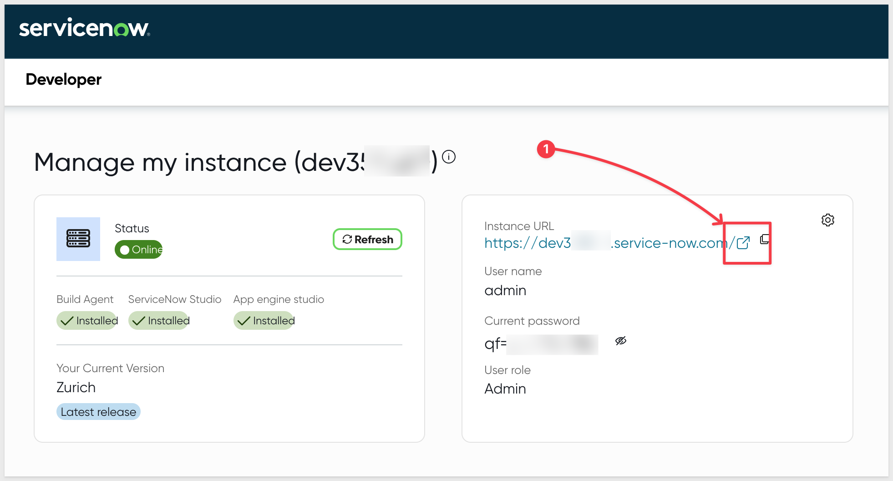

You'll be taken to the ServiceNow home page where you can open the `All` menu and select `Incidents`:

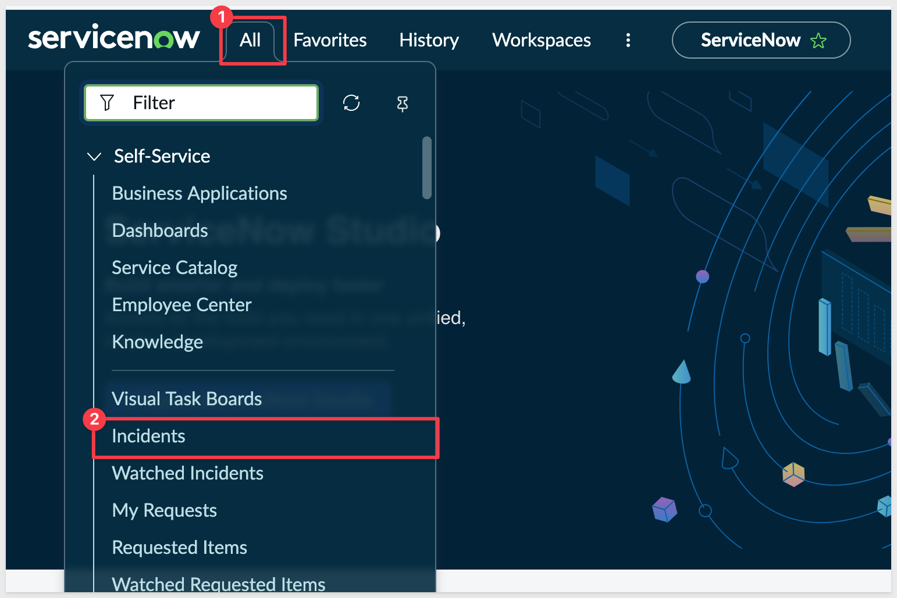

### Verify Sample Incident Data

**Step 6: Navigate to Incidents**

Click on `All` to set the filters to show every incident:

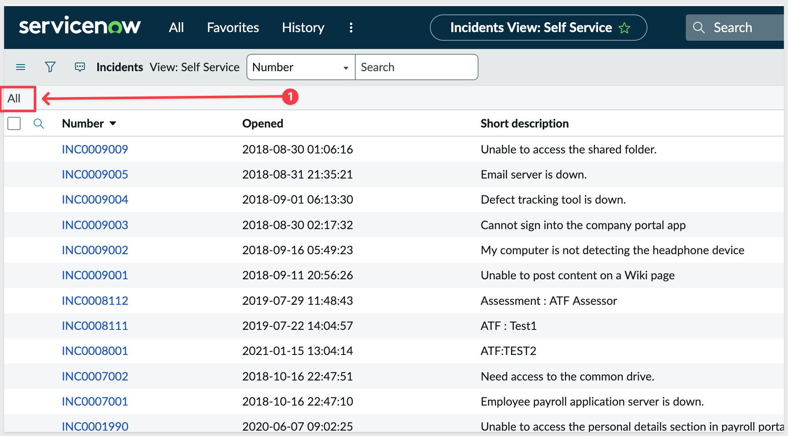

**Step 7: Inspect an Incident**

Click on any `incident number` (like INC0009005) to open the incident form.

Verify you can see fields like:
- Number
- Caller
- State (dropdown with: New, In Progress, On Hold, Resolved, Closed, Canceled)
- Urgency
- Short description

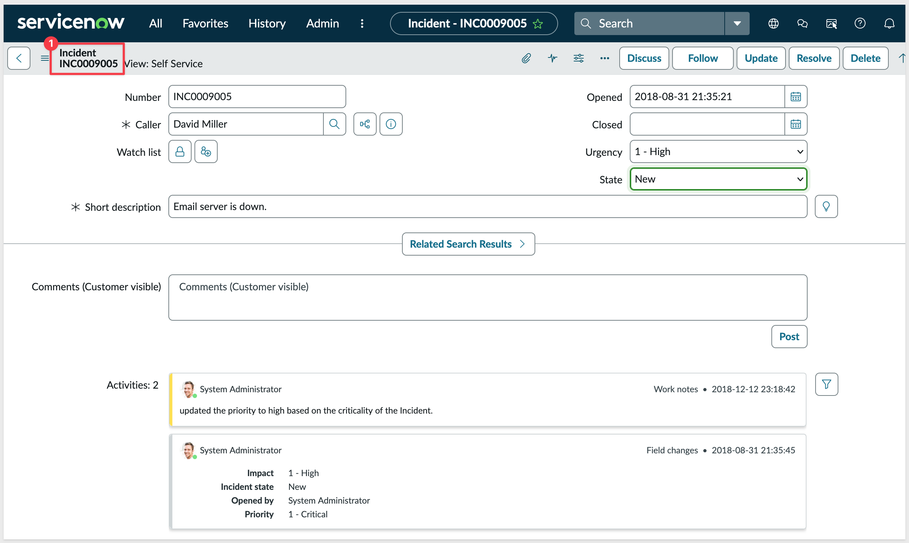

<aside class="positive">
<strong>IMPORTANT:</strong><br> Keep this tab open—you'll need your instance URL and credentials for the next section.
</aside>

### What You've Verified

We now have:
- A working ServiceNow developer instance
- Sample incident data (20+ incidents)
- Admin credentials (username: `admin`)
- Instance URL (`https://devXXXXXX.service-now.com/`)
- Basic understanding of available incident states and fields


<!-- END OF SECTION-->

## Configure ServiceNow Authentication in Sigma
Duration: 10

Now that your ServiceNow instance is verified, let's configure authentication in Sigma. ServiceNow supports Basic Authentication using username and password, which is perfect for developer instances.

### Create API Credentials in Sigma

In Sigma, open the left navigation menu and select `Administration` > `Credentials` and click the `Create credential` button:

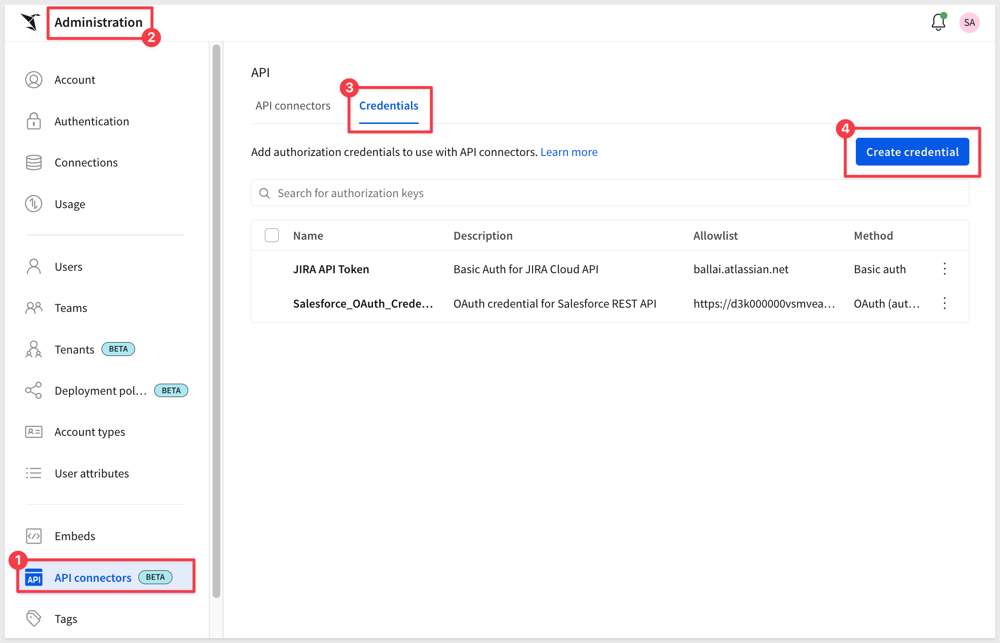

In the Create Credential dialog:

1. **Name**: `ServiceNow Basic Auth`
2. **Authentication Type**: Select `Basic Authentication`
3. **Username**: `admin` (your ServiceNow admin username)
4. **Password**: Enter your ServiceNow instance password (the one you revealed in the previous section)

<aside class="negative">
<strong>IMPORTANT:</strong><br> Use your ServiceNow instance password, NOT your ServiceNow Developer Portal password.
</aside>

5. **Authorized domains**: `devXXXXXX.service-now.com` (replace with your actual instance domain)

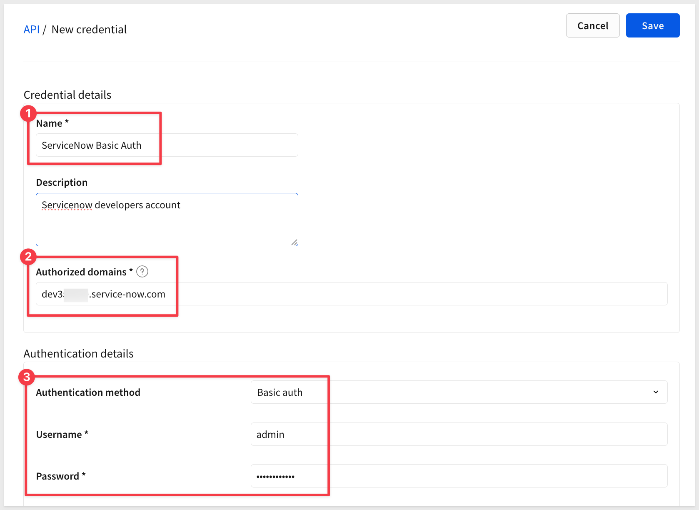

<aside class="positive">
<strong>SECURITY BEST PRACTICE:</strong><br> Setting Authorized domains restricts this credential to only be used with your specific ServiceNow instance, preventing accidental or malicious use with other domains.
</aside>

Click `Create` to save the credential.

You'll see `ServiceNow Basic Auth` in your API Credentials list.

<!-- 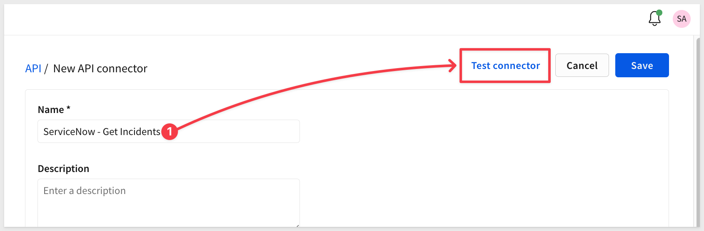 -->

<aside class="positive">
<strong>SECURITY NOTE:</strong><br> Sigma securely stores API credentials. They are never exposed in workbooks or to end users. Only workbook creators with appropriate permissions can configure API connectors using these credentials.

Since credentials are created at the account level, they can be shared across multiple API connectors. This makes updating credentials easier—change it once, and all connectors using it are updated
</aside>

We now have:
- A Basic Auth credential stored in Sigma
- Secure storage of your ServiceNow admin credentials
- Ready to create API connectors that use this authentication

<aside class="positive">
<strong>NOTE:</strong><br> Sigma supports multiple authentication methods including Basic Authentication, Bearer Token, OAuth 2.0 (Client Credentials, Authorization Code, Password Credentials), and API Key authentication. The method you choose depends on what your API provider supports.
</aside>

For more information, see [Add a new API credential to Sigma](https://help.sigmacomputing.com/docs/configure-api-credentials-and-connectors-in-sigma#add-a-new-api-credential-to-sigma)


<!-- END OF SECTION-->

## Build the ServiceNow Incidents API Connector
Duration: 15

Now we'll create an API connector that queries incidents from ServiceNow's Table API. This connector will use the Basic Auth credential we just created.

### Understanding ServiceNow's Table API

ServiceNow provides a [REST API](https://www.servicenow.com/docs/r/api-reference/rest-apis/api-rest.html) for accessing table data:

**Endpoint**: `GET /api/now/table/{table_name}`

For incidents: `GET /api/now/table/incident`

**Query Parameters**:
- `sysparm_limit`: Number of records to return
- `sysparm_fields`: Comma-separated list of fields to return
- `sysparm_query`: Encoded query string for filtering

**Documentation**: [ServiceNow Table API](https://developer.servicenow.com/dev.do#!/reference/api/latest/rest/c_TableAPI)

### Create the API Connector

**Step 1: Navigate to API Connectors**

In Sigma, navigate to `Administration` > `API Connectors` and click `Create connector`:

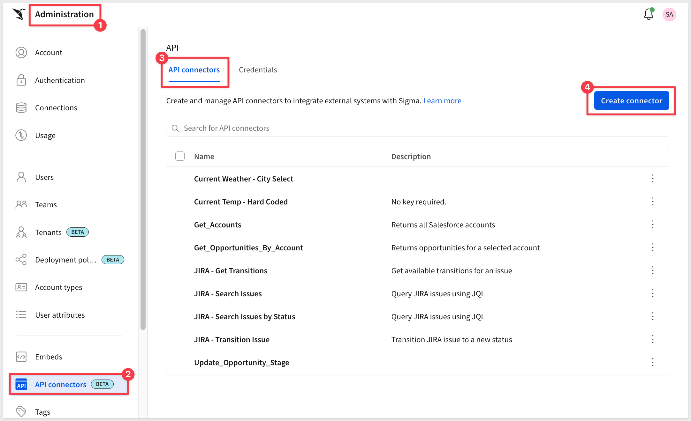

**Step 2: Configure Base URL**

Configure the new connector using:

1. **Name**: `ServiceNow - Get Incidents`
2. **Credential**: Select `ServiceNow Basic Auth` (the credential we created earlier)
3. **Base URL**:
- GET
- `https://devXXXXXX.service-now.com/api/now/table/incident`
    - Replace `devXXXXXX` with your actual instance number
    - Example: `https://dev555471.service-now.com/api/now/table/incident`

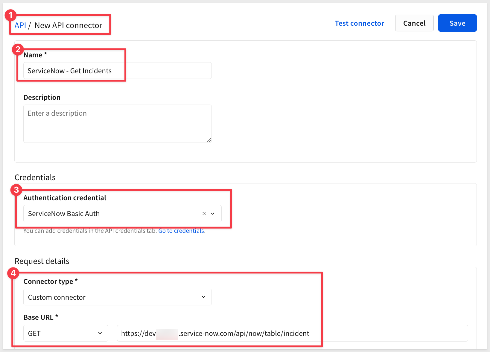

**Step 3: Add Query Parameters**

In the `Query Parameters` section, click the `+ Add`:

**Parameter 1:**
- **Key**: `sysparm_limit`
- **Mode** `Static`
- **Value**: `100`

This limits results to 100 incidents.

**Parameter 2:**
- **Key**: `sysparm_fields`
- **Mode** `Static`
- **Value**: `number,sys_id,short_description,state,priority,urgency,caller_id,
                opened_at,closed_at,assigned_to`

The field list to return to Sigma in the response.

**Parameter 3 (Dynamic):**
- **Key**: `sysparm_query`
- **Mode** `Dynamic`
- **Value**: (leave empty)

This is a Dynamic filter for incident state, sent from Sigma at runtime:

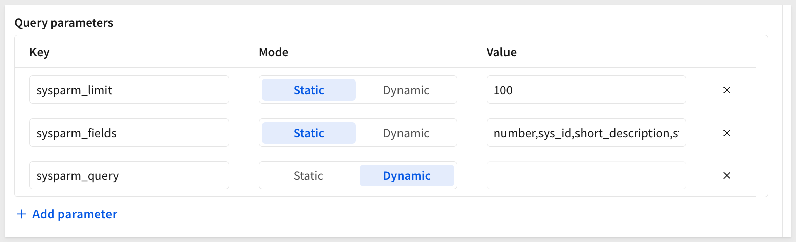

<aside class="positive">
<strong>DYNAMIC PARAMETERS:</strong><br> Setting the mode to Dynamic allows us to pass filter values from Sigma workbook controls at runtime. When calling this API connector, we'll reference this parameter by its key name (sysparm_query). This enables users to filter incidents by state without creating multiple API connectors.
</aside>

**Step 4: Test the Connector**

Before saving, let's test the connector:


1. In the **Test** section, set `sysparm_query` to: `state=1`
   - In ServiceNow, state values are numeric: 1=New, 2=In Progress, 3=On Hold, 6=Resolved, 7=Closed, 8=Canceled
2. Click `Send Test Request`

You should see a JSON response with incident data in the `Body` section:

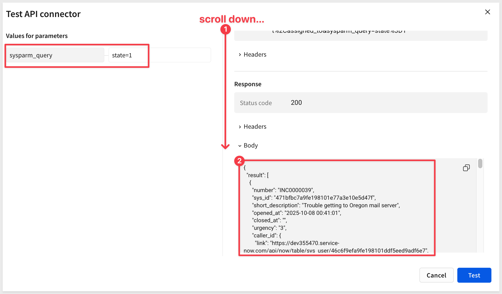

<aside class="negative">
<strong>TROUBLESHOOTING:</strong><br> If you get an authentication error, verify your instance URL and credentials. If you get a 404 error, check that your instance URL is correct and includes /api/now/table/incident.
</aside>

**Step 5: Save the Connector**

Click `Create` to save the connector.

You'll see `ServiceNow - Get Incidents` in your API Connectors list.

<!-- 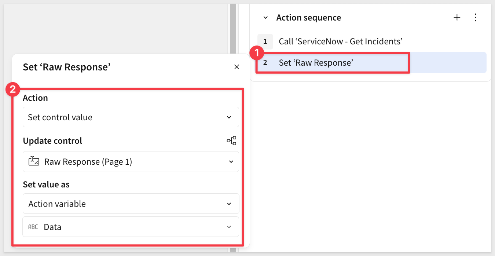 -->

### Understanding ServiceNow State Values

ServiceNow uses numeric codes for incident states:

| State Code | State Name   |
|------------|--------------|
| 1          | New          |
| 2          | In Progress  |
| 3          | On Hold      |
| 6          | Resolved     |
| 7          | Closed       |
| 8          | Canceled     |

We'll use these codes when building filters in our workbook.

We now have:
- An API connector that queries ServiceNow incidents
- Dynamic filtering capability via the `sysparm_query` parameter
- Tested API connection returning live incident data


<!-- END OF SECTION-->

## Setup Snowflake Environment for Python
Duration: 10

Sigma's API Actions return raw JSON responses. To parse ServiceNow's response (a list of incidents) into an interactive table, we use a Sigma `Python element`.

Python elements execute on Snowflake, so we need to prepare your Snowflake environment.

### Step 1: Create a Dedicated Warehouse

In Snowflake, execute these commands as `ACCOUNTADMIN`:

```copy-code
USE ROLE ACCOUNTADMIN;

CREATE WAREHOUSE IF NOT EXISTS PYTHON_WH
  WAREHOUSE_TYPE = STANDARD
  WAREHOUSE_SIZE = XSMALL
  AUTO_SUSPEND = 60
  AUTO_RESUME = TRUE
  COMMENT = 'Dedicated warehouse for Sigma Python queries';

ALTER WAREHOUSE PYTHON_WH RESUME;

GRANT USAGE ON WAREHOUSE PYTHON_WH TO ROLE SIGMA_SERVICE_ROLE;
GRANT CREATE PROCEDURE ON SCHEMA QUICKSTARTS.INPUT_TABLES_WRITE TO ROLE SIGMA_SERVICE_ROLE;
```

<aside class="negative">
<strong>IMPORTANT:</strong><br> Replace SIGMA_SERVICE_ROLE with your actual Sigma service role name, and QUICKSTARTS.INPUT_TABLES_WRITE with your actual schema path. If you're unsure, check your Sigma connection settings in Administration > Connections.

AUTO_SUSPEND is set to 60 seconds to minimize credit consumption. The warehouse only runs when a Python element is actively executing.
</aside>

### Step 2: Enable Python in Sigma Connection

In Sigma, navigate to `Administration` > `Connections`.

Find your Snowflake connection and click to edit it:

1. **Enable Python queries**: Turn ON
2. **Warehouse**: Select `PYTHON_WH`
3. **Packages**: Leave empty
4. **External access rule**: Leave empty


Click `Save`.

### Step 3: Initialize the Python Procedure

Now we need to initialize Snowflake's Python procedure. This is a one-time setup.

**Create a test workbook:**

1. In Sigma, create a new workbook
2. Add a `Python` element using the `Element bar` > `Data` > `Python`.
3. Replace the default code with:

```copy-code
import pandas as pd
sigma.output("test", pd.DataFrame({"status": ["initialized"]}))
```

4. Click `Run`

You'll see output indicating Python executed successfully:

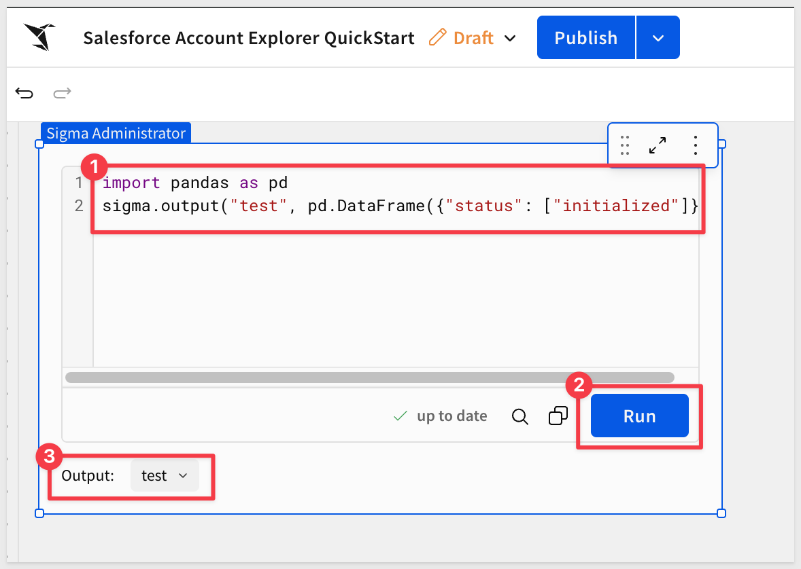

There is no need to save this workbook.

### Step 4: Grant Procedure Access

Once the element executes successfully, return to Snowflake and run the following to grant access to the procedure:

```copy-code
USE ROLE ACCOUNTADMIN;
GRANT USAGE ON PROCEDURE QUICKSTARTS.INPUT_TABLES_WRITE.RUN_PYTHON_CODE(VARCHAR, VARCHAR) TO ROLE SIGMA_SERVICE_ROLE;
```

<aside class="negative">
<strong>IMPORTANT:</strong><br> Replace SIGMA_SERVICE_ROLE and the schema path with your actual values, matching what you used earlier.
</aside>

We now have:
- A dedicated warehouse for Python execution
- Python enabled in your Sigma connection
- Initialized Python procedure in Snowflake
- Proper permissions for Sigma to execute Python


<!-- END OF SECTION-->

## Build the ServiceNow Workbook - Read Workflow
Duration: 20

Now we'll build a Sigma workbook that calls the ServiceNow API, parses the JSON response, and displays incidents in a table with dynamic filtering.

### Create the Workbook

**Step 1: Create a New Workbook**

In Sigma, click `Create New` > `Workbook`.

Click `Save as` and name the workbook: `ServiceNow API Actions QuickStart`

**Step 2: Add a Text Area Control for Raw Response**

We'll use a text area control to store the raw JSON response from ServiceNow.

1. Use the `Element bar` to add a `Controls` > `Text Area`
2. Set the `Control ID` to: `raw-response`

Leave it blank (the API action will populate it):

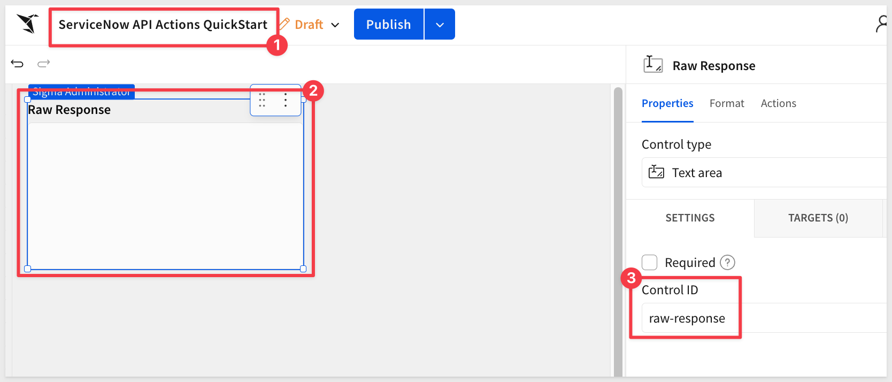

<aside class="positive">
<strong>WHY A TEXT AREA?</strong><br> Text area controls can store large JSON strings returned by APIs. We'll use a Python element to parse this JSON into a structured table format.
</aside>

**Step 3: Add a List Control for State Filter**

Create a control that lets users filter the loaded incidents by state:

1. Use the `Element bar` to add a `Controls` > `List values`
2. Set the `Control ID` to: `state-filter`
3. Configure the list values — use the same value for both display and actual:

| Value        |
|--------------|
| New          |
| In Progress  |
| On Hold      |
| Resolved     |
| Closed       |

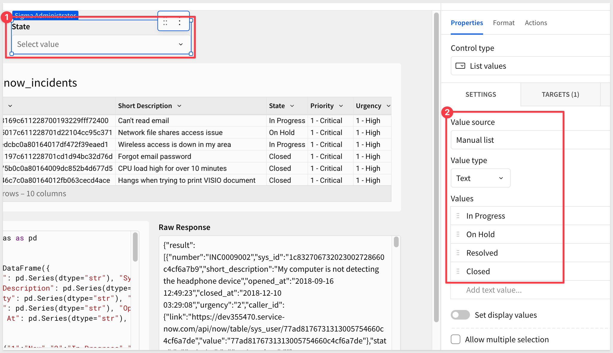

Be sure to disable `Allow multiple selection` as the value must contain one selection only:

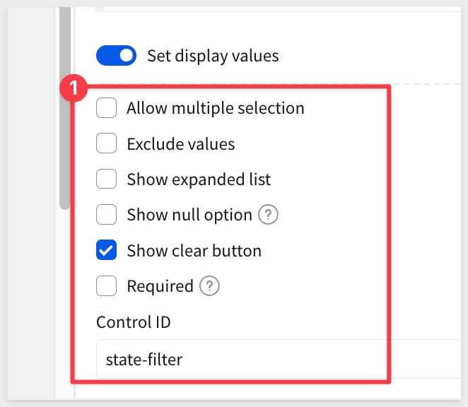

4. Set the `TARGETS` to the `ServiceNow Incidents` table and the `State` column

<aside class="positive">
<strong>NOTE:</strong><br> The <code>ServiceNow Incidents</code> table does not exist yet — you will complete this target configuration in Step 10 after the table is created. Skip this step for now and return to it later.
</aside>

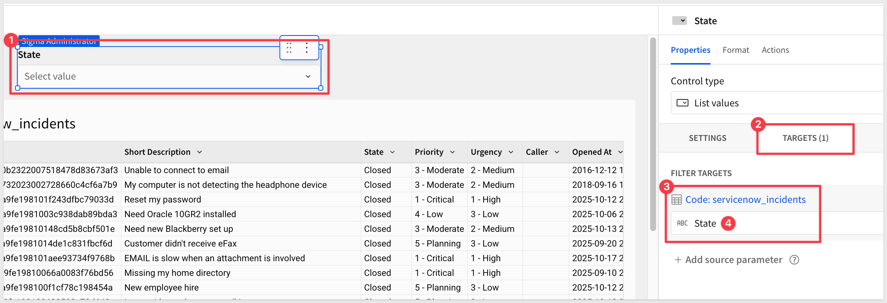

<aside class="positive">
<strong>STATE FILTER:</strong><br> This control filters the loaded table directly by matching against the <code>State</code> column. Users can clear the filter at any time using the <code>x</code> on the control to show all incidents.
</aside>

**Step 4: Add a Button to Call the API**

Create a button that triggers the API call:

1. Click `Add` > `UI` > `Button`
2. Set button text: `Load ServiceNow Incidents`

**Step 5: Configure the Button Action**

Now we'll configure the button to call the ServiceNow API:

1. Click the button's `Actions` menu 
2. Click the `+` to add an `Action sequence`
3. Choose `Call API`

Configure the first action:

| Field | Value |
|-------|-------|
| Action | `Call API` |
| API Connector | `ServiceNow - Get Incidents` |
| sysparm_query | `""` (empty string — returns all incidents) |

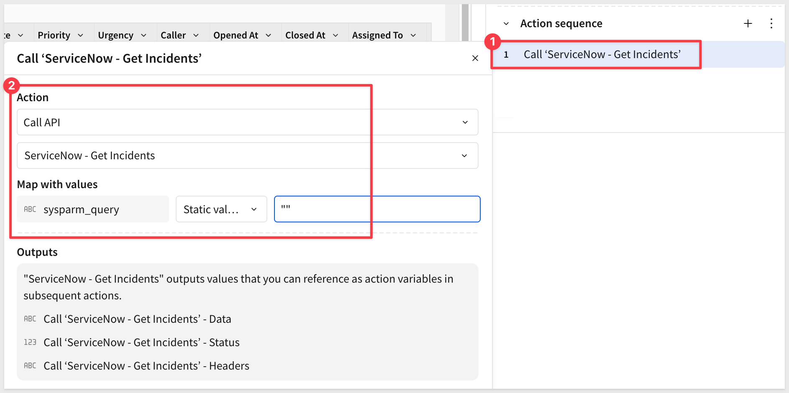

4. Click the `+` to add a second action to the sequence
5. Choose `Set control value`

Configure the second action:

| Field | Value |
|-------|-------|
| Action | `Set control value` |
| Update control | `raw-response (Controls)` |
| Set value as | `Action variable` |
| Variable | `Data` |


This stores the API response JSON in the text area control for parsing.

**Step 6: Test the API Call**

Click the `Load ServiceNow Incidents` button.

You should see the `raw-response` text area populate with JSON data from ServiceNow.

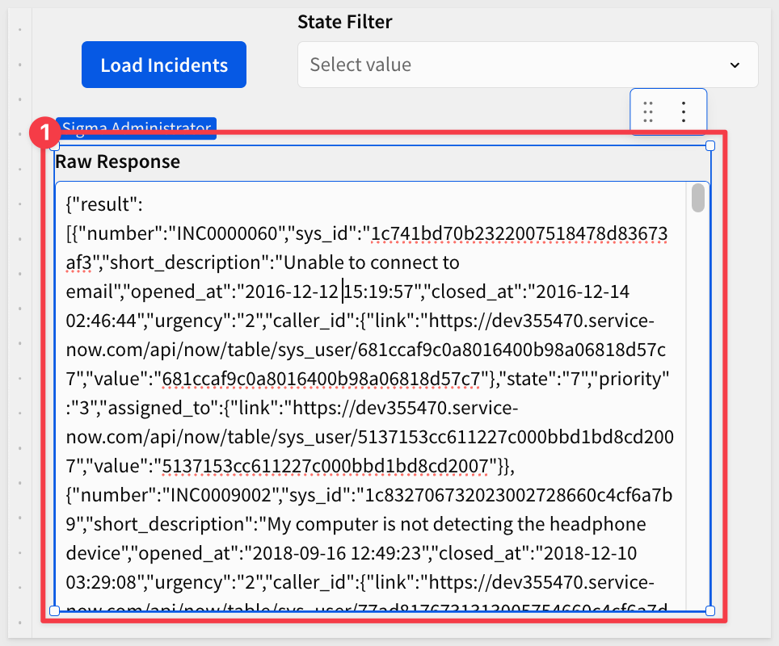

<aside class="negative">
<strong>TROUBLESHOOTING:</strong><br> If nothing happens, check the browser console for errors. Verify your API connector credentials and instance URL are correct.
</aside>

### Parse JSON with Python

Now we'll use a Python element to transform the JSON response into a Sigma table.

**Step 7: Add a Python Element**

1. Add a `Python` element using the `Element bar` > `Data` > `Python`.
2. Replace the default Python code with:

```copy-code
import pandas as pd
import json

# Fallback empty DataFrame with typed columns.
# Snowflake requires a defined schema even when there are no rows to display.
EMPTY = pd.DataFrame({
    "Number": pd.Series(dtype="str"), "Sys ID": pd.Series(dtype="str"),
    "Short Description": pd.Series(dtype="str"), "State": pd.Series(dtype="str"),
    "Priority": pd.Series(dtype="str"), "Urgency": pd.Series(dtype="str"),
    "Caller": pd.Series(dtype="str"), "Opened At": pd.Series(dtype="str"),
    "Closed At": pd.Series(dtype="str"), "Assigned To": pd.Series(dtype="str")
})

# ServiceNow returns numeric codes for State, Priority, and Urgency.
# These maps convert them to readable labels for display in the table.
STATE    = {"1":"New","2":"In Progress","3":"On Hold","6":"Resolved","7":"Closed","8":"Canceled"}
PRIORITY = {"1":"1 - Critical","2":"2 - High","3":"3 - Moderate","4":"4 - Low","5":"5 - Planning"}
URGENCY  = {"1":"1 - High","2":"2 - Medium","3":"3 - Low"}

# Read the raw JSON response stored in the workbook text area control.
raw = sigma.get_control_value("raw-response")

try:
    # Parse the JSON and extract the result array.
    # If the response is an error or not a list (e.g. a PATCH response), default to empty.
    incidents = json.loads(raw).get('result', [])
    if not isinstance(incidents, list):
        incidents = []

    rows = []
    for i in incidents:
        # ServiceNow returns reference fields (caller, assigned_to) as nested objects.
        # Extract the display_value when present, otherwise use the raw value.
        caller   = i.get('caller_id',   '')
        assigned = i.get('assigned_to', '')
        if isinstance(caller,   dict): caller   = caller.get('display_value',   '')
        if isinstance(assigned, dict): assigned = assigned.get('display_value', '')

        rows.append({
            'Number': i.get('number',''), 'Sys ID': i.get('sys_id',''),
            'Short Description': i.get('short_description',''),
            'State':    STATE.get(i.get('state',''),    i.get('state','')),
            'Priority': PRIORITY.get(i.get('priority',''), i.get('priority','')),
            'Urgency':  URGENCY.get(i.get('urgency',''),  i.get('urgency','')),
            'Caller': caller, 'Opened At': i.get('opened_at',''),
            'Closed At': i.get('closed_at',''), 'Assigned To': assigned
        })

    # Build the DataFrame, or return the typed empty schema if no incidents matched.
    df = pd.DataFrame(rows) if rows else EMPTY
except Exception:
    # Return empty on any parse error (missing raw value, API error response, etc.)
    df = EMPTY

# Output the DataFrame to Sigma as a named result set.
sigma.output("servicenow_incidents", df)
```

**Step 8: Run the Python Element**

Click `Run` (bottom right of the Python element).

You should see output indicating the Python executed successfully.

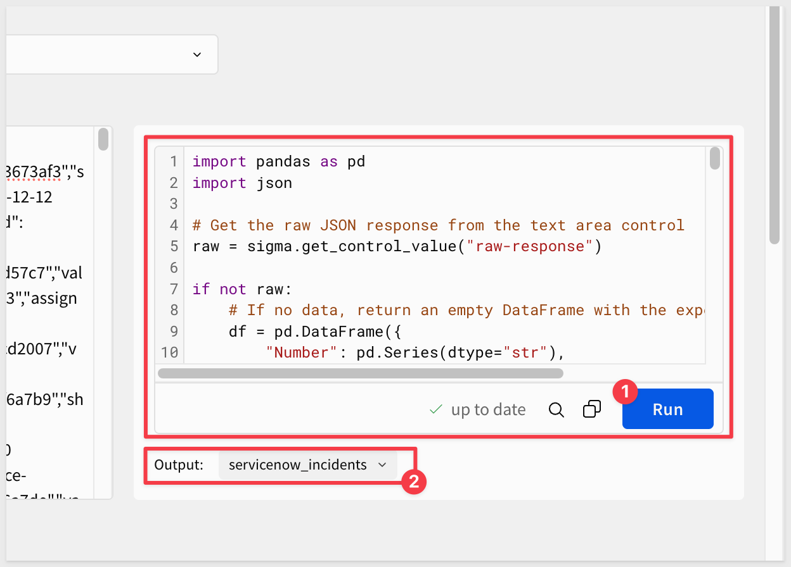

<aside class="positive">
<strong>PYTHON PARSING LOGIC:</strong><br> The script handles ServiceNow's nested JSON structure, extracts reference field display values, and maps numeric codes (state, priority, urgency) to human-readable labels.
</aside>

**Step 10: Create a Table from Python Output**

1. Click on the Python element's output result
2. Select `Create` > `Child Element` > `Table`

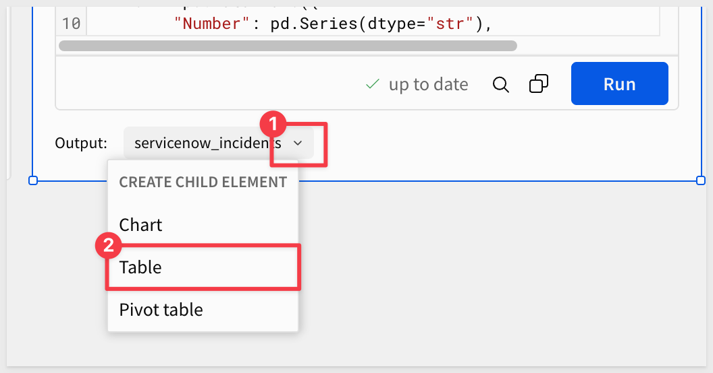

You should now see a table populated with ServiceNow incident data:

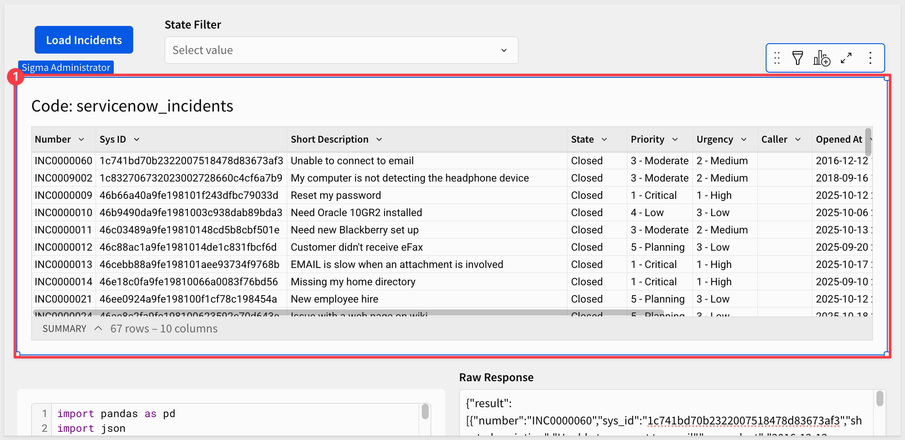

Rename the table: `ServiceNow Incidents`.

Now return to the `state-filter` control and complete step 4 from earlier — set the `TARGETS` to the `ServiceNow Incidents` table and the `State` column.

**Step 11: Add Python Action to the Load Button**

Now that the Python element exists, we need to go back to the `Load ServiceNow Incidents` button and add a third action to run it after the raw response is stored:

1. Click the `Load ServiceNow Incidents` button to select it
2. In the `Actions` panel, click `+` to add a third action to the existing sequence
3. Choose `Run Python element` > `Code (ServiceNow Incidents)`

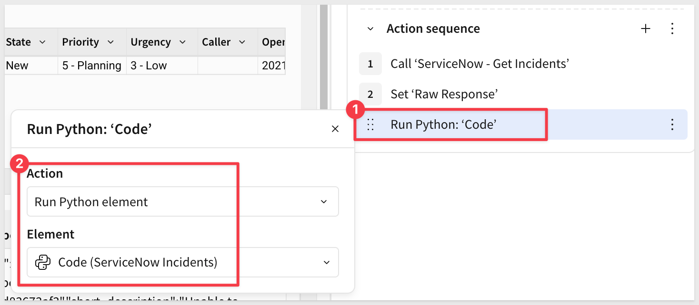

The button now has three actions in sequence: (1) Call the ServiceNow API, (2) Store the response in `raw-response`, (3) Run the Python element to parse and display the data.

**Step 12: Test the State Filter**

Click `Load ServiceNow Incidents` to load all incidents, then select a value from the `State` filter (e.g., `In Progress`).

The table should immediately filter to show only incidents matching the selected state. Use the `x` on the control to clear the filter and return to all incidents.

We now have:
- A working read workflow that queries ServiceNow incidents
- Dynamic state filtering driven by a workbook control
- JSON parsing that handles ServiceNow's nested response structure
- A table displaying incident data with readable field values
- Real-time data refresh on button click


<!-- END OF SECTION-->

## Build the Write-Back Workflow - Update Incident State
Duration: 20

Now we'll add the ability to update incident states in ServiceNow directly from Sigma. This demonstrates bidirectional integration—not just reading data, but writing changes back to the source system.

### Create the Update Incident API Connector

**Step 1: Create a New API Connector**

Navigate to `Administration` > `API Connectors` and click `Create Connector`.

**Step 2: Configure the Update Connector**

1. **Name**: `ServiceNow - Update Incident`
2. **Description:** `Update Incident State`
3. **Authentication credential:** Select `ServiceNow Basic Auth`
4. **HTTP Method and Base URL:** 
   - `PATCH`
   - `https://devXXXXXX.service-now.com/api/now/table/incident/:sys_id`
   - Replace `devXXXXXX` with your instance number
   - The `:sys_id` is a path parameter that will be replaced at runtime

<aside class="positive">
<strong>PATH PARAMETERS:</strong><br> The :sys_id syntax creates a path parameter. ServiceNow requires the sys_id (unique identifier) in the URL path to update a specific incident record.
</aside>

**Step 3: Configure Path Parameter**

Because the Base URL includes `:sys_id`, Sigma automatically creates the `sys_id` path parameter. You just need to change its mode:

In the `Path Parameters` section, find the auto-generated `sys_id` row and set the `Mode` to `Dynamic`:

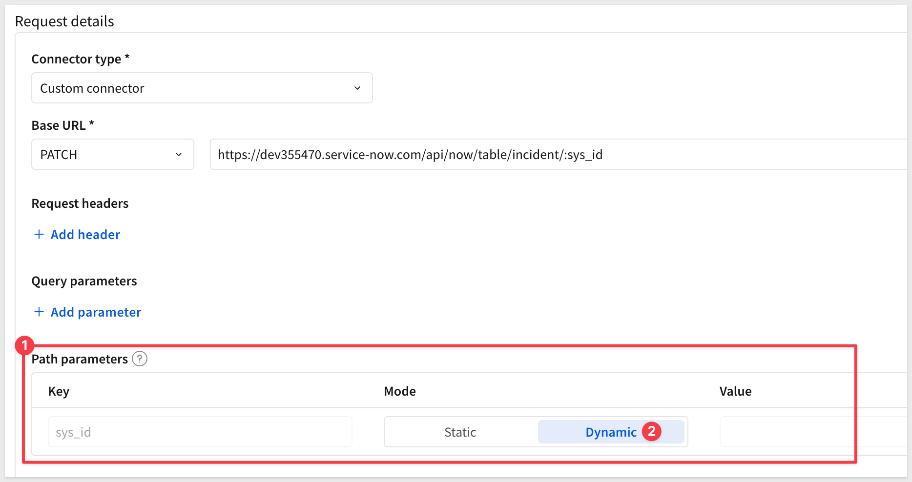

The `sys_id` value will be passed at runtime from the workbook action.

**Step 4: Configure Request Body**

In the `Body parameters` section:

1. **Content Type**: `JSON`
2. **Body Template**:

```json
{
  "state": {{newState}}
}
```

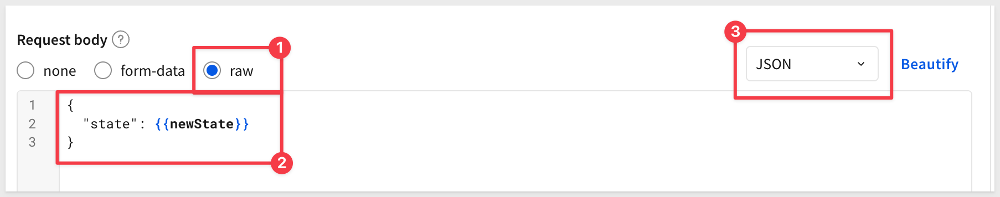

<aside class="negative">
<strong>IMPORTANT:</strong><br> Do NOT wrap {{newState}} in quotes. Sigma will automatically handle the proper JSON formatting based on the variable type.
</aside>

**Step 5: Define Body Variables**

In the `Body Variables` section set the variable `newState` to use `Number` type.

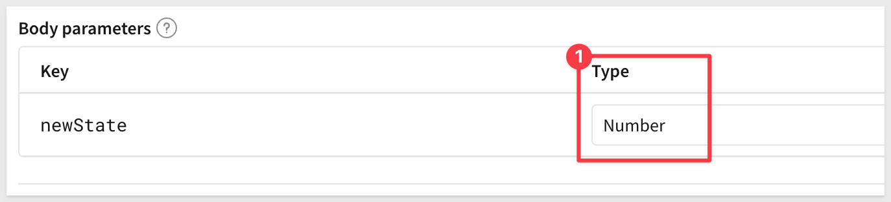

`Save` the new connector.

**Step 6: Test the Update Connector**

Return to the `ServiceNow Incidents` table and copy a `Sys ID` value from one of the records that has a `State` of `On Hold`. We will use this as a test record, taking the incident from `On Hold` to `In Progress`. 

With the `Sys ID` copied return to the `ServiceNow - Update Incident` API connector. 

In the `Test` section:

1. Click the `Edit` button 
2. Click the `Test connector` link
3. Set `sysId` to a real sys_id from your table (copy one from the Sys ID column)
4. Set `newState` to: `2` (In Progress)
5. Click `Test`

You should see a successful response with the updated incident data.

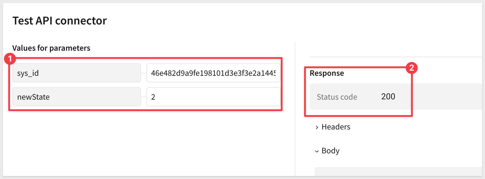

`Save` the connector.

We can verify that the state change was successful in ServiceNow as well by looking at the `Activities` section for the `Incident Number` tested:

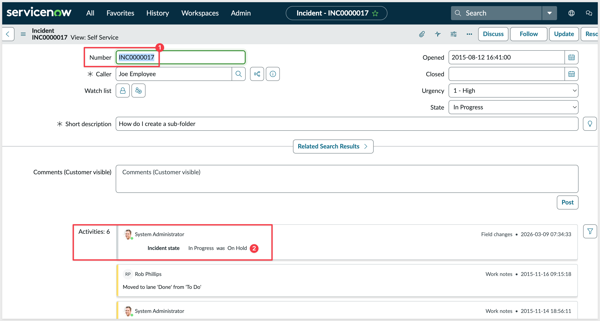


<!-- END OF SECTION-->

## Build the Update Workflow in the Workbook
Duration: 20

Now we'll add UI elements to allow users to select an incident and update its state.

We'll use a modal to show a popup when users click an incident:

1. In the lower left corner of the workbook, click the `+` and select `Add modal`:

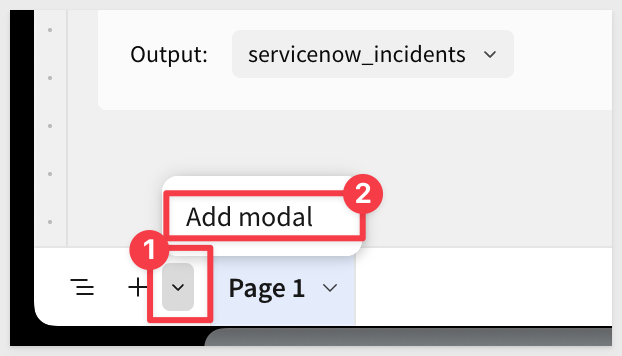

2. Rename the modal: `update-incident-modal`
3. Set the modal title: `Update Incident State`

Might as well rename `Page 1` to `ServiceNow Incidents`.

Inside the modal, add these controls:

**Control 1: Incident Number**
- Type: `Controls` > `Text input`
- Control ID: `modal-incident-number`
- Label: `Incident Number`

**Control 2: Current Description**
- Type: `Controls` > `Text input`
- Control ID: `modal-description`
- Label: `Description`

**Control 3: Sys ID**
- Type: `Controls` > `Text input`
- Control ID: `modal-sys-id`
- Label: `Sys ID`

**Control 4: New State**
- Type: `Controls` > `List values`
- Control ID: `modal-new-state`
- Label: `Select New State`

| Display Value | Actual Value |
|---------------|--------------|
| In Progress   | 2            |
| On Hold       | 3            |
| Resolved      | 6            |
| Closed        | 7            |

<aside class="negative">
<strong>NOTE:</strong><br> "New" (state=1) is intentionally excluded. ServiceNow treats "New" as the initial state only — business rules prevent transitioning an existing incident back to "New" once it has been worked.
</aside>

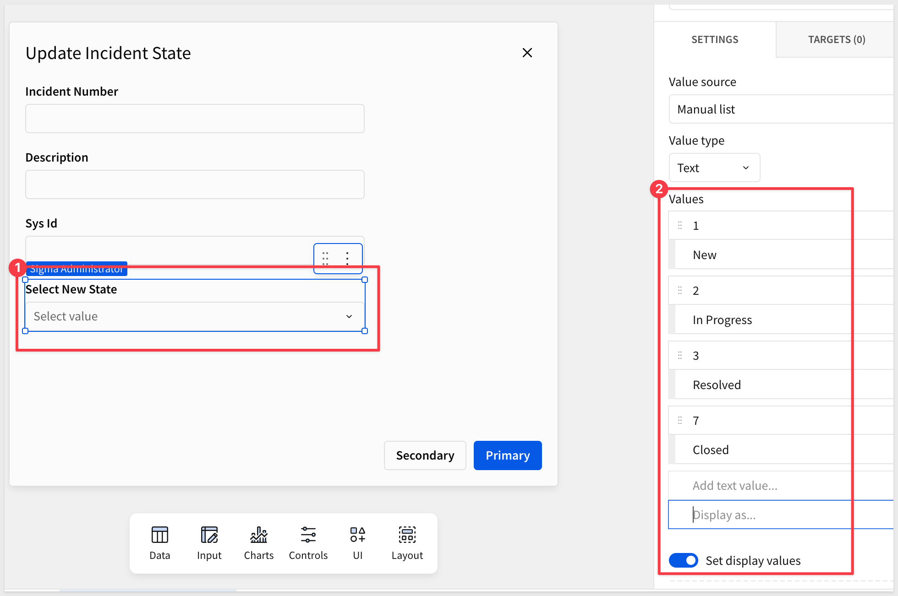

Be sure to disable the `Allow multiple selection` checkbox under the list select control. The API expects a single value for `State`:

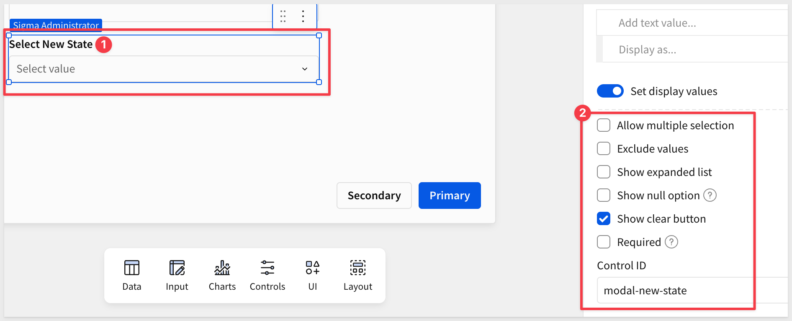

**Control 5: Button - Submit Update**

We can just configure one of the default buttons instead of adding a new one. Let's configure `Primary` for this; click that button and set the label to `Update Incident`.

Also disable the `Secondary` button since we won't need that:

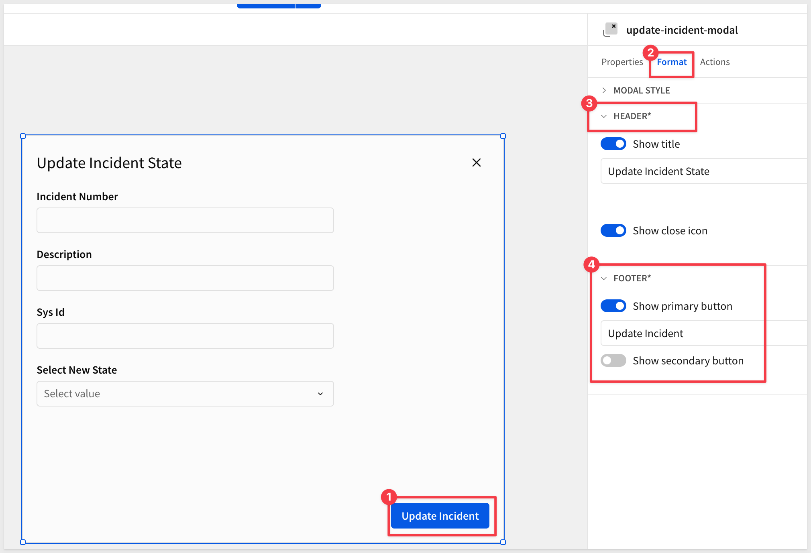

Now we can configure the `ServiceNow Incidents` table to open the modal when a row is clicked.

Return to the `ServiceNow Incidents` page.

We will configure an action on the `Number` column so that when a user clicks a specific incident number, the modal will open and allow them to set a new `State`.

1. Click the header of the `Number` column to select it
2. Click `Actions` > `Add sequence` > `+`
3. Choose `Set Control Value`

Set these control values:
- `Update control` = `Incident Number (update-incident-modal)`
- `Set value as` = `Column` / `Number`

This sends the selected `Number` to the modal and is shown on the `modal-incident-number` text input control.

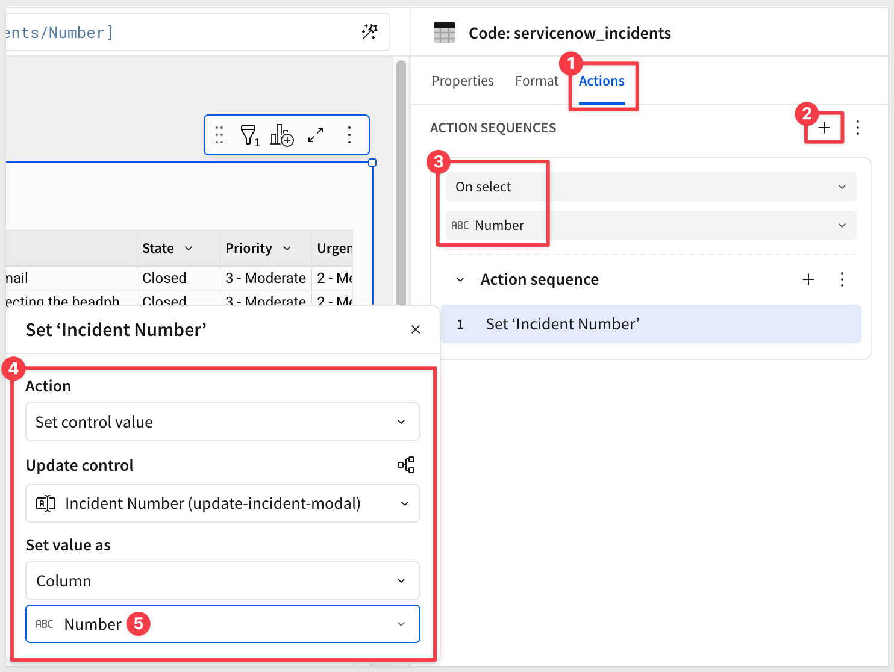

Repeat the process for the other values we want to pass to the modal.

<aside class="negative">
<strong>NOTE:</strong><br> Sigma makes the configuration of actions straightforward provided the elements are labeled in such a way as to make selection obvious.
</aside>

For example, the action configurations needed are for `Description` and `Sys ID`:

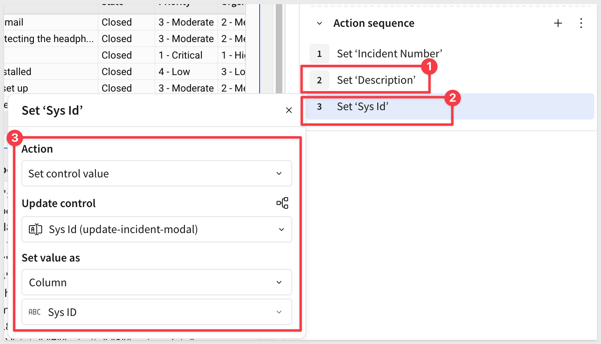

Add a fourth action to open the `update-incident-modal`:

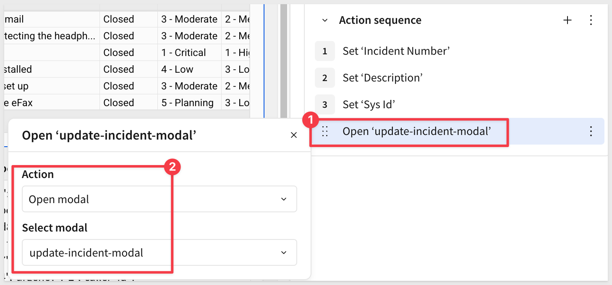

### Configure modal to apply the change in incident state

Open the `update-incident-modal` page. 

Configure the `Update Incident` button actions to call the `ServiceNow - Update Incident` API connector:

1. Click the button's `Actions` menu
2. Select `Add Action`
3. Choose `Call API`

Configure the API action:

1. **API Connector**: `ServiceNow - Update Incident`
2. **Parameters**:
   - `sys_id`: type = `Control`, value = `Sys Id (update-incident-modal)`
   - `newState`: type = `Formula`, value = `Number([modal-new-state])`

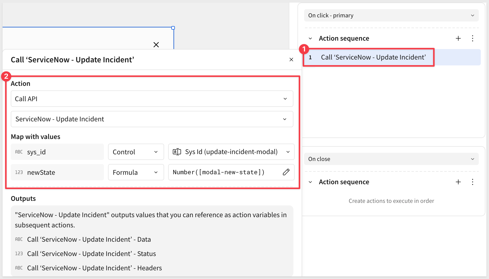

<aside class="negative">
<strong>NOTE:</strong><br> We use the <code>Number()</code> function for <code>newState</code> because the list control value is text, but the ServiceNow API expects a numeric state code.
</aside>

3. Click `Add Action` (add a second action)
4. Choose `Call API`

Configure the second action to re-fetch the updated incident list:

- **API Connector**: `ServiceNow - Get Incidents`
- **sysparm_query**: type = `Static value`, value = `""` (empty string — returns all incidents)

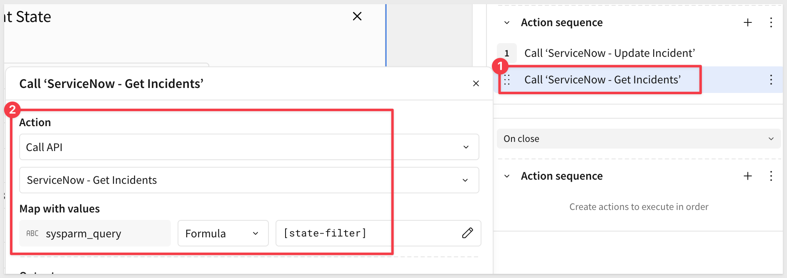

5. Click `Add Action` (add a third action)
6. Choose `Set control value`

Configure the third action to store the fresh response:

- **Update control**: `raw-response (Controls)`
- **Set value as**: `Action variable`
- **Variable**: `Data` (from Call ServiceNow - Get Incidents)

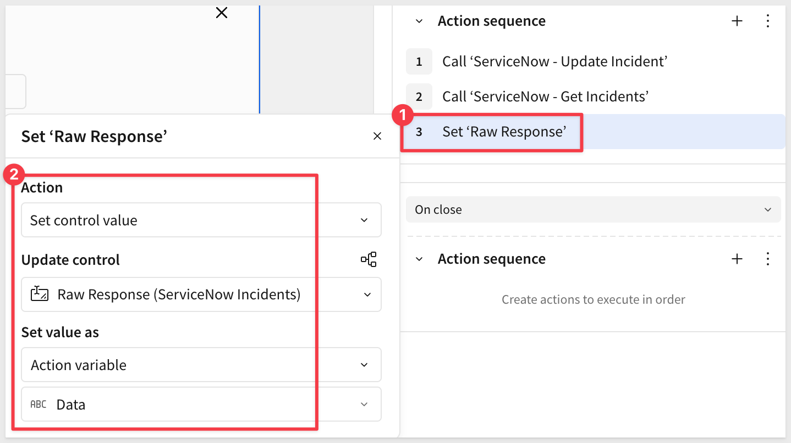

7. Click `Add Action` (add a fourth action)
8. Choose `Run Python element` > `Code (ServiceNow Incidents)`:
   - This parses the fresh JSON response into the table

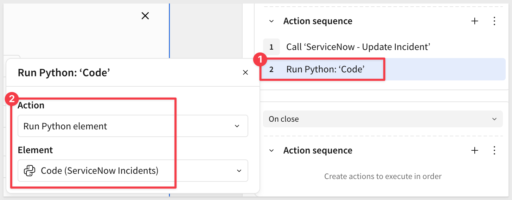

9. Click `Add Action` (add a fifth action)
10. Choose `Close Modal`

<aside class="positive">
<strong>ACTION SEQUENCE:</strong><br> The button executes five actions in order: (1) PATCH the incident state in ServiceNow, (2) GET the updated incident list, (3) Store the fresh response in the raw-response control, (4) Run the Python element to parse fresh data into the table, (5) Close the modal. This ensures users see the updated state immediately after submitting.
</aside>

**Step 12: Test the Update Workflow**

Return to the `ServiceNow Incidents` page.

1. Click the `Load ServiceNow Incidents` button to load fresh data
2. Click on any incident row in the table (perhaps sort the table on the `Number` column and work with the first record...)
3. The modal should open showing the incident details:

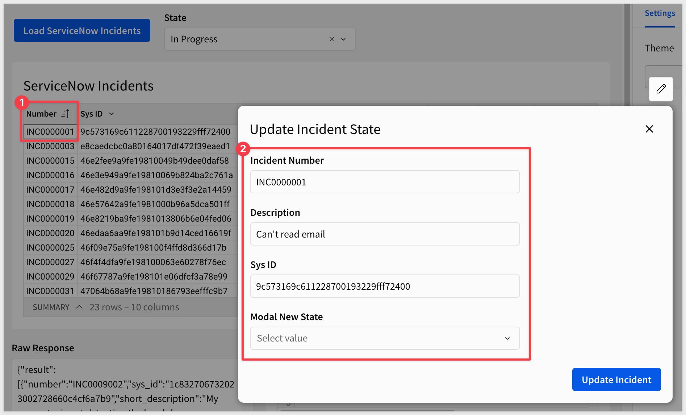

4. Select `On Hold` or `In Progress` as the new state — note the current state first so you can verify the change
5. Click `Update Incident`


The modal should close, and the table should refresh showing the updated state.

For example, if we change `INC0000001` from `In Progress` to `On Hold` in Sigma, we can see the result in Servicenow:

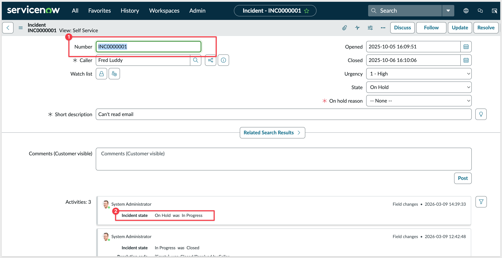

<aside class="negative">
<strong>IMPORTANT - Resolved and Closed states:</strong><br> ServiceNow business rules require additional fields (<code>close_code</code> and <code>close_notes</code>) when transitioning to <code>Resolved</code> or <code>Closed</code>. Without them, the PATCH request returns success but the state does not actually change. 

For this QuickStart, test with simpler transitions such as <code>New</code> → <code>In Progress</code> or <code>In Progress</code> → <code>On Hold</code>.
</aside>

<aside class="negative">
<strong>TROUBLESHOOTING - "No Record found" error in Raw Response:</strong><br> If you see a ServiceNow "No Record found" error after clicking Update Incident, the <code>sys_id</code> value is not being passed correctly to the PATCH request. Verify that the row-click action on the <code>Number</code> column is setting <code>modal-sys-id</code> to the <code>Sys ID</code> column value. You can confirm by opening the modal and checking whether the Sys ID field is populated before submitting.
</aside>

We now have:
- A complete write-back workflow using PATCH requests
- Interactive modal for updating incident states
- Action sequences that update ServiceNow and refresh Sigma data
- Bidirectional sync between Sigma and ServiceNow
- Real-time verification of changes in both systems


<!-- END OF SECTION-->

## What We've Covered
Duration: 5

In about an hour, you built a complete bidirectional ServiceNow integration—querying live incidents with dynamic state filters, parsing nested JSON responses with Python, and updating incident states directly in ServiceNow through an interactive modal—all without writing backend code or managing a single server.

What used to require a dedicated integration layer, ETL pipelines, and ongoing infrastructure maintenance is now a Sigma workbook. Sigma's API Actions handle the authentication, parameter passing, and response handling, so you can focus on the workflow rather than the plumbing.

The pattern you built here isn't limited to ServiceNow. Any SaaS platform with a REST API and Basic Authentication support—Zendesk, JIRA, GitHub, Freshservice, PagerDuty—can be integrated the same way. Query live data, surface it in Sigma, let users act on it, and write changes back. No middleware, no replication, no custom UI.

For IT and operations teams, this changes what's possible. Analysts who previously needed engineering support to build operational tooling can now do it themselves. Instead of exporting data to spreadsheets and manually updating systems, the workflow lives in Sigma—where the data already is.

Sigma isn't just a place to report on what happened. With API Actions, it becomes the place where your team takes action on what's happening right now.

**Additional Resource Links**

[Blog](https://www.sigmacomputing.com/blog/)<br>
[Community](https://community.sigmacomputing.com/)<br>
[Help Center](https://help.sigmacomputing.com/hc/en-us)<br>
[QuickStarts](https://quickstarts.sigmacomputing.com/)<br>

Be sure to check out all the latest developments at [Sigma's First Friday Feature page!](https://quickstarts.sigmacomputing.com/firstfridayfeatures/)
<br>

[](https://twitter.com/sigmacomputing)&emsp;
[](https://www.linkedin.com/company/sigmacomputing)&emsp;
[](https://www.facebook.com/sigmacomputing)


<!-- END OF WHAT WE COVERED -->
<!-- END OF QUICKSTART -->
