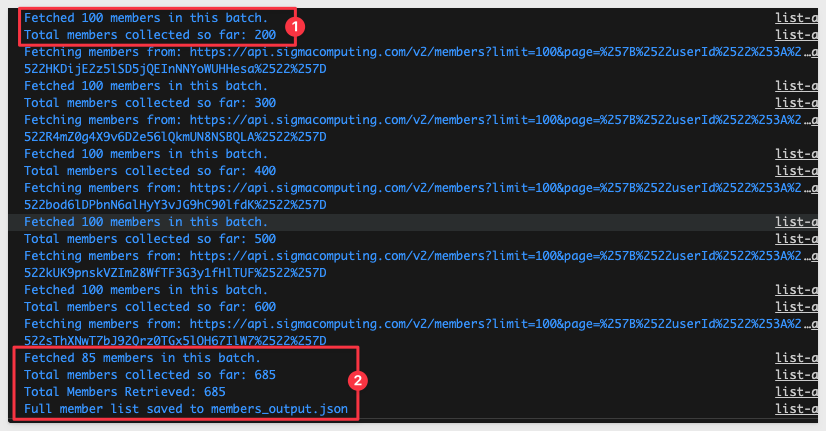

author: pballai
id: developers_api_code_samples
summary: developers_api_code_samples
categories: Developers
environments: web
status: published
feedback link: https://github.com/sigmacomputing/sigmaquickstarts/issues
tags: default
lastUpdated: 2024-11-20

# Sigma REST API Recipes

## Overview 
Duration: 5 

This QuickStart is designed to support Sigma's [API Code Samples](https://help.sigmacomputing.com/recipes) and will demonstrate some common operations that customers may use the REST API for.

The actual code shown is available in Sigma's [quickstart-public git repository](https://github.com/sigmacomputing/quickstarts-public)

All code samples provided here are based on JavaScript.

<aside class="postive">
<strong>IMPORTANT:</strong><br> The methods presented here are in alphabetical order to align with the recipes webpage. If you don't see what you are looking for right away, scroll down the QuickStart page.
</aside>

<aside class="positive">
<strong>IMPORTANT:</strong><br> Some screens in Sigma may appear slightly different from those shown in QuickStarts. This is because Sigma is continuously adding and enhancing functionality. Rest assured, Sigma’s intuitive interface ensures that any differences will not prevent you from successfully completing any QuickStart.
</aside>

For more information on Sigma's product release strategy, see [Sigma product releases.](https://help.sigmacomputing.com/docs/sigma-product-releases)

### Target Audience
Developers who are evaluating or working with Sigma's REST API. 

### Prerequisites

<ul>
  <li>A computer with a current browser. It does not matter which browser you want to use.</li>
  <li>Administrative access to your Sigma environment.</li>
  <li>Some familiarity with Sigma is assumed. Not all steps will be shown as the basics are assumed to be understood.</li>
  <li>A development environment of choice. We will demonstrate with Microsoft VSCode and related extensions</li>
</ul>

<aside class="postive">
<strong>IMPORTANT:</strong><br> Sigma recommends that you use non-production resources when doing QuickStarts.
</aside>

<button>[Sigma Free Trial](https://www.sigmacomputing.com/free-trial/)</button>

## Environment Setup
Duration: 5 

### Create Sigma Project Folder

Create a new folder on your local computer called `Sigma_QuickStart_Public_Repo`. It does not matter where, as long as you can navigate to it easily.

### Source Code Editor - VSCode 

For this QuickStart, we will demonstrate using Visual Studio Code (VSCode), but you may use any IDE you prefer. 

VSCode, is a source-code editor developed by Microsoft for Windows, Linux and macOS. Features include support for debugging, syntax highlighting, intelligent code completion, snippets, code refactoring, and embedded Git.

[Install VSCode from Microsoft's download site.](https://code.visualstudio.com/download)

Run the installation with all defaults.

Open VSCode and make sure it loads without error and open the folder `Sigma_QuickStart_Public_Repo` we created earlier:


### Runtime Environment - Node.js
Duration: 20

While developers can use any language to communicate with the Sigma REST API, we will use the popular framework [Node.js. ](https://nodejs.org/en) for our examples.

Node.js (Node) is an open-source, cross-platform, back-end JavaScript runtime environment that runs on a JavaScript engine and executes JavaScript plaintext outside a web browser, which was designed to build scalable network applications.
 
[Download and install Node.js from here:](https://Nodejs.org/en/download/)

Use the LTS (long term supported) version appropriate for your operating system.

Run the installer selecting all the defaults. **We do not need to specify our project folder for this installation.**

This will install both `Node` and the `Node package manager` (which manages optional Node components, which add more functionality). 

The package manager is abbreviated to `npm` when running commands.

You can verify your installation using VSCode's built-in Terminal:


**Run the command:**
```code
node -v
```

This should return the version number as below:


<aside class="negative">
<strong>NOTE:</strong><br> You version number will likely vary from what is shown in the screenshot, based on when you installed Node.
</aside>

You can leave the terminal session open for now.

### Git Repository

To save you time, we've stored all the necessary project files in Git. Simply download them using git clone and explore the recipes that interest you.

In terminal, navigate to the desired directory where we want to clone the repo folder into.

For example:
```code
cd {/path/to/your/directory}
```

Execute the terminal command:
```code
git init
```

Add the remote repository as the origin:
```code
git remote add -f origin https://github.com/sigmacomputing/quickstarts-public.git
```

Enable sparse checkout:
```code
git config core.sparseCheckout true
```

Specify the folder you want to clone by adding it to the sparse-checkout configuration:
```code
echo "sigma-api-recipes" > .git/info/sparse-checkout
```

At this point, we have run each command and not seen any errors:


Finally, pull the specified folder from the repository:
```code
git pull origin main
```

We can now see the cloned project folder:


Run the command:
```code
npm install
```

This will automatically install the project dependencies we use in the recipes. 

You can verify that the dependencies (at the time of this QuickStart) were installed by running:
```code
npm list
```


### Environment Variables
We need to update the file that stores our environment variables. 

First, you will need to provide the values for `ClientID`, `Secret`, `Base` and `AuthURL`. 

<!-- [Instructions can be found in the API Swagger if needed.](https://help.sigmacomputing.com/reference/explanation) -->

This file keeps our keys out of our scripts and also contains other variables we may want to change in different use-cases:


Replace the placeholders for `YourClientID` and `YourAPISecret`. The values for auth and baseURL are for Sigma instances hosted in AWS-US. You may need to change these based on where your instance is running. 

For more information on the supported API instances, see [Identify your API request URL.](https://help.sigmacomputing.com/reference/get-started-sigma-api#identify-your-api-request-url)

`Save` the file.

<aside class="positive">
<strong>IMPORTANT:</strong><br> The next section named "Authentication - REQUIRED" is a must read. Authentication is required in all use cases.
</aside>


<!-- END OF SECTION-->

## Authentication - REQUIRED
Duration: 5 

This section demonstrates the code that was provided on the `API Code Samples` > `Authentication: Get Access Token` page, [located here.](https://docs.sigmacomputing.com/api/v2/#auth)

### Description
This script retrieves a bearer token from the Sigma API using client credentials authentication. It extracts required credentials from environment variables, sends a POST request to the authentication endpoint, and logs the obtained token. The function getBearerToken can be imported into other scripts for accessing protected resources.

This actual javascript is available as part of the git repository mentioned earlier or is available to copy directly from our API Code Samples site under: [Authentication: Get Access Token](https://help.sigmacomputing.com/reference/token) and returns a bearer token (token).
It also exports a Javascript function to request a bearer token (token) each time it is called. 

<aside class="positive">
<strong>IMPORTANT:</strong><br> The token is valid for 3599 seconds (just under one hour) and needs to be refreshed. Our Javascript function will handle that.
</aside>
`
In the project root directory, open the file `get-access-token.js` and review it's contents. Each section is commented so it can be understood. 

Start the VSCode debugger against this code by pressing `F5` on your keyboard.

If prompted by VSCode to select a debugger, select `Node.js`.

The VSCode debugger console will show this API response if the .env variables are configured correctly:


The script is configured to run standalone, as well as export a function that we can call from other scripts too. 

This is why we show the bearer token twice in the response. Other scripts that call this one, will only show the token one time in the console.

The ability to run it standalone is only for convenience, so that we can verify it obtains a token.

We can now move on to use cases, leveraging the `getBearerToken` function:


<aside class="positive">
<strong>IMPORTANT:</strong><br> All the recipes fetch a bearer token for authentication for efficient API requests.
</aside>


<!-- END OF SECTION-->

## Connections - List All
Duration: 5 

This section demonstrates the code that was provided on the `API Code Samples` > `Connections: List all` page, [located here.](https://help.sigmacomputing.com/recipes/connections-list-all)

<aside class="positive">
<strong>IMPORTANT:</strong><br> This script will call the get-access-token > getBearerToken function to get a new/refreshed token automatically so there is no need to do anything else, assuming you have completed the section of this QuickStart "Authentication - REQUIRED" and ensured your .env file is configured correctly.
</aside>

### Description
This script lists all connections in a specific Sigma instance, based on cloud provider where Sigma is deployed and the API keys used. 

### Running the Script

Open the file `list_all_connections.js` in the connections folder:

Each code block is commented to explain what operations are being performed.

Open the `env` file and provide a `CONNECTIONID` to use for the API call.

From the `list_all_connections.js` file, press `F5` to run the script with VSCode's debugger. 

The expected response is:


<!-- END OF SECTION-->

## Connections - Sync All Tables in Schema
Duration: 5 

This section demonstrates the code that was provided on the `API Code Samples` > `Workbook: List All` page, [located here.](https://help.sigmacomputing.com/recipes/connections-sync-all-tables-in-schema-javascript)

<aside class="positive">
<strong>IMPORTANT:</strong><br> This script will call the get-access-token > getBearerToken function to get a new/refreshed token automatically so there is no need to do anything else, assuming you have completed the section of this QuickStart "Authentication - REQUIRED" and ensured your .env file is configured correctly.
</aside>

### Description
This script automates the synchronization of tables within a schema that is specified in the `.env` file.

The script resolves the schema's `inodeId` based on the provided `SYNC_PATH` in the .env file, lists all tables within the schema, and constructs full paths for each table. 

Finally, it syncs each table individually using the full path, ensuring that the process dynamically handles all tables within the specified schema.

### Running the Script

Open the file `sync_schema.js` in the connections folder:

Each code block is commented to explain what operations are being performed.

Open the `env` file and provide either a `CONNECTIONID` and `SYNC_PATH` to use for the API call.

From the `sync_schema.js` file, press `F5` to run the script with VSCode's debugger. 

The expected response is:


<!-- END OF SECTION-->

## Embedding: Generate Embeds Path for Member - All Workbooks
Duration: 20

This section demonstrates the code that was provided on the `API Code Samples` > `Workbook: Copy Workbook to Member "My Documents" Folder` page, [located here.](https://help.sigmacomputing.com/recipes/embedding-generate-embed-path-for-member-all-workbooks)

<aside class="positive">
<strong>IMPORTANT:</strong><br> This script will call the get-access-token > getBearerToken function to get a new/refreshed token automatically so there is no need to do anything else, assuming you have completed the section of this QuickStart "Authentication - REQUIRED" and ensured your .env file is configured correctly.
</aside>

### Description
This script fetches a list of workbooks available to a specific member from the API, retrieves the workbook name, and constructs embed URLs for each workbook. 

Here's a summary of its functionality:

 <ul>
      <li>Loads environment variables from a specific .env file, including the base URL for the Sigma API and the unique identifier of the member.</li>
      <li>Imports necessary modules, such as the function to obtain a bearer token and Axios for making HTTP requests.</li>
      <li>The fetchWorkbooks function is defined to fetch the list of available workbooks for a given member ID. It constructs the API URL, sends a GET request, and returns an array of workbook details (IDs and names).</li>
      <li>The main function main manages the overall workflow. It retrieves the bearer token, fetches the workbooks using the member ID and access token, and constructs embed URLs for each workbook.</li>
      <li>If workbooks are found, it logs each workbook's name and its corresponding embed URL.</li>
      <li> If no workbooks are available, it logs a message indicating that there are no workbooks to process or embed.</li>
      <li></li>
 </ul>

The script can be executed directly, and the main function is exported for use in other modules if needed.

### Running the Script
Open the file `generate_workbook_embed_path.js` in the `embedding` folder:

Each code block is commented to explain what operations are being performed. 

Set a value for `MEMBERID` in `.env` to reflect which member's workbooks to generate embed urls for.

It does not matter which member you want to use for this testing, as long as they have some workbooks they created or have been shared with.

Press `F5` to run the script with VSCode's debugger. 

The expected response is:


<!-- END OF SECTION-->

## Members: Bulk Deactivate
Duration: 20

This script identifies users in Sigma matching a specified name pattern, retrieves their status, and deactivates them by marking them as inactive using the Sigma API.

It can be used to bulk deactivate users through the use of a regex pattern match against the user's `name`. 

<aside class="positive">
<strong>IMPORTANT:</strong><br> This script will call the get-access-token > getBearerToken function to get a new/refreshed token automatically so there is no need to do anything else, assuming you have completed the section of this QuickStart "Authentication - REQUIRED" and ensured your .env file is configured correctly.
</aside>

### Description
Here's a summary of what the code does:

 <ul>
      <li><strong>Load Environment Variables: </strong>Loads configuration details (e.g., base URL, user name pattern, and API keys) from a .env file.</li>
      <li><strong>Obtain a Bearer Token: </strong>Authenticates with the Sigma API to retrieve a bearer token for authorization.</li>
      <li><strong>List Users: </strong> Fetches all users (both active and inactive) from the Sigma API and filters them based on a regex pattern for their names (first name and last name combined).</li>
      <li><strong>Fetch User Status: </strong>For each filtered user, retrieves additional details, including their isInactive status, to confirm if they are already deactivated.</li>
      <li><strong>Deactivate Users: </strong>If a user is active, sends a request to the Sigma API to mark them as inactive using their memberId.</li>
       <li><strong>Log Results: </strong>Logs the status of each operation (e.g., successful deactivations or errors) for monitoring and debugging purposes.</li>      
</ul>

The following demonstrates the code that was provided on the `API Code Samples` > `Members: Bulk Deactivate` page, [located here.](https://help.sigmacomputing.com/recipes/members-bulk-deactivate)

### Running the Script
Open the file `bulk-deactivate.js` in the `members` folder:

Each code block is commented to explain what operations are being performed. 

Update the `.env` file, providing a `USER_NAME_PATTERN` that will be used to identify members that are to be deleted.

For example:


Press `F5` to run the script with VSCode's debugger. 

The expected response is:


Confirm the users have been deactivated in Sigma:


<!-- END OF SECTION-->

## Members: Change email address
Duration: 20

This section demonstrates the code that was provided on the `API Code Samples` > `Members: Change Email Address` page, [located here.](https://help.sigmacomputing.com/recipes/members-change-email-address-1)

<aside class="positive">
<strong>IMPORTANT:</strong><br> This script will call the get-access-token > getBearerToken function to get a new/refreshed token automatically so there is no need to do anything else, assuming you have completed the section of this QuickStart "Authentication - REQUIRED" and ensured your .env file is configured correctly.
</aside>

### Description
This script automates the process of changing a member's email address in the Sigma. Here's a summary of what the code does:

 <ul>
      <li><strong>Environment Setup:</strong> Loads necessary environment variables from a .env file, including the new email address (EMAIL) to assign and the unique identifier of the member whose email address will be updated (MEMBERID).</li>
      <li><strong>Authentication:</strong> Obtains a bearer token required for authentication with the Sigma API using the getBearerToken function.
</li>
      <li><strong>HTTP Requests:</strong> It utilizes Axios for making HTTP requests to the Sigma API.</li>
      <li><strong>Update Member's Email Address:</strong> Defines an asynchronous function (updateMemberAccountType) to update the member's email address. Within this function, it constructs the request URL using the base URL and member ID, then makes a PATCH request to the API to update the member's email address. It logs the constructed URL before sending the request.</li>
      <li><strong>Error Handling:</strong> Throughout the process, the script handles potential errors gracefully, logging error messages if any step fails.</li>
      <li><strong>Execution:</strong> Executes the updateMemberAccountType function to initiate the process of updating the member's email address.</li>
 </ul>

### Running the Script
Open the file `change-email.js` in the `members` folder:

Each code block is commented to explain what operations are being performed. 

Select a test user from Sigma and place their email address in the `.env` file, commented out. Replace the active email address in `.env`with a variation. 

For example:


Press `F5` to run the script with VSCode's debugger. 

The expected response is:


Confirm the new email has been set in Sigma:


You can revert the email by editing the `.env` file and rerunning the script's debugger.


<!-- END OF SECTION-->

## Members: Create New
Duration: 20

This section demonstrates the code that was provided on the `API Code Samples` > `Members: Create New` page, [located here.](https://help.sigmacomputing.com/recipes/members-create-new-javascript)

<aside class="positive">
<strong>IMPORTANT:</strong><br> This script will call the get-access-token > getBearerToken function to get a new/refreshed token automatically so there is no need to do anything else, assuming you have completed the section of this QuickStart "Authentication - REQUIRED" and ensured your .env file is configured correctly.
</aside>

### Description
This script automates the process of creating a new member in Sigma. Here's a summary of what the code does:

<ul>
   <li><strong>Environment Setup:</strong> Loads necessary environment variables from a `.env` file, including the base URL (`baseURL`), base email (`EMAIL`), and the new member's details such as first name, last name, and member type.</li>
   <li><strong>Authentication:</strong> Obtains a bearer token required for authentication with the Sigma API using the `getBearerToken` function.</li>
   <li><strong>Dynamic Email Generation:</strong> Dynamically generates a unique email address for the new member by appending a compact timestamp to the base email (format: `baseEmail+mmddhhmm@example.com`). This ensures the creation of distinct accounts during testing.</li>
   <li><strong>Member Existence Check:</strong> Uses the Sigma API's `/members` endpoint with the `search` parameter to verify whether the email already exists before attempting to create a new member.</li>
   <li><strong>HTTP Requests:</strong> Utilizes Axios for making HTTP requests to the Sigma API. Sends a `POST` request to the `/members` endpoint with the new member's details and logs the full API response for transparency.</li>
   <li><strong>Log Details:</strong> Logs the constructed API request URL, the success response from the Sigma API (including member ID and account type), and the full response body for better understanding.</li>
   <li><strong>Error Handling:</strong> Handles potential errors gracefully, logging detailed error messages and responses if any step fails.</li>
   <li><strong>Execution:</strong> Executes the `addNewMember` function if the script is run directly to initiate the process of creating a new member.</li>
</ul>

### Running the Script

Open the file `create-new.js` in the members folder:

Each code block is commented to explain what operations are being performed.

Open the `env` file and update the following required values:


From the `create-new.js` file, press `F5` to run the script with VSCode's debugger. 

The expected response is:


<aside class="positive">
<strong>IMPORTANT:</strong><br> The new member will receive an automated welcome email with instructions. They will also appear in the portal under Administration > Users > Pending Invitations until they confirm their account via the email.
</aside>


<!-- END OF SECTION-->

## Members: Get Member Details
Duration: 20

This section demonstrates the code that was provided on the `API Code Samples` > `Members: Get Member Details` page, [located here.](https://help.sigmacomputing.com/recipes/member-get-member-details-javascript)

<aside class="positive">
<strong>IMPORTANT:</strong><br> This script will call the get-access-token > getBearerToken function to get a new/refreshed token automatically so there is no need to do anything else, assuming you have completed the section of this QuickStart "Authentication - REQUIRED" and ensured your .env file is configured correctly.
</aside>

### Description
This script all member details from Sigma, for a specified memberID. Here's a summary of what the code does:

<ul>
   <li><strong>Environment Setup:</strong> Loads necessary environment variables from a `.env` file, including the base URL (`baseURL`), the member ID (`MEMBERID`), and optionally an email address (`EMAIL`) for member lookup.</li>
   <li><strong>Authentication:</strong> Obtains a bearer token required for authentication with the Sigma API using the `getBearerToken` function.</li>
   <li><strong>Input Validation:</strong> Determines whether to use `MEMBERID` or `EMAIL` for the member lookup. Logs an error and exits if neither is provided.</li>
   <li><strong>Member Lookup:</strong> 
      <ul>
         <li>If `MEMBERID` is provided, the script queries the Sigma API's `/members/{memberId}` endpoint to retrieve the member details.</li>
         <li>If `EMAIL` is provided, the script uses the `/members` endpoint with the `search` query parameter to locate the member.</li>
      </ul>
   </li>
   <li><strong>HTTP Requests:</strong> Utilizes Axios for making HTTP requests to the Sigma API. Logs the full API response for transparency and better understanding.</li>
   <li><strong>Log Details:</strong> Logs the constructed API request URL and the member details retrieved from the Sigma API in a readable JSON format.</li>
   <li><strong>Error Handling:</strong> Handles potential errors gracefully, logging detailed error messages and responses if any step fails.</li>
   <li><strong>Execution:</strong> Executes the `getMemberDetails` function if the script is run directly to retrieve the member details based on the input provided.</li>
</ul>

### Running the Script

Open the file `get-member-details.js` in the members folder:

Each code block is commented to explain what operations are being performed.

Open the `env` file and provide either a `MEMBERID` or `EMAIL` to use for the API call.

From the `create-new.js` file, press `F5` to run the script with VSCode's debugger. 

The expected response is:


<!-- END OF SECTION-->

## Members: List All
Duration: 20

### Description

This recipe calls the `Members` > `Get` endpoint, [found here.](https://docs.sigmacomputing.com/api/v2/#get-/v2/members)

This section demonstrates the code that was provided on the `API Code Samples` > `Member`> `list-all` page, [located here.](https://help.sigmacomputing.com/recipes/members-list-all)

This script retrieves all members from the Sigma API by making GET requests with pagination until all members are fetched. It first obtains a bearer token for authentication, then iterates through each page of member data, concatenating the results into an array. Finally, it writes the fetched members to file in JSON format. The output file is called `members_output.json`.

Errors during the process are logged with detailed error messages

<aside class="positive">
<strong>IMPORTANT:</strong><br> This script will call the get-access-token > getBearerToken function to get a new/refreshed token automatically so there is no need to do anything else, assuming you have completed the section of this QuickStart "Authentication - REQUIRED" and ensured your .env file is configured correctly.
</aside>

### Running the Script
Open the file `list-all.js` in the `members` folder:


Each code block is commented to explain what operations are being performed. 

Press `F5` to run the script with VSCode's debugger. 

The expected response is:




<!-- END OF SECTION-->

## Members: Onboarding
Duration: 20

This section demonstrates the common steps to add a new member (user) to Sigma, via the API. 

### Description
This script creates a new member in Sigma by sending a POST request to the API endpoint. It dynamically generates a unique email address for the new member to ensure uniqueness during testing. 

The script utilizes environment variables to specify the base URL, email, first name, last name, and member type. 

Upon successful creation, it logs the newly added member's details, and in case of an error, it logs the error message.

We will break each step into it's own script and once each step is verified to work, we will run them as one step.

The steps are:
1: Create a unique, new member
2: Create a new Workspace for the member
3: Grant permission to the workspace to the new member
4: Add the member to a team
5: Grant permission to a connection (data) to the member

In each section, we export the script to a Javascript function so that when we are done, we can put it all together to run as one script.

### Required Body Parameters
Open the `.env` file and add the required parameters. You will need to provide different values as shown below:
```code
EMAIL={your example email}
NEW_MEMBER_FIRST_NAME=API
NEW_MEMBER_LAST_NAME=Generated
NEW_MEMBER_TYPE=Viewer

WORKSPACEID=
TEAMID=
CONNECTIONID=
```

<aside class="positive">
<strong>IMPORTANT:</strong><br> For email, we use the value provided in "EMAIL" as a base address. The script is designed to make the address unique, automatically by leveraging the Gmail alias feature. In this way, we always are creating a new member while testing.<br>

We recommend you use the UI to delete these members later, if desired. In a Sigma trial environment, this cleanup is not required.  
</aside>


Save the changes.

### Running the "create-new.js" script

Open the file `create-new.js` in the `members` folder:

Each code block is commented to explain what operations are being performed. 

Note the line of code that uses the [Javascript split function](https://developer.mozilla.org/en-US/docs/Web/JavaScript/Reference/Global_Objects/String/split) to ensure that the members's email address is unique:
```code
const newMemberEmail = `${baseEmail.split('@')[0]}+${new Date().getTime()}@${baseEmail.split('@')[1]}`;
```

Press `F5` to run the script with VSCode's debugger. 

The expected response is:


Copy the `memberId` provided in the response. We will use that in the next step.

Checking in the UI, we can see the new member has been added. This member does not have a `Workspace`, the rights to one, or rights to any data (Connections). We will do each of these in steps first. Then will will put it all together in a script we will call `Member: Onboarding"


### Running the "create-workspace.js" script

Update `.env` with the `memmberId` we received in the `create-new` script response:


Open the file `create-workspace.js` in the `members` folder.

Each code block is commented to explain what operations are being performed. 

Press `F5` to run the script with VSCode's debugger. 

The expected response is:


Copy the `WorkspaceId` in the response. We will use that in the next step.

Checking in the Sigma UI we can see the new Workspace:


### Running the "create-workspace-permission.js" script

Open the file `.env` and update the value for `WORKSPACEID` that we received from the `create-workspace.js` script

Save the change.

Open the file `create-workspace-permission.js` in the `members` folder.

Each code block is commented to explain what operations are being performed. 

<aside class="negative">
<strong>NOTE:</strong><br> We give this member "View" permission to the workspace because we created the member with "Viewer" rights earlier. This can be adjusted to suit whatever use case is required.
</aside>

Press `F5` to run the script with VSCode's debugger. 

The expected response is:
```code
URL sent to Sigma: https://aws-api.sigmacomputing.com/v2/workspaces/678ba3ea-00c8-4702-871e-6418279e9796/grants
New workspace permission added successfully: {}
```

Checking in the Sigma UI we can check the Workspace sharing permissions:


### Running the "add-member-to-team" script 

For this script we will need to have a `TeamId` is Sigma that we want to assign the new member to.

We already have a script we built in section 5, and we can use that to update the member's team assignment.  We can grab the TeamId for one from the UI for this demonstration:


Open the file `.env` and update the value for `TEAMID`, using your value.

Save the change.

Open the file `add-member-to-team.js` in the `members` folder.

Each code block is commented to explain what operations are being performed. 

Press `F5` to run the script with VSCode's debugger. 

The expected response is:
```code
URL sent to Sigma: https://aws-api.sigmacomputing.com/v2/teams/25d48b2e-b36b-4db2-98a9-2c474f4144da/members
Member successfully added to team: {}
```

Checking in the Sigma UI we can check the Workspace sharing permissions:


### Running the "create-connection-permission.js" script

For this script we will need to have a Connection is Sigma that we want to grant the new member permission to use. 

There is an endpoint to [GET all connections](https://docs.sigmacomputing.com/api/v2/#get-/v2/connections), but we can also just grab the connectionId for one from the UI for this demonstration:


The connection shown above has no grants yet and the connectionId is in the URL (#2 in the image).

Open the file `.env` and update the value for `CONNECTIONID`, using your value.

Save the change.

Open the file `create-connection-permission.js` in the `members` folder.

Each code block is commented to explain what operations are being performed. 

<aside class="negative">
<strong>NOTE:</strong><br> We give this member "View" permission to the workspace because we created the member with "Viewer" rights earlier. This can be adjusted to suit whatever use case is required.
</aside>

Press `F5` to run the script with VSCode's debugger. 

The expected response is:
```code
URL sent to Sigma: https://aws-api.sigmacomputing.com/v2/workspaces/678ba3ea-00c8-4702-871e-6418279e9796/grants
New workspace permission added successfully: {}
```

Checking in the Sigma UI (from `Home` > `Connections`) we see our new member has connection permission:


### Putting it all together

Now that each step is working as expected, we can create a master script that calls each step's module and just one run script to onboard a new member.

We are faced with a challenge in that we do not know the memberId until the first script is run. Previously, we hard-coded this value and for the sake of not changing any of the other scripts, we will manually run the `create-new.js` script and then run all the other scripts from one master script. 

This method strikes a balance between demonstrating individual script functions and showing how they can be integrated into a larger workflow with a simple manual step bridging the gap. 

<aside class="negative">
<strong>NOTE:</strong><br> Recall that our new member script automatically creates a unique email address, so now changes are required to .env file. 
</aside>

Open the file `create-new.js` in the `members` folder:

Press `F5` to run the script with VSCode's debugger. 

Copy the `memberId` provided in the response, and update the `MEMBERID` with this new value.

Next, open the file `master-script.js` and press `F5` to run the script with VSCode's debugger. 

Each code block is commented to explain what operations are being performed. 

<aside class="negative">
<strong>NOTE:</strong><br> We will also reuse the TeamId and ConnectionId from the .env file, assuming that all new members would go use these. In practice, these values could also be made dynamic from some other system of record.  
</aside>

Press `F5` to run the script with VSCode's debugger. 

The expected response is:
```code
URL sent to Sigma: https://aws-api.sigmacomputing.com/v2/workspaces/678ba3ea-00c8-4702-871e-6418279e9796/grants
New workspace permission added successfully: {}
Connection permissions granted successfully.
Onboarding process completed successfully.
```

Verify the new member is created in the UI, has workspace permission, is a member of the expected team, and has connection permission.


<!-- END OF SECTION-->

## Members: Recent Workbook
Duration: 20

This section demonstrates the code that was provided on the `API Code Samples` > `Member: Recent Workbook` page, [located here.](https://docs.sigmacomputing.com/api/v2/#get-/v2/members/-memberId-/files/recents)

<aside class="positive">
<strong>IMPORTANT:</strong><br> This script will call the get-access-token > getBearerToken function to get a new/refreshed token automatically so there is no need to do anything else, assuming you have completed the section of this QuickStart "Authentication - REQUIRED" and ensured your .env file is configured correctly.
</aside>

### Description
This script fetches recent documents and folders for a specified member from the Sigma API. It retrieves a bearer token for authentication, constructs the API endpoint URL, and makes a GET request to fetch the recent items. The response is then processed to extract relevant information and sorted by the last interaction date in descending order before logging the results.
In this use case, we want to return a list of the Workbooks (by name), the permission and when they last accessed for each Workbook, ordered by most recent first.

### Running the Script
Open the file called `.env` and ensure that the memberID is set for someone who has accessed Workbooks in your Sigma instance. In a trial environment, pick someone who is very active or yourself if that is the case. As long as there is activity, it does not matter otherwise.

If you are not sure how to obtain a memberID, review the section called `Create Test Member` in the step called `Member: Update`.

Open the file called `recent-workbooks.js` in the `members` folder.

Each code block is commented to explain what operations are being performed. 

Press `F5` to run the script with VSCode's debugger. 

The expected response is:


<!-- END OF SECTION-->

## Members: Update
Duration: 20

This section demonstrates the code that was provided on the `API Code Samples` > `Member: Update` page, [located here.](https://docs.sigmacomputing.com/api/v2/#patch-/v2/members/-memberId-)

### Description
This script updates the account type of a member on the Sigma platform by sending a PATCH request to the API with the new member type. It retrieves the necessary information such as the member ID and new member type from environment variables and constructs the request URL accordingly. Finally, it makes the API call to update the member's account type.

<aside class="positive">
<strong>IMPORTANT:</strong><br> This script will call the get-access-token > getBearerToken function to get a new/refreshed token automatically so there is no need to do anything else, assuming you have completed the section of this QuickStart "Authentication - REQUIRED" and ensured your .env file is configured correctly.
</aside>

### Create Test Member
Let's create new member in Sigma to test with. 

<aside class="negative">
<strong>NOTE:</strong><br> We could also do this with the API, but we will use the UI to create a test member. We want to use the UI to verify API changes we make via API too.
</aside>

If you prefer, you can use any non-production user you want, but we recommend creating a test user for this purpose. 

If you are not sure how to create a user (member) in Sigma, [please refer to this documentation.](https://help.sigmacomputing.com/docs/invite-people-to-your-organization).

We created a test user using [Gmail's email alias](https://gmail.googleblog.com/2008/03/2-hidden-ways-to-get-more-from-your.html) feature. 

Our test user is called `sales_rep`.

Make a note of the test user's memberId. Again, we could get this using the API, but in this example, we will just copy it from the URL, when looking at the user's profile from the `Administration` > `People` list:


In this case, the memberId is `KteJXJQfHuei5GxxY9hQOnFZHP91A`. Yours will be different.

Add these values to the .env file we created and save the change.
```code
MEMBER_ID=KteJXJQfHuei5GxxY9hQOnFZHP91A
NEW_MEMBER_TYPE=Creator
```


### Change Test Members' Account Type
Our test user is currently a `Viewer` account type. We want to call the Sigma API endpoint to `Update the specified member` account type to `Creator`.


We will be using the [Update the specified member](https://docs.sigmacomputing.com/api/v2/#patch-/v2/members/-memberId-) endpoint.

### Running the Script
Open the file `update.js` in the `members` folder.

Each code block is commented to explain what operations are being performed. 

Press `F5` to run the script with VSCode's debugger. 

The expected response is:


A quick check against the member in Sigma shows them having the `Creator` account type now:


<!-- END OF SECTION-->

## Teams: Bulk Assign/Remove Members
Duration: 20

This section demonstrates the code that was provided on the `API Code Samples` > `Teams: Bulk Assign Members` page, [located here.](https://help.sigmacomputing.com/recipes/teams-bulk-assign-members-javascript)

<aside class="positive">
<strong>IMPORTANT:</strong><br> This script will call the get-access-token > getBearerToken function to get a new/refreshed token automatically so there is no need to do anything else, assuming you have completed the section of this QuickStart "Authentication - REQUIRED" and ensured your .env file is configured correctly.
</aside>

### Description
This script is designed to bulk assign existing members to a specific team within Sigma Computing's platform, utilizing the members' emails as identifiers. It operates by reading a list of email addresses from a .member-emails file, finding each member's ID through the Sigma API, and then assigning each member to a designated team. 

Here's a summary of how the script works (not including the environmental setup, which has been covered earlier):

**1: Reading Member Emails:**
Reads a list of member emails from a .member-emails file located relative to the script. This file contains the emails of the members to be assigned to the team, separated by commas.

**2: Member ID Lookup:** 
For each email, makes an API request to Sigma's /members endpoint to find the member's ID based on their email. This is necessary because the subsequent API call to assign a member to a team requires the member's ID.

**3:Assigning Members to Team:** 
Once the member ID is obtained, makes another API request to the /teams/{teamId}/members endpoint to add the member to the specified team using the team ID provided in the environment variables.

**4: Error Handling:** 
Includes error handling for various steps of the process, logging any issues encountered during the member lookup or assignment process.

**5: Script Execution:** 
Orchestrates the overall process through a main function that initiates the token retrieval, member processing, and assignment tasks.

### Running the Script
Open the file `bulk-assign-team.js` in the `tables` folder:

Each code block is commented to explain what operations are being performed. 

In this example, we had three emails in the `../member-emails` file that the script will iterate through and add to a team. 

Configure the emails in the file using comma separation. 

The teamId is specified in the .env file.

Press `F5` to run the script with VSCode's debugger. 

The expected response is (showing two members being added in the screenshot):


<aside class="positive">
<strong>IMPORTANT:</strong><br> We have also provided a script for bulk removal of team members. This script is called "bulk-remove-team" and functions the same way, but instead of adding it removes members from a team.
</aside>


<!-- END OF SECTION-->

## Workbook: Copy Workbook to Member "My Documents" Folder
Duration: 20

This section demonstrates the code that was provided on the `API Code Samples` > `Workbook: Copy Workbook to Member "My Documents" Folder` page, [located here.](https://help.sigmacomputing.com/recipes/workbook-copy-workbook-to-member-my-documents-folder-javascript)

<aside class="positive">
<strong>IMPORTANT:</strong><br> This script will call the get-access-token > getBearerToken function to get a new/refreshed token automatically so there is no need to do anything else, assuming you have completed the section of this QuickStart "Authentication - REQUIRED" and ensured your .env file is configured correctly.
</aside>

### Description
This script automates the process of copying a specific workbook for a designated user in Sigma. Here's a breakdown of what the script does:

 <ul>
      <li><strong>Environment Setup:</strong> Loads necessary environment variables from a .env file, including the base URL of the Sigma API, the ID of the workbook to be copied (WORKBOOK_ID), and the ID of the user who will own the copied workbook (MEMBERID).</li>
      <li><strong>Authentication:</strong> It obtains a bearer token required for authentication with the Sigma API using the getBearerToken function.</li>
      <li><strong>Retrieve "My Documents" Folder ID:</strong> Retrieves the ID of the designated user's "My Documents" folder. This folder is where the copied workbook will be placed.</li>
      <li><strong>Copy Workbook:</strong> Defines the necessary payload for copying the workbook, including the name, description, owner ID, and destination folder ID. Then, it sends a POST request to the Sigma API to initiate the workbook copying process.</li>
      <li><strong>Error Handling:</strong> Throughout the process, the script handles potential errors gracefully, logging detailed error messages if any step fails.
</li>
      <li><strong>Execution:</strong> Finally, the script executes the main function, initiating the process of copying the workbook for the designated user. If successful, it logs a success message along with the ID of the copied workbook.</li>
</ul>  

### Running the Script
Open the file `copy-workbook-folder.js` in the `workbooks` folder:

Each code block is commented to explain what operations are being performed. 

Set a value for `WORKBOOK_ID` and `MEMBERID` in `.env` to reflect which member will receive a copy of your workbook. 

It does not matter which workbook you want to use for this testing, as long as it is published.

We need to select a member to use as the "recipient" of this copied workbook. In our case, we selected our QA user. 

<aside class="positive">
<strong>IMPORTANT:</strong><br> Sigma supports administrative user impersonation which is a real time saver when testing changes.
</aside>

By [impersonating](https://help.sigmacomputing.com/docs/impersonate-users) our user, we can see that they only have two folders in `My Documents` at the moment.


We are expecting this API script to place a copy of the workbook in this location, and we use impersonation to verify that.

Press `F5` to run the script with VSCode's debugger. 

The expected response is:


In Sigma, we can see the copied workbook has been created in their `My Documents` folder:


<aside class="negative">
<strong>NOTE:</strong><br> In looking at the last screenshot, we can see that the workbook's owner is set to "Sigma Administrator". This may be intended but if not, the script should be modified to specify a memberId who will own the workbook. The operation that can do this is "files/Update an inode", which allows updating "ownerId" for the specified workbook (inode).
</aside>


<!-- END OF SECTION-->

## Workbook: Export to CSV with Date Range Parameters
Duration: 20

This section demonstrates the code that was provided on the `API Code Samples` > `Workbook: Export to CSV with Date Range Parameters` page, [located here.](https://help.sigmacomputing.com/recipes/workbook-export-to-csv-with-date-range-parameters)

<aside class="positive">
<strong>IMPORTANT:</strong><br> This script will call the get-access-token > getBearerToken function to get a new/refreshed token automatically so there is no need to do anything else, assuming you have completed the section of this QuickStart "Authentication - REQUIRED" and ensured your .env file is configured correctly.
</aside>

### Description
This script facilitates the automation of exporting data from Sigma. Here's a breakdown of its functionality and its potential utility for Sigma customers:

 <ul>
      <li><strong>Initiating Export:</strong> The script first retrieves necessary environment variables from an .env file and initiates an export job in Sigma. It uses Axios to make HTTP POST requests to the Sigma API. Customers can specify the workbook and element from which data should be exported, along with export options like format (e.g., CSV), date filters, and whether to run the export asynchronously.</li>
      <li><strong>Checking Export Readiness:</strong> After initiating the export, the script continuously checks if the export is ready for download. It polls the Sigma API, waiting for the export to complete. This ensures that the script doesn't proceed to download an incomplete export.</li>
      <li><strong>Downloading Export:</strong> Once the export is ready, the script downloads the exported data. It handles the download process, including managing file streams and writing the exported data to a file on the local system.</li>
      <li><strong>Workflow Management:</strong> The script orchestrates the entire export process, from initiation to completion. It ensures that each step is executed sequentially and handles errors gracefully.</li>
</ul>
     
This script can be particularly useful for Sigma customers who need to automate the extraction of data from Sigma for further analysis, reporting, or integration with other systems. By automating the export process, customers can save time and ensure consistency in data retrieval tasks.

### Running the Script
Open the file `export-workbook-element-csvs.js` in the `workbooks` folder:

Each code block is commented to explain what operations are being performed. 

<aside class="positive">
<strong>IMPORTANT:</strong><br> It is recommended to keep the date range window small while testing to limit the number of rows being downloaded. 
</aside>

In our sample code, the date range is set in this code block:


The "DateFilter" in code refers to the `Control ID` that is filtering the data in our Sigma workbook:


Press `F5` to run the script with VSCode's debugger. 

The expected response is:


The contents of `export.csv` is:


<!-- END OF SECTION-->

## Workbook: Export to PDF
Duration: 20

This section demonstrates the code that was provided on the `API Code Samples` > `Workbook: Export to CSV with Date Range Parameters` page, [located here.](https://help.sigmacomputing.com/recipes/workbook-export-to-pdf)

<aside class="positive">
<strong>IMPORTANT:</strong><br> This script will call the get-access-token > getBearerToken function to get a new/refreshed token automatically so there is no need to do anything else, assuming you have completed the section of this QuickStart "Authentication - REQUIRED" and ensured your .env file is configured correctly.
</aside>

### Description
This script automates the process of exporting a Sigma workbook to PDF format and downloading the export once it's ready. 

It loads environment variables from an .env file for configuration, including the base URL for the Sigma API and the workbook ID. 

The script then triggers an export job for the entire workbook in PDF format, specifying the layout as portrait. 

It continuously checks the export's readiness for download and, once ready, downloads the exported PDF file. 

This automation simplifies the process of exporting Sigma workbooks to PDF, enabling users to streamline their workflow and access PDF exports efficiently."

### Running the Script
Open the file `export-workbook-pdf.js` in the `workbooks` folder:

Each code block is commented to explain what operations are being performed. 

Set a value for `WORKBOOK_ID` in `.env` that will produce results that might present well in PDF format. 

We used the `Plugs Sale Performance Workbook` template to save a workbook for this testing. 

Press `F5` to run the script with VSCode's debugger. 

The expected response is:


The exported PDF is saved here: `export-workbook-pdf.pwd`:


The PDF looks like this `export-workbook-pdf.pwd`:


<!-- END OF SECTION-->

## Workbook: Get Column Names by Page and Element
Duration: 20

This section demonstrates the code that was provided on the `API Code Samples` > `Members: Get Member Details` page, [located here.]()

<aside class="positive">
<strong>IMPORTANT:</strong><br> This script will call the get-access-token > getBearerToken function to get a new/refreshed token automatically so there is no need to do anything else, assuming you have completed the section of this QuickStart "Authentication - REQUIRED" and ensured your .env file is configured correctly.
</aside>

### Description
This script automates the process of retrieving column names for all elements in each page of a workbook in Sigma. Here's a summary of what the code does:

<ul>
   <li><strong>Environment Setup:</strong> Loads necessary environment variables from a `.env` file, including the base URL (`baseURL`) and a single workbook ID (`WORKBOOK_ID`) to analyze.</li>
   <li><strong>Authentication:</strong> Obtains a bearer token required for authentication with the Sigma API using the `getBearerToken` function.</li>
   <li><strong>Workbook Analysis:</strong> 
      <ul>
         <li>Uses the Sigma API's `/workbooks/{workbookId}` endpoint to dynamically retrieve the workbook name.</li>
         <li>Uses the `/workbooks/{workbookId}/pages` endpoint to retrieve all pages in the specified workbook.</li>
         <li>For each page, the `/workbooks/{workbookId}/pages/{pageId}/elements` endpoint retrieves all elements on the page.</li>
         <li>For each element, the `/workbooks/{workbookId}/elements/{elementId}/columns` endpoint fetches the columns associated with that element, handling pagination if necessary.</li>
      </ul>
   </li>
   <li><strong>HTTP Requests:</strong> Utilizes Axios for making HTTP requests to the Sigma API. Handles pagination to ensure all columns are retrieved for each element.</li>
   <li><strong>Log Details:</strong> Logs the following details for each page and element:
      <ul>
         <li>Workbook name</li>
         <li>Page name</li>
         <li>Element name and ID</li>
         <li>Column count and names for each element</li>
      </ul>
   </li>
   <li><strong>Error Handling:</strong> Handles potential errors gracefully, logging detailed error messages and API responses if any step fails.</li>
   <li><strong>Execution:</strong> Executes the `fetchColumnsForWorkbook` function if the script is run directly to initiate the column retrieval process for the specified workbook.</li>
</ul>

### Workbook Configuration
While this script can be run against any single workbook by `workbookID`, we configured a workbook to have three pages, each with a table of varying column count. One page also had a child bar chart with a column count intentionally reduced to three columns. In this way, we could validate the script.

Our test workbook looked like this (using Sigma sample data and selecting random content, are we were not really concerned with anything other than column counts for the test):

**Page 1:**


**Page 2:**


**Page 3:**


<aside class="positive">
<strong>IMPORTANT:</strong><br> There is a variable called "LIMIT" in .env. If not value is set, the default value of 50 will be applied.
</aside>

<aside class="negative">
<strong>NOTE:</strong><br> This script can be modified to retrieve the same results for all workbooks in a Sigma instance or workbooks in a specified folder. 
</aside>

### Running the Script
Open the file `get-column-names-all-pages.js` in the `workbook` folder:

Each code block is commented to explain what operations are being performed.

Open the `env` file and provide a `WORKBOOKID`.

From the `get-column-names-all-pages.js` file, press `F5` to run the script with VSCode's debugger. 

The expected response is (partial shown):


<aside class="negative">
<strong>NOTE:</strong><br> Log output has been formatted for readability only. This formatting can be removed to meet your requirements.
</aside>


<!-- END OF SECTION-->

## Workbook: Initiate a Materialization
Duration: 20

A common use case is to programmatically initiate an existing materialization job in Sigma, via API.

This section demonstrates the code that was provided on the `API Code Samples` > `Workbook: Workbook: Initiate Materialization Job` page, [located here.](https://help.sigmacomputing.com/recipes/workbook-initiate-materialization-job)

<aside class="positive">
<strong>IMPORTANT:</strong><br> This script will call the get-access-token > getBearerToken function to get a new/refreshed token automatically so there is no need to do anything else, assuming you have completed the section of this QuickStart "Authentication - REQUIRED" and ensured your .env file is configured correctly.
</aside>

### Description

This script initiates a materialization job for a specified workbook. 

It retrieves required the sheet ID, from the materialization schedules of the workbook. Then, it starts the materialization job using the workbookId and sheet ID. 

After initiating the job, it continually checks the status of the materialization until it either completes successfully or fails. Once the status indicates that the materialization is "ready", the script stops execution, indicating that the job has been completed successfully.

<aside class="negative">
<strong>NOTE:</strong><br> This script will use "WORKBOOKID" from the .env file, and requires that a schedule has already been created in Sigma.
</aside>

Then, it starts the materialization job using the workbookId and sheet ID. After initiating the job, it continually checks the status of the materialization until it either completes successfully or fails. 

Once the status indicates that the materialization is "ready", the script stops execution, indicating that the job has been completed successfully.

### Create a Materialization Schedule

Log into Sigma as an `Administrator`. 

Navigate to a Workbook that you want to materialize. We created a simple workbook that has two pages, one for a `Dashboard` and one for the source data, which is based on the `Sigma Sample Database` > `Retail` > `Plugs Electronics` > `Plugs Electronics Hands On Lab` table. This second page is labeled `Data`. 

<aside class="negative">
<strong>NOTE:</strong><br> We selected to materialize this table since it is small (4.5M rows) and the runtime to materialize will be less than 20 seconds in our test environment.
</aside>

On the `Data` page, we select `Schedule materialization` as shown:


We configured the schedule to run once a month:


The materialization job ("Job") needs to run to success the first time, and then is available to the API.


We can check the status of all Jobs by navigating to `Administration` > `Materializations`:


We can now call this Job using the API.

### Running the Script
Open the file `initiate-materialization.js` in the `workbooks` folder:

Each code block is commented to explain what operations are being performed. 

Press `F5` to run the script with VSCode's debugger. 

As the script runs the materialization status is checked and goes through three states, pending, building and ready.

Pending indicates job is queued.

Building indicates the job is running.

Ready indicated the job is completed to success.

The expected response looks like this:


If we want to check the status of this Job, we can use the UI, by navigating to `Administration` > `Materializations`.

<aside class="positive">
<strong>IMPORTANT:</strong><br> As a best practice, remove (or suspend) any materialization jobs that are no longer needed. 
</aside>


<!-- END OF SECTION-->

## Workbook: List All
Duration: 20

This section demonstrates the code that was provided on the `API Code Samples` > `Workbook: List All` page, [located here.](https://help.sigmacomputing.com/recipes/workbook-list-all-javascript)

<aside class="positive">
<strong>IMPORTANT:</strong><br> This script will call the get-access-token > getBearerToken function to get a new/refreshed token automatically so there is no need to do anything else, assuming you have completed the section of this QuickStart "Authentication - REQUIRED" and ensured your .env file is configured correctly.
</aside>

### Description
This script fetches all workbooks accessible to a specific member based on their memberId. It retrieves the member's files, filters out the workbooks, and then lists their names, URLs, and version numbers.

### Running the Script
Open the file `list-all.js` in the `workbooks` folder:

Each code block is commented to explain what operations are being performed. 

Press `F5` to run the script with VSCode's debugger. 

The expected response is:


<!-- END OF SECTION-->

## Workbook: List all Input Tables
Duration: 20

This section demonstrates the code that was provided on the `API Code Samples` > `Workbook: List all Input Tables` page, [located here.](https://help.sigmacomputing.com/recipes/workbook-list-all-javascript-input-tables)

<aside class="positive">
<strong>IMPORTANT:</strong><br> This script will call the get-access-token > getBearerToken function to get a new/refreshed token automatically so there is no need to do anything else, assuming you have completed the section of this QuickStart "Authentication - REQUIRED" and ensured your .env file is configured correctly.
</aside>

### Description
This script performs a targeted search across all workbooks for an organization, looking specifically for elements of the type "input-table." 

It logs concise details about each found element, including the workbook's name and path, the page's name, and the input table's name and ID. 

It's designed to run silently, only outputting information when relevant elements are discovered, and includes basic error handling to manage issues quietly without interrupting the process.

### Running the Script
Open the file `all-input-tables.js` in the `workbooks` folder:

Each code block is commented to explain what operations are being performed. 

Press `F5` to run the script with VSCode's debugger. 

The expected response is:


<aside class="positive">
<strong>IMPORTANT:</strong><br> It is possible to alter this script to retrieve other types of elements. For example, other type are can be: "control", "text", "visualization", "table" and so on.
</aside>


<!-- END OF SECTION-->

## Workbook: Pagination
Duration: 20

This section demonstrates the code that was provided on the `API Code Samples` > `Workbook: Pagination` page, [located here.](https://help.sigmacomputing.com/recipes/workbook-pagination-javascript)

<aside class="positive">
<strong>IMPORTANT:</strong><br> This script will call the get-access-token > getBearerToken function to get a new/refreshed token automatically so there is no need to do anything else, assuming you have completed the section of this QuickStart "Authentication - REQUIRED" and ensured your .env file is configured correctly.
</aside>

### Description
This script fetches all workbooks from the Sigma API, handling pagination for large datasets. 

It retrieves a bearer token for authentication, constructs the API endpoint URL with pagination parameters, and iteratively fetches workbooks (in groups of 50) until all pages are retrieved. 

The fetched workbook data is then formatted into a table for display in the console. 

If an error occurs during the process, it is logged accordingly.

Query parameters page and limit are commonly used together in APIs to implement pagination. This mechanism allows clients to request data in discrete chunks or "pages", making it easier to handle large datasets. Here's how these parameters typically work together in API use cases:

Many of Sigma's API operations support `page` and `limit` as query parameters. 

These parameters can be used in different ways but generally they are used to:

1: Reduces the load on the server and the amount of data transmitted over the network at any one time.
2: Make it easier for clients to consume data in manageable chunks, especially important for user interfaces where users scroll through lists or tables of data.
3: Provide flexibility so customers can adjust the limit based on their current needs or capabilities/ For example, requesting more data on a powerful desktop browser or less on a mobile device with limited bandwidth.

### Running the Script
Open the file `pagination.js` in the `workbooks` folder:

Each code block is commented to explain what operations are being performed. 

Press `F5` to run the script with VSCode's debugger. 

The expected response is:


<!-- END OF SECTION-->

## Workbook: Shared with Me
Duration: 20

A common use case is to provide the user a list of workbooks that are shared with, and have the list hyperlinked to the workbook so the user can just click and go.

This section demonstrates the code that was provided on the `API Code Samples` > `Workbook: Shared with Me` page, [located here.](https://help.sigmacomputing.com/recipes/workbook-shared-with-me)

<aside class="positive">
<strong>IMPORTANT:</strong><br> This script will call the get-access-token > getBearerToken function to get a new/refreshed token automatically so there is no need to do anything else, assuming you have completed the section of this QuickStart "Authentication - REQUIRED" and ensured your .env file is configured correctly.
</aside>

### Description
This script fetches all workbooks accessible to a specific member based on their memberId. It retrieves the member's files, filters out the workbooks, and then lists their names, URLs, and version numbers.

### Running the Script
Open the file `shared-with-memberId.js` in the `workbooks` folder:

Each code block is commented to explain what operations are being performed. 

Press `F5` to run the script with VSCode's debugger. 

The expected response is:


<!-- END OF SECTION-->

## Workbook: Update Owner
Duration: 20

This section demonstrates the code that was provided on the `API Code Samples` > `Workbook: List all Input Tables` page, [located here.](https://help.sigmacomputing.com/recipes/workbook-list-all-javascript-input-tables)

<aside class="positive">
<strong>IMPORTANT:</strong><br> This script will call the get-access-token > getBearerToken function to get a new/refreshed token automatically so there is no need to do anything else, assuming you have completed the section of this QuickStart "Authentication - REQUIRED" and ensured your .env file is configured correctly.
</aside>

### Description
This script updates the ownership of a specified workbook (referred to as an `inode`) in Sigma by changing its ownerId. 

The script achieves this by calling Sigma's `Update an inode` API endpoint, using the workbook ID (WORKBOOK_ID) to identify the inode and a new owner ID (MEMBERID) to assign ownership.

WORKBOOK_ID and MEMBERID use values in the .env file. For demonstration usage, these can be hardcoded but normally would be generated programmatically as well. 

It logs concise details about each found element,  `id`, `urlId` `name`, `type` `parentId` ect.

### Running the Script
Open the file `update-owner.js` in the `workbooks` folder:

Each code block is commented to explain what operations are being performed. 

Press `F5` to run the script with VSCode's debugger. 

The expected response is:


<!-- END OF SECTION-->

## What we've covered
Duration: 5

In this QuickStart we covered setting up a local test environment leveraging Sigma's git repository of sample API recipes in support of a variety of use cases.

<!-- THE FOLLOWING ADDITIONAL RESOURCES IS REQUIRED AS IS FOR ALL QUICKSTARTS -->
**Additional Resource Links**

[Blog](https://www.sigmacomputing.com/blog/)<br>
[Community](https://community.sigmacomputing.com/)<br>
[Help Center](https://help.sigmacomputing.com/hc/en-us)<br>
[QuickStarts](https://quickstarts.sigmacomputing.com/)<br>

Be sure to check out all the latest developments at [Sigma's First Friday Feature page!](https://quickstarts.sigmacomputing.com/firstfridayfeatures/)
<br>

[](https://twitter.com/sigmacomputing)&emsp;
[](https://www.linkedin.com/company/sigmacomputing)&emsp;
[](https://www.facebook.com/sigmacomputing)


<!-- END OF WHAT WE COVERED -->
<!-- END OF QUICKSTART -->
