author: pballai
id: developers_data_models_as_code
summary: developers_data_models_as_code
categories: developers
environments: web
status: Published
feedback link: https://github.com/sigmacomputing/sigmaquickstarts/issues
tags: default
lastUpdated: 2026-01-27

# Data Models as Code

## Overview
Duration: 5

Sigma's API enables you to create and manage data models programmatically using JSON specifications. This approach unlocks powerful workflows that go beyond the UI, including:

- **Version control**: Store data model definitions in Git for change tracking and collaboration
- **Code review**: Review data model changes through pull requests before deployment
- **CI/CD integration**: Automate data model deployments across environments
- **Programmatic management**: Create, update, and retrieve data models via API calls

In this QuickStart, you'll learn how to:
- Authenticate to Sigma's REST API using client credentials
- Create a new data model from a JSON specification
- Update an existing data model programmatically

This workflow allows data teams to treat their analytics infrastructure as code, applying software engineering best practices to data modeling.

<aside class="positive">
<strong>IMPORTANT:</strong><br> Some screens in Sigma may appear slightly different from those shown in QuickStarts. This is because Sigma continuously adds and enhances functionality. Rest assured, Sigma's intuitive interface ensures that any differences will not prevent you from successfully completing any QuickStart.
</aside>

For more information on Sigma's product release strategy, see [Sigma product releases](https://help.sigmacomputing.com/docs/sigma-product-releases)

If something doesn't work as expected, here's how to [contact Sigma support](https://help.sigmacomputing.com/docs/sigma-support)

### Target Audience
This QuickStart is designed for developers, data engineers, and technical users who want to manage Sigma data models programmatically through the API.

### Prerequisites

<ul>
  <li>Sigma account with API access enabled</li>
  <li>API credentials (Client ID and Secret) - see <a href="https://help.sigmacomputing.com/docs/generate-api-client-credentials">Generate API client credentials</a></li>
  <li>Permission to create, edit, and publish data models</li>
  <li>Command-line familiarity and access to curl or similar tool</li>
  <li>Basic understanding of JSON format</li>
  <li>Access to Sigma Sample Database (available in all Sigma instances)</li>
 </ul>

<aside class="positive">
<strong>IMPORTANT:</strong><br> Sigma recommends using non-production resources when completing QuickStarts.
</aside>

<button>[Sigma Free Trial](https://www.sigmacomputing.com/free-trial/)</button>
 


## Understanding the JSON Specification
Duration: 5

A data model's JSON specification defines its complete structure in a standardized format. Let's examine the key components:

### Basic Structure

When **creating** a data model, the minimal spec requires:

```code
{
  "name": "My Data Model",
  "schemaVersion": 1,
  "folderId": "abc123...",
  "pages": [...]
}
```

**Required fields for creation:**
- `name`: Display name of the data model
- `schemaVersion`: Specification version (currently 1)
- `folderId`: ID of the folder where the data model will be stored
- `pages`: Array of pages containing elements

When the API **returns** a data model spec (via GET or after POST/PUT), it includes additional metadata:

```code
{
  "dataModelId": "0983d911-16f1-481e-901e-0e7d86016754",
  "name": "Bike Stations Data Model",
  "url": "https://app.sigmacomputing.com/...",
  "documentVersion": 2,
  "latestDocumentVersion": 2,
  "schemaVersion": 1,
  "ownerId": "yRn1UFV8ngVWBM1Hgrl51h7MS8uow",
  "folderId": "72a56f98-6c10-4a07-8795-b7661ffc5226",
  "createdBy": "yRn1UFV8ngVWBM1Hgrl51h7MS8uow",
  "updatedBy": "yRn1UFV8ngVWBM1Hgrl51h7MS8uow",
  "createdAt": "2026-01-27T16:40:17.830Z",
  "updatedAt": "2026-01-27T16:41:15.807Z",
  "pages": [...]
}
```

**Read-only metadata fields:**
- `dataModelId`: Unique identifier for the data model
- `url`: Direct link to open the data model in Sigma
- `documentVersion` / `latestDocumentVersion`: Version tracking
- `ownerId`, `createdBy`, `updatedBy`: User identifiers
- `createdAt`, `updatedAt`: Timestamps

### Pages and Elements

Each page contains elements (tables, charts, etc.):

```code
"pages": [
  {
    "id": "page1",
    "name": "Page 1",
    "elements": [...]
  }
]
```

### Table Elements

A table element defines the data source and columns:

```code
{
  "id": "mytable",
  "kind": "table",
  "source": {
    "connectionId": "xyz789...",
    "kind": "warehouse-table",
    "path": ["DATABASE", "SCHEMA", "TABLE"]
  },
  "columns": [
    {
      "id": "col1",
      "formula": "[TABLE/Column_Name]"
    },
    {
      "id": "col2",
      "formula": "[TABLE/Another_Column]"
    }
  ],
  "order": ["col1", "col2"]
}
```

**Element structure:**
- `id`: Unique identifier for the element
- `kind`: Type of element (table, pivot, chart, etc.)
- `source`: Data source configuration
- `columns`: Array of column definitions
- `order`: Optional array defining column display order

**Source types:**
- `warehouse-table`: Direct table reference
- `customSQL`: Custom SQL query
- `join`: Join multiple tables
- `union`: Combine multiple sources
- `data-model`: Reference to another data model

### Column Formulas

Columns use Sigma's formula syntax:
- `[TABLE/Column_Name]`: Reference a source column
- `Concatenate([col1], " ", [col2])`: Calculated column
- Any valid Sigma formula expression

For a complete example, view the sample spec we'll use: [bikes-stations-basic.json](https://github.com/sigmacomputing/quickstarts-public/blob/main/data-models-as-code/specs/bikes-stations-basic.json)

<!--  -->


<!-- END OF SECTION-->

## Client credentials
Duration: 5

Client credentials (a unique client ID and client secret) are required to authenticate to Sigma's REST API.

Sigma uses the client ID to identify your application and the client secret to verify your identity. Together, these credentials enable secure, programmatic access to Sigma's API endpoints using OAuth 2.0 authentication.

Navigate to `Administration` and scroll down to `Developer Access`.

<aside class="positive">
<strong>API Base URL:</strong><br> Take note of the API Base URL shown in the Developer Access section. This region-specific endpoint is required for all API calls. Failure to use the correct API endpoint will prevent your commands from working.
</aside>

Click `Create New`:

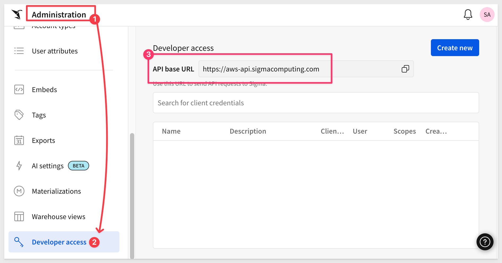

In the `Create client credentials` modal, select `REST API`, give it a name, and assign an administrative user as the owner.

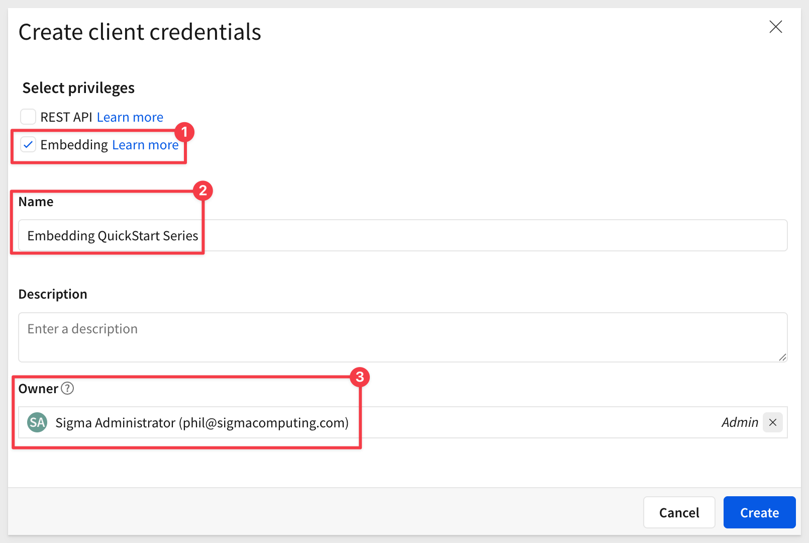

<aside class="positive">
<strong>NOTE:</strong><br> You can also enable the "Embedding" checkbox if you plan to use these same credentials for embedding. For this QuickStart, only REST API access is required.
</aside>

Click `Create`.

<aside class="negative">
<strong>IMPORTANT:</strong><br> For security purposes, Sigma provides a one-time view of the client secret at the time of creation and does not display it again. Because the secret is non-retrievable, store it securely when you create it.

If you lose the client secret or it becomes compromised, you can revoke it and generate a new one. However, this invalidates the previous secret and all API calls using it will fail until updated with the new credentials.
</aside>


Copy and paste the `Client ID` and `Secret` - you'll add them to your `.env` file in the next section.


<!-- END -->

## Clone the Git Repository
Duration: 5

### Clone the Project Folder
We have made sample JSON specifications and templates available in a public GitHub repository to save time.

While you could clone the entire repository, we'll use sparse-checkout to clone only the specific folder we need, keeping your local project cleaner.

Open a `Terminal` session.

Create a new directory in a location of your choice:

```code
mkdir sigma_quickstarts
```

Change to the new directory:
```code
cd sigma_quickstarts
```

Initialize a new git repository:
```code
git init
```

Add the remote repository as the origin:
```code
git remote add -f origin https://github.com/sigmacomputing/quickstarts-public.git
```

Enable sparse checkout:
```code
git config core.sparseCheckout true
```

Specify the folder you want to clone by adding it to the sparse-checkout configuration:
```code
echo "data-models-as-code" >> .git/info/sparse-checkout
```

Pull the specified folder from the repository:
```code
git pull origin main
```

Change directory to the new folder:
```code
cd data-models-as-code
```

You should now see the project structure:
```code
data-models-as-code/
├── README.md
├── .env.example
├── .gitignore
└── specs/
    ├── bikes-stations-basic.json
    └── bikes-stations-updated.json
```

The folder contains:
- **README.md**: Documentation about the example specs
- **.env.example**: Template for your environment variables
- **specs/**: Sample JSON specifications for creating and updating data models

<aside class="positive">
<strong>TIP:</strong><br> You can also browse the files directly on GitHub at <a href="https://github.com/sigmacomputing/quickstarts-public/tree/main/data-models-as-code">quickstarts-public/data-models-as-code</a>
</aside>


<!-- END OF SECTION-->

## Setup Environment Variables
Duration: 5

To make working with the API easier, we'll use environment variables to store your access token and IDs. This eliminates the need to copy/paste values in every command.

### Create Your .env File

In your terminal session, make sure you're in the `data-models-as-code` directory:

```code
cd sigma_quickstarts/data-models-as-code
```

The repository you cloned includes a `.env.example` template file. Copy it to create your own `.env` file:

```code
cp .env.example .env
```

Open `.env` in your text editor. The file contains placeholders for all values we'll gather:

```code
# Your Sigma API credentials (from previous section)
CLIENT_ID=your_client_id_here
CLIENT_SECRET=your_client_secret_here

# Access token (we'll get this next)
ACCESS_TOKEN=your_access_token_here

# API base URL (update based on your region)
API_BASE_URL=https://aws-api.sigmacomputing.com

# IDs (we'll gather these after authentication)
FOLDER_ID=your_folder_id_here
CONNECTION_ID=your_connection_id_here
```

**For now, update only these two values:**

1. **Add your Client ID and Secret** from the previous section (replace `your_client_id_here` and `your_client_secret_here`)

2. **Update `API_BASE_URL`** to match your Sigma region (shown in the Developer Access screen from the previous section)

<aside class="positive">
<strong>NOTE:</strong><br> Leave ACCESS_TOKEN, FOLDER_ID, and CONNECTION_ID as placeholders for now. We'll obtain these values in the next section using API calls.
</aside>

<aside class="positive">
<strong>TIP:</strong><br> The <code>.env</code> file is excluded from Git via <code>.gitignore</code> to keep your credentials secure. Never commit this file to version control.
</aside>


<!-- END OF SECTION-->

## Authenticate and Gather Required IDs
Duration: 10

To create a data model via the API, you need an `access token`, a `folder ID`, and a `connection ID`. 

### Load Environment Variables
First, load the CLIENT_ID, CLIENT_SECRET, and API_BASE_URL you configured into your shell session:

```code
export $(grep -v '^#' .env | xargs)
```

This loads the credentials you configured earlier so we can use them in the API calls below. The `grep -v '^#'` filters out comment lines.

<aside class="positive">
<strong>NOTE:</strong><br> Don't worry that ACCESS_TOKEN is still a placeholder - we'll obtain the real token in the next step and reload the environment variables.
</aside>

### Authenticate with the API
Now use the OAuth token endpoint to get your access token:

```code
curl --request POST \
  --url ${API_BASE_URL}/v2/auth/token \
  --header 'accept: application/json' \
  --header 'content-type: application/x-www-form-urlencoded' \
  --user "${CLIENT_ID}:${CLIENT_SECRET}" \
  --data 'grant_type=client_credentials'
```

The `--user` flag sends your credentials as Basic Authentication in the Authorization header.

The response contains your access token:

```code
{
  "access_token": "eyJhbGciOiJIUzI1NiIsInR5cCI6IkpXVCJ9...",
  "token_type": "bearer",
  "expires_in": 3600,
  "refresh_token": "c231dcb48752496d93cf9c6728be82f4..."
}
```

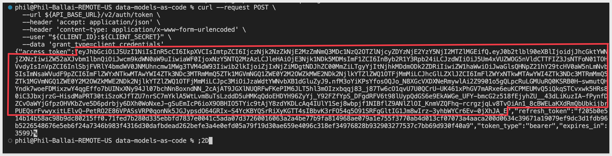

Copy **ONLY** the `access_token` value (the JWT token, **not the refresh_token portion of the value**) and add it to your `.env` file:

```code
ACCESS_TOKEN=eyJhbGciOiJIUzI1NiIsInR5cCI6IkpXVCJ9...
```

<aside class="negative">
<strong>IMPORTANT:</strong><br> Copy only the <code>access_token</code> value. Do NOT include the <code>refresh_token</code> or any other fields. The access token is a long string (typically starting with "eyJ") and does NOT include commas or the text "refresh_token".
</aside>

Then reload your environment variables:

```code
export $(grep -v '^#' .env | xargs)
```

<aside class="positive">
<strong>NOTE:</strong><br> Access tokens expire after 1 hour. When your token expires, re-run the authentication command and update your <code>.env</code> file with the new token.
</aside>

For more information, see [Generate API client credentials](https://help.sigmacomputing.com/docs/generate-api-client-credentials)

### Create a folder
Create a new folder where your data models will be stored called `Data Models as Code`:

```code
curl --request POST \
  --url ${API_BASE_URL}/v2/files \
  --header 'Accept: application/json' \
  --header "Authorization: Bearer ${ACCESS_TOKEN}" \
  --header 'Content-Type: application/json' \
  --data '{
    "type": "folder",
    "name": "Data Models as Code"
  }'
```

The response contains the new folder's details:

```code
{
  "id": "fe99c419-6855-4860-9437-5e507a021ac3",
  "urlId": "7KqjYZB8yOjpItmbP4wojF",
  "name": "Data Models as Code",
  "type": "folder",
  "path": "My Documents/Data Models as Code",
  "createdAt": "2026-01-26T18:30:00.000Z",
  ...
}
```

Copy the `id` value and add it to your `.env` file:

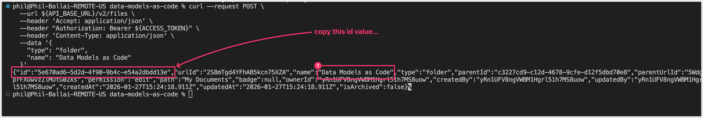

```code
FOLDER_ID=fe99c419-6855-4860-9437-5e507a021ac3
```

Then reload your environment variables:

```code
export $(grep -v '^#' .env | xargs)
```

You can verify the folder was created by logging into Sigma and checking `My Documents`.

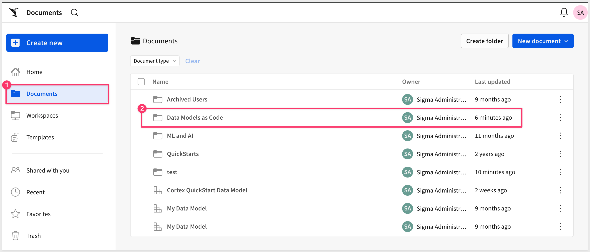

### Get Your Connection ID
Search for the Sigma Sample Database connection:

```code
curl --request GET \
  --url "${API_BASE_URL}/v2/connections?search=Sigma%20Sample%20Database" \
  --header 'Accept: application/json' \
  --header "Authorization: Bearer ${ACCESS_TOKEN}"
```

The response returns the Sigma Sample Database connection (it will have `"isSample": true`):

```code
{
  "organizationId": "6b306b21-8b0c-4dc0-9d59-1facd04621ac",
  "connectionId": "6036a5a7-3fc2-4e50-9122-1ffb132ac24c",
  "name": "Sigma Sample Database",
  "isSample": true,
  ...
}
```

Copy the `connectionId` value and add it to your `.env` file:

```code
CONNECTION_ID=6036a5a7-3fc2-4e50-9122-1ffb132ac24c
```

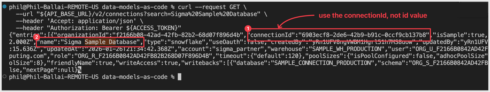

<aside class="positive">
<strong>NOTE:</strong><br> The Sigma Sample Database is automatically available in all Sigma trial and production environments. It contains sample datasets including the BIKES.STATIONS table we'll use in this QuickStart.
</aside>

You now have all the required values (ACCESS_TOKEN, FOLDER_ID, and CONNECTION_ID) in your `.env` file. You'll reload these environment variables in the next section when you're ready to create the data model.

For more information, see [List files](https://help.sigmacomputing.com/reference/listfiles) and [List connections](https://help.sigmacomputing.com/reference/listconnections)


<!-- END OF SECTION-->

## Create a Data Model from Code
Duration: 10

Now you're ready to create a data model programmatically using the sample JSON spec from the repository you cloned earlier.

### Load All Environment Variables

First, reload your environment variables to ensure all IDs are available:

```code
export $(grep -v '^#' .env | xargs)
```

This loads your ACCESS_TOKEN, FOLDER_ID, and CONNECTION_ID for use in the following commands.

### Update the Spec with Your IDs
The `specs/bikes-stations-basic.json` file from your cloned repository contains placeholder values. Replace them with your actual IDs using environment variables:

```code
sed -e "s/YOUR_FOLDER_ID_HERE/${FOLDER_ID}/g" \
    -e "s/YOUR_CONNECTION_ID_HERE/${CONNECTION_ID}/g" \
    specs/bikes-stations-basic.json > bikes-stations-configured.json
```

This reads from `specs/bikes-stations-basic.json` and creates a new file `bikes-stations-configured.json` in your current directory with your actual values:

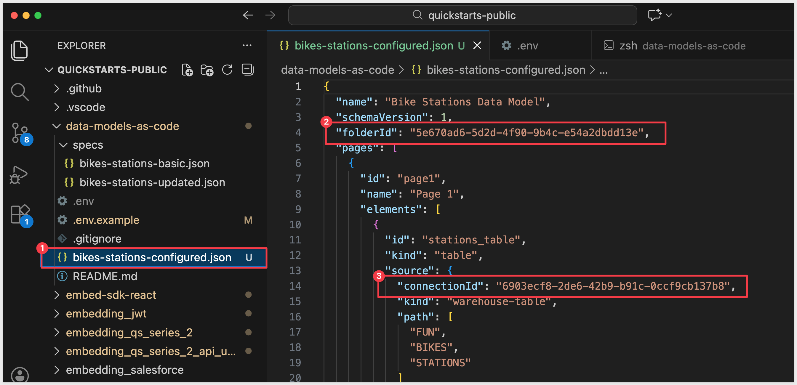

### Create the Data Model
Use the `POST /v2/dataModels/spec` endpoint to create your data model:

```code
curl --request POST \
  --url ${API_BASE_URL}/v2/dataModels/spec \
  --header 'Accept: application/json' \
  --header "Authorization: Bearer ${ACCESS_TOKEN}" \
  --header 'Content-Type: application/json' \
  --data @bikes-stations-configured.json
```

<aside class="positive">
<strong>NOTE:</strong><br> The <code>@</code> symbol tells curl to read the JSON from the file. You can also paste the JSON directly using <code>--data '{ ... }'</code>.
</aside>

The API returns the newly created data model with its `dataModelId`:

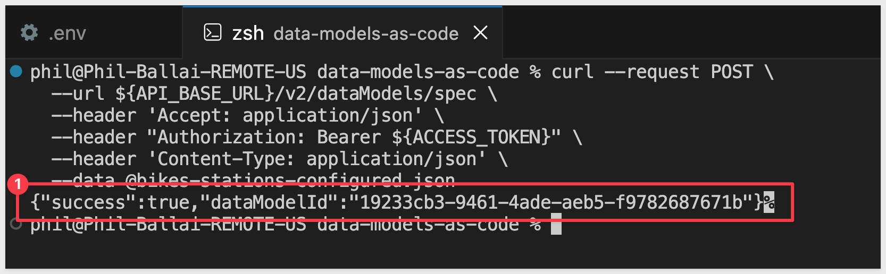

Copy this `dataModelId` and add it to your `.env` file:

```code
DATA_MODEL_ID=abc123-def456-ghi789
```

Then reload your environment variables:

```code
export $(grep -v '^#' .env | xargs)
```

You can now open the data model in Sigma by navigating to the folder you specified and viewing the newly created `Bike Stations Data Model`.

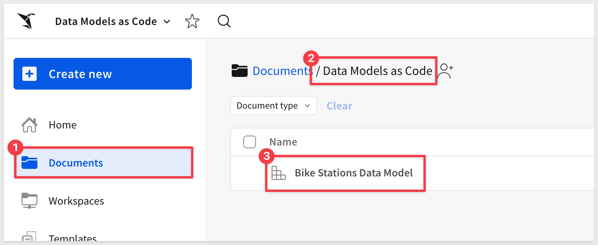

Click into the data model to see the `STATIONS` table:

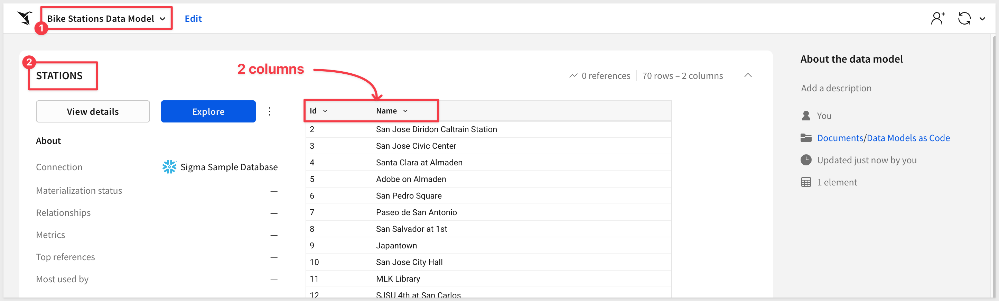

While this is not a complex model, you've successfully created a data model entirely through code without touching the Sigma UI. This same approach scales to much more complex data models with joins, metrics, custom SQL, calculated columns, and controls.

The key benefit is that your data model definition is now stored as code, making it version-controllable, reviewable, and deployable through automated pipelines.

<aside class="positive">
<strong>EXPLORE MORE:</strong><br> The <a href="https://help.sigmacomputing.com/reference/data-model-representation-example-library">Data Model Representation Example Library</a> provides comprehensive JSON examples for joins, custom SQL, unions, metrics, calculated columns, and interactive controls you can adapt for your use cases.
</aside>

For more information, see [Create a data model from a JSON specification](https://help.sigmacomputing.com/reference/createdatamodelfromspec)


<!-- END OF SECTION-->


## Update a Data Model Programmatically
Duration: 10

Let's modify the data model by adding new columns. This demonstrates how to iterate on data models using code.

### Review the Changes

The repository includes an updated spec at `specs/bikes-stations-updated.json` that enhances the data model by adding two additional columns:

1. **Station Latitude** (`[STATIONS/Lat]`)
2. **Station Longitude** (`[STATIONS/Long]`)

This expands the model from 2 columns to 4 columns, adding geographic coordinates that could be used for mapping visualizations. The updated spec maintains the same simple table structure while adding more data from the STATIONS table:

```code
"columns": [
  {
    "id": "station_id",
    "formula": "[STATIONS/Id]"
  },
  {
    "id": "station_name",
    "formula": "[STATIONS/Name]"
  },
  {
    "id": "station_lat",
    "formula": "[STATIONS/Lat]"
  },
  {
    "id": "station_long",
    "formula": "[STATIONS/Long]"
  }
]
```

### Update the IDs
Replace the placeholder values in the updated JSON file with your actual IDs:

```code
sed -e "s/YOUR_FOLDER_ID_HERE/${FOLDER_ID}/g" \
    -e "s/YOUR_CONNECTION_ID_HERE/${CONNECTION_ID}/g" \
    specs/bikes-stations-updated.json > bikes-stations-updated-configured.json
```

This reads from `specs/bikes-stations-updated.json` and creates `bikes-stations-updated-configured.json` with your actual values.

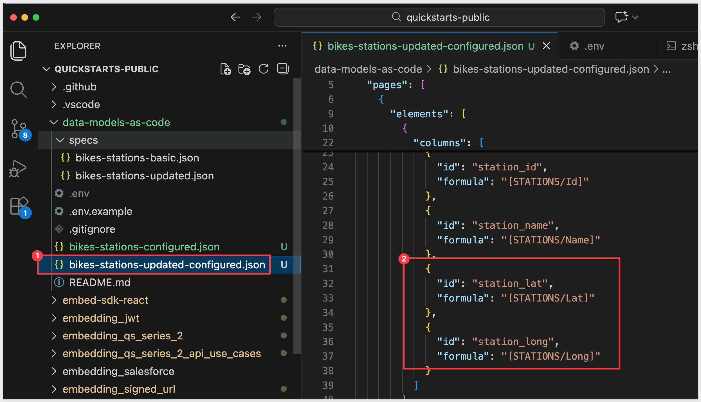

### Apply the Update
Use the `PUT /v2/dataModels/{dataModelId}/spec` endpoint:

```code
curl --request PUT \
  --url ${API_BASE_URL}/v2/dataModels/${DATA_MODEL_ID}/spec \
  --header 'Accept: application/json' \
  --header "Authorization: Bearer ${ACCESS_TOKEN}" \
  --header 'Content-Type: application/json' \
  --data @bikes-stations-updated-configured.json
```

### Verify the Changes

The API returns the updated data model. You can verify the changes by opening the data model in Sigma and seeing the two new columns:
- Station Lat (latitude coordinates)
- Station Long (longitude coordinates)

These geographic columns can be used to create map visualizations in Sigma workbooks.

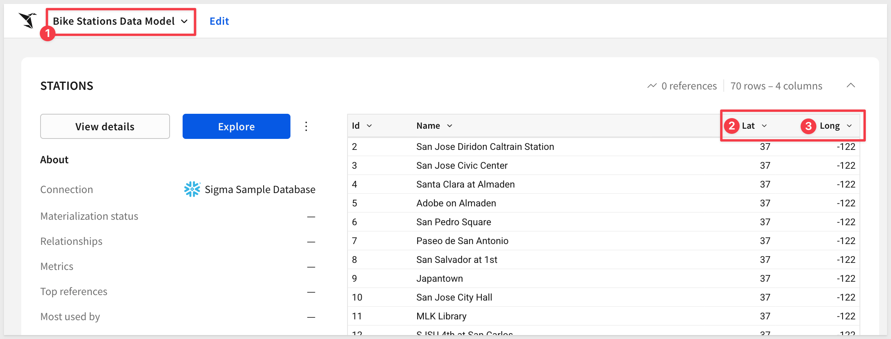

<aside class="positive">
<strong>TIP:</strong><br> This update workflow enables code reviews through pull requests. Store your specs in version control so changes to data models can be reviewed and approved by your team before being applied to production.
</aside>

For more information, see [Update a data model from a JSON specification](https://help.sigmacomputing.com/reference/updatedatamodelfromspec)


<!-- END OF SECTION-->

## Advanced Examples and Best Practices
Duration: 5

Now that you understand the basics of creating and updating data models via API, let's explore what's possible with more complex structures and how to scale this approach.

### Explore Advanced Examples

While this QuickStart used a simple table structure, the JSON specification supports much more complex data models.

The [Data Model Representation Example Library](https://help.sigmacomputing.com/reference/data-model-representation-example-library) provides comprehensive examples for:

**Advanced Data Structures:**
- **Joins**: Combine data from multiple tables with various join types
- **Custom SQL**: Incorporate raw SQL queries as data sources
- **Unions**: Merge rows from multiple sources vertically
- **Calculated Columns**: Create computed fields derived from existing data
- **Metrics**: Define aggregated measures and KPIs

**Interactive Controls:**
- Date pickers, range sliders, and number inputs
- List values, text areas, and checkboxes
- Segmented controls and switches
- Top N controls for limiting results

Each example in the library includes the complete JSON structure you can adapt for your use cases.

### Next Steps and Best Practices

**Version Control:**<br>
Store your data model specs in Git to enable change tracking, code reviews through pull requests, and the ability to roll back to previous versions.

**CI/CD Integration:**<br>
Automate data model deployments across development, staging, and production environments using GitHub Actions or similar tools.

**Multi-Environment Management:**<br>
Maintain separate specs for each environment, using environment variables to swap folder IDs and connection IDs as needed.

**Template Library:**<br>
Build a collection of reusable data model templates for common patterns your team frequently needs.


<!-- END OF SECTION-->

## What we've covered
Duration: 5

In this QuickStart, you learned how to manage Sigma data models as code using the API:

- **Authenticate to the API**: Generate access tokens using client credentials with OAuth 2.0
- **Gather required IDs**: Retrieve folder and connection IDs needed for data model creation
- **Understand JSON specifications**: Explore the structure of data model specs including pages, elements, sources, and columns
- **Create data models programmatically**: Build a new data model from a JSON specification using the POST endpoint
- **Update data models via API**: Modify existing data models by adding columns using the PUT endpoint

**Additional Resource Links**

[Blog](https://www.sigmacomputing.com/blog/)<br>
[Community](https://community.sigmacomputing.com/)<br>
[Help Center](https://help.sigmacomputing.com/hc/en-us)<br>
[QuickStarts](https://quickstarts.sigmacomputing.com/)<br>
[Sigma API Reference](https://help.sigmacomputing.com/reference/get-started-sigma-api)

Be sure to check out all the latest developments at [Sigma's First Friday Feature page!](https://quickstarts.sigmacomputing.com/firstfridayfeatures/)
<br>

[](https://twitter.com/sigmacomputing)&emsp;
[](https://www.linkedin.com/company/sigmacomputing)&emsp;
[](https://www.facebook.com/sigmacomputing)


<!-- END OF WHAT WE COVERED -->
<!-- END OF QUICKSTART -->
