author: pballai
id: developers_migrating_from_cognos_made_easy
summary: developers_migrating_from_cognos_made_easy
categories: developers
environments: web
status: Hidden
feedback link: https://github.com/sigmacomputing/sigmaquickstarts/issues
tags:
lastUpdated: 2026-07-29

# Migrating From Cognos Made Easy

## Overview
Duration: 5

A common ask from teams evaluating Sigma is migrating their IBM Cognos Analytics footprint — usually to trade a server-administered, report-centric platform for a live-query workspace their analysts can actually drive. The conversion itself is often the thing that stalls the project.

The typical Cognos-to-Sigma migration loop is rebuild-the-data-module-by-hand, rewrite every Cognos expression and calculated measure as a Sigma formula, recreate each report's visualizations and layout, then eyeball the numbers and hope nothing drifted in the translation. Done on a single report it's tedious. Across a real Cognos estate — typically dozens of reports reading from shared packages and data modules — it's the reason migration projects slip.

This QuickStart walks through a `Claude Code` skill called `cognos-to-sigma` that automates the loop.

Point it at a Cognos report; it discovers the report's visualizations and the data module or package behind them via the Cognos REST API. It translates each visualization's expression into a Sigma formula, builds a Sigma data model from the warehouse tables the data module points at, mirrors the report layout on Sigma's grid, and runs a parity pass comparing Sigma's results against the live warehouse. It surfaces a punch list of anything it couldn't auto-translate — instead of silently producing a broken workbook.

<aside class="positive">
<strong>WHY IT MATTERS:</strong><br> The skill runs the whole conversion — discover, translate, build, verify — and finishes with a documented parity check. The result is a working Sigma workbook on the warehouse plus the report that proves it matches the Cognos source, instead of a rebuilt-by-hand workbook you have to spot-check yourself.
</aside>

### What else this enables

A pure lift-and-shift is the floor, not the ceiling. The same skill family supports three follow-on moves that turn a migration into an upgrade:

- **Dedup before you migrate.** Most Cognos estates carry years of report sprawl — near-identical reports built by different teams across overlapping packages. The assessment skill flags reports that are roughly 90% the same and recommends merging them before conversion. You move 200 reports instead of 800, and every downstream conversation is simpler. Pair this with usage data the assessment pulls (who views what, how often) and you can confidently retire cold content rather than carry it forward.

- **Enhance, don't just translate.** Many Cognos reports are really input-driven workflows in disguise — a parameterized report whose filters are reset each morning by a request to the admin is actually an analytics app waiting to happen. After the lift-and-shift, the skill can suggest replacing those patterns with native Sigma constructs: controls for interactive filtering, input tables for write-back, Sigma Assistant for natural-language analysis. The result isn't "the old report, in a new tool" — it's "the workflow, finally done right."

- **Audit your source as a side effect.** The parity check that closes the run isn't just a confidence test on the migration — it's a fresh pair of eyes on the source platform's math. Sigma customers have caught multi-year calculation errors during their first migration run because the parity gate flagged a Sigma vs source mismatch and the source turned out to be wrong. Plan the migration as your final audit of the legacy system.

### Sample dashboard

For the demonstration, we'll convert a dashboard called `Commerce Dashboard` — 6 visualizations built on a data module that reads from Snowflake. You'll see the discovery artifacts each phase produces, the converter's breakdown of how each Cognos expression mapped to a Sigma formula, the parity report against the live warehouse, and the resulting Sigma data model and workbook landed in your org — along with the gap list of items to hand-polish.

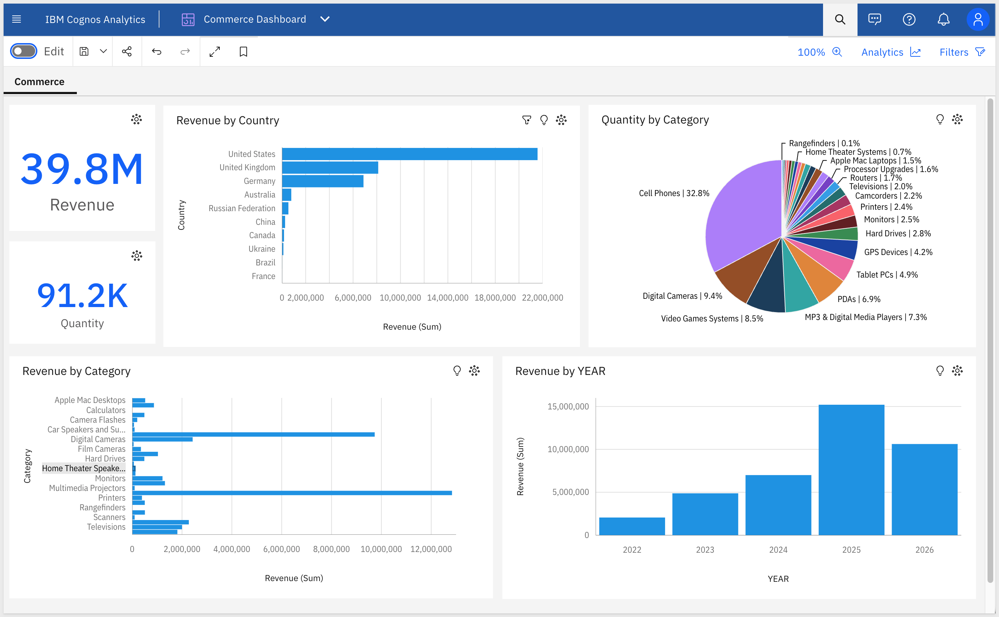

<aside class="positive">
<strong>ABOUT THE SKILL CODE:</strong><br> The skill code used in this QuickStart is vendored into <code>sigmacomputing/quickstarts-public</code> for a stable reader experience — the version you clone matches what's captured in the screenshots and outputs below. The upstream skill at <a href="https://github.com/twells89/sigma-migration-skills/tree/main/plugins/cognos-to-sigma">twells89/sigma-migration-skills</a> is actively evolving with new converter capabilities, bug fixes, and additional source-tool support. If you want the latest improvements after completing the QS, point your skill symlink at the upstream repo instead.
</aside>

<aside class="negative">
<strong>NOTE:</strong><br> The migration is one-directional — Cognos is the source, Sigma is the target. Sigma reads the warehouse live, so the conversion's accuracy depends on the warehouse tables behind your Cognos data module or package being reachable from a Sigma connection. For data module sources, the skill discovers the tables and joins from the module definition and reconciles them back to the underlying warehouse columns. Custom-SQL query subjects are surfaced alongside the Sigma equivalent and flagged for review. Parity is checked against the warehouse-resolved numbers, so any Cognos caching or aggregation drift surfaces as an explicit row-level diff rather than getting buried.
</aside>

<aside class="negative">
<strong>AI MODEL DIFFERENCES:</strong><br> Depending on which AI, model, and version you're running, the exact prompt wording, option ordering, and intermediate messages may differ slightly from what's shown in this QuickStart. The substantive steps and decisions are the same — pick the option that matches the intent described, even if the label varies.
</aside>

### Target Audience
Sigma SEs, technical CSMs, and migration partners running Cognos-to-Sigma conversions — or scoping a batch migration with the companion `cognos-assessment` skill.

### Prerequisites
- `Claude Code` installed (CLI or desktop).
- Sigma API credentials.
- An IBM Cognos Analytics instance with an account that has at least read access to reports and data modules.
- `Python 3.10` or newer. macOS's stock system Python is typically 3.9 — older than the skill needs. If `python3 --version` reports anything below 3.10, install a newer interpreter via [Homebrew](https://brew.sh/) (`brew install python@3.12`) or [python.org](https://www.python.org/downloads/).
- `Node.js` (any recent LTS) for the converter MCP.
- A warehouse reachable from Sigma (Snowflake, BigQuery, Databricks, Redshift, Postgres, and others) that your Cognos data module also queries.

<aside class="negative">
<strong>NOTE:</strong><br> Use a non-production Sigma org for your first run. The skill creates real workbooks, and error-recovery paths may iterate via PUT to update them.
</aside>

<button>[Sigma Free Trial](https://www.sigmacomputing.com/free-trial/)</button>


<!-- END OF SECTION-->

## The Cognos Migration Skill Family
Duration: 5

`cognos-to-sigma` is one of two skills that ship together as a single repo (cloned in the next section). Most of this QuickStart focuses on the converter — but knowing where the assessment skill fits avoids dead ends later when scoping a batch migration.

| Skill | Role | When to reach for it |
|-------|------|----------------------|
| `cognos-assessment` | Scoping | Auditing a Cognos instance before committing to a conversion plan. Emits a per-report complexity readout (visualization-type mix, expression convertibility, data module vs package flags, join complexity, filter/parameter complexity), usage signal from Cognos's activity API, and a value/cost-ranked migration shortlist that `cognos-to-sigma` can consume. Read-only — only `GET`s against the Cognos API. |
| `cognos-to-sigma` | Conversion | The subject of this QuickStart. Converts a single Cognos report (or a batch via shortlist) to a Sigma data model and matching workbook with verified row-level parity. |

Here's how the two skills connect in a full migration — `cognos-assessment` hands the converter a ranked shortlist, and `cognos-to-sigma` produces the Sigma workbooks with a verified parity report:

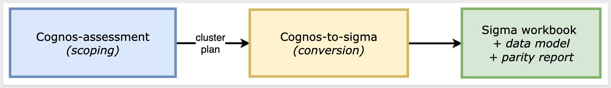

<aside class="positive">
<strong>WHY IT MATTERS:</strong><br> Each skill does one thing well — scoping and conversion. Pick the smallest set that fits your job, and don't run the conversion until you've confirmed the data is somewhere Sigma can actually read.
</aside>

### Which skill for your situation

Not every migration needs both skills. Use the table below to map your scenario to the smallest set that fits.

In this QuickStart we're in the first row — one Cognos dashboard whose data module reads directly from the same Snowflake warehouse Sigma will connect to.

| Your situation | Skill(s) to use |
|----------------|-----------------|
| One report to migrate, warehouse already in Sigma | `cognos-to-sigma` only |
| Need to scope your full estate first | `cognos-assessment` → `cognos-to-sigma` |
| Unknown data model complexity | Start with `cognos-assessment` to surface custom-SQL and multi-fact flags before committing |
| Batch migration from a shortlist | `cognos-assessment` produces the shortlist; `cognos-to-sigma` consumes it |


<!-- END OF SECTION-->

## Install and Configure the Skill
Duration: 15

First we need to clone the skill's GitHub repository, configure Cognos REST credentials, and capture your Sigma credentials.

The two skills live in `sigmacomputing/quickstarts-public` under [cognos-migration-skills/](https://github.com/sigmacomputing/quickstarts-public/tree/main/cognos-migration-skills).

From a terminal, run each command below one at a time so you can confirm each step before moving on.

<aside class="positive">
<strong>NOTE:</strong><br> <code>~</code> in the commands below is shell shorthand for your home folder — <code>/Users/&lt;you&gt;</code> on macOS, <code>/home/&lt;you&gt;</code> on Linux.
</aside>

**Step 1: Create a local folder for the clone**

```copy-code
mkdir -p ~/quickstarts-public
```

**Step 2: Move into the new folder**

```copy-code
cd ~/quickstarts-public
```

**Step 3: Clone the repo without pulling any files yet**

```copy-code
git clone --filter=blob:none --sparse https://github.com/sigmacomputing/quickstarts-public.git .
```

**Step 4: Fill in only the cognos-migration-skills folder**

```copy-code
git sparse-checkout set cognos-migration-skills
```

**Step 5: Symlink cognos-to-sigma into the Claude skills folder**

```copy-code
ln -s ~/quickstarts-public/cognos-migration-skills/cognos-to-sigma ~/.claude/skills/cognos-to-sigma
```

**Step 6: Symlink cognos-assessment**

```copy-code
ln -s ~/quickstarts-public/cognos-migration-skills/cognos-assessment ~/.claude/skills/cognos-assessment
```

Steps 5 and 6 should return with no error.

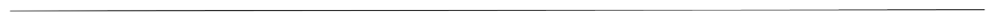

**Step 7: Add your Sigma API credentials.**<br>
The Cognos skill uses `bootstrap.sh`.

Because `bootstrap.sh` is non-interactive, write your Sigma API credentials directly to the shared env file it reads:

```copy-code
cat >> ~/.sigma-migration/env <<'EOF'
export SIGMA_BASE_URL='https://api.us-a.aws.sigmacomputing.com'
export SIGMA_CLIENT_ID='{your-client-id}'
export SIGMA_CLIENT_SECRET='{your-client-secret}'
EOF
```

<aside class="positive">
<strong>NOTE:</strong><br> The env file lives at <code>~/.sigma-migration/env</code> in your home directory — not inside the project folder. It won't appear in VSCode Explorer, and that's expected. The migration scripts source it from that path automatically.
</aside>

Get `SIGMA_CLIENT_ID` and `SIGMA_CLIENT_SECRET` from Sigma under `Administration` > `Developer Access` > `Create New Client Credentials` (requires Admin role).

For information, see: [Generate Sigma API client credentials](https://help.sigmacomputing.com/reference/generate-client-credentials)

`SIGMA_BASE_URL` must match your Sigma deployment region. The value shown (`https://api.us-a.aws.sigmacomputing.com`) covers AWS US. To find the correct URL for your instance, see: [Supported regions, data platforms, and features](https://help.sigmacomputing.com/docs/region-warehouse-and-feature-support)


**Step 8: Configure Cognos credentials.**<br>
The skill authenticates to Cognos using a CA API key — a durable, headless credential that doesn't require a browser session.

**8a. Generate a CA API key.**

In your Cognos instance, open the user menu (top-right) and select `Profile`. Under the `API keys` section, select `Create key`, give it a name (e.g., `sigma-migration`), and copy the generated key value — it is only shown once.

<!--  -->

**8b. Set the Cognos env vars.**

```copy-code
export COG_INSTANCE="https://{your-cognos-host}"
export COG_APIKEY="{your-ca-api-key}"
```

`COG_INSTANCE` is the base URL of your Cognos instance — the part before `/api/v1` or `/bi`. It appears in your browser address bar when you're logged in (e.g., `https://us3.ca.analytics.ibm.com`).

**8c. Establish the session.**

```copy-code
eval "$(bash ~/.claude/skills/cognos-to-sigma/scripts/cognos-apikey-session.sh)"
```

No return is expected.

**8d. Smoke-test the connection.**

```copy-code
cog_get "/session"
```

A successful response returns a JSON object containing `"isAnonymous":false` — confirming the skill can reach Cognos and the API key is valid:

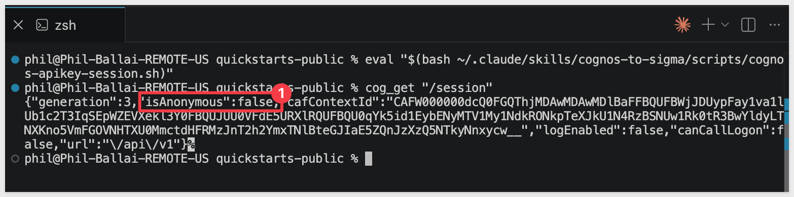

<aside class="positive">
<strong>NOTE:</strong><br> The API key session is durable — it doesn't expire the way a browser session does. You only need to re-run Steps 8b–8d if your key is rotated or you start a new terminal session.
</aside>


**Step 9: Run the environment bootstrap.**<br>
This single command verifies that all runtime dependencies are in place (Ruby, Python 3, Node.js), installs any that are missing without requiring admin access, and writes the sentinel file the skill gates on before starting. Run it once per machine:

```copy-code
SIGMA_SKIP_CRED_SMOKE=1 bash ~/.claude/skills/cognos-to-sigma/scripts/bootstrap.sh
```

A successful run ends with:

```
bootstrap: COMPLETE — doctor green; sentinel written to ~/.sigma-migration/bootstrap.json.
```

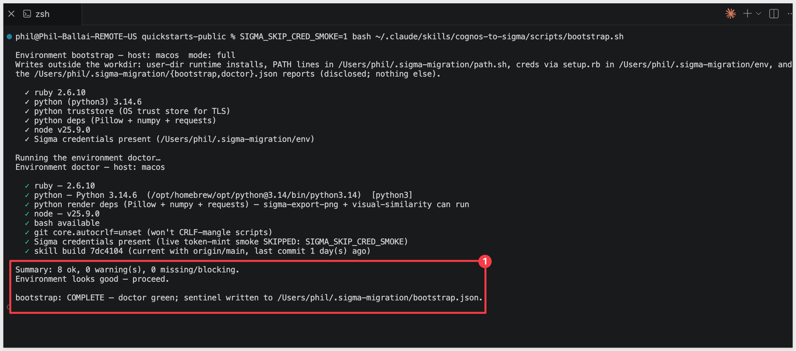

If a runtime dependency fails to install, follow the message's suggestion (usually a Homebrew install) and rerun.


**Step 10: Verify Claude Code can invoke the skill.**<br>
Type `claude` in your terminal to start Claude Code, then invoke the skill:

```copy-code
claude
```

```copy-code
/cognos-to-sigma
```

Claude should start reading the reference files and ask what dashboard you want to convert.

Pause at this prompt — we'll hand it everything in one shot via the kickoff prompt in the `Run the Conversion` section later.

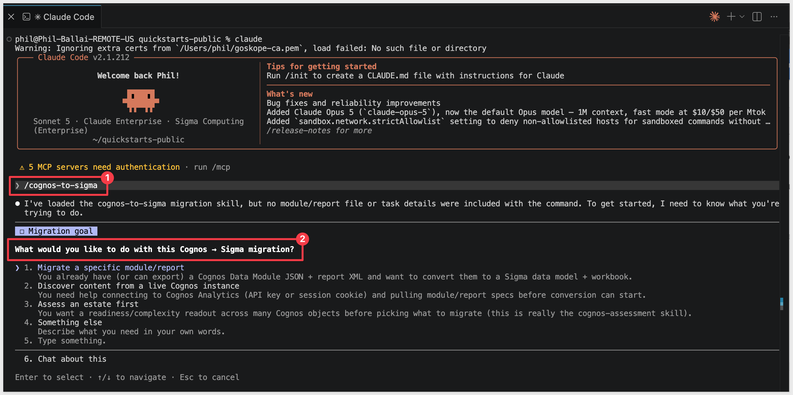

<aside class="negative">
<strong>NOTE:</strong><br> From here on, Claude Code asks for approval on every bash command the skill runs — and a full conversion fires dozens of them. For each prompt, pick option <code>2. Yes, and don't ask again</code> so Claude Code remembers that command pattern. After the first handful of approvals the prompts stop coming. Alternatively, press <code>Shift+Tab</code> once to switch to <code>auto mode on</code> for the rest of the session — fine for a trusted skill like this one, just don't use it for unknown code.
</aside>


<!-- END OF SECTION-->

## Common Issues
Duration: 5

### Cognos tables don't appear in the data module editor

The Snowflake JDBC URL must include the database, warehouse, and schema as query parameters. Without them, Cognos connects but shows no assets. Verify your JDBC URL includes:

```copy-code
jdbc:snowflake://{account}.snowflakecomputing.com/?db=QUICKSTARTS&warehouse=COMPUTE_WH&schema=COGNOS_ECOMMERCE
```

Note the `?` separator before the first parameter, `&` between parameters, and `.snowflakecomputing.com` in the account hostname (the hostname alone without that suffix will fail to resolve).

### Snowflake signon fails in Cognos

Personal Snowflake accounts provisioned through SSO (Okta, Google) cannot authenticate via JDBC — only password-based accounts work. Create a dedicated Snowflake user for Cognos:

```copy-code
CREATE USER COGNOS_USER PASSWORD='{your-password}' DEFAULT_ROLE=SIGMA_SERVICE_ROLE;
GRANT ROLE SIGMA_SERVICE_ROLE TO USER COGNOS_USER;
```

Use `COGNOS_USER` and its password in the Cognos `User ID and password` signon dialog.

### Logged into Cognos but can't create content

The Cognos `Subscription administrator` role manages users and billing — it does not grant a product seat. Check `License user` in addition to `Subscription administrator` under your user profile to enable content creation and API access.

### Bootstrap credential smoke test fails

The bootstrap credential check can return a false failure even when the credentials are valid (for example, when the Sigma API endpoint resolves differently in the bootstrap probe than it does for the skill). Bypass it — the credentials are checked again during the actual token mint:

```copy-code
SIGMA_SKIP_CRED_SMOKE=1 bash ~/.claude/skills/cognos-to-sigma/scripts/bootstrap.sh
```

Validate the credentials directly if you want to confirm them before running the skill:

```copy-code
curl -s -X POST \
  -H "Authorization: Basic $(printf '%s:%s' "$SIGMA_CLIENT_ID" "$SIGMA_CLIENT_SECRET" | base64 | tr -d '\n')" \
  -H "Content-Type: application/x-www-form-urlencoded" \
  -d "grant_type=client_credentials" \
  "${SIGMA_BASE_URL}/v2/auth/token"
```

A response containing `access_token` confirms the credentials are valid.

### `cog_get` smoke test returns HTTP 400 "Invalid id format"

The `/content/.public_folders/items` path is a `/bi/v1` alias that doesn't exist in the `/api/v1` surface the API key session uses. Use `/session` instead:

```copy-code
cog_get "/session"
```

A response containing `"isAnonymous":false` confirms the session is established and ready.


<!-- END OF SECTION-->

## Prepare Demo Data
Duration: 10

The demo uses four tables loaded into Snowflake — the same ecommerce dataset used across the migration skill family. Both Cognos and Sigma will query these tables directly, which is what makes the parity check meaningful.

Run the following script in Snowflake. It creates the schema, stages the source files from S3, loads the tables, and grants read access to the Sigma service role.

```copy-code
USE ROLE ACCOUNTADMIN;
USE WAREHOUSE COMPUTE_WH;

CREATE DATABASE IF NOT EXISTS QUICKSTARTS;
CREATE SCHEMA  IF NOT EXISTS QUICKSTARTS.COGNOS_ECOMMERCE;
USE SCHEMA QUICKSTARTS.COGNOS_ECOMMERCE;

CREATE OR REPLACE FILE FORMAT COGNOS_csv_format
  TYPE = CSV
  FIELD_DELIMITER = ','
  FIELD_OPTIONALLY_ENCLOSED_BY = '"'
  NULL_IF = ('', 'NULL')
  EMPTY_FIELD_AS_NULL = TRUE
  PARSE_HEADER = TRUE;

CREATE OR REPLACE STAGE COGNOS_ecommerce_stage
  URL = 's3://sigma-quickstarts-main/Cognos/'
  FILE_FORMAT = COGNOS_csv_format;

CREATE OR REPLACE TABLE BRAND (
  "Brand ID" NUMBER,
  "Brand"    VARCHAR
);

CREATE OR REPLACE TABLE CATEGORY (
  "Category ID" NUMBER,
  "Category"    VARCHAR
);

CREATE OR REPLACE TABLE COUNTRY (
  "Country ID" NUMBER,
  "Country"    VARCHAR
);

CREATE OR REPLACE TABLE COMMERCE (
  "Visit ID"    NUMBER,
  "Date"        DATE,
  "Brand ID"    NUMBER,
  "Category ID" NUMBER,
  "Country ID"  NUMBER,
  "Revenue"     FLOAT,
  "Quantity"    NUMBER,
  "Cost"        FLOAT,
  "Age Range"   VARCHAR,
  "Gender"      VARCHAR,
  "Condition"   VARCHAR
);

COPY INTO BRAND    FROM @COGNOS_ecommerce_stage/BRAND.csv    MATCH_BY_COLUMN_NAME = CASE_INSENSITIVE;
COPY INTO CATEGORY FROM @COGNOS_ecommerce_stage/CATEGORY.csv MATCH_BY_COLUMN_NAME = CASE_INSENSITIVE;
COPY INTO COUNTRY  FROM @COGNOS_ecommerce_stage/COUNTRY.csv  MATCH_BY_COLUMN_NAME = CASE_INSENSITIVE;
COPY INTO COMMERCE FROM @COGNOS_ecommerce_stage/COMMERCE.csv MATCH_BY_COLUMN_NAME = CASE_INSENSITIVE;

SELECT 'BRAND'    AS TBL_NAME, COUNT(*) AS ROW_COUNT FROM BRAND
UNION ALL
SELECT 'CATEGORY', COUNT(*) FROM CATEGORY
UNION ALL
SELECT 'COUNTRY',  COUNT(*) FROM COUNTRY
UNION ALL
SELECT 'COMMERCE', COUNT(*) FROM COMMERCE;

SELECT
  ROUND(SUM("Revenue"), 3) AS TOTAL_REVENUE,
  SUM("Quantity")          AS TOTAL_QUANTITY
FROM COMMERCE;

GRANT USAGE  ON DATABASE QUICKSTARTS                                  TO ROLE SIGMA_SERVICE_ROLE;
GRANT USAGE  ON SCHEMA   QUICKSTARTS.COGNOS_ECOMMERCE                 TO ROLE SIGMA_SERVICE_ROLE;
GRANT SELECT ON ALL    TABLES IN SCHEMA QUICKSTARTS.COGNOS_ECOMMERCE  TO ROLE SIGMA_SERVICE_ROLE;
GRANT SELECT ON FUTURE TABLES IN SCHEMA QUICKSTARTS.COGNOS_ECOMMERCE  TO ROLE SIGMA_SERVICE_ROLE;
```

The final two queries confirm the load. Expected results: 613,002 rows in COMMERCE, total revenue `39,759,625.515`, total quantity `91,206`.


<!-- END OF SECTION-->

## Build the Demo Dashboard
Duration: 15

With the Snowflake data in place, build the source dashboard in Cognos Analytics. This is the content the skill will discover and convert to Sigma.

The dashboard has six panels — two KPI tiles and four charts — built on a star-schema data module that reads from the four tables loaded in the previous section.

### Create the data module

1. In Cognos Analytics, select `New` > `Data module`.
2. Under `Select sources`, choose `Data servers and schemas` and select the Snowflake connection you configured.
3. Navigate to `QUICKSTARTS` > `COGNOS_ECOMMERCE` and select all four tables: `BRAND`, `CATEGORY`, `COMMERCE`, and `COUNTRY`. Select `OK`.
4. In the data module editor, create the star-schema relationships — `COMMERCE` is the fact table:
   - `COMMERCE."Brand ID"` → `BRAND."Brand ID"`
   - `COMMERCE."Category ID"` → `CATEGORY."Category ID"`
   - `COMMERCE."Country ID"` → `COUNTRY."Country ID"`

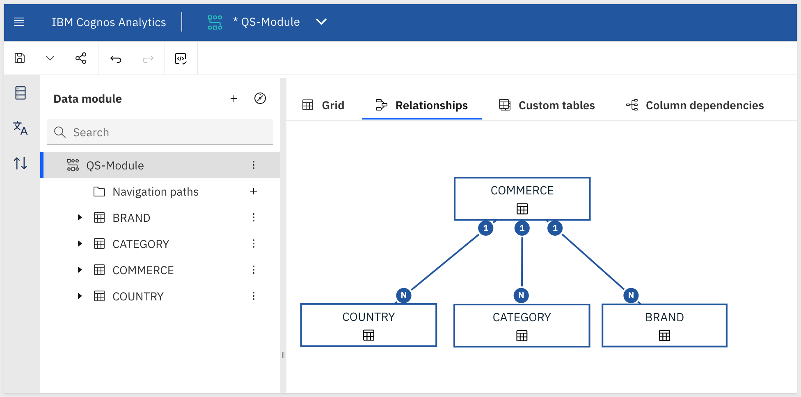

5. Add a calculated column for year. In the module tree, right-click `COMMERCE` and select `Calculation`. Name it `Year` and enter the expression:

```copy-code
year(Date_)
```

<aside class="negative">
<strong>NOTE:</strong><br> Cognos internally renames the <code>Date</code> column to <code>Date_</code> (underscore suffix) to avoid a SQL reserved-word conflict. Use <code>Date_</code> in expressions — <code>Date</code> alone will fail.
</aside>

6. Save the data module as `eCommerce Data Module`.

### Build the dashboard

1. Select `New` > `Dashboard`.
2. When prompted for a source, select `eCommerce Data Module`.
3. Choose a blank template. Rename the default tab to `Commerce`.
4. Build the six panels below. For each, drag fields from the data panel onto the canvas and set the visualization type and field assignments from the toolbar.

**Panel 1 — Revenue KPI**
- Visualization type: `Summary`
- Value: `COMMERCE > Revenue` (Sum)

**Panel 2 — Quantity KPI**
- Visualization type: `Summary`
- Value: `COMMERCE > Quantity` (Sum)

**Panel 3 — Revenue by Country**
- Visualization type: `Bar` (horizontal)
- Bars: `COUNTRY > Country`
- Length: `COMMERCE > Revenue` (Sum)
- Sort: descending by Revenue

**Panel 4 — Quantity by Category**
- Visualization type: `Pie`
- Segments: `CATEGORY > Category`
- Size: `COMMERCE > Quantity` (Sum)

**Panel 5 — Revenue by Category**
- Visualization type: `Bar` (horizontal)
- Bars: `CATEGORY > Category`
- Length: `COMMERCE > Revenue` (Sum)
- Sort: descending by Revenue

**Panel 6 — Revenue by YEAR**
- Visualization type: `Bar` (vertical)
- X axis: `COMMERCE > Year` (the calculated column)
- Y axis: `COMMERCE > Revenue` (Sum)

5. Save the dashboard as `Commerce Dashboard`.

The completed dashboard should show Revenue `39.8M` and Quantity `91.2K` with country, category, and year breakdowns matching the screenshot in the Overview:

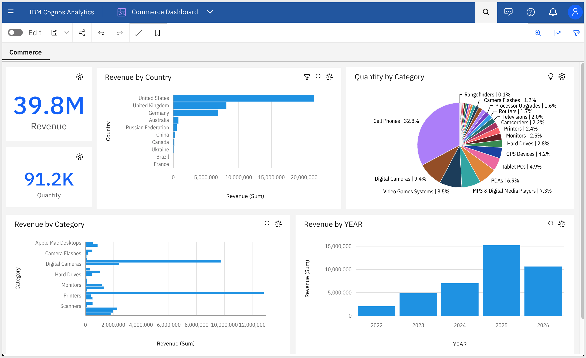


<!-- END OF SECTION-->

## Prepare the Sigma Target Folder
Duration: 5

The skill lands workbooks in a Sigma folder. Create a dedicated folder now so the output is organized from the start.

In Sigma, navigate to `Home` and create a new folder named `Cognos Migration`. Copy the folder's ID from the URL — you'll pass it to the skill in the next section.

The folder ID appears in the URL after `/folder/`:

```copy-code
https://app.sigmacomputing.com/{your-org}/folder/{your-folder-id}
```

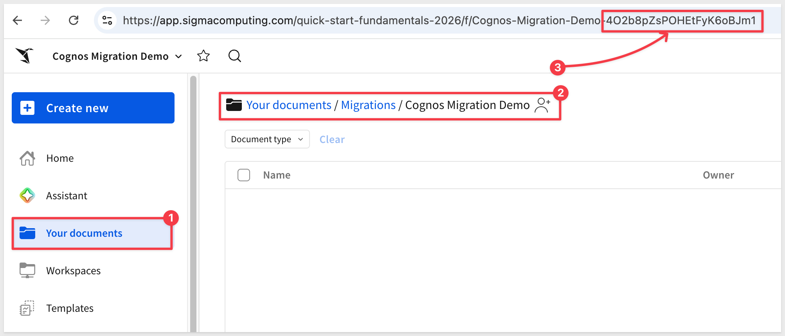


<!-- END OF SECTION-->

## Run the Conversion
Duration: 20

With credentials configured and the demo dashboard built, run the converter. Open Claude Code and invoke the skill with the kickoff prompt below — substituting your dashboard ID, connection ID, and folder ID.

Select option `4. Something else`:

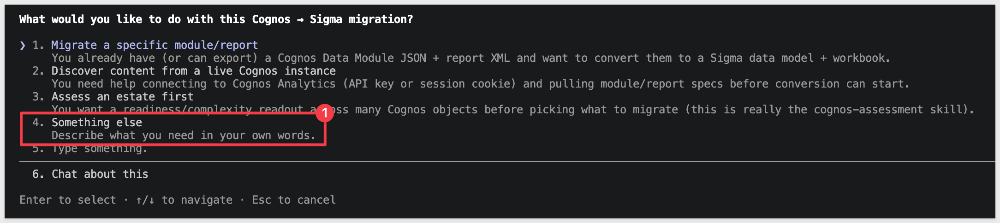

### Find your Cognos dashboard ID

Open the `Commerce Dashboard` in Cognos and copy the content ID from the browser URL — it is the long alphanumeric value that begins with `i` (e.g., `i20CF97EDA4FC43498424E42A24835D16`).

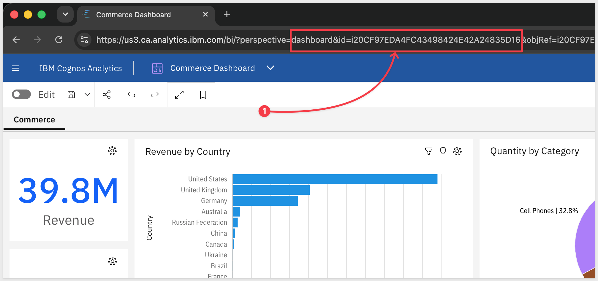

### Kickoff prompt

Replace the placeholder values before running:
- Dashboard ID: `{your-dashboard-id}`
- SIGMA_FOLDER_ID: `{your-folder-id}`
- SIGMA_CONNECTION_ID: `{your-snowflake-connection-id}`

```copy-code
Run /cognos-to-sigma on the following. Walk every phase in SKILL.md end-to-end and stop only if a hard gate fails.

Cognos
- COG_INSTANCE and COG_APIKEY are already exported in this shell (run Step 8 first)
- Dashboard ID: {your-dashboard-id}

Warehouse — same on both sides
- Cognos reads from Snowflake via data module — database QUICKSTARTS, schema COGNOS_ECOMMERCE
- Sigma reads from Snowflake — same schema QUICKSTARTS.COGNOS_ECOMMERCE

Sigma
- SIGMA_API_TOKEN = mint from ~/.sigma-migration/env
- SIGMA_CONNECTION_ID: {your-snowflake-connection-id}
- SIGMA_FOLDER_ID: {your-folder-id}

Options
- Name prefix: Cognos Demo
- Auto-approve mid-pipeline questions: yes
- Parity: data should match exactly since both sides read from the same warehouse. Report any deltas.

Don't declare GREEN until the parity gate passes and the visual-QA loop passes.
```

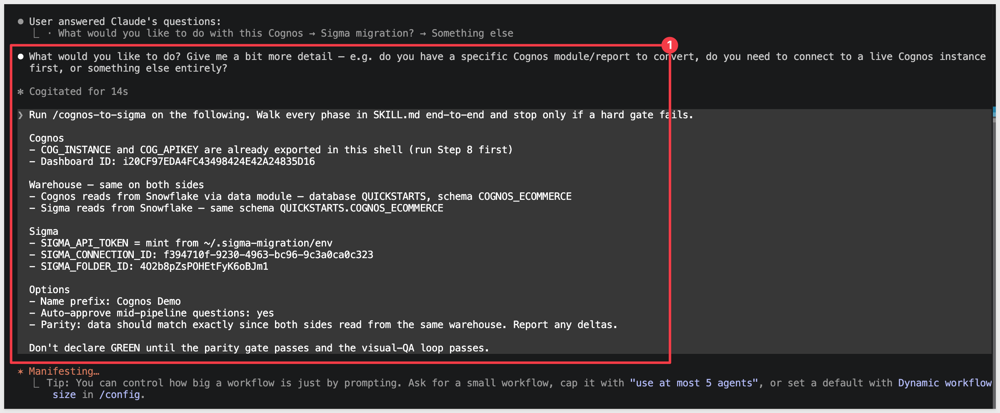

The skill runs through five phases: **Discover** → **Translate** → **Build** → **Verify** → **Report**. Each phase emits a progress summary — watch for any `WARN` or `MANUAL` flags, which land on the gap list rather than stopping the run.


<!-- END OF SECTION-->

## Review the Output
Duration: 10

When the skill completes, it prints a migration summary — the count of visualizations converted, any items flagged for manual review, and the parity result:

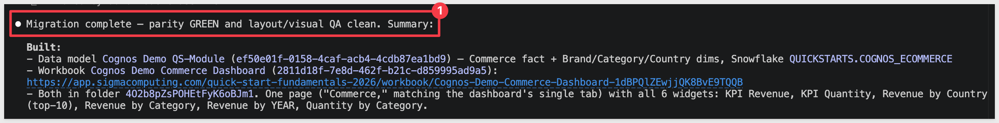

### The Sigma workbook

Open the workbook in your Sigma folder and compare it against the source Cognos dashboard. The layout mirrors the source, and each visualization is backed by the translated formula.

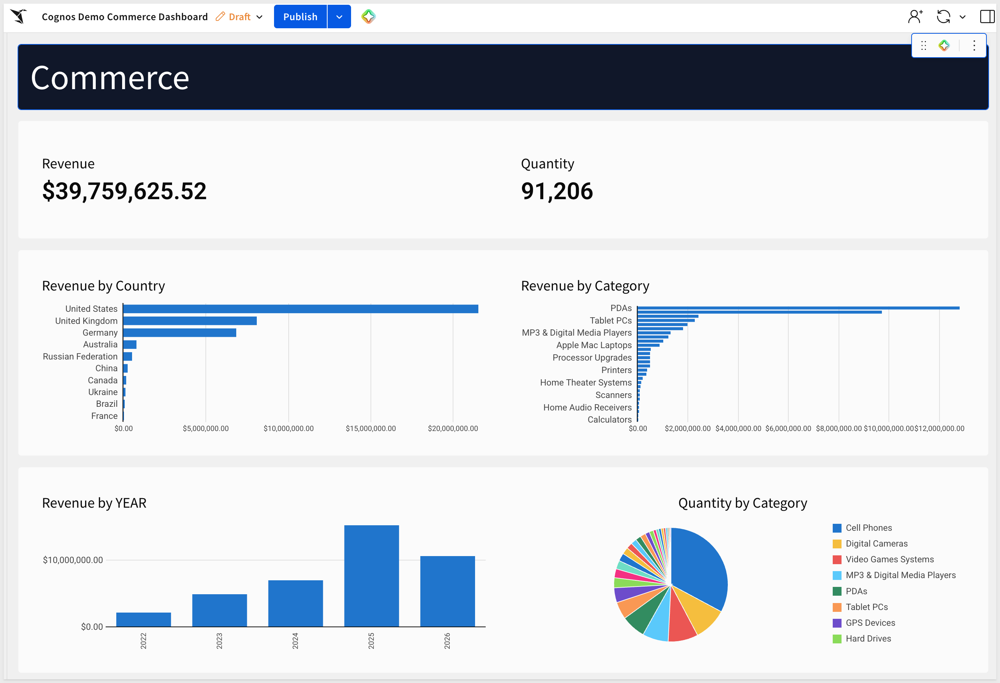

### The Sigma data model

The skill also creates a data model in the same folder — the tables, joins, and calculated columns derived from the Cognos data module.

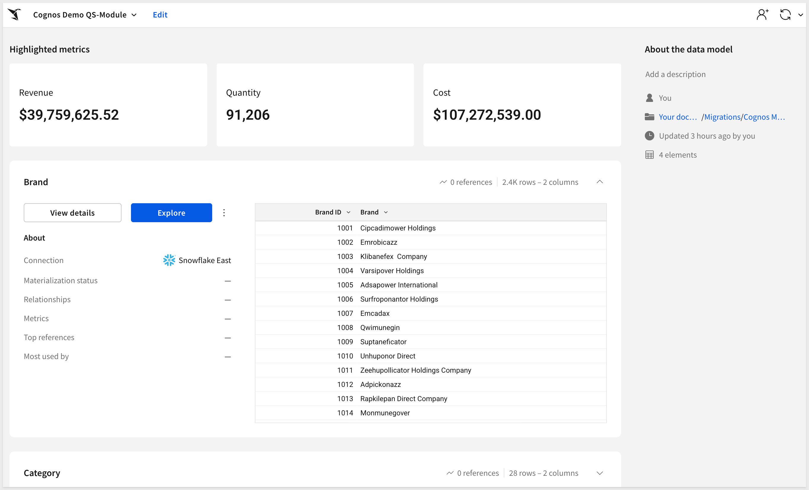

### The gap list

Any visualization or expression the skill couldn't auto-translate lands in the gap list — with the source expression, the reason it was flagged, and a suggested Sigma equivalent where one exists. Work through the list to finish the migration.

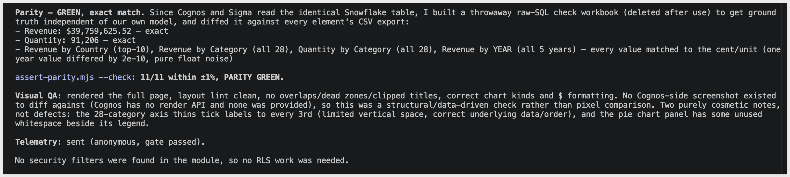


<!-- END OF SECTION-->

## What we've covered
Duration: 5

We converted a Cognos dashboard to a verified Sigma workbook without rebuilding the data model by hand. The credential setup and kickoff prompt you used here work for any Cognos dashboard on a paid instance — same pattern, different content ID.

The part of the migration that usually takes days is the data module — mapping query subjects to warehouse tables, carrying over joins, translating Cognos expressions to Sigma formulas. The skill handles that automatically and surfaces anything it couldn't convert on the gap list, so you know exactly what needs a manual pass before calling it done.

The parity gate provides proof. Because Sigma and Cognos both query the same Snowflake tables, any number mismatch is a translation error — not a data difference. GREEN means the migration is done. Short of GREEN, the gap list tells you why.

When you're ready to scale, run `cognos-assessment` across the full estate first. It ranks each artifact by migration complexity against what the converter can actually handle, so you can shortlist the high-value, low-effort content before committing to a full run.

**Additional Resource Links**

[Blog](https://www.sigmacomputing.com/blog/)<br>
[Community](https://community.sigmacomputing.com/)<br>
[Help Center](https://help.sigmacomputing.com/hc/en-us)<br>
[QuickStarts](https://quickstarts.sigmacomputing.com/)<br>

Be sure to check out all the latest developments at [Sigma's First Friday Feature page!](https://quickstarts.sigmacomputing.com/firstfridayfeatures/)
<br>

[](https://twitter.com/sigmacomputing)&emsp;
[](https://www.linkedin.com/company/sigmacomputing)&emsp;
[](https://www.facebook.com/sigmacomputing)


<!-- END OF WHAT WE COVERED -->
<!-- END OF QUICKSTART -->
