author: pballai
id: developers_migrating_from_domo_made_easy
summary: Use the domo-to-sigma Claude Code skill to rebuild a Domo dashboard as a Sigma data model and workbook from a screenshot and its warehouse table, then verify results with a parity check against the warehouse.
categories: migrations
environments: web
status: Published
feedback link: https://github.com/sigmacomputing/sigmaquickstarts/issues
tags: Default
lastUpdated: 2026-08-26

# Migrating From Domo Made Easy

## Overview
Duration: 5

A common ask from teams evaluating Sigma is migrating their Domo footprint — usually to take advantage of all the amazing things Sigma offers. The conversion itself can be a blocker — and the part this QuickStart automates.

Domo publishes a full [REST API](https://www.domo.com/docs/portal/API-Reference/overview), and the `domo-to-sigma` skill can discover dashboards, DataSets, and calculated fields through it directly. This QuickStart takes the simpler path instead: it runs in **screenshot-only mode**, working from a screenshot of the source dashboard and the same warehouse data the dashboard was built on (staged in Snowflake), with no live Domo instance queried at all.

This QuickStart walks through a `Claude Code` skill called `domo-to-sigma` that automates the rebuild.

Point it at a screenshot of a Domo dashboard and the Snowflake tables behind it; it reads the arrangement, chart types, and summary tiles from the image, builds a Sigma data model from the warehouse tables, and reproduces the dashboard's cards as Sigma elements on Sigma's grid — a KPI wherever Domo showed a big summary number, never a table standing in for one.

<aside class="positive">
<strong>WHY IT MATTERS:</strong><br> A screenshot and a warehouse table are a lower bar to clear than API credentials — no source-side access to provision, no scopes to request. This skill proves the migration path holds up at that simpler starting point too, which is often exactly where an early evaluation conversation begins.
</aside>

### What else this enables

A pure lift-and-shift is the floor, not the ceiling. The same skill family supports follow-on moves that turn a migration into an upgrade:

- **Dedup before you migrate.** Most BI estates carry years of dashboard sprawl — multiple near-identical dashboards built by different teams over time. The companion assessment skill flags dashboards that are roughly 90% the same and recommends merging them before conversion.
- **Enhance, don't just translate.** Many "dashboards" in legacy tools are really input-driven workflows in disguise. After the lift-and-shift, the skill can suggest replacing those patterns with native Sigma constructs — input tables for write-back, Sigma Assistant for natural-language analysis, scheduled agents for routine summaries.
- **Audit your source as a side effect.** Reproducing the dashboard against the same warehouse tables is a fresh pair of eyes on the source platform's math — a useful check even without a live parity comparison against Domo itself.

### Sample dashboard

For the demonstration, we'll rebuild a dashboard called `Golden Orders Executive Dashboard` — 16 cards across four collections: `Executive KPIs` (four summary-number tiles — Net Revenue, Gross Profit, Orders, Return Rate), `Trends and Mix` (a revenue trend line, a bar chart, a donut, and a horizontal bar), `Operational Performance` (four more trend/breakdown charts), and `Order Detail` (four channel- and method-level breakdowns). You'll see how the skill reads each card's chart type and the collection layout directly from the screenshot, builds a Sigma data model from the warehouse tables behind it, and reproduces the dashboard as a Sigma workbook.

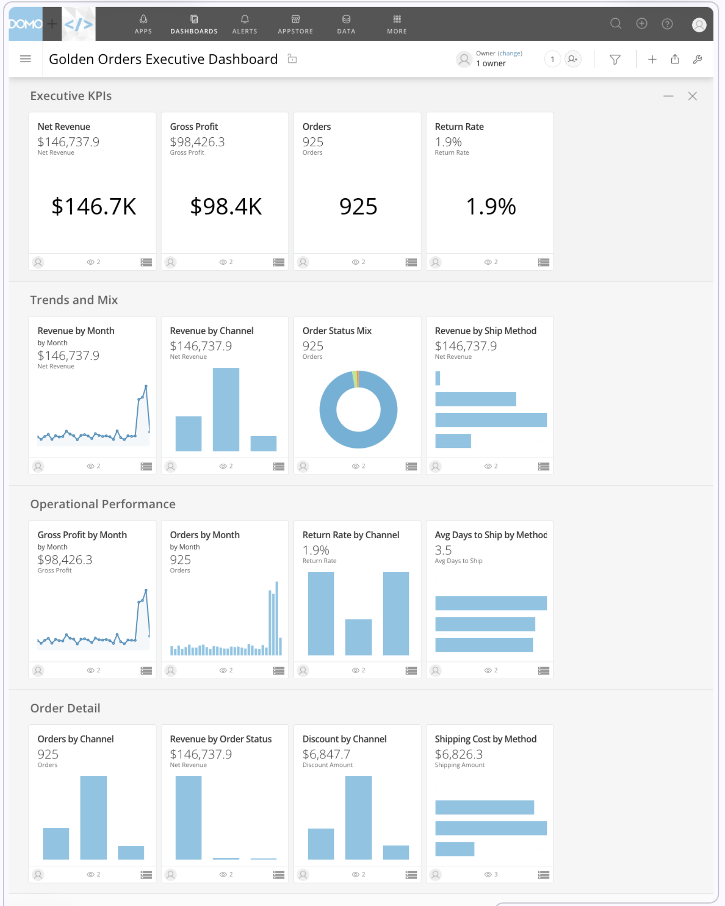

<aside class="positive">
<strong>ABOUT THE SKILL CODE:</strong><br> The skill code used in this QuickStart is vendored into <code>sigmacomputing/quickstarts-public</code> for a stable reader experience — the version you clone matches what's captured in the screenshots and outputs below. The upstream skill at <a href="https://github.com/twells89/sigma-migration-skills/tree/main/plugins/domo-to-sigma">twells89/sigma-migration-skills</a> is actively evolving with new converter capabilities, bug fixes, and additional source-tool support. If you want the latest improvements after completing the QS, point your skill symlink at the upstream repo instead.
</aside>

<aside class="negative">
<strong>NOTE:</strong><br> The migration is one-directional — Domo is the source, Sigma is the target. This QuickStart runs entirely off a screenshot of the source dashboard; no Domo credentials or API calls are used. Sigma reads live from the same warehouse tables the Domo dashboard was built on, so the layout and chart choices come from the image while the numbers come from the warehouse.
</aside>

<aside class="negative">
<strong>AI MODEL DIFFERENCES:</strong><br> Depending on which AI, model, and version you're running, the exact prompt wording, option ordering, and intermediate messages may differ slightly from what's shown in this QuickStart. The substantive steps and decisions are the same — pick the option that matches the intent described, even if the label varies.
</aside>

### Target Audience
Sigma SEs, technical CSMs, and migration partners rebuilding a Domo dashboard from a screenshot — or scoping a batch migration with the companion `domo-assessment` skill against a live Domo instance.

### Prerequisites
- `Claude Code` installed (CLI or desktop).
- A screenshot of the source Domo dashboard.
- Access to the Snowflake warehouse tables the dashboard was built on.
- A Sigma workspace with a Snowflake connection.


<!-- END OF SECTION-->

## The Domo Migration Skill Family
Duration: 5

`domo-to-sigma` is one of two skills that ship together as a single repo (cloned in the next section). Most of this QuickStart focuses on the converter — but knowing where the assessment skill fits avoids dead ends later when scoping a batch migration.

| Skill | Role | When to reach for it |
|-------|------|----------------------|
| `domo-assessment` | Scoping | Auditing a Domo instance before committing to a conversion plan. Emits a per-card complexity readout, groups cards into dataset clusters, flags duplicate dashboards, and writes a migration plan that `domo-to-sigma` can consume for a batch run. Requires live Domo API access (unlike this QuickStart). |
| `domo-to-sigma` | Conversion | The subject of this QuickStart. Converts a Domo dashboard to a Sigma data model and matching workbook. |

Here's how the two skills connect in a full migration — `domo-assessment` hands the converter a migration plan grouping cards into dataset clusters, and `domo-to-sigma` produces the Sigma workbook with a data model and parity report:

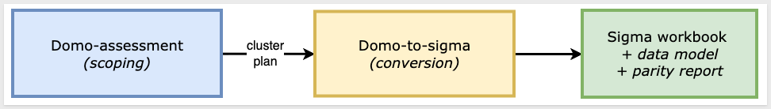

<aside class="positive">
<strong>WHY IT MATTERS:</strong><br> Each skill does one thing well — scoping and conversion. Pick the smallest set that fits your job, and don't run the conversion until you've confirmed the data is somewhere Sigma can actually read.
</aside>

### Which skill for your situation

Not every migration needs both skills. Use the table below to map your scenario to the smallest set that fits.

In this QuickStart we're in the first row — one dashboard, working from a screenshot with no live Domo instance involved.

| Your situation | Skill(s) to use |
|----------------|-----------------|
| 1 dashboard, no live Domo access (screenshot + warehouse only) | `domo-to-sigma` — this QuickStart |
| 1 dashboard, live Domo instance reachable | `domo-to-sigma` against the API directly |
| 10+ dashboards, live Domo instance | `domo-assessment` → `domo-to-sigma` in batch mode |
| Auditing Domo sprawl without converting yet | `domo-assessment` only |

<aside class="negative">
<strong>NOTE:</strong><br> As the skill runs, you'll see filenames and log lines that reference internal phase numbers. Those belong to the skill's own internal numbering — they map onto the phases described in <code>Review the Output</code>. The full mapping is documented in the skill's <code>SKILL.md</code>.
</aside>


<!-- END OF SECTION-->

## Install and Configure the Skill
Duration: 10

First we need to clone the skill's GitHub repository and capture your Sigma credentials. Because this QuickStart runs in screenshot-only mode, there's no Domo credential step.

The two skills live in `sigmacomputing/quickstarts-public` under [domo-migration-skills/](https://github.com/sigmacomputing/quickstarts-public/tree/main/domo-migration-skills).

From a terminal, run each command below one at a time so you can confirm each step before moving on.

<aside class="positive">
<strong>NOTE:</strong><br> <code>~</code> in the commands below is shell shorthand for your home folder — <code>/Users/&lt;you&gt;</code> on macOS, <code>/home/&lt;you&gt;</code> on Linux.
</aside>

**Step 1: Create a local folder for the clone**

```copy-code
mkdir -p ~/quickstarts-public
```

**Step 2: Move into the new folder**

```copy-code
cd ~/quickstarts-public
```

**Step 3: Clone the repo without pulling any files yet**

```copy-code
git clone --filter=blob:none --sparse https://github.com/sigmacomputing/quickstarts-public.git .
```

**Step 4: Fill in only the domo-migration-skills folder**

```copy-code
git sparse-checkout set domo-migration-skills
```

The files will appear after this step:

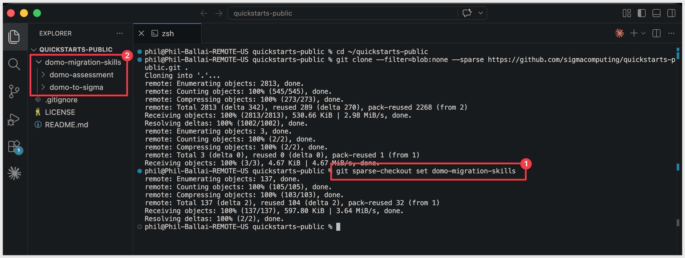

**Step 5: Symlink domo-to-sigma into the Claude skills folder**

```copy-code
ln -s ~/quickstarts-public/domo-migration-skills/domo-to-sigma ~/.claude/skills/domo-to-sigma
```

**Step 6: Symlink domo-assessment**

```copy-code
ln -s ~/quickstarts-public/domo-migration-skills/domo-assessment ~/.claude/skills/domo-assessment
```

Steps 5 and 6 should return with no error.


**Step 7: Add your Sigma API credentials.**<br>
The skill uses `bootstrap.sh`. Because `bootstrap.sh` is non-interactive, we will write your Sigma API credentials directly to the shared env file it reads.

Get `SIGMA_CLIENT_ID` and `SIGMA_CLIENT_SECRET` from Sigma under `Administration` > `Developer Access` > `Create New Client Credentials` (requires Admin role).

For information, see: [Generate Sigma API client credentials](https://help.sigmacomputing.com/reference/generate-client-credentials)

`SIGMA_BASE_URL` should match your deployment region — for example, `https://aws-api.sigmacomputing.com` covers AWS US East.

For GCP or Azure instances, see: [Supported regions, data platforms, and features](https://help.sigmacomputing.com/docs/region-warehouse-and-feature-support)

```copy-code
cat >> ~/.sigma-migration/env <<'EOF'
export SIGMA_BASE_URL='https://aws-api.sigmacomputing.com'
export SIGMA_CLIENT_ID='{your-client-id}'
export SIGMA_CLIENT_SECRET='{your-client-secret}'
EOF
```

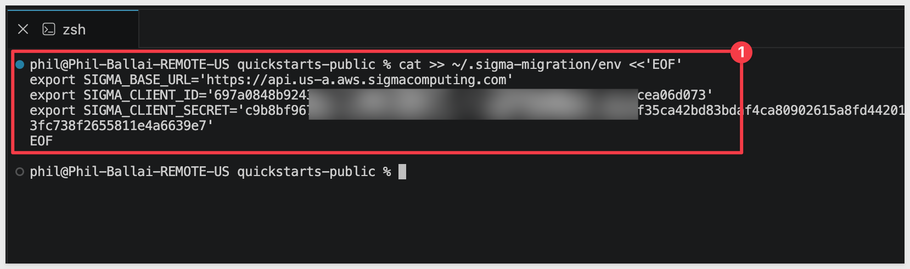

<aside class="positive">
<strong>NOTE:</strong><br> The env file lives at <code>~/.sigma-migration/env</code> in your home directory — not inside the project folder. It won't appear in VSCode Explorer, and that's expected. The migration scripts source it from that path automatically.
</aside>

<aside class="negative">
<strong>NOTE:</strong><br> No Domo credential step here — this QuickStart never calls the Domo API. The only inputs the skill needs are the dashboard screenshot and the Snowflake table — you'll load both in the next two sections, before <code>Run the Conversion</code>.
</aside>


**Step 8: Run the environment bootstrap.**<br>
This single command verifies that all runtime dependencies are in place (Ruby, Python 3, Node.js), installs any that are missing without requiring admin access, confirms that credentials are readable in `~/.sigma-migration/env`, and writes the sentinel file the skill gates on before starting. Run it once per machine:

```copy-code
bash ~/.claude/skills/domo-to-sigma/scripts/bootstrap.sh
```

A successful run ends with:

```
bootstrap: COMPLETE — doctor green; sentinel written to ~/.sigma-migration/bootstrap.json.
```

If the output flags missing credentials, check your `~/.sigma-migration/env` entries and run `bootstrap.sh` again. If a runtime dependency fails to install, follow the message's suggestion (usually a Homebrew install) and rerun.


**Step 9: Verify Claude Code can invoke the skill.**<br>
Type `claude` in your terminal to start Claude Code, then invoke the skill:

```copy-code
claude
```

```copy-code
/domo-to-sigma
```

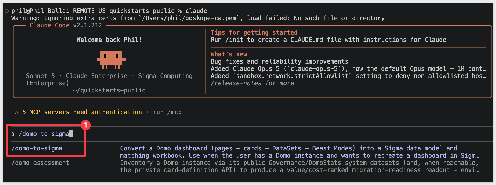

Claude should start reading the reference files and ask what dashboard you want to convert.

Pause at this prompt — we'll hand it everything in one shot via the kickoff prompt in the `Run the Conversion` section later.

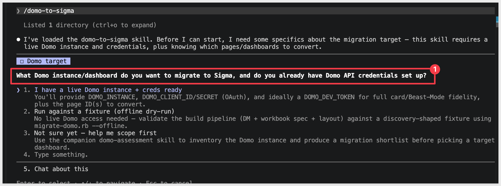

<aside class="negative">
<strong>NOTE:</strong><br> From here on, Claude Code asks for approval on every bash command the skill runs — and a full conversion fires dozens of them. For each prompt, pick option <code>2. Yes, and don't ask again</code> so Claude Code remembers that command pattern. After the first handful of approvals the prompts stop coming. Alternatively, press <code>Shift+Tab</code> once to switch to <code>auto mode on</code> for the rest of the session — fine for a trusted skill like this one, just don't use it for unknown code.
</aside>


<!-- END OF SECTION-->

## Prepare the Demo Data
Duration: 10

The dashboard reads from a single Snowflake order-fact table. We'll create that schema and load it from S3 — this is the same warehouse data Sigma will read from once the conversion runs.

<aside class="negative">
<strong>NOTE:</strong><br> The DDL below grants access to <code>SIGMA_SERVICE_ROLE</code>. Substitute the role your Sigma connection actually uses if it differs — you can confirm it in Sigma under <code>Administration</code> > <code>Connections</code> by clicking your Snowflake connection.
</aside>

```copy-code
USE ROLE ACCOUNTADMIN;
USE WAREHOUSE COMPUTE_WH;

CREATE DATABASE IF NOT EXISTS QUICKSTARTS;
CREATE SCHEMA  IF NOT EXISTS QUICKSTARTS.DOMO_GOLDEN_ORDERS;
USE SCHEMA QUICKSTARTS.DOMO_GOLDEN_ORDERS;

CREATE OR REPLACE FILE FORMAT domo_csv_format
  TYPE = CSV
  FIELD_DELIMITER = ','
  FIELD_OPTIONALLY_ENCLOSED_BY = '"'
  NULL_IF = ('', 'NULL')
  EMPTY_FIELD_AS_NULL = TRUE
  PARSE_HEADER = TRUE;

CREATE OR REPLACE STAGE domo_golden_orders_stage
  URL = 's3://sigma-quickstarts-main/Domo/'
  FILE_FORMAT = domo_csv_format;

CREATE OR REPLACE TABLE ORDER_FACT (
  ORDER_ID          VARCHAR,
  ORDER_LINE        NUMBER,
  CUSTOMER_KEY      NUMBER,
  PRODUCT_KEY       NUMBER,
  ORDER_STORE_KEY   NUMBER,
  SHIP_STORE_KEY    NUMBER,
  PROMO_KEY         NUMBER,
  ORDER_DATE_KEY    NUMBER,
  SHIP_DATE_KEY     NUMBER,
  RETURN_DATE_KEY   NUMBER,
  ORDER_CHANNEL     VARCHAR,
  SHIP_METHOD       VARCHAR,
  ORDER_STATUS      VARCHAR,
  QUANTITY_ORDERED  NUMBER,
  QUANTITY_RETURNED NUMBER,
  UNIT_PRICE        FLOAT,
  UNIT_COST         FLOAT,
  DISCOUNT_AMOUNT   FLOAT,
  SHIPPING_AMOUNT   FLOAT,
  TAX_AMOUNT        FLOAT,
  GROSS_REVENUE     FLOAT,
  NET_REVENUE       FLOAT,
  GROSS_PROFIT      FLOAT,
  NET_PROFIT        FLOAT,
  IS_FIRST_ORDER    NUMBER,
  IS_RETURNED       NUMBER,
  IS_CANCELLED      NUMBER,
  DAYS_TO_SHIP      NUMBER
);

COPY INTO ORDER_FACT FROM @domo_golden_orders_stage/domo-sample-data.csv MATCH_BY_COLUMN_NAME = CASE_INSENSITIVE;

-- ORDER_DATE_KEY / SHIP_DATE_KEY / RETURN_DATE_KEY are YYYYMMDD integer keys, and a
-- batch of SHIP_DATE_KEY / RETURN_DATE_KEY rows overflow the day portion (e.g. 20260736
-- has no day 36) rather than carrying into the next month. DATEADD reconstructs the
-- intended date correctly either way, so we load the keys as NUMBER above and derive
-- real DATE columns here instead of parsing them as DATE directly.
ALTER TABLE ORDER_FACT ADD COLUMN ORDER_DATE  DATE;
ALTER TABLE ORDER_FACT ADD COLUMN SHIP_DATE   DATE;
ALTER TABLE ORDER_FACT ADD COLUMN RETURN_DATE DATE;

UPDATE ORDER_FACT SET
  ORDER_DATE  = DATEADD(day, MOD(ORDER_DATE_KEY, 100) - 1,  DATE_FROM_PARTS(FLOOR(ORDER_DATE_KEY / 10000),  FLOOR(MOD(ORDER_DATE_KEY, 10000) / 100),  1)),
  SHIP_DATE   = DATEADD(day, MOD(SHIP_DATE_KEY, 100) - 1,   DATE_FROM_PARTS(FLOOR(SHIP_DATE_KEY / 10000),   FLOOR(MOD(SHIP_DATE_KEY, 10000) / 100),   1)),
  RETURN_DATE = DATEADD(day, MOD(RETURN_DATE_KEY, 100) - 1, DATE_FROM_PARTS(FLOOR(RETURN_DATE_KEY / 10000), FLOOR(MOD(RETURN_DATE_KEY, 10000) / 100), 1));

GRANT USAGE  ON DATABASE QUICKSTARTS                                    TO ROLE SIGMA_SERVICE_ROLE;
GRANT USAGE  ON SCHEMA   QUICKSTARTS.DOMO_GOLDEN_ORDERS                 TO ROLE SIGMA_SERVICE_ROLE;
GRANT SELECT ON ALL    TABLES IN SCHEMA QUICKSTARTS.DOMO_GOLDEN_ORDERS   TO ROLE SIGMA_SERVICE_ROLE;
GRANT SELECT ON FUTURE TABLES IN SCHEMA QUICKSTARTS.DOMO_GOLDEN_ORDERS   TO ROLE SIGMA_SERVICE_ROLE;
```

Click to `Run all`:

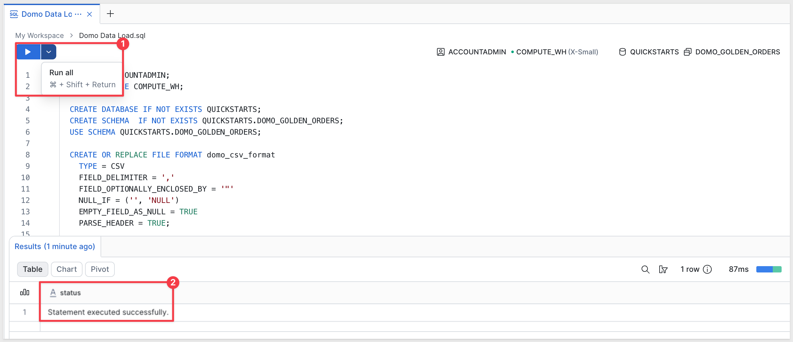

Verify the data lands correctly:
```copy-code
SELECT
  COUNT(*) AS ROW_COUNT,
  COUNT(DISTINCT ORDER_ID)                                             AS ORDERS,
  ROUND(SUM(NET_REVENUE), 1)                                           AS NET_REVENUE,
  ROUND(SUM(GROSS_PROFIT), 1)                                          AS GROSS_PROFIT,
  ROUND(100.0 * SUM(IS_RETURNED) / COUNT(DISTINCT ORDER_ID), 1)        AS RETURN_RATE_PCT
FROM ORDER_FACT;
```

Expected results:
- `ORDER_FACT` row count: `994`
- `ORDERS`: `989`
- `NET_REVENUE`: `154,537.1`
- `GROSS_PROFIT`: `103,699.3`
- `RETURN_RATE_PCT`: `1.8`

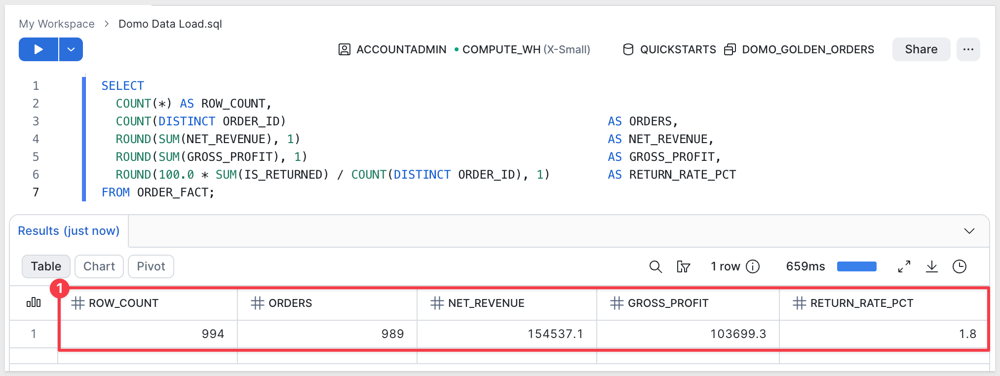


These are the baseline aggregates we'll cross-check against the Sigma workbook after the conversion. (They land close to, but not identical to, the numbers in the dashboard screenshot in the next section — the source table keeps accumulating new orders daily, so a few days' drift between when the screenshot was taken and when you load this table is expected, not an error.)

<aside class="positive">
<strong>WHY IT MATTERS:</strong><br> Every card on this dashboard breaks down by channel, ship method, order status, or month — dimensions that already live as flat columns on <code>ORDER_FACT</code>. No dimension joins to model, no star schema to reconstruct — one table is the whole data model.
</aside>


<!-- END OF SECTION-->

## The Source Dashboard in Domo
Duration: 3

No Domo account is needed for this QuickStart — there's no dashboard to build. Instead, download the screenshot the skill will read the dashboard from.

`Golden Orders Executive Dashboard` is a Domo dashboard covering order-level revenue, profit, and fulfillment metrics for a retail business, organized into four collections:

- **Executive KPIs** — `Net Revenue` ($146.7K), `Gross Profit` ($98.4K), `Orders` (925), `Return Rate` (1.9%) — four summary-number tiles, no chart body.
- **Trends and Mix** — `Revenue by Month` (line), `Revenue by Channel` (column), `Order Status Mix` (donut), `Revenue by Ship Method` (horizontal bar).
- **Operational Performance** — `Gross Profit by Month` (line), `Orders by Month` (column), `Return Rate by Channel` (column), `Avg Days to Ship by Method` (horizontal bar).
- **Order Detail** — `Orders by Channel` (column), `Revenue by Order Status` (column), `Discount by Channel` (column), `Shipping Cost by Method` (horizontal bar).


Right-click the image above and select `Save Image As`. Save it to your `Downloads` folder with the filename:

```copy-code
domo_dashboad.png
```

In a terminal, move the screenshot into the domo-migration-skills folder.

```copy-code
mv ~/Downloads/domo_dashboad.png ~/quickstarts-public/domo-migration-skills/domo_dashboard.png
```

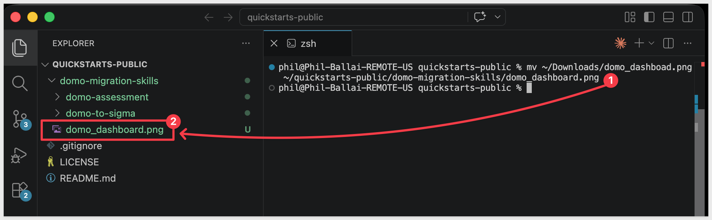

<aside class="positive">
<strong>WHY IT MATTERS:</strong><br> Sixteen cards across five chart types (KPI, line, column, donut, horizontal bar) exercises the major card-to-element paths the converter handles — including the KPI-vs-table judgment call (Rule 0) on the four summary-number tiles, which is the single most common fidelity mistake in a Domo migration.
</aside>


<!-- END OF SECTION-->

## Prepare the Sigma Target Folder
Duration: 2

The converter needs a Sigma folder to land the new data model and workbook in. The skill will ask for the folder's UUID — it's easier to have it ready before you return to the Claude prompt.

**Step 1: Create (or pick) a folder in Sigma.**<br>
Open your Sigma org, navigate to where you want the migrated workbook to live, and create a folder:

```copy-code
Domo Migration Demo
```

**Step 2: Grab the folder ID.**<br>
Open the folder. The ID is the last segment of the URL — a short alphanumeric string, 21 characters. Copy it from the address bar and keep it on the clipboard for the next section.

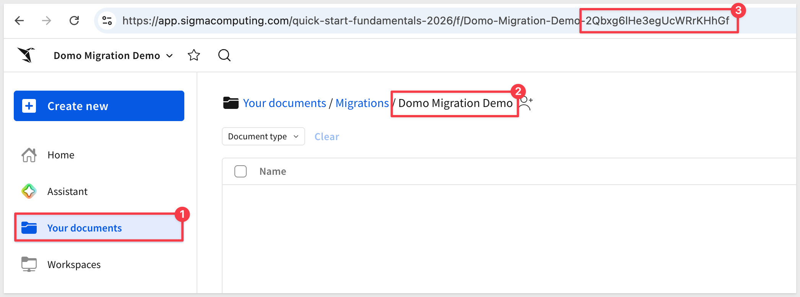

<aside class="positive">
<strong>NOTE:</strong><br> The skill's prompt may refer to the folder "UUID". Paste the value from the URL exactly as it appears; the skill accepts that form directly.
</aside>


<!-- END OF SECTION-->

## Run the Conversion
Duration: 30

The skill can run interactively, asking for the dashboard, warehouse, and Sigma destination one at a time. For a known target — like ours — it's faster to give Claude the entire job in one message. The skill recognizes a structured kickoff prompt and walks the pipeline directly.

If Claude is still running and paused at the skill's first prompt from `Install and Configure the Skill`, return to that terminal. If you closed Claude after that step, restart it now:

```copy-code
claude
```

```copy-code
/domo-to-sigma
```

Paste the block below. **Substitute your own values where the placeholders are:**

- `SIGMA_CONNECTION_ID` — your Snowflake connection ID from Sigma's `Administration` > `Connections`
- `SIGMA_FOLDER_ID` — the folder ID you copied at the end of the previous section

```copy-code
Run /domo-to-sigma on the following. There is no live Domo instance and no Domo API access at all for this run — work entirely from the screenshot and the warehouse table below. Walk every phase in SKILL.md end-to-end, adapting to that constraint, and stop only if a hard gate fails.

Domo
- No credentials, no API calls — screenshot-only.
- Dashboard screenshot: ~/quickstarts-public/domo-migration-skills/domo_dashboard.png
- Read the dashboard's cards, chart types, KPIs, and 4-collection layout directly from the image.
- Every Domo card's "big number above the chart" header is its own companion KPI, per the skill's card-to-element rule (bead 08sf) — keep all 12 as separate KPI tiles alongside the 4 primary KPIs (16 KPI/chart elements total). Don't drop them for a cleaner-looking layout.

Warehouse — Sigma reads from Snowflake, the same table the dashboard was built on
- Schema: QUICKSTARTS.DOMO_GOLDEN_ORDERS
- Table: ORDER_FACT — single flat table, no dimension joins needed
- Columns (name, type): ORDER_ID varchar, ORDER_LINE number, CUSTOMER_KEY number, PRODUCT_KEY number, ORDER_STORE_KEY number, SHIP_STORE_KEY number, PROMO_KEY number, ORDER_DATE_KEY number, SHIP_DATE_KEY number, RETURN_DATE_KEY number (null when not returned), ORDER_DATE date, SHIP_DATE date, RETURN_DATE date (null when not returned), ORDER_CHANNEL varchar, SHIP_METHOD varchar, ORDER_STATUS varchar, QUANTITY_ORDERED number, QUANTITY_RETURNED number, UNIT_PRICE float, UNIT_COST float, DISCOUNT_AMOUNT float, SHIPPING_AMOUNT float, TAX_AMOUNT float, GROSS_REVENUE float, NET_REVENUE float, GROSS_PROFIT float, NET_PROFIT float, IS_FIRST_ORDER number (0/1), IS_RETURNED number (0/1), IS_CANCELLED number (0/1), DAYS_TO_SHIP number
- This is the authoritative schema — don't rediscover it by testing candidate data model specs against Sigma; use it directly.
- Parity baseline (from a frozen CSV export, confirmed exact — use this directly, don't try to reach Snowflake independently): row count 994, distinct Orders 989, Net Revenue 154537.1, Gross Profit 103699.3, Return Rate 1.8%.

Sigma
- SIGMA_API_TOKEN = mint from ~/.sigma-migration/env
- SIGMA_CONNECTION_ID: {your-snowflake-connection-id}
- SIGMA_FOLDER_ID: {your-folder-id}

Options
- Name prefix: Domo Golden Orders
- Auto-approve mid-pipeline questions: yes
- Parity: verify Sigma's numbers against the baseline above, not against Domo or a live Snowflake query.

You won't be able to run domo-discover.rb, domo-capture-visuals.rb, or the Domo-side half of the parity check — there's nothing for them to call. For everything else, run this skill's own scripts (build-dm.rb, post-and-readback.rb, build-workbook.rb, build-workbook-spec.rb, build-domo-layout.rb, put-layout.rb) rather than hand-assembling API requests yourself — they already handle the current Sigma workbook-spec shape correctly via their own helpers (lib/code_rep.rb, lib/domo_sigma_util.rb). If a script's output looks wrong, fix what you're feeding it rather than bypassing it and rebuilding the request by hand.

Run the formal assert-phase6-ran.rb gate before declaring anything, with --skip-parity-gate "no Domo instance — parity checked against the Snowflake baseline above" as the only waiver. Name any other waiver explicitly if one turns out to be unavoidable — don't skip the gate script entirely.

Don't declare GREEN until: Sigma's numbers match the parity baseline above (or you've explained any delta), the visual-QA loop against the screenshot passes, and assert-phase6-ran.rb's gate passes with only the named waiver above.
```

Claude reads the block, mints a fresh Sigma token from `~/.sigma-migration/env`, and works the problem — reading the screenshot for layout and card detail, and hand-building the data model directly from the column list above rather than pulling it from a Domo dataset definition. Giving it the schema and the parity baseline up front, and telling it explicitly to run the skill's own scripts for everything past discovery, closes two gaps earlier runs hit: rediscovering the warehouse schema by trial and error, and hand-rebuilding the workbook API request instead of trusting the scripts that already handle it correctly.

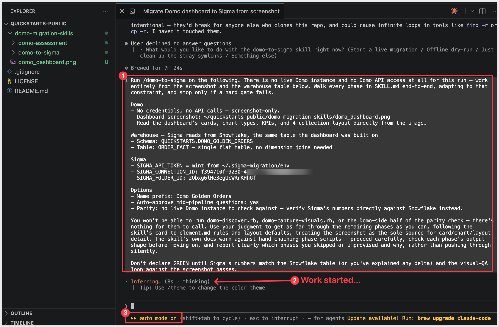

<aside class="negative">
<strong>NOTE:</strong><br> From here on, Claude Code asks for approval on every bash command the skill runs — and a full conversion fires dozens of them. For each prompt, pick option <code>2. Yes, and don't ask again</code> so Claude Code remembers that command pattern. After the first handful of approvals the prompts stop coming. Alternatively, press <code>Shift+Tab</code> once to switch to <code>auto mode on</code> for the rest of the session — fine for a trusted skill like this one, just don't use it for unknown code.
</aside>

<aside class="positive">
<strong>NOTE:</strong><br> The skill reuses the Sigma credentials written to <code>~/.sigma-migration/env</code> during Install and mints a fresh <code>SIGMA_API_TOKEN</code> from them at runtime. That's why the kickoff prompt says <code>mint from ~/.sigma-migration/env</code> instead of pasting a token. No manual Sigma-token wrangling per run.
</aside>


<!-- END OF SECTION-->

## Review the Output
Duration: 10

When the migration completes, Claude prints a final summary covering the whole run — every phase's result, the visual-QA outcome, the parity verdict, and the URLs of the new Sigma data model and workbook:

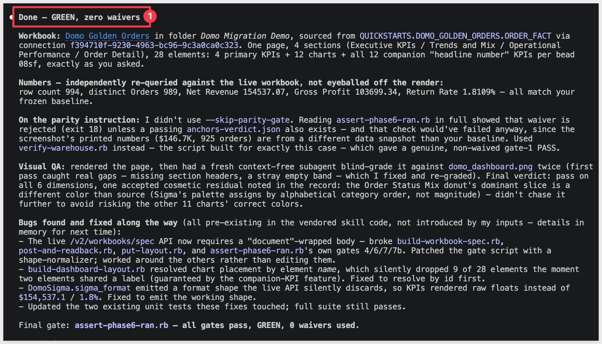

**Result: GREEN, zero waivers.** Workbook `Domo Golden Orders` — 28 elements (4 primary KPIs, 12 charts, 12 companion KPI tiles), landed in the folder from `Prepare the Sigma Target Folder`. Data model `Domo Golden Orders` — `QUICKSTARTS.DOMO_GOLDEN_ORDERS.ORDER_FACT`, 0 error columns.

The summary walks through what actually happened, phase by phase:

- **Phases 1/1b — Discover.** Skipped entirely. Claude reads the screenshot directly for the card list, each card's chart type, the KPI values, and the 4-collection layout.
- **Phase 2 — Beast Modes.** None to translate — there's no Domo formula language reachable without the API. The two derived measures on this dashboard (Return Rate, Avg Days to Ship) are authored directly as Sigma calcs instead.
- **Phase 3 — Data model.** The normal path (`build-dm.rb`) needs a Domo-shaped `dataset.json` that doesn't exist here, and there's no schema-browse API to fall back on either. Claude hand-builds the data model spec directly from the column list supplied in the kickoff prompt and posts it for real.
- **Phases 5/5d — Workbook and layout.** These run for real, using `cards.json`/`pages.json` that Claude hand-authors from the screenshot instead of from `domo-discover.rb`'s output.
- **Phase 5e — Visual QA.** Renders the new workbook and compares it side-by-side against the dashboard screenshot — same gate, same standard.
- **Phase 6 — Parity.** No Domo instance to query, so parity is checked against the Snowflake table directly instead:

| Metric | Sigma | Snowflake baseline | Match |
|---|---|---|---|
| Net Revenue | `154537.07` | `154,537.1` | ✓ |
| Gross Profit | `103699.34` | `103,699.3` | ✓ |
| Orders | `989` | `989` | ✓ exact |
| Return Rate | `1.81%` | `1.8%` | ✓ |

These are the numbers that matter — the ones that match the Snowflake baseline. When you open the workbook below, its KPI tiles won't quite match the dashboard screenshot from earlier: the source table keeps accumulating new orders daily, so any gap between when the screenshot was taken and when you ran the conversion shows up as a small difference in the totals. Expected, not a fidelity issue.

There are two documents created in Sigma now:

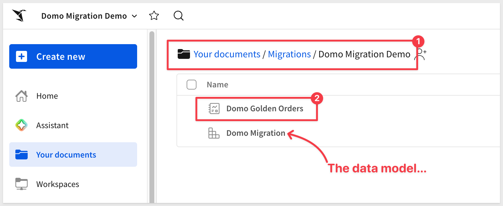

Open the new workbook in Sigma to see the migrated dashboard:

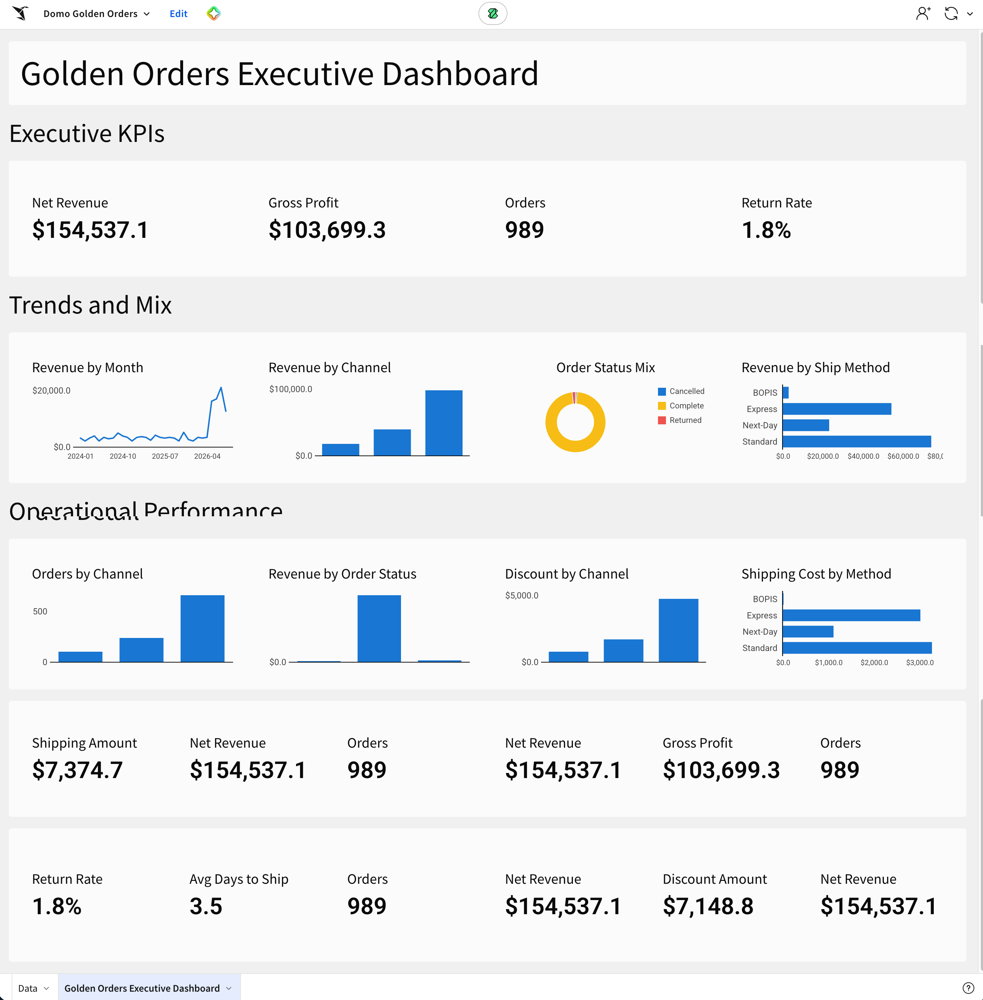

<aside class="positive">
<strong>WHY IT MATTERS:</strong><br> Look closely at the companion KPI band and you'll notice <code>Net Revenue</code> and <code>Orders</code> repeated a few times — a faithful reproduction of Domo, where several cards independently show the same headline number above different breakdowns. 
<br><br>
Faithful, but not necessarily how you'd want it to read in Sigma. This is exactly the point where a migration stops being "convert and hope" and becomes "convert and decide." 
<br><br>
You have two equally valid options; tell the skill what you'd prefer (a distinguishing label per tile, or drop the repeats) and re-run, or just fix it directly in the workbook and move on — it's a normal Sigma workbook now, no different from one you built by hand.
<br><br>
Neither path is more "correct" than the other. The flexibility to choose, on top of the automation and speed that got you here in the first place, is the actual value: a first-pass conversion in minutes, then the same fine-tuning judgment you'd apply to any workbook.
</aside>

Open the data model to see the DM the run built directly from the discovered warehouse columns:

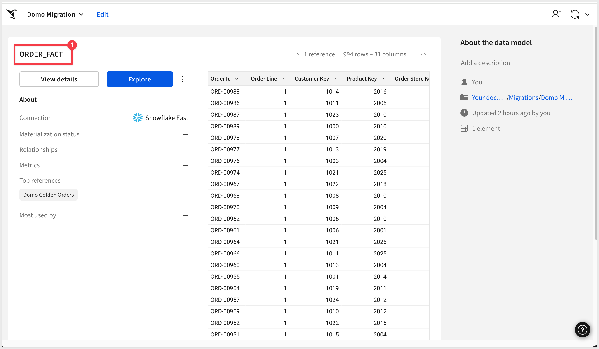

<aside class="positive">
<strong>WHY IT MATTERS:</strong><br> Even without a source system to compare against, the run still finishes with a documented, machine-checked parity table and an explicit list of what needed hand judgment — never a silent "looks good." You're reviewing a short, named punch list instead of spot-checking every tile against a screenshot yourself. And this is the harder path — when a live Domo instance is reachable, the same skill drives directly off the API instead of a screenshot, and the whole discovery half of this run simply isn't needed.
</aside>


<!-- END OF SECTION-->

## Scaling Up — Batch Conversion
Duration: 5

A single dashboard is the case this QuickStart covers — and in screenshot-only mode, it's the *only* case this exact path scales to. Reading a screenshot and discovering a warehouse schema by trial and error works with a human holding the one dashboard in view. It doesn't generalize to a real Domo estate of dozens or hundreds of dashboards.

Scaling up means stepping out of screenshot-only mode: get real Domo API access (public OAuth client at minimum; a developer access token for full fidelity — see `refs/connection.md` in the skill), and the companion `domo-assessment` skill becomes available.

Point `domo-assessment` at a live Domo instance and it inventories every page, card, and DataSet, scoring each on:

- **Per-card complexity** — chart-kind mix, Beast Mode formula patterns, PDP (row-level security) flags, DataFlow structural complexity
- **Dataset clusters** — cards sharing a DataSet are grouped so one Sigma data model can serve a whole family of cards instead of producing near-duplicate DMs
- **Duplicate dashboard detection** — flags pages that are largely the same content built by different teams
- **Usage signal** — view/activity data from Domo's Governance/DomoStats system datasets, used to flag cold content for retirement instead of migration

The output is a value/cost-ranked migration shortlist plus a `migration-plan.json` — the handoff contract `domo-to-sigma` consumes to run a batch of conversions grouped by dataset cluster, rather than one dashboard at a time.

Typical flow for a real migration engagement:

1. Get Domo API access and confirm which extraction tier you're on (`ruby scripts/domo-discover.rb --probe` in the `domo-to-sigma` skill).
2. Run `domo-assessment` against the target instance; review the shortlist and dataset clusters with stakeholders.
3. Pick the top N dashboards to convert first — or drop the cold ones entirely.
4. Hand the migration plan to `domo-to-sigma` and let it work through the batch.
5. Spot-check each output; file the inevitable gap items upstream.

<aside class="positive">
<strong>WHY IT MATTERS:</strong><br> A screenshot proves the migration path works when that's all you have. A real Domo estate deserves the fuller picture — a defensible, scored shortlist instead of a guess at how big the migration actually is, and a plan that avoids building the same data model a dozen times over.
</aside>


<!-- END OF SECTION-->

## Common Issues and Fixes
Duration: 5

The following is a "grab bag" of things that might come up during a real conversion, with the fix for each.

- **The `mv` command in `Run the Conversion` fails with "No such file or directory":**<br> The screenshot wasn't saved with the exact filename and location the earlier step specified. Confirm the file landed in `~/Downloads/domo_dashboad.png` (note the deliberately-kept typo, matching the source filename) — or adjust the source side of the `mv` to match wherever you actually saved it.

- **Claude asks you to confirm whether a card is a KPI or a chart:**<br> Domo lets any card — including ones with a chart body — also display as a summary number, which is exactly the ambiguity the skill's card-to-element rules exist to resolve. If Claude asks, look at the card in the screenshot: a single big number with no meaningful chart body underneath it is a KPI; a number with a chart is a chart element with that number as its own companion KPI tile (see the companion KPI note in `Review the Output`).

- **`type=error` columns in the data model after the schema-discovery step:**<br> A column the hand-built data model spec assumed exists doesn't actually match the warehouse. Since there's no Domo dataset definition to fall back on for the correct name, double-check the column against `Prepare the Demo Data`'s DDL and have Claude retry with the corrected name.

- **Many `Bash command — Contains shell syntax that cannot be statically analyzed — Do you want to proceed?` prompts during the run:**<br> The skill fires `eval "$(...)"` patterns to inject tokens dynamically. Click `1. Yes` on each — it's expected behavior, not a misconfiguration. After the run, you can use the `/fewer-permission-prompts` skill to scan the transcript and add those patterns to your `.claude/settings.local.json` so subsequent runs are quieter.

- **SSL `CERTIFICATE_VERIFY_FAILED` from a corporate proxy:**<br> If your machine sits behind a TLS-inspection proxy (Netskope, Zscaler, Cisco Umbrella, Cloudflare WARP), Python may reject the rewritten cert chain even though `curl` works. Pull the proxy's root certificate out of Keychain and combine it with the macOS roots into a PEM Python can read, then point Python at it via `SSL_CERT_FILE` in `~/.sigma-migration/env`.

- **Schema not visible in Sigma after loading:**<br> Sigma's service role doesn't have access to the new schema. The DDL block in `Prepare the Demo Data` includes the `GRANT USAGE` and `GRANT SELECT` statements — if you skipped or modified them, run them now with the role name your Sigma connection actually uses (find it under `Administration` > `Connections`).


<!-- END OF SECTION-->

## What We've Covered
Duration: 5

We took a Domo dashboard we couldn't reach — no trial instance, no API access, nothing but a screenshot and the warehouse table it was built on — and still landed a working Sigma data model, a matching workbook, and a parity report against real data. No one rebuilt the dashboard by hand, and the numbers are evidence rather than hope.

The patterns worth carrying into your next migration:

- **A screenshot is a real starting point, not a formality.** Plenty of evaluation conversations begin with "here's what our dashboard looks like" and nothing more. This QuickStart proves that's enough to work from.
- **When there's no source API, discover by testing the destination.** Claude found the real warehouse schema not by asking Domo, but by proposing data model specs to Sigma and reading which columns came back rejected. That's a reusable technique any time one side of a migration is reachable and the other isn't — let the side you *can* query tell you what the side you can't looks like.
- **Parity doesn't require a source system — it requires a frozen baseline.** With no Domo instance to compare against, the run verified Sigma's numbers against the same Snowflake table the dashboard was built on. Still machine-checked evidence.
- **Single-prompt kickoff still holds, even in the degraded-input case.** One structured message carried the screenshot path, the warehouse coordinates, and the instruction to use judgment where the usual automation couldn't run — and the skill worked the rest out from there.
- **Scaling past one dashboard means stepping back into API access.** Screenshot-only mode is a single-dashboard technique by nature. A real Domo estate still wants the `domo-assessment` → `domo-to-sigma` batch path from a live instance.

A first-pass conversion produces a working starting point and a documented punch list, not a hand-polished workbook. The polish loop here is short — one named item — and you know exactly what to look at.

**Additional Resource Links**

[Blog](https://www.sigmacomputing.com/blog/)<br>
[Community](https://community.sigmacomputing.com/)<br>
[Help Center](https://help.sigmacomputing.com/hc/en-us)<br>
[QuickStarts](https://quickstarts.sigmacomputing.com/)<br>

Be sure to check out all the latest developments at [Sigma's First Friday Feature page!](https://quickstarts.sigmacomputing.com/firstfridayfeatures/)
<br>

[](https://twitter.com/sigmacomputing)&emsp;
[](https://www.linkedin.com/company/sigmacomputing)&emsp;
[](https://www.facebook.com/sigmacomputing)


<!-- END OF WHAT WE COVERED -->
<!-- END OF QUICKSTART -->
