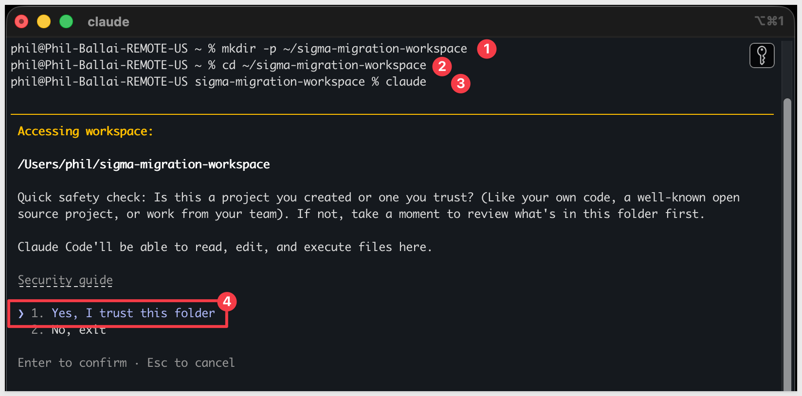

author: pballai
id: developers_migrating_from_hex_made_easy
summary: developers_migrating_from_hex_made_easy
categories: developers
environments: web
status: Hidden
feedback link: https://github.com/sigmacomputing/sigmaquickstarts/issues
tags:
lastUpdated: 2026-08-15

# Migrating From Hex Made Easy

## Overview
Duration: 5

{TBD — Overview opening line pending final skill scope. Draft below is a placeholder shape, not final copy.}

A common ask from teams evaluating Sigma is migrating their Hex footprint — usually to trade a notebook built and maintained by a single analyst for a live-query workspace the whole team can drive without touching SQL or Python. The conversion itself is often the thing that stalls the project.

Hex projects mix SQL cells, Python cells, and chart cells into a single notebook, then publish that notebook as an interactive app. Rebuilding one in Sigma by hand means tracing which SQL cell feeds which chart, translating any Python transformation logic into a Sigma formula or data model step, and rebuilding the input parameters as Sigma controls — then eyeballing the numbers and hoping nothing drifted. Done on a single project it's tedious. Across a real Hex workspace — dozens of projects, shared cells, and Python-heavy transformations — it's the reason migration projects slip.

This QuickStart walks through a `Claude Code` skill called `hex-to-sigma` {TBD — confirm final skill name once built} that automates the loop.

{TBD — mechanics paragraph pending skill build. Once the skill exists, describe what it discovers via the Hex API (project, cells, app), how it translates SQL/Python cell logic to Sigma formulas or data model steps, how it rebuilds the app's layout and inputs in Sigma, and how it verifies parity against the warehouse.}

<aside class="positive">
<strong>WHY IT MATTERS:</strong><br> {TBD — restate once the skill's actual discover/translate/build/verify loop is confirmed. Likely mirrors the rest of the family: a working Sigma workbook on the warehouse, plus a parity check that proves it matches the Hex source, instead of a rebuilt-by-hand app you have to spot-check yourself.}
</aside>

### What else this enables

{TBD — the family pattern for this subsection covers dedup-before-migrating, enhance-don't-just-translate, and audit-your-source-as-a-side-effect. Revisit once the skill exists and we know which of these apply cleanly to Hex's Python-heavy projects — the "enhance" angle is likely the strongest one here, since Hex's input-parameter-driven notebooks map naturally to Sigma controls and input tables.}

### Sample project

For the demonstration, we'll convert a Hex project called `Commerce Dashboard` — reusing the same Commerce e-commerce dataset from the [Migrating From Cognos Made Easy](developers_migrating_from_cognos_made_easy.md) QuickStart, so the underlying numbers and warehouse tables are already proven out. You'll see the discovery artifacts each phase produces, the converter's breakdown of how each Hex cell mapped to a Sigma formula or data model step, the parity report against the live warehouse, and the resulting Sigma data model and workbook landed in your org — along with the gap list of items to hand-polish.


<aside class="positive">
<strong>ABOUT THE SKILL CODE:</strong><br> The skill code used in this QuickStart is vendored into <code>sigmacomputing/quickstarts-public</code> for a stable reader experience — the version you clone matches what's captured in the screenshots and outputs below. {TBD — confirm upstream repo path once the skill is built and merged into TJ's monorepo.}
</aside>

<aside class="negative">
<strong>NOTE:</strong><br> The migration is one-directional — Hex is the source, Sigma is the target. Sigma reads the warehouse live, so the conversion's accuracy depends on the warehouse tables behind your Hex project's SQL cells being reachable from a Sigma connection. {TBD — confirm exactly how the skill resolves Python-cell transformations that don't map to a straight warehouse table, once the skill's translation approach is built.}
</aside>

<aside class="negative">
<strong>AI MODEL DIFFERENCES:</strong><br> Depending on which AI, model, and version you're running, the exact prompt wording, option ordering, and intermediate messages may differ slightly from what's shown in this QuickStart. The substantive steps and decisions are the same — pick the option that matches the intent described, even if the label varies.
</aside>

### Target Audience
Sigma SEs, technical CSMs, and migration partners running Hex-to-Sigma conversions.

### Prerequisites
- `Claude Code` installed (CLI or desktop).
- Sigma API credentials.
- A Hex workspace with an account that has at least read access to the target project.
- `Python 3.10` or newer. macOS's stock system Python is typically 3.9 — older than the skill needs. If `python3 --version` reports anything below 3.10, install a newer interpreter via [Homebrew](https://brew.sh/) (`brew install python@3.12`) or [python.org](https://www.python.org/downloads/).
- `Node.js` (any recent LTS) for the converter MCP.
- A warehouse reachable from Sigma (Snowflake, BigQuery, Databricks, Redshift, Postgres, and others) that your Hex project also queries.

<aside class="negative">
<strong>NOTE:</strong><br> Use a non-production Sigma org for your first run. The skill creates real workbooks, and error-recovery paths may iterate via PUT to update them.
</aside>

<button>[Sigma Free Trial](https://www.sigmacomputing.com/free-trial/)</button>


<!-- END OF SECTION-->

## The Hex Migration Skill Family
Duration: 5

{TBD — entire section pending skill build. Draft below assumes the family's usual two-skill split (scoping + conversion); confirm this is the right shape for Hex before finalizing. Hex workspaces are typically smaller and more code-centric than a Cognos/Sisense estate, so a full assessment skill may be lower priority than for the dashboard-first tools in this family.}

`hex-to-sigma` {TBD — confirm name} is planned as one of two skills that would ship together as a single repo (cloned in the next section).

| Skill | Role | When to reach for it |
|-------|------|----------------------|
| `hex-assessment` {TBD} | Scoping | Auditing a Hex workspace before committing to a conversion plan. {TBD — confirm scope once built.} |
| `hex-to-sigma` {TBD} | Conversion | The subject of this QuickStart. Converts a single Hex project to a Sigma data model and matching workbook with verified row-level parity. |

<!--  -->

<aside class="positive">
<strong>WHY IT MATTERS:</strong><br> Each skill does one thing well — scoping and conversion. Pick the smallest set that fits your job, and don't run the conversion until you've confirmed the data is somewhere Sigma can actually read.
</aside>


<!-- END OF SECTION-->

## Install and Configure the Skill
Duration: 15

{TBD — this entire section is a placeholder shape copied from the family pattern. Rewrite once the skill exists — repo path, symlink target, and auth flow all depend on how the Hex skill is built.}

First we need to clone the skill's GitHub repository, configure Hex API credentials, and capture your Sigma credentials.

The two skills are expected to live in `sigmacomputing/quickstarts-public` under `hex-migration-skills/` {TBD — confirm path once vendored}.

**Step 1–6: Clone and symlink** — same sparse-checkout pattern as the rest of the family. {TBD — fill in exact commands once the repo path is confirmed; see the [Cognos QS Install section](developers_migrating_from_cognos_made_easy.md) for the reference shape.}

**Step 7: Add your Sigma API credentials.**<br>
Same as the rest of the family — written to `~/.sigma-migration/env`:

```copy-code
cat >> ~/.sigma-migration/env <<'EOF'
export SIGMA_BASE_URL='https://api.us-a.aws.sigmacomputing.com'
export SIGMA_CLIENT_ID='{your-client-id}'
export SIGMA_CLIENT_SECRET='{your-client-secret}'
EOF
```

Get `SIGMA_CLIENT_ID` and `SIGMA_CLIENT_SECRET` from Sigma under `Administration` > `Developer Access` > `Create New Client Credentials` (requires Admin role).

For information, see: [Generate Sigma API client credentials](https://help.sigmacomputing.com/reference/generate-client-credentials)

`SIGMA_BASE_URL` must match your Sigma deployment region. The value shown (`https://api.us-a.aws.sigmacomputing.com`) covers AWS US. To find the correct URL for your instance, see: [Supported regions, data platforms, and features](https://help.sigmacomputing.com/docs/region-warehouse-and-feature-support)

**Step 8: Configure Hex credentials.** {TBD}<br>
Hex's REST API authenticates via a workspace-scoped API token (`Settings` > `API Keys` in the Hex UI, unconfirmed against the live trial). {TBD — confirm exact auth flow, env var names, and whether a session-establishment step (like Cognos's API-key session) is needed once the skill's auth approach is built.}

**Step 9: Run the environment bootstrap.** {TBD — same shape as the rest of the family, pending skill build.}

**Step 10: Verify Claude Code can invoke the skill.**<br>

```copy-code
claude
```

```copy-code
/hex-to-sigma
```

{TBD — confirm slash command name matches the skill folder name once built.}

<aside class="negative">
<strong>NOTE:</strong><br> From here on, Claude Code asks for approval on every bash command the skill runs — and a full conversion fires dozens of them. For each prompt, pick option <code>2. Yes, and don't ask again</code> so Claude Code remembers that command pattern. After the first handful of approvals the prompts stop coming. Alternatively, press <code>Shift+Tab</code> once to switch to <code>auto mode on</code> for the rest of the session — fine for a trusted skill like this one, just don't use it for unknown code.
</aside>


<!-- END OF SECTION-->

## Common Issues
Duration: 5

{TBD — write once the skill exists and a real run has surfaced actual failure modes. Placeholder categories below, based on the shape of issues that have come up elsewhere in the family — confirm or replace once the Hex skill is built.}

### Warehouse tables don't appear as expected

{TBD — Hex-specific equivalent of the JDBC/connection-string issues seen in Cognos and Sisense. Confirm once the Hex-to-Snowflake connection is configured in the trial.}

### Python-cell transformations that don't map to a Sigma formula

{TBD — Hex projects can do arbitrary Python transformations that have no direct Sigma equivalent. Document the skill's fallback behavior (flag for manual review vs. attempt a data-model step) once built.}


<!-- END OF SECTION-->

## Prepare Demo Data
Duration: 10

The demo uses the same four Commerce e-commerce tables used across the migration skill family — including [Migrating From Cognos Made Easy](developers_migrating_from_cognos_made_easy.md). Both Hex and Sigma will query these tables directly, which is what makes the parity check meaningful.

Run the following script in Snowflake. It creates the schema, stages the source files from S3, loads the tables, and grants read access to the Sigma service role.

```copy-code
USE ROLE ACCOUNTADMIN;
USE WAREHOUSE COMPUTE_WH;

CREATE DATABASE IF NOT EXISTS QUICKSTARTS;
CREATE SCHEMA  IF NOT EXISTS QUICKSTARTS.HEX_ECOMMERCE;
USE SCHEMA QUICKSTARTS.HEX_ECOMMERCE;

CREATE OR REPLACE FILE FORMAT HEX_csv_format
  TYPE = CSV
  FIELD_DELIMITER = ','
  FIELD_OPTIONALLY_ENCLOSED_BY = '"'
  NULL_IF = ('', 'NULL')
  EMPTY_FIELD_AS_NULL = TRUE
  PARSE_HEADER = TRUE;

CREATE OR REPLACE STAGE HEX_ecommerce_stage
  URL = 's3://sigma-quickstarts-main/Hex/'
  FILE_FORMAT = HEX_csv_format;

CREATE OR REPLACE TABLE BRAND (
  "Brand ID" NUMBER,
  "Brand"    VARCHAR
);

CREATE OR REPLACE TABLE CATEGORY (
  "Category ID" NUMBER,
  "Category"    VARCHAR
);

CREATE OR REPLACE TABLE COUNTRY (
  "Country ID" NUMBER,
  "Country"    VARCHAR
);

CREATE OR REPLACE TABLE COMMERCE (
  "Visit ID"    NUMBER,
  "Date"        DATE,
  "Brand ID"    NUMBER,
  "Category ID" NUMBER,
  "Country ID"  NUMBER,
  "Revenue"     FLOAT,
  "Quantity"    NUMBER,
  "Cost"        FLOAT,
  "Age Range"   VARCHAR,
  "Gender"      VARCHAR,
  "Condition"   VARCHAR
);

COPY INTO BRAND    FROM @HEX_ecommerce_stage/BRAND.csv    MATCH_BY_COLUMN_NAME = CASE_INSENSITIVE;
COPY INTO CATEGORY FROM @HEX_ecommerce_stage/CATEGORY.csv MATCH_BY_COLUMN_NAME = CASE_INSENSITIVE;
COPY INTO COUNTRY  FROM @HEX_ecommerce_stage/COUNTRY.csv  MATCH_BY_COLUMN_NAME = CASE_INSENSITIVE;
COPY INTO COMMERCE FROM @HEX_ecommerce_stage/COMMERCE.csv MATCH_BY_COLUMN_NAME = CASE_INSENSITIVE;

SELECT 'BRAND'    AS TBL_NAME, COUNT(*) AS ROW_COUNT FROM BRAND
UNION ALL
SELECT 'CATEGORY', COUNT(*) FROM CATEGORY
UNION ALL
SELECT 'COUNTRY',  COUNT(*) FROM COUNTRY
UNION ALL
SELECT 'COMMERCE', COUNT(*) FROM COMMERCE;

GRANT USAGE  ON DATABASE QUICKSTARTS                               TO ROLE SIGMA_SERVICE_ROLE;
GRANT USAGE  ON SCHEMA   QUICKSTARTS.HEX_ECOMMERCE                 TO ROLE SIGMA_SERVICE_ROLE;
GRANT SELECT ON ALL    TABLES IN SCHEMA QUICKSTARTS.HEX_ECOMMERCE  TO ROLE SIGMA_SERVICE_ROLE;
GRANT SELECT ON FUTURE TABLES IN SCHEMA QUICKSTARTS.HEX_ECOMMERCE  TO ROLE SIGMA_SERVICE_ROLE;
```

SELECT
  ROUND(SUM("Revenue"), 3) AS TOTAL_REVENUE,
  SUM("Quantity")          AS TOTAL_QUANTITY
FROM COMMERCE;


The final query confirms the load. Expected results: 613,002 rows in COMMERCE, total revenue `39,759,625.515`, total quantity `91,206`:


<aside class="positive">
<strong>NOTE:</strong><br> {TBD — confirm the S3 CSV files exist at <code>s3://sigma-quickstarts-main/Hex/</code> before running this script. The Cognos QS uses the same file names at <code>s3://sigma-quickstarts-main/Cognos/</code> — if a Hex-specific copy hasn't been staged yet, point the stage URL there instead, or ask TJ to mirror the files into a <code>Hex/</code> prefix.}
</aside>


<!-- END OF SECTION-->

## Import the Sample Project
Duration: 5

With the Snowflake data in place, import the pre-built `Commerce Dashboard` project instead of building it cell-by-cell. Hex's project export/import is fully round-trip compatible, so this reproduces the exact dashboard used throughout this QuickStart — one SQL cell joining the four Commerce tables, two KPI cells, and four charts (including the Top 10 filters) — without a click-by-click UI walkthrough.

### Connect Hex to Snowflake

The imported project's SQL cell needs a data connection in *your* workspace — Hex doesn't carry someone else's connection across an import.

If your workspace doesn't already have a Snowflake connection pointed at `QUICKSTARTS.HEX_ECOMMERCE`, an Admin needs to add one first: `Workspace settings` > `Data sources` > `+ Connection` > `Snowflake`, then fill in the account, warehouse, database, and schema (`QUICKSTARTS` / `HEX_ECOMMERCE`).

<!--  -->

### Import the project

1. Download `Commerce Dashboard.yaml`: {TBD — link once `hex-migration-skills` is pushed to `sigmacomputing/quickstarts-public`}.
2. From the Hex home page, select `Import`, and upload the file.
3. Hex will prompt you to relink the SQL cell's data connection — point it at the Snowflake connection from the previous step.
4. Open the imported project, confirm the `commerce_joined` SQL cell runs cleanly, then select `Publish` in the top right. Wait for the preview run to finish, then select `Publish version`.

The completed app should show Revenue `39.8M` and Quantity `91.2K` with country, category, and year breakdowns matching the numbers confirmed in Prepare Demo Data.

<!--  -->


<!-- END OF SECTION-->

## Prepare the Sigma Target Folder
Duration: 5

The skill lands workbooks in a Sigma folder. Create a dedicated folder now so the output is organized from the start.

In Sigma, navigate to `Home` and create a new folder named `Hex Migration Demo`. Copy the folder's ID from the URL — you'll pass it to the skill in the next section.

The folder ID appears in the URL after `/folder/`:

```copy-code
https://app.sigmacomputing.com/{your-org}/folder/{your-folder-id}
```


<!-- END OF SECTION-->

## Run the Conversion
Duration: 20

{TBD — kickoff prompt below follows the family skeleton. Confirm exact env var names, credential shape, and identifier format (project ID vs. app ID) once the skill is built.}

With credentials configured and the demo project built, run the converter. Open Claude Code and invoke the skill with the kickoff prompt below — substituting your project ID, connection ID, and folder ID.

### Kickoff prompt

```copy-code
Run /hex-to-sigma on the following. Walk every phase in SKILL.md end-to-end and stop only if a hard gate fails.

Hex
- {TBD — auth env vars}
- Project ID: {your-project-id}

Warehouse — same on both sides
- Hex reads from Snowflake — database QUICKSTARTS, schema HEX_ECOMMERCE
- Sigma reads from Snowflake — same schema QUICKSTARTS.HEX_ECOMMERCE

Sigma
- SIGMA_API_TOKEN = mint from ~/.sigma-migration/env
- SIGMA_CONNECTION_ID: {your-snowflake-connection-id}
- SIGMA_FOLDER_ID: {your-folder-id}

Options
- Name prefix: Hex Demo
- Auto-approve mid-pipeline questions: yes
- Parity: data should match exactly since both sides read from the same warehouse. Report any deltas.

Don't declare GREEN until the parity gate passes and the visual-QA loop passes.
```

The skill runs through five phases: **Discover** → **Translate** → **Build** → **Verify** → **Report**. Each phase emits a progress summary — watch for any `WARN` or `MANUAL` flags, which land on the gap list rather than stopping the run.


<!-- END OF SECTION-->

## Review the Output
Duration: 10

{TBD — gated on an actual skill run. Structure below mirrors the rest of the family.}

When the skill completes, it prints a migration summary — the count of cells converted, any items flagged for manual review, and the parity result.

<!--  -->

### The Sigma workbook

Open the workbook in your Sigma folder and compare it against the source Hex app. The layout mirrors the source, and each visualization is backed by the translated formula.

<!--  -->

### The Sigma data model

The skill also creates a data model in the same folder — the tables, joins, and calculated columns derived from the Hex project's SQL cells.

<!--  -->

### The gap list

Any visualization, Python transformation, or input parameter the skill couldn't auto-translate lands in the gap list — with the source cell, the reason it was flagged, and a suggested Sigma equivalent where one exists. Work through the list to finish the migration.

<!--  -->


<!-- END OF SECTION-->

## What we've covered
Duration: 5

{TBD — write this last, after all body sections are finalized. Do not draft prose yet — the shape of what's reusable depends on the actual skill mechanics.}

**Additional Resource Links**

[Blog](https://www.sigmacomputing.com/blog/)<br>
[Community](https://community.sigmacomputing.com/)<br>
[Help Center](https://help.sigmacomputing.com/hc/en-us)<br>
[QuickStarts](https://quickstarts.sigmacomputing.com/)<br>

Be sure to check out all the latest developments at [Sigma's First Friday Feature page!](https://quickstarts.sigmacomputing.com/firstfridayfeatures/)
<br>

[](https://twitter.com/sigmacomputing)&emsp;
[](https://www.linkedin.com/company/sigmacomputing)&emsp;
[](https://www.facebook.com/sigmacomputing)


<!-- END OF WHAT WE COVERED -->
<!-- END OF QUICKSTART -->
