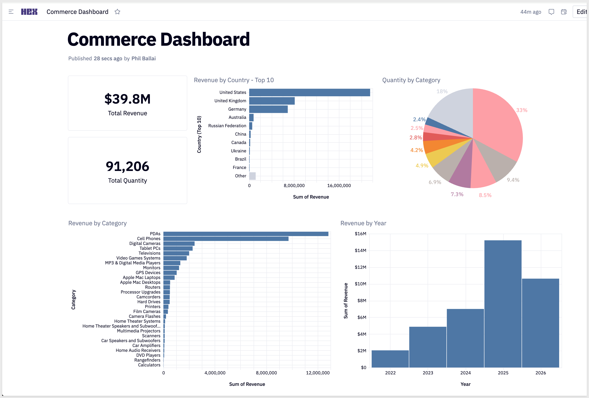
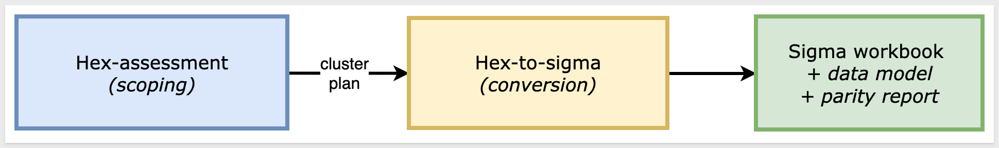
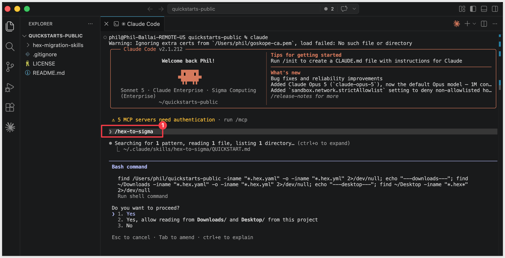
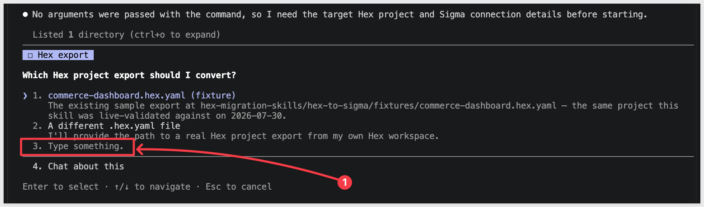
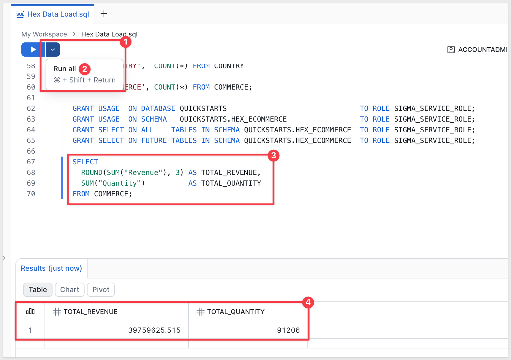
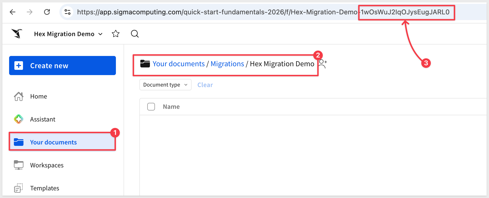
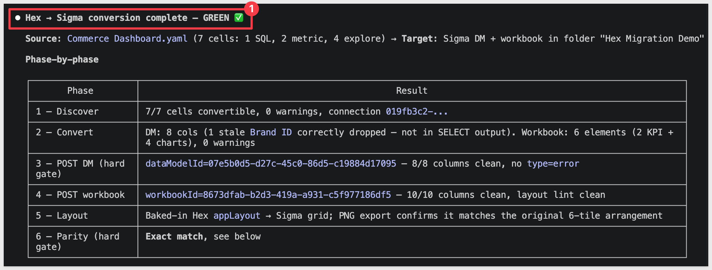
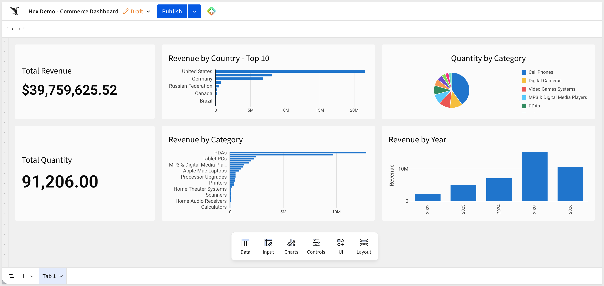
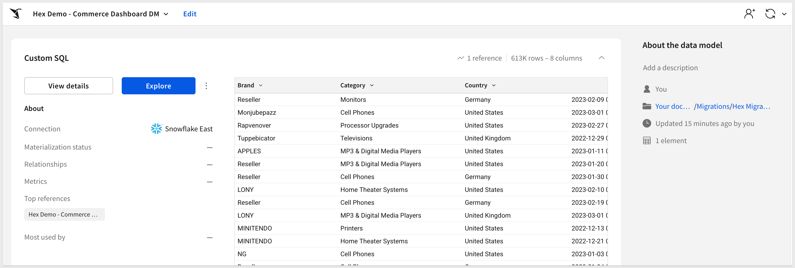

author: pballai
id: developers_migrating_from_hex_made_easy
summary: developers_migrating_from_hex_made_easy
categories: developers
environments: web
status: Developers
feedback link: https://github.com/sigmacomputing/sigmaquickstarts/issues
tags: Default
lastUpdated: 2026-08-15

# Migrating From Hex Made Easy

## Overview
Duration: 5

A common ask from teams evaluating Sigma is migrating their Hex footprint — usually to trade a notebook built and maintained by a single analyst for a live-query workspace the whole team can drive without touching SQL or Python. The conversion itself is often the thing that stalls the project.

Hex projects mix SQL cells, Python cells, and chart cells into a single notebook, then publish that notebook as an interactive app. Rebuilding one in Sigma by hand means tracing which SQL cell feeds which chart, translating any Python transformation logic into a Sigma formula or data model step, and rebuilding the input parameters as Sigma controls — then eyeballing the numbers and hoping nothing drifted. Done on a single project it's tedious. Across a real Hex workspace — dozens of projects, shared cells, and Python-heavy transformations — it's the reason migration projects slip.

This QuickStart walks through a `Claude Code` skill called `hex-to-sigma` that automates the loop.

Point it at your exported Hex project file; it parses the SQL cells, KPI cards, and charts directly from the export — Hex's API doesn't expose cell content, so there's no credential dance to set up, just the export itself. It translates each SQL cell into a Sigma data model element, each KPI and chart into a matching Sigma workbook element, mirrors the app's layout on Sigma's grid, and runs a parity pass comparing Sigma's results against the live warehouse. It surfaces a punch list of anything it couldn't auto-translate — Python cells chief among them — instead of silently producing a broken workbook.

<aside class="positive">
<strong>WHY IT MATTERS:</strong><br> The skill runs the whole conversion — discover, translate, build, verify — and finishes with a documented parity check. The result is a working Sigma workbook on the warehouse plus the report that proves it matches the Hex source, instead of a rebuilt-by-hand workbook you have to spot-check yourself.
</aside>

### Sample project

For the demonstration, we'll convert a Hex project called `Commerce Dashboard` — a Commerce e-commerce dataset with proven-out numbers and warehouse tables. 

We provide the exported `.hex.yaml` file directly, so you're not building the source project from scratch just to see the conversion — import it into your own Hex workspace, or hand the file straight to the skill. 

You'll see the discovery artifacts each phase produces, the converter's breakdown of how each Hex cell mapped to a Sigma formula or data model step, the parity report against the live warehouse, and the resulting Sigma data model and workbook landed in your org — along with the gap list of items to hand-polish:



<aside class="positive">
<strong>ABOUT THE SKILL CODE:</strong><br> The skill code used in this QuickStart is vendored into <code>sigmacomputing/quickstarts-public</code> for a stable reader experience — the version you clone matches what's captured in the screenshots and outputs below.
</aside>

<aside class="negative">
<strong>NOTE:</strong><br> The migration is one-directional — Hex is the source, Sigma is the target. Sigma reads the warehouse live, so the conversion's accuracy depends on the warehouse tables behind your Hex project's SQL cells being reachable from a Sigma connection. Python cells have no automatic translation in this version of the skill — they're flagged on the gap list for manual review rather than silently dropped or guessed at.
</aside>

<aside class="negative">
<strong>AI MODEL DIFFERENCES:</strong><br> Depending on which AI, model, and version you're running, the exact prompt wording, option ordering, and intermediate messages may differ slightly from what's shown in this QuickStart. The substantive steps and decisions are the same — pick the option that matches the intent described, even if the label varies.
</aside>

### Target Audience
Sigma SEs, technical CSMs, and migration partners running Hex-to-Sigma conversions.

### Prerequisites
- `Claude Code` installed (CLI or desktop).
- Sigma API credentials.
- `Python 3.10` or newer. macOS's stock system Python is typically 3.9 — older than the skill needs. If `python3 --version` reports anything below 3.10, install a newer interpreter via [Homebrew](https://brew.sh/) (`brew install python@3.12`) or [python.org](https://www.python.org/downloads/)
- A warehouse reachable from Sigma (Snowflake, BigQuery, Databricks, Redshift, Postgres, and others) that your Hex project also queries.

<aside class="positive">
<strong>NOTE:</strong><br> A Hex workspace is only required if you want to migrate a project of your own instead of the sample, or want to import the sample <code>Commerce Dashboard.yaml</code> into Hex to see it firsthand before converting it. 
<br>
<br>
The conversion itself just needs the exported <code>.hex.yaml</code> file — no Hex account or API access required. 
<br>
<br>

If your workspace has <code>Git Sync</code> enabled, that same file is already landing in a repo on every publish — the skill could be extended to pull it straight from there instead of a manual export, which is worth considering if you're converting many projects on a recurring basis rather than a one-off migration.
</aside>

<aside class="negative">
<strong>NOTE:</strong><br> Use a non-production Sigma org for your first run. The skill creates real workbooks, and error-recovery paths may iterate via PUT to update them.
</aside>

<button>[Sigma Free Trial](https://www.sigmacomputing.com/free-trial/)</button>


<!-- END OF SECTION-->

## The Hex Migration Skill Family
Duration: 5

`hex-to-sigma` ships alongside a companion scoping skill, `hex-assessment`, as a single repo (cloned in the next section).

| Skill | Role | When to reach for it |
|-------|------|----------------------|
| `hex-assessment` | Scoping | Auditing a Hex workspace before committing to a conversion plan — inventories projects via Hex's admin API and flags likely duplicates. It's an early-stage companion: per-project complexity scoring (cell-type mix, Python-cell prevalence, chart-type coverage) is still on the roadmap, so treat it as a starting inventory rather than a full readiness readout today. |
| `hex-to-sigma` | Conversion | The subject of this QuickStart. Converts a single Hex project to a Sigma data model and matching workbook with verified parity against the warehouse. |



<aside class="positive">
<strong>WHY IT MATTERS:</strong><br> Each skill does one thing well — scoping and conversion. Pick the smallest set that fits your job, and don't run the conversion until you've confirmed the data is somewhere Sigma can actually read.
</aside>

### What this enables beyond a single conversion

A pure lift-and-shift is the floor, not the ceiling.

- **Turn tribal notebook logic into a governed data model:**<br>
A Hex project's SQL cells often encode judgment calls only the analyst who wrote them remembers — which join key to use, which filter excludes test data, how a metric is really defined. Converting to a Sigma data model with `hex-to-sigma` surfaces that logic as reusable, named columns and metrics anyone on the team can build on, instead of scrolling through cell history to find it again.
- **Audit your source as a side effect:**<br>
The parity check that closes every `hex-to-sigma` run isn't just a confidence test on the migration — it's a fresh pair of eyes on the notebook's math. A parity mismatch is either a translation bug or a bug that's been quietly living in the Hex project — both are worth finding.
- **Scale from one project to a workspace:**<br>
Once you're past a single proof-of-concept conversion, `hex-assessment` is where estate-wide scoping grows — start there to inventory what you're working with before running `hex-to-sigma` project by project.


<!-- END OF SECTION-->

## Install and Configure the Skill
Duration: 10

First we need to clone the skill's GitHub repository and capture your Sigma credentials. Unlike the rest of the migration family, there's no source-tool credential step here — `hex-to-sigma` discovers a project from its exported file (or a Git repo, should you extend the skill to do that), not an API, so Hex never needs an API key or session token.

The two skills live in `sigmacomputing/quickstarts-public` under [hex-migration-skills/](https://github.com/sigmacomputing/quickstarts-public/tree/main/hex-migration-skills)

From a terminal, run each command below one at a time so you can confirm each step before moving on.

<aside class="positive">
<strong>NOTE:</strong><br> <code>~</code> in the commands below is shell shorthand for your home folder — <code>/Users/&lt;you&gt;</code> on macOS, <code>/home/&lt;you&gt;</code> on Linux.
</aside>

**Step 1: Create a local folder for the clone**

```copy-code
mkdir -p ~/quickstarts-public
```

**Step 2: Move into the new folder**

```copy-code
cd ~/quickstarts-public
```

**Step 3: Clone the repo without pulling any files yet**

```copy-code
git clone --filter=blob:none --sparse https://github.com/sigmacomputing/quickstarts-public.git .
```

**Step 4: Fill in only the hex-migration-skills folder**

```copy-code
git sparse-checkout set hex-migration-skills
```

**Step 5: Symlink hex-to-sigma into the Claude skills folder**

```copy-code
ln -s ~/quickstarts-public/hex-migration-skills/hex-to-sigma ~/.claude/skills/hex-to-sigma
```

**Step 6: Symlink hex-assessment**

```copy-code
ln -s ~/quickstarts-public/hex-migration-skills/hex-assessment ~/.claude/skills/hex-assessment
```

Steps 5 and 6 should return with no error.


**Step 7: Add your Sigma API credentials.**<br>
Written to `~/.sigma-migration/env`:

```copy-code
cat >> ~/.sigma-migration/env <<'EOF'
export SIGMA_BASE_URL='https://api.us-a.aws.sigmacomputing.com'
export SIGMA_CLIENT_ID='{your-client-id}'
export SIGMA_CLIENT_SECRET='{your-client-secret}'
EOF
```

Get `SIGMA_CLIENT_ID` and `SIGMA_CLIENT_SECRET` from Sigma under `Administration` > `Developer Access` > `Create New Client Credentials` (requires Admin role).

For information, see: [Generate Sigma API client credentials](https://help.sigmacomputing.com/reference/generate-client-credentials)

`SIGMA_BASE_URL` must match your Sigma deployment region. 

The value shown (`https://api.us-a.aws.sigmacomputing.com`) covers AWS US. 

To find the correct URL for your instance, see: [Supported regions, data platforms, and features](https://help.sigmacomputing.com/docs/region-warehouse-and-feature-support)


**Step 8: Verify Claude Code can invoke the skill.**<br>
Type `claude` in your terminal to start Claude Code, then invoke the skill:

```copy-code
claude
```

```copy-code
/hex-to-sigma
```

Claude searches your machine for a `.hex.yaml` export and asks for approval to run that search:



<aside class="negative">
<strong>NOTE:</strong><br> From here on, Claude Code asks for approval on every bash command the skill runs — and a full conversion fires dozens of them. For each prompt, pick option <code>2. Yes, and don't ask again</code> so Claude Code remembers that command pattern. After the first handful of approvals the prompts stop coming. Alternatively, press <code>Shift+Tab</code> once to switch to <code>auto mode on</code> for the rest of the session — fine for a trusted skill like this one, just don't use it for unknown code.
</aside>

Once approved, Claude asks which Hex project export to convert:



Pause here — select `3. Type something` once you're ready with the kickoff prompt from the next section.


<!-- END OF SECTION-->

## Prepare Demo Data
Duration: 10

The demo uses the same four Commerce e-commerce tables used across the migration skill family — including [Migrating From Cognos Made Easy](developers_migrating_from_cognos_made_easy.md). Both Hex and Sigma will query these tables directly, which is what makes the parity check meaningful.

Run the following script in Snowflake. It creates the schema, stages the source files from S3, loads the tables, and grants read access to the Sigma service role.

```copy-code
USE ROLE ACCOUNTADMIN;
USE WAREHOUSE COMPUTE_WH;

CREATE DATABASE IF NOT EXISTS QUICKSTARTS;
CREATE SCHEMA  IF NOT EXISTS QUICKSTARTS.HEX_ECOMMERCE;
USE SCHEMA QUICKSTARTS.HEX_ECOMMERCE;

CREATE OR REPLACE FILE FORMAT HEX_csv_format
  TYPE = CSV
  FIELD_DELIMITER = ','
  FIELD_OPTIONALLY_ENCLOSED_BY = '"'
  NULL_IF = ('', 'NULL')
  EMPTY_FIELD_AS_NULL = TRUE
  PARSE_HEADER = TRUE;

CREATE OR REPLACE STAGE HEX_ecommerce_stage
  URL = 's3://sigma-quickstarts-main/HEX/'
  FILE_FORMAT = HEX_csv_format;

CREATE OR REPLACE TABLE BRAND (
  "Brand ID" NUMBER,
  "Brand"    VARCHAR
);

CREATE OR REPLACE TABLE CATEGORY (
  "Category ID" NUMBER,
  "Category"    VARCHAR
);

CREATE OR REPLACE TABLE COUNTRY (
  "Country ID" NUMBER,
  "Country"    VARCHAR
);

CREATE OR REPLACE TABLE COMMERCE (
  "Visit ID"    NUMBER,
  "Date"        DATE,
  "Brand ID"    NUMBER,
  "Category ID" NUMBER,
  "Country ID"  NUMBER,
  "Revenue"     FLOAT,
  "Quantity"    NUMBER,
  "Cost"        FLOAT,
  "Age Range"   VARCHAR,
  "Gender"      VARCHAR,
  "Condition"   VARCHAR
);

COPY INTO BRAND    FROM @HEX_ecommerce_stage/BRAND.csv    MATCH_BY_COLUMN_NAME = CASE_INSENSITIVE;
COPY INTO CATEGORY FROM @HEX_ecommerce_stage/CATEGORY.csv MATCH_BY_COLUMN_NAME = CASE_INSENSITIVE;
COPY INTO COUNTRY  FROM @HEX_ecommerce_stage/COUNTRY.csv  MATCH_BY_COLUMN_NAME = CASE_INSENSITIVE;
COPY INTO COMMERCE FROM @HEX_ecommerce_stage/COMMERCE.csv MATCH_BY_COLUMN_NAME = CASE_INSENSITIVE;

SELECT 'BRAND'    AS TBL_NAME, COUNT(*) AS ROW_COUNT FROM BRAND
UNION ALL
SELECT 'CATEGORY', COUNT(*) FROM CATEGORY
UNION ALL
SELECT 'COUNTRY',  COUNT(*) FROM COUNTRY
UNION ALL
SELECT 'COMMERCE', COUNT(*) FROM COMMERCE;

GRANT USAGE  ON DATABASE QUICKSTARTS                               TO ROLE SIGMA_SERVICE_ROLE;
GRANT USAGE  ON SCHEMA   QUICKSTARTS.HEX_ECOMMERCE                 TO ROLE SIGMA_SERVICE_ROLE;
GRANT SELECT ON ALL    TABLES IN SCHEMA QUICKSTARTS.HEX_ECOMMERCE  TO ROLE SIGMA_SERVICE_ROLE;
GRANT SELECT ON FUTURE TABLES IN SCHEMA QUICKSTARTS.HEX_ECOMMERCE  TO ROLE SIGMA_SERVICE_ROLE;

SELECT
  ROUND(SUM("Revenue"), 3) AS TOTAL_REVENUE,
  SUM("Quantity")          AS TOTAL_QUANTITY
FROM COMMERCE;
```

The final query confirms the load. Expected results: 613,002 rows in COMMERCE, total revenue `39,759,625.515`, total quantity `91,206`:




<!-- END OF SECTION-->

## Prepare the Sigma Target Folder
Duration: 5

The skill lands workbooks in a Sigma folder. Create a dedicated folder now so the output is organized from the start.

In Sigma, navigate to `Home` and create a new folder named `Hex Migration Demo`. Copy the folder's ID from the URL — you'll pass it to the skill in the next section.

The folder ID appears in the URL after `/folder/`:

```copy-code
https://app.sigmacomputing.com/{your-org}/folder/{your-folder-id}
```




<!-- END OF SECTION-->

## Run the Conversion
Duration: 20

With the sample project already on disk and the Sigma folder ready, return to the prompt from the end of Install and Configure the Skill and select option `3. Type something`. If you closed that session, reopen Claude Code and invoke `/hex-to-sigma` again to get back to the same menu.

Adjust the kickoff prompt below — substituting your Sigma `connection ID` and `folder ID`:

### Kickoff prompt

```copy-code
Run /hex-to-sigma on the following. Walk every phase in SKILL.md end-to-end and stop only if a hard gate fails.

Hex
- Project file: ~/quickstarts-public/hex-migration-skills/sample-project/Commerce Dashboard.yaml
- No Hex API credentials needed — discovery reads the file directly.

Warehouse — same on both sides
- The Hex project's SQL cell reads from Snowflake — database QUICKSTARTS, schema HEX_ECOMMERCE
- Sigma reads from Snowflake — same schema QUICKSTARTS.HEX_ECOMMERCE

Sigma
- SIGMA_API_TOKEN = mint from ~/.sigma-migration/env
- SIGMA_CONNECTION_ID: {your-snowflake-connection-id}
- SIGMA_FOLDER_ID: {your-folder-id}

Options
- Name prefix: Hex Demo
- Auto-approve mid-pipeline questions: yes
- Parity: data should match exactly since both sides read from the same warehouse. Report any deltas.

Don't declare GREEN until the parity gate passes.
```

The skill runs through six phases: 

**Discover** → **Reuse-check** → **Convert** → **Post the data model** → **Build the workbook** → **Verify parity**. 

Each phase emits a progress summary — watch for any `WARN` flags, which land on the gap list rather than stopping the run.


<!-- END OF SECTION-->

## Review the Output
Duration: 10

When the skill completes, it prints a summary of what it built: the data model and workbook it posted, the column-type guard result (every column should read clean, no `error` types), the layout lint result, and the parity check against the warehouse:



### The Sigma workbook

Open the workbook in your Sigma folder and compare it against the source Hex app. The layout mirrors the source — two KPIs stacked on the left, three charts across the top row, two charts across the second row — and each visualization is backed by the translated formula, wired to the same data model:



### The Sigma data model

The skill also creates a data model in the same folder — a single native-SQL element carrying the Hex project's join query verbatim, with one column per output field.



### The gap list

Anything the skill couldn't auto-translate — Python cells chief among them, along with unsupported chart types or multi-series charts — lands in the gap list with the source cell and the reason it was flagged, instead of being silently dropped or guessed at. 

The sample `Commerce Dashboard` project doesn't exercise any of these, so its gap list comes back empty; a real-world Hex project with Python cells will show entries here to work through by hand.


<!-- END OF SECTION-->

## Common Issues
Duration: 5

### Warehouse tables don't appear as expected

If your Sigma connection hasn't indexed the schema behind your Hex project's SQL cells yet, the data model POST can fail with a "Source not found: warehouse table..." error even though the table exists. Query the schema once from a Sigma workbook so the connection catalogs it (or sync it explicitly from `Administration` > `Connections`), then re-run.

### Python-cell transformations that don't map to a Sigma formula

Hex projects that lean on Python cells for data transformation have no automatic Sigma equivalent — Python (`CODE`) cells are skipped and flagged on the gap list, never guessed at. If you want that logic to carry over, convert it to SQL in the source Hex project before exporting, or plan to rebuild it by hand in Sigma (a calculated column, a formula) after the migration lands.

### A "dropped stale column(s)" warning during conversion

Hex's own cell preview cache can list a column that isn't actually in the SQL cell's `SELECT` output anymore — usually a join key referenced only in a `JOIN ... ON` clause, left over from an earlier edit to the query. The skill cross-checks against the `SELECT` clause and drops these automatically with a warning instead of posting a broken data-model column. This is expected behavior, not a bug — no action needed unless the warning names a column you actually expected to see in Sigma.

### Sigma API token exchange fails with a 400

If minting a Sigma token fails with `"code":"invalid_request"` even with freshly created API credentials, check whether your Sigma org's client accepts `client_credentials` via an HTTP Basic Auth header — some orgs instead expect `client_id`/`client_secret` as body-form parameters (matching Sigma's own Postman guide). This isn't fully characterized yet as org-specific vs. universal; if you hit it, that mismatch is the first thing to check.


<!-- END OF SECTION-->

## What we've covered
Duration: 5

We converted a Hex project — SQL cells, KPIs, and charts — into a verified Sigma workbook without hand-translating a single formula, and without touching Hex's UI at all. The kickoff prompt you used here works for any exported `.hex.yaml` file — same pattern, different project.

The part of a Hex migration that usually eats the most time is untangling which SQL cell feeds which chart and reproducing the layout by eye. The skill reads all of that straight from the export — cells, chart config, app layout — and rebuilds it on the warehouse, surfacing anything it couldn't translate (Python cells, most often) on the gap list instead of guessing.

The parity gate is the real proof, not the column-type guard. Because Sigma and Hex both query the same warehouse tables, a clean parity check means the numbers actually match — not just that the formulas compile. Short of GREEN, the gap list tells you why.

When you're ready to move past a single project, `hex-assessment` is where estate-wide scoping starts — inventory the workspace before committing to a full migration.

**Additional Resource Links**

[Blog](https://www.sigmacomputing.com/blog/)<br>
[Community](https://community.sigmacomputing.com/)<br>
[Help Center](https://help.sigmacomputing.com/hc/en-us)<br>
[QuickStarts](https://quickstarts.sigmacomputing.com/)<br>

Be sure to check out all the latest developments at [Sigma's First Friday Feature page!](https://quickstarts.sigmacomputing.com/firstfridayfeatures/)
<br>

[](https://twitter.com/sigmacomputing)&emsp;
[](https://www.linkedin.com/company/sigmacomputing)&emsp;
[](https://www.facebook.com/sigmacomputing)


<!-- END OF WHAT WE COVERED -->
<!-- END OF QUICKSTART -->
