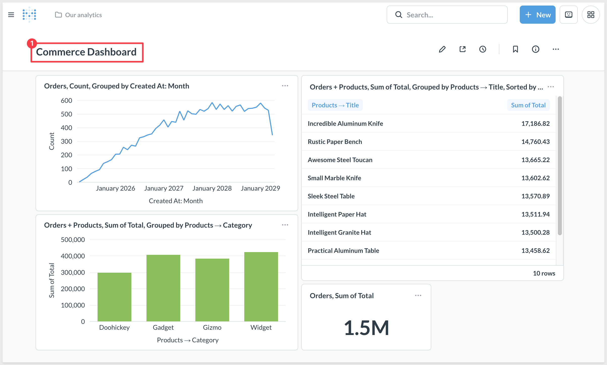
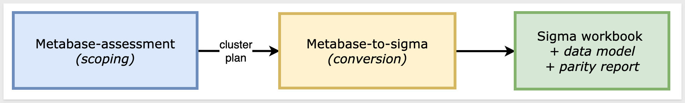
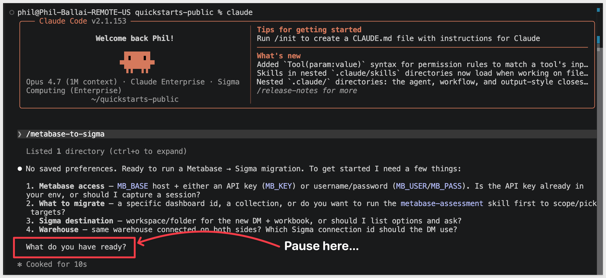
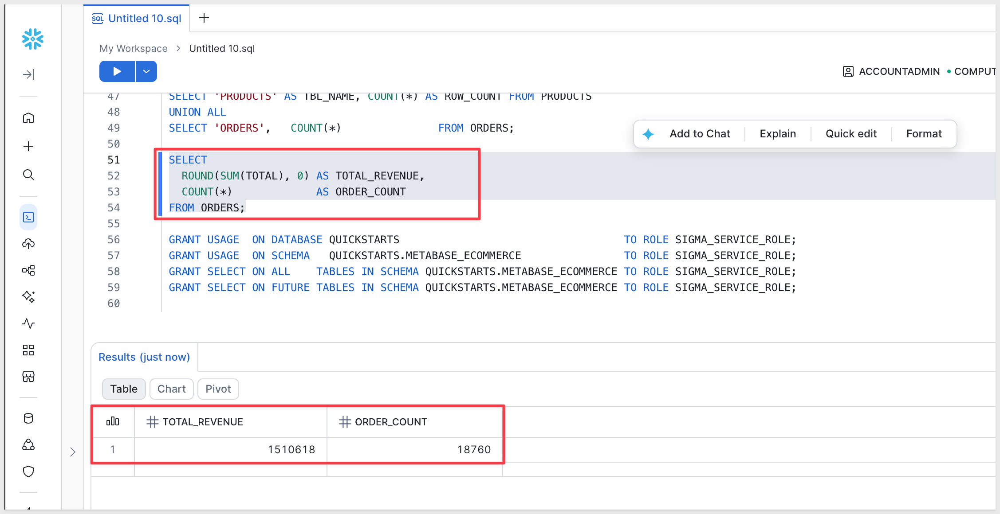
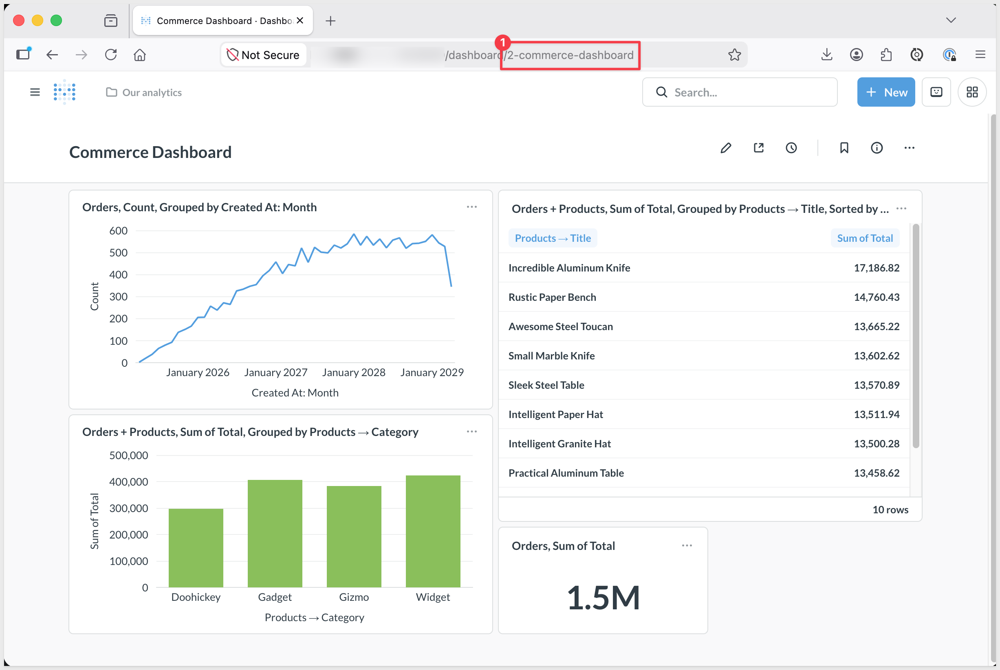
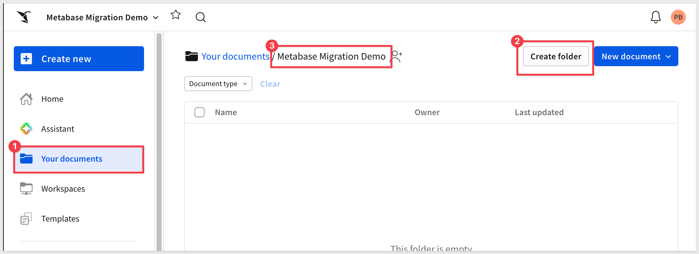
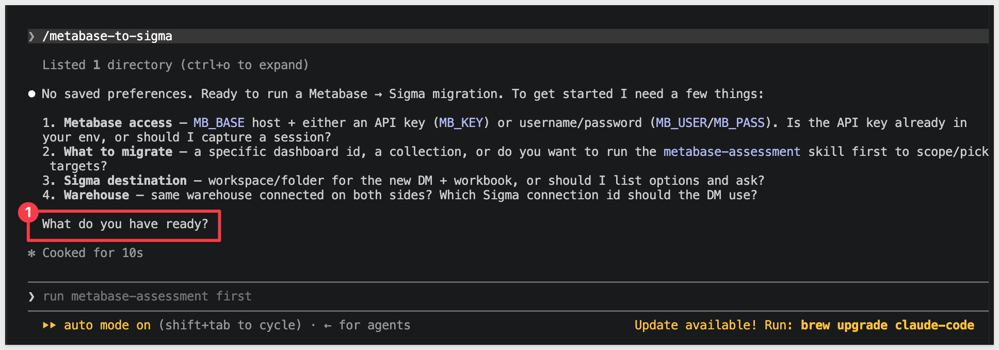
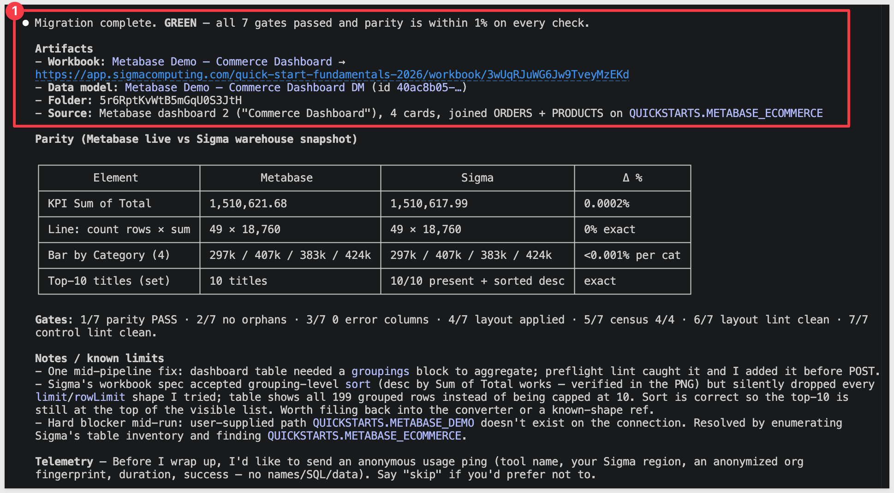
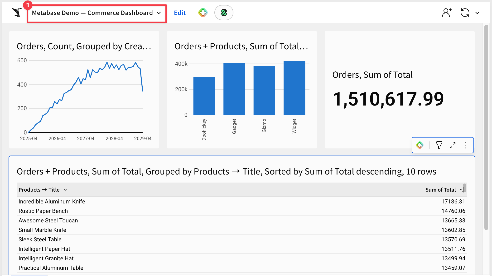
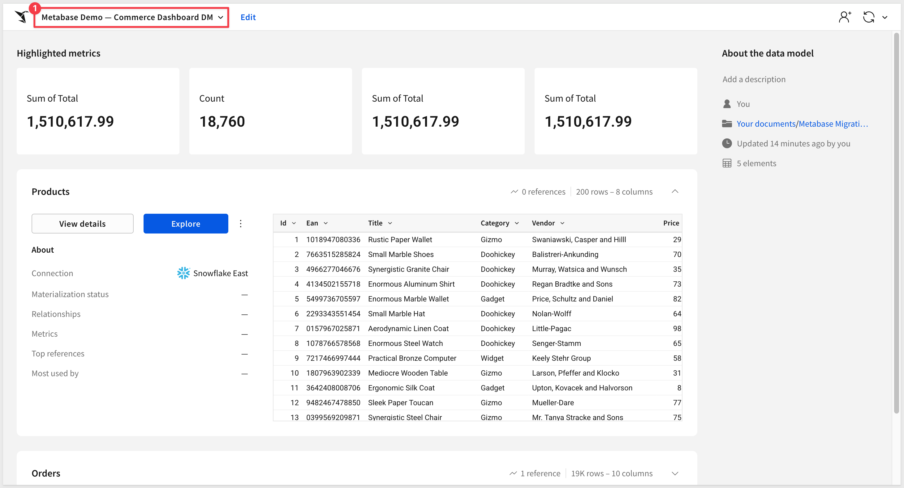

author: pballai
id: developers_migrating_from_metabase_made_easy
summary: developers_migrating_from_metabase_made_easy
categories: developers
environments: web
status: Hidden
feedback link: https://github.com/sigmacomputing/sigmaquickstarts/issues
tags:
lastUpdated: 2026-06-27

# Migrating From Metabase Made Easy

## Overview
Duration: 5

A common ask from teams evaluating Sigma is migrating their Metabase footprint — usually to take advantage of all the amazing things Sigma offers. The conversion itself can be a blocker — and the part this QuickStart automates.

The usual Metabase-to-Sigma migration loop is rebuild-the-models-by-hand, rewrite every MBQL aggregation and expression as a Sigma formula, recreate each dashboard's cards and layout, then eyeball the numbers against the source and hope nothing drifted in the translation. Done on a single dashboard it's tedious. Across a real Metabase estate — typically hundreds of cards reading from a handful of shared models — it's the reason migration projects slip.

This QuickStart walks through a `Claude Code` skill called `metabase-to-sigma` that automates the loop.

Point it at a Metabase dashboard; it discovers the dashboard's cards, the models and questions they reference, and the database metadata behind them over the Metabase REST API. It translates each card's MBQL expression (or native SQL) into a Sigma formula, builds a Sigma data model from the warehouse tables the models point at, mirrors each dashboard's layout on Sigma's grid, and runs a row-level parity pass against the live warehouse. It surfaces a punch list of anything it couldn't auto-translate — instead of silently producing a broken workbook.

<aside class="positive">
<strong>WHY IT MATTERS:</strong><br> The skill runs the whole conversion — discover, translate, build, verify — and finishes with a documented parity check. The result is a working Sigma workbook on the warehouse plus the report that proves it matches the Metabase source, instead of a rebuilt-by-hand workbook you have to spot-check yourself.
</aside>

### What else this enables

A pure lift-and-shift is the floor, not the ceiling. The same skill family supports three follow-on moves that turn a migration into an upgrade:

- **Dedup before you migrate.** Most BI estates carry years of dashboard sprawl — multiple near-identical dashboards built by different teams over time. The assessment skill flags dashboards that are roughly 90% the same and recommends merging them before conversion. You move 200 dashboards instead of 800, and every downstream conversation is simpler. Pair this with the usage data the assessment pulls (who views what, how often) and you can confidently retire cold content rather than carry it forward.

- **Enhance, don't just translate.** Many "dashboards" in legacy tools are really input-driven workflows in disguise — a dashboard whose data is refreshed by uploading a CSV each morning is actually a forecasting app waiting to happen. After the lift-and-shift, the skill can suggest replacing those patterns with native Sigma constructs: input tables for write-back, Sigma Assistant for natural-language analysis, scheduled agents for routine summaries. The result isn't "the old dashboard, in a new tool" — it's "the workflow, finally done right."

- **Audit your source as a side effect.** The parity check that closes the run isn't just a confidence test on the migration — it's a fresh pair of eyes on the source platform's math. Sigma customers have caught multi-year calculation errors during their first migration run because the parity gate flagged a Sigma vs source mismatch and the source turned out to be wrong. Plan the migration as your final audit of the legacy system.

### Sample dashboard

For the demonstration, we'll convert a small Metabase dashboard called `Commerce Dashboard` — four cards (a revenue scalar, orders-by-month line, revenue-by-category bar, and a top-10-products table) built against an e-commerce schema (`ORDERS` + `PRODUCTS`) extracted from Metabase's Sample Database and loaded into Snowflake. You'll see the discovery artifacts each phase produces, the converter's breakdown of how each MBQL expression mapped to a Sigma formula, the parity report against the live warehouse, and the resulting Sigma data model and workbook landed in your org — along with the gap list of items to hand-polish.



<aside class="positive">
<strong>ABOUT THE SKILL CODE:</strong><br> The skill code used in this QuickStart is vendored into <code>sigmacomputing/quickstarts-public</code> for a stable reader experience — the version you clone matches what's captured in the screenshots and outputs below. The upstream skill at <a href="https://github.com/twells89/metabase-to-sigma">twells89/metabase-to-sigma</a> is actively evolving with new converter capabilities, bug fixes, and additional source-tool support. If you want the latest improvements after completing the QS, point your skill symlink at the upstream repo instead.
</aside>

<aside class="negative">
<strong>NOTE:</strong><br> The migration is one-directional — Metabase is the source, Sigma is the target. Sigma reads the warehouse live, so the conversion's accuracy depends on the warehouse tables behind your Metabase models being reachable from a Sigma connection. The skill discovers the dashboard, cards, models, and database metadata via the Metabase REST API and reconciles MBQL field references back to the underlying warehouse columns. Parity is checked against the warehouse-resolved numbers, so any cache drift surfaces as an explicit row-level diff rather than getting buried. Metabase's bundled H2 Sample Database is NOT reachable from Sigma — pick content on a real warehouse, or land the data first.
</aside>

<aside class="negative">
<strong>AI MODEL DIFFERENCES:</strong><br> Depending on which AI, model, and version you're running, the exact prompt wording, option ordering, and intermediate messages may differ slightly from what's shown in this QuickStart. The substantive steps and decisions are the same — pick the option that matches the intent described, even if the label varies.
</aside>

### Target Audience
Sigma SEs, technical CSMs, and migration partners running Metabase-to-Sigma conversions — or scoping a batch migration with the companion `metabase-assessment` skill.

### Prerequisites
- `Claude Code` installed (CLI or desktop).
- Sigma API credentials.
- A Metabase instance you can reach via REST — either an **API key** (Admin → Settings → Authentication → API keys; v49+, preferred for stability) or a username/password the skill can exchange for a session token. Open-source Metabase is fully sufficient — no Pro/EE features are required.
- `Python 3.10` or newer. macOS's stock system Python is typically 3.9 — older than the skill needs. If `python3 --version` reports anything below 3.10, install a newer interpreter via [Homebrew](https://brew.sh/) (`brew install python@3.12`) or [python.org](https://www.python.org/downloads/).
- `Node.js` (any recent LTS) for the converter (`converter/`: `npm install` once during the run). The skill also uses a separate MCP server, [`sigma-data-model-mcp`](https://github.com/twells89/sigma-data-model-mcp), cloned + built (`npm install && npm run build`) into `~/Desktop/sigma-data-model-mcp`. The skill prompts you to install it mid-conversion — no upfront work needed.
- A warehouse reachable from Sigma (Snowflake, BigQuery, Databricks, Redshift, Postgres, Athena) that your Metabase models also query against.

<aside class="negative">
<strong>NOTE:</strong><br> Use a non-production Sigma org for your first run. The skill creates real workbooks, and error-recovery paths may iterate via PUT to update them.
</aside>

<button>[Sigma Free Trial](https://www.sigmacomputing.com/free-trial/)</button>


<!-- END OF SECTION-->

## The Metabase Migration Skill Family
Duration: 5

`metabase-to-sigma` is one of two skills that ship together as a single repo (cloned in the next section). Most of this QuickStart focuses on the converter — but knowing where the assessment skill fits avoids dead ends later when scoping a batch migration.

| Skill | Role | When to reach for it |
|-------|------|----------------------|
| `metabase-assessment` | Scoping | Auditing a Metabase instance before committing to a conversion plan. Emits a per-dashboard complexity readout (visualization-type mix, MBQL aggregation patterns, native SQL flags, model-vs-question ratio, segment / metric references), usage signal from Metabase's activity API, and a value/cost-ranked migration shortlist that `metabase-to-sigma` can consume. Read-only — only `GET`s against the Metabase API. |
| `metabase-to-sigma` | Conversion | The subject of this QuickStart. Converts a single Metabase dashboard (or a batch via shortlist) to a Sigma data model and matching workbook with verified row-level parity. |

Here's how the two skills connect in a full migration — `metabase-assessment` hands the converter a ranked shortlist, and `metabase-to-sigma` produces the Sigma workbooks with a verified parity report:



<aside class="positive">
<strong>WHY IT MATTERS:</strong><br> Each skill does one thing well — scoping and conversion. Pick the smallest set that fits your job, and don't run the conversion until you've confirmed the data is somewhere Sigma can actually read.
</aside>

### Which skill for your situation

Not every migration needs both skills. Use the table below to map your scenario to the smallest set that fits.

In this QuickStart we're in the second row — the demo dashboard reads from Metabase's bundled H2 Sample Database, which Sigma can't connect to, so we land a matching copy of the data in Snowflake first and let `metabase-to-sigma` bridge across.

| Your situation | Skill(s) to use |
|----------------|-----------------|
| 1 dashboard, model reads from your warehouse | `metabase-to-sigma` |
| 1 dashboard, model reads from a warehouse Sigma can't connect to (or from the H2 Sample Database) | Land the data in your warehouse first, then `metabase-to-sigma` |
| 10+ dashboards (any data source) | `metabase-assessment` → `metabase-to-sigma` in batch mode |
| Auditing Metabase sprawl without converting yet | `metabase-assessment` only |

<aside class="negative">
<strong>NOTE:</strong><br> As the skill runs, you'll see filenames and log lines that reference internal phase numbers (e.g., <code>assert-phase6-ran.rb</code>). Those belong to the skill's own internal numbering — they map onto the phases described in <code>Review the Output</code>. The full mapping is documented in the skill's <code>SKILL.md</code>.
</aside>


<!-- END OF SECTION-->

## Install and Configure the Skill
Duration: 15

First we need to clone the skill's GitHub repository, configure Metabase REST credentials, and capture your Sigma credentials.

The two skills live in `sigmacomputing/quickstarts-public` under [metabase-migration-skills/](https://github.com/sigmacomputing/quickstarts-public/tree/main/metabase-migration-skills).

From a terminal, run each command below one at a time so you can confirm each step before moving on.

<aside class="positive">
<strong>NOTE:</strong><br> <code>~</code> in the commands below is shell shorthand for your home folder — <code>/Users/&lt;you&gt;</code> on macOS, <code>/home/&lt;you&gt;</code> on Linux.
</aside>

**Step 1: Create a local folder for the clone**

```copy-code
mkdir -p ~/quickstarts-public
```

**Step 2: Move into the new folder**

```copy-code
cd ~/quickstarts-public
```

**Step 3: Clone the repo without pulling any files yet**

```copy-code
git clone --filter=blob:none --sparse https://github.com/sigmacomputing/quickstarts-public.git .
```

**Step 4: Fill in only the metabase-migration-skills folder**

```copy-code
git sparse-checkout set metabase-migration-skills
```

**Step 5: Symlink metabase-to-sigma into the Claude skills folder**

```copy-code
ln -s ~/quickstarts-public/metabase-migration-skills/metabase-to-sigma ~/.claude/skills/metabase-to-sigma
```

**Step 6: Symlink metabase-assessment**

```copy-code
ln -s ~/quickstarts-public/metabase-migration-skills/metabase-assessment ~/.claude/skills/metabase-assessment
```

Steps 5 and 6 should return with no error.


**Step 7: Capture your Sigma API credentials.**<br>
This script prompts for `SIGMA_BASE_URL`, `SIGMA_CLIENT_ID`, and `SIGMA_CLIENT_SECRET` and writes them into Claude's settings + the neutral `~/.sigma-migration/env` file that the skill family uses to mint Sigma API tokens at runtime.

Run once per machine.

```copy-code
ruby ~/.claude/skills/metabase-to-sigma/scripts/setup.rb
```

The final prompt asks for a `Connection ID (full warehouse-connection UUID, optional — Enter to skip)`. You can press `Enter` to skip — the kickoff prompt later in this QuickStart supplies the Snowflake connection ID inline. Capturing it here is useful only if you plan to run multiple migrations and want it persisted in `~/.sigma-migration/env`.


**Step 8: Capture your Metabase REST credentials.**<br>
The skill calls Metabase via its REST API. Auth supports two paths:

- **API key (preferred for Metabase v49+, OSS or Pro/EE).** In Metabase: `Admin settings` > `Authentication` > `API keys` > `Create API key`. Set the group to `Administrators` for full read access. Copy the value (starts with `mb_…`).
- **Username + password.** The skill exchanges them for a session token at runtime. Works on any Metabase version. Sessions expire (~14 days max, sooner under SSO) — re-add to env when you see a `401`.

The skill reads Metabase credentials from the same `~/.sigma-migration/env` file `setup.rb` populated for Sigma. Append your Metabase creds to it.

For the **API key** path:

```copy-code
cat >> ~/.sigma-migration/env <<'EOF'
export MB_BASE='https://{your-metabase-host}'
export MB_KEY='{your-api-key}'
EOF
```

For the **username + password** path:

```copy-code
cat >> ~/.sigma-migration/env <<'EOF'
export MB_BASE='https://{your-metabase-host}'
export MB_USER='{you@example.com}'
export MB_PASS='{your-password}'
EOF
```

`MB_BASE` is the Metabase server's base URL with no trailing slash and no `/api` suffix. For a local Docker container the value is usually `http://localhost:3000`. For a hosted instance it looks like `https://{your-tenant}.metabaseapp.com`.

Verify auth works by sourcing the env and running the session-helper script — it emits a shell function `mb_get` you can use to probe the API. The one-liner below lists every database connection Metabase has configured (the same set the skill discovers in `Phase 0`):

```copy-code
source ~/.sigma-migration/env && eval "$(bash ~/.claude/skills/metabase-to-sigma/scripts/get-metabase-session.sh)" && mb_get /api/database | python3 -c 'import sys,json; [print(d["id"], "-", d["name"], "-", d["engine"]) for d in json.load(sys.stdin).get("data",[])]'
```

You should see at least one line — `1 - Sample Database - h2` on a fresh Metabase install. If your Metabase has additional warehouse connections, they'll appear here too. The numeric `id` is the value the skill cross-references when it discovers your dashboard's source database in `Phase 0`.

If the command returns nothing or an error: double-check `MB_BASE`, `MB_KEY` (or `MB_USER` / `MB_PASS`), and that the API key's group has read access to the content you want to migrate.


**Step 9: Verify Claude Code can invoke the skill.**<br>
Type `claude` in your terminal to start Claude Code, then invoke the skill:

```copy-code
claude
```

```copy-code
/metabase-to-sigma
```

Claude should start reading the reference files and ask what dashboard you want to convert.

Pause at that prompt — we'll hand it everything in one shot via the kickoff prompt in `Run the Conversion`:




<!-- END OF SECTION-->

## Prepare the Demo Data
Duration: 10

The Metabase dashboard we're going to convert reads from Metabase's bundled H2 `Sample Database`, which Sigma can't connect to directly. The conversion still works — the skill bridges across sources — but Sigma needs the same data in a warehouse it CAN reach. We'll land a copy in Snowflake.

Data prep has two halves:

1. **Metabase side — nothing to do here for this QuickStart.** We've already exported the `ORDERS` and `PRODUCTS` tables from Metabase's Sample Database and hosted them as CSVs in Amazon S3. The `COPY INTO` statements below read from S3 directly — no local download needed.

2. **Sigma side (this section)** — the same data needs to live in a Snowflake schema your Sigma connection can read. We'll create one.

<aside class="negative">
<strong>NOTE:</strong><br> The DDL below grants access to <code>SIGMA_SERVICE_ROLE</code>. Substitute the role your Sigma connection actually uses if it differs — you can confirm it in Sigma under <code>Administration</code> > <code>Connections</code> by clicking your Snowflake connection.
</aside>

```copy-code
USE ROLE ACCOUNTADMIN;
USE WAREHOUSE COMPUTE_WH;

CREATE DATABASE IF NOT EXISTS QUICKSTARTS;
CREATE SCHEMA  IF NOT EXISTS QUICKSTARTS.METABASE_ECOMMERCE;
USE SCHEMA QUICKSTARTS.METABASE_ECOMMERCE;

CREATE OR REPLACE FILE FORMAT metabase_csv_format
  TYPE = CSV
  FIELD_DELIMITER = ','
  SKIP_HEADER = 1
  FIELD_OPTIONALLY_ENCLOSED_BY = '"'
  NULL_IF = ('', 'NULL')
  EMPTY_FIELD_AS_NULL = TRUE
  TIMESTAMP_FORMAT = 'MMMM DD, YYYY, HH12:MI AM';

CREATE OR REPLACE STAGE metabase_ecommerce_stage
  URL = 's3://sigma-quickstarts-main/Metabase/'
  FILE_FORMAT = metabase_csv_format;

CREATE OR REPLACE TABLE PRODUCTS (
  ID         NUMBER PRIMARY KEY,
  EAN        VARCHAR(13),
  TITLE      VARCHAR(200),
  CATEGORY   VARCHAR(50),
  VENDOR     VARCHAR(200),
  PRICE      NUMBER(10,2),
  RATING     NUMBER(3,1),
  CREATED_AT TIMESTAMP_NTZ
);

CREATE OR REPLACE TABLE ORDERS (
  ID         NUMBER PRIMARY KEY,
  USER_ID    NUMBER,
  PRODUCT_ID NUMBER,
  SUBTOTAL   NUMBER(12,2),
  TAX        NUMBER(12,2),
  TOTAL      NUMBER(12,2),
  DISCOUNT   NUMBER(12,2),
  CREATED_AT TIMESTAMP_NTZ,
  QUANTITY   NUMBER
);

COPY INTO PRODUCTS FROM @metabase_ecommerce_stage/products.csv;
COPY INTO ORDERS   FROM @metabase_ecommerce_stage/orders.csv;

SELECT 'PRODUCTS' AS TBL_NAME, COUNT(*) AS ROW_COUNT FROM PRODUCTS
UNION ALL
SELECT 'ORDERS',   COUNT(*)               FROM ORDERS;

SELECT
  ROUND(SUM(TOTAL), 0) AS TOTAL_REVENUE,
  COUNT(*)             AS ORDER_COUNT
FROM ORDERS;

GRANT USAGE  ON DATABASE QUICKSTARTS                                   TO ROLE SIGMA_SERVICE_ROLE;
GRANT USAGE  ON SCHEMA   QUICKSTARTS.METABASE_ECOMMERCE                TO ROLE SIGMA_SERVICE_ROLE;
GRANT SELECT ON ALL    TABLES IN SCHEMA QUICKSTARTS.METABASE_ECOMMERCE TO ROLE SIGMA_SERVICE_ROLE;
GRANT SELECT ON FUTURE TABLES IN SCHEMA QUICKSTARTS.METABASE_ECOMMERCE TO ROLE SIGMA_SERVICE_ROLE;
```

Expected results:

- `ORDERS` row count: `18,760`
- `TOTAL_REVENUE`: ~ `1,510,618` — this is the baseline aggregate we'll cross-check against the Sigma element after the conversion.



<aside class="positive">
<strong>WHY IT MATTERS:</strong><br> Once the source data lives in your warehouse, every downstream tool — Sigma, dbt, your own SQL — reads from the same source of truth instead of routing through Metabase's internal caching layer. The migration step doubles as a data-architecture upgrade.
</aside>

<aside class="negative">
<strong>NOTE:</strong><br> Metabase's CSV download applies display formatting (thousands separators) to numeric columns by default — re-uploaded files that show <code>"1,000"</code> instead of <code>1000</code> will fail Snowflake's NUMBER parse. The CSVs hosted at the S3 paths above are already pre-cleaned. If you re-export from your own Metabase instance later, use the unformatted-export option when downloading.
</aside>


<!-- END OF SECTION-->

## Build the Demo Dashboard in Metabase
Duration: 10

The skill bridges across sources — Metabase can keep reading from its bundled H2 `Sample Database` (where `ORDERS` and `PRODUCTS` already live on any fresh Metabase install) while Sigma reads the matching data from the Snowflake schema you loaded in the previous section. Because the column names and types line up exactly (you extracted from H2 and loaded the same shape into Snowflake), the skill maps Metabase's MBQL field references onto Sigma's warehouse columns without you reconnecting Metabase at all.

Build a small four-card e-commerce dashboard against the `Sample Database` and save it. That dashboard is what you'll convert in the next phase.

**Step 1: Build four questions against the Sample Database.**

Click `+ New` > `Question`. For each card below, pick `Sample Database` as the source. All four are pure MBQL — no native SQL — built entirely in Metabase's GUI query builder.

**Card 1: Total Revenue** (scalar)
- From: `Orders`
- Summarize: `Sum of` > `Total`
- Visualization: `Number`
- Save as `Total Revenue`

**Card 2: Orders by Month** (line)
- From: `Orders`
- Summarize: `Count of rows`
- Group by: `Created At` > `Month`
- Visualization: `Line`
- Save as `Orders by Month`

**Card 3: Revenue by Category** (bar)
- From: `Orders`
- Join: `Products` on `Product ID`
- Summarize: `Sum of` > `Total`
- Group by: `Products` > `Category`
- Visualization: `Bar`
- Save as `Revenue by Category`

**Card 4: Top Products by Revenue** (table)
- From: `Orders`
- Join: `Products` on `Product ID`
- Summarize: `Sum of` > `Total`
- Group by: `Products` > `Title`
- Sort: `Sum of Total` descending
- Row limit: `10`
- Visualization: `Table`
- Save as `Top Products by Revenue`

**Step 2: Create the dashboard.**

`+ New` > `Dashboard`. Name it `Commerce Dashboard` and add all four saved questions. Arrange them in any layout — the converter mirrors Metabase's grid coordinates onto Sigma's 24-column grid in the layout phase.

**Step 3: Capture the dashboard ID.**

With the dashboard open, look at the URL — `/dashboard/{id}-{slug}`. The integer is the dashboard ID. Save it; we'll paste it into the kickoff prompt in `Run the Conversion`.



<aside class="positive">
<strong>WHY IT MATTERS:</strong><br> Building four representative cards (scalar + time-series line + grouped bar + sorted top-N table) takes about ten minutes and exercises every translation path the converter handles — scalar viz, date binning, joins + breakouts, sort + limit. It's enough to prove the skill end-to-end without spending an afternoon building a "pretty" dashboard the reader has to maintain.
</aside>


<!-- END OF SECTION-->

## Prepare the Sigma Target Folder
Duration: 2

The converter needs a Sigma folder to land the new data model and workbook in. The skill will ask for the folder's UUID — it's easier to have it ready before you return to the Claude prompt that's still paused after the skill loads.

To keep this simple, we will use a plain folder and not a workspace.

**Step 1: Create (or pick) a folder in Sigma.**<br>
Open your Sigma org, navigate to where you want the migrated workbook to live, and create a folder for it. Something like:

```copy-code
Metabase Migration Demo
```

**Step 2: Grab the folder ID.**<br>
Open the folder. The ID is the last segment of the URL — a short alphanumeric string, 21 characters. Copy it from the address bar and keep it on the clipboard for the next section.



<aside class="positive">
<strong>NOTE:</strong><br> The skill's prompt may refer to the folder "UUID". Paste the value from the URL exactly as it appears; the skill accepts that form directly.
</aside>


<!-- END OF SECTION-->

## Run the Conversion
Duration: 3

The skill can run interactively, asking for the dashboard, warehouse, and Sigma destination one at a time. For a known target — like ours — it's faster to give Claude the entire job in one message. The skill recognizes a structured kickoff prompt and walks the pipeline directly, going straight from "go" through discover → convert → data model → workbook build → layout → parity.

If Claude is still running and paused at the skill's first prompt from `Install and Configure the Skill`, return to that terminal. If you closed Claude after that step, restart it now:

```copy-code
claude
```

```copy-code
/metabase-to-sigma
```

When Claude finishes loading the skill and asks `What do you have ready`:



...paste the block below. **Substitute your own values where the placeholders are:**

- `Dashboard ID` — the Metabase dashboard's numeric ID, visible in the URL when you have the dashboard open. Metabase URLs look like `https://{your-tenant}.metabaseapp.com/dashboard/{dashboard-id}-{slug}` — the `{dashboard-id}` portion (the integer before any dash) is the value.
- `SIGMA_CONNECTION_ID` — your Snowflake connection ID (the one where you landed the sample data) from Sigma's `Administration` > `Connections`
- `SIGMA_FOLDER_ID` — the folder ID you copied at the end of the previous section
- Any additional custom instructions are useful to add here now.

```copy-code
Run /metabase-to-sigma on the following. Walk every phase in SKILL.md end-to-end and stop only if a hard gate fails.

Metabase
- Credentials sourced from ~/.sigma-migration/env (MB_BASE, MB_KEY or MB_USER/MB_PASS)
- Dashboard ID: {your-dashboard-id}

Warehouse — different on each side
- Metabase reads from its bundled H2 Sample Database
- Sigma reads from Snowflake — database METABASE_ECOMMERCE
- Column names and types match exactly between H2 and Snowflake (same data extracted from H2 and loaded via CSV)

Sigma
- SIGMA_API_TOKEN = mint from ~/.sigma-migration/env
- SIGMA_CONNECTION_ID: {your-snowflake-connection-id}
- SIGMA_FOLDER_ID: {your-folder-id}

Options
- Name prefix: Metabase Demo
- Auto-approve mid-pipeline questions: yes
- Parity: data should match exactly since Snowflake is a direct copy of the H2 Sample Database. Report any deltas.

Don't declare GREEN until the parity gate passes and the visual-QA loop passes.
```

Claude reads the block, mints a fresh Sigma token from `~/.sigma-migration/env`, sources the Metabase credentials, and walks the phases end-to-end. The rest of the run is hands-off until a gate or decision point.

<aside class="positive">
<strong>NOTE:</strong><br> The skill reuses Sigma credentials captured by <code>setup.rb</code> — they live at <code>~/.sigma-migration/env</code> and the skill mints a fresh <code>SIGMA_API_TOKEN</code> from them at runtime. That's why the kickoff prompt above says <code>mint from ~/.sigma-migration/env</code> instead of pasting a token. No manual Sigma-token wrangling per run.
</aside>

<aside class="negative">
<strong>NOTE:</strong><br> From here on, Claude Code asks for approval on every bash command the skill runs — and a full conversion fires dozens of them. For each prompt, pick option <code>2. Yes, and don't ask again</code> so Claude Code remembers that command pattern. After the first handful of approvals the prompts stop coming. Alternatively, press <code>Shift+Tab</code> once to switch to <code>auto mode on</code> for the rest of the session — fine for a trusted skill like this one, just don't use it for unknown code.
</aside>


<!-- END OF SECTION-->

## Review the Output
Duration: 10

When the migration completes, Claude prints a final summary covering the whole pipeline — every phase's result, the visual-QA outcome, the hard-gate verdict, and the URLs of the new Sigma data model and workbook:



The summary walks through six phases plus a visual-QA pass:

- **Phase 0 — Discover.** Hits the Metabase REST API for the dashboard definition, every card (question or model) the dashboard references, database metadata for the warehouse the cards query, and the collection tree. Writes everything to a workdir for the rest of the pipeline.
- **Phase 1 — Convert.** Translates each card's MBQL (or native SQL) into a Sigma data-model spec. Template tags (`{{tag}}`) in native queries become Sigma controls. Models with explicit aggregations become Sigma metrics; questions become workbook elements.
- **Phase 2 — DM-reuse check.** Before posting a new data model, the skill scores existing Sigma DMs against this dashboard's tables/columns. On a strong match (≥0.6 overlap) it asks reuse-vs-new — skipping the build and avoiding sprawl across batch migrations.
- **Phase 3 — Data model POST.** Posts the new data model to Sigma, reads back the reassigned element IDs, and verifies every column resolves cleanly against your warehouse schema (no `type=error` columns).
- **Phase 4 — Workbook build.** Per Metabase card (line / bar / pie / scalar / table / pivot / combo / etc.), builds a matching Sigma element. Records the per-card chart-kind decisions and any fallbacks for viz types Sigma doesn't natively support.
- **Phase 5 — Layout.** Maps Metabase's dashboard grid coordinates onto Sigma's 24-col grid. Click behaviors and dashboard parameters bind to Sigma controls where they map cleanly.
- **Phase 5b — Visual QA.** Renders the workbook's pages as PNGs and lints them — no overlapping tiles, no clipped chart titles, no dead zones, no orphan controls.
- **Phase 6 — Parity + hard gate.** Queries each Sigma element via `sigma-mcp-v2` and compares against the Metabase card's aggregation. Each card reports `PASS within tolerance` or `FAIL`; the gate is GREEN only when all cards pass.

Open the new workbook in Sigma to see the migrated dashboard:



Open the data model to see how the converter wired up the model and metrics:



**Hand-polish items the skill flags rather than silently working around:**

- **Cum-sum and offset window functions** (`CumulativeSum`, `Offset`) — degrade to placeholders with a warning manifest. Hand-author the Sigma equivalent on the affected element using `RunningSum` or window-function patterns.
- **Saved segment references** (`["segment", N]`) — Metabase segments are saved filter snippets that don't have a direct Sigma analog. The skill surfaces them as flagged controls to hand-wire.
- **Funnel and gauge visualizations** — no native Sigma equivalent; fall back to flagged table elements. Swap them manually if business-critical.
- **Click behaviors** (cross-dashboard navigation) — when the target dashboard is also being migrated, the skill rewrites the click behavior to point at the new Sigma workbook. When the target isn't in scope, the click is flagged for manual wiring.
- **Native SQL cards with array aggregations** — BigQuery `ARRAY_AGG`, Snowflake `LISTAGG`, Databricks `collect_list` — require the right warehouse dialect for the converter to rewrite. The skill auto-detects via the Sigma connection lookup; if dialect detection fails, pass `--warehouse` explicitly.

<aside class="positive">
<strong>WHY IT MATTERS:</strong><br> The skill finishes with a documented exit code and an explicit list of what it couldn't auto-translate — never a silent "looks good." Every gap surfaces as a follow-up item with a recommended fix, so you spend hand-polish time on the few items that need it instead of spot-checking every visualization for drift.
</aside>


<!-- END OF SECTION-->

## Scaling Up — Batch Conversion
Duration: 5

A single dashboard is the easy case. Real migrations involve Metabase instances with dozens to thousands of cards reading from a handful of shared models — and migrating them one-by-one through the converter loses the leverage of doing the planning work once. That's where the companion `metabase-assessment` skill comes in.

Point `metabase-assessment` at a Metabase instance and it inventories every dashboard, card, model, and database, scoring each on:

- **Per-dashboard complexity** — card count, MBQL aggregation patterns, native SQL flags, segment references, template-tag count, parameter shape
- **Converter-coverage classification** — every dashboard's cards are scored against the *same* coverage tables `metabase-to-sigma` actually applies, so the readout reflects what the tool will really do — not a generic guess
- **Source patterns** — database connections (warehouse-backed vs H2 Sample Database), model-vs-question ratio, surfacing which dashboards Sigma can connect to versus ones that need extra plumbing
- **Usage signal** — view counts and recent-activity flags pulled from Metabase's activity log, used to flag cold and zero-view content for retirement instead of migration
- **Tag pills** — `migrate-first`, `easy-win`, `moderate`, `needs-gap-scout`, `retire` based on combined complexity + coverage + usage scores

The output is a Sigma-branded `readout.md` you can share with stakeholders, plus a ranked migration shortlist sorted by `value / (1 + cost)` — the cheapest, highest-value dashboards to convert first.

The shortlist becomes input to a **batch conversion plan** — `metabase-assessment` groups dashboards that share the same model so one Sigma data model can serve a whole family of workbooks instead of producing N near-duplicate DMs. `metabase-to-sigma` consumes that plan in batch mode and runs the conversions concurrently.

Typical flow for a real migration engagement:

1. Run `metabase-assessment` against the target instance; review the shortlist with stakeholders.
2. Pick the top N dashboards to convert first — or drop the cold ones entirely.
3. Hand the batch plan to `metabase-to-sigma` and let it work through them.
4. Spot-check each output; file the inevitable gap items upstream.

<aside class="positive">
<strong>WHY IT MATTERS:</strong><br> Sigma's BI migration story is a process, not a single conversion. The assessment skill turns "how big is this migration?" from a guess into a defensible number — backed by per-dashboard effort estimates, converter-coverage scoring, and a retirement list for content nobody actually reads. That's the difference between a migration that ships and one that stalls in committee.
</aside>


<!-- END OF SECTION-->

## Common Issues and Fixes
Duration: 5

The following is a "grab bag" of things that might come up during real conversions, with the fix for each.

- **`python3 --version` reports 3.9.x and the skill refuses to run:**<br> macOS's stock Python is too old for the skill. Install Python 3.10+ via Homebrew (`brew install python@3.12`) or [python.org](https://www.python.org/downloads/), then use `python3.12 -m pip install` explicitly for any helpers. Avoid `pip3` as a shorthand — it can quietly resolve back to the old interpreter.

- **Metabase REST calls return `401 Unauthorized`:**<br> Your API key or session token is invalid or expired. Generate a fresh API key (`Admin settings` > `Authentication` > `API keys`), update `MB_KEY` (or `MB_USER` / `MB_PASS`) in `~/.sigma-migration/env`, then re-source the env file and re-`eval` the `get-metabase-session.sh` helper so the new credentials are picked up in the current shell.

- **`metabase-discover.sh` returns `404 Not Found` for a dashboard you can see in the UI:**<br> Either the dashboard ID is wrong (re-check the URL slug — the integer before the dash is the ID) or the API key's owner doesn't have permission to see that dashboard's collection. Use a key owned by an account that can access the target collection.

- **Metabase H2 Sample Database content can't be migrated:**<br> Metabase's bundled H2 file-based database isn't reachable from Sigma. There's no extraction path — either land the sample data in your warehouse first (the skill will then convert against that copy), or pick a dashboard backed by a real warehouse connection.

- **SSL `CERTIFICATE_VERIFY_FAILED` from a corporate proxy:**<br> If your machine sits behind a TLS-inspection proxy (Netskope, Zscaler, Cisco Umbrella, Cloudflare WARP), Python may reject the rewritten cert chain even though `curl` works. Pull the proxy's root certificate out of Keychain and combine it with the macOS roots into a PEM Python can read, then point Python at it via `SSL_CERT_FILE` in `~/.sigma-migration/env`. (Same recipe as the other migration QuickStarts in this family.)

- **Skill pauses at a "converter MCP gate" mid-run:**<br> The conversion delegates the model translation to a separate MCP server (`sigma-data-model-mcp`). If it isn't installed locally, the skill stops at the gate. Pick option `6. Chat about this` and tell Claude:<br>
 <code>Clone twells89/sigma-data-model-mcp into ~/Desktop/sigma-data-model-mcp for me, then run `npm install && npm run build` in that directory. Once the build is done, come back to the gate and pick option 1.</code><br>
 Claude runs the clone, install, and build, then returns to the gate. After that the skill may also prompt for a "build commit" — choose the `(Recommended)` option.

- **Schema not visible in Sigma after `COPY INTO`:**<br> Sigma's service role doesn't have access to the new schema. The DDL block in `Prepare the Demo Data` includes the `GRANT USAGE` and `GRANT SELECT` statements — if you skipped or modified them, run them now with the role name your Sigma connection actually uses (find it in Sigma under `Administration` > `Connections`).

- **Native SQL card with array aggregation renders as blank cells:**<br> The converter needs the warehouse dialect to rewrite `ARRAY_AGG` / `LISTAGG` / `collect_list` correctly. Dialect is auto-detected from the Sigma connection lookup but can fail silently. Re-run with `--warehouse {bigquery|snowflake|databricks|redshift|postgres|athena}` explicitly.

- **MBQL aggregation flagged as "needs review":**<br> Cum-sum, offset windows, custom expression definitions, and segment references don't have direct Sigma equivalents. The skill surfaces the original MBQL alongside its best-guess Sigma translation. Hand-author the Sigma formula on the affected element using warehouse-resolved column names.

- **Many `Bash command — Contains shell syntax that cannot be statically analyzed — Do you want to proceed?` prompts during the run:**<br> The skill fires `eval "$(...)"` patterns to inject tokens dynamically. Claude Code's safety analyzer can't pattern-match these for blanket approval even in accept-edits mode. Click `1. Yes` on each — it's expected behavior, not a misconfiguration. After the run, you can use the `/fewer-permission-prompts` skill to scan the transcript and add those patterns to your `.claude/settings.local.json` so subsequent runs are silent.

- **"Data model has error columns" after POST:**<br> A column the model declares can't be resolved against the warehouse. Usually a column-name mismatch between the warehouse table and what the Metabase model references. The skill's verification phase surfaces the specific column in the error — adjust the warehouse table's column names or correct the model's field-id mapping before re-running.


<!-- END OF SECTION-->

## What We've Covered
Duration: 5

What you built is less a single conversion and more a repeatable migration path. The skill took a Metabase dashboard — cards, models, MBQL expressions, dashboard layout — and produced a Sigma data model, a workbook, and a row-level parity report against the live warehouse, all from a single structured prompt. No one rebuilt the dashboard by hand, and the parity numbers are evidence rather than hope.

The patterns worth carrying into your next migration:

- **Two skills, one workflow** — `metabase-assessment` scopes and prioritizes the instance; `metabase-to-sigma` converts and verifies. The same shape applies whether you're migrating one dashboard or every dashboard reading from a shared model.
- **Metabase REST is your audit trail** — the API exposes the full dashboard definition, every card's MBQL or native SQL, the model's join structure, and the database metadata behind it. The converter reads the same surface a human admin would, and the output is reproducible against the same discovery dump.
- **Single-prompt kickoff** — once the warehouse data is in place and `setup.rb` has captured your Sigma credentials, the entire migration is one paste. The kickoff prompt reads the dashboard ID + warehouse coordinates + options in one shot, and the skill walks through every phase end-to-end without further interaction unless a gate genuinely needs your call.
- **Warehouse-first** — Sigma reads the live warehouse, so the conversion's value comes from getting the data where Sigma can see it. The DDL + S3 + GRANTs scaffolding in `Prepare the Demo Data` transfers to any warehouse Sigma can reach. For dashboards backed by Metabase's H2 Sample Database, land that data upstream first; the same pattern applies.
- **Parity as proof** — the Metabase-vs-Sigma comparison is what makes the result shippable. Without it you're spot-checking; with it you have evidence every measure lines up. When the source data is static and the warehouse copy is exact (as in this demo), parity is tight. When Metabase reads a live warehouse that has drifted from a frozen snapshot Sigma is pointed at, the skill reports the row-level diff explicitly rather than burying it — so a real engagement can apply a documented tolerance and still gate honestly.

A first-pass conversion produces a working starting point and a documented punch list, not a hand-polished workbook. The polish loop is short, and you know exactly what to look at. That's the migration approach you can scale across an entire Metabase instance.

**Additional Resource Links**

[Blog](https://www.sigmacomputing.com/blog/)<br>
[Community](https://community.sigmacomputing.com/)<br>
[Help Center](https://help.sigmacomputing.com/hc/en-us)<br>
[QuickStarts](https://quickstarts.sigmacomputing.com/)<br>

Be sure to check out all the latest developments at [Sigma's First Friday Feature page!](https://quickstarts.sigmacomputing.com/firstfridayfeatures/)
<br>

[](https://twitter.com/sigmacomputing)&emsp;
[](https://www.linkedin.com/company/sigmacomputing)&emsp;
[](https://www.facebook.com/sigmacomputing)


<!-- END OF WHAT WE COVERED -->
<!-- END OF QUICKSTART -->
