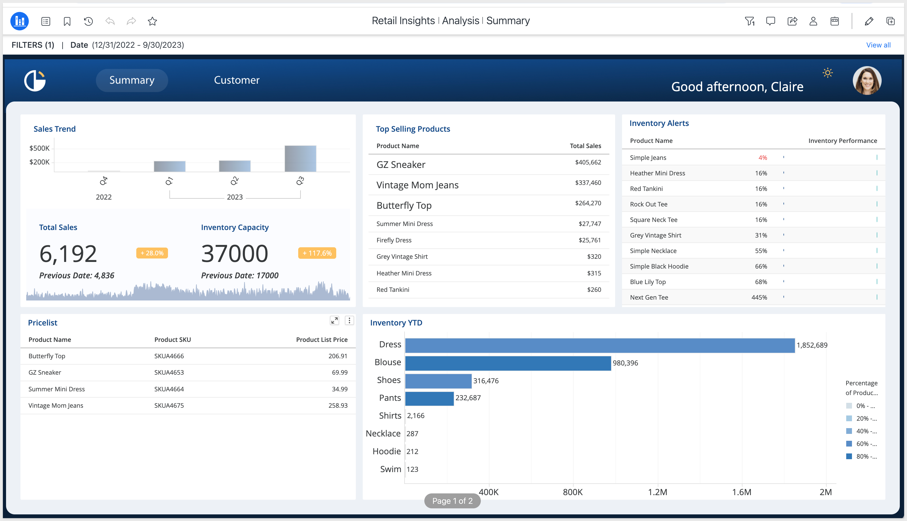
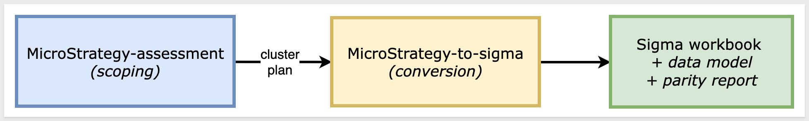
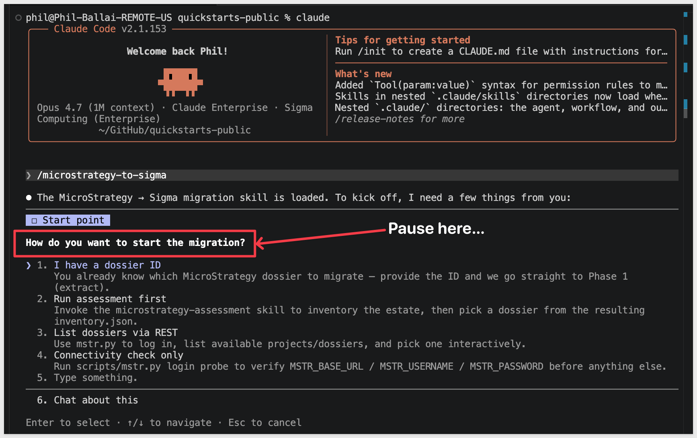
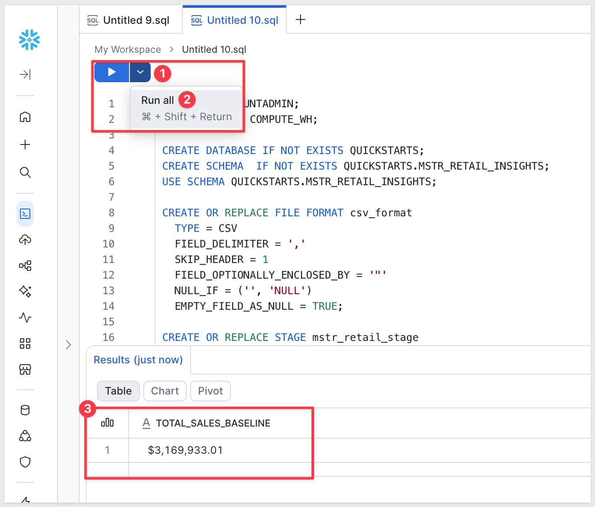
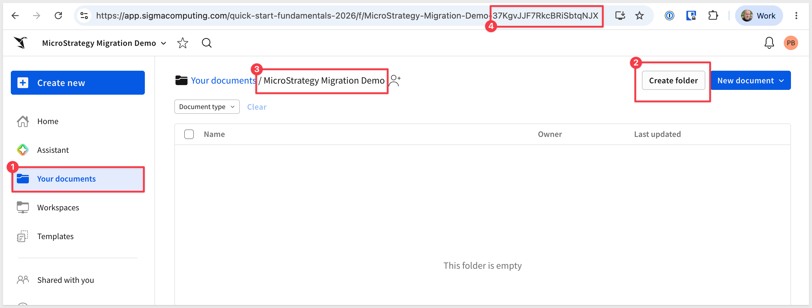
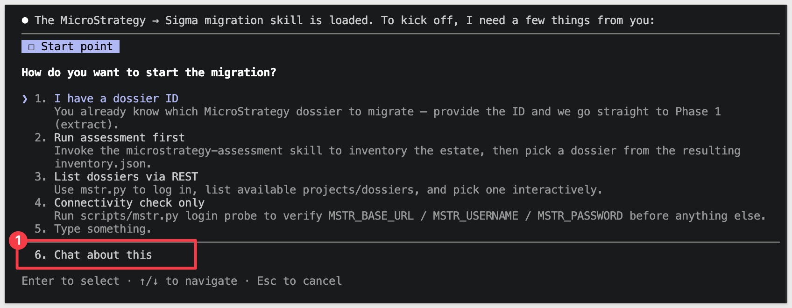
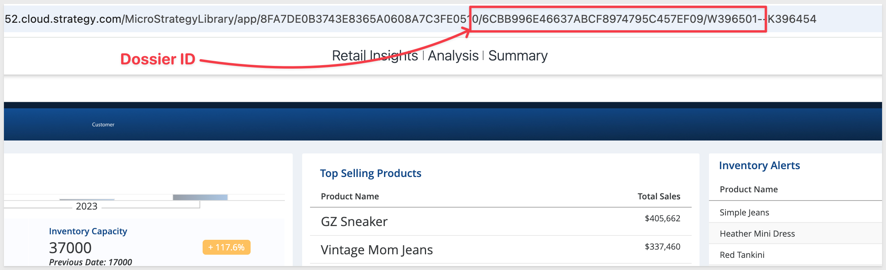
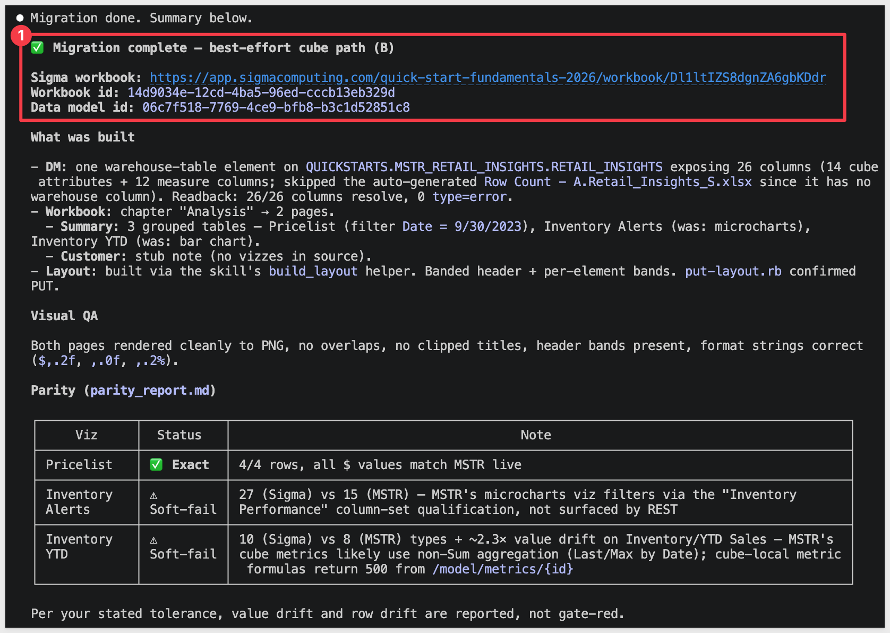
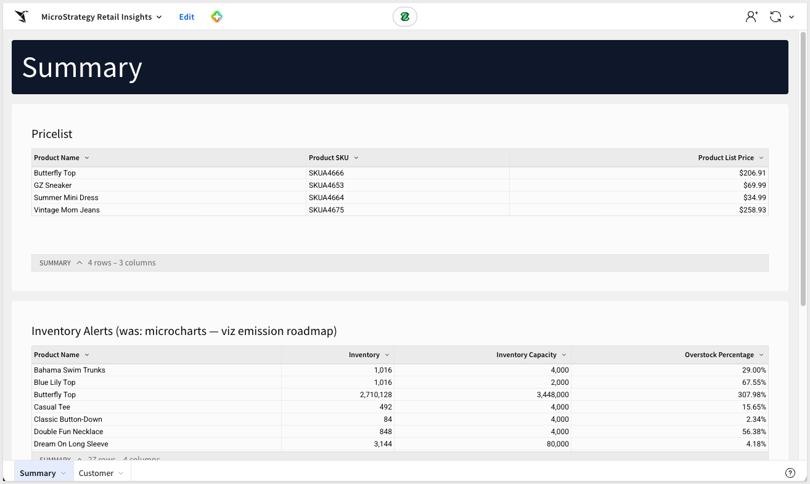
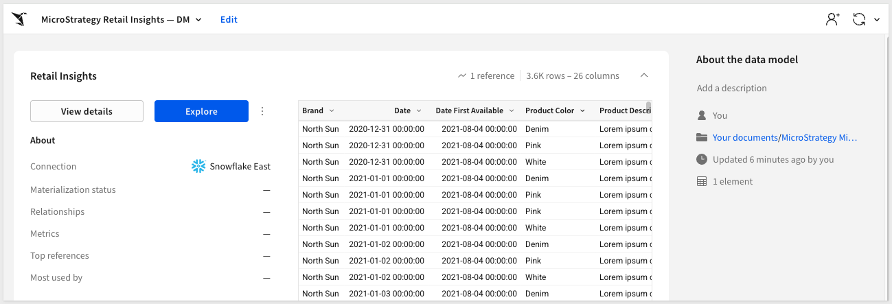

author: pballai
id: developers_migrating_from_microstrategy_made_easy
summary: developers_migrating_from_microstrategy_made_easy
categories: developers
environments: web
status: Hidden
feedback link: https://github.com/sigmacomputing/sigmaquickstarts/issues
tags:
lastUpdated: 2026-0-23

# Migrating From MicroStrategy Made Easy

## Overview
Duration: 5

A common ask from teams evaluating Sigma is migrating their MicroStrategy (Strategy One) footprint — usually to take advantage of all the amazing things Sigma offers. The conversion itself can be a blocker — and the part this QuickStart automates.

The usual MicroStrategy-to-Sigma migration loop is rebuild-the-schema-by-hand, re-author every attribute / fact / metric as a Sigma formula, recreate each dossier chapter and visualization, line the layout up against the source, then eyeball the numbers and hope nothing drifted in the translation. Done on a single dossier it's tedious. Across a project with dozens of dossiers reading from a shared classic schema, it's the reason migration projects slip.

This QuickStart walks through a `Claude Code` skill called `microstrategy-to-sigma` that automates the loop.

Point it at a MicroStrategy dossier; it extracts the dossier definition and the full semantic model (attributes, facts, metrics, logical tables, hierarchy relationships) via the MicroStrategy REST API into a single `bundle.json`, translates each metric's MicroStrategy expression into a Sigma formula, builds a Sigma data model from the logical tables and joins the converter discovers in the schema, mirrors each chapter's tables and selectors as a Sigma workbook page, and runs a row-level parity pass that compares Sigma's output to MicroStrategy's own report results. It surfaces a punch list of anything it couldn't auto-translate — instead of silently producing a broken workbook.

### Sample dashboard
For the demonstration, we'll convert a MicroStrategy dossier called `Retail Insights` — a merchandising dashboard that tracks inventory health, sell-through, and YTD revenue across a product catalog. The dossier surfaces overstock-vs-capacity, per-product ranking within product line, and store-level sales performance, all driven from a single denormalized warehouse table (3,592 rows at product-day grain, 27 columns covering brand / product / store attributes plus inventory and sales metrics):



<aside class="positive">
<strong>WHY IT MATTERS:</strong><br> The skill runs the whole conversion — extract, translate, build, verify — and finishes with a documented parity check. The result is a working Sigma workbook on the warehouse plus the report that proves it matches the MicroStrategy source, instead of a rebuilt-by-hand workbook you have to spot-check yourself.
</aside>

### What else this enables

A pure lift-and-shift is the floor, not the ceiling. The same skill family supports three follow-on moves that turn a migration into an upgrade:

- **Dedup before you migrate.** Most BI estates carry years of dashboard sprawl — multiple near-identical dashboards built by different teams over time. The assessment skill flags dashboards that are roughly 90% the same and recommends merging them before conversion. You move 200 dashboards instead of 800, and every downstream conversation is simpler. Pair this with the usage data the assessment pulls (who views what, how often) and you can confidently retire cold content rather than carry it forward.

- **Enhance, don't just translate.** Many "dashboards" in legacy tools are really input-driven workflows in disguise — a dashboard whose data is refreshed by uploading a CSV each morning is actually a forecasting app waiting to happen. After the lift-and-shift, the skill can suggest replacing those patterns with native Sigma constructs: input tables for write-back, Sigma Assistant for natural-language analysis, scheduled agents for routine summaries. The result isn't "the old dashboard, in a new tool" — it's "the workflow, finally done right."

- **Audit your source as a side effect.** The parity check that closes the run isn't just a confidence test on the migration — it's a fresh pair of eyes on the source platform's math. Sigma customers have caught multi-year calculation errors during their first migration run because the parity gate flagged a Sigma vs source mismatch and the source turned out to be wrong. Plan the migration as your final audit of the legacy system.

<aside class="negative">
<strong>NOTE:</strong><br> The migration is one-directional — MicroStrategy is the source, Sigma is the target. Sigma reads the warehouse live, so the conversion's accuracy depends on the warehouse tables behind your MicroStrategy schema being reachable from a Sigma connection. The skill extracts the classic-schema semantic model (attributes / facts / metrics / logical tables) over the MSTR REST API and reconciles those objects back to the underlying warehouse columns. Parity is checked against MicroStrategy's own report results via the API, so any caching or Intelligent Cube staleness surfaces as an explicit row-level diff rather than getting buried.
</aside>

<aside class="negative">
<strong>AI MODEL DIFFERENCES:</strong><br> Depending on which AI, model, and version you're running, the exact prompt wording, option ordering, and intermediate messages may differ slightly from what's shown in this QuickStart. The substantive steps and decisions are the same — pick the option that matches the intent described, even if the label varies.
</aside>

### Target Audience
Sigma SEs, technical CSMs, and migration partners running MicroStrategy-to-Sigma conversions — or scoping a batch migration with the companion `microstrategy-assessment` skill.

### Prerequisites
- `Claude Code` installed (CLI or desktop).
- Sigma API credentials.
- A MicroStrategy (Strategy One) instance you can reach via REST — the Library URL (e.g., `https://<host>/MicroStrategyLibrary`), a username, and a password. The credential's user needs at least: read access to the target project, the dossier you'll convert, and the underlying schema objects.
- `Python 3.10` or newer. macOS's stock system Python is typically 3.9 — older than the skill needs. If `python3 --version` reports anything below 3.10, install a newer interpreter via [Homebrew](https://brew.sh/) (`brew install python@3.12`) or [python.org](https://www.python.org/downloads/).
- `Ruby` (any recent system Ruby is fine) for the shared finalize/gate stack (`assert-phase6-ran.rb`, `put-layout.rb`, `probe-controls.rb`, etc.).
- `Node.js` (any recent LTS) for building the converter MCP. The conversion uses a separate MCP server, [`sigma-data-model-mcp`](https://github.com/twells89/sigma-data-model-mcp), cloned + built (`npm install && npm run build`) into `~/Desktop/sigma-data-model-mcp`. The skill prompts you to install it mid-conversion — no upfront work needed — but pre-build it if you'd rather skip the gate.
- A warehouse reachable from Sigma (Snowflake, BigQuery, Databricks, Redshift, Postgres and others).

<aside class="negative">
<strong>NOTE:</strong><br> Use a non-production Sigma org for your first run. The skill creates real workbooks, and error-recovery paths may iterate via PUT to update them.
</aside>

<button>[Sigma Free Trial](https://www.sigmacomputing.com/free-trial/)</button>


<!-- END OF SECTION-->

## The MicroStrategy Migration Skill Family
Duration: 5

`microstrategy-to-sigma` is one of two skills that ship together as a single repo (cloned in the next section). Most of this QuickStart focuses on the converter — but knowing where the assessment skill fits saves dead ends later when scoping a batch migration.

| Skill | Role | When to reach for it |
|-------|------|----------------------|
| `microstrategy-assessment` | Scoping | Auditing a MicroStrategy environment before committing to a conversion plan. Emits a per-dossier complexity readout (visualization-type histogram, metric convertibility, AE row-collapse flags, schema size), datasource inventory, and a value/cost-ranked migration shortlist that `microstrategy-to-sigma` can consume. Read-only — only `GET`s against the MSTR API. |
| `microstrategy-to-sigma` | Conversion | The subject of this QuickStart. Converts a single MicroStrategy dossier (or a batch via shortlist) to a Sigma data model and matching workbook with verified row-level parity. |

Here's how the two skills connect in a full migration — `microstrategy-assessment` hands the converter a ranked shortlist, and `microstrategy-to-sigma` produces the Sigma workbooks with a verified parity report:



<aside class="positive">
<strong>WHY IT MATTERS:</strong><br> Each skill does one thing well — scoping and conversion. Pick the smallest set that fits your job, and don't run the conversion until you've confirmed the data is somewhere Sigma can actually read.
</aside>

### Which skill for your situation

Not every migration needs both skills. Use the table below to map your scenario to the smallest set that fits.

In this QuickStart we're in the first row — one MicroStrategy dossier whose classic schema reads from warehouse tables that we'll land in Snowflake — then run `microstrategy-to-sigma`.

| Your situation | Skill(s) to use |
|----------------|-----------------|
| 1 dossier, classic schema reads from your warehouse | `microstrategy-to-sigma` |
| 1 dossier, schema reads from a warehouse Sigma can't connect to | Land the data in your warehouse first (covered in `Prepare the Demo Data`), then `microstrategy-to-sigma` |
| 10+ dossiers (any data source) | `microstrategy-assessment` → `microstrategy-to-sigma` in batch mode |
| Auditing MicroStrategy sprawl without converting yet | `microstrategy-assessment` only |

<aside class="negative">
<strong>NOTE:</strong><br> As the skill runs, you'll see filenames and log lines that reference internal phase numbers (e.g., <code>assert-phase6-ran.rb</code>). Those belong to the skill's own internal numbering — they map onto the phases described in <code>Review the Output</code>. The full mapping is documented in the skill's <code>SKILL.md</code>.
</aside>


<!-- END OF SECTION-->

## Install and Configure the Skill
Duration: 15

First we need to clone the skill's GitHub repository, configure MicroStrategy REST credentials, and capture your Sigma credentials.

The two skills live in `sigmacomputing/quickstarts-public` under [microstrategy-migration-skills/](https://github.com/sigmacomputing/quickstarts-public/tree/main/microstrategy-migration-skills).

From a terminal, run each command below one at a time so you can confirm each step before moving on.

<aside class="positive">
<strong>NOTE:</strong><br> <code>~</code> in the commands below is shell shorthand for your home folder — <code>/Users/&lt;you&gt;</code> on macOS, <code>/home/&lt;you&gt;</code> on Linux.
</aside>

**Step 1: Create a local folder for the clone**

```copy-code
mkdir -p ~/quickstarts-public
```

**Step 2: Move into the new folder**

```copy-code
cd ~/quickstarts-public
```

**Step 3: Clone the repo without pulling any files yet**

```copy-code
git clone --filter=blob:none --sparse https://github.com/sigmacomputing/quickstarts-public.git .
```

**Step 4: Fill in only the microstrategy-migration-skills folder**

```copy-code
git sparse-checkout set microstrategy-migration-skills
```

**Step 5: Symlink microstrategy-to-sigma into the Claude skills folder**

```copy-code
ln -s ~/quickstarts-public/microstrategy-migration-skills/microstrategy-to-sigma ~/.claude/skills/microstrategy-to-sigma
```

**Step 6: Symlink microstrategy-assessment**

```copy-code
ln -s ~/quickstarts-public/microstrategy-migration-skills/microstrategy-assessment ~/.claude/skills/microstrategy-assessment
```

Steps 5 and 6 should return with no error.


**Step 7: Install the Python dependencies the skill uses.**<br>
The skill reads MSTR's YAML spec responses with `PyYAML`. Everything else is in Python's standard library.

<aside class="negative">
<strong>NOTE:</strong><br> The skill requires Python 3.10 or newer. Check your version first with <code>python3 --version</code>. If it's older — macOS's stock Python is typically 3.9 — install a newer one via Homebrew and use it explicitly for the rest of this section: <code>brew install python@3.12</code>, then substitute <code>python3.12</code> wherever the steps below say <code>python3</code>.
</aside>

```copy-code
python3 -m pip install pyyaml
```


**Step 8: Capture your Sigma API credentials.**<br>
This script prompts for `SIGMA_BASE_URL`, `SIGMA_CLIENT_ID`, and `SIGMA_CLIENT_SECRET` and writes them into Claude's settings + the neutral `~/.sigma-migration/env` file that the skill family uses to mint Sigma API tokens at runtime.

Run once per machine.

```copy-code
ruby ~/.claude/skills/microstrategy-to-sigma/scripts/setup.rb
```


**Step 9: Capture your MicroStrategy credentials.**<br>
This script prompts for the Library URL, username, password, and optional project ID, then writes them into Claude's settings + the same neutral `~/.sigma-migration/env` file.

Run once per machine.

```copy-code
ruby ~/.claude/skills/microstrategy-to-sigma/scripts/setup-microstrategy.rb
```

When the script asks for the Library URL, use the form below as a template. **Replace the host with your own tenant's hostname** (visible in your browser's address bar when you're logged into MicroStrategy Cloud). The `/MicroStrategyLibrary` suffix is required for both Cloud and on-prem deployments — the REST API lives under that path, and dropping it returns `404` on every call:

```copy-code
https://env-aBc12345xYz67890.cloud.strategy.com/MicroStrategyLibrary
```

The final prompt asks for a **Project ID** and is optional. Press `Enter` to skip.

The skill will default to the first project visible to your user, which is what you want for this QuickStart. If your tenant has multiple projects and the target dossier lives in a non-default one, paste that project's ID here (visible in MicroStrategy's URL when you have the project open).

MicroStrategy uses session-based auth — there's no API key concept; the skill calls `POST /api/auth/login` with `loginMode 1`.

Verify auth works:

```copy-code
source ~/.sigma-migration/env && python3 ~/.claude/skills/microstrategy-to-sigma/scripts/mstr.py
```

You should see a successful login probe and a list of projects visible to your user.

<aside class="positive">
<strong>NOTE:</strong><br> The <code>/MicroStrategyLibrary</code> suffix is required — the customer-facing MicroStrategy Web URL won't work for API auth. If your tenant uses a self-signed or trial certificate and Python rejects it, <code>mstr.py</code> handles the common Python 3.13+ <code>VERIFY_X509_STRICT</code> case.
</aside>


**Step 10: Verify Claude Code can invoke the skill.**<br>
Type `claude` in your terminal to start Claude Code, then invoke the skill:

```copy-code
claude
```

```copy-code
/microstrategy-to-sigma
```

Claude should start reading the reference files and ask what dossier you want to convert. 

Pause at that prompt — we'll hand it everything in one shot via the kickoff prompt in `Run the Conversion`:




<!-- END OF SECTION-->

## Prepare the Demo Data
Duration: 10

The MicroStrategy dossier we're migrating reads from a single denormalized retail-insights table — 27 columns covering brand / product / store dimensions plus inventory and sales metrics. For the migration to land in Sigma cleanly, the same table needs to exist in a connection your Sigma org can reach.

Data prep has two halves:

1. **MicroStrategy side — nothing to do here for this QuickStart.** We've already exported the source table and hosted it as a CSV in Amazon S3. The Snowflake `COPY INTO` statement below reads from S3 directly — no local download needed.

2. **Sigma side (this section)** — the same data needs to live in a Snowflake schema your Sigma connection can read. We'll create one.

<aside class="negative">
<strong>NOTE:</strong><br> The DDL below grants access to <code>SIGMA_SERVICE_ROLE</code>. Substitute the role your Sigma connection actually uses if it differs — you can confirm it in Sigma under <code>Administration</code> > <code>Connections</code> by clicking your Snowflake connection.
</aside>

<aside class="negative">
<strong>NOTE:</strong><br> The column names use quoted identifiers (spaces and mixed case) so they match what the MicroStrategy logical-table mapping expects. The conversion skill resolves columns by exact name against the warehouse, so don't snake-case these or the converter will flag them as unresolved during the data-model POST.
</aside>

```copy-code
USE ROLE ACCOUNTADMIN;
USE WAREHOUSE COMPUTE_WH;

CREATE DATABASE IF NOT EXISTS QUICKSTARTS;
CREATE SCHEMA  IF NOT EXISTS QUICKSTARTS.MSTR_RETAIL_INSIGHTS;
USE SCHEMA QUICKSTARTS.MSTR_RETAIL_INSIGHTS;

CREATE OR REPLACE FILE FORMAT csv_format
  TYPE = CSV
  FIELD_DELIMITER = ','
  SKIP_HEADER = 1
  FIELD_OPTIONALLY_ENCLOSED_BY = '"'
  NULL_IF = ('', 'NULL')
  EMPTY_FIELD_AS_NULL = TRUE;

CREATE OR REPLACE STAGE mstr_retail_stage
  URL = 's3://sigma-quickstarts-main/Microstrategy/'
  FILE_FORMAT = csv_format;

CREATE OR REPLACE TABLE RETAIL_INSIGHTS (
  "Brand"                    VARCHAR,
  "Date"                     DATE,
  "Date First Available"     DATE,
  "Product Color"            VARCHAR,
  "Product Description"      VARCHAR,
  "Product Image"            VARCHAR,
  "Product Line"             VARCHAR,
  "Product Link"             VARCHAR,
  "Product Name"             VARCHAR,
  "Product Size"             VARCHAR,
  "Product SKU"              VARCHAR,
  "Product Type"             VARCHAR,
  "Ranking in Product Line"  NUMBER(38,0),
  "Store Location"           VARCHAR,
  "Avg Unit Sold"            NUMBER(38,4),
  "Inventory"                NUMBER(38,4),
  "Inventory Capacity"       NUMBER(38,0),
  "Order Quantity"           NUMBER(38,0),
  "Overstock Percentage"     NUMBER(38,10),
  "Product Cost"             NUMBER(38,2),
  "Product Inventory"        NUMBER(38,4),
  "Product List Price"       NUMBER(38,2),
  "Product Rating"           NUMBER(38,4),
  "Product YTD Revenue"      NUMBER(38,2),
  "Product YTD Sales"        NUMBER(38,2),
  "Row Count"                NUMBER(38,0),
  "Total Sales"              NUMBER(38,2)
);

COPY INTO RETAIL_INSIGHTS FROM @mstr_retail_stage/retail_insights.csv ON_ERROR = ABORT_STATEMENT;

GRANT USAGE  ON DATABASE QUICKSTARTS                                      TO ROLE SIGMA_SERVICE_ROLE;
GRANT USAGE  ON SCHEMA   QUICKSTARTS.MSTR_RETAIL_INSIGHTS                 TO ROLE SIGMA_SERVICE_ROLE;
GRANT SELECT ON ALL    TABLES IN SCHEMA QUICKSTARTS.MSTR_RETAIL_INSIGHTS  TO ROLE SIGMA_SERVICE_ROLE;
GRANT SELECT ON FUTURE TABLES IN SCHEMA QUICKSTARTS.MSTR_RETAIL_INSIGHTS  TO ROLE SIGMA_SERVICE_ROLE;

-- Sanity-check row count. Expected: 3592.
SELECT COUNT(*) AS ROW_COUNT FROM RETAIL_INSIGHTS;

-- Total Sales baseline (~$3,169,933.01 for the warehouse snapshot).
SELECT TO_CHAR(SUM("Total Sales"), '$999,999,999.99') AS TOTAL_SALES_BASELINE
FROM RETAIL_INSIGHTS;
```

If the load completes cleanly, the `Total Sales` check returns roughly `$3,169,933.01`. Any mismatch means either a `COPY` partial-load error (check Snowflake's load history) or a different S3 file than expected.



<aside class="positive">
<strong>WHY IT MATTERS:</strong><br> Once the source data lives in your warehouse, every downstream tool — Sigma, dbt, your own SQL — reads from the same source of truth instead of routing through MicroStrategy's Intelligent Cubes. The migration step doubles as a data-architecture upgrade.
</aside>


<!-- END OF SECTION-->

## Prepare the Sigma Target Folder
Duration: 2

The converter needs a Sigma folder to land the new data model and workbook in. The skill will ask for the folder's UUID — it will be easier to have it ready before you return to the Claude prompt that's still paused after the skill loaded.

To keep this simple, we will use a plain folder and not a workspace.

**Step 1: Create (or pick) a folder in Sigma.**<br>
Open your Sigma org, navigate to where you want the migrated workbook to live, and create a folder for it. Something like:

```copy-code
MicroStrategy Migration Demo
```

**Step 2: Grab the folder ID.**<br>
Open the folder. The ID is the last segment of the URL — a short alphanumeric string, 21 characters. Copy it from the address bar and keep it on the clipboard for the next section.



<aside class="positive">
<strong>NOTE:</strong><br> The skill's prompt may refer to the folder "UUID". Paste the value from the URL exactly as it appears; the skill accepts that form directly.
</aside>


<!-- END OF SECTION-->

## Run the Conversion
Duration: 3

The skill can run interactively, asking for the dossier, warehouse, and Sigma destination one at a time. For a known target — like ours — it's faster to give Claude the entire job in one message. The skill recognizes a structured kickoff prompt and walks the pipeline directly, going straight from "go" through extract → convert → data model → workbook build → layout → parity.

If Claude is still running and paused at the skill's first prompt from `Install and Configure the Skill`, return to that terminal. If you closed Claude after that step, restart it now:

```copy-code
claude
```

```copy-code
/microstrategy-to-sigma
```

When Claude finishes loading the skill and asks what to migrate, choose `Chat about this`:



Paste the block below. **Substitute your own values where the placeholders are:**

- `Dossier ID` — the dossier's object ID, visible in MicroStrategy Library's URL when you have the dossier open. 

The URL follows the shape `/MicroStrategyLibrary/app/{projectId}/{dossierId}/{state}`.

For example:



Copy the 32-character dossier ID — the second hex segment after `/app/`. Ignore the project ID (the skill defaults to your user's first project) and the trailing state token.
- `SIGMA_CONNECTION_ID` — your Snowflake connection ID (the one where you landed the sample data) from Sigma's `Administration` > `Connections`
- `SIGMA_FOLDER_ID` — the folder ID you copied at the end of the previous section
- Any additional custom instructions are useful to add here now.

```copy-code
Run /microstrategy-to-sigma on the following. Walk every phase in SKILL.md end-to-end and stop only if a hard gate fails.

MicroStrategy
- Credentials sourced from ~/.sigma-migration/env (MSTR_BASE_URL, MSTR_USERNAME, MSTR_PASSWORD, optional MSTR_PROJECT_ID)
- Dossier ID: <your-dossier-object-id>

Warehouse (Snowflake)
- Database: QUICKSTARTS
- Schema: MSTR_RETAIL_INSIGHTS

Sigma
- SIGMA_API_TOKEN = mint from ~/.sigma-migration/env
- SIGMA_CONNECTION_ID: <your-snowflake-connection-id>
- SIGMA_FOLDER_ID: <your-folder-id>

Options
- Name prefix: MicroStrategy Retail Insights
- Auto-approve mid-pipeline questions: yes
- Parity: tolerate row-count drift between MicroStrategy (live) and the warehouse snapshot — this QuickStart uses a frozen CSV copy of the source. Report the delta with a row-level diff, but treat warehouse-snapshot staleness as a soft fail (not a gate-red).

Don't declare GREEN until the parity gate passes (or the tolerance above applies) and the visual-QA loop passes.
```

Claude reads the block, mints a fresh Sigma token from `~/.sigma-migration/env`, sources the MSTR variables, and walks the phases end-to-end. The rest of the run is hands-off until a gate or decision point.

<aside class="positive">
<strong>NOTE:</strong><br> The skill reuses Sigma credentials captured by <code>setup.rb</code> — they live at <code>~/.sigma-migration/env</code> and the skill mints a fresh <code>SIGMA_API_TOKEN</code> from them at runtime. That's why the kickoff prompt above says <code>mint from ~/.sigma-migration/env</code> instead of pasting a token. No manual Sigma-token wrangling per run.
</aside>

<aside class="negative">
<strong>NOTE:</strong><br> From here on, Claude Code asks for approval on every bash command the skill runs — and a full conversion fires dozens of them. For each prompt, pick option <code>2. Yes, and don't ask again</code> so Claude Code remembers that command pattern. After the first handful of approvals the prompts stop coming. Alternatively, press <code>Shift+Tab</code> once to switch to <code>auto mode on</code> for the rest of the session — fine for a trusted skill like this one, just don't use it for unknown code.
</aside>


<!-- END OF SECTION-->

## Review the Output
Duration: 10

When the migration completes, Claude prints a final summary covering the whole pipeline — every phase's result, the visual-QA outcome, the hard-gate verdict, and the URLs of the new Sigma data model and workbook:



The summary walks through six phases plus a visual-QA pass:

- **Phase 1 — Extract.** Walks the dossier definition over the MSTR REST API → dataset reports (`showExpressionAs=tokens`) → referenced attributes, metrics (compound bases included via a second pass), facts, logical tables, and hierarchy relationships into a single `bundle.json`. That bundle is the converter's contract.
- **Phase 2 — Convert.** Translates the bundle into a Sigma data-model spec (one table element per logical table, derived left-outer joins, a consumable join element, token-parsed metrics with derived display formats) and a workbook spec (one page per dossier chapter, grouped tables mirroring each report template, controls from the dossier's filter signals, banded layout).
- **Phase 2.5 — AE row-collapse resolution.** When a report uses an attribute whose DESC form differs from its key (the Analytical Engine collapses non-unique key groups to one representative row), the skill re-executes the affected reports in MSTR, computes the clean warehouse groups via a throwaway Sigma probe workbook, and emits a deterministic pinned-winner SQL element. This is the single biggest parity trap with MicroStrategy migrations.
- **Phase 3 — Data model POST.** Posts the new data model to Sigma, captures the reassigned element IDs from the YAML readback, and verifies every column resolves cleanly against your warehouse schema.
- **Phase 4 — Workbook build.** Re-emits the workbook spec with real data model + element IDs, POSTs it, then runs the `scout-gate-readback` step that mechanically checks for any `type=error` columns the converter passed through. Applies the banded layout the converter emitted.
- **Phase 5 — Visual QA.** Renders the workbook's pages as PNGs and lints them — no overlapping tiles, no clipped chart titles, no dead zones, no orphan controls.
- **Phase 6 — Parity + hard gate.** Pulls each report's expected values directly from MicroStrategy via `POST /api/v2/reports/{id}/instances`, exports each Sigma element via the Sigma export API, and compares row-by-row (money/counts exact; ratio metrics within rel 1e-6). The gate is GREEN only when every report PASSes — never on a 200 POST alone.

<aside class="negative">
<strong>NOTE — Quick Cube source dossiers:</strong><br> If your dossier is built on a MicroStrategy "Quick Cube" (created by uploading a CSV or Excel file directly into MSTR Cloud), MSTR doesn't expose enough metadata for full semantic-model extraction. The skill switches to a warehouse-rehost path: grid content converts with row-level parity, and complex viz types (microcharts, custom charts) surface as flagged table fallbacks.
</aside>

Open the new workbook in Sigma to see the migrated dossier:



Open the data model too:



**Hand-polish items the skill flags rather than silently working around:**

- MicroStrategy visualization types with no native Sigma equivalent fall back to a flagged table — swap them manually if the source had any. See `refs/viz-type-mapping.md` for the full lookup.
- Metric-condition selectors, page-by selectors, and prompts land in `control-scope.json` as `unbound` MANUAL items — hand-wire them to the right Sigma element.
- Panel selectors are navigation in MSTR, not filters — the skill flags them MANUAL rather than silently converting them to Sigma controls that would change query semantics.
- Attribute-count metrics (`Count(Customer)`) trigger cartesian-governance aborts in Sigma — the skill flags them and suggests counting a fact/key column instead.
- The newer REST-authorable "Data Model" object (including `securityFilters`) is on the converter's roadmap — until that lands, **ask the customer about security filters explicitly**. Don't assume an estate has none just because the classic extract doesn't carry them.

<aside class="positive">
<strong>WHY IT MATTERS:</strong><br> The skill finishes with a documented exit code and an explicit list of what it couldn't auto-translate — never a silent "looks good." Every gap surfaces as a follow-up item with a recommended fix, so you spend hand-polish time on the few items that need it instead of spot-checking every visualization for drift.
</aside>


<!-- END OF SECTION-->

## Scaling Up — Batch Conversion
Duration: 5

A single dossier is the easy case. Real migrations involve MicroStrategy projects with dozens or hundreds of dossiers reading from a shared classic schema — and migrating them one-by-one through the converter loses the leverage of doing the planning work once. That's where the companion `microstrategy-assessment` skill comes in.

Point `microstrategy-assessment` at a MicroStrategy environment and it inventories every project, report, dossier, and datasource, scoring each on:

- **Per-dossier complexity** — visualization-type histogram (walking panel stacks recursively), metric convertibility, AE row-collapse flags, schema size touched
- **Converter-coverage classification** — every dossier's visualizations are scored against the *same* viz-type lookup `microstrategy-to-sigma` actually applies, so the readout reflects what the tool will really do — not a generic guess
- **Datasource patterns** — instance datasources with database types, surfacing which dossiers read from a warehouse Sigma can connect to versus ones that need extra plumbing
- **Tag pills** — `migrate-first`, `easy-win`, `needs-review`, `retire` based on combined complexity + coverage scores

The output is a Sigma-branded `readout.md` you can share with stakeholders, plus a ranked migration shortlist sorted by `value / (1 + cost)` — the cheapest, highest-value dossiers to convert first.

The shortlist becomes input to a **batch conversion plan** — `microstrategy-assessment` groups dossiers that share the same logical tables so one Sigma data model can serve a whole family of workbooks instead of producing N near-duplicate DMs. `microstrategy-to-sigma` consumes that plan in batch mode and runs the conversions concurrently.

Typical flow for a real migration engagement:

1. Run `microstrategy-assessment` against the target environment; review the shortlist with stakeholders.
2. Pick the top N dossiers to convert first — or drop the cold ones entirely.
3. Hand the batch plan to `microstrategy-to-sigma` and let it work through them.
4. Spot-check each output; file the inevitable gap items upstream.

<aside class="positive">
<strong>WHY IT MATTERS:</strong><br> Sigma's BI migration story is a process, not a single conversion. The assessment skill turns "how big is this migration?" from a guess into a defensible number — backed by per-dossier effort estimates, converter-coverage scoring, and a retirement list for content nobody actually reads. That's the difference between a migration that ships and one that stalls in committee.
</aside>


<!-- END OF SECTION-->

## Common Issues and Fixes
Duration: 5

The following is a "grab bag" of things that might come up during real conversions, with the fix for each.

- **`python3 --version` reports 3.9.x and the skill refuses to run:**<br> macOS's stock Python is too old for the skill. Install Python 3.10+ via Homebrew (`brew install python@3.12`) or [python.org](https://www.python.org/downloads/), then use `python3.12 -m pip install` explicitly for any helpers. Avoid `pip3` as a shorthand — it can quietly resolve back to the old interpreter.

- **`mstr.py` returns `401` or `Could not authenticate to MicroStrategy`:**<br> The `MSTR_BASE_URL`, `MSTR_USERNAME`, or `MSTR_PASSWORD` in `~/.sigma-migration/env` is wrong or stale. The base URL must be the Library root — e.g., `https://<host>/MicroStrategyLibrary` — not the Web URL. Confirm by hitting `<MSTR_BASE_URL>/api/auth/login` in a REST client with the same credentials.

- **`mstr.py` fails with `SSL: CERTIFICATE_VERIFY_FAILED — self-signed certificate in certificate chain`:**<br> macOS Python installs from [python.org](https://www.python.org/downloads/) ship with an empty CA bundle by default — system root certificates aren't loaded until you run the post-install script that the installer drops in the Python framework folder. Run it once and re-try:<br>
 <code>/Applications/Python\ 3.14/Install\ Certificates.command</code><br>
 (Substitute your installed version — the script lives next to the `Python` binary in `/Applications/Python <version>/`.) After it completes, the auth probe should succeed.

- **`mstr.py` still fails with `self-signed certificate in certificate chain` after the cert-install script ran:**<br> A corporate TLS-inspection proxy (Netskope, Zscaler, Cisco Umbrella, Cloudflare WARP) is rewriting your outbound TLS with its own root CA. macOS Keychain trusts that root (which is why `curl` works), but Python's certifi bundle does not. Confirm by running <code>curl -v &lt;mstr-url&gt; 2>&1 | grep issuer</code> — if the issuer is something like <code>ca.&lt;company&gt;.goskope.com</code> (Netskope) or <code>Zscaler Root CA</code> rather than a public CA, you've found it. Pull the proxy's root certificate out of Keychain and combine it with the macOS roots into a PEM Python can read, then point Python at it via <code>SSL_CERT_FILE</code>:<br>
 <code>security find-certificate -a -c "&lt;issuer-CN&gt;" -p > /tmp/proxy-ca.pem</code><br>
 <code>security find-certificate -a -p /System/Library/Keychains/SystemRootCertificates.keychain > /tmp/macos-roots.pem</code><br>
 <code>cat /tmp/macos-roots.pem /tmp/proxy-ca.pem > /tmp/full-trust.pem</code><br>
 <code>echo 'export SSL_CERT_FILE=/tmp/full-trust.pem' >> ~/.sigma-migration/env</code><br>
 Re-source the env file and the auth probe should pass. The skill's other Python scripts pick up <code>SSL_CERT_FILE</code> for free.

- **`mstr.py` returns a different SSL certificate verification error:**<br> Python 3.13+ tightened certificate validation (`VERIFY_X509_STRICT`) and rejects some MicroStrategy cloud / trial certificates that older Python versions accepted. `mstr.py` includes the standard handling for this — if it surfaces anyway, your tenant's cert chain has an issue worth reporting to the MSTR admin.

- **Changeset lock dangling on retry:**<br> If a previous run died mid-conversion, MSTR can leave a schema lock behind. The skill's gotcha list covers the fix: `DELETE /api/model/schema/lock`. The skill's `mstr.py` handles this on the next run, but if you're poking the REST API by hand, that's the unblock.

- **Skill pauses at a "converter MCP gate" mid-run:**<br> The conversion delegates the model translation to a separate MCP server (`sigma-data-model-mcp`). If it isn't installed locally, the skill stops at the gate. Pick option `6. Chat about this` and tell Claude:<br>
 <code>Clone twells89/sigma-data-model-mcp into ~/Desktop/sigma-data-model-mcp for me, then run `npm install && npm run build` in that directory. Once the build is done, come back to the gate and pick option 1.</code><br>
 Claude runs the clone, install, and build, then returns to the gate. After that the skill may also prompt for a "build commit" — choose the `(Recommended)` option.

- **Schema not visible in Sigma after `COPY INTO`:**<br> Sigma's service role doesn't have access to the new schema. The DDL block in `Prepare the Demo Data` includes the `GRANT USAGE` and `GRANT SELECT` statements — if you skipped or modified them, run them now with the role name your Sigma connection actually uses (find it in Sigma under `Administration` > `Connections`).

- **Phase 2.5 — AE row-collapse — fires and seems mysterious:**<br> MicroStrategy's Analytical Engine collapses non-unique attribute key groups to a single representative row that **cannot be derived from clean SQL**. When the converter spots an attribute whose DESC form differs from its key, it re-executes the affected reports in MSTR, pins each "winner" empirically, and emits a deterministic SQL element. This is documented in `refs/ae-row-collapse.md` — read it once and the gate stops feeling like magic.

- **Metric flagged as "needs review":**<br> Some MicroStrategy patterns — non-additive compound metrics, conditional metrics using MSTR's filter qualifications, or metrics referencing functions without a direct Sigma equivalent — surface as flagged for hand-author. The skill prints the original MSTR expression alongside its best-guess Sigma translation. Hand-author the Sigma formula on the affected element using the warehouse-resolved column names.

- **`scout-gate-readback.py` exits 11 with an `UNSCOUTED` error column:**<br> The converter passed a metric function through that has no Sigma equivalent. The mechanical gate stops the pipeline so you don't ship a workbook with broken columns. Spawn a gap-scout per the printed `--gap-id` (see `scripts/gap-scout.md`), translate or escalate, then re-run the gate. The script only exits 0 when no unscouted error columns remain.

- **Many `Bash command — Contains shell syntax that cannot be statically analyzed — Do you want to proceed?` prompts during the run:**<br> The skill fires `eval "$(...)"` patterns to inject tokens dynamically. Claude Code's safety analyzer can't pattern-match these for blanket approval even in accept-edits mode. Click `1. Yes` on each — it's expected behavior, not a misconfiguration. After the run, you can use the `/fewer-permission-prompts` skill to scan the transcript and add those patterns to your `.claude/settings.local.json` so subsequent runs are silent.

- **"Data model has error columns" after POST:**<br> A column the model declares can't be resolved against the warehouse. Usually a column-name mismatch between the warehouse table and the MSTR logical table's column reference. The skill's verification phase surfaces the specific column in the error — adjust the warehouse table's column names or correct the MSTR logical table before re-running.


<!-- END OF SECTION-->

## What We've Covered
Duration: 5

What you built is less a single conversion and more a repeatable migration path. The skill took a MicroStrategy dossier — classic schema, attributes, facts, metrics, chapter layout, selectors — and produced a Sigma data model, a workbook, and a row-level parity report against the live warehouse, all from a single structured prompt. No one rebuilt the dossier by hand, and the parity numbers are evidence rather than hope.

The patterns worth carrying into your next migration:

- **Two skills, one workflow** — `microstrategy-assessment` scopes and prioritizes the environment; `microstrategy-to-sigma` converts and verifies. The same shape applies whether you're migrating one dossier or every dossier reading from a shared classic schema.
- **MSTR REST is your audit trail** — MicroStrategy's REST API exposes the full semantic model (attributes, facts, metrics, logical tables, hierarchies) plus every dossier's definition (chapters, reports, visualizations, selectors). The converter reads the same surface a human admin would, and the output is reproducible against the same bundle.
- **Single-prompt kickoff** — once the warehouse data is in place and `setup.rb` has captured your Sigma credentials, the entire migration is one paste. The kickoff prompt reads the dossier ID + warehouse coordinates + options in one shot, and the skill walks through every phase end-to-end without further interaction unless a gate genuinely needs your call.
- **Warehouse-first** — Sigma reads the live warehouse, so the conversion's value comes from getting the data where Sigma can see it. The DDL + S3 + GRANTs scaffolding in `Prepare the Demo Data` transfers to any warehouse Sigma can reach. For dossiers backed by Intelligent Cubes or MSTR-internal data, materialize those upstream and the same pattern applies.
- **Parity as proof** — the MicroStrategy-vs-Sigma comparison is what makes the result shippable. Without it you're spot-checking; with it you have evidence every metric lines up. The skill is honest about source drift too: when the warehouse snapshot is older than MicroStrategy's live results, the row-level diff is reported instead of buried, and a documented tolerance keeps the gate sensible for demo scenarios.

A first-pass conversion produces a working starting point and a documented punch list, not a hand-polished workbook. The polish loop is short, and you know exactly what to look at. That's the migration approach you can scale across an entire MicroStrategy project.

**Additional Resource Links**

[Blog](https://www.sigmacomputing.com/blog/)<br>
[Community](https://community.sigmacomputing.com/)<br>
[Help Center](https://help.sigmacomputing.com/hc/en-us)<br>
[QuickStarts](https://quickstarts.sigmacomputing.com/)<br>

Be sure to check out all the latest developments at [Sigma's First Friday Feature page!](https://quickstarts.sigmacomputing.com/firstfridayfeatures/)
<br>

[](https://twitter.com/sigmacomputing)&emsp;
[](https://www.linkedin.com/company/sigmacomputing)&emsp;
[](https://www.facebook.com/sigmacomputing)


<!-- END OF WHAT WE COVERED -->
<!-- END OF QUICKSTART -->
