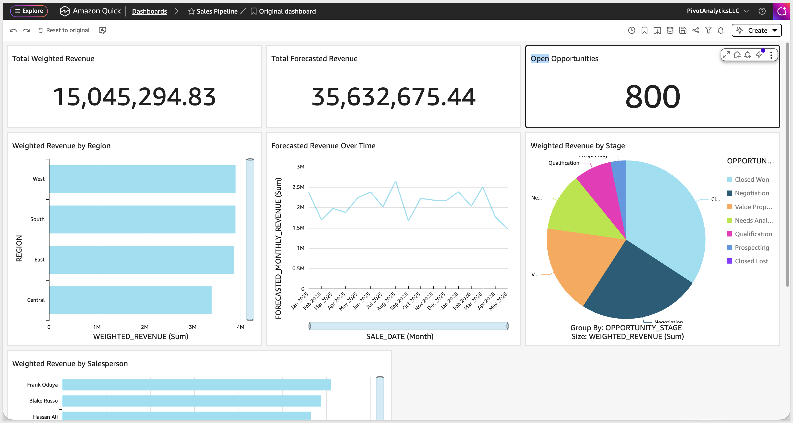
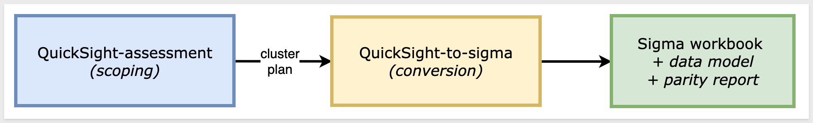
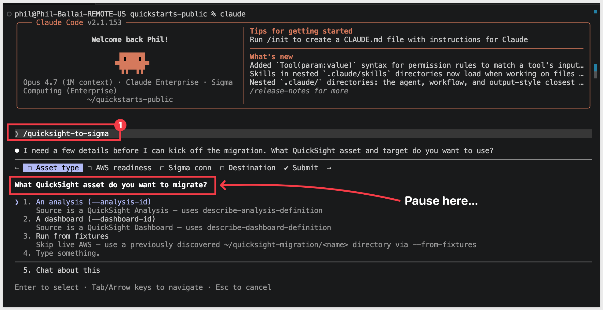
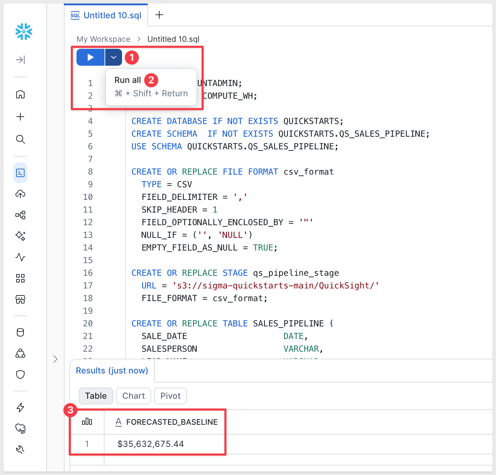
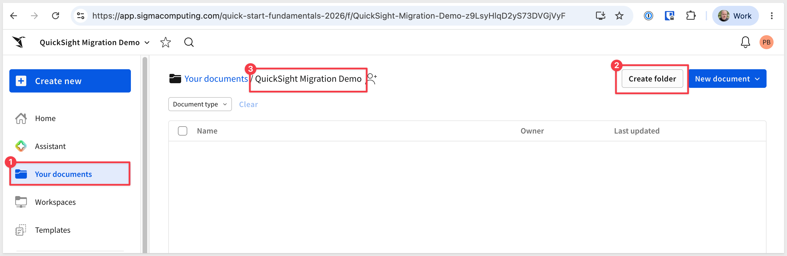
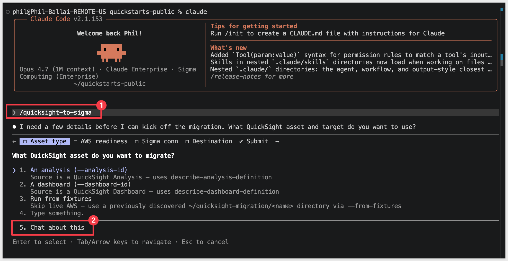
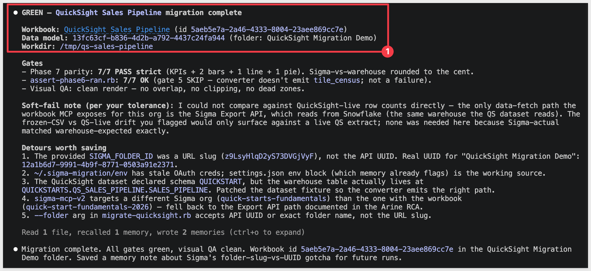
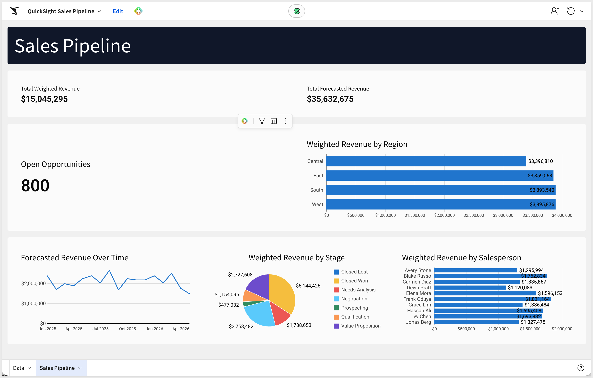
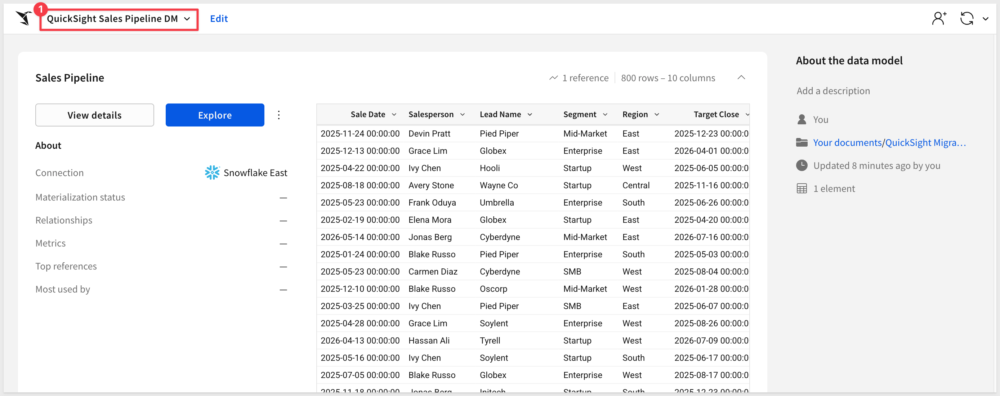

author: pballai
id: developers_migrating_from_quicksight_made_easy
summary: developers_migrating_from_quicksight_made_easy
categories: developers
environments: web
status: Hidden
feedback link: https://github.com/sigmacomputing/sigmaquickstarts/issues
tags:
lastUpdated: 2026-06-25

# Migrating From QuickSight Made Easy

## Overview
Duration: 5

A common ask from teams evaluating Sigma is migrating their Amazon QuickSight footprint — usually to take advantage of all the amazing things Sigma offers. The conversion itself can be a blocker — and the part this QuickStart automates.

The usual QuickSight-to-Sigma migration loop is recreate each dataset and its data-prep, re-author every calculated field as a Sigma formula, rebuild each sheet's visuals and layout, then eyeball the numbers and hope nothing drifted in the translation. Done on a single analysis it's tedious. Across an account with dozens of analyses reading from shared datasets, it's the reason migration projects slip.

This QuickStart walks through a `Claude Code` skill called `quicksight-to-sigma` that automates the loop.

Point it at a QuickSight analysis (or dashboard); it extracts the analysis definition, the datasets it depends on, and the data sources behind them over the AWS CLI, translates each calculated field's QuickSight expression into a Sigma formula, builds a Sigma data model from the warehouse tables the datasets point at, mirrors each sheet's visuals as a Sigma workbook page, and runs a row-level parity pass that compares Sigma's output to the QuickSight aggregation. It surfaces a punch list of anything it couldn't auto-translate — instead of silently producing a broken workbook.

<aside class="positive">
<strong>WHY IT MATTERS:</strong><br> The skill runs the whole conversion — extract, translate, build, verify — and finishes with a documented parity check. The result is a working Sigma workbook on the warehouse plus the report that proves it matches the QuickSight source, instead of a rebuilt-by-hand workbook you have to spot-check yourself.
</aside>

### What else this enables

A pure lift-and-shift is the floor, not the ceiling. The same skill family supports three follow-on moves that turn a migration into an upgrade:

- **Dedup before you migrate.** Most BI estates carry years of dashboard sprawl — multiple near-identical dashboards built by different teams over time. The assessment skill flags dashboards that are roughly 90% the same and recommends merging them before conversion. You move 200 dashboards instead of 800, and every downstream conversation is simpler. Pair this with the usage data the assessment pulls (who views what, how often) and you can confidently retire cold content rather than carry it forward.

- **Enhance, don't just translate.** Many "dashboards" in legacy tools are really input-driven workflows in disguise — a dashboard whose data is refreshed by uploading a CSV each morning is actually a forecasting app waiting to happen. After the lift-and-shift, the skill can suggest replacing those patterns with native Sigma constructs: input tables for write-back, Sigma Assistant for natural-language analysis, scheduled agents for routine summaries. The result isn't "the old dashboard, in a new tool" — it's "the workflow, finally done right."

- **Audit your source as a side effect.** The parity check that closes the run isn't just a confidence test on the migration — it's a fresh pair of eyes on the source platform's math. Sigma customers have caught multi-year calculation errors during their first migration run because the parity gate flagged a Sigma vs source mismatch and the source turned out to be wrong. Plan the migration as your final audit of the legacy system.

### Sample dashboard
For the demonstration, we'll convert a QuickSight analysis called `Sales Pipeline` — a sales-ops dashboard tracking opportunities across stages, segments, and regions. The analysis shows forecasted and weighted revenue by salesperson, opportunity counts by stage (Prospecting → Closed Won/Lost), and pipeline distribution across customer segments (Enterprise / Mid-Market / SMB / Startup) and US regions. The underlying dataset is a single 800-row pipeline table at one-row-per-opportunity grain, covering sales activity from January 2025 through May 2026:



<aside class="negative">
<strong>NOTE:</strong><br> The migration is one-directional — QuickSight is the source, Sigma is the target. Sigma reads the warehouse live, so the conversion's accuracy depends on the warehouse tables behind your QuickSight datasets being reachable from a Sigma connection. The skill extracts the analysis definition, datasets, and data sources over the AWS CLI and reconciles those objects back to the underlying warehouse columns. Parity is checked against the QuickSight aggregation, so any caching or SPICE staleness surfaces as an explicit row-level diff rather than getting buried.
</aside>

<aside class="negative">
<strong>AI MODEL DIFFERENCES:</strong><br> Depending on which AI, model, and version you're running, the exact prompt wording, option ordering, and intermediate messages may differ slightly from what's shown in this QuickStart. The substantive steps and decisions are the same — pick the option that matches the intent described, even if the label varies.
</aside>

### Target Audience
Sigma SEs, technical CSMs, and migration partners running QuickSight-to-Sigma conversions — or scoping a batch migration with the companion `quicksight-assessment` skill.

### Prerequisites
- `Claude Code` installed (CLI or desktop).
- Sigma API credentials.
- An **Amazon QuickSight Enterprise edition** account. The `describe-analysis-definition`, `describe-dashboard-definition`, and `describe-data-set` APIs the skill relies on are Enterprise-only — Standard editions reject them and there is no extraction path. Confirm your edition before starting.
- **AWS CLI v2** — we'll install and configure it in Step 9 below if you don't have it already. The skill uses an in-process `boto3` client when importable and falls back to shelling out to `aws quicksight ...` otherwise.
- The **AWS account ID** (`aws sts get-caller-identity`) and the **analysis ID** (or dashboard ID) you want to migrate.
- `Python 3.10` or newer. macOS's stock system Python is typically 3.9 — older than the skill needs. If `python3 --version` reports anything below 3.10, install a newer interpreter via [Homebrew](https://brew.sh/) (`brew install python@3.12`) or [python.org](https://www.python.org/downloads/).
- `Ruby` (any recent system Ruby is fine) — the build pipeline and finalize/gate stack (`migrate-quicksight.rb`, `assert-phase6-ran.rb`, `put-layout.rb`, etc.) is Ruby-based.
- `Node.js` (any recent LTS) for building the converter MCP. The conversion uses a separate MCP server, [`sigma-data-model-mcp`](https://github.com/twells89/sigma-data-model-mcp), cloned + built (`npm install && npm run build`) into `~/Desktop/sigma-data-model-mcp`. The skill prompts you to install it mid-conversion — no upfront work needed — but pre-build it if you'd rather skip the gate.
- A warehouse reachable from Sigma (Snowflake, BigQuery, Databricks, Redshift, Postgres and others).

<aside class="negative">
<strong>NOTE:</strong><br> Use a non-production Sigma org for your first run. The skill creates real workbooks, and error-recovery paths may iterate via PUT to update them.
</aside>

<button>[Sigma Free Trial](https://www.sigmacomputing.com/free-trial/)</button>


<!-- END OF SECTION-->

## The QuickSight Migration Skill Family
Duration: 5

`quicksight-to-sigma` is one of two skills that ship together as a single repo (cloned in the next section). Most of this QuickStart focuses on the converter — but knowing where the assessment skill fits saves dead ends later when scoping a batch migration.

| Skill | Role | When to reach for it |
|-------|------|----------------------|
| `quicksight-assessment` | Scoping | Auditing a QuickSight account before committing to a conversion plan. Emits a per-analysis complexity readout (visual-type mix, calculated-field count, window-function detection, dataset source types, RLS flags), and a value/cost-ranked migration shortlist that `quicksight-to-sigma` can consume. Read-only — only `describe-*` calls against the QuickSight API. |
| `quicksight-to-sigma` | Conversion | The subject of this QuickStart. Converts a single QuickSight analysis or dashboard (or a batch via shortlist) to a Sigma data model and matching workbook with verified row-level parity. |

Here's how the two skills connect in a full migration — `quicksight-assessment` hands the converter a ranked shortlist, and `quicksight-to-sigma` produces the Sigma workbooks with a verified parity report:



<aside class="positive">
<strong>WHY IT MATTERS:</strong><br> Each skill does one thing well — scoping and conversion. Pick the smallest set that fits your job, and don't run the conversion until you've confirmed the data is somewhere Sigma can actually read.
</aside>

### Which skill for your situation

Not every migration needs both skills. Use the table below to map your scenario to the smallest set that fits.

In this QuickStart we're in the first row — one QuickSight analysis whose dataset reads from warehouse tables that we'll land in Snowflake — then run `quicksight-to-sigma`.

| Your situation | Skill(s) to use |
|----------------|-----------------|
| 1 analysis, dataset reads from your warehouse | `quicksight-to-sigma` |
| 1 analysis, dataset reads from a warehouse Sigma can't connect to | Land the data in your warehouse first (covered in `Prepare the Demo Data`), then `quicksight-to-sigma` |
| 10+ analyses (any data source) | `quicksight-assessment` → `quicksight-to-sigma` in batch mode |
| Auditing QuickSight sprawl without converting yet | `quicksight-assessment` only |

<aside class="negative">
<strong>NOTE:</strong><br> As the skill runs, you'll see filenames and log lines that reference internal phase numbers (e.g., <code>phase6-parity-quicksight.rb</code>). Those belong to the skill's own internal numbering — they map onto the phases described in <code>Review the Output</code>. The full mapping is documented in the skill's <code>SKILL.md</code>.
</aside>


<!-- END OF SECTION-->

## Install and Configure the Skill
Duration: 15

First we need to clone the skill's GitHub repository, configure AWS CLI access to QuickSight, and capture your Sigma credentials.

The two skills live in `sigmacomputing/quickstarts-public` under [quicksight-migration-skills/](https://github.com/sigmacomputing/quickstarts-public/tree/main/quicksight-migration-skills).

From a terminal, run each command below one at a time so you can confirm each step before moving on.

<aside class="positive">
<strong>NOTE:</strong><br> <code>~</code> in the commands below is shell shorthand for your home folder — <code>/Users/&lt;you&gt;</code> on macOS, <code>/home/&lt;you&gt;</code> on Linux.
</aside>

**Step 1: Create a local folder for the clone**

```copy-code
mkdir -p ~/quickstarts-public
```

**Step 2: Move into the new folder**

```copy-code
cd ~/quickstarts-public
```

**Step 3: Clone the repo without pulling any files yet**

```copy-code
git clone --filter=blob:none --sparse https://github.com/sigmacomputing/quickstarts-public.git .
```

**Step 4: Fill in only the quicksight-migration-skills folder**

```copy-code
git sparse-checkout set quicksight-migration-skills
```

**Step 5: Symlink quicksight-to-sigma into the Claude skills folder**

```copy-code
ln -s ~/quickstarts-public/quicksight-migration-skills/quicksight-to-sigma ~/.claude/skills/quicksight-to-sigma
```

**Step 6: Symlink quicksight-assessment**

```copy-code
ln -s ~/quickstarts-public/quicksight-migration-skills/quicksight-assessment ~/.claude/skills/quicksight-assessment
```

Steps 5 and 6 should return with no error.


**Step 7: Install the Python dependency the skill uses.**<br>
The skill calls QuickSight via `boto3` when it's importable and falls back to the AWS CLI otherwise. Installing `boto3` keeps everything in-process and avoids one subprocess per call.

<aside class="negative">
<strong>NOTE:</strong><br> The skill requires Python 3.10 or newer. Check your version first with <code>python3 --version</code>. If it's older — macOS's stock Python is typically 3.9 — install a newer one via Homebrew and use it explicitly for the rest of this section: <code>brew install python@3.12</code>, then substitute <code>python3.12</code> wherever the steps below say <code>python3</code>.
</aside>

```copy-code
python3 -m pip install boto3
```


**Step 8: Capture your Sigma API credentials.**<br>
This script prompts for `SIGMA_BASE_URL`, `SIGMA_CLIENT_ID`, and `SIGMA_CLIENT_SECRET` and writes them into Claude's settings + the neutral `~/.sigma-migration/env` file that the skill family uses to mint Sigma API tokens at runtime.

Run once per machine.

```copy-code
ruby ~/.claude/skills/quicksight-to-sigma/scripts/setup.rb
```

The final prompt asks for a `Connection ID (full warehouse-connection UUID, optional — Enter to skip)`. You can press `Enter` to skip — the kickoff prompt later in this QuickStart supplies the Snowflake connection ID inline. Capturing it here is useful only if you plan to run multiple migrations and want it persisted in `~/.sigma-migration/env`.


**Step 9: Install AWS CLI v2.**<br>
The skill calls QuickSight's REST APIs through AWS CLI / `boto3`. If you've never installed AWS CLI before, the simplest path on macOS is Homebrew:

```copy-code
brew install awscli
```

For non-Homebrew installs or other platforms, follow AWS's official installer instructions at [Install or update to the latest version of the AWS CLI](https://docs.aws.amazon.com/cli/latest/userguide/getting-started-install.html)

Verify it landed:

```copy-code
aws --version
```

You should see `aws-cli/2.x.x` or higher.


**Step 10: Configure AWS CLI authentication.**<br>
The skill needs an **AWS CLI profile** that can call QuickSight's `describe-*` APIs against the account that owns the analysis you'll migrate. How you create that profile depends on what credentials your AWS admin gave you. Pick the option that matches.

Substitute **{your-profile}** with whatever profile name you want (e.g., `sigma-qs`) — you'll reuse it in the kickoff prompt later.

**Option A — IAM user access key + secret** (most common for one-off testing):

```copy-code
aws configure --profile {your-profile}
```

`aws configure` prompts for four values. Paste what your admin sent you for the first two, set the region to `us-east-1` (see the note below about identity region), and use `json` as the output:

```code
AWS Access Key ID [None]:      {your-access-key-id}
AWS Secret Access Key [None]:  {your-secret-access-key}
Default region name [None]:    us-east-1
Default output format [None]:  json
```

<aside class="positive">
<strong>NOTE:</strong><br> QuickSight's <strong>identity region is usually <code>us-east-1</code></strong>, even when the underlying data lives elsewhere. The analysis, dataset, and data-source resources are read from the identity region — not necessarily the region where the warehouse runs. The kickoff prompt below defaults to <code>us-east-1</code>; override only if you know your account is regionalized differently.
</aside>

**Option B — AWS IAM Identity Center (SSO)**:

```copy-code
aws configure sso --profile {your-profile}
```

That walks you through the SSO start URL, account, and role. After the initial setup, you'll run `aws sso login --profile {your-profile}` to refresh the session when it expires.

**Option C — Okta-fronted AWS** (install `gimme-aws-creds` first with `pip install gimme-aws-creds`):

```copy-code
gimme-aws-creds --profile {your-profile}
```


**Step 11: Verify access.**

```copy-code
aws sts get-caller-identity --profile {your-profile}
```

You should see the AWS account ID and the IAM identity the skill will use. If you get `Unable to locate credentials` or `ExpiredToken`, re-run the appropriate Option above first.

Make a note of your **AWS account ID** for the kickoff prompt:

```copy-code
aws sts get-caller-identity --profile {your-profile} --query Account --output text
```


**Step 12: Verify Claude Code can invoke the skill.**<br>
Type `claude` in your terminal to start Claude Code, then invoke the skill:

```copy-code
claude
```

```copy-code
/quicksight-to-sigma
```

Claude should start reading the reference files and ask what analysis you want to convert.

Pause at that prompt — we'll hand it everything in one shot via the kickoff prompt in `Run the Conversion`:




<!-- END OF SECTION-->

## Prepare the Demo Data
Duration: 10

The QuickSight `Sales Pipeline` analysis reads from a single denormalized pipeline table — 10 columns covering opportunity, salesperson, segment, region, stage, and revenue. For the migration to land in Sigma cleanly, the same table needs to exist in a connection your Sigma org can reach.

Data prep has two halves:

1. **QuickSight side — nothing to do here for this QuickStart.** We've already exported the source table and hosted it as a CSV in Amazon S3. The Snowflake `COPY INTO` statement below reads from S3 directly — no local download needed.

2. **Sigma side (this section)** — the same data needs to live in a Snowflake schema your Sigma connection can read. We'll create one.

<aside class="negative">
<strong>NOTE:</strong><br> The DDL below grants access to <code>SIGMA_SERVICE_ROLE</code>. Substitute the role your Sigma connection actually uses if it differs — you can confirm it in Sigma under <code>Administration</code> > <code>Connections</code> by clicking your Snowflake connection.
</aside>

```copy-code
USE ROLE ACCOUNTADMIN;
USE WAREHOUSE COMPUTE_WH;

CREATE DATABASE IF NOT EXISTS QUICKSTARTS;
CREATE SCHEMA  IF NOT EXISTS QUICKSTARTS.QS_SALES_PIPELINE;
USE SCHEMA QUICKSTARTS.QS_SALES_PIPELINE;

CREATE OR REPLACE FILE FORMAT csv_format
  TYPE = CSV
  FIELD_DELIMITER = ','
  SKIP_HEADER = 1
  FIELD_OPTIONALLY_ENCLOSED_BY = '"'
  NULL_IF = ('', 'NULL')
  EMPTY_FIELD_AS_NULL = TRUE;

CREATE OR REPLACE STAGE qs_pipeline_stage
  URL = 's3://sigma-quickstarts-main/QuickSight/'
  FILE_FORMAT = csv_format;

CREATE OR REPLACE TABLE SALES_PIPELINE (
  SALE_DATE                   DATE,
  SALESPERSON                 VARCHAR,
  LEAD_NAME                   VARCHAR,
  SEGMENT                     VARCHAR,
  REGION                      VARCHAR,
  TARGET_CLOSE                DATE,
  FORECASTED_MONTHLY_REVENUE  NUMBER(38,2),
  OPPORTUNITY_STAGE           VARCHAR,
  WEIGHTED_REVENUE            NUMBER(38,2),
  ACTIVE                      BOOLEAN
);

COPY INTO SALES_PIPELINE FROM @qs_pipeline_stage/sales_pipeline.csv ON_ERROR = ABORT_STATEMENT;

GRANT USAGE  ON DATABASE QUICKSTARTS                                  TO ROLE SIGMA_SERVICE_ROLE;
GRANT USAGE  ON SCHEMA   QUICKSTARTS.QS_SALES_PIPELINE                TO ROLE SIGMA_SERVICE_ROLE;
GRANT SELECT ON ALL    TABLES IN SCHEMA QUICKSTARTS.QS_SALES_PIPELINE TO ROLE SIGMA_SERVICE_ROLE;
GRANT SELECT ON FUTURE TABLES IN SCHEMA QUICKSTARTS.QS_SALES_PIPELINE TO ROLE SIGMA_SERVICE_ROLE;

-- Sanity-check row count. Expected: 800.
SELECT COUNT(*) AS ROW_COUNT FROM SALES_PIPELINE;

-- Forecasted revenue baseline (~$35,632,675.44 for the warehouse snapshot).
SELECT TO_CHAR(SUM(FORECASTED_MONTHLY_REVENUE), '$999,999,999.99') AS FORECASTED_BASELINE
FROM SALES_PIPELINE;
```

If the load completes cleanly, the forecasted-revenue check returns `$35,632,675.44`. Any mismatch means either a `COPY` partial-load error (check Snowflake's load history) or a different S3 file than expected.



<aside class="positive">
<strong>WHY IT MATTERS:</strong><br> Once the source data lives in your warehouse, every downstream tool — Sigma, dbt, your own SQL — reads from the same source of truth instead of routing through QuickSight's SPICE cache. The migration step doubles as a data-architecture upgrade.
</aside>


<!-- END OF SECTION-->

## Prepare the Sigma Target Folder
Duration: 2

The converter needs a Sigma folder to land the new data model and workbook in. The skill will ask for the folder's UUID — it will be easier to have it ready before you return to the Claude prompt that's still paused after the skill loaded.

To keep this simple, we will use a plain folder and not a workspace.

**Step 1: Create (or pick) a folder in Sigma.**<br>
Open your Sigma org, navigate to where you want the migrated workbook to live, and create a folder for it. Something like:

```copy-code
QuickSight Migration Demo
```

**Step 2: Grab the folder ID.**<br>
Open the folder. The ID is the last segment of the URL — a short alphanumeric string, 21 characters. Copy it from the address bar and keep it on the clipboard for the next section.



<aside class="positive">
<strong>NOTE:</strong><br> The skill's prompt may refer to the folder "UUID". Paste the value from the URL exactly as it appears; the skill accepts that form directly.
</aside>


<!-- END OF SECTION-->

## Run the Conversion
Duration: 3

The skill can run interactively, asking for the analysis, AWS account, warehouse, and Sigma destination one at a time. For a known target — like ours — it's faster to give Claude the entire job in one message. The skill recognizes a structured kickoff prompt and assembles the `migrate-quicksight.rb` command directly, going straight from "go" through discover → convert → data model → workbook build → layout → parity.

If Claude is still running and paused at the skill's first prompt from `Install and Configure the Skill`, return to that terminal. If you closed Claude after that step, restart it now:

```copy-code
claude
```

```copy-code
/quicksight-to-sigma
```

When Claude finishes loading the skill and asks what to migrate, choose `Chat about this`:



Paste the block below. **Substitute your own values where the placeholders are:**

- `Analysis ID` — the **last segment of the analysis URL** when you have it open in QuickSight. The URL looks like `https://{region}.quicksight.aws.amazon.com/sn/account/{your-account-alias}/analyses/{analysis-id}`. The `{analysis-id}` portion can be a friendly slug (e.g., `sales-pipeline`) or a UUID — either form is accepted because AWS lets you set the ID at creation. For our sample, the value is `sales-pipeline`.
- `AWS account ID` — from `aws sts get-caller-identity` in Install Step 11
- `AWS profile` — your AWS CLI profile name (the one you configured in Install Step 10, e.g. `sigma-qs`)
- `SIGMA_CONNECTION_ID` — your Snowflake connection ID (the one where you landed the sample data) from Sigma's `Administration` > `Connections`
- `SIGMA_FOLDER_ID` — the folder ID you copied at the end of the previous section
- Any additional custom instructions are useful to add here now.

```copy-code
Run /quicksight-to-sigma on the following. Use migrate-quicksight.rb end-to-end and stop only if a hard gate fails.

QuickSight
- AWS account ID: {your-aws-account-id}
- AWS profile: {your-aws-cli-profile-name}
- Region: us-east-1
- Analysis ID: {your-analysis-id}

Warehouse (Snowflake)
- Database: QUICKSTARTS
- Schema: QS_SALES_PIPELINE

Sigma
- SIGMA_API_TOKEN = mint from ~/.sigma-migration/env
- SIGMA_CONNECTION_ID: {your-snowflake-connection-id}
- SIGMA_FOLDER_ID: {your-folder-id}

Options
- Name prefix: QuickSight Sales Pipeline
- Auto-approve mid-pipeline questions: yes
- Parity: tolerate row-count drift between QuickSight (live) and the warehouse snapshot — this QuickStart uses a frozen CSV copy of the source. Report the delta with a row-level diff, but treat warehouse-snapshot staleness as a soft fail (not a gate-red).

Don't declare GREEN until the parity gate passes (or the tolerance above applies) and the visual-QA loop passes.
```

Claude reads the block, mints a fresh Sigma token from `~/.sigma-migration/env`, assembles the `migrate-quicksight.rb` command with the right flags, and runs it end-to-end. The rest of the run is hands-off until a gate or decision point.

<aside class="positive">
<strong>NOTE:</strong><br> The skill reuses Sigma credentials captured by <code>setup.rb</code> — they live at <code>~/.sigma-migration/env</code> and the skill mints a fresh <code>SIGMA_API_TOKEN</code> from them at runtime. That's why the kickoff prompt above says <code>mint from ~/.sigma-migration/env</code> instead of pasting a token. No manual Sigma-token wrangling per run.
</aside>

<aside class="negative">
<strong>NOTE:</strong><br> From here on, Claude Code asks for approval on every bash command the skill runs — and a full conversion fires dozens of them. For each prompt, pick option <code>2. Yes, and don't ask again</code> so Claude Code remembers that command pattern. After the first handful of approvals the prompts stop coming. Alternatively, press <code>Shift+Tab</code> once to switch to <code>auto mode on</code> for the rest of the session — fine for a trusted skill like this one, just don't use it for unknown code.
</aside>


<!-- END OF SECTION-->

## Review the Output
Duration: 10

When the migration completes, Claude prints a final summary covering the whole pipeline — every phase's result, the visual-QA outcome, the hard-gate verdict, and the URLs of the new Sigma data model and workbook.

Despite making a few mistakes in the values provided, Claude was still able to complete the conversion:



The summary walks through six phases plus a visual-QA pass:

- **Phase 1 — Discover.** Calls QuickSight's `describe-analysis-definition` (or `-dashboard-definition`) plus `describe-data-set` for every dataset the analysis references and `describe-data-source` for each underlying source, writing them to a workdir (default `~/quicksight-migration/<name>/`) along with a `signals.json` summary of datasets, calculated fields, parameters, and visual kinds.
- **Phase 2 — Convert.** Hands the analysis + dataset JSON to the `convert_quicksight_to_sigma` MCP, which translates calculated fields, data-prep transforms, and dataset joins into a Sigma data-model spec. The skill prints the exact MCP call so you can re-run it if needed.
- **Phase 3 — Data model POST.** Runs the fixup step (names converter-produced elements, rewrites SQL refs, sets `schemaVersion: 1`), validates the spec, then POSTs it to `/v2/dataModels/spec`. Verifies every column resolves to a concrete type — no `error` columns.
- **Phase 3.5 — DM reuse check.** Before posting a new data model, the skill scores existing Sigma DMs against the analysis's dataset signature. On a strong match it asks reuse-vs-new — skipping the build and avoiding sprawl across batch migrations.
- **Phase 4 — Workbook build.** Per QuickSight sheet + visual (KPI / bar / line / donut / pie / table / pivot / etc.), builds a matching Sigma element. Records the per-visual chart-kind decisions and any fallbacks for visual types Sigma doesn't natively support.
- **Phase 5 — Layout.** Maps QuickSight's 1-based grid coordinates onto Sigma's 24-col grid. The QuickSight grid is offset by one before scaling — the skill handles that conversion.
- **Phase 5b — Visual QA.** Renders the workbook's pages as PNGs and lints them — no overlapping tiles, no clipped chart titles, no dead zones, no orphan controls.
- **Phase 6 — Parity + hard gate.** Queries each Sigma element via `sigma-mcp-v2` and compares against the QuickSight aggregation. Each chart reports `PASS within tolerance` or `FAIL`; the gate is GREEN only when all charts pass.

Open the new workbook in Sigma to see the migrated dashboard:



Open the data model to see how the converter wired up the dataset and calc fields:



**Hand-polish items the skill flags rather than silently working around:**

- QuickSight visual types with no native Sigma equivalent (maps, sankey, insight ML, custom content, plugin visuals) fall back to a flagged table — swap them manually if the source had any. The exotic-visual zoo is the most common reason for partial coverage.
- Window functions, table calcs, and `FilterGroups` degrade to placeholders with a warning manifest — partial, not failed. Hand-author the Sigma equivalent on the affected element.
- `CustomSql` / `DIRECT_QUERY` datasets come back from the converter nameless with raw sql refs; the fixup step names them and rewrites refs to `[Custom SQL/<ALIAS>]`. Don't post the raw converter output.
- QuickSight calculated-field functions outside the validated ~40-function set surface as flagged — the skill prints the original expression alongside its best-guess Sigma translation.
- Row-Level Security rules are detected and surfaced at a checkpoint — never silently ported or dropped. Port them via `apply_sigma_rls.py` after reviewing the `security.json` the skill emits.

<aside class="positive">
<strong>WHY IT MATTERS:</strong><br> The skill finishes with a documented exit code and an explicit list of what it couldn't auto-translate — never a silent "looks good." Every gap surfaces as a follow-up item with a recommended fix, so you spend hand-polish time on the few items that need it instead of spot-checking every visualization for drift.
</aside>


<!-- END OF SECTION-->

## Scaling Up — Batch Conversion
Duration: 5

A single analysis is the easy case. Real migrations involve QuickSight accounts with dozens or hundreds of analyses reading from a handful of shared datasets — and migrating them one-by-one through the converter loses the leverage of doing the planning work once. That's where the companion `quicksight-assessment` skill comes in.

Point `quicksight-assessment` at a QuickSight account and it inventories every analysis, dashboard, and dataset, scoring each on:

- **Per-analysis complexity** — visual-kind mix, calculated-field count, window-function detection, RLS flags, parameter count
- **Converter-coverage classification** — each analysis's visuals and calc fields are scored against the *same* coverage tables `quicksight-to-sigma` actually applies, so the readout reflects what the tool will really do — not a generic guess
- **Dataset source types** — RelationalTable / CustomSql / DIRECT_QUERY / SPICE / S3 / Athena patterns, surfacing which analyses read from a warehouse Sigma can connect to versus ones that need extra plumbing
- **Tag pills** — `migrate-first`, `easy-win`, `moderate`, `needs-gap-scout`, `retire` based on combined complexity + coverage scores

The output is a Sigma-branded `readout.md` you can share with stakeholders, plus a ranked migration shortlist sorted by `value / (1 + cost)` — the cheapest, highest-value analyses to convert first.

The shortlist becomes input to a **batch conversion plan** — `quicksight-assessment` groups analyses that share the same dataset so one Sigma data model can serve a whole family of workbooks instead of producing N near-duplicate DMs. `quicksight-to-sigma` consumes that plan in batch mode and runs the conversions concurrently.

Typical flow for a real migration engagement:

1. Run `quicksight-assessment` against the target account; review the shortlist with stakeholders.
2. Pick the top N analyses to convert first — or drop the cold ones entirely.
3. Hand the batch plan to `quicksight-to-sigma` and let it work through them.
4. Spot-check each output; file the inevitable gap items upstream.

<aside class="positive">
<strong>WHY IT MATTERS:</strong><br> Sigma's BI migration story is a process, not a single conversion. The assessment skill turns "how big is this migration?" from a guess into a defensible number — backed by per-analysis effort estimates, converter-coverage scoring, and a retirement list for content nobody actually reads. That's the difference between a migration that ships and one that stalls in committee.
</aside>


<!-- END OF SECTION-->

## Common Issues and Fixes
Duration: 5

The following is a "grab bag" of things that might come up during real conversions, with the fix for each.

- **`python3 --version` reports 3.9.x and the skill refuses to run:**<br> macOS's stock Python is too old for the skill. Install Python 3.10+ via Homebrew (`brew install python@3.12`) or [python.org](https://www.python.org/downloads/), then use `python3.12 -m pip install` explicitly for any helpers. Avoid `pip3` as a shorthand — it can quietly resolve back to the old interpreter.

- **`describe-analysis-definition` returns `UnsupportedUserEditionException`:**<br> Your QuickSight account is on Standard edition, not Enterprise. The definition APIs are Enterprise-only — Standard editions reject every call. There is no extraction path for Standard. Either upgrade the account to Enterprise (or use an Enterprise account for the source if you have access to one) or migrate the dashboards by hand.

- **`describe-analysis-definition` returns `ResourceNotFoundException` despite the analysis existing:**<br> Wrong region. QuickSight's identity region is where the analysis/dataset/data-source resources live — usually `us-east-1` regardless of where the underlying data resides. Re-run with `--region us-east-1`, or check your AWS console: the analysis URL shows the identity region.

- **`aws sts get-caller-identity` works but the skill can't find QuickSight resources:**<br> The AWS profile has the wrong permissions. The skill needs `quicksight:DescribeAnalysisDefinition`, `quicksight:DescribeDataSet`, and `quicksight:DescribeDataSource` at minimum. If your profile is read-only for S3/Athena but missing QuickSight, the calls fail with `AccessDeniedException`. Add the QuickSight read permissions to the role.

- **`mstr.py`-style SSL `CERTIFICATE_VERIFY_FAILED` from a corporate proxy:**<br> If your machine sits behind a TLS-inspection proxy (Netskope, Zscaler, Cisco Umbrella, Cloudflare WARP), Python may reject the rewritten cert chain even though `curl` works. Pull the proxy's root certificate out of Keychain and combine it with the macOS roots into a PEM Python can read, then point Python at it via `SSL_CERT_FILE` in `~/.sigma-migration/env`. (Same recipe as the other migration QuickStarts in this family.)

- **Skill pauses at a "converter MCP gate" mid-run:**<br> The conversion delegates the model translation to a separate MCP server (`sigma-data-model-mcp`). If it isn't installed locally, the skill stops at the gate. Pick option `6. Chat about this` and tell Claude:<br>
 <code>Clone twells89/sigma-data-model-mcp into ~/Desktop/sigma-data-model-mcp for me, then run `npm install && npm run build` in that directory. Once the build is done, come back to the gate and pick option 1.</code><br>
 Claude runs the clone, install, and build, then returns to the gate. After that the skill may also prompt for a "build commit" — choose the `(Recommended)` option.

- **Schema not visible in Sigma after `COPY INTO`:**<br> Sigma's service role doesn't have access to the new schema. The DDL block in `Prepare the Demo Data` includes the `GRANT USAGE` and `GRANT SELECT` statements — if you skipped or modified them, run them now with the role name your Sigma connection actually uses (find it in Sigma under `Administration` > `Connections`).

- **CustomSql / DIRECT_QUERY datasets land in the DM with placeholder names:**<br> The converter emits nameless DM elements with raw SQL refs for these dataset types. The `convert-model.rb --fixup` step names them and rewrites refs to `[Custom SQL/<ALIAS>]` — never POST the raw converter output. If you're running the pipeline by hand instead of via `migrate-quicksight.rb`, make sure the fixup runs.

- **Many `Bash command — Contains shell syntax that cannot be statically analyzed — Do you want to proceed?` prompts during the run:**<br> The skill fires `eval "$(...)"` patterns to inject tokens dynamically. Claude Code's safety analyzer can't pattern-match these for blanket approval even in accept-edits mode. Click `1. Yes` on each — it's expected behavior, not a misconfiguration. After the run, you can use the `/fewer-permission-prompts` skill to scan the transcript and add those patterns to your `.claude/settings.local.json` so subsequent runs are silent.

- **"Data model has error columns" after POST:**<br> A column the model declares can't be resolved against the warehouse. Usually a column-name mismatch between the warehouse table and what the QuickSight dataset references. The skill's verification phase surfaces the specific column in the error — adjust the warehouse table's column names or correct the dataset's SQL refs before re-running.

- **Parity FAIL on a window-function or table-calc visual:**<br> QuickSight's window functions and table calcs degrade to placeholders in the converter rather than producing wrong logic. Parity fails until you hand-author the Sigma equivalent. The skill's warning manifest lists which visuals need this attention.


<!-- END OF SECTION-->

## What We've Covered
Duration: 5

What you built is less a single conversion and more a repeatable migration path. The skill took a QuickSight analysis — datasets, calculated fields, visual layout, RLS rules — and produced a Sigma data model, a workbook, and a row-level parity report against the live warehouse, all from a single structured prompt. No one rebuilt the dashboard by hand, and the parity numbers are evidence rather than hope.

The patterns worth carrying into your next migration:

- **Two skills, one workflow** — `quicksight-assessment` scopes and prioritizes the account; `quicksight-to-sigma` converts and verifies. The same shape applies whether you're migrating one analysis or every analysis reading from a shared dataset.
- **AWS API is your audit trail** — QuickSight's `describe-*` APIs expose the full analysis definition (visuals, layouts, parameters), every dataset's data-prep and calc fields, and the data-source connections behind them. The converter reads the same surface a QuickSight admin would, and the output is reproducible against the same discovery dump.
- **Single-prompt kickoff** — once the warehouse data is in place and `setup.rb` has captured your Sigma credentials, the entire migration is one paste. The kickoff prompt reads the analysis ID + AWS account + warehouse coordinates + options in one shot, and the skill walks through every phase end-to-end without further interaction unless a gate genuinely needs your call.
- **Warehouse-first** — Sigma reads the live warehouse, so the conversion's value comes from getting the data where Sigma can see it. The DDL + S3 + GRANTs scaffolding in `Prepare the Demo Data` transfers to any warehouse Sigma can reach. For datasets backed by SPICE or QuickSight-internal data, materialize those upstream and the same pattern applies.
- **Parity as proof** — the QuickSight-vs-Sigma comparison is what makes the result shippable. Without it you're spot-checking; with it you have evidence every measure lines up. The skill is honest about source drift too: when the warehouse snapshot is older than QuickSight's live results, the row-level diff is reported instead of buried, and a documented tolerance keeps the gate sensible for demo scenarios.

A first-pass conversion produces a working starting point and a documented punch list, not a hand-polished workbook. The polish loop is short, and you know exactly what to look at. That's the migration approach you can scale across an entire QuickSight account.

**Additional Resource Links**

[Blog](https://www.sigmacomputing.com/blog/)<br>
[Community](https://community.sigmacomputing.com/)<br>
[Help Center](https://help.sigmacomputing.com/hc/en-us)<br>
[QuickStarts](https://quickstarts.sigmacomputing.com/)<br>

Be sure to check out all the latest developments at [Sigma's First Friday Feature page!](https://quickstarts.sigmacomputing.com/firstfridayfeatures/)
<br>

[](https://twitter.com/sigmacomputing)&emsp;
[](https://www.linkedin.com/company/sigmacomputing)&emsp;
[](https://www.facebook.com/sigmacomputing)


<!-- END OF WHAT WE COVERED -->
<!-- END OF QUICKSTART -->
