author: pballai
id: developers_migrating_from_tableau_made_easy
summary: developers_migrating_from_tableau_made_easy
categories: migrations
environments: web
status: Hidden
feedback link: https://github.com/sigmacomputing/sigmaquickstarts/issues
tags: 
lastUpdated: 2026-07-01

# Migrating From Tableau Made Easy

## Overview
Duration: 5

A common ask from teams evaluating Sigma is migrating their Tableau footprint — usually to take advantage of all the amazing things Sigma offers. The conversion itself can be a blocker — and the part this QuickStart automates.

The usual Tableau-to-Sigma migration loop is rebuild-each-dashboard-by-hand, eyeball the numbers against the source, hope nothing drifted in the translation. Done on a single dashboard it's tedious. Across an entire catalog can be the reason migration projects slip.

This QuickStart walks through a `Claude Code` skill called `tableau-to-sigma` that automates the loop.

Provide it a Tableau dashboard URL; it discovers the workbook structure, builds (or reuses) a Sigma data model from the warehouse tables behind the dashboard, mirrors the layout, and verifies every chart's numbers against the Tableau source before exiting. If any check fails, the conversion is flagged for review instead of quietly passing.

For the demonstration, we'll run the skill end-to-end against the built-in `Superstore` sample dashboard on a Tableau Cloud dev site. You'll see the artifacts each phase produces, the gap report Claude hands back, the parity comparison against the source CSVs, and the final Sigma workbook side-by-side with its Tableau original.

<aside class="positive">
<strong>WHY IT MATTERS:</strong><br> The skill runs the whole conversion — discover, model, build, verify — and finishes with a documented parity check. The result is a working Sigma workbook on the warehouse plus the report that proves it matches the Tableau source, instead of a rebuilt-by-hand dashboard you have to spot-check yourself.
</aside>

### What else this enables

A pure lift-and-shift is the floor, not the ceiling. The same skill family supports three follow-on moves that turn a migration into an upgrade:

- **Dedup before you migrate.** Most BI estates carry years of dashboard sprawl — multiple near-identical dashboards built by different teams over time. The assessment skill flags dashboards that are roughly 90% the same and recommends merging them before conversion. You move 200 dashboards instead of 800, and every downstream conversation is simpler. Pair this with the usage data the assessment pulls (who views what, how often) and you can confidently retire cold content rather than carry it forward.

- **Enhance, don't just translate.** Many "dashboards" in legacy tools are really input-driven workflows in disguise — a dashboard whose data is refreshed by uploading a CSV each morning is actually a forecasting app waiting to happen. After the lift-and-shift, the skill can suggest replacing those patterns with native Sigma constructs: input tables for write-back, Sigma Assistant for natural-language analysis, scheduled agents for routine summaries. The result isn't "the old dashboard, in a new tool" — it's "the workflow, finally done right."

- **Audit your source as a side effect.** The parity check that closes the run isn't just a confidence test on the migration — it's a fresh pair of eyes on the source platform's math. Sigma customers have caught multi-year calculation errors during their first migration run because the parity gate flagged a Sigma vs source mismatch and the source turned out to be wrong. Plan the migration as your final audit of the legacy system.

<aside class="negative">
<strong>NOTE:</strong><br> The migration is one-directional — Tableau is the source, Sigma is the target. Sigma reads the warehouse live; Tableau may be reading a frozen <code>.hyper</code> extract, so live-vs-extract drift is expected. The skill handles it via <code>--extract-mode</code> parity in <code>Verifying Data Parity</code>.
</aside>

<aside class="negative">
<strong>AI MODEL DIFFERENCES:</strong><br> Depending on which AI, model, and version you're running, the exact prompt wording, option ordering, and intermediate messages may differ slightly from what's shown in this QuickStart. The substantive steps and decisions are the same — pick the option that matches the intent described, even if the label varies.
</aside>

### Target Audience
Sigma SEs, technical CSMs, and migration partners running Tableau-to-Sigma conversions — or scoping a batch migration with the companion `tableau-assessment` skill.

### Prerequisites
- `Claude Code` installed (CLI or desktop).
- Sigma API credentials.
- Tableau Cloud / Server access
- A Tableau dashboard you're authorized to convert, hosted on Tableau Cloud or Server. Tableau Desktop alone won't work — the skill reads through Tableau's REST and VDS APIs, which only Cloud/Server expose.
- The warehouse tables behind the dashboard must be reachable from a Sigma connection (Snowflake, BigQuery, Databricks, Redshift, Postgres and others).
- `Node.js` (any recent LTS) for building the converter MCP. The conversion uses a separate MCP server, [`sigma-data-model-mcp`](https://github.com/twells89/sigma-data-model-mcp), cloned + built (`npm install && npm run build`) into `~/Desktop/sigma-data-model-mcp`. The skill prompts you to install it mid-conversion — no upfront work needed — but pre-build it if you'd rather skip the gate.

<aside class="negative">
<strong>NOTE:</strong><br> Use a non-production Sigma org for your first run. The skill creates real workbooks, and error-recovery paths may iterate via PUT to update them.
</aside>

<button>[Sigma Free Trial](https://www.sigmacomputing.com/free-trial/)</button>


<!-- END OF SECTION-->

## The Tableau Migration Skill Family
Duration: 5

`tableau-to-sigma` is one of three skills that ship together as a single repo (cloned in the next section). Most of this QuickStart focuses on the converter — but knowing where the other two fit saves dead ends later.

| Skill | Role | When to reach for it |
|-------|------|----------------------|
| `tableau-assessment` | Scoping | Auditing a Tableau Cloud site before committing to a conversion plan. Emits a ranked workbook shortlist and a cluster plan that `tableau-to-sigma` can consume in batch mode. |
| `tableau-to-sigma` | Conversion | The subject of this QuickStart. Converts a single workbook (or a batch via cluster plan) to a Sigma workbook with verified data parity. |
| `tableau-vds-to-snowflake` | Data landing | When the source data lives inside a Tableau extract and isn't already in the warehouse Sigma reads. Pulls the data via the VizQL Data Service and lands it in Snowflake. |

Here's how the three skills connect in a full migration — `tableau-assessment` hands the converter a cluster plan, `tableau-vds-to-snowflake` lands data into the warehouse when the source isn't already there, and `tableau-to-sigma` produces the Sigma workbook with a verified parity report:

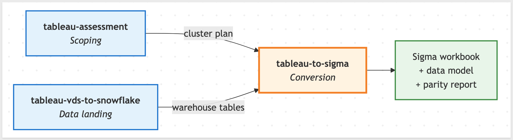

<aside class="positive">
<strong>WHY IT MATTERS:</strong><br> Each skill does one thing well — scoping, landing, conversion. Pick the smallest set that fits your job, and don't run the conversion until you've confirmed the data is somewhere Sigma can actually read.
</aside>

### Which skill for your situation

Not every migration needs all three skills. Use the table below to map your scenario to the smallest set that fits.

In this QuickStart we're in the first row (one workbook, data already in Snowflake), so only `tableau-to-sigma` runs.

| Your situation | Skill(s) to use |
|----------------|-----------------|
| 1 workbook, data already in your warehouse | `tableau-to-sigma` |
| 1 workbook, data only in a Tableau extract | `tableau-vds-to-snowflake` first, then `tableau-to-sigma` |
| 10+ workbooks (any data source) | `tableau-assessment` → `tableau-to-sigma` in batch mode; add `tableau-vds-to-snowflake` per-datasource where needed |
| Auditing BI sprawl without converting yet | `tableau-assessment` only |
| Converting a TDS/TDSX (Tableau data source file) to a Sigma data model, no workbook | `sigma-data-model` converter (separate skill in the `sigma-skills` repo) |

For batch migrations the typical sequence is `tableau-assessment` → `tableau-vds-to-snowflake` (where needed) → `tableau-to-sigma` per workbook. The `Scaling Up` section later walks through that in more detail.

<aside class="negative">
<strong>NOTE:</strong><br> As the skill runs, you'll see filenames and log lines that reference internal phase numbers (e.g., <code>phase6-parity.rb</code>). Those belong to the skill's own internal numbering — don't worry about matching them to this QuickStart's sections (<code>Run the Conversion</code>, <code>Discovering the Source</code>, <code>Building the Data Model</code>, <code>Building the Sigma Workbook</code>, <code>Verifying Data Parity</code>). The full mapping is documented in the skill's <code>SKILL.md</code>.
</aside>


<!-- END OF SECTION-->

## Install and Configure the Skill
Duration: 10

First we need to clone the skill's GitHub repository, then run the setup scripts that capture your Sigma and Tableau credentials.

The three skills live in `sigmacomputing/quickstarts-public` under [tableau-migration-skills/](https://github.com/sigmacomputing/quickstarts-public/tree/main/tableau-migration-skills).

From a terminal, run each command below one at a time so you can confirm each step before moving on.

<aside class="positive">
<strong>NOTE:</strong><br> <code>~</code> in the commands below is shell shorthand for your home folder — <code>/Users/&lt;you&gt;</code> on macOS, <code>/home/&lt;you&gt;</code> on Linux. So <code>~/quickstarts-public</code> resolves to a <code>quickstarts-public/</code> folder directly inside your home directory.
</aside>

**Step 1: Create a local folder for the clone**<br>
We'll clone into this folder in the next step.

```copy-code
mkdir -p ~/quickstarts-public
```

**Step 2: Move into the new folder** so the next command runs in the right working directory.

```copy-code
cd ~/quickstarts-public
```

**Step 3: Clone the repo without pulling any files yet**<br>
The `--sparse` flag tells Git you'll choose which folders to fill in next. The trailing `.` clones into the current folder.

```copy-code
git clone --filter=blob:none --sparse https://github.com/sigmacomputing/quickstarts-public.git .
```

**Step 4: Fill in only the tableau-migration-skills folder**<br>
Every other QuickStart asset in the repo stays empty on disk.

```copy-code
git sparse-checkout set tableau-migration-skills
```

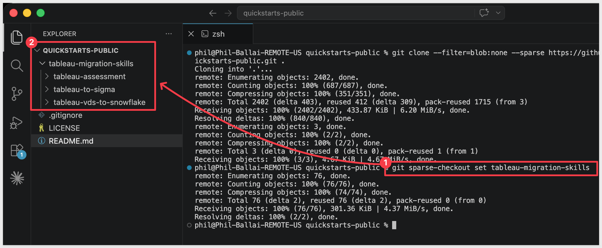

**Step 5: Symlink tableau-to-sigma into the Claude skills folder**<br>
This lets Claude Code invoke `tableau-to-sigma` as a skill.

```copy-code
ln -s ~/quickstarts-public/tableau-migration-skills/tableau-to-sigma ~/.claude/skills/tableau-to-sigma
```

**Step 6: Symlink tableau-assessment**<br>
Used to scope a Tableau site before conversion.

```copy-code
ln -s ~/quickstarts-public/tableau-migration-skills/tableau-assessment ~/.claude/skills/tableau-assessment
```

**Step 7: Symlink tableau-vds-to-snowflake**<br>
Used to land Tableau extracts into Snowflake when the source data isn't already in your warehouse.

```copy-code
ln -s ~/quickstarts-public/tableau-migration-skills/tableau-vds-to-snowflake ~/.claude/skills/tableau-vds-to-snowflake
```

Steps 5-7 should return with no error.


**Step 8: Capture your Sigma API credentials.**<br>
This script prompts for `SIGMA_BASE_URL`, `SIGMA_CLIENT_ID`, and `SIGMA_CLIENT_SECRET` and writes them into Claude's settings.

Run once per machine.

If you don't already have credentials, see [Configure API credentials in Sigma](https://help.sigmacomputing.com/sigma-computing/docs/configure-api-credentials-and-connectors-in-sigma) — the skill needs `API access` credentials, not embed.

```copy-code
ruby ~/.claude/skills/tableau-to-sigma/scripts/setup.rb
```

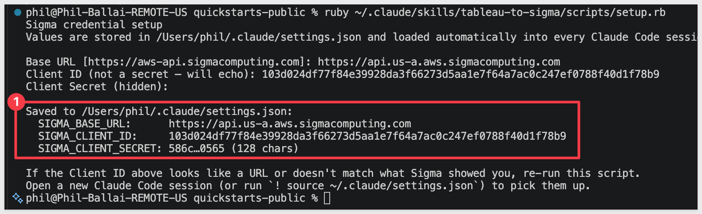

**Step 9: Capture your Tableau credentials.**<br>
The next script prompts for four values, in order:

| Prompt | What to paste | Example |
|---|---|---|
| Server URL | Your Tableau host, base URL only — no `/site/...` path | `https://us-east-1.online.tableau.com` |
| Site contentUrl | The path segment between `/site/` and the next `/` in your Tableau URL | `examplesite-29eb398209` |
| PAT name | The label you typed when you created the Personal Access Token in Tableau | `QuickStarts` |
| PAT secret | The token value Tableau showed once at creation time (input is hidden) | `<your-pat-secret>` |

If your full Tableau URL looks like `https://us-east-1.online.tableau.com/#/site/examplesite-29eb398209`, the server URL is the part before `/#/`, and the site contentUrl is `examplesite-29eb398209`.

Also run once per machine.

```copy-code
ruby ~/.claude/skills/tableau-to-sigma/scripts/setup-tableau.rb
```

The response will be:
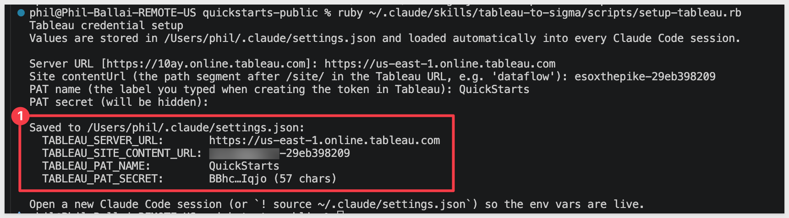

Ignore the `Open a new Claude Code session` note.

<aside class="positive">
<strong>NOTE:</strong><br> If you don't have a Personal Access Token yet, create one in Tableau under your account settings — <a href="https://help.tableau.com/current/online/en-us/security_personal_access_tokens.htm">Personal Access Tokens</a>. Tableau invalidates a PAT after four consecutive failed signins, so double-check the secret on first use.
</aside>

<aside class="negative">
<strong>NOTE:</strong><br> Tokens are 1-hour bearer tokens fetched on demand via <code>scripts/get-token.sh</code>. Never hard-code tokens in scripts — every long-running script in the skill re-fetches on cold start.
</aside>


Verify the install by typing `claude` in your terminal to start Claude Code, then run:

```copy-code
claude
```

```copy-code
/tableau-to-sigma
```
Claude should start reading the reference files and ask what workbook we want to convert:

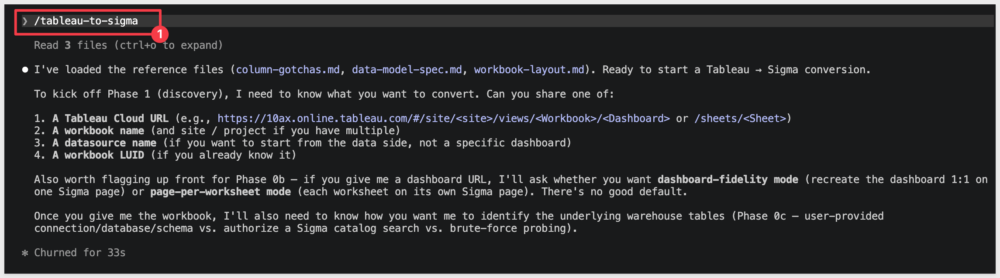

Before going any further, we need to prepare the data the dashboard uses.


<!-- END OF SECTION-->

## Prepare the Demo Data
Duration: 10

For the converter to produce a working Sigma workbook, the data the Tableau dashboard reads needs to be reachable from a warehouse Sigma can also read. Sigma queries the warehouse live — it doesn't read Tableau's internal `.hyper` extracts — so we need to land the same data on the Sigma side before any conversion happens.

In this section we'll load the three Superstore tables (`Orders`, `Returns`, `People`) into a fresh Snowflake schema.

The Tableau dashboard itself stays on Tableau Cloud unchanged — we're only preparing the target-side warehouse so Sigma has tables to model against.

<aside class="positive">
<strong>NOTE:</strong><br> To keep this QuickStart simple, the script below points Snowflake at a public S3 bucket Sigma hosts (<code>s3://sigma-quickstarts-main/sample-superstore/</code>) and loads the three Superstore CSVs straight from there. You don't have to download the CSVs locally or upload them yourself — Snowflake's external stage handles it. In a real Tableau migration the source data may already be in your warehouse; this S3 shortcut is purely to give the QuickStart reader a ready-to-use dataset.
</aside>

**Step 1: Open a Snowsight worksheet and run the load script**<br>
Make sure the active role in the top-right has `CREATE DATABASE` privileges (`ACCOUNTADMIN` works on most demo accounts) and a warehouse is selected (`COMPUTE_WH` is fine). Then paste and run the script below.

```copy-code
USE ROLE ACCOUNTADMIN;
USE WAREHOUSE COMPUTE_WH;

CREATE DATABASE IF NOT EXISTS QUICKSTARTS;
CREATE SCHEMA  IF NOT EXISTS QUICKSTARTS.TABLEAU_SUPERSTORE;
USE SCHEMA QUICKSTARTS.TABLEAU_SUPERSTORE;

-- CSV format and external stage pointing at the public S3 bucket.
CREATE OR REPLACE FILE FORMAT csv_format
  TYPE = CSV
  FIELD_DELIMITER = ','
  SKIP_HEADER = 1
  FIELD_OPTIONALLY_ENCLOSED_BY = '"'
  NULL_IF = ('NULL', 'null', '');

CREATE OR REPLACE STAGE superstore_stage
  URL = 's3://sigma-quickstarts-main/sample-superstore/'
  FILE_FORMAT = csv_format;

-- Tables with explicit, Snowflake-friendly column names (underscores in place of spaces).
CREATE OR REPLACE TABLE ORDERS (
  ROW_ID         INT,
  ORDER_ID       VARCHAR,
  ORDER_DATE     DATE,
  SHIP_DATE      DATE,
  SHIP_MODE      VARCHAR,
  CUSTOMER_ID    VARCHAR,
  CUSTOMER_NAME  VARCHAR,
  SEGMENT        VARCHAR,
  COUNTRY_REGION VARCHAR,
  CITY           VARCHAR,
  STATE_PROVINCE VARCHAR,
  POSTAL_CODE    VARCHAR,
  REGION         VARCHAR,
  PRODUCT_ID     VARCHAR,
  CATEGORY       VARCHAR,
  SUB_CATEGORY   VARCHAR,
  PRODUCT_NAME   VARCHAR,
  SALES          NUMBER(18,4),
  QUANTITY       INT,
  DISCOUNT       NUMBER(5,4),
  PROFIT         NUMBER(18,4)
);

CREATE OR REPLACE TABLE RETURNS (
  RETURNED VARCHAR,
  ORDER_ID VARCHAR
);

CREATE OR REPLACE TABLE PEOPLE (
  REGIONAL_MANAGER VARCHAR,
  REGION           VARCHAR
);

-- Load each CSV from S3.
COPY INTO ORDERS  FROM @superstore_stage/Sample-Superstore-Orders.csv.csv;
COPY INTO RETURNS FROM @superstore_stage/Sample-Superstore-Returns.csv.csv;
COPY INTO PEOPLE  FROM @superstore_stage/Sample-Superstore-People.csv.csv;

-- Sanity-check the row counts.
SELECT 'ORDERS'  AS table_name, COUNT(*) AS row_count FROM ORDERS
UNION ALL SELECT 'RETURNS', COUNT(*) FROM RETURNS
UNION ALL SELECT 'PEOPLE',  COUNT(*) FROM PEOPLE;
```

The script is safe to re-run if anything goes sideways — it drops and re-creates the three tables each time, so you won't end up with stale rows or half-loaded data.

**Step 2: Confirm the row counts**<br>
The final `SELECT` returns three rows. The expected counts for the standard Sample-Superstore dataset are:

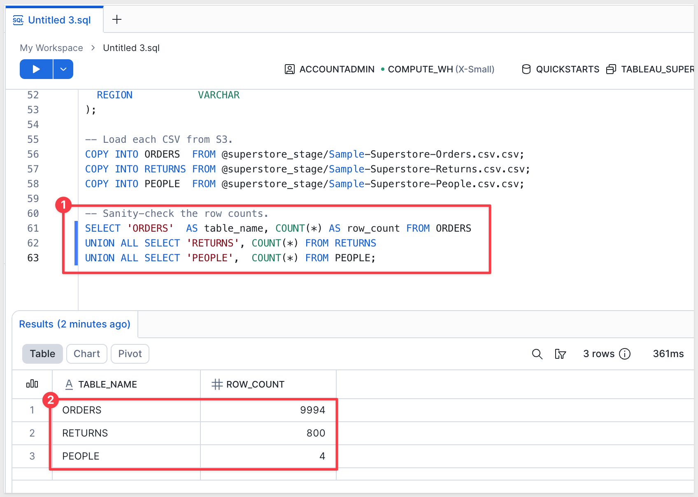

<aside class="negative">
<strong>NOTE:</strong><br> The next step grants read access to an existing Sigma → Snowflake connection. If you haven't created one yet, do that first under <code>Administration</code> &gt; <code>Connections</code> — see <a href="https://help.sigmacomputing.com/sigma-computing/docs/connect-to-snowflake">Connect to Snowflake</a> for setup steps.
</aside>

**Step 3: Grant the Sigma connection role read access to the new database and schema**<br>
Sigma queries Snowflake under the role you selected when you created the connection. That role needs `USAGE` on the database and schema and `SELECT` on the tables — otherwise Sigma will see the account but not the data we just loaded.

The example below uses `SIGMA_SERVICE_ROLE`. If your connection uses a different role, swap the role name. You can confirm the role under `Administration` > `Connections` > [your connection] > `Connection credentials`.

```copy-code
USE ROLE ACCOUNTADMIN;
GRANT USAGE  ON DATABASE QUICKSTARTS                                   TO ROLE SIGMA_SERVICE_ROLE;
GRANT USAGE  ON SCHEMA   QUICKSTARTS.TABLEAU_SUPERSTORE                TO ROLE SIGMA_SERVICE_ROLE;
GRANT SELECT ON ALL TABLES    IN SCHEMA QUICKSTARTS.TABLEAU_SUPERSTORE TO ROLE SIGMA_SERVICE_ROLE;
GRANT SELECT ON FUTURE TABLES IN SCHEMA QUICKSTARTS.TABLEAU_SUPERSTORE TO ROLE SIGMA_SERVICE_ROLE;
```

The two `GRANT USAGE` statements give the role visibility into the database and schema. The two `GRANT SELECT` statements cover the three tables we just loaded plus any tables you add to the schema later.

<aside class="positive">
<strong>WHY IT MATTERS:</strong><br> Sigma reads live from Snowflake, so these warehouse tables are the source of truth for every chart in the migrated workbook. The parity check (covered in <code>Verifying Data Parity</code>) compares Sigma's query results against the Tableau view CSVs the skill fetches during the conversion — mismatched row counts here would cascade into parity failures.
</aside>


<!-- END OF SECTION-->

## Run the Conversion
Duration: 10

With the install, demo data, and Sigma's connection access all in place, we're ready to run the conversion against the Tableau dashboard.

The skill runs the whole conversion in a single command — you only invoke `/tableau-to-sigma` once and answer a few prompts. From there it works autonomously through these stages:

1. **Fetch source artifacts from Tableau** — workbook metadata, `.twb` XML, view CSVs, calc-field definitions, dashboard PNG
2. **Drop artifacts into `/tmp/<workbook-slug>/`** — the local working folder every later stage reads from
3. **Build (or reuse) the Sigma data model** — sourced from the warehouse tables behind the dashboard
4. **Build the Sigma workbook** — every chart and control positioned to mirror the Tableau dashboard
5. **Verify chart-level data parity** — Sigma's query results compared row-for-row against the Tableau view CSVs
6. **Surface the gap report + final summary in Claude Code** — what was auto-translated, what needs review

For this demo we'll run the conversion against the `Superstore` dashboard on your Tableau Cloud dev site.

<aside class="positive">
<strong>NOTE:</strong><br> If you still have Claude Code open from the install verify step, the skill's preamble is already waiting for your dashboard URL — paste it at that prompt.

If you closed the session, type <code>claude</code> in your <code>~/quickstarts-public</code> folder to start a new one. Either way, the skill writes output to <code>/tmp/&lt;workbook-slug&gt;/</code> regardless of where you started.

The order of prompts from Claude will be a little different, but either way works.
</aside>

Since we left off at Claude's prompt, we can just select the `1. A Tableau Cloud URL` option:

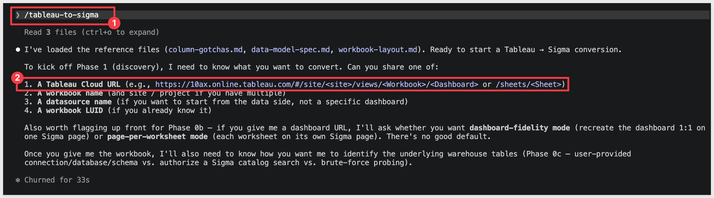

The URL looks similar to this:

```code
https://us-east-1.online.tableau.com/#/site/testsite-29eb398209/views/Superstore/Overview
```

Select `Type something` and paste your URL:

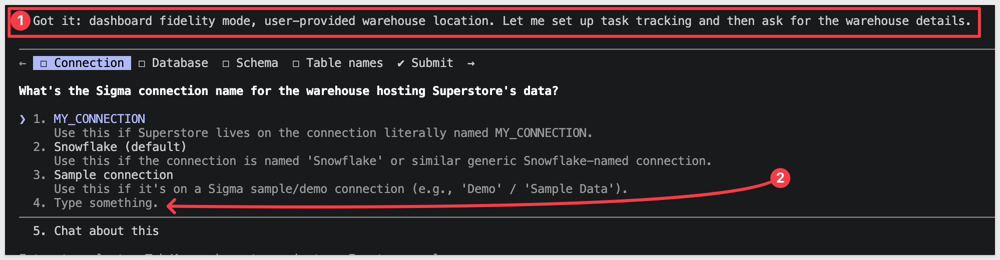

Claude will then ask what `Conversion mode` we want to use — select `Dashboard fidelity (1:1)`:

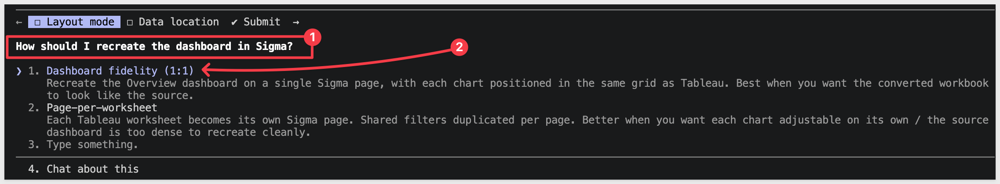

Claude also needs to know where our dashboard data lives. Choose option 1:

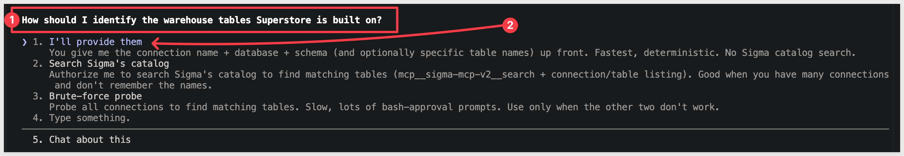

Claude prompts for the connection, database, and schema. In our case, we need to select `4. Type something` because we don't want Claude to waste time scanning several connections:


Use the values from the `Prepare the Demo Data` section:
```copy-code
Connection Name: {your Snowflake connection name in Sigma}
Database: QUICKSTARTS
Schema: TABLEAU_SUPERSTORE
```

The prompt is driven by [prompt-data-location.rb](https://github.com/sigmacomputing/quickstarts-public/blob/main/tableau-migration-skills/tableau-to-sigma/scripts/prompt-data-location.rb) in the skill repo — answering this once up front saves the skill from brute-force probing every Sigma connection looking for the source tables later (which gets slow on orgs with many connections).

We are asked to approve our choices:

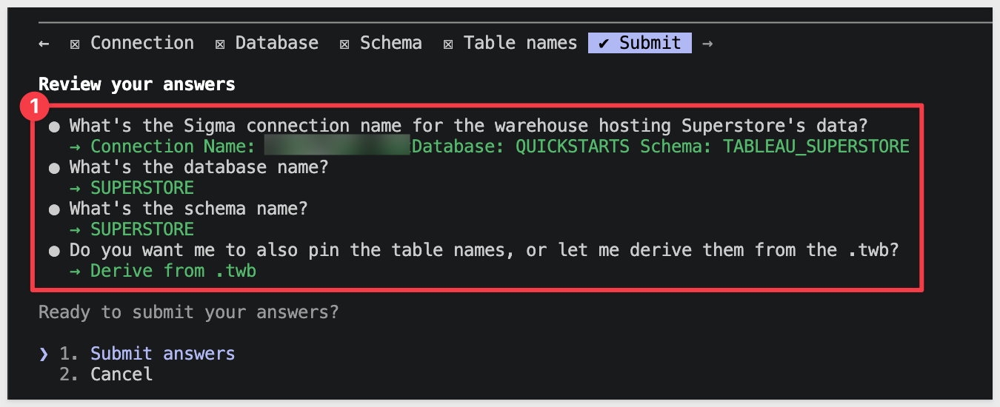

Claude will start going through its task list and may prompt for approvals along the way:

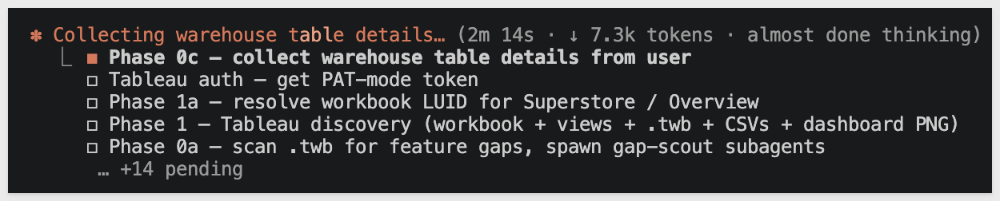

<aside class="negative">
<strong>NOTE:</strong><br> From here on, Claude Code asks for approval on every bash command the skill runs — and a full conversion fires dozens of them. For each prompt, pick option <code>2. Yes, and don't ask again</code> so Claude Code remembers that command pattern. After the first handful of approvals the prompts stop coming.

Alternatively, press <code>Shift+Tab</code> once to switch to accept-edits mode for the rest of the session — fine for a trusted skill like this one, just don't use it for unknown code.
</aside>

Claude will ask where to save the new data model and workbook in Sigma. Select a choice that makes sense in your Sigma instance:

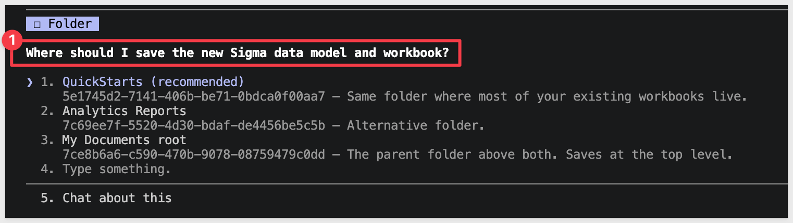


Once fully complete, Claude lets us know:

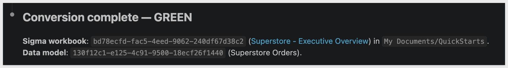

It also tells us if there are any gaps:

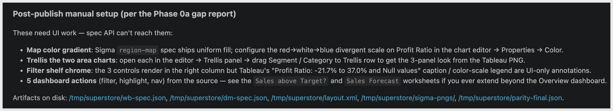


You'll have a Sigma data model and workbook in your org:

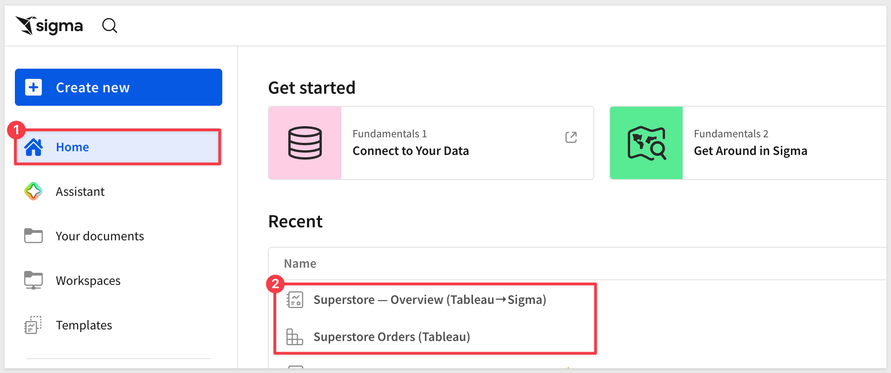


A gap report is created in `/tmp/<workbook-slug>/`, along with a parity check confirming the numbers match the Tableau source.

From here the work is review — open the Sigma workbook, scan the gap report for any items flagged for follow-up, and tweak the look-and-feel to taste. Enrich and extend the new workbook using Sigma's [AI Assistant](https://help.sigmacomputing.com/docs/ask-natural-language-queries-with-assistant) and [Actions](https://help.sigmacomputing.com/docs/intro-to-actions)

**Workbook landed in Sigma:**
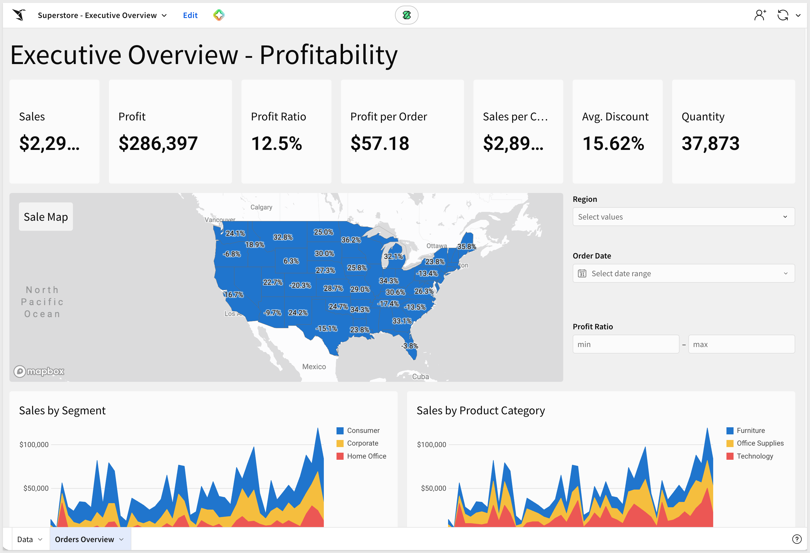

**Data Model:**
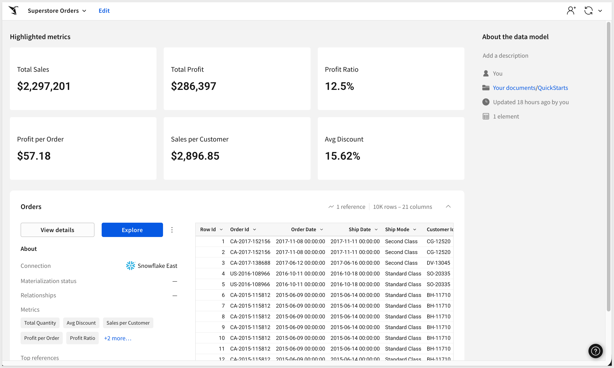

The sections that follow are reference material covering the workbook spec, what the skill does under the hood at each stage, scaling up for larger conversions, and common issues.

Skim if you're curious about a specific stage; skip if the working result is enough.


<!-- END OF SECTION-->

## Inspecting the Generated Spec
Duration: 5

The conversion leans on two Sigma APIs — `Workbook as Code` and `Data Models as Code` — to build the data model and workbook from JSON specs. The same endpoints are available to you for inspecting what the skill produced, or for round-tripping a spec through your own tooling.

| Endpoint | What it does |
|---|---|
| `POST /v2/workbooks/spec` | Create a workbook from a JSON spec (what the skill calls during `Building the Sigma Workbook`) |
| `GET /v2/workbooks/<workbookId>/spec` | Fetch the spec of an existing workbook |
| `PUT /v2/workbooks/<workbookId>/spec` | Update a workbook in-place from a modified spec |
| `POST /v2/datamodels/spec` | Create a data model from a JSON spec (what the skill calls during `Building the Data Model`) |
| `GET /v2/datamodels/<dmId>/spec` | Fetch the spec of an existing data model |
| `PUT /v2/datamodels/<dmId>/spec` | Update a data model in-place |

<aside class="negative">
<strong>NOTE:</strong><br> These endpoints are feature-flagged at the org level. If a request returns <code>404</code> with <code>errorcause: UnmatchedHandler</code>, your org doesn't have <code>Workbook as Code</code> enabled — see the matching entry in <code>Common Issues and Fixes</code>.
</aside>

**Try it in Postman:**<br>
Grab the workbook ID Sigma assigned during the conversion (visible in the Sigma UI URL after `/workbook/`, or in `/tmp/<workbook-slug>/wb-ids.json`), then:

```code
GET https://api.<region>.aws.sigmacomputing.com/v2/workbooks/<workbookId>/spec
Authorization: Bearer <access_token>
```

The response is a single JSON document describing every page, element, control, and layout block in the workbook.

For example, the spec for the Superstore workbook we just migrated looks like this:

```code
{
    "workbookId": "68abe7c1-3ae2-4437-b9a8-d78a8f095c6d",
    "name": "Superstore — Overview (Tableau→Sigma)",
    "url": "https://app.sigmacomputing.com/quick-start-fundamentals-2026/workbook/Superstore-Overview-Tableau-Sigma-3bvLiL5BDx9MNn5z3v9vuB",
    "documentVersion": 2,
    "latestDocumentVersion": 2,
    "ownerId": "zEoTFxOxZNR5mYKufCXN8yPtDaPDJ",
    "folderId": "5e1745d2-7141-406b-be71-0bdca0f00aa7",
    "createdBy": "zEoTFxOxZNR5mYKufCXN8yPtDaPDJ",
    "updatedBy": "zEoTFxOxZNR5mYKufCXN8yPtDaPDJ",
    "createdAt": "2026-06-03T15:14:15.470Z",
    "updatedAt": "2026-06-03T15:15:07.658Z",
    "schemaVersion": 1,
    "pages": [
        {
            "id": "page-data",
            "name": "Data",
            "elements": [
                {
                    "id": "master",
                    "kind": "table",
                    "source": {
                        "dataModelId": "fd8ab351-4f31-4f60-9801-937bd9d42884",
                        "elementId": "by8CF63nB0",
                        "kind": "data-model"
                    },
                    "columns": [
                        {
                            "id": "m-row-id",
                            "formula": "[Orders/Row Id]",
                            "name": "Row Id"
                        },
                        {
                            "id": "m-order-id",
                            "formula": "[Orders/Order Id]",
                            "name": "Order Id"
                        },
                        {
                            "id": "m-order-date",
                            "formula": "[Orders/Order Date]",
                            "name": "Order Date"
                        },
                        {
                            "id": "m-ship-date",
                            "formula": "[Orders/Ship Date]",
                            "name": "Ship Date"
                        },
                        {
                            "id": "m-ship-mode",
                            "formula": "[Orders/Ship Mode]",
                            "name": "Ship Mode"
                        },
                        {
                            "id": "m-customer-id",
                            "formula": "[Orders/Customer Id]",
                            "name": "Customer Id"
                        },
                        {
                            "id": "m-customer-name",
                            "formula": "[Orders/Customer Name]",
                            "name": "Customer Name"
                        },
                        {
                            "id": "m-segment",
                            "formula": "[Orders/Segment]",
                            "name": "Segment"
                        },
                        {
                            "id": "m-country",
                            "formula": "[Orders/Country]",
                            "name": "Country"
                        },
                        {
                            "id": "m-city",
                            "formula": "[Orders/City]",
                            "name": "City"
                        },
                        {
                            "id": "m-state",
                            "formula": "[Orders/State]",
                            "name": "State"
                        },
                        {
                            "id": "m-postal-code",
                            "formula": "[Orders/Postal Code]",
                            "name": "Postal Code"
                        },
                        {
                            "id": "m-region",
                            "formula": "[Orders/Region]",
                            "name": "Region"
                        },
                        {
                            "id": "m-product-id",
                            "formula": "[Orders/Product Id]",
                            "name": "Product Id"
                        },
                        {
                            "id": "m-category",
                            "formula": "[Orders/Category]",
                            "name": "Category"
                        },
                        {
                            "id": "m-sub-category",
                            "formula": "[Orders/Sub-Category]",
                            "name": "Sub-Category"
                        },
                        {
                            "id": "m-product-name",
                            "formula": "[Orders/Product Name]",
                            "name": "Product Name"
                        },
                        {
                            "id": "m-sales",
                            "formula": "[Orders/Sales]",
                            "name": "Sales"
                        },
                        {
                            "id": "m-quantity",
                            "formula": "[Orders/Quantity]",
                            "name": "Quantity"
                        },
                        {
                            "id": "m-discount",
                            "formula": "[Orders/Discount]",
                            "name": "Discount"
                        },
                        {
                            "id": "m-profit",
                            "formula": "[Orders/Profit]",
                            "name": "Profit"
                        }
                    ],
                    "name": "Master",
                    "order": [
                        "m-row-id",
                        "m-order-id",
                        "m-order-date",
                        "m-ship-date",
                        "m-ship-mode",
                        "m-customer-id",
                        "m-customer-name",
                        "m-segment",
                        "m-country",
                        "m-city",
                        "m-state",
                        "m-postal-code",
                        "m-region",
                        "m-product-id",
                        "m-category",
                        "m-sub-category",
                        "m-product-name",
                        "m-sales",
                        "m-quantity",
                        "m-discount",
                        "m-profit"
                    ],
                    "visibleAsSource": false
                }
            ]
        },
        {
            "id": "page-overview",
            "name": "Overview",
            "elements": [
                {
                    "id": "txt-title",
                    "kind": "text",
                    "body": "# Executive Overview — Profitability"
                },
                {
                    "id": "kpi-row",
                    "kind": "container"
                },
                {
                    "id": "kpi-sales",
                    "kind": "kpi-chart",
                    "source": {
                        "elementId": "master",
                        "kind": "table"
                    },
                    "columns": [
                        {
                            "id": "k-sales-v",
                            "formula": "Sum([Master/Sales])",
                            "name": "Sales",
                            "format": {
                                "kind": "number",
                                "formatString": "$,.0f",
                                "currencySymbol": "$"
                            }
                        }
                    ],
                    "value": {
                        "id": "k-sales-v"
                    },
                    "name": "Sales"
                },
                {
                    "id": "kpi-profit",
                    "kind": "kpi-chart",
                    "source": {
                        "elementId": "master",
                        "kind": "table"
                    },
                    "columns": [
                        {
                            "id": "k-profit-v",
                            "formula": "Sum([Master/Profit])",
                            "name": "Profit",
                            "format": {
                                "kind": "number",
                                "formatString": "$,.0f",
                                "currencySymbol": "$"
                            }
                        }
                    ],
                    "value": {
                        "id": "k-profit-v"
                    },
                    "name": "Profit"
                },
                {
                    "id": "kpi-profit-ratio",
                    "kind": "kpi-chart",
                    "source": {
                        "elementId": "master",
                        "kind": "table"
                    },
                    "columns": [
                        {
                            "id": "k-pr-v",
                            "formula": "Sum([Master/Profit]) / NullIf(Sum([Master/Sales]), 0)",
                            "name": "Profit Ratio",
                            "format": {
                                "kind": "number",
                                "formatString": ",.1%"
                            }
                        }
                    ],
                    "value": {
                        "id": "k-pr-v"
                    },
                    "name": "Profit Ratio"
                },
                {
                    "id": "kpi-profit-per-order",
                    "kind": "kpi-chart",
                    "source": {
                        "elementId": "master",
                        "kind": "table"
                    },
                    "columns": [
                        {
                            "id": "k-ppo-v",
                            "formula": "Sum([Master/Profit]) / NullIf(CountDistinct([Master/Order Id]), 0)",
                            "name": "Profit per Order",
                            "format": {
                                "kind": "number",
                                "formatString": "$,.2f",
                                "currencySymbol": "$"
                            }
                        }
                    ],
                    "value": {
                        "id": "k-ppo-v"
                    },
                    "name": "Profit per Order"
                },
                {
                    "id": "kpi-sales-per-customer",
                    "kind": "kpi-chart",
                    "source": {
                        "elementId": "master",
                        "kind": "table"
                    },
                    "columns": [
                        {
                            "id": "k-spc-v",
                            "formula": "Sum([Master/Sales]) / NullIf(CountDistinct([Master/Customer Name]), 0)",
                            "name": "Sales per Customer",
                            "format": {
                                "kind": "number",
                                "formatString": "$,.2f",
                                "currencySymbol": "$"
                            }
                        }
                    ],
                    "value": {
                        "id": "k-spc-v"
                    },
                    "name": "Sales per Customer"
                },
                {
                    "id": "kpi-avg-discount",
                    "kind": "kpi-chart",
                    "source": {
                        "elementId": "master",
                        "kind": "table"
                    },
                    "columns": [
                        {
                            "id": "k-ad-v",
                            "formula": "Avg([Master/Discount])",
                            "name": "Avg. Discount",
                            "format": {
                                "kind": "number",
                                "formatString": ",.2%"
                            }
                        }
                    ],
                    "value": {
                        "id": "k-ad-v"
                    },
                    "name": "Avg. Discount"
                },
                {
                    "id": "kpi-quantity",
                    "kind": "kpi-chart",
                    "source": {
                        "elementId": "master",
                        "kind": "table"
                    },
                    "columns": [
                        {
                            "id": "k-qty-v",
                            "formula": "Sum([Master/Quantity])",
                            "name": "Quantity",
                            "format": {
                                "kind": "number",
                                "formatString": ",.0f"
                            }
                        }
                    ],
                    "value": {
                        "id": "k-qty-v"
                    },
                    "name": "Quantity"
                },
                {
                    "id": "el-map",
                    "kind": "region-map",
                    "source": {
                        "elementId": "master",
                        "kind": "table"
                    },
                    "columns": [
                        {
                            "id": "rm-state",
                            "formula": "[Master/State]",
                            "name": "State"
                        },
                        {
                            "id": "rm-pr",
                            "formula": "Sum([Master/Profit]) / NullIf(Sum([Master/Sales]), 0)",
                            "name": "Profit Ratio",
                            "format": {
                                "kind": "number",
                                "formatString": ",.1%"
                            }
                        }
                    ],
                    "region": {
                        "id": "rm-state",
                        "regionType": "us-state"
                    },
                    "label": [
                        {
                            "id": "rm-pr"
                        }
                    ],
                    "name": "Sale Map"
                },
                {
                    "kind": "control",
                    "controlId": "ctl-region",
                    "id": "el-ctl-region",
                    "name": "Region",
                    "filters": [
                        {
                            "source": {
                                "kind": "table",
                                "elementId": "master"
                            },
                            "columnId": "m-region"
                        }
                    ],
                    "controlType": "list",
                    "mode": "include",
                    "selectionMode": "multiple",
                    "values": [],
                    "source": {
                        "kind": "source",
                        "source": {
                            "kind": "table",
                            "elementId": "master"
                        },
                        "columnId": "m-region"
                    }
                },
                {
                    "kind": "control",
                    "controlId": "ctl-date",
                    "id": "el-ctl-date",
                    "name": "Order Date",
                    "filters": [
                        {
                            "source": {
                                "kind": "table",
                                "elementId": "master"
                            },
                            "columnId": "m-order-date"
                        }
                    ],
                    "controlType": "date-range",
                    "mode": "between",
                    "includeNulls": "when-no-value-is-selected"
                },
                {
                    "kind": "control",
                    "controlId": "ctl-profit-ratio",
                    "id": "el-ctl-profit-ratio",
                    "name": "Profit Ratio",
                    "controlType": "number-range",
                    "includeNulls": "when-no-value-is-selected"
                },
                {
                    "id": "el-seg",
                    "kind": "area-chart",
                    "source": {
                        "elementId": "master",
                        "kind": "table"
                    },
                    "columns": [
                        {
                            "id": "seg-segment",
                            "formula": "[Master/Segment]",
                            "name": "Segment"
                        },
                        {
                            "id": "seg-month",
                            "formula": "DateTrunc(\"month\", [Master/Order Date])",
                            "name": "Month",
                            "format": {
                                "kind": "datetime",
                                "formatString": "%Y"
                            }
                        },
                        {
                            "id": "seg-sales",
                            "formula": "Sum([Master/Sales])",
                            "name": "Sales",
                            "format": {
                                "kind": "number",
                                "formatString": "$,.0f",
                                "currencySymbol": "$"
                            }
                        }
                    ],
                    "yAxis": {
                        "columnIds": [
                            "seg-sales"
                        ]
                    },
                    "xAxis": {
                        "columnId": "seg-month"
                    },
                    "color": {
                        "by": "category",
                        "column": "seg-segment"
                    },
                    "name": "Monthly Sales by Segment"
                },
                {
                    "id": "el-cat",
                    "kind": "area-chart",
                    "source": {
                        "elementId": "master",
                        "kind": "table"
                    },
                    "columns": [
                        {
                            "id": "cat-category",
                            "formula": "[Master/Category]",
                            "name": "Category"
                        },
                        {
                            "id": "cat-month",
                            "formula": "DateTrunc(\"month\", [Master/Order Date])",
                            "name": "Month",
                            "format": {
                                "kind": "datetime",
                                "formatString": "%Y"
                            }
                        },
                        {
                            "id": "cat-sales",
                            "formula": "Sum([Master/Sales])",
                            "name": "Sales",
                            "format": {
                                "kind": "number",
                                "formatString": "$,.0f",
                                "currencySymbol": "$"
                            }
                        }
                    ],
                    "yAxis": {
                        "columnIds": [
                            "cat-sales"
                        ]
                    },
                    "xAxis": {
                        "columnId": "cat-month"
                    },
                    "color": {
                        "by": "category",
                        "column": "cat-category"
                    },
                    "name": "Monthly Sales by Product Category"
                }
            ]
        }
    ],
    "layout": "<?xml version=\"1.0\" encoding=\"utf-8\"?>\n<Page type=\"grid\" gridTemplateColumns=\"repeat(24, 1fr)\" gridTemplateRows=\"auto\" id=\"page-data\">\n  <LayoutElement elementId=\"master\" gridColumn=\"1 / 25\" gridRow=\"1 / 21\"/>\n</Page>\n<Page type=\"grid\" gridTemplateColumns=\"repeat(24, 1fr)\" gridTemplateRows=\"auto\" id=\"page-overview\">\n  <LayoutElement elementId=\"txt-title\" gridColumn=\"1 / 25\" gridRow=\"1 / 3\"/>\n  <GridContainer elementId=\"kpi-row\" type=\"grid\" gridColumn=\"1 / 25\" gridRow=\"3 / 11\" gridTemplateColumns=\"repeat(24, 1fr)\" gridTemplateRows=\"auto\">\n    <LayoutElement elementId=\"kpi-sales\" gridColumn=\"1 / 5\" gridRow=\"1 / 9\"/>\n    <LayoutElement elementId=\"kpi-profit\" gridColumn=\"5 / 8\" gridRow=\"1 / 9\"/>\n    <LayoutElement elementId=\"kpi-profit-ratio\" gridColumn=\"8 / 11\" gridRow=\"1 / 9\"/>\n    <LayoutElement elementId=\"kpi-profit-per-order\" gridColumn=\"11 / 15\" gridRow=\"1 / 9\"/>\n    <LayoutElement elementId=\"kpi-sales-per-customer\" gridColumn=\"15 / 19\" gridRow=\"1 / 9\"/>\n    <LayoutElement elementId=\"kpi-avg-discount\" gridColumn=\"19 / 22\" gridRow=\"1 / 9\"/>\n    <LayoutElement elementId=\"kpi-quantity\" gridColumn=\"22 / 25\" gridRow=\"1 / 9\"/>\n  </GridContainer>\n  <LayoutElement elementId=\"el-map\" gridColumn=\"1 / 21\" gridRow=\"11 / 30\"/>\n  <LayoutElement elementId=\"el-ctl-region\" gridColumn=\"21 / 25\" gridRow=\"11 / 16\"/>\n  <LayoutElement elementId=\"el-ctl-date\" gridColumn=\"21 / 25\" gridRow=\"16 / 21\"/>\n  <LayoutElement elementId=\"el-ctl-profit-ratio\" gridColumn=\"21 / 25\" gridRow=\"21 / 26\"/>\n  <LayoutElement elementId=\"el-seg\" gridColumn=\"1 / 13\" gridRow=\"30 / 45\"/>\n  <LayoutElement elementId=\"el-cat\" gridColumn=\"13 / 25\" gridRow=\"30 / 45\"/>\n</Page>\n"
}
```

Every chart element references the master table on the `Data` page — that's the "two pages, master is the single source" rule from `Building the Sigma Workbook` showing up in practice.

Once you've got the spec, you can hand-edit and `PUT` it back to update the workbook, version-control it in Git alongside other infrastructure-as-code, or use it as a template to script bulk workbook creation.

<aside class="positive">
<strong>WHY IT MATTERS:</strong><br> Treating workbooks as code is what makes the conversion repeatable. Once you can fetch the spec, you can diff two conversions of the same dashboard, ship a hand-tuned version through CI, or template common patterns across a portfolio — none of which is possible when the workbook only lives as clicks in the Sigma UI.
</aside>


<!-- END OF SECTION-->

## Discovering the Source
Duration: 10

After you answer the interactive prompts, the skill kicks off discovery — the first autonomous phase. It pulls everything it needs from Tableau into a structured local snapshot in `/tmp/<workbook-slug>/` before any conversion logic runs. Every later phase reads from these artifacts, so the quality of the discovery output sets the ceiling for the whole conversion.

This phase also produces the first thing worth reviewing: a `gap report` that classifies every Tableau feature in the workbook as auto-convertible, needs-a-hint, manual-fix, or unhandled. Reading it before authoring a Sigma spec avoids the time you'd otherwise burn discovering mid-build that a calc field uses a function Sigma doesn't have.

Claude resolves the dashboard URL to a workbook ID and starts pulling every artifact it needs into `/tmp/<workbook-slug>/` — workbook metadata, the `.twb` XML, every dashboard view as a CSV, the datasource's calculated-field definitions, and a rendered PNG of the dashboard. The fetches run in parallel against Tableau's REST and VDS APIs.

In parallel with the artifact fetches, Claude runs `scripts/scan-workbook-gaps.rb` against the `.twb` to inventory every Tableau feature the workbook uses and classify each as:

- **Auto:** the skill translates end-to-end with no intervention
- **Hint:** the skill emits a `WARN` with a copy-paste Sigma formula; agent reviews
- **Manual:** post-publish setup required (typically cross-chart action filters)
- **Unhandled:** feature not yet covered — the gap-scout subagent attempts an autonomous translation against the Sigma org, persists the rule on success, escalates on failure

Claude then **reads the dashboard PNG via the multimodal tool** before writing any spec — this is mandatory per the skill's Phase 1d checklist. CSV headers don't tell you bar-vs-pie, dual-axis-vs-single, or what controls live on the dashboard's filter shelf.

The gap report lands at `/tmp/<workbook-slug>/workbook-content-gaps-report.md` alongside a `workbook-content-gaps-report.json` companion (machine-readable, useful when batch-orchestrating multiple conversions). Reviewing the markdown report sets honest expectations on what the conversion will and won't handle cleanly.

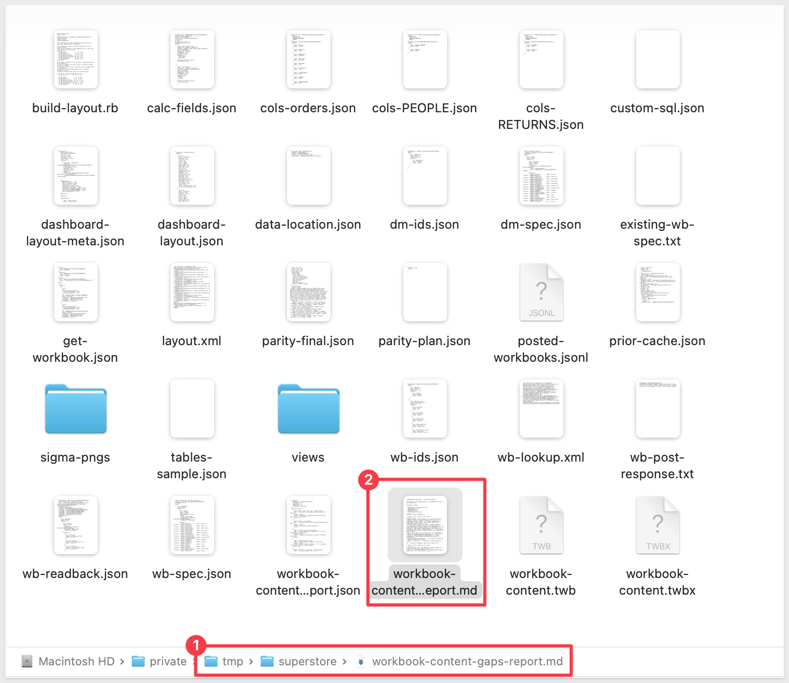

For example, this gap report tells us what was fully translated and suggestions for a few items that remain:
```code
# Tableau→Sigma gap report — `workbook-content.twb`

Generated by `scan-workbook-gaps.rb`. Run BEFORE conversion to set expectations.

## Workbook summary

- **Workbook:** workbook-content.twb
- **Worksheets:** 21
- **Dashboards:** 6
- **Datasources:** 3
- **.twb size:** 1175.8 KB

## ✅ Fully auto-translated (9)

| Feature | Count | What the skill does |
|---|---|---|
| Negative number format (parens) | 53 | Parens-on-negative segment translates to Sigma d3-format with ( prefix. |
| Parameter (numeric range) | 27 | Numeric range parameters become number-range controls. Skips orphan params not referenced by any worksheet calc. |
| Tableau format strings | 18 | p0.0% / C1033% / $#,##0;(...) etc. translated to Sigma d3-format with paren-negative. |
| Show Mark Labels worksheet toggle | 11 | Worksheet-level Show Mark Labels toggle emits Sigma dataLabel:{labels:shown}. |
| Parameter (list domain) + CASE-on-param | 5 | List parameters become segmented controls; CASE/IF-on-param calcs translate to Sigma Switch(). |
| Bar / line / area / pie / scatter chart | 5 | Translated to Sigma bar/line/area/pie/scatter chart with the right marker. |
| Table-calc INDEX/LOOKUP/TOTAL/RANK/ZN/IIF | 4 | Auto-translated to Sigma RowNumber/Lag/Lead/Rank/Coalesce/If/CountDistinct. |
| Column aliases (value→display) | 1 | Aliased dim columns get a Switch() formula on the chart. |
| Region / filled map | 1 | Translated to Sigma region-map. |

## ⚠️ Translation suggested, agent action required (4)

| Feature | Count | What the skill does |
|---|---|---|
| IF/ELSEIF chain calc | 10 | WARN with suggested Sigma If(...) chain or Switch(). Agent adds to master. |
| Ratio calc (SUM/SUM, SUM/COUNT) | 10 | WARN suggests Sum(x) / NullIf(Sum(y), 0) — agent wires on master. |
| Reference lines / bands / trendlines | 10 | WARN per chart; agent adds Sigma referenceMarks manually post-publish (see beads-sigma-7ak). |
| FIXED LOD calc | 6 | WARN with suggested Sigma window aggregate or Custom SQL element. |

## 🛠 Post-publish manual setup required (3)

| Feature | Count | What the skill does |
|---|---|---|
| Dashboard filter / highlight / nav actions | 5 | Skill writes actions.md listing each action; customer wires Sigma cross-element filtering after publish. |
| Drill hierarchies | 3 | Hierarchies map to pivot rowsBy OR a segmented drill-level control (beads-sigma-jbw). |
| Forecast / trendline model | 1 | No Sigma forecast primitive; agent emits a note + Custom SQL option (beads-sigma-yi0). |

## ❌ Not yet handled — escalation path (0)

_None detected._

## Suggested next steps

2. The **Manual** features need post-publish work. See `<workbook>-actions.md` after conversion for action-filter mappings.
3. The **Hint** features will show as `WARN` lines during conversion with copy-paste-ready Sigma formulas — review each before publishing.

_Generated by tableau-to-sigma skill. Issues: https://github.com/sigmacomputing/quickstarts-public/issues_
```


<!-- END OF SECTION-->

## Building the Data Model
Duration: 5

Before building a new data model, the skill scans your Sigma org for an existing DM that already covers the workbook's columns. `scripts/find-or-pick-dm.rb` parallel-fetches up to 25 DM specs and scores each against the workbook's signature:

- **Column overlap** (0.7 weight) — how many of the workbook's referenced columns exist on the candidate DM
- **Source-table FQN overlap** (0.2 weight) — does the DM source from the same warehouse tables
- **Metric overlap** (0.1 weight)

A score ≥ 0.85 auto-reuses the DM (skips the DM-build work — typically the heaviest 2-3 minutes of the conversion). A score between 0.6 and 0.85 prompts the operator. Below 0.6, the skill builds new.

<!-- tts_dm_picker.png -->

When reusing a DM, the mandatory next step is `scripts/inspect-dm-shape.rb`. This inspects the DM's element graph and emits a per-column resolution plan classifying each workbook-referenced column as either:

- `location: "fact"` — direct reference, formula `[Master/Column Name]`
- `location: "dim"` — Lookup required, with the exact formula shown verbatim

This eliminates the 2-3 minute spec-rework loop that previously hit when a reused DM had separate dim elements and the agent assumed a flat fact.


<!-- END OF SECTION-->

## Building the Sigma Workbook
Duration: 15

With the DM resolved (reused or freshly built), Claude composes the workbook spec. For a single-dashboard URL the default is **dashboard-fidelity mode** — every Tableau tile maps to a Sigma element, positioned in the same grid.

The spec follows three mandatory rules — surfaced loudly in the skill's `SKILL.md` and the spec validator:

- **Two pages, always.** A `Data` page holds the master table (sourced from the DM); a content page holds the charts, controls, and text. Co-locating master + charts puts a giant table on the dashboard the user has to delete.
- **Master is the single source.** Every chart element sets `source: {kind: "table", elementId: "master"}`, regardless of which page it lives on. Cross-page references are fully supported.
- **POST once, PUT for every update.** `POST /v2/workbooks/spec` is create-only. Re-POSTing during error recovery creates a duplicate workbook in `My Documents` — exactly the regression that motivated the orphan-cleanup tooling.

<aside class="positive">
<strong>IMPORTANT:</strong><br> The skill auto-emits <code>chart_kind</code> for every Tableau worksheet from its <code>&lt;mark&gt;</code> class + Rows/Cols shelves. Coverage:
<ul>
  <li><code>bar</code> / <code>line</code> / <code>area</code> / <code>pie</code> / <code>scatter</code> — straightforward 1:1</li>
  <li><code>pivot-table</code> — Text/Square mark with dims on BOTH shelves, or the Measure-Names crosstab pattern. Emits Sigma <code>pivot-table</code> with <code>rowsBy</code> / <code>columnsBy</code> / <code>values</code>.</li>
  <li><code>kpi</code> — Text/Square mark with zero dims and a single measure (Tableau "scorecard"). Emits Sigma <code>kpi-chart</code> with <code>value</code>.</li>
  <li><code>table</code> — Text mark with dims on one shelf only (flat detail list).</li>
  <li><code>map-region</code> / <code>map-point</code> — choropleth and lat/long maps.</li>
</ul>
</aside>

After the workbook POST + readback, Claude builds and applies the layout. The skill runs these two scripts under the hood (shown for reference — you don't run them yourself):

```code
ruby scripts/build-dashboard-layout.rb \
  --layout /tmp/<name>/dashboard-layout.json \
  --wb-ids /tmp/<name>/wb-ids.json \
  --out /tmp/<name>/layout.xml

ruby scripts/put-layout.rb \
  --workbook <workbook-id> \
  --layout /tmp/<name>/layout.xml
```

`build-dashboard-layout.rb` walks each Tableau zone, converts its `x_pct` / `y_pct` / `w_pct` / `h_pct` into Sigma 24-column grid spans, and stretches adjacent tiles to close gaps where Tableau had legend or filter zones Sigma doesn't render. **Skipping this step makes Sigma render every tile in a single-column auto-stack** — the regression the hard gate catches.

<!-- tts_layout_grid.png -->


<!-- END OF SECTION-->

## Verifying Data Parity
Duration: 10

The conversion is not complete until every chart's Sigma values match Tableau's view CSV. `scripts/phase6-parity.rb` runs in two passes:

- **Pass 1** — auto-builds a parity plan by matching Sigma chart-element names to Tableau view CSVs; emits per-chart SQL queries.
- **Pass 2** — finalize: Claude fires the listed Sigma queries in a single parallel MCP batch, the script verifies row-level equality (or structural-only with measure-drift tolerance when `--extract-mode` is set), and writes `parity-final.json`.

```code
ruby scripts/phase6-parity.rb --tableau /tmp/<name> --workbook-id <id>
# ... agent collects actuals via mcp__sigma-mcp-v2__query ...
ruby scripts/phase6-parity.rb --tableau /tmp/<name> --finalize \
  --actuals /tmp/<name>/parity-actuals.json
```

<!-- tts_parity_pass.png -->


The conversion is gated by `scripts/assert-phase6-ran.rb`, which checks **four** independent things:

1. **Phase 6 ran** — `parity-final.json` exists with `status=PASS` at the required pass-rate
2. **No orphan workbooks** — `posted-workbooks.jsonl` has ≤ 1 entry, or `cleanup-marker.json` shows a successful non-dry-run cleanup
3. **No `type=error` columns** on the live workbook — catches circular references and runtime errors introduced after the initial POST
4. **Real layout applied** — the workbook spec's top-level `layout` field is non-empty and isn't Sigma's auto-stack signature

```code
ruby scripts/assert-phase6-ran.rb --tableau /tmp/<name>
```

<!-- tts_hard_gate.png -->

Exit 0 means the conversion may declare GREEN. Any non-zero exit means downgrade to YELLOW or RED with a documented reason.


<!-- END OF SECTION-->

## Scaling Up — Batch Conversion
Duration: 5

For multi-workbook migrations (10+ workbooks at once), `tableau-to-sigma` is one of three skills you'll use together. The batch flow specifically pairs the converter with the `tableau-assessment` skill:

1. `tableau-assessment` inventories the Tableau Cloud site (workbooks, datasources, refresh history, license posture, per-workbook complexity from a `.twb` gap-scan) and emits two artifacts: a shareable readout HTML, and a `batch-plan.json` with wave-by-wave subagent briefs. Workbooks are clustered by shared warehouse tables so workbooks that should share a DM build a leader DM first and followers reuse it.
2. For any cluster whose data *isn't* already in the warehouse, run `tableau-vds-to-snowflake` per datasource before kicking off the cluster's conversion wave. Sigma needs warehouse-native data; the converter can't operate on a Tableau-extract-only datasource.
3. The conversation-layer agent fires each conversion wave as a parallel batch of `Agent()` calls, each carrying a self-contained brief generated by `tableau-to-sigma`'s `scripts/orchestrate-batch.rb` companion in `tableau-assessment`. Cluster leaders build the DM; followers reuse it via `find-or-pick-dm.rb` + `inspect-dm-shape.rb`. Continue-on-failure semantics mean a single broken workbook doesn't block the rest of the batch.

Per-follower real time is typically 6-8 min — saves the 2-3 minutes of DM-build work plus most of discovery by reusing the leader's artifacts.

<aside class="negative">
<strong>NOTE:</strong><br> Each subagent runs the full hard gate at the end of its conversion. Subagents that fail any gate self-report YELLOW or RED in <code>batch-results.jsonl</code> with a specific <code>error_summary</code> — the orchestrator never silently declares done. Per-subagent results feed back into a final batch summary.
</aside>


<!-- END OF SECTION-->

## Common Issues and Fixes
Duration: 5

- **The data-location prompt didn't fire, OR you want a clean state between runs:**<br>
 Three places hold state from prior conversions:
  - **Local working dir** — `/tmp/<workbook-slug>/` holds discovery artifacts, the data-model spec, the workbook spec, and the parity report. Safe to `rm -rf` between runs.

  - **Project memory** — `~/.claude/projects/<encoded-cwd>/memory/` holds anything Claude auto-saved across sessions (warehouse paths, parity-mode hints, error-handling shortcuts). Inspect each file (`ls` + `cat`) and delete only the ones with a `How to apply:` block that bypasses a prompt you want to see.

  The most common culprit for the Phase 0c bypass is `superstore_location.md`. Don't blindly nuke the whole directory — some memories (your role, API base, extract-drift parity-mode) are useful operational guidance.

  The directory name is your launch path with `/` swapped for `-`, so `~/quickstarts-public` becomes `-Users-<you>-quickstarts-public`.
  - **Sigma's `Trash`** — the data model and workbook from a prior run land here on delete. Sigma's UI can't permanently purge them today, but `find-or-pick-dm.rb` filters out `isArchived: true` items so they don't bias the picker. Safe to leave in Trash.

- **Three workbooks in My Documents:**<br> POST is create-only; each retry creates a new workbook. Run `ruby scripts/cleanup-orphan-workbooks.rb --workdir /tmp/<name>` to delete all-but-the-most-recent ID via `DELETE /v2/files/{id}`.

- **Single-column auto-stack layout:**<br> Sigma's server auto-generates a left-half stacked layout when a workbook is POSTed without one. `assert-phase6-ran.rb` gate 4 catches this; fix by running `build-dashboard-layout.rb` + `put-layout.rb`.

- **Chart renders blank in Sigma but spec compiled:**<br> A column resolved to `type=error` — typo'd ref, `IsIn()`, a window function in a calc column. Run `verify-workbook.rb` for the diagnostic; `mcp__sigma-mcp-v2__describe` on the element shows which column is broken.

- **Pivot table appears as a flat table:**<br> Verify `parse-twb-layout.rb` emitted `chart_kind: pivot-table`. If it emitted `table` instead, the source worksheet had dims on only one shelf — that's a flat detail list, not a crosstab.

- **KPI tile missing from Sigma:**<br> If a Tableau scorecard parsed as something other than `chart_kind: kpi`, the worksheet probably had a hidden dim on a shelf (color encoding, detail). Inspect `rows_shelf` / `cols_shelf` on the zone JSON.

- **Sigma MCP query 401s mid-Phase 6:**<br> The MCP session has staled. Re-call `mcp__sigma-mcp-v2__begin_session` and retry the query. Do not abandon Phase 6 over a recoverable auth error.

- **"Table not found" or "Connection has no access" during data-model build:**<br>
 The warehouse table the Tableau workbook reads isn't in any Sigma connection your user can reach. Either (a) ask to grant Sigma access to the existing warehouse table, or (b) land the Tableau datasource into a fresh warehouse table using the sibling `tableau-vds-to-snowflake` skill, then re-run `tableau-to-sigma`. The skill explicitly bails before authoring a broken spec.

- **`POST /v2/workbooks/spec` returns 404:**<br> The `Workbook as Code` feature isn't enabled on your Sigma org. File a request with your internal Sigma support / CSM team to enable it on your org, then re-run. Validate by trying `GET /v2/workbooks/<any-workbook-id>/spec` in Postman — a `200` with a JSON body confirms the flag is on; a `404` means it's still off.

- **Snowsight: "This role cannot create a table in QUICKSTARTS.TABLEAU_SUPERSTORE":**<br> The role active in the Snowsight UI (top-right role badge) isn't the same as the role you set in your worksheet with `USE ROLE`. The load wizard uses the UI's active role, not the worksheet's. Click the role badge in the top-right and switch to `ACCOUNTADMIN` (or the role that owns the schema) before re-running the load.

- **Setup script ran but `ruby ~/.claude/skills/tableau-to-sigma/scripts/setup.rb` reports "No such file or directory":**<br> The symlinks in `~/.claude/skills/` point at `~/quickstarts-public/...`, but `~/quickstarts-public/` doesn't actually exist on disk. You skipped (or didn't complete) Steps 1–4 of the install. Run `ls ~/quickstarts-public/tableau-migration-skills/tableau-to-sigma/` to confirm — if it errors, re-run the clone steps from the install section.


<!-- END OF SECTION-->

## What We've Covered
Duration: 5

What you built is less a single migration and more a repeatable conversion path. The Sigma workbook the skill produced isn't a hand-rebuilt one-off — it's the output of a process you can point at any Tableau dashboard whose data already lives somewhere Sigma can read. The data model came from the warehouse tables, the layout mirrored the source dashboard, and the parity check confirmed the numbers without you having to spot-check each chart.

The techniques worth carrying into your next migration:

- **Land the data first, convert second.** Sigma queries the warehouse live, so the conversion can only ever be as good as the warehouse-side data. The skill bails before authoring a broken spec when it can't find the tables — that fail-fast posture saves rework.
- **Read the gap report before opening the workbook.** It sets honest expectations on what was auto-translated, what needs review, and what isn't covered yet. A `WARN` line is easier to handle before you've opened the Sigma workbook than after.
- **Treat the data-location answer as part of the spec.** Answering it once up front skips the skill probing every Sigma connection on your org, and the answer is part of the recoverable state if you need to re-run.
- **Use the four-gate hard check as the "done" signal**, not a visual look-over. A parity check that passes four gates is a much stronger guarantee than "the dashboard looks right."

When you're ready to scale past a single workbook, `tableau-assessment` produces the cluster plan and `tableau-vds-to-snowflake` lands Tableau-only datasources into the warehouse — the same converter then runs in batch mode against the result. The narrow conversion you just walked through is the building block for migrations of dozens or hundreds of workbooks.

<!-- tts_layout_grid.png -->

**Additional Resource Links**

[Blog](https://www.sigmacomputing.com/blog/)<br>
[Community](https://community.sigmacomputing.com/)<br>
[Help Center](https://help.sigmacomputing.com/hc/en-us)<br>
[QuickStarts](https://quickstarts.sigmacomputing.com/)<br>

Be sure to check out all the latest developments at [Sigma's First Friday Feature page!](https://quickstarts.sigmacomputing.com/firstfridayfeatures/)
<br>

[](https://twitter.com/sigmacomputing)&emsp;
[](https://www.linkedin.com/company/sigmacomputing)&emsp;
[](https://www.facebook.com/sigmacomputing)


<!-- END OF SECTION-->
