author: pballai
id: developers_migrating_from_thoughtspot_made_easy
summary: developers_migrating_from_thoughtspot_made_easy
categories: migrations
environments: web
status: Hidden
feedback link: https://github.com/sigmacomputing/sigmaquickstarts/issues
tags:
lastUpdated: 2026-07-01

# Migrating From ThoughtSpot Made Easy

## Overview
Duration: 5

A common ask from teams evaluating Sigma is migrating their ThoughtSpot footprint — usually to take advantage of all the amazing things Sigma offers. The conversion itself can be a blocker — and the part this QuickStart automates.

The usual ThoughtSpot-to-Sigma migration loop is rebuild-the-worksheet-by-hand, rewrite every search query and aggregate formula as a Sigma formula, recreate each Liveboard visualization, line the layout up against the source, then eyeball the numbers and hope nothing drifted in the translation. Done on a single Liveboard it's tedious. Across an entire org with dozens of Liveboards reading from a shared worksheet, it's the reason migration projects slip.

This QuickStart walks through a `Claude Code` skill called `thoughtspot-to-sigma` that automates the loop.

Point it at a ThoughtSpot worksheet (model); it exports the TML for the model and every Liveboard that reads it, translates the aggregate formulas and search-query filters into a Sigma data model and matching workbooks, mirrors each Liveboard's layout onto Sigma's grid, and runs a verification pass that compares every chart's numbers to ThoughtSpot's own `searchdata` API. It surfaces a punch list of anything it couldn't auto-translate — including chart kinds Sigma doesn't natively support (funnel, waterfall, treemap, heat-map, sankey all fall back to bar charts) — instead of silently producing a broken workbook.

For the demonstration, we'll run the skill end-to-end against a six-table retail-star ThoughtSpot model called `Retail Analytics`, migrating one of the Liveboards (`Sales Overview (TS)`) that reads from it. 

You'll see the TML each phase produces, the converter's breakdown of how each search query mapped to a Sigma formula, the parity report against the live warehouse, and the resulting Sigma data model and workbook landed in your org — along with the gap list of items to hand-polish.

<aside class="positive">
<strong>WHY IT MATTERS:</strong><br> The skill runs the whole conversion — extract, translate, build, verify — and finishes with a documented parity check. The result is a working Sigma workbook on the warehouse plus the report that proves it matches the ThoughtSpot source, instead of a rebuilt-by-hand workbook you have to spot-check yourself.
</aside>

### What else this enables

A pure lift-and-shift is the floor, not the ceiling. The same skill family supports three follow-on moves that turn a migration into an upgrade:

- **Dedup before you migrate.** Most BI estates carry years of dashboard sprawl — multiple near-identical dashboards built by different teams over time. The assessment skill flags dashboards that are roughly 90% the same and recommends merging them before conversion. You move 200 dashboards instead of 800, and every downstream conversation is simpler. Pair this with the usage data the assessment pulls (who views what, how often) and you can confidently retire cold content rather than carry it forward.

- **Enhance, don't just translate.** Many "dashboards" in legacy tools are really input-driven workflows in disguise — a dashboard whose data is refreshed by uploading a CSV each morning is actually a forecasting app waiting to happen. After the lift-and-shift, the skill can suggest replacing those patterns with native Sigma constructs: input tables for write-back, Sigma Assistant for natural-language analysis, scheduled agents for routine summaries. The result isn't "the old dashboard, in a new tool" — it's "the workflow, finally done right."

- **Audit your source as a side effect.** The parity check that closes the run isn't just a confidence test on the migration — it's a fresh pair of eyes on the source platform's math. Sigma customers have caught multi-year calculation errors during their first migration run because the parity gate flagged a Sigma vs source mismatch and the source turned out to be wrong. Plan the migration as your final audit of the legacy system.

<aside class="negative">
<strong>NOTE:</strong><br> The migration is one-directional — ThoughtSpot is the source, Sigma is the target. Sigma reads the warehouse live, so the ThoughtSpot model you're migrating needs to point at warehouse tables (an Embrace model) or you'll need to extract its data to your warehouse first. ThoughtSpot's bundled <code>(Sample)</code> worksheets typically read from the in-memory <code>Falcon</code> engine with no warehouse table behind them — for those, the skill ships a <code>ts_lib.searchdata()</code> helper that wraps the REST <code>searchdata</code> endpoint to land the data in a warehouse before conversion. The skill handles parity by running the comparison through ThoughtSpot's own <code>searchdata</code> API, so the numbers are always checked against what ThoughtSpot itself returns.
</aside>

<aside class="negative">
<strong>AI MODEL DIFFERENCES:</strong><br> Depending on which AI, model, and version you're running, the exact prompt wording, option ordering, and intermediate messages may differ slightly from what's shown in this QuickStart. The substantive steps and decisions are the same — pick the option that matches the intent described, even if the label varies.
</aside>

### Target Audience
Sigma SEs, technical CSMs, and migration partners running ThoughtSpot-to-Sigma conversions — or scoping a batch migration with the companion `thoughtspot-assessment` skill.

### Prerequisites
- `Claude Code` installed (CLI or desktop).
- Sigma API credentials.
- ThoughtSpot tenant access with permission to export TML from the target worksheet and Liveboards. On an SSO trial, you'll grab a REST v2 bearer token from your logged-in browser session — no separate service account needed for a single demo run.
- `Python 3.10` or newer. macOS's stock system Python is typically 3.9 — older than the skill needs. If `python3 --version` reports anything below 3.10, install a newer interpreter via [Homebrew](https://brew.sh/) (`brew install python@3.12`) or [python.org](https://www.python.org/downloads/).
- `Node.js` (any recent LTS) for building the converter MCP. The conversion uses a separate MCP server, [`sigma-data-model-mcp`](https://github.com/twells89/sigma-data-model-mcp), cloned + built (`npm install && npm run build`) into `~/Desktop/sigma-data-model-mcp`. The skill prompts you to install it mid-conversion — no upfront work needed — but pre-build it if you'd rather skip the gate.
- A ThoughtSpot worksheet you're authorized to migrate. ThoughtSpot's bundled `(Sample)` worksheets are export-restricted by the REST API regardless of token permissions — pick a worksheet you (or someone in your org) created, not a system sample.
- A warehouse reachable from Sigma (Snowflake, BigQuery, Databricks, Redshift, Postgres and others). For ThoughtSpot worksheets that read from Falcon (the in-memory engine) rather than a warehouse, you'll extract the data to your warehouse during `Prepare the Demo Data` — that step is covered below.

<aside class="negative">
<strong>NOTE:</strong><br> Use a non-production Sigma org for your first run. The skill creates real workbooks, and error-recovery paths may iterate via PUT to update them.
</aside>

<button>[Sigma Free Trial](https://www.sigmacomputing.com/free-trial/)</button>


<!-- END OF SECTION-->

## The ThoughtSpot Migration Skill Family
Duration: 5

`thoughtspot-to-sigma` is one of two skills that ship together as a single repo (cloned in the next section). Most of this QuickStart focuses on the converter — but knowing where the assessment skill fits saves dead ends later when scoping a batch migration.

| Skill | Role | When to reach for it |
|-------|------|----------------------|
| `thoughtspot-assessment` | Scoping | Auditing a ThoughtSpot org before committing to a conversion plan. Emits a per-Liveboard complexity readout, a ranked migration shortlist (value/cost derived from `TS: BI Server` usage), a chart-type coverage scan, and a cluster plan that `thoughtspot-to-sigma` can consume in batch mode. |
| `thoughtspot-to-sigma` | Conversion | The subject of this QuickStart. Converts a single worksheet plus its Liveboards (or a batch via cluster plan) to a Sigma data model and matching workbooks with verified data parity. |

Here's how the two skills connect in a full migration — `thoughtspot-assessment` hands the converter a ranked shortlist and cluster plan, and `thoughtspot-to-sigma` produces the Sigma workbooks with a verified parity report:

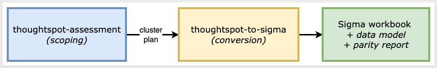

<aside class="positive">
<strong>WHY IT MATTERS:</strong><br> Each skill does one thing well — scoping and conversion. Pick the smallest set that fits your job, and don't run the conversion until you've confirmed the data is somewhere Sigma can actually read.
</aside>

### Which skill for your situation

Not every migration needs both skills. Use the table below to map your scenario to the smallest set that fits.

In this QuickStart we're in the first row — one Liveboard on an Embrace model whose data we'll land in Snowflake so the Sigma connection can read it — then run `thoughtspot-to-sigma`.

| Your situation | Skill(s) to use |
|----------------|-----------------|
| 1 Liveboard, worksheet already reads from your warehouse | `thoughtspot-to-sigma` |
| 1 Liveboard, Falcon-only worksheet with no warehouse copy of the data | Land the data in your warehouse first (covered in `Prepare the Demo Data`), then `thoughtspot-to-sigma` |
| 10+ Liveboards (any data source) | `thoughtspot-assessment` → `thoughtspot-to-sigma` in batch mode |
| Auditing ThoughtSpot sprawl without converting yet | `thoughtspot-assessment` only |

<aside class="negative">
<strong>NOTE:</strong><br> As the skill runs, you'll see filenames and log lines that reference internal phase numbers (e.g., <code>phase6-parity-thoughtspot.rb</code>). Those belong to the skill's own internal numbering — they map onto the phases described in <code>Review the Output</code>. The full mapping is documented in the skill's <code>SKILL.md</code>.
</aside>


<!-- END OF SECTION-->

## Install and Configure the Skill
Duration: 10

First we need to clone the skill's GitHub repository, then run the setup scripts that capture your Sigma and ThoughtSpot credentials.

The two skills live in `sigmacomputing/quickstarts-public` under [thoughtspot-migration-skills/](https://github.com/sigmacomputing/quickstarts-public/tree/main/thoughtspot-migration-skills).

From a terminal, run each command below one at a time so you can confirm each step before moving on.

<aside class="positive">
<strong>NOTE:</strong><br> <code>~</code> in the commands below is shell shorthand for your home folder — <code>/Users/&lt;you&gt;</code> on macOS, <code>/home/&lt;you&gt;</code> on Linux. So <code>~/quickstarts-public</code> resolves to a <code>quickstarts-public/</code> folder directly inside your home directory.
</aside>

**Step 1: Create a local folder for the clone**<br>
We'll clone into this folder in the next step.

```copy-code
mkdir -p ~/quickstarts-public
```

**Step 2: Move into the new folder** so the next command runs in the right working directory.

```copy-code
cd ~/quickstarts-public
```

**Step 3: Clone the repo without pulling any files yet**<br>
The `--sparse` flag tells Git you'll choose which folders to fill in next. The trailing `.` clones into the current folder.

```copy-code
git clone --filter=blob:none --sparse https://github.com/sigmacomputing/quickstarts-public.git .
```

**Step 4: Fill in only the thoughtspot-migration-skills folder**<br>
Every other QuickStart asset in the repo stays empty on disk.

```copy-code
git sparse-checkout set thoughtspot-migration-skills
```

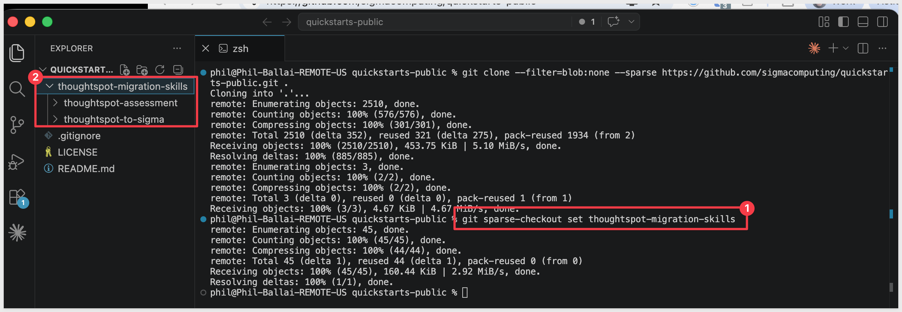

**Step 5: Symlink thoughtspot-to-sigma into the Claude skills folder**<br>
This lets Claude Code invoke `thoughtspot-to-sigma` as a skill.

```copy-code
ln -s ~/quickstarts-public/thoughtspot-migration-skills/thoughtspot-to-sigma ~/.claude/skills/thoughtspot-to-sigma
```

**Step 6: Symlink thoughtspot-assessment**<br>
Used to scope a ThoughtSpot org before conversion.

```copy-code
ln -s ~/quickstarts-public/thoughtspot-migration-skills/thoughtspot-assessment ~/.claude/skills/thoughtspot-assessment
```

Steps 5 and 6 should return with no error.


**Step 7: Install the one Python dependency the skill uses.**<br>
The skill's helpers read ThoughtSpot's TML (ThoughtSpot Modeling Language) with `PyYAML`. Everything else the skill needs is in Python's standard library.

<aside class="negative">
<strong>NOTE:</strong><br> The skill requires Python 3.10 or newer. Check your version first with <code>python3 --version</code>. If it's older — macOS's stock Python is typically 3.9 — install a newer one via Homebrew and use it explicitly for the rest of this section: <code>brew install python@3.12</code>, then substitute <code>python3.12</code> wherever the steps below say <code>python3</code>. Avoid <code>pip3</code> as a shorthand — it can quietly resolve back to the old interpreter even after you install a new one.
</aside>

```copy-code
python3 -m pip install pyyaml
```

**Step 8: Capture your Sigma API credentials.**<br>
This script prompts for `SIGMA_BASE_URL`, `SIGMA_CLIENT_ID`, and `SIGMA_CLIENT_SECRET` and writes them into Claude's settings.

Run once per machine.

If you don't already have credentials, see [Configure API credentials in Sigma](https://help.sigmacomputing.com/sigma-computing/docs/configure-api-credentials-and-connectors-in-sigma) — the skill needs `API access` credentials, not embed.

```copy-code
ruby ~/.claude/skills/thoughtspot-to-sigma/scripts/setup.rb
```

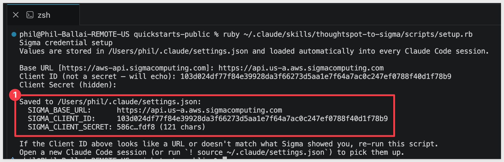

**Step 9: Authenticate with ThoughtSpot.**<br>
ThoughtSpot's REST v2 API uses a bearer token. 

On an SSO trial without a local password, the quickest way to get one is to **open the token endpoint directly in the browser tab where you're already signed in to ThoughtSpot**:

```copy-code
https://<your-tenant>.thoughtspot.cloud/api/rest/2.0/auth/session/token
```

The browser returns a small JSON payload:

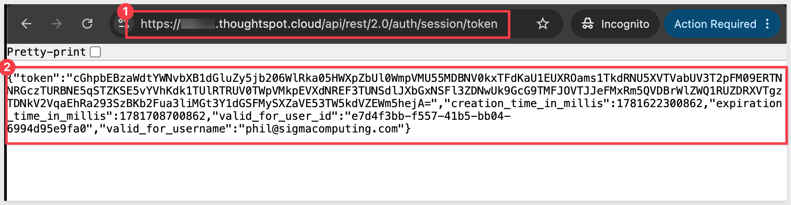

Copy the `token` value (the long string inside the quotes), then paste it into the code below to export both your tenant URL and the token in your terminal:

```copy-code
export TS_HOST="https://<your-tenant>.thoughtspot.cloud"
export TS_TOKEN="<paste-the-token-here>"
```

<aside class="positive">
<strong>NOTE:</strong><br> <code>export</code> is silent by design — the terminal returns nothing after each line, even when the command worked. To confirm both variables are set, run <code>echo "$TS_HOST"</code> and <code>echo "${TS_TOKEN:0:20}..."</code> — they should print your tenant URL and the first 20 characters of the token.
</aside>

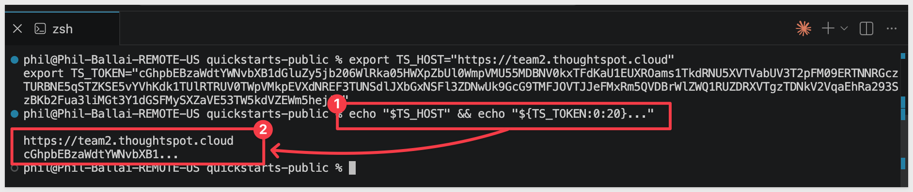

<aside class="positive">
<strong>NOTE:</strong><br> Session tokens last for the duration of your browser session — typically about 24 hours. If a later command returns <code>401</code>, re-open the token URL in the browser and re-export <code>TS_TOKEN</code>. For a repeatable service identity (a token you don't have to refresh by hand), enable Trusted Authentication under <code>Develop</code> > <code>Customizations</code> > <code>Security Settings</code> and use the <code>get-ts-token.sh</code> helper shipped with the skill — see the skill's <code>SKILL.md</code> for that path.
</aside>


**Step 10: Verify the install.**<br>
This lists every model and Liveboard visible to your token — confirms both ThoughtSpot authentication and the skill's installation worked.

```copy-code
python3 ~/.claude/skills/thoughtspot-to-sigma/scripts/ts_discover.py
```

You should see your tenant's models and Liveboards listed:

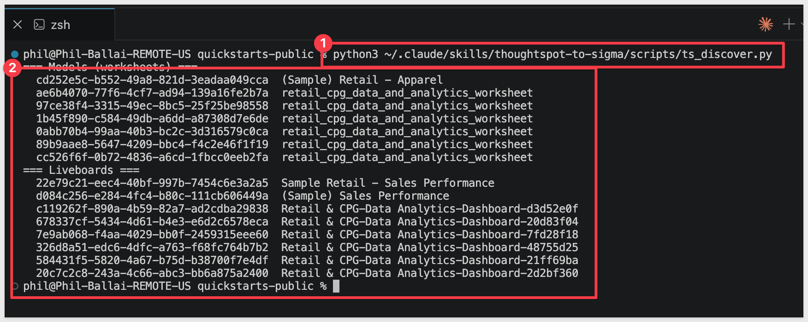


**Step 11: Verify Claude Code can invoke the skill.**<br>
Type `claude` in your terminal to start Claude Code, then invoke the skill:

```copy-code
claude
```

```copy-code
/thoughtspot-to-sigma
```

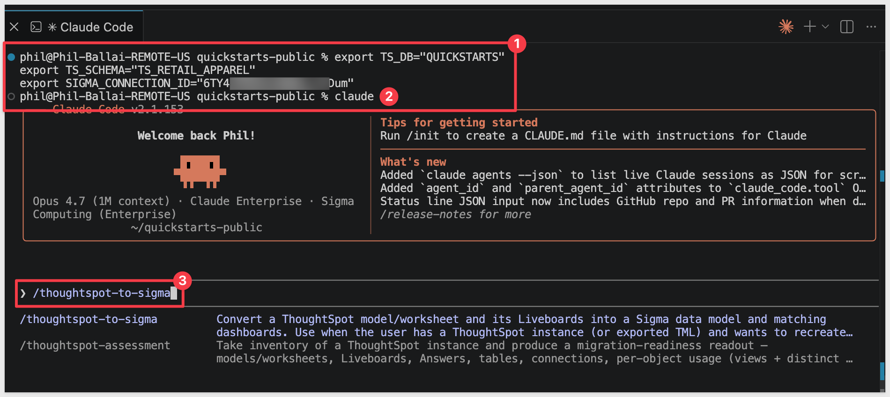

Claude should start reading the reference files and ask what worksheet you want to convert.

Pause at this response:

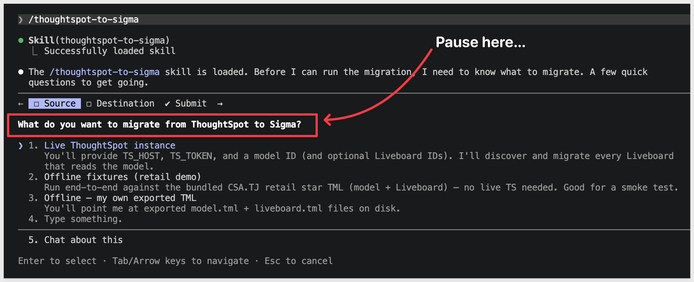

Before going any further, we need to prepare the data the worksheet uses. We'll hand the worksheet, Liveboard, and warehouse details to Claude all at once via a single prompt in `Run the Conversion`.


<!-- END OF SECTION-->

## Prepare the Demo Data
Duration: 15

The ThoughtSpot model we're migrating — `Retail Analytics` — is an Embrace model, meaning it reads directly from a warehouse rather than from ThoughtSpot's in-memory `Falcon` engine. For the migration to land in Sigma cleanly, the same six warehouse tables `Retail Analytics` reads from need to exist in a connection your Sigma org can reach.

The schema is a classic retail star — one fact (`ORDER_FACT`) joined LEFT_OUTER to five dimension tables (`CUSTOMER_DIM`, `PRODUCT_DIM`, `STORE_DIM`, `DATE_DIM`, `PROMO_DIM`). Approximate row counts: 681 / 25 / 25 / 15 / 1,096 / 23.

Data prep has two halves:

1. **ThoughtSpot side — nothing to do here for this QuickStart.** We've already exported the six tables from the source warehouse and hosted them as CSVs in Amazon S3. The Snowflake `COPY INTO` statements below read from S3 directly — no local download needed.

2. **Sigma side (this section)** — the same data needs to live in a Snowflake schema your Sigma connection can read. We'll create one.

<aside class="negative">
<strong>NOTE:</strong><br> The DDL below grants access to <code>SIGMA_SERVICE_ROLE</code>. Substitute the role your Sigma connection actually uses if it differs — you can confirm it in Sigma under <code>Administration</code> > <code>Connections</code> by clicking your Snowflake connection.
</aside>

```copy-code
USE ROLE ACCOUNTADMIN;
USE WAREHOUSE COMPUTE_WH;

CREATE DATABASE IF NOT EXISTS QUICKSTARTS;
CREATE SCHEMA  IF NOT EXISTS QUICKSTARTS.TS_RETAIL_ANALYTICS;
USE SCHEMA QUICKSTARTS.TS_RETAIL_ANALYTICS;

CREATE OR REPLACE FILE FORMAT csv_format
  TYPE = CSV
  FIELD_DELIMITER = ','
  SKIP_HEADER = 1
  FIELD_OPTIONALLY_ENCLOSED_BY = '"'
  NULL_IF = ('', 'NULL')
  EMPTY_FIELD_AS_NULL = TRUE;

CREATE OR REPLACE STAGE ts_retail_stage
  URL = 's3://sigma-quickstarts-main/thoughtspot/'
  FILE_FORMAT = csv_format;

-- Fact: ORDER_FACT (681 rows, joins to all 5 dims via *_KEY columns).
CREATE OR REPLACE TABLE ORDER_FACT (
  ORDER_ID           VARCHAR,
  ORDER_LINE         NUMBER(38,0),
  CUSTOMER_KEY       NUMBER(38,0),
  PRODUCT_KEY        NUMBER(38,0),
  ORDER_STORE_KEY    NUMBER(38,0),
  SHIP_STORE_KEY     NUMBER(38,0),
  PROMO_KEY          NUMBER(38,0),
  ORDER_DATE_KEY     NUMBER(38,0),
  SHIP_DATE_KEY      NUMBER(38,0),
  RETURN_DATE_KEY    NUMBER(38,0),
  ORDER_CHANNEL      VARCHAR,
  SHIP_METHOD        VARCHAR,
  ORDER_STATUS       VARCHAR,
  QUANTITY_ORDERED   NUMBER(38,0),
  QUANTITY_RETURNED  NUMBER(38,0),
  UNIT_PRICE         NUMBER(38,2),
  UNIT_COST          NUMBER(38,2),
  DISCOUNT_AMOUNT    NUMBER(38,2),
  SHIPPING_AMOUNT    NUMBER(38,2),
  TAX_AMOUNT         NUMBER(38,2),
  GROSS_REVENUE      NUMBER(38,2),
  NET_REVENUE        NUMBER(38,2),
  GROSS_PROFIT       NUMBER(38,2),
  NET_PROFIT         NUMBER(38,2),
  IS_FIRST_ORDER     NUMBER(1,0),
  IS_RETURNED        NUMBER(1,0),
  IS_CANCELLED       NUMBER(1,0),
  DAYS_TO_SHIP       NUMBER(38,0)
);

CREATE OR REPLACE TABLE CUSTOMER_DIM (
  CUSTOMER_KEY          NUMBER(38,0),
  CUSTOMER_ID           VARCHAR,
  FIRST_NAME            VARCHAR,
  LAST_NAME             VARCHAR,
  EMAIL                 VARCHAR,
  PHONE                 VARCHAR,
  CITY                  VARCHAR,
  STATE                 VARCHAR,
  ZIP_CODE              VARCHAR,
  REGION                VARCHAR,
  CUSTOMER_SEGMENT      VARCHAR,
  LOYALTY_TIER          VARCHAR,
  ACQUISITION_CHANNEL   VARCHAR,
  FIRST_ORDER_DATE      DATE,
  IS_ACTIVE             NUMBER(1,0),
  IS_EMAIL_OPT_IN       NUMBER(1,0),
  LIFETIME_ORDER_COUNT  NUMBER(38,0),
  LIFETIME_REVENUE      NUMBER(38,2)
);

CREATE OR REPLACE TABLE PRODUCT_DIM (
  PRODUCT_KEY         NUMBER(38,0),
  PRODUCT_ID          VARCHAR,
  PRODUCT_NAME        VARCHAR,
  CATEGORY            VARCHAR,
  SUBCATEGORY         VARCHAR,
  BRAND               VARCHAR,
  UNIT_COST           NUMBER(38,2),
  UNIT_PRICE          NUMBER(38,2),
  WEIGHT_LBS          NUMBER(38,2),
  IS_ACTIVE           NUMBER(1,0),
  IS_PRIVATE_LABEL    NUMBER(1,0),
  IS_SEASONAL         NUMBER(1,0),
  LAUNCH_DATE         DATE,
  DISCONTINUE_DATE    DATE,
  "Product_Key/Name"  VARCHAR
);

CREATE OR REPLACE TABLE STORE_DIM (
  STORE_KEY          NUMBER(38,0),
  STORE_ID           VARCHAR,
  STORE_NAME         VARCHAR,
  STORE_TYPE         VARCHAR,
  CITY               VARCHAR,
  STATE              VARCHAR,
  REGION             VARCHAR,
  DISTRICT           VARCHAR,
  SQUARE_FOOTAGE     NUMBER(38,0),
  OPEN_DATE          DATE,
  CLOSE_DATE         DATE,
  IS_ACTIVE          NUMBER(1,0),
  HAS_CAFE           NUMBER(1,0),
  HAS_CURBSIDE       NUMBER(1,0),
  MANAGER_NAME       VARCHAR,
  STORE_PHONE        VARCHAR,
  ANNUAL_LEASE_COST  NUMBER(38,2)
);

CREATE OR REPLACE TABLE DATE_DIM (
  DATE_KEY        NUMBER(38,0),
  FULL_DATE       DATE,
  DAY_OF_WEEK     VARCHAR,
  DAY_OF_MONTH    NUMBER(38,0),
  WEEK_OF_YEAR    NUMBER(38,0),
  MONTH_NUMBER    NUMBER(38,0),
  MONTH_NAME      VARCHAR,
  QUARTER         NUMBER(38,0),
  "YEAR"          NUMBER(38,0),
  IS_WEEKEND      NUMBER(1,0),
  IS_HOLIDAY      NUMBER(1,0),
  FISCAL_PERIOD   VARCHAR
);

CREATE OR REPLACE TABLE PROMO_DIM (
  PROMO_KEY          NUMBER(38,0),
  PROMO_ID           VARCHAR,
  PROMO_NAME         VARCHAR,
  PROMO_TYPE         VARCHAR,
  CHANNEL            VARCHAR,
  DISCOUNT_PCT       NUMBER(38,2),
  START_DATE         DATE,
  END_DATE           DATE,
  MIN_ORDER_AMOUNT   NUMBER(38,2),
  IS_STACKABLE       NUMBER(1,0),
  TARGET_SEGMENT     VARCHAR,
  PROMO_COST         NUMBER(38,2)
);

-- Load each CSV from S3.
COPY INTO ORDER_FACT    FROM @ts_retail_stage/ORDER_FACT.csv    ON_ERROR = ABORT_STATEMENT;
COPY INTO CUSTOMER_DIM  FROM @ts_retail_stage/CUSTOMER_DIM.csv  ON_ERROR = ABORT_STATEMENT;
COPY INTO PRODUCT_DIM   FROM @ts_retail_stage/PRODUCT_DIM.csv   ON_ERROR = ABORT_STATEMENT;
COPY INTO STORE_DIM     FROM @ts_retail_stage/STORE_DIM.csv     ON_ERROR = ABORT_STATEMENT;
COPY INTO DATE_DIM      FROM @ts_retail_stage/DATE_DIM.csv      ON_ERROR = ABORT_STATEMENT;
COPY INTO PROMO_DIM     FROM @ts_retail_stage/PROMO_DIM.csv     ON_ERROR = ABORT_STATEMENT;

-- Grant Sigma's service role visibility on the new schema and its tables.
GRANT USAGE  ON DATABASE QUICKSTARTS                                    TO ROLE SIGMA_SERVICE_ROLE;
GRANT USAGE  ON SCHEMA   QUICKSTARTS.TS_RETAIL_ANALYTICS                TO ROLE SIGMA_SERVICE_ROLE;
GRANT SELECT ON ALL    TABLES IN SCHEMA QUICKSTARTS.TS_RETAIL_ANALYTICS TO ROLE SIGMA_SERVICE_ROLE;
GRANT SELECT ON FUTURE TABLES IN SCHEMA QUICKSTARTS.TS_RETAIL_ANALYTICS TO ROLE SIGMA_SERVICE_ROLE;

-- Sanity-check row counts. Expected: 681 / 25 / 25 / 15 / 1096 / 23.
SELECT 'ORDER_FACT'   AS TABLE_NAME, COUNT(*) AS ROW_COUNT FROM ORDER_FACT   UNION ALL
SELECT 'CUSTOMER_DIM', COUNT(*) FROM CUSTOMER_DIM UNION ALL
SELECT 'PRODUCT_DIM',  COUNT(*) FROM PRODUCT_DIM  UNION ALL
SELECT 'STORE_DIM',    COUNT(*) FROM STORE_DIM    UNION ALL
SELECT 'DATE_DIM',     COUNT(*) FROM DATE_DIM     UNION ALL
SELECT 'PROMO_DIM',    COUNT(*) FROM PROMO_DIM;

-- Verify the parity baseline ($108,797.85 Net Revenue across all orders).
SELECT TO_CHAR(SUM(NET_REVENUE), '$999,999,999.99') AS TOTAL_NET_REVENUE
FROM ORDER_FACT;
```

<aside class="positive">
<strong>NOTE:</strong><br> Two columns are quoted in the DDL above to preserve their original names — <code>"YEAR"</code> in <code>DATE_DIM</code> and <code>"Product_Key/Name"</code> in <code>PRODUCT_DIM</code>. <code>YEAR</code> is a reserved-ish keyword in Snowflake, and <code>Product_Key/Name</code> uses mixed case plus a slash. Keeping the original names ensures the ThoughtSpot model's column references resolve cleanly against the warehouse without renames.
</aside>

If the load completes cleanly, the row-count check returns `681 / 25 / 25 / 15 / 1096 / 23` and the Net Revenue check returns `$108,797.85`. Any mismatch means either a `COPY` partial-load error (check Snowflake's load history) or a different S3 file than expected.

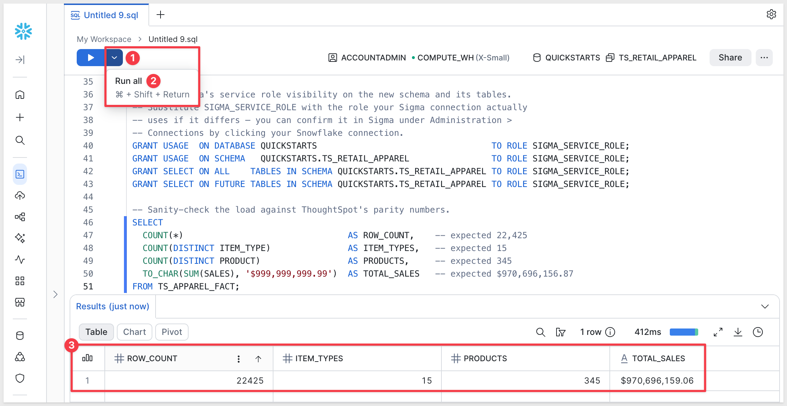

<aside class="positive">
<strong>NOTE:</strong><br> ThoughtSpot worksheets can also read from <code>Falcon</code>, ThoughtSpot's in-memory engine, in which case there is no warehouse table behind them at all — common with the bundled <code>(Sample)</code> worksheets. For Falcon-only worksheets, the data has to be extracted into a warehouse before Sigma can read it. The skill ships a <code>ts_lib.searchdata()</code> helper that wraps ThoughtSpot's REST <code>searchdata</code> endpoint for that pattern — see the skill's <code>SKILL.md</code>. The demo in this QuickStart uses an Embrace model so the extract step isn't needed.
</aside>

<aside class="positive">
<strong>WHY IT MATTERS:</strong><br> Once the source data lives in your warehouse, every downstream tool — Sigma, dbt, your own SQL — reads from the same source of truth instead of a private in-memory copy. The migration step doubles as a data-architecture upgrade.
</aside>


<!-- END OF SECTION-->

## Prepare the Sigma Target Folder
Duration: 2

The converter needs a Sigma folder to land the new data model and workbook in.

To keep this simple, we will use a plain folder and not a workspace.

**Step 1: Create (or pick) a folder in Sigma.**<br>
Open your Sigma org, navigate to where you want the migrated workbook to live, and create a folder for it.

Something like:
```copy-code
ThoughtSpot Migration Demo
```

**Step 2: Grab the folder ID.**<br>
Open the folder. The ID is the last segment of the URL — a short alphanumeric string, 21 characters. 

Copy it from the address bar and keep it on the clipboard for the next section:

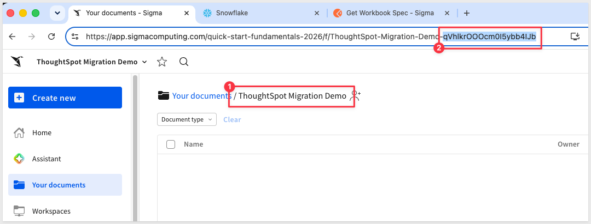


<!-- END OF SECTION-->

## Run the Conversion
Duration: 3

The skill's interactive scope picker is handy for exploratory runs, but for a known target — like ours — it's faster to give Claude the entire job in one message. The skill recognizes a structured kickoff prompt and skips the scope-picker decision tree entirely, going straight from "go" to convert → DM POST → workbook build → layout → parity.

Return to the terminal where Claude is paused at the scope picker, and choose `Chat about this`:

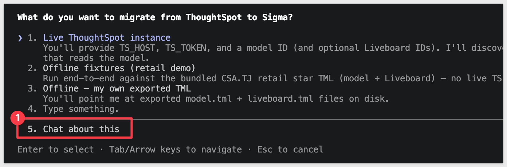

Paste the block below. Substitute your own values where the placeholders are:

- `TS_HOST` — your ThoughtSpot tenant subdomain
- `TS_TOKEN` — the bearer token from your browser
- `Model ID` — the worksheet UUID from `ts_discover.py`
- `Liveboards` — the Liveboard UUID(s) from `ts_discover.py`
- `SIGMA_BASE_URL` — your Sigma region's API base URL
- `SIGMA_CONNECTION_ID` — your Snowflake connection ID from `Administration` > `Connections`
- `SIGMA_FOLDER_ID` — the folder ID you copied at the end of the previous section
- Any additional custom instructions are useful to add here now.

```copy-code
Run /thoughtspot-to-sigma on the following. Use migrate-thoughtspot.py end-to-end and stop only if a hard gate fails.

ThoughtSpot
- TS_HOST = https://<your-tenant>.thoughtspot.cloud
- TS_TOKEN = <paste-token>
- TS_DB = QUICKSTARTS
- TS_SCHEMA = TS_RETAIL_ANALYTICS
- Model ID = <retail-analytics-worksheet-uuid>
- Liveboards = <sales-overview-ts-liveboard-uuid>

Sigma
- SIGMA_BASE_URL = <your-sigma-base-url>
- SIGMA_API_TOKEN = mint from ~/.sigma-migration/env
- SIGMA_CONNECTION_ID = <your-snowflake-connection-id>
- SIGMA_FOLDER_ID = <your-folder-id>

Options
- Name prefix: TS Retail Analytics
- RLS: Port (default)
- DM reuse: auto-pick if ≥0.6
- Parity: tolerate row-count drift between ThoughtSpot and the warehouse snapshot — this QuickStart uses a frozen CSV copy of the source, and ThoughtSpot's live data may have added rows since the export. Report the delta with a row-level diff, but treat warehouse-snapshot staleness as a soft fail (not a gate-red).

Surface the DM-reuse candidates + scores before posting, and pause for my decision if a candidate scores ≥0.6. Don't declare GREEN until assert-phase6-ran.rb exits 0 (allowing the parity tolerance above) and the visual-QA loop passes.
```

Claude reads the block, exports the env vars in its own bash session, runs the source-freshness preflight, then kicks off `migrate-thoughtspot.py` end-to-end. The rest of the run is hands-off until a gate or decision point.

<aside class="positive">
<strong>NOTE:</strong><br> The skill reuses Sigma credentials captured by <code>setup.rb</code> in the previous section — they live at <code>~/.sigma-migration/env</code> and the skill mints a fresh <code>SIGMA_API_TOKEN</code> from them at runtime. That's why the kickoff prompt above says <code>mint from ~/.sigma-migration/env</code> instead of pasting a token. No manual Sigma-token wrangling per run.
</aside>

<aside class="negative">
<strong>NOTE:</strong><br> From here on, Claude Code asks for approval on every bash command the skill runs — and a full conversion fires dozens of them. For each prompt, pick option <code>2. Yes, and don't ask again</code> so Claude Code remembers that command pattern. After the first handful of approvals the prompts stop coming. Alternatively, press <code>Shift+Tab</code> once to switch to accept-edits mode for the rest of the session — fine for a trusted skill like this one, just don't use it for unknown code.
</aside>


<!-- END OF SECTION-->

## Review the Output
Duration: 10

When the migration completes, Claude prints a final summary covering the whole pipeline — every phase's result, the visual-QA outcome, the hard-gate verdict, and the URLs of the new Sigma data model and workbook.

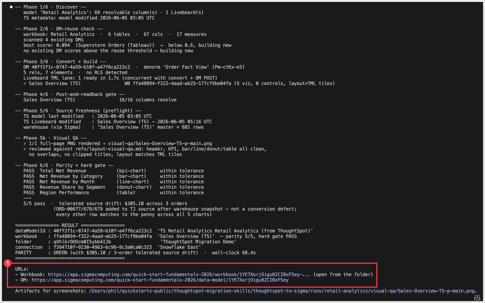

The summary walks through six phases plus a visual-QA pass:

- **Phase 1 — Discover.** Confirms the model is reachable, lists the Liveboards that read it, and notes the model's last-modified timestamp on the ThoughtSpot side.
- **Phase 2 — DM-reuse check.** Scans existing Sigma data models and scores them against the source schema. A score ≥ 0.6 triggers a reuse-vs-new pause; anything lower means the skill builds a new DM (as it does for our demo — the highest scoring existing DM was 0.094).
- **Phase 3 — Convert + build.** Posts the new data model, identifies the denormalized "Order Fact View" element, then builds one Sigma workbook per Liveboard.
- **Phase 4 — Post-and-readback gate.** Reads the workbook spec back and confirms every column referenced in the workbook resolves cleanly against the data model. A mismatch here usually means a warehouse-column / TML-column name divergence.
- **Phase 5 — Source freshness (preflight).** Records the ThoughtSpot model + Liveboard modified times and the warehouse row count Sigma sees, so any later drift is visible.
- **Phase 5b — Visual QA.** Renders the workbook's pages as PNGs and lints them against `refs/layout-visual-qa.md` — no overlapping tiles, no clipped KPI titles, no orphan controls, layout matches the TML tile geometry.
- **Phase 6 — Parity + hard gate.** Runs every chart's Sigma output against ThoughtSpot's `searchdata` ground truth. Each chart reports `PASS within tolerance` or `FAIL`; the gate is GREEN only when all charts pass.

Open the new workbook in Sigma to see the migrated dashboard:

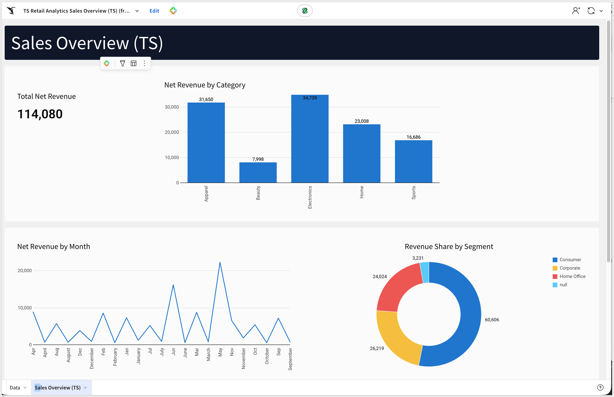

Open the data model to see how the converter wired up the joins and metrics:

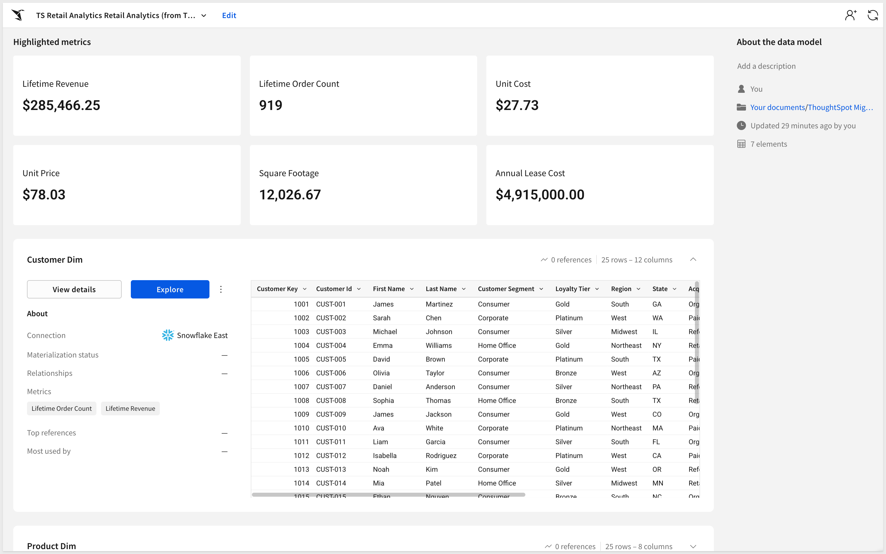

**Hand-polish items the skill flags rather than silently working around:**

- Chart kinds with no native Sigma equivalent (funnel, waterfall, treemap, heat-map, sankey) fall back to bar charts — swap them manually if the source had any. `Sales Overview (TS)` has none of these, so this won't bite for our demo.
- Aggregate formulas that didn't translate cleanly are listed in the summary; hand-author the Sigma equivalent on the affected element.
- Layout edits made manually after the run wipe `spec.layout`. Re-run `apply_layouts.py` if you need to restore the original geometry.
- Row-level security from the source model is detected but never auto-applied — port it via `apply_sigma_rls.py` if the source had RLS. (Our demo doesn't.)

<aside class="positive">
<strong>WHY IT MATTERS:</strong><br> The skill finishes with a documented exit code and an explicit list of what it couldn't auto-translate — never a silent "looks good." Every gap surfaces as a follow-up item with a recommended fix, so you spend hand-polish time on the few items that need it instead of spot-checking every visualization for drift.
</aside>


<!-- END OF SECTION-->

## Scaling Up — Batch Conversion
Duration: 5

A single Liveboard is the easy case. Real migrations involve ThoughtSpot orgs with dozens or hundreds of Liveboards reading from a handful of shared models — and migrating them one-by-one through the converter loses the leverage of doing the planning work once. That's where the companion `thoughtspot-assessment` skill comes in.

Point `thoughtspot-assessment` at a ThoughtSpot org and it inventories every model, Liveboard, Answer, table, and connection, scoring each on:

- **Per-Liveboard complexity** — visualization count, distinct chart-kind mix, number of models touched, TML formula and filter weight
- **Usage signal** — views and distinct users per Liveboard pulled from `TS: BI Server` (ThoughtSpot's built-in activity log), used to flag cold and zero-view content for retirement instead of migration
- **Chart-type coverage** — which chart kinds map cleanly to Sigma versus those that need element-builder mapping work (`SCATTER`, `BUBBLE`, `GEO_AREA`, `PIVOT_TABLE`, `WATERFALL`, `FUNNEL`, `TREEMAP`, `LINE_STACKED_COLUMN`)
- **Data-source patterns** — Embrace (live warehouse) versus Falcon (in-memory) per Liveboard, with file-uploaded tables flagged for warehouse landing first
- **Ownership concentration** — Liveboards grouped by author, surfacing the few owners who account for most of the org's content

The output is a Sigma-branded `readout.html` you can share with stakeholders, plus a ranked migration shortlist sorted by `value / (1 + cost)` — the cheapest, highest-value Liveboards to convert first, with tag pills like `migrate-first`, `easy-win`, `needs-review`, and `retire`.

The shortlist becomes input to a **batch conversion plan** — `thoughtspot-assessment` groups Liveboards that share the same underlying model, so one Sigma data model can serve a whole family of workbooks instead of producing N near-duplicate DMs. `thoughtspot-to-sigma` consumes that plan in batch mode and runs the conversions concurrently.

Typical flow for a real migration engagement:

1. Run `thoughtspot-assessment` against the target org; review the shortlist with stakeholders.
2. Pick the top N Liveboards to convert first — or drop the cold ones entirely.
3. Hand the batch plan to `thoughtspot-to-sigma` and let it work through them.
4. Spot-check each output; file the inevitable gap items upstream.

<aside class="positive">
<strong>WHY IT MATTERS:</strong><br> Sigma's BI migration story is a process, not a single conversion. The assessment skill turns "how big is this migration?" from a guess into a defensible number — backed by per-Liveboard effort estimates, usage-driven prioritization, and a retirement list for content nobody actually reads. That's the difference between a migration that ships and one that stalls in committee.
</aside>


<!-- END OF SECTION-->

## Common Issues and Fixes
Duration: 5

The following is a "grab bag" of things that might come up during real conversions, with the fix for each.

- **`python3 --version` reports 3.9.x and the skill refuses to run:**<br> macOS's stock Python is too old for the skill. Install Python 3.10+ via Homebrew (`brew install python@3.12`) or [python.org](https://www.python.org/downloads/), then use `python3.12 -m pip install pyyaml` explicitly. Avoid `pip3` as a shorthand — it can quietly resolve back to the old interpreter.

- **`ts_discover.py` returns `ValueError: Invalid header value b'Bearer ...\n'`:**<br> The bearer token copy-pasted from the browser picked up a trailing newline. The HTTP `Authorization` header rejects embedded newlines. Strip whitespace from the existing variable in place:<br>
 <code>export TS_TOKEN=$(printf '%s' "$TS_TOKEN" | tr -d '[:space:]')</code><br>
 Then re-run discovery. No need to re-fetch the token.

- **Skill refuses to export TML for a `(Sample)` worksheet or Liveboard:**<br> ThoughtSpot's bundled `(Sample)` content is system-owned and the REST API blocks TML export — even with an admin token. The skill detects this in its preflight and surfaces a "How would you like to proceed?" prompt with four recovery options. The cleanest path is to use a worksheet you (or someone in your org) created instead of a system sample. The next two entries below cover the two follow-on gotchas if you do try the clone path anyway.

- **`Make a copy` is missing from the sample Model's `...` menu:**<br> Cloning a sample worksheet/Model requires edit rights on the source. If you're a `Can View` user on the tenant — typical for guest accounts on someone else's trial — the gesture is hidden and `Edit model` is grayed out. Either (a) ask the tenant owner to clone it admin-side and grant you access, or (b) sign up for your own ThoughtSpot trial where you'll be the tenant owner with full edit rights by default.

- **Cloned Liveboard charts return zero data after the per-viz swap:**<br> When you `Make a copy` of a Liveboard, ThoughtSpot duplicates the layout and chart configurations but each visualization still references the **original** sample worksheet. Open each viz with `Edit`, swap the data source to your cloned worksheet, then save. The skill's preflight will keep refusing to export until every viz on the cloned Liveboard points at user-owned data.

- **Skill pauses at a "converter MCP gate" mid-run:**<br> The conversion delegates the model translation to a separate MCP server (`sigma-data-model-mcp`). If it isn't installed locally, the skill stops at the gate. Pick option `6. Chat about this` and tell Claude:<br>
 <code>Clone twells89/sigma-data-model-mcp into ~/Desktop/sigma-data-model-mcp for me, then run `npm install && npm run build` in that directory. Once the build is done, come back to the gate and pick option 1.</code><br>
 Claude runs the clone, install, and build, then returns to the gate. After that the skill may also prompt for a "build commit" — choose the `(Recommended)` option.

- **Schema not visible in Sigma after `COPY INTO`:**<br> Sigma's service role doesn't have access to the new schema. The DDL block in `Prepare the Demo Data` includes the `GRANT USAGE` and `GRANT SELECT` statements — if you skipped or modified them, run them now with the role name your Sigma connection actually uses (find it in Sigma under `Administration` > `Connections`).

- **`ts_discover.py` 401s after a few hours:**<br> Browser session tokens expire — typically after 24 hours, sometimes sooner. Re-open `${TS_HOST}/api/rest/2.0/auth/session/token` in your logged-in browser tab, copy the fresh token, and re-export `TS_TOKEN`. Don't forget to re-run the whitespace-strip line if you copy-paste from the browser again.

- **TLS verification errors on a corporate network:**<br> ThoughtSpot trial tenants often sit behind corporate TLS interception. The skill's Python helpers use an unverified SSL context by design to side-step this — if you see a TLS error anyway, your interpreter or curl may be pinning a different trust store. Confirm `curl ${TS_HOST}/api/rest/2.0/auth/session/whoami` works directly before assuming the skill is broken.

- **Many `Bash command — Contains shell syntax that cannot be statically analyzed — Do you want to proceed?` prompts during the run:**<br> The skill fires `eval "$(...)"` patterns to inject tokens dynamically. Claude Code's safety analyzer can't pattern-match these for blanket approval even in accept-edits mode. Click `1. Yes` on each — it's expected behavior, not a misconfiguration. After the run, you can use the `/fewer-permission-prompts` skill to scan the transcript and add those patterns to your `.claude/settings.local.json` so subsequent runs are silent.

- **"Data model has error columns" after POST:**<br> A column the model declares can't be resolved against the warehouse. Usually a column name mismatch between the warehouse table and what the converted ThoughtSpot model expects. The skill's verification phase surfaces the specific column in the error — adjust the warehouse table's column names or provide a renames block when re-running.

- **Renaming a Sigma workbook after the run leaves the old name in place:**<br> `PATCH /v2/workbooks/{id}` silently no-ops for renames. The skill works around this by routing renames through `PATCH /v2/files/{id}` instead. If you're modifying a workbook manually post-migration and the name doesn't stick, use the files endpoint.


<!-- END OF SECTION-->

## What We've Covered
Duration: 5

What you built is less a single conversion and more a repeatable migration path. The skill took a ThoughtSpot worksheet — model, Liveboard, search-query expressions, layout — and produced a Sigma data model, a workbook, and a parity report against the live warehouse, all from a single structured prompt. No one rebuilt the dashboard by hand, and the parity numbers are evidence rather than hope.

The patterns worth carrying into your next migration:

- **Two skills, one workflow** — `thoughtspot-assessment` scopes and prioritizes the org; `thoughtspot-to-sigma` converts and verifies. The same shape applies whether you're migrating one Liveboard or all the (TS)-suffixed ones reading from a shared model.
- **TML is your audit trail** — ThoughtSpot's TML export is the durable, human-readable contract the converter reads from. Every join, formula, search-query filter, and chart-kind decision is right there in the YAML, and the converter's output is reproducible against the same TML.
- **Single-prompt kickoff** — once the warehouse data is in place and `setup.rb` has captured your Sigma credentials, the entire migration is one paste. The skill's structured-prompt parser reads the env vars + IDs + options in one shot and walks through every phase end-to-end without further interaction unless a gate genuinely needs your call.
- **Warehouse-first** — Sigma reads the live warehouse, so the conversion's value comes from getting the data where Sigma can see it. The DDL + S3 + GRANTs scaffolding in `Prepare the Demo Data` transfers to any warehouse Sigma can reach. For Falcon-only worksheets where there is no warehouse copy, the skill's `ts_lib.searchdata()` helper handles the extract before the conversion runs.
- **Parity as proof** — the `searchdata`-vs-Sigma comparison is what makes the result shippable. Without it you're spot-checking; with it you have evidence every measure lines up. The skill is honest about source drift too: when the warehouse snapshot is older than the live source, the row-level diff is reported instead of buried, and a documented tolerance keeps the gate sensible for demo scenarios.

A first-pass conversion produces a working starting point and a documented punch list, not a hand-polished workbook. The polish loop is short, and you know exactly what to look at. That's the migration approach you can scale across an entire ThoughtSpot org.

**Additional Resource Links**

[Blog](https://www.sigmacomputing.com/blog/)<br>
[Community](https://community.sigmacomputing.com/)<br>
[Help Center](https://help.sigmacomputing.com/hc/en-us)<br>
[QuickStarts](https://quickstarts.sigmacomputing.com/)<br>

Be sure to check out all the latest developments at [Sigma's First Friday Feature page!](https://quickstarts.sigmacomputing.com/firstfridayfeatures/)
<br>

[](https://twitter.com/sigmacomputing)&emsp;
[](https://www.linkedin.com/company/sigmacomputing)&emsp;
[](https://www.facebook.com/sigmacomputing)


<!-- END OF WHAT WE COVERED -->
<!-- END OF QUICKSTART -->
