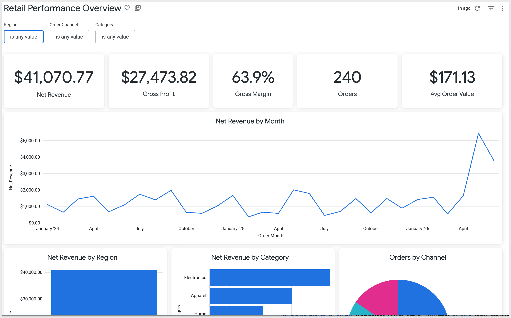
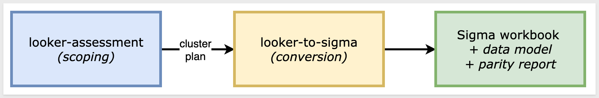
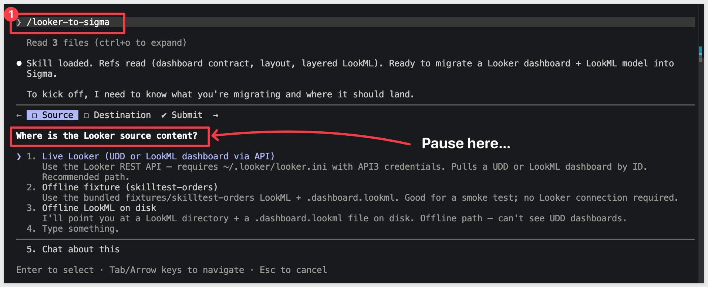
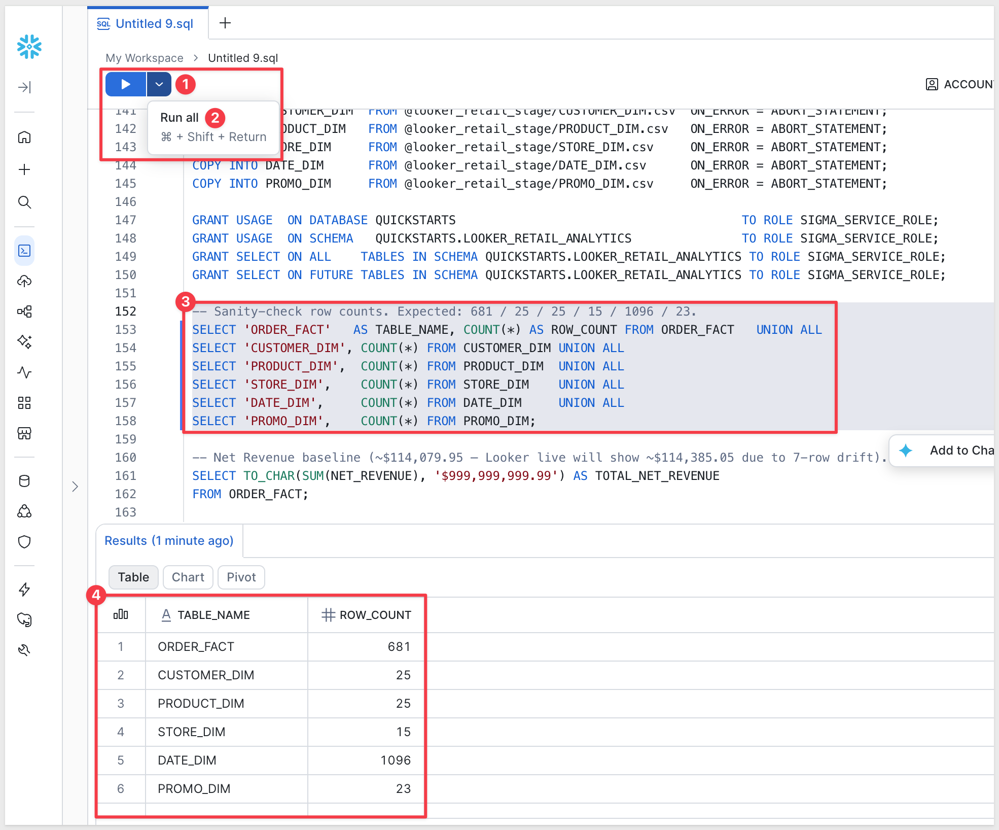
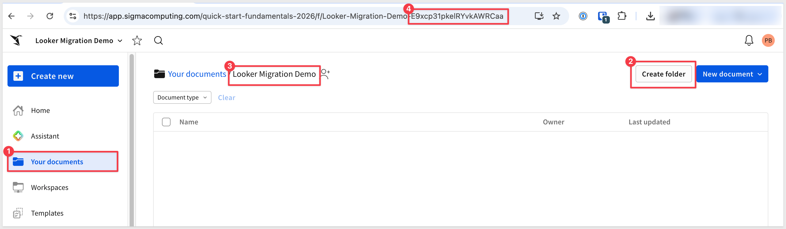
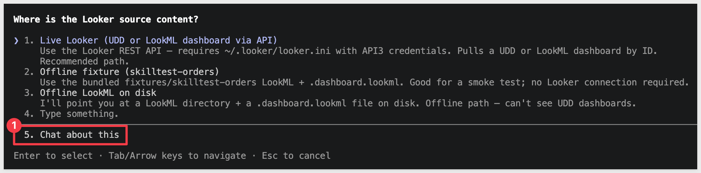
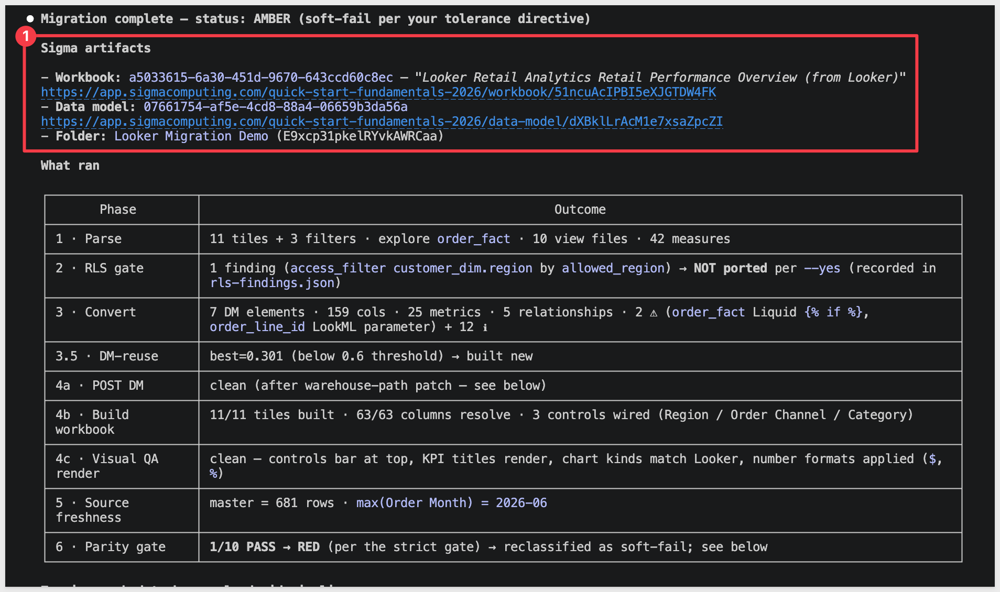
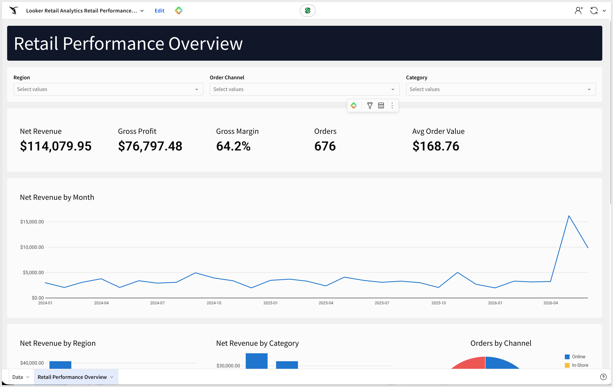
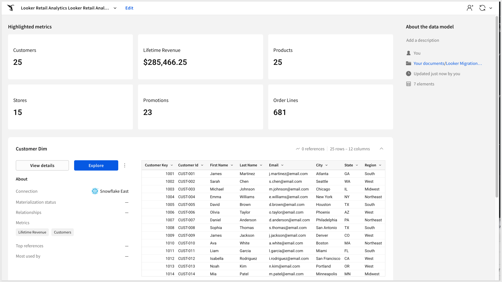

author: pballai
id: developers_migrating_looker_made_easy
summary: developers_migrating_looker_made_easy
categories: migrations
environments: web
status: Published
feedback link: https://github.com/sigmacomputing/sigmaquickstarts/issues
tags: default
lastUpdated: 2026-07-01

# Migrating From Looker Made Easy

## Overview
Duration: 5

A common ask from teams evaluating Sigma is migrating their Looker footprint — usually to take advantage of all the amazing things Sigma offers. The conversion itself can be a blocker — and the part this QuickStart automates.

The usual Looker-to-Sigma migration loop is rebuild-the-LookML-by-hand, rewrite every measure and derived dimension as a Sigma formula, recreate each dashboard tile, line the layout up against the source, then eyeball the numbers and hope nothing drifted in the translation. Done on a single dashboard it's tedious. Across a whole Looker instance with dozens of dashboards reading from shared explores, it's the reason migration projects slip.

This QuickStart walks through a `Claude Code` skill called `looker-to-sigma` that automates the loop.

Point it at a Looker dashboard (user-defined or LookML-defined); it reads the LookML model and dashboard JSON via the Looker REST API 4.0, translates the measures, dimensions, and derived calculations into Sigma formulas, builds a Sigma data model from the warehouse tables the LookML model points at, mirrors the dashboard's layout on Sigma's grid, and runs a parity pass that compares Sigma's chart output to Looker's live results. It surfaces a punch list of anything it couldn't auto-translate — instead of silently producing a broken workbook.

For the demonstration, we'll run the skill end-to-end against a Looker dashboard called `Retail Performance Overview`, built on a `csa_thelook` LookML model — six joined views (order_fact + customer_dim + product_dim + store_dim + order_date + promo_dim) over a retail star:



You'll see the discovery artifacts each phase produces, the converter's breakdown of how each Looker measure mapped to a Sigma formula, the parity report against the live warehouse, and the resulting Sigma data model and workbook landed in your org — along with the gap list of items to hand-polish.

<aside class="positive">
<strong>WHY IT MATTERS:</strong><br> The skill runs the whole conversion — discover, translate, build, verify — and finishes with a documented parity check. The result is a working Sigma workbook on the warehouse plus the report that proves it matches the Looker source, instead of a rebuilt-by-hand workbook you have to spot-check yourself.
</aside>

### What else this enables

A pure lift-and-shift is the floor, not the ceiling. The same skill family supports three follow-on moves that turn a migration into an upgrade:

- **Dedup before you migrate.** Most BI estates carry years of dashboard sprawl — multiple near-identical dashboards built by different teams over time. The assessment skill flags dashboards that are roughly 90% the same and recommends merging them before conversion. You move 200 dashboards instead of 800, and every downstream conversation is simpler. Pair this with the usage data the assessment pulls (who views what, how often) and you can confidently retire cold content rather than carry it forward.

- **Enhance, don't just translate.** Many "dashboards" in legacy tools are really input-driven workflows in disguise — a dashboard whose data is refreshed by uploading a CSV each morning is actually a forecasting app waiting to happen. After the lift-and-shift, the skill can suggest replacing those patterns with native Sigma constructs: input tables for write-back, Sigma Assistant for natural-language analysis, scheduled agents for routine summaries. The result isn't "the old dashboard, in a new tool" — it's "the workflow, finally done right."

- **Audit your source as a side effect.** The parity check that closes the run isn't just a confidence test on the migration — it's a fresh pair of eyes on the source platform's math. Sigma customers have caught multi-year calculation errors during their first migration run because the parity gate flagged a Sigma vs source mismatch and the source turned out to be wrong. Plan the migration as your final audit of the legacy system.

<aside class="negative">
<strong>NOTE:</strong><br> The migration is one-directional — Looker is the source, Sigma is the target. Sigma reads the warehouse live, so the conversion's accuracy depends on the warehouse tables behind your Looker model being reachable from a Sigma connection. The skill reads the LookML project files (model + views) from a local clone of your Looker project's Git repo and reconciles the LookML view names back to the underlying warehouse columns. Parity is checked against Looker's own query results via the API, so any cache or PDT staleness surfaces as an explicit row-level diff rather than getting buried.
</aside>

<aside class="negative">
<strong>AI MODEL DIFFERENCES:</strong><br> Depending on which AI, model, and version you're running, the exact prompt wording, option ordering, and intermediate messages may differ slightly from what's shown in this QuickStart. The substantive steps and decisions are the same — pick the option that matches the intent described, even if the label varies.
</aside>

### Target Audience
Sigma SEs, technical CSMs, and migration partners running Looker-to-Sigma conversions — or scoping a batch migration with the companion `looker-assessment` skill.

### Prerequisites
- `Claude Code` installed (CLI or desktop).
- Sigma API credentials.
- A Looker instance where you can generate an API3 key (`Admin` > `Users` > pick your user > `Edit Keys` > `New API3 Key`). The credential's user needs at least: read access to models, dashboards, and query execution.
- A local clone of your Looker project's LookML repo. Looker projects are git-backed; the `Develop` view in Looker shows the configured remote URL. If your project lives in Looker's bundled git, you'll need to push to a remote (GitHub, GitLab, etc.) you can clone from.
- `Python 3.10` or newer. macOS's stock system Python is typically 3.9 — older than the skill needs. If `python3 --version` reports anything below 3.10, install a newer interpreter via [Homebrew](https://brew.sh/) (`brew install python@3.12`) or [python.org](https://www.python.org/downloads/).
- `Node.js` (any recent LTS) for building the converter MCP. The conversion uses a separate MCP server, [`sigma-data-model-mcp`](https://github.com/twells89/sigma-data-model-mcp), cloned + built (`npm install && npm run build`) into `~/Desktop/sigma-data-model-mcp`. The skill prompts you to install it mid-conversion — no upfront work needed — but pre-build it if you'd rather skip the gate.
- A warehouse reachable from Sigma (Snowflake, BigQuery, Databricks, Redshift, Postgres and others).

<aside class="negative">
<strong>NOTE:</strong><br> Use a non-production Sigma org for your first run. The skill creates real workbooks, and error-recovery paths may iterate via PUT to update them.
</aside>

<button>[Sigma Free Trial](https://www.sigmacomputing.com/free-trial/)</button>


<!-- END OF SECTION-->

## The Looker Migration Skill Family
Duration: 5

`looker-to-sigma` is one of two skills that ship together as a single repo (cloned in the next section). Most of this QuickStart focuses on the converter — but knowing where the assessment skill fits saves dead ends later when scoping a batch migration.

| Skill | Role | When to reach for it |
|-------|------|----------------------|
| `looker-assessment` | Scoping | Auditing a Looker instance before committing to a conversion plan. Emits a per-dashboard complexity readout (LookML measure convertibility, tile-type coverage, derived-table flags, model size), usage signal from `system__activity`, and a value/cost-ranked migration shortlist that `looker-to-sigma` can consume. |
| `looker-to-sigma` | Conversion | The subject of this QuickStart. Converts a single Looker dashboard (or a batch via shortlist) to a Sigma data model and matching workbook with verified data parity. |

Here's how the two skills connect in a full migration — `looker-assessment` hands the converter a ranked shortlist, and `looker-to-sigma` produces the Sigma workbooks with a verified parity report:



<aside class="positive">
<strong>WHY IT MATTERS:</strong><br> Each skill does one thing well — scoping and conversion. Pick the smallest set that fits your job, and don't run the conversion until you've confirmed the data is somewhere Sigma can actually read.
</aside>

### Which skill for your situation

Not every migration needs both skills. Use the table below to map your scenario to the smallest set that fits.

In this QuickStart we're in the first row — one Looker dashboard whose LookML model reads from warehouse tables that we'll land in Snowflake — then run `looker-to-sigma`.

| Your situation | Skill(s) to use |
|----------------|-----------------|
| 1 dashboard, LookML reads from your warehouse | `looker-to-sigma` |
| 1 dashboard, LookML reads from a warehouse Sigma can't connect to | Land the data in your warehouse first (covered in `Prepare the Demo Data`), then `looker-to-sigma` |
| 10+ dashboards (any data source) | `looker-assessment` → `looker-to-sigma` in batch mode |
| Auditing Looker sprawl without converting yet | `looker-assessment` only |

<aside class="negative">
<strong>NOTE:</strong><br> As the skill runs, you'll see filenames and log lines that reference internal phase numbers (e.g., <code>phase6-parity-looker.rb</code>). Those belong to the skill's own internal numbering — they map onto the phases described in <code>Review the Output</code>. The full mapping is documented in the skill's <code>SKILL.md</code>.
</aside>


<!-- END OF SECTION-->

## Install and Configure the Skill
Duration: 15

First we need to clone the skill's GitHub repository, configure Looker API credentials, capture your Sigma credentials, and clone your LookML project locally.

The two skills live in `sigmacomputing/quickstarts-public` under [looker-migration-skills/](https://github.com/sigmacomputing/quickstarts-public/tree/main/looker-migration-skills).

From a terminal, run each command below one at a time so you can confirm each step before moving on.

<aside class="positive">
<strong>NOTE:</strong><br> <code>~</code> in the commands below is shell shorthand for your home folder — <code>/Users/&lt;you&gt;</code> on macOS, <code>/home/&lt;you&gt;</code> on Linux.
</aside>

**Step 1: Create a local folder for the clone**

```copy-code
mkdir -p ~/quickstarts-public
```

**Step 2: Move into the new folder**

```copy-code
cd ~/quickstarts-public
```

**Step 3: Clone the repo without pulling any files yet**

```copy-code
git clone --filter=blob:none --sparse https://github.com/sigmacomputing/quickstarts-public.git .
```

**Step 4: Fill in only the looker-migration-skills folder**

```copy-code
git sparse-checkout set looker-migration-skills
```

**Step 5: Symlink looker-to-sigma into the Claude skills folder**

```copy-code
ln -s ~/quickstarts-public/looker-migration-skills/looker-to-sigma ~/.claude/skills/looker-to-sigma
```

**Step 6: Symlink looker-assessment**

```copy-code
ln -s ~/quickstarts-public/looker-migration-skills/looker-assessment ~/.claude/skills/looker-assessment
```

Steps 5 and 6 should return with no error.


**Step 7: Install the Python dependency the skill uses.**<br>
The skill reads LookML (a text-based modeling language) with `PyYAML`. Everything else is in Python's standard library.

<aside class="negative">
<strong>NOTE:</strong><br> The skill requires Python 3.10 or newer. Check your version first with <code>python3 --version</code>. If it's older — macOS's stock Python is typically 3.9 — install a newer one via Homebrew and use it explicitly for the rest of this section: <code>brew install python@3.12</code>, then substitute <code>python3.12</code> wherever the steps below say <code>python3</code>.
</aside>

```copy-code
python3 -m pip install pyyaml
```


**Step 8: Capture your Sigma API credentials.**<br>
This script prompts for `SIGMA_BASE_URL`, `SIGMA_CLIENT_ID`, and `SIGMA_CLIENT_SECRET` and writes them into Claude's settings.

Run once per machine.

```copy-code
ruby ~/.claude/skills/looker-to-sigma/scripts/setup.rb
```


**Step 9: Configure Looker API auth.**<br>
The skill reads `~/.looker/looker.ini` for Looker REST API 4.0 credentials. Create it with your tenant URL, API3 client ID, and client secret:

```copy-code
mkdir -p ~/.looker && cat > ~/.looker/looker.ini <<'INI'
[Looker]
base_url=https://<your-instance>.cloud.looker.com:19999
client_id=<API3 client_id>
client_secret=<API3 client_secret>
verify_ssl=True
INI
```

Substitute your tenant URL and the API3 credentials you generated under `Admin` > `Users` > your user > `Edit Keys`.

Verify auth works:

```copy-code
python3 ~/.claude/skills/looker-to-sigma/scripts/looker_api.py whoami
```

You should see your Looker user's display name and roles.

<aside class="positive">
<strong>NOTE:</strong><br> The <code>base_url</code> must include the API port (<code>:19999</code>). The customer-facing UI URL won't work for API auth.
</aside>


**Step 10: Clone your LookML project locally.**<br>
The skill needs to read your LookML model + view files from disk. Find the Git remote URL in Looker's `Develop` view → `Projects` → your project → `Configure Git`, then clone it somewhere you'll remember:

```copy-code
git clone <your-lookml-project-git-url> ~/lookml-projects/<project-name>
```

If your project lives in Looker's bundled git (the default for new trials), you'll first need to add a remote (GitHub, GitLab, etc.) and push from Looker so you have something to clone from.


**Step 11: Verify Claude Code can invoke the skill.**<br>
Type `claude` in your terminal to start Claude Code, then invoke the skill:

```copy-code
claude
```

```copy-code
/looker-to-sigma
```

Claude should start reading the reference files and ask what dashboard you want to convert. 

Pause at that prompt — we'll hand it everything in one shot via the kickoff prompt in `Run the Conversion`:




<!-- END OF SECTION-->

## Prepare the Demo Data
Duration: 10

The Looker model we're migrating reads from a six-table retail star — one fact (`ORDER_FACT`) joined LEFT_OUTER to five dimensions (`CUSTOMER_DIM`, `PRODUCT_DIM`, `STORE_DIM`, `DATE_DIM`, `PROMO_DIM`). For the migration to land in Sigma cleanly, the same six tables need to exist in a connection your Sigma org can reach. Approximate row counts: 681 / 25 / 25 / 15 / 1,096 / 23.

Data prep has two halves:

1. **Looker side — nothing to do here for this QuickStart.** We've already exported the six tables from the source warehouse and hosted them as CSVs in Amazon S3. The Snowflake `COPY INTO` statements below read from S3 directly — no local download needed.

2. **Sigma side (this section)** — the same data needs to live in a Snowflake schema your Sigma connection can read. We'll create one.

<aside class="negative">
<strong>NOTE:</strong><br> The DDL below grants access to <code>SIGMA_SERVICE_ROLE</code>. Substitute the role your Sigma connection actually uses if it differs — you can confirm it in Sigma under <code>Administration</code> > <code>Connections</code> by clicking your Snowflake connection.
</aside>

```copy-code
USE ROLE ACCOUNTADMIN;
USE WAREHOUSE COMPUTE_WH;

CREATE DATABASE IF NOT EXISTS QUICKSTARTS;
CREATE SCHEMA  IF NOT EXISTS QUICKSTARTS.LOOKER_RETAIL_ANALYTICS;
USE SCHEMA QUICKSTARTS.LOOKER_RETAIL_ANALYTICS;

CREATE OR REPLACE FILE FORMAT csv_format
  TYPE = CSV
  FIELD_DELIMITER = ','
  SKIP_HEADER = 1
  FIELD_OPTIONALLY_ENCLOSED_BY = '"'
  NULL_IF = ('', 'NULL')
  EMPTY_FIELD_AS_NULL = TRUE;

CREATE OR REPLACE STAGE looker_retail_stage
  URL = 's3://sigma-quickstarts-main/Looker/'
  FILE_FORMAT = csv_format;

CREATE OR REPLACE TABLE ORDER_FACT (
  ORDER_ID           VARCHAR,
  ORDER_LINE         NUMBER(38,0),
  CUSTOMER_KEY       NUMBER(38,0),
  PRODUCT_KEY        NUMBER(38,0),
  ORDER_STORE_KEY    NUMBER(38,0),
  SHIP_STORE_KEY     NUMBER(38,0),
  PROMO_KEY          NUMBER(38,0),
  ORDER_DATE_KEY     NUMBER(38,0),
  SHIP_DATE_KEY      NUMBER(38,0),
  RETURN_DATE_KEY    NUMBER(38,0),
  ORDER_CHANNEL      VARCHAR,
  SHIP_METHOD        VARCHAR,
  ORDER_STATUS       VARCHAR,
  QUANTITY_ORDERED   NUMBER(38,0),
  QUANTITY_RETURNED  NUMBER(38,0),
  UNIT_PRICE         NUMBER(38,2),
  UNIT_COST          NUMBER(38,2),
  DISCOUNT_AMOUNT    NUMBER(38,2),
  SHIPPING_AMOUNT    NUMBER(38,2),
  TAX_AMOUNT         NUMBER(38,2),
  GROSS_REVENUE      NUMBER(38,2),
  NET_REVENUE        NUMBER(38,2),
  GROSS_PROFIT       NUMBER(38,2),
  NET_PROFIT         NUMBER(38,2),
  IS_FIRST_ORDER     NUMBER(1,0),
  IS_RETURNED        NUMBER(1,0),
  IS_CANCELLED       NUMBER(1,0),
  DAYS_TO_SHIP       NUMBER(38,0)
);

CREATE OR REPLACE TABLE CUSTOMER_DIM (
  CUSTOMER_KEY          NUMBER(38,0),
  CUSTOMER_ID           VARCHAR,
  FIRST_NAME            VARCHAR,
  LAST_NAME             VARCHAR,
  EMAIL                 VARCHAR,
  PHONE                 VARCHAR,
  CITY                  VARCHAR,
  STATE                 VARCHAR,
  ZIP_CODE              VARCHAR,
  REGION                VARCHAR,
  CUSTOMER_SEGMENT      VARCHAR,
  LOYALTY_TIER          VARCHAR,
  ACQUISITION_CHANNEL   VARCHAR,
  FIRST_ORDER_DATE      DATE,
  IS_ACTIVE             NUMBER(1,0),
  IS_EMAIL_OPT_IN       NUMBER(1,0),
  LIFETIME_ORDER_COUNT  NUMBER(38,0),
  LIFETIME_REVENUE      NUMBER(38,2)
);

CREATE OR REPLACE TABLE PRODUCT_DIM (
  PRODUCT_KEY         NUMBER(38,0),
  PRODUCT_ID          VARCHAR,
  PRODUCT_NAME        VARCHAR,
  CATEGORY            VARCHAR,
  SUBCATEGORY         VARCHAR,
  BRAND               VARCHAR,
  UNIT_COST           NUMBER(38,2),
  UNIT_PRICE          NUMBER(38,2),
  WEIGHT_LBS          NUMBER(38,2),
  IS_ACTIVE           NUMBER(1,0),
  IS_PRIVATE_LABEL    NUMBER(1,0),
  IS_SEASONAL         NUMBER(1,0),
  LAUNCH_DATE         DATE,
  DISCONTINUE_DATE    DATE,
  "Product_Key/Name"  VARCHAR
);

CREATE OR REPLACE TABLE STORE_DIM (
  STORE_KEY          NUMBER(38,0),
  STORE_ID           VARCHAR,
  STORE_NAME         VARCHAR,
  STORE_TYPE         VARCHAR,
  CITY               VARCHAR,
  STATE              VARCHAR,
  REGION             VARCHAR,
  DISTRICT           VARCHAR,
  SQUARE_FOOTAGE     NUMBER(38,0),
  OPEN_DATE          DATE,
  CLOSE_DATE         DATE,
  IS_ACTIVE          NUMBER(1,0),
  HAS_CAFE           NUMBER(1,0),
  HAS_CURBSIDE       NUMBER(1,0),
  MANAGER_NAME       VARCHAR,
  STORE_PHONE        VARCHAR,
  ANNUAL_LEASE_COST  NUMBER(38,2)
);

CREATE OR REPLACE TABLE DATE_DIM (
  DATE_KEY        NUMBER(38,0),
  FULL_DATE       DATE,
  DAY_OF_WEEK     VARCHAR,
  DAY_OF_MONTH    NUMBER(38,0),
  WEEK_OF_YEAR    NUMBER(38,0),
  MONTH_NUMBER    NUMBER(38,0),
  MONTH_NAME      VARCHAR,
  QUARTER         NUMBER(38,0),
  "YEAR"          NUMBER(38,0),
  IS_WEEKEND      NUMBER(1,0),
  IS_HOLIDAY      NUMBER(1,0),
  FISCAL_PERIOD   VARCHAR
);

CREATE OR REPLACE TABLE PROMO_DIM (
  PROMO_KEY          NUMBER(38,0),
  PROMO_ID           VARCHAR,
  PROMO_NAME         VARCHAR,
  PROMO_TYPE         VARCHAR,
  CHANNEL            VARCHAR,
  DISCOUNT_PCT       NUMBER(38,2),
  START_DATE         DATE,
  END_DATE           DATE,
  MIN_ORDER_AMOUNT   NUMBER(38,2),
  IS_STACKABLE       NUMBER(1,0),
  TARGET_SEGMENT     VARCHAR,
  PROMO_COST         NUMBER(38,2)
);

COPY INTO ORDER_FACT    FROM @looker_retail_stage/ORDER_FACT.csv    ON_ERROR = ABORT_STATEMENT;
COPY INTO CUSTOMER_DIM  FROM @looker_retail_stage/CUSTOMER_DIM.csv  ON_ERROR = ABORT_STATEMENT;
COPY INTO PRODUCT_DIM   FROM @looker_retail_stage/PRODUCT_DIM.csv   ON_ERROR = ABORT_STATEMENT;
COPY INTO STORE_DIM     FROM @looker_retail_stage/STORE_DIM.csv     ON_ERROR = ABORT_STATEMENT;
COPY INTO DATE_DIM      FROM @looker_retail_stage/DATE_DIM.csv      ON_ERROR = ABORT_STATEMENT;
COPY INTO PROMO_DIM     FROM @looker_retail_stage/PROMO_DIM.csv     ON_ERROR = ABORT_STATEMENT;

GRANT USAGE  ON DATABASE QUICKSTARTS                                       TO ROLE SIGMA_SERVICE_ROLE;
GRANT USAGE  ON SCHEMA   QUICKSTARTS.LOOKER_RETAIL_ANALYTICS               TO ROLE SIGMA_SERVICE_ROLE;
GRANT SELECT ON ALL    TABLES IN SCHEMA QUICKSTARTS.LOOKER_RETAIL_ANALYTICS TO ROLE SIGMA_SERVICE_ROLE;
GRANT SELECT ON FUTURE TABLES IN SCHEMA QUICKSTARTS.LOOKER_RETAIL_ANALYTICS TO ROLE SIGMA_SERVICE_ROLE;

-- Sanity-check row counts. Expected: 681 / 25 / 25 / 15 / 1096 / 23.
SELECT 'ORDER_FACT'   AS TABLE_NAME, COUNT(*) AS ROW_COUNT FROM ORDER_FACT   UNION ALL
SELECT 'CUSTOMER_DIM', COUNT(*) FROM CUSTOMER_DIM UNION ALL
SELECT 'PRODUCT_DIM',  COUNT(*) FROM PRODUCT_DIM  UNION ALL
SELECT 'STORE_DIM',    COUNT(*) FROM STORE_DIM    UNION ALL
SELECT 'DATE_DIM',     COUNT(*) FROM DATE_DIM     UNION ALL
SELECT 'PROMO_DIM',    COUNT(*) FROM PROMO_DIM;

-- Net Revenue baseline (~$114,079.95 for the warehouse snapshot).
SELECT TO_CHAR(SUM(NET_REVENUE), '$999,999,999.99') AS TOTAL_NET_REVENUE
FROM ORDER_FACT;
```

If the load completes cleanly, the row-count check returns `681 / 25 / 25 / 15 / 1096 / 23` and the Net Revenue check returns roughly `$114,079.95`. Any mismatch means either a `COPY` partial-load error (check Snowflake's load history) or a different S3 file than expected.



<aside class="positive">
<strong>WHY IT MATTERS:</strong><br> Once the source data lives in your warehouse, every downstream tool — Sigma, dbt, your own SQL — reads from the same source of truth instead of routing through Looker's persistent-derived-table cache. The migration step doubles as a data-architecture upgrade.
</aside>


<!-- END OF SECTION-->

## Prepare the Sigma Target Folder
Duration: 2

The converter needs a Sigma folder to land the new data model and workbook in. The skill will ask for the folder's UUID — it will be easier to have it ready before you return to the Claude prompt that's still paused after the skill loaded.

To keep this simple, we will use a plain folder and not a workspace.

**Step 1: Create (or pick) a folder in Sigma.**<br>
Open your Sigma org, navigate to where you want the migrated workbook to live, and create a folder for it. Something like:

```copy-code
Looker Migration Demo
```

**Step 2: Grab the folder ID.**<br>
Open the folder. The ID is the last segment of the URL — a short alphanumeric string, 21 characters. Copy it from the address bar and keep it on the clipboard for the next section.



<aside class="positive">
<strong>NOTE:</strong><br> The skill's prompt may refer to the folder "UUID". Paste the value from the URL exactly as it appears; the skill accepts that form directly.
</aside>


<!-- END OF SECTION-->

## Run the Conversion
Duration: 3

The skill can run interactively, asking for the dashboard, LookML directory, warehouse, and Sigma destination one at a time. For a known target — like ours — it's faster to give Claude the entire job in one message. The skill recognizes a structured kickoff prompt and assembles the `migrate-looker.py` command directly, going straight from "go" through discover → convert → data model → workbook build → layout → parity.

If Claude is still running and paused at the skill's first prompt from `Install and Configure the Skill`, return to that terminal. If you closed Claude after that step, restart it now:

```copy-code
claude
```

```copy-code
/looker-to-sigma
```

When Claude finishes loading the skill and asks what to migrate, choose `Chat about this`:



Paste the block below. **Substitute your own values where the placeholders are:**

- `LookML directory` — the local clone path from Install Step 10
- `Dashboard ID` — the numeric ID or slug of the Looker dashboard you want to migrate (visible in the dashboard's URL: `/dashboards/<id>`)
- `SIGMA_CONNECTION_ID` — your Snowflake connection ID from Sigma's `Administration` > `Connections`
- `SIGMA_FOLDER_ID` — the folder ID you copied at the end of the previous section
- Any additional custom instructions are useful to add here now.

```copy-code
Run /looker-to-sigma on the following. Use migrate-looker.py end-to-end and stop only if a hard gate fails.

Looker
- ~/.looker/looker.ini is configured with API3 credentials
- LookML directory: <local-path-to-cloned-lookml-project>
- Dashboard ID: <looker-dashboard-id-or-slug>

Warehouse (Snowflake)
- Database: QUICKSTARTS
- Schema: LOOKER_RETAIL_ANALYTICS

Sigma
- SIGMA_API_TOKEN = mint from ~/.sigma-migration/env
- SIGMA_CONNECTION_ID: <your-snowflake-connection-id>
- SIGMA_FOLDER_ID: <your-folder-id>

Options
- Name prefix: Looker Retail Analytics
- Auto-approve mid-pipeline questions: yes
- Parity: tolerate row-count drift between Looker (live) and the warehouse snapshot — this QuickStart uses a frozen CSV copy of the source. Report the delta with a row-level diff, but treat warehouse-snapshot staleness as a soft fail (not a gate-red).

Don't declare GREEN until the parity gate passes (or the tolerance above applies) and the visual-QA loop passes.
```

Claude reads the block, mints a fresh Sigma token from `~/.sigma-migration/env`, assembles the `migrate-looker.py` command with the right flags, and runs it end-to-end. The rest of the run is hands-off until a gate or decision point.

<aside class="positive">
<strong>NOTE:</strong><br> The skill reuses Sigma credentials captured by <code>setup.rb</code> — they live at <code>~/.sigma-migration/env</code> and the skill mints a fresh <code>SIGMA_API_TOKEN</code> from them at runtime. That's why the kickoff prompt above says <code>mint from ~/.sigma-migration/env</code> instead of pasting a token. No manual Sigma-token wrangling per run.
</aside>

<aside class="negative">
<strong>NOTE:</strong><br> From here on, Claude Code asks for approval on every bash command the skill runs — and a full conversion fires dozens of them. For each prompt, pick option <code>2. Yes, and don't ask again</code> so Claude Code remembers that command pattern. After the first handful of approvals the prompts stop coming. Alternatively, press <code>Shift+Tab</code> once to switch to <code>auto mode on</code> for the rest of the session — fine for a trusted skill like this one, just don't use it for unknown code.
</aside>


<!-- END OF SECTION-->

## Review the Output
Duration: 10

When the migration completes, Claude prints a final summary covering the whole pipeline — every phase's result, the visual-QA outcome, the hard-gate verdict, and the URLs of the new Sigma data model and workbook:



The summary walks through six phases plus a visual-QA pass:

- **Phase 1 — Discover.** Pulls the dashboard JSON from Looker via REST API 4.0 and reads the LookML model + views from your local clone. Records the dashboard's last-modified timestamp on the Looker side.
- **Phase 2 — Convert.** Translates the LookML measures, derived dimensions, and dashboard tile fields into a Sigma data-model spec. Looker measures map to Sigma metrics; derived dimensions to Sigma calculated columns; LookML joins to Sigma DM relationships.
- **Phase 3 — Data model POST.** Posts the new DM to Sigma, identifies the denormalized element that surfaces joined-dim columns, and verifies every column resolves cleanly against your warehouse schema.
- **Phase 4 — Workbook build.** Per Looker tile (single_value / looker_line / looker_column / looker_bar / looker_pie / looker_grid / etc.), builds a matching Sigma element. Records the per-tile chart-kind decisions and any fallbacks for tile types Sigma doesn't natively support.
- **Phase 5 — Layout.** Maps Looker's newspaper-layout coordinates (24-col grid) onto Sigma's 24-col grid — direct 1:1 since both products use the same width convention.
- **Phase 5b — Visual QA.** Renders the workbook's pages as PNGs and lints them — no overlapping tiles, no clipped chart titles, no orphan controls.
- **Phase 6 — Parity + hard gate.** Runs every chart's Sigma output against Looker's live query results via the REST API. Each chart reports `PASS within tolerance` or `FAIL`; the gate is GREEN only when all charts pass.

Open the new workbook in Sigma to see the migrated dashboard:



Open the data model to see how the converter wired up the joins and metrics.



**Hand-polish items the skill flags rather than silently working around:**

- Looker tile types with no native Sigma equivalent (sankey, waterfall, funnel, treemap) fall back to bar charts — swap them manually if the source had any.
- LookML measures that use Liquid template variables or `merged_results` are listed in the summary; hand-author the Sigma equivalent on the affected element.
- LookML derived tables (regular or PDT) aren't materialized in Sigma — if the dashboard depends on a PDT, you'll need to materialize that as a Sigma data model SQL element or land the result as a warehouse table.
- Cross-filtering between tiles (Looker's `listen` blocks) translates to Sigma controls when the targets resolve cleanly; the skill surfaces any controls it couldn't auto-wire.

<aside class="positive">
<strong>WHY IT MATTERS:</strong><br> The skill finishes with a documented exit code and an explicit list of what it couldn't auto-translate — never a silent "looks good." Every gap surfaces as a follow-up item with a recommended fix, so you spend hand-polish time on the few items that need it instead of spot-checking every visualization for drift.
</aside>


<!-- END OF SECTION-->

## Scaling Up — Batch Conversion
Duration: 5

A single dashboard is the easy case. Real migrations involve Looker instances with dozens or hundreds of dashboards reading from a handful of shared explores — and migrating them one-by-one through the converter loses the leverage of doing the planning work once. That's where the companion `looker-assessment` skill comes in.

Point `looker-assessment` at a Looker instance and it inventories every model, explore, dashboard, and look, scoring each on:

- **Per-dashboard complexity** — tile count, distinct tile-type mix, number of models touched, LookML measure complexity, Liquid template flags
- **Usage signal** — views and distinct users per dashboard pulled from Looker's `system__activity` model (Looker's built-in usage data), used to flag cold and zero-view content for retirement instead of migration
- **Tile-type coverage** — which tile types map cleanly to Sigma versus those that need element-builder mapping work
- **Source patterns** — explores backed by warehouse tables versus PDT-backed explores flagged separately
- **Ownership concentration** — dashboards grouped by author, surfacing the few owners who account for most of the instance's content

The output is a Sigma-branded `readout.html` you can share with stakeholders, plus a ranked migration shortlist sorted by `value / (1 + cost)` — the cheapest, highest-value dashboards to convert first, with tag pills like `migrate-first`, `easy-win`, `needs-review`, and `retire`.

The shortlist becomes input to a **batch conversion plan** — `looker-assessment` groups dashboards that share the same explore so one Sigma data model can serve a whole family of workbooks instead of producing N near-duplicate DMs. `looker-to-sigma` consumes that plan in batch mode and runs the conversions concurrently.

Typical flow for a real migration engagement:

1. Run `looker-assessment` against the target instance; review the shortlist with stakeholders.
2. Pick the top N dashboards to convert first — or drop the cold ones entirely.
3. Hand the batch plan to `looker-to-sigma` and let it work through them.
4. Spot-check each output; file the inevitable gap items upstream.

<aside class="positive">
<strong>WHY IT MATTERS:</strong><br> Sigma's BI migration story is a process, not a single conversion. The assessment skill turns "how big is this migration?" from a guess into a defensible number — backed by per-dashboard effort estimates, usage-driven prioritization, and a retirement list for content nobody actually reads. That's the difference between a migration that ships and one that stalls in committee.
</aside>


<!-- END OF SECTION-->

## Common Issues and Fixes
Duration: 5

The following is a "grab bag" of things that might come up during real conversions, with the fix for each.

- **`python3 --version` reports 3.9.x and the skill refuses to run:**<br> macOS's stock Python is too old for the skill. Install Python 3.10+ via Homebrew (`brew install python@3.12`) or [python.org](https://www.python.org/downloads/), then use `python3.12 -m pip install` explicitly for any helpers. Avoid `pip3` as a shorthand — it can quietly resolve back to the old interpreter.

- **`looker_api.py whoami` returns `401` or `Could not authenticate to Looker`:**<br> Your `~/.looker/looker.ini` file is missing or has stale credentials. Re-generate an API3 key under `Admin` > `Users` > pick your user > `Edit Keys`, then update the `client_id` + `client_secret` lines in `~/.looker/looker.ini`. The `base_url` must include the API port (`:19999`) — the customer-facing UI URL won't work for API auth.

- **Skill complains it can't find LookML files:**<br> Make sure your local clone is up to date with the Looker project. If you've made changes in Looker's Develop view since cloning, push from Looker and `git pull` locally before re-running. The skill reads the `*.model.lkml` and `*.view.lkml` files from disk, not from Looker's in-progress dev state.

- **`git clone` returns `Repository not found` on a private LookML repo:**<br> GitHub returns the same 404 message for both "this repo doesn't exist" and "you don't have access" when the requesting user isn't a collaborator. If you were invited to the repo, you have to **accept the invitation** before the clone works. Check pending invitations with:<br>
 <code>gh api /user/repository_invitations</code><br>
 Accept the relevant one with <code>gh api -X PATCH /user/repository_invitations/&lt;invitation-id&gt;</code>, then retry the clone. If no pending invite shows up, confirm with the repo owner that they invited the same GitHub username you're authenticated as — <code>gh auth status</code> shows your active account.

- **Skill pauses at a "converter MCP gate" mid-run:**<br> The conversion delegates the model translation to a separate MCP server (`sigma-data-model-mcp`). If it isn't installed locally, the skill stops at the gate. Pick option `6. Chat about this` and tell Claude:<br>
 <code>Clone twells89/sigma-data-model-mcp into ~/Desktop/sigma-data-model-mcp for me, then run `npm install && npm run build` in that directory. Once the build is done, come back to the gate and pick option 1.</code><br>
 Claude runs the clone, install, and build, then returns to the gate. After that the skill may also prompt for a "build commit" — choose the `(Recommended)` option.

- **Schema not visible in Sigma after `COPY INTO`:**<br> Sigma's service role doesn't have access to the new schema. The DDL block in `Prepare the Demo Data` includes the `GRANT USAGE` and `GRANT SELECT` statements — if you skipped or modified them, run them now with the role name your Sigma connection actually uses (find it in Sigma under `Administration` > `Connections`).

- **LookML measure flagged as "needs review":**<br> Some LookML patterns — Liquid template variables, `sql_distinct_key`, `merged_results`, table calcs — don't have a direct Sigma equivalent. The skill surfaces the original LookML alongside its best-guess Sigma translation. Hand-author the Sigma formula on the affected element using the warehouse-resolved column names.

- **PDT-backed explore can't be migrated cleanly:**<br> Persistent-derived tables aren't materialized in Sigma. Either (a) port the PDT's SQL to a warehouse view or table you can grant to Sigma's role, or (b) replicate the PDT's logic as a Sigma data model SQL element. The skill will flag this rather than silently fabricate the table.

- **Many `Bash command — Contains shell syntax that cannot be statically analyzed — Do you want to proceed?` prompts during the run:**<br> The skill fires `eval "$(...)"` patterns to inject tokens dynamically. Claude Code's safety analyzer can't pattern-match these for blanket approval even in accept-edits mode. Click `1. Yes` on each — it's expected behavior, not a misconfiguration. After the run, you can use the `/fewer-permission-prompts` skill to scan the transcript and add those patterns to your `.claude/settings.local.json` so subsequent runs are silent.

- **"Data model has error columns" after POST:**<br> A column the model declares can't be resolved against the warehouse. Usually a column-name mismatch between the warehouse table and the LookML view's `sql_table_name` reference. The skill's verification phase surfaces the specific column in the error — adjust the warehouse table's column names or correct the LookML view before re-running.


<!-- END OF SECTION-->

## What We've Covered
Duration: 5

What you built is less a single conversion and more a repeatable migration path. The skill took a Looker dashboard — LookML model, view definitions, tile layout, measure expressions — and produced a Sigma data model, a workbook, and a parity report against the live warehouse, all from a single structured prompt. No one rebuilt the dashboard by hand, and the parity numbers are evidence rather than hope.

The patterns worth carrying into your next migration:

- **Two skills, one workflow** — `looker-assessment` scopes and prioritizes the instance; `looker-to-sigma` converts and verifies. The same shape applies whether you're migrating one dashboard or every dashboard reading from a shared explore.
- **LookML is your audit trail** — Looker's LookML project is the durable, human-readable contract the converter reads from. Every measure, join, derived dimension, and dashboard tile is defined in text files, and the converter's output is reproducible against the same project.
- **Single-prompt kickoff** — once the warehouse data is in place and `setup.rb` has captured your Sigma credentials, the entire migration is one paste. The kickoff prompt reads the LookML directory + dashboard ID + warehouse coordinates + options in one shot, and the skill walks through every phase end-to-end without further interaction unless a gate genuinely needs your call.
- **Warehouse-first** — Sigma reads the live warehouse, so the conversion's value comes from getting the data where Sigma can see it. The DDL + S3 + GRANTs scaffolding in `Prepare the Demo Data` transfers to any warehouse Sigma can reach. For dashboards backed by PDTs or Looker-internal data, materialize those upstream and the same pattern applies.
- **Parity as proof** — the Looker-vs-Sigma comparison is what makes the result shippable. Without it you're spot-checking; with it you have evidence every measure lines up. The skill is honest about source drift too: when the warehouse snapshot is older than Looker's live results, the row-level diff is reported instead of buried, and a documented tolerance keeps the gate sensible for demo scenarios.

A first-pass conversion produces a working starting point and a documented punch list, not a hand-polished workbook. The polish loop is short, and you know exactly what to look at. That's the migration approach you can scale across an entire Looker instance.

**Additional Resource Links**

[Blog](https://www.sigmacomputing.com/blog/)<br>
[Community](https://community.sigmacomputing.com/)<br>
[Help Center](https://help.sigmacomputing.com/hc/en-us)<br>
[QuickStarts](https://quickstarts.sigmacomputing.com/)<br>

Be sure to check out all the latest developments at [Sigma's First Friday Feature page!](https://quickstarts.sigmacomputing.com/firstfridayfeatures/)
<br>

[](https://twitter.com/sigmacomputing)&emsp;
[](https://www.linkedin.com/company/sigmacomputing)&emsp;
[](https://www.facebook.com/sigmacomputing)


<!-- END OF WHAT WE COVERED -->
<!-- END OF QUICKSTART -->
