author: pballai
id: developers_migrating_power_bi_made_easy
summary: developers_migrating_power_bi_made_easy
categories: developers
environments: web
status: Hidden
feedback link: https://github.com/sigmacomputing/sigmaquickstarts/issues
tags:
lastUpdated: 2026-06-20

# Migrating From Power BI Made Easy

## Overview
Duration: 5

A common ask from teams evaluating Sigma is migrating their Power BI footprint — usually to take advantage of all the amazing things Sigma offers. The conversion itself can be a blocker — and the part this QuickStart automates.

The usual Power BI-to-Sigma migration loop is rebuild-the-semantic-model-by-hand, rewrite every DAX measure, relay each page, eyeball the numbers against the source, hope nothing drifted in the translation. Done on a single report it's tedious. Across an entire workspace can be the reason migration projects slip.

This QuickStart walks through a `Claude Code` skill called `powerbi-to-sigma` that automates the loop.

Point it at a Power BI report; it extracts the semantic model (TMSL) and report layout (PBIR) from Fabric, translates the DAX measures into Sigma formulas, builds (or reuses) a Sigma data model from the warehouse tables behind the model, mirrors the layout, and verifies every measure's numbers against the Power BI source before exiting. If any check fails, the conversion is flagged for review instead of quietly passing.

For the demonstration, we'll run the skill end-to-end against a sample Power BI report on a Fabric workspace. You'll see the artifacts each phase produces, the DAX-translation breakdown the converter hands back, the parity comparison against Power BI's `executeQueries` results, and the final Sigma workbook side-by-side with its Power BI original.

<aside class="positive">
<strong>WHY IT MATTERS:</strong><br> The skill runs the whole conversion — extract, translate, build, verify — and finishes with a documented parity check. The result is a working Sigma workbook on the warehouse plus the report that proves it matches the Power BI source, instead of a rebuilt-by-hand report you have to spot-check yourself.
</aside>

<aside class="negative">
<strong>NOTE:</strong><br> The migration is one-directional — Power BI is the source, Sigma is the target. Sigma reads the warehouse live; Power BI may be reading an in-memory <code>Import</code> model rather than the warehouse directly, so live-vs-import drift is expected. The skill handles it by running the parity check through Power BI's own <code>executeQueries</code> API, so the comparison is always against what Power BI itself returns.
</aside>

### Target Audience
Sigma SEs, technical CSMs, and migration partners running Power BI-to-Sigma conversions — or scoping a batch migration with the companion `powerbi-assessment` skill.

### Prerequisites
- `Claude Code` installed (CLI or desktop).
- Sigma API credentials.
- Power BI / Fabric access with permission to read the target workspace. You do **not** need to register an Entra app — the skill authenticates via device-code flow using the well-known Power BI Desktop public client.
- `Python 3.10` or newer with the `msal` and `truststore` packages (the skill installs them via `requirements.txt`). macOS's stock system Python is typically 3.9 — older than the skill needs. If `python3 --version` reports anything below 3.10, install a newer interpreter via [Homebrew](https://brew.sh/) (`brew install python@3.12`) or [python.org](https://www.python.org/downloads/).
- A Power BI report you're authorized to convert. Power BI Desktop alone won't work — the skill reads through Fabric's REST APIs, which require a published report in a Fabric workspace (including `My workspace`).
- The warehouse tables behind the Power BI model must be reachable from a Sigma connection (Snowflake, BigQuery, Databricks, Redshift, Postgres and others).

<aside class="negative">
<strong>NOTE:</strong><br> Use a non-production Sigma org for your first run. The skill creates real workbooks, and error-recovery paths may iterate via PUT to update them.
</aside>

<button>[Sigma Free Trial](https://www.sigmacomputing.com/free-trial/)</button>


<!-- END OF SECTION-->

## The Power BI Migration Skill Family
Duration: 5

`powerbi-to-sigma` is one of two skills that ship together as a single repo (cloned in the next section). Most of this QuickStart focuses on the converter — but knowing where the assessment skill fits saves dead ends later when scoping a batch migration.

| Skill | Role | When to reach for it |
|-------|------|----------------------|
| `powerbi-assessment` | Scoping | Auditing a Fabric tenant before committing to a conversion plan. Emits a per-report DAX complexity readout, a ranked migration shortlist, and a cluster plan that `powerbi-to-sigma` can consume in batch mode. |
| `powerbi-to-sigma` | Conversion | The subject of this QuickStart. Converts a single report (or a batch via cluster plan) to a Sigma workbook with verified data parity. |

Here's how the two skills connect in a full migration — `powerbi-assessment` hands the converter a ranked shortlist and cluster plan, and `powerbi-to-sigma` produces the Sigma workbook with a verified parity report:

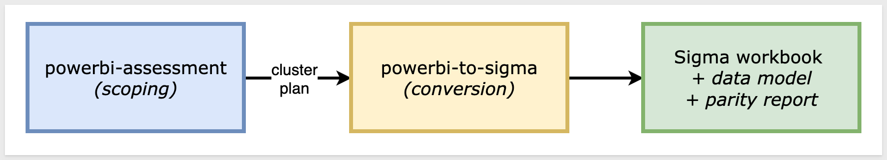

<aside class="positive">
<strong>WHY IT MATTERS:</strong><br> Each skill does one thing well — scoping and conversion. Pick the smallest set that fits your job, and don't run the conversion until you've confirmed the data is somewhere Sigma can actually read.
</aside>

### Which skill for your situation

Not every migration needs both skills. Use the table below to map your scenario to the smallest set that fits.

In this QuickStart we're in the first row (one report, data already in Snowflake), so only `powerbi-to-sigma` runs.

| Your situation | Skill(s) to use |
|----------------|-----------------|
| 1 report, data already in your warehouse | `powerbi-to-sigma` |
| 1 report, Import-mode model with no warehouse copy of the data | Land the data in your warehouse first (separate from these skills), then `powerbi-to-sigma` |
| 10+ reports (any data source) | `powerbi-assessment` → `powerbi-to-sigma` in batch mode |
| Auditing Power BI sprawl without converting yet | `powerbi-assessment` only |

<aside class="negative">
<strong>NOTE:</strong><br> As the skill runs, you'll see filenames and log lines that reference internal phase numbers (e.g., <code>phase6-parity-pbi.rb</code>). Those belong to the skill's own internal numbering — don't worry about matching them to this QuickStart's sections (<code>Run the Conversion</code>, <code>Discovering the Source</code>, <code>Building the Data Model</code>, <code>Building the Sigma Workbook</code>, <code>Verifying Data Parity</code>). The full mapping is documented in the skill's <code>SKILL.md</code>.
</aside>


<!-- END OF SECTION-->

## Install and Configure the Skill
Duration: 10

First we need to clone the skill's GitHub repository, then run the setup scripts that capture your Sigma and Power BI credentials.

The two skills live in `sigmacomputing/quickstarts-public` under [powerbi-migration-skills/](https://github.com/sigmacomputing/quickstarts-public/tree/main/powerbi-migration-skills).

From a terminal, run each command below one at a time so you can confirm each step before moving on.

<aside class="positive">
<strong>NOTE:</strong><br> <code>~</code> in the commands below is shell shorthand for your home folder — <code>/Users/&lt;you&gt;</code> on macOS, <code>/home/&lt;you&gt;</code> on Linux. So <code>~/quickstarts-public</code> resolves to a <code>quickstarts-public/</code> folder directly inside your home directory.
</aside>

**Step 1: Create a local folder for the clone**<br>
We'll clone into this folder in the next step.

```copy-code
mkdir -p ~/quickstarts-public
```

**Step 2: Move into the new folder** so the next command runs in the right working directory.

```copy-code
cd ~/quickstarts-public
```

**Step 3: Clone the repo without pulling any files yet**<br>
The `--sparse` flag tells Git you'll choose which folders to fill in next. The trailing `.` clones into the current folder.

```copy-code
git clone --filter=blob:none --sparse https://github.com/sigmacomputing/quickstarts-public.git .
```

**Step 4: Fill in only the powerbi-migration-skills folder**<br>
Every other QuickStart asset in the repo stays empty on disk.

```copy-code
git sparse-checkout set powerbi-migration-skills
```

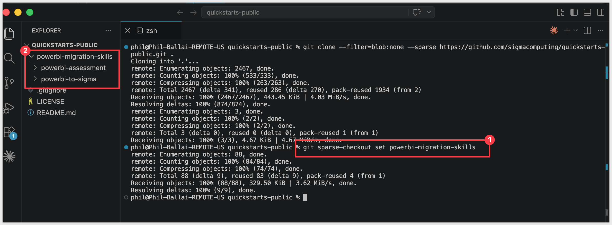

**Step 5: Symlink powerbi-to-sigma into the Claude skills folder**<br>
This lets Claude Code invoke `powerbi-to-sigma` as a skill.

```copy-code
ln -s ~/quickstarts-public/powerbi-migration-skills/powerbi-to-sigma ~/.claude/skills/powerbi-to-sigma
```

**Step 6: Symlink powerbi-assessment**<br>
Used to scope a Power BI tenant before conversion.

```copy-code
ln -s ~/quickstarts-public/powerbi-migration-skills/powerbi-assessment ~/.claude/skills/powerbi-assessment
```

Steps 5 and 6 should return with no error.


**Step 7: Install the Python dependencies the skill uses.**<br>
The skill calls Fabric and Power BI REST APIs from Python, including corporate-TLS handling for restricted networks.

<aside class="negative">
<strong>NOTE:</strong><br> The skill requires Python 3.10 or newer (the <code>truststore</code> package doesn't ship wheels for older interpreters). Check your version first with <code>python3 --version</code>. If it's older — macOS's stock Python is typically 3.9 — install a newer one via Homebrew and use it explicitly for the rest of this section: <code>brew install python@3.12</code>, then substitute <code>python3.12</code> wherever the steps below say <code>python3</code>. Avoid <code>pip3</code> as a shorthand — it can quietly resolve back to the old interpreter even after you install a new one.
</aside>

```copy-code
python3 -m pip install -r ~/.claude/skills/powerbi-to-sigma/scripts/requirements.txt
```

**Step 8: Capture your Sigma API credentials.**<br>
This script prompts for `SIGMA_BASE_URL`, `SIGMA_CLIENT_ID`, and `SIGMA_CLIENT_SECRET` and writes them into Claude's settings.

Run once per machine.

If you don't already have credentials, see [Configure API credentials in Sigma](https://help.sigmacomputing.com/sigma-computing/docs/configure-api-credentials-and-connectors-in-sigma) — the skill needs `API access` credentials, not embed.

```copy-code
ruby ~/.claude/skills/powerbi-to-sigma/scripts/setup.rb
```

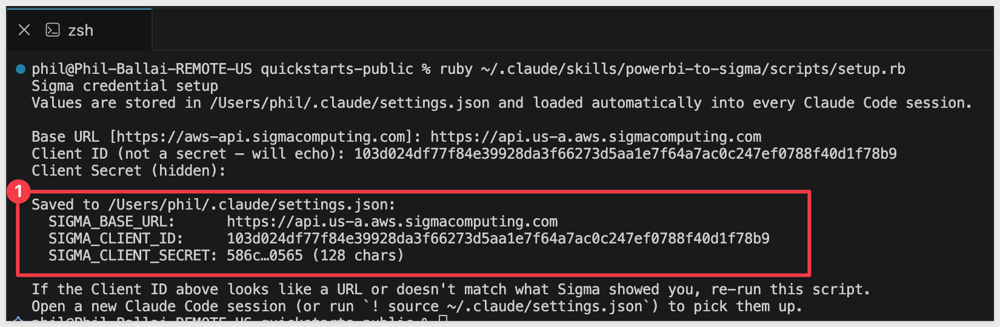

**Step 9: Authenticate with Power BI.**<br>
This script runs the device-code flow — it prints a Microsoft sign-in URL and a short code. 

```copy-code
python3 ~/.claude/skills/powerbi-to-sigma/scripts/fabric-auth-check.py
```

Open the URL in any browser, paste the code, and sign in with the account that owns the Power BI workspace you'll convert reports from.

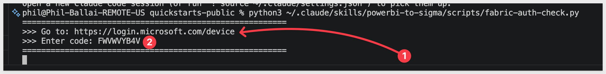

<aside class="positive">
<strong>NOTE:</strong><br> Power BI authentication uses Microsoft's well-known Power BI Desktop public client via device-code flow — no Entra app registration required. The token is cached at <code>/tmp/pbiauth/cache.bin</code> and lasts about an hour; the skill re-acquires it transparently when it expires.
</aside>

Once authenticated, terminal will show:

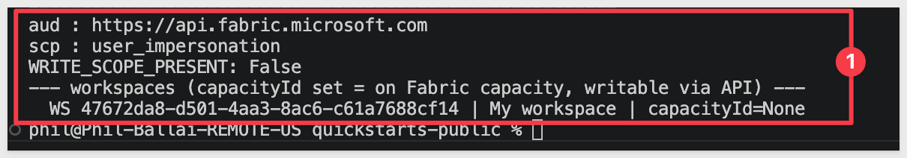

<aside class="negative">
<strong>NOTE:</strong><br> Two Microsoft API audiences are involved during conversion — Fabric (<code>api.fabric.microsoft.com</code>) for the model extraction and Power BI REST (<code>analysis.windows.net/powerbi</code>) for the parity check. The one device-code session acquires both. Corporate-network TLS interception is handled automatically by the <code>truststore</code> package installed in Step 7.
</aside>


**Step 10: Verify the install.**<br>
This lists every workspace and item visible to your signed-in account — confirms both Power BI authentication and the assessment skill's installation worked. The script writes its inventory to the path you pass in `--out`.

```copy-code
python3 ~/.claude/skills/powerbi-assessment/scripts/fabric-inventory.py --out /tmp/pbi-inventory.json
```

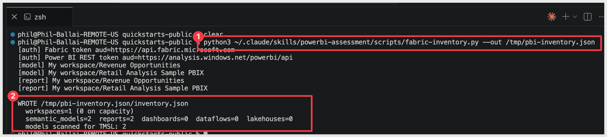

Then open the file to confirm:

```copy-code
cat /tmp/pbi-inventory.json/inventory.json
```

You should see at least your `My Workspace` listed. If you've already published reports there (such as the `Retail Analysis Sample PBIX` we'll set up in the next section), they'll show too:

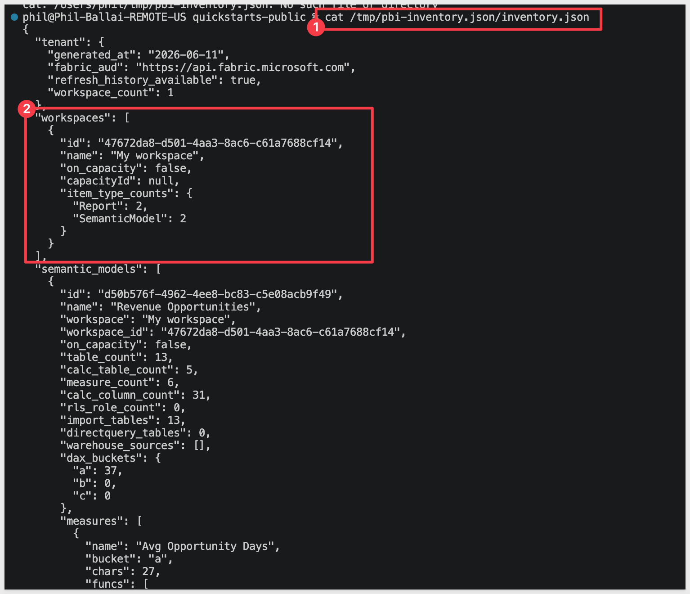

Verify Claude Code can invoke the skill by typing `claude` in your terminal to start Claude Code, then running:

```copy-code
claude
```

```copy-code
/powerbi-to-sigma
```

Claude should start reading the reference files and ask what report you want to convert.

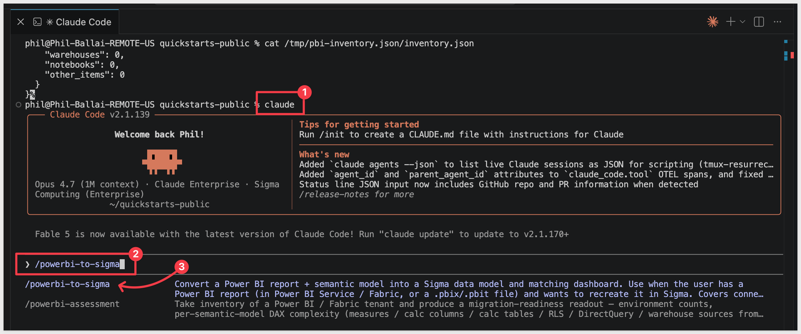

Pause at this response:

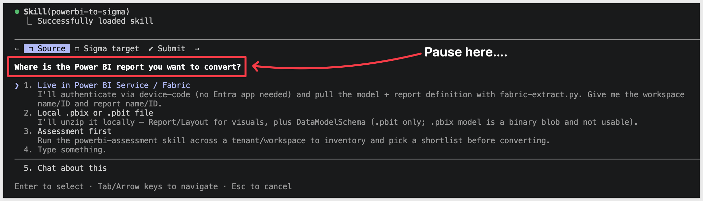

Before going any further, we need to prepare the data the report uses.


<!-- END OF SECTION-->

## Prepare the Demo Data
Duration: 10

<!--
SECTION INTENT (prose-pass pending)
- Demo dataset: Microsoft's Retail Analysis sample (https://learn.microsoft.com/en-us/power-bi/create-reports/sample-retail-analysis).
- Pattern mirrors the Tableau QS: Snowflake DDL + load + sanity-check row counts.
- For the Power BI side: reader downloads the .pbix and uploads it to a Fabric / Power BI workspace they own. The skill will extract TMSL + PBIR from there during the conversion run.
- For the Sigma side (this section): land the same data in Snowflake so parity has a comparable target.
- Load options:
    1. PUT to Snowflake internal stage (works without public hosting; respects obviEnce sample license).
    2. Pre-staged CSVs in s3://sigma-quickstarts-main/ — needs license review before publish.
- Mac-only readers can't open the .pbix in Power BI Desktop to upgrade to the modern metadata format, so the in-Service DAX query view + executeQueries REST API both refuse to query the model. Workaround = the pbixray Python library reads the .pbix binary directly and exports both schema and CSV row data. Worth a short callout box.
-->

Data prep has two halves:

1. **Power BI side** — download the Retail Analysis `.pbix` (a copy of Microsoft's [obviEnce-licensed sample](https://learn.microsoft.com/en-us/power-bi/create-reports/sample-retail-analysis), mirrored to a stable Sigma URL) and upload it to your own Fabric / Power BI workspace. The skill reads TMSL + PBIR from that published model during the conversion run.

<button>[Download the .pbix file](https://sigma-quickstarts-main.s3.us-west-1.amazonaws.com/powerbi/Retail+Analysis+Sample+PBIX.pbix)</button>

2. **Sigma side (this section)** — the same data needs to live in a warehouse Sigma can read. We'll land it in Snowflake.

The Snowflake schema below mirrors the Power BI model's five user-facing tables — `District`, `Item`, `Sales`, `Store`, and `Time` — plus the relationships the model declares between them. The Power BI auto-date plumbing tables (`DateTableTemplate_*`, `LocalDateTable_*`) are omitted: Sigma derives date hierarchies natively, so they translate without a backing warehouse table.

```copy-code
USE ROLE ACCOUNTADMIN;
USE WAREHOUSE COMPUTE_WH;

CREATE DATABASE IF NOT EXISTS QUICKSTARTS;
CREATE SCHEMA  IF NOT EXISTS QUICKSTARTS.POWERBI_RETAIL_ANALYSIS;
USE SCHEMA QUICKSTARTS.POWERBI_RETAIL_ANALYSIS;

-- CSV format and external stage pointing at the public S3 bucket.
CREATE OR REPLACE FILE FORMAT csv_format
  TYPE = CSV
  FIELD_DELIMITER = ','
  SKIP_HEADER = 1
  FIELD_OPTIONALLY_ENCLOSED_BY = '"'
  NULL_IF = ('NULL', 'null', '');

CREATE OR REPLACE STAGE retail_analysis_stage
  URL = 's3://sigma-quickstarts-main/powerbi/'
  FILE_FORMAT = csv_format;

-- Snake_case_UPPER is the converter's canonical warehouse naming convention,
-- so we use it here. The Power BI model uses CamelCase / spaces in its
-- column names — when the skill asks how the warehouse maps to the PBI model,
-- we'll provide an explicit rename block that bridges the two cleanly (see the
-- "Run the Conversion" section). This avoids the converter's unhappy path
-- with camelCase-no-underscore warehouse columns.

-- Dimension: District (9 rows)
CREATE OR REPLACE TABLE DISTRICT (
  DISTRICT_ID       NUMBER(38,0),
  DISTRICT          VARCHAR,
  DM                VARCHAR,
  DM_PIC_FL         VARCHAR,
  DM_PIC            VARCHAR,
  BUSINESS_UNIT_ID  NUMBER(38,0)
);

-- Dimension: Item (364,184 rows). FAMILY_NANE preserves the typo in the
-- source model — the rename list in "Run the Conversion" maps it through.
CREATE OR REPLACE TABLE ITEM (
  ITEM_ID      NUMBER(38,0),
  SEGMENT      NUMBER(38,0),
  CATEGORY     VARCHAR,
  BUYER        VARCHAR,
  FAMILY_NANE  NUMBER(38,0)
);

-- Fact: Sales (923,371 rows). REPORTING_PERIOD_ID is a Power BI calculated
-- column ([MonthID]&"01") materialized in the CSV export, stored here as a
-- regular column rather than recomputed in Sigma.
CREATE OR REPLACE TABLE SALES (
  MONTH_ID                     NUMBER(38,0),
  ITEM_ID                      NUMBER(38,0),
  LOCATION_ID                  NUMBER(38,0),
  SUM_GROSS_MARGIN_AMOUNT      NUMBER(19,4),
  SUM_REGULAR_SALES_DOLLARS    NUMBER(19,4),
  SUM_MARKDOWN_SALES_DOLLARS   NUMBER(19,4),
  SCENARIO_ID                  NUMBER(38,0),
  REPORTING_PERIOD_ID          NUMBER(38,0),
  SUM_REGULAR_SALES_UNITS      NUMBER(19,4),
  SUM_MARKDOWN_SALES_UNITS     NUMBER(19,4)
);

-- Dimension: Store (104 rows). The last five columns (CITY, OPEN_YEAR,
-- STORE_TYPE, OPEN_MONTH_NO, OPEN_MONTH) are Power BI calculated columns
-- materialized in the CSV export.
CREATE OR REPLACE TABLE STORE (
  LOCATION_ID         NUMBER(38,0),
  CITY_NAME           VARCHAR,
  TERRITORY           VARCHAR,
  POSTAL_CODE         VARCHAR,
  OPEN_DATE           DATE,
  SELLING_AREA_SIZE   NUMBER(38,0),
  DISTRICT_NAME       VARCHAR,
  NAME                VARCHAR,
  STORE_NUMBER_NAME   VARCHAR,
  STORE_NUMBER        NUMBER(38,0),
  CITY                VARCHAR,
  CHAIN               VARCHAR,
  DM                  VARCHAR,
  DM_PIC              VARCHAR,
  DISTRICT_ID         NUMBER(38,0),
  OPEN_YEAR           NUMBER(38,0),
  STORE_TYPE          VARCHAR,
  OPEN_MONTH_NO       NUMBER(38,0),
  OPEN_MONTH          VARCHAR
);

-- Dimension: Time (734 rows). MONTH parses from "YYYY-MM-DD" date strings.
CREATE OR REPLACE TABLE TIME (
  REPORTING_PERIOD_ID  NUMBER(38,0),
  PERIOD               NUMBER(38,0),
  FISCAL_YEAR          NUMBER(38,0),
  FISCAL_MONTH         VARCHAR,
  MONTH                DATE
);

-- Load each CSV from S3.
COPY INTO DISTRICT FROM @retail_analysis_stage/District.csv;
COPY INTO ITEM     FROM @retail_analysis_stage/Item.csv;
COPY INTO SALES    FROM @retail_analysis_stage/Sales.csv;
COPY INTO STORE    FROM @retail_analysis_stage/Store.csv;
COPY INTO TIME     FROM @retail_analysis_stage/Time.csv;

-- Grant Sigma's service role visibility on the new schema and its tables.
-- Substitute SIGMA_SERVICE_ROLE with the role your Sigma connection actually
-- uses if it differs — you can confirm it in Sigma under Administration >
-- Connections by clicking your Snowflake connection.
GRANT USAGE  ON DATABASE QUICKSTARTS                                       TO ROLE SIGMA_SERVICE_ROLE;
GRANT USAGE  ON SCHEMA   QUICKSTARTS.POWERBI_RETAIL_ANALYSIS               TO ROLE SIGMA_SERVICE_ROLE;
GRANT SELECT ON ALL    TABLES IN SCHEMA QUICKSTARTS.POWERBI_RETAIL_ANALYSIS TO ROLE SIGMA_SERVICE_ROLE;
GRANT SELECT ON FUTURE TABLES IN SCHEMA QUICKSTARTS.POWERBI_RETAIL_ANALYSIS TO ROLE SIGMA_SERVICE_ROLE;

-- Sanity-check the row counts. Expected: 9 / 364,184 / 923,371 / 104 / 734.
SELECT 'DISTRICT' AS table_name, COUNT(*) AS row_count FROM DISTRICT UNION ALL
SELECT 'ITEM',     COUNT(*) FROM ITEM     UNION ALL
SELECT 'SALES',    COUNT(*) FROM SALES    UNION ALL
SELECT 'STORE',    COUNT(*) FROM STORE    UNION ALL
SELECT 'TIME',     COUNT(*) FROM TIME;
```

<aside class="positive">
<strong>NOTE:</strong><br> The Power BI model declares four foreign-key relationships:<br>
<code>Store.DistrictID</code>→<code>District.DistrictID</code><br> 
<code>Sales.LocationID</code>→<code>Store.LocationID</code><br>
<code>Sales.ItemID</code>→<code>Item.ItemID</code><br>
<code>Sales.ReportingPeriodID</code>→<code>Time.ReportingPeriodID</code><br> 

We don't enforce them in Snowflake DDL (Snowflake foreign keys are informational, not enforced anyway) — the skill reads the joins from the TMSL and reproduces them in the Sigma data model.
</aside>

If the load completes cleanly, the sanity-check query at the bottom should return the five rows shown in its comment. Mismatched row counts mean either a `COPY` partial-load error (check Snowflake's load history) or a different S3 file than expected:

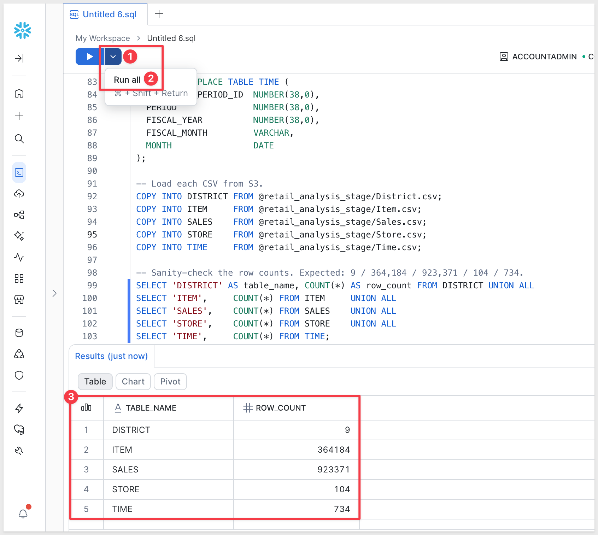

<aside class="positive">
<strong>NOTE:</strong><br> The data above originates from Microsoft's obviEnce-licensed sample. Per the sample's redistribution terms, any visualization built on it should carry an `obviEnce ©` attribution — Sigma's QuickStart honors that in the published page footer.
</aside>


<!-- END OF SECTION-->

## Prepare the Sigma Target Folder
Duration: 2

The converter needs a Sigma folder to land the new data model and workbook in. The skill will ask for the folder's UUID during the next section — it will be easier to have it ready.

To keep this simple, we will use a plain folder and not a workspace.

**Step 1: Create (or pick) a folder in Sigma.**<br>
Open your Sigma org, navigate to where you want the migrated workbook to live, and create a folder for it. Something like:

```copy-code
Power BI Migration Demo
```

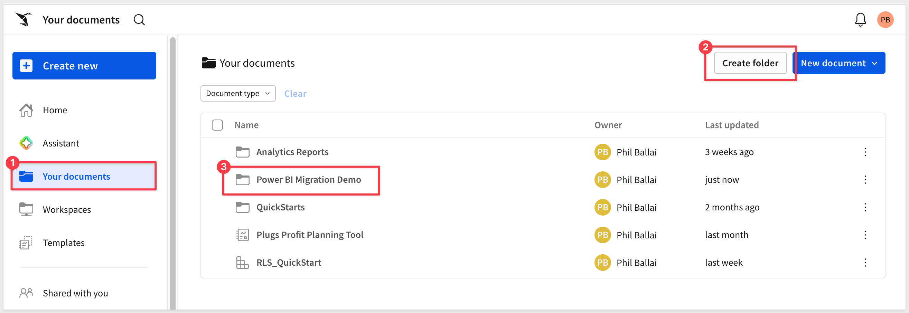

**Step 2: Grab the folder ID.**<br>
Open the folder. The ID is the last segment of the URL — a short alphanumeric string, roughly 22 characters, that looks like `2qZRhR1BTyGsdDr2JoZrOa`. Copy it from the address bar and keep it on the clipboard for the next section.

<!-- <aside class="positive">
<strong>NOTE:</strong><br> The skill's prompt asks for the folder "UUID" — Sigma's URL actually uses a shorter base62-style ID rather than a 36-character UUID. Paste the value from the URL exactly as it appears; the skill accepts that form directly.
</aside> -->

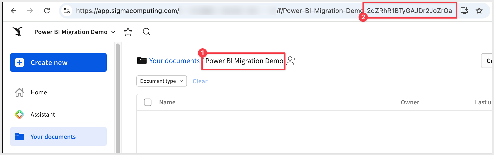

<aside class="positive">
<strong>NOTE:</strong><br> If you'd rather not create a fresh folder, you can also point the skill at an existing data model in your org — it'll harvest the <code>folderId</code> from that DM and reuse it. Useful if you want the Power BI conversion to land next to a sibling workbook you already trust.
</aside>


<!-- END OF SECTION-->

## Provide the Source and Target Inputs
Duration: 3

At the end of the previous section we left Claude asking `Where is the Power BI report we want to convert`:


Choose option `1. Live in Power BI Service / Fabric`.

Claude then asks `Where should the converted data model + workbook land in Sigma?`:

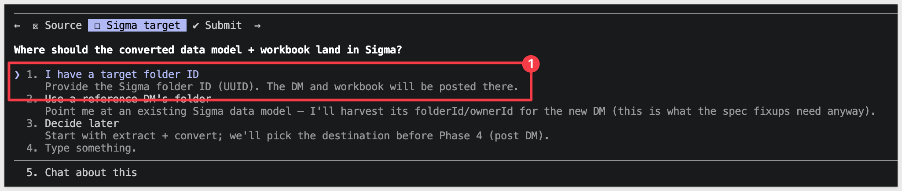

Choose option `1. I have a target folder ID`.

Claude asks that we confirm our answers; select `1. Submit answers`.

Now Claude needs some details:

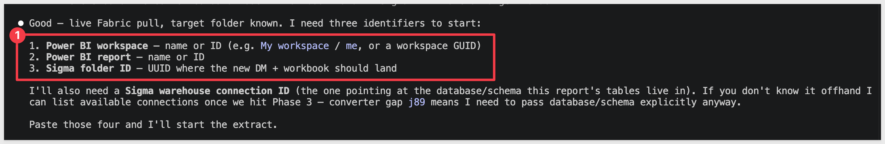

Three values, one line each:

- **Power BI workspace** — the name (`My workspace`) or its GUID. The shortcut `me` also resolves to your personal workspace.
- **Power BI report** — the report's name as it appears in your workspace.
- **Sigma folder ID** — the folder ID you grabbed in the previous section.

For this demo:

```copy-code
Power BI workspace: My workspace
Power BI report: Retail Analysis Sample PBIX
Sigma folder ID: <paste the ID you copied earlier>
```

Once submitted, Claude kicks off the conversion.


<!-- END OF SECTION-->

## Map the Warehouse to Power BI
Duration: 5

Before any extraction runs, the skill examines the source to confirm Sigma will have something it can actually read.

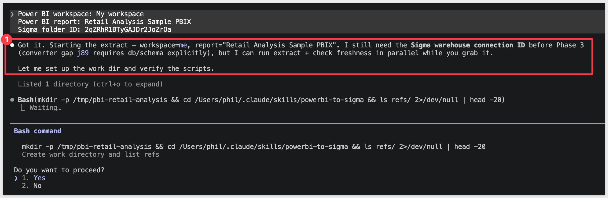

<aside class="negative">
<strong>NOTE:</strong><br> From here on, Claude Code asks for approval on every bash command the skill runs — and a full conversion fires dozens of them. 
<br>
For each prompt, pick option <code>2. Yes, and don't ask again</code> so Claude Code remembers that command pattern. After the first handful of approvals the prompts stop coming.

Alternatively, press <code>Shift+Tab</code> once to switch to accept-edits mode for the rest of the session — fine for a trusted skill like this one, just don't use it for unknown code.
</aside>

For the Retail Analysis sample, the data is embedded inside the `.pbix` (Import mode, base64 mashup blobs — no warehouse behind it), so the skill pauses to ask how to proceed:

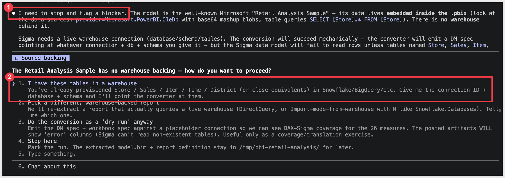

<aside class="positive">
<strong>WHY IT MATTERS:</strong><br> Rather than silently produce a Sigma data model pointing at a non-existent warehouse, the skill stops and surfaces the gap. Genuine decisions stay with you; mechanical work runs autonomously.
</aside>

We landed the same data in Snowflake during `Prepare the Demo Data` exactly for this moment.

Pick option `1. I have these tables in a warehouse`.

Claude then asks for your Sigma warehouse connection ID — the UUID of the Snowflake connection that points at the `QUICKSTARTS` database we loaded earlier.

Find it in Sigma under `Administration` > `Connections` (or from the homepage), click your Snowflake connection, and copy the ID and save it off to text for now.

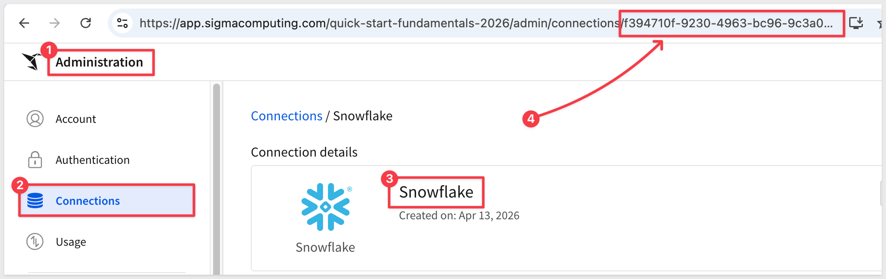

Select `1. I'll paste the connection UUID`.

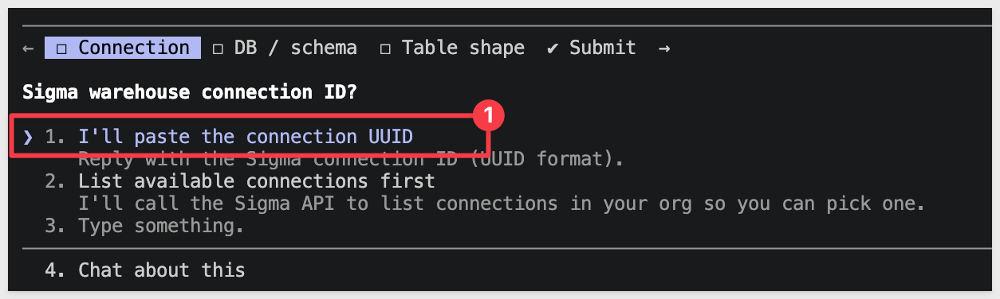

Claude also wants the database and schema:

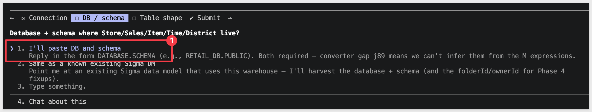

We created these earlier:

```copy-code
Database: QUICKSTARTS
Schema: POWERBI_RETAIL_ANALYSIS
```

Provide these to Claude.

Select `1. I'll paste DB and schema`.

Claude also wants to know `Are the warehouse table + column names identical to the PBI model`. The tables match (`DISTRICT`, `ITEM`, `SALES`, `STORE`, `TIME` line up case-insensitively with PBI's `District`, `Item`, `Sales`, `Store`, `Time`), but the columns differ — our Snowflake DDL uses snake_case_UPPER (the converter's canonical warehouse naming), while the Power BI model uses CamelCase and a few names with spaces.

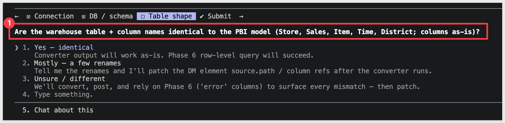

Select `2. Mostly — a few renames`. When Claude prompts for the rename list, paste this block:

```copy-code
District.DistrictID -> DISTRICT_ID
District.BusinessUnitID -> BUSINESS_UNIT_ID
Item.ItemID -> ITEM_ID
Item.FamilyNane -> FAMILY_NANE
Sales.MonthID -> MONTH_ID
Sales.ItemID -> ITEM_ID
Sales.LocationID -> LOCATION_ID
Sales.Sum_GrossMarginAmount -> SUM_GROSS_MARGIN_AMOUNT
Sales.ScenarioID -> SCENARIO_ID
Sales.ReportingPeriodID -> REPORTING_PERIOD_ID
Store.LocationID -> LOCATION_ID
Store.City Name -> CITY_NAME
Store.PostalCode -> POSTAL_CODE
Store.OpenDate -> OPEN_DATE
Store.SellingAreaSize -> SELLING_AREA_SIZE
Store.DistrictName -> DISTRICT_NAME
Store.StoreNumberName -> STORE_NUMBER_NAME
Store.StoreNumber -> STORE_NUMBER
Store.DistrictID -> DISTRICT_ID
Store.Open Year -> OPEN_YEAR
Store.Store Type -> STORE_TYPE
Store.Open Month No -> OPEN_MONTH_NO
Store.Open Month -> OPEN_MONTH
Time.ReportingPeriodID -> REPORTING_PERIOD_ID
Time.FiscalYear -> FISCAL_YEAR
Time.FiscalMonth -> FISCAL_MONTH
```

<aside class="positive">
<strong>WHY IT MATTERS:</strong><br> Providing the rename list upfront drops the converter onto its canonical-warehouse happy path. Without it, the converter has to discover the mismatches at POST time and patch iteratively — which works, but adds rounds of trial-and-error before the data model lands cleanly.
</aside>

Review and choose `1. Submit answers`.


<!-- END OF SECTION-->

## Bootstrap the Converter
Duration: 7

With the warehouse pointer in place, the skill works autonomously through these phases, asking for permission from time to time:

**1. Extract** the semantic model (TMSL) and report layout (PBIR) from Fabric.<br>
**2. Translate** the DAX measures into Sigma formulas — buckets each measure as mechanical, restructure-needed, or escalation.<br>
**3. Build the Sigma data model** by posting the spec to your target folder.<br>
**4. Build the Sigma workbook** — pages, visuals, and layout mirror the Power BI report.<br>
**5. Verify parity** by running every measure through Power BI's `executeQueries` API and comparing to Sigma's results.

During Phase 3, Claude detects that the converter MCP hasn't been set up yet and pauses at a gate:

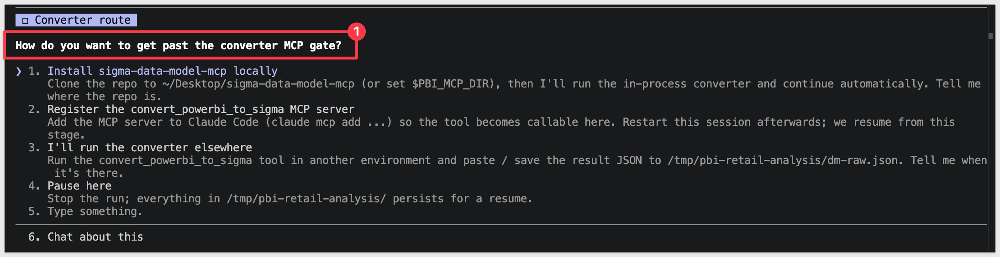

Select `6. Chat about this` and instruct Claude how to handle it:

```copy-code
Clone twells89/sigma-data-model-mcp into ~/Desktop/sigma-data-model-mcp for me, then come back to the MCP gate and pick option 1.
```

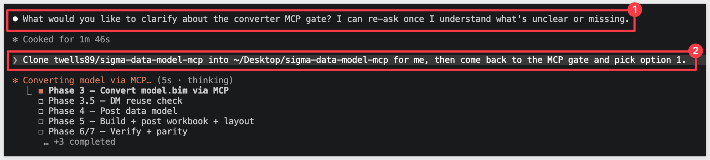

The task processing resumes.

Before building from the freshly-cloned MCP, the skill checks the repo's commit age against a 3-day-stability rule and may pause to ask which commit to build:

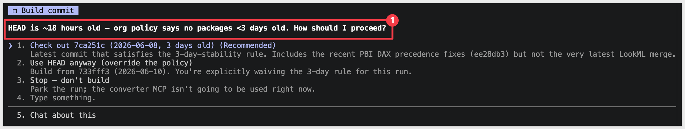

Pick the `(Recommended)` option — it's the most recent commit at least three days old, so it's had time to settle. The skill notes which patches the commit does and doesn't include in its description text.

<aside class="positive">
<strong>WHY IT MATTERS:</strong><br> The skill won't silently build off whatever just landed. Conversion runs touch real Sigma workspaces, so the skill defaults to a commit that's had time to be exercised — and surfaces the choice instead of hiding it.
</aside>

Once the Data Model build is done, we see:

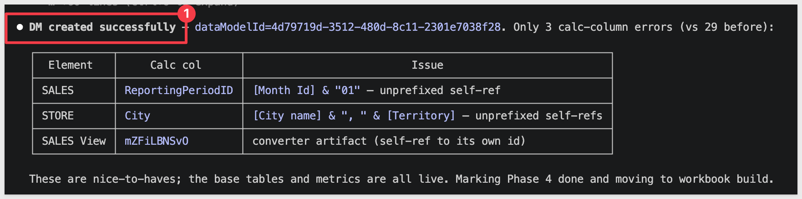

In Sigma, we can click into the new model, which is stored in the `Your documents` > `Power BI Migration Demo` folder we requested:

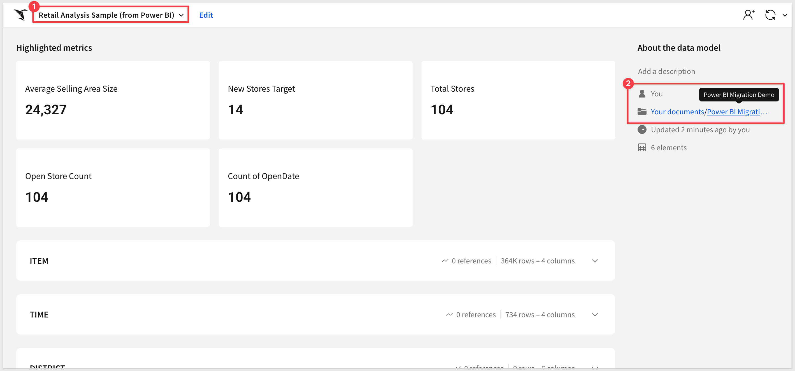

If prompted by Claude, proceed with the workbook build (Phase 4). After that the parity verification runs (Phase 5) and the conversion completes.


<!-- END OF SECTION-->

## Workbook Summary
Duration: 5

After the data model lands but before any workbook visuals get built, the skill pauses to summarize what it could and couldn't translate from the Power BI report. For the Retail Analysis sample, the readout looks like this:

<!--  -->

Four resolved-field buckets, each with a status:

| Resolved fields | Status |
|-----------------|--------|
| 6 dimensions (`Store.Name`, `Item.Category`, `Time.FiscalMonth`, etc.) | ✅ |
| 2 working metrics (`Store.Total Stores`, `Store.New Stores`) | ✅ |
| 5 time-intelligence measures (`Sales.This Year`, `Last Year`, `Variance %`, `Avg $/Unit TY`) | ❌ converter dropped them — `CALCULATE` + filter-context translation gap |
| 5 `select`/`select1..4` placeholders | ❌ classic PBI report format — `extract-pbir` couldn't resolve column bindings |

For the Retail Analysis sample, that adds up to about 10 of 24 visuals landing broken — the ones that depend on the unresolved measures and placeholders.

The skill then asks how to proceed:

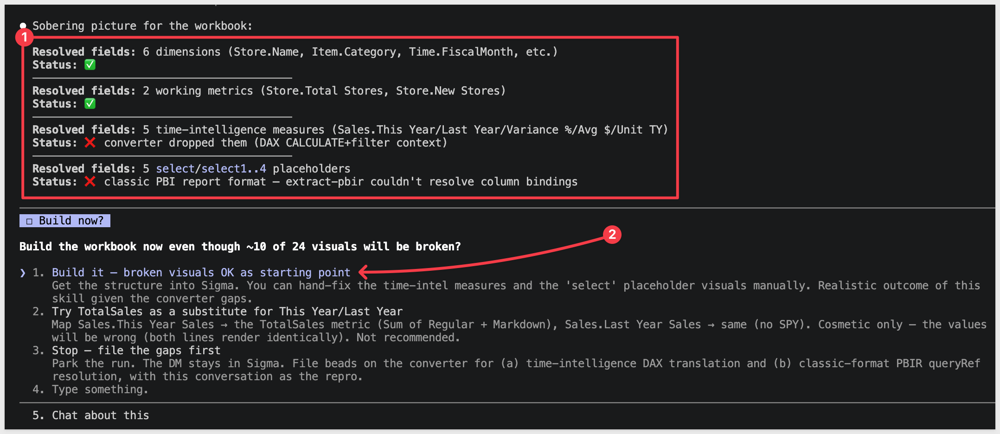

Pick option `1. Build it — broken visuals OK as starting point`. 

The data model and the visuals that *do* work land in Sigma; the unresolved measures and placeholders become a documented gap to fill manually.

<aside class="positive">
<strong>WHY IT MATTERS:</strong><br> A first-pass automated migration rarely produces 100% working visuals — and the skill is honest about that instead of silently emitting broken specs. You get a working starting point, a per-field breakdown of what worked, and an exact list of what to fix by hand. That's a much better posture than "looks fine, ship it" with hidden gaps you only discover when stakeholders ask why the numbers are wrong.
</aside>

<aside class="negative">
<strong>NOTE:</strong><br> The Retail Analysis sample's "Last Year" comparisons aren't true DAX time-intelligence (no <code>SAMEPERIODLASTYEAR</code>) — they're <code>CALCULATE</code> with a <code>ScenarioID = 2</code> filter against prior-year rows in the fact table.<br>

This is a common real-world pattern but it's currently in the converter's gap list. Worth filing upstream so future runs translate it automatically.
</aside>

Once done, the skill produces a summary with `Gaps worth filling` too:

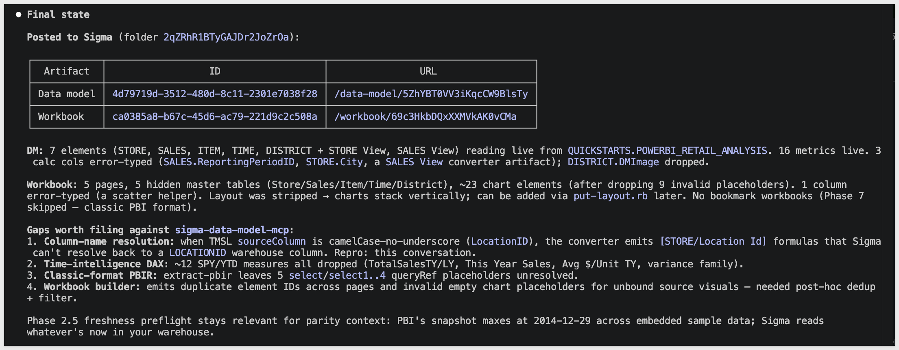

In Sigma, we can see the new workbook in the folder with our data model:

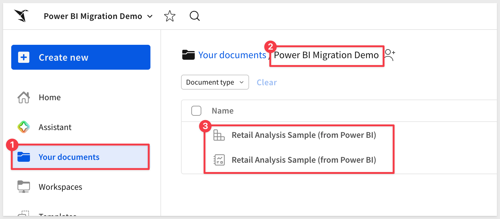


<!-- END OF SECTION-->

## Suggested Next Steps
Duration: 3

<!--
SECTION INTENT
- After the conversion completes: what to review, what to ship, what to escalate.
- Tie back to the bucket summary — (a) ships as-is, (b) review the proposed translation, (c) escalate.
-->


<!-- END OF SECTION-->

## Verifying Data Parity
Duration: 10

<!--
SECTION INTENT
- Phase 4: phase6-parity-pbi.rb runs the original measures via Power BI executeQueries (DAX) and compares to Sigma query results.
- GREEN only when DAX results match Sigma.
- Walk through a passing parity report + an intentionally-failing one (e.g., wrong filter context) so readers see both outcomes.
- assert-phase6-ran.rb is the hard gate that proves parity was actually executed.
- Note: parity is against what Power BI returns, not against the underlying warehouse — so Import vs DirectQuery doesn't break the check.
-->


<!-- END OF SECTION-->

## Scaling Up — Batch Conversion
Duration: 5

<!--
SECTION INTENT
- The companion powerbi-assessment skill: scoping for batch migrations.
- Per-report DAX bucket distribution, visual histogram, RLS/DirectQuery flags, warehouse sources, ranked shortlist.
- Migration plan clusters reports by shared semantic model so one Sigma DM serves the whole family.
- HTML readout (render-readout-html.rb) — Sigma-branded, share-friendly, includes token / cost estimate (Opus + Sonnet).
- Hand-off pattern: assessment shortlist + cluster plan -> powerbi-to-sigma batch mode.
-->


<!-- END OF SECTION-->

## Common Issues and Fixes
Duration: 5

<!--
SECTION INTENT
- Device-code login expired -> rerun fabric-auth-check.py.
- Corporate TLS interception -> truststore.inject_into_ssl() handles it; if still failing, point at the proxy CA bundle.
- PBIR vs classic report.json -> skill auto-detects; manual override flag if needed.
- Spec fixups missed -> three required edits (schemaVersion: 1, real folderId, element name).
- DAX measure in bucket (b) with no learned rule -> gap-scout proposes a translation; can opt-in file a GitHub issue.
- Sigma connection doesn't reach the same warehouse -> parity will fail; check connection scope.
- "Data model has error columns" -> usually a type mismatch between the TMSL column type and the warehouse column type; resolve in the spec.
-->


<!-- END OF SECTION-->

## What We've Covered
Duration: 5

<!--
SECTION INTENT (write last)
- Not a checklist of steps. A narrative on what was built, why it matters, and what techniques are reusable.
- Highlight the reusable building blocks: extract-translate-build-verify pattern; warehouse-as-source-of-truth; DAX bucketing; data-model reuse; gap-scout for handling (b)/(c) tail.
- Soft-sell Sigma's value: one source of truth, no rebuild loop, parity-checked migration.
-->

**Additional Resource Links**

[Blog](https://www.sigmacomputing.com/blog/)<br>
[Community](https://community.sigmacomputing.com/)<br>
[Help Center](https://help.sigmacomputing.com/hc/en-us)<br>
[QuickStarts](https://quickstarts.sigmacomputing.com/)<br>

Be sure to check out all the latest developments at [Sigma's First Friday Feature page!](https://quickstarts.sigmacomputing.com/firstfridayfeatures/)
<br>

[](https://twitter.com/sigmacomputing)&emsp;
[](https://www.linkedin.com/company/sigmacomputing)&emsp;
[](https://www.facebook.com/sigmacomputing)


<!-- END OF WHAT WE COVERED -->
<!-- END OF QUICKSTART -->
