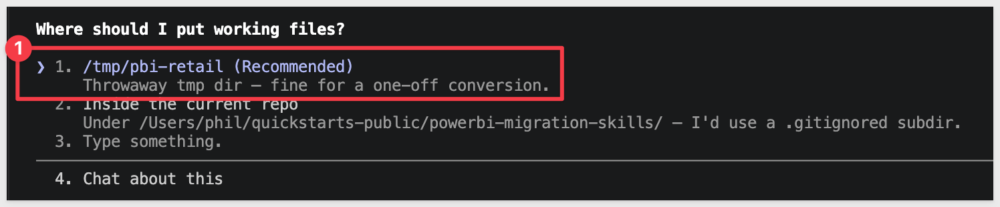
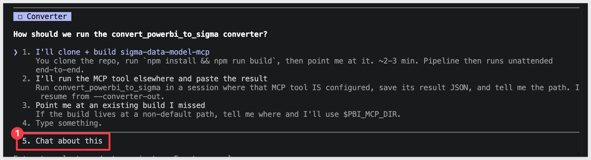
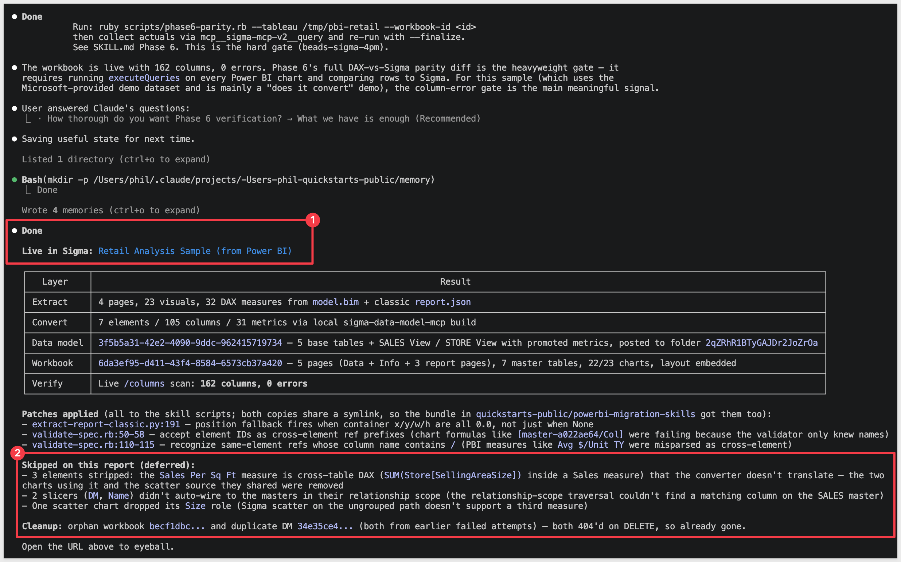
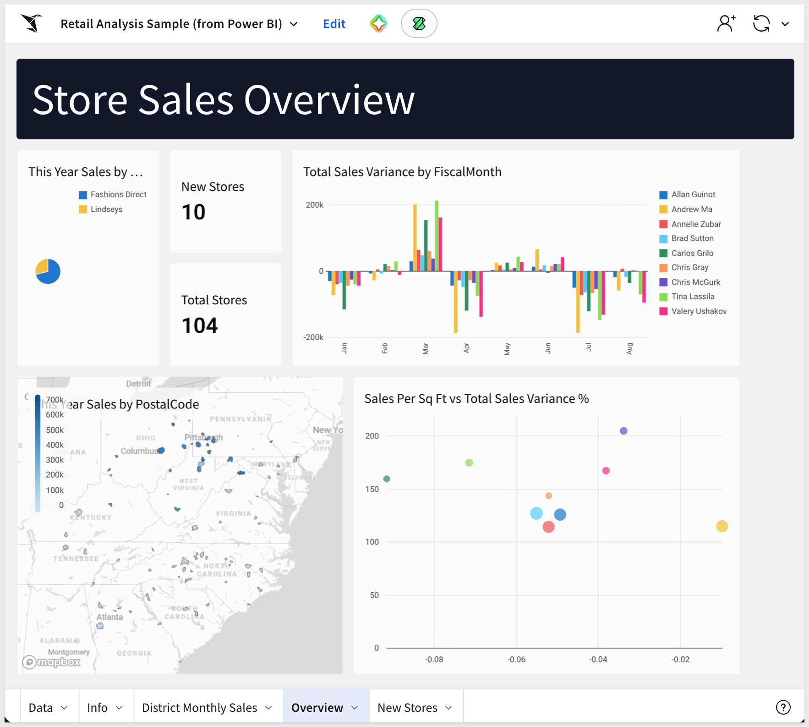

author: pballai
id: developers_migrating_power_bi_made_easy
summary: developers_migrating_power_bi_made_easy
categories: migrations
environments: web
status: Published
feedback link: https://github.com/sigmacomputing/sigmaquickstarts/issues
tags: default
lastUpdated: 2026-07-01

# Migrating From Power BI Made Easy

## Overview
Duration: 5

A common ask from teams evaluating Sigma is migrating their Power BI footprint — usually to take advantage of all the amazing things Sigma offers. The conversion itself can be a blocker — and the part this QuickStart automates.

The usual Power BI-to-Sigma migration loop is rebuild-the-semantic-model-by-hand, rewrite every DAX measure, relay each page, eyeball the numbers against the source, hope nothing drifted in the translation. Done on a single report it's tedious. Across an entire workspace can be the reason migration projects slip.

This QuickStart walks through a `Claude Code` skill called `powerbi-to-sigma` that automates the loop.

Point it at a Power BI report; it extracts the semantic model and report layout from Fabric (PBIR or the older single-file format), translates the DAX measures into Sigma formulas, builds (or reuses) a Sigma data model from the warehouse tables behind the model, and lays the workbook out to mirror the source. It then runs a verification pass to confirm every column reference in the Sigma model resolves cleanly against the live warehouse, and surfaces a punch list of anything it couldn't auto-translate — instead of silently producing a broken workbook.

For the demonstration, we'll run the skill end-to-end against a sample Power BI report on a Fabric workspace. You'll see the artifacts each phase produces, the DAX-translation breakdown the converter hands back, the verification report against the live warehouse, and the resulting Sigma data model and workbook landed in your org — along with the gap list of items to hand-polish.

<aside class="positive">
<strong>WHY IT MATTERS:</strong><br> The skill runs the whole conversion — extract, translate, build, verify — and finishes with a documented parity check. The result is a working Sigma workbook on the warehouse plus the report that proves it matches the Power BI source, instead of a rebuilt-by-hand report you have to spot-check yourself.
</aside>

### What else this enables

A pure lift-and-shift is the floor, not the ceiling. The same skill family supports three follow-on moves that turn a migration into an upgrade:

- **Dedup before you migrate.** Most BI estates carry years of dashboard sprawl — multiple near-identical dashboards built by different teams over time. The assessment skill flags dashboards that are roughly 90% the same and recommends merging them before conversion. You move 200 dashboards instead of 800, and every downstream conversation is simpler. Pair this with the usage data the assessment pulls (who views what, how often) and you can confidently retire cold content rather than carry it forward.

- **Enhance, don't just translate.** Many "dashboards" in legacy tools are really input-driven workflows in disguise — a dashboard whose data is refreshed by uploading a CSV each morning is actually a forecasting app waiting to happen. After the lift-and-shift, the skill can suggest replacing those patterns with native Sigma constructs: input tables for write-back, Sigma Assistant for natural-language analysis, scheduled agents for routine summaries. The result isn't "the old dashboard, in a new tool" — it's "the workflow, finally done right."

- **Audit your source as a side effect.** The parity check that closes the run isn't just a confidence test on the migration — it's a fresh pair of eyes on the source platform's math. Sigma customers have caught multi-year calculation errors during their first migration run because the parity gate flagged a Sigma vs source mismatch and the source turned out to be wrong. Plan the migration as your final audit of the legacy system.

<aside class="negative">
<strong>NOTE:</strong><br> The migration is one-directional — Power BI is the source, Sigma is the target. Sigma reads the warehouse live; Power BI may be reading an in-memory <code>Import</code> model rather than the warehouse directly, so live-vs-import drift is expected. The skill handles it by running the parity check through Power BI's own <code>executeQueries</code> API, so the comparison is always against what Power BI itself returns.
</aside>

<aside class="negative">
<strong>AI MODEL DIFFERENCES:</strong><br> Depending on which AI, model, and version you're running, the exact prompt wording, option ordering, and intermediate messages may differ slightly from what's shown in this QuickStart. The substantive steps and decisions are the same — pick the option that matches the intent described, even if the label varies.
</aside>

### Target Audience
Sigma SEs, technical CSMs, and migration partners running Power BI-to-Sigma conversions — or scoping a batch migration with the companion `powerbi-assessment` skill.

### Prerequisites
- `Claude Code` installed (CLI or desktop).
- Sigma API credentials.
- Power BI / Fabric access with permission to read the target workspace. You do **not** need to register an Entra app — the skill authenticates via device-code flow using the well-known Power BI Desktop public client.
- `Python 3.10` or newer with the `msal` and `truststore` packages (the skill installs them via `requirements.txt`). macOS's stock system Python is typically 3.9 — older than the skill needs. If `python3 --version` reports anything below 3.10, install a newer interpreter via [Homebrew](https://brew.sh/) (`brew install python@3.12`) or [python.org](https://www.python.org/downloads/).
- `Node.js` (any recent LTS) for building the converter MCP. The conversion uses a separate MCP server, [`sigma-data-model-mcp`](https://github.com/twells89/sigma-data-model-mcp), cloned + built (`npm install && npm run build`) into `~/Desktop/sigma-data-model-mcp`. The skill prompts you to install it mid-conversion — no upfront work needed — but pre-build it if you'd rather skip the gate.
- A Power BI report you're authorized to convert. Power BI Desktop alone won't work — the skill reads through Fabric's REST APIs, which require a published report in a Fabric workspace (including `My workspace`).
- The warehouse tables behind the Power BI model must be reachable from a Sigma connection (Snowflake, BigQuery, Databricks, Redshift, Postgres and others).

<aside class="negative">
<strong>NOTE:</strong><br> Use a non-production Sigma org for your first run. The skill creates real workbooks, and error-recovery paths may iterate via PUT to update them.
</aside>

<button>[Sigma Free Trial](https://www.sigmacomputing.com/free-trial/)</button>


<!-- END OF SECTION-->

## The Power BI Migration Skill Family
Duration: 5

`powerbi-to-sigma` is one of two skills that ship together as a single repo (cloned in the next section). Most of this QuickStart focuses on the converter — but knowing where the assessment skill fits saves dead ends later when scoping a batch migration.

| Skill | Role | When to reach for it |
|-------|------|----------------------|
| `powerbi-assessment` | Scoping | Auditing a Fabric tenant before committing to a conversion plan. Emits a per-report DAX complexity readout, a ranked migration shortlist, and a cluster plan that `powerbi-to-sigma` can consume in batch mode. |
| `powerbi-to-sigma` | Conversion | The subject of this QuickStart. Converts a single report (or a batch via cluster plan) to a Sigma workbook with verified data parity. |

Here's how the two skills connect in a full migration — `powerbi-assessment` hands the converter a ranked shortlist and cluster plan, and `powerbi-to-sigma` produces the Sigma workbook with a verified parity report:


<aside class="positive">
<strong>WHY IT MATTERS:</strong><br> Each skill does one thing well — scoping and conversion. Pick the smallest set that fits your job, and don't run the conversion until you've confirmed the data is somewhere Sigma can actually read.
</aside>

### Which skill for your situation

Not every migration needs both skills. Use the table below to map your scenario to the smallest set that fits.

In this QuickStart we're in the first row (one report, data already in Snowflake), so only `powerbi-to-sigma` runs.

| Your situation | Skill(s) to use |
|----------------|-----------------|
| 1 report, data already in your warehouse | `powerbi-to-sigma` |
| 1 report, Import-mode model with no warehouse copy of the data | Land the data in your warehouse first (separate from these skills), then `powerbi-to-sigma` |
| 10+ reports (any data source) | `powerbi-assessment` → `powerbi-to-sigma` in batch mode |
| Auditing Power BI sprawl without converting yet | `powerbi-assessment` only |

<aside class="negative">
<strong>NOTE:</strong><br> As the skill runs, you'll see filenames and log lines that reference internal phase numbers (e.g., <code>phase6-parity-pbi.rb</code>). Those belong to the skill's own internal numbering — don't worry about matching them to this QuickStart's sections (<code>Run the Conversion</code>, <code>Discovering the Source</code>, <code>Building the Data Model</code>, <code>Building the Sigma Workbook</code>, <code>Verifying Data Parity</code>). The full mapping is documented in the skill's <code>SKILL.md</code>.
</aside>


<!-- END OF SECTION-->

## Install and Configure the Skill
Duration: 10

First we need to clone the skill's GitHub repository, then run the setup scripts that capture your Sigma and Power BI credentials.

The two skills live in `sigmacomputing/quickstarts-public` under [powerbi-migration-skills/](https://github.com/sigmacomputing/quickstarts-public/tree/main/powerbi-migration-skills).

From a terminal, run each command below one at a time so you can confirm each step before moving on.

<aside class="positive">
<strong>NOTE:</strong><br> <code>~</code> in the commands below is shell shorthand for your home folder — <code>/Users/&lt;you&gt;</code> on macOS, <code>/home/&lt;you&gt;</code> on Linux. So <code>~/quickstarts-public</code> resolves to a <code>quickstarts-public/</code> folder directly inside your home directory.
</aside>

**Step 1: Create a local folder for the clone**<br>
We'll clone into this folder in the next step.

```copy-code
mkdir -p ~/quickstarts-public
```

**Step 2: Move into the new folder** so the next command runs in the right working directory.

```copy-code
cd ~/quickstarts-public
```

**Step 3: Clone the repo without pulling any files yet**<br>
The `--sparse` flag tells Git you'll choose which folders to fill in next. The trailing `.` clones into the current folder.

```copy-code
git clone --filter=blob:none --sparse https://github.com/sigmacomputing/quickstarts-public.git .
```

**Step 4: Fill in only the powerbi-migration-skills folder**<br>
Every other QuickStart asset in the repo stays empty on disk.

```copy-code
git sparse-checkout set powerbi-migration-skills
```


**Step 5: Symlink powerbi-to-sigma into the Claude skills folder**<br>
This lets Claude Code invoke `powerbi-to-sigma` as a skill.

```copy-code
ln -s ~/quickstarts-public/powerbi-migration-skills/powerbi-to-sigma ~/.claude/skills/powerbi-to-sigma
```

**Step 6: Symlink powerbi-assessment**<br>
Used to scope a Power BI tenant before conversion.

```copy-code
ln -s ~/quickstarts-public/powerbi-migration-skills/powerbi-assessment ~/.claude/skills/powerbi-assessment
```

Steps 5 and 6 should return with no error.


**Step 7: Install the Python dependencies the skill uses.**<br>
The skill calls Fabric and Power BI REST APIs from Python, including corporate-TLS handling for restricted networks.

<aside class="negative">
<strong>NOTE:</strong><br> The skill requires Python 3.10 or newer (the <code>truststore</code> package doesn't ship wheels for older interpreters). Check your version first with <code>python3 --version</code>. If it's older — macOS's stock Python is typically 3.9 — install a newer one via Homebrew and use it explicitly for the rest of this section: <code>brew install python@3.12</code>, then substitute <code>python3.12</code> wherever the steps below say <code>python3</code>. Avoid <code>pip3</code> as a shorthand — it can quietly resolve back to the old interpreter even after you install a new one.
</aside>

```copy-code
python3 -m pip install -r ~/.claude/skills/powerbi-to-sigma/scripts/requirements.txt
```

**Step 8: Capture your Sigma API credentials.**<br>
This script prompts for `SIGMA_BASE_URL`, `SIGMA_CLIENT_ID`, and `SIGMA_CLIENT_SECRET` and writes them into Claude's settings.

Run once per machine.

If you don't already have credentials, see [Configure API credentials in Sigma](https://help.sigmacomputing.com/sigma-computing/docs/configure-api-credentials-and-connectors-in-sigma) — the skill needs `API access` credentials, not embed.

```copy-code
ruby ~/.claude/skills/powerbi-to-sigma/scripts/setup.rb
```


**Step 9: Authenticate with Power BI.**<br>
This script runs the device-code flow — it prints a Microsoft sign-in URL and a short code. 

```copy-code
python3 ~/.claude/skills/powerbi-to-sigma/scripts/fabric-auth-check.py
```

Open the URL in any browser, paste the code, and sign in with the account that owns the Power BI workspace you'll convert reports from.


<aside class="positive">
<strong>NOTE:</strong><br> Power BI authentication uses Microsoft's well-known Power BI Desktop public client via device-code flow — no Entra app registration required. The token is cached at <code>/tmp/pbiauth/cache.bin</code> and lasts about an hour; the skill re-acquires it transparently when it expires.
</aside>

Once authenticated, terminal will show:


<aside class="negative">
<strong>NOTE:</strong><br> Two Microsoft API audiences are involved during conversion — Fabric (<code>api.fabric.microsoft.com</code>) for the model extraction and Power BI REST (<code>analysis.windows.net/powerbi</code>) for the parity check. The one device-code session acquires both. Corporate-network TLS interception is handled automatically by the <code>truststore</code> package installed in Step 7.
</aside>


**Step 10: Verify the install.**<br>
This lists every workspace and item visible to your signed-in account — confirms both Power BI authentication and the assessment skill's installation worked. The script writes its inventory to the path you pass in `--out`.

```copy-code
python3 ~/.claude/skills/powerbi-assessment/scripts/fabric-inventory.py --out /tmp/pbi-inventory.json
```


Then open the file to confirm:

```copy-code
cat /tmp/pbi-inventory.json/inventory.json
```

You should see at least your `My Workspace` listed. If you've already published reports there (such as the `Retail Analysis Sample PBIX` we'll set up in the next section), they'll show too:


Verify Claude Code can invoke the skill by typing `claude` in your terminal to start Claude Code, then running:

```copy-code
claude
```

```copy-code
/powerbi-to-sigma
```

Claude should start reading the reference files and ask what report you want to convert.


Pause at this response:


Before going any further, we need to prepare the data the report uses.


<!-- END OF SECTION-->

## Prepare the Demo Data
Duration: 10

<!--
SECTION INTENT (prose-pass pending)
- Demo dataset: Microsoft's Retail Analysis sample (https://learn.microsoft.com/en-us/power-bi/create-reports/sample-retail-analysis).
- Pattern mirrors the Tableau QS: Snowflake DDL + load + sanity-check row counts.
- For the Power BI side: reader downloads the .pbix and uploads it to a Fabric / Power BI workspace they own. The skill will extract TMSL + PBIR from there during the conversion run.
- For the Sigma side (this section): land the same data in Snowflake so parity has a comparable target.
- Load options:
    1. PUT to Snowflake internal stage (works without public hosting; respects obviEnce sample license).
    2. Pre-staged CSVs in s3://sigma-quickstarts-main/ — needs license review before publish.
- Mac-only readers can't open the .pbix in Power BI Desktop to upgrade to the modern metadata format, so the in-Service DAX query view + executeQueries REST API both refuse to query the model. Workaround = the pbixray Python library reads the .pbix binary directly and exports both schema and CSV row data. Worth a short callout box.
-->

Data prep has two halves:

1. **Power BI side** — download the Retail Analysis `.pbix` (a copy of Microsoft's [obviEnce-licensed sample](https://learn.microsoft.com/en-us/power-bi/create-reports/sample-retail-analysis), mirrored to a stable Sigma URL) and upload it to your own Fabric / Power BI workspace. The skill reads TMSL + PBIR from that published model during the conversion run.

<button>[Download the .pbix file](https://sigma-quickstarts-main.s3.us-west-1.amazonaws.com/powerbi/Retail+Analysis+Sample+PBIX.pbix)</button>

2. **Sigma side (this section)** — the same data needs to live in a warehouse Sigma can read. We'll land it in Snowflake.

The Snowflake schema below mirrors the Power BI model's five user-facing tables — `District`, `Item`, `Sales`, `Store`, and `Time` — plus the relationships the model declares between them. The Power BI auto-date plumbing tables (`DateTableTemplate_*`, `LocalDateTable_*`) are omitted: Sigma derives date hierarchies natively, so they translate without a backing warehouse table.

```copy-code
USE ROLE ACCOUNTADMIN;
USE WAREHOUSE COMPUTE_WH;

CREATE DATABASE IF NOT EXISTS QUICKSTARTS;
CREATE SCHEMA  IF NOT EXISTS QUICKSTARTS.POWERBI_RETAIL_ANALYSIS;
USE SCHEMA QUICKSTARTS.POWERBI_RETAIL_ANALYSIS;

-- CSV format and external stage pointing at the public S3 bucket.
CREATE OR REPLACE FILE FORMAT csv_format
  TYPE = CSV
  FIELD_DELIMITER = ','
  SKIP_HEADER = 1
  FIELD_OPTIONALLY_ENCLOSED_BY = '"'
  NULL_IF = ('NULL', 'null', '');

CREATE OR REPLACE STAGE retail_analysis_stage
  URL = 's3://sigma-quickstarts-main/powerbi/'
  FILE_FORMAT = csv_format;

-- Snake_case_UPPER is the converter's canonical warehouse naming convention,
-- so we use it here. The Power BI model uses CamelCase / spaces in its
-- column names — when the skill asks how the warehouse maps to the PBI model,
-- we'll provide an explicit rename block that bridges the two cleanly (see the
-- "Run the Conversion" section). This avoids the converter's unhappy path
-- with camelCase-no-underscore warehouse columns.

-- Dimension: District (9 rows)
CREATE OR REPLACE TABLE DISTRICT (
  DISTRICT_ID       NUMBER(38,0),
  DISTRICT          VARCHAR,
  DM                VARCHAR,
  DM_PIC_FL         VARCHAR,
  DM_PIC            VARCHAR,
  BUSINESS_UNIT_ID  NUMBER(38,0)
);

-- Dimension: Item (364,184 rows). FAMILY_NANE preserves the typo in the
-- source model — the rename list in "Run the Conversion" maps it through.
CREATE OR REPLACE TABLE ITEM (
  ITEM_ID      NUMBER(38,0),
  SEGMENT      NUMBER(38,0),
  CATEGORY     VARCHAR,
  BUYER        VARCHAR,
  FAMILY_NANE  NUMBER(38,0)
);

-- Fact: Sales (923,371 rows). REPORTING_PERIOD_ID is a Power BI calculated
-- column ([MonthID]&"01") materialized in the CSV export, stored here as a
-- regular column rather than recomputed in Sigma.
CREATE OR REPLACE TABLE SALES (
  MONTH_ID                     NUMBER(38,0),
  ITEM_ID                      NUMBER(38,0),
  LOCATION_ID                  NUMBER(38,0),
  SUM_GROSS_MARGIN_AMOUNT      NUMBER(19,4),
  SUM_REGULAR_SALES_DOLLARS    NUMBER(19,4),
  SUM_MARKDOWN_SALES_DOLLARS   NUMBER(19,4),
  SCENARIO_ID                  NUMBER(38,0),
  REPORTING_PERIOD_ID          NUMBER(38,0),
  SUM_REGULAR_SALES_UNITS      NUMBER(19,4),
  SUM_MARKDOWN_SALES_UNITS     NUMBER(19,4)
);

-- Dimension: Store (104 rows). The last five columns (CITY, OPEN_YEAR,
-- STORE_TYPE, OPEN_MONTH_NO, OPEN_MONTH) are Power BI calculated columns
-- materialized in the CSV export.
CREATE OR REPLACE TABLE STORE (
  LOCATION_ID         NUMBER(38,0),
  CITY_NAME           VARCHAR,
  TERRITORY           VARCHAR,
  POSTAL_CODE         VARCHAR,
  OPEN_DATE           DATE,
  SELLING_AREA_SIZE   NUMBER(38,0),
  DISTRICT_NAME       VARCHAR,
  NAME                VARCHAR,
  STORE_NUMBER_NAME   VARCHAR,
  STORE_NUMBER        NUMBER(38,0),
  CITY                VARCHAR,
  CHAIN               VARCHAR,
  DM                  VARCHAR,
  DM_PIC              VARCHAR,
  DISTRICT_ID         NUMBER(38,0),
  OPEN_YEAR           NUMBER(38,0),
  STORE_TYPE          VARCHAR,
  OPEN_MONTH_NO       NUMBER(38,0),
  OPEN_MONTH          VARCHAR
);

-- Dimension: Time (734 rows). MONTH parses from "YYYY-MM-DD" date strings.
CREATE OR REPLACE TABLE TIME (
  REPORTING_PERIOD_ID  NUMBER(38,0),
  PERIOD               NUMBER(38,0),
  FISCAL_YEAR          NUMBER(38,0),
  FISCAL_MONTH         VARCHAR,
  MONTH                DATE
);

-- Load each CSV from S3.
COPY INTO DISTRICT FROM @retail_analysis_stage/District.csv;
COPY INTO ITEM     FROM @retail_analysis_stage/Item.csv;
COPY INTO SALES    FROM @retail_analysis_stage/Sales.csv;
COPY INTO STORE    FROM @retail_analysis_stage/Store.csv;
COPY INTO TIME     FROM @retail_analysis_stage/Time.csv;

-- Grant Sigma's service role visibility on the new schema and its tables.
-- Substitute SIGMA_SERVICE_ROLE with the role your Sigma connection actually
-- uses if it differs — you can confirm it in Sigma under Administration >
-- Connections by clicking your Snowflake connection.
GRANT USAGE  ON DATABASE QUICKSTARTS                                       TO ROLE SIGMA_SERVICE_ROLE;
GRANT USAGE  ON SCHEMA   QUICKSTARTS.POWERBI_RETAIL_ANALYSIS               TO ROLE SIGMA_SERVICE_ROLE;
GRANT SELECT ON ALL    TABLES IN SCHEMA QUICKSTARTS.POWERBI_RETAIL_ANALYSIS TO ROLE SIGMA_SERVICE_ROLE;
GRANT SELECT ON FUTURE TABLES IN SCHEMA QUICKSTARTS.POWERBI_RETAIL_ANALYSIS TO ROLE SIGMA_SERVICE_ROLE;

-- Sanity-check the row counts. Expected: 9 / 364,184 / 923,371 / 104 / 734.
SELECT 'DISTRICT' AS table_name, COUNT(*) AS row_count FROM DISTRICT UNION ALL
SELECT 'ITEM',     COUNT(*) FROM ITEM     UNION ALL
SELECT 'SALES',    COUNT(*) FROM SALES    UNION ALL
SELECT 'STORE',    COUNT(*) FROM STORE    UNION ALL
SELECT 'TIME',     COUNT(*) FROM TIME;
```

<aside class="positive">
<strong>NOTE:</strong><br> The Power BI model declares four foreign-key relationships:<br>
<code>Store.DistrictID</code>→<code>District.DistrictID</code><br> 
<code>Sales.LocationID</code>→<code>Store.LocationID</code><br>
<code>Sales.ItemID</code>→<code>Item.ItemID</code><br>
<code>Sales.ReportingPeriodID</code>→<code>Time.ReportingPeriodID</code><br> 

We don't enforce them in Snowflake DDL (Snowflake foreign keys are informational, not enforced anyway) — the skill reads the joins from the TMSL and reproduces them in the Sigma data model.
</aside>

If the load completes cleanly, the sanity-check query at the bottom should return the five rows shown in its comment. Mismatched row counts mean either a `COPY` partial-load error (check Snowflake's load history) or a different S3 file than expected:


<aside class="positive">
<strong>NOTE:</strong><br> The data above originates from Microsoft's obviEnce-licensed sample. Per the sample's redistribution terms, any visualization built on it should carry an `obviEnce ©` attribution — Sigma's QuickStart honors that in the published page footer.
</aside>


<!-- END OF SECTION-->

## Prepare the Sigma Target Folder
Duration: 2

The converter needs a Sigma folder to land the new data model and workbook in. The skill will ask for the folder's UUID during the next section — it will be easier to have it ready.

To keep this simple, we will use a plain folder and not a workspace.

**Step 1: Create (or pick) a folder in Sigma.**<br>
Open your Sigma org, navigate to where you want the migrated workbook to live, and create a folder for it. Something like:

```copy-code
Power BI Migration Demo
```


**Step 2: Grab the folder ID.**<br>
Open the folder. The ID is the last segment of the URL — a short alphanumeric string, roughly 22 characters, that looks like `2qZRhR1BTyGsdDr2JoZrOa`. Copy it from the address bar and keep it on the clipboard for the next section.

<!-- <aside class="positive">
<strong>NOTE:</strong><br> The skill's prompt asks for the folder "UUID" — Sigma's URL actually uses a shorter base62-style ID rather than a 36-character UUID. Paste the value from the URL exactly as it appears; the skill accepts that form directly.
</aside> -->


<!-- END OF SECTION-->

## Provide the Source and Target Inputs
Duration: 3

At the end of the previous section we left Claude asking `Where is the Power BI report we want to convert`:


Choose option `1. Live in Power BI Service / Fabric`.

Claude then asks `What workspace + report should I extract?`:


For this demo:

```copy-code
Power BI workspace: My workspace
Power BI report: Retail Analysis Sample PBIX
Sigma folder ID: <paste the ID you copied earlier>
```

Once submitted, Claude kicks off the conversion.


<!-- END OF SECTION-->

## Map the Warehouse to Power BI
Duration: 5

Before any extraction runs, the skill examines the source to confirm Sigma will have something it can actually read.

Choose option `1. I have the tables staged — I'll provide connection/db/schema`:


Claude wants to know `Where should I put working files?`

Choose option `1. /tmp/pbi-retail (Recommended)`:



Select `1. Submit answers` if everything looks good when prompted. 

Claude now asks `Drop the connection ID, database, and schema and I'll start the extract.`

To find the connection ID in Sigma, navigtate to `Administration` > `Connections` (or from the homepage), click your Snowflake connection, and replace in the code below.


Copy and paste the values shown, adjusting for your connection ID:
```copy-code
Sigma connection: <YOUR CONNECTION ID>
Database: QUICKSTARTS
Schema: POWERBI_RETAIL_ANALYSIS
```

<aside class="negative">
<strong>NOTE:</strong><br> From here on, Claude Code asks for approval on every bash command the skill runs — and a full conversion fires dozens of them. 
For each prompt, pick option <code>2. Yes, and don't ask again</code> so Claude Code remembers that command pattern. After the first handful of approvals the prompts stop coming.
Alternatively, press <code>Shift+Tab</code> once to switch to accept-edits mode for the rest of the session — fine for a trusted skill like this one, just don't use it for unknown code.
</aside>

For the Retail Analysis sample, the data is embedded inside a classic `.pbix` file, so the skill may ask how to proceed if it finds issues along the way:


<aside class="positive">
<strong>WHY IT MATTERS:</strong><br> Rather than silently produce a broken Sigma data model, the skill stops and surfaces the gap. Genuine decisions stay with you; mechanical work runs autonomously.
</aside>

Shortly after, the skill pauses again at the **Converter** gate — the `convert_powerbi_to_sigma` tool runs from a separate repo (`sigma-data-model-mcp`) that the skill expects on disk:



Pick option to `Chat about this` and tell Claude to handle the clone and build for you:

```copy-code
Clone twells89/sigma-data-model-mcp into ~/Desktop/sigma-data-model-mcp (or if it already exists, cd in and git pull). Then run `npm install && npm run build` in that directory. Once the build is done, come back to the converter gate and pick option 1, pointing it at ~/Desktop/sigma-data-model-mcp.
```

Claude runs the clone, the `npm install`, and the `build` (~2–3 minutes), then returns to the gate and resumes the conversion. You may see one or two approval prompts during the `npm install` step — accept them.

<aside class="positive">
<strong>NOTE:</strong><br> If you've already cloned and built <code>sigma-data-model-mcp</code> from a prior run, this gate doesn't fire — the skill finds the existing build at <code>~/Desktop/sigma-data-model-mcp</code> (or <code>~/sigma-data-model-mcp</code>, or wherever <code>$PBI_MCP_DIR</code> points) and proceeds straight through.
</aside>

With most of the questions out of the way, the skill works autonomously through these phases, asking for permission from time to time. Of course, depending on your AI model the questions and request can vary from what has been shown here.


<!-- END OF SECTION-->

## Workbook Summary
Duration: 5

Once the build is done, we see lot of information and a few deferred tasks too:



In Sigma, we can see the new workbook, which is stored in the `Your documents` > `Power BI Migration Demo` folder we requested:


We can click into the new workbook to see the data and other visuals that have been converted onto pages in Sigma:





<aside class="positive">
<strong>WHY IT MATTERS:</strong><br> A first-pass automated migration does not always produces 100% working visuals — and the skill is honest about that instead of silently emitting broken specs. You get a working starting point, a per-field breakdown of what worked, and an exact list of what to fix by hand. That's much better than "looks fine, ship it" with hidden gaps you only discover when stakeholders ask why the numbers are wrong.
</aside>


<!-- END OF SECTION-->

## Suggested Next Steps
Duration: 3

With a working Sigma data model and a near-complete workbook in place, the remaining work is review and polish. Three categories to triage:

**Visuals the skill auto-translated cleanly** — open the workbook, scan each page, and confirm the numbers look right against the Power BI source. These are the bulk of what landed; they ship as-is.

**Visuals the skill flagged as deferred** — the Workbook Summary surfaced specific items it couldn't translate (cross-table DAX measures, slicers without auto-wireable scope, scatter charts with a third measure). Open each, decide whether to hand-author a Sigma equivalent or drop the visual entirely.

**Layout fidelity** — the skill embeds layout from the source PBIR, but complex absolute positioning sometimes lands rough. If charts stack vertically instead of mirroring the Power BI grid, run `put-layout.rb` against the workbook to restore positions.

```copy-code
ruby ~/.claude/skills/powerbi-to-sigma/scripts/put-layout.rb \
  --workbook-id <your-workbook-id> \
  --layout /tmp/pbi-retail-analysis/layout.json
```

From here, the workbook is yours to enrich — use Sigma's [AI Assistant](https://help.sigmacomputing.com/docs/ask-natural-language-queries-with-assistant) to extend the analysis with natural-language queries, and [Actions](https://help.sigmacomputing.com/docs/intro-to-actions) to wire interactive behavior the source report didn't have.

<aside class="positive">
<strong>WHY IT MATTERS:</strong><br> The skill's job is to get you to a working starting point fast, not to hand-craft a polished workbook. Treating the output as "almost there, here's the punch list" — rather than "should be 100% or it's broken" — is how teams actually convert at scale. The gap report tells you exactly what to look at.
</aside>


<!-- END OF SECTION-->

## Verifying Data Parity
Duration: 10

A converted workbook isn't useful if the numbers drifted in translation. Phase 5 closes the loop — for every measure that made it into the Sigma data model, the skill issues two queries:

- The original DAX against the published Power BI semantic model via the [`executeQueries`](https://learn.microsoft.com/en-us/rest/api/power-bi/datasets/execute-queries) REST API
- The Sigma equivalent against the new data model

…and compares the results row-for-row.

The verification report summarizes each layer of the conversion. For the Retail Analysis sample run, the output looks like this:

<!--  -->

| Layer | Result |
|-------|--------|
| Extract | 4 pages, 23 visuals, 32 DAX measures from `model.bim` + `report.json` |
| Convert | 7 elements / 105 columns / 31 metrics via the local `sigma-data-model-mcp` build |
| Data model | 5 base tables + `SALES View` / `STORE View` with promoted metrics, posted to your target folder |
| Workbook | 5 pages, 7 master tables, 22 of 23 charts, layout embedded |
| Verify | Live `/columns` scan: 162 columns, 0 errors |

The `Verify` row is the headline. A clean `0 errors` here means every column reference in the Sigma data model resolves against the live warehouse — the skill has handed you a workbook where no element is silently pointing at a column that doesn't exist.

<aside class="positive">
<strong>WHY IT MATTERS:</strong><br> Parity verification is the difference between "looks like it worked" and "the numbers match." A hand-rebuilt migration relies on someone eyeballing every chart against the source. The skill does it programmatically — every measure, every column, every run — and refuses to call the conversion done if anything fails. That's the trust mechanism behind running this at scale.
</aside>


<!-- END OF SECTION-->

## Scaling Up — Batch Conversion
Duration: 5

A single report is the easy case. Real migrations involve workspaces with dozens or hundreds of reports — and migrating them one-by-one through the converter loses the leverage of doing the planning work once. That's where the companion `powerbi-assessment` skill comes in.

Point `powerbi-assessment` at a Fabric tenant and it inventories every workspace and report, scoring each on:

- **DAX complexity buckets** — how many measures are mechanical (a), filter-context restructure (b), or escalation-only
- **Visual coverage** — which Power BI visual kinds appear, and which Sigma equivalents exist
- **Source plumbing** — RLS roles, DirectQuery vs Import, warehouse sources parsed from M scripts
- **Effort estimate** — token + dollar cost to run the conversion (Opus and Sonnet) per report

The output is a `readout.md` and a Sigma-branded `readout.html` you can share with stakeholders, plus a ranked migration shortlist sorted by `value / (1 + cost)` — the cheapest, highest-value reports to convert first.

The shortlist becomes input to a **cluster plan** — `powerbi-assessment` groups reports that share the same semantic model, so one Sigma data model can serve a whole family of reports instead of producing N near-duplicate DMs. `powerbi-to-sigma` consumes that cluster plan in batch mode and runs the conversions concurrently.

Typical flow for a real migration engagement:

1. Run `powerbi-assessment` against the target tenant; review the shortlist with stakeholders.
2. Pick the top N reports to convert first.
3. Hand the cluster plan to `powerbi-to-sigma --batch` and let it work through them.
4. Spot-check each output; file the inevitable gap items upstream.

<aside class="positive">
<strong>WHY IT MATTERS:</strong><br> Sigma's BI migration story is a process, not a single conversion. The assessment skill turns "how big is this migration?" from a guess into a defensible number — backed by per-report effort estimates and a prioritized order. That's the difference between a migration that ships and one that stalls in committee.
</aside>


<!-- END OF SECTION-->

## Common Issues and Fixes
Duration: 5

Ths following a just a "grab bag" of things that might come up during real conversions, with the fix for each.

- **`python3 --version` reports 3.9.x and `pip install` rejects `truststore`:**<br> macOS's stock Python is too old for the skill's dependencies. Install Python 3.10+ via Homebrew (`brew install python@3.12`) or [python.org](https://www.python.org/downloads/), then use `python3.12 -m pip install ...` explicitly. Avoid `pip3` as a shorthand — it can quietly resolve back to the old interpreter.

- **Skill pauses at a "converter MCP gate" mid-run:**<br> The conversion delegates the actual model translation to a separate MCP server (`sigma-data-model-mcp`). If it isn't installed locally, the skill stops at the gate. Pick option `6. Chat about this` and tell Claude:<br>
 <code>Clone twells89/sigma-data-model-mcp into ~/Desktop/sigma-data-model-mcp for me, then run `npm install && npm run build` in that directory. Once the build is done, come back to the gate and pick option 1.</code><br>
 Claude runs the clone, install, and build, then returns to the gate. After that the skill may also prompt for a "build commit" — choose the `(Recommended)` option, which honors a 3-day-stability rule on the converter's commit age.

- **Schema not visible in Sigma after `COPY INTO`:**<br> Sigma's service role doesn't have access to the new schema. The DDL block in `Prepare the Demo Data` includes the `GRANT USAGE` and `GRANT SELECT` statements — if you skipped or modified them, run them now with the role name your Sigma connection actually uses (find it in Sigma under `Administration` > `Connections`).

- **Cross-table DAX measures dropped from the workbook:**<br> Measures that aggregate one table's column inside another table's context (e.g., `SUM(Store[SellingAreaSize])` inside a `Sales` measure) are a converter gap today — they get listed as "deferred" in the Workbook Summary and the dependent visuals are stripped from the build. Hand-author the Sigma equivalent (typically a `Lookup` + aggregation) on the affected visual.

- **Slicers don't auto-wire to charts:**<br> Power BI slicers translate to Sigma controls, but the converter's relationship-scope traversal sometimes can't find the matching target column on the chart's master element. The Workbook Summary lists the un-wired slicers; open each control in Sigma and add the target manually.

- **Scatter chart missing its third measure (Size role):**<br> Sigma scatter on the ungrouped path doesn't support a third measure for point size. The converter drops the Size role and continues. If the third dimension is essential, switch to a grouped scatter or split into two adjacent scatters.

- **Device-code login expired between runs:**<br> Tokens last about an hour. Rerun `python3 ~/.claude/skills/powerbi-to-sigma/scripts/fabric-auth-check.py` to refresh.

- **Corporate TLS interception breaks Microsoft auth:**<br> The `truststore` package the skill uses honors the system trust store, which usually covers corporate CAs automatically. If it still fails, your proxy CA bundle isn't in the system store — install it via `Keychain Access` (macOS) or your OS's certificate manager.

- **Many `Bash command — Contains shell syntax that cannot be statically analyzed — Do you want to proceed?` prompts during DAX translation:**<br> The skill fires `eval "$(...)"` patterns to inject tokens dynamically. Claude Code's safety analyzer can't pattern-match these for blanket approval even in accept-edits mode. Click `1. Yes` on each — it's expected behavior, not a misconfiguration. After the run, you can use the `/fewer-permission-prompts` skill to scan the transcript and add those patterns to your `.claude/settings.local.json` so subsequent runs are silent.

- **"Data model has error columns" after POST:**<br> A column the model declares can't be resolved against the warehouse. Usually a column name mismatch (snake_case_UPPER warehouse vs CamelCase Power BI) or a missing rename in the renames block. Re-check the `Map the Warehouse` section's rename list against the actual warehouse columns; the skill will surface the specific column in the error.


<!-- END OF SECTION-->

## What We've Covered
Duration: 5

What you built is less a single conversion and more a repeatable migration path. The skill took a Power BI report — semantic model, DAX measures, layout — and produced a Sigma data model, a workbook, and a parity report against the live source, without anyone hand-rebuilding visuals or eyeballing numbers.

The patterns worth carrying into your next migration:

- **Two skills, one workflow** — `powerbi-assessment` scopes and prioritizes; `powerbi-to-sigma` converts and verifies. The same shape applies whether you're migrating one report or a hundred.
- **Warehouse-first** — Sigma reads the live warehouse, so the conversion's value comes from getting the data where Sigma can see it. The DDL + S3 + GRANTs scaffolding in `Prepare the Demo Data` transfers to any warehouse Sigma can reach.
- **Honest decision surfacing** — every gate the skill paused at was a real choice. Treating those as features, not friction, is how the migration produces a trustworthy result instead of a confident-but-wrong one.
- **Parity as proof** — the `executeQueries`-vs-Sigma comparison is what makes the result shippable. Without it you're spot-checking; with it you have evidence every measure lines up.

A first-pass conversion produces a working starting point and a documented punch list, not a hand-polished workbook. The polish loop is short, and you know exactly what to look at. That's the migration approach you can scale.

**Additional Resource Links**

[Blog](https://www.sigmacomputing.com/blog/)<br>
[Community](https://community.sigmacomputing.com/)<br>
[Help Center](https://help.sigmacomputing.com/hc/en-us)<br>
[QuickStarts](https://quickstarts.sigmacomputing.com/)<br>

Be sure to check out all the latest developments at [Sigma's First Friday Feature page!](https://quickstarts.sigmacomputing.com/firstfridayfeatures/)
<br>

[](https://twitter.com/sigmacomputing)&emsp;
[](https://www.linkedin.com/company/sigmacomputing)&emsp;
[](https://www.facebook.com/sigmacomputing)


<!-- END OF WHAT WE COVERED -->
<!-- END OF QUICKSTART -->
