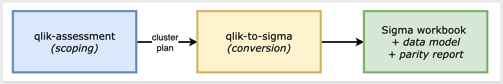
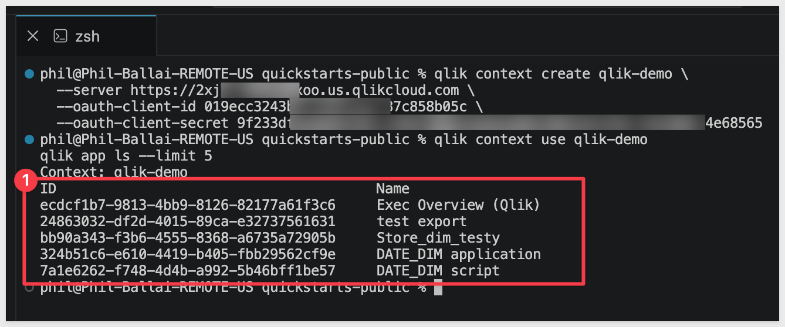
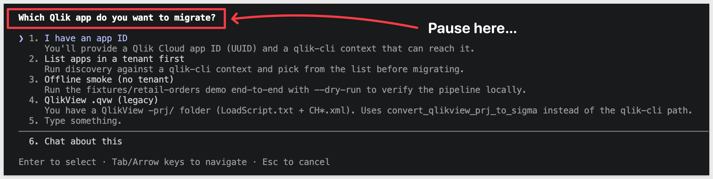
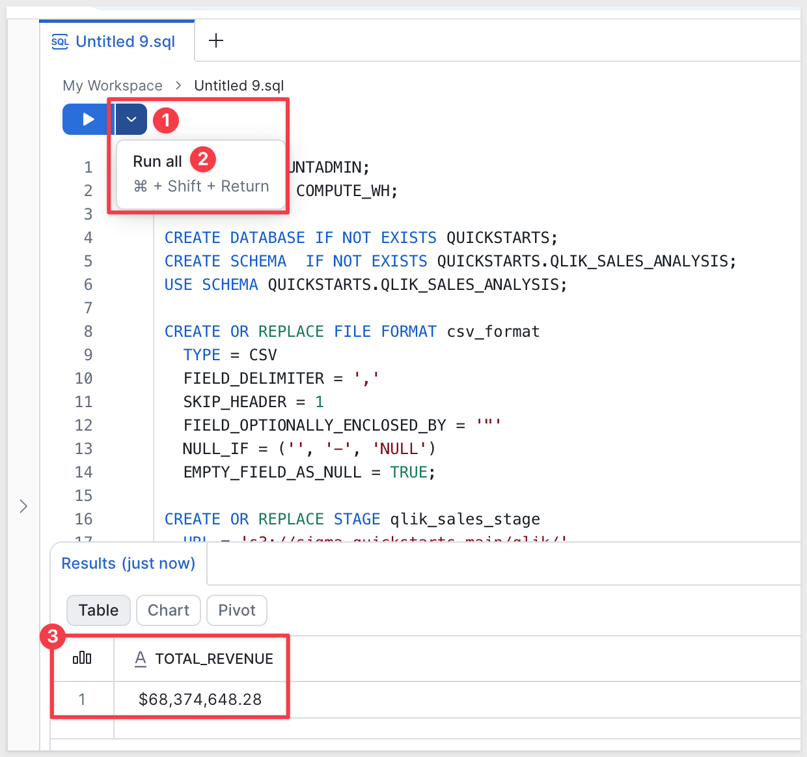
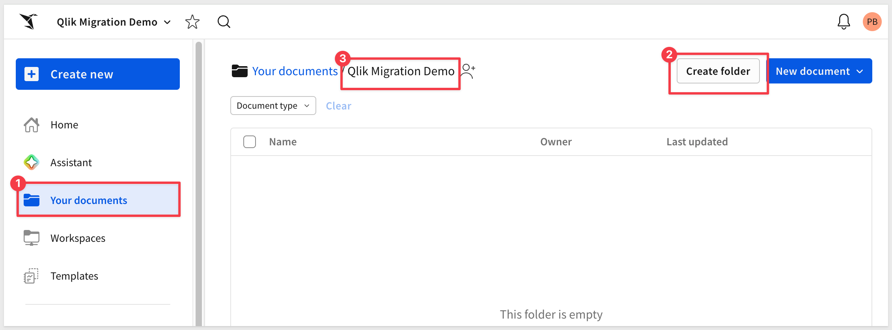
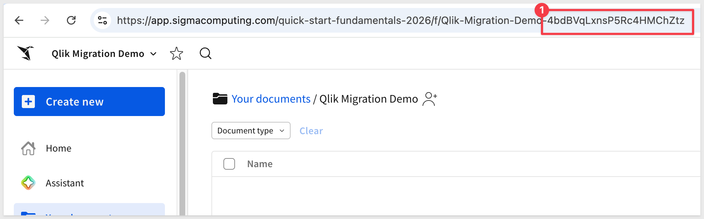
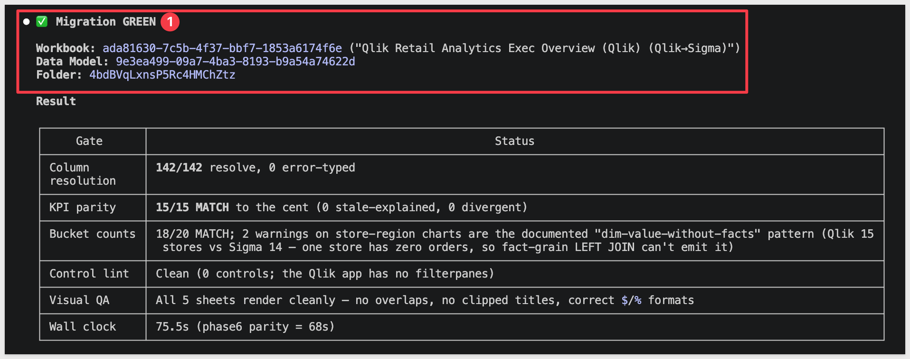
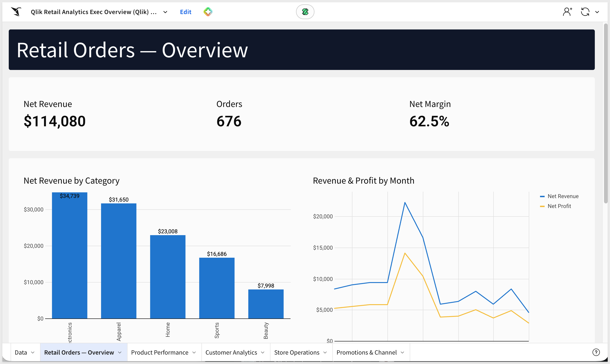
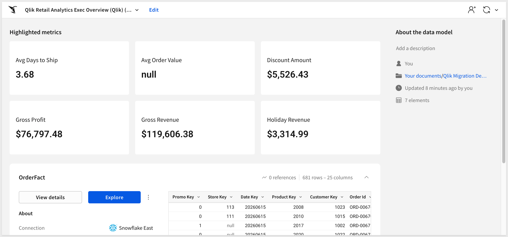

author: pballai
id: developers_migrating_qlik_made_easy
summary: developers_migrating_qlik_made_easy
categories: migrations
environments: web
status: Published
feedback link: https://github.com/sigmacomputing/sigmaquickstarts/issues
tags: default
lastUpdated: 2026-07-01

# Migrating From Qlik Made Easy

## Overview
Duration: 5

A common ask from teams evaluating Sigma is migrating their Qlik Sense footprint — usually to take advantage of all the amazing things Sigma offers. The conversion itself can be a blocker — and the part this QuickStart automates.

The usual Qlik-to-Sigma migration loop is rebuild-the-app-by-hand, rewrite every master measure and Set Analysis expression as a Sigma formula, recreate each sheet's visualizations, line the layout up against the source, then eyeball the numbers and hope nothing drifted in the translation. Done on a single app it's tedious. Across a whole tenant with dozens of apps reading from shared spaces, it's the reason migration projects slip.

This QuickStart walks through a `Claude Code` skill called `qlik-to-sigma` that automates the loop.

Point it at a Qlik Cloud app; it discovers the in-memory data model and every sheet via `qlik-cli`, translates the master measures, dimensions, and Set Analysis expressions into Sigma formulas, builds a Sigma data model from the warehouse tables the app's LOAD script reads, mirrors each sheet's layout on Sigma's grid, and runs a verification pass against the source warehouse. It surfaces a punch list of anything it couldn't auto-translate — instead of silently producing a broken workbook.

For the demonstration, we'll run the skill end-to-end against a Qlik app called `Exec Overview (Qlik)` whose LOAD script reads from a six-table retail star — one fact and five dimensions. You'll see the discovery artifacts each phase produces, the converter's breakdown of how each Qlik expression mapped to a Sigma formula, the parity report against the live warehouse, and the resulting Sigma data model and workbook landed in your org — along with the gap list of items to hand-polish.

<aside class="positive">
<strong>WHY IT MATTERS:</strong><br> The skill runs the whole conversion — discover, translate, build, verify — and finishes with a documented parity check. The result is a working Sigma workbook on the warehouse plus the report that proves it matches the Qlik source, instead of a rebuilt-by-hand workbook you have to spot-check yourself.
</aside>

### What else this enables

A pure lift-and-shift is the floor, not the ceiling. The same skill family supports three follow-on moves that turn a migration into an upgrade:

- **Dedup before you migrate.** Most BI estates carry years of dashboard sprawl — multiple near-identical dashboards built by different teams over time. The assessment skill flags dashboards that are roughly 90% the same and recommends merging them before conversion. You move 200 dashboards instead of 800, and every downstream conversation is simpler. Pair this with the usage data the assessment pulls (who views what, how often) and you can confidently retire cold content rather than carry it forward.

- **Enhance, don't just translate.** Many "dashboards" in legacy tools are really input-driven workflows in disguise — a dashboard whose data is refreshed by uploading a CSV each morning is actually a forecasting app waiting to happen. After the lift-and-shift, the skill can suggest replacing those patterns with native Sigma constructs: input tables for write-back, Sigma Assistant for natural-language analysis, scheduled agents for routine summaries. The result isn't "the old dashboard, in a new tool" — it's "the workflow, finally done right."

- **Audit your source as a side effect.** The parity check that closes the run isn't just a confidence test on the migration — it's a fresh pair of eyes on the source platform's math. Sigma customers have caught multi-year calculation errors during their first migration run because the parity gate flagged a Sigma vs source mismatch and the source turned out to be wrong. Plan the migration as your final audit of the legacy system.

<aside class="negative">
<strong>NOTE:</strong><br> The migration is one-directional — Qlik is the source, Sigma is the target. Sigma reads the warehouse live, so the conversion's accuracy depends on the warehouse tables behind your Qlik app being reachable from a Sigma connection. The skill reads the app's in-memory model via <code>qlik-cli</code> and reconciles Qlik's renamed table and field names back to the underlying warehouse columns. When the OAuth client has the script-read scope, it pulls the LOAD script directly; when it doesn't (the typical M2M default), the skill reconstructs the model from <code>qlik app meta</code> instead — same outcome either way. Parity is checked against the warehouse-resolved numbers, not Qlik's in-memory cache, so any cache drift surfaces as an explicit row-level diff rather than getting buried.
</aside>

<aside class="negative">
<strong>AI MODEL DIFFERENCES:</strong><br> Depending on which AI, model, and version you're running, the exact prompt wording, option ordering, and intermediate messages may differ slightly from what's shown in this QuickStart. The substantive steps and decisions are the same — pick the option that matches the intent described, even if the label varies.
</aside>

### Target Audience
Sigma SEs, technical CSMs, and migration partners running Qlik-to-Sigma conversions — or scoping a batch migration with the companion `qlik-assessment` skill.

### Prerequisites
- `Claude Code` installed (CLI or desktop).
- Sigma API credentials.
- A Qlik Cloud tenant where you can install `qlik-cli` and configure an OAuth M2M client with `Trusted` consent. The skill talks to Qlik through `qlik-cli`, not raw REST.
- `Python 3.10` or newer. macOS's stock system Python is typically 3.9 — older than the skill needs. If `python3 --version` reports anything below 3.10, install a newer interpreter via [Homebrew](https://brew.sh/) (`brew install python@3.12`) or [python.org](https://www.python.org/downloads/).
- `Node.js` (any recent LTS) for building the converter MCP. The conversion uses a separate MCP server, [`sigma-data-model-mcp`](https://github.com/twells89/sigma-data-model-mcp), cloned + built (`npm install && npm run build`) into `~/Desktop/sigma-data-model-mcp`. The skill prompts you to install it mid-conversion — no upfront work needed — but pre-build it if you'd rather skip the gate.
- A Qlik Cloud app you're authorized to migrate. The app's LOAD script needs to read from warehouse tables Sigma can also reach — Qlik apps reading from local file uploads or in-memory-only sources need that data landed in your warehouse first.
- A warehouse reachable from Sigma (Snowflake, BigQuery, Databricks, Redshift, Postgres and others).

<aside class="negative">
<strong>NOTE:</strong><br> Use a non-production Sigma org for your first run. The skill creates real workbooks, and error-recovery paths may iterate via PUT to update them.
</aside>

<button>[Sigma Free Trial](https://www.sigmacomputing.com/free-trial/)</button>


<!-- END OF SECTION-->

## The Qlik Migration Skill Family
Duration: 5

`qlik-to-sigma` is one of two skills that ship together as a single repo (cloned in the next section). Most of this QuickStart focuses on the converter — but knowing where the assessment skill fits saves dead ends later when scoping a batch migration.

| Skill | Role | When to reach for it |
|-------|------|----------------------|
| `qlik-assessment` | Scoping | Auditing a Qlik Cloud tenant before committing to a conversion plan. Emits a per-app complexity readout (master-measure expression convertibility, chart-type coverage, Set Analysis / Section Access flags, data model size), reload health, and a value/cost-ranked migration shortlist that `qlik-to-sigma` can consume. |
| `qlik-to-sigma` | Conversion | The subject of this QuickStart. Converts a single Qlik app (or a batch via shortlist) to a Sigma data model and matching workbook with verified data parity. |

Here's how the two skills connect in a full migration — `qlik-assessment` hands the converter a ranked shortlist, and `qlik-to-sigma` produces the Sigma workbooks with a verified parity report:



<aside class="positive">
<strong>WHY IT MATTERS:</strong><br> Each skill does one thing well — scoping and conversion. Pick the smallest set that fits your job, and don't run the conversion until you've confirmed the data is somewhere Sigma can actually read.
</aside>

### Which skill for your situation

Not every migration needs both skills. Use the table below to map your scenario to the smallest set that fits.

In this QuickStart we're in the first row — one Qlik app whose LOAD script reads from warehouse tables that we'll land in Snowflake — then run `qlik-to-sigma`.

| Your situation | Skill(s) to use |
|----------------|-----------------|
| 1 app, LOAD script reads from your warehouse | `qlik-to-sigma` |
| 1 app, LOAD script reads from local files or in-memory sources | Land the data in your warehouse first (covered in `Prepare the Demo Data`), then `qlik-to-sigma` |
| 10+ apps (any data source) | `qlik-assessment` → `qlik-to-sigma` in batch mode |
| Auditing Qlik sprawl without converting yet | `qlik-assessment` only |

<aside class="negative">
<strong>NOTE:</strong><br> As the skill runs, you'll see filenames and log lines that reference internal phase numbers (e.g., <code>phase6-parity-qlik.rb</code>). Those belong to the skill's own internal numbering — they map onto the phases described in <code>Review the Output</code>. The full mapping is documented in the skill's <code>SKILL.md</code>.
</aside>


<!-- END OF SECTION-->

## Install and Configure the Skill
Duration: 15

First we need to clone the skill's GitHub repository, install `qlik-cli`, configure it against your Qlik tenant, then capture your Sigma credentials.

The two skills live in `sigmacomputing/quickstarts-public` under [qlik-migration-skills/](https://github.com/sigmacomputing/quickstarts-public/tree/main/qlik-migration-skills).

From a terminal, run each command below one at a time so you can confirm each step before moving on.

<aside class="positive">
<strong>NOTE:</strong><br> <code>~</code> in the commands below is shell shorthand for your home folder — <code>/Users/&lt;you&gt;</code> on macOS, <code>/home/&lt;you&gt;</code> on Linux. So <code>~/quickstarts-public</code> resolves to a <code>quickstarts-public/</code> folder directly inside your home directory.
</aside>

**Step 1: Create a local folder for the clone**<br>
We'll clone into this folder in the next step.

```copy-code
mkdir -p ~/quickstarts-public
```

**Step 2: Move into the new folder** so the next command runs in the right working directory.

```copy-code
cd ~/quickstarts-public
```

**Step 3: Clone the repo without pulling any files yet**<br>
The `--sparse` flag tells Git you'll choose which folders to fill in next. The trailing `.` clones into the current folder.

```copy-code
git clone --filter=blob:none --sparse https://github.com/sigmacomputing/quickstarts-public.git .
```

**Step 4: Fill in only the qlik-migration-skills folder**<br>
Every other QuickStart asset in the repo stays empty on disk.

```copy-code
git sparse-checkout set qlik-migration-skills
```

**Step 5: Symlink qlik-to-sigma into the Claude skills folder**<br>
This lets Claude Code invoke `qlik-to-sigma` as a skill.

```copy-code
ln -s ~/quickstarts-public/qlik-migration-skills/qlik-to-sigma ~/.claude/skills/qlik-to-sigma
```

**Step 6: Symlink qlik-assessment**<br>
Used to scope a Qlik tenant before conversion.

```copy-code
ln -s ~/quickstarts-public/qlik-migration-skills/qlik-assessment ~/.claude/skills/qlik-assessment
```

Steps 5 and 6 should return with no error.


**Step 7: Install qlik-cli**

The Qlik skill talks to your Qlik Cloud tenant through `qlik-cli` — the official command-line tool that wraps both Qlik's REST API and the Engine API. The skill needs both: REST to discover apps and read metadata, Engine to read sheet/chart definitions and the LOAD script.

On macOS or Linux, tap Qlik's Homebrew repository:

```copy-code
brew tap qlik-oss/taps
```

After this finishes, trust the tap (recent Homebrew versions require this for non-core taps before they'll install from them):

```copy-code
brew trust qlik-oss/taps
```

Then install the formula:

```copy-code
brew install qlik-cli
```

Confirm `qlik-cli` is on your PATH:

```copy-code
qlik version
```

You should see output like `version X.Y.Z`.

<aside class="negative">
<strong>NOTE:</strong><br> If you skip the <code>brew trust</code> step, the install will fail with <code>Refusing to load formula qlik-oss/taps/qlik-cli from untrusted tap qlik-oss/taps</code>. That's not a bug — newer Homebrew versions require explicit trust for any tap that isn't <code>homebrew-core</code>.
</aside>

<aside class="positive">
<strong>NOTE:</strong><br> If you're on Windows or prefer not to use Homebrew, download the binary directly from the <a href="https://github.com/qlik-oss/qlik-cli/releases">qlik-oss/qlik-cli releases page</a>. Chocolatey users can install with <code>choco install qlik-cli</code>.
</aside>


**Step 8: Configure a qlik-cli context against your tenant**

The skill authenticates with an OAuth M2M client (configured by your tenant admin under `Administration` > `Integrations` > `OAuth clients`). Your admin enables the **Trusted** consent method on the client, then shares the client ID and secret with you.

Create a `qlik-cli` context that uses those credentials. **Substitute your tenant URL, client ID, and client secret**:

```copy-code
qlik context create qlik-demo \
  --server https://<your-tenant>.us.qlikcloud.com \
  --oauth-client-id <client-id> \
  --oauth-client-secret <client-secret>
```

Activate the context and verify auth works:

```copy-code
qlik context use qlik-demo
qlik app ls --limit 5
```

You should see a JSON list of apps your OAuth client can access:



<aside class="negative">
<strong>NOTE:</strong><br> If <code>qlik app ls</code> returns <code>OAUTH-5: oauth client is not approved with trusted consent method</code>, the OAuth client was created without the Trusted consent method. Ask your tenant admin to enable it on the client and re-run. M2M clients without Trusted consent can't be used non-interactively.
</aside>

<aside class="positive">
<strong>NOTE:</strong><br> OAuth M2M clients only see content in spaces the client is a member of — Personal spaces are invisible to them. If your target app lives in a Personal space, move it to a shared space first and add the client as a member.
</aside>


**Step 9: Capture your Sigma API credentials.**<br>
This script prompts for `SIGMA_BASE_URL`, `SIGMA_CLIENT_ID`, and `SIGMA_CLIENT_SECRET` and writes them into Claude's settings.

Run once per machine.

If you don't already have credentials, see [Configure API credentials in Sigma](https://help.sigmacomputing.com/sigma-computing/docs/configure-api-credentials-and-connectors-in-sigma) — the skill needs `API access` credentials, not embed.

```copy-code
ruby ~/.claude/skills/qlik-to-sigma/scripts/setup.rb
```


**Step 10: Verify Claude Code can invoke the skill.**<br>
Type `claude` in your terminal to start Claude Code, then invoke the skill:

```copy-code
claude
```

```copy-code
/qlik-to-sigma
```

Claude should start reading the reference files and ask what app you want to convert. 

Pause at that prompt — we'll hand it everything in one shot via the kickoff prompt in `Run the Conversion`:




<!-- END OF SECTION-->

## Prepare the Demo Data
Duration: 10

The Qlik app we're migrating runs a LOAD script that reads from a six-table retail star — one fact (`ORDER_FACT`) joined LEFT_OUTER to five dimensions (`CUSTOMER_DIM`, `PRODUCT_DIM`, `STORE_DIM`, `DATE_DIM`, `PROMO_DIM`). For the migration to land in Sigma cleanly, the same six tables need to exist in a connection your Sigma org can reach. Approximate row counts: 681 / 25 / 25 / 15 / 1,096 / 23.

Data prep has two halves:

1. **Qlik side — nothing to do here for this QuickStart.** We've already exported the six tables from the source warehouse and hosted them as CSVs in Amazon S3. The Snowflake `COPY INTO` statements below read from S3 directly — no local download needed.

2. **Sigma side (this section)** — the same data needs to live in a Snowflake schema your Sigma connection can read. We'll create one.

<aside class="negative">
<strong>NOTE:</strong><br> The DDL below grants access to <code>SIGMA_SERVICE_ROLE</code>. Substitute the role your Sigma connection actually uses if it differs — you can confirm it in Sigma under <code>Administration</code> > <code>Connections</code> by clicking your Snowflake connection.
</aside>

```copy-code
USE ROLE ACCOUNTADMIN;
USE WAREHOUSE COMPUTE_WH;

CREATE DATABASE IF NOT EXISTS QUICKSTARTS;
CREATE SCHEMA  IF NOT EXISTS QUICKSTARTS.TS_RETAIL_ANALYTICS;
USE SCHEMA QUICKSTARTS.TS_RETAIL_ANALYTICS;

CREATE OR REPLACE FILE FORMAT csv_format
  TYPE = CSV
  FIELD_DELIMITER = ','
  SKIP_HEADER = 1
  FIELD_OPTIONALLY_ENCLOSED_BY = '"'
  NULL_IF = ('', 'NULL')
  EMPTY_FIELD_AS_NULL = TRUE;

CREATE OR REPLACE STAGE ts_retail_stage
  URL = 's3://sigma-quickstarts-main/thoughtspot/'
  FILE_FORMAT = csv_format;

-- Fact: ORDER_FACT (681 rows, joins to all 5 dims via *_KEY columns).
CREATE OR REPLACE TABLE ORDER_FACT (
  ORDER_ID           VARCHAR,
  ORDER_LINE         NUMBER(38,0),
  CUSTOMER_KEY       NUMBER(38,0),
  PRODUCT_KEY        NUMBER(38,0),
  ORDER_STORE_KEY    NUMBER(38,0),
  SHIP_STORE_KEY     NUMBER(38,0),
  PROMO_KEY          NUMBER(38,0),
  ORDER_DATE_KEY     NUMBER(38,0),
  SHIP_DATE_KEY      NUMBER(38,0),
  RETURN_DATE_KEY    NUMBER(38,0),
  ORDER_CHANNEL      VARCHAR,
  SHIP_METHOD        VARCHAR,
  ORDER_STATUS       VARCHAR,
  QUANTITY_ORDERED   NUMBER(38,0),
  QUANTITY_RETURNED  NUMBER(38,0),
  UNIT_PRICE         NUMBER(38,2),
  UNIT_COST          NUMBER(38,2),
  DISCOUNT_AMOUNT    NUMBER(38,2),
  SHIPPING_AMOUNT    NUMBER(38,2),
  TAX_AMOUNT         NUMBER(38,2),
  GROSS_REVENUE      NUMBER(38,2),
  NET_REVENUE        NUMBER(38,2),
  GROSS_PROFIT       NUMBER(38,2),
  NET_PROFIT         NUMBER(38,2),
  IS_FIRST_ORDER     NUMBER(1,0),
  IS_RETURNED        NUMBER(1,0),
  IS_CANCELLED       NUMBER(1,0),
  DAYS_TO_SHIP       NUMBER(38,0)
);

CREATE OR REPLACE TABLE CUSTOMER_DIM (
  CUSTOMER_KEY          NUMBER(38,0),
  CUSTOMER_ID           VARCHAR,
  FIRST_NAME            VARCHAR,
  LAST_NAME             VARCHAR,
  EMAIL                 VARCHAR,
  PHONE                 VARCHAR,
  CITY                  VARCHAR,
  STATE                 VARCHAR,
  ZIP_CODE              VARCHAR,
  REGION                VARCHAR,
  CUSTOMER_SEGMENT      VARCHAR,
  LOYALTY_TIER          VARCHAR,
  ACQUISITION_CHANNEL   VARCHAR,
  FIRST_ORDER_DATE      DATE,
  IS_ACTIVE             NUMBER(1,0),
  IS_EMAIL_OPT_IN       NUMBER(1,0),
  LIFETIME_ORDER_COUNT  NUMBER(38,0),
  LIFETIME_REVENUE      NUMBER(38,2)
);

CREATE OR REPLACE TABLE PRODUCT_DIM (
  PRODUCT_KEY         NUMBER(38,0),
  PRODUCT_ID          VARCHAR,
  PRODUCT_NAME        VARCHAR,
  CATEGORY            VARCHAR,
  SUBCATEGORY         VARCHAR,
  BRAND               VARCHAR,
  UNIT_COST           NUMBER(38,2),
  UNIT_PRICE          NUMBER(38,2),
  WEIGHT_LBS          NUMBER(38,2),
  IS_ACTIVE           NUMBER(1,0),
  IS_PRIVATE_LABEL    NUMBER(1,0),
  IS_SEASONAL         NUMBER(1,0),
  LAUNCH_DATE         DATE,
  DISCONTINUE_DATE    DATE,
  "Product_Key/Name"  VARCHAR
);

CREATE OR REPLACE TABLE STORE_DIM (
  STORE_KEY          NUMBER(38,0),
  STORE_ID           VARCHAR,
  STORE_NAME         VARCHAR,
  STORE_TYPE         VARCHAR,
  CITY               VARCHAR,
  STATE              VARCHAR,
  REGION             VARCHAR,
  DISTRICT           VARCHAR,
  SQUARE_FOOTAGE     NUMBER(38,0),
  OPEN_DATE          DATE,
  CLOSE_DATE         DATE,
  IS_ACTIVE          NUMBER(1,0),
  HAS_CAFE           NUMBER(1,0),
  HAS_CURBSIDE       NUMBER(1,0),
  MANAGER_NAME       VARCHAR,
  STORE_PHONE        VARCHAR,
  ANNUAL_LEASE_COST  NUMBER(38,2)
);

CREATE OR REPLACE TABLE DATE_DIM (
  DATE_KEY        NUMBER(38,0),
  FULL_DATE       DATE,
  DAY_OF_WEEK     VARCHAR,
  DAY_OF_MONTH    NUMBER(38,0),
  WEEK_OF_YEAR    NUMBER(38,0),
  MONTH_NUMBER    NUMBER(38,0),
  MONTH_NAME      VARCHAR,
  QUARTER         NUMBER(38,0),
  "YEAR"          NUMBER(38,0),
  IS_WEEKEND      NUMBER(1,0),
  IS_HOLIDAY      NUMBER(1,0),
  FISCAL_PERIOD   VARCHAR
);

CREATE OR REPLACE TABLE PROMO_DIM (
  PROMO_KEY          NUMBER(38,0),
  PROMO_ID           VARCHAR,
  PROMO_NAME         VARCHAR,
  PROMO_TYPE         VARCHAR,
  CHANNEL            VARCHAR,
  DISCOUNT_PCT       NUMBER(38,2),
  START_DATE         DATE,
  END_DATE           DATE,
  MIN_ORDER_AMOUNT   NUMBER(38,2),
  IS_STACKABLE       NUMBER(1,0),
  TARGET_SEGMENT     VARCHAR,
  PROMO_COST         NUMBER(38,2)
);

COPY INTO ORDER_FACT    FROM @ts_retail_stage/ORDER_FACT.csv    ON_ERROR = ABORT_STATEMENT;
COPY INTO CUSTOMER_DIM  FROM @ts_retail_stage/CUSTOMER_DIM.csv  ON_ERROR = ABORT_STATEMENT;
COPY INTO PRODUCT_DIM   FROM @ts_retail_stage/PRODUCT_DIM.csv   ON_ERROR = ABORT_STATEMENT;
COPY INTO STORE_DIM     FROM @ts_retail_stage/STORE_DIM.csv     ON_ERROR = ABORT_STATEMENT;
COPY INTO DATE_DIM      FROM @ts_retail_stage/DATE_DIM.csv      ON_ERROR = ABORT_STATEMENT;
COPY INTO PROMO_DIM     FROM @ts_retail_stage/PROMO_DIM.csv     ON_ERROR = ABORT_STATEMENT;

-- Grant Sigma's service role visibility on the schema and its tables.
GRANT USAGE  ON DATABASE QUICKSTARTS                                    TO ROLE SIGMA_SERVICE_ROLE;
GRANT USAGE  ON SCHEMA   QUICKSTARTS.TS_RETAIL_ANALYTICS                TO ROLE SIGMA_SERVICE_ROLE;
GRANT SELECT ON ALL    TABLES IN SCHEMA QUICKSTARTS.TS_RETAIL_ANALYTICS TO ROLE SIGMA_SERVICE_ROLE;
GRANT SELECT ON FUTURE TABLES IN SCHEMA QUICKSTARTS.TS_RETAIL_ANALYTICS TO ROLE SIGMA_SERVICE_ROLE;

-- Sanity-check row counts. Expected: 681 / 25 / 25 / 15 / 1096 / 23.
SELECT 'ORDER_FACT'   AS TABLE_NAME, COUNT(*) AS ROW_COUNT FROM ORDER_FACT   UNION ALL
SELECT 'CUSTOMER_DIM', COUNT(*) FROM CUSTOMER_DIM UNION ALL
SELECT 'PRODUCT_DIM',  COUNT(*) FROM PRODUCT_DIM  UNION ALL
SELECT 'STORE_DIM',    COUNT(*) FROM STORE_DIM    UNION ALL
SELECT 'DATE_DIM',     COUNT(*) FROM DATE_DIM     UNION ALL
SELECT 'PROMO_DIM',    COUNT(*) FROM PROMO_DIM;

-- Parity baseline ($108,797.85 Net Revenue across all orders).
SELECT TO_CHAR(SUM(NET_REVENUE), '$999,999,999.99') AS TOTAL_NET_REVENUE
FROM ORDER_FACT;
```



<aside class="positive">
<strong>NOTE:</strong><br> The warehouse columns use snake_case_UPPER — the converter family's canonical form. Qlik's LOAD script renames the dim tables in the in-memory model (<code>CUSTOMER_DIM</code> → <code>Customer</code>, <code>DATE_DIM</code> → <code>Calendar</code>, etc.) and drops columns it doesn't need. The skill reconciles those Qlik-side names back to the underlying warehouse columns automatically, so the Sigma data model lands with Qlik's friendly table names while still reading the real warehouse data.
</aside>

If the load completes cleanly, the row-count check returns `681 / 25 / 25 / 15 / 1096 / 23` and the Net Revenue check returns `$108,797.85`. Any mismatch means either a `COPY` partial-load error (check Snowflake's load history) or a different S3 file than expected.

<aside class="positive">
<strong>WHY IT MATTERS:</strong><br> Once the source data lives in your warehouse, every downstream tool — Sigma, dbt, your own SQL — reads from the same source of truth instead of a per-app in-memory copy. The migration step doubles as a data-architecture upgrade.
</aside>


<!-- END OF SECTION-->

## Prepare the Sigma Target Folder
Duration: 2

The converter needs a Sigma folder to land the new data model and workbook in. The skill will ask for the folder's UUID — it will be easier to have it ready before you return to the Claude prompt that's still paused after the skill loaded.

To keep this simple, we will use a plain folder and not a workspace.

**Step 1: Create (or pick) a folder in Sigma.**<br>
Open your Sigma org, navigate to where you want the migrated workbook to live, and create a folder for it. Something like:

```copy-code
Qlik Migration Demo
```



**Step 2: Grab the folder ID.**<br>
Open the folder. The ID is the last segment of the URL — a short alphanumeric string, 21 characters. Copy it from the address bar and keep it on the clipboard for the next section.



<aside class="positive">
<strong>NOTE:</strong><br> The skill's prompt may refer to the folder "UUID". Paste the value from the URL exactly as it appears; the skill accepts that form directly.
</aside>


<!-- END OF SECTION-->

## Run the Conversion
Duration: 3

The skill can run interactively, asking for the Qlik app, warehouse, and Sigma destination one at a time. For a known target — like ours — it's faster to give Claude the entire job in one message. The skill recognizes a structured kickoff prompt and assembles the `migrate-qlik.rb` command directly, going straight from "go" through discover → convert → data model → workbook build → layout → parity.

Return to the terminal where Claude is paused, and choose `Chat about this`.

Paste the block below. **Substitute your own values where the placeholders are:**

- `Qlik context` — the `qlik-cli` context you created in `Install and Configure the Skill`
- `App ID` — the Qlik app's UUID (find it via `qlik app ls` in terminal)
- `SIGMA_CONNECTION_ID` — your Snowflake connection ID from Sigma's `Administration` > `Connections`
- `SIGMA_FOLDER_ID` — the folder ID you copied at the end of the previous section
- Any additional custom instructions are useful to add here now.

```copy-code
Run /qlik-to-sigma on the following. Use migrate-qlik.rb end-to-end and stop only if a hard gate fails.

Qlik
- Context: qlik-demo
- App ID: <your-qlik-app-uuid>

Warehouse (Snowflake)
- Database: QUICKSTARTS
- Schema: TS_RETAIL_ANALYTICS

Sigma
- SIGMA_API_TOKEN = mint from ~/.sigma-migration/env
- Connection ID: <your-snowflake-connection-id>
- Folder ID: <your-folder-id>

Options
- Name prefix: Qlik Retail Analytics
- Auto-approve mid-pipeline questions: yes
- Parity: tolerate row-count drift between Qlik and the warehouse snapshot — this QuickStart uses a frozen CSV copy of the source. Report the delta with a row-level diff, but treat warehouse-snapshot staleness as a soft fail (not a gate-red).

Don't declare GREEN until the parity gate passes (or the tolerance above applies) and the visual-QA loop passes.
```

Claude reads the block, mints a fresh Sigma token from `~/.sigma-migration/env`, assembles the `migrate-qlik.rb` command with the right flags, and runs it end-to-end. The rest of the run is hands-off until a gate or decision point.

<aside class="positive">
<strong>NOTE:</strong><br> The skill reuses Sigma credentials captured by <code>setup.rb</code> — they live at <code>~/.sigma-migration/env</code> and the skill mints a fresh <code>SIGMA_API_TOKEN</code> from them at runtime. That's why the kickoff prompt above says <code>mint from ~/.sigma-migration/env</code> instead of pasting a token. No manual Sigma-token wrangling per run.
</aside>

<aside class="negative">
<strong>NOTE:</strong><br> From here on, Claude Code asks for approval on every bash command the skill runs — and a full conversion fires dozens of them. For each prompt, pick option <code>2. Yes, and don't ask again</code> so Claude Code remembers that command pattern. After the first handful of approvals the prompts stop coming. Alternatively, press <code>Shift+Tab</code> once to switch to `auto mode on` for the rest of the session — fine for a trusted skill like this one, just don't use it for unknown code.
</aside>


<!-- END OF SECTION-->

## Review the Output
Duration: 10

When the migration completes, Claude prints a final summary covering the whole pipeline — every phase's result, the visual-QA outcome, the hard-gate verdict, and the URLs of the new Sigma data model and workbook:



The summary walks through six phases plus a visual-QA pass:

- **Phase 1 — Discover.** Pulls the app's manifest, sheet list, master measures, and chart expressions via `qlik-cli`. The LOAD script comes along if the OAuth client has script-read scope; otherwise the skill reconstructs the in-memory model from `qlik app meta`. Either way, the app's last-modified timestamp on the Qlik side gets recorded for the freshness preflight.
- **Phase 2 — Convert.** Translates the Qlik LOAD script and chart expressions into a Sigma data-model spec, using `reconcile-columns.py` to auto-derive the Qlik field → warehouse column map from the LOAD script's `AS` aliases.
- **Phase 3 — Data model POST.** Posts the new DM to Sigma, identifies the denormalized element that surfaces joined-dim columns, and verifies every column resolves cleanly against your warehouse schema.
- **Phase 4 — Workbook build.** For each Qlik sheet, builds a Sigma page with one element per chart. Records the per-chart chart-kind decisions and any fallbacks for Qlik chart kinds Sigma doesn't natively support.
- **Phase 5 — Layout.** Maps each sheet's cell-grid geometry onto Sigma's 24-col grid.
- **Phase 5b — Visual QA.** Renders the workbook's pages as PNGs and lints them — no overlapping tiles, no clipped chart titles, no orphan controls.
- **Phase 6 — Parity + hard gate.** Runs every chart's Sigma output against the warehouse-resolved expected value. Each chart reports `PASS within tolerance` or `FAIL`; the gate is GREEN only when all charts pass.

Open the new workbook in Sigma to see the migrated dashboard:



Open the data model to see how the converter wired up the joins and metrics:



**Hand-polish items the skill flags rather than silently working around:**

- Qlik chart kinds with no native Sigma equivalent (mekko, network, sankey, waterfall) fall back to bar charts — swap them manually if the source had any. The `Exec Overview (Qlik)` sheets use bar / line / KPI / table only, so this won't bite for our demo.
- Set Analysis expressions that didn't translate cleanly are listed in the summary; hand-author the Sigma equivalent on the affected element.
- Layout edits made manually after the run wipe `spec.layout`. Re-run the layout pass if you need to restore the original geometry.
- Section Access from the source app is detected but never auto-applied — port it via the skill's RLS apply helper if the source had Section Access. (Our demo doesn't.)

<aside class="positive">
<strong>WHY IT MATTERS:</strong><br> The skill finishes with a documented exit code and an explicit list of what it couldn't auto-translate — never a silent "looks good." Every gap surfaces as a follow-up item with a recommended fix, so you spend hand-polish time on the few items that need it instead of spot-checking every visualization for drift.
</aside>


<!-- END OF SECTION-->

## Scaling Up — Batch Conversion
Duration: 5

A single app is the easy case. Real migrations involve Qlik tenants with dozens or hundreds of apps reading from shared spaces — and migrating them one-by-one through the converter loses the leverage of doing the planning work once. That's where the companion `qlik-assessment` skill comes in.

Point `qlik-assessment` at a Qlik tenant and it inventories every app, space, and user, scoring each app on:

- **Per-app complexity** — master-measure expression convertibility, chart-type coverage, Set Analysis and Section Access flags, data model size
- **Reload health** — recent reload outcomes, schedule pattern, last-success timestamp
- **Convertibility** — which Qlik chart kinds map cleanly to Sigma versus those that need element-builder mapping work
- **Source patterns** — file-uploaded data, ODBC/REST connectors, and warehouse-backed apps flagged separately so you can land the file-only data first
- **Ownership concentration** — apps grouped by owner, surfacing the few owners who account for most of the tenant's content

The output is a Sigma-branded `readout.html` you can share with stakeholders, plus a ranked migration shortlist sorted by `value / (1 + cost)` — the cheapest, highest-value apps to convert first, with tag pills like `migrate-first`, `easy-win`, `needs-review`, and `retire`.

The shortlist becomes input to a **batch conversion plan** — `qlik-assessment` groups apps that share warehouse tables so one Sigma data model can serve a whole family of workbooks instead of producing N near-duplicate DMs. `qlik-to-sigma` consumes that plan in batch mode and runs the conversions concurrently.

Typical flow for a real migration engagement:

1. Run `qlik-assessment` against the target tenant; review the shortlist with stakeholders.
2. Pick the top N apps to convert first — or drop the cold ones entirely.
3. Hand the batch plan to `qlik-to-sigma` and let it work through them.
4. Spot-check each output; file the inevitable gap items upstream.

<aside class="positive">
<strong>WHY IT MATTERS:</strong><br> Sigma's BI migration story is a process, not a single conversion. The assessment skill turns "how big is this migration?" from a guess into a defensible number — backed by per-app effort estimates, usage-driven prioritization, and a retirement list for content nobody actually reads. That's the difference between a migration that ships and one that stalls in committee.
</aside>


<!-- END OF SECTION-->

## Common Issues and Fixes
Duration: 5

The following is a "grab bag" of things that might come up during real conversions, with the fix for each.

- **`python3 --version` reports 3.9.x and the skill refuses to run:**<br> macOS's stock Python is too old for the skill. Install Python 3.10+ via Homebrew (`brew install python@3.12`) or [python.org](https://www.python.org/downloads/), then use `python3.12 -m pip install` explicitly for any helpers. Avoid `pip3` as a shorthand — it can quietly resolve back to the old interpreter.

- **`qlik app ls` returns `OAUTH-5: oauth client is not approved with trusted consent method`:**<br> The OAuth client was created without the Trusted consent method. Ask your tenant admin to enable it on the client under `Administration` > `Integrations` > `OAuth clients`, then re-run.

- **`qlik app ls` succeeds but the target app isn't listed:**<br> OAuth M2M clients only see content in spaces the client is a member of. Personal spaces are invisible. Move the app to a shared space and add the OAuth client as a member.

- **`qlik app script get` returns "access denied" mid-run:**<br> The OAuth client is missing the script-read scope, which is the typical default for M2M clients. The skill detects this and falls back to reconstructing the in-memory model from `qlik app meta` — the conversion proceeds and parity still passes. If you want the skill to read the LOAD script directly (cleaner reconcile, fewer guesses on column renames), ask your tenant admin to grant the OAuth client the script-read scope.

- **`brew install qlik-cli` fails with `Refusing to load formula from untrusted tap`:**<br> Run `brew trust qlik-oss/taps` first. Recent Homebrew versions require explicit trust for any tap that isn't `homebrew-core`.

- **Skill pauses at a "converter MCP gate" mid-run:**<br> The conversion delegates the model translation to a separate MCP server (`sigma-data-model-mcp`). If it isn't installed locally, the skill stops at the gate. Pick option `6. Chat about this` and tell Claude:<br>
 <code>Clone twells89/sigma-data-model-mcp into ~/Desktop/sigma-data-model-mcp for me, then run `npm install && npm run build` in that directory. Once the build is done, come back to the gate and pick option 1.</code><br>
 Claude runs the clone, install, and build, then returns to the gate. After that the skill may also prompt for a "build commit" — choose the `(Recommended)` option.

- **Schema not visible in Sigma after `COPY INTO`:**<br> Sigma's service role doesn't have access to the new schema. The DDL block in `Prepare the Demo Data` includes the `GRANT USAGE` and `GRANT SELECT` statements — if you skipped or modified them, run them now with the role name your Sigma connection actually uses (find it in Sigma under `Administration` > `Connections`).

- **Set Analysis expression flagged as "needs review":**<br> Some Set Analysis patterns (especially nested set modifiers with multiple alternate-state references) don't have a direct Sigma equivalent. The skill surfaces the original expression alongside its best-guess Sigma translation. Hand-author the Sigma formula on the affected element using the warehouse-resolved column names.

- **Many `Bash command — Contains shell syntax that cannot be statically analyzed — Do you want to proceed?` prompts during the run:**<br> The skill fires `eval "$(...)"` patterns to inject tokens dynamically. Claude Code's safety analyzer can't pattern-match these for blanket approval even in accept-edits mode. Click `1. Yes` on each — it's expected behavior, not a misconfiguration. After the run, you can use the `/fewer-permission-prompts` skill to scan the transcript and add those patterns to your `.claude/settings.local.json` so subsequent runs are silent.

- **"Data model has error columns" after POST:**<br> A column the model declares can't be resolved against the warehouse. Usually a column-name mismatch between the warehouse table and the Qlik LOAD script's `AS` alias. The skill's verification phase surfaces the specific column in the error — adjust the warehouse table's column names or correct the LOAD-script alias before re-running.


<!-- END OF SECTION-->

## What We've Covered
Duration: 5

What you built is less a single conversion and more a repeatable migration path. The skill took a Qlik Sense app — LOAD script, master measures, sheet layout, Set Analysis expressions — and produced a Sigma data model, a workbook, and a parity report against the live warehouse, all from a single structured prompt. No one rebuilt the dashboard by hand, and the parity numbers are evidence rather than hope.

The patterns worth carrying into your next migration:

- **Two skills, one workflow** — `qlik-assessment` scopes and prioritizes the tenant; `qlik-to-sigma` converts and verifies. The same shape applies whether you're migrating one app or all the apps in a Qlik space.
- **The LOAD script is your audit trail** — Qlik's LOAD script is the durable, human-readable contract the converter reads from. Every rename, join, drop, and `AS` alias is right there in plain text, and the converter's output is reproducible against the same script.
- **Single-prompt kickoff** — once the warehouse data is in place and `setup.rb` has captured your Sigma credentials, the entire migration is one paste. The kickoff prompt reads the Qlik context + app ID + warehouse coordinates + options in one shot, and the skill walks through every phase end-to-end without further interaction unless a gate genuinely needs your call.
- **Warehouse-first** — Sigma reads the live warehouse, so the conversion's value comes from getting the data where Sigma can see it. The DDL + S3 + GRANTs scaffolding in `Prepare the Demo Data` transfers to any warehouse Sigma can reach. For apps reading from file uploads or in-memory-only sources, land that data in your warehouse first using the same pattern.
- **Parity as proof** — the warehouse-vs-Sigma comparison is what makes the result shippable. Without it you're spot-checking; with it you have evidence every measure lines up. The skill is honest about source drift too: when the warehouse snapshot is older than Qlik's in-memory cache, the row-level diff is reported instead of buried, and a documented tolerance keeps the gate sensible for demo scenarios.

A first-pass conversion produces a working starting point and a documented punch list, not a hand-polished workbook. The polish loop is short, and you know exactly what to look at. That's the migration approach you can scale across an entire Qlik tenant.

**Additional Resource Links**

[Blog](https://www.sigmacomputing.com/blog/)<br>
[Community](https://community.sigmacomputing.com/)<br>
[Help Center](https://help.sigmacomputing.com/hc/en-us)<br>
[QuickStarts](https://quickstarts.sigmacomputing.com/)<br>

Be sure to check out all the latest developments at [Sigma's First Friday Feature page!](https://quickstarts.sigmacomputing.com/firstfridayfeatures/)
<br>

[](https://twitter.com/sigmacomputing)&emsp;
[](https://www.linkedin.com/company/sigmacomputing)&emsp;
[](https://www.facebook.com/sigmacomputing)


<!-- END OF WHAT WE COVERED -->
<!-- END OF QUICKSTART -->
