author: pballai
id: developers_plugins
summary: developers_plugins
categories: developers
environments: web
status: Published
feedback link: https://github.com/sigmacomputing/sigmaquickstarts/issues
tags: default
lastUpdated: 2023-12-21

# Extend Sigma with Plugins

## Overview 
Duration: 5 

This QuickStart is designed to help both experienced developers and those who have never worked with open-source charting libraries. Feel free to skip sections that do not apply to you.

In either case we assume you have some experience with software development, even if only a little. 

<aside class="negative">
<strong>NOTE:</strong><br> Not every step will be shown in detail, but we will make it as simple as possible so that you can build a working example
</aside>

### Why use a plugin?
There are times when Sigma (or any analytics platform) will not have the visualization a use case requires, or the one that is available is not able to be customized to the extent that is required.

The choice to build a custom plugin for use in Sigma has some considerations that customers should be aware of.

**Here are some of the more common considerations:**

<ul>
  <li>Does the development team have the skills and resources available to manage the on-going iterations and support that analytics applications often require?</li>
  <li>Will a 3rd party component meet all the specific project requirements?</li>
  <li>How easy will the visualization integrate into the workflow?</li>
  <li>Can the 3rd party component connect to the data?</li>
</ul>

Custom chart building offers unparalleled flexibility and customization, but it requires technical expertise and far more development effort than building in Sigma.

Sigma provides quick, user-friendly solutions with far less technical overhead.

In such cases where something is needed that is not available in Sigma, developing a plugin is a viable option for many customers.

<aside class="positive">
<strong>IMPORTANT:</strong><br> The information provided here is meant to demonstrate the basic techniques to creating and deploying a Sigma plugin. The actual development of any plugin is solely the customer's responsibility.
</aside>

### Target Audience
Programmers who want to enhance Sigma's functionality by creating their own plugins.

### Prerequisites

<ul>
  <li>A computer with a current browser. It does not matter which browser you want to use.</li>
  <li>Access to your Sigma environment.</li>
  <li>Some familiarity with Sigma is assumed. Not all steps will be shown as the basics are assumed to be understood.</li>
  <li>A development environment (or RTE) of your choice. In this QuickStart we use Microsoft VSCode with related extensions.</li>
  <li>We will make use of the two popular charting libraries; D3.js and Highcharts.js</li>
</ul>

<aside class="postive">
<strong>IMPORTANT:</strong><br> Sigma recommends using non-production resources when engaging in QuickStarts.
</aside>

<button>[Sigma Free Trial](https://www.sigmacomputing.com/free-trial/)</button>

<aside class="negative">
<strong>NOTE:</strong><br> We will use the React framework for serving of our plugin code, on our local computer. You do not need to know how to use React to complete this QuickStart and we will indicate what sections of code are Sigma and which are React. The choice of front-end framework is up to the developer. 
</aside>
  
### What You’ll Learn
How to use VSCode with React, create a variety of plugins, and deploy them in Sigma. In addition, we also cover how to use a hosting provider to test deploying that way.

## Create Local Development Environment
Duration: 20

While we will use VSCode for development and base our demonstrations on it, you are free to use any development environment you're comfortable with for creating custom Sigma plugins; the underlying methods remain similar.

If you choose to use a different method, ensure that it supports the use of **JavaScript;**.

Let's get started.

### **Setup VSCode**
Duration: 20

[Install VSCode from Microsoft's download site.](https://code.visualstudio.com/download)

Run the installation with all defaults.

### Install Node:
You may skip this section if you already have Node.js installed. 

[Download and install Node.js from here:](https://Nodejs.org/en/download/)

Use the LTS (long term supported) version appropriate for your operating system.

Run the installer selecting all the defaults. This will install both Node and the Node package manager (which manages optional Node components). The package manager is abbreviated to “npm” when running commands.

You can verify your installation using Terminal:

**Run the command:**
```plaintext
node -v
```
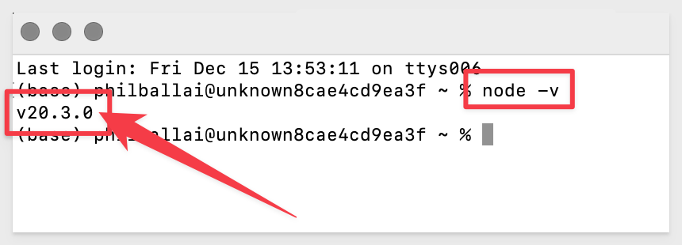

This completes the local configuration and we are ready to develop our first plugin.


<!-- END OF SECTION-->


## React - The First Time
Duration: 20


<aside class="negative">
<strong>NOTE:</strong><br> For those who are lucky enough to be experienced developers, you probably want to skip this section.
</aside>

React is a popular JavaScript library for building user interfaces, particularly single-page applications. It's developed and maintained by Facebook, and has a large community of developers, and a rich ecosystem of tools and libraries.

Since Sigma is a web-based application, React's compatibility with web technologies makes it an ideal choice for developing plugins or extensions.

We will leverage React throughout this QuickStart, but the methods demonstrated can be adapted to any other framework that you may want to use.

### Local Project Folder
Create a folder called `sigma_plugin_hello_world` on your computer where you can locate it easily.

Open `VSCode` (unless it is already open).

Open the new folder:

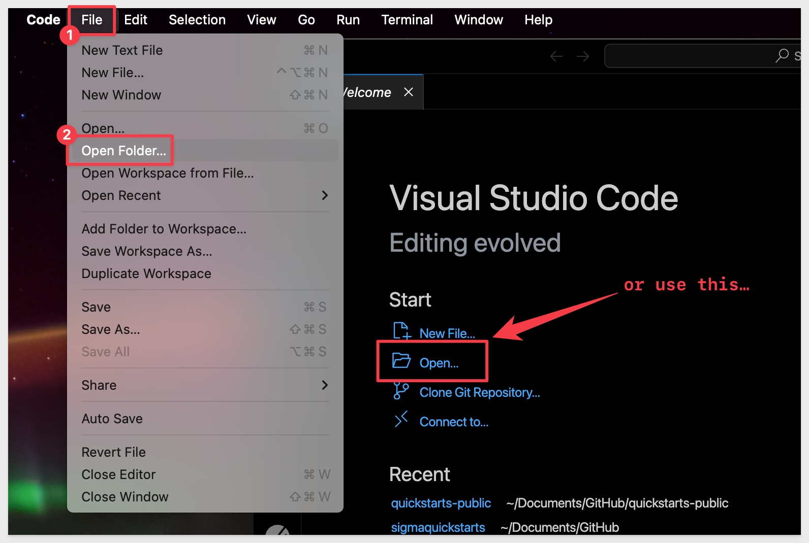

Open a new terminal session in VSCode:

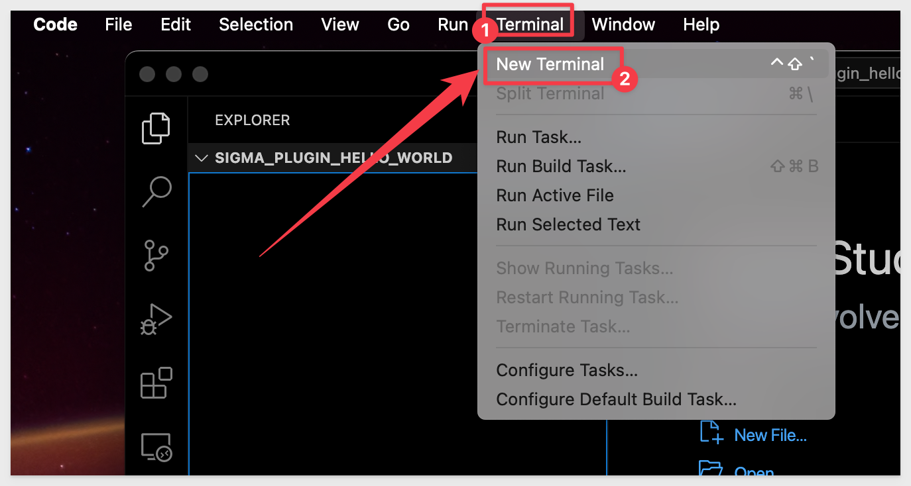

If not sure what folder terminal has opened in, run this command to see the "present working directory":
```code
pwd
```

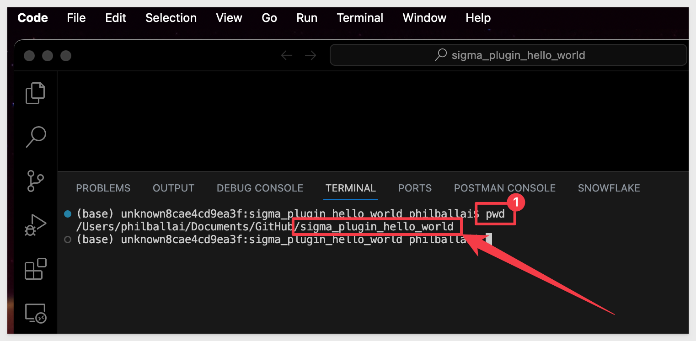

### Install React
Now we will create our first React application. 

In Terminal, run the following command to initialize:
```code
npx create-react-app hello-world
```

The terminal command `npx create-react-app hello-world` is used to create a new React application. 

Here's a breakdown of what each part of the command does:

**npx:** This is a package manager that will manage the installation.

**create-react-app:** This sets up the development environment and builds a project structure for you, which includes the setup of various tools (like Webpack, Babel, ESLint) that are common in React development. It's a boilerplate setup meant to help you get started with React without having to deal with the complexities of configuring these tools yourself.

**hello-world:** This is the name you're giving to your new React application. The create-react-app command will create a directory with this name (hello-world), and inside this directory, it will initialize a new React project.

After running this command, you will have a new folder named `hello-world` in your current directory. 

Inside it, there will be a fully functional React project. You can then navigate into this directory (`cd hello-world`) and start the development server (we will use `npm start`) to begin working on your React application.

This command is widely used because it simplifies the process of setting up a new React project, allowing developers to focus on writing React code rather than worrying about configuring the build and development tools.

When npx is done (`Happy Hacking`), a new folder with many files will be added for use automatically; this is our `hello-world` React application.

<aside class="positive">
<strong>IMPORTANT:</strong><br> npx installed our "hello-world" react app in a new folder called "hello-world". We need to account for that in the next step.
</aside>

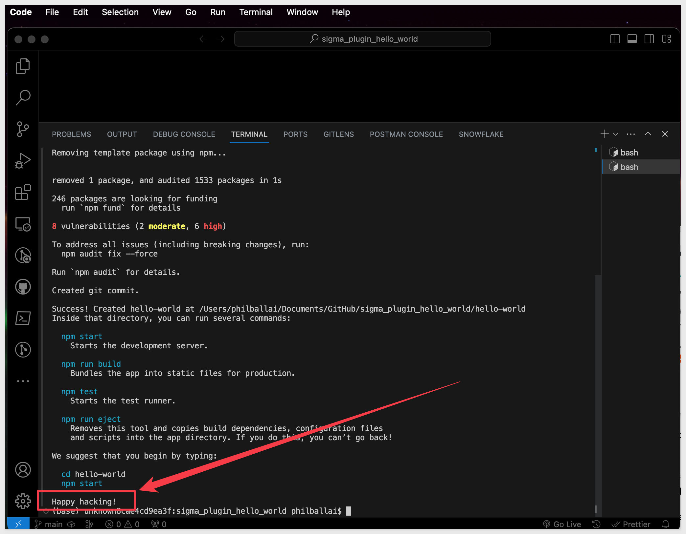

### Start React
In Terminal, change to the new `hello-world` folder:
```code
cd hello-world
```

Run the following command to start the React server:
```code
npm start
```

React will start in the terminal session:

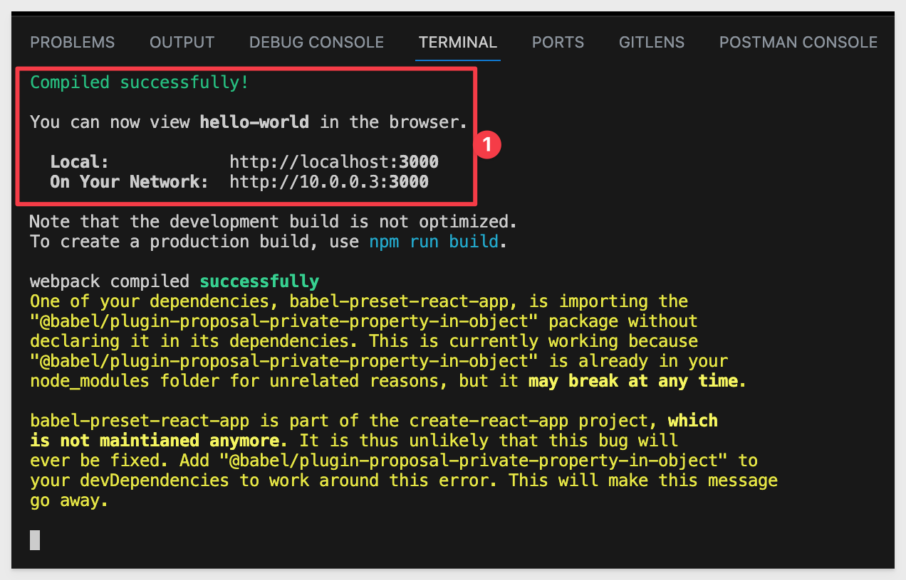

Items shown in yellow text are warnings, and are not of concern for our purposes.

npm will also open the default browser automatically, with the default React content:

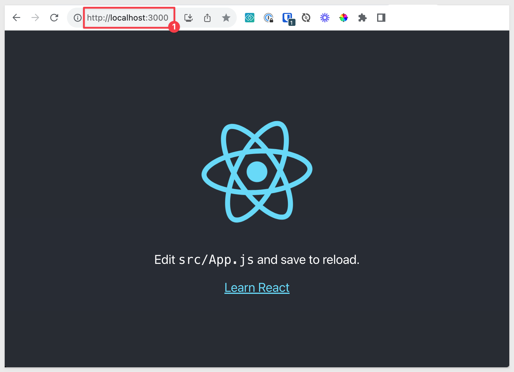

For additional information about React, [visit the website.](https://react.dev/)


<!-- END OF SECTION -->

## Hello World
Now that we have a working React application, lets adjust it to remove the default content, and have it display the text `Hello World`.

In `VSCode`, expand the folder `hello-world` and then expand the sub-folder `scr`. Open `App.js`. 

This file defines the javascript that will drive our page content.

<aside class="negative">
<strong>NOTE:</strong><br> In VSCode, you can drag the Terminal tab (screenshot #4) up next to the other open tabs. This is a personal preference only, but provides more space for the code window.
</aside>

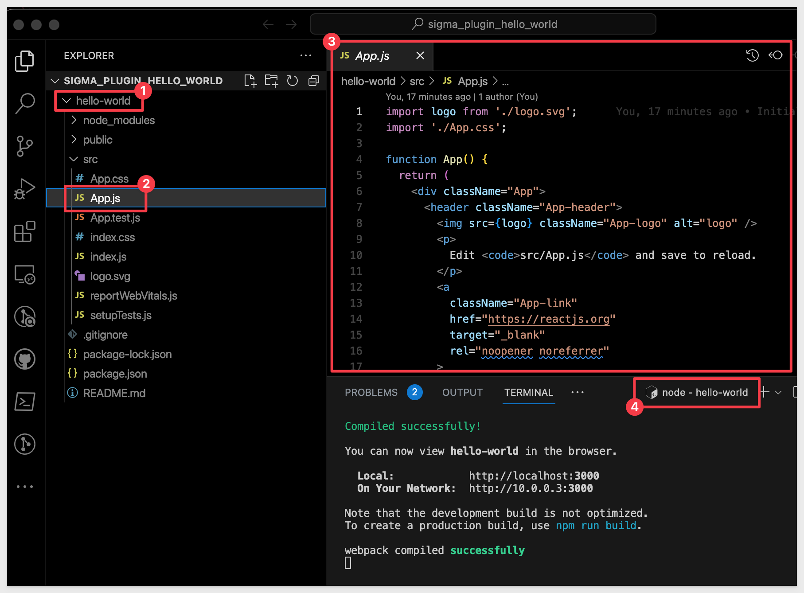


Delete the existing code and replace it with this:
```code
import './App.css';

function App() {
  return (
    <div className="App">
      <h1>Hello World</h1>
    </div>
  );
}

export default App;
```

<aside class="negative">
<strong>NOTE:</strong><br> We never stopped the npm server, so the browser will update automatically once we save this new App.js. If you did close terminal, you will have to start new terminal session, cd to the hello world folder and restart the npm server.</aside>

The browser now shows:

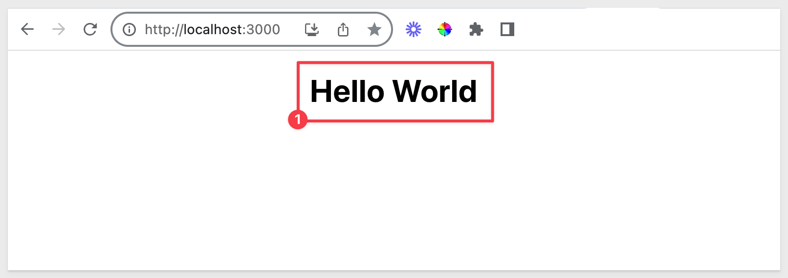

### Sigma Hello World Plugin
Our new React app does not contain much, but that does not mean it can't be used as is with Sigma. Let's do that, so we can walk through the workflow, which is the same, regardless of the Plugin.

<aside class="negative">
<strong>NOTE:</strong><br> This plugin does not render any data; we will get to that in subsequent steps.
</aside>

Login into Sigma as `Administrator`.

Navigate to `Administration` > `Account`, scroll down to  `Custom Plugins` and click `Add`:

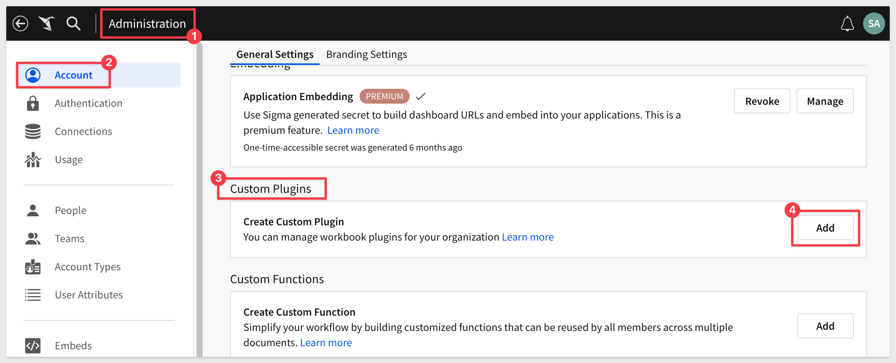

Give it a `Name`, `Description` and a `Production URL`:

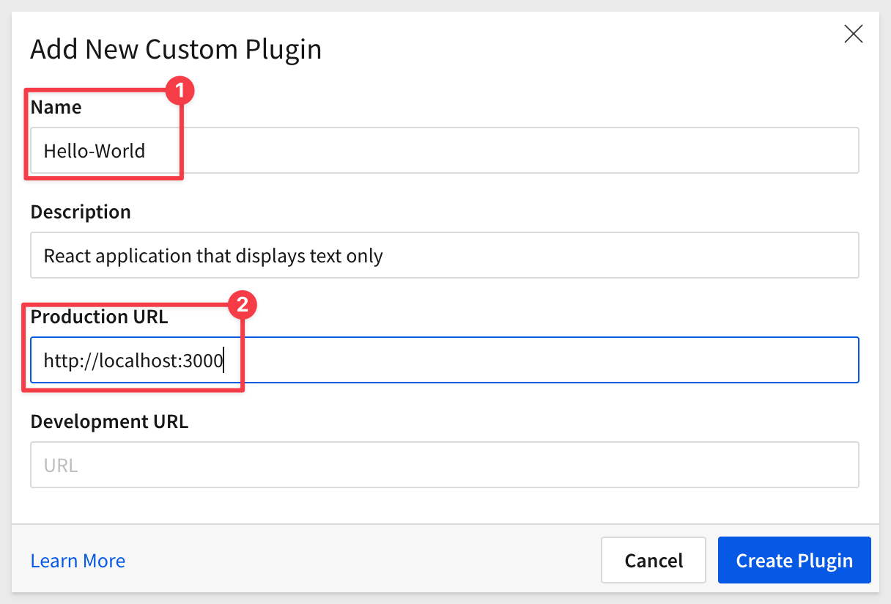

Click `Create Plugin`.

<aside class="positive">
<strong>IMPORTANT:</strong><br> We could use a localhost as the development URL, but to keep things simple (for now), we will just use localhost as the production URL. When the user is logged into the Sigma portal, Sigma will handle the communication with localhost:3000, so there is nothing else that needs to be done on the network.
</aside>

The Plugin is now created, based on our `Hello World` React app. We can now try to use it in a Sigma Workbook.

Create a new Workbook and click `ADD NEW ELEMENT` > `PLUGINS`:

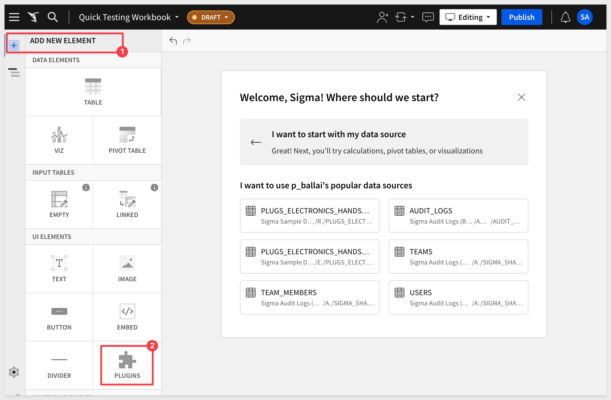

The list of available Plugins will be displayed in the `Element Panel` (we only have one right now):

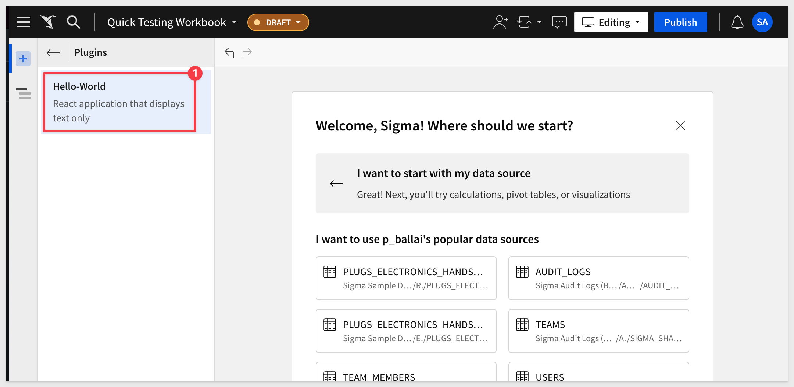

Click to add it to the Workbook page.

The Workbook now shows our working plugin and displays the text as expected:

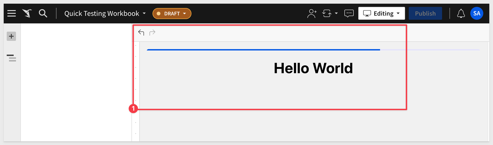

Stop the `npm server` using `CTL + C`. 

Close the local folder in VSCode from the `File` menu.

While this is a simple example, we now have a good foundation in order to build more complex plugins.


<!-- END OF SECTION-->

## QuickStarts Git Repo
Duration: 20

In the following sections, we'll utilize a public Git repository within VSCode to bypass the need for creating content from scratch. We'll start with working code copies, and guide you through the relevant parts, explaining as we proceed.

<aside class="positive">
<strong>IMPORTANT:</strong><br> This repository's contents are not intended for use in a production environment. We make no guarantees regarding the reliability, safety, or suitability of this code for production purposes. Users are cautioned to use the code at their own discretion and risk.
</aside>

### Clone Git Repo
Browse to `https://github.com/sigmacomputing/quickstarts-public`.

In the `quickstarts-public` repository (repo), click the `Code` button and click to copy it's url (screenshot item #2):

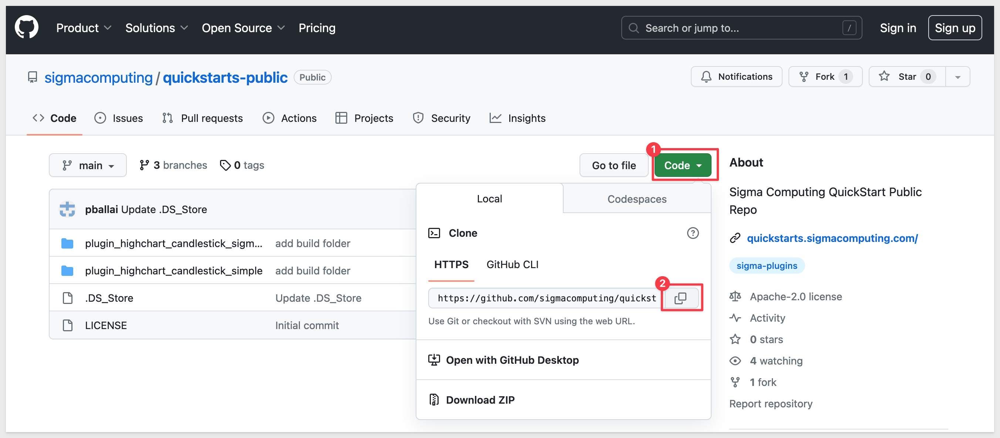

In `VSCode` (on the Welcome tab), click `Clone a Git Repository`:

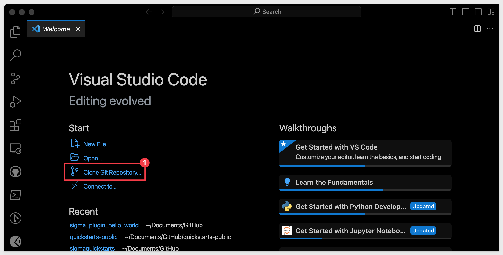

Paste the URL copies from Git as shown and hit `Enter`:

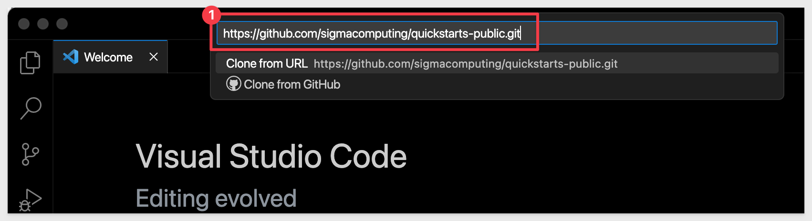

VSCode will prompt for a local folder to store the contents. 

Create a new folder called `quickstarts-plugin` and click `Select as Repository Destination`.

When done (it should be very quick), `Open` the cloned repo.

All the projects in the repo will be available to you now in VSCode. 

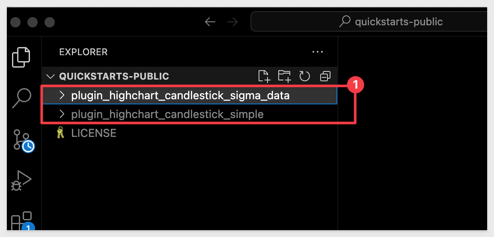

<aside class="negative">
<strong>NOTE:</strong><br> When creating this QuickStart, there were only two sample projects. Yours will likely have more, and that is expected.
</aside>


<!-- END SECTION -->

## Candlestick - Hard Coded Data

First, lets look at what the `plugin_highchart_candlestick_simple` application does in the browser.

<aside class="positive">
<strong>IMPORTANT:</strong><br> We did not include all dependencies in our Git repo on purpose to save space not storing multiple copies of files or storing files that may get updated by a vendor. Additionally, understanding some of these details are very useful when debugging issues later on.
</aside>

Open a Terminal session, cd to `plugin_highchart_candlestick_simple` and run:
```code
npm install
```

This will install all the node dependencies, but we also will need to install the dependencies for `Highcharts.js`, since our project is using that too. 

***How can you tell this project is based on Highcharts.js?***

Open the file `package.json` in the root folder and we can see the list of project dependencies. 

In the screenshot, we can see that there are two required libraries for Highcharts.js that the application code is expecting to be available:

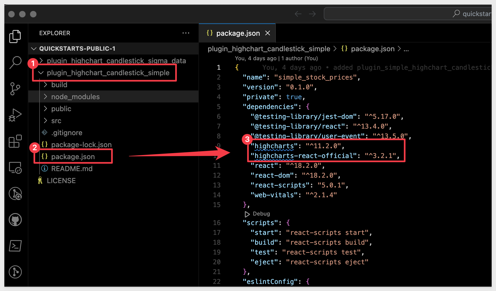

We can easily install the Highcharts.js dependencies:
```code
npm install highcharts
```
and then...
```code
npm install highcharts-react-official
```

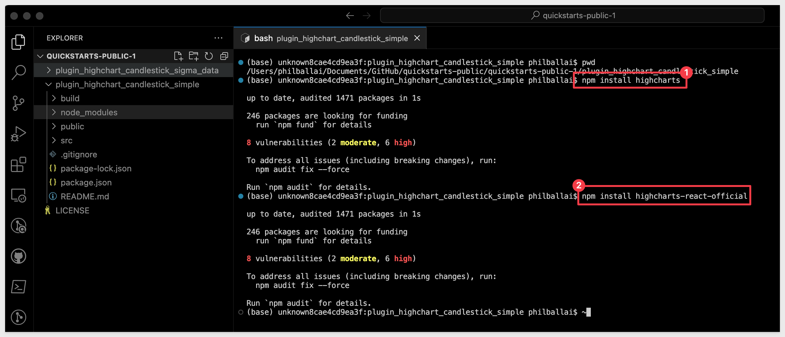

Start React:
```code
npm start
```

The browser will open the new React page and this time, we have a candlestick chart of stock prices. 

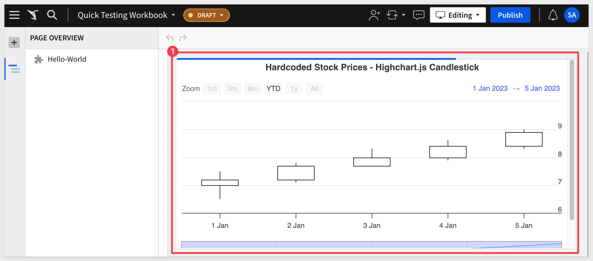

<aside class="negative">
<strong>NOTE:</strong><br> We just used the same Workbook that already had our "Hello World" Plugin setup, since it uses the same URL. If you prefer, you can create separate Workbook pages for the different examples. To do that, you will need each new plugin on the "Administration > Account > Plugins page of Sigma.
</aside>

The chart is being driven by data that is hardcoded in `App.js`.

We can look at that code to see what it is doing by opening `App.js` and reviewing each section of code:

### Breaking down App.js
Here is the code, with in-line comments to explain their purpose for your review. 

```code
// Importing necessary modules and components
import React from 'react'; // Importing React to use its features in this component
import Highcharts from 'highcharts/highstock'; // Importing Highcharts for stock charts
import HighchartsReact from 'highcharts-react-official'; // Importing HighchartsReact to integrate Highcharts with React

// Defining the main component of the app
const App = () => {
  // Hardcoded sample data for the chart
  // Each array represents a point on the chart with the format [date, open, high, low, close]
  const sampleData = [
    [Date.UTC(2023, 0, 1), 7.0, 7.5, 6.5, 7.2],
    [Date.UTC(2023, 0, 2), 7.2, 7.8, 7.1, 7.7],
    [Date.UTC(2023, 0, 3), 7.7, 8.3, 7.7, 8.0],
    [Date.UTC(2023, 0, 4), 8.0, 8.6, 7.9, 8.4],
    [Date.UTC(2023, 0, 5), 8.4, 9.0, 8.3, 8.9],
  ];

  // Configuration object for Highcharts
  const options = {
    chart: {
      type: 'candlestick' // Setting the chart type to 'candlestick'
    },
    rangeSelector: {
      selected: 1 // Setting default range selection
    },
    title: {
      text: 'Hardcoded Stock Prices - Highchart.js Candlestick' // Chart title
    },
    series: [{
      name: 'Stock Price', // Name of the data series
      data: sampleData, // Data for the chart
      tooltip: {
        valueDecimals: 2 // Format the tooltip values to two decimal places
      }
    }]
  };

  // Rendering the HighchartsReact component
  return (
    <HighchartsReact
      highcharts={Highcharts} // Passing the Highcharts module
      constructorType={'stockChart'} // Specifying the chart type as a stock chart
      options={options} // Passing the configuration options
    />
  );
}

// Exporting the App component for use in other parts of the project
export default App;
```

The exported `default app`, is rendered in a standard HTML page and then in an iframe in Sigma, as a plugin. 

It does this using `/src/index.js`, which in turn uses `/public/index.html` to render the webpage. Notice that we did not have to adjust any code on those pages!

Close `App.js` and any other files you have open in `VSCode`. You may leave the Terminal session open, but terminate the web-server (`CTL+C`).

Next we will connect this chart to Sigma's Sample data by modifying App.js.


<!-- END OF SECTION-->

## Candlestick - Sigma Data
Duration: 20
 
 In `VSCode`, expand the `plugin_highchart_candlestick_sigma_data` folder and then `src` and click top open `App.js`.

 `App.js` has some additional code to allow it to use data provided by Sigma's interface. 

 We will discuss this, but first we need to install the project dependencies as in the last step.

 <aside class="positive">
<strong>IMPORTANT:</strong><br> Make sure Terminal is in the correct folder before running these commands!. <br>
<br>
The folder is "plugin_highchart_candlestick_sigma_data". 
</aside>

Here they are for convenience:

```code
npm install
```

```code
npm install highcharts
```

```code
npm install highcharts-react-official
```

There is an additional dependency that was not required by the hard-coded data example; the **Sigma Plugin Development API.**

This module enables the plugin to use the Sigma Element panel and more. 

```code
npm install @sigmacomputing/plugin
```

Now we can use Terminal to start the server for this project:
```code
npm start
```

when browser opens, nothing is displayed. Using Chrome Inspector, we see that there are `No issues detected so far`. This is expected and good.

Nothing is displayed because we need to use Sigma to enable the Plugin to access the specified `Source` and `Column` configuration.

Leave the server running and return to Sigma.

We can use the same Plugin (Hello World), or you can create a new one if you prefer.

The next point is very important so make sure you read it!

<aside class="positive">
<strong>IMPORTANT:</strong><br> Sigma Plugins expect data to be available in a Workbook so that they can reference it. The data can exist on another Page that is hidden (if preferred), but the Plugin otherwise will not work. You cannot use a Plugin to access the workflow provided when using "Connections" in Sigma.
</aside>

In Sigma, return to the Workbook we created earlier.

Notice that our new Plugin is available but when we click it, the `Element Panel` does not have any source data to choose from. 

This is because we have not added a data source to this Workbook. 

Lets add a table from Sigma's Sample Data. We normally would not include every column to make the chart as efficient as possible but let's just keep moving:

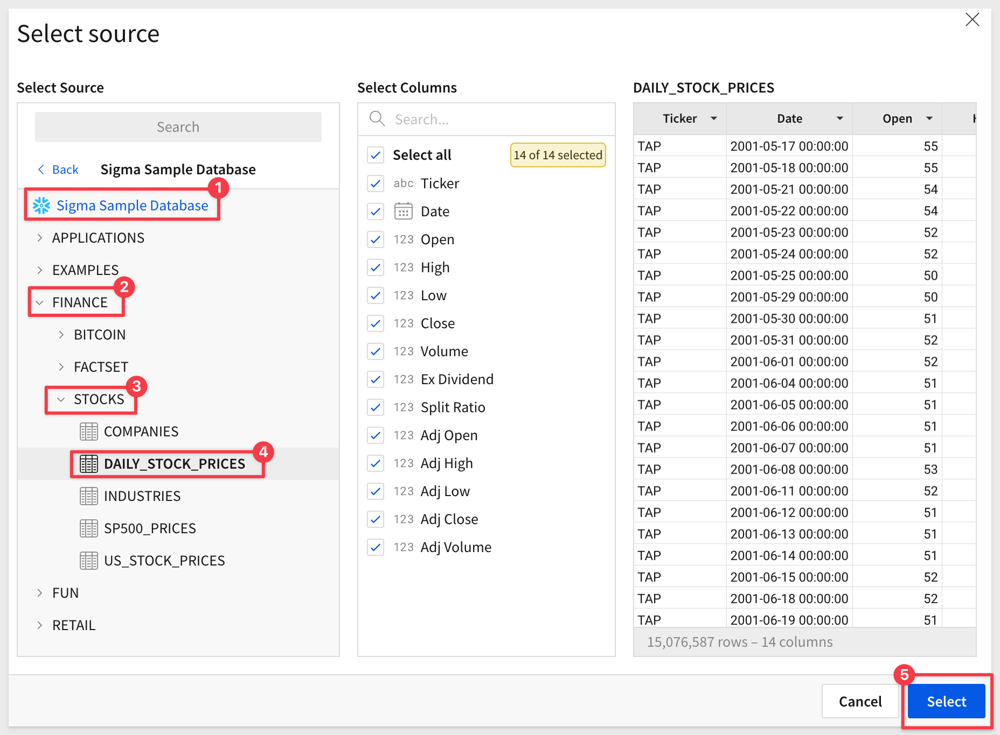

Now that we have some data in the Workbook, the Plugin can reference it:

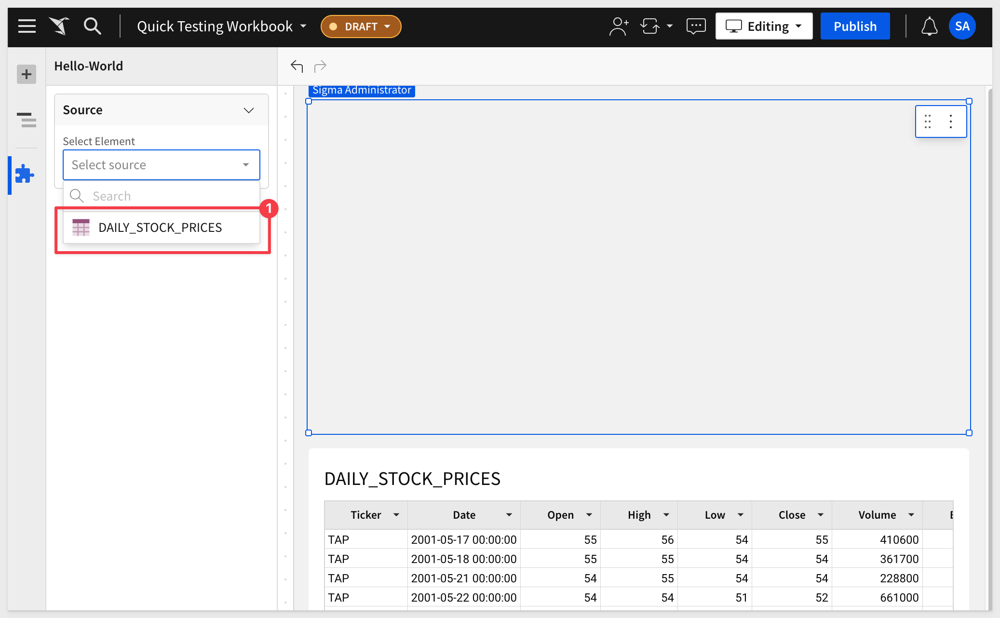

For each column, we need to select the matching column of data:

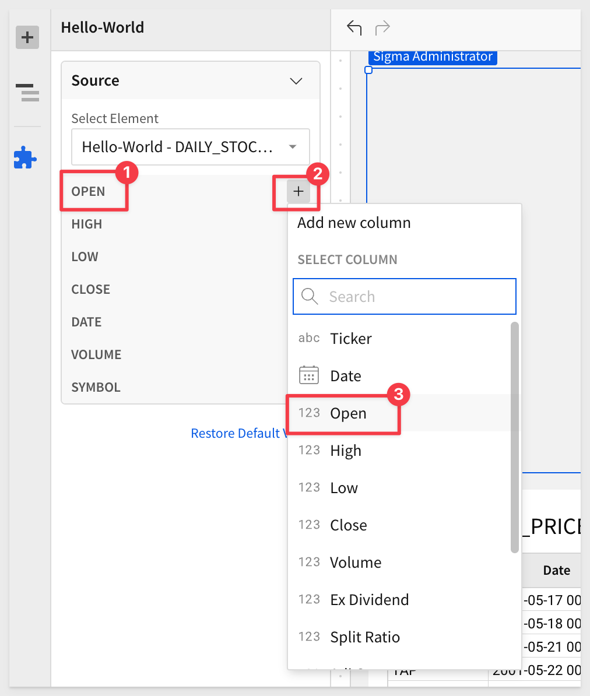

Until they all have a match:

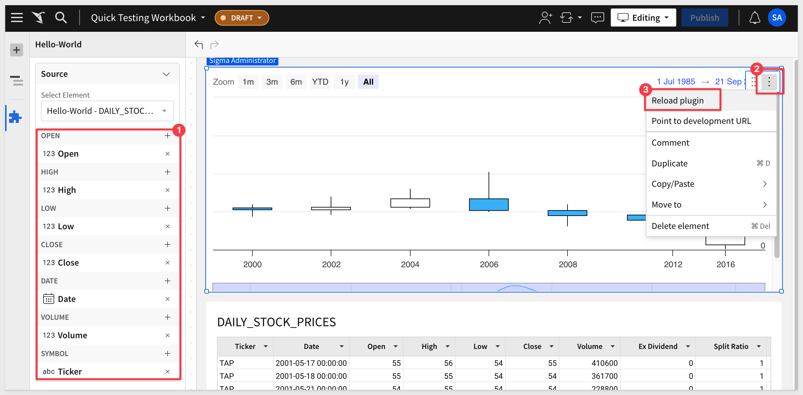

<aside class="negative">
<strong>NOTE:</strong><br> When matching, the Plugin window may show an error. That is expected; just assign them all. If the error does not clear once all are configured, use "Reload Plugin" as shown in the screenshot above.
</aside>

We can extend the Workbook to allow the user to select a particular company (ticker), and have the filter control "target" the DAILY_STOCK_PRICES" table, the Plugin also is filtered. For example, filtering for `IBM`:

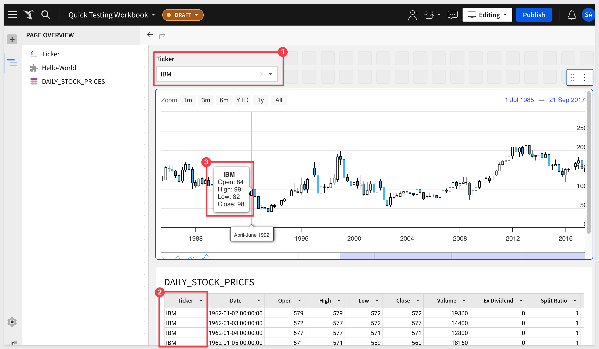

That is the end of instructional content for this QuickStart.

The next few sections show the output of many other Plugins that are included in the `quickstarts-public` repository. We hope you find them useful, now that you have all the fundamentals down.


<!-- END OF SECTION-->

## Deploy to Hosting Service (optional read)
Duration: 20

Sigma makes it easy to develop and test a plugin using a locally hosted server (ie: http://localhost:3000) but for production use, you are going to want to host using an well-established and reliable (and affordable) hosting provider.

There a too many hosting providers to list, nor would be recommend any particular service as best. 

In building this QuickStart, we used the free-tier hosting offered by [Netlify](https://www.netlify.com/pricing/).

According to their website, "Netlify is the platform developers love for building highly-performant and dynamic websites, e-commerce stores and web applications."

After becoming familiar with where the specific menu items were in the Netlify UI, it was easy to use it, instead of localhost to test plugins. 

There are only a few steps involved (for base testing anyway) and in this section, we will show you them.

First, sign-up for a free account and login. We did not use the github integration, but that is a "must have" feature for continuous development workflows.

You will have to create a project; we called ours `QuickStarts`. The name does not matter much right now.

Before we can do anything else, we have to create a `build` package to deploy to Netlify. This is very straightforward.

In VSCode, open the plugin project we have been working on. 

We will demonstrate with `Hello World`

<aside class="positive">
<strong>IMPORTANT:</strong><br> It is assumed that these are all working if you got this far in the QuickStart (against localhost). Select one that you are sure works. There is no need to get complexity in this step; using the "Hello World" is fine for a first try.
</aside>

Open a Terminal session and change to the folder `Hello-world`.

Run this command, which will create our `build` package for us automatically:
```code
npm run build
```

When done, a `build` folder will appear in the project:

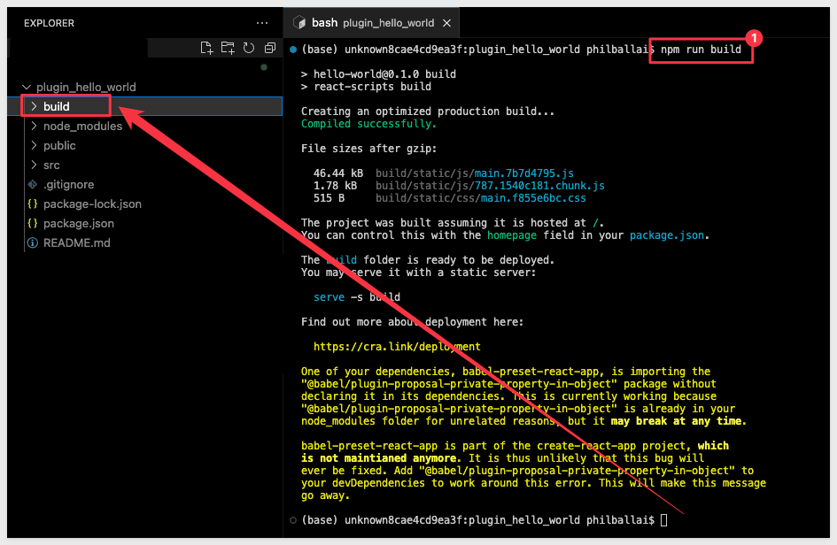

It is this folder that needs to be copied to our hosting provider. Nothing else is required.

In Netlify (for your project), navigate to `Team overview` and click `Add new site` and `Deploy manually`:

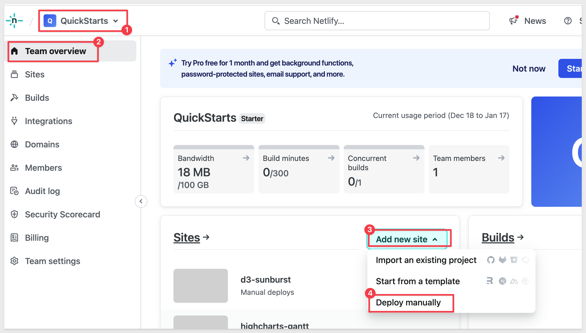

Netlify will provide a place for you to drag and drop the `build` folder into (or you can browse to it).

<aside class="negative">
<strong>NOTE:</strong><br> Don't drag and drop from VSCode, do it from the file explorer.
</aside>

Drag the `build` folder over.

Netlify will upload and provision the new site automatically. It also creates a random url for us, but we prefer to change that to something more useful.

Navigate to `Site configuration` and scroll down to find `Change site name`. Click that button:

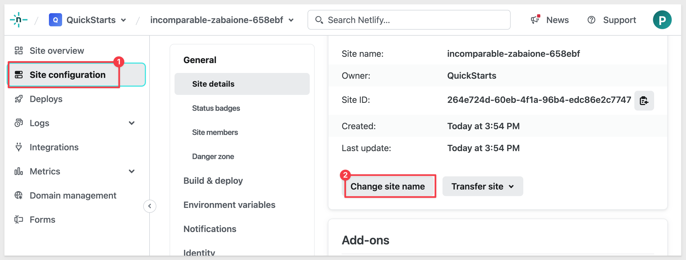

We used `plugin_hello_world`. You are prompted if the name is not available. If it is not, pick something else that makes sense.

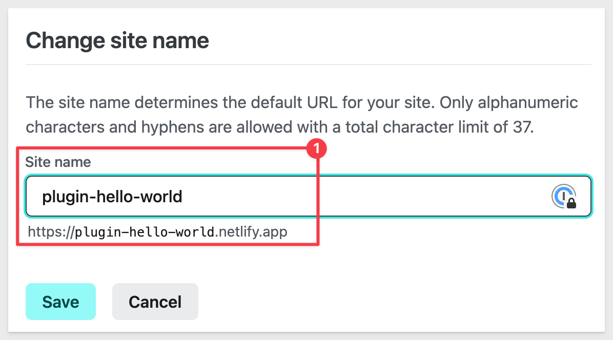

Scroll back up on the page and right-click on the URL (as shown below) and `copy link address`:

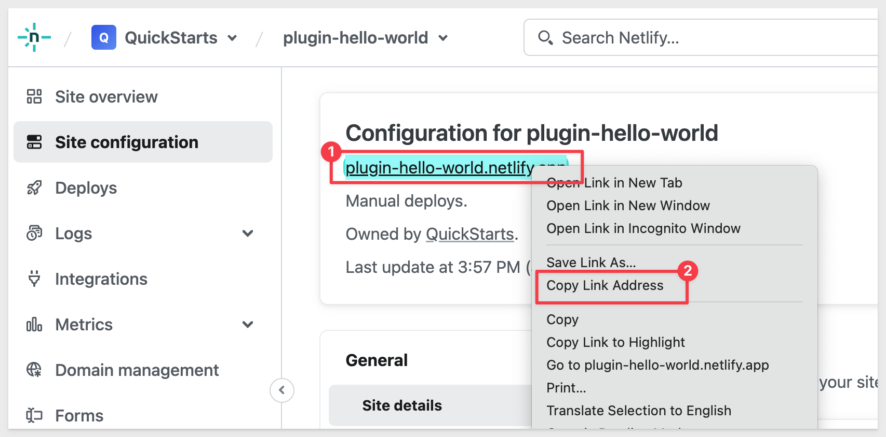

This is the URL that will reference our hosted hello-world plugin in Sigma.

The next steps are familiar by now, but we will summarize.

In Sigma, navigate to `Administration` > `Account` and `Custom Plugins`.

Click the `Add` button. 

Name the new plugin `Hello-World` and paste the URL copied from Netlify into the `Production URL` and click `Create.`

Try to use the `Hello-World` plugin on a Workbook page. The results should be:

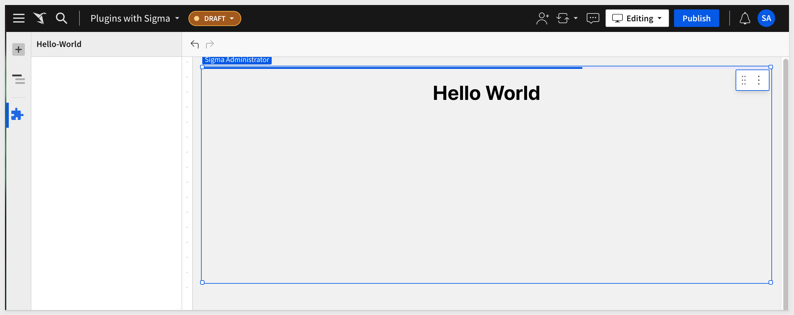

We used this same workflow to test every plugin demonstrated in this QuickStart. Of course, production grade hosting has more configuration that we showed, but the plugin process remains quite simple and very powerful.


<!-- END OF SECTION-->

## Waterfall (Highcharts.js)
Duration: 20

This example uses the [Highchart.js Waterfall visualization.](https://www.highcharts.com/demo/highcharts/waterfall) 

The git project is named `plugin_highchart_waterfall`

Once pulled into VSCode from Git, don't forget to install the dependencies.

<aside class="positive">
<strong>IMPORTANT:</strong><br> It is a good practice to check the file "package.json" to determine what other modules may be required. 
</aside>

```code
npm install
```

```code
npm install highcharts
```

```code
npm install highcharts-react-official
```

```code
npm install @sigmacomputing/plugin
```

### Sigma Workbook Configuration
This Plugin requires we add the table from `Sigma Sample Data` > `RETAIL` > `PLUGS ELECTRONICS` > `PLUGS_ELECTRONICS_HANDS_ON_LAB_DATA` table

The final design looks like this:

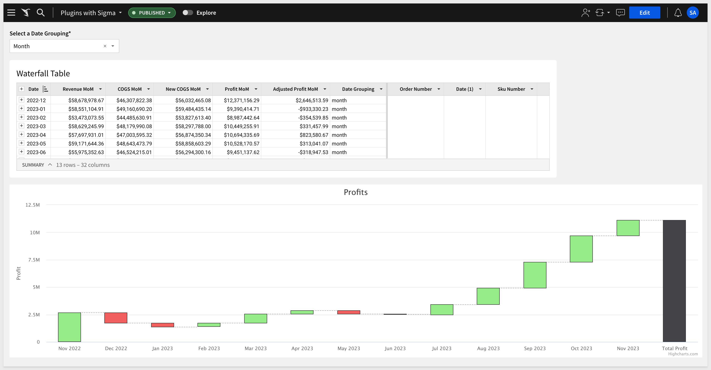

The workbook needs to have a `Control Element` that is hard-coded with values for day, week, month and year. The control should target the table.

The Control Element's `Control ID` is set to `date_grouping` and this is referenced in the table, in calculated column called `Date Grouping`. This is how the hard-coded list of values is inserted into the table when the user changes the control. Sigma's Control element can be very powerful when used like this.

[For more information on Controls, click here.](https://help.sigmacomputing.com/hc/en-us/articles/1500011982902-Intro-to-Control-Elements)

The table is configured like this:

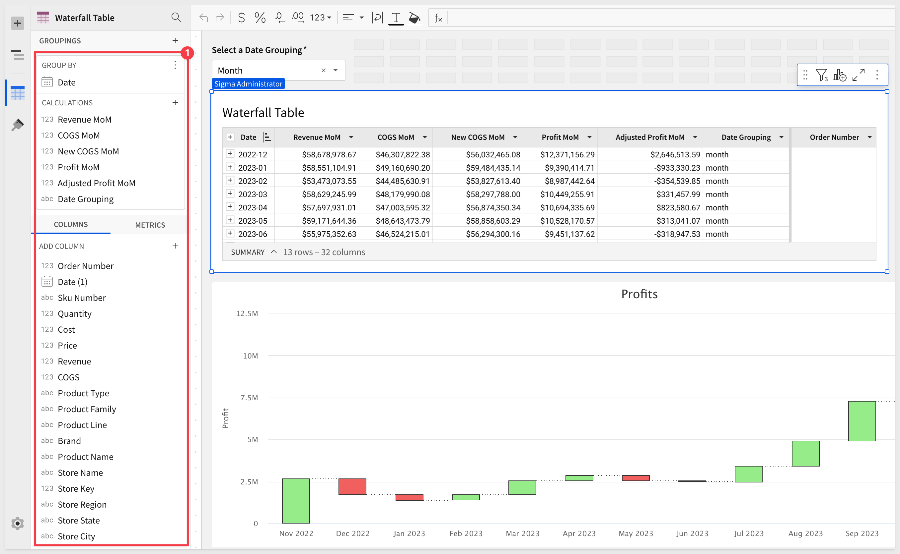

The Waterfall Plugin is configured like this:

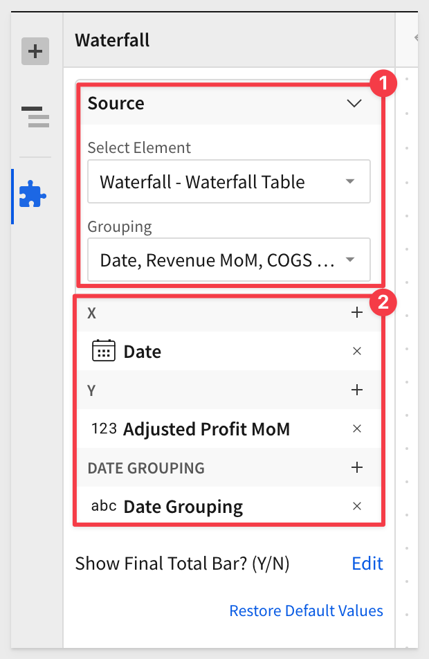

The only "trick" that is included in this example is the inclusion of a table column called `New COGS MoM`. We did this so that we could apply an adjustment to our data, so that we had some months with negative profits. We wanted to show some red on our example. 

For example, the formula for this column was: [COGS MoM] * 1.21, which works to increase our COGS and lower our profits. 

Here is what it looks like in action:

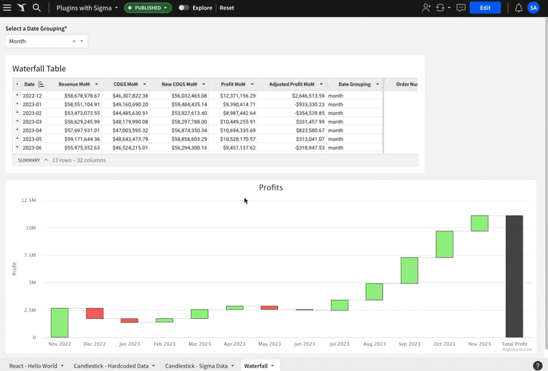


<!-- END OF SECTION-->


## Gantt Chart
This example uses the [Highchart.js Gantt chart.](https://www.highcharts.com/docs/gantt/getting-started-gantt) 

The final design looks like this:

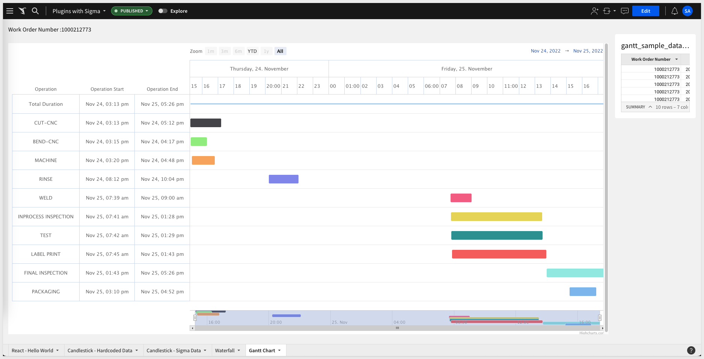

The git project is named `plugin_highchart_gantt`

Once pulled into VSCode from Git, don't forget to install the dependencies.

<aside class="positive">
<strong>IMPORTANT:</strong><br> It is a good practice to check the file "package.json" to determine what other modules may be required. 
</aside>

```code
npm install
```

```code
npm install highcharts
```

```code
npm install highcharts-react-official
```

```code
npm install @sigmacomputing/plugin
```
This project has two new dependencies that need to be installed in addition to the ones we have done in the past.

```code
npm install react-dom
```

```code
npm install react-scripts
```

### Sigma Workbook Configuration
For this example, we will create a new table in Sigma from a CSV file. The sample file has 1 work order and 10 corresponding rows of data in it. We will use this to generate a sample Gantt chart. 

[You can download this CSV here:](https://sigma-quickstarts-main.s3.us-west-1.amazonaws.com/csv/gantt_sample_data.csv)

Once you have the file, create a new table in Sigma by importing the CSV. 

Add the Gantt plugin and configure it as follows:

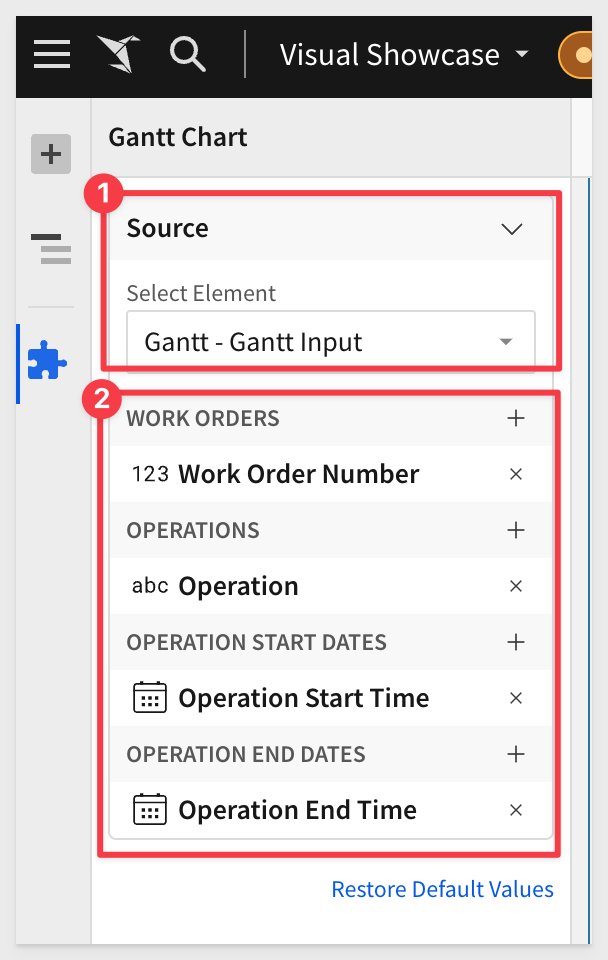


<!-- END OF SECTION-->

## Sunburst (D3.js)
Duration: 20

This example uses the [D3.js Sunburst visualization.](https://observablehq.com/@d3/sunburst/2?intent=fork) 

This Plugin requires we add the table from `Sigma Sample Data` > `RETAIL` > `PLUGS ELECTRONICS` > `PLUGS_ELECTRONICS_HANDS_ON_LAB_DATA` table.

The final design looks like this:

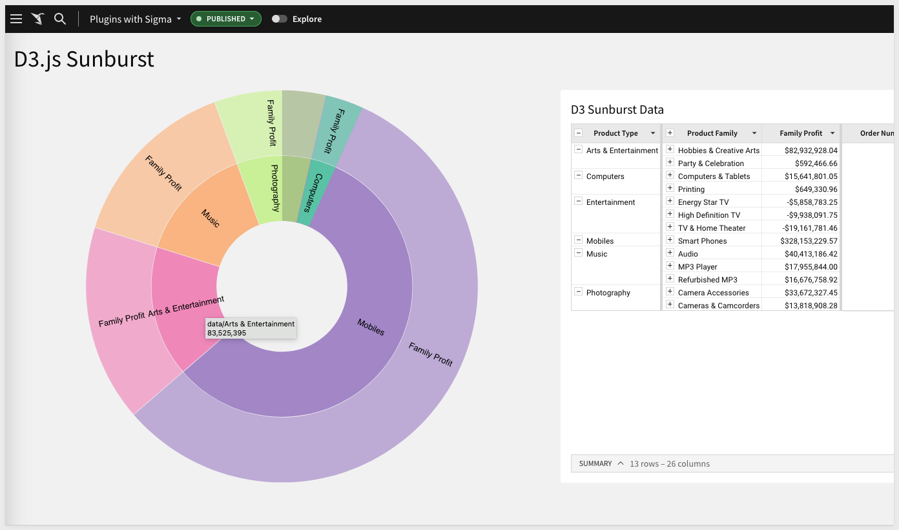

The git project is named `plugin_d3_sunburst`

Once pulled into VSCode from Git, don't forget to install the dependencies.

<aside class="positive">
<strong>IMPORTANT:</strong><br> It is a good practice to check the file "package.json" to determine what other modules may be required. 
</aside>

```code
npm install
```

```code
npm install D3
```

```code
npm install lodash
```

```code
npm install date-fns
```

```code
npm install react-dom
```

```code
npm install react-scripts
```

```code
npm install @sigmacomputing/plugin
```

### Sigma Workbook Configuration

Configure the table like this, adding calculated columns for `Family Profit` and new columns for `Revenue` and `COGS`.

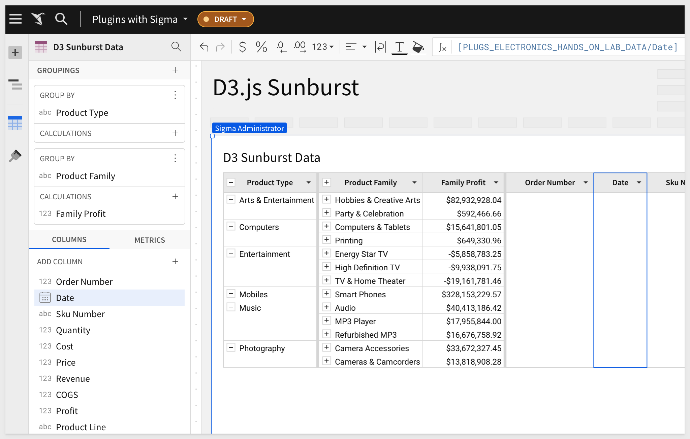

The Sunburst plugin is configured like this:

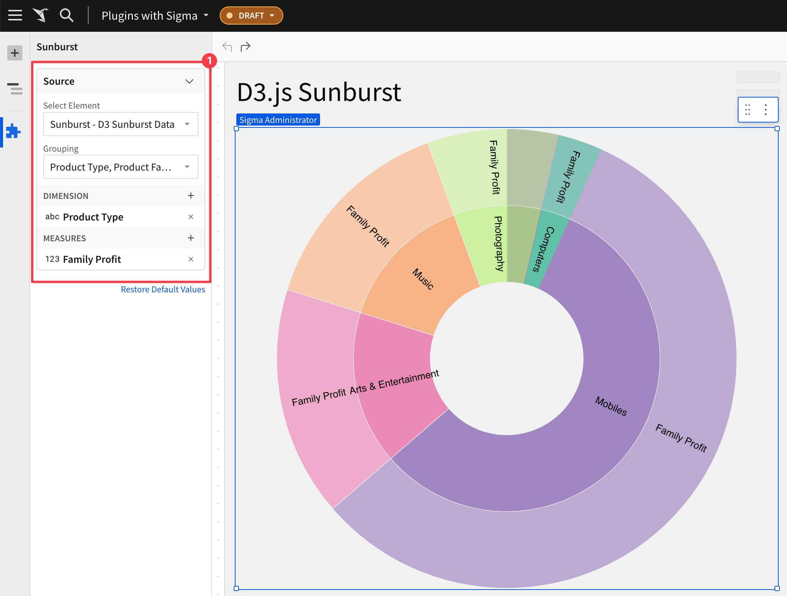


<!-- END OF SECTION-->

## What we've covered
Duration: 5

In this lab we learned how to use VSCode with React, create a variety of plugins, and deploy them in Sigma. In addition, we also covered how to use a hosting provider to test deploying that way.

We trust you found this content useful.

### Additional Resource Links
[Blog](https://www.sigmacomputing.com/blog/)<br>
[Community](https://community.sigmacomputing.com/)<br>
[Help Center](https://help.sigmacomputing.com/hc/en-us)<br>
[QuickStarts](https://quickstarts.sigmacomputing.com/)<br>
=======
Be sure to check out all the latest developments at [Sigma's First Friday Feature page!](https://quickstarts.sigmacomputing.com/firstfridayfeatures/)
<br>

[](https://twitter.com/sigmacomputing)&emsp;
[](https://www.linkedin.com/company/sigmacomputing)&emsp;
[](https://www.facebook.com/sigmacomputing)


<!-- END OF WHAT WE COVERED -->
<!-- END OF QUICKSTART -->
