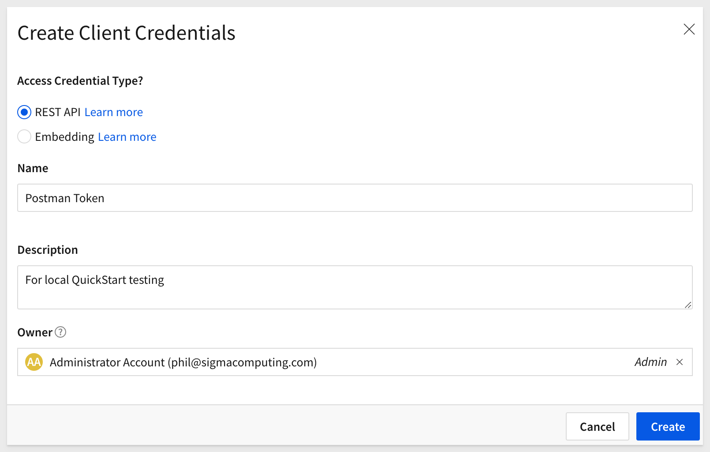
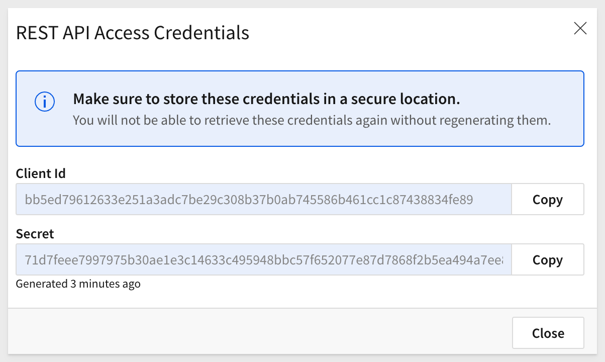

author: pballai
id: developers_quickstarts_api_tookit
summary: developers_quickstarts_api_tookit
categories: Developers
environments: web
status: published
feedback link: https://github.com/sigmacomputing/sigmaquickstarts/issues
tags: Default
lastUpdated: 2025-09-16

# QuickStarts API Toolkit

## Overview 
Duration: 5 

The QuickStarts API Toolkit (“toolkit”) is designed to let you experiment with Sigma API calls and learn common request flows.

The toolkit is completely self-contained—just clone the GitHub repository, authenticate, and you’re ready to go!

If you prefer working with raw JavaScript recipes, that option is still available. See the QuickStart: [Sigma REST API Recipes](https://quickstarts.sigmacomputing.com/guide/developers_api_code_samples/index.html?index=..%2F..index#0)

<aside class="positive">
<strong>IMPORTANT:</strong><br> This project does not replace or supersede the official Sigma API reference. It is also not intended for production use—<strong>use at your own risk.</strong>
</aside>

### What’s Included
The toolkit includes a web portal that provides an easy way to:

- Authenticate to Sigma and obtain a valid API bearer token
- Save authentication settings to encrypted local storage, making it simple to test across multiple Sigma instances
- Run many of the API recipes directly
- Manually configure parameters or select them from a list when the corresponding resource is available in Sigma
- View the response and copy it to the clipboard
- View the recipe script and copy it to the clipboard
- Access README files with details at both the toolkit and recipe levels

Once built, the portal is accessible on your localhost:


<aside class="positive"> <strong>README:</strong><br> Every operation includes a README that should be reviewed—especially for bulk operations and recipes that download content. </aside>

**Bonus:**<br>
The toolkit also includes many simple API GET methods in the `Quick API` tab. These provide a fast way to check the response of an endpoint—for example, when you need a value not visible in the Sigma UI.

While not full recipes, they can be real time-savers. We’ve included some of the most popular ones, though this is not a comprehensive list of endpoints.


For the full and most up-to-date list of Sigma API operations, see the [Sigma API Reference](https://help.sigmacomputing.com/reference/get-started-sigma-api)

<aside class="positive">
<strong>IMPORTANT:</strong><br> Some screens in Sigma may appear slightly different from those shown in QuickStarts. This is because Sigma continuously adds and enhances functionality. Rest assured, Sigma’s intuitive interface ensures that any differences will not prevent you from successfully completing any QuickStart.
</aside>

For more information on Sigma's product release strategy, see [Sigma product releases](https://help.sigmacomputing.com/docs/sigma-product-releases)

If something is not working as you expect, here's how to [contact Sigma support](https://help.sigmacomputing.com/docs/sigma-support)

### Target Audience
Developers who are evaluating or working with Sigma's REST API. 

### Prerequisites

<ul>
  <li>A computer with a current browser. It does not matter which browser you want to use.</li>
  <li>Administrative access to your Sigma environment.</li>
  <li>Some familiarity with Sigma is assumed. Not all steps will be shown as the basics are assumed to be understood.</li>
  <li>A development environment of choice. We will demonstrate with Microsoft VSCode and related extensions</li>
</ul>

<aside class="postive">
<strong>IMPORTANT:</strong><br> Sigma recommends that you use non-production resources when doing QuickStarts.
</aside>

<button>[Sigma Free Trial](https://www.sigmacomputing.com/free-trial/)</button>


<!-- END -->

## Generate ClientID / Secret
Duration: 10

Before using the API, we need to generate a new API token in Sigma.

Log in to Sigma as an `Administrator.`

Navigate to `Administration` > `Developer Access`.

Click the `Create New` button:


Select `REST API`, then give the token a name and description.

Some customers create a Service Account user for automation purposes—this is considered a best practice.

For testing, you can choose any Admin user you prefer.

Click `Create`.



Copy the `ClientID` and `Secret `from the modal and save them in a secure location—you’ll need them later.

Close the modal:



<aside class="positive">
<strong>IMPORTANT:</strong><br> Treat the ClientID/Secret like passwords; don’t commit them to source control.
</aside>


<!-- END -->

## Environment Setup
Duration: 5 

### Create Sigma Project Folder
Create a new folder on your local computer called `Sigma_QuickStart_Public_Repo`. It does not matter where, as long as you can navigate to it easily.

### Source Code Editor - VSCode 

For this QuickStart, we will demonstrate using Visual Studio Code (VSCode), but you may use any IDE you prefer. 

VSCode, is a source-code editor developed by Microsoft for Windows, Linux and macOS. Features include support for debugging, syntax highlighting, intelligent code completion, snippets, code refactoring, and embedded Git.

[Install VSCode from Microsoft's download site.](https://code.visualstudio.com/download)

Run the installation with all defaults.

Open VSCode and make sure it loads without error and open the folder `Sigma_QuickStart_Public_Repo` we created earlier.

### Runtime Environment - Node.js
Duration: 20

While developers can use any language to communicate with the Sigma REST API, we’ll use the popular framework [Node.js.](https://nodejs.org/en) for our examples.

Node.js (Node) is an open-source, cross-platform, back-end JavaScript runtime environment that runs on the V8 JavaScript engine and executes JavaScript code outside a web browser. It was designed to build scalable network applications.
 
[Download and install Node.js](https://Nodejs.org/en/download/)

Use the LTS (long-term support) version appropriate for your operating system.

Run the installer, selecting all defaults. You do not need to specify your project folder during installation.

This will install both:
- Node
- npm (Node Package Manager, used to install and manage Node components)

The package manager is abbreviated to `npm` when running commands.

You can verify your installation using VS Code’s built-in terminal:


**Run the command:**
```code
node -v
```

This should return a version number, similar to:


<aside class="negative">
<strong>NOTE:</strong><br> Your version number may differ from the screenshot, depending on when you installed Node.
</aside>

Keep the terminal session open for the next steps.

### Git Repository
To save time, all the necessary project files are stored in GitHub. You can clone only what you need using Git sparse checkout.

In terminal, ensure you’re in the `Sigma_QuickStart_Public_Repo` directory. If not, switch to it:

For example:
```code
cd {/path/to/your/directory}
```

Initialize git:
```code
git init
```

Add the remote repository:
```code
git remote add -f origin https://github.com/sigmacomputing/quickstarts-public.git
```

Enable sparse checkout:
```code
git config core.sparseCheckout true
```

Specify the folder to clone by adding it to the sparse-checkout configuration:
```code
echo "recipe-portal" > .git/info/sparse-checkout
```

At this point, each command should run without errors.

Pull the specified folder from the repository:
```code
git pull origin main
```

You should now see the cloned project folder:


Change directories:
```code
cd recipe-portal
```

Install the required Node modules:
```code
npm install
```

This automatically installs the project dependencies used in the recipes

### Start the local webserve
Run the command to start the server:
```code
npm run dev
```

By default, the portal runs on port 3000, but if that port is already in use, it may select a different one. The terminal will display the port number in use:


The portal should now appear as:


<!-- END -->

## Authentication - REQUIRED
Duration: 5 

Before using any toolkit operations, you must first authenticate. Once a valid bearer token is received, it remains valid for 1 hour.

<aside class="positive"> <strong>IMPORTANT:</strong><br> The token is valid for 3,599 seconds (just under one hour) and must be refreshed. Our JavaScript function handles this automatically. </aside>

The authentication script retrieves a bearer token from the Sigma API using client credentials authentication. It:
- Extracts the required credentials from environment variables
- Sends a POST request to the authentication endpoint
- Logs the obtained token
- Exports a getBearerToken function that can be imported into other scripts for accessing protected resources

Click on red `Authentication Required` button to open the modal:


Select the `Request` tab.

This tab allows you to create named “configs” for authentication. If you only have one, that’s fine—but if you work with multiple Sigma instances, configs make it easy to switch between them on the fly.

Select your `Server Endpoint` that corresponds to your Sigma instance.

Provide the `Client ID` and `Client Secret`.

Check the `Store locally` checkbox:


<aside class="negative">
<strong>NOTE:</strong><br> Config details are saved outside of the project, on your local computer. Files are encrypted with 256-bit AES and a passkey that ensures they can only be decrypted on the same machine where they were created.

For security, we do not recommend storing production configs on local user machines. Best practice is to avoid saving production keys in local configs.
</aside>

Click `Save`:

To add more, click `New Config`.

Once ready, select a config and click the green `Authenticate Now` button to get a valid token:


A `Copy Output` link is provided in all cases, which includes the API response and, when applicable, additional debug information.


<!-- END OF SECTION-->

## Testing
Duration: 5 

After closing the authentication modal, we can immediately test.

Click `View Recipe` for the `List All Connection` recipe:


Most recipes and Quick API operations share the same tab layout, though there are a few differences we’ll mention later.

Click `Run Script` since there are no additional parameters to provide:


When a recipe has no required manually entered parameters, it displays the `Ready to Run` pill:


### Smart parameters
Some recipes require parameters, but many of these can be pre-fetched so you can simply select from a list of “friendly names.”

For example, in the `Members` group, look at `Get Member Details`.

Instead of manually locating the required memberID, we pre-fetch them and display a list of usernames. This makes it simple to get the information you need.

Once a selection is made, the corresponding memberID is shown below the list:


Click `Run Script`.

The response is shown in the `Response` tab, which opens automatically. This design saves space when there are many parameters and helps keep the response visible without clutter:


### A word about downloads and bulk operations
A few recipes either download files or require CSV data to process bulk operations. In those cases, always review the associated README for that recipe.

<aside class="positive"> <strong>BEST PRACTICE:</strong><br> When working with downloads or bulk operations, always test with a small sample first. This helps confirm that your parameters and data mappings are correct before making larger or irreversible changes. 

Check the Readme for additional restrictions on these operations.
</aside>


<!-- END OF SECTION-->

## What we've covered
Duration: 5

In this QuickStart, we set up a local test environment using Sigma’s GitHub repository of sample API recipes. We walked through generating authentication credentials, starting the toolkit, and running recipes to explore common API use cases.

With this foundation, you can now experiment with the toolkit to quickly test API flows, validate parameters, and explore how Sigma’s REST API can support your own workflows.

<!-- THE FOLLOWING ADDITIONAL RESOURCES IS REQUIRED AS IS FOR ALL QUICKSTARTS -->
**Additional Resource Links**

[Blog](https://www.sigmacomputing.com/blog/)<br>
[Community](https://community.sigmacomputing.com/)<br>
[Help Center](https://help.sigmacomputing.com/hc/en-us)<br>
[QuickStarts](https://quickstarts.sigmacomputing.com/)<br>

Be sure to check out all the latest developments at [Sigma's First Friday Feature page!](https://quickstarts.sigmacomputing.com/firstfridayfeatures/)
<br>

[](https://twitter.com/sigmacomputing)&emsp;
[](https://www.linkedin.com/company/sigmacomputing)&emsp;
[](https://www.facebook.com/sigmacomputing)


<!-- END OF WHAT WE COVERED -->
<!-- END OF QUICKSTART -->
