author: pballai
id: developers_sigma_calculations
summary: developers_sigma_calculations
categories: Developers
environments: web
status: Published
feedback link: https://github.com/sigmacomputing/sigmaquickstarts/issues
tags: default
lastUpdated: 2023-08-21

# Sigma's Query Engine

## Overview 
Duration: 5 

Many new Sigma customers initially expect to use more warehouse compute due to the direct, easy access to data they can now provide to users.

To offset Snowflake compute costs, Sigma applies multiple tiers of caching and evaluation that effectively reduce warehouse load, while delivering a faster user experience. 

As a result, customers typically see their cost-per-user decrease, as they increase their number of users in Sigma.

For example, here is a demonstration of the savings, based on real customer usage:

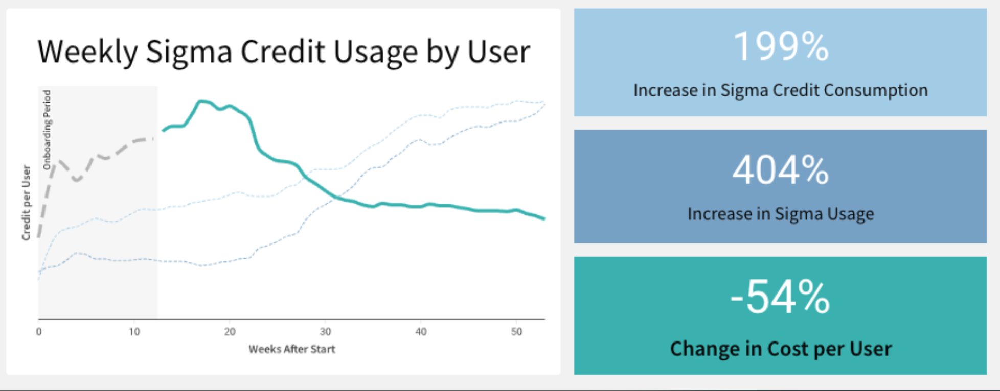

<aside class="negative">
<strong>NOTE:</strong><br> The customer's name was intentionally removed from the image above. If you are interested in getting more information, please reach out to your Sigma Sales team!.
</aside>

This QuickStart introduces and discusses how Sigma is designed to optimize query performance as data is requested by the user interface. Extensive engineering time has been spent to determine a balanced solution that provides the best user experience, performance, and the least cost impact when used with a data warehouse.

To accomplish this, Sigma offers multiple tiers of caching and evaluation, designed to reduce data warehouse load and enhance the user experience.

Using these mechanisms, Sigma helps ensure that customers typically gain far more value from fast, easy access to data than the corresponding increase in cost. Achieving this balance is complex, and certainly not something that is easily done.

Over time, we have observed that for a given organization, economies of scale are realized. This means that as more Sigma users are on-boarded, the associated cost per user decreases.

<aside class="negative">
<strong>NOTE:</strong><br> In ths QuickStart, we will refer to Snowflake, but many warehouse providers provide a version of results caching. This is mentioned later in section 5 as well.
</aside>

<aside class="positive">
<strong>IMPORTANT:</strong><br> Some screens in Sigma may appear slightly different from those shown in QuickStarts. This is because Sigma is continuously adding and enhancing functionality. Rest assured, Sigma’s intuitive interface ensures that any differences will not prevent you from successfully completing any QuickStart.
</aside>

For more information on Sigma's product release strategy, see [Sigma product releases.](https://help.sigmacomputing.com/docs/sigma-product-releases)

### Target Audience
Tech executives, architects, developers and Sigma administrators looking for a deeper understanding of Sigma's unique approach. This approach enables Sigma to perform well against very large datasets without negatively impacting the end-user experience

### Prerequisites

<ul>
  <li>A computer with a current browser. It does not matter which browser you want to use.</li>
  <li>Access to your Sigma environment.</li>
  <li>Some familiarity with Sigma is assumed. Not all steps will be shown as the basics are assumed to be understood.</li>
</ul>

<aside class="postive">
<strong>IMPORTANT:</strong><br> Sigma recommends that you use non-production resources when doing QuickStarts.
</aside>

<button>[Sigma Free Trial](https://www.sigmacomputing.com/free-trial/)</button>
  

<!-- END OF SECTION-->

## Tier Definitions
Duration: 20

Each time a Sigma user performs an operation, Sigma evaluates where the data is retrieved from in order to populate a Workbook's tables, charts, pivots, and other elements.

To perform these calculations as quickly as possible, data operations (calculations) are attempted at various tiers. 

Decisions are made based on where the requested data can be provided to the user most rapidly and at the lowest cost.

The image below illustrates where the query logic occurs, displayed in three "lanes". The items are numbered to correspond with detailed explanations in the subsequent list.

<aside class="positive">
<strong>IMPORTANT:</strong><br> The numbers DO NOT imply an order of operations. We will discuss that in the next section when we explore a typical query workflow.
</aside>

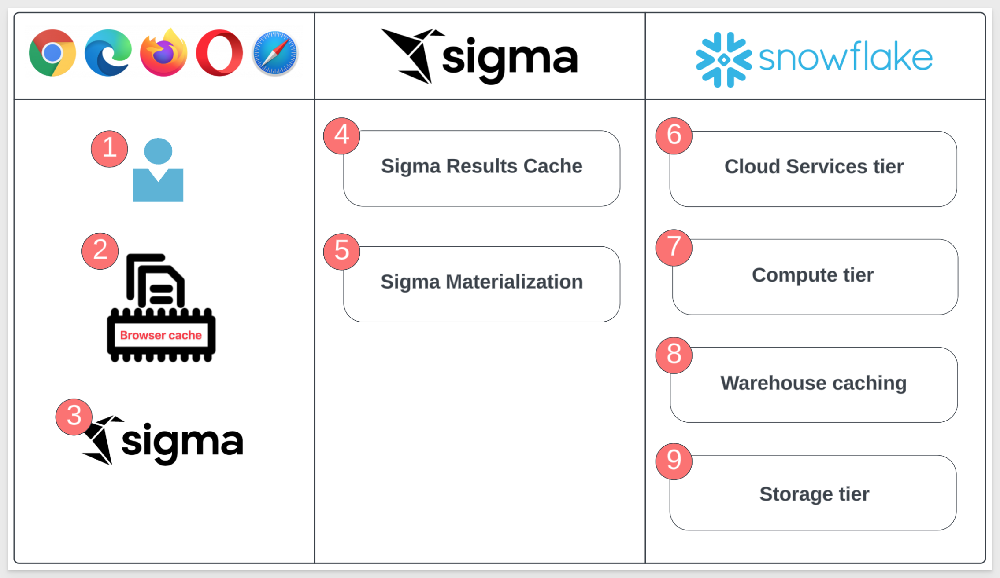

### End User Lane

<strong>1: End User:</strong><br>
A user with a current browser. The choice of browser does not matter.

<strong>2: Sigma Browser Cache:</strong><br>
Sigma maintains a cache of recent results in the web browser. As result sets are returned from Snowflake, they enter the browser cache. Every new query is checked against recent results in the browser cache before anything is sent to Snowflake. When a matching query result is found, no network request or query is issued to Snowflake.

<strong>3: Sigma Alpha Query:</strong><br>
Aside from caching, Sigma has created a tool called Alpha Query that operates as a processing layer to calculate arithmetic operations instead of issuing a query to Snowflake.

Alpha Query leverages the browser's cache to compute new data. It can compute anything using data in cache, but if more data from the warehouse is needed, the request will need to be made to the warehouse.

Alpha Query supports the majority of the functions provided by Sigma today (even lookups!). This unique solution provides Sigma customers the best possible performance when working with data in a browser.

<aside class="positive">
<strong>IMPORTANT:</strong><br> A key benefit of Sigma Alpha Query is that it is seamless. There is nothing to configure, it just works, all the time. so customers benefit now and whenever Sigma adds more advancements.
</aside>

**This substantially decreases the total number of queries issued to Snowflake during data prototyping and exploration.**

### Sigma Cloud Lane

<strong>4: Sigma Results Cache:</strong><br>
Sigma maintains a mapping of Snowflake query ID’s and their Sigma query ID. If a Sigma generated SQL query has been previously run, Sigma can request the result from Snowflake using the query ID instead of reissuing a new query. This allows us to leverage the caching mechanisms of your CDW without storing data in our own servers.<br>

<strong>5: Sigma Materialization:</strong><br>
Any data asset built in Sigma can be materialized as a table within Snowflake. By leveraging materializations on "Manual Triggers" or "Automations" in the Sigma UI, you can establish reusable tables that are less costly and more performant than re-running the queries.<br>

### Data Warehouse (Snowflake) Lane
<strong>6: Cloud Services Tier:</strong><br>
Query results in Snowflake are saved for 24 hours and are used only if the underlying data has not changed, non-deterministic functions are not used, etc.<br>

<strong>7: Compute Tier:</strong><br>
Also referred to as "virtual warehouses", this term describes a set of resources allocated to perform data processing tasks such as loading, querying and running computations on data. These resources can be scaled on demand.<br>

<strong>8: Warehouse Tier:</strong><br>
In this tier, the fully managed caching feature retains the result set of every query executed for 24 hours. Subsequent queries that match previously executed ones are retrieved from the cache rather than reprocessing the entire query. This significantly improves query response times by utilizing previously computed results.<br>

<strong>9: Storage Tier:</strong><br>
The cloud-agnostic, independent, elastic, and scalable component that holds all the data loaded into Snowflake.<br>


<!-- END OF SECTION-->

## Query Decision Tree
Duration: 20

Now that we have the definitions, let's examine what happens when an end-user makes a request for data in Sigma.

The following decision tree is very high-level, and does not include lower-level details such as security, system architecture, and so on. In this QuickStart, we are solely focused on what happens when a Sigma user requests data or performs operations on already retrieved data. It is understood that this is not the only factor related to overall platform performance.

Suppose there is a Sigma workbook that contains one table. The user may (or may not) have added a few calculated columns, and they have published the workbook.

With that example in mind, please take a few minutes to review the decision tree, and consider what is likely to happen at each junction.
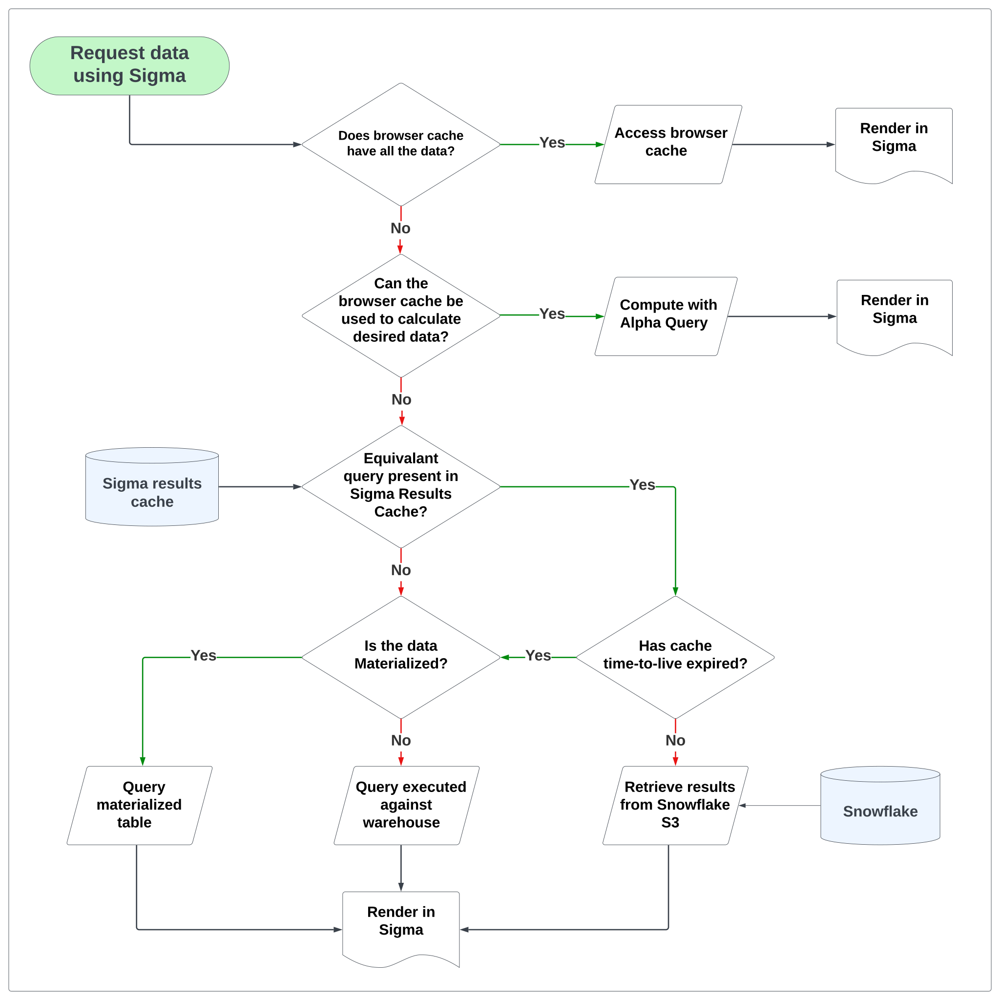


<!-- END OF SECTION-->

## Sigma Alpha Query (In-Browser Calculation)
Duration: 20

It is not immediately obvious that Sigma's Alpha Query is different than the caching that some warehouses do automatically. 

Sigma will re-use existing results (by default), regardless of whether the underlying data has changed. 

There is a control in the Sigma UI to [bypass the result cache](https://help.sigmacomputing.com/docs/workbook-refresh-options) when the latest results are needed instead. There is also a control to determine the [acceptable staleness for query results.](https://help.sigmacomputing.com/docs/set-a-query-id-cache-duration) of whether the underlying data has changed.

In this section, we will discuss operations that are part of this portion of our decision tree:

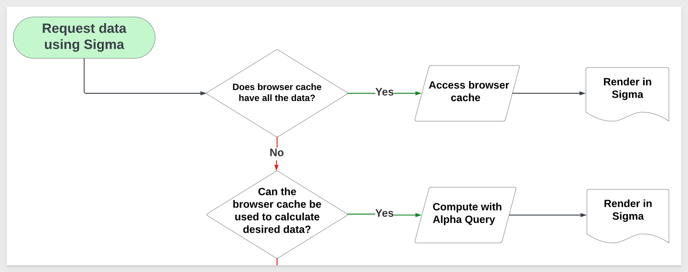

<aside class="positive">
<strong>IMPORTANT:</strong><br> Sigma is able to perform some calculations in the user's browser, resulting in the same interactive performance found in locally installed spreadsheet applications. This is the best case for calculations – it makes Sigma feel fast and powerful, but is just one method Sigma employs to optimize the user's experience. 
</aside>

These calculations are often performed **incrementally**. In many cases, this means that Sigma only needs to perform calculations for a specific change – such as sorting a table, adding a column, or filtering a chart – rather than fully recalculating one or more elements in the Workbook.

There are a few preconditions necessary for in-browser calculations to kick in:

 <ul>
      <li>The in-browser calculation system must support the requested calculation.</li>
      <li>There must be enough rows of data in the browser to calculate complete, correct results. When a table is too large, Sigma cannot pull all of the rows into the browser.</li>
      <li>The data in the browser must be up-to-date and not produce overly stale results. This threshold is configured in a Workbook's Data Refresh Settings.</li>
</ul>

When Sigma cannot perform a calculation in the browser, it falls back to the next portion of the decision tree.

### Incremental Computation with Large Data Sources
Sigma's general approach to in-browser calculations is known as incremental computation. Every time you interact with a Workbook – whether it's adding a column, updating a formula, changing a control, etc. – Sigma determines the minimal set of calculations necessary to produce or update the missing or changed data.

When Sigma can perform all of these calculations in the browser and return correct results, it can skip using the warehouse entirely.

Imagine an analysis involving billions of customer transactions, summarizing a few metrics across 250 retail store locations. The initial summary calculations must be performed in the data warehouse, since it would be impossible to fit billions of fine-grained customer transactions into a browser. However, Sigma can utilize the browser to perform some calculations on the summary metrics, specifically at the granularity of the 250 retail store locations.

For example, Sigma can determine the stores that generated over $10 million in revenue without examining billions of transactions. The only necessary data are the summary metrics for the 250 retail store locations – hence, this calculation can occur within the browser.

### Incremental Computation - Example
Let's explore how this works using the Sigma UI. This will allow you to see how you might evaluate the operations being performed.

1: Log in to Sigma as an administrator.

2: Create a new Workbook in Sigma:

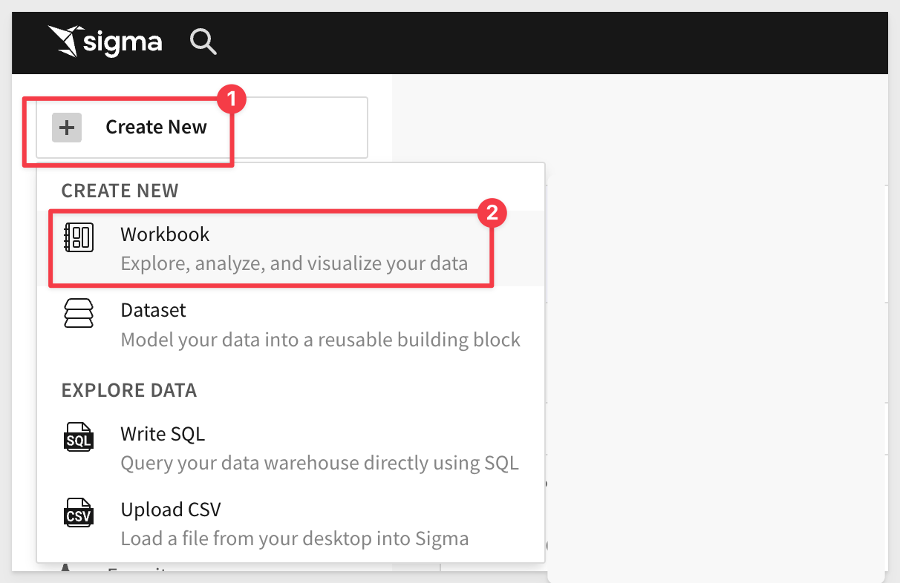

3: Add a new Table:

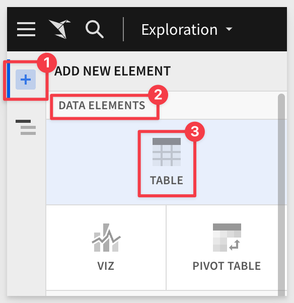

4: From `NEW` > `TABLES AND DATASETS`:

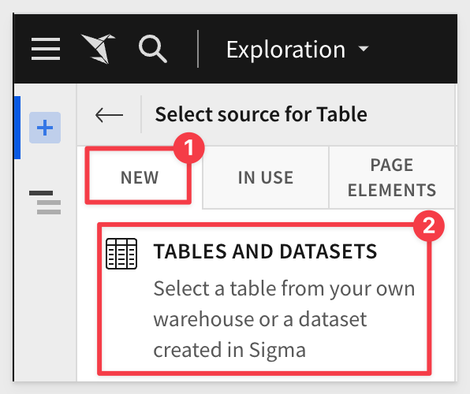

5: Select the `Sigma Sample Database` > `RETAIL` > `PLUGS ELECTRONICS` > `F_POINT_OF_SALE` table:


5: Select the Sigma Sample Database > RETAIL > PLUGS ELECTRONICS > F_POINT_OF_SALE table:

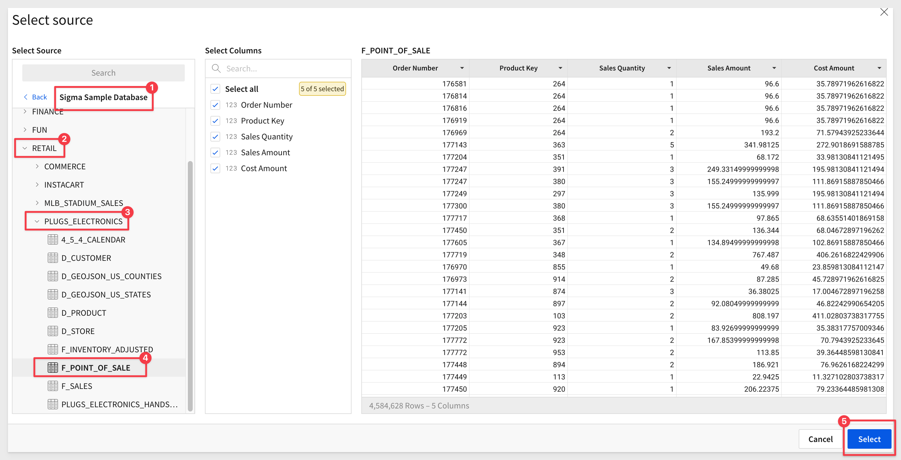

6: You will now see a new, unsaved Exploration. Before proceeding, observe how Sigma generated queries to the warehouse.

7: Open the Query History to evaluate what query operations Sigma is creating.

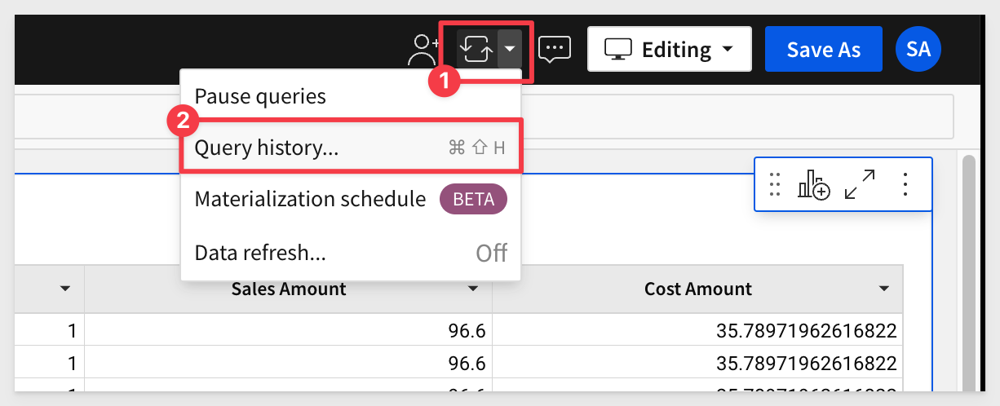

8: Note the three rows. Click on the slider to also show in-browser calculations. There are none so far since this is the first time the data from the warehouse has been requested for this workbook.

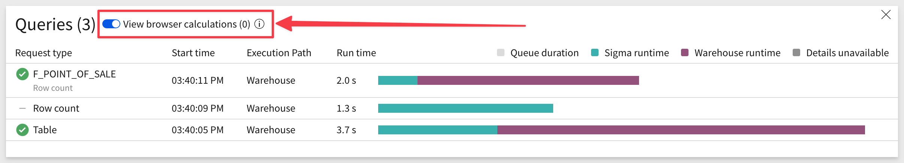

9: Make a few changes to the table and check the Query History to see the effects. For example, you can:

- Format the two columns "Sales Amount" and "Cost Amount". Open Query History; there are no new rows. Work is performed by Sigma against existing browser data with no new query or calculation required.

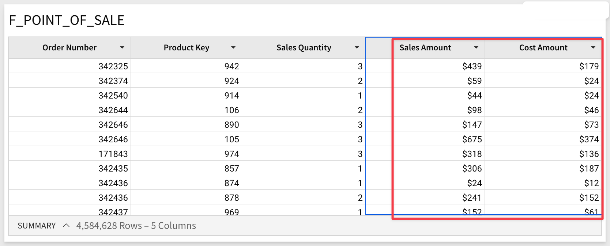

- Next, add a new column with the formula:
```plaintext
[Sales Quantity] * [Sales Amount]
```

Click the checkmark to accept the new formula and reopen the `Query History`. Notice the new row with `browser execution`. This indicates that Sigma used data in the local browser cache to calculate the new column's value without returning to the warehouse.

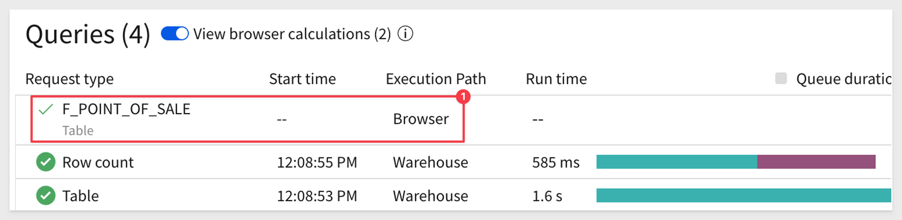

### Incremental Computation - Child Elements

It is very common to have one (or just a few) tables that drive entire dashboards. 

Sigma can calculate multiple elements in the browser after fetching data for a common parent element.

Imagine a Sigma Workbook that shows a number of KPIs related to sales opportunities, where all of the KPIs are calculated from a common data table. 

If Sigma believes that it can pull all of the records for the common data table into the browser, it will attempt to do so before calculating the KPIs by sending a single query to the data warehouse. 

If the query indeed returns all of the records, the KPIs are calculated directly in the browser. This avoids potentially sending a query-per-KPI to the data warehouse.

<aside class="positive">
<strong>IMPORTANT:</strong><br> Incremental computation reduces the number of warehouse "hits" and improves page loading performance. It only needs to query the data once from the warehouse, and then calculate all the other child elements in-browser. A cost savings is also inherent in this methodology. 
</aside>


<!-- END OF SECTION-->

## Alpha Query List and Filter Performance
Duration: 20

Sigma also leverages Alpha Query to improve performance when Workbooks have List controls or Filters.

In previous implementations, when a user opened a list filter or control, it loads the value to filter, but sometimes an extended time was required to fetch from data warehouse and cause a long wait time on the user side. Users found this slow and annoying in their daily workflow.


Sigma now utilizes Alpha Query to give a heuristic list, **before the fetch is finished.** 

This can massively improve List and Filter loading performance.

<aside class="negative">
<strong>NOTE:</strong><br> This improvement relies on Alpha Query and cannot support all cases. For example, if a table has been filtered by "Product Type" = "Computer" already, then Alpha Query is not able to determine the list, so the control still needs to wait for a data warehouse fetch.
</aside>

An example:

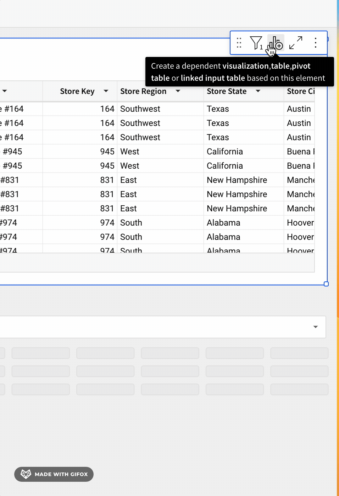

This use of Alpha Query provides an improved user experience which leads to more usage and satisfaction. 


<!-- END OF SECTION-->

## Result Cache(s) Usage
Duration: 20

Sigma has the capability to automatically fetch previously calculated data from the warehouse, leveraging the ability of some data warehouses to fetch the results of prior SQL calculations.

Sigma’s result cache is a feature implemented within Sigma itself.

<aside class="positive">
<strong>IMPORTANT:</strong><br> Sigma's unique architecture provides the benefits of caching data without storing customer data in our servers.
</aside>

This implementation is distinctly different from the result caching functionality that some data warehouses natively provide, which is typically implemented using a SQL text match algorithm. This checks if a syntactically equivalent SQL statement was submitted recently, and returns prior calculations if the underlying table data has not changed since the last query. 

In order to achieve this, we first maintain a mapping between calculations (Sigma request ID) and the results they produce in the data warehouse (queryID). 

We next calculate a "fingerprint" (a structure of prior calculations) for this mapping.

The production of a fingerprint, and mapping of fingerprint to prior results, is performed entirely within Sigma – the warehouse is not involved until we ask it to return any calculations it has already run.

When a new calculation matches a prior one (using Sigma's matching algorithm), we ask the data warehouse if it still has results for the prior calculation (against the time-to-live expiration). 

If it does, we’ll return those results when they’re recent enough for the requesting client. 

The tradeoff inherent in result caching, which prioritizes retrieval speed over data liveness – the previously calculated results are potentially out-of-date relative to fresh calculations. 

In many cases this is desirable, as results may only change on an hourly or daily basis. 

For live data, you can configure a "staleness" threshold. This gives you full control over when Sigma calculates results using up-to-date data in the data warehouse.

For information on how to configure [Workbook Data refresh, click here.](https://help.sigmacomputing.com/docs/workbook-refresh-options)

<strong>There are a few preconditions necessary for the Sigma result cache to kick in:</strong>
 <ul>
      <li>Sigma is able to prove that a new calculation will produce the same results as a prior one. This is explained after this table.</li>
      <li>The prior calculations found in the warehouse are not too old for the Workbook to use. This threshold is configured in a Workbook’s Data Refresh Settings.</li>
      <li>The warehouse's supported function can fetch calculations produced in the last 24 hours.</li>
</ul>

When Sigma cannot use the warehouse result cache, it must perform a calculation in the data warehouse.

### How Sigma proves a pair of calculations are equivalent

As previously mentioned, Sigma’s result cache will only kick in when a new calculation produces the same results as a prior one. 

Proving this condition requires comparing the structure of a pair of calculations. 

This comparison is done by producing a unique fingerprint for each calculation, searching for other calculations with a matching fingerprint, and ensuring we don’t have false positives.

**The fingerprint does not use Sigma’s generated SQL.** Instead, it uses a representation that’s more appropriate for the Workbook, given its unique functionality. 

For example, Sigma Workbooks commonly use user attributes and row-level security parameters. Fingerprinting is a better method, as it is sensitive to this type of contextual information.

At the same time, fingerprinting is resilient to unnecessary information such as value formatting or column descriptions. 

The exact details of how Sigma produces a fingerprint are beyond the scope of this article.

[To learn more about Fingerprinting in general, click here.](https://en.wikipedia.org/wiki/Fingerprint_(computing))

### A Practical Example
One key use-case for Sigma’s result cache is to accelerate the initial page load for a Workbook.

Imagine that a 100-person sales organization has a weekly operational meeting, where they review important KPIs and explore various pipeline and opportunity scenarios together as a team.

When the meeting begins, all 100 members of the team open the same Sigma Workbook. 

Rather than asking the warehouse to calculate fresh results for every team member, **the result cache accelerates the initial page load** by returning the data calculated by the first person to open the Workbook. 

This drastically reduces the number of calculations the data warehouse needs to perform, and improves the page load time since there are no additional calculations to perform.

## Conditions for Using a Warehouse Results Cache
Each warehouse provider implements a version of results caching, but we will discuss this using Snowflake's implementation as example.

Here are links that discuss how results caching works, for common warehouse providers:

[Snowflake method](https://docs.snowflake.com/en/user-guide/querying-persisted-results#retrieval-optimization)<br>
[BigQuery method](https://cloud.google.com/bigquery/docs/cached-results)<br>
[Redshift method](https://docs.aws.amazon.com/redshift/latest/dg/c_challenges_achieving_high_performance_queries.html#result-caching)<br>
[Databricks method](https://www.databricks.com/blog/understanding-caching-databricks-sql-ui-result-and-disk-caches#:~:text=Result%20caching%20includes%20both%20Local,memory%20or%20remote%20storage%20mediums.&text=The%20local%20cache%20is%20an,is%20full%2C%20whichever%20comes%20first)

Sigma leverages Snowflake's feature called "Results Cache", designed to improve the performance of data retrieval by caching the results of previously executed queries. This is beneficial because the repeated execution of identical queries will be faster, thereby saving compute resources.

At the time of this QuickStart, the following are Snowflake's result cache rules. [More information can be found here.](https://community.snowflake.com/s/article/Understanding-Result-Caching#:~:text=Typically%2C%20query%20results%20are%20reused,query%20result%20has%20not%20changed)

<aside class="positive">
<strong>IMPORTANT:</strong><br> Snowflake's result cache is just one way Sigma optimizes data rendering performance.
</aside>

<ul>
      <li><strong>Same Query:</strong> The exact same query must be run. Even a minor change in whitespace or case in the SQL statement will result in a cache miss.</li>
      <li><strong>Same Virtual Warehouse:</strong> The same virtual warehouse must be used. If you run a query on one warehouse, then the results will be cached for that warehouse. Running the same query on a different warehouse will not hit the cache.</li>
      <li><strong>Same Role (see note below):</strong> The user must be using the same role. If you change roles and run the query, it will result in a cache miss. In most cases, Sigma is using the same connection to query the warehouse.</li>
      <li><strong>Unchanged Data:</strong> The underlying data cannot have changed. If any data in the tables that the query references has changed, been added, or deleted, then the cache will be invalidated for that query.</li>
      <li><strong>Cache Expiration:</strong> The Results Cache in Snowflake expires after 24 hours. Therefore, even if you meet all the above conditions but more than 24 hours have passed since the query was run, the cache will not be used.</li>
      <li><strong>Session Variables:</strong> If a query involves session variables, those variables must have the same values for the Results Cache to be used. For example, the query does not include functions that must be evaluated at execution (e.g., CURRENT_TIMESTAMP()).</li>
      <li><strong>Table Configuration:</strong> The table's micro-partitions must not have changed (e.g., been re-clustered or consolidated) due to changes to other data in the table.</li>    
</ul>

***NOTE:***
There are some cases where the warehouse role is made dynamic in Sigma. (ie: [Sigma dynamic role switching](https://www.sigmacomputing.com/blog/dynamically-assign-snowflake-roles-and-warehouses-with-sigma-user-attributes#0)) 


<!-- END OF SECTION-->

## Summary
Duration: 20

In the rapidly evolving world of data analytics, Sigma has emerged as a powerful tool that brings dynamic, responsive, and user-friendly capabilities to its users. Understanding how Sigma operates and the best ways to utilize its functions can greatly enhance performance and overall user satisfaction. 

This QuickStart explored key aspects of Sigma's operations, including incremental computations, handling large data sets, result caching, fingerprinting, and more. Administrators and data engineers will find actionable best practices in section 7, to optimize these features and achieve seamless interaction with the platform.

### Key Topics Covered:

**1: Incremental Computation:**<br>
Sigma performs calculations in the user's browser incrementally, updating only what's needed. This provides a fast and powerful user experience.

**2: Large Data Handling:**<br>
Even with billions of transactions, Sigma can summarize and perform calculations at a higher level without pulling all data into the browser.

**3: Utilization of Result Cache:**<br>
Sigma implements a unique result cache to fetch previously calculated data from some data warehouses. This accelerates page loading and saves computations.

**4: Fingerprinting:**<br>
Sigma uses a fingerprinting method to compare the structure of calculations, ensuring accurate matching and utilizing cache efficiently.

**5: Accelerating Initial Page Load:**<br>
The result cache is used to accelerate page loading, especially in scenarios where multiple users access the same Workbook simultaneously.

### Sigma's Operations and Best Practices:

**1. Incremental Computation and In-Browser Calculations**:
   - **Operation**: Sigma performs incremental calculations in the browser, updating only necessary parts.
   - **Best Practice**: Admins should monitor query performance, utilizing Sigma's in-browser calculations whenever feasible.

**2. Large Data Handling**:
   - **Operation**: Sigma can summarize and handle large datasets without pulling all data into the browser.
   - **Best Practice**: Optimizing Workbook structures and educating users on how Sigma handles large data can aid efficiency.

**3. Utilization of Result Cache and Fingerprinting**:
   - **Operation**: Sigma uses result caching and fingerprinting to accelerate page loading and save computations.
   - **Best Practice**: Understanding caching mechanisms and configuring refresh settings ensures up-to-date data retrieval.

**4. Accelerating Initial Page Load**:
   - **Operation**: The result cache is used for faster initial page loads when multiple users access the same Workbook.
   - **Best Practice**: Considering data volume and working with Sigma to optimize Workbook designs.

### Overall Recommendations:
Administrators can take advantage of Sigma's capabilities by understanding the underlying operations and implementing best practices. This includes monitoring and optimizing query performance, understanding caching, configuring data refresh settings, and educating users on Sigma's functionality.

By embracing these strategies, organizations can harness Sigma's robust and efficient analytical tool, enhancing both performance and user experience.


<!-- END OF SECTION-->

## Additional Resource Links
This section contains valuable links and resources specifically curated for Sigma administrators and data engineers. These include detailed best practice guides, troubleshooting tips, advanced configurations, and other related information to optimize Sigma operations.

We encourage readers to explore these resources for an in-depth understanding and to take full advantage of Sigma's capabilities within their organizations.

### Snowflake:
[Sigma on Snowflake Best Practices Guide](https://www.sigmacomputing.com/sigma-on-snowflake-best-practices)

This workbook walks you through the process of analyzing the Snowflake sample database for clustering needs:
[Snowflake Clustering)](https://www.sigmacomputing.com/interactive-demos/snowflake-clustering-demo)

Sigma also provides many templated business solutions "out of the box", that you can review as demonstration or connect to your own data. At the time of this QuickStart, the included templates are:

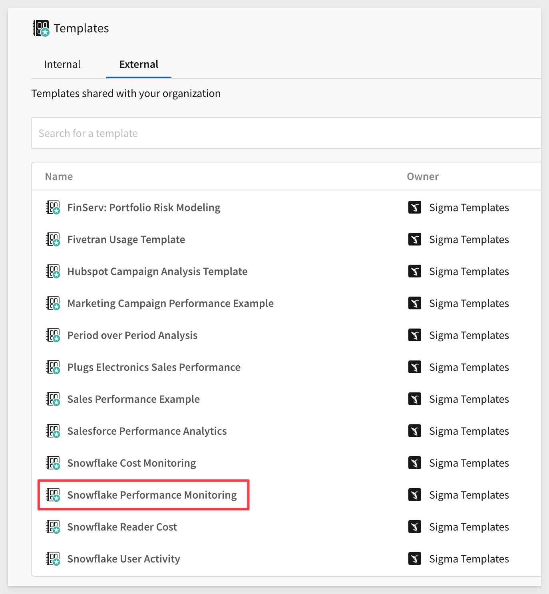

One of particular interest is the `Snowflake Performance Monitoring` which provides extensive information on Snowflake warehouse activities, related to Sigma usage. For example, on the summary page:

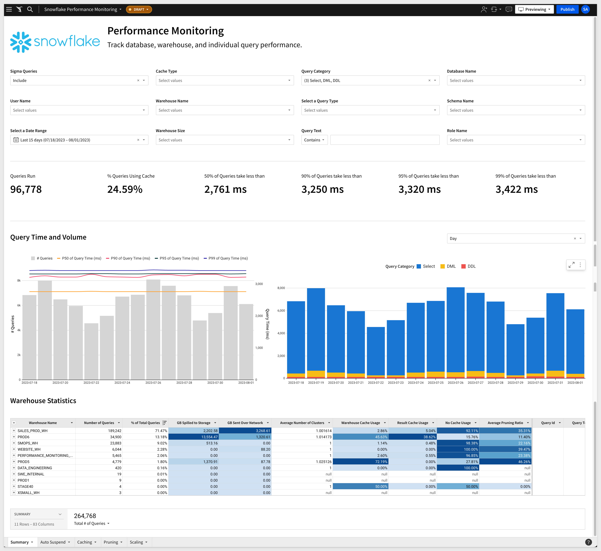

[Try the Sigma Snowflake Performance Monitoring Template live here:](https://www.sigmacomputing.com/interactive-demos/snowflake-performance-monitoring-template)

[For more information on the Snowflake usage templates, click here.](https://help.sigmacomputing.com/docs/snowflake-usage-templates)

### Databricks:
[Sigma on Databricks: End-to-End Best Practices Guide](https://www.sigmacomputing.com/ebook/sigma-on-databricks-end-to-end-best-practices-guide)

### Large Datasets:
[Best practices when working with large data sets](https://www.sigmacomputing.com/product-faq/best-practices-when-working-with-large-data-sets)

### Performance:
[Best practices for improved performance](https://help.sigmacomputing.com/docs/best-practices-for-improved-performance)

### Modeling:
[Modeling Best Practices](https://help.sigmacomputing.com/docs/modeling-best-practices)


### General Links:

Be sure to check out all the latest developments at [Sigma's First Friday Feature page!](https://quickstarts.sigmacomputing.com/firstfridayfeatures/)

[Help Center Home](https://help.sigmacomputing.com)<br>
[Sigma Community](https://community.sigmacomputing.com/)<br>
[Sigma Blog](https://www.sigmacomputing.com/blog/)<br>
<br>

[](https://twitter.com/sigmacomputing)&emsp;
[](https://www.linkedin.com/company/sigmacomputing)&emsp;
[](https://www.facebook.com/sigmacomputing)


<!-- END OF WHAT WE COVERED -->
<!-- END OF QUICKSTART -->
