author: pballai
id: developers_sigma_cli
summary: developers_sigma_cli
categories: developers
environments: web
status: Hidden
feedback link: https://github.com/sigmacomputing/sigmaquickstarts/issues
tags: 
lastUpdated: 2026-07-14

# Automate Sigma from the Command Line with the Sigma CLI

## Overview
Duration: 5

Some administrative work in Sigma is easy to do once and tedious to do repeatedly. Reviewing who has access, taking stock of your connections, provisioning new members, or capturing an inventory of content all mean clicking through the same screens by hand — work that's slow to repeat, easy to get slightly wrong each time, and hard to hand off to a schedule or a teammate.

The Sigma CLI (`sigma`) is built for exactly this. It's a typed command-line wrapper over Sigma's REST API that handles authentication, gives you discoverable commands, and returns clean JSON you can pipe into scripts, pipelines, and scheduled jobs — so the tasks you used to do by hand become repeatable and auditable. Because every command runs through the same REST API, permissions, and audit logging as the rest of Sigma, that automation stays governed — the CLI is a new front door to Sigma, not a way around its controls.

In this QuickStart you'll install and configure `sigma`, learn how its commands map to the REST API, and then build something practical: a governance inventory that exports your members, connections, and workbooks to CSV. You'll finish by wrapping that inventory in a script you can run on a schedule.

Along the way you'll learn how to:
- Install `sigma` and add it to your PATH
- Authenticate using a named profile (OAuth or API key)
- Discover resources and actions with the CLI's built-in help
- Read JSON output and reshape it with `jq`
- Export a governance snapshot of your organization to CSV
- Automate the whole thing as a repeatable, scheduled job

<aside class="positive">
<strong>WHY IT MATTERS:</strong><br> Anything you can do in the Sigma REST API, you can now do from a script. That turns one-off administrative clicks into repeatable, auditable automation — inventory reports, provisioning, and deployment steps that run the same way every time, whether a person or a pipeline invokes them.
</aside>

<aside class="negative">
<strong>LEGAL STUFF:</strong><br> The Sigma CLI is a separate tool governed by an external license agreement. Review the Sigma CLI Notice before you use `sigma` to connect to or access your Sigma organization. See the <a href="https://help.sigmacomputing.com/docs/sigma-cli">Sigma CLI overview</a> for the current notice and links.
</aside>

<aside class="negative">
<strong>IMPORTANT:</strong><br> Some screens in Sigma may appear slightly different from those shown in QuickStarts. This is because Sigma continuously adds and enhances functionality. Rest assured, Sigma's intuitive interface ensures that any differences will not prevent you from successfully completing any QuickStart.
</aside>

For more information on Sigma's product release strategy, see [Sigma product releases](https://help.sigmacomputing.com/docs/sigma-product-releases)

If something doesn't work as expected, here's how to [contact Sigma support](https://help.sigmacomputing.com/docs/sigma-support)

### Target Audience
This QuickStart is written for developers, technical admins, and automation engineers who are comfortable working in a terminal and want to manage Sigma programmatically rather than through the UI.

### Prerequisites

<ul>
  <li>A macOS, Linux, or Windows machine with terminal access and internet connectivity.</li>
  <li>Access to a Sigma environment where you can generate API credentials or sign in with OAuth.</li>
  <li>An Admin account type is required to generate API credentials, or an account type with the "Use Sigma API with OAuth" permission for OAuth authentication.</li>
  <li>Basic familiarity with the command line and, ideally, <a href="https://jqlang.org/">jq</a> for working with JSON.</li>
 </ul>

<aside class="positive">
<strong>IMPORTANT:</strong><br> Sigma recommends using non-production resources when completing QuickStarts.
</aside>

<button>[Sigma Free Trial](https://www.sigmacomputing.com/free-trial/)</button>


## Install the Sigma CLI
Duration: 5

You can install `sigma` with the shell installer or with Homebrew. Pick one.

**Option 1: Shell installer**

This works on macOS and Linux and installs the latest release:

```copy-code
curl --proto '=https' --tlsv1.2 -LsSf https://assets.sigmacomputing.com/sigma-cli/releases/latest/sigma-cli-installer.sh | sh
```

<!-- 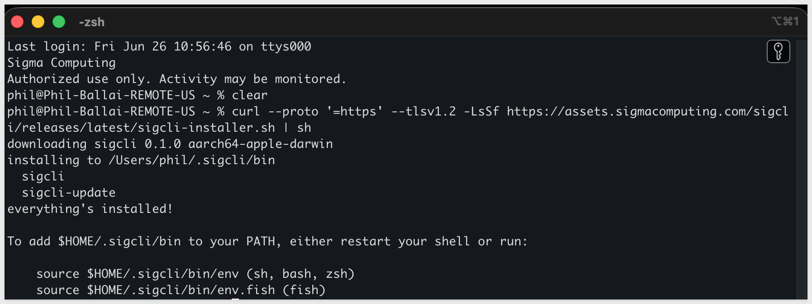 -->

The installer places the binary at `~/.sigma-cli/bin/sigma`. For most setups, that directory won't be on your PATH yet, so add it by appending this line to your shell profile (`~/.zshrc` or `~/.bashrc`):

```copy-code
export PATH="$HOME/.sigma-cli/bin:$PATH"
```

There is no response, just an empty command line.

We need to reload terminal so the path change takes effect:

```copy-code
source ~/.zshrc
```

Confirm the shell can now find the binary. This should return the path to `sigma`:

```copy-code
which sigma
```

**Option 2: Homebrew**

If you use Homebrew, this installs `sigma` and adds it to your PATH automatically:

```copy-code
brew install sigmacomputing/tap/sigma-computing-cli
```

**Verify the installation**

Confirm `sigma` is on your PATH and see which version you're running:

```copy-code
sigma --version
```

The response will be similar to:
```code
/Users/phil/.sigma-cli/bin/sigma
```

<!-- 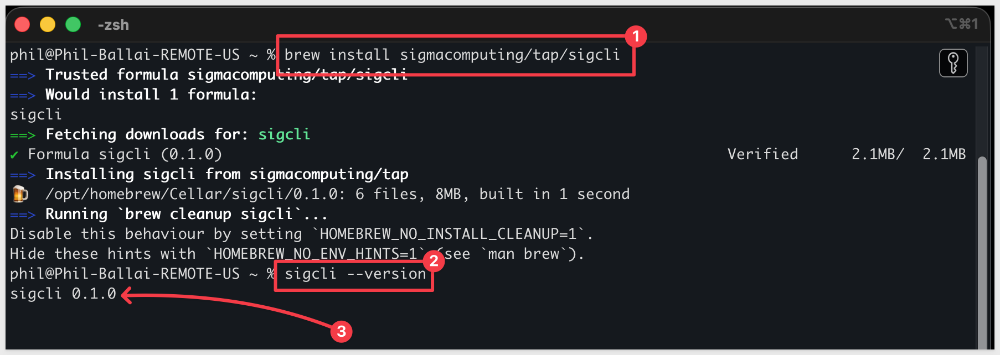 -->

**Install jq**

The examples in this QuickStart use `jq` to reshape the JSON that `sigma` returns, so install it now.

On macOS with Homebrew:

```copy-code
brew install jq
```

On macOS without Homebrew, download the prebuilt binary directly:

```copy-code
curl -Lo jq https://github.com/jqlang/jq/releases/latest/download/jq-macos-arm64 && chmod +x jq && sudo mv jq /usr/local/bin/
```

The `sudo mv` step will prompt for your macOS login password. Nothing is displayed as you type — press Enter when done.

<aside class="positive">
<strong>NOTE:</strong><br> The binary above is for Apple Silicon (M-series). If you're on Intel, replace <code>jq-macos-arm64</code> with <code>jq-macos-amd64</code>.
</aside>

On Linux, use your package manager of choice (for example, `apt install jq` or `yum install jq`).


<!-- END OF SECTION-->

## Authenticate with a profile
Duration: 7

`sigma` stores credentials in named **profiles**, so you can keep separate configurations for different Sigma organizations or environments (for example, `staging` and `prod`) and switch between them per command.

Start the interactive login:

```copy-code
sigma auth login
```

Choose `Create new profile`, then pick one of the two authentication methods below. We will demonstrate with API key.

Information on how to [Generate Sigma API client credentials](https://help.sigmacomputing.com/reference/generate-client-credentials)

**Option 1: OAuth**

Select `OAuth`, enter your Sigma organization URL, and give the profile a name (for example, `staging`). A browser window opens for you to sign in. This method requires an account type with the "Use Sigma API with OAuth" permission.

**Option 2: API key**

First generate API credentials in Sigma from `Administration` > `Developer Access` (an Admin account type is required). Then run `sigma auth login`, select `Create new profile`, choose `API key`, name the profile, select the API base URL for your organization, and paste in your client ID and secret.

After selecting `API key` press `Enter`.

Enter a `Profile name`:

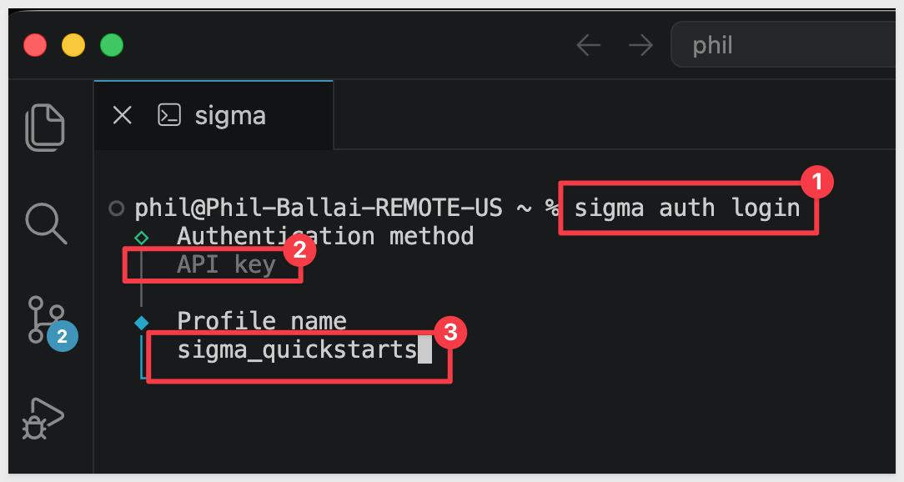

Select the region where your Sigma instance is hosted:

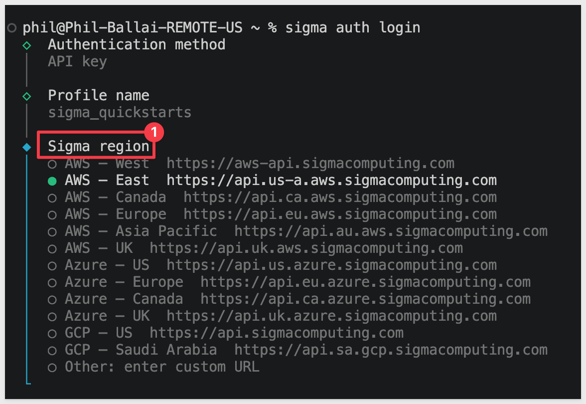

Enter your `Client ID` and `Secret` and press `Enter`. The profile location will be returned:

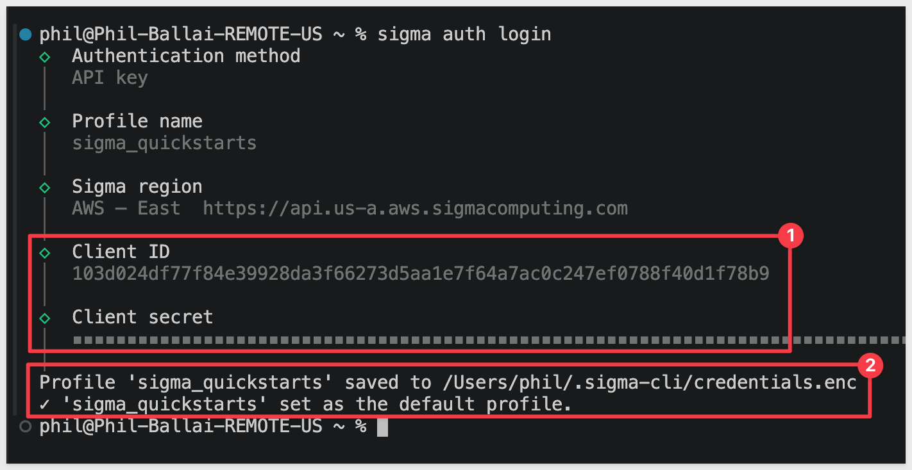

**Select a profile per command**

Once you have a valid profile, check the auth status:

```copy-code
sigma -p sigma_quickstarts auth status
```

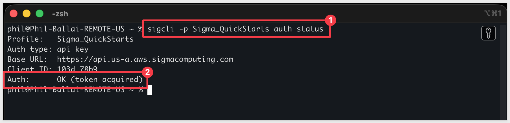

**Verify your authentication**

These three commands confirm that your profile works and tell you who you're authenticated as:

```copy-code
sigma auth status
sigma auth token
sigma api whoami get
```

- `auth status` reports whether your profile is authenticated
- `auth token` prints the current bearer token
- `whoami` returns the member record for the signed-in user

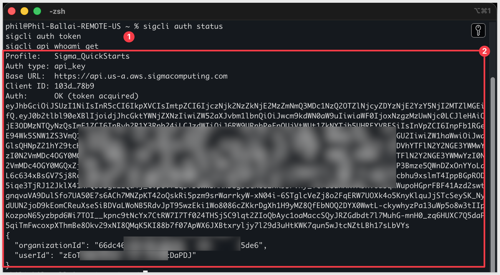

<aside class="positive">
<strong>TIP:</strong><br> If you don't pass <code>-p</code>, <code>sigma</code> uses your default profile. Naming profiles clearly and always passing <code>-p</code> in scripts prevents a command from accidentally running against the wrong organization.
</aside>


<!-- END OF SECTION-->

## Understand the command structure
Duration: 6

Nearly every `sigma` command follows the same shape, which mirrors the REST API:

```code
sigma api {resource} {action} [--flags]
```

For example, `sigma api workbooks list` lists the workbooks in your organization:

```copy-code
sigma api workbooks list
```

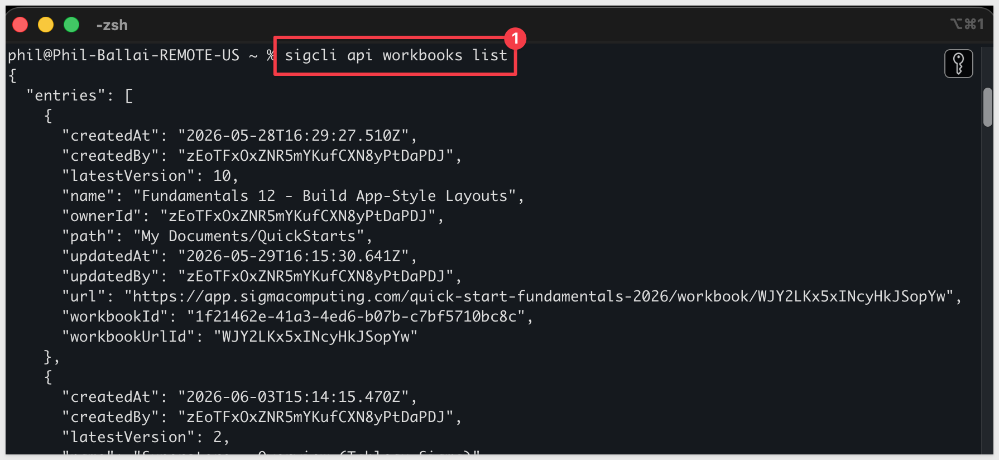

**Discover what's available**

You don't need to memorize resources and actions — the CLI tells you what it supports:

```copy-code
sigma --help
sigma api workbooks --help
sigma api schema workbooks get
```

- `--help` at the top level lists the available resources. 
- Adding `--help` after a resource shows its actions and flags.
- `sigma api schema {resource} {action}` describes the parameters an action expects, so you know exactly what to pass.

**Pass parameters**

Actions that need input take a JSON object via `--params`. For example, to fetch a single workbook, pass its `workbookId` (you'll find this in the `workbooks list` output above):

```copy-code
sigma api workbooks get --params '{"workbookId":"1f21462e-41a3-4ed6-b07b-c7bf5710bc8c"}'
```

This returns the details for that workbook:

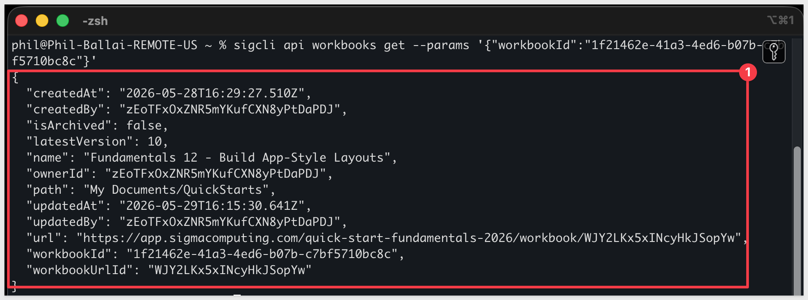

**Read and reshape the output**

Commands return JSON to standard output, which makes them easy to combine with tools like `jq` or to save to a file:

```copy-code
sigma api workbooks list | jq '.entries[].name'
sigma api workbooks get --params '{"workbookId":"1f21462e-41a3-4ed6-b07b-c7bf5710bc8c"}' > workbook.json
```

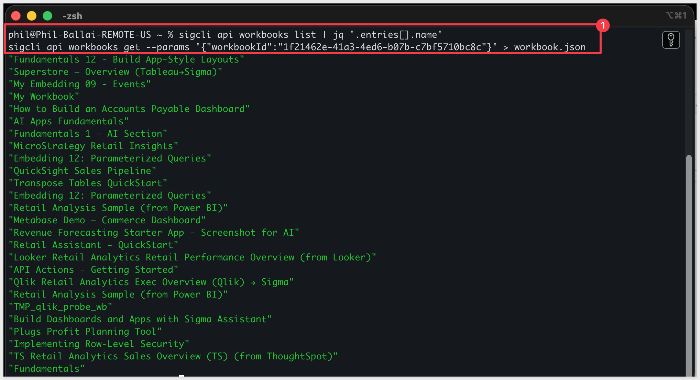

**Check exit codes**

`sigma` returns a distinct exit code for each outcome, which is what lets scripts branch on success or failure:

- `0` — success
- `1` — API error
- `2` — authentication error
- `3` — validation error
- `4` — network error

If something isn't behaving, turn on debug logging to see the underlying requests:

```copy-code
SIGMA_CLI_LOG=debug sigma api connections list
```

Setting `SIGMA_CLI_LOG` this way only applies to the single command it prefixes, so there's nothing to turn off — the next command you run without it returns to normal output.

<aside class="positive">
<strong>TIP:</strong><br> Before writing any <code>jq</code> filter, run the command on its own and look at the raw JSON. The field names you'll reference (like <code>email</code> or <code>memberType</code>) come straight from that output, and they mirror the Sigma REST API reference.
</aside>


<!-- END OF SECTION-->

## Build a governance inventory
Duration: 8

Now put the pieces together. A common, high-value task for any Sigma admin is answering "who has access, what connections exist, and what content do we have?" With `sigma` you can pull all three and export them to CSV in a few commands.

**List your members**

Start by looking at the raw output so you can see the available fields:

```copy-code
sigma -p sigma_quickstarts api members list | jq '.entries[0]'
```

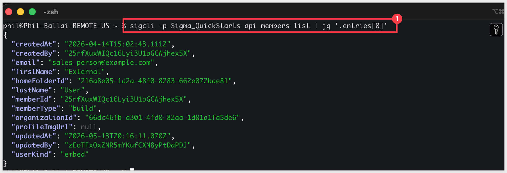

Then reshape the fields you care about into CSV rows. `jq -r` outputs raw strings, and `@csv` quotes and comma-separates them safely:

```copy-code
sigma -p sigma_quickstarts api members list \
  | jq -r '.entries[] | [.email, .firstName, .lastName, .memberType] | @csv' \
  > members.csv
```

The `>` redirect writes each file to your current working directory, so the three CSVs land wherever your terminal is pointed. Run `pwd` if you're not sure where that is, or `ls *.csv` to confirm they were created.

You can view the contents of `members.csv` using `cat`:
```copy-code
cat members.csv
```

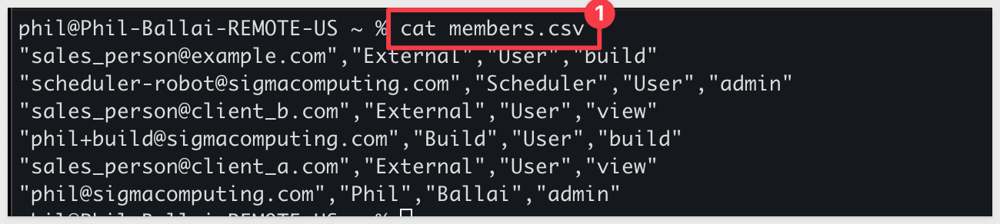

**List your connections**

```copy-code
sigma -p sigma_quickstarts api connections list \
  | jq -r '.entries[] | [.connectionId, .name, .type] | @csv' \
  > connections.csv
```

**List your workbooks**

```copy-code
sigma -p sigma_quickstarts api workbooks list \
  | jq -r '.entries[] | [.workbookId, .name, .ownerId] | @csv' \
  > workbooks.csv
```

You now have three CSV files describing your organization's people, data connections, and content — a snapshot you can open in a spreadsheet, load into Sigma itself, or diff against last week's run to see what changed.

<aside class="negative">
<strong>WHY IT MATTERS:</strong><br> Access reviews, license true-ups, and content audits usually mean clicking through admin pages and copying values by hand. Turning them into three commands means the report is consistent, repeatable, and cheap enough to run on a schedule instead of scrambling before an audit.
</aside>

<aside class="positive">
<strong>NOTE:</strong><br> The exact field names in each <code>jq</code> filter depend on what the API returns for your organization. If a column comes back empty, inspect the raw JSON (<code>| jq '.entries[0]'</code>) and adjust the field names to match.
</aside>


<!-- END OF SECTION-->

## Automate the inventory
Duration: 6

Because each step is a single command with a predictable exit code, you can collect them into one script and run it unattended.

We did this in VSCode but it can also be done in plain terminal.

Create a new file named:
```copy-code
sigma_inventory.sh
```

```copy-code
#!/usr/bin/env bash
set -euo pipefail

# Ensure sigma and jq are found when run by cron, which uses a minimal PATH
export PATH="/opt/homebrew/bin:/usr/local/bin:$HOME/.sigma-cli/bin:$PATH"

# Read credentials from the file store so the script works without a logged-in session
export SIGMA_CLI_KEYRING_BACKEND=file

PROFILE="sigma_quickstarts"
OUTDIR="sigma_inventory_test"
mkdir -p "$OUTDIR"

# Fail early if the profile isn't authenticated
sigma -p "$PROFILE" auth status

sigma -p "$PROFILE" api members list \
  | jq -r '.entries[] | [.email, .firstName, .lastName, .memberType] | @csv' \
  > "$OUTDIR/members.csv"

sigma -p "$PROFILE" api connections list \
  | jq -r '.entries[] | [.connectionId, .name, .type] | @csv' \
  > "$OUTDIR/connections.csv"

sigma -p "$PROFILE" api workbooks list \
  | jq -r '.entries[] | [.workbookId, .name, .ownerId] | @csv' \
  > "$OUTDIR/workbooks.csv"

echo "Inventory written to $OUTDIR"
```

`Save` the new file.

A few things worth pointing out about this script:

- `set -euo pipefail` stops the script on the first error.
- The `export PATH=...` line ensures `sigma` and `jq` are found when the script runs unattended. A scheduler like `cron` uses a minimal environment that doesn't include Homebrew's directory or your shell profile, so without this the script would fail with `command not found`. The line covers Homebrew on Apple Silicon (`/opt/homebrew/bin`), Homebrew on Intel (`/usr/local/bin`), and the shell-installer location (`~/.sigma/bin`).
- The `export SIGMA_CLI_KEYRING_BACKEND=file` line tells `sigma` to read credentials from a file rather than the OS keyring. By default `sigma` stores credentials in your operating system's keyring (the macOS Keychain, for example), which only unlocks for an interactive, logged-in session. A scheduler like `cron` has no such session, so a keyring lookup fails with `User interaction is not allowed`. File-based storage sidesteps that.
- The `auth status` check up front means it fails clearly if the profile's credentials have expired, rather than producing empty files.
- `OUTDIR` creates a folder named `sigma_inventory_test`, and the three CSVs are written *inside* that folder, not next to the script. Keeping the output together makes it easy to find and easy to clean up.

**Store your credentials in the file backend**

Credentials are saved per backend, so the profile you created earlier lives in the OS keyring — not the file store the script now reads from. Authenticate once more with the file backend active so your profile is written where unattended runs can find it:

```copy-code
export SIGMA_CLI_KEYRING_BACKEND=file
sigma auth login
```

Recreate the profile exactly as you did before, with the same API key:
```copy-code
sigma_quickstarts 
```

<aside class="negative">
<strong>IMPORTANT:</strong><br> File-based storage writes your credentials to a file on disk rather than the OS keyring, which is less protected. Restrict access to it (for example, <code>chmod 600</code>), never commit it to source control, and for CI/CD pipelines prefer injecting credentials as pipeline secrets.
</aside>

Make it executable and run it:

```copy-code
chmod +x sigma_inventory.sh
./sigma_inventory.sh
```

It finishes almost instantly, but a lot just happened: the script made three separate calls to Sigma's REST API — one each for members, connections, and workbooks — and `jq` reshaped every response into a CSV as it came back. 

You'll have a folder named `sigma_inventory_test` containing the three resulting files:

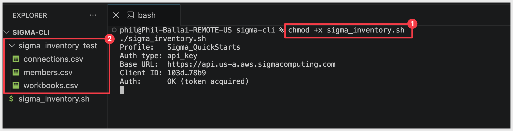

<aside class="negative">
<strong>PRO TIP:</strong><br> In a real deployment you'd likely want each run kept separately — for example, adding a date to the folder name with <code>OUTDIR="sigma_inventory_$(date +%Y-%m-%d)"</code> so you can compare one day's inventory against another. We use a fixed name here to keep the QuickStart simple.
</aside>

**Run it on a schedule**

To capture a weekly snapshot automatically, schedule the script with `cron`, your machine's built-in job scheduler.

The schedule lives on your machine, in your user's crontab — it is not stored in Sigma. Sigma has no knowledge of the schedule; it simply receives normal API calls whenever the script runs. Anything that can run `sigma` on a timer (cron, a CI/CD scheduler, a cloud function) works the same way.

<aside class="positive">
<strong>NOTE:</strong><br> You might expect to create this job inside Sigma so it appears in the UI. Sigma's own scheduling delivers <em>workbook content</em> (a workbook or element exported to email, Slack, cloud storage, and so on), and the CLI can manage those export schedules too.<br>
<br>
Our inventory is different — it pulls organization metadata (members, connections, and workbooks lists) that no single workbook produces, so there's nothing for Sigma's scheduler to run. Scheduling it externally is the right pattern: Sigma stays the system of record, and <code>sigma</code> is the automation surface that reaches into it from wherever your scheduler lives.
</aside>

Since you already have a `sigma_inventory_test` folder from the manual run, delete it first so there's no doubt the scheduled run is what recreates it:

```copy-code
rm -rf sigma_inventory_test
```


<aside class="negative">
<strong>macOS NOTE:</strong><br> On macOS, keep <code>sigma_inventory.sh</code> in a plain folder inside your home directory (for example, <code>~/sigma-cli</code>) — <strong>not</strong> in Desktop, Documents, or Downloads. Those folders are privacy-protected, and <code>cron</code> can't reach into them, so a scheduled run would fail with <code>Operation not permitted</code> even though running the script by hand works fine. If you must keep it in a protected folder, grant Full Disk Access to <code>/usr/sbin/cron</code> in `System Settings` > `Privacy & Security` > `Full Disk Access`.
</aside>

`cron` runs with a minimal environment and does not start in the folder where you created the script, so it needs to know exactly where the script lives. In the folder where you saved `sigma_inventory.sh`, run `pwd` to print its full path:

```copy-code
pwd
```

Open your crontab for editing:

```copy-code
crontab -e
```

Add the following entry, changing into the script's folder first with `cd` so it runs from its own directory and writes its output — the log and the `sigma_inventory_test` folder — right alongside itself. Replace `{your-script-folder}` with the path `pwd` returned.

So you can watch it run instead of waiting for a distant day, set the time to a minute or two from now. Cron fields are minute then hour on a 24-hour clock, so if it's currently 4:03 PM, `05 16 * * *` runs at 4:05 PM:

```copy-code
05 16 * * * cd {your-script-folder} && ./sigma_inventory.sh >> sigma_inventory.log 2>&1
```

<aside class="positive">
<strong>TIP:</strong><br> To build or double-check a cron expression, use the free <a href="https://crontab.guru/">crontab.guru</a> — it translates any expression into plain English and shows the next times it will run, which makes it easy to pick a time a minute or two from now for this test.
</aside>

For more information on cron formatting, see [Set up a custom delivery schedule](https://help.sigmacomputing.com/docs/configure-additional-options-for-exports#set-up-a-custom-delivery-schedule)

Now save and exit so `cron` installs the schedule — the change only takes effect once the editor closes. `crontab -e` opens your default terminal editor:

- in `vi` or `vim`, type `:wq`
- in `nano`, press `Ctrl+O` then `Ctrl+X`

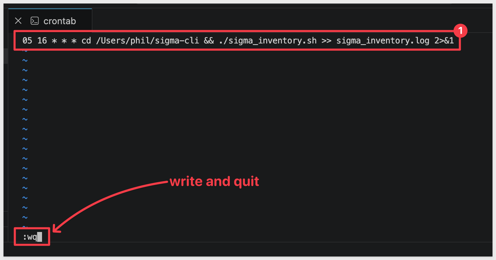

Saving the crontab returns you to the prompt with no output — that's expected, `cron` is silent. Confirm the entry is registered:

```copy-code
crontab -l
```

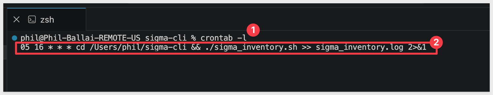

When the scheduled minute passes, confirm `cron` recreated the `sigma_inventory_test` folder and check that the log recorded a clean run. From inside your script folder:

```copy-code
ls sigma_inventory_test
cat sigma_inventory.log
```

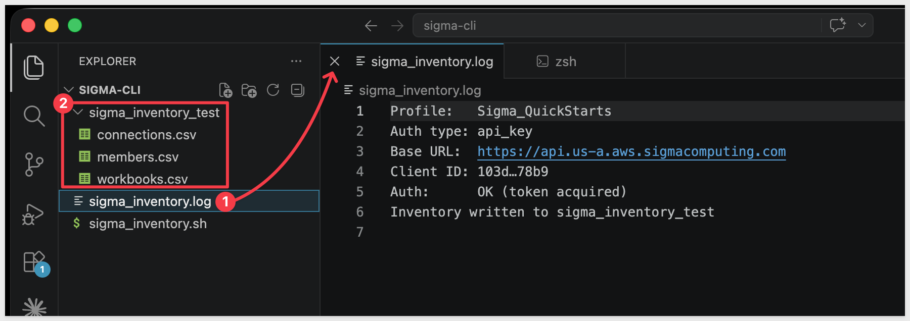

If the log shows an error like `No such file or directory`, `cron` couldn't find the script — double-check the path in your cron entry against what `pwd` returned. 

Once it runs cleanly, edit the crontab again with `crontab -e` and set the time to whatever cadence you actually want — for example, `0 8 * * 1` runs the inventory every Monday at 8 AM.

Or, to remove the test schedule, edit the crontab again and delete the line:

```copy-code
crontab -e
```

<aside class="negative">
<strong>NOTE:</strong><br> There is also <code>crontab -r</code>, but it deletes your <em>entire</em> crontab without confirmation, not just this one entry. Only use it if this is the only job you've scheduled.
</aside>

The same script works unchanged inside a CI/CD pipeline. Store your API credentials as pipeline secrets, configure the profile non-interactively, and let the exit codes gate the rest of your workflow — for example, halting a deployment if `auth status` returns a non-zero code.


<!-- END OF SECTION-->

## What we've covered
Duration: 3

You installed the Sigma CLI, authenticated it with a named profile, and learned how its `sigma api {resource} {action}` structure maps directly onto Sigma's REST API. From there you built a governance inventory — exporting your members, connections, and workbooks to CSV — and wrapped it into a script you can schedule or drop into a pipeline.

The bigger takeaway is the pattern, not just the report. Once Sigma operations are commands that return structured output and meaningful exit codes, they become building blocks: you can compose them, version them, put them under review, and run them the same way every time. 

The inventory here is a starting point — the same approach applies to provisioning members, promoting content between environments, and any other administrative task you'd rather not do by hand. And because every command runs through Sigma's existing REST API, permissions, and audit logging, that automation stays governed no matter who — or what — invokes it.

**Additional Resource Links**

[Sigma CLI overview](https://help.sigmacomputing.com/docs/sigma-cli)<br>
[Install and configure the Sigma CLI](https://help.sigmacomputing.com/docs/install-and-configure-the-sigma-cli)<br>
[Use the Sigma CLI](https://help.sigmacomputing.com/docs/use-the-sigma-cli)<br>
[Sigma REST API documentation](https://help.sigmacomputing.com/reference/get-started-sigma-api)<br>

[Blog](https://www.sigmacomputing.com/blog/)<br>
[Community](https://community.sigmacomputing.com/)<br>
[Help Center](https://help.sigmacomputing.com/hc/en-us)<br>
[QuickStarts](https://quickstarts.sigmacomputing.com/)<br>

Be sure to check out all the latest developments at [Sigma's First Friday Feature page!](https://quickstarts.sigmacomputing.com/firstfridayfeatures/)
<br>

[](https://twitter.com/sigmacomputing)&emsp;
[](https://www.linkedin.com/company/sigmacomputing)&emsp;
[](https://www.facebook.com/sigmacomputing)


<!-- END OF WHAT WE COVERED -->
<!-- END OF QUICKSTART -->
