author: pballai
id: developers_sigma_skill
summary: developers_sigma_skill
categories: developers
environments: web
status: Published
feedback link: https://github.com/sigmacomputing/sigmaquickstarts/issues
tags: default
lastUpdated: 2026-06-22

# Sigma Skills for AI Assistants

## Overview
Duration: 5

Use Sigma's open-source agent skills to give AI coding assistants direct knowledge of Sigma's REST API and data modeling workflows — then put them to work building against Sigma without writing boilerplate from scratch.

Sigma publishes agent skills through the [sigma-agent-skills](https://github.com/sigmacomputing/sigma-agent-skills) GitHub repository. These skills are reference files that tell a coding agent how to authenticate with Sigma, call the API, and create or update data models — the same patterns you'd write by hand, now available to any supported AI assistant automatically.

In this QuickStart, you'll learn how to:
- Understand what Sigma agent skills are and what each skill provides
- Install Sigma agent skills in Claude Code — the same skills also work in OpenAI Codex, Snowflake Cortex Code, and Cursor
- Use the `sigma-api` skill to authenticate and make API calls through an AI assistant
- Use the `sigma-data-models` skill to create and update data models through natural language prompts

<aside class="negative">
<strong>NOTE:</strong><br> At the time of this QuickStart, Sigma agent skills were at v0.1.3 and represent Sigma's first open-source release. 

Available skills and installation steps are likely to change as the project matures. Always refer to the <a href="https://github.com/sigmacomputing/sigma-agent-skills">sigma-agent-skills repository</a> for the latest version.

Claude Code is evolving quickly, so some commands or features may change over time.
</aside>

<aside class="positive">
<strong>IMPORTANT:</strong><br> Some screens in Sigma may appear slightly different from those shown in QuickStarts. This is because Sigma continuously adds and enhances functionality. Rest assured, Sigma's intuitive interface ensures that any differences will not prevent you from successfully completing any QuickStart.
</aside>

For more information on Sigma's product release strategy, see [Sigma product releases](https://help.sigmacomputing.com/docs/sigma-product-releases)

If something doesn't work as expected, here's how to [contact Sigma support](https://help.sigmacomputing.com/docs/sigma-support)

### Target Audience
This QuickStart is for developers and technical users who work with AI coding assistants and want to use them to build against Sigma's REST API or manage data models programmatically.

### Prerequisites

<ul>
  <li>A Sigma account with API access enabled</li>
  <li>A Sigma API client ID and client secret — see <a href="https://help.sigmacomputing.com/docs/generate-api-client-credentials">Generate API client credentials</a></li>
  <li>One of the following AI coding assistants installed: Claude Code, OpenAI Codex, Snowflake Cortex Code, or Cursor</li>
  <li>Git installed locally (required if using Codex or Cursor installations)</li>
  <li>Can Edit or Admin permission on relevant Sigma resources</li>
</ul>

<aside class="positive">
<strong>IMPORTANT:</strong><br> Sigma recommends using non-production resources when completing QuickStarts.
</aside>

<button>[Sigma Free Trial](https://www.sigmacomputing.com/free-trial/)</button>


<!-- END OF SECTION-->

## What Are Sigma Agent Skills?
Duration: 5

Agent skills are structured reference files that tell an AI coding assistant how to work with a specific platform or API. 

Instead of relying on the agent's general training data — which may be outdated or incomplete — skills give the agent precise, current instructions it can follow during a session.

Sigma's agent skills are open source and distributed through the [sigma-agent-skills](https://github.com/sigmacomputing/sigma-agent-skills) GitHub repository. When installed, they extend your AI assistant with Sigma-specific knowledge so you can interact with Sigma's APIs using natural language prompts rather than writing raw API calls by hand.

At the time of this QuickStart, there are two skills available, with many more planned.

**sigma-api:**<br>
Provides the agent with instructions for authenticating to Sigma's REST API using client credentials. This includes how to obtain a bearer token, how to pass it in API requests, and troubleshooting guidance for common authentication errors. With this skill active, you can ask the agent to list workbooks, retrieve document metadata, manage members, or perform any other operation exposed by [Sigma's REST API](https://help.sigmacomputing.com/docs/get-started-with-sigmas-api)

**sigma-data-models:**<br>
Provides the agent with instructions for creating and managing Sigma data models programmatically. This includes the authentication flow, how to gather metadata about available connections and tables, and how to construct and submit data model specifications. With this skill active, you can ask the agent to build a new data model, update an existing one, or inspect what's already deployed.

<aside class="positive">
<strong>WHY IT MATTERS:</strong><br> Agent skills make Sigma's APIs accessible to anyone who can write a prompt. Developers get a faster path to API-driven workflows; technical analysts and builders can automate tasks that would otherwise require reading API documentation and writing code from scratch.
</aside>

### How Skills Work

When a skill is loaded into an AI assistant, the assistant reads the skill's reference files at the start of a session. From that point forward, it uses those instructions to guide its API calls, authentication steps, and troubleshooting decisions — without you needing to supply that context manually.

The skills wrap Sigma's APIs but do not replace them. **You still need a valid Sigma account and API credentials.** The agent handles the mechanics; your credentials and permissions determine what it can do.

<!-- dss_01.png -->


<!-- END OF SECTION-->

## Generate ClientID / Secret
Duration: 10

In preparation for using the API, we need to use Sigma to generate a new API token.

Log onto Sigma (as Administrator). Navigate to `Administration` > `Developer access`.

Click the `Create New` button:

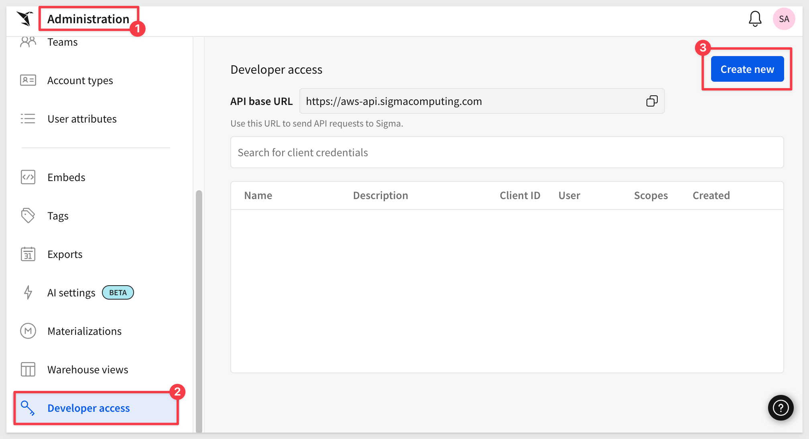

Select `REST API`, give it a name and description. Some customers create a `Service Account` user for automation purposes; this is a best practice. Since we are just testing, you can choose any `Admin` user you prefer. Click `Create`.

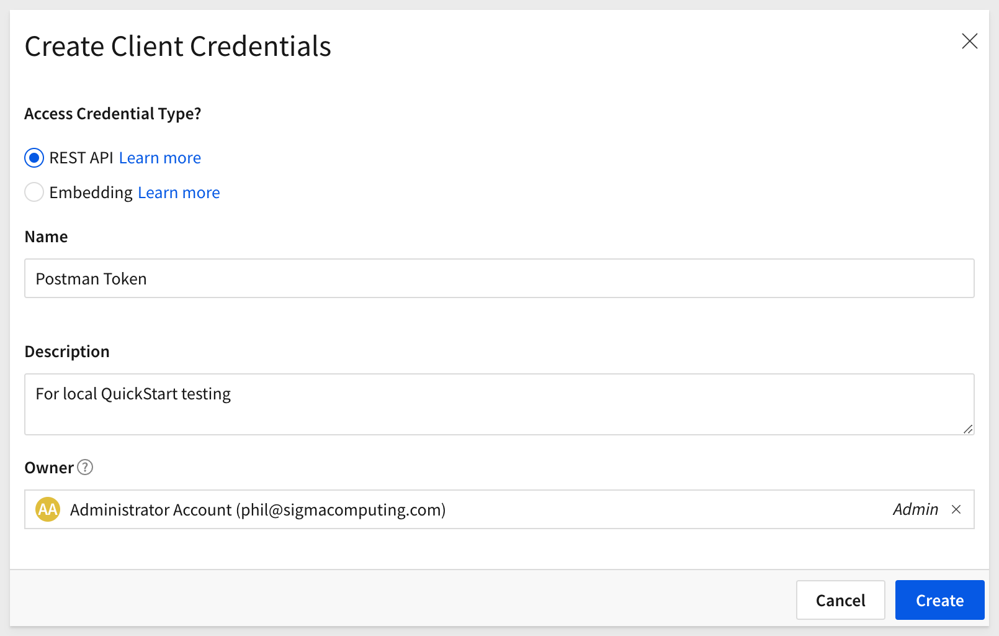

Copy the `ClientID` and `Secret` from the popup and save them to a secure location. We will use them later. Close the popup:

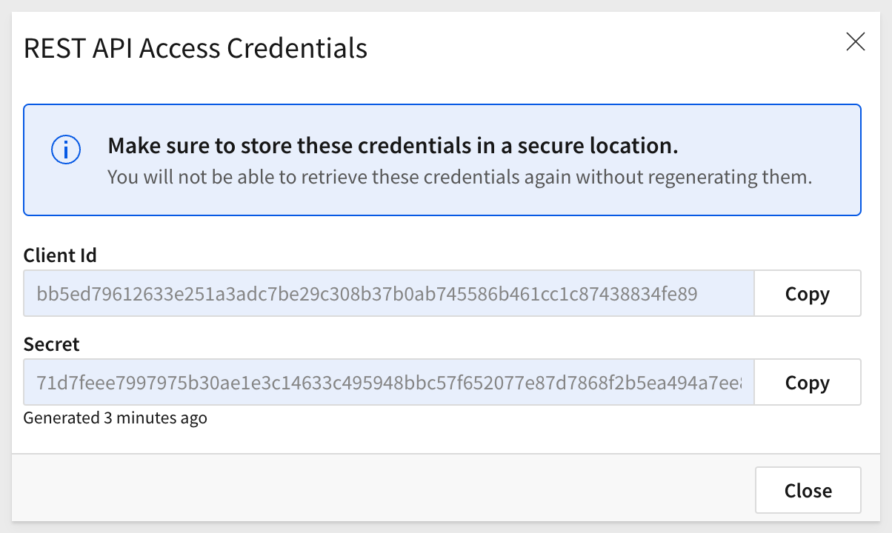

Also copy the `API base URL`:

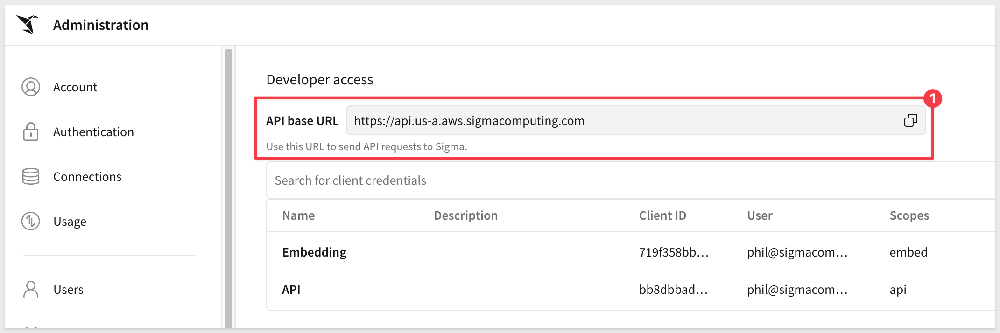


<!-- END OF SECTION-->

## Install the Skills
Duration: 10

This section walks through setup using VSCode with Claude Code. For installation on other platforms, see [Install skills for AI assistants](https://help.sigmacomputing.com/docs/install-skills-for-ai-assistants).

### Create a Working Directory

Create a dedicated folder for this project. Open a terminal and run:

```copy-code
mkdir sigma-skills-demo
cd sigma-skills-demo
```

### Open in VSCode

From the same terminal, open the folder in VSCode:

```copy-code
code .
```

<aside class="positive">
<strong>NOTE:</strong><br> If the <code>code</code> command is not found, open VSCode manually, then select <code>File</code> > <code>Open Folder</code> and navigate to the folder you just created.
</aside>

### Open an Integrated Terminal

In VSCode, open the integrated terminal with `Terminal` > `New Terminal`. This keeps your work in a single window.

### Store Your API Credentials Securely

The Sigma skills authenticate using your API client ID and client secret. Rather than entering credentials directly into prompts — where they can appear in session logs or chat history — store them in a `.env` file in your project folder and load them as shell environment variables. Claude Code inherits environment variables from the shell it was launched from, so loading credentials before starting Claude is the cleanest approach.

**Step 1:**<br>
In VSCode, create a new file named `.env` in the `sigma-skills-demo` folder with the following content, replacing the placeholder values with your actual credentials:

```copy-code
export SIGMA_CLIENT_ID=your_client_id_here
export SIGMA_CLIENT_SECRET=your_client_secret_here
export SIGMA_BASE_URL=https://aws-api.sigmacomputing.com
```

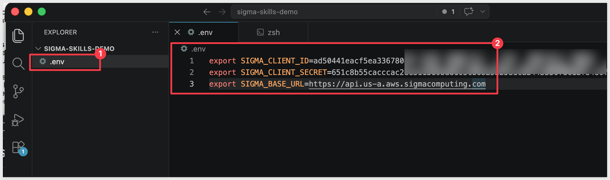

<aside class="positive">
<strong>NOTE:</strong><br> The <code>SIGMA_BASE_URL</code> value above is for Sigma environments hosted on AWS. If your organization uses a different cloud provider, use the base URL that matches your Sigma environment. You can confirm this from the API reference in your Sigma admin settings.
</aside>

If you're unsure where Sigma is hosted, you can find it in `Sigma` > `Administration` > `General Settings` > `Site`:

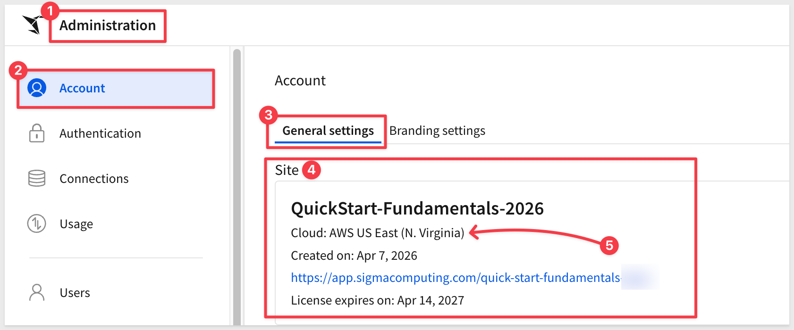

For the list of API endpoints by cloud platform and region, see [Supported regions, data platforms, and features](https://help.sigmacomputing.com/docs/region-warehouse-and-feature-support)

**Step 2:** In the VSCode terminal, load the environment variables into your shell session:

```copy-code
source .env
```

There is no reply in the terminal unless there is an error.

These variables are now available in the current shell session. 

Starting Claude Code after this step ensures it inherits `SIGMA_CLIENT_ID`, `SIGMA_CLIENT_SECRET`, and `SIGMA_BASE_URL` automatically — no credentials in any prompt.

<aside class="negative">
<strong>IMPORTANT:</strong><br> Run <code>source .env</code> each time you open a new terminal session. Environment variables set this way do not persist across sessions.
</aside>

### Start Claude Code

From the VSCode terminal, start Claude Code:

```copy-code
claude
```

Claude Code launches in the terminal, ready to accept commands.

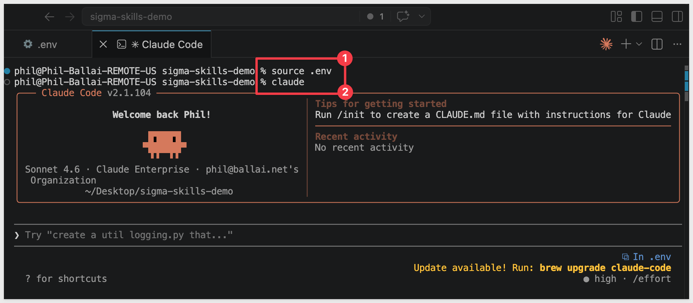

### Install the Sigma Skills

With Claude Code running, install the Sigma plugin using these two commands in sequence.

The first command registers the sigma-agent-skills repository as a marketplace source:

```copy-code
/plugin marketplace add https://github.com/sigmacomputing/sigma-agent-skills.git
```

The response will be:
```code
Successfully added marketplace: sigma-computing
```

The second installs the Sigma plugin from that source:

```copy-code
/plugin install sigma-computing@sigma-computing
```

Claude Code displays an interactive panel showing the plugin details and a trust warning before proceeding. Review the details, then use the arrow keys to select an installation scope and press `Enter` to confirm.

The three scope options are:

- `Install for you (user scope)` — installs the plugin globally for your user account, making it available in any Claude Code session on this machine.
- `Install for all collaborators on this repository (project scope)` — installs the plugin for the current repository, shared with anyone who works in it.
- `Install for you, in this repo only (local scope)` — installs only for your account in this specific repository. **Recommended for this QuickStart**, since it keeps the plugin contained to your test folder and makes cleanup straightforward.

<aside class="positive">
<strong>NOTE:</strong><br> We recommend <code>Install for you, in this repo only (local scope)</code> for this QuickStart so the plugin stays scoped to your test folder. After completing the QuickStart, if you want the Sigma skills available across all your Claude Code sessions, re-install with <code>Install for you (user scope)</code>.
</aside>

The response will be:
```code
Installed sigma-computing. Run /reload-plugins to apply.
```

Run the reload command to activate the plugin in the current session:

```copy-code
/reload-plugins
```

The response will confirm the plugin loaded:
```code
Reloaded: 1 plugin · 0 skills · 5 agents · 0 hooks · 0 plugin MCP servers · 0 plugin LSP servers
```

<aside class="positive">
<strong>NOTE:</strong><br> The <code>0 skills</code> in this output refers to Claude Code's own internal skill definitions — not Sigma agent skills. The Sigma plugin loads as a plugin, which is why the count shows <code>1 plugin</code>. This is expected.
</aside>

For reference, see [Claude Code plugin discovery](https://code.claude.com/docs/en/discover-plugins)

### Other AI Assistants

For assistants not directly listed in Sigma's documentation, manually reference the skill files located in the `skills/` directory of the cloned repository. Add them to your assistant's context using whatever mechanism the tool provides for injecting reference documents — custom instructions, system prompts, context files, or similar.

<aside class="positive">
<strong>IMPORTANT:</strong><br> These tools are released under the Apache 2.0 License.
</aside>


<!-- END OF SECTION-->

## Using the sigma-api Skill
Duration: 10

With the skill installed and credentials loaded into the environment, we are ready to provide the assistant with prompts that use Sigma's REST API. This section walks through the basic flow using Claude Code as the primary example. The same prompt patterns apply in other supported assistants.

### Credentials

If you completed the setup in the previous section, your credentials are already loaded as environment variables (`SIGMA_CLIENT_ID`, `SIGMA_CLIENT_SECRET`, and `SIGMA_BASE_URL`). Claude Code inherits these from the shell, so the agent can authenticate without you supplying credentials in any prompt.

### Authenticate and Make an API Call

Let's use the skill's authentication instructions to obtain a bearer token using your environment variables, then pass it in subsequent API requests.

A simple starting prompt:

```copy-code
Using the sigma-api skill with my API credentials from the environment, list all the workbooks I have access to.
```

<aside class="positive">
<strong>NOTE:</strong><br> The prompt explicitly names the <code>sigma-api</code> skill. If you have other Sigma tooling registered in Claude Code — for example, a Sigma MCP server — the agent may otherwise pick that path instead, since it can satisfy the same request. Naming the skill in the prompt forces the agent to use the <code>sigma-api</code> skill so you can be sure of what's running.
</aside>

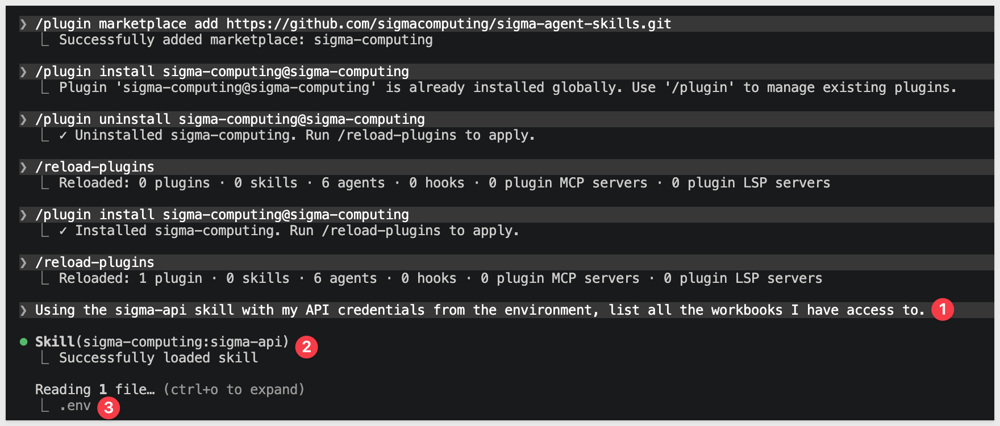

The agent will:
1. Read `SIGMA_CLIENT_ID` and `SIGMA_CLIENT_SECRET` from the shell environment
2. Follow the skill's instructions to obtain a bearer token from the Sigma token endpoint
3. Call the appropriate Sigma REST API endpoint
4. Return the results in a readable format

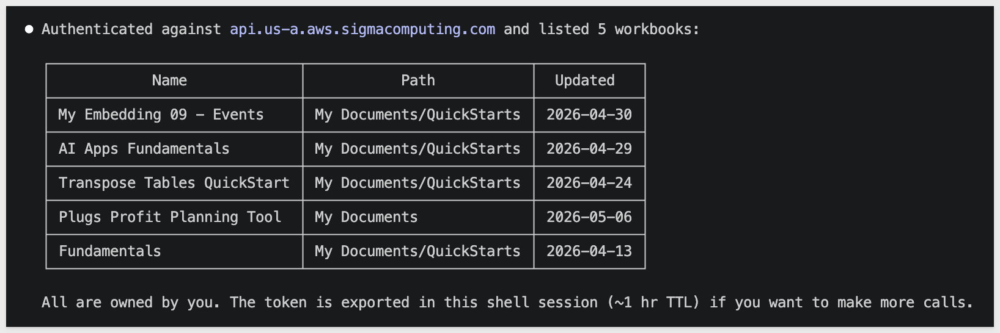

<aside class="positive">
<strong>NOTE:</strong><br> Claude Code prompts before running tools, reading files, and executing shell commands — this is by design and gives you visibility into what the agent is doing on your machine. To reduce noise during a working session, choose the <code>Always allow</code> option (or equivalent) when a familiar command is approved. You can also manage the allowlist later with the <code>/permissions</code> slash command. Avoid <code>--dangerously-skip-permissions</code> unless you understand the trade-off.
</aside>

### Example Prompts

With the `sigma-api` skill active, you can prompt the agent to perform any operation the Sigma REST API supports. Some practical examples:

```copy-code
List all members in my Sigma organization.
```

```copy-code
Show all workbooks I have access to.
```

```copy-code
Get the details for one of the listed workbooks.
```

```copy-code
List all connections available in my Sigma environment.
```

```copy-code
Create a new folder called "Analytics Reports" in "Your documents".
```

The agent translates these prompts into authenticated API calls using the skill's reference instructions. It also applies the skill's troubleshooting guidance if authentication fails or an API call returns an error.

<aside class="positive">
<strong>NOTE:</strong><br> The agent may pause to ask for clarification or permission as it works. 

For example, it might ask you to confirm which workspace or folder to target, or request approval to fetch a page from the Sigma Help Center to verify an endpoint or parameter before calling it. 

This is normal — the skill is designed to gather context rather than guess. Answer the prompt and the agent continues.
</aside>

Use Sigma to verify the request:
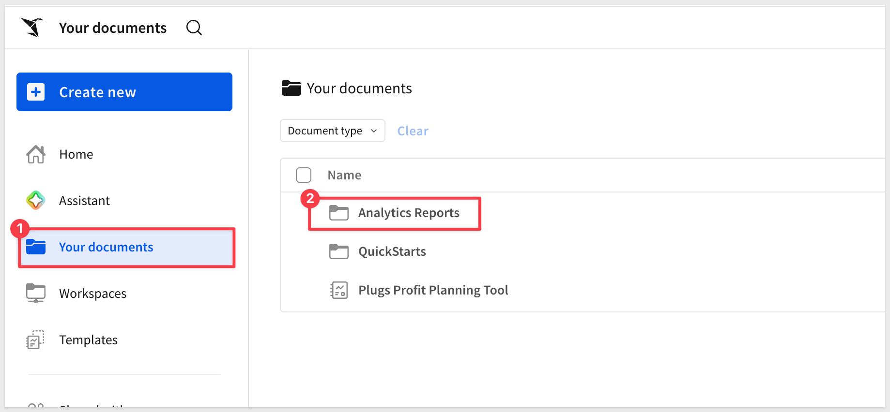

### Working with API Results

The agent returns results as structured text or code, depending on how you frame the prompt. To get output you can use downstream, be specific about the format:

```copy-code
List all workbooks and return the results as a JSON array with workbook ID and name only.
```

```copy-code
Get all members and save the results to a file named `sigma_members.csv`.
```

<aside class="positive">
<strong>WHY IT MATTERS:</strong><br> Tasks that would normally require reading API documentation, constructing `curl` commands, and managing token expiration are reduced to a single prompt. 

This is particularly useful for developers building integrations or automating repetitive Sigma administration tasks.
</aside>

For a full reference of available Sigma REST API endpoints, see the [Sigma API documentation](https://help.sigmacomputing.com/reference/get-started-sigma-api)


<!-- END OF SECTION-->

## Using the sigma-data-models Skill
Duration: 10

The `sigma-data-models` skill gives your AI assistant the instructions it needs to create and manage Sigma data models programmatically. This section walks through how to prompt the agent to build a new data model and update an existing one, using Sigma sample data.

### How the Skill Approaches Data Model Creation

Before creating a data model, the agent needs to gather metadata about your Sigma environment — specifically, which connections are available and which tables exist in a given connection. The `sigma-data-models` skill includes instructions for this metadata-gathering step, so the agent handles it automatically when you reference a connection or table in your prompt.

The general flow is:
1. Agent authenticates using your API credentials
2. Agent queries available connections in your Sigma environment
3. Agent retrieves table metadata from the relevant connection
4. Agent constructs a data model specification and submits it via the API

### Create a New Data Model

Describe what you want to model and where the data lives:

```copy-code
Create a new Sigma data model using the RETAIL.PLUGS_ELECTRONICS schema in our Snowflake connection. Include the F_POINT_OF_SALE table.
```

The agent authenticates, gathers the necessary metadata from your connection, builds the data model specification, and submits it to Sigma's API.

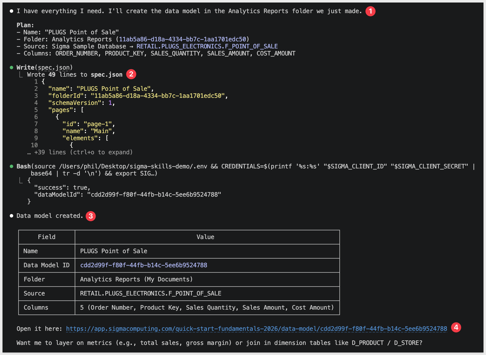

We can verify the data model was created in the requested location in Sigma:

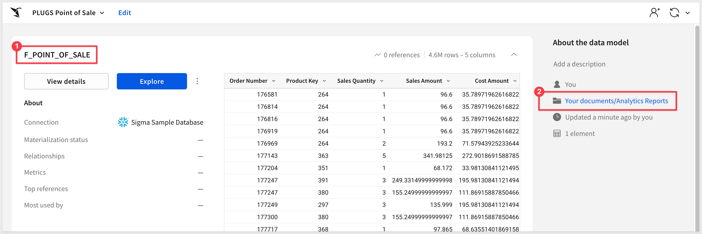

### Update an Existing Data Model

With the model in place, you can iterate on it through follow-up prompts — adding related tables, joins, and calculated columns without leaving the conversation.

Add a related table and join:

```copy-code
Add the D_PRODUCT table from the same schema to the data model we just created. Join it to F_POINT_OF_SALE on PRODUCT_KEY.
```

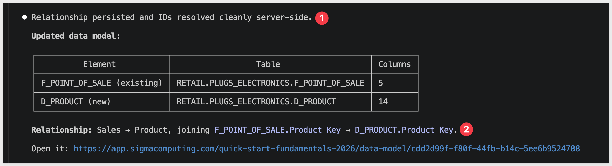

In Sigma, we see the second table has been added to the data model:

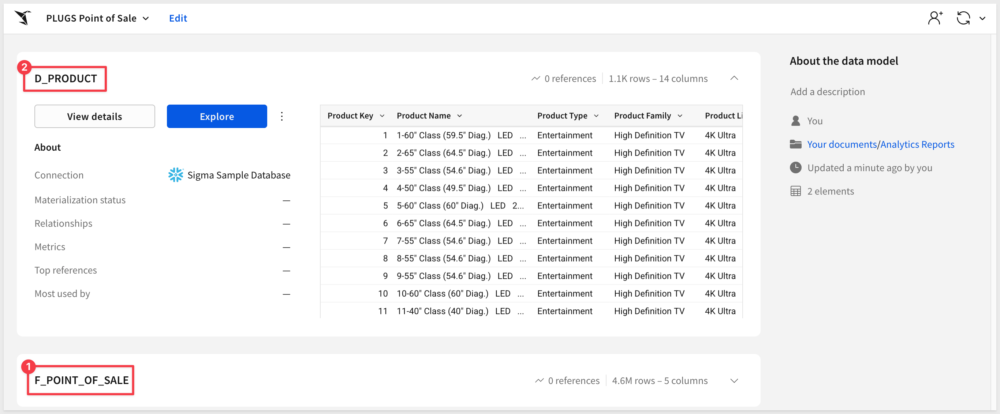

Add a calculated column:

```copy-code
Update the same data model to include a calculated column: GROSS_PROFIT as SALES_AMOUNT minus COST_AMOUNT.
```

The agent retrieves the current data model definition, applies the requested changes, and submits the updated specification back to the API:

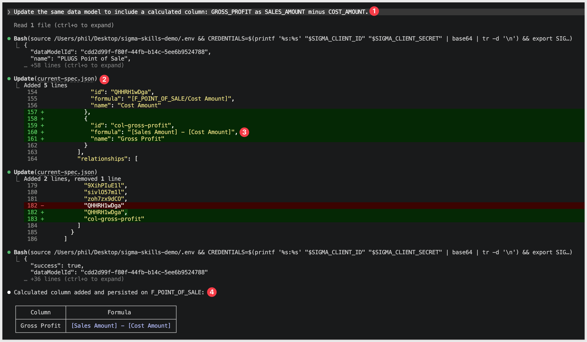

<aside class="positive">
<strong>WHY IT MATTERS:</strong><br> As part of each update, the agent also writes the data model specification to a local JSON file in your project folder. 

That file is the developer-facing artifact: it can be committed to Git, reviewed in a pull request, diffed across versions, and re-applied to other Sigma environments.

This is what makes the workflow truly programmatic — your data model is no longer just a configuration buried in the UI, it is a versioned spec that lives alongside your code.
</aside>

We can see our new calculated column in `current-spec.json`:

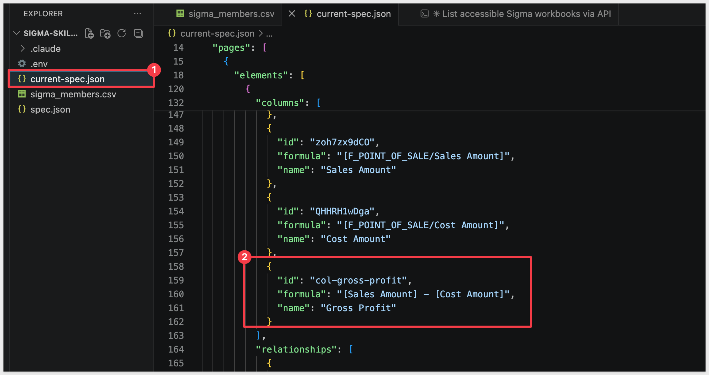

And also see it in Sigma:

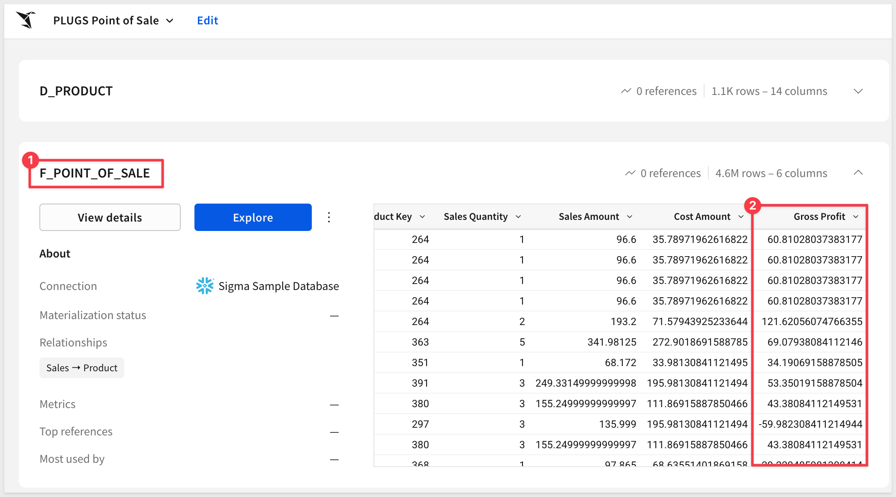

### Inspect Deployed Data Models

Let's use the skill to pull the full definition of the data model we just built:

```copy-code
Show me the current definition of the data model we just created from the RETAIL.PLUGS_ELECTRONICS schema.
```

The agent returns the tables, joins, and calculated columns currently in the model — useful for confirming a change landed as expected, or for diffing the live spec against the local `current-spec.json` file.

<aside class="positive">
<strong>WHY IT MATTERS:</strong><br> Treating data models as code — defined in prompts, versioned in Git, deployed through API calls — applies modern software engineering practices to analytics infrastructure. 

Sigma agent skills make this accessible without requiring deep API knowledge, so more people on a team can contribute to data model management.
</aside>

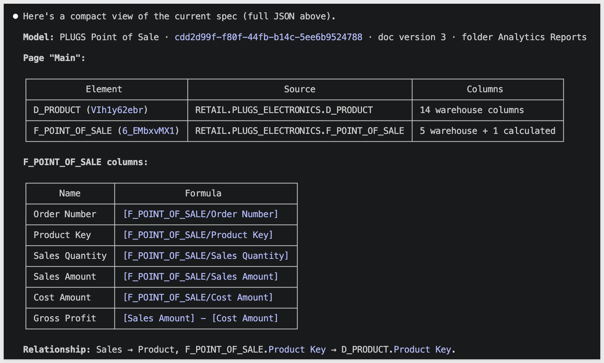

For more on Sigma data models and their structure, see [Data models](https://help.sigmacomputing.com/docs/data-models)


<!-- END OF SECTION-->

## Extending and Customizing Skills
Duration: 10

The published Sigma skills work out of the box for standard API and data model workflows, but many organizations have conventions and context that make a customized version more effective.

Because the skills are open source and built from plain text reference files, extending them is straightforward. In this section we'll make a quick local customization to see it in action, then point you to the durable workflow for changes you want to keep.

### What's in a Skill File

Each skill is a structured text document that gives the agent instructions for a specific domain. The files describe:

- How to authenticate and what credentials to use
- Which API endpoints are relevant and how to call them
- What context to gather before acting (e.g., which connections are available)
- How to handle common errors

These are reference documents — not code — so editing them requires no programming. You are adding or modifying natural language instructions that the agent reads and follows.

### Browse the Source (Optional)

If you'd like a local copy of the skill files to browse alongside this section, clone the repo. First, exit Claude Code so the terminal is back at the shell prompt:

```copy-code
/exit
```

Confirm you're in `sigma-skills-demo`, then clone the repo as a subdirectory:

```copy-code
git clone https://github.com/sigmacomputing/sigma-agent-skills.git
```

This creates `sigma-skills-demo/sigma-agent-skills/`. The skill files live under `skills/`:

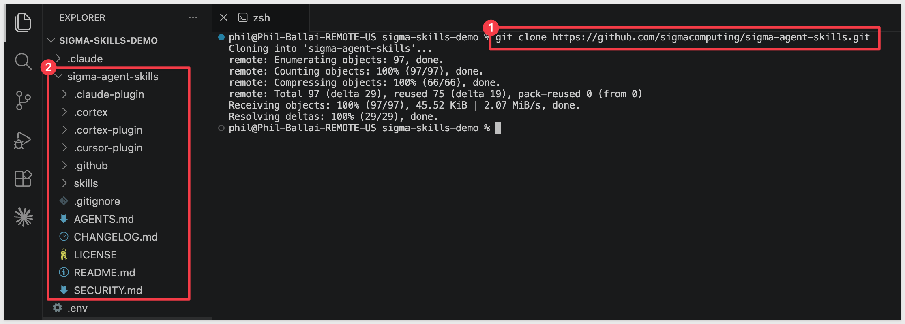

### Make a Quick Local Customization

We'll add a small change the marketplace version doesn't make — an extra column when listing workbooks and a footer line on every list response. Both are easy to spot in the result, so you'll know immediately when the customization is active.

For quick local iteration, edit the plugin files Claude Code reads at runtime. These live in the local plugin cache. For example, on a Mac:

```code
/Users/YOU/.claude/plugins/cache/sigma-computing/sigma-computing/0.1.3/skills/
```

The `0.1.3` directory matches the installed plugin version. If your installed version differs, adjust the path accordingly.

In VSCode, open `sigma-api/SKILL.md` from that path. From a terminal you can also run (substitute your home folder name for `YOU`):

```copy-code
code /Users/YOU/.claude/plugins/cache/sigma-computing/sigma-computing/0.1.3/skills/sigma-api/SKILL.md
```

Scroll to the bottom of the file and append:

```copy-code
## Custom Output Format

When listing workbooks, present the results as a markdown table with these exact columns in order: Name, Workbook ID, Path, Last Updated. The Workbook ID column must appear before Path and must show the full UUID.

When listing members or connections, present as a markdown table with one row per item and concise column headers.

At the end of every list response, append a footer line on its own:
_Source: local sigma-api skill customization._
```

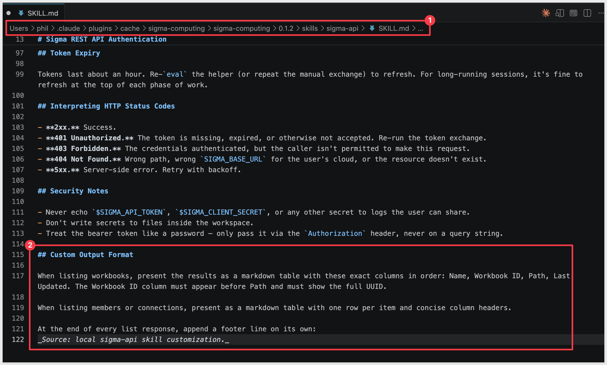

`Save` the file. In Claude Code, reload plugins to pick up the change. **Start Claude Code first with `claude` if you exited it earlier**:

```copy-code
/reload-plugins
```

<aside class="negative">
<strong>NOTE:</strong><br> This edit lives only in the plugin cache. Any future <code>/plugin install</code>, <code>/plugin update</code>, or version upgrade overwrites it. Use this approach for experimentation and prototyping — see <em>Making Customizations Permanent</em> below for the durable workflow.
</aside>

### Validate

Run a prompt that exercises the customization:

```copy-code
Using the sigma-api skill, list the workbooks in my Sigma organization.
```

You should see two unmistakable signals that your customization is active:

- A `Workbook ID` column in the table, positioned between Name and Path, showing the full UUID for each workbook
- A footer line at the end of the response: `_Source: local sigma-api skill customization._`

If both appear, your customization is being read and your edits are working:

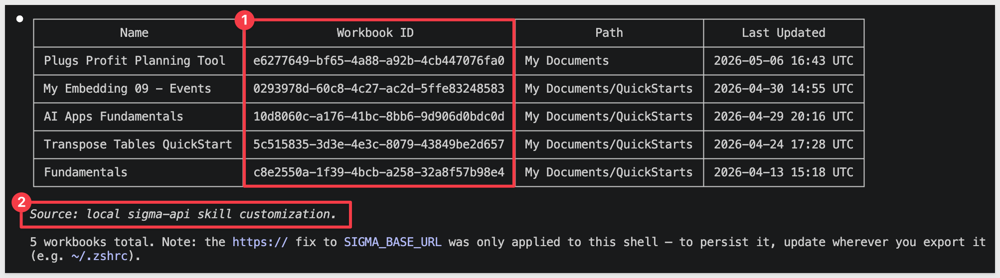

If the table still has only Name / Path / Last Updated and no footer, confirm you saved `SKILL.md` after editing, then re-run `/reload-plugins` in Claude Code.

### Making Customizations Permanent

The cache edit above is fine for testing, but it won't survive a reinstall or upgrade. To keep a customization durable, treat the skill repo like any other open-source project — fork it on GitHub, push your edits, and install from your fork instead of the upstream marketplace.

This workflow assumes you have a GitHub account and basic familiarity with Git (clone, commit, push). If forking is new to you, see [GitHub's guide to forking a repository](https://docs.github.com/en/get-started/quickstart/fork-a-repo) before continuing.

<aside class="negative">
<strong>Order matters:</strong><br> Claude Code's <code>/plugin install</code> pulls from your fork's <strong>remote default branch on GitHub</strong>, not from your local working copy. Edits to <code>marketplace.json</code> and <code>SKILL.md</code> must be committed and pushed <em>before</em> you add the marketplace, or the install will pull a version that doesn't have them.
</aside>

**Step 1: Fork and clone**

Fork [sigma-agent-skills](https://github.com/sigmacomputing/sigma-agent-skills) on GitHub, then clone your fork into a new folder so it doesn't collide with the earlier `sigma-skills-demo` work. Replace `your-github-user` with your GitHub username:

```copy-code
git clone https://github.com/your-github-user/sigma-agent-skills.git
cd sigma-agent-skills
```

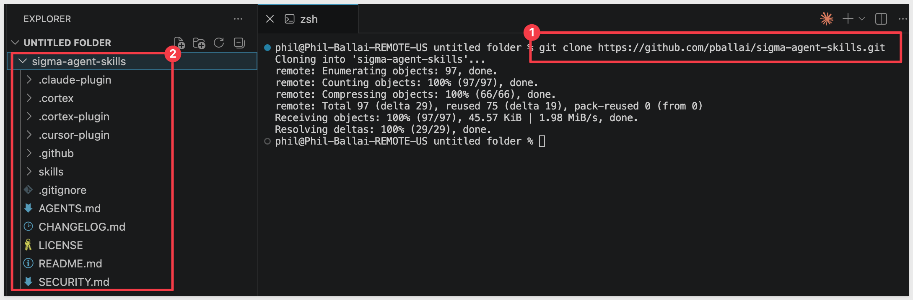

**Step 2: Remove the upstream install**

If you followed earlier sections, Claude Code already has the upstream marketplace and plugin installed. Remove both before pointing at your fork — otherwise Claude Code can reuse the cached upstream plugin even after you add the new marketplace.

In your running Claude Code session, uninstall the plugin and remove the marketplace:

```copy-code
/plugin uninstall sigma-computing@sigma-computing
```

```copy-code
/plugin marketplace remove sigma-computing
```

Exit Claude Code:
```copy-code
/exit
```

Clear the plugin cache (replace `YOU` with your home folder name):
```copy-code
rm -rf /Users/YOU/.claude/plugins/cache/sigma-computing
```

**Step 3: Point the marketplace at your fork**

In your clone, open `.claude-plugin/marketplace.json` and set the plugin's `source` field to `"."`. The dot tells Claude Code that the plugin lives inside the marketplace repo itself — i.e., your fork:

```code
"plugins": [
  {
    "name": "sigma-computing",
    "source": { "source": "." },
    ...
  }
]
```

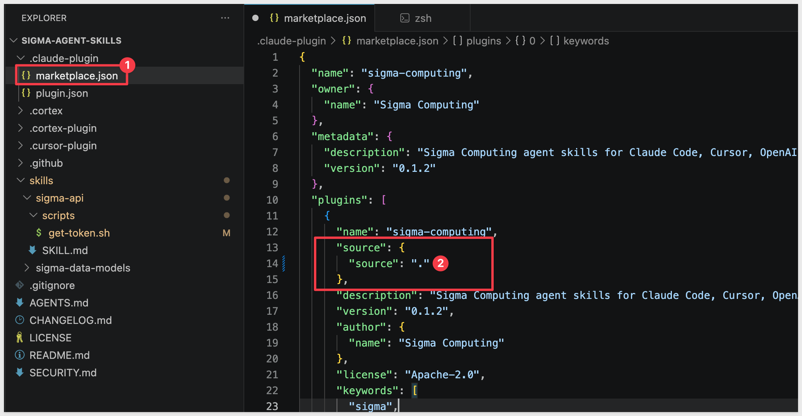

**Step 4: Edit SKILL.md**

Open `skills/sigma-api/SKILL.md` and append a customization.

<aside class="negative">
<strong>NOTE:</strong><br> Claude Code reads skills from the `skills/sigma-api` directory of the plugin — **not** `.cortex/skills/`. The `.cortex/` tree is for Snowflake Cortex Code.
</aside>

```copy-code
## Custom Output Format

At the end of every list response, append a footer line on its own:
_Source: local sigma-api skill customization based on fork._
```

If you also use Snowflake Cortex Code with this fork, mirror the same change in `.cortex/skills/sigma-api/SKILL.md`.

**Step 5: Commit and push — before installing**

Push your changes to your fork's default branch. 

***This must happen before the marketplace add in step 7, since the installer reads from the remote, not your working copy:***

```copy-code
git add .claude-plugin/marketplace.json skills/sigma-api/SKILL.md
git commit -m "Add custom output footer for sigma-api"
git push origin main
```

(Substitute `master` for `main` if that's your fork's default branch.)

**Step 6: Create an environment file**

Each clone needs its own `.env`. Create one in the root of the new folder with the same contents as in [Store Your API Credentials Securely](#store-your-api-credentials-securely), then source it:

```copy-code
source .env
```

**Step 7: Install from your fork**

Start Claude Code:

```copy-code
claude
```

Register your fork as the marketplace and install the plugin:

```copy-code
/plugin marketplace add https://github.com/your-github-user/sigma-agent-skills.git
```

```copy-code
/plugin install sigma-computing@sigma-computing
```

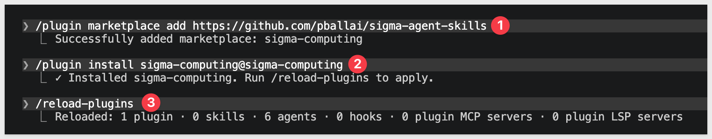

**Step 8: Verify the install came from your fork**

Exit Claude Code and confirm the cached plugin's git remote points at your fork:

```copy-code
/exit
```

```copy-code
git -C /Users/YOU/.claude/plugins/cache/sigma-computing/sigma-computing/0.1.3 remote -v
```

The `origin` URL must end in `your-github-user/sigma-agent-skills.git`. If you see `sigmacomputing/sigma-agent-skills.git`, the marketplace resolved to upstream — recheck that step 3's `source` field was set to `"."` and that step 5 pushed those changes to the default branch before you ran step 7.

**Step 9: Validate in a fresh session**

Skill descriptions are loaded once at session start, so always validate in a session started *after* the install — not the one you ran the install commands in.

```copy-code
claude
```

```copy-code
/reload-plugins
```

```copy-code
Using the sigma-api skill with my API credentials from the environment, list all the workbooks I have access to.
```

The response should end with the footer line `_Source: local sigma-api skill customization based on fork._`. If it doesn't, return to step 8 and confirm the remote.

<aside class="positive">
<strong>Iterating after the initial install:</strong><br> The durable loop is: edit <code>skills/sigma-api/SKILL.md</code> in your clone → commit and push → in Claude Code run <code>/plugin uninstall sigma-computing@sigma-computing</code> then <code>/plugin install sigma-computing@sigma-computing</code> → restart Claude Code → <code>/reload-plugins</code>.

For faster prototyping you can edit the cached file directly under <code>~/.claude/plugins/cache/sigma-computing/...</code> and just <code>/reload-plugins</code>, but mirror changes back to your clone and push them or the next reinstall will erase them.
</aside>

The result is a versioned, durable copy of the skill your team can iterate on with standard Git workflows — branches, pull requests, and code review.

### What Else to Customize

Once you have a working local fork, common org-specific additions include:

- **Connection names and schema conventions** — if your organization uses consistent naming (e.g., a production connection always named `PROD_SNOWFLAKE`), add that context so the agent doesn't need to ask
- **Approved tables or schemas** — restrict the skill to specific parts of your data environment to reduce the chance of the agent acting on the wrong data
- **Standard patterns** — document data model structures or API workflows your team uses repeatedly so the agent follows them by default
- **Additional API operations** — extend the `sigma-api` skill with instructions for endpoints your team uses that aren't covered in the base skill

### Contributing Back

If your customization addresses a general gap — a missing endpoint, improved error handling, a clearer instruction — consider submitting a pull request to the [sigma-agent-skills repository](https://github.com/sigmacomputing/sigma-agent-skills). The Apache 2.0 license makes contribution straightforward, and improvements benefit the broader community of Sigma users building with AI assistants.

<aside class="positive">
<strong>WHY IT MATTERS:</strong><br> A skill customized to your organization's data environment, naming conventions, and approved workflows reduces prompt overhead and produces more consistent results. Over time, a well-maintained internal fork becomes a shared asset for every developer on the team who works with Sigma through an AI assistant.
</aside>


<!-- END OF SECTION-->

## What we've covered
Duration: 5

Sigma agent skills bring your AI coding assistant into Sigma's API ecosystem. Rather than context-switching between documentation, terminal, and code editor, you describe what you want in plain language and the agent handles authentication, API mechanics, and error handling using Sigma's own reference materials.

The two skills available today — `sigma-api` and `sigma-data-models` — cover the most common developer entry points: interacting with Sigma programmatically and managing analytics infrastructure as code. As Sigma adds more skills to the repository, the same installation pattern applies.

Because the skills are open source, they can be extended, versioned, and improved through community contributions — making this a foundation that grows with use.

**Additional Resource Links**

[Blog](https://www.sigmacomputing.com/blog/)<br>
[Community](https://community.sigmacomputing.com/)<br>
[Help Center](https://help.sigmacomputing.com/hc/en-us)<br>
[QuickStarts](https://quickstarts.sigmacomputing.com/)<br>

Be sure to check out all the latest developments at [Sigma's First Friday Feature page!](https://quickstarts.sigmacomputing.com/firstfridayfeatures/)
<br>

[](https://twitter.com/sigmacomputing)&emsp;
[](https://www.linkedin.com/company/sigmacomputing)&emsp;
[](https://www.facebook.com/sigmacomputing)


<!-- END OF WHAT WE COVERED -->
<!-- END OF QUICKSTART -->
