author: pballai
id: developers_workbooks_as_code
summary: developers_workbooks_as_code
categories: developers
environments: web
status: Hidden
feedback link: https://github.com/sigmacomputing/sigmaquickstarts/issues
tags:
lastUpdated: 2026-12-31

# Manage Sigma Workbooks with Git and CI/CD

## Overview
Duration: 5

If your team already reviews every code change through pull requests, runs CI on every commit, and deploys through automated pipelines, a Sigma workbook shouldn't be the one piece of the stack that still changes by clicking around in a UI. 

Workbooks as Code lets you define an entire workbook — pages, charts, KPIs, filters, layout — as a single YAML file, so it moves through the same git-based process as the rest of your application code: version control, peer review, automated validation, and CI/CD deployment.

In this QuickStart, you'll wire up exactly that pipeline. Along the way you'll learn how to:
- Read and edit a workbook spec in YAML
- Authenticate to Sigma's REST API using client credentials
- Fork and configure a working GitHub Actions pipeline for a Sigma workbook
- Open a pull request and watch CI validate the spec automatically
- Merge a change and watch it deploy to the live workbook
- Detect and resolve drift when someone edits the workbook directly in the Sigma UI

This QuickStart focuses on the workbook itself — layout, charts, KPIs, controls. 

If you'd rather manage the underlying data model as code, see the companion [Data Models as Code](https://quickstarts.sigmacomputing.com/guide/developers_data_models_as_code/index.html?index=..%2F..index#0) QuickStart, which covers the same version control, code review, and CI/CD pattern applied to data models via JSON specs.

<aside class="positive">
<strong>IMPORTANT:</strong><br> Some screens in Sigma may appear slightly different from those shown in QuickStarts. This is because Sigma continuously adds and enhances functionality. Rest assured, Sigma's intuitive interface ensures that any differences will not prevent you from successfully completing any QuickStart.
</aside>

For more information on Sigma's product release strategy, see [Sigma product releases](https://help.sigmacomputing.com/docs/sigma-product-releases)

If something doesn't work as expected, here's how to [contact Sigma support](https://help.sigmacomputing.com/docs/sigma-support)

### Target Audience
This QuickStart is designed for developers, data engineers, and technical admins who want to manage Sigma workbooks programmatically and treat them like any other piece of version-controlled application code.

### Prerequisites

<ul>
  <li>A Sigma account with API access enabled</li>
  <li>API credentials (Client ID and Secret) - see <a href="https://help.sigmacomputing.com/docs/generate-api-client-credentials">Generate API client credentials</a></li>
  <li>A GitHub account and familiarity with git, branches, and pull requests</li>
  <li>Permission to create, edit, and publish workbooks</li>
  <li>Basic understanding of YAML</li>
 </ul>

<aside class="positive">
<strong>IMPORTANT:</strong><br> Sigma recommends using non-production resources when completing QuickStarts.
</aside>

<button>[Sigma Free Trial](https://www.sigmacomputing.com/free-trial/)</button>


## Client Credentials
Duration: 5

Client credentials (a unique client ID and client secret) are required to authenticate to Sigma's REST API.

Sigma uses the client ID to identify your application and the client secret to verify your identity. Together, these credentials enable secure, programmatic access to Sigma's API endpoints using OAuth 2.0 authentication.

Navigate to `Administration` and select `Developer access`.

<aside class="positive">
<strong>API Base URL:</strong><br> Take note of the API Base URL shown in the Developer access section. This region-specific endpoint is required for all API calls, and you'll need it again when configuring GitHub in the next section. Failure to use the correct API endpoint will prevent your commands from working.
</aside>

Click `Create New`:


In the `Create client credentials` modal, select `REST API`, give it a name, and assign an administrative user as the owner.


<aside class="positive">
<strong>NOTE:</strong><br> You can also enable the "Embedding" checkbox if you plan to use these same credentials for embedding. For this QuickStart, only REST API access is required.
</aside>

Click `Create`.

<aside class="negative">
<strong>IMPORTANT:</strong><br> For security purposes, Sigma provides a one-time view of the client secret at the time of creation and does not display it again. Because the secret is non-retrievable, store it securely when you create it.

If you lose the client secret or it becomes compromised, you can revoke it and generate a new one. However, this invalidates the previous secret and all API calls using it will fail until updated with the new credentials.
</aside>


Copy and paste the `Client ID` and `Secret` - you'll add them as GitHub secrets in the next section.


<!-- END OF SECTION-->

## Fork the Demo Repository
Duration: 5

### Fork the Project

We've built a complete, working example - spec, scripts, and GitHub Actions workflows - in a public GitHub repository so you don't have to wire up the automation from scratch.

This QuickStart's automation runs as GitHub Actions inside your own repository, so you'll fork the project rather than just downloading the files - GitHub Actions only run from a repository you own or have push access to.

Open the repository in your browser:

[Hoosier-Data-AI/sigma-workbooks-as-code-demo](https://github.com/Hoosier-Data-AI/sigma-workbooks-as-code-demo)

Click `Fork` in the top-right corner and `+ Create a new fork`:


Confirm the owner (your account or org) and click `Create fork`.


Once the fork is done, open a `Terminal` session and create a new directory to work in:

```copy-code
mkdir sigma_quickstarts
cd sigma_quickstarts
```

Now clone your fork locally so you can edit files and push changes (be sure to replace YOUR_GITHUB_USERNAME in the clone command below):

```copy-code
git clone https://github.com/YOUR_GITHUB_USERNAME/sigma-workbooks-as-code-demo.git
cd sigma-workbooks-as-code-demo
```

Confirm `origin` points at your own fork, not the original repo (or someone else's fork):

```copy-code
git remote -v
```

<aside class="negative">
<strong>TROUBLESHOOTING A 403 WHEN PUSHING:</strong><br> Both the fetch and push URLs above should show <code>YOUR_GITHUB_USERNAME/sigma-workbooks-as-code-demo</code>. If a push to this fork later fails with <code>403 Permission denied</code>, work through these in order:
<ol>
<li><strong>Wrong remote</strong> - <code>origin</code> points somewhere you don't have push access (the original repo, or someone else's fork). Fix: <code>git remote set-url origin https://github.com/YOUR_GITHUB_USERNAME/sigma-workbooks-as-code-demo.git</code>.</li>
<li><strong>Wrong cached account</strong> - if the error names an account that isn't yours, git is using stale credentials for a different GitHub account (common with personal + work accounts on one machine). Run <code>gh auth login</code> to switch (a Personal Access Token is more reliable here than the browser device-code flow, which can be affected by GitHub service incidents), then <code>gh auth setup-git</code> - this second command is easy to skip and is what actually makes plain <code>git</code> commands use the new credential.</li>
<li><strong>Right account, still denied</strong> - if the error now names the correct account, a fine-grained personal access token likely lacks write access. Check <code>Settings</code> > <code>Developer settings</code> > <code>Personal access tokens</code>: the token needs this repo listed under <strong>Repository access</strong> and <strong>Contents</strong> set to <strong>Read and write</strong>.</li>
</ol>
</aside>

You should now see the project structure:

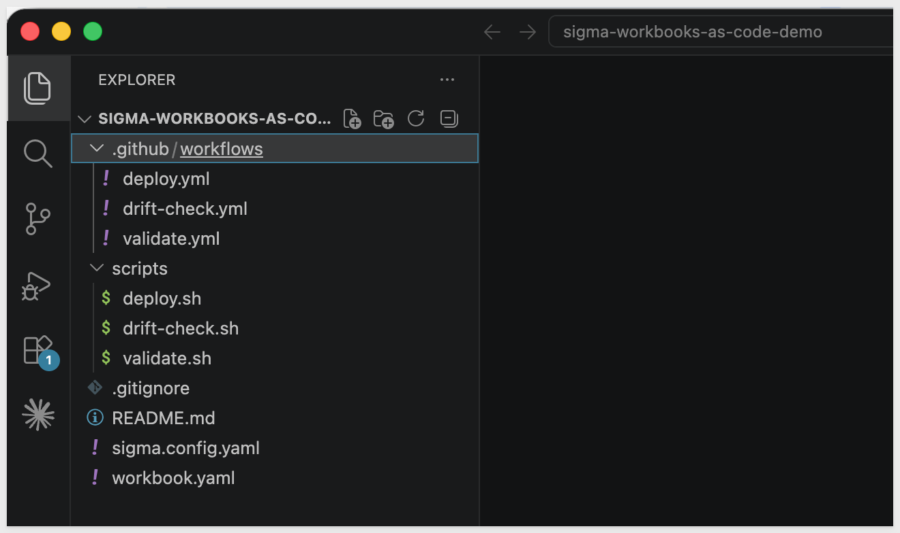

The folder contains:
- **workbook.yaml**: The workbook spec - single source of truth for the entire workbook, covered in the next section
- **sigma.config.yaml**: Config pointing at your target workbook ID and API host
- **scripts/**: The same validate, deploy, and drift-check logic the GitHub Actions workflows call
- **.github/workflows/**: The three automations this QuickStart walks through

<aside class="positive">
<strong>TIP:</strong><br> You can also browse the files directly on GitHub at <a href="https://github.com/Hoosier-Data-AI/sigma-workbooks-as-code-demo">Hoosier-Data-AI/sigma-workbooks-as-code-demo</a>
</aside>

### Set Up YAML Linting in Your Editor

`workbook.yaml` is a large file, and small indentation mistakes - a property at the same depth as its own list item, a closing tag one level shallow - produce YAML errors that are easy to make and tedious to spot by eye. Catching them in your editor as you type is far faster than waiting on a pushed commit to fail validation.

If you're using VS Code, install these two extensions:

- **YAML** (`redhat.vscode-yaml`) - flags syntax and indentation errors live, with the exact line highlighted, as you type
- **Indent Rainbow** (`oderwat.indent-rainbow`) - colors each indentation level, so a property nested one level too shallow or too deep is visually obvious at a glance

<aside class="positive">
<strong>TIP:</strong><br> Using a different editor? Most modern editors have an equivalent YAML-aware linting plugin - the goal is the same either way: catch indentation mistakes before you commit, not after a workflow run fails.
</aside>

### Enable GitHub Actions on Your Fork

<aside class="negative">
<strong>IMPORTANT:</strong><br> GitHub disables Actions by default on repositories created by forking, as a security precaution - this applies whether your account is brand new or has dozens of existing repos. Skip this step and none of the workflows in this QuickStart (validate, deploy, drift-check) will run.
</aside>

In your forked repository on GitHub, click the `Actions` tab.

Click `I understand my workflows, go ahead and enable them`.


You only need to do this once per fork.


<!-- END OF SECTION-->

## Configure GitHub Secrets and Variables
Duration: 5

Instead of a local `.env` file, this QuickStart's automation runs inside GitHub Actions - so your credentials need to live in your fork's repository settings, where the validate, deploy, and drift-check workflows can read them.

### Add Repository Secrets

In your forked repository on GitHub, go to `Settings` > `Secrets and variables` > `Actions`.

Under the `Secrets` tab, click `New repository secret`:


Add each of the following:

| Name | Value |
|------|-------|
| `SIGMA_CLIENT_ID` | The Client ID from the previous section |
| `SIGMA_CLIENT_SECRET` | The Client Secret from the previous section |

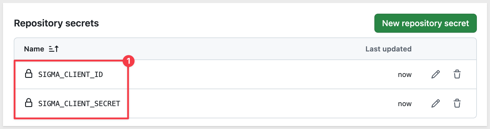

<aside class="negative">
<strong>IMPORTANT:</strong><br> Secrets are encrypted and only exposed to workflow runs - GitHub never displays their value again once saved. If a credential changes later, you can overwrite the secret, but you can't view the existing one first.
</aside>

### Add a Repository Variable

Switch to the `Variables` tab and click `New repository variable`:

| Name | Value |
|------|-------|
| `SIGMA_API_HOST` | Your Sigma region's API host (see below) |

<aside class="positive">
<strong>NOTE:</strong><br> Variables, unlike secrets, are visible in plain text - that's fine here since an API host isn't sensitive on its own.
</aside>

**Finding your API host:** This depends on your Sigma cloud region.

| Cloud | API Host |
|-------|----------|
| AWS US | `https://aws-api.sigmacomputing.com` |
| AWS Canada | `https://api.ca.sigmacomputing.com` |
| GCP | `https://api.sigmacomputing.com` |

This matches the API Base URL you noted in the `Developer access` section earlier.

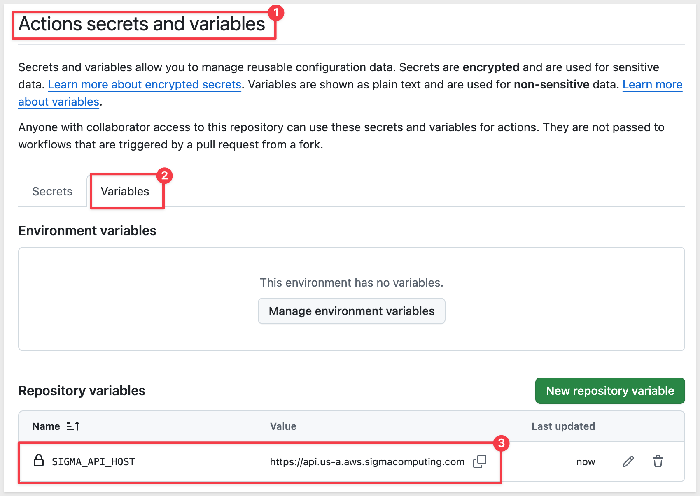

With `SIGMA_CLIENT_ID`, `SIGMA_CLIENT_SECRET`, and `SIGMA_API_HOST` in place, every workflow in this repo can authenticate to your Sigma account automatically - no local `.env` file, no copying tokens between commands.


<!-- END OF SECTION-->

## Understanding the Workbook Spec
Duration: 10

Everything about a workbook - pages, charts, KPIs, filters, layout - lives in one file: `workbook.yaml`. Let's look at how it's put together before you start editing it.

The demo workbook this spec builds is **Plugs Electronics — Sales Overview**, a sales dashboard driven entirely by inline SQL sample data - no external data model required:

<!--  -->

### Basic Structure

At the top level, a workbook spec has a name, an optional folder, and a `document` block containing everything else:

```code
name: "Plugs Electronics — Sales Overview"
folderId: "ce70860a-a347-4fa2-b114-2eb2692a662c"
description: "Sales performance dashboard managed via GitHub."
document:
  kind: workbook
  schemaVersion: 1
  pages: [...]
  elements: [...]
  layout: |
    ...
```

- `name` / `description`: Display name and description shown in Sigma
- `folderId`: Where the workbook lives - find this the same way you'd find any folder ID, via the URL or `GET /v2/files`
- `document.pages`: An array of pages - just page metadata (id, name, visibility), not their contents
- `document.elements`: A single flat array holding every element in the workbook, each tagged with which page it belongs to
- `document.layout`: An XML block placing every element - on every page, including hidden ones - onto a grid

<aside class="negative">
<strong>IMPORTANT:</strong><br> Workbooks as Code is in private beta, and this is one of the areas that's changed recently: elements used to nest directly under each page (<code>document.pages[].elements</code>). The API now rejects that shape - elements live in one flat <code>document.elements</code> array instead, each pointing back at its page. If something you read elsewhere shows the old nested form, trust what's in your cloned <code>workbook.yaml</code> and what the API actually accepts.
</aside>

### Pages and Hidden Data Pages

The demo spec has two pages - just metadata, no elements nested inside:

```code
pages:
  - id: page-data
    name: Data
    visibility: hidden      # holds the source table - readers never see this page

  - id: page-overview
    name: Sales Overview     # the actual dashboard
```

Setting `visibility: hidden` on the `Data` page keeps the raw source table out of the way - end users only ever see the `Sales Overview` page. This is the same hidden-page pattern used in ordinary Sigma workbooks, just expressed in YAML instead of clicked together in the UI.

### The Source Element

`document.elements` holds every element in the workbook. The source element for the hidden `Data` page is a `table` sourced from inline SQL:

```code
- id: sales-source
  pageId: page-data
  kind: table
  name: Sales Data
  source:
    kind: sql
    connectionId: "0b35cd82-a1f9-4052-87c5-ccfb7f32055e"
    statement: |
      SELECT DATE '2024-01-01' AS "Date", 100.00 AS "Revenue"
      UNION ALL SELECT DATE '2024-02-01', 200.00
  columns:
    - id: col-revenue
      name: Revenue
      formula: '[Custom SQL/Revenue]'
```

- `pageId`: Which page this element lives on - `page-data` here, since every element is now flat in `document.elements` rather than nested under its page
- `source.kind: sql`: Runs custom SQL against any warehouse connection - swap in `kind: data-model` here to reference an existing Sigma data model instead
- `connectionId`: Your Sigma connection UUID, covered in the next section
- On the SQL source element itself, columns reference the raw query output with the `[Custom SQL/ColumnName]` prefix

### Downstream Elements and Cross-Element Formulas

Everything on the `Sales Overview` page references the hidden source table by name, not by re-querying it:

```code
- id: kpi-revenue
  pageId: page-overview
  kind: kpi-chart
  name: Total Revenue
  source:
    kind: table
    elementId: sales-source
  columns:
    - id: kr-val
      name: Revenue
      formula: "Sum([Sales Data/Revenue])"
      format:
        kind: number
        formatString: "$,.0f"
  value: { columnId: kr-val }
```

Formula references follow one rule:
- On the source element itself, reference columns with `[Custom SQL/ColumnName]`
- On every downstream element, reference the source by name instead: `[ElementName/ColumnName]` - here, that's `[Sales Data/Revenue]`, since the source table is named `Sales Data`

Formulas use standard Sigma syntax - `Sum(...)`, `CountDistinct(...)`, `DateTrunc(...)` - the same functions you'd use writing a formula in the UI.

### Element Kinds and Controls

The demo spec uses a handful of element `kind` values:

| Kind | Used for |
|------|----------|
| `table` | The hidden source table, and the Sales Detail table on the dashboard |
| `kpi-chart` | The four KPI cards (Revenue, Profit, Orders, Units), each with month-over-month comparison |
| `bar-chart` | Monthly revenue trend and Revenue by Region |
| `donut-chart` | Revenue by Product Type |
| `control` | The Date Range and Store Region filters |
| `container` | Groups elements for layout (the header row, the KPI row) |
| `text` | The dashboard title |

Controls filter other elements by referencing them explicitly:

```code
- id: ctrl-region
  pageId: page-overview
  kind: control
  name: Store Region
  controlType: list
  mode: include
  selectionMode: multiple
  filters:
    - source: { kind: table, elementId: sales-source }
      columnId: col-store-region
```

### Layout

The `layout` block is XML describing a 24-column grid, one `<Page>` per page. Each element gets a `gridColumn` and `gridRow` range:

```code
<Page type="grid" gridTemplateColumns="repeat(24, 1fr)" id="page-overview">
  <Container elementId="kpi-row" type="grid" gridColumn="1 / 25" gridRow="5 / 10" ...>
    <Element elementId="kpi-revenue" gridColumn="1 / 7" gridRow="1 / 5"/>
    <Element elementId="kpi-profit" gridColumn="7 / 13" gridRow="1 / 5"/>
  </Container>
  <Element elementId="chart-revenue-trend" gridColumn="1 / 25" gridRow="10 / 24"/>
</Page>
```

`gridColumn="1 / 13"` spans the left half of the page, `"13 / 25"` the right half. `Container` groups a set of elements (like the four KPI cards) into their own sub-grid, so you can reposition the group without touching each element's coordinates individually.

<aside class="negative">
<strong>IMPORTANT:</strong><br> Every element needs a placement in <code>layout</code> - including elements on the hidden <code>Data</code> page. Skip it and deploy fails with <code>element 'sales-source' is not placed in layout</code>. Its position doesn't matter since the page is hidden, but it still needs its own <code>&lt;Page id="page-data"&gt;</code> block with the source element placed somewhere inside it.
</aside>

<aside class="positive">
<strong>TIP:</strong><br> You don't need to memorize this structure. Once your fork is cloned, open <code>workbook.yaml</code> in your own editor and follow along against the live file. If a field name here doesn't match what the API accepts, the API's error response is the more current source of truth than any static reference - this is a private beta feature still settling into its final shape.
</aside>


<!-- END OF SECTION-->

## Configure and Deploy for the First Time
Duration: 10

With credentials and secrets in place and the spec structure making sense, the last thing to do before this pipeline is live is point it at your own Sigma connection and a target workbook.

### Find Your Connection ID

The demo spec's source element runs custom SQL against a connection you choose. Go to `Administration` > `Connections`, click your connection, and copy the UUID from the URL.

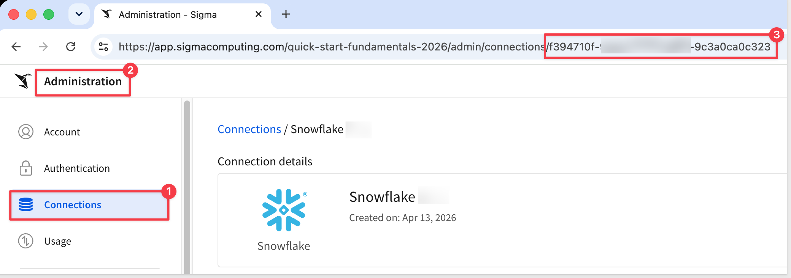

<aside class="positive">
<strong>TIP:</strong><br> You can also retrieve this via the API: <code>GET /v2/connections</code>.
</aside>

### Create a Target Workbook

The deploy workflow updates an *existing* workbook by ID - it doesn't create one. Create a blank workbook to serve as that target:

In Sigma, click `+ New` > `Workbook`. Give it any name and save it - the first deploy will overwrite its contents entirely with what's defined in `workbook.yaml`.

Open the new workbook and copy its ID from the URL.

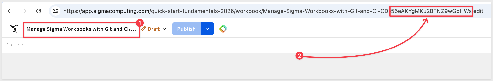

### Update the Config Files

In your local clone, open `sigma.config.yaml` and set `workbook_id` to the ID you just copied:

```copy-code
workbook_id: "your-workbook-id-here"
api_host: "https://aws-api.sigmacomputing.com"
spec_file: "workbook.yaml"
```

<aside class="negative">
<strong>IMPORTANT:</strong><br> The repo ships with <code>api_host</code> defaulted to AWS US. Check it against the <code>SIGMA_API_HOST</code> value you set as a GitHub variable earlier and update it if your Sigma instance is on AWS Canada or GCP - otherwise validate and deploy will fail even though the credentials are correct.
</aside>

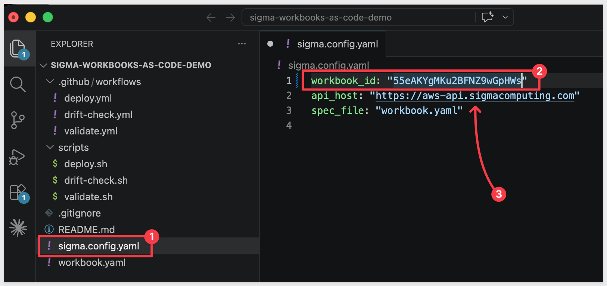

Then open `workbook.yaml` and replace the `connectionId` on the `sales-source` element with your own connection UUID:

```copy-code
source:
  kind: sql
  connectionId: "your-connection-id-here"
```

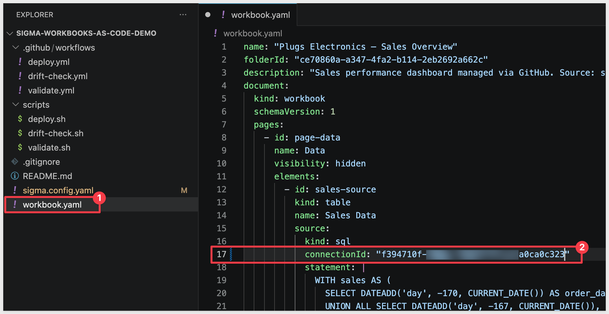

### Deploy for the First Time

This first push is just wiring up configuration, not a reviewable content change, so commit it straight to `main`:

```copy-code
git add sigma.config.yaml workbook.yaml
git commit -m "Configure connection and target workbook"
git push origin main
```

Since this push modifies `workbook.yaml` on `main`, it triggers the **Deploy Workbook** workflow automatically. Open the `Actions` tab in your fork and watch it run.

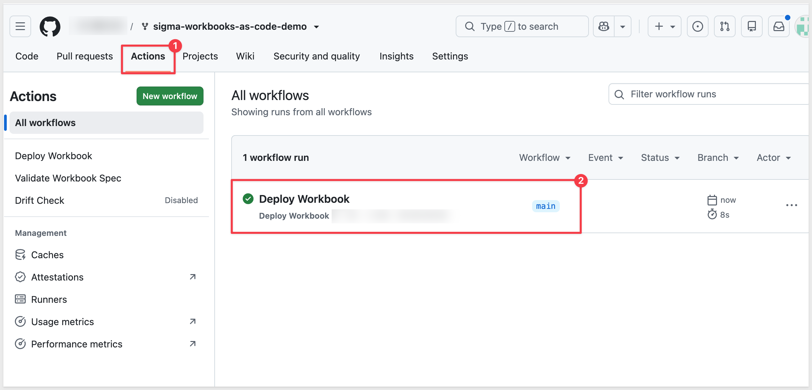

Once it finishes, open your target workbook in Sigma - you should see the full **Plugs Electronics — Sales Overview** dashboard: KPI cards, revenue trend, region and product breakdowns, and the detail table, all generated from a single YAML file.

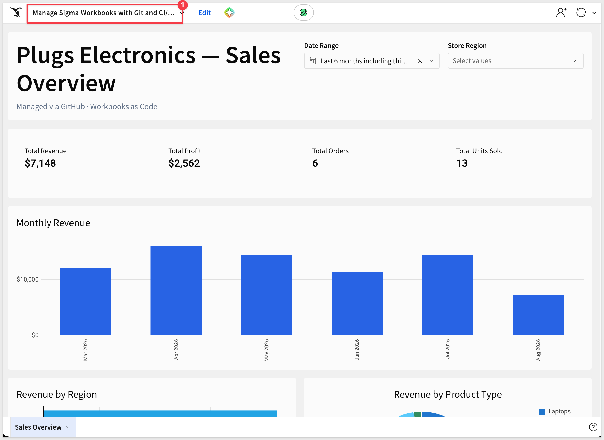

<aside class="positive">
<strong>NOTE:</strong><br> From here on, treat <code>main</code> as protected. Every real change to the workbook - the kind of thing worth a second set of eyes - goes through a feature branch and a pull request instead, which is exactly what the next section covers.
</aside>


<!-- END OF SECTION-->

## Make a Change: Validate on Pull Request
Duration: 10

With the pipeline live, `main` is protected from here on. Every real change - the kind of thing worth a second set of eyes - goes through a feature branch and a pull request instead of a direct push.

### Create a Branch

```copy-code
git checkout -b add-margin-kpi
```

### Add a Gross Margin KPI

Open `workbook.yaml` and search for the last KPI in the workbook (`Total Units Sold`).

Add a new KPI element to `document.elements`, under the definition for the `Total Units Sold` KPI:

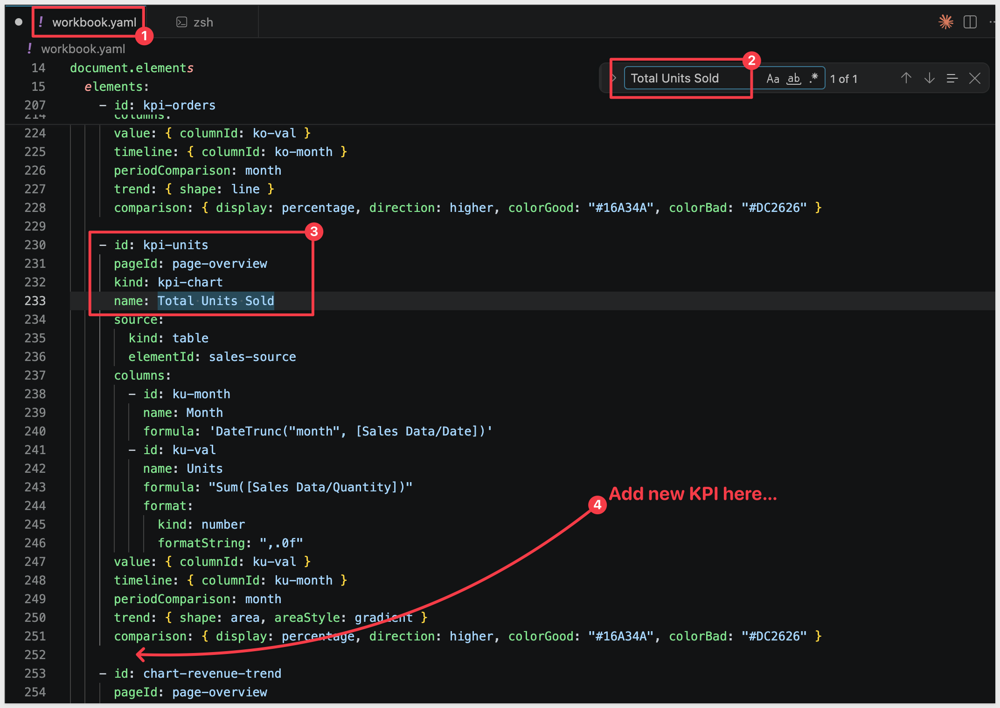

```copy-code
- id: kpi-margin
  pageId: page-overview
  kind: kpi-chart
  name: Gross Margin
  source:
    kind: table
    elementId: sales-source
  columns:
    - id: km-month
      name: Month
      formula: 'DateTrunc("month", [Sales Data/Date])'
    - id: km-val
      name: Margin
      formula: "Sum([Sales Data/Profit]) / Sum([Sales Data/Revenue])"
      format:
        kind: number
        formatString: "0.0%"
  value: { columnId: km-val }
  timeline: { columnId: km-month }
  periodComparison: month
  trend: { shape: line }
  comparison: { display: percentage, direction: higher, colorGood: "#16A34A", colorBad: "#DC2626" }
```

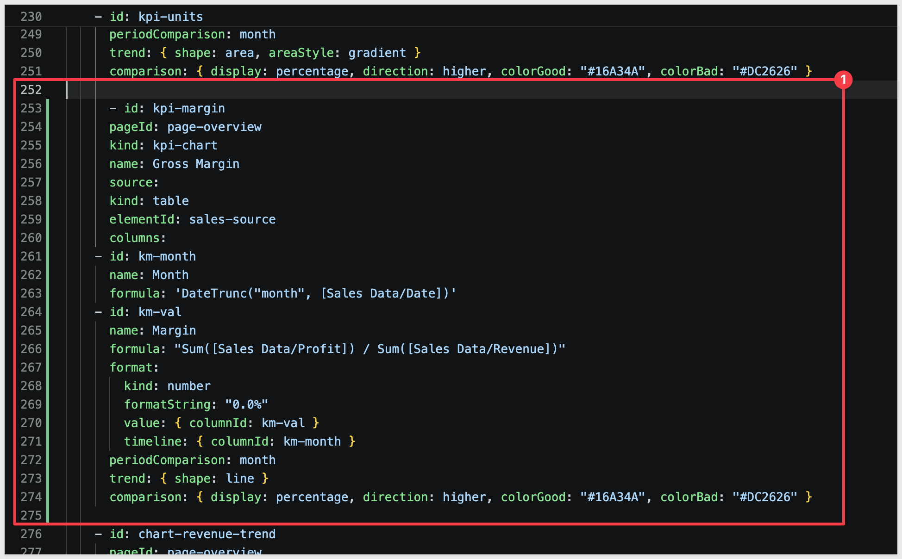

Then add its placement to the `layout` block - a new element always needs one, per the rule from the last section.

```copy-code
<Element elementId="kpi-margin" gridColumn="1 / 7" gridRow="56 / 61"/>
```

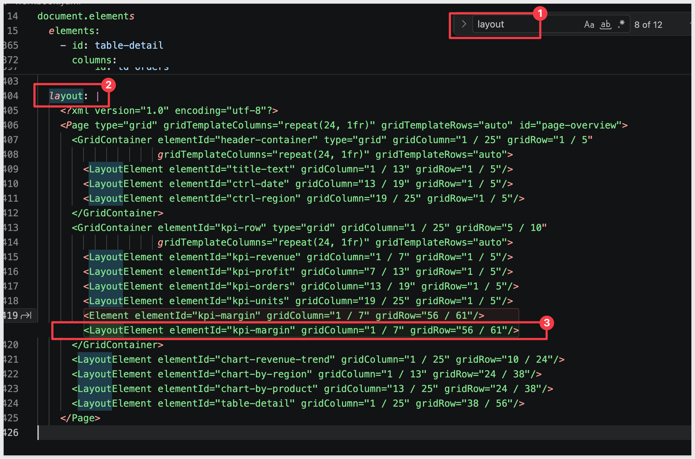

<aside class="positive">
<strong>NOTE:</strong><br> This places the new KPI in its own row below the Sales Detail table, so it doesn't disturb the coordinates of anything already on the page - the smallest possible diff for a first change.
</aside>

Save the changes.

### Commit and Push the Branch

```copy-code
git add workbook.yaml
git commit -m "Add gross margin KPI"
git push -u origin add-margin-kpi
```

### Open a Pull Request

```copy-code
gh pr create --title "Add gross margin KPI" --body "Adds a Gross Margin % KPI card to the Sales Overview page."
```

<!--  -->

No `gh` CLI? Open the fork on GitHub - it'll show a banner offering to open a PR from your newly pushed branch.

### Watch CI Validate Automatically

Opening the PR triggers the **Validate Workbook Spec** workflow. Open the `Actions` tab, or check the PR page itself - GitHub shows the check running inline.

<!--  -->

Once it finishes, the PR shows a green check: the spec compiles, every formula and element reference resolves, and the layout is valid.

<!--  -->

<aside class="negative">
<strong>IF VALIDATION FAILS:</strong><br> The check turns red instead, and the workflow log shows the same kind of JSON error you'd get calling the API directly - invalid formula, bad element reference, missing layout placement. Fix the issue on the same branch and push again; validation reruns automatically on the updated commit. This is the whole point of running validation on every PR: a broken spec gets caught here, before it ever reaches the live workbook.
</aside>

Don't merge yet - the next section covers what happens when this PR merges to `main`.


<!-- END OF SECTION-->

## What we've covered
Duration: 5

In this QuickStart, we ...

- ...
- ...

**Additional Resource Links**

[Blog](https://www.sigmacomputing.com/blog/)<br>
[Community](https://community.sigmacomputing.com/)<br>
[Help Center](https://help.sigmacomputing.com/hc/en-us)<br>
[QuickStarts](https://quickstarts.sigmacomputing.com/)<br>

Be sure to check out all the latest developments at [Sigma's First Friday Feature page!](https://quickstarts.sigmacomputing.com/firstfridayfeatures/)
<br>

[](https://twitter.com/sigmacomputing)&emsp;
[](https://www.linkedin.com/company/sigmacomputing)&emsp;
[](https://www.facebook.com/sigmacomputing)


<!-- END OF WHAT WE COVERED -->
<!-- END OF QUICKSTART -->
