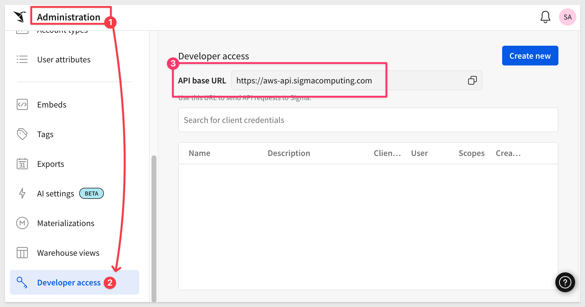
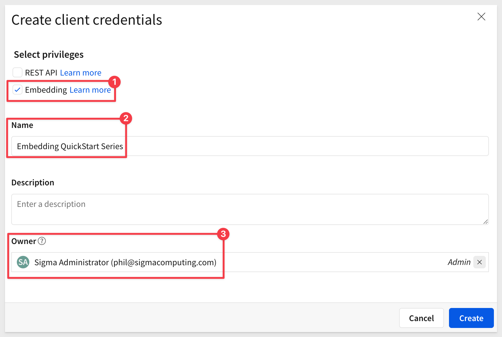
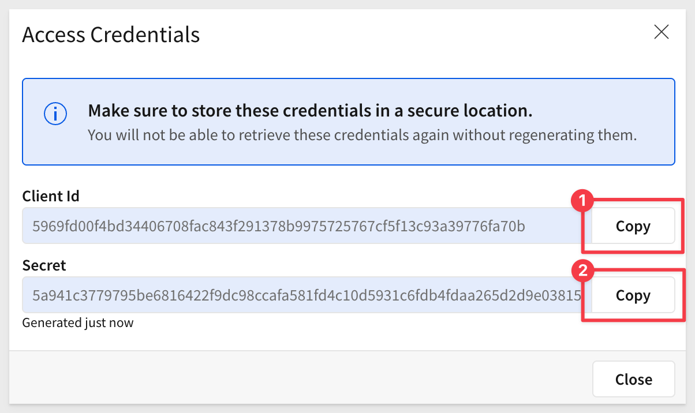
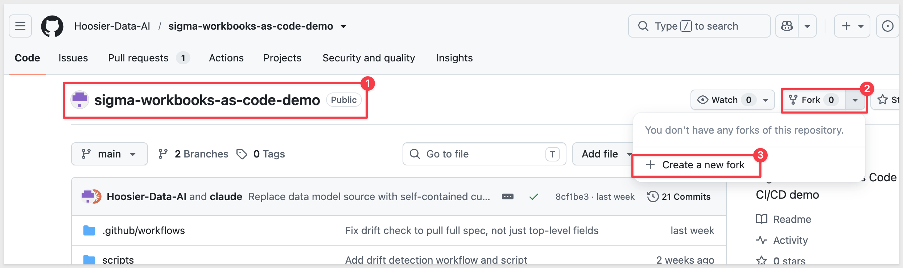
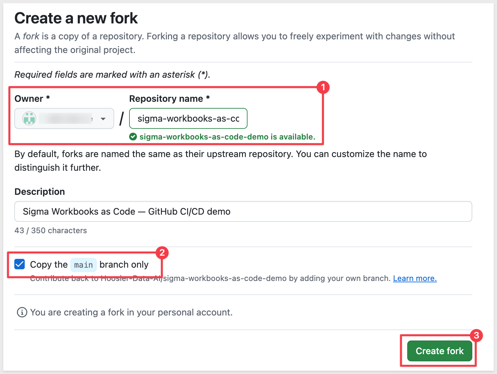
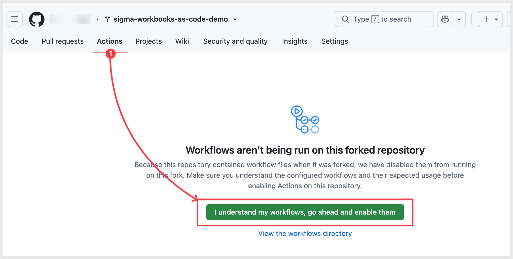
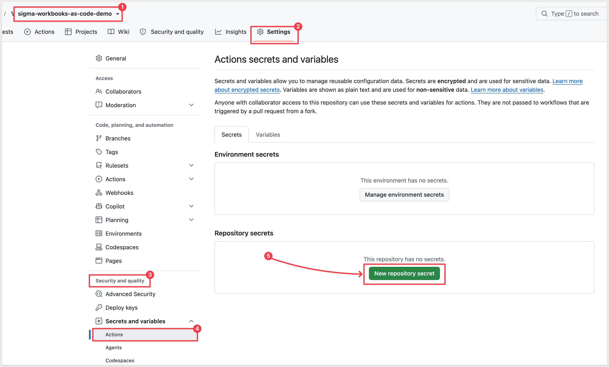

author: pballai
id: developers_workbooks_as_code
summary: developers_workbooks_as_code
categories: developers
environments: web
status: Hidden
feedback link: https://github.com/sigmacomputing/sigmaquickstarts/issues
tags:
lastUpdated: 2026-12-31

# Manage Sigma Workbooks with Git and CI/CD

## Overview
Duration: 5

If your team already reviews every code change through pull requests, runs CI on every commit, and deploys through automated pipelines, a Sigma workbook shouldn't be the one piece of the stack that still changes by clicking around in a UI. 

Workbooks as Code lets you define an entire workbook — pages, charts, KPIs, filters, layout — as a single YAML file, so it moves through the same git-based process as the rest of your application code: version control, peer review, automated validation, and CI/CD deployment.

In this QuickStart, you'll wire up exactly that pipeline. Along the way you'll learn how to:
- Read and edit a workbook spec in YAML
- Authenticate to Sigma's REST API using client credentials
- Fork and configure a working GitHub Actions pipeline for a Sigma workbook
- Open a pull request and watch CI validate the spec automatically
- Merge a change and watch it deploy to the live workbook
- Detect and resolve drift when someone edits the workbook directly in the Sigma UI

This QuickStart focuses on the workbook itself — layout, charts, KPIs, controls. 

If you'd rather manage the underlying data model as code, see the companion [Data Models as Code](https://quickstarts.sigmacomputing.com/guide/developers_data_models_as_code/index.html?index=..%2F..index#0) QuickStart, which covers the same version control, code review, and CI/CD pattern applied to data models via JSON specs.

<aside class="positive">
<strong>IMPORTANT:</strong><br> Some screens in Sigma may appear slightly different from those shown in QuickStarts. This is because Sigma continuously adds and enhances functionality. Rest assured, Sigma's intuitive interface ensures that any differences will not prevent you from successfully completing any QuickStart.
</aside>

For more information on Sigma's product release strategy, see [Sigma product releases](https://help.sigmacomputing.com/docs/sigma-product-releases)

If something doesn't work as expected, here's how to [contact Sigma support](https://help.sigmacomputing.com/docs/sigma-support)

### Target Audience
This QuickStart is designed for developers, data engineers, and technical admins who want to manage Sigma workbooks programmatically and treat them like any other piece of version-controlled application code.

### Prerequisites

<ul>
  <li>A Sigma account with API access enabled</li>
  <li>API credentials (Client ID and Secret) - see <a href="https://help.sigmacomputing.com/docs/generate-api-client-credentials">Generate API client credentials</a></li>
  <li>A GitHub account and familiarity with git, branches, and pull requests</li>
  <li>Permission to create, edit, and publish workbooks</li>
  <li>Basic understanding of YAML</li>
 </ul>

<aside class="positive">
<strong>IMPORTANT:</strong><br> Sigma recommends using non-production resources when completing QuickStarts.
</aside>

<button>[Sigma Free Trial](https://www.sigmacomputing.com/free-trial/)</button>


## Client Credentials
Duration: 5

Client credentials (a unique client ID and client secret) are required to authenticate to Sigma's REST API.

Sigma uses the client ID to identify your application and the client secret to verify your identity. Together, these credentials enable secure, programmatic access to Sigma's API endpoints using OAuth 2.0 authentication.

Navigate to `Administration` and select `Developer access`.

<aside class="positive">
<strong>API Base URL:</strong><br> Take note of the API Base URL shown in the Developer access section. This region-specific endpoint is required for all API calls, and you'll need it again when configuring GitHub in the next section. Failure to use the correct API endpoint will prevent your commands from working.
</aside>

Click `Create New`:



In the `Create client credentials` modal, select `REST API`, give it a name, and assign an administrative user as the owner.



<aside class="positive">
<strong>NOTE:</strong><br> You can also enable the "Embedding" checkbox if you plan to use these same credentials for embedding. For this QuickStart, only REST API access is required.
</aside>

Click `Create`.

<aside class="negative">
<strong>IMPORTANT:</strong><br> For security purposes, Sigma provides a one-time view of the client secret at the time of creation and does not display it again. Because the secret is non-retrievable, store it securely when you create it.

If you lose the client secret or it becomes compromised, you can revoke it and generate a new one. However, this invalidates the previous secret and all API calls using it will fail until updated with the new credentials.
</aside>



Copy and paste the `Client ID` and `Secret` - you'll add them as GitHub secrets in the next section.


<!-- END OF SECTION-->

## Fork the Demo Repository
Duration: 5

### Fork the Project

We've built a complete, working example - spec, scripts, and GitHub Actions workflows - in a public GitHub repository so you don't have to wire up the automation from scratch.

This QuickStart's automation runs as GitHub Actions inside your own repository, so you'll fork the project rather than just downloading the files - GitHub Actions only run from a repository you own or have push access to.

Open the repository in your browser:

[Hoosier-Data-AI/sigma-workbooks-as-code-demo](https://github.com/Hoosier-Data-AI/sigma-workbooks-as-code-demo)

Click `Fork` in the top-right corner.

<!--  -->

Confirm the owner (your account or org) and click `Create fork`.

<!--  -->

Clone your fork locally so you can edit files and push changes:

```copy-code
git clone https://github.com/YOUR_GITHUB_USERNAME/sigma-workbooks-as-code-demo.git
cd sigma-workbooks-as-code-demo
```

You should now see the project structure:

```copy-code
sigma-workbooks-as-code-demo/
├── README.md
├── sigma.config.yaml
├── workbook.yaml
├── scripts/
│   ├── validate.sh
│   ├── deploy.sh
│   └── drift-check.sh
└── .github/
    └── workflows/
        ├── validate.yml
        ├── deploy.yml
        └── drift-check.yml
```

The folder contains:
- **workbook.yaml**: The workbook spec - single source of truth for the entire workbook, covered in the next section
- **sigma.config.yaml**: Config pointing at your target workbook ID and API host
- **scripts/**: The same validate, deploy, and drift-check logic the GitHub Actions workflows call
- **.github/workflows/**: The three automations this QuickStart walks through

<aside class="positive">
<strong>TIP:</strong><br> You can also browse the files directly on GitHub at <a href="https://github.com/Hoosier-Data-AI/sigma-workbooks-as-code-demo">Hoosier-Data-AI/sigma-workbooks-as-code-demo</a>
</aside>


<!-- END OF SECTION-->

## Configure GitHub Secrets and Variables
Duration: 5

Instead of a local `.env` file, this QuickStart's automation runs inside GitHub Actions - so your credentials need to live in your fork's repository settings, where the validate, deploy, and drift-check workflows can read them.

### Add Repository Secrets

In your forked repository on GitHub, go to `Settings` > `Secrets and variables` > `Actions`.

Under the `Secrets` tab, click `New repository secret` and add each of the following:

| Name | Value |
|------|-------|
| `SIGMA_CLIENT_ID` | The Client ID from the previous section |
| `SIGMA_CLIENT_SECRET` | The Client Secret from the previous section |

<!--  -->

<aside class="negative">
<strong>IMPORTANT:</strong><br> Secrets are encrypted and only exposed to workflow runs - GitHub never displays their value again once saved. If a credential changes later, you can overwrite the secret, but you can't view the existing one first.
</aside>

### Add a Repository Variable

Switch to the `Variables` tab and click `New repository variable`:

| Name | Value |
|------|-------|
| `SIGMA_API_HOST` | Your Sigma region's API host (see below) |

<aside class="positive">
<strong>NOTE:</strong><br> Variables, unlike secrets, are visible in plain text - that's fine here since an API host isn't sensitive on its own.
</aside>

**Finding your API host:** This depends on your Sigma cloud region.

| Cloud | API Host |
|-------|----------|
| AWS US | `https://aws-api.sigmacomputing.com` |
| AWS Canada | `https://api.ca.sigmacomputing.com` |
| GCP | `https://api.sigmacomputing.com` |

This matches the API Base URL you noted in the `Developer access` section earlier.

<!--  -->

With `SIGMA_CLIENT_ID`, `SIGMA_CLIENT_SECRET`, and `SIGMA_API_HOST` in place, every workflow in this repo can authenticate to your Sigma account automatically - no local `.env` file, no copying tokens between commands.


<!-- END OF SECTION-->

## What we've covered
Duration: 5

In this QuickStart, we ...

- ...
- ...

**Additional Resource Links**

[Blog](https://www.sigmacomputing.com/blog/)<br>
[Community](https://community.sigmacomputing.com/)<br>
[Help Center](https://help.sigmacomputing.com/hc/en-us)<br>
[QuickStarts](https://quickstarts.sigmacomputing.com/)<br>

Be sure to check out all the latest developments at [Sigma's First Friday Feature page!](https://quickstarts.sigmacomputing.com/firstfridayfeatures/)
<br>

[](https://twitter.com/sigmacomputing)&emsp;
[](https://www.linkedin.com/company/sigmacomputing)&emsp;
[](https://www.facebook.com/sigmacomputing)


<!-- END OF WHAT WE COVERED -->
<!-- END OF QUICKSTART -->
