author: pballai
id: developers_workbooks_as_code
summary: developers_workbooks_as_code
categories: developers
environments: web
status: Published
feedback link: https://github.com/sigmacomputing/sigmaquickstarts/issues
tags: default
lastUpdated: 2026-09-17

# Manage Sigma Workbooks as Code with Git and CI/CD

## Overview
Duration: 5

If your team already reviews every code change through pull requests, runs CI on every commit, and deploys through automated pipelines, a Sigma workbook shouldn't be the one piece of the stack that still changes by clicking around in a UI. 

Workbooks as Code lets you define an entire workbook — pages, charts, KPIs, filters, layout — as a single YAML file, so it moves through the same git-based process as the rest of your application code: version control, peer review, automated validation, and CI/CD deployment.

In this QuickStart, you'll wire up exactly that pipeline. Along the way you'll learn how to:
- Read and edit a workbook spec in YAML
- Authenticate to Sigma's REST API using client credentials
- Set up and configure a working GitHub Actions pipeline for a Sigma workbook
- View and copy any workbook's code directly from the Sigma UI
- Open a pull request and watch CI validate the spec automatically
- Merge a change and watch it deploy to the live workbook
- Detect and resolve drift when someone edits the workbook directly in the Sigma UI

This QuickStart focuses on the workbook itself — layout, charts, KPIs, controls. 

If you'd rather manage the underlying data model as code, see the companion [Data Models as Code](https://quickstarts.sigmacomputing.com/guide/developers_data_models_as_code/index.html?index=..%2F..index#0) QuickStart, which covers the same version control, code review, and CI/CD pattern applied to data models via JSON specs.

<aside class="positive">
<strong>IMPORTANT:</strong><br> Some screens in Sigma may appear slightly different from those shown in QuickStarts. This is because Sigma continuously adds and enhances functionality. Rest assured, Sigma's intuitive interface ensures that any differences will not prevent you from successfully completing any QuickStart.
</aside>

For more information on Sigma's product release strategy, see [Sigma product releases](https://help.sigmacomputing.com/docs/sigma-product-releases)

If something doesn't work as expected, here's how to [contact Sigma support](https://help.sigmacomputing.com/docs/sigma-support)

### Target Audience
This QuickStart is designed for developers, data engineers, and technical admins who want to manage Sigma workbooks programmatically and treat them like any other piece of version-controlled application code.

### Prerequisites

<ul>
  <li>A Sigma account with API access enabled</li>
  <li>API credentials (Client ID and Secret) - see <a href="https://help.sigmacomputing.com/docs/generate-api-client-credentials">Generate API client credentials</a></li>
  <li>A GitHub account and familiarity with git, branches, and pull requests</li>
  <li>Permission to create, edit, and publish workbooks</li>
  <li>Basic understanding of YAML</li>
</ul>

<aside class="positive">
<strong>IMPORTANT:</strong><br> Sigma recommends using non-production resources when completing QuickStarts.
</aside>

<button>[Sigma Free Trial](https://www.sigmacomputing.com/free-trial/)</button>


<!-- END OF SECTION-->

## Client Credentials
Duration: 5

Client credentials (a unique client ID and client secret) are required to authenticate to Sigma's REST API.

Sigma uses the client ID to identify your application and the client secret to verify your identity. Together, these credentials enable secure, programmatic access to Sigma's API endpoints using OAuth 2.0 authentication.

Navigate to `Administration` and select `Developer access`.

<aside class="positive">
<strong>API Base URL:</strong><br> Take note of the API Base URL shown in the Developer access section. This region-specific endpoint is required for all API calls, and you'll need it again when configuring GitHub in "Configure GitHub Secrets and Variables," later in this QuickStart. Failure to use the correct API endpoint will prevent your commands from working.
</aside>

Click `Create New`:


In the `Create client credentials` modal, select `REST API`, give it a name, and assign an administrative user as the owner.


<aside class="positive">
<strong>NOTE:</strong><br> You can also enable the "Embedding" checkbox if you plan to use these same credentials for embedding. For this QuickStart, only REST API access is required.
</aside>

Click `Create`.

<aside class="negative">
<strong>IMPORTANT:</strong><br> For security purposes, Sigma provides a one-time view of the client secret at the time of creation and does not display it again. Because the secret is non-retrievable, store it securely when you create it.

If you lose the client secret or it becomes compromised, you can revoke it and generate a new one. However, this invalidates the previous secret and all API calls using it will fail until updated with the new credentials.
</aside>


Copy and paste the `Client ID` and `Secret` - you'll add them as GitHub secrets in "Configure GitHub Secrets and Variables," later in this QuickStart.


<!-- END OF SECTION-->

## Get the Demo Project
Duration: 5

Every reader starts from the same working example - spec, scripts, and GitHub Actions workflows already wired together - so the rest of this QuickStart is about the git/CI workflow itself, not building a workbook spec from a blank file.

### Copy the Project Into Your Own Repository

We've built a complete, working example - spec, scripts, and GitHub Actions workflows - and maintain it inside Sigma's [quickstarts-public](https://github.com/sigmacomputing/quickstarts-public) repository, under `sigma-workbooks-as-code-demo-main/`.

This QuickStart's automation runs as GitHub Actions inside your own repository, and GitHub only runs workflows defined at a repository's root. Since `quickstarts-public` is a large monorepo covering every Sigma QuickStart, you won't fork it directly - instead, you'll pull out just this one folder and push it into a new, empty repository of your own, so its `.github/workflows` folder lands at that repository's root.

Open a `Terminal` session and create a new directory to work in:

```copy-code
mkdir sigma_quickstarts
cd sigma_quickstarts
```

Clone just the project folder using sparse-checkout, the same technique used in the companion [Data Models as Code](https://quickstarts.sigmacomputing.com/guide/developers_data_models_as_code/index.html?index=..%2F..index#0) QuickStart:

```copy-code
git init
git remote add -f origin https://github.com/sigmacomputing/quickstarts-public.git
git config core.sparseCheckout true
echo "sigma-workbooks-as-code-demo-main" >> .git/info/sparse-checkout
git pull origin main
cd sigma-workbooks-as-code-demo-main
```

You now have the project files locally, but they're not in a repository of your own yet - just a sparse checkout of `quickstarts-public`. The next few steps create an empty destination repository on GitHub, then push this folder into it.

Create a new, empty repository under your own GitHub account at [github.com/new](https://github.com/new):

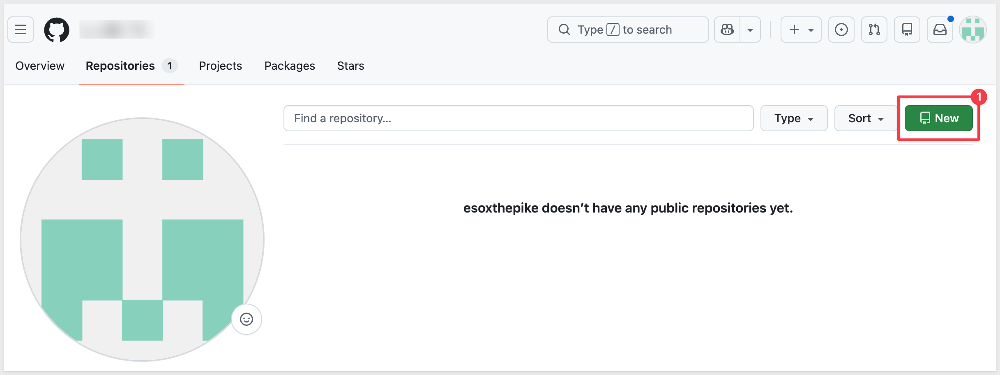

Name it:
```copy-code
sigma-workbooks-as-code-demo
```

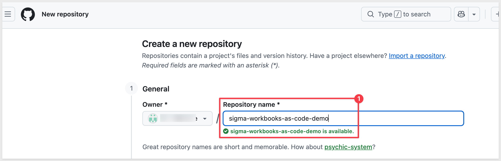

Click `Create repository`.

<aside class="negative">
<strong>IMPORTANT:</strong><br> Whatever GitHub credential you push with next - a fine-grained personal access token, <code>gh auth login</code>, or your normal git credentials - needs explicit permission on this new repository, or the push later in this section will fail. 
<br><br>
If you're using a fine-grained personal access token, confirm it covers this repo under <strong>Repository access</strong>, with both <strong>Contents: Read and write</strong> and <strong>Workflows: Read and write</strong> - this repo ships with GitHub Actions workflows already in it, which need that second permission beyond Contents alone. 
<br><br>
Classic tokens need the <code>repo</code> and <code>workflow</code> scopes instead. If your fine-grained token is scoped to <strong>Selected repositories</strong> rather than <strong>All repositories</strong>, a repo created after the token won't automatically be covered - check it now rather than after a failed push.
</aside>

With that done, return to terminal and confirm you're inside the extracted project folder, not the sparse-checkout parent directory - this matters because the parent directory has its own `.git` pointing at `quickstarts-public`, and running the next block from there fails silently partway through instead of erroring immediately:

```copy-code
pwd
```

The output should end in `sigma_quickstarts/sigma-workbooks-as-code-demo-main`. If it just ends in `sigma_quickstarts`, run `cd sigma-workbooks-as-code-demo-main` first.

Now turn this folder into its own repository and push it to the one you just created **(be sure to replace YOUR_GITHUB_USERNAME):**

```copy-code
git init
git add .
git commit -m "Initial commit: Workbooks as Code demo"
git branch -M main
git remote add origin https://github.com/YOUR_GITHUB_USERNAME/sigma-workbooks-as-code-demo.git
git push -u origin main
```

<aside class="positive">
<strong>NOTE:</strong><br> This push touches <code>workbook.yaml</code>, which triggers the <strong>Deploy Workbook</strong> workflow automatically - you don't need to run anything else to see it fire. 
<br><br>
Since there are a few placeholder values at this point, that run <strong>will fail</strong>.
<br><br>
Expect a red X in the <code>Actions</code> tab. Since you haven't added your GitHub repository secrets yet either - that's the next section - the run typically fails at the authentication step itself, before it ever gets to check the workbook ID: look for <code>Can't add secret mask for empty string</code> in the annotations, or a bare <code>Process completed with exit code 3</code>. This is expected, not a problem to fix right now - once you've completed "Configure GitHub Secrets and Variables" and then "Configure and Deploy for the First Time" (which points both files at your own connection and workbook), a fresh push deploys successfully.
</aside>

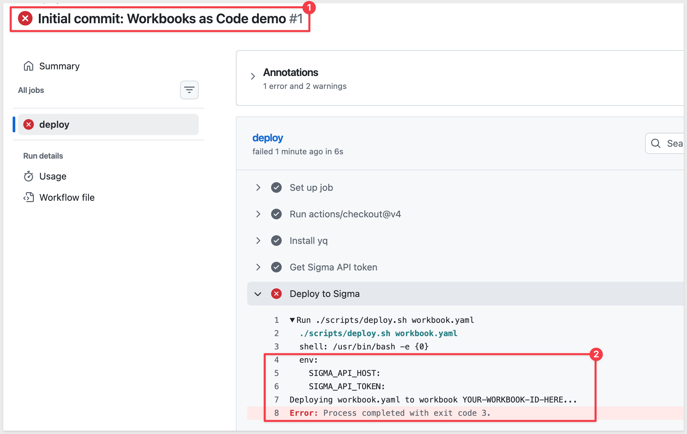

Confirm `origin` points at your own new repository:

```copy-code
git remote -v
```


<aside class="negative">
<strong>TROUBLESHOOTING "REMOTE ORIGIN ALREADY EXISTS" OR A PUSH THAT TARGETS THE WRONG REPO:</strong><br> Telltale symptoms: <code>git init</code> reports "Reinitialized existing Git repository" instead of a fresh init, <code>git commit</code> reports "nothing to commit, working tree clean," <code>git remote add origin</code> fails with "remote origin already exists," and the push targets somewhere other than the repo you just created. This has two distinct causes with the same symptoms - check <code>git remote -v</code> to tell them apart:
<br><br>
<strong>1. Wrong directory</strong> - the block above ran from the sparse-checkout parent directory instead of <code>sigma-workbooks-as-code-demo-main</code>, which already has its own <code>.git</code> pointing at <code>quickstarts-public</code>. <code>git remote -v</code> shows <code>sigmacomputing/quickstarts-public</code>. No harm done - you don't have write access there, so the push is just rejected. Fix: <code>cd sigma-workbooks-as-code-demo-main</code>, confirm with <code>pwd</code>, then re-run the block above.
<br><br>
<strong>2. Reused local folder from an earlier attempt</strong> - if you deleted your GitHub repo and are redoing this section, the local folder still has <code>.git</code> history and an <code>origin</code> pointing at whatever URL was set last time (a placeholder that was never replaced, or a repo that no longer exists). <code>git remote -v</code> shows that stale URL. Fix: <code>git remote set-url origin https://github.com/YOUR_GITHUB_USERNAME/sigma-workbooks-as-code-demo.git</code>, then push - no need to delete and re-clone the folder.
</aside>

<aside class="negative">
<strong>TROUBLESHOOTING A 403 OR REJECTED PUSH:</strong><br> The fetch and push URLs above should both show <code>YOUR_GITHUB_USERNAME/sigma-workbooks-as-code-demo</code>. If the push fails and the remote URL is correct, work through these in order:
<ol>
<li><strong>Wrong remote</strong> - <code>origin</code> points somewhere you don't have push access. Fix: <code>git remote set-url origin https://github.com/YOUR_GITHUB_USERNAME/sigma-workbooks-as-code-demo.git</code>.</li>
<li><strong>Wrong cached account</strong> - if the error names an account that isn't yours, git is using stale credentials for a different GitHub account (common with personal + work accounts on one machine). Run <code>gh auth login</code> to switch (a Personal Access Token is more reliable here than the browser device-code flow, which can be affected by GitHub service incidents), then <code>gh auth setup-git</code> - this second command is easy to skip and is what actually makes plain <code>git</code> commands use the new credential.</li>
<li><strong>Right account, still denied (403 Permission denied)</strong> - if the error now names the correct account, a fine-grained personal access token likely lacks write access. Check <code>Settings</code> > <code>Developer settings</code> > <code>Personal access tokens</code>: the token needs this repo listed under <strong>Repository access</strong> and <strong>Contents</strong> set to <strong>Read and write</strong>. Note that a fine-grained token only covers repos selected when it was created - a repo you create afterward, like this one, won't be covered until you add it.</li>
<li><strong>Push rejected for touching a workflow file</strong> - if the error instead reads <code>refusing to allow a Personal Access Token to create or update workflow ".github/workflows/...yml" without "workflow" scope</code>, the <strong>Contents: Read and write</strong> permission isn't enough on its own. This repo ships with GitHub Actions workflows already in it, so the very first push needs the extra permission too: for a fine-grained token, set <strong>Workflows</strong> to <strong>Read and write</strong> alongside <strong>Contents</strong>; for a classic token, check the <code>workflow</code> scope.</li>
</ol>
</aside>

If you have VS Code installed, in terminal, run:
```copy-code
code .
```

If you are not using VS Code, open the folder in your editor of choice - you should see the project structure.

The folder contains:
- **workbook.yaml**: The workbook spec - single source of truth for the entire workbook, covered in detail in "Understanding the Workbook Spec," later in this QuickStart
- **sigma.config.yaml**: Config pointing at your target workbook ID and API host
- **scripts/**: The same validate, deploy, and drift-check logic the GitHub Actions workflows call
- **.github/workflows/**: The three automations this QuickStart walks through


<aside class="positive">
<strong>TIP:</strong><br> You can also browse the files directly on GitHub at <a href="https://github.com/sigmacomputing/quickstarts-public/tree/main/sigma-workbooks-as-code-demo-main">quickstarts-public/sigma-workbooks-as-code-demo-main</a>
</aside>

### Confirm GitHub Actions Is Enabled

Since you pushed to a brand-new repository you own (rather than forking one), GitHub Actions should already be enabled - the disabled-by-default behavior only applies to forks, as a security precaution against running an upstream owner's workflows automatically.

Open the `Actions` tab in your new repository and confirm you see the workflows listed (`Validate Workbook Spec`, `Deploy Workbook`, `Drift Check`) rather than a banner asking you to enable them.


<aside class="positive">
<strong>NOTE:</strong><br> If you do see a banner prompting you to enable workflows, click `I understand my workflows, go ahead and enable them` - you only need to do this once.
</aside>


<!-- END OF SECTION-->

## Configure GitHub Secrets and Variables
Duration: 5

Instead of a local `.env` file, this QuickStart's automation runs inside GitHub Actions - so your credentials need to live in your repository's settings, where the validate, deploy, and drift-check workflows can read them.

### Add Repository Secrets

**In your repository** on GitHub, go to `Settings` > `Secrets and variables` > `Actions`.

Under the `Secrets` tab, click `New repository secret`:


Add each of the following:

| Name | Value |
|------|-------|
| `SIGMA_CLIENT_ID` | The Client ID from "Client Credentials," earlier |
| `SIGMA_CLIENT_SECRET` | The Client Secret from "Client Credentials," earlier |


<aside class="negative">
<strong>IMPORTANT:</strong><br> Secrets are encrypted and only exposed to workflow runs - GitHub never displays their value again once saved. If a credential changes later, you can overwrite the secret, but you can't view the existing one first.
</aside>

### Add a Repository Variable

Switch to the `Variables` tab and click `New repository variable`:

| Name | Value |
|------|-------|
| `SIGMA_API_HOST` | Your Sigma region's API host (see below) |

<aside class="positive">
<strong>NOTE:</strong><br> Variables, unlike secrets, are visible in plain text - that's fine here since an API host isn't sensitive on its own.
</aside>

**Finding your API host:** Use the exact API Base URL shown on the `Developer access` page you noted earlier - don't guess this from your Sigma cloud region. Sigma's actual per-tenant hosts often include an extra region/shard segment beyond what you might expect - for example, `https://api.us-a.aws.sigmacomputing.com` rather than a flatter `https://aws-api.sigmacomputing.com`.

<aside class="negative">
<strong>IMPORTANT:</strong><br> Getting this value wrong doesn't fail immediately - your client credentials are still valid, so nothing looks broken yet. Every workflow instead fails later with a confusing <code>401 Token missing or malformed</code>, since the auth call itself is hitting the wrong host. If you see that error down the line, this is the first thing to double-check.
</aside>


With `SIGMA_CLIENT_ID`, `SIGMA_CLIENT_SECRET`, and `SIGMA_API_HOST` in place, every workflow in this repo can authenticate to your Sigma account automatically - no local `.env` file, no copying tokens between commands.


<!-- END OF SECTION-->

## Configure and Deploy for the First Time
Duration: 10

With credentials and secrets in place, the last thing to do before this pipeline is live is point it at your own Sigma connection, a folder, and a target workbook.

### Find Your Connection ID

The demo spec's source element runs custom SQL against a connection you choose. Go to `Administration` > `Connections`, click your connection, and copy the UUID from the URL.


<aside class="positive">
<strong>TIP:</strong><br> You can also retrieve this via the API: <code>GET /v2/connections</code>.
</aside>

### Find or Create a Target Folder

The `workbook.yaml` file requires a `folderId` that needs to point at a real folder in your own org - the demo ships with a placeholder ("YOUR-FOLDER-ID-HERE") folder ID, which doesn't exist in your Sigma account. 

<aside class="negative">
<strong>NOTE:</strong><br> `PUT /v2/workbooks/{id}/contents` (deploy) never even sees this field - it only updates the workbook's contents, not its folder - so it's easy to miss, but the validate step used on every pull request does look it up - an unchanged `folderId` deploys fine here, then fails validation later with a confusing `404 No matching record`.
</aside>

Use an existing folder, or create a new one to keep this QuickStart's output together. Open it in Sigma and copy its ID from the URL.

For example:

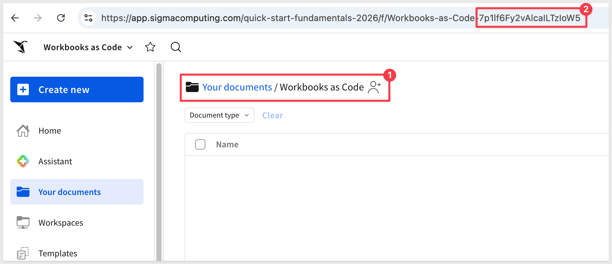

<aside class="positive">
<strong>TIP:</strong><br> You can also retrieve this via the API: <code>GET /v2/files</code>.
</aside>

### Create a Target Workbook

The deploy workflow updates an *existing* workbook by ID - it doesn't create one. Create a blank workbook to serve as that target, then click `Save as` - **make sure to save it inside the folder you created in the previous step.**

Give it a name:
```copy-code
WBC QuickStart
```

Open the new workbook and copy its ID from the URL.


`Save` the changes.

### Update the Config Files

In the local clone of the repo, open `sigma.config.yaml` and set `workbook_id` to the ID you just copied:

```copy-code
workbook_id: "YOUR-WORKBOOK-ID-HERE"
api_host: "https://aws-api.sigmacomputing.com"
spec_file: "workbook.yaml"
```

<aside class="negative">
<strong>NOTE:</strong><br> This <code>api_host</code> field is for local reference only - the validate, deploy, and drift-check workflows don't actually read it. They authenticate using the <code>SIGMA_API_HOST</code> GitHub repository variable you set in the previous section instead. Keep this field in sync with that value so the file stays accurate, but if you ever hit a <code>401 Token missing or malformed</code>, the GitHub variable is what to check, not this file.
</aside>

<aside class="negative">
<strong>IMPORTANT:</strong><br> The <strong>Deploy Workbook</strong> workflow only triggers on a push that touches <code>workbook.yaml</code> - a commit that only changes <code>sigma.config.yaml</code> (for example, correcting a typo'd <code>workbook_id</code> after the fact) pushes to <code>main</code> successfully but never shows up in <code>Actions</code>, since the path filter doesn't match. If that happens, either run <code>gh workflow run deploy.yml</code> to trigger it manually, or make a trivial edit to <code>workbook.yaml</code> (like adding a blank line) so the next push includes it.
</aside>


Then open `workbook.yaml` and search for and replace the top-level `folderId` with the folder ID from earlier in this section, and the `connectionId` on the `sales-source` element with your own connection UUID:

```copy-code
folderId: "YOUR-FOLDER-ID-HERE"
```

```copy-code
source:
  kind: sql
  connectionId: "YOUR-CONNECTION-ID-HERE"
```

### Deploy for the First Time

This first push is just wiring up configuration, not a reviewable content change, so commit it straight to `main`:

```copy-code
git add sigma.config.yaml workbook.yaml
git commit -m "Configure connection and target workbook"
git push origin main
```

Since this push modifies `workbook.yaml` on `main`, it triggers the **Deploy Workbook** workflow automatically. Open the `Actions` tab in your repository and watch it run:


<aside class="positive">
<strong>TIP:</strong><br> This run typically finishes in well under a minute. If the page seems stuck showing it "in progress" longer than that, refresh - the browser doesn't always pick up the completion status live.
</aside>

Once it finishes, close and reopen your target workbook in Sigma - you should see the full **Plugs Electronics — Sales Overview** dashboard: KPI cards, region and product breakdowns, and the detail table, all generated from a single YAML file.

We left a space for another KPI that will be added in "Make a Change: Validate, Merge, and Deploy," later in this QuickStart:


<aside class="positive">
<strong>NOTE:</strong><br> From here on, treat <code>main</code> as protected. Every real change to the workbook - the kind of thing worth a second set of eyes - goes through a feature branch and a pull request instead, which is exactly what "Make a Change: Validate, Merge, and Deploy" covers.
</aside>


<!-- END OF SECTION-->

## Understanding the Workbook Spec
Duration: 10

You just deployed **Plugs Electronics — Sales Overview** from a single file: `workbook.yaml`. Everything about a workbook - pages, charts, KPIs, filters, layout - lives in that one place. Let's look at how it's put together before you start editing it yourself.

The demo workbook this spec builds is a sales dashboard driven entirely by inline SQL sample data - no external data model required.

### Basic Structure

At the top level, a workbook spec has a name, an optional folder, and a `contents` block containing everything else:

```code
name: "Plugs Electronics — Sales Overview"
folderId: "YOUR-FOLDER-ID-HERE"
description: "Sales performance dashboard managed via GitHub."
contents:
  kind: workbook
  schemaVersion: 1
  pages: [...]
  elements: [...]
  layout: |
    ...
```

- `name` / `description`: Display name and description shown in Sigma
- `folderId`: Where the workbook lives - find this the same way you'd find any folder ID, via the URL or `GET /v2/files`
- `contents.pages`: An array of pages - just page metadata (id, name, visibility), not their contents
- `contents.elements`: A single flat array holding every element in the workbook - which page each one belongs to is determined entirely by the `layout` block, covered below, not by anything on the element itself
- `contents.layout`: An XML block placing every element - on every page, including hidden ones - onto a grid

<aside class="negative">
<strong>IMPORTANT:</strong><br> Elements don't nest directly under each page (<code>contents.pages[].elements</code>) - the API rejects that shape. They live in one flat <code>contents.elements</code> array instead, and <code>contents.layout</code> (covered below) is what actually assigns each one to a page. If something you read elsewhere shows the old nested form, or wraps everything in a <code>document</code> key instead of <code>contents</code>, trust what's in your cloned <code>workbook.yaml</code> and what the API actually accepts.
</aside>

### Pages and Hidden Data Pages

The demo spec has two pages - just metadata, no elements nested inside:

```code
pages:
  - id: page-data
    name: Data
    visibility: hidden      # holds the source table - readers never see this page

  - id: page-overview
    name: Sales Overview     # the actual dashboard
```

Setting `visibility: hidden` on the `Data` page keeps the raw source table out of the way - end users only ever see the `Sales Overview` page. This is the same hidden-page pattern used in ordinary Sigma workbooks, just expressed in YAML instead of clicked together in the UI.

### The Source Element

`contents.elements` holds every element in the workbook. The source element for the hidden `Data` page is a `table` sourced from inline SQL:

```code
- id: sales-source
  kind: table
  name: Sales Data
  source:
    kind: sql
    connectionId: "YOUR-CONNECTION-ID-HERE"
    statement: |
      SELECT DATE '2024-01-01' AS "Date", 100.00 AS "Revenue"
      UNION ALL SELECT DATE '2024-02-01', 200.00
  columns:
    - id: col-revenue
      name: Revenue
      formula: '[Custom SQL/Revenue]'
```

- `source.kind: sql`: Runs custom SQL against any warehouse connection - swap in `kind: data-model` here to reference an existing Sigma data model instead
- `connectionId`: Your Sigma connection UUID - the same one you found in "Find Your Connection ID," earlier
- On the SQL source element itself, columns reference the raw query output with the `[Custom SQL/ColumnName]` prefix

### Downstream Elements and Cross-Element Formulas

Everything on the `Sales Overview` page references the hidden source table by name, not by re-querying it:

```code
- id: kpi-revenue
  kind: kpi-chart
  name: Total Revenue
  source:
    kind: table
    elementId: sales-source
  columns:
    - id: kr-val
      name: Revenue
      formula: "Sum([Sales Data/Revenue])"
      format:
        kind: number
        formatString: "$,.0f"
  value: { columnId: kr-val }
```

Formula references follow one rule:
- On the source element itself, reference columns with `[Custom SQL/ColumnName]`
- On every downstream element, reference the source by name instead: `[ElementName/ColumnName]` - here, that's `[Sales Data/Revenue]`, since the source table is named `Sales Data`

Formulas use standard Sigma syntax - `Sum(...)`, `CountDistinct(...)`, `DateTrunc(...)` - the same functions you'd use writing a formula in the UI.

### Element Kinds and Controls

The demo spec uses a handful of element `kind` values:

| Kind | Used for |
|------|----------|
| `table` | The hidden source table, and the Sales Detail table on the dashboard |
| `kpi-chart` | The four KPI cards (Revenue, Profit, Orders, Units), each with month-over-month comparison |
| `bar-chart` | Revenue by Region |
| `donut-chart` | Revenue by Product Type |
| `control` | The Date Range and Store Region filters |
| `container` | Groups elements for layout (the header row, the KPI row) |
| `text` | The dashboard title |

Controls filter other elements by referencing them explicitly:

```code
- id: ctrl-region
  kind: control
  name: Store Region
  controlType: list
  mode: include
  selectionMode: multiple
  filters:
    - source: { kind: table, elementId: sales-source }
      columnId: col-store-region
```

### Layout

The `layout` block is XML describing a 24-column grid, one `Page` element per page. Each element gets a `gridColumn` and `gridRow` range:

```code
<Page type="grid" gridTemplateColumns="repeat(24, 1fr)" id="page-overview">
  <Container elementId="kpi-row" type="grid" gridColumn="1 / 25" gridRow="5 / 10" ...>
    <Element elementId="kpi-revenue" gridColumn="1 / 6" gridRow="1 / 5"/>
    <Element elementId="kpi-profit" gridColumn="6 / 11" gridRow="1 / 5"/>
  </Container>
  <Element elementId="table-detail" gridColumn="1 / 25" gridRow="17 / 35"/>
</Page>
```

`gridColumn="1 / 13"` spans the left half of the page, `"13 / 25"` the right half. `Container` groups a set of elements (like the KPI cards) into their own sub-grid, so you can reposition the group without touching each element's coordinates individually.

<aside class="negative">
<strong>IMPORTANT:</strong><br> This is the <em>only</em> place an element's page is determined - nesting an <code>Element</code> inside a given <code>Page</code> is what assigns it there, not any field on the element itself in <code>contents.elements</code>. Every element needs a placement here, including elements on the hidden <code>Data</code> page. Skip it and deploy fails with <code>element 'sales-source' is not placed in layout</code>. Its position doesn't matter since the page is hidden, but it still needs its own <code>Page</code> block (<code>id="page-data"</code>) with the source element placed somewhere inside it.
</aside>

<aside class="positive">
<strong>TIP:</strong><br> You don't need to memorize this structure. Once your repository is set up, open <code>workbook.yaml</code> in your own editor and follow along against the live file. If a field name here doesn't match what the API accepts, the API's error response is the more current source of truth than any static reference - this part of the spec is still settling into its final shape.
</aside>


<!-- END OF SECTION-->

## View Workbook Code from the Sigma UI
Duration: 5

Everything so far has gone in one direction: YAML in git, rendered as a live workbook. That relationship also runs in reverse - any workbook in Sigma, whether or not it's managed through this pipeline, can have its code representation viewed and copied directly from the UI.

Open any workbook you have edit access to, then `File` > `View code...`:

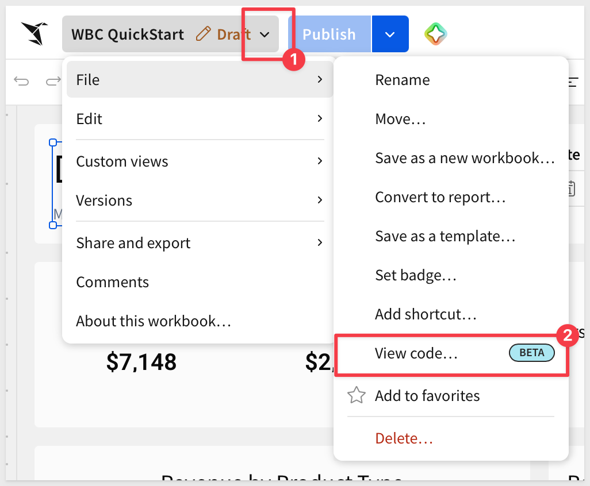

The panel shows the workbook's elements as YAML, matching `contents.elements`, followed by a labeled `Layout` section with the same grid-placement XML covered above. Both match the live workbook exactly - this isn't a simplified summary, it's the actual code representation.

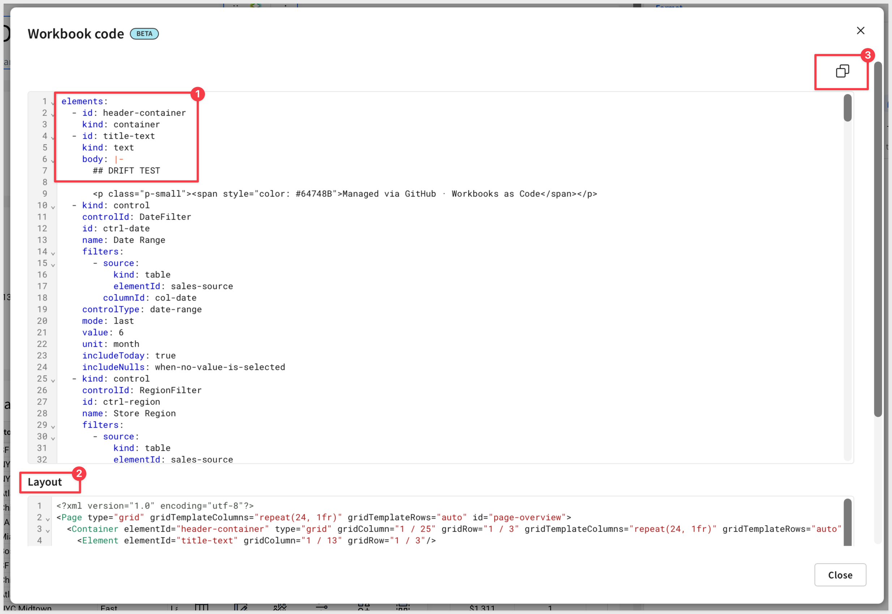

Use the copy icon in the top corner to copy the code to your clipboard.

<aside class="positive">
<strong>WHY IT MATTERS:</strong><br> This turns any existing workbook - including ones built entirely by hand in the UI, long before this workbook was ever managed as code - into a starting point for a `workbook.yaml`. Instead of hand-authoring a spec from scratch for a complex dashboard, copy its real elements and layout directly, then bring the result under git and CI/CD from there. It's also a fast way to learn the spec format for an element kind or control this QuickStart doesn't cover - build it once in the UI, then read back exactly how Sigma represents it as code.
</aside>


<!-- END OF SECTION-->

## Make a Change: Validate, Merge, and Deploy
Duration: 15

With the pipeline live, `main` is protected from here on. Every real change - the kind of thing worth a second set of eyes - goes through a feature branch and a pull request instead of a direct push.

### Create a Branch

```copy-code
git checkout -b add-margin-kpi
```

### Set Up YAML Linting in Your Editor (optional)

You're about to hand-edit `workbook.yaml` for the first time - adding a whole new element, not just swapping a placeholder value. A property nested one level too shallow, silently becoming a sibling of the block it was meant to belong to, still produces perfectly valid YAML - just not the structure you meant. Nothing throws a syntax error; the API just rejects the resulting spec once you push, with an error that can be hard to trace back to a mis-nested property.

If you're using VS Code, install these two extensions before you start editing:

- **YAML** (`redhat.vscode-yaml`) - catches genuine YAML syntax errors live (the kind that fail to parse at all), with the exact line highlighted
- **Indent Rainbow** (`oderwat.indent-rainbow`) - colors each indentation level, so a property nested one level too shallow or too deep is visually obvious at a glance

<aside class="negative">
<strong>IMPORTANT:</strong><br> Neither extension catches a property nested at the wrong depth as an "error" - that's still valid YAML, just not the structure you intended, so there's no syntax error to flag. Indent Rainbow only helps you spot it <em>by eye</em>, via mismatched colors - it's a visual aid, not a validator. Double-checking indentation against a working example (like the KPI elements already in this file) before you push is still worth doing.
</aside>

<aside class="positive">
<strong>TIP:</strong><br> Using a different editor? Most modern editors have an equivalent YAML-aware linting plugin - the goal is the same either way: catch genuine syntax errors before you commit. Wrong-depth nesting mistakes still require a careful eye (or Indent Rainbow's visual cue) either way.
</aside>

<aside class="positive">
<strong>TIP:</strong><br> Editing <code>workbook.yaml</code> with an AI coding assistant instead (Claude Code, Cursor, Codex, Snowflake Cortex)? Sigma publishes an official <a href="https://help.sigmacomputing.com/docs/install-skills-for-ai-assistants">agent skills</a> package, including a <code>sigma-workbooks</code> skill that gives the assistant schema-aware guidance for exactly this kind of edit - on top of, not instead of, the git/CI workflow this QuickStart covers.
</aside>

### Add a Gross Margin KPI

Open `workbook.yaml` and search for the last KPI in the workbook (`Total Units Sold`).

Add a new KPI element to `contents.elements`, right before the `- id: chart-by-product` line:


```copy-code
    - id: kpi-margin
      kind: kpi-chart
      source:
        elementId: sales-source
        kind: table
      columns:
        - id: km-val
          formula: Sum([Sales Data/Profit]) / Sum([Sales Data/Revenue])
          name: Margin
          format:
            kind: number
            formatString: 0.0%
        - id: km-month
          formula: DateTrunc("month", [Sales Data/Date])
          name: Month
      value:
        columnId: km-val
        fontSize: 20
      name:
        text: Gross Margin
        fontSize: 16
      layout:
        anchor: center
        verticalAnchor: top
      comparison:
        colorGood: '#16a34a'
        colorBad: '#dc2626'
      trend:
        visibility: hidden
        shape: line
      timeline:
        columnId: km-month
      periodComparison: month
```


Then add its placement inside `kpi-inner-row`, the nested `Container` holding the four existing KPIs, right after `kpi-units` - a new element always needs one, per the rule from the last section:

```copy-code
          <Element elementId="kpi-margin" gridColumn="11 / 13" gridRow="1 / 5"/>
```


<aside class="positive">
<strong>NOTE:</strong><br> <code>kpi-inner-row</code> already reserves a fifth slot (<code>11 / 13</code> of its own 12-column sub-grid) - Gross Margin drops directly into it, rather than landing in its own row somewhere else on the page.
</aside>

`Save` the changes.

### Commit and Push the Branch

```copy-code
git add workbook.yaml
git commit -m "Add gross margin KPI"
git push -u origin add-margin-kpi
```

### Open a Pull Request

```copy-code
gh pr create --title "Add gross margin KPI" --body "Adds a Gross Margin % KPI card to the Sales Overview page."
```

No `gh` CLI? Open your repository on GitHub - it'll show a banner offering to open a PR from your newly pushed branch.

### Watch CI Validate Automatically

Opening the PR triggers the **Validate Workbook Spec** workflow. Open the `Actions` tab, or check the PR page itself - GitHub shows the check running inline.

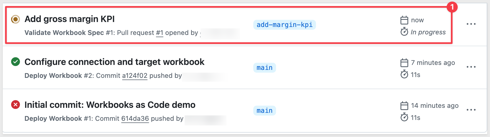

Once it finishes, the PR shows a green check: the spec compiles, every formula and element reference resolves, and the layout is valid.

<aside class="negative">
<strong>IF VALIDATION FAILS:</strong><br> The check turns red instead, and the workflow log shows the same kind of JSON error you'd get calling the API directly - invalid formula, bad element reference, missing layout placement. 
<br><br>
Fix the issue on the same branch and push again; validation reruns automatically on the updated commit. This is the whole point of running validation on every PR: a broken spec gets caught here, before it ever reaches the live workbook.
</aside>

### Merge and Watch It Deploy

With a green check, this change has been reviewed (by CI, and by anyone else on your team) - it's ready to merge.

```copy-code
gh pr merge --merge
```

No `gh` CLI? Click `Merge pull request` on the PR page instead.

Merging pushes the change to `main` - and just like the very first push in "Configure and Deploy for the First Time," that triggers the **Deploy Workbook** workflow automatically. The difference this time: instead of a direct push to an unprotected branch, this deploy is the result of a change that went through a branch, a pull request, and an automated check - the full loop this QuickStart is about.

Open the `Actions` tab and watch **Deploy Workbook** run.

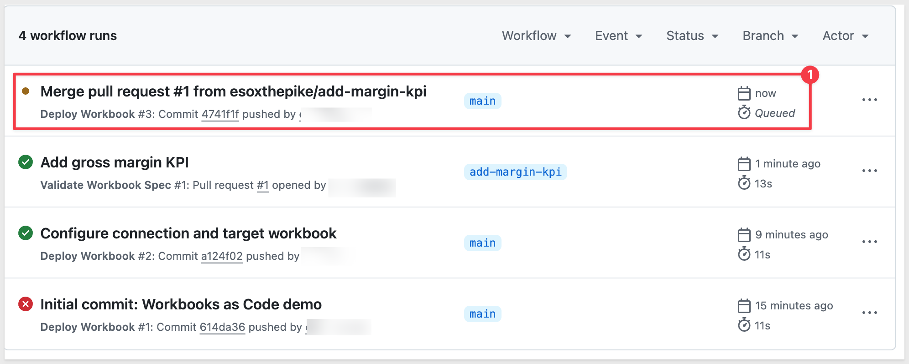

Once it finishes, open your target workbook - the Gross Margin KPI is now live, deployed with zero manual clicks in the Sigma UI.

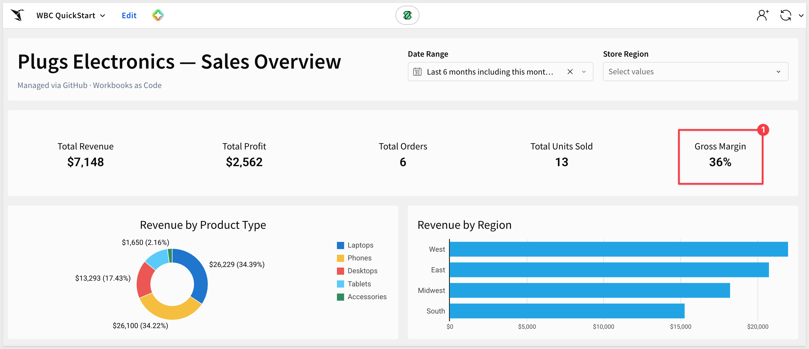


<!-- END OF SECTION-->

## Detect and Resolve Drift
Duration: 10

Sigma's own permissions control *who* can edit a workbook, but they say nothing about *how* - anyone with edit access can still change the live workbook directly in the UI, bypassing git and the review process entirely. 

`drift-check.yml` is the safety net for exactly that - it periodically compares the live workbook against `workbook.yaml`, and opens a pull request the moment they disagree.

<aside class="positive">
<strong>WHY IT MATTERS:</strong><br> Without a way to catch out-of-band edits, "the YAML is the source of truth" is a policy, not a guarantee - easy to state, easy to quietly violate. Drift detection makes it enforceable: a UI edit surfaces as a real, reviewable pull request on its own schedule, not months later when someone notices the dashboard no longer matches the repo.
</aside>

### Make a Change Directly in Sigma

Simulate the scenario this workflow exists for: open your target workbook in Sigma and change the dashboard title to `DRIFT TEST`, directly in the UI - no git, no pull request:

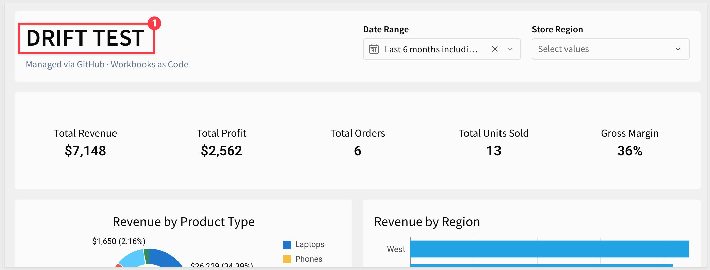

`Publish` the change.

### Allow GitHub Actions to Open Pull Requests

Every other pull request in this QuickStart was opened by you, from your own account. `drift-check.yml` is the first workflow that opens one itself, as `github-actions[bot]` - and GitHub blocks that by default, even with `pull-requests: write` declared in the workflow.

In your repository, go to `Settings` > `Actions` > `General`, scroll to **Workflow permissions**, and check **Allow GitHub Actions to create and approve pull requests**.

<aside class="negative">
<strong>IMPORTANT:</strong><br> Skip this and the drift-check workflow will detect drift and push a branch successfully, then fail at the very last step with <code>GitHub Actions is not permitted to create or approve pull requests</code>.
</aside>

### Trigger the Drift Check

`drift-check.yml` runs on a schedule (every 6 hours) so production doesn't depend on anyone remembering to run it - but for this QuickStart, its `workflow_dispatch` trigger lets you run it on demand instead of waiting:

```copy-code
gh workflow run drift-check.yml
```

<aside class="negative">
<strong>IMPORTANT:</strong><br> Triggering a workflow this way needs the <strong>Actions: Read and write</strong> permission on your token - distinct from the <strong>Contents</strong> and <strong>Workflows</strong> permissions covered earlier in this QuickStart, which only cover pushing code. 
<br><br>
If this fails with <code>403: Resource not accessible by personal access token</code>, add <strong>Actions: Read and write</strong> under <strong>Repository access</strong> for a fine-grained token (classic tokens need the <code>repo</code> scope).
</aside>

No `gh` CLI? Open the `Actions` tab, select `Drift Check` from the sidebar, and click `Run workflow`:

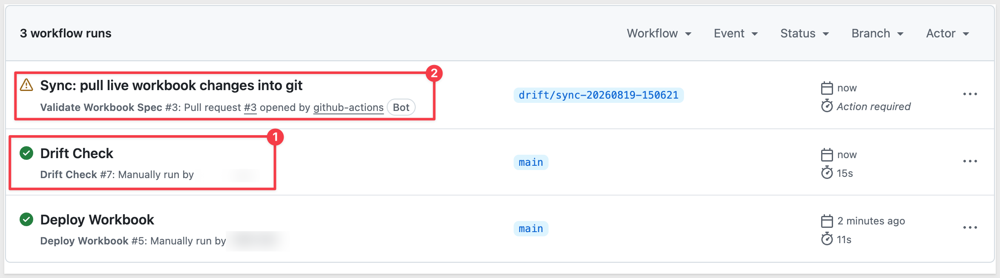

### Review the Drift PR

Check the `Pull requests` tab - a new PR titled `Sync: pull live workbook changes into git`, on a branch like `drift/sync-20260819-140502`, pulls the live spec's current state into `workbook.yaml`.

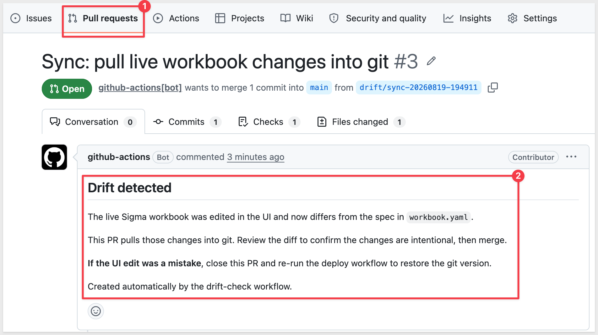

Open the `Files changed` tab to see exactly what changed - in this case, the retitled dashboard.

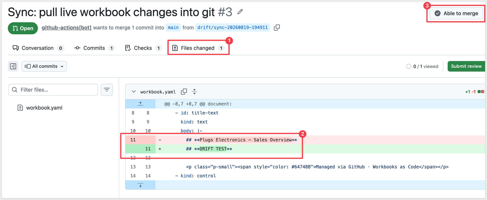

`Merge` the pull request.

Return to Sigma, refresh the `WBC QuickStart` workbook or if it was left open, place it in `Edit` mode. Sigma will prompt you to `Update to the latest version`:

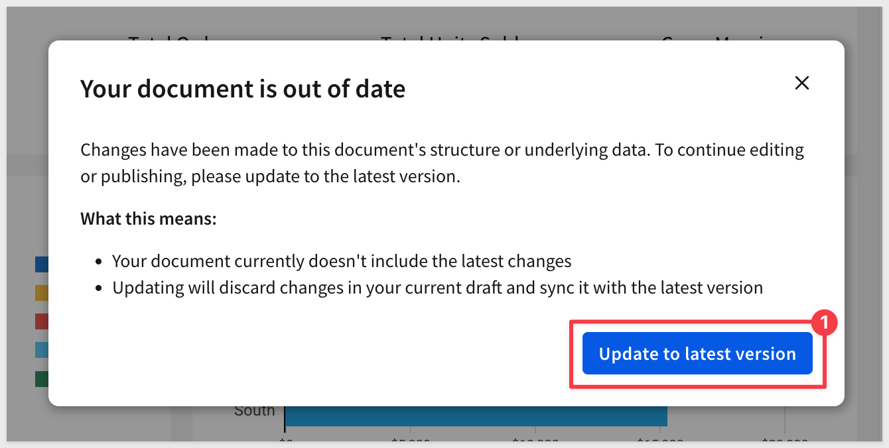

<aside class="negative">
<strong>IMPORTANT:</strong><br> This is expected, not a bug - any deploy through this pipeline invalidates whatever edit session was already open in a browser, whether that deploy came from merging a content change, a bootstrap push, or a drift PR like this one. 
<br><br>
If someone has the workbook open for live editing when a deploy lands, they'll see this same prompt, and updating discards any changes in their current draft that hadn't been published yet. 
<br><br>
There's no reconciliation between a git-driven deploy and an in-progress live edit - the deploy always wins. Worth knowing if your team plans to edit workbooks live in Sigma alongside managing them as code.
</aside>

### Automated Drift Checking

Everything up to this point was triggered by hand, for the sake of seeing it work - `drift-check.yml`'s real job is running unattended, on its 6-hour schedule, so nobody has to remember to check. 

The drift check only compares `contents` (elements, layout, pages) to decide whether drift exists, and only rewrites that same block when it pulls the live spec into a PR - the top-level `name`, `folderId`, and `description` in `workbook.yaml` stay exactly as you last committed them either way.

<aside class="positive">
<strong>NOTE:</strong><br> Comparison is JSON-structural, not a text diff - a reordered column list or a quoting style change won't trigger a false "drift detected" on its own. Still worth reading the diff before deciding: it tells you whether a change is genuinely meaningful, not just whether one exists.
</aside>

For example, after 6 hours, the schedule fires on its own and opens a PR without anyone triggering it:

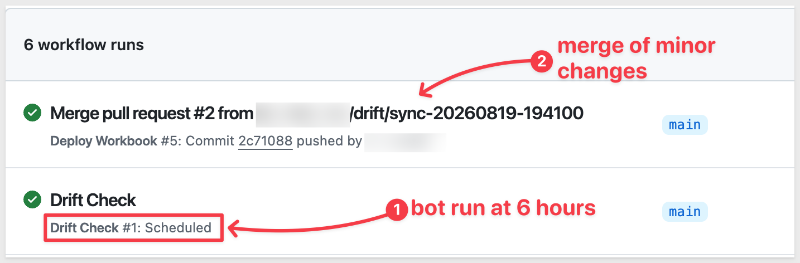

<aside class="positive">
<strong>NOTE:</strong><br> The workflow checks for an already-open drift PR before creating a new one, and skips entirely if the live spec matches git exactly - so running the check repeatedly, or on its normal 6-hour schedule, won't spam you with duplicate or empty PRs.
</aside>

<aside class="positive">
<strong>TIP:</strong><br> To pause the scheduled check without deleting the workflow file, run:
<br><br>
gh workflow disable drift-check.yml
<br><br>
This turns off both the cron schedule and manual `workflow_dispatch` runs. Re-enable it later with `gh workflow enable drift-check.yml`.
</aside>

Whenever a drift PR shows up for real - whether triggered manually like earlier in this section, or automatically on the schedule - you have two options, and both are legitimate:

- **Keep the change:** merge the PR. The UI edit is now reflected in `workbook.yaml`, reviewed like any other change.
- **Revert the change:** close the PR without merging, then re-run the deploy workflow (`gh workflow run deploy.yml`) - it pushes git's version back over the live workbook, undoing the UI edit.

<aside class="negative">
<strong>IMPORTANT:</strong><br> Until one of those two things happens, git and the live workbook stay out of sync - closing the drift PR alone doesn't undo anything in Sigma. The PR is a notification and a review point, not an automatic fix.
</aside>


<!-- END OF SECTION-->

## What we've covered
Duration: 5

We built a complete CI/CD pipeline for a Sigma workbook: a single YAML file defining every page, chart, KPI, and layout coordinate, managed through the same git workflow as any other piece of application code. A pull request validates a proposed change before anyone sees it live. A merge deploys it automatically. A scheduled check catches anyone who edits the live workbook directly, and gives you a reviewable path back to consistency instead of a silent, permanent fork between what's in git and what's actually running.

None of this is specific to the Plugs Electronics demo. The same pattern - spec in git, validate on PR, deploy on merge, detect drift on a schedule - applies to any workbook your team wants to manage this way, and the YAML structure itself (pages, elements, cross-element formulas, grid layout) carries over directly to workbooks you build from scratch.

If you're also managing the underlying data models as code, the companion [Data Models as Code](https://quickstarts.sigmacomputing.com/guide/developers_data_models_as_code/index.html?index=..%2F..index#0) QuickStart covers the same pattern applied to data models via JSON specs - together, they cover both halves of a fully version-controlled Sigma deployment.

**Additional Resource Links**

[Blog](https://www.sigmacomputing.com/blog/)<br>
[Community](https://community.sigmacomputing.com/)<br>
[Help Center](https://help.sigmacomputing.com/hc/en-us)<br>
[QuickStarts](https://quickstarts.sigmacomputing.com/)<br>
[Sigma REST API Reference](https://help.sigmacomputing.com/reference/get-started-sigma-api)<br>

Be sure to check out all the latest developments at [Sigma's First Friday Feature page!](https://quickstarts.sigmacomputing.com/firstfridayfeatures/)
<br>

[](https://twitter.com/sigmacomputing)&emsp;
[](https://www.linkedin.com/company/sigmacomputing)&emsp;
[](https://www.facebook.com/sigmacomputing)


<!-- END OF WHAT WE COVERED -->
<!-- END OF QUICKSTART -->
